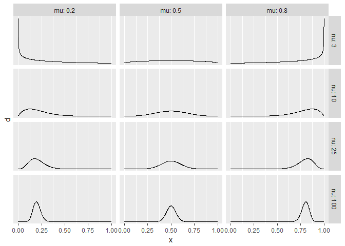
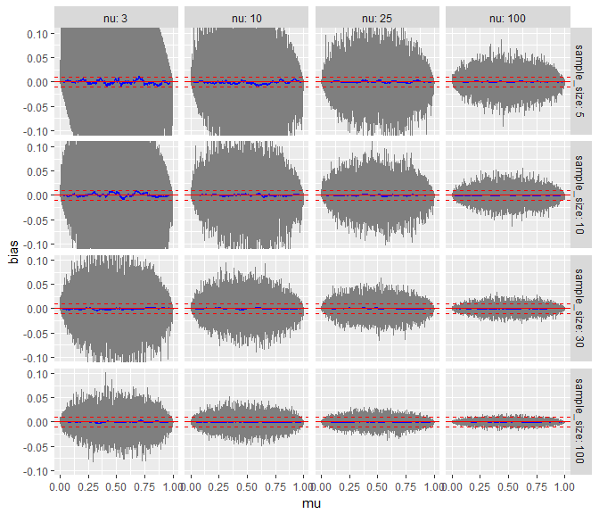
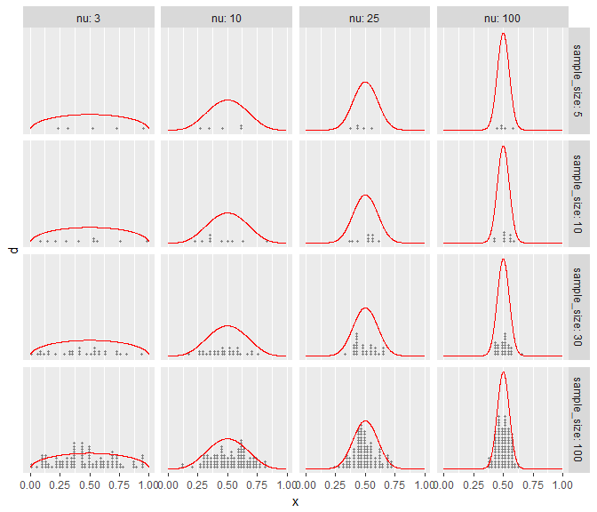
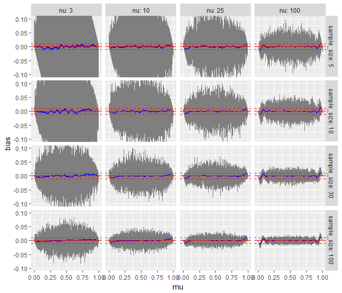
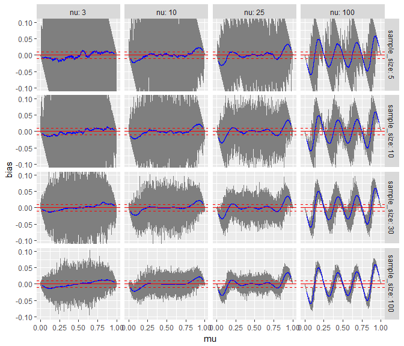
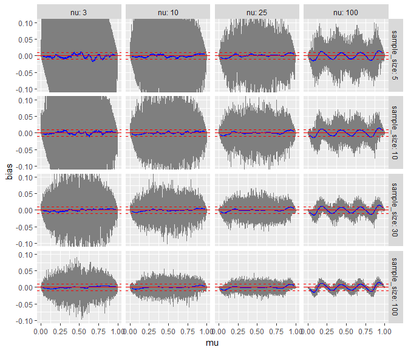
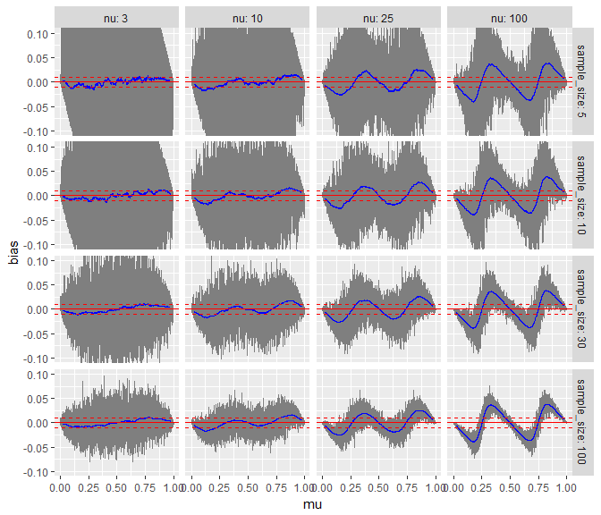

Bias due to rounding in visual analog scales
================

This document explores the potential bias induced by people rounding their responses in visual analog scales (and other numerical response scales).

Libraries needed for this anlaysis
==================================

``` r
library(tidyverse)
import::from(forecast, ma)
import::from(plyr, round_any)
```

Introduction
============

For the purposes of this analysis, we are going to assume a model where people's responses come from a latent Beta distribution with some rounding applied on top of it. We will use a mean and precision (proportional to inverse of variance) parameterization of the Beta distribution. The basic idea is:

1.  Generate possible responses as if they came from a Beta distribution with various means, precisions, and sample sizes (i.e. number of samples in some hypothetical experiment, not the [parameter of the same name](https://en.wikipedia.org/wiki/Beta_distribution#Mean_and_sample_size) from the mean-and-sample-size parameterization of Beta; we are calling that parameter *precision* here).
2.  Apply some rounding function
3.  See how bias in estimates is affected according to mean, precision, or sample size of the experiment.

Space of Beta distributions to test
-----------------------------------

First, we'll construct a mean-and-precision (sometimes called [mean-and-sample-size](https://en.wikipedia.org/wiki/Beta_distribution#Mean_and_sample_size)) parameterization of the Beta distribution, where mean is *μ* and precision is *ν*.

``` r
make_mp = function(f) function(x, mu, nu, ...) {
  alpha = mu * nu
  beta = (1 - mu) * nu
  f(x, alpha, beta, ...)
}
dbetamp = make_mp(dbeta)
rbetamp = make_mp(rbeta)
```

Here are a couple of example distributions from the above parameterization:

``` r
expand.grid(
  mu = c(.2, .5, .8),
  nu = c(3, 10, 25, 100)
) %>%
  group_by(mu, nu) %>%
  do(data_frame(x = ppoints(1001), d = dbetamp(x, .$mu, .$nu))) %>%
  ggplot(aes(x = x, y = d)) +
  geom_line() + 
  facet_grid(nu ~ mu, labeller = label_both) +
  scale_y_continuous(breaks=NULL)
```



Bias by mean in unrounded samples
=================================

First, let's see what happens if we take the mean of a sample from this distribution without rounding. This should be unbiased no matter the mean (mu), precision (nu), or sample size. First, we'll make a grid over mean, precision and sample size to calculate bias over:

``` r
grid = expand.grid(
  mu = ppoints(10000),  # ppoints(k) -> k evenly spaced points between 0 and 1, excluding 0 and 1
  nu = c(3, 10, 25, 100),
  sample_size = c(5, 10, 30, 100)
) %>%
  group_by(mu, nu, sample_size)
grid
```

    ## Source: local data frame [160,000 x 3]
    ## Groups: mu, nu, sample_size [160,000]
    ## 
    ##         mu    nu sample_size
    ##      <dbl> <dbl>       <dbl>
    ## 1  0.00005     3           5
    ## 2  0.00015     3           5
    ## 3  0.00025     3           5
    ## 4  0.00035     3           5
    ## 5  0.00045     3           5
    ## 6  0.00055     3           5
    ## 7  0.00065     3           5
    ## 8  0.00075     3           5
    ## 9  0.00085     3           5
    ## 10 0.00095     3           5
    ## # ... with 159,990 more rows

For every row in the above table, we'll generate a sample of size `sample_size` from the distribution Beta(*μ*, *ν*). Then we'll calculate the `bias` as the difference between the sample mean and the true mean (*μ*):

``` r
plot_biases = function(grid, rf) {
  grid %>%
    summarise(
      bias = mean(rf(sample_size, mu, nu)) - mu
    ) %>%
    group_by(nu, sample_size) %>%
    mutate(bias_ma = ma(bias, 500)) %>%
    ggplot(aes(x = mu, y = bias)) +
    geom_line(color="gray50") +
    geom_line(aes(y = bias_ma), color="blue") +
    geom_hline(yintercept = 0, color="red") +
    geom_hline(yintercept = c(.01, -.01), color="red", linetype="dashed") +
    facet_grid(sample_size ~ nu, labeller = label_both) +
    coord_cartesian(ylim = c(-.10, .10))
}

plot_biases(grid, rbetamp)
```

    ## Warning: Removed 500 rows containing missing values (geom_path).



Each cell above shows the bias of the sample (y axis, dark gray) plotted against the mean of the distribution the sample was drawn from (*μ*, x axis). The precision (*ν*) of the distributions is varied across columns, increasing to the right. The size of the samples varies across rows, increasing towards the bottom. A moving average of the bias is shown in blue. The solid red line marks a bias of 0, and the dashed red lines mark a bias of +-1 percentage point. As expected, without rounding the mean is unbiased.

For reference, here is what the distribution (at `mu = 0.5`) and a single sample from each cell in the above plot looks like:

``` r
example_grid = grid %>%
  ungroup() %>%
  select(nu, sample_size) %>%
  unique() %>%
  mutate(mu = 0.5) %>%
  group_by(mu, nu, sample_size)

example_samples = example_grid %>%
  do(data_frame(x = rbetamp(.$sample_size, .$mu, .$nu)))
  
example_grid %>%
  do(data_frame(x = ppoints(1001), d = dbetamp(x, .$mu, .$nu))) %>%
  ggplot(aes(x = x, y = d)) +
  geom_dotplot(aes(y = 0), data = example_samples, color = NA, fill = "gray50", binwidth=.025) +
  geom_line(color = "red") + 
  facet_grid(sample_size ~ nu, labeller = label_both) +
  scale_y_continuous(breaks=NULL)
```



Bias with rounding
==================

To the nearest 10
-----------------

``` r
plot_biases(grid, rf = function(...) round_any(rbetamp(...), .10))
```

    ## Warning: Removed 500 rows containing missing values (geom_path).



Rounding to the nearest 10 incurs a small bias close to the edges of the scale, particularly in less-noisy samples.

To the nearest 25
-----------------

``` r
plot_biases(grid, rf = function(...) round_any(rbetamp(...), .25))
```

    ## Warning: Removed 500 rows containing missing values (geom_path).



Rounding to the nearest 25 generates an interesting pattern of cyclical bias. However, this is not really what people do (in fact none of these examples so far are). Instead, it's something closer to probabilistic rounding: sometimes people round, but not always. Let's see what happens if we use a probabilistic rounding model.

Bias with probabilistic rounding
================================

To the nearest 25
-----------------

Let's round to the nearest 25, with probability .25:

``` r
probabilistic_rounded_rbetamp <- function(n, mu, nu, round_to = .01, p_round = 0.5) {
  x = rbetamp(n, mu, nu)
  rounded_x = round_any(x, round_to)
  ifelse(rbinom(n, 1, p_round), rounded_x, x)
}

plot_biases(grid, rf = function(...) probabilistic_rounded_rbetamp(..., round_to = .25, p_round = .25))
```

    ## Warning: Removed 500 rows containing missing values (geom_path).



To the nearest 50
-----------------

``` r
plot_biases(grid, rf = function(...) probabilistic_rounded_rbetamp(..., round_to = .5, p_round = .25))
```

    ## Warning: Removed 500 rows containing missing values (geom_path).


