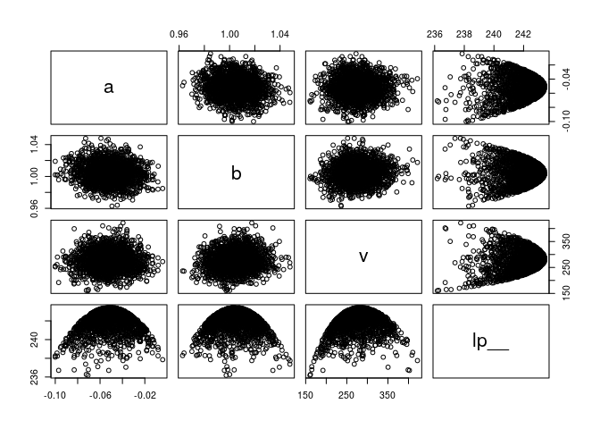
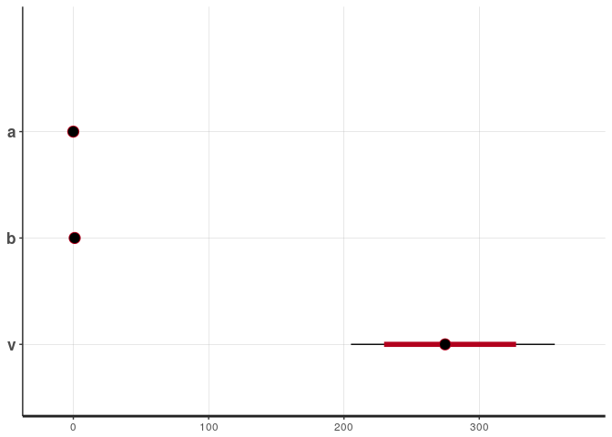
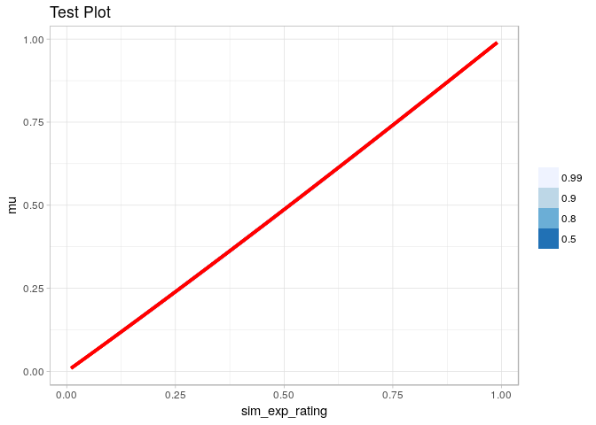

First try in fitting a model
================

-   [Let's load the libraries](#lets-load-the-libraries)
-   [Let's create and normalize the dataframe](#lets-create-and-normalize-the-dataframe)
-   [Convert the data to the format stan needs](#convert-the-data-to-the-format-stan-needs)
-   [Fit the model](#fit-the-model)
-   [Simulate expected\_ratings](#simulate-expected_ratings)
-   [Calculate mu and merge](#calculate-mu-and-merge)
-   [Try plotting](#try-plotting)

Let's load the libraries
------------------------

``` r
library(tidyverse)
```

    ## ── Attaching packages ─────────────────────────────────────── tidyverse 1.2.1 ──

    ## ✔ ggplot2 2.2.1     ✔ purrr   0.2.4
    ## ✔ tibble  1.4.2     ✔ dplyr   0.7.4
    ## ✔ tidyr   0.8.0     ✔ stringr 1.2.0
    ## ✔ readr   1.1.1     ✔ forcats 0.2.0

    ## ── Conflicts ────────────────────────────────────────── tidyverse_conflicts() ──
    ## ✖ dplyr::filter() masks stats::filter()
    ## ✖ dplyr::lag()    masks stats::lag()

``` r
library(magrittr)
```

    ## 
    ## Attaching package: 'magrittr'

    ## The following object is masked from 'package:purrr':
    ## 
    ##     set_names

    ## The following object is masked from 'package:tidyr':
    ## 
    ##     extract

``` r
library(ggplot2)
library(rstan)
```

    ## Loading required package: StanHeaders

    ## rstan (Version 2.17.3, GitRev: 2e1f913d3ca3)

    ## For execution on a local, multicore CPU with excess RAM we recommend calling
    ## options(mc.cores = parallel::detectCores()).
    ## To avoid recompilation of unchanged Stan programs, we recommend calling
    ## rstan_options(auto_write = TRUE)

    ## 
    ## Attaching package: 'rstan'

    ## The following object is masked from 'package:magrittr':
    ## 
    ##     extract

    ## The following object is masked from 'package:tidyr':
    ## 
    ##     extract

``` r
library(modelr)
library(rlang)
```

    ## 
    ## Attaching package: 'rlang'

    ## The following object is masked from 'package:magrittr':
    ## 
    ##     set_names

    ## The following objects are masked from 'package:purrr':
    ## 
    ##     %@%, %||%, as_function, flatten, flatten_chr, flatten_dbl,
    ##     flatten_int, flatten_lgl, invoke, list_along, modify, prepend,
    ##     rep_along, splice

``` r
library(GGally)
```

    ## 
    ## Attaching package: 'GGally'

    ## The following object is masked from 'package:dplyr':
    ## 
    ##     nasa

``` r
library(tidybayes)            # install from github
library(tidybayes.rethinking) # install from github
library(gganimate)            # install from github
library(rethinking)
```

    ## Loading required package: parallel

    ## rethinking (Version 1.59)

    ## 
    ## Attaching package: 'rethinking'

    ## The following object is masked from 'package:modelr':
    ## 
    ##     resample

    ## The following object is masked from 'package:purrr':
    ## 
    ##     map

``` r
theme_set(theme_light())
options(mc.cores = parallel::detectCores())
rstan_options(auto_write = TRUE)
```

Let's create and normalize the dataframe
----------------------------------------

``` r
d = read.csv('SliderBias-PctStudy.tsv', sep='\t') %>%
  mutate(expected_rating = expected_rating/100, rating = rating/100) %>% 
  filter(expected_rating!=0.0 & expected_rating!=1.0 & rating!=0.0 & rating!=1.0) %>% 
  sample_n(100)
```

Convert the data to the format stan needs
-----------------------------------------

``` r
standata = list(
  rating=d$rating,
  expected_rating=d$expected_rating,
  N=nrow(d)
)
```

Fit the model
-------------

``` r
fit <- stan(file = 'vas-model.stan', data = standata, 
            iter = 1000, chains = 4)
```

``` r
y <- as.data.frame(fit) 
```

``` r
pairs(y)
```



``` r
show(fit)
```

    ## Inference for Stan model: vas-model.
    ## 4 chains, each with iter=1000; warmup=500; thin=1; 
    ## post-warmup draws per chain=500, total post-warmup draws=2000.
    ## 
    ##        mean se_mean    sd   2.5%    25%    50%    75%  97.5% n_eff Rhat
    ## a     -0.05    0.00  0.02  -0.08  -0.06  -0.05  -0.04  -0.02  1823    1
    ## b      1.00    0.00  0.01   0.98   1.00   1.00   1.01   1.03  2000    1
    ## v    276.81    0.98 38.31 205.22 250.86 274.70 301.79 355.73  1516    1
    ## lp__ 241.97    0.04  1.18 238.89 241.39 242.28 242.84 243.33  1039    1
    ## 
    ## Samples were drawn using NUTS(diag_e) at Tue Mar  6 12:24:11 2018.
    ## For each parameter, n_eff is a crude measure of effective sample size,
    ## and Rhat is the potential scale reduction factor on split chains (at 
    ## convergence, Rhat=1).

``` r
plot(fit)
```

    ## ci_level: 0.8 (80% intervals)

    ## outer_level: 0.95 (95% intervals)



Simulate expected\_ratings
--------------------------

``` r
sim_df <-  seq(from=0, to=1, length.out=100) %>% 
    as.data.frame() %>% 
      subset(. != 0 & . != 1 ) %>% 
        plyr::rename(c("."="sim_exp_rating"))
```

Calculate mu and merge
----------------------

``` r
merge(y, sim_df, all = TRUE) %>% 
 mutate(mu  = inv_logit(a + b * logit(sim_exp_rating)))
```

    ##                   a         b        v     lp__ sim_exp_rating          mu
    ## 1      -0.049825269 1.0240882 246.1109 241.7373     0.01010101 0.008618089
    ## 2      -0.050352012 1.0294500 250.2900 241.1540     0.01010101 0.008406178
    ## 3      -0.057366872 0.9901857 291.0915 242.5848     0.01010101 0.009978081
    ## 4      -0.069498688 1.0088845 258.8334 242.5350     0.01010101 0.009056264
    ## 5      -0.032254200 0.9973526 297.2209 242.4106     0.01010101 0.009901841
    ## 6      -0.067045747 1.0075000 262.8895 242.7795     0.01010101 0.009135584
    ## 7      -0.070215691 1.0092012 256.3144 242.4366     0.01010101 0.009036819
    ## 8      -0.033646077 0.9991638 308.6953 242.4091     0.01010101 0.009807230
    ## 9      -0.046254193 1.0079926 267.6972 243.2466     0.01010101 0.009304885
    ## 10     -0.049972333 1.0052860 334.6364 242.6804     0.01010101 0.009385347
    ## 11     -0.054315621 1.0067003 297.1598 243.3480     0.01010101 0.009285212
    ## 12     -0.057210787 1.0281139 284.8732 241.6869     0.01010101 0.008400071
    ## 13     -0.060406009 1.0296492 280.6431 241.4125     0.01010101 0.008315250
    ## 14     -0.039593206 0.9795191 312.4709 240.6570     0.01010101 0.010658766
    ## 15     -0.029783543 1.0052994 269.0885 242.3595     0.01010101 0.009574338
    ## 16     -0.044881767 1.0098414 375.9832 241.0037     0.01010101 0.009239623
    ## 17     -0.052638058 1.0011000 222.0108 242.0764     0.01010101 0.009540255
    ## 18     -0.053100134 1.0197700 291.8403 242.6823     0.01010101 0.008760420
    ## 19     -0.030892272 0.9777190 260.3766 240.6816     0.01010101 0.010839045
    ## 20     -0.017386572 1.0126676 242.6221 240.2332     0.01010101 0.009373654
    ## 21     -0.083081909 1.0036522 399.1076 236.7590     0.01010101 0.009150133
    ## 22     -0.034556799 1.0088769 296.5921 242.6138     0.01010101 0.009375604
    ## 23     -0.059409728 1.0080033 328.3556 242.6767     0.01010101 0.009183946
    ## 24     -0.024498988 0.9858165 234.3924 240.7364     0.01010101 0.010514440
    ## 25     -0.028542944 0.9791948 274.6709 240.6372     0.01010101 0.010791791
    ## 26     -0.042302117 0.9999318 275.6282 243.2130     0.01010101 0.009689682
    ## 27     -0.039455169 1.0282696 264.3571 241.1111     0.01010101 0.008543217
    ## 28     -0.045893539 0.9934386 258.2635 242.9152     0.01010101 0.009944146
    ## 29     -0.038614336 0.9941003 273.2469 242.8264     0.01010101 0.009986032
    ## 30     -0.062891865 1.0197529 276.3869 242.4953     0.01010101 0.008676472
    ## 31     -0.047334483 1.0086360 268.8863 243.2633     0.01010101 0.009267806
    ## 32     -0.044795247 1.0112248 395.2420 240.0382     0.01010101 0.009182526
    ## 33     -0.065151352 0.9981027 189.3973 239.5721     0.01010101 0.009551877
    ## 34     -0.057594140 1.0043579 257.0446 243.1369     0.01010101 0.009354102
    ## 35     -0.060927026 1.0087614 279.9752 243.1946     0.01010101 0.009138618
    ## 36     -0.063397509 1.0186363 297.7554 242.5092     0.01010101 0.008716251
    ## 37     -0.042544831 0.9916579 217.2806 241.5093     0.01010101 0.010058140
    ## 38     -0.043471007 1.0017842 256.7784 243.0886     0.01010101 0.009597404
    ## 39     -0.065573457 1.0005921 299.5205 242.7676     0.01010101 0.009440550
    ## 40     -0.056593897 1.0115926 286.6510 243.2331     0.01010101 0.009060643
    ## 41     -0.037594190 1.0187229 250.6052 241.9240     0.01010101 0.008938527
    ## 42     -0.053825098 0.9856389 311.2539 241.7886     0.01010101 0.010221907
    ## 43     -0.050247070 0.9861710 306.4712 242.0315     0.01010101 0.010233435
    ## 44     -0.061163532 1.0101389 220.2709 241.6832     0.01010101 0.009079478
    ## 45     -0.045868096 0.9903354 239.9330 242.3592     0.01010101 0.010085460
    ## 46     -0.060631351 1.0153413 253.0280 242.6137     0.01010101 0.008872046
    ## 47     -0.041802950 1.0251560 338.7002 240.8033     0.01010101 0.008644845
    ## 48     -0.068488824 1.0002760 299.2491 242.5298     0.01010101 0.009426848
    ## 49     -0.057256029 0.9890827 276.6585 242.5754     0.01010101 0.010029263
    ## 50     -0.051357672 1.0194123 283.1853 242.7267     0.01010101 0.008789842
    ## 51     -0.056517220 1.0059957 294.2354 243.3361     0.01010101 0.009294680
    ## 52     -0.059331712 1.0000632 276.9888 243.2139     0.01010101 0.009521942
    ## 53     -0.037639073 1.0033658 278.4569 243.0217     0.01010101 0.009583916
    ## 54     -0.061301352 1.0130934 330.7278 242.3868     0.01010101 0.008957186
    ## 55     -0.054237052 1.0144511 250.8668 242.7361     0.01010101 0.008964640
    ## 56     -0.063604226 0.9841707 268.8183 241.6963     0.01010101 0.010191123
    ## 57     -0.016641427 1.0053643 286.1964 240.6624     0.01010101 0.009696906
    ## 58     -0.070344580 1.0133235 336.5957 241.5736     0.01010101 0.008867987
    ## 59     -0.057265702 1.0147820 364.4245 241.3396     0.01010101 0.008924344
    ## 60     -0.063165066 1.0051667 312.0810 242.8417     0.01010101 0.009268502
    ## 61     -0.018210596 1.0039567 288.9800 240.9023     0.01010101 0.009743925
    ## 62     -0.068828511 1.0221753 250.5887 241.6543     0.01010101 0.008531100
    ## 63     -0.063257219 0.9934142 301.3909 242.4451     0.01010101 0.009775726
    ## 64     -0.058363109 1.0186398 268.3897 242.6743     0.01010101 0.008759714
    ## 65     -0.040873291 0.9853782 312.6029 241.6319     0.01010101 0.010366035
    ## 66     -0.040410471 0.9980174 308.1306 242.8291     0.01010101 0.009792597
    ## 67     -0.052623947 1.0003556 256.1021 243.1692     0.01010101 0.009572693
    ## 68     -0.069607219 0.9969839 299.3234 242.2476     0.01010101 0.009558256
    ## 69     -0.073348757 0.9912432 280.0806 241.6128     0.01010101 0.009774396
    ## 70     -0.035595758 0.9920689 270.4925 242.5306     0.01010101 0.010108693
    ## 71     -0.041108272 0.9953863 269.9630 242.9907     0.01010101 0.009903421
    ## 72     -0.032411479 1.0067857 264.0081 242.5109     0.01010101 0.009485211
    ## 73     -0.067787345 0.9975421 316.9745 242.1052     0.01010101 0.009551258
    ## 74     -0.043269632 0.9847993 197.8124 239.9861     0.01010101 0.010368685
    ## 75     -0.047170238 0.9857530 210.2953 240.8674     0.01010101 0.010284134
    ## 76     -0.023838071 1.0018669 356.7579 239.8095     0.01010101 0.009782155
    ## 77     -0.067656069 1.0084931 226.7359 241.7550     0.01010101 0.009088962
    ## 78     -0.052605712 1.0040833 270.6593 243.3890     0.01010101 0.009412170
    ## 79     -0.040767487 1.0134074 252.4686 242.5557     0.01010101 0.009128284
    ## 80     -0.052709563 0.9974891 288.2292 243.2591     0.01010101 0.009697287
    ## 81     -0.079409670 1.0211911 247.8551 240.8432     0.01010101 0.008479926
    ## 82     -0.031189878 0.9828299 290.7375 241.1573     0.01010101 0.010587545
    ## 83     -0.052662699 1.0147814 251.2233 242.7276     0.01010101 0.008965173
    ## 84     -0.048549124 1.0010582 292.2738 243.3581     0.01010101 0.009580788
    ## 85     -0.050966123 1.0146803 306.4266 242.9543     0.01010101 0.008984386
    ## 86     -0.055284200 1.0037938 230.4371 242.4220     0.01010101 0.009399583
    ## 87     -0.021401040 1.0010376 213.9723 240.1445     0.01010101 0.009842778
    ## 88     -0.050133887 0.9918851 261.8532 242.8904     0.01010101 0.009972567
    ## 89     -0.037540575 0.9916848 260.0847 242.5501     0.01010101 0.010106852
    ## 90     -0.044598550 0.9638759 235.6825 238.5613     0.01010101 0.011385789
    ## 91     -0.047642101 0.9780565 278.5639 241.2593     0.01010101 0.010644617
    ## 92     -0.041686233 0.9987734 289.2375 243.1370     0.01010101 0.009746721
    ## 93     -0.058193463 1.0137073 327.0472 242.5638     0.01010101 0.008959788
    ## 94     -0.053998460 0.9967562 230.4745 242.3568     0.01010101 0.009717197
    ## 95     -0.038990866 1.0112382 306.1082 242.7216     0.01010101 0.009234925
    ## 96     -0.073680222 1.0011015 254.2005 242.0958     0.01010101 0.009343395
    ## 97     -0.059630226 0.9976857 257.9487 242.9641     0.01010101 0.009622454
    ## 98     -0.061309356 1.0175948 294.0757 242.7105     0.01010101 0.008775753
    ## 99     -0.037312882 0.9745782 257.7951 240.5541     0.01010101 0.010924936
    ## 100    -0.066778630 1.0361291 285.0639 240.0866     0.01010101 0.008022924
    ## 101    -0.069402818 1.0010302 261.4275 242.5528     0.01010101 0.009386111
    ## 102    -0.059869657 1.0337981 294.8535 240.6638     0.01010101 0.008164187
    ## 103    -0.050138970 1.0049270 343.3706 242.4215     0.01010101 0.009399110
    ## 104    -0.043773776 0.9991051 322.4971 242.7221     0.01010101 0.009711956
    ## 105    -0.047935198 1.0048051 316.5547 243.0778     0.01010101 0.009424870
    ## 106    -0.052636464 1.0010825 249.8688 243.0541     0.01010101 0.009541029
    ## 107    -0.061010434 1.0122842 306.7645 242.9121     0.01010101 0.008992774
    ## 108    -0.072353297 1.0082206 322.9442 241.8628     0.01010101 0.009057962
    ## 109    -0.067314409 0.9940794 242.3238 242.0769     0.01010101 0.009707168
    ## 110    -0.053064315 1.0101929 300.0612 243.2539     0.01010101 0.009150394
    ## 111    -0.050671916 0.9891756 256.0355 242.6133     0.01010101 0.010090593
    ## 112    -0.061535637 1.0115875 321.8754 242.6481     0.01010101 0.009016592
    ## 113    -0.048842366 1.0211658 291.1901 242.4927     0.01010101 0.008741841
    ## 114    -0.050739097 1.0079992 262.1832 243.2410     0.01010101 0.009263354
    ## 115    -0.050739097 1.0079992 262.1832 243.2410     0.01010101 0.009263354
    ## 116    -0.038170934 1.0049535 280.0805 243.0430     0.01010101 0.009510055
    ## 117    -0.053998392 1.0179112 238.5131 242.1353     0.01010101 0.008826875
    ## 118    -0.053947405 0.9818070 263.0541 241.8132     0.01010101 0.010399943
    ## 119    -0.032164137 1.0148527 270.5144 242.1211     0.01010101 0.009146181
    ## 120    -0.068523501 0.9991798 279.3887 242.6362     0.01010101 0.009473571
    ## 121    -0.030575535 1.0080823 268.8160 242.3509     0.01010101 0.009446681
    ## 122    -0.057077780 1.0279088 265.6610 241.6444     0.01010101 0.008409016
    ## 123    -0.053900274 0.9871412 322.0846 241.7077     0.01010101 0.010151698
    ## 124    -0.046865121 0.9758505 329.1990 239.4918     0.01010101 0.010759931
    ## 125    -0.051580121 1.0017315 275.3895 243.4049     0.01010101 0.009522906
    ## 126    -0.045987676 1.0189065 347.5041 241.5280     0.01010101 0.008857087
    ## 127    -0.040591800 0.9939189 360.5742 240.9622     0.01010101 0.009974710
    ## 128    -0.066824743 1.0191084 257.4964 242.1679     0.01010101 0.008668068
    ## 129    -0.059391885 1.0046194 284.9337 243.2916     0.01010101 0.009326371
    ## 130    -0.044445828 0.9975975 295.6380 243.1374     0.01010101 0.009772156
    ## 131    -0.059828012 1.0173488 250.7278 242.4475     0.01010101 0.008798479
    ## 132    -0.072982818 0.9982414 311.0613 241.7623     0.01010101 0.009472101
    ## 133    -0.082558782 1.0111171 278.2938 241.2582     0.01010101 0.008849568
    ## 134    -0.026453574 1.0021042 273.3455 242.0758     0.01010101 0.009746346
    ## 135    -0.053529978 1.0090608 314.8495 243.0835     0.01010101 0.009193331
    ## 136    -0.070225593 1.0137372 278.1416 242.4725     0.01010101 0.008852374
    ## 137    -0.047382637 1.0108559 304.1487 243.1320     0.01010101 0.009174376
    ## 138    -0.052371575 1.0072178 294.0571 243.3792     0.01010101 0.009281268
    ## 139    -0.043022015 0.9978815 251.1170 242.9079     0.01010101 0.009773333
    ## 140    -0.053050318 0.9976536 297.1553 243.1910     0.01010101 0.009686776
    ## 141    -0.054324764 0.9991343 327.2844 242.6859     0.01010101 0.009609731
    ## 142    -0.070638637 1.0085413 371.1168 240.3368     0.01010101 0.009060154
    ## 143    -0.052231923 1.0268746 191.7895 238.5557     0.01010101 0.008489339
    ## 144    -0.070554990 1.0194836 237.9061 241.4422     0.01010101 0.008621356
    ## 145    -0.063667924 0.9990443 214.6088 241.3937     0.01010101 0.009525105
    ## 146    -0.055866179 1.0018424 217.9314 241.8362     0.01010101 0.009477789
    ## 147    -0.048886036 0.9944014 271.8734 243.1200     0.01010101 0.009871486
    ## 148    -0.033736326 0.9878543 317.2836 241.3989     0.01010101 0.010322876
    ## 149    -0.049516619 1.0031895 238.2050 242.7349     0.01010101 0.009479417
    ## 150    -0.039660919 0.9923237 322.1813 242.1109     0.01010101 0.010056457
    ## 151    -0.038268821 0.9910502 320.2533 241.9678     0.01010101 0.010128704
    ## 152    -0.047483510 1.0127609 225.5814 241.9094     0.01010101 0.009094410
    ## 153    -0.049547212 1.0130351 277.7274 243.1710     0.01010101 0.009064533
    ## 154    -0.039667194 0.9972600 265.1257 242.9687     0.01010101 0.009833559
    ## 155    -0.067464611 1.0030946 315.3438 242.4365     0.01010101 0.009316383
    ## 156    -0.065783920 1.0114164 290.9926 242.8498     0.01010101 0.008985694
    ## 157    -0.049249301 0.9985315 294.0413 243.2728     0.01010101 0.009684626
    ## 158    -0.054044263 1.0065498 266.6766 243.3206     0.01010101 0.009294060
    ## 159    -0.050347463 1.0176408 326.3411 242.3606     0.01010101 0.008869766
    ## 160    -0.049656037 0.9984543 260.0706 243.1926     0.01010101 0.009684119
    ## 161    -0.054481579 1.0001119 316.1627 242.9831     0.01010101 0.009565678
    ## 162    -0.050755406 1.0113800 245.8246 242.7700     0.01010101 0.009122022
    ## 163    -0.055902814 0.9960614 320.5968 242.6255     0.01010101 0.009729537
    ## 164    -0.052036806 1.0134579 249.1093 242.7552     0.01010101 0.009024842
    ## 165    -0.042923517 1.0146843 364.5113 241.1321     0.01010101 0.009056112
    ## 166    -0.062062738 1.0013177 237.6454 242.4865     0.01010101 0.009442271
    ## 167    -0.008201697 0.9840054 286.9150 238.2653     0.01010101 0.010773493
    ## 168    -0.079882217 1.0139265 283.4463 241.4903     0.01010101 0.008760507
    ## 169    -0.077287773 1.0075728 244.2155 241.6066     0.01010101 0.009040348
    ## 170    -0.055881601 0.9836255 258.6052 241.9723     0.01010101 0.010294756
    ## 171    -0.027728423 1.0215010 309.2807 240.6945     0.01010101 0.008913124
    ## 172    -0.061328693 0.9963808 210.2868 241.1845     0.01010101 0.009663371
    ## 173    -0.057041264 0.9871311 211.4653 240.9268     0.01010101 0.010120650
    ## 174    -0.056316116 1.0098977 260.2289 243.1185     0.01010101 0.009133197
    ## 175    -0.065482253 1.0147561 309.3277 242.5195     0.01010101 0.008853003
    ## 176    -0.060784758 0.9996548 285.3927 243.1309     0.01010101 0.009525900
    ## 177    -0.037114287 1.0143110 257.5073 242.3890     0.01010101 0.009123853
    ## 178    -0.052323767 1.0081032 289.1675 243.3862     0.01010101 0.009244453
    ## 179    -0.043269094 0.9883636 271.7701 242.5773     0.01010101 0.010202334
    ## 180    -0.064597180 1.0266258 335.4315 240.8152     0.01010101 0.008395379
    ## 181    -0.078120964 1.0194373 295.6556 241.2696     0.01010101 0.008558729
    ## 182    -0.041702388 1.0266058 270.0097 241.5273     0.01010101 0.008588918
    ## 183    -0.043951110 1.0119821 241.8460 242.4883     0.01010101 0.009158644
    ## 184    -0.048526041 1.0133563 275.5115 243.1259     0.01010101 0.009060477
    ## 185    -0.067359599 1.0206303 309.0405 241.9626     0.01010101 0.008603749
    ## 186    -0.029079039 0.9925908 274.2921 242.0656     0.01010101 0.010150040
    ## 187    -0.066366834 1.0101136 264.5502 242.7864     0.01010101 0.009033821
    ## 188    -0.051272513 1.0196261 249.3558 242.2992     0.01010101 0.008782048
    ## 189    -0.058130141 1.0040171 269.1538 243.2798     0.01010101 0.009363618
    ## 190    -0.044026703 1.0240485 260.3072 241.8669     0.01010101 0.008669338
    ## 191    -0.090999468 1.0198112 293.5816 239.4122     0.01010101 0.008435786
    ## 192    -0.032844262 1.0055017 291.5267 242.6058     0.01010101 0.009536593
    ## 193    -0.048864894 1.0221589 254.6168 242.1314     0.01010101 0.008702276
    ## 194    -0.051471207 1.0209119 252.3845 242.2502     0.01010101 0.008729158
    ## 195    -0.037372009 1.0030871 253.1768 242.7546     0.01010101 0.009598592
    ## 196    -0.066425352 1.0068655 302.0512 242.7891     0.01010101 0.009167589
    ## 197    -0.060742285 0.9927619 203.2127 240.6409     0.01010101 0.009829168
    ## 198    -0.060646711 0.9949116 207.3601 240.9883     0.01010101 0.009734624
    ## 199    -0.041693874 0.9927111 178.4665 238.6705     0.01010101 0.010018608
    ## 200    -0.038191828 0.9934543 265.0555 242.7313     0.01010101 0.010019546
    ## 201    -0.053910839 1.0277102 289.8133 241.7390     0.01010101 0.008443082
    ## 202    -0.052311452 0.9830668 270.6194 242.0203     0.01010101 0.010357417
    ## 203    -0.042167503 1.0115556 282.8975 243.0450     0.01010101 0.009192639
    ## 204    -0.067354674 0.9993375 277.1730 242.7358     0.01010101 0.009477756
    ## 205    -0.045568240 1.0062503 306.1945 243.1844     0.01010101 0.009385187
    ## 206    -0.063855124 1.0017146 252.1617 242.7839     0.01010101 0.009408542
    ## 207    -0.043223524 1.0076952 310.9343 243.0048     0.01010101 0.009345477
    ## 208    -0.045089319 1.0070831 311.4150 243.0792     0.01010101 0.009354192
    ## 209    -0.045089319 1.0070831 311.4150 243.0792     0.01010101 0.009354192
    ## 210    -0.054492446 1.0132203 248.1569 242.7384     0.01010101 0.009012631
    ## 211    -0.045233789 1.0035266 335.4718 242.5511     0.01010101 0.009505154
    ## 212    -0.054313268 1.0075483 309.5825 243.1913     0.01010101 0.009249536
    ## 213    -0.076780159 1.0086202 273.1275 242.0033     0.01010101 0.009001952
    ## 214    -0.035839269 0.9978664 269.5549 242.8102     0.01010101 0.009843767
    ## 215    -0.057771114 1.0197644 222.9638 241.3077     0.01010101 0.008720174
    ## 216    -0.039700259 1.0011012 288.3600 243.1042     0.01010101 0.009663233
    ## 217    -0.052095649 1.0146264 337.1379 242.3302     0.01010101 0.008976531
    ## 218    -0.047737608 1.0091536 277.8608 243.3155     0.01010101 0.009242348
    ## 219    -0.047737608 1.0091536 277.8608 243.3155     0.01010101 0.009242348
    ## 220    -0.040858602 0.9888533 247.0294 242.3004     0.01010101 0.010204004
    ## 221    -0.072026953 0.9901145 231.4638 241.1536     0.01010101 0.009837476
    ## 222    -0.070072799 1.0297441 315.3714 240.5235     0.01010101 0.008232362
    ## 223    -0.039793826 0.9896299 256.5512 242.4706     0.01010101 0.010178824
    ## 224    -0.049350969 0.9627439 236.4514 238.2947     0.01010101 0.011390718
    ## 225    -0.041959717 1.0065525 244.9064 242.7216     0.01010101 0.009405878
    ## 226    -0.065337614 1.0021906 305.4941 242.7542     0.01010101 0.009374448
    ## 227    -0.054981220 1.0185794 269.4496 242.7374     0.01010101 0.008791545
    ## 228    -0.049565315 1.0110417 287.2948 243.2806     0.01010101 0.009146834
    ## 229    -0.045684747 1.0000770 272.3392 243.3023     0.01010101 0.009650909
    ## 230    -0.052643582 1.0019064 275.6686 243.4033     0.01010101 0.009505330
    ## 231    -0.041025242 0.9935381 245.6405 242.5636     0.01010101 0.009987679
    ## 232    -0.062288853 1.0152454 315.9769 242.5517     0.01010101 0.008861343
    ## 233    -0.038854075 1.0100229 317.8505 242.5667     0.01010101 0.009287306
    ## 234    -0.041077086 1.0065092 283.6328 243.1731     0.01010101 0.009415957
    ## 235    -0.053169395 1.0115672 324.7612 242.8040     0.01010101 0.009092493
    ## 236    -0.060462270 1.0151705 189.8645 239.3525     0.01010101 0.008880424
    ## 237    -0.085317801 0.9942292 202.7675 238.8199     0.01010101 0.009529138
    ## 238    -0.029427313 0.9868157 208.1824 240.1723     0.01010101 0.010415964
    ## 239    -0.024039626 0.9901142 240.7503 241.1276     0.01010101 0.010316085
    ## 240    -0.064527256 1.0106993 298.5121 242.8900     0.01010101 0.009026254
    ## 241    -0.060717490 1.0034467 289.4656 243.2119     0.01010101 0.009363877
    ## 242    -0.057328836 1.0082703 284.9970 243.3238     0.01010101 0.009191745
    ## 243    -0.036995864 0.9894372 295.4895 242.2510     0.01010101 0.010215985
    ## 244    -0.059731403 0.9868350 236.9114 241.8130     0.01010101 0.010107309
    ## 245    -0.039999305 1.0305708 295.4142 240.7436     0.01010101 0.008449748
    ## 246    -0.062510688 0.9818976 254.0066 241.4151     0.01010101 0.010307943
    ## 247    -0.066199554 0.9857347 291.1274 241.5197     0.01010101 0.010093077
    ## 248    -0.053706294 0.9764650 219.3215 240.2802     0.01010101 0.010657606
    ## 249    -0.025494488 1.0017443 294.6245 241.8384     0.01010101 0.009771560
    ## 250    -0.023123625 1.0151881 321.2160 240.4498     0.01010101 0.009214424
    ## 251    -0.055633216 1.0046781 301.9776 243.2845     0.01010101 0.009358666
    ## 252    -0.041973438 1.0069668 346.8796 242.0583     0.01010101 0.009388065
    ## 253    -0.064777573 1.0104286 245.9403 242.5138     0.01010101 0.009035120
    ## 254    -0.052648476 1.0466730 288.2232 237.9323     0.01010101 0.007755171
    ## 255    -0.054185795 1.0447816 289.5651 238.4133     0.01010101 0.007810266
    ## 256    -0.044200964 1.0272963 267.5948 241.5338     0.01010101 0.008540816
    ## 257    -0.033138507 1.0234192 279.8103 241.3591     0.01010101 0.008788515
    ## 258    -0.074186198 0.9937301 339.6710 240.3389     0.01010101 0.009656638
    ## 259    -0.033703725 1.0087363 309.3195 242.3732     0.01010101 0.009389523
    ## 260    -0.066384323 0.9970759 250.2234 242.4608     0.01010101 0.009584807
    ## 261    -0.068259384 0.9764280 255.2489 240.1615     0.01010101 0.010507011
    ## 262    -0.033766935 1.0125032 260.3071 242.3145     0.01010101 0.009229654
    ## 263    -0.035453049 1.0184671 262.1363 242.0009     0.01010101 0.008967935
    ## 264    -0.037537453 0.9944552 234.3586 242.1420     0.01010101 0.009980593
    ## 265    -0.054857657 1.0187852 351.8614 241.5304     0.01010101 0.008784400
    ## 266    -0.061695360 0.9872259 272.9311 242.1796     0.01010101 0.010069797
    ## 267    -0.050417881 1.0141233 300.5425 243.0510     0.01010101 0.009012045
    ## 268    -0.036255392 1.0067930 260.7397 242.7507     0.01010101 0.009448848
    ## 269    -0.033572773 1.0129351 241.8285 241.8820     0.01010101 0.009213338
    ## 270    -0.043602682 1.0143004 239.6963 242.2692     0.01010101 0.009065818
    ## 271    -0.035423641 1.0070720 223.5719 241.6058     0.01010101 0.009444661
    ## 272    -0.040090574 0.9942767 284.2529 242.8909     0.01010101 0.009963464
    ## 273    -0.028485890 0.9918936 241.8652 241.6522     0.01010101 0.010188187
    ## 274    -0.053918833 1.0027750 319.5377 243.0035     0.01010101 0.009455957
    ## 275    -0.079350064 0.9956524 215.2133 240.1790     0.01010101 0.009523875
    ## 276    -0.085758221 1.0077426 223.3327 240.0221     0.01010101 0.008957862
    ## 277    -0.076808181 1.0069234 279.0252 242.0081     0.01010101 0.009071369
    ## 278    -0.061287725 0.9937968 356.4758 240.9792     0.01010101 0.009777810
    ## 279    -0.055895493 1.0078799 202.3380 240.7726     0.01010101 0.009221144
    ## 280    -0.071549644 0.9971030 228.5280 241.4930     0.01010101 0.009534726
    ## 281    -0.061796619 0.9897158 240.1363 242.0475     0.01010101 0.009955633
    ## 282    -0.055680366 0.9885638 298.6786 242.3665     0.01010101 0.010068607
    ## 283    -0.053251894 1.0210981 185.7242 238.5981     0.01010101 0.008706389
    ## 284    -0.023891803 1.0091455 334.6919 240.5551     0.01010101 0.009463627
    ## 285    -0.075590468 1.0085163 314.4720 241.6978     0.01010101 0.009016828
    ## 286    -0.048333781 1.0117195 244.8743 242.6995     0.01010101 0.009129845
    ## 287    -0.072752714 1.0235877 290.0842 241.4814     0.01010101 0.008443584
    ## 288    -0.031548168 0.9786431 310.1665 240.0671     0.01010101 0.010786711
    ## 289    -0.040220522 1.0002761 307.1448 242.9130     0.01010101 0.009694508
    ## 290    -0.050554236 1.0042535 244.7764 242.9349     0.01010101 0.009424029
    ## 291    -0.052501106 1.0218013 283.8982 242.4942     0.01010101 0.008685070
    ## 292    -0.054091750 1.0079305 268.4465 243.3127     0.01010101 0.009235517
    ## 293    -0.055146328 1.0130437 268.4533 243.1081     0.01010101 0.009014023
    ## 294    -0.059471507 1.0062867 258.6264 243.0968     0.01010101 0.009255275
    ## 295    -0.047439489 1.0019306 275.3167 243.3799     0.01010101 0.009553402
    ## 296    -0.049542537 1.0176011 260.3347 242.6783     0.01010101 0.008878448
    ## 297    -0.063056074 0.9941898 316.4061 242.2252     0.01010101 0.009743304
    ## 298    -0.020494243 1.0041455 298.9624 241.0953     0.01010101 0.009713587
    ## 299    -0.081163911 1.0001581 266.4409 241.3362     0.01010101 0.009314212
    ## 300    -0.066652848 0.9906451 207.4993 240.5259     0.01010101 0.009866168
    ## 301    -0.058077744 0.9970428 235.4059 242.4570     0.01010101 0.009665437
    ## 302    -0.065035669 0.9897653 243.2018 241.9446     0.01010101 0.009921525
    ## 303    -0.040163283 0.9930190 259.6123 242.7446     0.01010101 0.010019789
    ## 304    -0.039591632 0.9957845 232.4170 242.2087     0.01010101 0.009900390
    ## 305    -0.023884147 1.0066758 206.0140 239.7987     0.01010101 0.009570438
    ## 306    -0.051203683 0.9880145 279.4270 242.5960     0.01010101 0.010138572
    ## 307    -0.031769483 0.9883279 265.0721 241.9758     0.01010101 0.010320786
    ## 308    -0.047455848 1.0083268 238.4084 242.6222     0.01010101 0.009279716
    ## 309    -0.044072328 1.0075588 283.6281 243.2734     0.01010101 0.009343411
    ## 310    -0.041969244 1.0158832 272.1337 242.7184     0.01010101 0.009015436
    ## 311    -0.056582814 1.0027198 314.8378 243.0393     0.01010101 0.009433401
    ## 312    -0.063944983 1.0114046 218.2451 241.4295     0.01010101 0.009002569
    ## 313    -0.042032103 1.0181862 254.9125 242.3023     0.01010101 0.008921031
    ## 314    -0.041695123 1.0103913 240.2637 242.4355     0.01010101 0.009245713
    ## 315    -0.068774179 1.0154526 257.7752 242.3095     0.01010101 0.008796278
    ## 316    -0.056836380 1.0164157 293.8788 242.9245     0.01010101 0.008862105
    ## 317    -0.042845251 0.9888419 267.4642 242.5985     0.01010101 0.010184484
    ## 318    -0.056392188 1.0231842 274.7785 242.3106     0.01010101 0.008597420
    ## 319    -0.054869443 1.0169733 251.6455 242.5784     0.01010101 0.008856927
    ## 320    -0.044229507 0.9878239 304.6169 242.2261     0.01010101 0.010217633
    ## 321    -0.031041730 1.0245821 217.7781 239.6715     0.01010101 0.008760377
    ## 322    -0.073667928 0.9821868 319.6209 239.3921     0.01010101 0.010181368
    ## 323    -0.041709197 1.0135369 212.5915 241.0127     0.01010101 0.009114406
    ## 324    -0.046657475 0.9932573 325.8124 242.3335     0.01010101 0.009944809
    ## 325    -0.046076477 1.0007634 269.4661 243.3040     0.01010101 0.009617147
    ## 326    -0.048284003 0.9953946 224.2245 242.0734     0.01010101 0.009832937
    ## 327    -0.072634835 1.0172480 316.7213 241.6559     0.01010101 0.008691470
    ## 328    -0.075366153 1.0181828 336.3733 240.7701     0.01010101 0.008631216
    ## 329    -0.064243358 1.0120213 269.7705 242.8891     0.01010101 0.008974723
    ## 330    -0.039168555 1.0073689 355.1618 241.5868     0.01010101 0.009397010
    ## 331    -0.025585022 1.0196049 368.2611 238.6092     0.01010101 0.009009365
    ## 332    -0.075284066 1.0066046 230.6407 241.3971     0.01010101 0.009098248
    ## 333    -0.031620364 0.9901382 304.9666 241.7579     0.01010101 0.010237862
    ## 334    -0.039810183 0.9930289 225.9075 241.8722     0.01010101 0.010022840
    ## 335    -0.048402544 0.9985212 227.4358 242.2896     0.01010101 0.009693203
    ## 336    -0.047007568 0.9970974 236.5370 242.5849     0.01010101 0.009769556
    ## 337    -0.049311295 0.9954132 232.3482 242.4058     0.01010101 0.009822113
    ## 338    -0.049183154 1.0123502 324.3748 242.7528     0.01010101 0.009096065
    ## 339    -0.093198047 1.0015231 313.1360 238.6181     0.01010101 0.009146921
    ## 340    -0.069480460 0.9996948 257.6856 242.4618     0.01010101 0.009442488
    ## 341    -0.033968185 1.0200347 263.2985 241.7436     0.01010101 0.008917395
    ## 342    -0.061813683 1.0311983 219.6715 239.8030     0.01010101 0.008245365
    ## 343    -0.071013455 0.9944575 291.8088 242.0281     0.01010101 0.009655085
    ## 344    -0.053339727 1.0083798 239.1118 242.6802     0.01010101 0.009223556
    ## 345    -0.075359508 0.9904097 204.1235 239.6926     0.01010101 0.009791937
    ## 346    -0.082911571 0.9966410 189.6196 238.2876     0.01010101 0.009447823
    ## 347    -0.081828209 0.9844717 246.6689 239.8110     0.01010101 0.009995260
    ## 348    -0.082093828 1.0213551 296.4336 240.6116     0.01010101 0.008451081
    ## 349    -0.032079232 1.0082932 270.7167 242.4876     0.01010101 0.009423592
    ## 350    -0.074238740 1.0005334 288.5526 242.1031     0.01010101 0.009362357
    ## 351    -0.046993753 1.0060588 255.5151 243.1255     0.01010101 0.009380098
    ## 352    -0.063965843 0.9866028 256.5040 241.9166     0.01010101 0.010075644
    ## 353    -0.065981488 1.0225746 304.0260 241.9288     0.01010101 0.008539702
    ## 354    -0.044013102 0.9994754 298.8658 243.1609     0.01010101 0.009693342
    ## 355    -0.049179683 1.0152510 241.9314 242.4152     0.01010101 0.008976996
    ## 356    -0.040948387 0.9868484 241.2927 242.0209     0.01010101 0.010296351
    ## 357    -0.050693283 1.0153592 250.8761 242.6714     0.01010101 0.008959134
    ## 358    -0.058370801 0.9993720 255.5155 243.0248     0.01010101 0.009560971
    ## 359    -0.057223200 0.9963422 254.3140 242.9306     0.01010101 0.009704443
    ## 360    -0.032146064 1.0020934 248.8539 242.3273     0.01010101 0.009692033
    ## 361    -0.079415253 1.0023673 189.3715 238.6786     0.01010101 0.009237198
    ## 362    -0.072271733 1.0000693 161.6493 236.2710     0.01010101 0.009400411
    ## 363    -0.063553278 0.9892132 237.2911 241.8430     0.01010101 0.009961034
    ## 364    -0.036795071 1.0127574 305.1719 242.4957     0.01010101 0.009191386
    ## 365    -0.053990889 0.9956745 351.8402 241.6716     0.01010101 0.009765114
    ## 366    -0.043626570 1.0104225 287.6114 243.1541     0.01010101 0.009226733
    ## 367    -0.041363560 1.0233145 249.5264 241.6303     0.01010101 0.008721302
    ## 368    -0.049605227 1.0051840 301.7290 243.3239     0.01010101 0.009393110
    ## 369    -0.055097089 1.0045133 263.8127 243.2909     0.01010101 0.009370649
    ## 370    -0.035136624 1.0159149 270.5577 242.2826     0.01010101 0.009075380
    ## 371    -0.048615791 1.0010772 299.9784 243.2907     0.01010101 0.009579330
    ## 372    -0.038666413 1.0097103 234.8678 242.1448     0.01010101 0.009302232
    ## 373    -0.065855143 0.9918847 296.4686 242.1923     0.01010101 0.009818554
    ## 374    -0.060081657 0.9988582 310.6097 242.8447     0.01010101 0.009567080
    ## 375    -0.045444578 1.0094158 248.9318 242.8490     0.01010101 0.009252341
    ## 376    -0.059663021 1.0160582 250.5317 242.5384     0.01010101 0.008851682
    ## 377    -0.063719841 1.0025695 290.9838 243.0324     0.01010101 0.009373337
    ## 378    -0.053991830 0.9820682 287.0234 241.7178     0.01010101 0.010387170
    ## 379    -0.052329318 1.0303686 264.1686 241.2704     0.01010101 0.008354746
    ## 380    -0.082263782 0.9990126 305.0953 240.6974     0.01010101 0.009352602
    ## 381    -0.085581188 1.0286945 312.8114 238.9834     0.01010101 0.008145488
    ## 382    -0.057224780 0.9960376 362.3632 241.1770     0.01010101 0.009717856
    ## 383    -0.065781884 1.0017731 280.7392 242.9255     0.01010101 0.009388109
    ## 384    -0.058940330 1.0025805 306.2842 243.1015     0.01010101 0.009417352
    ## 385    -0.062613374 1.0000688 314.4432 242.6918     0.01010101 0.009490799
    ## 386    -0.066665480 1.0019989 295.2800 242.7849     0.01010101 0.009370280
    ## 387    -0.081425220 1.0001146 199.7490 239.2384     0.01010101 0.009313638
    ## 388    -0.040958251 1.0163172 346.8699 241.5284     0.01010101 0.009006696
    ## 389    -0.021476123 1.0049636 283.1894 241.4105     0.01010101 0.009668166
    ## 390    -0.049805998 1.0076404 269.1966 243.3289     0.01010101 0.009287045
    ## 391    -0.048425719 0.9945187 311.1334 242.8010     0.01010101 0.009870729
    ## 392    -0.053953759 0.9992921 353.0132 241.8874     0.01010101 0.009606373
    ## 393    -0.050911009 0.9981723 279.8959 243.3218     0.01010101 0.009684486
    ## 394    -0.043845822 0.9975289 311.0681 242.8954     0.01010101 0.009781009
    ## 395    -0.046048082 0.9903935 263.0796 242.7666     0.01010101 0.010081004
    ## 396    -0.035763465 0.9910023 244.6744 242.1695     0.01010101 0.010156059
    ## 397    -0.035049666 1.0070132 281.4309 242.7935     0.01010101 0.009450683
    ## 398    -0.054253305 0.9991696 289.6046 243.3007     0.01010101 0.009608868
    ## 399    -0.047201427 1.0218682 265.0633 242.2898     0.01010101 0.008728162
    ## 400    -0.057850232 0.9774487 295.2881 240.6257     0.01010101 0.010566744
    ## 401    -0.069406740 0.9881176 283.3998 241.6414     0.01010101 0.009952847
    ## 402    -0.034528794 1.0164403 309.3374 241.9680     0.01010101 0.009059195
    ## 403    -0.066797148 0.9839884 306.8847 240.8781     0.01010101 0.010167375
    ## 404    -0.051520161 1.0085888 274.2433 243.3535     0.01010101 0.009231432
    ## 405    -0.041158024 0.9910544 248.2381 242.4865     0.01010101 0.010099581
    ## 406    -0.045025606 1.0035633 283.4997 243.3507     0.01010101 0.009505528
    ## 407    -0.036067681 1.0043914 264.1966 242.8296     0.01010101 0.009554245
    ## 408    -0.024807020 1.0075043 297.0040 241.6373     0.01010101 0.009525784
    ## 409    -0.052957817 0.9998262 247.8241 242.9841     0.01010101 0.009592563
    ## 410    -0.039691094 1.0076371 347.0793 241.9037     0.01010101 0.009380715
    ## 411    -0.051291627 0.9981559 248.9913 242.9819     0.01010101 0.009681554
    ## 412    -0.057195419 0.9951285 261.9897 242.9797     0.01010101 0.009758337
    ## 413    -0.053789599 1.0000588 295.1716 243.2989     0.01010101 0.009574544
    ## 414    -0.045566430 1.0089835 260.6427 243.1053     0.01010101 0.009269409
    ## 415    -0.035118540 1.0070131 249.2851 242.4618     0.01010101 0.009450043
    ## 416    -0.054457353 1.0001261 272.1319 243.3289     0.01010101 0.009565291
    ## 417    -0.050988251 1.0074435 297.1212 243.3529     0.01010101 0.009284472
    ## 418    -0.048267302 1.0181410 289.0399 242.7852     0.01010101 0.008867891
    ## 419    -0.069996812 1.0199867 310.0412 241.8092     0.01010101 0.008606424
    ## 420    -0.072309450 1.0264645 251.4012 240.9954     0.01010101 0.008337530
    ## 421    -0.080080332 1.0015137 252.3898 241.4058     0.01010101 0.009266974
    ## 422    -0.041321138 1.0153090 251.7819 242.4373     0.01010101 0.009044795
    ## 423    -0.054932207 1.0002198 280.7671 243.3482     0.01010101 0.009556726
    ## 424    -0.037175209 1.0032177 314.1548 242.6488     0.01010101 0.009594773
    ## 425    -0.058721905 1.0006868 255.5263 243.0447     0.01010101 0.009500749
    ## 426    -0.051522209 0.9874012 330.2225 241.5415     0.01010101 0.010163625
    ## 427    -0.041493920 1.0049189 261.7424 243.0807     0.01010101 0.009480293
    ## 428    -0.052700975 0.9990992 292.8054 243.2977     0.01010101 0.009626731
    ## 429    -0.068732229 1.0059514 308.7101 242.5066     0.01010101 0.009184721
    ## 430    -0.059435319 1.0059908 298.0655 243.2158     0.01010101 0.009268057
    ## 431    -0.051796894 1.0189023 272.0854 242.7323     0.01010101 0.008806403
    ## 432    -0.044806336 1.0190623 216.5698 240.9315     0.01010101 0.008861185
    ## 433    -0.049518071 1.0025014 279.3794 243.4217     0.01010101 0.009509073
    ## 434    -0.061449059 0.9944752 244.9367 242.4930     0.01010101 0.009746183
    ## 435    -0.065091720 1.0099376 255.6463 242.7304     0.01010101 0.009052482
    ## 436    -0.054614128 1.0027337 364.4558 241.5843     0.01010101 0.009451219
    ## 437    -0.070002265 1.0116716 385.4450 239.6934     0.01010101 0.008937836
    ## 438    -0.041520893 1.0144864 287.7580 242.8299     0.01010101 0.009076867
    ## 439    -0.047332145 1.0142153 283.2716 243.0716     0.01010101 0.009035868
    ## 440    -0.057010839 1.0194881 271.2162 242.6513     0.01010101 0.008737715
    ## 441    -0.059022200 0.9982599 257.9013 243.0069     0.01010101 0.009603181
    ## 442    -0.032150178 0.9956933 286.0555 242.4456     0.01010101 0.009977733
    ## 443    -0.040767742 0.9876046 322.9400 241.6358     0.01010101 0.010262910
    ## 444    -0.068342165 0.9935040 299.2082 242.0926     0.01010101 0.009722661
    ## 445    -0.048642214 0.9917777 302.2340 242.7359     0.01010101 0.009992172
    ## 446    -0.049631790 1.0051357 349.4293 242.2202     0.01010101 0.009394924
    ## 447    -0.074969190 1.0080039 331.5389 241.3258     0.01010101 0.009043411
    ## 448    -0.047887501 1.0069202 294.2225 243.3503     0.01010101 0.009335201
    ## 449    -0.047486585 1.0098105 276.9686 243.2836     0.01010101 0.009217100
    ## 450    -0.064099390 0.9974052 280.4835 242.8647     0.01010101 0.009592171
    ## 451    -0.039085258 0.9883625 303.6786 242.1169     0.01010101 0.010244719
    ## 452    -0.040189979 0.9896672 285.4279 242.5448     0.01010101 0.010173111
    ## 453    -0.040168336 0.9807595 270.3109 241.5991     0.01010101 0.010592934
    ## 454    -0.033432639 0.9794980 259.1219 241.1015     0.01010101 0.010724955
    ## 455    -0.036696994 0.9879131 221.8626 241.3067     0.01010101 0.010289930
    ## 456    -0.040855302 0.9980737 279.4163 243.1104     0.01010101 0.009785783
    ## 457    -0.047371679 1.0036699 370.7168 241.3466     0.01010101 0.009478875
    ## 458    -0.058344575 1.0105183 269.7041 243.1729     0.01010101 0.009089197
    ## 459    -0.052059207 1.0089956 304.4420 243.2459     0.01010101 0.009209465
    ## 460    -0.037806078 1.0000214 281.7764 243.0038     0.01010101 0.009728961
    ## 461    -0.044320858 1.0119656 297.1616 243.0557     0.01010101 0.009155978
    ## 462    -0.032016333 1.0063670 273.9701 242.5572     0.01010101 0.009506983
    ## 463    -0.020570824 1.0014483 240.1476 241.0121     0.01010101 0.009832522
    ## 464    -0.043487859 1.0092356 255.2150 242.9359     0.01010101 0.009277888
    ## 465    -0.048276607 1.0176819 201.1910 240.1366     0.01010101 0.008886331
    ## 466    -0.062048930 0.9973561 247.7348 242.6613     0.01010101 0.009613811
    ## 467    -0.043133885 1.0080342 305.6394 243.0709     0.01010101 0.009331928
    ## 468    -0.058266824 0.9912393 315.4660 242.2281     0.01010101 0.009921631
    ## 469    -0.048081538 0.9973454 346.1906 242.0343     0.01010101 0.009748189
    ## 470    -0.054917963 0.9991389 304.2542 243.1394     0.01010101 0.009603883
    ## 471    -0.047365767 1.0093084 256.0618 243.0548     0.01010101 0.009239255
    ## 472    -0.064787761 0.9883694 328.7957 241.0702     0.01010101 0.009987042
    ## 473    -0.065237032 0.9911185 315.8011 241.7669     0.01010101 0.009858798
    ## 474    -0.029000436 1.0078123 257.9972 242.1045     0.01010101 0.009473041
    ## 475    -0.043101155 0.9897233 273.5458 242.6952     0.01010101 0.010141258
    ## 476    -0.043898331 0.9859234 302.4916 242.0275     0.01010101 0.010309515
    ## 477    -0.044120858 1.0153001 237.2102 242.1342     0.01010101 0.009020100
    ## 478    -0.041056884 1.0146121 231.8600 241.8652     0.01010101 0.009075856
    ## 479    -0.051609853 0.9810680 277.8821 241.7148     0.01010101 0.010459038
    ## 480    -0.048150533 1.0384779 243.1110 239.4380     0.01010101 0.008085713
    ## 481    -0.058409312 1.0169252 277.1306 242.8711     0.01010101 0.008827835
    ## 482    -0.066392392 1.0285355 252.2946 241.1000     0.01010101 0.008307995
    ## 483    -0.065815339 1.0029278 261.9630 242.8460     0.01010101 0.009338692
    ## 484    -0.040633688 1.0051609 248.2946 242.7851     0.01010101 0.009477953
    ## 485    -0.057509676 0.9905899 270.6850 242.7073     0.01010101 0.009958383
    ## 486    -0.050847352 0.9838119 250.0785 242.0041     0.01010101 0.010337428
    ## 487    -0.035859196 1.0112981 390.2833 239.6282     0.01010101 0.009261102
    ## 488    -0.039675709 1.0131343 360.1803 241.1988     0.01010101 0.009149509
    ## 489    -0.066666862 0.9996894 201.8117 240.4739     0.01010101 0.009469070
    ## 490    -0.057638927 1.0206378 410.4212 238.6246     0.01010101 0.008686766
    ## 491    -0.046997646 1.0022092 279.8159 243.3878     0.01010101 0.009545497
    ## 492    -0.046532697 1.0229990 264.9351 242.1427     0.01010101 0.008689176
    ## 493    -0.048990808 0.9994240 252.8299 243.0899     0.01010101 0.009647930
    ## 494    -0.035241244 1.0102615 266.0311 242.6154     0.01010101 0.009310507
    ## 495    -0.069193478 1.0119688 278.8330 242.6254     0.01010101 0.008932932
    ## 496    -0.048256018 1.0027753 298.1088 243.3359     0.01010101 0.009509133
    ## 497    -0.051718285 1.0128848 261.8187 243.0434     0.01010101 0.009051230
    ## 498    -0.034039746 1.0078584 311.1829 242.3991     0.01010101 0.009423901
    ## 499    -0.063836641 0.9946493 268.8413 242.7058     0.01010101 0.009715484
    ## 500    -0.071201842 0.9962618 303.9447 241.9614     0.01010101 0.009574516
    ## 501    -0.023533784 0.9912109 235.4909 241.0100     0.01010101 0.010270018
    ## 502    -0.032054215 0.9909072 255.5723 242.1118     0.01010101 0.010197817
    ## 503    -0.033273643 1.0204371 247.3514 241.3742     0.01010101 0.008907231
    ## 504    -0.050258268 1.0001748 252.9127 243.1116     0.01010101 0.009603029
    ## 505    -0.043202788 0.9847308 270.8316 242.1957     0.01010101 0.010372592
    ## 506    -0.036927044 1.0007117 246.8065 242.5937     0.01010101 0.009706961
    ## 507    -0.029736012 1.0082397 218.4388 240.9261     0.01010101 0.009447784
    ## 508    -0.036136467 1.0026062 173.9273 237.9992     0.01010101 0.009631355
    ## 509    -0.051454418 0.9960387 212.7032 241.5167     0.01010101 0.009773498
    ## 510    -0.044761658 1.0029403 270.5423 243.3000     0.01010101 0.009534954
    ## 511    -0.060685877 1.0035053 319.2108 242.8105     0.01010101 0.009361678
    ## 512    -0.038713352 1.0222136 337.2494 241.0338     0.01010101 0.008788102
    ## 513    -0.050953260 1.0086903 274.4397 243.3501     0.01010101 0.009232361
    ## 514    -0.069125143 1.0102048 259.0295 242.5325     0.01010101 0.009005430
    ## 515    -0.076044492 1.0193465 265.8508 241.5684     0.01010101 0.008579907
    ## 516    -0.052251906 0.9966374 246.5842 242.8719     0.01010101 0.009739272
    ## 517    -0.041813986 0.9936433 259.9249 242.8441     0.01010101 0.009975120
    ## 518    -0.029720211 0.9790904 234.2690 240.5035     0.01010101 0.010784336
    ## 519    -0.053720693 0.9969285 361.7723 241.3870     0.01010101 0.009712271
    ## 520    -0.025220214 1.0109118 252.4238 241.4896     0.01010101 0.009375667
    ## 521    -0.054745470 0.9806245 309.0609 241.0097     0.01010101 0.010447637
    ## 522    -0.049926476 1.0012346 268.9151 243.3550     0.01010101 0.009560068
    ## 523    -0.061166342 1.0026786 287.5762 243.1883     0.01010101 0.009392424
    ## 524    -0.047766150 1.0070740 300.1446 243.2963     0.01010101 0.009329802
    ## 525    -0.059570283 1.0010184 244.6340 242.7825     0.01010101 0.009478484
    ## 526    -0.048621443 0.9919548 322.3967 242.3243     0.01010101 0.009984348
    ## 527    -0.033528638 1.0136437 321.1401 241.8588     0.01010101 0.009184128
    ## 528    -0.083350267 1.0076381 200.2936 239.0850     0.01010101 0.008983530
    ## 529    -0.016868402 0.9954017 328.7353 239.5444     0.01010101 0.010143241
    ## 530    -0.048768081 1.0131322 280.9834 243.1639     0.01010101 0.009067532
    ## 531    -0.053029771 0.9920942 260.3404 242.8655     0.01010101 0.009934582
    ## 532    -0.052180905 1.0165294 322.0953 242.5629     0.01010101 0.008898491
    ## 533    -0.068571115 1.0106542 288.3757 242.6958     0.01010101 0.008991994
    ## 534    -0.054977917 1.0091625 244.3693 242.8064     0.01010101 0.009175912
    ## 535    -0.065660876 1.0039920 228.4304 241.9936     0.01010101 0.009295078
    ## 536    -0.067838237 0.9937863 250.8445 242.1953     0.01010101 0.009715056
    ## 537    -0.043079463 1.0084164 260.0482 243.0362     0.01010101 0.009316245
    ## 538    -0.047798251 1.0100612 271.0849 243.2422     0.01010101 0.009203768
    ## 539    -0.066480615 0.9904965 296.4880 241.9986     0.01010101 0.009874513
    ## 540    -0.061850533 1.0318860 258.1294 240.8878     0.01010101 0.008219322
    ## 541    -0.045841548 0.9775791 329.1680 239.8670     0.01010101 0.010686710
    ## 542    -0.051587026 1.0257310 243.7580 241.5025     0.01010101 0.008539047
    ## 543    -0.058722476 1.0108279 240.1568 242.5503     0.01010101 0.009073021
    ## 544    -0.062467068 1.0065454 344.3111 242.0700     0.01010101 0.009217007
    ## 545    -0.040242522 1.0013027 235.8161 242.4360     0.01010101 0.009649212
    ## 546    -0.025065031 1.0202107 306.5894 240.5544     0.01010101 0.008989233
    ## 547    -0.022357537 1.0163411 257.0892 240.8305     0.01010101 0.009173247
    ## 548    -0.029517734 0.9973256 266.1565 242.2919     0.01010101 0.009929920
    ## 549    -0.055553943 1.0077090 194.8515 240.2069     0.01010101 0.009231432
    ## 550    -0.052790687 1.0107432 246.4992 242.8216     0.01010101 0.009130018
    ## 551    -0.052790687 1.0107432 246.4992 242.8216     0.01010101 0.009130018
    ## 552    -0.051716641 1.0029320 328.7564 242.8125     0.01010101 0.009469851
    ## 553    -0.038397288 1.0073285 314.0362 242.6972     0.01010101 0.009405918
    ## 554    -0.064309391 1.0023117 324.8615 242.4324     0.01010101 0.009378842
    ## 555    -0.073575663 0.9745730 206.2048 238.3642     0.01010101 0.010540213
    ## 556    -0.050845311 0.9910600 227.1226 242.0041     0.01010101 0.010002938
    ## 557    -0.053216965 1.0052064 335.1128 242.6628     0.01010101 0.009358611
    ## 558    -0.042655021 1.0005182 291.9277 243.2046     0.01010101 0.009660538
    ## 559    -0.052131744 1.0015637 245.2283 242.9466     0.01010101 0.009524963
    ## 560    -0.057752812 1.0000367 253.7008 243.0268     0.01010101 0.009537994
    ## 561    -0.035215863 1.0130993 353.0536 241.0934     0.01010101 0.009191490
    ## 562    -0.064035614 1.0033853 314.4517 242.7152     0.01010101 0.009335750
    ## 563    -0.059335753 0.9965565 236.2376 242.4277     0.01010101 0.009674740
    ## 564    -0.015287497 1.0170641 239.7272 239.5207     0.01010101 0.009207439
    ## 565    -0.037612567 1.0022957 316.6002 242.6213     0.01010101 0.009630855
    ## 566    -0.044027023 1.0017710 258.4976 243.1338     0.01010101 0.009592694
    ## 567    -0.054280378 1.0183517 266.9954 242.7348     0.01010101 0.008806762
    ## 568    -0.055131691 0.9803917 287.4897 241.4114     0.01010101 0.010454683
    ## 569    -0.054457508 1.0334425 332.9118 239.9853     0.01010101 0.008221414
    ## 570    -0.047658740 0.9850965 270.3729 242.3019     0.01010101 0.010309829
    ## 571    -0.050281816 1.0192168 247.7947 242.2859     0.01010101 0.008807042
    ## 572    -0.046605574 0.9984051 235.9951 242.5915     0.01010101 0.009715587
    ## 573    -0.047539917 0.9960423 330.3223 242.4410     0.01010101 0.009811294
    ## 574    -0.068211783 0.9947456 285.0093 242.3748     0.01010101 0.009669252
    ## 575    -0.069258047 1.0003730 349.4327 241.1332     0.01010101 0.009415519
    ## 576    -0.043676227 0.9957021 295.3655 243.0233     0.01010101 0.009864121
    ## 577    -0.070820712 1.0021167 254.6393 242.3738     0.01010101 0.009326797
    ## 578    -0.064916930 1.0050125 344.1345 241.8928     0.01010101 0.009258913
    ## 579    -0.051523203 1.0072418 345.3611 242.3606     0.01010101 0.009288062
    ## 580    -0.051523203 1.0072418 345.3611 242.3606     0.01010101 0.009288062
    ## 581    -0.053959291 1.0031807 204.0157 241.0080     0.01010101 0.009438169
    ## 582    -0.025528098 0.9936791 209.0113 240.2132     0.01010101 0.010135596
    ## 583    -0.074983341 1.0164372 215.1008 240.3759     0.01010101 0.008703272
    ## 584    -0.092567982 1.0083365 243.2108 239.6185     0.01010101 0.008873629
    ## 585    -0.057833181 1.0236180 264.2866 242.1514     0.01010101 0.008568235
    ## 586    -0.072872619 1.0477658 268.1509 237.3726     0.01010101 0.007563381
    ## 587    -0.012243111 0.9960161 243.3746 239.9353     0.01010101 0.010161413
    ## 588    -0.064976303 1.0155632 278.4852 242.7173     0.01010101 0.008825015
    ## 589    -0.044360357 1.0102449 309.0180 242.9998     0.01010101 0.009227465
    ## 590    -0.038149872 1.0031228 323.5372 242.5098     0.01010101 0.009589646
    ## 591    -0.046224076 0.9960200 308.5038 242.9207     0.01010101 0.009825079
    ## 592    -0.056989709 1.0084064 249.7742 242.9408     0.01010101 0.009189149
    ## 593    -0.022168751 1.0196584 263.0468 240.5368     0.01010101 0.009037723
    ## 594    -0.047638753 0.9886207 255.6897 242.5608     0.01010101 0.010146455
    ## 595    -0.035339568 1.0049056 241.2711 242.3219     0.01010101 0.009538839
    ## 596    -0.059658073 1.0080800 278.2650 243.2519     0.01010101 0.009178489
    ## 597    -0.083212536 1.0028367 277.5937 241.1346     0.01010101 0.009182907
    ## 598    -0.073903508 0.9909718 259.8891 241.5501     0.01010101 0.009781070
    ## 599    -0.062255537 0.9925231 329.9381 241.7435     0.01010101 0.009825095
    ## 600    -0.042243932 1.0052188 230.8538 242.2888     0.01010101 0.009460359
    ## 601    -0.043178749 0.9938050 226.3536 242.0260     0.01010101 0.009954340
    ## 602    -0.028930939 1.0099558 249.7838 241.8637     0.01010101 0.009381914
    ## 603    -0.068542052 1.0033320 291.0521 242.7102     0.01010101 0.009296416
    ## 604    -0.041751119 1.0087322 299.7347 243.0573     0.01010101 0.009315139
    ## 605    -0.072764731 0.9850203 251.6368 240.9785     0.01010101 0.010060262
    ## 606    -0.062934746 0.9990667 269.1350 242.9824     0.01010101 0.009531057
    ## 607    -0.055500022 0.9812163 238.6853 241.4050     0.01010101 0.010411846
    ## 608    -0.069813634 1.0194299 227.1554 241.0915     0.01010101 0.008629801
    ## 609    -0.063234937 1.0218961 254.2358 242.0258     0.01010101 0.008589439
    ## 610    -0.056370176 1.0090598 316.0621 243.0186     0.01010101 0.009167537
    ## 611    -0.065573966 1.0216464 299.6393 242.1023     0.01010101 0.008579275
    ## 612    -0.058504950 1.0065057 337.7753 242.4654     0.01010101 0.009254930
    ## 613    -0.046499403 1.0013655 285.6844 243.3629     0.01010101 0.009586868
    ## 614    -0.040118209 0.9998499 295.9292 243.0429     0.01010101 0.009714271
    ## 615    -0.037566040 1.0054972 285.3788 242.9924     0.01010101 0.009492286
    ## 616    -0.064117887 1.0108896 281.2162 242.9887     0.01010101 0.009022113
    ## 617    -0.027362005 1.0041035 329.7006 241.3089     0.01010101 0.009649583
    ## 618    -0.042260841 1.0107864 308.0132 242.9006     0.01010101 0.009223965
    ## 619    -0.035211829 1.0087260 299.8644 242.6372     0.01010101 0.009375946
    ## 620    -0.040544713 0.9863775 264.0527 242.2792     0.01010101 0.010322498
    ## 621    -0.063725964 1.0289225 313.0144 241.0749     0.01010101 0.008315348
    ## 622    -0.048006717 1.0178525 282.7456 242.8127     0.01010101 0.008881821
    ## 623    -0.061844943 1.0094150 271.6550 243.1035     0.01010101 0.009103242
    ## 624    -0.043554111 1.0070110 382.2964 240.7154     0.01010101 0.009371495
    ## 625    -0.047090440 1.0139271 397.2972 239.8810     0.01010101 0.009049874
    ## 626    -0.056858570 1.0206109 330.6820 241.9604     0.01010101 0.008694548
    ## 627    -0.020054502 0.9877880 246.0072 240.6415     0.01010101 0.010466746
    ## 628    -0.067093391 1.0015178 363.6788 240.8381     0.01010101 0.009386796
    ## 629    -0.038549353 0.9954591 212.2960 241.2433     0.01010101 0.009925265
    ## 630    -0.029729156 1.0057918 354.2297 240.7356     0.01010101 0.009553465
    ## 631    -0.062902926 1.0130053 208.2333 240.8067     0.01010101 0.008946561
    ## 632    -0.064600173 0.9840559 294.7189 241.3448     0.01010101 0.010186385
    ## 633    -0.042326715 0.9922216 243.3755 242.4845     0.01010101 0.010034602
    ## 634    -0.072558922 1.0071793 292.3422 242.3766     0.01010101 0.009099060
    ## 635    -0.045333974 1.0116938 337.7358 242.3441     0.01010101 0.009158093
    ## 636    -0.054418657 1.0022090 253.2796 243.1210     0.01010101 0.009475599
    ## 637    -0.072781279 0.9922200 282.9266 241.7443     0.01010101 0.009736611
    ## 638    -0.057407204 1.0077453 244.8510 242.8200     0.01010101 0.009212977
    ## 639    -0.044094929 1.0052729 266.4488 243.2295     0.01010101 0.009440711
    ## 640    -0.056807855 1.0153057 293.9377 243.0013     0.01010101 0.008907171
    ## 641    -0.049325496 0.9933283 252.2076 242.8459     0.01010101 0.009915379
    ## 642    -0.029923849 0.9866444 279.3353 241.6408     0.01010101 0.010418941
    ## 643    -0.021225490 0.9884695 288.7077 240.7624     0.01010101 0.010422345
    ## 644    -0.016657888 0.9856466 291.9159 239.7765     0.01010101 0.010604502
    ## 645    -0.071035204 1.0185462 293.0606 242.0620     0.01010101 0.008654047
    ## 646    -0.029774149 0.9914179 269.0222 242.0545     0.01010101 0.010197195
    ## 647    -0.041689148 0.9890013 278.4888 242.5801     0.01010101 0.010188771
    ## 648    -0.023680661 0.9873750 256.3436 241.1196     0.01010101 0.010448814
    ## 649    -0.051641213 1.0113449 335.2434 242.5553     0.01010101 0.009115475
    ## 650    -0.068058090 1.0026141 241.9833 242.3089     0.01010101 0.009331250
    ## 651    -0.096988278 0.9958437 191.9774 236.7107     0.01010101 0.009350795
    ## 652    -0.083243964 1.0044905 186.4853 238.0893     0.01010101 0.009113889
    ## 653    -0.065777109 1.0052267 234.4841 242.2130     0.01010101 0.009242029
    ## 654    -0.039466960 1.0175941 421.7365 237.7559     0.01010101 0.008967832
    ## 655    -0.059433660 0.9872690 219.3739 241.2448     0.01010101 0.010090393
    ## 656    -0.055254658 1.0332561 263.3761 240.8194     0.01010101 0.008221882
    ## 657    -0.065811591 1.0220414 288.2614 242.1372     0.01010101 0.008561867
    ## 658    -0.077137862 1.0248518 242.2953 240.5894     0.01010101 0.008358769
    ## 659    -0.027733849 0.9860049 288.9482 241.2617     0.01010101 0.010471884
    ## 660    -0.065773081 1.0176559 235.6103 241.7645     0.01010101 0.008734583
    ## 661    -0.058116236 0.9836498 247.5156 241.7718     0.01010101 0.010270879
    ## 662    -0.090336900 1.0233772 242.7344 239.2541     0.01010101 0.008305575
    ## 663    -0.084754458 1.0219512 243.0762 240.0966     0.01010101 0.008406003
    ## 664    -0.018285289 0.9856621 293.7001 239.9824     0.01010101 0.010586695
    ## 665    -0.086090911 1.0250583 285.1816 239.8475     0.01010101 0.008277110
    ## 666    -0.048516919 1.0205805 297.5597 242.5044     0.01010101 0.008767952
    ## 667    -0.052331445 1.0055282 316.5375 243.1061     0.01010101 0.009353145
    ## 668    -0.031881953 1.0112272 194.0467 239.3555     0.01010101 0.009300658
    ## 669    -0.058034346 0.9903942 338.6272 241.4516     0.01010101 0.009962057
    ## 670    -0.058124531 1.0141398 330.7533 242.4512     0.01010101 0.008942807
    ## 671    -0.056378851 1.0295352 294.9218 241.4239     0.01010101 0.008352853
    ## 672    -0.043271569 1.0235062 297.9297 241.9686     0.01010101 0.008697241
    ## 673    -0.055257411 0.9856191 248.1277 242.0898     0.01010101 0.010208345
    ## 674    -0.013255326 0.9995795 293.2084 240.0292     0.01010101 0.009988373
    ## 675    -0.062652220 0.9840475 260.5998 241.7278     0.01010101 0.010206433
    ## 676    -0.047828894 1.0263878 294.6621 241.7942     0.01010101 0.008545370
    ## 677    -0.060579266 1.0032025 288.3088 243.2201     0.01010101 0.009375552
    ## 678    -0.035602513 0.9952398 254.4885 242.5508     0.01010101 0.009964176
    ## 679    -0.017491500 1.0157709 289.0675 240.1629     0.01010101 0.009241487
    ## 680    -0.043037928 1.0094675 270.5764 243.1236     0.01010101 0.009272251
    ## 681    -0.045082332 0.9873229 256.8355 242.4302     0.01010101 0.010232252
    ## 682    -0.034685747 1.0190593 280.1243 241.9923     0.01010101 0.008950637
    ## 683    -0.065699847 1.0072023 254.1539 242.7286     0.01010101 0.009160155
    ## 684    -0.049075517 1.0110272 291.2791 243.2619     0.01010101 0.009151876
    ## 685    -0.049340025 0.9907337 283.6529 242.8458     0.01010101 0.010032705
    ## 686    -0.043877654 0.9844118 259.9247 242.1403     0.01010101 0.010380682
    ## 687    -0.052357647 1.0026835 263.5726 243.3129     0.01010101 0.009474527
    ## 688    -0.045361075 0.9946405 262.9058 243.0248     0.01010101 0.009895254
    ## 689    -0.020745204 1.0028162 254.3902 241.2796     0.01010101 0.009769961
    ## 690    -0.084144236 0.9920216 300.0245 239.8865     0.01010101 0.009636340
    ## 691    -0.071957190 0.9917082 263.2684 241.8258     0.01010101 0.009767233
    ## 692    -0.033931824 1.0160524 288.8954 242.1817     0.01010101 0.009080545
    ## 693    -0.032965213 1.0012427 255.2879 242.5099     0.01010101 0.009721653
    ## 694    -0.059122842 0.9938704 314.0986 242.4756     0.01010101 0.009795522
    ## 695    -0.039842342 1.0168784 297.2347 242.4908     0.01010101 0.008993698
    ## 696    -0.069940507 0.9922867 258.5486 242.0224     0.01010101 0.009761085
    ## 697    -0.031248685 1.0137952 304.4814 241.9409     0.01010101 0.009198564
    ## 698    -0.026954287 0.9875402 221.7780 240.6682     0.01010101 0.010407217
    ## 699    -0.066789508 1.0306563 233.7078 240.3030     0.01010101 0.008225025
    ## 700    -0.046505146 1.0197232 261.3948 242.4392     0.01010101 0.008819751
    ## 701    -0.076993659 1.0072586 227.6502 241.1255     0.01010101 0.009055903
    ## 702    -0.069642456 1.0161375 231.3605 241.5010     0.01010101 0.008761396
    ## 703    -0.056888676 1.0235198 319.4951 241.8891     0.01010101 0.008580091
    ## 704    -0.068341374 0.9865296 255.5486 241.5851     0.01010101 0.010035430
    ## 705    -0.064991729 0.9831118 260.5272 241.4537     0.01010101 0.010226159
    ## 706    -0.051546044 1.0143041 218.9803 241.5356     0.01010101 0.008994583
    ## 707    -0.058853644 1.0127755 230.5315 242.1048     0.01010101 0.008991921
    ## 708    -0.068193506 1.0230872 225.5112 240.7902     0.01010101 0.008501160
    ## 709    -0.031136965 1.0053716 268.5820 242.4771     0.01010101 0.009558378
    ## 710    -0.031798550 1.0177305 272.2011 241.8527     0.01010101 0.009030646
    ## 711    -0.052431253 1.0084198 319.0333 243.0263     0.01010101 0.009230184
    ## 712    -0.048864406 1.0007202 252.9662 243.1135     0.01010101 0.009592511
    ## 713    -0.029939678 1.0031022 239.5330 241.9115     0.01010101 0.009668842
    ## 714    -0.057158958 1.0134454 290.7492 243.1212     0.01010101 0.008979657
    ## 715    -0.035216989 1.0092843 228.0659 241.7048     0.01010101 0.009352153
    ## 716    -0.030637403 0.9938735 250.3531 242.0851     0.01010101 0.010075569
    ## 717    -0.058016414 0.9965848 287.2137 243.0934     0.01010101 0.009686147
    ## 718    -0.054573744 1.0053733 213.4495 241.5734     0.01010101 0.009338959
    ## 719    -0.051446851 0.9877571 284.3110 242.5369     0.01010101 0.010147977
    ## 720    -0.044685541 0.9927766 267.2499 242.9405     0.01010101 0.009986010
    ## 721    -0.064848153 0.9959392 287.7040 242.6947     0.01010101 0.009649078
    ## 722    -0.049753106 1.0176938 262.6440 242.7093     0.01010101 0.008872855
    ## 723    -0.053478140 0.9977411 288.2401 243.2610     0.01010101 0.009678827
    ## 724    -0.041140842 1.0045746 269.5470 243.1552     0.01010101 0.009498453
    ## 725    -0.036678238 0.9906845 258.0427 242.4177     0.01010101 0.010161512
    ## 726    -0.049542983 1.0080028 246.6378 242.9105     0.01010101 0.009274186
    ## 727    -0.041906468 1.0119383 310.2330 242.7929     0.01010101 0.009179046
    ## 728    -0.051216258 0.9986530 223.2783 242.1169     0.01010101 0.009660450
    ## 729    -0.052136680 0.9751721 208.3807 239.6770     0.01010101 0.010736950
    ## 730    -0.020385392 1.0048480 238.4549 240.8889     0.01010101 0.009683695
    ## 731    -0.023522642 0.9957054 243.8103 241.3709     0.01010101 0.010062765
    ## 732    -0.071199833 1.0098452 300.0648 242.3935     0.01010101 0.009001630
    ## 733    -0.078063757 1.0218831 256.9696 241.0713     0.01010101 0.008464579
    ## 734    -0.080289462 1.0293190 237.9891 239.6894     0.01010101 0.008165133
    ## 735    -0.064383938 1.0218254 233.5593 241.4053     0.01010101 0.008582418
    ## 736    -0.057988326 1.0102922 229.2749 242.1811     0.01010101 0.009101750
    ## 737    -0.053147053 1.0121704 227.7159 242.0849     0.01010101 0.009067808
    ## 738    -0.049390082 1.0094916 251.7950 242.9885     0.01010101 0.009213072
    ## 739    -0.039355561 1.0214900 338.4663 241.1384     0.01010101 0.008811441
    ## 740    -0.037120020 0.9974938 302.5709 242.7088     0.01010101 0.009847936
    ## 741    -0.043964690 1.0021500 254.0702 243.0552     0.01010101 0.009576790
    ## 742    -0.063163927 0.9931040 316.3950 242.1167     0.01010101 0.009790410
    ## 743    -0.042230622 0.9914280 314.7388 242.3286     0.01010101 0.010071774
    ## 744    -0.004052314 0.9848797 272.5412 237.8531     0.01010101 0.010774996
    ## 745    -0.063534955 0.9954714 255.9592 242.6500     0.01010101 0.009682180
    ## 746    -0.052913381 0.9976583 302.9078 243.1224     0.01010101 0.009687883
    ## 747    -0.031401859 1.0091543 279.6536 242.4169     0.01010101 0.009393110
    ## 748    -0.049721150 1.0185826 324.2755 242.3118     0.01010101 0.008837370
    ## 749    -0.052749194 1.0192864 235.3669 241.9087     0.01010101 0.008782748
    ## 750    -0.040875198 0.9935376 323.2621 242.2449     0.01010101 0.009989186
    ## 751    -0.046688484 1.0138458 317.2607 242.7554     0.01010101 0.009056828
    ## 752    -0.035892439 0.9858727 271.1558 242.0248     0.01010101 0.010393913
    ## 753    -0.061320286 1.0253941 275.3375 241.9545     0.01010101 0.008470000
    ## 754    -0.042936958 0.9818127 297.8216 241.5144     0.01010101 0.010513602
    ## 755    -0.070068782 1.0415874 280.9992 238.8589     0.01010101 0.007800681
    ## 756    -0.066654978 0.9726547 258.7980 239.5909     0.01010101 0.010705386
    ## 757    -0.049149746 0.9989305 284.1544 243.3405     0.01010101 0.009668050
    ## 758    -0.029197836 1.0162325 270.1704 241.7256     0.01010101 0.009115779
    ## 759    -0.033886170 1.0174263 338.4621 241.1036     0.01010101 0.009024448
    ## 760    -0.070214897 0.9904269 236.9235 241.4803     0.01010101 0.009841178
    ## 761    -0.070413407 0.9981118 221.0852 241.3064     0.01010101 0.009501832
    ## 762    -0.019942209 1.0014272 295.1916 241.0889     0.01010101 0.009839584
    ## 763    -0.013130694 1.0011631 294.2208 239.9998     0.01010101 0.009918054
    ## 764    -0.045373502 0.9912729 277.0425 242.8736     0.01010101 0.010047554
    ## 765    -0.064386696 1.0206648 334.7276 241.5659     0.01010101 0.008627792
    ## 766    -0.042393452 0.9948716 305.1442 242.7971     0.01010101 0.009913968
    ## 767    -0.064992824 1.0270639 279.1757 241.6132     0.01010101 0.008375387
    ## 768    -0.062971428 1.0336084 257.7153 240.5798     0.01010101 0.008146133
    ## 769    -0.059485364 1.0389813 256.9188 239.6961     0.01010101 0.007977025
    ## 770    -0.030742963 0.9757919 279.0150 240.2168     0.01010101 0.010935805
    ## 771    -0.027432628 0.9791662 234.0907 240.3378     0.01010101 0.010805050
    ## 772    -0.054270507 0.9983198 213.7444 241.6007     0.01010101 0.009645855
    ## 773    -0.068114319 1.0062625 263.2429 242.7237     0.01010101 0.009177366
    ## 774    -0.024383480 0.9895602 274.1631 241.3844     0.01010101 0.010338536
    ## 775    -0.048799225 0.9955096 300.9838 243.0390     0.01010101 0.009822794
    ## 776    -0.054205678 1.0030260 276.9664 243.4049     0.01010101 0.009442497
    ## 777    -0.054678813 0.9804162 265.0076 241.6000     0.01010101 0.010458204
    ## 778    -0.053830295 1.0234030 291.9003 242.2932     0.01010101 0.008610715
    ## 779    -0.032933810 1.0067615 262.7488 242.5395     0.01010101 0.009481346
    ## 780    -0.050618705 0.9807501 209.1604 240.3703     0.01010101 0.010484411
    ## 781    -0.061317863 1.0271598 331.4527 240.9986     0.01010101 0.008402298
    ## 782    -0.046076728 1.0307281 321.4883 240.5969     0.01010101 0.008392979
    ## 783    -0.039062255 1.0198688 283.3333 242.2287     0.01010101 0.008879176
    ## 784    -0.038360305 1.0176057 297.5180 242.3258     0.01010101 0.008977202
    ## 785    -0.054445152 1.0024506 274.4726 243.3853     0.01010101 0.009464960
    ## 786    -0.054789311 1.0254912 293.4825 242.0221     0.01010101 0.008521261
    ## 787    -0.078227231 0.9994796 245.8976 241.4435     0.01010101 0.009370180
    ## 788    -0.026088776 1.0091701 256.6435 241.7377     0.01010101 0.009441996
    ## 789    -0.056858841 1.0008032 284.6342 243.3150     0.01010101 0.009513270
    ## 790    -0.028323354 1.0196048 284.3967 241.3044     0.01010101 0.008984954
    ## 791    -0.034783077 1.0016098 279.7850 242.8286     0.01010101 0.009688006
    ## 792    -0.071500529 0.9960562 247.0329 241.9683     0.01010101 0.009580624
    ## 793    -0.051902908 1.0143174 215.6139 241.3503     0.01010101 0.008990859
    ## 794    -0.008293337 0.9931861 238.4513 239.1719     0.01010101 0.010333067
    ## 795    -0.054667898 0.9996396 282.4568 243.3346     0.01010101 0.009584445
    ## 796    -0.050063876 1.0106387 269.3336 243.2347     0.01010101 0.009159068
    ## 797    -0.056029321 1.0208674 233.9624 241.7051     0.01010101 0.008691561
    ## 798    -0.073162725 1.0065794 264.2359 242.3288     0.01010101 0.009118438
    ## 799    -0.042710644 1.0062906 267.1131 243.1714     0.01010101 0.009410067
    ## 800    -0.040962253 1.0081841 274.9129 243.1073     0.01010101 0.009345660
    ## 801    -0.073206926 0.9932880 277.8025 241.8300     0.01010101 0.009685430
    ## 802    -0.063086089 1.0109901 311.7164 242.7852     0.01010101 0.009027218
    ## 803    -0.049025555 1.0208407 355.1871 241.1503     0.01010101 0.008753176
    ## 804    -0.032785771 1.0138614 330.4317 241.5320     0.01010101 0.009181804
    ## 805    -0.052534757 0.9814902 211.4891 240.5406     0.01010101 0.010429472
    ## 806    -0.058536375 0.9781946 239.3282 240.9115     0.01010101 0.010523899
    ## 807    -0.051007102 1.0057854 220.5061 241.9656     0.01010101 0.009354491
    ## 808    -0.055260175 0.9820728 313.6642 241.1188     0.01010101 0.010373923
    ## 809    -0.057038189 0.9849412 320.0103 241.3339     0.01010101 0.010221767
    ## 810    -0.043072753 1.0005604 298.0397 243.1674     0.01010101 0.009654692
    ## 811    -0.059623278 1.0128392 339.7363 242.2209     0.01010101 0.008982465
    ## 812    -0.039413665 0.9905840 265.5881 242.6075     0.01010101 0.010138659
    ## 813    -0.068468505 1.0125503 291.1291 242.6239     0.01010101 0.008915762
    ## 814    -0.051699488 1.0070760 243.7327 242.8634     0.01010101 0.009293433
    ## 815    -0.052578338 0.9971534 358.2069 241.5689     0.01010101 0.009713340
    ## 816    -0.045232965 0.9981592 324.8749 242.6661     0.01010101 0.009739670
    ## 817    -0.062867151 0.9936325 245.9325 242.3996     0.01010101 0.009769813
    ## 818    -0.055201194 0.9843367 276.8366 242.0971     0.01010101 0.010268499
    ## 819    -0.055498595 1.0284736 234.5905 240.8784     0.01010101 0.008400596
    ## 820    -0.058530456 1.0036704 269.5595 243.2694     0.01010101 0.009374654
    ## 821    -0.048054017 1.0108241 350.9263 242.0504     0.01010101 0.009169602
    ## 822    -0.056596212 1.0009002 281.0263 243.3290     0.01010101 0.009511553
    ## 823    -0.035064333 1.0108013 268.2279 242.5963     0.01010101 0.009289337
    ## 824    -0.018261176 0.9997424 267.6411 241.0496     0.01010101 0.009931646
    ## 825    -0.016760163 1.0103860 222.5083 239.6839     0.01010101 0.009477170
    ## 826    -0.091456047 0.9962910 275.3291 239.4539     0.01010101 0.009383100
    ## 827    -0.100044638 1.0189907 255.2663 238.1245     0.01010101 0.008391710
    ## 828    -0.073548856 1.0358572 248.8204 239.5513     0.01010101 0.007979086
    ## 829    -0.067634340 1.0393176 216.7648 238.2504     0.01010101 0.007900701
    ## 830    -0.078755524 1.0258963 257.8583 240.6180     0.01010101 0.008305834
    ## 831    -0.027003263 1.0088619 271.5037 241.9775     0.01010101 0.009446662
    ## 832    -0.034626165 1.0051092 237.9742 242.1718     0.01010101 0.009536756
    ## 833    -0.039331593 1.0106597 258.1612 242.7455     0.01010101 0.009256100
    ## 834    -0.051803233 1.0064861 299.8997 243.3427     0.01010101 0.009317411
    ## 835    -0.070509641 1.0009040 257.1786 242.4093     0.01010101 0.009381200
    ## 836    -0.064058015 1.0092379 247.7191 242.6302     0.01010101 0.009090611
    ## 837    -0.019584936 0.9957494 242.4560 240.9013     0.01010101 0.010100051
    ## 838    -0.046629864 1.0117186 285.5383 243.1957     0.01010101 0.009145309
    ## 839    -0.053583026 1.0008939 264.9996 243.2977     0.01010101 0.009540255
    ## 840    -0.048624829 1.0059055 278.8301 243.4069     0.01010101 0.009371478
    ## 841    -0.038881579 1.0085414 264.6323 242.9026     0.01010101 0.009349758
    ## 842    -0.037596864 0.9889885 351.7830 240.6071     0.01010101 0.010230720
    ## 843    -0.064030239 1.0134840 285.2871 242.8844     0.01010101 0.008917152
    ## 844    -0.064663136 0.9953984 278.7847 242.7146     0.01010101 0.009674573
    ## 845    -0.049506864 0.9966235 263.3469 243.1688     0.01010101 0.009766399
    ## 846    -0.057550189 1.0076112 282.5229 243.3314     0.01010101 0.009217283
    ## 847    -0.043146740 0.9840268 302.1190 241.7606     0.01010101 0.010406355
    ## 848    -0.050438426 1.0151515 297.7002 243.0090     0.01010101 0.008969857
    ## 849    -0.039508534 0.9934967 258.2701 242.7268     0.01010101 0.010004569
    ## 850    -0.050334362 0.9947026 246.1673 242.7905     0.01010101 0.009843873
    ## 851    -0.087874913 1.0246723 286.9175 239.6056     0.01010101 0.008276995
    ## 852    -0.031810768 1.0053866 238.2264 241.9766     0.01010101 0.009551348
    ## 853    -0.044823593 0.9905002 257.7496 242.6990     0.01010101 0.010088348
    ## 854    -0.065245529 0.9994440 305.5898 242.6516     0.01010101 0.009492988
    ## 855    -0.035510451 1.0059855 220.3061 241.4886     0.01010101 0.009490567
    ## 856    -0.037855267 1.0022903 210.5910 241.1512     0.01010101 0.009628777
    ## 857    -0.033517089 0.9737187 192.2448 238.2986     0.01010101 0.011008853
    ## 858    -0.038418657 0.9889189 186.9712 239.2490     0.01010101 0.010225630
    ## 859    -0.042865443 0.9818325 224.7678 241.1176     0.01010101 0.010513399
    ## 860    -0.018316432 0.9947797 196.5746 238.7980     0.01010101 0.010157342
    ## 861    -0.076496960 1.0117478 360.4651 240.0339     0.01010101 0.008877418
    ## 862    -0.054788546 1.0013554 214.3256 241.6543     0.01010101 0.009508920
    ## 863    -0.052176231 1.0082182 305.2056 243.2551     0.01010101 0.009240976
    ## 864    -0.046049807 1.0247066 277.6027 242.0107     0.01010101 0.008626126
    ## 865    -0.053359435 1.0239491 284.5456 242.2522     0.01010101 0.008593378
    ## 866    -0.047519971 1.0310761 321.4475 240.5943     0.01010101 0.008367725
    ## 867    -0.030643331 1.0085398 305.1911 242.1537     0.01010101 0.009426440
    ## 868    -0.087556927 1.0191652 268.1528 240.2172     0.01010101 0.008489527
    ## 869    -0.008035820 1.0128464 258.3190 238.9286     0.01010101 0.009453202
    ## 870    -0.036972743 1.0139869 273.5255 242.5774     0.01010101 0.009138579
    ## 871    -0.056686101 0.9989355 207.1074 241.1719     0.01010101 0.009595942
    ## 872    -0.037588873 0.9947281 257.6149 242.6860     0.01010101 0.009967729
    ## 873    -0.074676378 1.0215808 242.9316 241.1204     0.01010101 0.008504737
    ## 874    -0.052735032 0.9877246 241.1702 242.1950     0.01010101 0.010136541
    ## 875    -0.084952578 1.0182302 255.0588 240.5464     0.01010101 0.008547730
    ## 876    -0.013503101 0.9839219 280.3311 239.3164     0.01010101 0.010721199
    ## 877    -0.056727231 0.9864267 346.8704 240.6290     0.01010101 0.010156213
    ## 878    -0.076834426 1.0317628 286.2502 240.0840     0.01010101 0.008102612
    ## 879    -0.069640281 1.0215960 317.3730 241.5448     0.01010101 0.008546715
    ## 880    -0.044894325 1.0093647 197.3508 240.2798     0.01010101 0.009259537
    ## 881    -0.042754123 1.0043671 243.4863 242.7519     0.01010101 0.009492225
    ## 882    -0.032312381 0.9927146 238.0626 241.8835     0.01010101 0.010111926
    ## 883    -0.047794446 1.0203509 251.4477 242.2249     0.01010101 0.008783394
    ## 884    -0.061073806 1.0039175 199.7281 240.5541     0.01010101 0.009340577
    ## 885    -0.055240352 1.0102361 267.0709 243.2168     0.01010101 0.009128893
    ## 886    -0.050615633 0.9876862 271.7957 242.5811     0.01010101 0.010159597
    ## 887    -0.072030891 0.9895824 309.3835 241.0799     0.01010101 0.009861233
    ## 888    -0.060429869 1.0017471 256.2861 243.0158     0.01010101 0.009439129
    ## 889    -0.064139537 1.0066808 216.5018 241.4712     0.01010101 0.009196091
    ## 890    -0.042329120 1.0075959 396.8808 239.9272     0.01010101 0.009357982
    ## 891    -0.050506686 1.0055875 363.5282 241.7099     0.01010101 0.009367543
    ## 892    -0.056253292 1.0142477 347.0878 242.0188     0.01010101 0.008955015
    ## 893    -0.039128485 1.0220909 317.7190 241.5847     0.01010101 0.008789389
    ## 894    -0.054372756 1.0155893 289.1012 243.0347     0.01010101 0.008917194
    ## 895    -0.043953726 0.9944381 277.0021 243.0555     0.01010101 0.009918160
    ## 896    -0.038386896 1.0233100 269.9512 241.7584     0.01010101 0.008747251
    ## 897    -0.052597074 1.0314721 306.9998 240.9419     0.01010101 0.008310724
    ## 898    -0.055429919 1.0024556 296.9392 243.3153     0.01010101 0.009455517
    ## 899    -0.060149655 0.9886051 295.4877 242.2304     0.01010101 0.010022280
    ## 900    -0.045093715 1.0280809 251.0630 241.2182     0.01010101 0.008502878
    ## 901    -0.037556614 1.0308035 247.6343 240.3442     0.01010101 0.008461284
    ## 902    -0.044547142 1.0143323 291.5262 242.9600     0.01010101 0.009056024
    ## 903    -0.062843241 0.9956889 299.3334 242.6828     0.01010101 0.009679251
    ## 904    -0.056003884 1.0241088 290.8586 242.2055     0.01010101 0.008564657
    ## 905    -0.066857120 1.0081128 295.8595 242.8182     0.01010101 0.009111888
    ## 906    -0.059870127 1.0221341 374.1421 240.1848     0.01010101 0.008608822
    ## 907    -0.065961545 0.9942102 310.6361 242.1421     0.01010101 0.009714412
    ## 908    -0.072768129 1.0143491 279.2744 242.2329     0.01010101 0.008805575
    ## 909    -0.035127498 0.9811473 268.7186 241.4235     0.01010101 0.010627183
    ## 910    -0.067592158 1.0258656 295.5714 241.5497     0.01010101 0.008399462
    ## 911    -0.034267211 0.9770504 255.3067 240.7899     0.01010101 0.010835729
    ## 912    -0.053690381 0.9991811 267.3280 243.2788     0.01010101 0.009613725
    ## 913    -0.024022120 0.9925434 264.5243 241.5441     0.01010101 0.010203171
    ## 914    -0.081126061 1.0147882 282.7670 241.3022     0.01010101 0.008715515
    ## 915    -0.057647137 1.0129573 320.9020 242.7534     0.01010101 0.008995245
    ## 916    -0.052419759 0.9920104 243.5314 242.5700     0.01010101 0.009944366
    ## 917    -0.059971259 0.9943328 176.5840 238.4787     0.01010101 0.009766769
    ## 918    -0.061995379 0.9978503 164.7879 237.1077     0.01010101 0.009592771
    ## 919    -0.063337845 0.9961038 169.8811 237.6661     0.01010101 0.009656302
    ## 920    -0.049037481 0.9890644 261.3697 242.6662     0.01010101 0.010112033
    ## 921    -0.059290110 1.0217351 249.6296 242.0568     0.01010101 0.008629410
    ## 922    -0.043098297 0.9942847 291.3009 242.9598     0.01010101 0.009933479
    ## 923    -0.052348097 0.9955633 309.8855 242.8910     0.01010101 0.009785949
    ## 924    -0.042430283 1.0069027 235.5237 242.4322     0.01010101 0.009386554
    ## 925    -0.066482627 1.0038029 314.2385 242.5550     0.01010101 0.009295495
    ## 926    -0.023389957 0.9980201 242.5876 241.3757     0.01010101 0.009958900
    ## 927    -0.036579989 0.9936317 286.4850 242.6515     0.01010101 0.010027469
    ## 928    -0.053902703 0.9950170 209.4353 241.2776     0.01010101 0.009795161
    ## 929    -0.066887947 1.0104461 227.2549 241.7619     0.01010101 0.009015526
    ## 930    -0.054103302 0.9977342 248.3560 242.9304     0.01010101 0.009673140
    ## 931    -0.041568982 1.0052477 276.1767 243.2057     0.01010101 0.009465444
    ## 932    -0.054396233 1.0054195 254.5554 243.1428     0.01010101 0.009338642
    ## 933    -0.066217503 1.0186554 294.7559 242.3819     0.01010101 0.008691164
    ## 934    -0.065688043 1.0040966 361.5194 241.1626     0.01010101 0.009290416
    ## 935    -0.062424119 1.0065338 256.8547 242.9510     0.01010101 0.009217887
    ## 936    -0.045339843 1.0190226 286.0956 242.6251     0.01010101 0.008858099
    ## 937    -0.055132659 1.0227068 281.3200 242.3944     0.01010101 0.008626864
    ## 938    -0.074372828 1.0062910 283.7966 242.2523     0.01010101 0.009119453
    ## 939    -0.025072423 1.0086064 280.9701 241.7674     0.01010101 0.009475737
    ## 940    -0.019361209 1.0001014 257.2032 241.1476     0.01010101 0.009904681
    ## 941    -0.071169993 0.9893647 334.9244 240.3432     0.01010101 0.009879398
    ## 942    -0.050241478 1.0150378 254.9511 242.7791     0.01010101 0.008976245
    ## 943    -0.044260561 1.0019855 226.6457 242.2101     0.01010101 0.009581138
    ## 944    -0.047759935 0.9902226 212.8361 241.2912     0.01010101 0.010071747
    ## 945    -0.080796443 1.0184185 317.6768 240.5911     0.01010101 0.008575682
    ## 946    -0.037217969 1.0049800 245.5920 242.5507     0.01010101 0.009517892
    ## 947    -0.076990422 1.0072521 340.6376 240.7597     0.01010101 0.009056196
    ## 948    -0.062478494 1.0159026 326.0068 242.2879     0.01010101 0.008833256
    ## 949    -0.046875903 1.0099778 264.4162 243.1547     0.01010101 0.009215674
    ## 950    -0.032837282 1.0067954 206.0823 240.4919     0.01010101 0.009480793
    ## 951    -0.023880239 1.0026111 254.0074 241.6452     0.01010101 0.009748753
    ## 952    -0.063726868 0.9977736 285.3200 242.8894     0.01010101 0.009579668
    ## 953    -0.065478303 0.9974381 275.7480 242.7809     0.01010101 0.009577648
    ## 954    -0.070760578 0.9987809 279.0045 242.4273     0.01010101 0.009469746
    ## 955    -0.056645492 1.0024789 331.5203 242.6465     0.01010101 0.009443140
    ## 956    -0.047393069 1.0163405 318.4821 242.5742     0.01010101 0.008948494
    ## 957    -0.073897937 1.0123675 372.0610 239.8521     0.01010101 0.008875286
    ## 958    -0.028589202 1.0019672 304.9869 242.0384     0.01010101 0.009731809
    ## 959    -0.036257090 1.0194523 272.7868 242.0575     0.01010101 0.008920765
    ## 960    -0.055836630 0.9932711 269.9245 242.9649     0.01010101 0.009854223
    ## 961    -0.071627627 1.0164229 267.6770 242.1674     0.01010101 0.008732839
    ## 962    -0.038281116 1.0000383 310.1154 242.7460     0.01010101 0.009723638
    ## 963    -0.059740442 0.9932715 295.5216 242.7161     0.01010101 0.009816186
    ## 964    -0.056232829 1.0011338 301.9749 243.2105     0.01010101 0.009504889
    ## 965    -0.048134190 1.0130424 315.5329 242.8720     0.01010101 0.009076933
    ## 966    -0.045845539 1.0121010 301.1601 243.0645     0.01010101 0.009136535
    ## 967    -0.059262727 0.9961200 277.2385 243.0461     0.01010101 0.009694635
    ## 968    -0.046336330 1.0147517 343.6352 242.0228     0.01010101 0.009022773
    ## 969    -0.057000130 1.0143332 341.2548 242.1792     0.01010101 0.008944916
    ## 970    -0.066918369 1.0215317 284.8834 242.1365     0.01010101 0.008572318
    ## 971    -0.046279512 0.9994809 312.1921 243.0246     0.01010101 0.009671371
    ## 972    -0.060934604 1.0155093 261.9626 242.7547     0.01010101 0.008862610
    ## 973    -0.046640381 1.0072501 297.6548 243.2921     0.01010101 0.009332748
    ## 974    -0.058303533 1.0008052 274.6752 243.2643     0.01010101 0.009499578
    ## 975    -0.040754071 1.0031073 273.5346 243.1719     0.01010101 0.009565618
    ## 976    -0.039752338 0.9959797 311.8528 242.6245     0.01010101 0.009890051
    ## 977    -0.067019068 1.0006066 257.9160 242.6701     0.01010101 0.009426421
    ## 978    -0.060991387 1.0115123 230.0714 242.0871     0.01010101 0.009024540
    ## 979    -0.037679407 0.9992254 298.4037 242.8619     0.01010101 0.009765408
    ## 980    -0.061243842 1.0145230 251.1184 242.6008     0.01010101 0.008899693
    ## 981    -0.038281892 0.9813010 292.1282 241.3718     0.01010101 0.010586685
    ## 982    -0.057545878 1.0228846 242.0591 241.7663     0.01010101 0.008599297
    ## 983    -0.051560863 1.0164697 286.3097 242.9771     0.01010101 0.008906376
    ## 984    -0.058996996 1.0123089 259.8226 242.9556     0.01010101 0.009009722
    ## 985    -0.045861104 1.0022220 271.1041 243.3284     0.01010101 0.009555693
    ## 986    -0.058255786 1.0040250 295.4989 243.2733     0.01010101 0.009362115
    ## 987    -0.058255786 1.0040250 295.4989 243.2733     0.01010101 0.009362115
    ## 988    -0.050822403 0.9800713 195.5021 239.4832     0.01010101 0.010514628
    ## 989    -0.033571288 1.0020550 288.7339 242.7063     0.01010101 0.009680051
    ## 990    -0.038530966 1.0034807 336.1210 242.1990     0.01010101 0.009570462
    ## 991    -0.043983502 0.9952927 322.7047 242.5124     0.01010101 0.009879469
    ## 992    -0.053490369 1.0142145 318.6617 242.7925     0.01010101 0.008980927
    ## 993    -0.051098923 0.9953709 241.7351 242.7040     0.01010101 0.009806623
    ## 994    -0.056851345 0.9982337 238.9348 242.6389     0.01010101 0.009624994
    ## 995    -0.057838294 0.9831571 219.8169 240.9571     0.01010101 0.010296703
    ## 996    -0.067022501 1.0002056 264.6476 242.7360     0.01010101 0.009443573
    ## 997    -0.040749231 1.0021470 300.3810 243.0690     0.01010101 0.009607468
    ## 998    -0.050721699 1.0058024 345.9548 242.3455     0.01010101 0.009356411
    ## 999    -0.054779577 1.0177274 256.4082 242.6216     0.01010101 0.008827415
    ## 1000   -0.048305757 1.0080227 269.2428 243.3016     0.01010101 0.009284719
    ## 1001   -0.051052337 0.9947443 275.7871 243.1511     0.01010101 0.009835015
    ## 1002   -0.019733237 1.0056649 306.8994 240.7993     0.01010101 0.009654074
    ## 1003   -0.042512509 0.9917283 282.8919 242.8189     0.01010101 0.010055250
    ## 1004   -0.060418070 1.0200047 278.1889 242.5670     0.01010101 0.008687827
    ## 1005   -0.046366460 0.9951729 325.5492 242.4904     0.01010101 0.009861548
    ## 1006   -0.057161809 1.0189947 280.2589 242.7391     0.01010101 0.008756017
    ## 1007   -0.043375875 0.9978859 244.5035 242.7649     0.01010101 0.009769715
    ## 1008   -0.045803048 1.0182921 302.7053 242.5991     0.01010101 0.008883475
    ## 1009   -0.066839953 0.9963576 256.3910 242.4976     0.01010101 0.009611783
    ## 1010   -0.049869790 1.0106054 286.4239 243.3038     0.01010101 0.009162218
    ## 1011   -0.065327385 0.9962256 279.2921 242.7209     0.01010101 0.009631965
    ## 1012   -0.072998814 1.0178851 309.9852 241.7103     0.01010101 0.008663210
    ## 1013   -0.041198372 1.0001205 248.7190 242.8344     0.01010101 0.009691971
    ## 1014   -0.023301320 1.0071428 276.5316 241.6173     0.01010101 0.009555676
    ## 1015   -0.066328685 0.9865483 259.5927 241.7727     0.01010101 0.010054589
    ## 1016   -0.039808329 1.0236789 281.2282 241.8394     0.01010101 0.008720303
    ## 1017   -0.048041989 0.9918959 262.4756 242.8922     0.01010101 0.009992751
    ## 1018   -0.056305953 1.0180220 317.6470 242.5056     0.01010101 0.008802275
    ## 1019   -0.062762470 1.0145475 330.2968 242.2504     0.01010101 0.008885322
    ## 1020   -0.050861388 0.9995193 244.4491 242.9017     0.01010101 0.009625906
    ## 1021   -0.053909781 0.9934430 276.8495 243.0357     0.01010101 0.009865336
    ## 1022   -0.022182620 1.0039993 230.4342 240.8710     0.01010101 0.009703798
    ## 1023   -0.045085488 1.0240674 277.2151 242.0543     0.01010101 0.008659500
    ## 1024   -0.066451561 1.0014738 284.4362 242.8619     0.01010101 0.009394645
    ## 1025   -0.053147840 1.0072735 260.6247 243.2333     0.01010101 0.009271789
    ## 1026   -0.018667900 0.9994535 248.6951 240.9510     0.01010101 0.009940679
    ## 1027   -0.072881138 1.0003642 291.7464 242.2085     0.01010101 0.009382164
    ## 1028   -0.079479762 0.9994349 288.8852 241.4102     0.01010101 0.009360461
    ## 1029   -0.075722568 0.9983822 293.1570 241.7729     0.01010101 0.009440391
    ## 1030   -0.085974777 0.9998807 270.3547 240.6397     0.01010101 0.009281611
    ## 1031   -0.090384155 0.9960827 291.0007 239.3799     0.01010101 0.009401958
    ## 1032   -0.091249003 0.9967185 288.7741 239.3141     0.01010101 0.009366816
    ## 1033   -0.029752098 0.9972284 305.9531 242.0311     0.01010101 0.009931997
    ## 1034   -0.037306900 0.9962300 287.7366 242.8267     0.01010101 0.009902766
    ## 1035   -0.031021559 0.9918246 300.1646 241.9382     0.01010101 0.010165834
    ## 1036   -0.086885756 1.0192050 228.1872 239.6279     0.01010101 0.008493643
    ## 1037   -0.032612980 1.0216870 305.8854 241.2881     0.01010101 0.008862585
    ## 1038   -0.047941625 1.0010008 313.9853 243.0709     0.01010101 0.009589052
    ## 1039   -0.059815128 1.0038540 229.1858 242.2679     0.01010101 0.009354928
    ## 1040   -0.052708688 0.9919696 250.5719 242.7162     0.01010101 0.009943363
    ## 1041   -0.068109597 1.0025655 261.0557 242.6776     0.01010101 0.009332835
    ## 1042   -0.070361915 1.0040844 301.5385 242.4508     0.01010101 0.009248006
    ## 1043   -0.067047059 1.0040132 325.9178 242.2456     0.01010101 0.009281429
    ## 1044   -0.078663537 1.0134295 258.2042 241.5694     0.01010101 0.008790932
    ## 1045   -0.077506602 1.0118016 268.9943 241.8440     0.01010101 0.008866369
    ## 1046   -0.074387375 1.0099319 269.4017 242.2112     0.01010101 0.008969704
    ## 1047   -0.074333153 1.0046954 241.9917 241.8395     0.01010101 0.009186156
    ## 1048   -0.064283124 1.0121703 256.5035 242.7062     0.01010101 0.008968295
    ## 1049   -0.054108381 1.0042679 328.7259 242.8126     0.01010101 0.009390295
    ## 1050   -0.065878023 0.9888672 201.3241 240.0859     0.01010101 0.009953751
    ## 1051   -0.036101094 1.0159650 290.1195 242.3599     0.01010101 0.009064644
    ## 1052   -0.051633902 0.9994729 290.0643 243.3372     0.01010101 0.009620570
    ## 1053   -0.039785773 1.0094562 297.0292 242.9532     0.01010101 0.009302653
    ## 1054   -0.074070225 1.0012138 322.3286 241.5262     0.01010101 0.009335024
    ## 1055   -0.058203488 0.9936962 328.7303 242.1266     0.01010101 0.009812198
    ## 1056   -0.069066843 1.0073291 246.3822 242.3483     0.01010101 0.009124391
    ## 1057   -0.039003567 0.9916256 319.2083 242.0908     0.01010101 0.010094940
    ## 1058   -0.062831616 1.0193014 279.0975 242.5454     0.01010101 0.008694817
    ## 1059   -0.050925467 0.9974560 308.7787 243.0363     0.01010101 0.009715893
    ## 1060   -0.057109694 1.0086376 292.9705 243.2937     0.01010101 0.009178413
    ## 1061   -0.037344945 1.0124981 264.3807 242.6196     0.01010101 0.009197206
    ## 1062   -0.062962776 0.9978310 345.4290 241.6605     0.01010101 0.009584424
    ## 1063   -0.075412779 1.0197379 271.9166 241.6330     0.01010101 0.008570024
    ## 1064   -0.051060166 1.0139459 268.5554 243.0661     0.01010101 0.009013575
    ## 1065   -0.072243311 1.0352461 238.4170 239.4983     0.01010101 0.008011661
    ## 1066   -0.050507980 1.0152339 273.5373 243.0219     0.01010101 0.008965882
    ## 1067   -0.027925043 1.0033665 226.6999 241.2979     0.01010101 0.009676535
    ## 1068   -0.079027277 1.0143908 304.4582 241.3321     0.01010101 0.008749455
    ## 1069   -0.033644752 1.0056961 186.2701 239.0391     0.01010101 0.009520625
    ## 1070   -0.025382521 1.0005320 239.5444 241.5194     0.01010101 0.009826581
    ## 1071   -0.075493170 1.0167299 307.7895 241.5691     0.01010101 0.008687309
    ## 1072   -0.024858316 0.9926015 255.1492 241.5707     0.01010101 0.010192040
    ## 1073   -0.061805359 1.0004014 325.1847 242.5082     0.01010101 0.009484062
    ## 1074   -0.057253681 1.0087815 311.3481 243.0842     0.01010101 0.009171106
    ## 1075   -0.059954964 1.0042085 251.5603 242.9587     0.01010101 0.009338584
    ## 1076   -0.067123990 0.9747746 303.8298 239.1379     0.01010101 0.010598017
    ## 1077   -0.035789593 1.0161334 308.5701 242.1167     0.01010101 0.009060511
    ## 1078   -0.042048358 1.0235940 329.5594 241.3041     0.01010101 0.008704319
    ## 1079   -0.045806836 1.0003375 316.3962 242.9622     0.01010101 0.009638335
    ## 1080   -0.038559873 1.0018960 225.7517 241.9698     0.01010101 0.009639304
    ## 1081   -0.061295050 0.9847815 300.2597 241.5776     0.01010101 0.010186166
    ## 1082   -0.056185725 1.0350265 251.3063 240.3465     0.01010101 0.008148427
    ## 1083   -0.067780270 1.0172587 243.6909 241.9453     0.01010101 0.008732971
    ## 1084   -0.039228330 0.9797174 268.5696 241.4218     0.01010101 0.010653028
    ## 1085   -0.044205971 1.0248350 260.6303 241.7821     0.01010101 0.008636867
    ## 1086   -0.028465890 1.0113580 270.2156 242.0003     0.01010101 0.009326645
    ## 1087   -0.059078121 1.0005651 285.9870 243.2314     0.01010101 0.009502649
    ## 1088   -0.065564006 1.0263410 256.0217 241.4802     0.01010101 0.008398199
    ## 1089   -0.043937346 0.9844914 282.5290 242.1288     0.01010101 0.010376321
    ## 1090   -0.054587943 0.9875262 267.3571 242.4937     0.01010101 0.010127083
    ## 1091   -0.039172597 1.0143856 343.3409 241.6732     0.01010101 0.009102181
    ## 1092   -0.050340455 0.9895991 334.3463 241.7070     0.01010101 0.010074520
    ## 1093   -0.036210901 1.0205431 219.9293 240.5811     0.01010101 0.008877061
    ## 1094   -0.040084548 1.0061483 256.5922 242.9147     0.01010101 0.009440678
    ## 1095   -0.062167301 0.9960837 273.2213 242.9025     0.01010101 0.009668384
    ## 1096   -0.055480765 1.0097192 277.2587 243.3098     0.01010101 0.009148177
    ## 1097   -0.049226894 1.0005657 274.2702 243.3742     0.01010101 0.009595795
    ## 1098   -0.036753837 1.0197527 293.0383 242.0341     0.01010101 0.008904211
    ## 1099   -0.055738723 1.0073139 280.1456 243.3731     0.01010101 0.009246319
    ## 1100   -0.031816424 0.9927633 311.9514 241.8431     0.01010101 0.010114654
    ## 1101   -0.038880819 0.9963994 302.5070 242.7642     0.01010101 0.009879746
    ## 1102   -0.049059600 0.9823470 327.2191 240.8697     0.01010101 0.010424793
    ## 1103   -0.044628228 1.0118612 251.0247 242.7646     0.01010101 0.009157529
    ## 1104   -0.043369917 0.9803077 257.1719 241.6069     0.01010101 0.010581094
    ## 1105   -0.054855327 0.9728908 261.9944 240.3219     0.01010101 0.010819485
    ## 1106   -0.054992885 0.9962121 208.7472 241.2539     0.01010101 0.009731644
    ## 1107   -0.055098048 0.9958749 223.4114 242.0179     0.01010101 0.009745541
    ## 1108   -0.049466308 1.0082463 302.4943 243.2732     0.01010101 0.009264639
    ## 1109   -0.045258043 0.9990858 248.5137 242.9362     0.01010101 0.009698541
    ## 1110   -0.075046776 1.0100926 250.1581 241.9045     0.01010101 0.008957304
    ## 1111   -0.071297567 1.0083035 249.1005 242.2347     0.01010101 0.009064028
    ## 1112   -0.028316909 0.9920309 272.9614 241.9627     0.01010101 0.010183545
    ## 1113   -0.046909290 0.9940152 236.3527 242.4684     0.01010101 0.009908183
    ## 1114   -0.054760050 1.0191750 268.3200 242.6757     0.01010101 0.008769702
    ## 1115   -0.070032184 0.9846535 273.1796 241.2248     0.01010101 0.010104322
    ## 1116   -0.039579967 0.9989775 262.5509 242.9839     0.01010101 0.009758026
    ## 1117   -0.072144068 0.9883327 229.1471 240.9276     0.01010101 0.009916224
    ## 1118   -0.063664479 1.0023177 281.1411 243.0685     0.01010101 0.009384579
    ## 1119   -0.043042034 0.9940462 253.9255 242.8174     0.01010101 0.009944796
    ## 1120   -0.058502135 1.0230597 348.3963 241.1186     0.01010101 0.008584310
    ## 1121   -0.052234244 1.0343100 402.3022 236.7042     0.01010101 0.008207124
    ## 1122   -0.036923187 1.0394784 350.3175 237.0485     0.01010101 0.008139144
    ## 1123   -0.050716134 1.0141959 278.5785 243.1187     0.01010101 0.009006412
    ## 1124   -0.036563368 1.0088340 304.3935 242.6800     0.01010101 0.009358807
    ## 1125   -0.043553086 0.9985649 233.3833 242.4387     0.01010101 0.009737935
    ## 1126   -0.064356604 1.0089933 324.8057 242.4910     0.01010101 0.009098026
    ## 1127   -0.029354747 1.0237069 249.6677 240.7058     0.01010101 0.008810010
    ## 1128   -0.060531371 1.0282857 319.3071 241.1584     0.01010101 0.008365920
    ## 1129   -0.035949319 1.0365938 338.6795 238.1225     0.01010101 0.008254582
    ## 1130   -0.040601690 1.0308924 313.2955 240.4383     0.01010101 0.008432367
    ## 1131   -0.065047427 1.0170693 359.2613 241.0137     0.01010101 0.008764201
    ## 1132   -0.035631933 0.9925055 245.7101 242.2672     0.01010101 0.010088320
    ## 1133   -0.044679967 1.0050472 263.6823 243.2172     0.01010101 0.009444917
    ## 1134   -0.046091911 0.9943368 242.6361 242.6546     0.01010101 0.009901737
    ## 1135   -0.025785378 1.0117537 215.0823 240.2386     0.01010101 0.009334653
    ## 1136   -0.075710595 1.0227852 284.9698 241.3252     0.01010101 0.008449628
    ## 1137   -0.054085590 1.0071511 316.9214 243.0746     0.01010101 0.009268330
    ## 1138   -0.041473154 0.9989109 334.6805 242.2909     0.01010101 0.009742695
    ## 1139   -0.047536009 1.0040422 232.8326 242.5146     0.01010101 0.009461321
    ## 1140   -0.054261105 1.0004600 323.5054 242.8399     0.01010101 0.009552655
    ## 1141   -0.055852654 1.0236167 280.6776 242.2853     0.01010101 0.008585126
    ## 1142   -0.066559040 0.9949925 259.3827 242.4782     0.01010101 0.009674239
    ## 1143   -0.054624857 1.0126000 254.5123 242.9189     0.01010101 0.009036885
    ## 1144   -0.054281335 1.0041077 267.3216 243.3433     0.01010101 0.009395521
    ## 1145   -0.047644716 1.0081043 283.3787 243.3557     0.01010101 0.009287362
    ## 1146   -0.069923449 0.9963940 223.7656 241.3999     0.01010101 0.009580890
    ## 1147   -0.077838422 1.0012070 220.2200 240.7236     0.01010101 0.009300530
    ## 1148   -0.046212873 0.9979199 274.2128 243.2617     0.01010101 0.009740802
    ## 1149   -0.053233687 1.0075296 285.7338 243.4020     0.01010101 0.009260221
    ## 1150   -0.069981158 1.0009386 259.7023 242.4851     0.01010101 0.009384639
    ## 1151   -0.023386416 1.0180287 298.7073 240.7004     0.01010101 0.009093910
    ## 1152   -0.069785563 0.9879611 270.4589 241.6682     0.01010101 0.009956187
    ## 1153   -0.098446783 1.0017786 261.3255 238.5563     0.01010101 0.009088915
    ## 1154   -0.086803859 1.0049500 265.6472 240.6824     0.01010101 0.009062857
    ## 1155   -0.013518135 0.9957904 264.7314 240.2760     0.01010101 0.010158997
    ## 1156   -0.052090882 0.9858891 344.9294 240.7703     0.01010101 0.010227850
    ## 1157   -0.052460577 1.0265617 240.1946 241.3023     0.01010101 0.008499497
    ## 1158   -0.064876372 1.0234851 270.5833 242.0115     0.01010101 0.008513751
    ## 1159   -0.052636885 1.0175974 266.9209 242.7974     0.01010101 0.008851407
    ## 1160   -0.034938890 1.0167100 335.9499 241.3529     0.01010101 0.009044423
    ## 1161   -0.036987246 0.9957165 369.1285 240.5043     0.01010101 0.009929020
    ## 1162   -0.056266351 1.0019971 311.5483 243.0904     0.01010101 0.009467382
    ## 1163   -0.041757942 1.0005378 333.4369 242.4039     0.01010101 0.009668266
    ## 1164   -0.061074146 1.0046883 274.3657 243.2106     0.01010101 0.009307926
    ## 1165   -0.039335625 0.9758746 305.9040 240.1441     0.01010101 0.010839186
    ## 1166   -0.056430892 1.0238783 302.8500 242.1254     0.01010101 0.008570009
    ## 1167   -0.047477398 1.0161068 269.5538 242.8747     0.01010101 0.008957255
    ## 1168   -0.049829131 1.0085079 313.5720 243.1152     0.01010101 0.009250309
    ## 1169   -0.042629263 1.0004291 257.2312 243.0569     0.01010101 0.009664693
    ## 1170   -0.035914663 1.0132545 356.7419 241.0108     0.01010101 0.009178655
    ## 1171   -0.069525471 0.9847147 257.4631 241.2862     0.01010101 0.010106583
    ## 1172   -0.067901026 0.9894828 284.2171 241.9246     0.01010101 0.009906116
    ## 1173   -0.047720346 1.0256188 274.8491 241.9360     0.01010101 0.008576215
    ## 1174   -0.049359281 1.0256949 357.4282 240.4259     0.01010101 0.008559332
    ## 1175   -0.056535456 0.9737647 213.7654 239.6173     0.01010101 0.010758794
    ## 1176   -0.041974718 0.9974608 173.0031 238.1482     0.01010101 0.009802180
    ## 1177   -0.056227153 0.9973001 345.6500 241.9633     0.01010101 0.009671859
    ## 1178   -0.075338530 0.9919130 356.8446 239.2109     0.01010101 0.009725535
    ## 1179   -0.068293914 1.0005072 230.8157 241.9044     0.01010101 0.009418776
    ## 1180   -0.036175066 1.0010019 329.2574 242.1853     0.01010101 0.009701399
    ## 1181   -0.070179414 0.9921491 263.6172 242.0273     0.01010101 0.009764873
    ## 1182   -0.064055669 0.9950504 259.6338 242.6444     0.01010101 0.009695704
    ## 1183   -0.068179134 1.0018610 236.0747 242.1154     0.01010101 0.009362100
    ## 1184   -0.042077746 1.0025765 301.6428 243.1201     0.01010101 0.009576142
    ## 1185   -0.060093725 1.0172650 311.0283 242.5872     0.01010101 0.008799512
    ## 1186   -0.048816616 1.0300457 273.0742 241.3223     0.01010101 0.008396214
    ## 1187   -0.040332788 0.9946074 311.0368 242.5839     0.01010101 0.009946133
    ## 1188   -0.053297487 1.0100716 225.7493 242.0902     0.01010101 0.009153323
    ## 1189   -0.061320141 0.9972605 314.2718 242.6162     0.01010101 0.009624932
    ## 1190   -0.036108068 1.0284140 269.5399 240.8913     0.01010101 0.008565988
    ## 1191   -0.052652770 0.9892960 339.0593 241.4772     0.01010101 0.010065325
    ## 1192   -0.061214627 1.0151309 262.2288 242.7727     0.01010101 0.008875401
    ## 1193   -0.046565412 0.9943191 329.2129 242.3270     0.01010101 0.009897894
    ## 1194   -0.019263611 0.9974541 282.2389 241.0913     0.01010101 0.010025391
    ## 1195   -0.063258117 1.0111388 264.8285 242.9206     0.01010101 0.009019585
    ## 1196   -0.083562550 1.0047072 307.0401 240.7125     0.01010101 0.009102046
    ## 1197   -0.065642182 1.0263049 205.9992 239.5065     0.01010101 0.008398928
    ## 1198   -0.077774802 0.9890726 228.1684 240.4217     0.01010101 0.009828026
    ## 1199   -0.050420403 0.9928001 206.6084 241.0526     0.01010101 0.009928415
    ## 1200   -0.053835857 0.9928148 220.5816 241.7867     0.01010101 0.009894234
    ## 1201   -0.043997914 0.9983976 287.2724 243.2173     0.01010101 0.009741042
    ## 1202   -0.040559133 1.0068540 250.8443 242.8040     0.01010101 0.009406046
    ## 1203   -0.044511199 1.0059704 242.4456 242.7484     0.01010101 0.009406972
    ## 1204   -0.031566817 1.0153686 296.2816 241.9583     0.01010101 0.009130168
    ## 1205   -0.021765098 0.9998069 301.2274 241.2299     0.01010101 0.009894355
    ## 1206   -0.080668982 1.0022544 241.0904 241.1460     0.01010101 0.009230462
    ## 1207   -0.062941412 1.0052986 286.3455 243.1318     0.01010101 0.009265002
    ## 1208   -0.044581598 1.0129977 248.6208 242.6417     0.01010101 0.009110791
    ## 1209   -0.062142341 0.9919026 292.9833 242.4968     0.01010101 0.009853915
    ## 1210   -0.062142341 0.9919026 292.9833 242.4968     0.01010101 0.009853915
    ## 1211   -0.059982552 1.0272025 254.9850 241.5385     0.01010101 0.008411799
    ## 1212   -0.062208841 1.0016709 259.3486 242.9871     0.01010101 0.009425770
    ## 1213   -0.051007659 0.9995223 219.1176 241.9262     0.01010101 0.009624378
    ## 1214   -0.047966865 0.9838528 263.8222 242.1435     0.01010101 0.010365013
    ## 1215   -0.039163375 1.0058891 213.0509 241.2837     0.01010101 0.009460430
    ## 1216   -0.035254538 1.0068418 235.8851 242.0966     0.01010101 0.009456124
    ## 1217   -0.061395539 1.0123427 284.9051 243.0594     0.01010101 0.008986951
    ## 1218   -0.056833716 1.0126070 275.6403 243.1622     0.01010101 0.009016837
    ## 1219   -0.038161011 1.0105420 282.1725 242.8772     0.01010101 0.009271795
    ## 1220   -0.044915352 0.9875895 244.3292 242.2470     0.01010101 0.010221568
    ## 1221   -0.064846299 1.0237518 317.4472 241.6294     0.01010101 0.008503692
    ## 1222   -0.036829164 1.0157249 229.2844 241.4643     0.01010101 0.009067994
    ## 1223   -0.044897096 0.9982334 234.4620 242.5037     0.01010101 0.009739630
    ## 1224   -0.052455404 1.0017369 289.0199 243.3975     0.01010101 0.009514424
    ## 1225   -0.051278164 1.0084455 324.0267 242.9213     0.01010101 0.009239656
    ## 1226   -0.054874571 1.0109952 342.7353 242.3338     0.01010101 0.009100764
    ## 1227   -0.051284586 1.0036708 248.8982 243.0471     0.01010101 0.009442169
    ## 1228   -0.059104243 1.0019093 291.3228 243.2394     0.01010101 0.009444571
    ## 1229   -0.049512615 1.0132992 298.7290 243.1055     0.01010101 0.009053974
    ## 1230   -0.067991817 0.9893117 245.1785 241.7450     0.01010101 0.009912923
    ## 1231   -0.060772660 1.0084571 237.2468 242.4724     0.01010101 0.009152660
    ## 1232   -0.043361860 1.0221047 227.1113 241.1121     0.01010101 0.008752035
    ## 1233   -0.034286482 0.9890028 305.2457 241.8576     0.01010101 0.010263627
    ## 1234   -0.048253740 1.0171277 312.1034 242.6452     0.01010101 0.008908938
    ## 1235   -0.053640748 0.9955669 258.2832 243.0346     0.01010101 0.009773274
    ## 1236   -0.059155931 1.0138537 290.5892 243.0488     0.01010101 0.008945295
    ## 1237   -0.057439826 1.0096978 297.2005 243.2289     0.01010101 0.009131322
    ## 1238   -0.049432702 1.0114878 299.5107 243.1907     0.01010101 0.009129514
    ## 1239   -0.049361277 0.9904066 240.7970 242.4126     0.01010101 0.010047398
    ## 1240   -0.061572548 0.9882759 249.7574 242.1339     0.01010101 0.010023139
    ## 1241   -0.055848914 1.0213224 279.6311 242.5339     0.01010101 0.008675156
    ## 1242   -0.042731657 0.9764153 247.9132 240.9611     0.01010101 0.010776375
    ## 1243   -0.047176760 1.0357794 230.7541 239.5213     0.01010101 0.008193460
    ## 1244   -0.065762658 1.0088889 273.6363 242.9277     0.01010101 0.009089672
    ## 1245   -0.053099596 0.9987466 252.6444 243.0639     0.01010101 0.009638351
    ## 1246   -0.045893352 1.0275662 310.6077 241.3436     0.01010101 0.008516043
    ## 1247   -0.058890623 0.9804964 232.4009 241.0472     0.01010101 0.010410916
    ## 1248   -0.057491115 0.9863697 244.8405 242.0375     0.01010101 0.010151160
    ## 1249   -0.069753479 1.0018567 368.9852 240.3472     0.01010101 0.009347694
    ## 1250   -0.039996198 1.0157930 233.3654 241.7898     0.01010101 0.009036785
    ## 1251   -0.030755554 1.0175654 273.4983 241.7746     0.01010101 0.009046769
    ## 1252   -0.052900854 1.0072977 264.6753 243.2918     0.01010101 0.009273036
    ## 1253   -0.060842323 1.0011113 225.2893 242.0602     0.01010101 0.009462555
    ## 1254   -0.061109838 1.0141161 331.7718 242.3166     0.01010101 0.008917350
    ## 1255   -0.057016970 1.0055609 265.1130 243.2642     0.01010101 0.009308448
    ## 1256   -0.026330500 1.0075811 320.4600 241.3697     0.01010101 0.009508103
    ## 1257   -0.039844690 1.0017545 258.1283 242.9702     0.01010101 0.009633231
    ## 1258   -0.020131364 0.9979098 260.6681 241.2513     0.01010101 0.009996086
    ## 1259   -0.058022288 0.9908717 296.4309 242.5615     0.01010101 0.009940608
    ## 1260   -0.042456618 1.0049929 277.2391 243.2494     0.01010101 0.009468074
    ## 1261   -0.056402704 1.0005829 286.0243 243.3172     0.01010101 0.009527093
    ## 1262   -0.056596456 1.0075421 301.2880 243.2571     0.01010101 0.009228893
    ## 1263   -0.056720785 0.9887318 297.6962 242.3655     0.01010101 0.010050575
    ## 1264   -0.041868727 1.0004426 327.0165 242.5812     0.01010101 0.009671384
    ## 1265   -0.063331825 1.0005178 284.9311 243.0306     0.01010101 0.009464730
    ## 1266   -0.057179285 1.0127951 355.2852 241.7946     0.01010101 0.009006050
    ## 1267   -0.042402635 0.9970976 314.9891 242.7441     0.01010101 0.009814195
    ## 1268   -0.042402635 0.9970976 314.9891 242.7441     0.01010101 0.009814195
    ## 1269   -0.056762179 1.0218029 281.8295 242.4774     0.01010101 0.008648398
    ## 1270   -0.094824014 1.0033136 249.0222 239.2611     0.01010101 0.009058210
    ## 1271   -0.019903022 1.0126625 265.5023 240.8677     0.01010101 0.009350529
    ## 1272   -0.024148608 1.0101482 336.1374 240.4982     0.01010101 0.009418229
    ## 1273   -0.040404900 0.9932266 341.3590 241.6363     0.01010101 0.010007955
    ## 1274   -0.044934545 0.9930475 330.5690 242.1429     0.01010101 0.009971280
    ## 1275   -0.062351315 1.0161395 233.8580 241.9420     0.01010101 0.008824865
    ## 1276   -0.057696232 1.0072823 292.5836 243.3046     0.01010101 0.009229730
    ## 1277   -0.042638977 0.9957341 271.0443 243.0674     0.01010101 0.009872825
    ## 1278   -0.074445016 0.9929553 311.6334 241.1241     0.01010101 0.009688185
    ## 1279   -0.071671463 1.0172510 246.9716 241.7821     0.01010101 0.008699654
    ## 1280   -0.070445893 0.9985310 164.9353 236.7842     0.01010101 0.009483454
    ## 1281   -0.070778241 0.9972788 160.4120 236.1805     0.01010101 0.009534397
    ## 1282   -0.064058650 1.0151160 365.1235 240.9783     0.01010101 0.008851019
    ## 1283   -0.058195090 1.0100598 342.2258 242.2979     0.01010101 0.009109498
    ## 1284   -0.063261389 1.0167811 317.6448 242.3694     0.01010101 0.008791236
    ## 1285   -0.041224267 0.9841184 239.4433 241.7378     0.01010101 0.010421840
    ## 1286   -0.036056735 0.9800962 254.5106 241.3050     0.01010101 0.010668162
    ## 1287   -0.033794610 1.0107438 317.4050 242.1402     0.01010101 0.009303457
    ## 1288   -0.051473213 1.0092422 264.9091 243.2446     0.01010101 0.009204497
    ## 1289   -0.032910706 0.9923182 266.2512 242.3504     0.01010101 0.010124135
    ## 1290   -0.038430665 0.9976353 303.8967 242.7751     0.01010101 0.009828847
    ## 1291   -0.037802883 1.0171664 295.6410 242.3436     0.01010101 0.009000109
    ## 1292   -0.034033600 1.0137376 257.5177 242.2131     0.01010101 0.009175620
    ## 1293   -0.076774037 0.9979657 288.8552 241.6737     0.01010101 0.009448419
    ## 1294   -0.055214404 1.0159244 225.3978 241.7466     0.01010101 0.008896202
    ## 1295   -0.077291382 1.0122490 301.4351 241.6737     0.01010101 0.008850247
    ## 1296   -0.072057040 1.0012738 287.2124 242.3680     0.01010101 0.009351113
    ## 1297   -0.049841731 1.0244420 264.1497 242.0441     0.01010101 0.008604102
    ## 1298   -0.040078367 1.0020145 283.3835 243.1513     0.01010101 0.009619639
    ## 1299   -0.066160270 1.0094322 269.6508 242.8659     0.01010101 0.009063689
    ## 1300   -0.055949773 1.0105252 242.1262 242.6779     0.01010101 0.009110503
    ## 1301   -0.044183220 1.0129699 302.2301 242.9461     0.01010101 0.009115539
    ## 1302   -0.044183220 1.0129699 302.2301 242.9461     0.01010101 0.009115539
    ## 1303   -0.047728390 0.9825761 212.2834 240.7115     0.01010101 0.010427694
    ## 1304   -0.011607340 1.0028109 233.3425 239.6314     0.01010101 0.009858999
    ## 1305   -0.018315485 1.0016385 198.2916 238.8924     0.01010101 0.009845996
    ## 1306   -0.024543488 0.9947080 288.5662 241.6097     0.01010101 0.010098212
    ## 1307   -0.048968056 0.9965720 229.1889 242.3213     0.01010101 0.009773895
    ## 1308   -0.068922167 1.0122711 261.1241 242.5060     0.01010101 0.008923067
    ## 1309   -0.068922167 1.0122711 261.1241 242.5060     0.01010101 0.008923067
    ## 1310   -0.045831841 1.0098438 308.3658 243.0750     0.01010101 0.009230827
    ## 1311   -0.055248536 1.0139592 323.2526 242.6983     0.01010101 0.008975697
    ## 1312   -0.049961412 0.9972162 312.7183 242.9524     0.01010101 0.009735769
    ## 1313   -0.044630767 1.0278585 249.1017 241.1886     0.01010101 0.008515388
    ## 1314   -0.053132737 0.9967205 267.3246 243.1950     0.01010101 0.009727108
    ## 1315   -0.046706403 0.9948213 233.2838 242.3961     0.01010101 0.009873973
    ## 1316   -0.054913316 0.9968141 270.8934 243.1946     0.01010101 0.009705846
    ## 1317   -0.048139041 1.0179565 273.6324 242.7736     0.01010101 0.008876459
    ## 1318   -0.054831852 1.0164917 314.1664 242.7096     0.01010101 0.008876662
    ## 1319   -0.050294359 0.9975320 238.8948 242.6951     0.01010101 0.009718613
    ## 1320   -0.055339124 1.0159779 337.9387 242.1981     0.01010101 0.008892941
    ## 1321   -0.042554297 1.0008914 344.2331 242.1172     0.01010101 0.009645142
    ## 1322   -0.066128250 1.0175605 337.7449 241.6396     0.01010101 0.008735294
    ## 1323   -0.055906561 1.0004456 255.7626 243.1187     0.01010101 0.009537721
    ## 1324   -0.067345650 1.0081354 291.2512 242.8197     0.01010101 0.009106546
    ## 1325   -0.059787873 1.0179030 279.5953 242.7686     0.01010101 0.008776693
    ## 1326   -0.024790472 0.9814598 311.2714 239.8239     0.01010101 0.010721213
    ## 1327   -0.030180144 1.0073147 255.3284 242.1891     0.01010101 0.009483385
    ## 1328   -0.040390813 1.0175780 323.3093 242.0415     0.01010101 0.008960283
    ## 1329   -0.061140468 1.0028367 314.2884 242.8730     0.01010101 0.009385923
    ## 1330   -0.061140468 1.0028367 314.2884 242.8730     0.01010101 0.009385923
    ## 1331   -0.041019909 1.0127956 267.5716 242.8440     0.01010101 0.009151402
    ## 1332   -0.085541832 0.9951286 264.9316 240.4233     0.01010101 0.009488190
    ## 1333   -0.013262969 1.0177467 220.6690 238.5871     0.01010101 0.009197365
    ## 1334   -0.052020594 0.9863452 263.5864 242.4017     0.01010101 0.010207414
    ## 1335   -0.018125194 1.0121567 235.7397 240.1961     0.01010101 0.009388556
    ## 1336   -0.080213010 1.0054888 311.0792 241.1442     0.01010101 0.009099935
    ## 1337   -0.025113503 0.9954427 252.8479 241.6834     0.01010101 0.010058919
    ## 1338   -0.050205743 0.9983292 295.5813 243.2542     0.01010101 0.009684350
    ## 1339   -0.064906948 1.0134468 314.6632 242.5310     0.01010101 0.008910916
    ## 1340   -0.044995708 0.9939756 243.9219 242.6520     0.01010101 0.009928757
    ## 1341   -0.048644734 1.0261739 238.7851 241.2490     0.01010101 0.008546766
    ## 1342   -0.026135586 1.0197390 324.5492 240.3292     0.01010101 0.008998968
    ## 1343   -0.032993142 1.0190520 237.4797 241.2185     0.01010101 0.008965962
    ## 1344   -0.043722466 1.0038150 221.3917 241.9358     0.01010101 0.009506932
    ## 1345   -0.035610537 0.9989299 247.2351 242.5100     0.01010101 0.009798572
    ## 1346   -0.053250736 0.9978461 283.5933 243.2869     0.01010101 0.009676392
    ## 1347   -0.066388773 1.0015732 277.9884 242.8803     0.01010101 0.009390989
    ## 1348   -0.056171815 0.9904459 263.3459 242.7008     0.01010101 0.009978102
    ## 1349   -0.084215479 1.0125954 241.7533 240.6739     0.01010101 0.008775890
    ## 1350   -0.033523696 0.9993711 289.4556 242.6590     0.01010101 0.009799191
    ## 1351   -0.055139987 0.9982439 214.3151 241.6193     0.01010101 0.009640873
    ## 1352   -0.042569155 0.9872096 249.1078 242.2567     0.01010101 0.010263011
    ## 1353   -0.031107094 1.0076358 309.3084 242.1617     0.01010101 0.009460875
    ## 1354   -0.065263818 1.0262880 275.9684 241.6944     0.01010101 0.008402726
    ## 1355   -0.095376218 1.0091459 241.6811 239.1335     0.01010101 0.008816478
    ## 1356   -0.043528751 0.9988861 238.9289 242.6299     0.01010101 0.009723976
    ## 1357   -0.059693042 1.0008706 298.6127 243.1230     0.01010101 0.009483698
    ## 1358   -0.044483194 1.0091280 245.4194 242.7405     0.01010101 0.009273276
    ## 1359   -0.048615556 1.0089859 286.9981 243.3440     0.01010101 0.009241350
    ## 1360   -0.037672352 1.0017637 352.2359 241.5689     0.01010101 0.009653575
    ## 1361   -0.069380143 1.0126068 259.7048 242.4409     0.01010101 0.008905424
    ## 1362   -0.087454366 1.0174424 262.8676 240.3226     0.01010101 0.008557145
    ## 1363   -0.064916654 0.9987334 249.1946 242.5930     0.01010101 0.009526771
    ## 1364   -0.046692204 1.0170538 331.3611 242.2028     0.01010101 0.008925734
    ## 1365   -0.047198453 1.0000551 224.9762 242.1882     0.01010101 0.009637414
    ## 1366   -0.050485839 1.0103267 270.8824 243.2652     0.01010101 0.009168225
    ## 1367   -0.053922910 0.9930351 278.9096 243.0049     0.01010101 0.009883493
    ## 1368   -0.080771328 0.9999790 228.4311 240.7173     0.01010101 0.009325415
    ## 1369   -0.033633131 1.0078165 320.2744 242.1772     0.01010101 0.009429489
    ## 1370   -0.035501007 1.0081620 282.1408 242.7917     0.01010101 0.009397303
    ## 1371   -0.032190662 1.0002852 301.3521 242.4327     0.01010101 0.009771498
    ## 1372   -0.066686358 1.0146744 256.3165 242.4549     0.01010101 0.008845728
    ## 1373   -0.037409753 0.9971937 330.5326 242.0908     0.01010101 0.009858534
    ## 1374   -0.043861463 1.0096459 269.9082 243.1416     0.01010101 0.009257185
    ## 1375   -0.063647044 1.0101096 285.1413 243.0351     0.01010101 0.009058367
    ## 1376   -0.058331847 1.0061360 251.4753 242.9936     0.01010101 0.009272076
    ## 1377   -0.049755573 0.9995003 235.4366 242.6214     0.01010101 0.009637284
    ## 1378   -0.049320057 0.9913513 282.8045 242.9028     0.01010101 0.010004814
    ## 1379   -0.056693951 1.0059848 286.8641 243.3669     0.01010101 0.009293514
    ## 1380   -0.045106059 1.0056448 259.9720 243.1676     0.01010101 0.009415342
    ## 1381   -0.059781815 0.9935953 256.1678 242.7248     0.01010101 0.009801363
    ## 1382   -0.090487658 1.0141371 293.1684 239.7961     0.01010101 0.008660597
    ## 1383   -0.079446115 1.0164958 291.4508 241.3556     0.01010101 0.008662545
    ## 1384   -0.028304899 1.0204256 244.6550 240.8721     0.01010101 0.008951670
    ## 1385   -0.074983819 1.0101500 305.7018 241.9212     0.01010101 0.008955525
    ## 1386   -0.034714291 1.0051718 295.6749 242.7294     0.01010101 0.009533217
    ## 1387   -0.066548029 1.0086824 269.3514 242.8561     0.01010101 0.009091124
    ## 1388   -0.074215344 1.0428116 241.8734 238.1319     0.01010101 0.007725505
    ## 1389   -0.052572021 1.0036513 190.7338 239.9769     0.01010101 0.009430969
    ## 1390   -0.077273722 1.0056144 212.3806 240.4085     0.01010101 0.009121269
    ## 1391   -0.033637992 1.0025096 210.1779 240.9027     0.01010101 0.009659453
    ## 1392   -0.032164053 0.9999178 244.8997 242.2362     0.01010101 0.009788069
    ## 1393   -0.053707986 0.9973581 253.2017 243.0244     0.01010101 0.009693465
    ## 1394   -0.028825443 1.0059120 293.2575 242.1948     0.01010101 0.009556802
    ## 1395   -0.063368232 1.0043323 226.8716 242.0362     0.01010101 0.009301824
    ## 1396   -0.068233387 1.0047979 260.3296 242.6812     0.01010101 0.009237541
    ## 1397   -0.044075385 1.0091097 330.8420 242.5836     0.01010101 0.009277793
    ## 1398   -0.058973970 0.9972871 233.2219 242.3621     0.01010101 0.009646156
    ## 1399   -0.059955762 0.9997081 272.2964 243.1621     0.01010101 0.009531415
    ## 1400   -0.046486984 1.0080789 286.4558 243.3286     0.01010101 0.009299094
    ## 1401   -0.077620439 1.0108749 250.1824 241.6379     0.01010101 0.008902780
    ## 1402   -0.082486340 1.0038164 284.7931 241.2119     0.01010101 0.009148708
    ## 1403   -0.098088635 1.0019089 289.8878 238.2347     0.01010101 0.009086763
    ## 1404   -0.062836367 1.0220438 244.6724 241.8003     0.01010101 0.008587066
    ## 1405   -0.053748660 0.9969859 307.0589 243.0102     0.01010101 0.009709471
    ## 1406   -0.053748660 0.9969859 307.0589 243.0102     0.01010101 0.009709471
    ## 1407   -0.054590042 1.0186152 259.7709 242.6101     0.01010101 0.008793521
    ## 1408   -0.035962019 1.0156511 369.4420 240.3152     0.01010101 0.009078835
    ## 1409   -0.071026858 0.9888839 286.4939 241.5382     0.01010101 0.009902390
    ## 1410   -0.041164760 1.0336989 282.4660 240.3636     0.01010101 0.008320806
    ## 1411   -0.053915359 0.9894894 251.6270 242.5345     0.01010101 0.010043932
    ## 1412   -0.048611813 1.0148819 294.0434 243.0252     0.01010101 0.008997125
    ## 1413   -0.056144739 1.0109370 278.9098 243.2621     0.01010101 0.009091718
    ## 1414   -0.046548613 1.0015984 316.3162 243.0159     0.01010101 0.009576269
    ## 1415   -0.046548613 1.0015984 316.3162 243.0159     0.01010101 0.009576269
    ## 1416   -0.053256379 1.0148720 333.8689 242.4032     0.01010101 0.008956212
    ## 1417   -0.063336318 1.0014280 231.0666 242.2002     0.01010101 0.009425640
    ## 1418   -0.043422294 1.0048023 321.8918 242.8377     0.01010101 0.009467213
    ## 1419   -0.063588621 1.0083178 266.7099 243.0053     0.01010101 0.009132937
    ## 1420   -0.044251586 0.9882600 267.8453 242.5822     0.01010101 0.010197211
    ## 1421   -0.061052318 1.0254904 308.2138 241.7459     0.01010101 0.008468541
    ## 1422   -0.047049679 0.9871420 269.6490 242.5202     0.01010101 0.010220733
    ## 1423   -0.068707284 1.0198459 251.1090 241.8789     0.01010101 0.008622950
    ## 1424   -0.039873155 0.9918009 249.0824 242.5012     0.01010101 0.010078234
    ## 1425   -0.053276175 1.0114438 301.1007 243.1945     0.01010101 0.009096630
    ## 1426   -0.052046203 1.0144913 238.2932 242.3703     0.01010101 0.008982482
    ## 1427   -0.060025419 1.0235183 320.0137 241.8075     0.01010101 0.008553509
    ## 1428   -0.071001105 1.0074692 305.7110 242.3568     0.01010101 0.009101122
    ## 1429   -0.055204794 1.0101736 323.4693 242.8623     0.01010101 0.009131809
    ## 1430   -0.049067024 0.9905655 349.9551 241.2626     0.01010101 0.010043081
    ## 1431   -0.024086125 1.0370611 246.4997 237.9522     0.01010101 0.008334541
    ## 1432   -0.041803920 1.0229623 211.2980 240.1441     0.01010101 0.008731462
    ## 1433   -0.065193375 0.9808345 281.0630 241.0034     0.01010101 0.010330323
    ## 1434   -0.059208322 1.0479119 252.0251 237.7402     0.01010101 0.007661547
    ## 1435   -0.044524292 0.9901016 257.7994 242.6640     0.01010101 0.010109609
    ## 1436   -0.063829793 0.9959721 236.4141 242.2170     0.01010101 0.009657373
    ## 1437   -0.031052023 0.9972331 280.7899 242.4408     0.01010101 0.009919011
    ## 1438   -0.043431175 1.0063181 239.1504 242.6054     0.01010101 0.009402180
    ## 1439   -0.023681957 1.0044907 247.5134 241.4824     0.01010101 0.009667803
    ## 1440   -0.057708872 0.9922878 271.3838 242.8412     0.01010101 0.009879977
    ## 1441   -0.047868703 1.0041834 246.9932 242.9719     0.01010101 0.009452139
    ## 1442   -0.050050847 0.9932560 284.2618 243.0435     0.01010101 0.009911512
    ## 1443   -0.035711222 1.0073039 239.0454 242.2140     0.01010101 0.009432034
    ## 1444   -0.036007564 0.9947179 300.3016 242.5276     0.01010101 0.009983809
    ## 1445   -0.057512027 1.0024851 294.9778 243.2793     0.01010101 0.009434772
    ## 1446   -0.052585120 1.0105652 244.9065 242.7848     0.01010101 0.009139269
    ## 1447   -0.052950186 1.0028893 330.4524 242.7594     0.01010101 0.009460120
    ## 1448   -0.058801542 1.0022515 281.1083 243.2906     0.01010101 0.009432732
    ## 1449   -0.063901089 0.9885487 347.0417 240.4894     0.01010101 0.009987683
    ## 1450   -0.070295279 0.9876141 345.8103 239.7410     0.01010101 0.009966850
    ## 1451   -0.067559743 0.9862058 340.7202 240.0296     0.01010101 0.010057967
    ## 1452   -0.078593640 0.9942866 247.8677 241.1710     0.01010101 0.009590309
    ## 1453   -0.064095555 1.0112369 216.9732 241.3622     0.01010101 0.009008084
    ## 1454   -0.067862398 0.9933871 260.7959 242.2921     0.01010101 0.009732445
    ## 1455   -0.044855623 1.0294177 205.3810 239.1189     0.01010101 0.008453358
    ## 1456   -0.029193178 1.0126000 257.0437 241.8665     0.01010101 0.009267497
    ## 1457   -0.071756800 1.0010540 321.2496 241.8116     0.01010101 0.009363239
    ## 1458   -0.028993357 1.0177330 221.6643 240.4004     0.01010101 0.009055681
    ## 1459   -0.077937588 0.9934891 322.5781 240.3892     0.01010101 0.009631362
    ## 1460   -0.056673712 1.0369759 246.1132 239.9004     0.01010101 0.008072600
    ## 1461   -0.062926903 0.9890505 255.6188 242.2136     0.01010101 0.009974576
    ## 1462   -0.034434111 1.0332742 273.9624 239.9500     0.01010101 0.008392718
    ## 1463   -0.065583901 0.9822607 327.4608 240.0367     0.01010101 0.010259719
    ## 1464   -0.065583901 0.9822607 327.4608 240.0367     0.01010101 0.010259719
    ## 1465   -0.057953448 1.0073271 208.7598 241.1918     0.01010101 0.009225503
    ## 1466   -0.058910822 1.0137322 240.3957 242.4158     0.01010101 0.008952407
    ## 1467   -0.031686461 1.0145129 353.1725 240.6104     0.01010101 0.009164648
    ## 1468   -0.074057600 0.9976554 265.6197 242.0390     0.01010101 0.009487239
    ## 1469   -0.041242053 1.0000005 229.3168 242.2278     0.01010101 0.009696833
    ## 1470   -0.035872666 0.9784669 306.3343 240.4541     0.01010101 0.010749254
    ## 1471   -0.037821483 0.9838218 266.8161 241.8989     0.01010101 0.010471072
    ## 1472   -0.024434552 0.9915878 240.3347 241.2350     0.01010101 0.010243330
    ## 1473   -0.033249352 1.0152569 276.2224 242.2081     0.01010101 0.009119590
    ## 1474   -0.069984442 0.9968799 314.8223 241.9007     0.01010101 0.009559199
    ## 1475   -0.045090576 1.0250024 259.5688 241.7801     0.01010101 0.008622731
    ## 1476   -0.070007924 0.9857694 278.6923 241.3347     0.01010101 0.010053514
    ## 1477   -0.056987205 1.0106959 316.2163 242.9550     0.01010101 0.009094088
    ## 1478   -0.043882765 0.9985557 337.5283 242.2888     0.01010101 0.009735161
    ## 1479   -0.040770002 1.0001796 346.0649 241.9406     0.01010101 0.009693479
    ## 1480   -0.067338576 1.0096712 283.7774 242.8250     0.01010101 0.009043286
    ## 1481   -0.065649403 1.0147266 323.1278 242.2427     0.01010101 0.008852725
    ## 1482   -0.050849691 1.0112641 311.9742 243.0586     0.01010101 0.009125973
    ## 1483   -0.052092001 0.9884796 224.3574 241.7194     0.01010101 0.010108297
    ## 1484   -0.055874794 1.0249669 360.8410 240.4571     0.01010101 0.008532406
    ## 1485   -0.048547429 0.9927245 387.8867 239.7765     0.01010101 0.009950257
    ## 1486   -0.075879380 1.0297202 244.1899 240.1781     0.01010101 0.008185977
    ## 1487   -0.057356812 0.9902193 282.8010 242.6579     0.01010101 0.009976660
    ## 1488   -0.077215735 1.0091000 230.2861 241.1734     0.01010101 0.008978474
    ## 1489   -0.054524253 0.9931822 320.9543 242.4183     0.01010101 0.009871017
    ## 1490   -0.038328839 1.0128255 302.3967 242.6379     0.01010101 0.009174590
    ## 1491   -0.083786079 0.9999285 274.9890 240.9507     0.01010101 0.009299740
    ## 1492   -0.025514665 1.0192072 283.3695 241.0201     0.01010101 0.009026290
    ## 1493   -0.055913059 1.0221307 277.4233 242.4423     0.01010101 0.008642792
    ## 1494   -0.054298759 1.0107997 292.2615 243.2797     0.01010101 0.009114048
    ## 1495   -0.048388059 0.9866949 270.5933 242.4822     0.01010101 0.010227934
    ## 1496   -0.034113633 1.0003600 223.6274 241.6447     0.01010101 0.009749599
    ## 1497   -0.033642677 1.0070075 327.9505 242.0086     0.01010101 0.009464111
    ## 1498   -0.054790835 1.0010228 287.8128 243.3577     0.01010101 0.009523274
    ## 1499   -0.023916523 0.9912548 261.4901 241.4474     0.01010101 0.010264080
    ## 1500   -0.027949842 1.0011102 243.0489 241.8497     0.01010101 0.009775933
    ## 1501   -0.060440317 1.0098536 273.2165 243.1569     0.01010101 0.009097774
    ## 1502   -0.059282366 1.0105997 290.4779 243.1893     0.01010101 0.009077397
    ## 1503   -0.041994827 0.9872721 229.0301 241.7282     0.01010101 0.010265936
    ## 1504   -0.074354740 1.0197775 290.9498 241.6871     0.01010101 0.008577474
    ## 1505   -0.032199732 0.9920427 286.3120 242.2365     0.01010101 0.010143938
    ## 1506   -0.032653516 1.0042818 284.7582 242.6453     0.01010101 0.009591377
    ## 1507   -0.012685449 0.9829529 265.9806 239.2633     0.01010101 0.010777140
    ## 1508   -0.062571336 0.9909941 268.1637 242.5009     0.01010101 0.009890440
    ## 1509   -0.042245258 0.9958556 295.8432 242.9778     0.01010101 0.009871228
    ## 1510   -0.067289795 1.0018874 252.9352 242.5992     0.01010101 0.009369230
    ## 1511   -0.050189388 0.9831517 211.4741 240.7191     0.01010101 0.010375194
    ## 1512   -0.081165388 1.0214027 348.9471 239.2771     0.01010101 0.008457034
    ## 1513   -0.077511633 1.0085176 264.0363 241.8811     0.01010101 0.008999625
    ## 1514   -0.045985357 1.0152296 286.1455 242.9641     0.01010101 0.009006333
    ## 1515   -0.060503931 0.9961494 294.5263 242.9023     0.01010101 0.009681434
    ## 1516   -0.041860587 0.9886053 232.3860 241.9336     0.01010101 0.010205368
    ## 1517   -0.050382946 0.9969352 273.9522 243.2604     0.01010101 0.009744128
    ## 1518   -0.049763299 1.0053893 327.2712 242.8697     0.01010101 0.009382889
    ## 1519   -0.039959231 1.0124818 311.8450 242.6266     0.01010101 0.009174092
    ## 1520   -0.056569906 0.9976713 248.0823 242.8742     0.01010101 0.009652296
    ## 1521   -0.059876181 1.0215330 217.2622 240.8208     0.01010101 0.008632325
    ## 1522   -0.044982692 1.0108588 337.4701 242.3762     0.01010101 0.009196096
    ## 1523   -0.060374884 0.9986470 241.0397 242.6039     0.01010101 0.009573482
    ## 1524   -0.057771003 0.9932530 277.3007 242.9175     0.01010101 0.009836171
    ## 1525   -0.044206273 1.0128221 268.9346 242.9907     0.01010101 0.009121457
    ## 1526   -0.056330083 0.9902294 332.3089 241.7183     0.01010101 0.009986349
    ## 1527   -0.052451475 1.0258462 279.0979 242.0067     0.01010101 0.008527265
    ## 1528   -0.062988901 0.9736882 265.1506 240.0385     0.01010101 0.010694036
    ## 1529   -0.034446507 1.0308335 275.5515 240.3788     0.01010101 0.008486259
    ## 1530   -0.075323848 0.9861334 279.4853 240.7965     0.01010101 0.009984237
    ## 1531   -0.056298082 0.9994399 300.6413 243.1661     0.01010101 0.009577668
    ## 1532   -0.083195765 1.0101420 204.7624 239.3326     0.01010101 0.008883259
    ## 1533   -0.061352802 1.0262829 315.7803 241.4953     0.01010101 0.008435571
    ## 1534   -0.047154755 0.9716968 237.1910 240.1003     0.01010101 0.010961405
    ## 1535   -0.041046608 1.0126726 273.9574 242.9038     0.01010101 0.009156275
    ## 1536   -0.051892582 0.9906624 266.9338 242.8269     0.01010101 0.010010621
    ## 1537   -0.046219126 1.0205058 324.2881 242.0183     0.01010101 0.008790930
    ## 1538   -0.036191925 1.0099881 195.0672 239.7489     0.01010101 0.009313303
    ## 1539   -0.047471900 0.9947960 250.2539 242.8711     0.01010101 0.009867626
    ## 1540   -0.047138624 0.9837932 272.7236 242.1389     0.01010101 0.010376318
    ## 1541   -0.065491117 1.0183225 281.5124 242.5015     0.01010101 0.008710591
    ## 1542   -0.063275369 0.9914485 227.1455 241.6889     0.01010101 0.009863181
    ## 1543   -0.045839892 0.9977911 292.5341 243.2081     0.01010101 0.009750101
    ## 1544   -0.046277788 1.0074805 307.7258 243.1632     0.01010101 0.009326334
    ## 1545   -0.062710687 0.9964825 275.0746 242.8990     0.01010101 0.009645699
    ## 1546   -0.033037245 1.0045852 253.9119 242.4669     0.01010101 0.009574534
    ## 1547   -0.048255106 1.0096973 313.2731 243.0635     0.01010101 0.009214822
    ## 1548   -0.041577481 0.9920514 408.4738 238.3353     0.01010101 0.010049808
    ## 1549   -0.036171372 1.0034326 383.7033 240.1182     0.01010101 0.009594949
    ## 1550   -0.036023708 1.0076109 395.7930 239.4888     0.01010101 0.009415977
    ## 1551   -0.022822920 1.0188394 294.0402 240.6024     0.01010101 0.009065536
    ## 1552   -0.023513351 1.0088501 334.1619 240.5285     0.01010101 0.009479881
    ## 1553   -0.046074918 0.9958999 180.2273 238.9814     0.01010101 0.009831888
    ## 1554   -0.049564005 0.9923327 306.9038 242.7077     0.01010101 0.009957942
    ## 1555   -0.055956302 0.9889883 308.5076 242.2234     0.01010101 0.010046484
    ## 1556   -0.052285656 1.0128089 247.3642 242.7463     0.01010101 0.009049263
    ## 1557   -0.060092181 1.0013968 271.2011 243.1952     0.01010101 0.009457318
    ## 1558   -0.033639200 1.0049941 252.9003 242.4849     0.01010101 0.009551077
    ## 1559   -0.047159169 0.9838667 186.6032 239.1142     0.01010101 0.010372648
    ## 1560   -0.041356887 0.9710931 214.9060 239.3682     0.01010101 0.011054659
    ## 1561   -0.030918726 0.9704121 231.1993 239.2906     0.01010101 0.011203896
    ## 1562   -0.066834664 1.0340820 325.9429 239.7322     0.01010101 0.008097520
    ## 1563   -0.055596063 1.0074300 249.1467 242.9735     0.01010101 0.009242751
    ## 1564   -0.069603471 1.0134699 365.5490 240.5867     0.01010101 0.008868602
    ## 1565   -0.041946595 1.0028769 287.8979 243.2295     0.01010101 0.009564330
    ## 1566   -0.032498081 1.0033428 262.6103 242.5671     0.01010101 0.009633845
    ## 1567   -0.070407605 0.9994640 269.7371 242.4814     0.01010101 0.009443713
    ## 1568   -0.050601719 1.0027238 296.6499 243.3671     0.01010101 0.009489280
    ## 1569   -0.062815788 1.0114150 256.3927 242.8015     0.01010101 0.009012219
    ## 1570   -0.031924816 0.9891113 283.3146 242.0083     0.01010101 0.010282582
    ## 1571   -0.040489024 1.0031439 269.5537 243.1343     0.01010101 0.009566541
    ## 1572   -0.064501498 1.0042553 291.5955 243.0090     0.01010101 0.009294639
    ## 1573   -0.042386308 0.9947754 277.0082 243.0264     0.01010101 0.009918368
    ## 1574   -0.057936086 1.0130010 287.7885 243.1362     0.01010101 0.008990882
    ## 1575   -0.051840822 1.0157067 290.6119 243.0237     0.01010101 0.008934832
    ## 1576   -0.068629369 1.0218367 264.6481 241.9234     0.01010101 0.008545932
    ## 1577   -0.059072447 1.0170284 312.7112 242.6106     0.01010101 0.008817899
    ## 1578   -0.065410143 1.0024858 307.6774 242.7223     0.01010101 0.009361214
    ## 1579   -0.073158572 1.0081371 320.5742 241.8351     0.01010101 0.009054171
    ## 1580   -0.072559196 0.9844434 306.6798 240.3450     0.01010101 0.010088693
    ## 1581   -0.060604905 0.9939965 329.7928 242.0007     0.01010101 0.009775556
    ## 1582   -0.061808032 0.9970385 323.1903 242.3642     0.01010101 0.009629985
    ## 1583   -0.053612651 0.9939318 190.2412 239.8754     0.01010101 0.009846367
    ## 1584   -0.055074011 1.0084345 259.5121 243.1699     0.01010101 0.009205433
    ## 1585   -0.053041963 1.0115969 198.7400 240.3743     0.01010101 0.009092413
    ## 1586   -0.044431961 1.0206683 216.4899 240.7690     0.01010101 0.008800015
    ## 1587   -0.032642415 1.0277017 314.6871 240.2530     0.01010101 0.008623346
    ## 1588   -0.048483396 1.0216189 278.6755 242.4495     0.01010101 0.008726962
    ## 1589   -0.047254142 0.9949630 268.3974 243.1185     0.01010101 0.009862273
    ## 1590   -0.058266453 1.0258984 256.7564 241.7652     0.01010101 0.008476229
    ## 1591   -0.055505869 1.0147139 248.5273 242.6518     0.01010101 0.008942690
    ## 1592   -0.051073854 1.0031715 291.1467 243.4118     0.01010101 0.009465581
    ## 1593   -0.057757701 0.9949875 260.5428 242.9380     0.01010101 0.009759148
    ## 1594   -0.044381023 1.0126713 290.5391 243.0610     0.01010101 0.009126127
    ## 1595   -0.049565808 0.9945240 302.4016 242.9562     0.01010101 0.009859356
    ## 1596   -0.040067961 0.9817221 276.3640 241.6982     0.01010101 0.010547824
    ## 1597   -0.037857392 1.0089183 244.3801 242.4380     0.01010101 0.009343238
    ## 1598   -0.039120332 1.0108679 251.5781 242.5967     0.01010101 0.009249286
    ## 1599   -0.018118956 1.0184737 262.4712 240.1005     0.01010101 0.009123037
    ## 1600   -0.060879149 0.9903273 283.9040 242.5033     0.01010101 0.009937057
    ## 1601   -0.052756348 1.0076569 305.2635 243.2632     0.01010101 0.009259243
    ## 1602   -0.057631092 1.0174809 315.8785 242.5579     0.01010101 0.008812366
    ## 1603   -0.056028814 0.9817591 238.6629 241.4546     0.01010101 0.010380799
    ## 1604   -0.055452083 0.9892665 274.9727 242.6539     0.01010101 0.010038813
    ## 1605   -0.065804172 1.0098433 341.6101 241.9085     0.01010101 0.009049969
    ## 1606   -0.060660441 0.9879112 293.2427 242.1532     0.01010101 0.010048812
    ## 1607   -0.078180523 0.9771370 284.5237 238.8237     0.01010101 0.010370947
    ## 1608   -0.092724801 1.0232057 290.0046 238.9045     0.01010101 0.008292394
    ## 1609   -0.071768950 1.0088848 295.1873 242.4120     0.01010101 0.009035898
    ## 1610   -0.077735760 1.0039645 315.1242 241.3539     0.01010101 0.009185689
    ## 1611   -0.051198469 1.0222170 274.3881 242.4129     0.01010101 0.008679878
    ## 1612   -0.056123391 1.0121239 271.6117 243.1702     0.01010101 0.009043013
    ## 1613   -0.048364923 1.0242917 237.9515 241.4406     0.01010101 0.008622597
    ## 1614   -0.070657109 0.9934183 326.2020 241.2058     0.01010101 0.009704172
    ## 1615   -0.086073899 1.0066695 293.5882 240.6097     0.01010101 0.008998835
    ## 1616   -0.024225728 0.9921774 265.9239 241.5504     0.01010101 0.010218069
    ## 1617   -0.026041969 0.9919875 266.5342 241.7331     0.01010101 0.010208511
    ## 1618   -0.027708141 0.9936371 250.8413 241.8364     0.01010101 0.010115674
    ## 1619   -0.050773773 1.0106056 253.5025 242.9945     0.01010101 0.009154005
    ## 1620   -0.055915583 0.9913756 270.5932 242.8236     0.01010101 0.009938604
    ## 1621   -0.061571057 1.0135941 270.1619 242.9381     0.01010101 0.008934440
    ## 1622   -0.057040116 1.0038858 339.4881 242.4389     0.01010101 0.009379326
    ## 1623   -0.055557928 1.0064251 268.7853 243.3239     0.01010101 0.009285390
    ## 1624   -0.051876466 1.0080243 293.6003 243.3677     0.01010101 0.009251865
    ## 1625   -0.054342012 0.9906652 278.3203 242.8057     0.01010101 0.009986250
    ## 1626   -0.039503335 1.0062407 307.7850 242.8937     0.01010101 0.009442155
    ## 1627   -0.039641227 0.9931674 293.8335 242.7213     0.01010101 0.010018216
    ## 1628   -0.040717946 0.9988334 290.8597 243.0860     0.01010101 0.009753414
    ## 1629   -0.034629760 0.9950706 272.0714 242.6376     0.01010101 0.009981444
    ## 1630   -0.068093271 0.9996716 294.4317 242.5953     0.01010101 0.009456468
    ## 1631   -0.039086353 1.0059785 327.2055 242.4770     0.01010101 0.009457309
    ## 1632   -0.085615974 1.0145645 227.3839 240.0064     0.01010101 0.008685633
    ## 1633   -0.059418976 0.9917952 246.0762 242.4417     0.01010101 0.009885342
    ## 1634   -0.033736233 0.9926102 225.8900 241.5629     0.01010101 0.010102469
    ## 1635   -0.047863061 0.9932428 270.9619 243.0385     0.01010101 0.009933600
    ## 1636   -0.050154967 1.0002219 265.4339 243.3044     0.01010101 0.009601960
    ## 1637   -0.058897439 0.9798433 307.8270 240.7135     0.01010101 0.010441743
    ## 1638   -0.035384429 1.0203706 226.9016 240.8672     0.01010101 0.008891305
    ## 1639   -0.051804542 1.0169613 253.3297 242.6192     0.01010101 0.008884358
    ## 1640   -0.047665224 0.9945451 312.7575 242.7635     0.01010101 0.009876980
    ## 1641   -0.048163408 0.9985866 244.3252 242.8669     0.01010101 0.009692621
    ## 1642   -0.045174073 0.9972660 258.9770 243.0825     0.01010101 0.009779822
    ## 1643   -0.057305965 1.0037526 261.6050 243.2162     0.01010101 0.009382530
    ## 1644   -0.056539381 1.0016609 226.9426 242.2555     0.01010101 0.009479283
    ## 1645   -0.053027787 0.9954443 328.7793 242.4335     0.01010101 0.009784652
    ## 1646   -0.049840774 0.9897841 350.9178 241.1243     0.01010101 0.010071047
    ## 1647   -0.056502724 1.0124656 317.7842 242.8655     0.01010101 0.009025591
    ## 1648   -0.049003451 0.9981685 243.4281 242.8395     0.01010101 0.009702963
    ## 1649   -0.057943708 1.0145630 308.4788 242.8749     0.01010101 0.008927226
    ## 1650   -0.046258646 0.9982118 202.2064 240.8608     0.01010101 0.009727459
    ## 1651   -0.050676145 0.9843458 233.0922 241.6914     0.01010101 0.010314163
    ## 1652   -0.035143126 1.0306580 294.0887 240.3560     0.01010101 0.008487168
    ## 1653   -0.038590942 1.0180805 348.8756 241.1233     0.01010101 0.008955806
    ## 1654   -0.047609905 1.0226796 293.0147 242.2805     0.01010101 0.008692515
    ## 1655   -0.054532930 0.9786726 221.7746 240.6320     0.01010101 0.010542783
    ## 1656   -0.039267262 1.0158012 292.5539 242.5806     0.01010101 0.009042979
    ## 1657   -0.070492295 1.0044355 246.7373 242.2702     0.01010101 0.009232074
    ## 1658   -0.065341782 0.9990900 254.2598 242.6752     0.01010101 0.009507351
    ## 1659   -0.040548544 1.0040885 245.7803 242.7338     0.01010101 0.009525027
    ## 1660   -0.085874642 1.0037951 291.3722 240.6142     0.01010101 0.009118924
    ## 1661   -0.041561437 1.0144684 299.4022 242.7577     0.01010101 0.009077243
    ## 1662   -0.040149396 1.0159165 306.6871 242.4799     0.01010101 0.009030342
    ## 1663   -0.063699340 0.9889025 262.4199 242.2142     0.01010101 0.009973648
    ## 1664   -0.034738918 1.0155202 279.6432 242.3159     0.01010101 0.009095253
    ## 1665   -0.057987627 1.0011974 274.3398 243.2821     0.01010101 0.009485639
    ## 1666   -0.058636679 1.0039961 269.8519 243.2700     0.01010101 0.009359814
    ## 1667   -0.032484711 1.0057540 269.4338 242.5888     0.01010101 0.009529065
    ## 1668   -0.075424821 0.9984396 328.1758 241.0144     0.01010101 0.009440717
    ## 1669   -0.029473862 1.0028159 245.8731 242.0402     0.01010101 0.009685888
    ## 1670   -0.066110917 0.9982747 276.3724 242.7788     0.01010101 0.009535353
    ## 1671   -0.066166788 1.0082014 286.2324 242.9247     0.01010101 0.009114457
    ## 1672   -0.053023740 1.0103401 250.3495 242.9365     0.01010101 0.009144643
    ## 1673   -0.025590373 1.0059251 242.2264 241.5272     0.01010101 0.009586903
    ## 1674   -0.031107166 1.0072060 274.7895 242.4560     0.01010101 0.009479361
    ## 1675   -0.048801575 1.0039373 245.5075 242.9456     0.01010101 0.009453972
    ## 1676   -0.052544538 1.0027272 294.5587 243.3797     0.01010101 0.009470890
    ## 1677   -0.066444154 0.9837981 269.2508 241.4395     0.01010101 0.010179716
    ## 1678   -0.039721862 1.0209579 274.3074 242.1390     0.01010101 0.008829566
    ## 1679   -0.035297926 0.9818146 294.7615 241.2377     0.01010101 0.010593276
    ## 1680   -0.046692440 1.0106583 265.0909 243.1308     0.01010101 0.009188898
    ## 1681   -0.027872123 1.0016691 301.7039 242.0118     0.01010101 0.009751909
    ## 1682   -0.029287631 1.0010311 231.1736 241.6062     0.01010101 0.009766500
    ## 1683   -0.048289934 1.0021480 197.5963 240.5449     0.01010101 0.009535940
    ## 1684   -0.039303254 1.0218884 278.6358 242.0222     0.01010101 0.008795954
    ## 1685   -0.072671123 0.9939894 278.3312 241.9405     0.01010101 0.009659755
    ## 1686   -0.066418536 0.9930441 293.9437 242.2915     0.01010101 0.009761560
    ## 1687   -0.036939364 1.0138312 252.4490 242.3156     0.01010101 0.009145350
    ## 1688   -0.039498384 1.0099534 262.7273 242.8558     0.01010101 0.009284307
    ## 1689   -0.081035526 0.9965313 247.2300 241.0078     0.01010101 0.009470114
    ## 1690   -0.029775743 1.0255386 263.4992 240.6979     0.01010101 0.008733328
    ## 1691   -0.063328136 1.0124798 295.4170 242.9182     0.01010101 0.008964170
    ## 1692   -0.062698498 0.9949894 216.1214 241.4033     0.01010101 0.009711435
    ## 1693   -0.041662553 1.0342539 275.4790 240.3068     0.01010101 0.008295737
    ## 1694   -0.041315972 0.9796791 341.0568 239.7126     0.01010101 0.010632895
    ## 1695   -0.070215174 1.0022439 347.5825 241.2003     0.01010101 0.009327001
    ## 1696   -0.052061199 0.9980427 293.5980 243.2534     0.01010101 0.009679156
    ## 1697   -0.055459475 0.9888665 248.9382 242.4026     0.01010101 0.010056981
    ## 1698   -0.056233170 1.0124484 308.8950 243.0200     0.01010101 0.009028708
    ## 1699   -0.051065129 1.0105069 274.7318 243.2902     0.01010101 0.009155468
    ## 1700   -0.072342116 1.0081895 264.7609 242.3928     0.01010101 0.009059342
    ## 1701   -0.031949610 0.9981995 330.1695 241.6960     0.01010101 0.009866822
    ## 1702   -0.030419021 1.0116372 283.4245 242.1925     0.01010101 0.009296817
    ## 1703   -0.029249375 1.0066413 292.1003 242.2330     0.01010101 0.009521204
    ## 1704   -0.034012358 1.0063289 284.3635 242.7249     0.01010101 0.009489845
    ## 1705   -0.058082600 1.0232347 246.7790 241.8548     0.01010101 0.008581054
    ## 1706   -0.039594913 0.9838153 300.4829 241.6401     0.01010101 0.010453023
    ## 1707   -0.041537886 1.0173430 234.3909 241.7767     0.01010101 0.008959665
    ## 1708   -0.060968519 0.9877973 243.7549 242.0085     0.01010101 0.010050943
    ## 1709   -0.078281508 1.0049907 229.9479 241.1017     0.01010101 0.009138023
    ## 1710   -0.031363583 1.0069358 355.7089 240.8524     0.01010101 0.009488589
    ## 1711   -0.036331155 0.9929553 322.2357 241.9613     0.01010101 0.010060781
    ## 1712   -0.064275882 1.0116173 225.2006 241.7499     0.01010101 0.008990920
    ## 1713   -0.039918006 0.9886944 297.5124 242.2982     0.01010101 0.010220873
    ## 1714   -0.035949774 1.0308481 289.4917 240.4416     0.01010101 0.008473058
    ## 1715   -0.077936130 0.9908059 339.5856 239.4240     0.01010101 0.009749431
    ## 1716   -0.024880637 1.0103196 229.5114 240.8760     0.01010101 0.009404081
    ## 1717   -0.037793721 1.0128343 271.0906 242.6912     0.01010101 0.009179088
    ## 1718   -0.043614722 0.9971718 268.5687 243.1419     0.01010101 0.009799124
    ## 1719   -0.058554525 1.0122740 357.1041 241.7089     0.01010101 0.009015104
    ## 1720   -0.047552031 1.0032605 269.8361 243.3557     0.01010101 0.009494819
    ## 1721   -0.053622105 1.0022612 302.4674 243.2828     0.01010101 0.009480832
    ## 1722   -0.046416713 1.0098423 275.0671 243.2486     0.01010101 0.009225544
    ## 1723   -0.038702785 1.0096098 341.5585 241.9576     0.01010101 0.009306143
    ## 1724   -0.042385584 1.0073230 366.1564 241.3587     0.01010101 0.009369064
    ## 1725   -0.050752278 1.0043514 271.1843 243.3954     0.01010101 0.009417990
    ## 1726   -0.040766500 1.0092845 271.0498 243.0350     0.01010101 0.009300869
    ## 1727   -0.049450636 1.0158802 249.8820 242.5965     0.01010101 0.008948965
    ## 1728   -0.066252809 1.0134858 257.5221 242.5620     0.01010101 0.008897460
    ## 1729   -0.050064113 1.0057970 259.7367 243.2438     0.01010101 0.009362739
    ## 1730   -0.065571504 0.9939875 221.8294 241.4890     0.01010101 0.009727994
    ## 1731   -0.044385278 0.9873233 303.2827 242.1966     0.01010101 0.010239293
    ## 1732   -0.050090592 1.0184114 311.7624 242.5738     0.01010101 0.008841012
    ## 1733   -0.062809507 1.0225615 304.6272 242.0821     0.01010101 0.008567111
    ## 1734   -0.052200666 0.9932924 231.5527 242.2804     0.01010101 0.009888803
    ## 1735   -0.050253112 1.0164465 208.5228 240.7639     0.01010101 0.008918870
    ## 1736   -0.056542752 0.9902831 335.9028 241.5975     0.01010101 0.009981815
    ## 1737   -0.059565218 1.0104554 251.4031 242.8514     0.01010101 0.009080803
    ## 1738   -0.050866879 1.0097113 217.0939 241.6642     0.01010101 0.009190424
    ## 1739   -0.058341861 1.0038346 226.2548 242.1838     0.01010101 0.009369416
    ## 1740   -0.031183758 1.0003721 245.5017 242.1789     0.01010101 0.009777389
    ## 1741   -0.080728754 0.9874622 270.6970 240.3429     0.01010101 0.009871225
    ## 1742   -0.044042940 1.0145358 252.7541 242.6239     0.01010101 0.009052177
    ## 1743   -0.049000646 1.0286663 236.4762 240.8559     0.01010101 0.008447494
    ## 1744   -0.039297526 0.9723906 286.9882 239.9031     0.01010101 0.011012216
    ## 1745   -0.034440060 1.0345226 245.8327 239.4573     0.01010101 0.008345167
    ## 1746   -0.049184816 0.9739290 238.0638 240.4770     0.01010101 0.010829232
    ## 1747   -0.059061755 0.9858135 220.5482 241.1900     0.01010101 0.010161009
    ## 1748   -0.044937441 0.9900432 213.4127 241.2812     0.01010101 0.010108152
    ## 1749   -0.067785449 1.0092176 334.7789 241.9681     0.01010101 0.009057931
    ## 1750   -0.079153338 1.0189897 321.5823 240.6708     0.01010101 0.008567389
    ## 1751   -0.038914298 0.9869969 255.3780 242.2034     0.01010101 0.010310147
    ## 1752   -0.045066232 1.0092350 290.9534 243.2390     0.01010101 0.009263417
    ## 1753   -0.066796520 1.0049619 265.8223 242.8411     0.01010101 0.009243811
    ## 1754   -0.079246662 1.0047674 279.8919 241.6990     0.01010101 0.009138554
    ## 1755   -0.040928862 0.9985470 245.5197 242.7236     0.01010101 0.009764066
    ## 1756   -0.046019513 1.0269504 301.3421 241.5809     0.01010101 0.008538847
    ## 1757   -0.050972811 1.0409093 288.3602 239.2758     0.01010101 0.007974434
    ## 1758   -0.054938040 1.0023405 242.4091 242.8455     0.01010101 0.009465074
    ## 1759   -0.040470600 1.0343519 257.4346 240.1056     0.01010101 0.008301850
    ## 1760   -0.076422920 1.0246413 280.0189 241.0831     0.01010101 0.008372706
    ## 1761   -0.064846406 1.0189030 262.1174 242.3553     0.01010101 0.008693193
    ## 1762   -0.067751677 0.9937059 246.2060 242.1105     0.01010101 0.009719432
    ## 1763   -0.032421450 1.0121669 302.9712 242.1871     0.01010101 0.009256097
    ## 1764   -0.050785537 1.0142594 294.0811 243.0965     0.01010101 0.009003195
    ## 1765   -0.039105674 1.0204723 256.8009 241.9652     0.01010101 0.008854478
    ## 1766   -0.052045012 0.9955651 294.6376 243.1118     0.01010101 0.009788808
    ## 1767   -0.060202545 0.9978604 317.0375 242.6534     0.01010101 0.009609375
    ## 1768   -0.021694287 1.0017972 271.7947 241.5153     0.01010101 0.009806044
    ## 1769   -0.077457599 1.0019728 268.8364 241.8593     0.01010101 0.009271732
    ## 1770   -0.044266837 0.9965539 256.6450 243.0015     0.01010101 0.009820307
    ## 1771   -0.041697133 1.0037792 270.9949 243.1960     0.01010101 0.009527573
    ## 1772   -0.053444618 0.9975974 288.3180 243.2544     0.01010101 0.009685465
    ## 1773   -0.076052058 1.0329461 318.8539 239.3885     0.01010101 0.008065381
    ## 1774   -0.069926727 1.0348051 308.1475 239.8333     0.01010101 0.008046218
    ## 1775   -0.062545574 1.0143300 298.0752 242.8433     0.01010101 0.008896017
    ## 1776   -0.042189095 1.0023273 275.5008 243.2396     0.01010101 0.009585926
    ## 1777   -0.090398328 1.0065549 271.7732 240.1221     0.01010101 0.008965019
    ## 1778   -0.081073406 1.0174325 260.4512 241.1249     0.01010101 0.008611838
    ## 1779   -0.024235116 0.9863237 253.4136 241.0670     0.01010101 0.010493013
    ## 1780   -0.020774680 0.9969193 273.6151 241.3337     0.01010101 0.010034734
    ## 1781   -0.077575409 1.0094761 277.2154 241.9058     0.01010101 0.008959948
    ## 1782   -0.074296567 1.0208126 247.5612 241.3291     0.01010101 0.008537703
    ## 1783   -0.055191528 0.9972836 302.6362 243.0648     0.01010101 0.009682510
    ## 1784   -0.047746954 1.0140340 267.6070 243.0039     0.01010101 0.009039600
    ## 1785   -0.048379848 1.0231556 255.3853 242.0266     0.01010101 0.008667110
    ## 1786   -0.061001863 0.9971240 303.5921 242.8200     0.01010101 0.009633935
    ## 1787   -0.041420348 1.0083918 269.7959 243.0875     0.01010101 0.009332610
    ## 1788   -0.056194686 0.9994554 317.0261 242.8963     0.01010101 0.009577972
    ## 1789   -0.057004884 1.0072054 260.7633 243.1840     0.01010101 0.009239283
    ## 1790   -0.044278712 1.0014202 307.3660 243.1073     0.01010101 0.009605594
    ## 1791   -0.062115947 1.0031327 329.3837 242.4800     0.01010101 0.009364260
    ## 1792   -0.053742967 0.9966776 275.9136 243.2279     0.01010101 0.009723126
    ## 1793   -0.057522010 1.0054158 253.8096 243.0717     0.01010101 0.009309923
    ## 1794   -0.062465698 1.0023146 332.3042 242.3538     0.01010101 0.009395862
    ## 1795   -0.069347457 1.0072473 301.9950 242.5604     0.01010101 0.009125242
    ## 1796   -0.028168407 1.0032705 251.6148 242.0364     0.01010101 0.009678419
    ## 1797   -0.053344649 0.9904761 287.1299 242.7634     0.01010101 0.010004699
    ## 1798   -0.032000217 1.0094720 338.4674 241.4592     0.01010101 0.009374006
    ## 1799   -0.025833730 1.0118083 320.3030 241.1109     0.01010101 0.009331890
    ## 1800   -0.081403693 1.0093424 216.8857 240.1969     0.01010101 0.008931442
    ## 1801   -0.073360059 1.0015391 259.9321 242.2111     0.01010101 0.009327801
    ## 1802   -0.024283588 1.0003125 340.3029 240.5039     0.01010101 0.009847086
    ## 1803   -0.034072962 0.9912300 290.1090 242.2825     0.01010101 0.010162560
    ## 1804   -0.041898929 1.0170731 188.3161 238.9652     0.01010101 0.008967451
    ## 1805   -0.042360268 0.9769661 327.1866 239.7495     0.01010101 0.010753437
    ## 1806   -0.030405510 0.9967994 291.5859 242.2898     0.01010101 0.009944923
    ## 1807   -0.038240489 1.0060281 290.6474 243.0032     0.01010101 0.009463105
    ## 1808   -0.062789208 1.0039824 282.3515 243.1403     0.01010101 0.009321967
    ## 1809   -0.070084213 1.0108357 324.2022 242.0203     0.01010101 0.008971121
    ## 1810   -0.048912223 1.0127541 364.3805 241.4866     0.01010101 0.009081824
    ## 1811   -0.054747400 1.0123574 297.6560 243.1728     0.01010101 0.009045750
    ## 1812   -0.042087180 1.0131054 307.9852 242.7696     0.01010101 0.009128869
    ## 1813   -0.057409634 0.9924622 251.5759 242.6646     0.01010101 0.009875080
    ## 1814   -0.023846436 1.0237955 282.3076 240.2551     0.01010101 0.008854675
    ## 1815   -0.063016334 1.0036477 233.3836 242.3129     0.01010101 0.009334050
    ## 1816   -0.026093509 1.0010760 286.4495 241.9887     0.01010101 0.009795444
    ## 1817   -0.080998719 1.0126193 269.9351 241.4211     0.01010101 0.008802959
    ## 1818   -0.052292626 0.9857683 263.8301 242.3366     0.01010101 0.010231418
    ## 1819   -0.062520406 1.0305622 267.5486 241.1718     0.01010101 0.008263455
    ## 1820   -0.039598031 0.9821899 283.0998 241.6852     0.01010101 0.010530359
    ## 1821   -0.034973186 1.0086394 279.2757 242.7357     0.01010101 0.009381850
    ## 1822   -0.073235952 0.9918054 278.6801 241.6893     0.01010101 0.009750566
    ## 1823   -0.045187097 1.0044138 285.8324 243.3507     0.01010101 0.009467369
    ## 1824   -0.024074343 1.0039288 246.4859 241.5157     0.01010101 0.009688735
    ## 1825   -0.069789246 1.0075376 310.6680 242.3827     0.01010101 0.009109227
    ## 1826   -0.064689243 1.0271406 339.0271 240.6257     0.01010101 0.008374986
    ## 1827   -0.028203082 1.0072598 276.8912 242.1750     0.01010101 0.009504346
    ## 1828   -0.058796161 1.0078024 300.3962 243.2001     0.01010101 0.009197922
    ## 1829   -0.047936750 0.9985738 242.9161 242.8259     0.01010101 0.009695359
    ## 1830   -0.044358518 1.0065626 230.1676 242.2953     0.01010101 0.009383121
    ## 1831   -0.072049087 1.0167807 190.8730 238.8857     0.01010101 0.008715008
    ## 1832   -0.065413159 1.0109534 229.0650 241.8940     0.01010101 0.009007929
    ## 1833   -0.032442885 1.0100967 217.8397 241.0081     0.01010101 0.009343350
    ## 1834   -0.055376840 0.9887795 255.0449 242.4927     0.01010101 0.010061776
    ## 1835   -0.041959560 1.0037178 217.4183 241.6799     0.01010101 0.009527753
    ## 1836   -0.053176105 1.0007069 262.4664 243.2681     0.01010101 0.009552208
    ## 1837   -0.047134124 1.0027862 313.3440 243.1066     0.01010101 0.009519234
    ## 1838   -0.024739549 0.9860705 330.3373 239.8198     0.01010101 0.010499832
    ## 1839   -0.023995228 0.9853808 321.0462 239.9673     0.01010101 0.010540497
    ## 1840   -0.046759514 0.9978720 269.9573 243.2476     0.01010101 0.009737650
    ## 1841   -0.087539096 1.0227473 250.9241 239.8210     0.01010101 0.008352536
    ## 1842   -0.068898909 1.0051606 321.7827 242.2115     0.01010101 0.009216253
    ## 1843   -0.067897688 1.0088467 317.1797 242.4062     0.01010101 0.009072198
    ## 1844   -0.050329789 0.9834913 229.8110 241.5082     0.01010101 0.010357779
    ## 1845   -0.044084605 1.0003753 283.9064 243.2869     0.01010101 0.009653133
    ## 1846   -0.044084605 1.0003753 283.9064 243.2869     0.01010101 0.009653133
    ## 1847   -0.057260753 1.0075453 285.7842 243.3378     0.01010101 0.009222688
    ## 1848   -0.046447916 1.0129121 359.9957 241.5802     0.01010101 0.009097498
    ## 1849   -0.047440384 1.0165129 307.1234 242.7490     0.01010101 0.008941070
    ## 1850   -0.044012332 1.0003858 240.1303 242.6989     0.01010101 0.009653364
    ## 1851   -0.068480545 1.0047473 307.4970 242.5355     0.01010101 0.009237401
    ## 1852   -0.072755461 1.0099819 316.6847 241.9503     0.01010101 0.008982181
    ## 1853   -0.025114794 0.9990344 235.7928 241.3844     0.01010101 0.009896238
    ## 1854   -0.053782557 1.0062974 270.8473 243.3671     0.01010101 0.009307135
    ## 1855   -0.048792762 1.0110408 226.0932 242.0426     0.01010101 0.009153875
    ## 1856   -0.050562755 1.0125126 285.8246 243.2232     0.01010101 0.009076936
    ## 1857   -0.047622709 0.9974044 309.0879 243.0111     0.01010101 0.009750008
    ## 1858   -0.080319570 0.9759287 278.0671 238.4053     0.01010101 0.010405911
    ## 1859   -0.072536696 0.9816217 285.5878 240.3575     0.01010101 0.010218946
    ## 1860   -0.085768009 1.0225297 266.7861 240.2043     0.01010101 0.008375503
    ## 1861   -0.059115857 1.0137891 201.9725 240.4367     0.01010101 0.008948276
    ## 1862   -0.076098457 1.0237464 244.2923 240.8384     0.01010101 0.008409550
    ## 1863   -0.024685367 1.0079532 241.2156 241.3364     0.01010101 0.009507531
    ## 1864   -0.053820139 0.9987421 241.4716 242.7831     0.01010101 0.009631672
    ## 1865   -0.042802935 1.0157154 318.4477 242.4444     0.01010101 0.009014863
    ## 1866   -0.056772463 1.0140891 310.9210 242.8934     0.01010101 0.008956865
    ## 1867   -0.041110086 0.9919796 236.6231 242.2487     0.01010101 0.010057741
    ## 1868   -0.039224737 0.9804751 371.5247 238.2934     0.01010101 0.010616516
    ## 1869   -0.031066886 0.9966301 263.6667 242.3870     0.01010101 0.009946056
    ## 1870   -0.033030212 0.9808956 264.7287 241.2681     0.01010101 0.010661425
    ## 1871   -0.056731870 1.0246435 325.1572 241.6228     0.01010101 0.008537704
    ## 1872   -0.061316188 0.9701192 210.5379 238.7342     0.01010101 0.010886545
    ## 1873   -0.048971389 0.9825516 218.5725 241.0011     0.01010101 0.010416032
    ## 1874   -0.061850671 1.0209946 281.0180 242.4323     0.01010101 0.008636551
    ## 1875   -0.068831498 1.0039190 303.5583 242.5540     0.01010101 0.009269000
    ## 1876   -0.038244081 1.0069269 267.8162 242.9500     0.01010101 0.009424522
    ## 1877   -0.048795214 0.9987364 293.7045 243.2804     0.01010101 0.009679970
    ## 1878   -0.055904590 1.0132645 275.4792 243.1432     0.01010101 0.008998221
    ## 1879   -0.057205839 1.0167408 343.8547 241.9310     0.01010101 0.008845784
    ## 1880   -0.043154782 0.9873042 270.2321 242.4709     0.01010101 0.010252659
    ## 1881   -0.067134308 1.0047650 254.1748 242.6584     0.01010101 0.009248989
    ## 1882   -0.067673067 1.0084901 239.3297 242.2199     0.01010101 0.009088933
    ## 1883   -0.054515315 0.9999307 245.2095 242.9021     0.01010101 0.009573233
    ## 1884   -0.026821404 0.9812506 232.4388 240.4788     0.01010101 0.010709854
    ## 1885   -0.037629354 0.9822409 257.4117 241.6680     0.01010101 0.010548447
    ## 1886   -0.062439458 0.9837055 226.6241 241.0727     0.01010101 0.010224443
    ## 1887   -0.062860198 0.9916544 223.7788 241.5884     0.01010101 0.009858017
    ## 1888   -0.038765527 1.0161099 340.3102 241.6017     0.01010101 0.009034794
    ## 1889   -0.033763690 1.0062699 303.6922 242.5362     0.01010101 0.009494728
    ## 1890   -0.085677047 0.9911376 223.1970 239.4949     0.01010101 0.009660419
    ## 1891   -0.081858547 1.0114291 271.4442 241.3513     0.01010101 0.008843165
    ## 1892   -0.030661531 0.9878067 269.7248 241.8520     0.01010101 0.010356574
    ## 1893   -0.067763296 1.0208309 230.3197 241.2187     0.01010101 0.008592466
    ## 1894   -0.046900870 1.0046500 278.9182 243.3899     0.01010101 0.009441180
    ## 1895   -0.043551998 0.9856187 289.9162 242.1822     0.01010101 0.010327317
    ## 1896   -0.061063463 1.0257923 283.9208 241.9224     0.01010101 0.008456831
    ## 1897   -0.051657021 1.0040349 225.2984 242.2254     0.01010101 0.009423092
    ## 1898   -0.061174699 1.0077525 306.0541 243.0376     0.01010101 0.009178348
    ## 1899   -0.044387221 0.9878346 243.2213 242.2333     0.01010101 0.010215545
    ## 1900   -0.042111446 0.9986831 279.7094 243.1805     0.01010101 0.009746615
    ## 1901   -0.063592007 1.0088666 297.3008 242.9994     0.01010101 0.009110166
    ## 1902   -0.036193332 1.0084555 252.2119 242.5457     0.01010101 0.009378349
    ## 1903   -0.060113278 0.9847062 329.9207 240.8099     0.01010101 0.010201574
    ## 1904   -0.059547917 1.0349852 291.3482 240.4886     0.01010101 0.008122824
    ## 1905   -0.062555811 1.0279971 302.6069 241.4310     0.01010101 0.008360105
    ## 1906   -0.044367227 0.9916493 307.9986 242.5588     0.01010101 0.010040401
    ## 1907   -0.069061202 1.0162142 242.9189 241.9168     0.01010101 0.008763391
    ## 1908   -0.054471521 1.0063457 312.9448 243.1475     0.01010101 0.009298743
    ## 1909   -0.039460432 1.0050751 332.7925 242.3596     0.01010101 0.009492674
    ## 1910   -0.042852309 1.0198518 320.3526 242.0236     0.01010101 0.008846570
    ## 1911   -0.052883225 0.9830066 235.1277 241.5840     0.01010101 0.010354389
    ## 1912   -0.037637522 1.0147479 296.7535 242.5198     0.01010101 0.009101041
    ## 1913   -0.090156028 1.0154846 270.9202 240.0219     0.01010101 0.008610543
    ## 1914   -0.045225482 1.0087142 282.2639 243.2781     0.01010101 0.009283893
    ## 1915   -0.064028647 1.0172387 301.3596 242.5500     0.01010101 0.008766304
    ## 1916   -0.029990080 0.9904248 263.5691 241.9880     0.01010101 0.010241069
    ## 1917   -0.058178627 1.0211204 315.2155 242.2208     0.01010101 0.008663093
    ## 1918   -0.057091238 1.0017836 272.4925 243.3102     0.01010101 0.009468825
    ## 1919   -0.057438919 0.9823927 311.8338 241.1338     0.01010101 0.010336563
    ## 1920   -0.053627699 1.0052652 301.6628 243.3206     0.01010101 0.009352306
    ## 1921   -0.044046504 1.0078040 260.2203 243.0914     0.01010101 0.009333250
    ## 1922   -0.055543181 1.0082198 294.0764 243.3285     0.01010101 0.009210134
    ## 1923   -0.046201123 1.0045215 284.4653 243.3787     0.01010101 0.009453239
    ## 1924   -0.056697154 1.0121827 327.9644 242.6554     0.01010101 0.009035459
    ## 1925   -0.055192961 1.0038926 243.0873 242.8620     0.01010101 0.009396214
    ## 1926   -0.052914695 1.0120386 228.0127 242.1050     0.01010101 0.009075330
    ## 1927   -0.100046067 1.0020558 252.2315 238.2629     0.01010101 0.009063105
    ## 1928   -0.027525202 0.9943501 260.0585 241.9613     0.01010101 0.010084816
    ## 1929   -0.080999544 1.0160871 286.9283 241.2260     0.01010101 0.008665300
    ## 1930   -0.079113872 1.0086097 274.6543 241.7397     0.01010101 0.008981587
    ## 1931   -0.029283389 1.0139812 341.7974 240.7702     0.01010101 0.009208711
    ## 1932   -0.047089934 1.0197773 293.5564 242.5786     0.01010101 0.008812471
    ## 1933   -0.044019456 1.0046067 263.9970 243.2062     0.01010101 0.009470027
    ## 1934   -0.043239760 1.0076146 259.5250 243.0583     0.01010101 0.009348749
    ## 1935   -0.049290291 1.0040294 283.8285 243.4303     0.01010101 0.009445445
    ## 1936   -0.040875980 1.0069225 256.1790 242.9249     0.01010101 0.009400168
    ## 1937   -0.056725850 0.9834712 205.2331 240.2990     0.01010101 0.010293363
    ## 1938   -0.043539222 1.0234322 356.9270 240.5284     0.01010101 0.008697857
    ## 1939   -0.061536634 1.0082832 309.0171 242.9702     0.01010101 0.009152963
    ## 1940   -0.061612080 1.0002255 296.8564 243.0286     0.01010101 0.009493458
    ## 1941   -0.053318235 1.0186538 271.3310 242.7535     0.01010101 0.008803070
    ## 1942   -0.046328071 0.9896582 274.3182 242.7559     0.01010101 0.010111903
    ## 1943   -0.051299376 1.0175165 277.2527 242.8787     0.01010101 0.008866409
    ## 1944   -0.077779193 1.0256175 281.9460 240.8317     0.01010101 0.008324425
    ## 1945   -0.068364138 1.0087498 323.5471 242.2249     0.01010101 0.009071998
    ## 1946   -0.065381073 1.0108860 276.8809 242.9104     0.01010101 0.009010971
    ## 1947   -0.062923206 0.9881147 247.7492 242.0139     0.01010101 0.010017069
    ## 1948   -0.057405594 0.9881823 270.5226 242.4828     0.01010101 0.010068844
    ## 1949   -0.055456477 1.0002424 277.4340 243.3347     0.01010101 0.009550784
    ## 1950   -0.044398723 1.0063548 283.2360 243.3097     0.01010101 0.009391607
    ## 1951   -0.070560811 1.0118428 258.1998 242.3635     0.01010101 0.008925945
    ## 1952   -0.061903011 1.0049210 258.3867 243.0106     0.01010101 0.009290461
    ## 1953   -0.058283569 0.9951272 257.0337 242.8819     0.01010101 0.009747884
    ## 1954   -0.056479105 0.9995911 251.6708 243.0092     0.01010101 0.009569375
    ## 1955   -0.067587369 1.0016183 279.0302 242.7954     0.01010101 0.009377923
    ## 1956   -0.055573178 1.0216159 243.8568 241.9675     0.01010101 0.008665958
    ## 1957   -0.060078206 1.0152373 255.6469 242.6906     0.01010101 0.008881107
    ## 1958   -0.035968102 0.9961711 281.4491 242.7717     0.01010101 0.009918552
    ## 1959   -0.049823037 1.0236105 261.1552 242.1015     0.01010101 0.008636842
    ## 1960   -0.048919955 1.0122557 235.8111 242.3848     0.01010101 0.009102342
    ## 1961   -0.046634552 0.9921795 314.6525 242.5145     0.01010101 0.009993811
    ## 1962   -0.046400938 0.9940453 303.1032 242.8818     0.01010101 0.009911817
    ## 1963   -0.037258299 1.0169861 276.2101 242.3755     0.01010101 0.009012349
    ## 1964   -0.048993402 1.0160242 281.4775 242.9786     0.01010101 0.008947163
    ## 1965   -0.058425095 1.0023326 266.3127 243.2305     0.01010101 0.009432775
    ## 1966   -0.058425095 1.0023326 266.3127 243.2305     0.01010101 0.009432775
    ## 1967   -0.053822775 1.0296068 267.3877 241.4280     0.01010101 0.008371325
    ## 1968   -0.049322370 0.9838923 286.4960 242.0588     0.01010101 0.010349266
    ## 1969   -0.063993970 1.0036336 291.6616 243.0311     0.01010101 0.009325613
    ## 1970   -0.068132527 1.0122929 328.5333 242.0372     0.01010101 0.008929168
    ## 1971   -0.031370858 0.9979214 247.6980 242.2144     0.01010101 0.009884945
    ## 1972   -0.067412664 1.0113998 304.4644 242.6077     0.01010101 0.008971876
    ## 1973   -0.045983441 1.0082785 316.2670 242.9972     0.01010101 0.009295302
    ## 1974   -0.048404509 1.0016905 311.4797 243.1394     0.01010101 0.009554685
    ## 1975   -0.053428022 1.0125430 245.5201 242.7084     0.01010101 0.009049951
    ## 1976   -0.068395877 1.0061685 270.8762 242.7695     0.01010101 0.009178725
    ## 1977   -0.068315646 1.0086794 271.3902 242.7523     0.01010101 0.009075337
    ## 1978   -0.071189461 1.0210327 256.0403 241.7100     0.01010101 0.008555480
    ## 1979   -0.064628267 1.0048514 287.8729 243.0281     0.01010101 0.009268342
    ## 1980   -0.017222202 0.9823787 300.1916 239.2578     0.01010101 0.010756859
    ## 1981   -0.028640008 1.0094952 232.4472 241.3766     0.01010101 0.009404270
    ## 1982   -0.029551121 1.0028767 221.0203 241.1920     0.01010101 0.009682473
    ## 1983   -0.063103892 1.0009453 336.2470 242.1417     0.01010101 0.009448503
    ## 1984   -0.052321170 1.0155191 325.6826 242.5603     0.01010101 0.008938194
    ## 1985   -0.074033478 1.0031693 340.7988 241.0396     0.01010101 0.009252809
    ## 1986   -0.052239487 1.0030602 286.8774 243.4257     0.01010101 0.009459440
    ## 1987   -0.048515347 1.0077729 309.6054 243.1777     0.01010101 0.009293334
    ## 1988   -0.060998417 1.0058500 262.4530 243.1034     0.01010101 0.009259635
    ## 1989   -0.040647109 1.0265826 286.8423 241.4846     0.01010101 0.008598813
    ## 1990   -0.038754667 1.0154933 298.7319 242.5208     0.01010101 0.009060239
    ## 1991   -0.029085165 1.0178861 273.7603 241.5772     0.01010101 0.009048563
    ## 1992   -0.022286888 0.9935254 228.9953 240.7846     0.01010101 0.010175259
    ## 1993   -0.080665493 1.0072789 340.6392 240.2167     0.01010101 0.009022178
    ## 1994   -0.068208197 1.0035886 351.1808 241.3243     0.01010101 0.009288656
    ## 1995   -0.041746095 1.0034328 306.1752 243.0510     0.01010101 0.009542109
    ## 1996   -0.071638739 0.9827775 213.8587 239.8720     0.01010101 0.010174526
    ## 1997   -0.049518214 1.0002295 213.5384 241.6263     0.01010101 0.009607685
    ## 1998   -0.053234091 0.9810148 261.0228 241.7144     0.01010101 0.010444762
    ## 1999   -0.061507246 0.9973132 234.1709 242.3028     0.01010101 0.009620843
    ## 2000   -0.031255557 1.0209594 214.7379 239.9304     0.01010101 0.008903906
    ## 2001   -0.049825269 1.0240882 246.1109 241.7373     0.02020202 0.017551835
    ## 2002   -0.050352012 1.0294500 250.2900 241.1540     0.02020202 0.017187639
    ## 2003   -0.057366872 0.9901857 291.0915 242.5848     0.02020202 0.019824054
    ## 2004   -0.069498688 1.0088845 258.8334 242.5350     0.02020202 0.018243256
    ## 2005   -0.032254200 0.9973526 297.2209 242.4106     0.02020202 0.019771544
    ## 2006   -0.067045747 1.0075000 262.8895 242.7795     0.02020202 0.018383966
    ## 2007   -0.070215691 1.0092012 256.3144 242.4366     0.02020202 0.018208430
    ## 2008   -0.033646077 0.9991638 308.6953 242.4091     0.02020202 0.019608973
    ## 2009   -0.046254193 1.0079926 267.6972 243.2466     0.02020202 0.018727786
    ## 2010   -0.049972333 1.0052860 334.6364 242.6804     0.02020202 0.018852928
    ## 2011   -0.054315621 1.0067003 297.1598 243.3480     0.02020202 0.018671903
    ## 2012   -0.057210787 1.0281139 284.8732 241.6869     0.02020202 0.017159405
    ## 2013   -0.060406009 1.0296492 280.6431 241.4125     0.02020202 0.017005694
    ## 2014   -0.039593206 0.9795191 312.4709 240.6570     0.02020202 0.021007196
    ## 2015   -0.029783543 1.0052994 269.0885 242.3595     0.02020202 0.019229044
    ## 2016   -0.044881767 1.0098414 375.9832 241.0037     0.02020202 0.018621425
    ## 2017   -0.052638058 1.0011000 222.0108 242.0764     0.02020202 0.019105820
    ## 2018   -0.053100134 1.0197700 291.8403 242.6823     0.02020202 0.017785915
    ## 2019   -0.030892272 0.9777190 260.3766 240.6816     0.02020202 0.021332275
    ## 2020   -0.017386572 1.0126676 242.6221 240.2332     0.02020202 0.018925831
    ## 2021   -0.083081909 1.0036522 399.1076 236.7590     0.02020202 0.018364115
    ## 2022   -0.034556799 1.0088769 296.5921 242.6138     0.02020202 0.018880276
    ## 2023   -0.059409728 1.0080033 328.3556 242.6767     0.02020202 0.018486797
    ## 2024   -0.024498988 0.9858165 234.3924 240.7364     0.02020202 0.020815775
    ## 2025   -0.028542944 0.9791948 274.6709 240.6372     0.02020202 0.021261848
    ## 2026   -0.042302117 0.9999318 275.6282 243.2130     0.02020202 0.019386507
    ## 2027   -0.039455169 1.0282696 264.3571 241.1111     0.02020202 0.017451071
    ## 2028   -0.045893539 0.9934386 258.2635 242.9152     0.02020202 0.019801665
    ## 2029   -0.038614336 0.9941003 273.2469 242.8264     0.02020202 0.019893310
    ## 2030   -0.062891865 1.0197529 276.3869 242.4953     0.02020202 0.017616809
    ## 2031   -0.047334483 1.0086360 268.8863 243.2633     0.02020202 0.018662150
    ## 2032   -0.044795247 1.0112248 395.2420 240.0382     0.02020202 0.018525121
    ## 2033   -0.065151352 0.9981027 189.3973 239.5721     0.02020202 0.019089351
    ## 2034   -0.057594140 1.0043579 257.0446 243.1369     0.02020202 0.018778729
    ## 2035   -0.060927026 1.0087614 279.9752 243.1946     0.02020202 0.018406039
    ## 2036   -0.063397509 1.0186363 297.7554 242.5092     0.02020202 0.017683195
    ## 2037   -0.042544831 0.9916579 217.2806 241.5093     0.02020202 0.020001807
    ## 2038   -0.043471007 1.0017842 256.7784 243.0886     0.02020202 0.019228232
    ## 2039   -0.065573457 1.0005921 299.5205 242.7676     0.02020202 0.018901427
    ## 2040   -0.056593897 1.0115926 286.6510 243.2331     0.02020202 0.018286161
    ## 2041   -0.037594190 1.0187229 250.6052 241.9240     0.02020202 0.018131043
    ## 2042   -0.053825098 0.9856389 311.2539 241.7886     0.02020202 0.020240025
    ## 2043   -0.050247070 0.9861710 306.4712 242.0315     0.02020202 0.020270050
    ## 2044   -0.061163532 1.0101389 220.2709 241.6832     0.02020202 0.018305436
    ## 2045   -0.045868096 0.9903354 239.9330 242.3592     0.02020202 0.020037314
    ## 2046   -0.060631351 1.0153413 253.0280 242.6137     0.02020202 0.017955442
    ## 2047   -0.041802950 1.0251560 338.7002 240.8033     0.02020202 0.017618830
    ## 2048   -0.068488824 1.0002760 299.2491 242.5298     0.02020202 0.018870140
    ## 2049   -0.057256029 0.9890827 276.6585 242.5754     0.02020202 0.019909581
    ## 2050   -0.051357672 1.0194123 283.1853 242.7267     0.02020202 0.017840694
    ## 2051   -0.056517220 1.0059957 294.2354 243.3361     0.02020202 0.018681675
    ## 2052   -0.059331712 1.0000632 276.9888 243.2139     0.02020202 0.019055861
    ## 2053   -0.037639073 1.0033658 278.4569 243.0217     0.02020202 0.019222435
    ## 2054   -0.061301352 1.0130934 330.7278 242.3868     0.02020202 0.018098037
    ## 2055   -0.054237052 1.0144511 250.8668 242.7361     0.02020202 0.018129951
    ## 2056   -0.063604226 0.9841707 268.8183 241.6963     0.02020202 0.020159275
    ## 2057   -0.016641427 1.0053643 286.1964 240.6624     0.02020202 0.019473650
    ## 2058   -0.070344580 1.0133235 336.5957 241.5736     0.02020202 0.017922304
    ## 2059   -0.057265702 1.0147820 364.4245 241.3396     0.02020202 0.018053333
    ## 2060   -0.063165066 1.0051667 312.0810 242.8417     0.02020202 0.018618897
    ## 2061   -0.018210596 1.0039567 288.9800 240.9023     0.02020202 0.019548153
    ## 2062   -0.068828511 1.0221753 250.5887 241.6543     0.02020202 0.017353294
    ## 2063   -0.063257219 0.9934142 301.3909 242.4451     0.02020202 0.019469246
    ## 2064   -0.058363109 1.0186398 268.3897 242.6743     0.02020202 0.017770614
    ## 2065   -0.040873291 0.9853782 312.6029 241.6319     0.02020202 0.020518793
    ## 2066   -0.040410471 0.9980174 308.1306 242.8291     0.02020202 0.019564529
    ## 2067   -0.052623947 1.0003556 256.1021 243.1692     0.02020202 0.019160310
    ## 2068   -0.069607219 0.9969839 299.3234 242.2476     0.02020202 0.019087237
    ## 2069   -0.073348757 0.9912432 280.0806 241.6128     0.02020202 0.019437497
    ## 2070   -0.035595758 0.9920689 270.4925 242.5306     0.02020202 0.020107017
    ## 2071   -0.041108272 0.9953863 269.9630 242.9907     0.02020202 0.019747877
    ## 2072   -0.032411479 1.0067857 264.0081 242.5109     0.02020202 0.019071318
    ## 2073   -0.067787345 0.9975421 316.9745 242.1052     0.02020202 0.019080744
    ## 2074   -0.043269632 0.9847993 197.8124 239.9861     0.02020202 0.020515799
    ## 2075   -0.047170238 0.9857530 210.2953 240.8674     0.02020202 0.020363584
    ## 2076   -0.023838071 1.0018669 356.7579 239.8095     0.02020202 0.019595827
    ## 2077   -0.067656069 1.0084931 226.7359 241.7550     0.02020202 0.018303565
    ## 2078   -0.052605712 1.0040833 270.6593 243.3890     0.02020202 0.018890608
    ## 2079   -0.040767487 1.0134074 252.4686 242.5557     0.02020202 0.018444490
    ## 2080   -0.052709563 0.9974891 288.2292 243.2591     0.02020202 0.019368913
    ## 2081   -0.079409670 1.0211911 247.8551 240.8432     0.02020202 0.017238387
    ## 2082   -0.031189878 0.9828299 290.7375 241.1573     0.02020202 0.020915923
    ## 2083   -0.052662699 1.0147814 251.2233 242.7276     0.02020202 0.018135155
    ## 2084   -0.048549124 1.0010582 292.2738 243.3581     0.02020202 0.019185652
    ## 2085   -0.050966123 1.0146803 306.4266 242.9543     0.02020202 0.018172390
    ## 2086   -0.055284200 1.0037938 230.4371 242.4220     0.02020202 0.018861817
    ## 2087   -0.021401040 1.0010376 213.9723 240.1445     0.02020202 0.019704785
    ## 2088   -0.050133887 0.9918851 261.8532 242.8904     0.02020202 0.019836436
    ## 2089   -0.037540575 0.9916848 260.0847 242.5501     0.02020202 0.020098073
    ## 2090   -0.044598550 0.9638759 235.6825 238.5613     0.02020202 0.022184127
    ## 2091   -0.047642101 0.9780565 278.5639 241.2593     0.02020202 0.020958480
    ## 2092   -0.041686233 0.9987734 289.2375 243.1370     0.02020202 0.019483931
    ## 2093   -0.058193463 1.0137073 327.0472 242.5638     0.02020202 0.018110924
    ## 2094   -0.053998460 0.9967562 230.4745 242.3568     0.02020202 0.019398483
    ## 2095   -0.038990866 1.0112382 306.1082 242.7216     0.02020202 0.018630002
    ## 2096   -0.073680222 1.0011015 254.2005 242.0958     0.02020202 0.018715328
    ## 2097   -0.059630226 0.9976857 257.9487 242.9641     0.02020202 0.019223500
    ## 2098   -0.061309356 1.0175948 294.0757 242.7105     0.02020202 0.017790005
    ## 2099   -0.037312882 0.9745782 257.7951 240.5541     0.02020202 0.021453081
    ## 2100   -0.066778630 1.0361291 285.0639 240.0866     0.02020202 0.016486655
    ## 2101   -0.069402818 1.0010302 261.4275 242.5528     0.02020202 0.018799152
    ## 2102   -0.059869657 1.0337981 294.8535 240.6638     0.02020202 0.016747400
    ## 2103   -0.050138970 1.0049270 343.3706 242.4215     0.02020202 0.018875634
    ## 2104   -0.043773776 0.9991051 322.4971 242.7221     0.02020202 0.019419559
    ## 2105   -0.047935198 1.0048051 316.5547 243.0778     0.02020202 0.018925277
    ## 2106   -0.052636464 1.0010825 249.8688 243.0541     0.02020202 0.019107124
    ## 2107   -0.061010434 1.0122842 306.7645 242.9121     0.02020202 0.018159125
    ## 2108   -0.072353297 1.0082206 322.9442 241.8628     0.02020202 0.018238283
    ## 2109   -0.067314409 0.9940794 242.3238 242.0769     0.02020202 0.019342909
    ## 2110   -0.053064315 1.0101929 300.0612 243.2539     0.02020202 0.018447757
    ## 2111   -0.050671916 0.9891756 256.0355 242.6133     0.02020202 0.020031389
    ## 2112   -0.061535637 1.0115875 321.8754 242.6481     0.02020202 0.018198018
    ## 2113   -0.048842366 1.0211658 291.1901 242.4927     0.02020202 0.017765661
    ## 2114   -0.050739097 1.0079992 262.1832 243.2410     0.02020202 0.018645074
    ## 2115   -0.050739097 1.0079992 262.1832 243.2410     0.02020202 0.018645074
    ## 2116   -0.038170934 1.0049535 280.0805 243.0430     0.02020202 0.019096630
    ## 2117   -0.053998392 1.0179112 238.5131 242.1353     0.02020202 0.017896603
    ## 2118   -0.053947405 0.9818070 263.0541 241.8132     0.02020202 0.020534634
    ## 2119   -0.032164137 1.0148527 270.5144 242.1211     0.02020202 0.018498761
    ## 2120   -0.068523501 0.9991798 279.3887 242.6362     0.02020202 0.018948432
    ## 2121   -0.030575535 1.0080823 268.8160 242.3509     0.02020202 0.019011599
    ## 2122   -0.057077780 1.0279088 265.6610 241.6444     0.02020202 0.017175082
    ## 2123   -0.053900274 0.9871412 322.0846 241.7077     0.02020202 0.020123230
    ## 2124   -0.046865121 0.9758505 329.1990 239.4918     0.02020202 0.021150982
    ## 2125   -0.051580121 1.0017315 275.3895 243.4049     0.02020202 0.019079723
    ## 2126   -0.045987676 1.0189065 347.5041 241.5280     0.02020202 0.017969646
    ## 2127   -0.040591800 0.9939189 360.5742 240.9622     0.02020202 0.019868496
    ## 2128   -0.066824743 1.0191084 257.4964 242.1679     0.02020202 0.017592062
    ## 2129   -0.059391885 1.0046194 284.9337 243.2916     0.02020202 0.018726967
    ## 2130   -0.044445828 0.9975975 295.6380 243.1374     0.02020202 0.019518441
    ## 2131   -0.059828012 1.0173488 250.7278 242.4475     0.02020202 0.017832624
    ## 2132   -0.072982818 0.9982414 311.0613 241.7623     0.02020202 0.018933254
    ## 2133   -0.082558782 1.0111171 278.2938 241.2582     0.02020202 0.017858177
    ## 2134   -0.026453574 1.0021042 273.3455 242.0758     0.02020202 0.019527997
    ## 2135   -0.053529978 1.0090608 314.8495 243.0835     0.02020202 0.018519026
    ## 2136   -0.070225593 1.0137372 278.1416 242.4725     0.02020202 0.017896153
    ## 2137   -0.047382637 1.0108559 304.1487 243.1320     0.02020202 0.018504121
    ## 2138   -0.052371575 1.0072178 294.0571 243.3792     0.02020202 0.018670715
    ## 2139   -0.043022015 0.9978815 251.1170 242.9079     0.02020202 0.019524591
    ## 2140   -0.053050318 0.9976536 297.1553 243.1910     0.02020202 0.019350318
    ## 2141   -0.054324764 0.9991343 327.2844 242.6859     0.02020202 0.019217523
    ## 2142   -0.070638637 1.0085413 371.1168 240.3368     0.02020202 0.018246695
    ## 2143   -0.052231923 1.0268746 191.7895 238.5557     0.02020202 0.017325285
    ## 2144   -0.070554990 1.0194836 237.9061 241.4422     0.02020202 0.017502645
    ## 2145   -0.063667924 0.9990443 214.6088 241.3937     0.02020202 0.019048735
    ## 2146   -0.055866179 1.0018424 217.9314 241.8362     0.02020202 0.018991651
    ## 2147   -0.048886036 0.9944014 271.8734 243.1200     0.02020202 0.019671464
    ## 2148   -0.033736326 0.9878543 317.2836 241.3989     0.02020202 0.020469127
    ## 2149   -0.049516619 1.0031895 238.2050 242.7349     0.02020202 0.019012545
    ## 2150   -0.039660919 0.9923237 322.1813 242.1109     0.02020202 0.020007674
    ## 2151   -0.038268821 0.9910502 320.2533 241.9678     0.02020202 0.020132277
    ## 2152   -0.047483510 1.0127609 225.5814 241.9094     0.02020202 0.018368486
    ## 2153   -0.049547212 1.0130351 277.7274 243.1710     0.02020202 0.018312171
    ## 2154   -0.039667194 0.9972600 265.1257 242.9687     0.02020202 0.019635300
    ## 2155   -0.067464611 1.0030946 315.3438 242.4365     0.02020202 0.018687423
    ## 2156   -0.065783920 1.0114164 290.9926 242.8498     0.02020202 0.018134090
    ## 2157   -0.049249301 0.9985315 294.0413 243.2728     0.02020202 0.019357785
    ## 2158   -0.054044263 1.0065498 266.6766 243.3206     0.02020202 0.018687585
    ## 2159   -0.050347463 1.0176408 326.3411 242.3606     0.02020202 0.017979407
    ## 2160   -0.049656037 0.9984543 260.0706 243.1926     0.02020202 0.019355750
    ## 2161   -0.054481579 1.0001119 316.1627 242.9831     0.02020202 0.019143185
    ## 2162   -0.050755406 1.0113800 245.8246 242.7700     0.02020202 0.018406173
    ## 2163   -0.055902814 0.9960614 320.5968 242.6255     0.02020202 0.019413569
    ## 2164   -0.052036806 1.0134579 249.1093 242.7552     0.02020202 0.018238056
    ## 2165   -0.042923517 1.0146843 364.5113 241.1321     0.02020202 0.018316164
    ## 2166   -0.062062738 1.0013177 237.6454 242.4865     0.02020202 0.018914309
    ## 2167   -0.008201697 0.9840054 286.9150 238.2653     0.02020202 0.021296594
    ## 2168   -0.079882217 1.0139265 283.4463 241.4903     0.02020202 0.017714426
    ## 2169   -0.077287773 1.0075728 244.2155 241.6066     0.02020202 0.018195002
    ## 2170   -0.055881601 0.9836255 258.6052 241.9723     0.02020202 0.020354540
    ## 2171   -0.027728423 1.0215010 309.2807 240.6945     0.02020202 0.018114717
    ## 2172   -0.061328693 0.9963808 210.2868 241.1845     0.02020202 0.019287078
    ## 2173   -0.057041264 0.9871311 211.4653 240.9268     0.02020202 0.020062162
    ## 2174   -0.056316116 1.0098977 260.2289 243.1185     0.02020202 0.018409659
    ## 2175   -0.065482253 1.0147561 309.3277 242.5195     0.02020202 0.017910014
    ## 2176   -0.060784758 0.9996548 285.3927 243.1309     0.02020202 0.019058334
    ## 2177   -0.037114287 1.0143110 257.5073 242.3890     0.02020202 0.018447126
    ## 2178   -0.052323767 1.0081032 289.1675 243.3862     0.02020202 0.018608726
    ## 2179   -0.043269094 0.9883636 271.7701 242.5773     0.02020202 0.020239630
    ## 2180   -0.064597180 1.0266258 335.4315 240.8152     0.02020202 0.017132272
    ## 2181   -0.078120964 1.0194373 295.6556 241.2696     0.02020202 0.017376078
    ## 2182   -0.041702388 1.0266058 270.0097 241.5273     0.02020202 0.017523420
    ## 2183   -0.043951110 1.0119821 241.8460 242.4883     0.02020202 0.018487058
    ## 2184   -0.048526041 1.0133563 275.5115 243.1259     0.02020202 0.018308113
    ## 2185   -0.067359599 1.0206303 309.0405 241.9626     0.02020202 0.017481068
    ## 2186   -0.029079039 0.9925908 274.2921 242.0656     0.02020202 0.020195690
    ## 2187   -0.066366834 1.0101136 264.5502 242.7864     0.02020202 0.018213919
    ## 2188   -0.051272513 1.0196261 249.3558 242.2992     0.02020202 0.017827652
    ## 2189   -0.058130141 1.0040171 269.1538 243.2798     0.02020202 0.018793231
    ## 2190   -0.044026703 1.0240485 260.3072 241.8669     0.02020202 0.017654779
    ## 2191   -0.090999468 1.0198112 293.5816 239.4122     0.02020202 0.017133093
    ## 2192   -0.032844262 1.0055017 291.5267 242.6058     0.02020202 0.019156646
    ## 2193   -0.048864894 1.0221589 254.6168 242.1314     0.02020202 0.017698126
    ## 2194   -0.051471207 1.0209119 252.3845 242.2502     0.02020202 0.017737009
    ## 2195   -0.037372009 1.0030871 253.1768 242.7546     0.02020202 0.019247882
    ## 2196   -0.066425352 1.0068655 302.0512 242.7891     0.02020202 0.018439688
    ## 2197   -0.060742285 0.9927619 203.2127 240.6409     0.02020202 0.019565830
    ## 2198   -0.060646711 0.9949116 207.3601 240.9883     0.02020202 0.019408222
    ## 2199   -0.041693874 0.9927111 178.4665 238.6705     0.02020202 0.019938450
    ## 2200   -0.038191828 0.9934543 265.0555 242.7313     0.02020202 0.019950517
    ## 2201   -0.053910839 1.0277102 289.8133 241.7390     0.02020202 0.017241676
    ## 2202   -0.052311452 0.9830668 270.6194 242.0203     0.02020202 0.020469285
    ## 2203   -0.042167503 1.0115556 282.8975 243.0450     0.02020202 0.018549565
    ## 2204   -0.067354674 0.9993375 277.1730 242.7358     0.02020202 0.018958785
    ## 2205   -0.045568240 1.0062503 306.1945 243.1844     0.02020202 0.018865161
    ## 2206   -0.063855124 1.0017146 252.1617 242.7839     0.02020202 0.018852553
    ## 2207   -0.043223524 1.0076952 310.9343 243.0048     0.02020202 0.018804844
    ## 2208   -0.045089319 1.0070831 311.4150 243.0792     0.02020202 0.018814263
    ## 2209   -0.045089319 1.0070831 311.4150 243.0792     0.02020202 0.018814263
    ## 2210   -0.054492446 1.0132203 248.1569 242.7384     0.02020202 0.018210621
    ## 2211   -0.045233789 1.0035266 335.4718 242.5511     0.02020202 0.019068100
    ## 2212   -0.054313268 1.0075483 309.5825 243.1913     0.02020202 0.018611730
    ## 2213   -0.076780159 1.0086202 273.1275 242.0033     0.02020202 0.018131548
    ## 2214   -0.035839269 0.9978664 269.5549 242.8102     0.02020202 0.019663700
    ## 2215   -0.057771114 1.0197644 222.9638 241.3077     0.02020202 0.017704878
    ## 2216   -0.039700259 1.0011012 288.3600 243.1042     0.02020202 0.019349710
    ## 2217   -0.052095649 1.0146264 337.1379 242.3302     0.02020202 0.018155975
    ## 2218   -0.047737608 1.0091536 277.8608 243.3155     0.02020202 0.018618024
    ## 2219   -0.047737608 1.0091536 277.8608 243.3155     0.02020202 0.018618024
    ## 2220   -0.040858602 0.9888533 247.0294 242.3004     0.02020202 0.020249741
    ## 2221   -0.072026953 0.9901145 231.4638 241.1536     0.02020202 0.019546486
    ## 2222   -0.070072799 1.0297441 315.3714 240.5235     0.02020202 0.016838754
    ## 2223   -0.039793826 0.9896299 256.5512 242.4706     0.02020202 0.020211094
    ## 2224   -0.049350969 0.9627439 236.4514 238.2947     0.02020202 0.022176354
    ## 2225   -0.041959717 1.0065525 244.9064 242.7216     0.02020202 0.018910297
    ## 2226   -0.065337614 1.0021906 305.4941 242.7542     0.02020202 0.018791056
    ## 2227   -0.054981220 1.0185794 269.4496 242.7374     0.02020202 0.017833853
    ## 2228   -0.049565315 1.0110417 287.2948 243.2806     0.02020202 0.018451458
    ## 2229   -0.045684747 1.0000770 272.3392 243.3023     0.02020202 0.019311625
    ## 2230   -0.052643582 1.0019064 275.6686 243.4033     0.02020202 0.019047145
    ## 2231   -0.041025242 0.9935381 245.6405 242.5636     0.02020202 0.019888848
    ## 2232   -0.062288853 1.0152454 315.9769 242.5517     0.02020202 0.017932792
    ## 2233   -0.038854075 1.0100229 317.8505 242.5667     0.02020202 0.018718956
    ## 2234   -0.041077086 1.0065092 283.6328 243.1731     0.02020202 0.018929799
    ## 2235   -0.053169395 1.0115672 324.7612 242.8040     0.02020202 0.018349518
    ## 2236   -0.060462270 1.0151705 189.8645 239.3525     0.02020202 0.017970122
    ## 2237   -0.085317801 0.9942292 202.7675 238.8199     0.02020202 0.018993510
    ## 2238   -0.029427313 0.9868157 208.1824 240.1723     0.02020202 0.020637030
    ## 2239   -0.024039626 0.9901142 240.7503 241.1276     0.02020202 0.020487677
    ## 2240   -0.064527256 1.0106993 298.5121 242.8900     0.02020202 0.018206166
    ## 2241   -0.060717490 1.0034467 289.4656 243.2119     0.02020202 0.018786348
    ## 2242   -0.057328836 1.0082703 284.9970 243.3238     0.02020202 0.018505759
    ## 2243   -0.036995864 0.9894372 295.4895 242.2510     0.02020202 0.020281436
    ## 2244   -0.059731403 0.9868350 236.9114 241.8130     0.02020202 0.020031893
    ## 2245   -0.039999305 1.0305708 295.4142 240.7436     0.02020202 0.017289321
    ## 2246   -0.062510688 0.9818976 254.0066 241.4151     0.02020202 0.020356095
    ## 2247   -0.066199554 0.9857347 291.1274 241.5197     0.02020202 0.019988802
    ## 2248   -0.053706294 0.9764650 219.3215 240.2802     0.02020202 0.020960802
    ## 2249   -0.025494488 1.0017443 294.6245 241.8384     0.02020202 0.019573158
    ## 2250   -0.023123625 1.0151881 321.2160 240.4498     0.02020202 0.018639791
    ## 2251   -0.055633216 1.0046781 301.9776 243.2845     0.02020202 0.018791957
    ## 2252   -0.041973438 1.0069668 346.8796 242.0583     0.02020202 0.018880225
    ## 2253   -0.064777573 1.0104286 245.9403 242.5138     0.02020202 0.018220477
    ## 2254   -0.052648476 1.0466730 288.2232 237.9323     0.02020202 0.016057737
    ## 2255   -0.054185795 1.0447816 289.5651 238.4133     0.02020202 0.016149703
    ## 2256   -0.044200964 1.0272963 267.5948 241.5338     0.02020202 0.017434480
    ## 2257   -0.033138507 1.0234192 279.8103 241.3591     0.02020202 0.017887471
    ## 2258   -0.074186198 0.9937301 339.6710 240.3389     0.02020202 0.019238557
    ## 2259   -0.033703725 1.0087363 309.3195 242.3732     0.02020202 0.018906202
    ## 2260   -0.066384323 0.9970759 250.2234 242.4608     0.02020202 0.019140962
    ## 2261   -0.068259384 0.9764280 255.2489 240.1615     0.02020202 0.020667133
    ## 2262   -0.033766935 1.0125032 260.3071 242.3145     0.02020202 0.018635736
    ## 2263   -0.035453049 1.0184671 262.1363 242.0009     0.02020202 0.018186926
    ## 2264   -0.037537453 0.9944552 234.3586 242.1420     0.02020202 0.019887449
    ## 2265   -0.054857657 1.0187852 351.8614 241.5304     0.02020202 0.017822027
    ## 2266   -0.061695360 0.9872259 272.9311 242.1796     0.02020202 0.019963669
    ## 2267   -0.050417881 1.0141233 300.5425 243.0510     0.02020202 0.018220806
    ## 2268   -0.036255392 1.0067930 260.7397 242.7507     0.02020202 0.018999006
    ## 2269   -0.033572773 1.0129351 241.8285 241.8820     0.02020202 0.018608650
    ## 2270   -0.043602682 1.0143004 239.6963 242.2692     0.02020202 0.018330750
    ## 2271   -0.035423641 1.0070720 223.5719 241.6058     0.02020202 0.018994326
    ## 2272   -0.040090574 0.9942767 284.2529 242.8909     0.02020202 0.019851216
    ## 2273   -0.028485890 0.9918936 241.8652 241.6522     0.02020202 0.020261081
    ## 2274   -0.053918833 1.0027750 319.5377 243.0035     0.02020202 0.018960519
    ## 2275   -0.079350064 0.9956524 215.2133 240.1790     0.02020202 0.019001772
    ## 2276   -0.085758221 1.0077426 223.3327 240.0221     0.02020202 0.018032623
    ## 2277   -0.076808181 1.0069234 279.0252 242.0081     0.02020202 0.018248672
    ## 2278   -0.061287725 0.9937968 356.4758 240.9792     0.02020202 0.019478496
    ## 2279   -0.055895493 1.0078799 202.3380 240.7726     0.02020202 0.018559387
    ## 2280   -0.071549644 0.9971030 228.5280 241.4930     0.02020202 0.019042264
    ## 2281   -0.061796619 0.9897158 240.1363 242.0475     0.02020202 0.019773490
    ## 2282   -0.055680366 0.9885638 298.6786 242.3665     0.02020202 0.019979753
    ## 2283   -0.053251894 1.0210981 185.7242 238.5981     0.02020202 0.017693440
    ## 2284   -0.023891803 1.0091455 334.6919 240.5551     0.02020202 0.019059348
    ## 2285   -0.075590468 1.0085163 314.4720 241.6978     0.02020202 0.018159932
    ## 2286   -0.048333781 1.0117195 244.8743 242.6995     0.02020202 0.018426128
    ## 2287   -0.072752714 1.0235877 290.0842 241.4814     0.02020202 0.017193621
    ## 2288   -0.031548168 0.9786431 310.1665 240.0671     0.02020202 0.021243876
    ## 2289   -0.040220522 1.0002761 307.1448 242.9130     0.02020202 0.019400677
    ## 2290   -0.050554236 1.0042535 244.7764 242.9349     0.02020202 0.018916402
    ## 2291   -0.052501106 1.0218013 283.8982 242.4942     0.02020202 0.017659085
    ## 2292   -0.054091750 1.0079305 268.4465 243.3127     0.02020202 0.018588692
    ## 2293   -0.055146328 1.0130437 268.4533 243.1081     0.02020202 0.018211186
    ## 2294   -0.059471507 1.0062867 258.6264 243.0968     0.02020202 0.018606957
    ## 2295   -0.047439489 1.0019306 275.3167 243.3799     0.02020202 0.019142861
    ## 2296   -0.049542537 1.0176011 260.3347 242.6783     0.02020202 0.017996349
    ## 2297   -0.063056074 0.9941898 316.4061 242.2252     0.02020202 0.019415689
    ## 2298   -0.020494243 1.0041455 298.9624 241.0953     0.02020202 0.019490428
    ## 2299   -0.081163911 1.0001581 266.4409 241.3362     0.02020202 0.018645275
    ## 2300   -0.066652848 0.9906451 207.4993 240.5259     0.02020202 0.019610109
    ## 2301   -0.058077744 0.9970428 235.4059 242.4570     0.02020202 0.019299973
    ## 2302   -0.065035669 0.9897653 243.2018 241.9446     0.02020202 0.019707090
    ## 2303   -0.040163283 0.9930190 259.6123 242.7446     0.02020202 0.019945009
    ## 2304   -0.039591632 0.9957845 232.4170 242.2087     0.02020202 0.019747315
    ## 2305   -0.023884147 1.0066758 206.0140 239.7987     0.02020202 0.019239546
    ## 2306   -0.051203683 0.9880145 279.4270 242.5960     0.02020202 0.020109572
    ## 2307   -0.031769483 0.9883279 265.0721 241.9758     0.02020202 0.020471705
    ## 2308   -0.047455848 1.0083268 238.4084 242.6222     0.02020202 0.018681919
    ## 2309   -0.044072328 1.0075588 283.6281 243.2734     0.02020202 0.018798957
    ## 2310   -0.041969244 1.0158832 272.1337 242.7184     0.02020202 0.018249764
    ## 2311   -0.056582814 1.0027198 314.8378 243.0393     0.02020202 0.018915003
    ## 2312   -0.063944983 1.0114046 218.2451 241.4295     0.02020202 0.018167681
    ## 2313   -0.042032103 1.0181862 254.9125 242.3023     0.02020202 0.018089176
    ## 2314   -0.041695123 1.0103913 240.2637 242.4355     0.02020202 0.018640659
    ## 2315   -0.068774179 1.0154526 257.7752 242.3095     0.02020202 0.017804864
    ## 2316   -0.056836380 1.0164157 293.8788 242.9245     0.02020202 0.017948824
    ## 2317   -0.042845251 0.9888419 267.4642 242.5985     0.02020202 0.020211238
    ## 2318   -0.056392188 1.0231842 274.7785 242.3106     0.02020202 0.017499183
    ## 2319   -0.054869443 1.0169733 251.6455 242.5784     0.02020202 0.017945344
    ## 2320   -0.044229507 0.9878239 304.6169 242.2261     0.02020202 0.020262135
    ## 2321   -0.031041730 1.0245821 217.7781 239.6715     0.02020202 0.017845056
    ## 2322   -0.073667928 0.9821868 319.6209 239.3921     0.02020202 0.020112651
    ## 2323   -0.041709197 1.0135369 212.5915 241.0127     0.02020202 0.018418359
    ## 2324   -0.046657475 0.9932573 325.8124 242.3335     0.02020202 0.019800496
    ## 2325   -0.046076477 1.0007634 269.4661 243.3040     0.02020202 0.019253837
    ## 2326   -0.048284003 0.9953946 224.2245 242.0734     0.02020202 0.019608828
    ## 2327   -0.072634835 1.0172480 316.7213 241.6559     0.02020202 0.017616466
    ## 2328   -0.075366153 1.0181828 336.3733 240.7701     0.02020202 0.017506738
    ## 2329   -0.064243358 1.0120213 269.7705 242.8891     0.02020202 0.018119721
    ## 2330   -0.039168555 1.0073689 355.1618 241.5868     0.02020202 0.018903287
    ## 2331   -0.025585022 1.0196049 368.2611 238.6092     0.02020202 0.018284522
    ## 2332   -0.075284066 1.0066046 230.6407 241.3971     0.02020202 0.018298214
    ## 2333   -0.031620364 0.9901382 304.9666 241.7579     0.02020202 0.020334247
    ## 2334   -0.039810183 0.9930289 225.9075 241.8722     0.02020202 0.019951159
    ## 2335   -0.048402544 0.9985212 227.4358 242.2896     0.02020202 0.019374623
    ## 2336   -0.047007568 0.9970974 236.5370 242.5849     0.02020202 0.019506569
    ## 2337   -0.049311295 0.9954132 232.3482 242.4058     0.02020202 0.019587707
    ## 2338   -0.049183154 1.0123502 324.3748 242.7528     0.02020202 0.018366586
    ## 2339   -0.093198047 1.0015231 313.1360 238.6181     0.02020202 0.018330761
    ## 2340   -0.069480460 0.9996948 257.6856 242.4618     0.02020202 0.018893567
    ## 2341   -0.033968185 1.0200347 263.2985 241.7436     0.02020202 0.018104971
    ## 2342   -0.061813683 1.0311983 219.6715 239.8030     0.02020202 0.016882089
    ## 2343   -0.071013455 0.9944575 291.8088 242.0281     0.02020202 0.019245148
    ## 2344   -0.053339727 1.0083798 239.1118 242.6802     0.02020202 0.018570604
    ## 2345   -0.075359508 0.9904097 204.1235 239.6926     0.02020202 0.019460847
    ## 2346   -0.082911571 0.9966410 189.6196 238.2876     0.02020202 0.018864343
    ## 2347   -0.081828209 0.9844717 246.6689 239.8110     0.02020202 0.019779766
    ## 2348   -0.082093828 1.0213551 296.4336 240.6116     0.02020202 0.017182214
    ## 2349   -0.032079232 1.0082932 270.7167 242.4876     0.02020202 0.018968338
    ## 2350   -0.074238740 1.0005334 288.5526 242.1031     0.02020202 0.018745597
    ## 2351   -0.046993753 1.0060588 255.5151 243.1255     0.02020202 0.018852537
    ## 2352   -0.063965843 0.9866028 256.5040 241.9166     0.02020202 0.019966566
    ## 2353   -0.065981488 1.0225746 304.0260 241.9288     0.02020202 0.017375428
    ## 2354   -0.044013102 0.9994754 298.8658 243.1609     0.02020202 0.019387655
    ## 2355   -0.049179683 1.0152510 241.9314 242.4152     0.02020202 0.018164741
    ## 2356   -0.040948387 0.9868484 241.2927 242.0209     0.02020202 0.020402921
    ## 2357   -0.050693283 1.0153592 250.8761 242.6714     0.02020202 0.018130286
    ## 2358   -0.058370801 0.9993720 255.5155 243.0248     0.02020202 0.019124092
    ## 2359   -0.057223200 0.9963422 254.3140 242.9306     0.02020202 0.019367737
    ## 2360   -0.032146064 1.0020934 248.8539 242.3273     0.02020202 0.019420099
    ## 2361   -0.079415253 1.0023673 189.3715 238.6786     0.02020202 0.018520775
    ## 2362   -0.072271733 1.0000693 161.6493 236.2710     0.02020202 0.018815038
    ## 2363   -0.063553278 0.9892132 237.2911 241.8430     0.02020202 0.019777256
    ## 2364   -0.036795071 1.0127574 305.1719 242.4957     0.02020202 0.018562455
    ## 2365   -0.053990889 0.9956745 351.8402 241.6716     0.02020202 0.019478661
    ## 2366   -0.043626570 1.0104225 287.6114 243.1541     0.02020202 0.018603153
    ## 2367   -0.041363560 1.0233145 249.5264 241.6303     0.02020202 0.017750634
    ## 2368   -0.049605227 1.0051840 301.7290 243.3239     0.02020202 0.018867047
    ## 2369   -0.055097089 1.0045133 263.8127 243.2909     0.02020202 0.018813650
    ## 2370   -0.035136624 1.0159149 270.5577 242.2826     0.02020202 0.018370371
    ## 2371   -0.048615791 1.0010772 299.9784 243.2907     0.02020202 0.019183013
    ## 2372   -0.038666413 1.0097103 234.8678 242.1448     0.02020202 0.018744708
    ## 2373   -0.065855143 0.9918847 296.4686 242.1923     0.02020202 0.019533090
    ## 2374   -0.060081657 0.9988582 310.6097 242.8447     0.02020202 0.019129410
    ## 2375   -0.045444578 1.0094158 248.9318 242.8490     0.02020202 0.018641338
    ## 2376   -0.059663021 1.0160582 250.5317 242.5384     0.02020202 0.017923481
    ## 2377   -0.063719841 1.0025695 290.9838 243.0324     0.02020202 0.018793766
    ## 2378   -0.053991830 0.9820682 287.0234 241.7178     0.02020202 0.020513364
    ## 2379   -0.052329318 1.0303686 264.1686 241.2704     0.02020202 0.017094257
    ## 2380   -0.082263782 0.9990126 305.0953 240.6974     0.02020202 0.018706603
    ## 2381   -0.085581188 1.0286945 312.8114 238.9834     0.02020202 0.016650494
    ## 2382   -0.057224780 0.9960376 362.3632 241.1770     0.02020202 0.019390172
    ## 2383   -0.065781884 1.0017731 280.7392 242.9255     0.02020202 0.018812757
    ## 2384   -0.058940330 1.0025805 306.2842 243.1015     0.02020202 0.018881317
    ## 2385   -0.062613374 1.0000688 314.4432 242.6918     0.02020202 0.018994209
    ## 2386   -0.066665480 1.0019989 295.2800 242.7849     0.02020202 0.018780297
    ## 2387   -0.081425220 1.0001146 199.7490 239.2384     0.02020202 0.018643580
    ## 2388   -0.040958251 1.0163172 346.8699 241.5284     0.02020202 0.018237702
    ## 2389   -0.021476123 1.0049636 283.1894 241.4105     0.02020202 0.019411136
    ## 2390   -0.049805998 1.0076404 269.1966 243.3289     0.02020202 0.018687677
    ## 2391   -0.048425719 0.9945187 311.1334 242.8010     0.02020202 0.019671561
    ## 2392   -0.053953759 0.9992921 353.0132 241.8874     0.02020202 0.019212966
    ## 2393   -0.050911009 0.9981723 279.8959 243.3218     0.02020202 0.019352711
    ## 2394   -0.043845822 0.9975289 311.0681 242.8954     0.02020202 0.019535024
    ## 2395   -0.046048082 0.9903935 263.0796 242.7666     0.02020202 0.020029353
    ## 2396   -0.035763465 0.9910023 244.6744 242.1695     0.02020202 0.020185432
    ## 2397   -0.035049666 1.0070132 281.4309 242.7935     0.02020202 0.019005549
    ## 2398   -0.054253305 0.9991696 289.6046 243.3007     0.02020202 0.019216284
    ## 2399   -0.047201427 1.0218682 265.0633 242.2898     0.02020202 0.017746726
    ## 2400   -0.057850232 0.9774487 295.2881 240.6257     0.02020202 0.020798031
    ## 2401   -0.069406740 0.9881176 283.3998 241.6414     0.02020202 0.019746241
    ## 2402   -0.034528794 1.0164403 309.3374 241.9680     0.02020202 0.018344571
    ## 2403   -0.066797148 0.9839884 306.8847 240.8781     0.02020202 0.020110244
    ## 2404   -0.051520161 1.0085888 274.2433 243.3535     0.02020202 0.018588992
    ## 2405   -0.041158024 0.9910544 248.2381 242.4865     0.02020202 0.020075033
    ## 2406   -0.045025606 1.0035633 283.4997 243.3507     0.02020202 0.019069328
    ## 2407   -0.036067681 1.0043914 264.1966 242.8296     0.02020202 0.019177065
    ## 2408   -0.024807020 1.0075043 297.0040 241.6373     0.02020202 0.019161601
    ## 2409   -0.052957817 0.9998262 247.8241 242.9841     0.02020202 0.019192684
    ## 2410   -0.039691094 1.0076371 347.0793 241.9037     0.02020202 0.018874312
    ## 2411   -0.051291627 0.9981559 248.9913 242.9819     0.02020202 0.019346691
    ## 2412   -0.057195419 0.9951285 261.9897 242.9797     0.02020202 0.019457946
    ## 2413   -0.053789599 1.0000588 295.1716 243.2989     0.02020202 0.019160056
    ## 2414   -0.045566430 1.0089835 260.6427 243.1053     0.02020202 0.018669827
    ## 2415   -0.035118540 1.0070131 249.2851 242.4618     0.02020202 0.019004272
    ## 2416   -0.054457353 1.0001261 272.1319 243.3289     0.02020202 0.019142606
    ## 2417   -0.050988251 1.0074435 297.1212 243.3529     0.02020202 0.018680010
    ## 2418   -0.048267302 1.0181410 289.0399 242.7852     0.02020202 0.017981853
    ## 2419   -0.069996812 1.0199867 310.0412 241.8092     0.02020202 0.017478678
    ## 2420   -0.072309450 1.0264645 251.4012 240.9954     0.02020202 0.017013356
    ## 2421   -0.080080332 1.0015137 252.3898 241.4058     0.02020202 0.018568971
    ## 2422   -0.041321138 1.0153090 251.7819 242.4373     0.02020202 0.018301381
    ## 2423   -0.054932207 1.0002198 280.7671 243.3482     0.02020202 0.019126867
    ## 2424   -0.037175209 1.0032177 314.1548 242.6488     0.02020202 0.019242031
    ## 2425   -0.058721905 1.0006868 255.5263 243.0447     0.02020202 0.019022040
    ## 2426   -0.051522209 0.9874012 330.2225 241.5415     0.02020202 0.020150244
    ## 2427   -0.041493920 1.0049189 261.7424 243.0807     0.02020202 0.019036990
    ## 2428   -0.052700975 0.9990992 292.8054 243.2977     0.02020202 0.019250724
    ## 2429   -0.068732229 1.0059514 308.7101 242.5066     0.02020202 0.018462169
    ## 2430   -0.059435319 1.0059908 298.0655 243.2158     0.02020202 0.018628605
    ## 2431   -0.051796894 1.0189023 272.0854 242.7323     0.02020202 0.017867704
    ## 2432   -0.044806336 1.0190623 216.5698 240.9315     0.02020202 0.017979820
    ## 2433   -0.049518071 1.0025014 279.3794 243.4217     0.02020202 0.019062398
    ## 2434   -0.061449059 0.9944752 244.9367 242.4930     0.02020202 0.019425194
    ## 2435   -0.065091720 1.0099376 255.6463 242.7304     0.02020202 0.018248975
    ## 2436   -0.054614128 1.0027337 364.4558 241.5843     0.02020202 0.018950570
    ## 2437   -0.070002265 1.0116716 385.4450 239.6934     0.02020202 0.018041574
    ## 2438   -0.041520893 1.0144864 287.7580 242.8299     0.02020202 0.018355240
    ## 2439   -0.047332145 1.0142153 283.2716 243.0716     0.02020202 0.018269684
    ## 2440   -0.057010839 1.0194881 271.2162 242.6513     0.02020202 0.017736781
    ## 2441   -0.059022200 0.9982599 257.9013 243.0069     0.02020202 0.019192971
    ## 2442   -0.032150178 0.9956933 286.0555 242.4456     0.02020202 0.019898785
    ## 2443   -0.040767742 0.9876046 322.9400 241.6358     0.02020202 0.020347932
    ## 2444   -0.068342165 0.9935040 299.2082 242.0926     0.02020202 0.019365791
    ## 2445   -0.048642214 0.9917777 302.2340 242.7359     0.02020202 0.019873572
    ## 2446   -0.049631790 1.0051357 349.4293 242.2202     0.02020202 0.018870026
    ## 2447   -0.074969190 1.0080039 331.5389 241.3258     0.02020202 0.018206531
    ## 2448   -0.047887501 1.0069202 294.2225 243.3503     0.02020202 0.018774319
    ## 2449   -0.047486585 1.0098105 276.9686 243.2836     0.02020202 0.018576065
    ## 2450   -0.064099390 0.9974052 280.4835 242.8647     0.02020202 0.019159877
    ## 2451   -0.039085258 0.9883625 303.6786 242.1169     0.02020202 0.020322844
    ## 2452   -0.040189979 0.9896672 285.4279 242.5448     0.02020202 0.020200384
    ## 2453   -0.040168336 0.9807595 270.3109 241.5991     0.02020202 0.020896641
    ## 2454   -0.033432639 0.9794980 259.1219 241.1015     0.02020202 0.021135966
    ## 2455   -0.036696994 0.9879131 221.8626 241.3067     0.02020202 0.020405293
    ## 2456   -0.040855302 0.9980737 279.4163 243.1104     0.02020202 0.019551810
    ## 2457   -0.047371679 1.0036699 370.7168 241.3466     0.02020202 0.019017771
    ## 2458   -0.058344575 1.0105183 269.7041 243.1729     0.02020202 0.018329648
    ## 2459   -0.052059207 1.0089956 304.4420 243.2459     0.02020202 0.018550384
    ## 2460   -0.037806078 1.0000214 281.7764 243.0038     0.02020202 0.019465524
    ## 2461   -0.044320858 1.0119656 297.1616 243.0557     0.02020202 0.018481515
    ## 2462   -0.032016333 1.0063670 273.9701 242.5572     0.02020202 0.019109148
    ## 2463   -0.020570824 1.0014483 240.1476 241.0121     0.02020202 0.019690034
    ## 2464   -0.043487859 1.0092356 255.2150 242.9359     0.02020202 0.018689994
    ## 2465   -0.048276607 1.0176819 201.1910 240.1366     0.02020202 0.018013187
    ## 2466   -0.062048930 0.9973561 247.7348 242.6613     0.02020202 0.019202034
    ## 2467   -0.043133885 1.0080342 305.6394 243.0709     0.02020202 0.018782235
    ## 2468   -0.058266824 0.9912393 315.4660 242.2281     0.02020202 0.019727337
    ## 2469   -0.048081538 0.9973454 346.1906 242.0343     0.02020202 0.019467654
    ## 2470   -0.054917963 0.9991389 304.2542 243.1394     0.02020202 0.019206005
    ## 2471   -0.047365767 1.0093084 256.0618 243.0548     0.02020202 0.018613840
    ## 2472   -0.064787761 0.9883694 328.7957 241.0702     0.02020202 0.019816851
    ## 2473   -0.065237032 0.9911185 315.8011 241.7669     0.02020202 0.019602003
    ## 2474   -0.029000436 1.0078123 257.9972 242.1045     0.02020202 0.019060583
    ## 2475   -0.043101155 0.9897233 273.5458 242.6952     0.02020202 0.020138552
    ## 2476   -0.043898331 0.9859234 302.4916 242.0275     0.02020202 0.020415724
    ## 2477   -0.044120858 1.0153001 237.2102 242.1342     0.02020202 0.018251768
    ## 2478   -0.041056884 1.0146121 231.8600 241.8652     0.02020202 0.018354807
    ## 2479   -0.051609853 0.9810680 277.8821 241.7148     0.02020202 0.020639606
    ## 2480   -0.048150533 1.0384779 243.1110 239.4380     0.02020202 0.016641588
    ## 2481   -0.058409312 1.0169252 277.1306 242.8711     0.02020202 0.017886345
    ## 2482   -0.066392392 1.0285355 252.2946 241.1000     0.02020202 0.016977908
    ## 2483   -0.065815339 1.0029278 261.9630 242.8460     0.02020202 0.018729591
    ## 2484   -0.040633688 1.0051609 248.2946 242.7851     0.02020202 0.019035514
    ## 2485   -0.057509676 0.9905899 270.6850 242.7073     0.02020202 0.019790822
    ## 2486   -0.050847352 0.9838119 250.0785 242.0041     0.02020202 0.020440675
    ## 2487   -0.035859196 1.0112981 390.2833 239.6282     0.02020202 0.018683080
    ## 2488   -0.039675709 1.0131343 360.1803 241.1988     0.02020202 0.018483487
    ## 2489   -0.066666862 0.9996894 201.8117 240.4739     0.02020202 0.018946176
    ## 2490   -0.057638927 1.0206378 410.4212 238.6246     0.02020202 0.017648307
    ## 2491   -0.046997646 1.0022092 279.8159 243.3878     0.02020202 0.019130853
    ## 2492   -0.046532697 1.0229990 264.9351 242.1427     0.02020202 0.017681986
    ## 2493   -0.048990808 0.9994240 252.8299 243.0899     0.02020202 0.019297026
    ## 2494   -0.035241244 1.0102615 266.0311 242.6154     0.02020202 0.018768363
    ## 2495   -0.069193478 1.0119688 278.8330 242.6254     0.02020202 0.018035467
    ## 2496   -0.048256018 1.0027753 298.1088 243.3359     0.02020202 0.019066120
    ## 2497   -0.051718285 1.0128848 261.8187 243.0434     0.02020202 0.018283648
    ## 2498   -0.034039746 1.0078584 311.1829 242.3991     0.02020202 0.018963264
    ## 2499   -0.063836641 0.9946493 268.8413 242.7058     0.02020202 0.019366930
    ## 2500   -0.071201842 0.9962618 303.9447 241.9614     0.02020202 0.019109871
    ## 2501   -0.023533784 0.9912109 235.4909 241.0100     0.02020202 0.020412541
    ## 2502   -0.032054215 0.9909072 255.5723 242.1118     0.02020202 0.020266255
    ## 2503   -0.033273643 1.0204371 247.3514 241.3742     0.02020202 0.018089554
    ## 2504   -0.050258268 1.0001748 252.9127 243.1116     0.02020202 0.019218042
    ## 2505   -0.043202788 0.9847308 270.8316 242.1957     0.02020202 0.020522483
    ## 2506   -0.036927044 1.0007117 246.8065 242.5937     0.02020202 0.019431190
    ## 2507   -0.029736012 1.0082397 218.4388 240.9261     0.02020202 0.019015862
    ## 2508   -0.036136467 1.0026062 173.9273 237.9992     0.02020202 0.019306532
    ## 2509   -0.051454418 0.9960387 212.7032 241.5167     0.02020202 0.019500118
    ## 2510   -0.044761658 1.0029403 270.5423 243.3000     0.02020202 0.019119567
    ## 2511   -0.060685877 1.0035053 319.2108 242.8105     0.02020202 0.018782738
    ## 2512   -0.038713352 1.0222136 337.2494 241.0338     0.02020202 0.017871748
    ## 2513   -0.050953260 1.0086903 274.4397 243.3501     0.02020202 0.018592147
    ## 2514   -0.069125143 1.0102048 259.0295 242.5325     0.02020202 0.018158350
    ## 2515   -0.076044492 1.0193465 265.8508 241.5684     0.02020202 0.017417598
    ## 2516   -0.052251906 0.9966374 246.5842 242.8719     0.02020202 0.019440526
    ## 2517   -0.041813986 0.9936433 259.9249 242.8441     0.02020202 0.019865529
    ## 2518   -0.029720211 0.9790904 234.2690 240.5035     0.02020202 0.021245787
    ## 2519   -0.053720693 0.9969285 361.7723 241.3870     0.02020202 0.019391049
    ## 2520   -0.025220214 1.0109118 252.4238 241.4896     0.02020202 0.018906933
    ## 2521   -0.054745470 0.9806245 309.0609 241.0097     0.02020202 0.020611041
    ## 2522   -0.049926476 1.0012346 268.9151 243.3550     0.02020202 0.019146892
    ## 2523   -0.061166342 1.0026786 287.5762 243.1883     0.02020202 0.018833088
    ## 2524   -0.047766150 1.0070740 300.1446 243.2963     0.02020202 0.018765557
    ## 2525   -0.059570283 1.0010184 244.6340 242.7825     0.02020202 0.018982232
    ## 2526   -0.048621443 0.9919548 322.3967 242.3243     0.02020202 0.019860590
    ## 2527   -0.033528638 1.0136437 321.1401 241.8588     0.02020202 0.018559288
    ## 2528   -0.083350267 1.0076381 200.2936 239.0850     0.02020202 0.018082514
    ## 2529   -0.016868402 0.9954017 328.7353 239.5444     0.02020202 0.020221434
    ## 2530   -0.048768081 1.0131322 280.9834 243.1639     0.02020202 0.018319401
    ## 2531   -0.053029771 0.9920942 260.3404 242.8655     0.02020202 0.019764479
    ## 2532   -0.052180905 1.0165294 322.0953 242.5629     0.02020202 0.018023256
    ## 2533   -0.068571115 1.0106542 288.3757 242.6958     0.02020202 0.018137137
    ## 2534   -0.054977917 1.0091625 244.3693 242.8064     0.02020202 0.018485565
    ## 2535   -0.065660876 1.0039920 228.4304 241.9936     0.02020202 0.018656644
    ## 2536   -0.067838237 0.9937863 250.8445 242.1953     0.02020202 0.019354559
    ## 2537   -0.043079463 1.0084164 260.0482 243.0362     0.02020202 0.018755917
    ## 2538   -0.047798251 1.0100612 271.0849 243.2422     0.02020202 0.018552659
    ## 2539   -0.066480615 0.9904965 296.4880 241.9986     0.02020202 0.019624520
    ## 2540   -0.061850533 1.0318860 258.1294 240.8878     0.02020202 0.016837236
    ## 2541   -0.045841548 0.9775791 329.1680 239.8670     0.02020202 0.021033575
    ## 2542   -0.051587026 1.0257310 243.7580 241.5025     0.02020202 0.017412053
    ## 2543   -0.058722476 1.0108279 240.1568 242.5503     0.02020202 0.018301243
    ## 2544   -0.062467068 1.0065454 344.3111 242.0700     0.02020202 0.018534057
    ## 2545   -0.040242522 1.0013027 235.8161 242.4360     0.02020202 0.019324594
    ## 2546   -0.025065031 1.0202107 306.5894 240.5544     0.02020202 0.018251679
    ## 2547   -0.022357537 1.0163411 257.0892 240.8305     0.02020202 0.018572059
    ## 2548   -0.029517734 0.9973256 266.1565 242.2919     0.02020202 0.019826683
    ## 2549   -0.055553943 1.0077090 194.8515 240.2069     0.02020202 0.018577707
    ## 2550   -0.052790687 1.0107432 246.4992 242.8216     0.02020202 0.018414060
    ## 2551   -0.052790687 1.0107432 246.4992 242.8216     0.02020202 0.018414060
    ## 2552   -0.051716641 1.0029320 328.7564 242.8125     0.02020202 0.018990168
    ## 2553   -0.038397288 1.0073285 314.0362 242.6972     0.02020202 0.018920506
    ## 2554   -0.064309391 1.0023117 324.8615 242.4324     0.02020202 0.018801353
    ## 2555   -0.073575663 0.9745730 206.2048 238.3642     0.02020202 0.020705296
    ## 2556   -0.050845311 0.9910600 227.1226 242.0041     0.02020202 0.019884929
    ## 2557   -0.053216965 1.0052064 335.1128 242.6628     0.02020202 0.018798702
    ## 2558   -0.042655021 1.0005182 291.9277 243.2046     0.02020202 0.019336588
    ## 2559   -0.052131744 1.0015637 245.2283 242.9466     0.02020202 0.019081594
    ## 2560   -0.057752812 1.0000367 253.7008 243.0268     0.02020202 0.019087326
    ## 2561   -0.035215863 1.0130993 353.0536 241.0934     0.02020202 0.018567046
    ## 2562   -0.064035614 1.0033853 314.4517 242.7152     0.02020202 0.018729660
    ## 2563   -0.059335753 0.9965565 236.2376 242.4277     0.02020202 0.019311889
    ## 2564   -0.015287497 1.0170641 239.7272 239.5207     0.02020202 0.018649931
    ## 2565   -0.037612567 1.0022957 316.6002 242.6213     0.02020202 0.019301405
    ## 2566   -0.044027023 1.0017710 258.4976 243.1338     0.02020202 0.019218712
    ## 2567   -0.054280378 1.0183517 266.9954 242.7348     0.02020202 0.017861631
    ## 2568   -0.055131691 0.9803917 287.4897 241.4114     0.02020202 0.020621490
    ## 2569   -0.054457508 1.0334425 332.9118 239.9853     0.02020202 0.016859621
    ## 2570   -0.047658740 0.9850965 270.3729 242.3019     0.02020202 0.020404712
    ## 2571   -0.050281816 1.0192168 247.7947 242.2859     0.02020202 0.017872872
    ## 2572   -0.046605574 0.9984051 235.9951 242.5915     0.02020202 0.019417372
    ## 2573   -0.047539917 0.9960423 330.3223 242.4410     0.02020202 0.019574835
    ## 2574   -0.068211783 0.9947456 285.0093 242.3748     0.02020202 0.019276945
    ## 2575   -0.069258047 1.0003730 349.4327 241.1332     0.02020202 0.018848940
    ## 2576   -0.043676227 0.9957021 295.3655 243.0233     0.02020202 0.019674571
    ## 2577   -0.070820712 1.0021167 254.6393 242.3738     0.02020202 0.018695490
    ## 2578   -0.064916930 1.0050125 344.1345 241.8928     0.02020202 0.018597837
    ## 2579   -0.051523203 1.0072418 345.3611 242.3606     0.02020202 0.018684562
    ## 2580   -0.051523203 1.0072418 345.3611 242.3606     0.02020202 0.018684562
    ## 2581   -0.053959291 1.0031807 204.0157 241.0080     0.02020202 0.018930493
    ## 2582   -0.025528098 0.9936791 209.0113 240.2132     0.02020202 0.020182374
    ## 2583   -0.074983341 1.0164372 215.1008 240.3759     0.02020202 0.017630291
    ## 2584   -0.092567982 1.0083365 243.2108 239.6185     0.02020202 0.017871926
    ## 2585   -0.057833181 1.0236180 264.2866 242.1514     0.02020202 0.017445540
    ## 2586   -0.072872619 1.0477658 268.1509 237.3726     0.02020202 0.015675717
    ## 2587   -0.012243111 0.9960161 243.3746 239.9353     0.02020202 0.020265871
    ## 2588   -0.064976303 1.0155632 278.4852 242.7173     0.02020202 0.017863868
    ## 2589   -0.044360357 1.0102449 309.0180 242.9998     0.02020202 0.018602336
    ## 2590   -0.038149872 1.0031228 323.5372 242.5098     0.02020202 0.019230591
    ## 2591   -0.046224076 0.9960200 308.5038 242.9207     0.02020202 0.019601765
    ## 2592   -0.056989709 1.0084064 249.7742 242.9408     0.02020202 0.018502321
    ## 2593   -0.022168751 1.0196584 263.0468 240.5368     0.02020202 0.018342211
    ## 2594   -0.047638753 0.9886207 255.6897 242.5608     0.02020202 0.020133461
    ## 2595   -0.035339568 1.0049056 241.2711 242.3219     0.02020202 0.019153236
    ## 2596   -0.059658073 1.0080800 278.2650 243.2519     0.02020202 0.018476891
    ## 2597   -0.083212536 1.0028367 277.5937 241.1346     0.02020202 0.018418903
    ## 2598   -0.073903508 0.9909718 259.8891 241.5501     0.02020202 0.019447000
    ## 2599   -0.062255537 0.9925231 329.9381 241.7435     0.02020202 0.019554582
    ## 2600   -0.042243932 1.0052188 230.8538 242.2888     0.02020202 0.019001278
    ## 2601   -0.043178749 0.9938050 226.3536 242.0260     0.02020202 0.019826769
    ## 2602   -0.028930939 1.0099558 249.7838 241.8637     0.02020202 0.018906932
    ## 2603   -0.068542052 1.0033320 291.0521 242.7102     0.02020202 0.018650804
    ## 2604   -0.041751119 1.0087322 299.7347 243.0573     0.02020202 0.018757801
    ## 2605   -0.072764731 0.9850203 251.6368 240.9785     0.02020202 0.019914652
    ## 2606   -0.062934746 0.9990667 269.1350 242.9824     0.02020202 0.019060817
    ## 2607   -0.055500022 0.9812163 238.6853 241.4050     0.02020202 0.020549532
    ## 2608   -0.069813634 1.0194299 227.1554 241.0915     0.02020202 0.017518986
    ## 2609   -0.063234937 1.0218961 254.2358 242.0258     0.02020202 0.017467527
    ## 2610   -0.056370176 1.0090598 316.0621 243.0186     0.02020202 0.018467543
    ## 2611   -0.065573966 1.0216464 299.6393 242.1023     0.02020202 0.017444031
    ## 2612   -0.058504950 1.0065057 337.7753 242.4654     0.02020202 0.018609083
    ## 2613   -0.046499403 1.0013655 285.6844 243.3629     0.02020202 0.019201782
    ## 2614   -0.040118209 0.9998499 295.9292 243.0429     0.02020202 0.019434124
    ## 2615   -0.037566040 1.0054972 285.3788 242.9924     0.02020202 0.019068447
    ## 2616   -0.064117887 1.0108896 281.2162 242.9887     0.02020202 0.018200283
    ## 2617   -0.027362005 1.0041035 329.7006 241.3089     0.02020202 0.019362703
    ## 2618   -0.042260841 1.0107864 308.0132 242.9006     0.02020202 0.018602297
    ## 2619   -0.035211829 1.0087260 299.8644 242.6372     0.02020202 0.018878992
    ## 2620   -0.040544713 0.9863775 264.0527 242.2792     0.02020202 0.020447567
    ## 2621   -0.063725964 1.0289225 313.0144 241.0749     0.02020202 0.016997350
    ## 2622   -0.048006717 1.0178525 282.7456 242.8127     0.02020202 0.018006251
    ## 2623   -0.061844943 1.0094150 271.6550 243.1035     0.02020202 0.018343728
    ## 2624   -0.043554111 1.0070110 382.2964 240.7154     0.02020202 0.018847795
    ## 2625   -0.047090440 1.0139271 397.2972 239.8810     0.02020202 0.018294098
    ## 2626   -0.056858570 1.0206109 330.6820 241.9604     0.02020202 0.017663648
    ## 2627   -0.020054502 0.9877880 246.0072 240.6415     0.02020202 0.020750492
    ## 2628   -0.067093391 1.0015178 363.6788 240.8381     0.02020202 0.018806838
    ## 2629   -0.038549353 0.9954591 212.2960 241.2433     0.02020202 0.019791993
    ## 2630   -0.029729156 1.0057918 354.2297 240.7356     0.02020202 0.019194050
    ## 2631   -0.062902926 1.0130053 208.2333 240.8067     0.02020202 0.018075666
    ## 2632   -0.064600173 0.9840559 294.7189 241.3448     0.02020202 0.020148404
    ## 2633   -0.042326715 0.9922216 243.3755 242.4845     0.02020202 0.019963224
    ## 2634   -0.072558922 1.0071793 292.3422 242.3766     0.02020202 0.018307096
    ## 2635   -0.045333974 1.0116938 337.7358 242.3441     0.02020202 0.018482275
    ## 2636   -0.054418657 1.0022090 253.2796 243.1210     0.02020202 0.018992108
    ## 2637   -0.072781279 0.9922200 282.9266 241.7443     0.02020202 0.019376139
    ## 2638   -0.057407204 1.0077453 244.8510 242.8200     0.02020202 0.018541381
    ## 2639   -0.044094929 1.0052729 266.4488 243.2295     0.02020202 0.018962901
    ## 2640   -0.056807855 1.0153057 293.9377 243.0013     0.02020202 0.018025432
    ## 2641   -0.049325496 0.9933283 252.2076 242.8459     0.02020202 0.019743447
    ## 2642   -0.029923849 0.9866444 279.3353 241.6408     0.02020202 0.020640432
    ## 2643   -0.021225490 0.9884695 288.7077 240.7624     0.02020202 0.020673082
    ## 2644   -0.016657888 0.9856466 291.9159 239.7765     0.02020202 0.020989746
    ## 2645   -0.071035204 1.0185462 293.0606 242.0620     0.02020202 0.017557038
    ## 2646   -0.029774149 0.9914179 269.0222 242.0545     0.02020202 0.020272165
    ## 2647   -0.041689148 0.9890013 278.4888 242.5801     0.02020202 0.020221882
    ## 2648   -0.023680661 0.9873750 256.3436 241.1196     0.02020202 0.020709419
    ## 2649   -0.051641213 1.0113449 335.2434 242.5553     0.02020202 0.018392640
    ## 2650   -0.068058090 1.0026141 241.9833 242.3089     0.02020202 0.018710755
    ## 2651   -0.096988278 0.9958437 191.9774 236.7107     0.02020202 0.018662157
    ## 2652   -0.083243964 1.0044905 186.4853 238.0893     0.02020202 0.018302639
    ## 2653   -0.065777109 1.0052267 234.4841 242.2130     0.02020202 0.018566988
    ## 2654   -0.039466960 1.0175941 421.7365 237.7559     0.02020202 0.018175759
    ## 2655   -0.059433660 0.9872690 219.3739 241.2448     0.02020202 0.020004686
    ## 2656   -0.055254658 1.0332561 263.3761 240.8194     0.02020202 0.016858399
    ## 2657   -0.065811591 1.0220414 288.2614 242.1372     0.02020202 0.017413706
    ## 2658   -0.077137862 1.0248518 242.2953 240.5894     0.02020202 0.017037308
    ## 2659   -0.027733849 0.9860049 288.9482 241.2617     0.02020202 0.020735089
    ## 2660   -0.065773081 1.0176559 235.6103 241.7645     0.02020202 0.017708050
    ## 2661   -0.058116236 0.9836498 247.5156 241.7718     0.02020202 0.020308151
    ## 2662   -0.090336900 1.0233772 242.7344 239.2541     0.02020202 0.016912573
    ## 2663   -0.084754458 1.0219512 243.0762 240.0966     0.02020202 0.017098412
    ## 2664   -0.018285289 0.9856621 293.7001 239.9824     0.02020202 0.020955093
    ## 2665   -0.086090911 1.0250583 285.1816 239.8475     0.02020202 0.016874718
    ## 2666   -0.048516919 1.0205805 297.5597 242.5044     0.02020202 0.017811038
    ## 2667   -0.052331445 1.0055282 316.5375 243.1061     0.02020202 0.018791999
    ## 2668   -0.031881953 1.0112272 194.0467 239.3555     0.02020202 0.018761199
    ## 2669   -0.058034346 0.9903942 338.6272 241.4516     0.02020202 0.019795380
    ## 2670   -0.058124531 1.0141398 330.7533 242.4512     0.02020202 0.018082316
    ## 2671   -0.056378851 1.0295352 294.9218 241.4239     0.02020202 0.017080575
    ## 2672   -0.043271569 1.0235062 297.9297 241.9686     0.02020202 0.017704452
    ## 2673   -0.055257411 0.9856191 248.1277 242.0898     0.02020202 0.020213166
    ## 2674   -0.013255326 0.9995795 293.2084 240.0292     0.02020202 0.019973230
    ## 2675   -0.062652220 0.9840475 260.5998 241.7278     0.02020202 0.020187542
    ## 2676   -0.047828894 1.0263878 294.6621 241.7942     0.02020202 0.017432742
    ## 2677   -0.060579266 1.0032025 288.3088 243.2201     0.02020202 0.018806379
    ## 2678   -0.035602513 0.9952398 254.4885 242.5508     0.02020202 0.019865807
    ## 2679   -0.017491500 1.0157709 289.0675 240.1629     0.02020202 0.018701535
    ## 2680   -0.043037928 1.0094675 270.5764 243.1236     0.02020202 0.018681737
    ## 2681   -0.045082332 0.9873229 256.8355 242.4302     0.02020202 0.020283826
    ## 2682   -0.034685747 1.0190593 280.1243 241.9923     0.02020202 0.018159598
    ## 2683   -0.065699847 1.0072023 254.1539 242.7286     0.02020202 0.018429161
    ## 2684   -0.049075517 1.0110272 291.2791 243.2619     0.02020202 0.018461349
    ## 2685   -0.049340025 0.9907337 283.6529 242.8458     0.02020202 0.019939025
    ## 2686   -0.043877654 0.9844118 259.9247 242.1403     0.02020202 0.020533811
    ## 2687   -0.052357647 1.0026835 263.5726 243.3129     0.02020202 0.018996198
    ## 2688   -0.045361075 0.9946405 262.9058 243.0248     0.02020202 0.019721608
    ## 2689   -0.020745204 1.0028162 254.3902 241.2796     0.02020202 0.019584458
    ## 2690   -0.084144236 0.9920216 300.0245 239.8865     0.02020202 0.019175894
    ## 2691   -0.071957190 0.9917082 263.2684 241.8258     0.02020202 0.019429621
    ## 2692   -0.033931824 1.0160524 288.8954 242.1817     0.02020202 0.018382474
    ## 2693   -0.032965213 1.0012427 255.2879 242.5099     0.02020202 0.019467438
    ## 2694   -0.059122842 0.9938704 314.0986 242.4756     0.02020202 0.019514423
    ## 2695   -0.039842342 1.0168784 297.2347 242.4908     0.02020202 0.018218686
    ## 2696   -0.069940507 0.9922867 258.5486 242.0224     0.02020202 0.019425260
    ## 2697   -0.031248685 1.0137952 304.4814 241.9409     0.02020202 0.018590129
    ## 2698   -0.026954287 0.9875402 221.7780 240.6682     0.02020202 0.020630173
    ## 2699   -0.066789508 1.0306563 233.7078 240.3030     0.02020202 0.016834493
    ## 2700   -0.046505146 1.0197232 261.3948 242.4392     0.02020202 0.017904689
    ## 2701   -0.076993659 1.0072586 227.6502 241.1255     0.02020202 0.018222064
    ## 2702   -0.069642456 1.0161375 231.3605 241.5010     0.02020202 0.017743292
    ## 2703   -0.056888676 1.0235198 319.4951 241.8891     0.02020202 0.017468279
    ## 2704   -0.068341374 0.9865296 255.5486 241.5851     0.02020202 0.019886666
    ## 2705   -0.064991729 0.9831118 260.5272 241.4537     0.02020202 0.020213124
    ## 2706   -0.051546044 1.0143041 218.9803 241.5356     0.02020202 0.018188100
    ## 2707   -0.058853644 1.0127755 230.5315 242.1048     0.02020202 0.018163580
    ## 2708   -0.068193506 1.0230872 225.5112 240.7902     0.02020202 0.017303836
    ## 2709   -0.031136965 1.0053716 268.5820 242.4771     0.02020202 0.019198258
    ## 2710   -0.031798550 1.0177305 272.2011 241.8527     0.02020202 0.018303600
    ## 2711   -0.052431253 1.0084198 319.0333 243.0263     0.02020202 0.018584335
    ## 2712   -0.048864406 1.0007202 252.9662 243.1135     0.02020202 0.019204421
    ## 2713   -0.029939678 1.0031022 239.5330 241.9115     0.02020202 0.019387573
    ## 2714   -0.057158958 1.0134454 290.7492 243.1212     0.02020202 0.018147432
    ## 2715   -0.035216989 1.0092843 228.0659 241.7048     0.02020202 0.018838799
    ## 2716   -0.030637403 0.9938735 250.3531 242.0851     0.02020202 0.020066740
    ## 2717   -0.058016414 0.9965848 287.2137 243.0934     0.02020202 0.019334815
    ## 2718   -0.054573744 1.0053733 213.4495 241.5734     0.02020202 0.018761764
    ## 2719   -0.051446851 0.9877571 284.3110 242.5369     0.02020202 0.020124469
    ## 2720   -0.044685541 0.9927766 267.2499 242.9405     0.02020202 0.019875120
    ## 2721   -0.064848153 0.9959392 287.7040 242.6947     0.02020202 0.019252962
    ## 2722   -0.049753106 1.0176938 262.6440 242.7093     0.02020202 0.017986269
    ## 2723   -0.053478140 0.9977411 288.2401 243.2610     0.02020202 0.019335762
    ## 2724   -0.041140842 1.0045746 269.5470 243.1552     0.02020202 0.019068571
    ## 2725   -0.036678238 0.9906845 258.0427 242.4177     0.02020202 0.020191738
    ## 2726   -0.049542983 1.0080028 246.6378 242.9105     0.02020202 0.018666715
    ## 2727   -0.041906468 1.0119383 310.2330 242.7929     0.02020202 0.018527290
    ## 2728   -0.051216258 0.9986530 223.2783 242.1169     0.02020202 0.019311549
    ## 2729   -0.052136680 0.9751721 208.3807 239.6770     0.02020202 0.021096426
    ## 2730   -0.020385392 1.0048480 238.4549 240.8889     0.02020202 0.019440457
    ## 2731   -0.023522642 0.9957054 243.8103 241.3709     0.02020202 0.020066820
    ## 2732   -0.071199833 1.0098452 300.0648 242.3935     0.02020202 0.018146250
    ## 2733   -0.078063757 1.0218831 256.9696 241.0713     0.02020202 0.017215696
    ## 2734   -0.080289462 1.0293190 237.9891 239.6894     0.02020202 0.016697515
    ## 2735   -0.064383938 1.0218254 233.5593 241.4053     0.02020202 0.017452524
    ## 2736   -0.057988326 1.0102922 229.2749 242.1811     0.02020202 0.018351862
    ## 2737   -0.053147053 1.0121704 227.7159 242.0849     0.02020202 0.018307791
    ## 2738   -0.049390082 1.0094916 251.7950 242.9885     0.02020202 0.018563937
    ## 2739   -0.039355561 1.0214900 338.4663 241.1384     0.02020202 0.017909819
    ## 2740   -0.037120020 0.9974938 302.5709 242.7088     0.02020202 0.019666892
    ## 2741   -0.043964690 1.0021500 254.0702 243.0552     0.02020202 0.019192175
    ## 2742   -0.063163927 0.9931040 316.3950 242.1167     0.02020202 0.019494034
    ## 2743   -0.042230622 0.9914280 314.7388 242.3286     0.02020202 0.020025473
    ## 2744   -0.004052314 0.9848797 272.5412 237.8531     0.02020202 0.021312356
    ## 2745   -0.063534955 0.9954714 255.9592 242.6500     0.02020202 0.019312135
    ## 2746   -0.052913381 0.9976583 302.9078 243.1224     0.02020202 0.019352571
    ## 2747   -0.031401859 1.0091543 279.6536 242.4169     0.02020202 0.018918811
    ## 2748   -0.049721150 1.0185826 324.2755 242.3118     0.02020202 0.017925999
    ## 2749   -0.052749194 1.0192864 235.3669 241.9087     0.02020202 0.017824877
    ## 2750   -0.040875198 0.9935376 323.2621 242.2449     0.02020202 0.019891813
    ## 2751   -0.046688484 1.0138458 317.2607 242.7554     0.02020202 0.018306994
    ## 2752   -0.035892439 0.9858727 271.1558 242.0248     0.02020202 0.020580416
    ## 2753   -0.061320286 1.0253941 275.3375 241.9545     0.02020202 0.017268485
    ## 2754   -0.042936958 0.9818127 297.8216 241.5144     0.02020202 0.020756812
    ## 2755   -0.070068782 1.0415874 280.9992 238.8589     0.02020202 0.016094432
    ## 2756   -0.066654978 0.9726547 258.7980 239.5909     0.02020202 0.020998620
    ## 2757   -0.049149746 0.9989305 284.1544 243.3405     0.02020202 0.019330295
    ## 2758   -0.029197836 1.0162325 270.1704 241.7256     0.02020202 0.018455424
    ## 2759   -0.033886170 1.0174263 338.4621 241.1036     0.02020202 0.018287313
    ## 2760   -0.070214897 0.9904269 236.9235 241.4803     0.02020202 0.019557982
    ## 2761   -0.070413407 0.9981118 221.0852 241.3064     0.02020202 0.018990415
    ## 2762   -0.019942209 1.0014272 295.1916 241.0889     0.02020202 0.019703749
    ## 2763   -0.013130694 1.0011631 294.2208 239.9998     0.02020202 0.019855691
    ## 2764   -0.045373502 0.9912729 277.0425 242.8736     0.02020202 0.019975665
    ## 2765   -0.064386696 1.0206648 334.7276 241.5659     0.02020202 0.017529897
    ## 2766   -0.042393452 0.9948716 305.1442 242.7971     0.02020202 0.019761683
    ## 2767   -0.064992824 1.0270639 279.1757 241.6132     0.02020202 0.017097010
    ## 2768   -0.062971428 1.0336084 257.7153 240.5798     0.02020202 0.016708493
    ## 2769   -0.059485364 1.0389813 256.9188 239.6961     0.02020202 0.016425515
    ## 2770   -0.030742963 0.9757919 279.0150 240.2168     0.02020202 0.021492144
    ## 2771   -0.027432628 0.9791662 234.0907 240.3378     0.02020202 0.021287275
    ## 2772   -0.054270507 0.9983198 213.7444 241.6007     0.02020202 0.019278226
    ## 2773   -0.068114319 1.0062625 263.2429 242.7237     0.02020202 0.018451485
    ## 2774   -0.024383480 0.9895602 274.1631 241.3844     0.02020202 0.020523967
    ## 2775   -0.048799225 0.9955096 300.9838 243.0390     0.02020202 0.019590354
    ## 2776   -0.054205678 1.0030260 276.9664 243.4049     0.02020202 0.018937070
    ## 2777   -0.054678813 0.9804162 265.0076 241.6000     0.02020202 0.020628714
    ## 2778   -0.053830295 1.0234030 291.9003 242.2932     0.02020202 0.017528651
    ## 2779   -0.032933810 1.0067615 262.7488 242.5395     0.02020202 0.019063304
    ## 2780   -0.050618705 0.9807501 209.1604 240.3703     0.02020202 0.020684631
    ## 2781   -0.061317863 1.0271598 331.4527 240.9986     0.02020202 0.017152597
    ## 2782   -0.046076728 1.0307281 321.4883 240.5969     0.02020202 0.017176060
    ## 2783   -0.039062255 1.0198688 283.3333 242.2287     0.02020202 0.018026027
    ## 2784   -0.038360305 1.0176057 297.5180 242.3258     0.02020202 0.018194717
    ## 2785   -0.054445152 1.0024506 274.4726 243.3853     0.02020202 0.018974150
    ## 2786   -0.054789311 1.0254912 293.4825 242.0221     0.02020202 0.017373229
    ## 2787   -0.078227231 0.9994796 245.8976 241.4435     0.02020202 0.018747471
    ## 2788   -0.026088776 1.0091701 256.6435 241.7377     0.02020202 0.019016529
    ## 2789   -0.056858841 1.0008032 284.6342 243.3150     0.02020202 0.019048397
    ## 2790   -0.028323354 1.0196048 284.3967 241.3044     0.02020202 0.018235440
    ## 2791   -0.034783077 1.0016098 279.7850 242.8286     0.02020202 0.019405635
    ## 2792   -0.071500529 0.9960562 247.0329 241.9683     0.02020202 0.019119233
    ## 2793   -0.051902908 1.0143174 215.6139 241.3503     0.02020202 0.018180805
    ## 2794   -0.008293337 0.9931861 238.4513 239.1719     0.02020202 0.020564531
    ## 2795   -0.054667898 0.9996396 282.4568 243.3346     0.02020202 0.019174131
    ## 2796   -0.050063876 1.0106387 269.3336 243.2347     0.02020202 0.018470765
    ## 2797   -0.056029321 1.0208674 233.9624 241.7051     0.02020202 0.017660763
    ## 2798   -0.073162725 1.0065794 264.2359 242.3288     0.02020202 0.018338123
    ## 2799   -0.042710644 1.0062906 267.1131 243.1714     0.02020202 0.018915220
    ## 2800   -0.040962253 1.0081841 274.9129 243.1073     0.02020202 0.018811556
    ## 2801   -0.073206926 0.9932880 277.8025 241.8300     0.02020202 0.019289478
    ## 2802   -0.063086089 1.0109901 311.7164 242.7852     0.02020202 0.018211749
    ## 2803   -0.049025555 1.0208407 355.1871 241.1503     0.02020202 0.017784492
    ## 2804   -0.032785771 1.0138614 330.4317 241.5320     0.02020202 0.018557426
    ## 2805   -0.052534757 0.9814902 211.4891 240.5406     0.02020202 0.020587848
    ## 2806   -0.058536375 0.9781946 239.3282 240.9115     0.02020202 0.020725216
    ## 2807   -0.051007102 1.0057854 220.5061 241.9656     0.02020202 0.018798014
    ## 2808   -0.055260175 0.9820728 313.6642 241.1188     0.02020202 0.020487535
    ## 2809   -0.057038189 0.9849412 320.0103 241.3339     0.02020202 0.020230020
    ## 2810   -0.043072753 1.0005604 298.0397 243.1674     0.02020202 0.019325563
    ## 2811   -0.059623278 1.0128392 339.7363 242.2209     0.02020202 0.018145455
    ## 2812   -0.039413665 0.9905840 265.5881 242.6075     0.02020202 0.020145391
    ## 2813   -0.068468505 1.0125503 291.1291 242.6239     0.02020202 0.018008352
    ## 2814   -0.051699488 1.0070760 243.7327 242.8634     0.02020202 0.018693125
    ## 2815   -0.052578338 0.9971534 358.2069 241.5689     0.02020202 0.019396171
    ## 2816   -0.045232965 0.9981592 324.8749 242.6661     0.02020202 0.019461730
    ## 2817   -0.062867151 0.9936325 245.9325 242.3996     0.02020202 0.019460517
    ## 2818   -0.055201194 0.9843367 276.8366 242.0971     0.02020202 0.020313105
    ## 2819   -0.055498595 1.0284736 234.5905 240.8784     0.02020202 0.017164736
    ## 2820   -0.058530456 1.0036704 269.5595 243.2694     0.02020202 0.018810668
    ## 2821   -0.048054017 1.0108241 350.9263 242.0504     0.02020202 0.018494175
    ## 2822   -0.056596212 1.0009002 281.0263 243.3290     0.02020202 0.019046266
    ## 2823   -0.035064333 1.0108013 268.2279 242.5963     0.02020202 0.018733072
    ## 2824   -0.018261176 0.9997424 267.6411 241.0496     0.02020202 0.019863164
    ## 2825   -0.016760163 1.0103860 222.5083 239.6839     0.02020202 0.019102704
    ## 2826   -0.091456047 0.9962910 275.3291 239.4539     0.02020202 0.018731804
    ## 2827   -0.100044638 1.0189907 255.2663 238.1245     0.02020202 0.017034689
    ## 2828   -0.073548856 1.0358572 248.8204 239.5513     0.02020202 0.016394248
    ## 2829   -0.067634340 1.0393176 216.7648 238.2504     0.02020202 0.016273468
    ## 2830   -0.078755524 1.0258963 257.8583 240.6180     0.02020202 0.016942583
    ## 2831   -0.027003263 1.0088619 271.5037 241.9775     0.02020202 0.019021791
    ## 2832   -0.034626165 1.0051092 237.9742 242.1718     0.02020202 0.019151785
    ## 2833   -0.039331593 1.0106597 258.1612 242.7455     0.02020202 0.018664858
    ## 2834   -0.051803233 1.0064861 299.8997 243.3427     0.02020202 0.018733268
    ## 2835   -0.070509641 1.0009040 257.1786 242.4093     0.02020202 0.018787772
    ## 2836   -0.064058015 1.0092379 247.7191 242.6302     0.02020202 0.018316273
    ## 2837   -0.019584936 0.9957494 242.4560 240.9013     0.02020202 0.020141029
    ## 2838   -0.046629864 1.0117186 285.5383 243.1957     0.02020202 0.018457034
    ## 2839   -0.053583026 1.0008939 264.9996 243.2977     0.02020202 0.019103103
    ## 2840   -0.048624829 1.0059055 278.8301 243.4069     0.02020202 0.018833385
    ## 2841   -0.038881579 1.0085414 264.6323 242.9026     0.02020202 0.018824367
    ## 2842   -0.037596864 0.9889885 351.7830 240.6071     0.02020202 0.020304112
    ## 2843   -0.064030239 1.0134840 285.2871 242.8844     0.02020202 0.018022753
    ## 2844   -0.064663136 0.9953984 278.7847 242.7146     0.02020202 0.019296138
    ## 2845   -0.049506864 0.9966235 263.3469 243.1688     0.02020202 0.019493954
    ## 2846   -0.057550189 1.0076112 282.5229 243.3314     0.02020202 0.018548248
    ## 2847   -0.043146740 0.9840268 302.1190 241.7606     0.02020202 0.020578613
    ## 2848   -0.050438426 1.0151515 297.7002 243.0090     0.02020202 0.018149182
    ## 2849   -0.039508534 0.9934967 258.2701 242.7268     0.02020202 0.019921576
    ## 2850   -0.050334362 0.9947026 246.1673 242.7905     0.02020202 0.019621056
    ## 2851   -0.087874913 1.0246723 286.9175 239.6056     0.02020202 0.016869981
    ## 2852   -0.031810768 1.0053866 238.2264 241.9766     0.02020202 0.019184475
    ## 2853   -0.044823593 0.9905002 257.7496 242.6990     0.02020202 0.020045270
    ## 2854   -0.065245529 0.9994440 305.5898 242.6516     0.02020202 0.018990356
    ## 2855   -0.035510451 1.0059855 220.3061 241.4886     0.02020202 0.019071450
    ## 2856   -0.037855267 1.0022903 210.5910 241.1512     0.02020202 0.019297210
    ## 2857   -0.033517089 0.9737187 192.2448 238.2986     0.02020202 0.021603318
    ## 2858   -0.038418657 0.9889189 186.9712 239.2490     0.02020202 0.020293140
    ## 2859   -0.042865443 0.9818325 224.7678 241.1176     0.02020202 0.020756699
    ## 2860   -0.018316432 0.9947797 196.5746 238.7980     0.02020202 0.020240582
    ## 2861   -0.076496960 1.0117478 360.4651 240.0339     0.02020202 0.017921671
    ## 2862   -0.054788546 1.0013554 214.3256 241.6543     0.02020202 0.019047028
    ## 2863   -0.052176231 1.0082182 305.2056 243.2551     0.02020202 0.018603269
    ## 2864   -0.046049807 1.0247066 277.6027 242.0107     0.02020202 0.017575564
    ## 2865   -0.053359435 1.0239491 284.5456 242.2522     0.02020202 0.017500279
    ## 2866   -0.047519971 1.0310761 321.4475 240.5943     0.02020202 0.017128956
    ## 2867   -0.030643331 1.0085398 305.1911 242.1537     0.02020202 0.018977246
    ## 2868   -0.087556927 1.0191652 268.1528 240.2172     0.02020202 0.017233580
    ## 2869   -0.008035820 1.0128464 258.3190 238.9286     0.02020202 0.019087235
    ## 2870   -0.036972743 1.0139869 273.5255 242.5774     0.02020202 0.018472486
    ## 2871   -0.056686101 0.9989355 207.1074 241.1719     0.02020202 0.019187584
    ## 2872   -0.037588873 0.9947281 257.6149 242.6860     0.02020202 0.019865809
    ## 2873   -0.074676378 1.0215808 242.9316 241.1204     0.02020202 0.017293033
    ## 2874   -0.052735032 0.9877246 241.1702 242.1950     0.02020202 0.020101569
    ## 2875   -0.084952578 1.0182302 255.0588 240.5464     0.02020202 0.017339472
    ## 2876   -0.013503101 0.9839219 280.3311 239.3164     0.02020202 0.021193097
    ## 2877   -0.056727231 0.9864267 346.8704 240.6290     0.02020202 0.020122177
    ## 2878   -0.076834426 1.0317628 286.2502 240.0840     0.02020202 0.016598789
    ## 2879   -0.069640281 1.0215960 317.3730 241.5448     0.02020202 0.017377814
    ## 2880   -0.044894325 1.0093647 197.3508 240.2798     0.02020202 0.018655039
    ## 2881   -0.042754123 1.0043671 243.4863 242.7519     0.02020202 0.019053461
    ## 2882   -0.032312381 0.9927146 238.0626 241.8835     0.02020202 0.020122336
    ## 2883   -0.047794446 1.0203509 251.4477 242.2249     0.02020202 0.017839291
    ## 2884   -0.061073806 1.0039175 199.7281 240.5541     0.02020202 0.018746137
    ## 2885   -0.055240352 1.0102361 267.0709 243.2168     0.02020202 0.018405364
    ## 2886   -0.050615633 0.9876862 271.7957 242.5811     0.02020202 0.020146296
    ## 2887   -0.072030891 0.9895824 309.3835 241.0799     0.02020202 0.019586036
    ## 2888   -0.060429869 1.0017471 256.2861 243.0158     0.02020202 0.018913679
    ## 2889   -0.064139537 1.0066808 216.5018 241.4712     0.02020202 0.018494119
    ## 2890   -0.042329120 1.0075959 396.8808 239.9272     0.02020202 0.018828475
    ## 2891   -0.050506686 1.0055875 363.5282 241.7099     0.02020202 0.018821423
    ## 2892   -0.056253292 1.0142477 347.0878 242.0188     0.02020202 0.018108123
    ## 2893   -0.039128485 1.0220909 317.7190 241.5847     0.02020202 0.017872825
    ## 2894   -0.054372756 1.0155893 289.1012 243.0347     0.02020202 0.018049064
    ## 2895   -0.043953726 0.9944381 277.0021 243.0555     0.02020202 0.019764049
    ## 2896   -0.038386896 1.0233100 269.9512 241.7584     0.02020202 0.017802911
    ## 2897   -0.052597074 1.0314721 306.9998 240.9419     0.02020202 0.017017955
    ## 2898   -0.055429919 1.0024556 296.9392 243.3153     0.02020202 0.018955468
    ## 2899   -0.060149655 0.9886051 295.4877 242.2304     0.02020202 0.019889305
    ## 2900   -0.045093715 1.0280809 251.0630 241.2182     0.02020202 0.017367144
    ## 2901   -0.037556614 1.0308035 247.6343 240.3442     0.02020202 0.017315499
    ## 2902   -0.044547142 1.0143323 291.5262 242.9600     0.02020202 0.018311537
    ## 2903   -0.062843241 0.9956889 299.3334 242.6828     0.02020202 0.019309245
    ## 2904   -0.056003884 1.0241088 290.8586 242.2055     0.02020202 0.017444238
    ## 2905   -0.066857120 1.0081128 295.8595 242.8182     0.02020202 0.018344486
    ## 2906   -0.059870127 1.0221341 374.1421 240.1848     0.02020202 0.017509470
    ## 2907   -0.065961545 0.9942102 310.6361 242.1421     0.02020202 0.019358949
    ## 2908   -0.072768129 1.0143491 279.2744 242.2329     0.02020202 0.017809929
    ## 2909   -0.035127498 0.9811473 268.7186 241.4235     0.02020202 0.020969097
    ## 2910   -0.067592158 1.0258656 295.5714 241.5497     0.02020202 0.017131525
    ## 2911   -0.034267211 0.9770504 255.3067 240.7899     0.02020202 0.021316004
    ## 2912   -0.053690381 0.9991811 267.3280 243.2788     0.02020202 0.019226055
    ## 2913   -0.024022120 0.9925434 264.5243 241.5441     0.02020202 0.020299663
    ## 2914   -0.081126061 1.0147882 282.7670 241.3022     0.02020202 0.017634762
    ## 2915   -0.057647137 1.0129573 320.9020 242.7534     0.02020202 0.018172515
    ## 2916   -0.052419759 0.9920104 243.5314 242.5700     0.02020202 0.019782607
    ## 2917   -0.059971259 0.9943328 176.5840 238.4787     0.02020202 0.019463911
    ## 2918   -0.061995379 0.9978503 164.7879 237.1077     0.02020202 0.019166950
    ## 2919   -0.063337845 0.9961038 169.8811 237.6661     0.02020202 0.019269424
    ## 2920   -0.049037481 0.9890644 261.3697 242.6662     0.02020202 0.020071984
    ## 2921   -0.059290110 1.0217351 249.6296 242.0568     0.02020202 0.017546128
    ## 2922   -0.043098297 0.9942847 291.3009 242.9598     0.02020202 0.019792178
    ## 2923   -0.052348097 0.9955633 309.8855 242.8910     0.02020202 0.019518317
    ## 2924   -0.042430283 1.0069027 235.5237 242.4322     0.02020202 0.018876378
    ## 2925   -0.066482627 1.0038029 314.2385 242.5550     0.02020202 0.018655038
    ## 2926   -0.023389957 0.9980201 242.5876 241.3757     0.02020202 0.019893489
    ## 2927   -0.036579989 0.9936317 286.4850 242.6515     0.02020202 0.019968576
    ## 2928   -0.053902703 0.9950170 209.4353 241.2776     0.02020202 0.019529150
    ## 2929   -0.066887947 1.0104461 227.2549 241.7619     0.02020202 0.018181550
    ## 2930   -0.054103302 0.9977342 248.3560 242.9304     0.02020202 0.019324419
    ## 2931   -0.041568982 1.0052477 276.1767 243.2057     0.02020202 0.019011771
    ## 2932   -0.054396233 1.0054195 254.5554 243.1428     0.02020202 0.018761731
    ## 2933   -0.066217503 1.0186554 294.7559 242.3819     0.02020202 0.017632992
    ## 2934   -0.065688043 1.0040966 361.5194 241.1626     0.02020202 0.018648721
    ## 2935   -0.062424119 1.0065338 256.8547 242.9510     0.02020202 0.018535659
    ## 2936   -0.045339843 1.0190226 286.0956 242.6251     0.02020202 0.017973123
    ## 2937   -0.055132659 1.0227068 281.3200 242.3944     0.02020202 0.017552781
    ## 2938   -0.074372828 1.0062910 283.7966 242.2523     0.02020202 0.018336492
    ## 2939   -0.025072423 1.0086064 280.9701 241.7674     0.02020202 0.019076403
    ## 2940   -0.019361209 1.0001014 257.2032 241.1476     0.02020202 0.019814678
    ## 2941   -0.071169993 0.9893647 334.9244 240.3432     0.02020202 0.019618816
    ## 2942   -0.050241478 1.0150378 254.9511 242.7791     0.02020202 0.018160560
    ## 2943   -0.044260561 1.0019855 226.6457 242.2101     0.02020202 0.019198626
    ## 2944   -0.047759935 0.9902226 212.8361 241.2912     0.02020202 0.020008787
    ## 2945   -0.080796443 1.0184185 317.6768 240.5911     0.02020202 0.017397934
    ## 2946   -0.037217969 1.0049800 245.5920 242.5507     0.02020202 0.019112564
    ## 2947   -0.076990422 1.0072521 340.6376 240.7597     0.02020202 0.018222568
    ## 2948   -0.062478494 1.0159026 326.0068 242.2879     0.02020202 0.017884589
    ## 2949   -0.046875903 1.0099778 264.4162 243.1547     0.02020202 0.018575363
    ## 2950   -0.032837282 1.0067954 206.0823 240.4919     0.02020202 0.019062650
    ## 2951   -0.023880239 1.0026111 254.0074 241.6452     0.02020202 0.019539601
    ## 2952   -0.063726868 0.9977736 285.3200 242.8894     0.02020202 0.019140010
    ## 2953   -0.065478303 0.9974381 275.7480 242.7809     0.02020202 0.019131582
    ## 2954   -0.070760578 0.9987809 279.0045 242.4273     0.02020202 0.018935640
    ## 2955   -0.056645492 1.0024789 331.5203 242.6465     0.02020202 0.018931198
    ## 2956   -0.047393069 1.0163405 318.4821 242.5742     0.02020202 0.018121231
    ## 2957   -0.073897937 1.0123675 372.0610 239.8521     0.02020202 0.017925078
    ## 2958   -0.028589202 1.0019672 304.9869 242.0384     0.02020202 0.019497315
    ## 2959   -0.036257090 1.0194523 272.7868 242.0575     0.02020202 0.018104467
    ## 2960   -0.055836630 0.9932711 269.9245 242.9649     0.02020202 0.019622100
    ## 2961   -0.071627627 1.0164229 267.6770 242.1674     0.02020202 0.017689469
    ## 2962   -0.038281116 1.0000383 310.1154 242.7460     0.02020202 0.019455207
    ## 2963   -0.059740442 0.9932715 295.5216 242.7161     0.02020202 0.019547111
    ## 2964   -0.056232829 1.0011338 301.9749 243.2105     0.02020202 0.019036120
    ## 2965   -0.048134190 1.0130424 315.5329 242.8720     0.02020202 0.018337078
    ## 2966   -0.045845539 1.0121010 301.1601 243.0645     0.02020202 0.018444361
    ## 2967   -0.059262727 0.9961200 277.2385 243.0461     0.02020202 0.019345389
    ## 2968   -0.046336330 1.0147517 343.6352 242.0228     0.02020202 0.018250213
    ## 2969   -0.057000130 1.0143332 341.2548 242.1792     0.02020202 0.018088956
    ## 2970   -0.066918369 1.0215317 284.8834 242.1365     0.02020202 0.017428630
    ## 2971   -0.046279512 0.9994809 312.1921 243.0246     0.02020202 0.019344213
    ## 2972   -0.060934604 1.0155093 261.9626 242.7547     0.02020202 0.017938603
    ## 2973   -0.046640381 1.0072501 297.6548 243.2921     0.02020202 0.018773706
    ## 2974   -0.058303533 1.0008052 274.6752 243.2643     0.02020202 0.019021272
    ## 2975   -0.040754071 1.0031073 273.5346 243.1719     0.02020202 0.019182669
    ## 2976   -0.039752338 0.9959797 311.8528 242.6245     0.02020202 0.019729551
    ## 2977   -0.067019068 1.0006066 257.9160 242.6701     0.02020202 0.018873597
    ## 2978   -0.060991387 1.0115123 230.0714 242.0871     0.02020202 0.018212964
    ## 2979   -0.037679407 0.9992254 298.4037 242.8619     0.02020202 0.019527006
    ## 2980   -0.061243842 1.0145230 251.1184 242.6008     0.02020202 0.018000705
    ## 2981   -0.038281892 0.9813010 292.1282 241.3718     0.02020202 0.020892231
    ## 2982   -0.057545878 1.0228846 242.0591 241.7663     0.02020202 0.017499344
    ## 2983   -0.051560863 1.0164697 286.3097 242.9771     0.02020202 0.018038336
    ## 2984   -0.058996996 1.0123089 259.8226 242.9556     0.02020202 0.018193342
    ## 2985   -0.045861104 1.0022220 271.1041 243.3284     0.02020202 0.019151258
    ## 2986   -0.058255786 1.0040250 295.4989 243.2733     0.02020202 0.018790346
    ## 2987   -0.058255786 1.0040250 295.4989 243.2733     0.02020202 0.018790346
    ## 2988   -0.050822403 0.9800713 195.5021 239.4832     0.02020202 0.020733932
    ## 2989   -0.033571288 1.0020550 288.7339 242.7063     0.02020202 0.019395812
    ## 2990   -0.038530966 1.0034807 336.1210 242.1990     0.02020202 0.019197233
    ## 2991   -0.043983502 0.9952927 322.7047 242.5124     0.02020202 0.019699316
    ## 2992   -0.053490369 1.0142145 318.6617 242.7925     0.02020202 0.018159616
    ## 2993   -0.051098923 0.9953709 241.7351 242.7040     0.02020202 0.019556550
    ## 2994   -0.056851345 0.9982337 238.9348 242.6389     0.02020202 0.019235795
    ## 2995   -0.057838294 0.9831571 219.8169 240.9571     0.02020202 0.020351780
    ## 2996   -0.067022501 1.0002056 264.6476 242.7360     0.02020202 0.018902379
    ## 2997   -0.040749231 1.0021470 300.3810 243.0690     0.02020202 0.019253017
    ## 2998   -0.050721699 1.0058024 345.9548 242.3455     0.02020202 0.018802057
    ## 2999   -0.054779577 1.0177274 256.4082 242.6216     0.02020202 0.017895414
    ## 3000   -0.048305757 1.0080227 269.2428 243.3016     0.02020202 0.018687973
    ## 3001   -0.051052337 0.9947443 275.7871 243.1511     0.02020202 0.019604137
    ## 3002   -0.019733237 1.0056649 306.8994 240.7993     0.02020202 0.019392501
    ## 3003   -0.042512509 0.9917283 282.8919 242.8189     0.02020202 0.019997086
    ## 3004   -0.060418070 1.0200047 278.1889 242.5670     0.02020202 0.017642725
    ## 3005   -0.046366460 0.9951729 325.5492 242.4904     0.02020202 0.019662311
    ## 3006   -0.057161809 1.0189947 280.2589 242.7391     0.02020202 0.017767538
    ## 3007   -0.043375875 0.9978859 244.5035 242.7649     0.02020202 0.019517494
    ## 3008   -0.045803048 1.0182921 302.7053 242.5991     0.02020202 0.018015043
    ## 3009   -0.066839953 0.9963576 256.3910 242.4976     0.02020202 0.019184803
    ## 3010   -0.049869790 1.0106054 286.4239 243.3038     0.02020202 0.018476633
    ## 3011   -0.065327385 0.9962256 279.2921 242.7209     0.02020202 0.019222943
    ## 3012   -0.072998814 1.0178851 309.9852 241.7103     0.02020202 0.017567434
    ## 3013   -0.041198372 1.0001205 248.7190 242.8344     0.02020202 0.019393567
    ## 3014   -0.023301320 1.0071428 276.5316 241.6173     0.02020202 0.019216351
    ## 3015   -0.066328685 0.9865483 259.5927 241.7727     0.02020202 0.019924511
    ## 3016   -0.039808329 1.0236789 281.2282 241.8394     0.02020202 0.017753087
    ## 3017   -0.048041989 0.9918959 262.4756 242.8922     0.02020202 0.019876331
    ## 3018   -0.056305953 1.0180220 317.6470 242.5056     0.02020202 0.017848548
    ## 3019   -0.062762470 1.0145475 330.2968 242.2504     0.02020202 0.017972206
    ## 3020   -0.050861388 0.9995193 244.4491 242.9017     0.02020202 0.019254670
    ## 3021   -0.053909781 0.9934430 276.8495 243.0357     0.02020202 0.019646341
    ## 3022   -0.022182620 1.0039993 230.4342 240.8710     0.02020202 0.019469016
    ## 3023   -0.045085488 1.0240674 277.2151 242.0543     0.02020202 0.017635157
    ## 3024   -0.066451561 1.0014738 284.4362 242.8619     0.02020202 0.018821842
    ## 3025   -0.053147840 1.0072735 260.6247 243.2333     0.02020202 0.018652544
    ## 3026   -0.018667900 0.9994535 248.6951 240.9510     0.02020202 0.019877088
    ## 3027   -0.072881138 1.0003642 291.7464 242.2085     0.02020202 0.018782685
    ## 3028   -0.079479762 0.9994349 288.8852 241.4102     0.02020202 0.018727632
    ## 3029   -0.075722568 0.9983822 293.1570 241.7729     0.02020202 0.018872308
    ## 3030   -0.085974777 0.9998807 270.3547 240.6397     0.02020202 0.018577071
    ## 3031   -0.090384155 0.9960827 291.0007 239.3799     0.02020202 0.018766397
    ## 3032   -0.091249003 0.9967185 288.7741 239.3141     0.02020202 0.018705123
    ## 3033   -0.029752098 0.9972284 305.9531 242.0311     0.02020202 0.019829459
    ## 3034   -0.037306900 0.9962300 287.7366 242.8267     0.02020202 0.019758073
    ## 3035   -0.031021559 0.9918246 300.1646 241.9382     0.02020202 0.020216116
    ## 3036   -0.086885756 1.0192050 228.1872 239.6279     0.02020202 0.017242335
    ## 3037   -0.032612980 1.0216870 305.8854 241.2881     0.02020202 0.018015265
    ## 3038   -0.047941625 1.0010008 313.9853 243.0709     0.02020202 0.019201281
    ## 3039   -0.059815128 1.0038540 229.1858 242.2679     0.02020202 0.018773841
    ## 3040   -0.052708688 0.9919696 250.5719 242.7162     0.02020202 0.019780075
    ## 3041   -0.068109597 1.0025655 261.0557 242.6776     0.02020202 0.018713276
    ## 3042   -0.070361915 1.0040844 301.5385 242.4508     0.02020202 0.018564236
    ## 3043   -0.067047059 1.0040132 325.9178 242.2456     0.02020202 0.018629780
    ## 3044   -0.078663537 1.0134295 258.2042 241.5694     0.02020202 0.017769287
    ## 3045   -0.077506602 1.0118016 268.9943 241.8440     0.02020202 0.017900236
    ## 3046   -0.074387375 1.0099319 269.4017 242.2112     0.02020202 0.018083567
    ## 3047   -0.074333153 1.0046954 241.9917 241.8395     0.02020202 0.018449022
    ## 3048   -0.064283124 1.0121703 256.5035 242.7062     0.02020202 0.018108725
    ## 3049   -0.054108381 1.0042679 328.7259 242.8126     0.02020202 0.018849523
    ## 3050   -0.065878023 0.9888672 201.3241 240.0859     0.02020202 0.019758226
    ## 3051   -0.036101094 1.0159650 290.1195 242.3599     0.02020202 0.018349478
    ## 3052   -0.051633902 0.9994729 290.0643 243.3372     0.02020202 0.019243485
    ## 3053   -0.039785773 1.0094562 297.0292 242.9532     0.02020202 0.018742260
    ## 3054   -0.074070225 1.0012138 322.3286 241.5262     0.02020202 0.018700167
    ## 3055   -0.058203488 0.9936962 328.7303 242.1266     0.02020202 0.019544972
    ## 3056   -0.069066843 1.0073291 246.3822 242.3483     0.02020202 0.018359483
    ## 3057   -0.039003567 0.9916256 319.2083 242.0908     0.02020202 0.020073804
    ## 3058   -0.062831616 1.0193014 279.0975 242.5454     0.02020202 0.017648212
    ## 3059   -0.050925467 0.9974560 308.7787 243.0363     0.02020202 0.019405269
    ## 3060   -0.057109694 1.0086376 292.9705 243.2937     0.02020202 0.018483856
    ## 3061   -0.037344945 1.0124981 264.3807 242.6196     0.02020202 0.018570773
    ## 3062   -0.062962776 0.9978310 345.4290 241.6605     0.02020202 0.019150177
    ## 3063   -0.075412779 1.0197379 271.9166 241.6330     0.02020202 0.017402420
    ## 3064   -0.051060166 1.0139459 268.5554 243.0661     0.02020202 0.018221637
    ## 3065   -0.072243311 1.0352461 238.4170 239.4983     0.02020202 0.016453653
    ## 3066   -0.050507980 1.0152339 273.5373 243.0219     0.02020202 0.018142245
    ## 3067   -0.027925043 1.0033665 226.6999 241.2979     0.02020202 0.019406384
    ## 3068   -0.079027277 1.0143908 304.4582 241.3321     0.02020202 0.017697955
    ## 3069   -0.033644752 1.0056961 186.2701 239.0391     0.02020202 0.019127446
    ## 3070   -0.025382521 1.0005320 239.5444 241.5194     0.02020202 0.019665825
    ## 3071   -0.075493170 1.0167299 307.7895 241.5691     0.02020202 0.017601807
    ## 3072   -0.024858316 0.9926015 255.1492 241.5707     0.02020202 0.020278556
    ## 3073   -0.061805359 1.0004014 325.1847 242.5082     0.02020202 0.018985210
    ## 3074   -0.057253681 1.0087815 311.3481 243.0842     0.02020202 0.018471113
    ## 3075   -0.059954964 1.0042085 251.5603 242.9587     0.02020202 0.018745940
    ## 3076   -0.067123990 0.9747746 303.8298 239.1379     0.02020202 0.020820565
    ## 3077   -0.035789593 1.0161334 308.5701 242.1167     0.02020202 0.018343322
    ## 3078   -0.042048358 1.0235940 329.5594 241.3041     0.02020202 0.017719803
    ## 3079   -0.045806836 1.0003375 316.3962 242.9622     0.02020202 0.019290175
    ## 3080   -0.038559873 1.0018960 225.7517 241.9698     0.02020202 0.019312847
    ## 3081   -0.061295050 0.9847815 300.2597 241.5776     0.02020202 0.020158054
    ## 3082   -0.056185725 1.0350265 251.3063 240.3465     0.02020202 0.016729558
    ## 3083   -0.067780270 1.0172587 243.6909 241.9453     0.02020202 0.017699953
    ## 3084   -0.039228330 0.9797174 268.5696 241.4218     0.02020202 0.020998873
    ## 3085   -0.044205971 1.0248350 260.6303 241.7821     0.02020202 0.017598813
    ## 3086   -0.028465890 1.0113580 270.2156 242.0003     0.02020202 0.018814817
    ## 3087   -0.059078121 1.0005651 285.9870 243.2314     0.02020202 0.019024210
    ## 3088   -0.065564006 1.0263410 256.0217 241.4802     0.02020202 0.017134602
    ## 3089   -0.043937346 0.9844914 282.5290 242.1288     0.02020202 0.020526399
    ## 3090   -0.054587943 0.9875262 267.3571 242.4937     0.02020202 0.020080255
    ## 3091   -0.039172597 1.0143856 343.3409 241.6732     0.02020202 0.018404668
    ## 3092   -0.050340455 0.9895991 334.3463 241.7070     0.02020202 0.020005640
    ## 3093   -0.036210901 1.0205431 219.9293 240.5811     0.02020202 0.018030168
    ## 3094   -0.040084548 1.0061483 256.5922 242.9147     0.02020202 0.018974294
    ## 3095   -0.062167301 0.9960837 273.2213 242.9025     0.02020202 0.019293032
    ## 3096   -0.055480765 1.0097192 277.2587 243.3098     0.02020202 0.018437298
    ## 3097   -0.049226894 1.0005657 274.2702 243.3742     0.02020202 0.019208886
    ## 3098   -0.036753837 1.0197527 293.0383 242.0341     0.02020202 0.018074931
    ## 3099   -0.055738723 1.0073139 280.1456 243.3731     0.02020202 0.018602309
    ## 3100   -0.031816424 0.9927633 311.9514 241.8431     0.02020202 0.020128386
    ## 3101   -0.038880819 0.9963994 302.5070 242.7642     0.02020202 0.019714904
    ## 3102   -0.049059600 0.9823470 327.2191 240.8697     0.02020202 0.020590858
    ## 3103   -0.044628228 1.0118612 251.0247 242.7646     0.02020202 0.018483285
    ## 3104   -0.043369917 0.9803077 257.1719 241.6069     0.02020202 0.020867033
    ## 3105   -0.054855327 0.9728908 261.9944 240.3219     0.02020202 0.021223523
    ## 3106   -0.054992885 0.9962121 208.7472 241.2539     0.02020202 0.019419751
    ## 3107   -0.055098048 0.9958749 223.4114 242.0179     0.02020202 0.019442688
    ## 3108   -0.049466308 1.0082463 302.4943 243.2732     0.02020202 0.018650815
    ## 3109   -0.045258043 0.9990858 248.5137 242.9362     0.02020202 0.019392740
    ## 3110   -0.075046776 1.0100926 250.1581 241.9045     0.02020202 0.018060801
    ## 3111   -0.071297567 1.0083035 249.1005 242.2347     0.02020202 0.018251428
    ## 3112   -0.028316909 0.9920309 272.9614 241.9627     0.02020202 0.020253859
    ## 3113   -0.046909290 0.9940152 236.3527 242.4684     0.02020202 0.019738608
    ## 3114   -0.054760050 1.0191750 268.3200 242.6757     0.02020202 0.017797270
    ## 3115   -0.070032184 0.9846535 273.1796 241.2248     0.02020202 0.019995940
    ## 3116   -0.039579967 0.9989775 262.5509 242.9839     0.02020202 0.019509053
    ## 3117   -0.072144068 0.9883327 229.1471 240.9276     0.02020202 0.019677215
    ## 3118   -0.063664479 1.0023177 281.1411 243.0685     0.02020202 0.018812821
    ## 3119   -0.043042034 0.9940462 253.9255 242.8174     0.02020202 0.019811242
    ## 3120   -0.058502135 1.0230597 348.3963 241.1186     0.02020202 0.017471236
    ## 3121   -0.052234244 1.0343100 402.3022 236.7042     0.02020202 0.016840671
    ## 3122   -0.036923187 1.0394784 350.3175 237.0485     0.02020202 0.016762196
    ## 3123   -0.050716134 1.0141959 278.5785 243.1187     0.02020202 0.018210436
    ## 3124   -0.036563368 1.0088340 304.3935 242.6800     0.02020202 0.018846216
    ## 3125   -0.043553086 0.9985649 233.3833 242.4387     0.02020202 0.019463740
    ## 3126   -0.064356604 1.0089933 324.8057 242.4910     0.02020202 0.018327978
    ## 3127   -0.029354747 1.0237069 249.6677 240.7058     0.02020202 0.017934383
    ## 3128   -0.060531371 1.0282857 319.3071 241.1584     0.02020202 0.017092287
    ## 3129   -0.035949319 1.0365938 338.6795 238.1225     0.02020202 0.016963970
    ## 3130   -0.040601690 1.0308924 313.2955 240.4383     0.02020202 0.017257909
    ## 3131   -0.065047427 1.0170693 359.2613 241.0137     0.02020202 0.017760351
    ## 3132   -0.035631933 0.9925055 245.7101 242.2672     0.02020202 0.020072942
    ## 3133   -0.044679967 1.0050472 263.6823 243.2172     0.02020202 0.018968314
    ## 3134   -0.046091911 0.9943368 242.6361 242.6546     0.02020202 0.019730269
    ## 3135   -0.025785378 1.0117537 215.0823 240.2386     0.02020202 0.018835959
    ## 3136   -0.075710595 1.0227852 284.9698 241.3252     0.02020202 0.017196277
    ## 3137   -0.054085590 1.0071511 316.9214 243.0746     0.02020202 0.018644077
    ## 3138   -0.041473154 0.9989109 334.6805 242.2909     0.02020202 0.019477810
    ## 3139   -0.047536009 1.0040422 232.8326 242.5146     0.02020202 0.018987768
    ## 3140   -0.054261105 1.0004600 323.5054 242.8399     0.02020202 0.019121967
    ## 3141   -0.055852654 1.0236167 280.6776 242.2853     0.02020202 0.017479608
    ## 3142   -0.066559040 0.9949925 259.3827 242.4782     0.02020202 0.019290076
    ## 3143   -0.054624857 1.0126000 254.5123 242.9189     0.02020202 0.018251351
    ## 3144   -0.054281335 1.0041077 267.3216 243.3433     0.02020202 0.018857828
    ## 3145   -0.047644716 1.0081043 283.3787 243.3557     0.02020202 0.018694294
    ## 3146   -0.069923449 0.9963940 223.7656 241.3999     0.02020202 0.019124216
    ## 3147   -0.077838422 1.0012070 220.2200 240.7236     0.02020202 0.018631631
    ## 3148   -0.046212873 0.9979199 274.2128 243.2617     0.02020202 0.019460757
    ## 3149   -0.053233687 1.0075296 285.7338 243.4020     0.02020202 0.018632786
    ## 3150   -0.069981158 1.0009386 259.7023 242.4851     0.02020202 0.018795043
    ## 3151   -0.023386416 1.0180287 298.7073 240.7004     0.02020202 0.018434412
    ## 3152   -0.069785563 0.9879611 270.4589 241.6682     0.02020202 0.019750669
    ## 3153   -0.098446783 1.0017786 261.3255 238.5563     0.02020202 0.018218799
    ## 3154   -0.086803859 1.0049500 265.6472 240.6824     0.02020202 0.018206877
    ## 3155   -0.013518135 0.9957904 264.7314 240.2760     0.02020202 0.020257950
    ## 3156   -0.052090882 0.9858891 344.9294 240.7703     0.02020202 0.020255164
    ## 3157   -0.052460577 1.0265617 240.1946 241.3023     0.02020202 0.017342078
    ## 3158   -0.064876372 1.0234851 270.5833 242.0115     0.02020202 0.017334003
    ## 3159   -0.052636885 1.0175974 266.9209 242.7974     0.02020202 0.017941997
    ## 3160   -0.034938890 1.0167100 335.9499 241.3529     0.02020202 0.018318350
    ## 3161   -0.036987246 0.9957165 369.1285 240.5043     0.02020202 0.019802921
    ## 3162   -0.056266351 1.0019971 311.5483 243.0904     0.02020202 0.018973021
    ## 3163   -0.041757942 1.0005378 333.4369 242.4039     0.02020202 0.019352166
    ## 3164   -0.061074146 1.0046883 274.3657 243.2106     0.02020202 0.018691170
    ## 3165   -0.039335625 0.9758746 305.9040 240.1441     0.02020202 0.021305481
    ## 3166   -0.056430892 1.0238783 302.8500 242.1254     0.02020202 0.017452259
    ## 3167   -0.047477398 1.0161068 269.5538 242.8747     0.02020202 0.018135881
    ## 3168   -0.049829131 1.0085079 313.5720 243.1152     0.02020202 0.018625604
    ## 3169   -0.042629263 1.0004291 257.2312 243.0569     0.02020202 0.019343634
    ## 3170   -0.035914663 1.0132545 356.7419 241.0108     0.02020202 0.018543350
    ## 3171   -0.069525471 0.9847147 257.4631 241.2862     0.02020202 0.020001215
    ## 3172   -0.067901026 0.9894828 284.2171 241.9246     0.02020202 0.019672951
    ## 3173   -0.047720346 1.0256188 274.8491 241.9360     0.02020202 0.017485806
    ## 3174   -0.049359281 1.0256949 357.4282 240.4259     0.02020202 0.017452610
    ## 3175   -0.056535456 0.9737647 213.7654 239.6173     0.02020202 0.021118418
    ## 3176   -0.041974718 0.9974608 173.0031 238.1482     0.02020202 0.019575970
    ## 3177   -0.056227153 0.9973001 345.6500 241.9633     0.02020202 0.019316100
    ## 3178   -0.075338530 0.9919130 356.8446 239.2109     0.02020202 0.019350212
    ## 3179   -0.068293914 1.0005072 230.8157 241.9044     0.02020202 0.018857143
    ## 3180   -0.036175066 1.0010019 329.2574 242.1853     0.02020202 0.019424053
    ## 3181   -0.070179414 0.9921491 263.6172 242.0273     0.02020202 0.019430881
    ## 3182   -0.064055669 0.9950504 259.6338 242.6444     0.02020202 0.019333232
    ## 3183   -0.068179134 1.0018610 236.0747 242.1154     0.02020202 0.018762272
    ## 3184   -0.042077746 1.0025765 301.6428 243.1201     0.02020202 0.019196536
    ## 3185   -0.060093725 1.0172650 311.0283 242.5872     0.02020202 0.017833666
    ## 3186   -0.048816616 1.0300457 273.0742 241.3223     0.02020202 0.017174519
    ## 3187   -0.040332788 0.9946074 311.0368 242.5839     0.02020202 0.019821548
    ## 3188   -0.053297487 1.0100716 225.7493 242.0902     0.02020202 0.018452062
    ## 3189   -0.061320141 0.9972605 314.2718 242.6162     0.02020202 0.019222763
    ## 3190   -0.036108068 1.0284140 269.5399 240.8913     0.02020202 0.017498912
    ## 3191   -0.052652770 0.9892960 339.0593 241.4772     0.02020202 0.019983389
    ## 3192   -0.061214627 1.0151309 262.2288 242.7727     0.02020202 0.017959560
    ## 3193   -0.046565412 0.9943191 329.2129 242.3270     0.02020202 0.019722446
    ## 3194   -0.019263611 0.9974541 282.2389 241.0913     0.02020202 0.020017154
    ## 3195   -0.063258117 1.0111388 264.8285 242.9206     0.02020202 0.018198362
    ## 3196   -0.083562550 1.0047072 307.0401 240.7125     0.02020202 0.018281811
    ## 3197   -0.065642182 1.0263049 205.9992 239.5065     0.02020202 0.017135647
    ## 3198   -0.077774802 0.9890726 228.1684 240.4217     0.02020202 0.019513866
    ## 3199   -0.050420403 0.9928001 206.6084 241.0526     0.02020202 0.019761948
    ## 3200   -0.053835857 0.9928148 220.5816 241.7867     0.02020202 0.019694787
    ## 3201   -0.043997914 0.9983976 287.2724 243.2173     0.02020202 0.019467643
    ## 3202   -0.040559133 1.0068540 250.8443 242.8040     0.02020202 0.018914567
    ## 3203   -0.044511199 1.0059704 242.4456 242.7484     0.02020202 0.018904879
    ## 3204   -0.031566817 1.0153686 296.2816 241.9583     0.02020202 0.018473260
    ## 3205   -0.021765098 0.9998069 301.2274 241.2299     0.02020202 0.019790207
    ## 3206   -0.080668982 1.0022544 241.0904 241.1460     0.02020202 0.018505954
    ## 3207   -0.062941412 1.0052986 286.3455 243.1318     0.02020202 0.018613629
    ## 3208   -0.044581598 1.0129977 248.6208 242.6417     0.02020202 0.018404269
    ## 3209   -0.062142341 0.9919026 292.9833 242.4968     0.02020202 0.019602986
    ## 3210   -0.062142341 0.9919026 292.9833 242.4968     0.02020202 0.019602986
    ## 3211   -0.059982552 1.0272025 254.9850 241.5385     0.02020202 0.017172328
    ## 3212   -0.062208841 1.0016709 259.3486 242.9871     0.02020202 0.018886174
    ## 3213   -0.051007659 0.9995223 219.1176 241.9262     0.02020202 0.019251684
    ## 3214   -0.047966865 0.9838528 263.8222 242.1435     0.02020202 0.020495240
    ## 3215   -0.039163375 1.0058891 213.0509 241.2837     0.02020202 0.019010209
    ## 3216   -0.035254538 1.0068418 235.8851 242.0966     0.02020202 0.019014136
    ## 3217   -0.061395539 1.0123427 284.9051 243.0594     0.02020202 0.018148210
    ## 3218   -0.056833716 1.0126070 275.6403 243.1622     0.02020202 0.018211325
    ## 3219   -0.038161011 1.0105420 282.1725 242.8772     0.02020202 0.018694686
    ## 3220   -0.044915352 0.9875895 244.3292 242.2470     0.02020202 0.020266585
    ## 3221   -0.064846299 1.0237518 317.4472 241.6294     0.02020202 0.017316895
    ## 3222   -0.036829164 1.0157249 229.2844 241.4643     0.02020202 0.018353154
    ## 3223   -0.044897096 0.9982334 234.4620 242.5037     0.02020202 0.019462645
    ## 3224   -0.052455404 1.0017369 289.0199 243.3975     0.02020202 0.019062963
    ## 3225   -0.051278164 1.0084455 324.0267 242.9213     0.02020202 0.018603557
    ## 3226   -0.054874571 1.0109952 342.7353 242.3338     0.02020202 0.018358802
    ## 3227   -0.051284586 1.0036708 248.8982 243.0471     0.02020202 0.018944845
    ## 3228   -0.059104243 1.0019093 291.3228 243.2394     0.02020202 0.018926598
    ## 3229   -0.049512615 1.0132992 298.7290 243.1055     0.02020202 0.018294374
    ## 3230   -0.067991817 0.9893117 245.1785 241.7450     0.02020202 0.019684013
    ## 3231   -0.060772660 1.0084571 237.2468 242.4724     0.02020202 0.018430183
    ## 3232   -0.043361860 1.0221047 227.1113 241.1121     0.02020202 0.017797731
    ## 3233   -0.034286482 0.9890028 305.2457 241.8576     0.02020202 0.020368954
    ## 3234   -0.048253740 1.0171277 312.1034 242.6452     0.02020202 0.018051679
    ## 3235   -0.053640748 0.9955669 258.2832 243.0346     0.02020202 0.019493331
    ## 3236   -0.059155931 1.0138537 290.5892 243.0488     0.02020202 0.018083726
    ## 3237   -0.057439826 1.0096978 297.2005 243.2289     0.02020202 0.018403375
    ## 3238   -0.049432702 1.0114878 299.5107 243.1907     0.02020202 0.018422519
    ## 3239   -0.049361277 0.9904066 240.7970 242.4126     0.02020202 0.019963432
    ## 3240   -0.061572548 0.9882759 249.7574 242.1339     0.02020202 0.019886479
    ## 3241   -0.055848914 1.0213224 279.6311 242.5339     0.02020202 0.017633273
    ## 3242   -0.042731657 0.9764153 247.9132 240.9611     0.02020202 0.021191206
    ## 3243   -0.047176760 1.0357794 230.7541 239.5213     0.02020202 0.016829971
    ## 3244   -0.065762658 1.0088889 273.6363 242.9277     0.02020202 0.018309984
    ## 3245   -0.053099596 0.9987466 252.6444 243.0639     0.02020202 0.019269048
    ## 3246   -0.045893352 1.0275662 310.6077 241.3436     0.02020202 0.017387606
    ## 3247   -0.058890623 0.9804964 232.4009 241.0472     0.02020202 0.020537527
    ## 3248   -0.057491115 0.9863697 244.8405 242.0375     0.02020202 0.020111478
    ## 3249   -0.069753479 1.0018567 368.9852 240.3472     0.02020202 0.018733619
    ## 3250   -0.039996198 1.0157930 233.3654 241.7898     0.02020202 0.018291437
    ## 3251   -0.030755554 1.0175654 273.4983 241.7746     0.02020202 0.018333883
    ## 3252   -0.052900854 1.0072977 264.6753 243.2918     0.02020202 0.018655341
    ## 3253   -0.060842323 1.0011113 225.2893 242.0602     0.02020202 0.018951852
    ## 3254   -0.061109838 1.0141161 331.7718 242.3166     0.02020202 0.018031019
    ## 3255   -0.057016970 1.0055609 265.1130 243.2642     0.02020202 0.018703470
    ## 3256   -0.026330500 1.0075811 320.4600 241.3697     0.02020202 0.019127395
    ## 3257   -0.039844690 1.0017545 258.1283 242.9702     0.02020202 0.019298915
    ## 3258   -0.020131364 0.9979098 260.6681 241.2513     0.02020202 0.019965502
    ## 3259   -0.058022288 0.9908717 296.4309 242.5615     0.02020202 0.019759687
    ## 3260   -0.042456618 1.0049929 277.2391 243.2494     0.02020202 0.019013660
    ## 3261   -0.056402704 1.0005829 286.0243 243.3172     0.02020202 0.019072909
    ## 3262   -0.056596456 1.0075421 301.2880 243.2571     0.02020202 0.018570505
    ## 3263   -0.056720785 0.9887318 297.6962 242.3655     0.02020202 0.019946638
    ## 3264   -0.041868727 1.0004426 327.0165 242.5812     0.02020202 0.019357075
    ## 3265   -0.063331825 1.0005178 284.9311 243.0306     0.02020202 0.018948404
    ## 3266   -0.057179285 1.0127951 355.2852 241.7946     0.02020202 0.018192103
    ## 3267   -0.042402635 0.9970976 314.9891 242.7441     0.02020202 0.019594820
    ## 3268   -0.042402635 0.9970976 314.9891 242.7441     0.02020202 0.019594820
    ## 3269   -0.056762179 1.0218029 281.8295 242.4774     0.02020202 0.017585213
    ## 3270   -0.094824014 1.0033136 249.0222 239.2611     0.02020202 0.018177075
    ## 3271   -0.019903022 1.0126625 265.5023 240.8677     0.02020202 0.018879525
    ## 3272   -0.024148608 1.0101482 336.1374 240.4982     0.02020202 0.018981930
    ## 3273   -0.040404900 0.9932266 341.3590 241.6363     0.02020202 0.019924542
    ## 3274   -0.044934545 0.9930475 330.5690 242.1429     0.02020202 0.019849803
    ## 3275   -0.062351315 1.0161395 233.8580 241.9420     0.02020202 0.017870679
    ## 3276   -0.057696232 1.0072823 292.5836 243.3046     0.02020202 0.018568842
    ## 3277   -0.042638977 0.9957341 271.0443 243.0674     0.02020202 0.019692194
    ## 3278   -0.074445016 0.9929553 311.6334 241.1241     0.02020202 0.019290485
    ## 3279   -0.071671463 1.0172510 246.9716 241.7821     0.02020202 0.017632941
    ## 3280   -0.070445893 0.9985310 164.9353 236.7842     0.02020202 0.018959518
    ## 3281   -0.070778241 0.9972788 160.4120 236.1805     0.02020202 0.019043924
    ## 3282   -0.064058650 1.0151160 365.1235 240.9783     0.02020202 0.017910488
    ## 3283   -0.058195090 1.0100598 342.2258 242.2979     0.02020202 0.018364390
    ## 3284   -0.063261389 1.0167811 317.6448 242.3694     0.02020202 0.017811093
    ## 3285   -0.041224267 0.9841184 239.4433 241.7378     0.02020202 0.020610220
    ## 3286   -0.036056735 0.9800962 254.5106 241.3050     0.02020202 0.021033877
    ## 3287   -0.033794610 1.0107438 317.4050 242.1402     0.02020202 0.018760532
    ## 3288   -0.051473213 1.0092422 264.9091 243.2446     0.02020202 0.018543629
    ## 3289   -0.032910706 0.9923182 266.2512 242.3504     0.02020202 0.020140883
    ## 3290   -0.038430665 0.9976353 303.8967 242.7751     0.02020202 0.019631064
    ## 3291   -0.037802883 1.0171664 295.6410 242.3436     0.02020202 0.018235179
    ## 3292   -0.034033600 1.0137376 257.5177 242.2131     0.02020202 0.018543459
    ## 3293   -0.076774037 0.9979657 288.8552 241.6737     0.02020202 0.018882777
    ## 3294   -0.055214404 1.0159244 225.3978 241.7466     0.02020202 0.018011135
    ## 3295   -0.077291382 1.0122490 301.4351 241.6737     0.02020202 0.017873507
    ## 3296   -0.072057040 1.0012738 287.2124 242.3680     0.02020202 0.018732867
    ## 3297   -0.049841731 1.0244420 264.1497 242.0441     0.02020202 0.017527889
    ## 3298   -0.040078367 1.0020145 283.3835 243.1513     0.02020202 0.019275407
    ## 3299   -0.066160270 1.0094322 269.6508 242.8659     0.02020202 0.018264982
    ## 3300   -0.055949773 1.0105252 242.1262 242.6779     0.02020202 0.018372301
    ## 3301   -0.044183220 1.0129699 302.2301 242.9461     0.02020202 0.018413417
    ## 3302   -0.044183220 1.0129699 302.2301 242.9461     0.02020202 0.018413417
    ## 3303   -0.047728390 0.9825761 212.2834 240.7115     0.02020202 0.020599778
    ## 3304   -0.011607340 1.0028109 233.3425 239.6314     0.02020202 0.019761083
    ## 3305   -0.018315485 1.0016385 198.2916 238.8924     0.02020202 0.019719334
    ## 3306   -0.024543488 0.9947080 288.5662 241.6097     0.02020202 0.020122951
    ## 3307   -0.048968056 0.9965720 229.1889 242.3213     0.02020202 0.019508076
    ## 3308   -0.068922167 1.0122711 261.1241 242.5060     0.02020202 0.018019496
    ## 3309   -0.068922167 1.0122711 261.1241 242.5060     0.02020202 0.018019496
    ## 3310   -0.045831841 1.0098438 308.3658 243.0750     0.02020202 0.018603898
    ## 3311   -0.055248536 1.0139592 323.2526 242.6983     0.02020202 0.018145940
    ## 3312   -0.049961412 0.9972162 312.7183 242.9524     0.02020202 0.019441361
    ## 3313   -0.044630767 1.0278585 249.1017 241.1886     0.02020202 0.017389792
    ## 3314   -0.053132737 0.9967205 267.3246 243.1950     0.02020202 0.019417595
    ## 3315   -0.046706403 0.9948213 233.2838 242.3961     0.02020202 0.019682069
    ## 3316   -0.054913316 0.9968141 270.8934 243.1946     0.02020202 0.019376817
    ## 3317   -0.048139041 1.0179565 273.6324 242.7736     0.02020202 0.017996774
    ## 3318   -0.054831852 1.0164917 314.1664 242.7096     0.02020202 0.017978980
    ## 3319   -0.050294359 0.9975320 238.8948 242.6951     0.02020202 0.019411666
    ## 3320   -0.055339124 1.0159779 337.9387 242.1981     0.02020202 0.018005258
    ## 3321   -0.042554297 1.0008914 344.2331 242.1172     0.02020202 0.019311043
    ## 3322   -0.066128250 1.0175605 337.7449 241.6396     0.02020202 0.017708312
    ## 3323   -0.055906561 1.0004456 255.7626 243.1187     0.02020202 0.019092173
    ## 3324   -0.067345650 1.0081354 291.2512 242.8197     0.02020202 0.018334117
    ## 3325   -0.059787873 1.0179030 279.5953 242.7686     0.02020202 0.017795683
    ## 3326   -0.024790472 0.9814598 311.2714 239.8239     0.02020202 0.021157228
    ## 3327   -0.030180144 1.0073147 255.3284 242.1891     0.02020202 0.019074645
    ## 3328   -0.040390813 1.0175780 323.3093 242.0415     0.02020202 0.018160397
    ## 3329   -0.061140468 1.0028367 314.2884 242.8730     0.02020202 0.018822231
    ## 3330   -0.061140468 1.0028367 314.2884 242.8730     0.02020202 0.018822231
    ## 3331   -0.041019909 1.0127956 267.5716 242.8440     0.02020202 0.018482952
    ## 3332   -0.085541832 0.9951286 264.9316 240.4233     0.02020202 0.018924411
    ## 3333   -0.013262969 1.0177467 220.6690 238.5871     0.02020202 0.018638499
    ## 3334   -0.052020594 0.9863452 263.5864 242.4017     0.02020202 0.020221458
    ## 3335   -0.018125194 1.0121567 235.7397 240.1961     0.02020202 0.018948948
    ## 3336   -0.080213010 1.0054888 311.0792 241.1442     0.02020202 0.018287478
    ## 3337   -0.025113503 0.9954427 252.8479 241.6834     0.02020202 0.020055595
    ## 3338   -0.050205743 0.9983292 295.5813 243.2542     0.02020202 0.019354537
    ## 3339   -0.064906948 1.0134468 314.6632 242.5310     0.02020202 0.018009801
    ## 3340   -0.044995708 0.9939756 243.9219 242.6520     0.02020202 0.019778647
    ## 3341   -0.048644734 1.0261739 238.7851 241.2490     0.02020202 0.017432987
    ## 3342   -0.026135586 1.0197390 324.5492 240.3292     0.02020202 0.018265309
    ## 3343   -0.032993142 1.0190520 237.4797 241.2185     0.02020202 0.018190309
    ## 3344   -0.043722466 1.0038150 221.3917 241.9358     0.02020202 0.019075430
    ## 3345   -0.035610537 0.9989299 247.2351 242.5100     0.02020202 0.019588673
    ## 3346   -0.053250736 0.9978461 283.5933 243.2869     0.02020202 0.019332344
    ## 3347   -0.066388773 1.0015732 277.9884 242.8803     0.02020202 0.018815878
    ## 3348   -0.056171815 0.9904459 263.3459 242.7008     0.02020202 0.019827653
    ## 3349   -0.084215479 1.0125954 241.7533 240.6739     0.02020202 0.017728937
    ## 3350   -0.033523696 0.9993711 289.4556 242.6590     0.02020202 0.019595860
    ## 3351   -0.055139987 0.9982439 214.3151 241.6193     0.02020202 0.019267358
    ## 3352   -0.042569155 0.9872096 249.1078 242.2567     0.02020202 0.020342592
    ## 3353   -0.031107094 1.0076358 309.3084 242.1617     0.02020202 0.019034023
    ## 3354   -0.065263818 1.0262880 275.9684 241.6944     0.02020202 0.017143128
    ## 3355   -0.095376218 1.0091459 241.6811 239.1335     0.02020202 0.017767793
    ## 3356   -0.043528751 0.9988861 238.9289 242.6299     0.02020202 0.019440420
    ## 3357   -0.059693042 1.0008706 298.6127 243.1230     0.02020202 0.018990636
    ## 3358   -0.044483194 1.0091280 245.4194 242.7405     0.02020202 0.018679403
    ## 3359   -0.048615556 1.0089859 286.9981 243.3440     0.02020202 0.018613878
    ## 3360   -0.037672352 1.0017637 352.2359 241.5689     0.02020202 0.019339396
    ## 3361   -0.069380143 1.0126068 259.7048 242.4409     0.02020202 0.017988364
    ## 3362   -0.087454366 1.0174424 262.8676 240.3226     0.02020202 0.017348952
    ## 3363   -0.064916654 0.9987334 249.1946 242.5930     0.02020202 0.019047948
    ## 3364   -0.046692204 1.0170538 331.3611 242.2028     0.02020202 0.018084474
    ## 3365   -0.047198453 1.0000551 224.9762 242.1882     0.02020202 0.019284591
    ## 3366   -0.050485839 1.0103267 270.8824 243.2652     0.02020202 0.018485075
    ## 3367   -0.053922910 0.9930351 278.9096 243.0049     0.02020202 0.019676606
    ## 3368   -0.080771328 0.9999790 228.4311 240.7173     0.02020202 0.018665184
    ## 3369   -0.033633131 1.0078165 320.2744 242.1772     0.02020202 0.018973852
    ## 3370   -0.035501007 1.0081620 282.1408 242.7917     0.02020202 0.018914219
    ## 3371   -0.032190662 1.0002852 301.3521 242.4327     0.02020202 0.019553350
    ## 3372   -0.066686358 1.0146744 256.3165 242.4549     0.02020202 0.017894420
    ## 3373   -0.037409753 0.9971937 330.5326 242.0908     0.02020202 0.019683772
    ## 3374   -0.043861463 1.0096459 269.9082 243.1416     0.02020202 0.018653966
    ## 3375   -0.063647044 1.0101096 285.1413 243.0351     0.02020202 0.018262899
    ## 3376   -0.058331847 1.0061360 251.4753 242.9936     0.02020202 0.018638476
    ## 3377   -0.049755573 0.9995003 235.4366 242.6214     0.02020202 0.019276955
    ## 3378   -0.049320057 0.9913513 282.8045 242.9028     0.02020202 0.019892617
    ## 3379   -0.056693951 1.0059848 286.8641 243.3669     0.02020202 0.018679213
    ## 3380   -0.045106059 1.0056448 259.9720 243.1676     0.02020202 0.018917288
    ## 3381   -0.059781815 0.9935953 256.1678 242.7248     0.02020202 0.019522243
    ## 3382   -0.090487658 1.0141371 293.1684 239.7961     0.02020202 0.017516754
    ## 3383   -0.079446115 1.0164958 291.4508 241.3556     0.02020202 0.017549240
    ## 3384   -0.028304899 1.0204256 244.6550 240.8721     0.02020202 0.018178820
    ## 3385   -0.074983819 1.0101500 305.7018 241.9212     0.02020202 0.018057963
    ## 3386   -0.034714291 1.0051718 295.6749 242.7294     0.02020202 0.019145572
    ## 3387   -0.066548029 1.0086824 269.3514 242.8561     0.02020202 0.018310272
    ## 3388   -0.074215344 1.0428116 241.8734 238.1319     0.02020202 0.015954125
    ## 3389   -0.052572021 1.0036513 190.7338 239.9769     0.02020202 0.018922335
    ## 3390   -0.077273722 1.0056144 212.3806 240.4085     0.02020202 0.018331545
    ## 3391   -0.033637992 1.0025096 210.1779 240.9027     0.02020202 0.019361015
    ## 3392   -0.032164053 0.9999178 244.8997 242.2362     0.02020202 0.019581219
    ## 3393   -0.053707986 0.9973581 253.2017 243.0244     0.02020202 0.019359603
    ## 3394   -0.028825443 1.0059120 293.2575 242.1948     0.02020202 0.019202281
    ## 3395   -0.063368232 1.0043323 226.8716 242.0362     0.02020202 0.018674444
    ## 3396   -0.068233387 1.0047979 260.3296 242.6812     0.02020202 0.018552563
    ## 3397   -0.044075385 1.0091097 330.8420 242.5836     0.02020202 0.018688181
    ## 3398   -0.058973970 0.9972871 233.2219 242.3621     0.02020202 0.019265092
    ## 3399   -0.059955762 0.9997081 272.2964 243.1621     0.02020202 0.019069964
    ## 3400   -0.046486984 1.0080789 286.4558 243.3286     0.02020202 0.018717355
    ## 3401   -0.077620439 1.0108749 250.1824 241.6379     0.02020202 0.017961571
    ## 3402   -0.082486340 1.0038164 284.7931 241.2119     0.02020202 0.018363363
    ## 3403   -0.098088635 1.0019089 289.8878 238.2347     0.02020202 0.018216163
    ## 3404   -0.062836367 1.0220438 244.6724 241.8003     0.02020202 0.017464527
    ## 3405   -0.053748660 0.9969859 307.0589 243.0102     0.02020202 0.019386281
    ## 3406   -0.053748660 0.9969859 307.0589 243.0102     0.02020202 0.019386281
    ## 3407   -0.054590042 1.0186152 259.7709 242.6101     0.02020202 0.017838267
    ## 3408   -0.035962019 1.0156511 369.4420 240.3152     0.02020202 0.018373952
    ## 3409   -0.071026858 0.9888839 286.4939 241.5382     0.02020202 0.019657504
    ## 3410   -0.041164760 1.0336989 282.4660 240.3636     0.02020202 0.017064673
    ## 3411   -0.053915359 0.9894894 251.6270 242.5345     0.02020202 0.019943999
    ## 3412   -0.048611813 1.0148819 294.0434 243.0252     0.02020202 0.018200452
    ## 3413   -0.056144739 1.0109370 278.9098 243.2621     0.02020202 0.018339986
    ## 3414   -0.046548613 1.0015984 316.3162 243.0159     0.02020202 0.019183840
    ## 3415   -0.046548613 1.0015984 316.3162 243.0159     0.02020202 0.019183840
    ## 3416   -0.053256379 1.0148720 333.8689 242.4032     0.02020202 0.018118330
    ## 3417   -0.063336318 1.0014280 231.0666 242.2002     0.02020202 0.018882750
    ## 3418   -0.043422294 1.0048023 321.8918 242.8377     0.02020202 0.019009448
    ## 3419   -0.063588621 1.0083178 266.7099 243.0053     0.02020202 0.018389069
    ## 3420   -0.044251586 0.9882600 267.8453 242.5822     0.02020202 0.020228127
    ## 3421   -0.061052318 1.0254904 308.2138 241.7459     0.02020202 0.017266687
    ## 3422   -0.047049679 0.9871420 269.6490 242.5202     0.02020202 0.020258698
    ## 3423   -0.068707284 1.0198459 251.1090 241.8789     0.02020202 0.017510237
    ## 3424   -0.039873155 0.9918009 249.0824 242.5012     0.02020202 0.020043339
    ## 3425   -0.053276175 1.0114438 301.1007 243.1945     0.02020202 0.018356225
    ## 3426   -0.052046203 1.0144913 238.2932 242.3703     0.02020202 0.018166206
    ## 3427   -0.060025419 1.0235183 320.0137 241.8075     0.02020202 0.017414624
    ## 3428   -0.071001105 1.0074692 305.7110 242.3568     0.02020202 0.018314871
    ## 3429   -0.055204794 1.0101736 323.4693 242.8623     0.02020202 0.018410393
    ## 3430   -0.049067024 0.9905655 349.9551 241.2626     0.02020202 0.019957125
    ## 3431   -0.024086125 1.0370611 246.4997 237.9522     0.02020202 0.017132370
    ## 3432   -0.041803920 1.0229623 211.2980 240.1441     0.02020202 0.017766800
    ## 3433   -0.065193375 0.9808345 281.0630 241.0034     0.02020202 0.020384904
    ## 3434   -0.059208322 1.0479119 252.0251 237.7402     0.02020202 0.015879096
    ## 3435   -0.044524292 0.9901016 257.7994 242.6640     0.02020202 0.020081572
    ## 3436   -0.063829793 0.9959721 236.4141 242.2170     0.02020202 0.019269789
    ## 3437   -0.031052023 0.9972331 280.7899 242.4408     0.02020202 0.019803855
    ## 3438   -0.043431175 1.0063181 239.1504 242.6054     0.02020202 0.018899875
    ## 3439   -0.023681957 1.0044907 247.5134 241.4824     0.02020202 0.019404085
    ## 3440   -0.057708872 0.9922878 271.3838 242.8412     0.02020202 0.019659542
    ## 3441   -0.047868703 1.0041834 246.9932 242.9719     0.02020202 0.018971367
    ## 3442   -0.050050847 0.9932560 284.2618 243.0435     0.02020202 0.019734840
    ## 3443   -0.035711222 1.0073039 239.0454 242.2140     0.02020202 0.018972211
    ## 3444   -0.036007564 0.9947179 300.3016 242.5276     0.02020202 0.019897395
    ## 3445   -0.057512027 1.0024851 294.9778 243.2793     0.02020202 0.018914664
    ## 3446   -0.052585120 1.0105652 244.9065 242.7848     0.02020202 0.018430275
    ## 3447   -0.052950186 1.0028893 330.4524 242.7594     0.02020202 0.018970283
    ## 3448   -0.058801542 1.0022515 281.1083 243.2906     0.02020202 0.018907565
    ## 3449   -0.063901089 0.9885487 347.0417 240.4894     0.02020202 0.019820559
    ## 3450   -0.070295279 0.9876141 345.8103 239.7410     0.02020202 0.019766884
    ## 3451   -0.067559743 0.9862058 340.7202 240.0296     0.02020202 0.019926432
    ## 3452   -0.078593640 0.9942866 247.8677 241.1710     0.02020202 0.019115023
    ## 3453   -0.064095555 1.0112369 216.9732 241.3622     0.02020202 0.018176603
    ## 3454   -0.067862398 0.9933871 260.7959 242.2921     0.02020202 0.019383527
    ## 3455   -0.044855623 1.0294177 205.3810 239.1189     0.02020202 0.017282860
    ## 3456   -0.029193178 1.0126000 257.0437 241.8665     0.02020202 0.018712666
    ## 3457   -0.071756800 1.0010540 321.2496 241.8116     0.02020202 0.018754084
    ## 3458   -0.028993357 1.0177330 221.6643 240.4004     0.02020202 0.018353898
    ## 3459   -0.077937588 0.9934891 322.5781 240.3892     0.02020202 0.019185496
    ## 3460   -0.056673712 1.0369759 246.1132 239.9004     0.02020202 0.016597577
    ## 3461   -0.062926903 0.9890505 255.6188 242.2136     0.02020202 0.019801655
    ## 3462   -0.034434111 1.0332742 273.9624 239.9500     0.02020202 0.017205789
    ## 3463   -0.065583901 0.9822607 327.4608 240.0367     0.02020202 0.020266897
    ## 3464   -0.065583901 0.9822607 327.4608 240.0367     0.02020202 0.020266897
    ## 3465   -0.057953448 1.0073271 208.7598 241.1918     0.02020202 0.018560992
    ## 3466   -0.058910822 1.0137322 240.3957 242.4158     0.02020202 0.018096453
    ## 3467   -0.031686461 1.0145129 353.1725 240.6104     0.02020202 0.018531411
    ## 3468   -0.074057600 0.9976554 265.6197 242.0390     0.02020202 0.018955557
    ## 3469   -0.041242053 1.0000005 229.3168 242.2278     0.02020202 0.019401594
    ## 3470   -0.035872666 0.9784669 306.3343 240.4541     0.02020202 0.021168314
    ## 3471   -0.037821483 0.9838218 266.8161 241.8989     0.02020202 0.020702345
    ## 3472   -0.024434552 0.9915878 240.3347 241.2350     0.02020202 0.020365328
    ## 3473   -0.033249352 1.0152569 276.2224 242.2081     0.02020202 0.018450634
    ## 3474   -0.069984442 0.9968799 314.8223 241.9007     0.02020202 0.019087731
    ## 3475   -0.045090576 1.0250024 259.5688 241.7801     0.02020202 0.017572302
    ## 3476   -0.070007924 0.9857694 278.6923 241.3347     0.02020202 0.019911706
    ## 3477   -0.056987205 1.0106959 316.2163 242.9550     0.02020202 0.018341668
    ## 3478   -0.043882765 0.9985557 337.5283 242.2888     0.02020202 0.019458128
    ## 3479   -0.040770002 1.0001796 346.0649 241.9406     0.02020202 0.019397346
    ## 3480   -0.067338576 1.0096712 283.7774 242.8250     0.02020202 0.018227256
    ## 3481   -0.065649403 1.0147266 323.1278 242.2427     0.02020202 0.017909091
    ## 3482   -0.050849691 1.0112641 311.9742 243.0586     0.02020202 0.018412598
    ## 3483   -0.052092001 0.9884796 224.3574 241.7194     0.02020202 0.020056557
    ## 3484   -0.055874794 1.0249669 360.8410 240.4571     0.02020202 0.017389446
    ## 3485   -0.048547429 0.9927245 387.8867 239.7765     0.02020202 0.019803957
    ## 3486   -0.075879380 1.0297202 244.1899 240.1781     0.02020202 0.016744419
    ## 3487   -0.057356812 0.9902193 282.8010 242.6579     0.02020202 0.019821718
    ## 3488   -0.077215735 1.0091000 230.2861 241.1734     0.02020202 0.018090687
    ## 3489   -0.054524253 0.9931822 320.9543 242.4183     0.02020202 0.019654007
    ## 3490   -0.038328839 1.0128255 302.3967 242.6379     0.02020202 0.018529726
    ## 3491   -0.083786079 0.9999285 274.9890 240.9507     0.02020202 0.018613629
    ## 3492   -0.025514665 1.0192072 283.3695 241.0201     0.02020202 0.018313518
    ## 3493   -0.055913059 1.0221307 277.4233 242.4423     0.02020202 0.017577898
    ## 3494   -0.054298759 1.0107997 292.2615 243.2797     0.02020202 0.018382867
    ## 3495   -0.048388059 0.9866949 270.5933 242.4822     0.02020202 0.020266580
    ## 3496   -0.034113633 1.0003600 223.6274 241.6447     0.02020202 0.019510966
    ## 3497   -0.033642677 1.0070075 327.9505 242.0086     0.02020202 0.019032216
    ## 3498   -0.054790835 1.0010228 287.8128 243.3577     0.02020202 0.019071124
    ## 3499   -0.023916523 0.9912548 261.4901 241.4474     0.02020202 0.020401479
    ## 3500   -0.027949842 1.0011102 243.0489 241.8497     0.02020202 0.019573270
    ## 3501   -0.060440317 1.0098536 273.2165 243.1569     0.02020202 0.018338364
    ## 3502   -0.059282366 1.0105997 290.4779 243.1893     0.02020202 0.018307103
    ## 3503   -0.041994827 0.9872721 229.0301 241.7282     0.02020202 0.020349206
    ## 3504   -0.074354740 1.0197775 290.9498 241.6871     0.02020202 0.017417889
    ## 3505   -0.032199732 0.9920427 286.3120 242.2365     0.02020202 0.020176047
    ## 3506   -0.032653516 1.0042818 284.7582 242.6453     0.02020202 0.019249414
    ## 3507   -0.012685449 0.9829529 265.9806 239.2633     0.02020202 0.021288295
    ## 3508   -0.062571336 0.9909941 268.1637 242.5009     0.02020202 0.019662607
    ## 3509   -0.042245258 0.9958556 295.8432 242.9778     0.02020202 0.019690689
    ## 3510   -0.067289795 1.0018874 252.9352 242.5992     0.02020202 0.018776767
    ## 3511   -0.050189388 0.9831517 211.4741 240.7191     0.02020202 0.020505257
    ## 3512   -0.081165388 1.0214027 348.9471 239.2771     0.02020202 0.017194777
    ## 3513   -0.077511633 1.0085176 264.0363 241.8811     0.02020202 0.018125620
    ## 3514   -0.045985357 1.0152296 286.1455 242.9641     0.02020202 0.018223282
    ## 3515   -0.060503931 0.9961494 294.5263 242.9023     0.02020202 0.019319695
    ## 3516   -0.041860587 0.9886053 232.3860 241.9336     0.02020202 0.020248961
    ## 3517   -0.050382946 0.9969352 273.9522 243.2604     0.02020202 0.019454118
    ## 3518   -0.049763299 1.0053893 327.2712 242.8697     0.02020202 0.018849381
    ## 3519   -0.039959231 1.0124818 311.8450 242.6266     0.02020202 0.018524334
    ## 3520   -0.056569906 0.9976713 248.0823 242.8742     0.02020202 0.019282346
    ## 3521   -0.059876181 1.0215330 217.2622 240.8208     0.02020202 0.017549550
    ## 3522   -0.044982692 1.0108588 337.4701 242.3762     0.02020202 0.018547552
    ## 3523   -0.060374884 0.9986470 241.0397 242.6039     0.02020202 0.019139298
    ## 3524   -0.057771003 0.9932530 277.3007 242.9175     0.02020202 0.019586266
    ## 3525   -0.044206273 1.0128221 268.9346 242.9907     0.02020202 0.018423378
    ## 3526   -0.056330083 0.9902294 332.3089 241.7183     0.02020202 0.019840915
    ## 3527   -0.052451475 1.0258462 279.0979 242.0067     0.02020202 0.017389627
    ## 3528   -0.062988901 0.9736882 265.1506 240.0385     0.02020202 0.020991523
    ## 3529   -0.034446507 1.0308335 275.5515 240.3788     0.02020202 0.017366512
    ## 3530   -0.075323848 0.9861334 279.4853 240.7965     0.02020202 0.019780819
    ## 3531   -0.056298082 0.9994399 300.6413 243.1661     0.02020202 0.019158062
    ## 3532   -0.083195765 1.0101420 204.7624 239.3326     0.02020202 0.017913473
    ## 3533   -0.061352802 1.0262829 315.7803 241.4953     0.02020202 0.017209484
    ## 3534   -0.047154755 0.9716968 237.1910 240.1003     0.02020202 0.021481285
    ## 3535   -0.041046608 1.0126726 273.9574 242.9038     0.02020202 0.018491132
    ## 3536   -0.051892582 0.9906624 266.9338 242.8269     0.02020202 0.019894596
    ## 3537   -0.046219126 1.0205058 324.2881 242.0183     0.02020202 0.017856367
    ## 3538   -0.036191925 1.0099881 195.0672 239.7489     0.02020202 0.018770403
    ## 3539   -0.047471900 0.9947960 250.2539 242.8711     0.02020202 0.019669199
    ## 3540   -0.047138624 0.9837932 272.7236 242.1389     0.02020202 0.020516522
    ## 3541   -0.065491117 1.0183225 281.5124 242.5015     0.02020202 0.017667987
    ## 3542   -0.063275369 0.9914485 227.1455 241.6889     0.02020202 0.019615094
    ## 3543   -0.045839892 0.9977911 292.5341 243.2081     0.02020202 0.019477422
    ## 3544   -0.046277788 1.0074805 307.7258 243.1632     0.02020202 0.018763912
    ## 3545   -0.062710687 0.9964825 275.0746 242.8990     0.02020202 0.019253500
    ## 3546   -0.033037245 1.0045852 253.9119 242.4669     0.02020202 0.019219961
    ## 3547   -0.048255106 1.0096973 313.2731 243.0635     0.02020202 0.018570067
    ## 3548   -0.041577481 0.9920514 408.4738 238.3353     0.02020202 0.019990827
    ## 3549   -0.036171372 1.0034326 383.7033 240.1182     0.02020202 0.019245234
    ## 3550   -0.036023708 1.0076109 395.7930 239.4888     0.02020202 0.018944236
    ## 3551   -0.022822920 1.0188394 294.0402 240.6024     0.02020202 0.018387725
    ## 3552   -0.023513351 1.0088501 334.1619 240.5285     0.02020202 0.019087875
    ## 3553   -0.046074918 0.9958999 180.2273 238.9814     0.02020202 0.019613591
    ## 3554   -0.049564005 0.9923327 306.9038 242.7077     0.02020202 0.019813748
    ## 3555   -0.055956302 0.9889883 308.5076 242.2234     0.02020202 0.019942125
    ## 3556   -0.052285656 1.0128089 247.3642 242.7463     0.02020202 0.018278754
    ## 3557   -0.060092181 1.0013968 271.2011 243.1952     0.02020202 0.018945196
    ## 3558   -0.033639200 1.0049941 252.9003 242.4849     0.02020202 0.019178741
    ## 3559   -0.047159169 0.9838667 186.6032 239.1142     0.02020202 0.020510377
    ## 3560   -0.041356887 0.9710931 214.9060 239.3682     0.02020202 0.021653079
    ## 3561   -0.030918726 0.9704121 231.1993 239.2906     0.02020202 0.021931942
    ## 3562   -0.066834664 1.0340820 325.9429 239.7322     0.02020202 0.016615081
    ## 3563   -0.055596063 1.0074300 249.1467 242.9735     0.02020202 0.018596688
    ## 3564   -0.069603471 1.0134699 365.5490 240.5867     0.02020202 0.017925348
    ## 3565   -0.041946595 1.0028769 287.8979 243.2295     0.02020202 0.019177061
    ## 3566   -0.032498081 1.0033428 262.6103 242.5671     0.02020202 0.019321290
    ## 3567   -0.070407605 0.9994640 269.7371 242.4814     0.02020202 0.018892985
    ## 3568   -0.050601719 1.0027238 296.6499 243.3671     0.02020202 0.019026022
    ## 3569   -0.062815788 1.0114150 256.3927 242.8015     0.02020202 0.018187108
    ## 3570   -0.031924816 0.9891113 283.3146 242.0083     0.02020202 0.020407713
    ## 3571   -0.040489024 1.0031439 269.5537 243.1343     0.02020202 0.019184986
    ## 3572   -0.064501498 1.0042553 291.5955 243.0090     0.02020202 0.018659162
    ## 3573   -0.042386308 0.9947754 277.0082 243.0264     0.02020202 0.019769055
    ## 3574   -0.057936086 1.0130010 287.7885 243.1362     0.02020202 0.018164331
    ## 3575   -0.051840822 1.0157067 290.6119 243.0237     0.02020202 0.018085901
    ## 3576   -0.068629369 1.0218367 264.6481 241.9234     0.02020202 0.017379126
    ## 3577   -0.059072447 1.0170284 312.7112 242.6106     0.02020202 0.017867670
    ## 3578   -0.065410143 1.0024858 307.6774 242.7223     0.02020202 0.018768606
    ## 3579   -0.073158572 1.0081371 320.5742 241.8351     0.02020202 0.018229668
    ## 3580   -0.072559196 0.9844434 306.6798 240.3450     0.02020202 0.019962430
    ## 3581   -0.060604905 0.9939965 329.7928 242.0007     0.02020202 0.019476732
    ## 3582   -0.061808032 0.9970385 323.1903 242.3642     0.02020202 0.019229812
    ## 3583   -0.053612651 0.9939318 190.2412 239.8754     0.02020202 0.019615549
    ## 3584   -0.055074011 1.0084345 259.5121 243.1699     0.02020202 0.018535158
    ## 3585   -0.053041963 1.0115969 198.7400 240.3743     0.02020202 0.018349736
    ## 3586   -0.044431961 1.0206683 216.4899 240.7690     0.02020202 0.017876657
    ## 3587   -0.032642415 1.0277017 314.6871 240.2530     0.02020202 0.017606355
    ## 3588   -0.048483396 1.0216189 278.6755 242.4495     0.02020202 0.017741251
    ## 3589   -0.047254142 0.9949630 268.3974 243.1185     0.02020202 0.019660899
    ## 3590   -0.058266453 1.0258984 256.7564 241.7652     0.02020202 0.017287099
    ## 3591   -0.055505869 1.0147139 248.5273 242.6518     0.02020202 0.018089251
    ## 3592   -0.051073854 1.0031715 291.1467 243.4118     0.02020202 0.018984825
    ## 3593   -0.057757701 0.9949875 260.5428 242.9380     0.02020202 0.019457656
    ## 3594   -0.044381023 1.0126713 290.5391 243.0610     0.02020202 0.018430803
    ## 3595   -0.049565808 0.9945240 302.4016 242.9562     0.02020202 0.019649191
    ## 3596   -0.040067961 0.9817221 276.3640 241.6982     0.02020202 0.020822376
    ## 3597   -0.037857392 1.0089183 244.3801 242.4380     0.02020202 0.018816260
    ## 3598   -0.039120332 1.0108679 251.5781 242.5967     0.02020202 0.018653929
    ## 3599   -0.018118956 1.0184737 262.4712 240.1005     0.02020202 0.018498581
    ## 3600   -0.060879149 0.9903273 283.9040 242.5033     0.02020202 0.019745284
    ## 3601   -0.052756348 1.0076569 305.2635 243.2632     0.02020202 0.018632475
    ## 3602   -0.057631092 1.0174809 315.8785 242.5579     0.02020202 0.017862143
    ## 3603   -0.056028814 0.9817591 238.6629 241.4546     0.02020202 0.020496546
    ## 3604   -0.055452083 0.9892665 274.9727 242.6539     0.02020202 0.019930874
    ## 3605   -0.065804172 1.0098433 341.6101 241.9085     0.02020202 0.018242769
    ## 3606   -0.060660441 0.9879112 293.2427 242.1532     0.02020202 0.019931895
    ## 3607   -0.078180523 0.9771370 284.5237 238.8237     0.02020202 0.020412181
    ## 3608   -0.092724801 1.0232057 290.0046 238.9045     0.02020202 0.016883963
    ## 3609   -0.071768950 1.0088848 295.1873 242.4120     0.02020202 0.018202615
    ## 3610   -0.077735760 1.0039645 315.1242 241.3539     0.02020202 0.018438785
    ## 3611   -0.051198469 1.0222170 274.3881 242.4129     0.02020202 0.017653694
    ## 3612   -0.056123391 1.0121239 271.6117 243.1702     0.02020202 0.018257609
    ## 3613   -0.048364923 1.0242917 237.9515 241.4406     0.02020202 0.017563404
    ## 3614   -0.070657109 0.9934183 326.2020 241.2058     0.02020202 0.019328181
    ## 3615   -0.086073899 1.0066695 293.5882 240.6097     0.02020202 0.018100923
    ## 3616   -0.024225728 0.9921774 265.9239 241.5504     0.02020202 0.020323874
    ## 3617   -0.026041969 0.9919875 266.5342 241.7331     0.02020202 0.020302401
    ## 3618   -0.027708141 0.9936371 250.8413 241.8364     0.02020202 0.020142523
    ## 3619   -0.050773773 1.0106056 253.5025 242.9945     0.02020202 0.018460229
    ## 3620   -0.055915583 0.9913756 270.5932 242.8236     0.02020202 0.019762607
    ## 3621   -0.061571057 1.0135941 270.1619 242.9381     0.02020202 0.018058746
    ## 3622   -0.057040116 1.0038858 339.4881 242.4389     0.02020202 0.018822750
    ## 3623   -0.055557928 1.0064251 268.7853 243.3239     0.02020202 0.018668711
    ## 3624   -0.051876466 1.0080243 293.6003 243.3677     0.02020202 0.018622491
    ## 3625   -0.054342012 0.9906652 278.3203 242.8057     0.02020202 0.019846682
    ## 3626   -0.039503335 1.0062407 307.7850 242.8937     0.02020202 0.018978444
    ## 3627   -0.039641227 0.9931674 293.8335 242.7213     0.02020202 0.019943951
    ## 3628   -0.040717946 0.9988334 290.8597 243.0860     0.02020202 0.019497987
    ## 3629   -0.034629760 0.9950706 272.0714 242.6376     0.02020202 0.019897567
    ## 3630   -0.068093271 0.9996716 294.4317 242.5953     0.02020202 0.018920970
    ## 3631   -0.039086353 1.0059785 327.2055 242.4770     0.02020202 0.019005171
    ## 3632   -0.085615974 1.0145645 227.3839 240.0064     0.02020202 0.017572128
    ## 3633   -0.059418976 0.9917952 246.0762 242.4417     0.02020202 0.019663432
    ## 3634   -0.033736233 0.9926102 225.8900 241.5629     0.02020202 0.020102260
    ## 3635   -0.047863061 0.9932428 270.9619 243.0385     0.02020202 0.019778203
    ## 3636   -0.050154967 1.0002219 265.4339 243.3044     0.02020202 0.019216548
    ## 3637   -0.058897439 0.9798433 307.8270 240.7135     0.02020202 0.020588449
    ## 3638   -0.035384429 1.0203706 226.9016 240.8672     0.02020202 0.018056678
    ## 3639   -0.051804542 1.0169613 253.3297 242.6192     0.02020202 0.018000263
    ## 3640   -0.047665224 0.9945451 312.7575 242.7635     0.02020202 0.019684254
    ## 3641   -0.048163408 0.9985866 244.3252 242.8669     0.02020202 0.019374345
    ## 3642   -0.045174073 0.9972660 258.9770 243.0825     0.02020202 0.019529135
    ## 3643   -0.057305965 1.0037526 261.6050 243.2162     0.02020202 0.018827388
    ## 3644   -0.056539381 1.0016609 226.9426 242.2555     0.02020202 0.018992235
    ## 3645   -0.053027787 0.9954443 328.7793 242.4335     0.02020202 0.019514153
    ## 3646   -0.049840774 0.9897841 350.9178 241.1243     0.02020202 0.020001364
    ## 3647   -0.056502724 1.0124656 317.7842 242.8655     0.02020202 0.018227061
    ## 3648   -0.049003451 0.9981685 243.4281 242.8395     0.02020202 0.019389223
    ## 3649   -0.057943708 1.0145630 308.4788 242.8749     0.02020202 0.018056379
    ## 3650   -0.046258646 0.9982118 202.2064 240.8608     0.02020202 0.019438274
    ## 3651   -0.050676145 0.9843458 233.0922 241.6914     0.02020202 0.020402644
    ## 3652   -0.035143126 1.0306580 294.0887 240.3560     0.02020202 0.017366249
    ## 3653   -0.038590942 1.0180805 348.8756 241.1233     0.02020202 0.018157709
    ## 3654   -0.047609905 1.0226796 293.0147 242.2805     0.02020202 0.017684815
    ## 3655   -0.054532930 0.9786726 221.7746 240.6320     0.02020202 0.020768858
    ## 3656   -0.039267262 1.0158012 292.5539 242.5806     0.02020202 0.018303961
    ## 3657   -0.070492295 1.0044355 246.7373 242.2702     0.02020202 0.018537049
    ## 3658   -0.065341782 0.9990900 254.2598 242.6752     0.02020202 0.019014170
    ## 3659   -0.040548544 1.0040885 245.7803 242.7338     0.02020202 0.019114992
    ## 3660   -0.085874642 1.0037951 291.3722 240.6142     0.02020202 0.018303866
    ## 3661   -0.041561437 1.0144684 299.4022 242.7577     0.02020202 0.018355766
    ## 3662   -0.040149396 1.0159165 306.6871 242.4799     0.02020202 0.018280077
    ## 3663   -0.063699340 0.9889025 262.4199 242.2142     0.02020202 0.019797811
    ## 3664   -0.034738918 1.0155202 279.6432 242.3159     0.02020202 0.018405203
    ## 3665   -0.057987627 1.0011974 274.3398 243.2821     0.02020202 0.018998771
    ## 3666   -0.058636679 1.0039961 269.8519 243.2700     0.02020202 0.018785395
    ## 3667   -0.032484711 1.0057540 269.4338 242.5888     0.02020202 0.019145003
    ## 3668   -0.075424821 0.9984396 328.1758 241.0144     0.02020202 0.018873701
    ## 3669   -0.029473862 1.0028159 245.8731 242.0402     0.02020202 0.019417582
    ## 3670   -0.066110917 0.9982747 276.3724 242.7788     0.02020202 0.019058908
    ## 3671   -0.066166788 1.0082014 286.2324 242.9247     0.02020202 0.018350731
    ## 3672   -0.053023740 1.0103401 250.3495 242.9365     0.02020202 0.018438146
    ## 3673   -0.025590373 1.0059251 242.2264 241.5272     0.02020202 0.019262346
    ## 3674   -0.031107166 1.0072060 274.7895 242.4560     0.02020202 0.019065199
    ## 3675   -0.048801575 1.0039373 245.5075 242.9456     0.02020202 0.018971788
    ## 3676   -0.052544538 1.0027272 294.5587 243.3797     0.02020202 0.018989550
    ## 3677   -0.066444154 0.9837981 269.2508 241.4395     0.02020202 0.020131767
    ## 3678   -0.039721862 1.0209579 274.3074 242.1390     0.02020202 0.017939726
    ## 3679   -0.035297926 0.9818146 294.7615 241.2377     0.02020202 0.020912499
    ## 3680   -0.046692440 1.0106583 265.0909 243.1308     0.02020202 0.018530606
    ## 3681   -0.027872123 1.0016691 301.7039 242.0118     0.02020202 0.019533172
    ## 3682   -0.029287631 1.0010311 231.1736 241.6062     0.02020202 0.019553503
    ## 3683   -0.048289934 1.0021480 197.5963 240.5449     0.02020202 0.019111075
    ## 3684   -0.039303254 1.0218884 278.6358 242.0222     0.02020202 0.017883552
    ## 3685   -0.072671123 0.9939894 278.3312 241.9405     0.02020202 0.019248150
    ## 3686   -0.066418536 0.9930441 293.9437 242.2915     0.02020202 0.019436348
    ## 3687   -0.036939364 1.0138312 252.4490 242.3156     0.02020202 0.018484056
    ## 3688   -0.039498384 1.0099534 262.7273 242.8558     0.02020202 0.018712072
    ## 3689   -0.081035526 0.9965313 247.2300 241.0078     0.02020202 0.018906995
    ## 3690   -0.029775743 1.0255386 263.4992 240.6979     0.02020202 0.017802222
    ## 3691   -0.063328136 1.0124798 295.4170 242.9182     0.02020202 0.018104344
    ## 3692   -0.062698498 0.9949894 216.1214 241.4033     0.02020202 0.019363478
    ## 3693   -0.041662553 1.0342539 275.4790 240.3068     0.02020202 0.017020242
    ## 3694   -0.041315972 0.9796791 341.0568 239.7126     0.02020202 0.020959047
    ## 3695   -0.070215174 1.0022439 347.5825 241.2003     0.02020202 0.018697537
    ## 3696   -0.052061199 0.9980427 293.5980 243.2534     0.02020202 0.019340434
    ## 3697   -0.055459475 0.9888665 248.9382 242.4026     0.02020202 0.019961078
    ## 3698   -0.056233170 1.0124484 308.8950 243.0200     0.02020202 0.018233081
    ## 3699   -0.051065129 1.0105069 274.7318 243.2902     0.02020202 0.018461892
    ## 3700   -0.072342116 1.0081895 264.7609 242.3928     0.02020202 0.018240644
    ## 3701   -0.031949610 0.9981995 330.1695 241.6960     0.02020202 0.019713823
    ## 3702   -0.030419021 1.0116372 283.4245 242.1925     0.02020202 0.018758833
    ## 3703   -0.029249375 1.0066413 292.1003 242.2330     0.02020202 0.019141078
    ## 3704   -0.034012358 1.0063289 284.3635 242.7249     0.02020202 0.019074534
    ## 3705   -0.058082600 1.0232347 246.7790 241.8548     0.02020202 0.017466779
    ## 3706   -0.039594913 0.9838153 300.4829 241.6401     0.02020202 0.020666935
    ## 3707   -0.041537886 1.0173430 234.3909 241.7767     0.02020202 0.018156210
    ## 3708   -0.060968519 0.9877973 243.7549 242.0085     0.02020202 0.019934515
    ## 3709   -0.078281508 1.0049907 229.9479 241.1017     0.02020202 0.018356995
    ## 3710   -0.031363583 1.0069358 355.7089 240.8524     0.02020202 0.019080022
    ## 3711   -0.036331155 0.9929553 322.2357 241.9613     0.02020202 0.020024906
    ## 3712   -0.064275882 1.0116173 225.2006 241.7499     0.02020202 0.018147057
    ## 3713   -0.039918006 0.9886944 297.5124 242.2982     0.02020202 0.020280659
    ## 3714   -0.035949774 1.0308481 289.4917 240.4416     0.02020202 0.017339914
    ## 3715   -0.077936130 0.9908059 339.5856 239.4240     0.02020202 0.019382487
    ## 3716   -0.024880637 1.0103196 229.5114 240.8760     0.02020202 0.018955932
    ## 3717   -0.037793721 1.0128343 271.0906 242.6912     0.02020202 0.018538837
    ## 3718   -0.043614722 0.9971718 268.5687 243.1419     0.02020202 0.019566027
    ## 3719   -0.058554525 1.0122740 357.1041 241.7089     0.02020202 0.018203671
    ## 3720   -0.047552031 1.0032605 269.8361 243.3557     0.02020202 0.019044071
    ## 3721   -0.053622105 1.0022612 302.4674 243.2828     0.02020202 0.019003179
    ## 3722   -0.046416713 1.0098423 275.0671 243.2486     0.02020202 0.018593331
    ## 3723   -0.038702785 1.0096098 341.5585 241.9576     0.02020202 0.018751212
    ## 3724   -0.042385584 1.0073230 366.1564 241.3587     0.02020202 0.018847009
    ## 3725   -0.050752278 1.0043514 271.1843 243.3954     0.02020202 0.018905676
    ## 3726   -0.040766500 1.0092845 271.0498 243.0350     0.02020202 0.018736479
    ## 3727   -0.049450636 1.0158802 249.8820 242.5965     0.02020202 0.018116416
    ## 3728   -0.066252809 1.0134858 257.5221 242.5620     0.02020202 0.017983339
    ## 3729   -0.050064113 1.0057970 259.7367 243.2438     0.02020202 0.018814582
    ## 3730   -0.065571504 0.9939875 221.8294 241.4890     0.02020202 0.019382775
    ## 3731   -0.044385278 0.9873233 303.2827 242.1966     0.02020202 0.020297648
    ## 3732   -0.050090592 1.0184114 311.7624 242.5738     0.02020202 0.017931198
    ## 3733   -0.062809507 1.0225615 304.6272 242.0821     0.02020202 0.017430540
    ## 3734   -0.052200666 0.9932924 231.5527 242.2804     0.02020202 0.019690567
    ## 3735   -0.050253112 1.0164465 208.5228 240.7639     0.02020202 0.018063116
    ## 3736   -0.056542752 0.9902831 335.9028 241.5975     0.02020202 0.019832730
    ## 3737   -0.059565218 1.0104554 251.4031 242.8514     0.02020202 0.018312084
    ## 3738   -0.050866879 1.0097113 217.0939 241.6642     0.02020202 0.018521540
    ## 3739   -0.058341861 1.0038346 226.2548 242.1838     0.02020202 0.018802389
    ## 3740   -0.031183758 1.0003721 245.5017 242.1789     0.02020202 0.019566194
    ## 3741   -0.080728754 0.9874622 270.6970 240.3429     0.02020202 0.019577043
    ## 3742   -0.044042940 1.0145358 252.7541 242.6239     0.02020202 0.018306402
    ## 3743   -0.049000646 1.0286663 236.4762 240.8559     0.02020202 0.017262009
    ## 3744   -0.039297526 0.9723906 286.9882 239.9031     0.02020202 0.021590103
    ## 3745   -0.034440060 1.0345226 245.8327 239.4573     0.02020202 0.017123941
    ## 3746   -0.049184816 0.9739290 238.0638 240.4770     0.02020202 0.021257631
    ## 3747   -0.059061755 0.9858135 220.5482 241.1900     0.02020202 0.020123077
    ## 3748   -0.044937441 0.9900432 213.4127 241.2812     0.02020202 0.020077900
    ## 3749   -0.067785449 1.0092176 334.7789 241.9681     0.02020202 0.018250781
    ## 3750   -0.079153338 1.0189897 321.5823 240.6708     0.02020202 0.017388123
    ## 3751   -0.038914298 0.9869969 255.3780 242.2034     0.02020202 0.020432072
    ## 3752   -0.045066232 1.0092350 290.9534 243.2390     0.02020202 0.018661112
    ## 3753   -0.066796520 1.0049619 265.8223 242.8411     0.02020202 0.018567139
    ## 3754   -0.079246662 1.0047674 279.8919 241.6990     0.02020202 0.018355221
    ## 3755   -0.040928862 0.9985470 245.5197 242.7236     0.02020202 0.019515215
    ## 3756   -0.046019513 1.0269504 301.3421 241.5809     0.02020202 0.017426329
    ## 3757   -0.050972811 1.0409093 288.3602 239.2758     0.02020202 0.016442143
    ## 3758   -0.054938040 1.0023405 242.4091 242.8455     0.02020202 0.018972935
    ## 3759   -0.040470600 1.0343519 257.4346 240.1056     0.02020202 0.017033827
    ## 3760   -0.076422920 1.0246413 280.0189 241.0831     0.02020202 0.017062983
    ## 3761   -0.064846406 1.0189030 262.1174 242.3553     0.02020202 0.017640090
    ## 3762   -0.067751677 0.9937059 246.2060 242.1105     0.02020202 0.019362120
    ## 3763   -0.032421450 1.0121669 302.9712 242.1871     0.02020202 0.018684280
    ## 3764   -0.050785537 1.0142594 294.0811 243.0965     0.02020202 0.018204790
    ## 3765   -0.039105674 1.0204723 256.8009 241.9652     0.02020202 0.017983842
    ## 3766   -0.052045012 0.9955651 294.6376 243.1118     0.02020202 0.019523986
    ## 3767   -0.060202545 0.9978604 317.0375 242.6534     0.02020202 0.019199939
    ## 3768   -0.021694287 1.0017972 271.7947 241.5153     0.02020202 0.019642263
    ## 3769   -0.077457599 1.0019728 268.8364 241.8593     0.02020202 0.018584304
    ## 3770   -0.044266837 0.9965539 256.6450 243.0015     0.02020202 0.019599553
    ## 3771   -0.041697133 1.0037792 270.9949 243.1960     0.02020202 0.019115972
    ## 3772   -0.053444618 0.9975974 288.3180 243.2544     0.02020202 0.019346975
    ## 3773   -0.076052058 1.0329461 318.8539 239.3885     0.02020202 0.016536700
    ## 3774   -0.069926727 1.0348051 308.1475 239.8333     0.02020202 0.016518974
    ## 3775   -0.062545574 1.0143300 298.0752 242.8433     0.02020202 0.017990939
    ## 3776   -0.042189095 1.0023273 275.5008 243.2396     0.02020202 0.019212656
    ## 3777   -0.090398328 1.0065549 271.7732 240.1221     0.02020202 0.018032098
    ## 3778   -0.081073406 1.0174325 260.4512 241.1249     0.02020202 0.017458729
    ## 3779   -0.024235116 0.9863237 253.4136 241.0670     0.02020202 0.020781055
    ## 3780   -0.020774680 0.9969193 273.6151 241.3337     0.02020202 0.020028236
    ## 3781   -0.077575409 1.0094761 277.2154 241.9058     0.02020202 0.018058393
    ## 3782   -0.074296567 1.0208126 247.5612 241.3291     0.02020202 0.017350253
    ## 3783   -0.055191528 0.9972836 302.6362 243.0648     0.02020202 0.019336943
    ## 3784   -0.047746954 1.0140340 267.6070 243.0039     0.02020202 0.018274870
    ## 3785   -0.048379848 1.0231556 255.3853 242.0266     0.02020202 0.017639397
    ## 3786   -0.061001863 0.9971240 303.5921 242.8200     0.02020202 0.019238758
    ## 3787   -0.041420348 1.0083918 269.7959 243.0875     0.02020202 0.018788232
    ## 3788   -0.056194686 0.9994554 317.0261 242.8963     0.02020202 0.019158870
    ## 3789   -0.057004884 1.0072054 260.7633 243.1840     0.02020202 0.018586894
    ## 3790   -0.044278712 1.0014202 307.3660 243.1073     0.02020202 0.019239648
    ## 3791   -0.062115947 1.0031327 329.3837 242.4800     0.02020202 0.018783038
    ## 3792   -0.053742967 0.9966776 275.9136 243.2279     0.02020202 0.019409150
    ## 3793   -0.057522010 1.0054158 253.8096 243.0717     0.02020202 0.018704533
    ## 3794   -0.062465698 1.0023146 332.3042 242.3538     0.02020202 0.018835185
    ## 3795   -0.069347457 1.0072473 301.9950 242.5604     0.02020202 0.018360144
    ## 3796   -0.028168407 1.0032705 251.6148 242.0364     0.02020202 0.019408841
    ## 3797   -0.053344649 0.9904761 287.1299 242.7634     0.02020202 0.019880391
    ## 3798   -0.032000217 1.0094720 338.4674 241.4592     0.02020202 0.018884844
    ## 3799   -0.025833730 1.0118083 320.3030 241.1109     0.02020202 0.018831147
    ## 3800   -0.081403693 1.0093424 216.8857 240.1969     0.02020202 0.017999803
    ## 3801   -0.073360059 1.0015391 259.9321 242.2111     0.02020202 0.018690031
    ## 3802   -0.024283588 1.0003125 340.3029 240.5039     0.02020202 0.019703471
    ## 3803   -0.034072962 0.9912300 290.1090 242.2825     0.02020202 0.020201392
    ## 3804   -0.041898929 1.0170731 188.3161 238.9652     0.02020202 0.018168454
    ## 3805   -0.042360268 0.9769661 327.1866 239.7495     0.02020202 0.021154594
    ## 3806   -0.030405510 0.9967994 291.5859 242.2898     0.02020202 0.019849137
    ## 3807   -0.038240489 1.0060281 290.6474 243.0032     0.02020202 0.019017357
    ## 3808   -0.062789208 1.0039824 282.3515 243.1403     0.02020202 0.018709979
    ## 3809   -0.070084213 1.0108357 324.2022 242.0203     0.02020202 0.018097690
    ## 3810   -0.048912223 1.0127541 364.3805 241.4866     0.02020202 0.018343215
    ## 3811   -0.054747400 1.0123574 297.6560 243.1728     0.02020202 0.018266029
    ## 3812   -0.042087180 1.0131054 307.9852 242.7696     0.02020202 0.018441816
    ## 3813   -0.057409634 0.9924622 251.5759 242.6646     0.02020202 0.019652258
    ## 3814   -0.023846436 1.0237955 282.3076 240.2551     0.02020202 0.018025567
    ## 3815   -0.063016334 1.0036477 233.3836 242.3129     0.02020202 0.018729673
    ## 3816   -0.026093509 1.0010760 286.4495 241.9887     0.02020202 0.019611483
    ## 3817   -0.080998719 1.0126193 269.9351 241.4211     0.02020202 0.017783420
    ## 3818   -0.052292626 0.9857683 263.8301 242.3366     0.02020202 0.020260471
    ## 3819   -0.062520406 1.0305622 267.5486 241.1718     0.02020202 0.016911365
    ## 3820   -0.039598031 0.9821899 283.0998 241.6852     0.02020202 0.020794954
    ## 3821   -0.034973186 1.0086394 279.2757 242.7357     0.02020202 0.018889637
    ## 3822   -0.073235952 0.9918054 278.6801 241.6893     0.02020202 0.019398090
    ## 3823   -0.045187097 1.0044138 285.8324 243.3507     0.02020202 0.019004662
    ## 3824   -0.024074343 1.0039288 246.4859 241.5157     0.02020202 0.019438148
    ## 3825   -0.069789246 1.0075376 310.6680 242.3827     0.02020202 0.018331895
    ## 3826   -0.064689243 1.0271406 339.0271 240.6257     0.02020202 0.017097106
    ## 3827   -0.028203082 1.0072598 276.8912 242.1750     0.02020202 0.019115671
    ## 3828   -0.058796161 1.0078024 300.3962 243.2001     0.02020202 0.018512095
    ## 3829   -0.047936750 0.9985738 242.9161 242.8259     0.02020202 0.019379594
    ## 3830   -0.044358518 1.0065626 230.1676 242.2953     0.02020202 0.018865113
    ## 3831   -0.072049087 1.0167807 190.8730 238.8857     0.02020202 0.017658042
    ## 3832   -0.065413159 1.0109534 229.0650 241.8940     0.02020202 0.018172733
    ## 3833   -0.032442885 1.0100967 217.8397 241.0081     0.02020202 0.018831791
    ## 3834   -0.055376840 0.9887795 255.0449 242.4927     0.02020202 0.019969301
    ## 3835   -0.041959560 1.0037178 217.4183 241.6799     0.02020202 0.019115519
    ## 3836   -0.053176105 1.0007069 262.4664 243.2681     0.02020202 0.019124340
    ## 3837   -0.047134124 1.0027862 313.3440 243.1066     0.02020202 0.019086320
    ## 3838   -0.024739549 0.9860705 330.3373 239.8198     0.02020202 0.020790793
    ## 3839   -0.023995228 0.9853808 321.0462 239.9673     0.02020202 0.020860561
    ## 3840   -0.046759514 0.9978720 269.9573 243.2476     0.02020202 0.019453878
    ## 3841   -0.087539096 1.0227473 250.9241 239.8210     0.02020202 0.016999960
    ## 3842   -0.068898909 1.0051606 321.7827 242.2115     0.02020202 0.018514845
    ## 3843   -0.067897688 1.0088467 317.1797 242.4062     0.02020202 0.018274581
    ## 3844   -0.050329789 0.9834913 229.8110 241.5082     0.02020202 0.020475982
    ## 3845   -0.044084605 1.0003753 283.9064 243.2869     0.02020202 0.019320006
    ## 3846   -0.044084605 1.0003753 283.9064 243.2869     0.02020202 0.019320006
    ## 3847   -0.057260753 1.0075453 285.7842 243.3378     0.02020202 0.018558178
    ## 3848   -0.046447916 1.0129121 359.9957 241.5802     0.02020202 0.018376581
    ## 3849   -0.047440384 1.0165129 307.1234 242.7490     0.02020202 0.018108491
    ## 3850   -0.044012332 1.0003858 240.1303 242.6989     0.02020202 0.019320603
    ## 3851   -0.068480545 1.0047473 307.4970 242.5355     0.02020202 0.018551636
    ## 3852   -0.072755461 1.0099819 316.6847 241.9503     0.02020202 0.018109115
    ## 3853   -0.025114794 0.9990344 235.7928 241.3844     0.02020202 0.019783396
    ## 3854   -0.053782557 1.0062974 270.8473 243.3671     0.02020202 0.018710365
    ## 3855   -0.048792762 1.0110408 226.0932 242.0426     0.02020202 0.018465516
    ## 3856   -0.050562755 1.0125126 285.8246 243.2232     0.02020202 0.018330378
    ## 3857   -0.047622709 0.9974044 309.0879 243.0111     0.02020202 0.019472042
    ## 3858   -0.080319570 0.9759287 278.0671 238.4053     0.02020202 0.020463253
    ## 3859   -0.072536696 0.9816217 285.5878 240.3575     0.02020202 0.020178278
    ## 3860   -0.085768009 1.0225297 266.7861 240.2043     0.02020202 0.017043730
    ## 3861   -0.059115857 1.0137891 201.9725 240.4367     0.02020202 0.018088890
    ## 3862   -0.076098457 1.0237464 244.2923 240.8384     0.02020202 0.017126806
    ## 3863   -0.024685367 1.0079532 241.2156 241.3364     0.02020202 0.019131165
    ## 3864   -0.053820139 0.9987421 241.4716 242.7831     0.02020202 0.019255764
    ## 3865   -0.042802935 1.0157154 318.4477 242.4444     0.02020202 0.018246500
    ## 3866   -0.056772463 1.0140891 310.9210 242.8934     0.02020202 0.018109843
    ## 3867   -0.041110086 0.9919796 236.6231 242.2487     0.02020202 0.020005455
    ## 3868   -0.039224737 0.9804751 371.5247 238.2934     0.02020202 0.020938573
    ## 3869   -0.031066886 0.9966301 263.6667 242.3870     0.02020202 0.019849058
    ## 3870   -0.033030212 0.9808956 264.7287 241.2681     0.02020202 0.021032307
    ## 3871   -0.056731870 1.0246435 325.1572 241.6228     0.02020202 0.017396257
    ## 3872   -0.061316188 0.9701192 210.5379 238.7342     0.02020202 0.021312973
    ## 3873   -0.048971389 0.9825516 218.5725 241.0011     0.02020202 0.020576629
    ## 3874   -0.061850671 1.0209946 281.0180 242.4323     0.02020202 0.017551534
    ## 3875   -0.068831498 1.0039190 303.5583 242.5540     0.02020202 0.018603857
    ## 3876   -0.038244081 1.0069269 267.8162 242.9500     0.02020202 0.018952316
    ## 3877   -0.048795214 0.9987364 293.7045 243.2804     0.02020202 0.019351305
    ## 3878   -0.055904590 1.0132645 275.4792 243.1432     0.02020202 0.018182329
    ## 3879   -0.057205839 1.0167408 343.8547 241.9310     0.02020202 0.017920095
    ## 3880   -0.043154782 0.9873042 270.2321 242.4709     0.02020202 0.020323607
    ## 3881   -0.067134308 1.0047650 254.1748 242.6584     0.02020202 0.018574916
    ## 3882   -0.067673067 1.0084901 239.3297 242.2199     0.02020202 0.018303470
    ## 3883   -0.054515315 0.9999307 245.2095 242.9021     0.02020202 0.019155763
    ## 3884   -0.026821404 0.9812506 232.4388 240.4788     0.02020202 0.021132005
    ## 3885   -0.037629354 0.9822409 257.4117 241.6680     0.02020202 0.020831036
    ## 3886   -0.062439458 0.9837055 226.6241 241.0727     0.02020202 0.020218037
    ## 3887   -0.062860198 0.9916544 223.7788 241.5884     0.02020202 0.019607710
    ## 3888   -0.038765527 1.0161099 340.3102 241.6017     0.02020202 0.018291447
    ## 3889   -0.033763690 1.0062699 303.6922 242.5362     0.02020202 0.019083476
    ## 3890   -0.085677047 0.9911376 223.1970 239.4949     0.02020202 0.019211628
    ## 3891   -0.081858547 1.0114291 271.4442 241.3513     0.02020202 0.017849221
    ## 3892   -0.030661531 0.9878067 269.7248 241.8520     0.02020202 0.020534586
    ## 3893   -0.067763296 1.0208309 230.3197 241.2187     0.02020202 0.017460769
    ## 3894   -0.046900870 1.0046500 278.9182 243.3899     0.02020202 0.018955685
    ## 3895   -0.043551998 0.9856187 289.9162 242.1822     0.02020202 0.020446325
    ## 3896   -0.061063463 1.0257923 283.9208 241.9224     0.02020202 0.017246623
    ## 3897   -0.051657021 1.0040349 225.2984 242.2254     0.02020202 0.018911687
    ## 3898   -0.061174699 1.0077525 306.0541 243.0376     0.02020202 0.018472436
    ## 3899   -0.044387221 0.9878346 243.2213 242.2333     0.02020202 0.020258186
    ## 3900   -0.042111446 0.9986831 279.7094 243.1805     0.02020202 0.019482507
    ## 3901   -0.063592007 1.0088666 297.3008 242.9994     0.02020202 0.018350600
    ## 3902   -0.036193332 1.0084555 252.2119 242.5457     0.02020202 0.018880259
    ## 3903   -0.060113278 0.9847062 329.9207 240.8099     0.02020202 0.020187191
    ## 3904   -0.059547917 1.0349852 291.3482 240.4886     0.02020202 0.016676970
    ## 3905   -0.062555811 1.0279971 302.6069 241.4310     0.02020202 0.017077104
    ## 3906   -0.044367227 0.9916493 307.9986 242.5588     0.02020202 0.019966766
    ## 3907   -0.069061202 1.0162142 242.9189 241.9168     0.02020202 0.017748235
    ## 3908   -0.054471521 1.0063457 312.9448 243.1475     0.02020202 0.018694278
    ## 3909   -0.039460432 1.0050751 332.7925 242.3596     0.02020202 0.019063665
    ## 3910   -0.042852309 1.0198518 320.3526 242.0236     0.02020202 0.017960228
    ## 3911   -0.052883225 0.9830066 235.1277 241.5840     0.02020202 0.020462512
    ## 3912   -0.037637522 1.0147479 296.7535 242.5198     0.02020202 0.018406990
    ## 3913   -0.090156028 1.0154846 270.9202 240.0219     0.02020202 0.017432643
    ## 3914   -0.045225482 1.0087142 282.2639 243.2781     0.02020202 0.018695245
    ## 3915   -0.064028647 1.0172387 301.3596 242.5500     0.02020202 0.017766653
    ## 3916   -0.029990080 0.9904248 263.5691 241.9880     0.02020202 0.020344568
    ## 3917   -0.058178627 1.0211204 315.2155 242.2208     0.02020202 0.017606517
    ## 3918   -0.057091238 1.0017836 272.4925 243.3102     0.02020202 0.018973089
    ## 3919   -0.057438919 0.9823927 311.8338 241.1338     0.02020202 0.020419005
    ## 3920   -0.053627699 1.0052652 301.6628 243.3206     0.02020202 0.018786920
    ## 3921   -0.044046504 1.0078040 260.2203 243.0914     0.02020202 0.018781886
    ## 3922   -0.055543181 1.0082198 294.0764 243.3285     0.02020202 0.018541786
    ## 3923   -0.046201123 1.0045215 284.4653 243.3787     0.02020202 0.018977981
    ## 3924   -0.056697154 1.0121827 327.9644 242.6554     0.02020202 0.018243241
    ## 3925   -0.055192961 1.0038926 243.0873 242.8620     0.02020202 0.018856407
    ## 3926   -0.052914695 1.0120386 228.0127 242.1050     0.02020202 0.018321167
    ## 3927   -0.100046067 1.0020558 252.2315 238.2629     0.02020202 0.018171015
    ## 3928   -0.027525202 0.9943501 260.0585 241.9613     0.02020202 0.020091571
    ## 3929   -0.080999544 1.0160871 286.9283 241.2260     0.02020202 0.017549813
    ## 3930   -0.079113872 1.0086097 274.6543 241.7397     0.02020202 0.018090775
    ## 3931   -0.029283389 1.0139812 341.7974 240.7702     0.02020202 0.018612830
    ## 3932   -0.047089934 1.0197773 293.5564 242.5786     0.02020202 0.017890714
    ## 3933   -0.044019456 1.0046067 263.9970 243.2062     0.02020202 0.019012477
    ## 3934   -0.043239760 1.0076146 259.5250 243.0583     0.02020202 0.018810319
    ## 3935   -0.049290291 1.0040294 283.8285 243.4303     0.02020202 0.018956045
    ## 3936   -0.040875980 1.0069225 256.1790 242.9249     0.02020202 0.018903753
    ## 3937   -0.056725850 0.9834712 205.2331 240.2990     0.02020202 0.020349650
    ## 3938   -0.043539222 1.0234322 356.9270 240.5284     0.02020202 0.017704790
    ## 3939   -0.061536634 1.0082832 309.0171 242.9702     0.02020202 0.018428574
    ## 3940   -0.061612080 1.0002255 296.8564 243.0286     0.02020202 0.019001533
    ## 3941   -0.053318235 1.0186538 271.3310 242.7535     0.02020202 0.017857936
    ## 3942   -0.046328071 0.9896582 274.3182 242.7559     0.02020202 0.020079944
    ## 3943   -0.051299376 1.0175165 277.2527 242.8787     0.02020202 0.017971121
    ## 3944   -0.077779193 1.0256175 281.9460 240.8317     0.02020202 0.016976902
    ## 3945   -0.068364138 1.0087498 323.5471 242.2249     0.02020202 0.018272959
    ## 3946   -0.065381073 1.0108860 276.8809 242.9104     0.02020202 0.018177969
    ## 3947   -0.062923206 0.9881147 247.7492 242.0139     0.02020202 0.019872348
    ## 3948   -0.057405594 0.9881823 270.5226 242.4828     0.02020202 0.019974965
    ## 3949   -0.055456477 1.0002424 277.4340 243.3347     0.02020202 0.019115389
    ## 3950   -0.044398723 1.0063548 283.2360 243.3097     0.02020202 0.018879304
    ## 3951   -0.070560811 1.0118428 258.1998 242.3635     0.02020202 0.018019922
    ## 3952   -0.061903011 1.0049210 258.3867 243.0106     0.02020202 0.018659428
    ## 3953   -0.058283569 0.9951272 257.0337 242.8819     0.02020202 0.019437289
    ## 3954   -0.056479105 0.9995911 251.6708 243.0092     0.02020202 0.019143634
    ## 3955   -0.067587369 1.0016183 279.0302 242.7954     0.02020202 0.018790533
    ## 3956   -0.055573178 1.0216159 243.8568 241.9675     0.02020202 0.017618320
    ## 3957   -0.060078206 1.0152373 255.6469 242.6906     0.02020202 0.017972321
    ## 3958   -0.035968102 0.9961711 281.4491 242.7717     0.02020202 0.019788452
    ## 3959   -0.049823037 1.0236105 261.1552 242.1015     0.02020202 0.017583878
    ## 3960   -0.048919955 1.0122557 235.8111 242.3848     0.02020202 0.018377943
    ## 3961   -0.046634552 0.9921795 314.6525 242.5145     0.02020202 0.019882305
    ## 3962   -0.046400938 0.9940453 303.1032 242.8818     0.02020202 0.019746186
    ## 3963   -0.037258299 1.0169861 276.2101 242.3755     0.02020202 0.018257473
    ## 3964   -0.048993402 1.0160242 281.4775 242.9786     0.02020202 0.018114603
    ## 3965   -0.058425095 1.0023326 266.3127 243.2305     0.02020202 0.018908707
    ## 3966   -0.058425095 1.0023326 266.3127 243.2305     0.02020202 0.018908707
    ## 3967   -0.053822775 1.0296068 267.3877 241.4280     0.02020202 0.017118862
    ## 3968   -0.049322370 0.9838923 286.4960 242.0588     0.02020202 0.020464976
    ## 3969   -0.063993970 1.0036336 291.6616 243.0311     0.02020202 0.018712722
    ## 3970   -0.068132527 1.0122929 328.5333 242.0372     0.02020202 0.018031975
    ## 3971   -0.031370858 0.9979214 247.6980 242.2144     0.02020202 0.019745887
    ## 3972   -0.067412664 1.0113998 304.4644 242.6077     0.02020202 0.018106254
    ## 3973   -0.045983441 1.0082785 316.2670 242.9972     0.02020202 0.018712374
    ## 3974   -0.048404509 1.0016905 311.4797 243.1394     0.02020202 0.019142237
    ## 3975   -0.053428022 1.0125430 245.5201 242.7084     0.02020202 0.018276774
    ## 3976   -0.068395877 1.0061685 270.8762 242.7695     0.02020202 0.018452996
    ## 3977   -0.068315646 1.0086794 271.3902 242.7523     0.02020202 0.018278733
    ## 3978   -0.071189461 1.0210327 256.0403 241.7100     0.02020202 0.017388703
    ## 3979   -0.064628267 1.0048514 287.8729 243.0281     0.02020202 0.018614526
    ## 3980   -0.017222202 0.9823787 300.1916 239.2578     0.02020202 0.021240260
    ## 3981   -0.028640008 1.0094952 232.4472 241.3766     0.02020202 0.018945528
    ## 3982   -0.029551121 1.0028767 221.0203 241.1920     0.02020202 0.019411617
    ## 3983   -0.063103892 1.0009453 336.2470 242.1417     0.02020202 0.018921809
    ## 3984   -0.052321170 1.0155191 325.6826 242.5603     0.02020202 0.018090300
    ## 3985   -0.074033478 1.0031693 340.7988 241.0396     0.02020202 0.018562058
    ## 3986   -0.052239487 1.0030602 286.8774 243.4257     0.02020202 0.018971169
    ## 3987   -0.048515347 1.0077729 309.6054 243.1777     0.02020202 0.018701922
    ## 3988   -0.060998417 1.0058500 262.4530 243.1034     0.02020202 0.018610029
    ## 3989   -0.040647109 1.0265826 286.8423 241.4846     0.02020202 0.017543146
    ## 3990   -0.038754667 1.0154933 298.7319 242.5208     0.02020202 0.018334671
    ## 3991   -0.029085165 1.0178861 273.7603 241.5772     0.02020202 0.018341544
    ## 3992   -0.022286888 0.9935254 228.9953 240.7846     0.02020202 0.020258401
    ## 3993   -0.080665493 1.0072789 340.6392 240.2167     0.02020202 0.018155084
    ## 3994   -0.068208197 1.0035886 351.1808 241.3243     0.02020202 0.018638685
    ## 3995   -0.041746095 1.0034328 306.1752 243.0510     0.02020202 0.019140279
    ## 3996   -0.071638739 0.9827775 213.8587 239.8720     0.02020202 0.020107456
    ## 3997   -0.049518214 1.0002295 213.5384 241.6263     0.02020202 0.019227995
    ## 3998   -0.053234091 0.9810148 261.0228 241.7144     0.02020202 0.020610968
    ## 3999   -0.061507246 0.9973132 234.1709 242.3028     0.02020202 0.019215375
    ## 4000   -0.031255557 1.0209594 214.7379 239.9304     0.02020202 0.018089388
    ## 4001   -0.049825269 1.0240882 246.1109 241.7373     0.03030303 0.026621739
    ## 4002   -0.050352012 1.0294500 250.2900 241.1540     0.03030303 0.026131018
    ## 4003   -0.057366872 0.9901857 291.0915 242.5848     0.03030303 0.029624276
    ## 4004   -0.069498688 1.0088845 258.8334 242.5350     0.03030303 0.027490863
    ## 4005   -0.032254200 0.9973526 297.2209 242.4106     0.03030303 0.029632161
    ## 4006   -0.067045747 1.0075000 262.8895 242.7795     0.03030303 0.027685386
    ## 4007   -0.070215691 1.0092012 256.3144 242.4366     0.03030303 0.027442391
    ## 4008   -0.033646077 0.9991638 308.6953 242.4091     0.03030303 0.029412436
    ## 4009   -0.046254193 1.0079926 267.6972 243.2466     0.03030303 0.028203779
    ## 4010   -0.049972333 1.0052860 334.6364 242.6804     0.03030303 0.028359380
    ## 4011   -0.054315621 1.0067003 297.1598 243.3480     0.03030303 0.028105747
    ## 4012   -0.057210787 1.0281139 284.8732 241.6869     0.03030303 0.026074371
    ## 4013   -0.060406009 1.0296492 280.6431 241.4125     0.03030303 0.025858978
    ## 4014   -0.039593206 0.9795191 312.4709 240.6570     0.03030303 0.031239083
    ## 4015   -0.029783543 1.0052994 269.0885 242.3595     0.03030303 0.028919715
    ## 4016   -0.044881767 1.0098414 375.9832 241.0037     0.03030303 0.028066102
    ## 4017   -0.052638058 1.0011000 222.0108 242.0764     0.03030303 0.028687514
    ## 4018   -0.053100134 1.0197700 291.8403 242.6823     0.03030303 0.026926370
    ## 4019   -0.030892272 0.9777190 260.3766 240.6816     0.03030303 0.031694387
    ## 4020   -0.017386572 1.0126676 242.6221 240.2332     0.03030303 0.028552994
    ## 4021   -0.083081909 1.0036522 399.1076 236.7590     0.03030303 0.027612780
    ## 4022   -0.034556799 1.0088769 296.5921 242.6138     0.03030303 0.028441350
    ## 4023   -0.059409728 1.0080033 328.3556 242.6767     0.03030303 0.027844432
    ## 4024   -0.024498988 0.9858165 234.3924 240.7364     0.03030303 0.031036029
    ## 4025   -0.028542944 0.9791948 274.6709 240.6372     0.03030303 0.031609633
    ## 4026   -0.042302117 0.9999318 275.6282 243.2130     0.03030303 0.029091066
    ## 4027   -0.039455169 1.0282696 264.3571 241.1111     0.03030303 0.026515152
    ## 4028   -0.045893539 0.9934386 258.2635 242.9152     0.03030303 0.029630019
    ## 4029   -0.038614336 0.9941003 273.2469 242.8264     0.03030303 0.029773716
    ## 4030   -0.062891865 1.0197529 276.3869 242.4953     0.03030303 0.026672534
    ## 4031   -0.047334483 1.0086360 268.8863 243.2633     0.03030303 0.028113192
    ## 4032   -0.044795247 1.0112248 395.2420 240.0382     0.03030303 0.027937961
    ## 4033   -0.065151352 0.9981027 189.3973 239.5721     0.03030303 0.028628347
    ## 4034   -0.057594140 1.0043579 257.0446 243.1369     0.03030303 0.028238250
    ## 4035   -0.060927026 1.0087614 279.9752 243.1946     0.03030303 0.027732451
    ## 4036   -0.063397509 1.0186363 297.7554 242.5092     0.03030303 0.026760019
    ## 4037   -0.042544831 0.9916579 217.2806 241.5093     0.03030303 0.029904976
    ## 4038   -0.043471007 1.0017842 256.7784 243.0886     0.03030303 0.028877486
    ## 4039   -0.065573457 1.0005921 299.5205 242.7676     0.03030303 0.028377758
    ## 4040   -0.056593897 1.0115926 286.6510 243.2331     0.03030303 0.027585098
    ## 4041   -0.037594190 1.0187229 250.6052 241.9240     0.03030303 0.027432291
    ## 4042   -0.053825098 0.9856389 311.2539 241.7886     0.03030303 0.030184146
    ## 4043   -0.050247070 0.9861710 306.4712 242.0315     0.03030303 0.030234954
    ## 4044   -0.061163532 1.0101389 220.2709 241.6832     0.03030303 0.027597671
    ## 4045   -0.045868096 0.9903354 239.9330 242.3592     0.03030303 0.029941551
    ## 4046   -0.060631351 1.0153413 253.0280 242.6137     0.03030303 0.027131957
    ## 4047   -0.041802950 1.0251560 338.7002 240.8033     0.03030303 0.026733961
    ## 4048   -0.068488824 1.0002760 299.2491 242.5298     0.03030303 0.028327620
    ## 4049   -0.057256029 0.9890827 276.6585 242.5754     0.03030303 0.029737563
    ## 4050   -0.051357672 1.0194123 283.1853 242.7267     0.03030303 0.027004618
    ## 4051   -0.056517220 1.0059957 294.2354 243.3361     0.03030303 0.028112309
    ## 4052   -0.059331712 1.0000632 276.9888 243.2139     0.03030303 0.028601250
    ## 4053   -0.037639073 1.0033658 278.4569 243.0217     0.03030303 0.028887310
    ## 4054   -0.061301352 1.0130934 330.7278 242.3868     0.03030303 0.027320548
    ## 4055   -0.054237052 1.0144511 250.8668 242.7361     0.03030303 0.027383304
    ## 4056   -0.063604226 0.9841707 268.8183 241.6963     0.03030303 0.030047142
    ## 4057   -0.016641427 1.0053643 286.1964 240.6624     0.03030303 0.029284681
    ## 4058   -0.070344580 1.0133235 336.5957 241.5736     0.03030303 0.027060251
    ## 4059   -0.057265702 1.0147820 364.4245 241.3396     0.03030303 0.027272316
    ## 4060   -0.063165066 1.0051667 312.0810 242.8417     0.03030303 0.028009359
    ## 4061   -0.018210596 1.0039567 288.9800 240.9023     0.03030303 0.029378899
    ## 4062   -0.068828511 1.0221753 250.5887 241.6543     0.03030303 0.026302971
    ## 4063   -0.063257219 0.9934142 301.3909 242.4451     0.03030303 0.029137226
    ## 4064   -0.058363109 1.0186398 268.3897 242.6743     0.03030303 0.026891122
    ## 4065   -0.040873291 0.9853782 312.6029 241.6319     0.03030303 0.030592385
    ## 4066   -0.040410471 0.9980174 308.1306 242.8291     0.03030303 0.029332861
    ## 4067   -0.052623947 1.0003556 256.1021 243.1692     0.03030303 0.028759881
    ## 4068   -0.069607219 0.9969839 299.3234 242.2476     0.03030303 0.028612273
    ## 4069   -0.073348757 0.9912432 280.0806 241.6128     0.03030303 0.029064690
    ## 4070   -0.035595758 0.9920689 270.4925 242.5306     0.03030303 0.030065665
    ## 4071   -0.041108272 0.9953863 269.9630 242.9907     0.03030303 0.029573574
    ## 4072   -0.032411479 1.0067857 264.0081 242.5109     0.03030303 0.028702051
    ## 4073   -0.067787345 0.9975421 316.9745 242.1052     0.03030303 0.028609084
    ## 4074   -0.043269632 0.9847993 197.8124 239.9861     0.03030303 0.030580828
    ## 4075   -0.047170238 0.9857530 210.2953 240.8674     0.03030303 0.030367926
    ## 4076   -0.023838071 1.0018669 356.7579 239.8095     0.03030303 0.029424998
    ## 4077   -0.067656069 1.0084931 226.7359 241.7550     0.03030303 0.027576519
    ## 4078   -0.052605712 1.0040833 270.6593 243.3890     0.03030303 0.028401706
    ## 4079   -0.040767487 1.0134074 252.4686 242.5557     0.03030303 0.027842077
    ## 4080   -0.052709563 0.9974891 288.2292 243.2591     0.03030303 0.029036275
    ## 4081   -0.079409670 1.0211911 247.8551 240.8432     0.03030303 0.026119965
    ## 4082   -0.031189878 0.9828299 290.7375 241.1573     0.03030303 0.031146283
    ## 4083   -0.052662699 1.0147814 251.2233 242.7276     0.03030303 0.027394749
    ## 4084   -0.048549124 1.0010582 292.2738 243.3581     0.03030303 0.028805721
    ## 4085   -0.050966123 1.0146803 306.4266 242.9543     0.03030303 0.027449342
    ## 4086   -0.055284200 1.0037938 230.4371 242.4220     0.03030303 0.028355520
    ## 4087   -0.021401040 1.0010376 213.9723 240.1445     0.03030303 0.029577061
    ## 4088   -0.050133887 0.9918851 261.8532 242.8904     0.03030303 0.029662925
    ## 4089   -0.037540575 0.9916848 260.0847 242.5501     0.03030303 0.030047771
    ## 4090   -0.044598550 0.9638759 235.6825 238.5613     0.03030303 0.032763186
    ## 4091   -0.047642101 0.9780565 278.5639 241.2593     0.03030303 0.031149034
    ## 4092   -0.041686233 0.9987734 289.2375 243.1370     0.03030303 0.029222138
    ## 4093   -0.058193463 1.0137073 327.0472 242.5638     0.03030303 0.027346608
    ## 4094   -0.053998460 0.9967562 230.4745 242.3568     0.03030303 0.029071563
    ## 4095   -0.038990866 1.0112382 306.1082 242.7216     0.03030303 0.028094760
    ## 4096   -0.073680222 1.0011015 254.2005 242.0958     0.03030303 0.028106816
    ## 4097   -0.059630226 0.9976857 257.9487 242.9641     0.03030303 0.028822707
    ## 4098   -0.061309356 1.0175948 294.0757 242.7105     0.03030303 0.026908810
    ## 4099   -0.037312882 0.9745782 257.7951 240.5541     0.03030303 0.031831689
    ## 4100   -0.066778630 1.0361291 285.0639 240.0866     0.03030303 0.025142576
    ## 4101   -0.069402818 1.0010302 261.4275 242.5528     0.03030303 0.028230680
    ## 4102   -0.059869657 1.0337981 294.8535 240.6638     0.03030303 0.025512556
    ## 4103   -0.050138970 1.0049270 343.3706 242.4215     0.03030303 0.028389086
    ## 4104   -0.043773776 0.9991051 322.4971 242.7221     0.03030303 0.029130448
    ## 4105   -0.047935198 1.0048051 316.5547 243.0778     0.03030303 0.028461622
    ## 4106   -0.052636464 1.0010825 249.8688 243.0541     0.03030303 0.028689249
    ## 4107   -0.061010434 1.0122842 306.7645 242.9121     0.03030303 0.027402926
    ## 4108   -0.072353297 1.0082206 322.9442 241.8628     0.03030303 0.027476062
    ## 4109   -0.067314409 0.9940794 242.3238 242.0769     0.03030303 0.028957780
    ## 4110   -0.053064315 1.0101929 300.0612 243.2539     0.03030303 0.027810799
    ## 4111   -0.050671916 0.9891756 256.0355 242.6133     0.03030303 0.029918785
    ## 4112   -0.061535637 1.0115875 321.8754 242.6481     0.03030303 0.027453328
    ## 4113   -0.048842366 1.0211658 291.1901 242.4927     0.03030303 0.026911187
    ## 4114   -0.050739097 1.0079992 262.1832 243.2410     0.03030303 0.028080487
    ## 4115   -0.050739097 1.0079992 262.1832 243.2410     0.03030303 0.028080487
    ## 4116   -0.038170934 1.0049535 280.0805 243.0430     0.03030303 0.028718512
    ## 4117   -0.053998392 1.0179112 238.5131 242.1353     0.03030303 0.027072007
    ## 4118   -0.053947405 0.9818070 263.0541 241.8132     0.03030303 0.030571717
    ## 4119   -0.032164137 1.0148527 270.5144 242.1211     0.03030303 0.027939530
    ## 4120   -0.068523501 0.9991798 279.3887 242.6362     0.03030303 0.028431420
    ## 4121   -0.030575535 1.0080823 268.8160 242.3509     0.03030303 0.028628045
    ## 4122   -0.057077780 1.0279088 265.6610 241.6444     0.03030303 0.026095808
    ## 4123   -0.053900274 0.9871412 322.0846 241.7077     0.03030303 0.030029918
    ## 4124   -0.046865121 0.9758505 329.1990 239.4918     0.03030303 0.031404216
    ## 4125   -0.051580121 1.0017315 275.3895 243.4049     0.03030303 0.028656021
    ## 4126   -0.045987676 1.0189065 347.5041 241.5280     0.03030303 0.027192408
    ## 4127   -0.040591800 0.9939189 360.5742 240.9622     0.03030303 0.029734776
    ## 4128   -0.066824743 1.0191084 257.4964 242.1679     0.03030303 0.026628463
    ## 4129   -0.059391885 1.0046194 284.9337 243.2916     0.03030303 0.028164140
    ## 4130   -0.044445828 0.9975975 295.6380 243.1374     0.03030303 0.029259488
    ## 4131   -0.059828012 1.0173488 250.7278 242.4475     0.03030303 0.026969989
    ## 4132   -0.072982818 0.9982414 311.0613 241.7623     0.03030303 0.028398097
    ## 4133   -0.082558782 1.0111171 278.2938 241.2582     0.03030303 0.026940263
    ## 4134   -0.026453574 1.0021042 273.3455 242.0758     0.03030303 0.029326972
    ## 4135   -0.053529978 1.0090608 314.8495 243.0835     0.03030303 0.027904439
    ## 4136   -0.070225593 1.0137372 278.1416 242.4725     0.03030303 0.027025656
    ## 4137   -0.047382637 1.0108559 304.1487 243.1320     0.03030303 0.027902433
    ## 4138   -0.052371575 1.0072178 294.0571 243.3792     0.03030303 0.028109855
    ## 4139   -0.043022015 0.9978815 251.1170 242.9079     0.03030303 0.029271973
    ## 4140   -0.053050318 0.9976536 297.1553 243.1910     0.03030303 0.029010601
    ## 4141   -0.054324764 0.9991343 327.2844 242.6859     0.03030303 0.028830693
    ## 4142   -0.070638637 1.0085413 371.1168 240.3368     0.03030303 0.027492181
    ## 4143   -0.052231923 1.0268746 191.7895 238.5557     0.03030303 0.026310918
    ## 4144   -0.070554990 1.0194836 237.9061 241.4422     0.03030303 0.026498380
    ## 4145   -0.063667924 0.9990443 214.6088 241.3937     0.03030303 0.028578893
    ## 4146   -0.055866179 1.0018424 217.9314 241.8362     0.03030303 0.028526307
    ## 4147   -0.048886036 0.9944014 271.8734 243.1200     0.03030303 0.029448576
    ## 4148   -0.033736326 0.9878543 317.2836 241.3989     0.03030303 0.030549574
    ## 4149   -0.049516619 1.0031895 238.2050 242.7349     0.03030303 0.028572930
    ## 4150   -0.039660919 0.9923237 322.1813 242.1109     0.03030303 0.029921696
    ## 4151   -0.038268821 0.9910502 320.2533 241.9678     0.03030303 0.030090685
    ## 4152   -0.047483510 1.0127609 225.5814 241.9094     0.03030303 0.027721195
    ## 4153   -0.049547212 1.0130351 277.7274 243.1710     0.03030303 0.027640078
    ## 4154   -0.039667194 0.9972600 265.1257 242.9687     0.03030303 0.029428910
    ## 4155   -0.067464611 1.0030946 315.3438 242.4365     0.03030303 0.028087924
    ## 4156   -0.065783920 1.0114164 290.9926 242.8498     0.03030303 0.027355900
    ## 4157   -0.049249301 0.9985315 294.0413 243.2728     0.03030303 0.029031974
    ## 4158   -0.054044263 1.0065498 266.6766 243.3206     0.03030303 0.028127415
    ## 4159   -0.050347463 1.0176408 326.3411 242.3606     0.03030303 0.027193114
    ## 4160   -0.049656037 0.9984543 260.0706 243.1926     0.03030303 0.029028048
    ## 4161   -0.054481579 1.0001119 316.1627 242.9831     0.03030303 0.028731600
    ## 4162   -0.050755406 1.0113800 245.8246 242.7700     0.03030303 0.027762026
    ## 4163   -0.055902814 0.9960614 320.5968 242.6255     0.03030303 0.029085788
    ## 4164   -0.052036806 1.0134579 249.1093 242.7552     0.03030303 0.027533977
    ## 4165   -0.042923517 1.0146843 364.5113 241.1321     0.03030303 0.027664489
    ## 4166   -0.062062738 1.0013177 237.6454 242.4865     0.03030303 0.028405237
    ## 4167   -0.008201697 0.9840054 286.9150 238.2653     0.03030303 0.031722129
    ## 4168   -0.079882217 1.0139265 283.4463 241.4903     0.03030303 0.026755799
    ## 4169   -0.077287773 1.0075728 244.2155 241.6066     0.03030303 0.027404290
    ## 4170   -0.055881601 0.9836255 258.6052 241.9723     0.03030303 0.030328549
    ## 4171   -0.027728423 1.0215010 309.2807 240.6945     0.03030303 0.027438633
    ## 4172   -0.061328693 0.9963808 210.2868 241.1845     0.03030303 0.028901863
    ## 4173   -0.057041264 0.9871311 211.4653 240.9268     0.03030303 0.029939582
    ## 4174   -0.056316116 1.0098977 260.2289 243.1185     0.03030303 0.027750599
    ## 4175   -0.065482253 1.0147561 309.3277 242.5195     0.03030303 0.027057545
    ## 4176   -0.060784758 0.9996548 285.3927 243.1309     0.03030303 0.028600207
    ## 4177   -0.037114287 1.0143110 257.5073 242.3890     0.03030303 0.027856192
    ## 4178   -0.052323767 1.0081032 289.1675 243.3862     0.03030303 0.028027450
    ## 4179   -0.043269094 0.9883636 271.7701 242.5773     0.03030303 0.030216747
    ## 4180   -0.064597180 1.0266258 335.4315 240.8152     0.03030303 0.026017828
    ## 4181   -0.078120964 1.0194373 295.6556 241.2696     0.03030303 0.026308010
    ## 4182   -0.041702388 1.0266058 270.0097 241.5273     0.03030303 0.026606136
    ## 4183   -0.043951110 1.0119821 241.8460 242.4883     0.03030303 0.027889644
    ## 4184   -0.048526041 1.0133563 275.5115 243.1259     0.03030303 0.027637601
    ## 4185   -0.067359599 1.0206303 309.0405 241.9626     0.03030303 0.026478300
    ## 4186   -0.029079039 0.9925908 274.2921 242.0656     0.03030303 0.030203258
    ## 4187   -0.066366834 1.0101136 264.5502 242.7864     0.03030303 0.027460717
    ## 4188   -0.051272513 1.0196261 249.3558 242.2992     0.03030303 0.026987395
    ## 4189   -0.058130141 1.0040171 269.1538 243.2798     0.03030303 0.028255957
    ## 4190   -0.044026703 1.0240485 260.3072 241.8669     0.03030303 0.026775999
    ## 4191   -0.090999468 1.0198112 293.5816 239.4122     0.03030303 0.025947350
    ## 4192   -0.032844262 1.0055017 291.5267 242.6058     0.03030303 0.028814257
    ## 4193   -0.048864894 1.0221589 254.6168 242.1314     0.03030303 0.026820612
    ## 4194   -0.051471207 1.0209119 252.3845 242.2502     0.03030303 0.026865428
    ## 4195   -0.037372009 1.0030871 253.1768 242.7546     0.03030303 0.028921920
    ## 4196   -0.066425352 1.0068655 302.0512 242.7891     0.03030303 0.027761381
    ## 4197   -0.060742285 0.9927619 203.2127 240.6409     0.03030303 0.029272629
    ## 4198   -0.060646711 0.9949116 207.3601 240.9883     0.03030303 0.029064361
    ## 4199   -0.041693874 0.9927111 178.4665 238.6705     0.03030303 0.029823875
    ## 4200   -0.038191828 0.9934543 265.0555 242.7313     0.03030303 0.029850691
    ## 4201   -0.053910839 1.0277102 289.8133 241.7390     0.03030303 0.026193964
    ## 4202   -0.052311452 0.9830668 270.6194 242.0203     0.03030303 0.030490903
    ## 4203   -0.042167503 1.0115556 282.8975 243.0450     0.03030303 0.027978213
    ## 4204   -0.067354674 0.9993375 277.1730 242.7358     0.03030303 0.028448616
    ## 4205   -0.045568240 1.0062503 306.1945 243.1844     0.03030303 0.028388661
    ## 4206   -0.063855124 1.0017146 252.1617 242.7839     0.03030303 0.028317929
    ## 4207   -0.043223524 1.0076952 310.9343 243.0048     0.03030303 0.028315299
    ## 4208   -0.045089319 1.0070831 311.4150 243.0792     0.03030303 0.028322338
    ## 4209   -0.045089319 1.0070831 311.4150 243.0792     0.03030303 0.028322338
    ## 4210   -0.054492446 1.0132203 248.1569 242.7384     0.03030303 0.027490308
    ## 4211   -0.045233789 1.0035266 335.4718 242.5511     0.03030303 0.028659506
    ## 4212   -0.054313268 1.0075483 309.5825 243.1913     0.03030303 0.028025644
    ## 4213   -0.076780159 1.0086202 273.1275 242.0033     0.03030303 0.027321186
    ## 4214   -0.035839269 0.9978664 269.5549 242.8102     0.03030303 0.029478262
    ## 4215   -0.057771114 1.0197644 222.9638 241.3077     0.03030303 0.026804763
    ## 4216   -0.039700259 1.0011012 288.3600 243.1042     0.03030303 0.029050107
    ## 4217   -0.052095649 1.0146264 337.1379 242.3302     0.03030303 0.027424183
    ## 4218   -0.047737608 1.0091536 277.8608 243.3155     0.03030303 0.028053226
    ## 4219   -0.047737608 1.0091536 277.8608 243.3155     0.03030303 0.028053226
    ## 4220   -0.040858602 0.9888533 247.0294 242.3004     0.03030303 0.030237659
    ## 4221   -0.072026953 0.9901145 231.4638 241.1536     0.03030303 0.029212739
    ## 4222   -0.070072799 1.0297441 315.3714 240.5235     0.03030303 0.025608376
    ## 4223   -0.039793826 0.9896299 256.5512 242.4706     0.03030303 0.030189990
    ## 4224   -0.049350969 0.9627439 236.4514 238.2947     0.03030303 0.032736921
    ## 4225   -0.041959717 1.0065525 244.9064 242.7216     0.03030303 0.028459395
    ## 4226   -0.065337614 1.0021906 305.4941 242.7542     0.03030303 0.028231874
    ## 4227   -0.054981220 1.0185794 269.4496 242.7374     0.03030303 0.026985265
    ## 4228   -0.049565315 1.0110417 287.2948 243.2806     0.03030303 0.027825871
    ## 4229   -0.045684747 1.0000770 272.3392 243.3023     0.03030303 0.028981507
    ## 4230   -0.052643582 1.0019064 275.6686 243.4033     0.03030303 0.028609588
    ## 4231   -0.041025242 0.9935381 245.6405 242.5636     0.03030303 0.029760356
    ## 4232   -0.062288853 1.0152454 315.9769 242.5517     0.03030303 0.027097000
    ## 4233   -0.038854075 1.0100229 317.8505 242.5667     0.03030303 0.028213747
    ## 4234   -0.041077086 1.0065092 283.6328 243.1731     0.03030303 0.028487962
    ## 4235   -0.053169395 1.0115672 324.7612 242.8040     0.03030303 0.027679481
    ## 4236   -0.060462270 1.0151705 189.8645 239.3525     0.03030303 0.027152056
    ## 4237   -0.085317801 0.9942292 202.7675 238.8199     0.03030303 0.028441461
    ## 4238   -0.029427313 0.9868157 208.1824 240.1723     0.03030303 0.030784675
    ## 4239   -0.024039626 0.9901142 240.7503 241.1276     0.03030303 0.030604841
    ## 4240   -0.064527256 1.0106993 298.5121 242.8900     0.03030303 0.027455641
    ## 4241   -0.060717490 1.0034467 289.4656 243.2119     0.03030303 0.028239199
    ## 4242   -0.057328836 1.0082703 284.9970 243.3238     0.03030303 0.027875728
    ## 4243   -0.036995864 0.9894372 295.4895 242.2510     0.03030303 0.030291634
    ## 4244   -0.059731403 0.9868350 236.9114 241.8130     0.03030303 0.029891294
    ## 4245   -0.039999305 1.0305708 295.4142 240.7436     0.03030303 0.026296125
    ## 4246   -0.062510688 0.9818976 254.0066 241.4151     0.03030303 0.030309718
    ## 4247   -0.066199554 0.9857347 291.1274 241.5197     0.03030303 0.029814403
    ## 4248   -0.053706294 0.9764650 219.3215 240.2802     0.03030303 0.031132482
    ## 4249   -0.025494488 1.0017443 294.6245 241.8384     0.03030303 0.029389846
    ## 4250   -0.023123625 1.0151881 321.2160 240.4498     0.03030303 0.028154286
    ## 4251   -0.055633216 1.0046781 301.9776 243.2845     0.03030303 0.028261608
    ## 4252   -0.041973438 1.0069668 346.8796 242.0583     0.03030303 0.028419336
    ## 4253   -0.064777573 1.0104286 245.9403 242.5138     0.03030303 0.027474011
    ## 4254   -0.052648476 1.0466730 288.2232 237.9323     0.03030303 0.024599054
    ## 4255   -0.054185795 1.0447816 289.5651 238.4133     0.03030303 0.024719740
    ## 4256   -0.044200964 1.0272963 267.5948 241.5338     0.03030303 0.026479740
    ## 4257   -0.033138507 1.0234192 279.8103 241.3591     0.03030303 0.027118685
    ## 4258   -0.074186198 0.9937301 339.6710 240.3389     0.03030303 0.028799019
    ## 4259   -0.033703725 1.0087363 309.3195 242.3732     0.03030303 0.028478407
    ## 4260   -0.066384323 0.9970759 250.2234 242.4608     0.03030303 0.028693091
    ## 4261   -0.068259384 0.9764280 255.2489 240.1615     0.03030303 0.030700315
    ## 4262   -0.033766935 1.0125032 260.3071 242.3145     0.03030303 0.028117695
    ## 4263   -0.035453049 1.0184671 262.1363 242.0009     0.03030303 0.027513191
    ## 4264   -0.037537453 0.9944552 234.3586 242.1420     0.03030303 0.029769295
    ## 4265   -0.054857657 1.0187852 351.8614 241.5304     0.03030303 0.026969782
    ## 4266   -0.061695360 0.9872259 272.9311 242.1796     0.03030303 0.029795210
    ## 4267   -0.050417881 1.0141233 300.5425 243.0510     0.03030303 0.027515583
    ## 4268   -0.036255392 1.0067930 260.7397 242.7507     0.03030303 0.028594373
    ## 4269   -0.033572773 1.0129351 241.8285 241.8820     0.03030303 0.028082122
    ## 4270   -0.043602682 1.0143004 239.6963 242.2692     0.03030303 0.027682013
    ## 4271   -0.035423641 1.0070720 223.5719 241.6058     0.03030303 0.028590620
    ## 4272   -0.040090574 0.9942767 284.2529 242.8909     0.03030303 0.029713465
    ## 4273   -0.028485890 0.9918936 241.8652 241.6522     0.03030303 0.030291533
    ## 4274   -0.053918833 1.0027750 319.5377 243.0035     0.03030303 0.028490731
    ## 4275   -0.079350064 0.9956524 215.2133 240.1790     0.03030303 0.028470079
    ## 4276   -0.085758221 1.0077426 223.3327 240.0221     0.03030303 0.027163865
    ## 4277   -0.076808181 1.0069234 279.0252 242.0081     0.03030303 0.027477149
    ## 4278   -0.061287725 0.9937968 356.4758 240.9792     0.03030303 0.029155434
    ## 4279   -0.055895493 1.0078799 202.3380 240.7726     0.03030303 0.027951327
    ## 4280   -0.071549644 0.9971030 228.5280 241.4930     0.03030303 0.028546885
    ## 4281   -0.061796619 0.9897158 240.1363 242.0475     0.03030303 0.029543864
    ## 4282   -0.055680366 0.9885638 298.6786 242.3665     0.03030303 0.029835074
    ## 4283   -0.053251894 1.0210981 185.7242 238.5981     0.03030303 0.026802069
    ## 4284   -0.023891803 1.0091455 334.6919 240.5551     0.03030303 0.028711566
    ## 4285   -0.075590468 1.0085163 314.4720 241.6978     0.03030303 0.027362404
    ## 4286   -0.048333781 1.0117195 244.8743 242.6995     0.03030303 0.027795652
    ## 4287   -0.072752714 1.0235877 290.0842 241.4814     0.03030303 0.026078046
    ## 4288   -0.031548168 0.9786431 310.1665 240.0671     0.03030303 0.031576181
    ## 4289   -0.040220522 1.0002761 307.1448 242.9130     0.03030303 0.029116165
    ## 4290   -0.050554236 1.0042535 244.7764 242.9349     0.03030303 0.028442066
    ## 4291   -0.052501106 1.0218013 283.8982 242.4942     0.03030303 0.026758123
    ## 4292   -0.054091750 1.0079305 268.4465 243.3127     0.03030303 0.027995610
    ## 4293   -0.055146328 1.0130437 268.4533 243.1081     0.03030303 0.027489190
    ## 4294   -0.059471507 1.0062867 258.6264 243.0968     0.03030303 0.028004243
    ## 4295   -0.047439489 1.0019306 275.3167 243.3799     0.03030303 0.028752230
    ## 4296   -0.049542537 1.0176011 260.3347 242.6783     0.03030303 0.027218061
    ## 4297   -0.063056074 0.9941898 316.4061 242.2252     0.03030303 0.029066961
    ## 4298   -0.020494243 1.0041455 298.9624 241.0953     0.03030303 0.029295242
    ## 4299   -0.081163911 1.0001581 266.4409 241.3362     0.03030303 0.027991937
    ## 4300   -0.066652848 0.9906451 207.4993 240.5259     0.03030303 0.029313162
    ## 4301   -0.058077744 0.9970428 235.4059 242.4570     0.03030303 0.028928728
    ## 4302   -0.065035669 0.9897653 243.2018 241.9446     0.03030303 0.029446230
    ## 4303   -0.040163283 0.9930190 259.6123 242.7446     0.03030303 0.029837292
    ## 4304   -0.039591632 0.9957845 232.4170 242.2087     0.03030303 0.029577492
    ## 4305   -0.023884147 1.0066758 206.0140 239.7987     0.03030303 0.028951441
    ## 4306   -0.051203683 0.9880145 279.4270 242.5960     0.03030303 0.030020314
    ## 4307   -0.031769483 0.9883279 265.0721 241.9758     0.03030303 0.030559215
    ## 4308   -0.047455848 1.0083268 238.4084 242.6222     0.03030303 0.028139169
    ## 4309   -0.044072328 1.0075588 283.6281 243.2734     0.03030303 0.028304960
    ## 4310   -0.041969244 1.0158832 272.1337 242.7184     0.03030303 0.027578518
    ## 4311   -0.056582814 1.0027198 314.8378 243.0393     0.03030303 0.028422366
    ## 4312   -0.063944983 1.0114046 218.2451 241.4295     0.03030303 0.027405965
    ## 4313   -0.042032103 1.0181862 254.9125 242.3023     0.03030303 0.027363604
    ## 4314   -0.041695123 1.0103913 240.2637 242.4355     0.03030303 0.028101057
    ## 4315   -0.068774179 1.0154526 257.7752 242.3095     0.03030303 0.026907743
    ## 4316   -0.056836380 1.0164157 293.8788 242.9245     0.03030303 0.027133841
    ## 4317   -0.042845251 0.9888419 267.4642 242.5985     0.03030303 0.030180611
    ## 4318   -0.056392188 1.0231842 274.7785 242.3106     0.03030303 0.026532903
    ## 4319   -0.054869443 1.0169733 251.6455 242.5784     0.03030303 0.027134750
    ## 4320   -0.044229507 0.9878239 304.6169 242.2261     0.03030303 0.030243421
    ## 4321   -0.031041730 1.0245821 217.7781 239.6715     0.03030303 0.027067716
    ## 4322   -0.073667928 0.9821868 319.6209 239.3921     0.03030303 0.029954369
    ## 4323   -0.041709197 1.0135369 212.5915 241.0127     0.03030303 0.027804465
    ## 4324   -0.046657475 0.9932573 325.8124 242.3335     0.03030303 0.029626120
    ## 4325   -0.046076477 1.0007634 269.4661 243.3040     0.03030303 0.028903645
    ## 4326   -0.048284003 0.9953946 224.2245 242.0734     0.03030303 0.029367511
    ## 4327   -0.072634835 1.0172480 316.7213 241.6559     0.03030303 0.026644991
    ## 4328   -0.075366153 1.0181828 336.3733 240.7701     0.03030303 0.026490567
    ## 4329   -0.064243358 1.0120213 269.7705 242.8891     0.03030303 0.027341115
    ## 4330   -0.039168555 1.0073689 355.1618 241.5868     0.03030303 0.028458333
    ## 4331   -0.025585022 1.0196049 368.2611 238.6092     0.03030303 0.027672153
    ## 4332   -0.075284066 1.0066046 230.6407 241.3971     0.03030303 0.027547489
    ## 4333   -0.031620364 0.9901382 304.9666 241.7579     0.03030303 0.030378288
    ## 4334   -0.039810183 0.9930289 225.9075 241.8722     0.03030303 0.029846519
    ## 4335   -0.048402544 0.9985212 227.4358 242.2896     0.03030303 0.029056858
    ## 4336   -0.047007568 0.9970974 236.5370 242.5849     0.03030303 0.029235966
    ## 4337   -0.049311295 0.9954132 232.3482 242.4058     0.03030303 0.029336413
    ## 4338   -0.049183154 1.0123502 324.3748 242.7528     0.03030303 0.027713753
    ## 4339   -0.093198047 1.0015231 313.1360 238.6181     0.03030303 0.027539379
    ## 4340   -0.069480460 0.9996948 257.6856 242.4618     0.03030303 0.028355789
    ## 4341   -0.033968185 1.0200347 263.2985 241.7436     0.03030303 0.027407753
    ## 4342   -0.061813683 1.0311983 219.6715 239.8030     0.03030303 0.025688822
    ## 4343   -0.071013455 0.9944575 291.8088 242.0281     0.03030303 0.028817252
    ## 4344   -0.053339727 1.0083798 239.1118 242.6802     0.03030303 0.027973709
    ## 4345   -0.075359508 0.9904097 204.1235 239.6926     0.03030303 0.029089472
    ## 4346   -0.082911571 0.9966410 189.6196 238.2876     0.03030303 0.028277438
    ## 4347   -0.081828209 0.9844717 246.6689 239.8110     0.03030303 0.029490672
    ## 4348   -0.082093828 1.0213551 296.4336 240.6116     0.03030303 0.026037348
    ## 4349   -0.032079232 1.0082932 270.7167 242.4876     0.03030303 0.028565973
    ## 4350   -0.074238740 1.0005334 288.5526 242.1031     0.03030303 0.028145376
    ## 4351   -0.046993753 1.0060588 255.5151 243.1255     0.03030303 0.028367654
    ## 4352   -0.063965843 0.9866028 256.5040 241.9166     0.03030303 0.029792001
    ## 4353   -0.065981488 1.0225746 304.0260 241.9288     0.03030303 0.026340473
    ## 4354   -0.044013102 0.9994754 298.8658 243.1609     0.03030303 0.029087412
    ## 4355   -0.049179683 1.0152510 241.9314 242.4152     0.03030303 0.027444231
    ## 4356   -0.040948387 0.9868484 241.2927 242.0209     0.03030303 0.030439429
    ## 4357   -0.050693283 1.0153592 250.8761 242.6714     0.03030303 0.027393865
    ## 4358   -0.058370801 0.9993720 255.5155 243.0248     0.03030303 0.028694647
    ## 4359   -0.057223200 0.9963422 254.3140 242.9306     0.03030303 0.029021088
    ## 4360   -0.032146064 1.0020934 248.8539 242.3273     0.03030303 0.029166415
    ## 4361   -0.079415253 1.0023673 189.3715 238.6786     0.03030303 0.027831640
    ## 4362   -0.072271733 1.0000693 161.6493 236.2710     0.03030303 0.028243338
    ## 4363   -0.063553278 0.9892132 237.2911 241.8430     0.03030303 0.029543443
    ## 4364   -0.036795071 1.0127574 305.1719 242.4957     0.03030303 0.028011070
    ## 4365   -0.053990889 0.9956745 351.8402 241.6716     0.03030303 0.029177787
    ## 4366   -0.043626570 1.0104225 287.6114 243.1541     0.03030303 0.028045414
    ## 4367   -0.041363560 1.0233145 249.5264 241.6303     0.03030303 0.026912025
    ## 4368   -0.049605227 1.0051840 301.7290 243.3239     0.03030303 0.028379242
    ## 4369   -0.055097089 1.0045133 263.8127 243.2909     0.03030303 0.028292033
    ## 4370   -0.035136624 1.0159149 270.5577 242.2826     0.03030303 0.027759387
    ## 4371   -0.048615791 1.0010772 299.9784 243.2907     0.03030303 0.028802018
    ## 4372   -0.038666413 1.0097103 234.8678 242.1448     0.03030303 0.028248616
    ## 4373   -0.065855143 0.9918847 296.4686 242.1923     0.03030303 0.029213784
    ## 4374   -0.060081657 0.9988582 310.6097 242.8447     0.03030303 0.028696593
    ## 4375   -0.045444578 1.0094158 248.9318 242.8490     0.03030303 0.028090993
    ## 4376   -0.059663021 1.0160582 250.5317 242.5384     0.03030303 0.027091968
    ## 4377   -0.063719841 1.0025695 290.9838 243.0324     0.03030303 0.028240230
    ## 4378   -0.053991830 0.9820682 287.0234 241.7178     0.03030303 0.030543589
    ## 4379   -0.052329318 1.0303686 264.1686 241.2704     0.03030303 0.026000002
    ## 4380   -0.082263782 0.9990126 305.0953 240.6974     0.03030303 0.028070130
    ## 4381   -0.085581188 1.0286945 312.8114 238.9834     0.03030303 0.025313826
    ## 4382   -0.057224780 0.9960376 362.3632 241.1770     0.03030303 0.029050801
    ## 4383   -0.065781884 1.0017731 280.7392 242.9255     0.03030303 0.028259396
    ## 4384   -0.058940330 1.0025805 306.2842 243.1015     0.03030303 0.028370641
    ## 4385   -0.062613374 1.0000688 314.4432 242.6918     0.03030303 0.028509677
    ## 4386   -0.066665480 1.0019989 295.2800 242.7849     0.03030303 0.028213679
    ## 4387   -0.081425220 1.0001146 199.7490 239.2384     0.03030303 0.027988924
    ## 4388   -0.040958251 1.0163172 346.8699 241.5284     0.03030303 0.027565300
    ## 4389   -0.021476123 1.0049636 283.1894 241.4105     0.03030303 0.029186887
    ## 4390   -0.049805998 1.0076404 269.1966 243.3289     0.03030303 0.028139952
    ## 4391   -0.048425719 0.9945187 311.1334 242.8010     0.03030303 0.029450114
    ## 4392   -0.053953759 0.9992921 353.0132 241.8874     0.03030303 0.028825761
    ## 4393   -0.050911009 0.9981723 279.8959 243.3218     0.03030303 0.029020230
    ## 4394   -0.043845822 0.9975289 311.0681 242.8954     0.03030303 0.029283290
    ## 4395   -0.046048082 0.9903935 263.0796 242.7666     0.03030303 0.029930476
    ## 4396   -0.035763465 0.9910023 244.6744 242.1695     0.03030303 0.030168742
    ## 4397   -0.035049666 1.0070132 281.4309 242.7935     0.03030303 0.028606668
    ## 4398   -0.054253305 0.9991696 289.6046 243.3007     0.03030303 0.028829264
    ## 4399   -0.047201427 1.0218682 265.0633 242.2898     0.03030303 0.026890414
    ## 4400   -0.057850232 0.9774487 295.2881 240.6257     0.03030303 0.030905464
    ## 4401   -0.069406740 0.9881176 283.3998 241.6414     0.03030303 0.029484535
    ## 4402   -0.034528794 1.0164403 309.3374 241.9680     0.03030303 0.027726664
    ## 4403   -0.066797148 0.9839884 306.8847 240.8781     0.03030303 0.029972593
    ## 4404   -0.051520161 1.0085888 274.2433 243.3535     0.03030303 0.028003508
    ## 4405   -0.041158024 0.9910544 248.2381 242.4865     0.03030303 0.030006044
    ## 4406   -0.045025606 1.0035633 283.4997 243.3507     0.03030303 0.028661758
    ## 4407   -0.036067681 1.0043914 264.1966 242.8296     0.03030303 0.028831738
    ## 4408   -0.024807020 1.0075043 297.0040 241.6373     0.03030303 0.028844956
    ## 4409   -0.052957817 0.9998262 247.8241 242.9841     0.03030303 0.028801840
    ## 4410   -0.039691094 1.0076371 347.0793 241.9037     0.03030303 0.028418216
    ## 4411   -0.051291627 0.9981559 248.9913 242.9819     0.03030303 0.029011100
    ## 4412   -0.057195419 0.9951285 261.9897 242.9797     0.03030303 0.029140640
    ## 4413   -0.053789599 1.0000588 295.1716 243.2989     0.03030303 0.028756056
    ## 4414   -0.045566430 1.0089835 260.6427 243.1053     0.03030303 0.028128596
    ## 4415   -0.035118540 1.0070131 249.2851 242.4618     0.03030303 0.028604764
    ## 4416   -0.054457353 1.0001261 272.1319 243.3289     0.03030303 0.028730904
    ## 4417   -0.050988251 1.0074435 297.1212 243.3529     0.03030303 0.028126280
    ## 4418   -0.048267302 1.0181410 289.0399 242.7852     0.03030303 0.027202283
    ## 4419   -0.069996812 1.0199867 310.0412 241.8092     0.03030303 0.026467816
    ## 4420   -0.072309450 1.0264645 251.4012 240.9954     0.03030303 0.025837171
    ## 4421   -0.080080332 1.0015137 252.3898 241.4058     0.03030303 0.027893751
    ## 4422   -0.041321138 1.0153090 251.7819 242.4373     0.03030303 0.027649357
    ## 4423   -0.054932207 1.0002198 280.7671 243.3482     0.03030303 0.028708599
    ## 4424   -0.037175209 1.0032177 314.1548 242.6488     0.03030303 0.028914740
    ## 4425   -0.058721905 1.0006868 255.5263 243.0447     0.03030303 0.028558174
    ## 4426   -0.051522209 0.9874012 330.2225 241.5415     0.03030303 0.030072976
    ## 4427   -0.041493920 1.0049189 261.7424 243.0807     0.03030303 0.028629299
    ## 4428   -0.052700975 0.9990992 292.8054 243.2977     0.03030303 0.028879603
    ## 4429   -0.068732229 1.0059514 308.7101 242.5066     0.03030303 0.027784636
    ## 4430   -0.059435319 1.0059908 298.0655 243.2158     0.03030303 0.028033158
    ## 4431   -0.051796894 1.0189023 272.0854 242.7323     0.03030303 0.027039541
    ## 4432   -0.044806336 1.0190623 216.5698 240.9315     0.03030303 0.027209375
    ## 4433   -0.049518071 1.0025014 279.3794 243.4217     0.03030303 0.028639157
    ## 4434   -0.061449059 0.9944752 244.9367 242.4930     0.03030303 0.029084402
    ## 4435   -0.065091720 1.0099376 255.6463 242.7304     0.03030303 0.027511113
    ## 4436   -0.054614128 1.0027337 364.4558 241.5843     0.03030303 0.028475451
    ## 4437   -0.070002265 1.0116716 385.4450 239.6934     0.03030303 0.027220451
    ## 4438   -0.041520893 1.0144864 287.7580 242.8299     0.03030303 0.027720727
    ## 4439   -0.047332145 1.0142153 283.2716 243.0716     0.03030303 0.027589721
    ## 4440   -0.057010839 1.0194881 271.2162 242.6513     0.03030303 0.026849612
    ## 4441   -0.059022200 0.9982599 257.9013 243.0069     0.03030303 0.028784053
    ## 4442   -0.032150178 0.9956933 286.0555 242.4456     0.03030303 0.029800975
    ## 4443   -0.040767742 0.9876046 322.9400 241.6358     0.03030303 0.030367487
    ## 4444   -0.068342165 0.9935040 299.2082 242.0926     0.03030303 0.028984966
    ## 4445   -0.048642214 0.9917777 302.2340 242.7359     0.03030303 0.029716613
    ## 4446   -0.049631790 1.0051357 349.4293 242.2202     0.03030303 0.028383127
    ## 4447   -0.074969190 1.0080039 331.5389 241.3258     0.03030303 0.027426272
    ## 4448   -0.047887501 1.0069202 294.2225 243.3503     0.03030303 0.028260929
    ## 4449   -0.047486585 1.0098105 276.9686 243.2836     0.03030303 0.027998043
    ## 4450   -0.064099390 0.9974052 280.4835 242.8647     0.03030303 0.028724988
    ## 4451   -0.039085258 0.9883625 303.6786 242.1169     0.03030303 0.030339698
    ## 4452   -0.040189979 0.9896672 285.4279 242.5448     0.03030303 0.030174610
    ## 4453   -0.040168336 0.9807595 270.3109 241.5991     0.03030303 0.031091923
    ## 4454   -0.033432639 0.9794980 259.1219 241.1015     0.03030303 0.031428292
    ## 4455   -0.036696994 0.9879131 221.8626 241.3067     0.03030303 0.030456001
    ## 4456   -0.040855302 0.9980737 279.4163 243.1104     0.03030303 0.029314647
    ## 4457   -0.047371679 1.0036699 370.7168 241.3466     0.03030303 0.028586254
    ## 4458   -0.058344575 1.0105183 269.7041 243.1729     0.03030303 0.027638067
    ## 4459   -0.052059207 1.0089956 304.4420 243.2459     0.03030303 0.027950500
    ## 4460   -0.037806078 1.0000214 281.7764 243.0038     0.03030303 0.029209517
    ## 4461   -0.044320858 1.0119656 297.1616 243.0557     0.03030303 0.027881176
    ## 4462   -0.032016333 1.0063670 273.9701 242.5572     0.03030303 0.028753562
    ## 4463   -0.020570824 1.0014483 240.1476 241.0121     0.03030303 0.029560040
    ## 4464   -0.043487859 1.0092356 255.2150 242.9359     0.03030303 0.028161556
    ## 4465   -0.048276607 1.0176819 201.1910 240.1366     0.03030303 0.027244177
    ## 4466   -0.062048930 0.9973561 247.7348 242.6613     0.03030303 0.028787003
    ## 4467   -0.043133885 1.0080342 305.6394 243.0709     0.03030303 0.028285459
    ## 4468   -0.058266824 0.9912393 315.4660 242.2281     0.03030303 0.029493721
    ## 4469   -0.048081538 0.9973454 346.1906 242.0343     0.03030303 0.029181141
    ## 4470   -0.054917963 0.9991389 304.2542 243.1394     0.03030303 0.028813636
    ## 4471   -0.047365767 1.0093084 256.0618 243.0548     0.03030303 0.028048737
    ## 4472   -0.064787761 0.9883694 328.7957 241.0702     0.03030303 0.029591923
    ## 4473   -0.065237032 0.9911185 315.8011 241.7669     0.03030303 0.029306764
    ## 4474   -0.029000436 1.0078123 257.9972 242.1045     0.03030303 0.028697952
    ## 4475   -0.043101155 0.9897233 273.5458 242.6952     0.03030303 0.030083865
    ## 4476   -0.043898331 0.9859234 302.4916 242.0275     0.03030303 0.030446978
    ## 4477   -0.044120858 1.0153001 237.2102 242.1342     0.03030303 0.027575014
    ## 4478   -0.041056884 1.0146121 231.8600 241.8652     0.03030303 0.027721488
    ## 4479   -0.051609853 0.9810680 277.8821 241.7148     0.03030303 0.030717237
    ## 4480   -0.048150533 1.0384779 243.1110 239.4380     0.03030303 0.025400922
    ## 4481   -0.058409312 1.0169252 277.1306 242.8711     0.03030303 0.027045844
    ## 4482   -0.066392392 1.0285355 252.2946 241.1000     0.03030303 0.025805461
    ## 4483   -0.065815339 1.0029278 261.9630 242.8460     0.03030303 0.028148798
    ## 4484   -0.040633688 1.0051609 248.2946 242.7851     0.03030303 0.028629900
    ## 4485   -0.057509676 0.9905899 270.6850 242.7073     0.03030303 0.029579935
    ## 4486   -0.050847352 0.9838119 250.0785 242.0041     0.03030303 0.030457867
    ## 4487   -0.035859196 1.0112981 390.2833 239.6282     0.03030303 0.028174711
    ## 4488   -0.039675709 1.0131343 360.1803 241.1988     0.03030303 0.027897299
    ## 4489   -0.066666862 0.9996894 201.8117 240.4739     0.03030303 0.028433921
    ## 4490   -0.057638927 1.0206378 410.4212 238.6246     0.03030303 0.026729353
    ## 4491   -0.046997646 1.0022092 279.8159 243.3878     0.03030303 0.028737604
    ## 4492   -0.046532697 1.0229990 264.9351 242.1427     0.03030303 0.026805492
    ## 4493   -0.048990808 0.9994240 252.8299 243.0899     0.03030303 0.028952177
    ## 4494   -0.035241244 1.0102615 266.0311 242.6154     0.03030303 0.028290222
    ## 4495   -0.069193478 1.0119688 278.8330 242.6254     0.03030303 0.027214595
    ## 4496   -0.048256018 1.0027753 298.1088 243.3359     0.03030303 0.028647863
    ## 4497   -0.051718285 1.0128848 261.8187 243.0434     0.03030303 0.027595758
    ## 4498   -0.034039746 1.0078584 311.1829 242.3991     0.03030303 0.028553390
    ## 4499   -0.063836641 0.9946493 268.8413 242.7058     0.03030303 0.029000062
    ## 4500   -0.071201842 0.9962618 303.9447 241.9614     0.03030303 0.028637518
    ## 4501   -0.023533784 0.9912109 235.4909 241.0100     0.03030303 0.030507242
    ## 4502   -0.032054215 0.9909072 255.5723 242.1118     0.03030303 0.030287140
    ## 4503   -0.033273643 1.0204371 247.3514 241.3742     0.03030303 0.027389093
    ## 4504   -0.050258268 1.0001748 252.9127 243.1116     0.03030303 0.028843582
    ## 4505   -0.043202788 0.9847308 270.8316 242.1957     0.03030303 0.030589845
    ## 4506   -0.036927044 1.0007117 246.8065 242.5937     0.03030303 0.029166634
    ## 4507   -0.029736012 1.0082397 218.4388 240.9261     0.03030303 0.028636222
    ## 4508   -0.036136467 1.0026062 173.9273 237.9992     0.03030303 0.029003543
    ## 4509   -0.051454418 0.9960387 212.7032 241.5167     0.03030303 0.029213905
    ## 4510   -0.044761658 1.0029403 270.5423 243.3000     0.03030303 0.028729299
    ## 4511   -0.060685877 1.0035053 319.2108 242.8105     0.03030303 0.028234493
    ## 4512   -0.038713352 1.0222136 337.2494 241.0338     0.03030303 0.027081860
    ## 4513   -0.050953260 1.0086903 274.4397 243.3501     0.03030303 0.028009364
    ## 4514   -0.069125143 1.0102048 259.0295 242.5325     0.03030303 0.027378733
    ## 4515   -0.076044492 1.0193465 265.8508 241.5684     0.03030303 0.026369331
    ## 4516   -0.052251906 0.9966374 246.5842 242.8719     0.03030303 0.029132550
    ## 4517   -0.041813986 0.9936433 259.9249 242.8441     0.03030303 0.029727074
    ## 4518   -0.029720211 0.9790904 234.2690 240.5035     0.03030303 0.031584680
    ## 4519   -0.053720693 0.9969285 361.7723 241.3870     0.03030303 0.029062553
    ## 4520   -0.025220214 1.0109118 252.4238 241.4896     0.03030303 0.028504536
    ## 4521   -0.054745470 0.9806245 309.0609 241.0097     0.03030303 0.030669678
    ## 4522   -0.049926476 1.0012346 268.9151 243.3550     0.03030303 0.028750142
    ## 4523   -0.061166342 1.0026786 287.5762 243.1883     0.03030303 0.028299993
    ## 4524   -0.047766150 1.0070740 300.1446 243.2963     0.03030303 0.028249623
    ## 4525   -0.059570283 1.0010184 244.6340 242.7825     0.03030303 0.028502807
    ## 4526   -0.048621443 0.9919548 322.3967 242.3243     0.03030303 0.029699519
    ## 4527   -0.033528638 1.0136437 321.1401 241.8588     0.03030303 0.028016372
    ## 4528   -0.083350267 1.0076381 200.2936 239.0850     0.03030303 0.027237166
    ## 4529   -0.016868402 0.9954017 328.7353 239.5444     0.03030303 0.030275662
    ## 4530   -0.048768081 1.0131322 280.9834 243.1639     0.03030303 0.027651973
    ## 4531   -0.053029771 0.9920942 260.3404 242.8655     0.03030303 0.029558892
    ## 4532   -0.052180905 1.0165294 322.0953 242.5629     0.03030303 0.027246559
    ## 4533   -0.068571115 1.0106542 288.3757 242.6958     0.03030303 0.027352020
    ## 4534   -0.054977917 1.0091625 244.3693 242.8064     0.03030303 0.027855646
    ## 4535   -0.065660876 1.0039920 228.4304 241.9936     0.03030303 0.028052278
    ## 4536   -0.067838237 0.9937863 250.8445 242.1953     0.03030303 0.028971621
    ## 4537   -0.043079463 1.0084164 260.0482 243.0362     0.03030303 0.028250571
    ## 4538   -0.047798251 1.0100612 271.0849 243.2422     0.03030303 0.027965938
    ## 4539   -0.066480615 0.9904965 296.4880 241.9986     0.03030303 0.029332731
    ## 4540   -0.061850533 1.0318860 258.1294 240.8878     0.03030303 0.025628320
    ## 4541   -0.045841548 0.9775791 329.1680 239.8670     0.03030303 0.031253467
    ## 4542   -0.051587026 1.0257310 243.7580 241.5025     0.03030303 0.026429238
    ## 4543   -0.058722476 1.0108279 240.1568 242.5503     0.03030303 0.027599098
    ## 4544   -0.062467068 1.0065454 344.3111 242.0700     0.03030303 0.027898489
    ## 4545   -0.040242522 1.0013027 235.8161 242.4360     0.03030303 0.029015134
    ## 4546   -0.025065031 1.0202107 306.5894 240.5544     0.03030303 0.027629688
    ## 4547   -0.022357537 1.0163411 257.0892 240.8305     0.03030303 0.028066045
    ## 4548   -0.029517734 0.9973256 266.1565 242.2919     0.03030303 0.029713642
    ## 4549   -0.055553943 1.0077090 194.8515 240.2069     0.03030303 0.027976719
    ## 4550   -0.052790687 1.0107432 246.4992 242.8216     0.03030303 0.027766659
    ## 4551   -0.052790687 1.0107432 246.4992 242.8216     0.03030303 0.027766659
    ## 4552   -0.051716641 1.0029320 328.7564 242.8125     0.03030303 0.028536658
    ## 4553   -0.038397288 1.0073285 314.0362 242.6972     0.03030303 0.028483539
    ## 4554   -0.064309391 1.0023117 324.8615 242.4324     0.03030303 0.028248577
    ## 4555   -0.073575663 0.9745730 206.2048 238.3642     0.03030303 0.030733437
    ## 4556   -0.050845311 0.9910600 227.1226 242.0041     0.03030303 0.029724816
    ## 4557   -0.053216965 1.0052064 335.1128 242.6628     0.03030303 0.028277690
    ## 4558   -0.042655021 1.0005182 291.9277 243.2046     0.03030303 0.029023769
    ## 4559   -0.052131744 1.0015637 245.2283 242.9466     0.03030303 0.028656859
    ## 4560   -0.057752812 1.0000367 253.7008 243.0268     0.03030303 0.028647709
    ## 4561   -0.035215863 1.0130993 353.0536 241.0934     0.03030303 0.028021804
    ## 4562   -0.064035614 1.0033853 314.4517 242.7152     0.03030303 0.028154105
    ## 4563   -0.059335753 0.9965565 236.2376 242.4277     0.03030303 0.028940731
    ## 4564   -0.015287497 1.0170641 239.7272 239.5207     0.03030303 0.028190818
    ## 4565   -0.037612567 1.0022957 316.6002 242.6213     0.03030303 0.028992282
    ## 4566   -0.044027023 1.0017710 258.4976 243.1338     0.03030303 0.028863176
    ## 4567   -0.054280378 1.0183517 266.9954 242.7348     0.03030303 0.027024415
    ## 4568   -0.055131691 0.9803917 287.4897 241.4114     0.03030303 0.030682188
    ## 4569   -0.054457508 1.0334425 332.9118 239.9853     0.03030303 0.025678276
    ## 4570   -0.047658740 0.9850965 270.3729 242.3019     0.03030303 0.030420579
    ## 4571   -0.050281816 1.0192168 247.7947 242.2859     0.03030303 0.027050730
    ## 4572   -0.046605574 0.9984051 235.9951 242.5915     0.03030303 0.029118970
    ## 4573   -0.047539917 0.9960423 330.3223 242.4410     0.03030303 0.029324771
    ## 4574   -0.068211783 0.9947456 285.0093 242.3748     0.03030303 0.028867758
    ## 4575   -0.069258047 1.0003730 349.4327 241.1332     0.03030303 0.028297210
    ## 4576   -0.043676227 0.9957021 295.3655 243.0233     0.03030303 0.029468645
    ## 4577   -0.070820712 1.0021167 254.6393 242.3738     0.03030303 0.028088829
    ## 4578   -0.064916930 1.0050125 344.1345 241.8928     0.03030303 0.027976236
    ## 4579   -0.051523203 1.0072418 345.3611 242.3606     0.03030303 0.028130774
    ## 4580   -0.051523203 1.0072418 345.3611 242.3606     0.03030303 0.028130774
    ## 4581   -0.053959291 1.0031807 204.0157 241.0080     0.03030303 0.028450713
    ## 4582   -0.025528098 0.9936791 209.0113 240.2132     0.03030303 0.030196796
    ## 4583   -0.074983341 1.0164372 215.1008 240.3759     0.03030303 0.026656960
    ## 4584   -0.092567982 1.0083365 243.2108 239.6185     0.03030303 0.026930497
    ## 4585   -0.057833181 1.0236180 264.2866 242.1514     0.03030303 0.026456958
    ## 4586   -0.072872619 1.0477658 268.1509 237.3726     0.03030303 0.024029449
    ## 4587   -0.012243111 0.9960161 243.3746 239.9353     0.03030303 0.030349027
    ## 4588   -0.064976303 1.0155632 278.4852 242.7173     0.03030303 0.026997292
    ## 4589   -0.044360357 1.0102449 309.0180 242.9998     0.03030303 0.028042182
    ## 4590   -0.038149872 1.0031228 323.5372 242.5098     0.03030303 0.028896610
    ## 4591   -0.046224076 0.9960200 308.5038 242.9207     0.03030303 0.029364448
    ## 4592   -0.056989709 1.0084064 249.7742 242.9408     0.03030303 0.027872133
    ## 4593   -0.022168751 1.0196584 263.0468 240.5368     0.03030303 0.027759222
    ## 4594   -0.047638753 0.9886207 255.6897 242.5608     0.03030303 0.030062966
    ## 4595   -0.035339568 1.0049056 241.2711 242.3219     0.03030303 0.028802244
    ## 4596   -0.059658073 1.0080800 278.2650 243.2519     0.03030303 0.027830518
    ## 4597   -0.083212536 1.0028367 277.5937 241.1346     0.03030303 0.027685253
    ## 4598   -0.073903508 0.9909718 259.8891 241.5501     0.03030303 0.029075575
    ## 4599   -0.062255537 0.9925231 329.9381 241.7435     0.03030303 0.029253147
    ## 4600   -0.042243932 1.0052188 230.8538 242.2888     0.03030303 0.028579579
    ## 4601   -0.043178749 0.9938050 226.3536 242.0260     0.03030303 0.029671592
    ## 4602   -0.028930939 1.0099558 249.7838 241.8637     0.03030303 0.028493529
    ## 4603   -0.068542052 1.0033320 291.0521 242.7102     0.03030303 0.028036101
    ## 4604   -0.041751119 1.0087322 299.7347 243.0573     0.03030303 0.028256987
    ## 4605   -0.072764731 0.9850203 251.6368 240.9785     0.03030303 0.029696347
    ## 4606   -0.062934746 0.9990667 269.1350 242.9824     0.03030303 0.028597102
    ## 4607   -0.055500022 0.9812163 238.6853 241.4050     0.03030303 0.030586384
    ## 4608   -0.069813634 1.0194299 227.1554 241.0915     0.03030303 0.026522315
    ## 4609   -0.063234937 1.0218961 254.2358 242.0258     0.03030303 0.026471539
    ## 4610   -0.056370176 1.0090598 316.0621 243.0186     0.03030303 0.027827592
    ## 4611   -0.065573966 1.0216464 299.6393 242.1023     0.03030303 0.026433585
    ## 4612   -0.058504950 1.0065057 337.7753 242.4654     0.03030303 0.028009892
    ## 4613   -0.046499403 1.0013655 285.6844 243.3629     0.03030303 0.028833279
    ## 4614   -0.040118209 0.9998499 295.9292 243.0429     0.03030303 0.029160847
    ## 4615   -0.037566040 1.0054972 285.3788 242.9924     0.03030303 0.028682843
    ## 4616   -0.064117887 1.0108896 281.2162 242.9887     0.03030303 0.027448964
    ## 4617   -0.027362005 1.0041035 329.7006 241.3089     0.03030303 0.029104679
    ## 4618   -0.042260841 1.0107864 308.0132 242.9006     0.03030303 0.028048261
    ## 4619   -0.035211829 1.0087260 299.8644 242.6372     0.03030303 0.028437701
    ## 4620   -0.040544713 0.9863775 264.0527 242.2792     0.03030303 0.030499563
    ## 4621   -0.063725964 1.0289225 313.0144 241.0749     0.03030303 0.025838797
    ## 4622   -0.048006717 1.0178525 282.7456 242.8127     0.03030303 0.027235665
    ## 4623   -0.061844943 1.0094150 271.6550 243.1035     0.03030303 0.027646760
    ## 4624   -0.043554111 1.0070110 382.2964 240.7154     0.03030303 0.028371501
    ## 4625   -0.047090440 1.0139271 397.2972 239.8810     0.03030303 0.027623020
    ## 4626   -0.056858570 1.0206109 330.6820 241.9604     0.03030303 0.026752082
    ## 4627   -0.020054502 0.9877880 246.0072 240.6415     0.03030303 0.030964294
    ## 4628   -0.067093391 1.0015178 363.6788 240.8381     0.03030303 0.028247677
    ## 4629   -0.038549353 0.9954591 212.2960 241.2433     0.03030303 0.029639846
    ## 4630   -0.029729156 1.0057918 354.2297 240.7356     0.03030303 0.028873347
    ## 4631   -0.062902926 1.0130053 208.2333 240.8067     0.03030303 0.027286122
    ## 4632   -0.064600173 0.9840559 294.7189 241.3448     0.03030303 0.030029712
    ## 4633   -0.042326715 0.9922216 243.3755 242.4845     0.03030303 0.029854662
    ## 4634   -0.072558922 1.0071793 292.3422 242.3766     0.03030303 0.027567141
    ## 4635   -0.045333974 1.0116938 337.7358 242.3441     0.03030303 0.027879248
    ## 4636   -0.054418657 1.0022090 253.2796 243.1210     0.03030303 0.028531212
    ## 4637   -0.072781279 0.9922200 282.9266 241.7443     0.03030303 0.028985270
    ## 4638   -0.057407204 1.0077453 244.8510 242.8200     0.03030303 0.027922948
    ## 4639   -0.044094929 1.0052729 266.4488 243.2295     0.03030303 0.028523043
    ## 4640   -0.056807855 1.0153057 293.9377 243.0013     0.03030303 0.027236332
    ## 4641   -0.049325496 0.9933283 252.2076 242.8459     0.03030303 0.029542461
    ## 4642   -0.029923849 0.9866444 279.3353 241.6408     0.03030303 0.030787571
    ## 4643   -0.021225490 0.9884695 288.7077 240.7624     0.03030303 0.030858456
    ## 4644   -0.016657888 0.9856466 291.9159 239.7765     0.03030303 0.031290546
    ## 4645   -0.071035204 1.0185462 293.0606 242.0620     0.03030303 0.026569889
    ## 4646   -0.029774149 0.9914179 269.0222 242.0545     0.03030303 0.030302122
    ## 4647   -0.041689148 0.9890013 278.4888 242.5801     0.03030303 0.030198285
    ## 4648   -0.023680661 0.9873750 256.3436 241.1196     0.03030303 0.030898500
    ## 4649   -0.051641213 1.0113449 335.2434 242.5553     0.03030303 0.027741415
    ## 4650   -0.068058090 1.0026141 241.9833 242.3089     0.03030303 0.028117197
    ## 4651   -0.096988278 0.9958437 191.9774 236.7107     0.03030303 0.027968226
    ## 4652   -0.083243964 1.0044905 186.4853 238.0893     0.03030303 0.027530542
    ## 4653   -0.065777109 1.0052267 234.4841 242.2130     0.03030303 0.027932691
    ## 4654   -0.039466960 1.0175941 421.7365 237.7559     0.03030303 0.027486753
    ## 4655   -0.059433660 0.9872690 219.3739 241.2448     0.03030303 0.029856331
    ## 4656   -0.055254658 1.0332561 263.3761 240.8194     0.03030303 0.025674493
    ## 4657   -0.065811591 1.0220414 288.2614 242.1372     0.03030303 0.026392272
    ## 4658   -0.077137862 1.0248518 242.2953 240.5894     0.03030303 0.025856322
    ## 4659   -0.027733849 0.9860049 288.9482 241.2617     0.03030303 0.030919326
    ## 4660   -0.065773081 1.0176559 235.6103 241.7645     0.03030303 0.026786654
    ## 4661   -0.058116236 0.9836498 247.5156 241.7718     0.03030303 0.030260428
    ## 4662   -0.090336900 1.0233772 242.7344 239.2541     0.03030303 0.025653375
    ## 4663   -0.084754458 1.0219512 243.0762 240.0966     0.03030303 0.025917753
    ## 4664   -0.018285289 0.9856621 293.7001 239.9824     0.03030303 0.031239625
    ## 4665   -0.086090911 1.0250583 285.1816 239.8475     0.03030303 0.025613906
    ## 4666   -0.048516919 1.0205805 297.5597 242.5044     0.03030303 0.026972895
    ## 4667   -0.052331445 1.0055282 316.5375 243.1061     0.03030303 0.028271379
    ## 4668   -0.031881953 1.0112272 194.0467 239.3555     0.03030303 0.028290564
    ## 4669   -0.058034346 0.9903942 338.6272 241.4516     0.03030303 0.029584344
    ## 4670   -0.058124531 1.0141398 330.7533 242.4512     0.03030303 0.027308595
    ## 4671   -0.056378851 1.0295352 294.9218 241.4239     0.03030303 0.025970612
    ## 4672   -0.043271569 1.0235062 297.9297 241.9686     0.03030303 0.026844741
    ## 4673   -0.055257411 0.9856191 248.1277 242.0898     0.03030303 0.030144256
    ## 4674   -0.013255326 0.9995795 293.2084 240.0292     0.03030303 0.029958262
    ## 4675   -0.062652220 0.9840475 260.5998 241.7278     0.03030303 0.030087353
    ## 4676   -0.047828894 1.0263878 294.6621 241.7942     0.03030303 0.026467388
    ## 4677   -0.060579266 1.0032025 288.3088 243.2201     0.03030303 0.028266228
    ## 4678   -0.035602513 0.9952398 254.4885 242.5508     0.03030303 0.029746642
    ## 4679   -0.017491500 1.0157709 289.0675 240.1629     0.03030303 0.028253293
    ## 4680   -0.043037928 1.0094675 270.5764 243.1236     0.03030303 0.028151873
    ## 4681   -0.045082332 0.9873229 256.8355 242.4302     0.03030303 0.030269351
    ## 4682   -0.034685747 1.0190593 280.1243 241.9923     0.03030303 0.027478822
    ## 4683   -0.065699847 1.0072023 254.1539 242.7286     0.03030303 0.027749461
    ## 4684   -0.049075517 1.0110272 291.2791 243.2619     0.03030303 0.027840481
    ## 4685   -0.049340025 0.9907337 283.6529 242.8458     0.03030303 0.029800943
    ## 4686   -0.043877654 0.9844118 259.9247 242.1403     0.03030303 0.030602621
    ## 4687   -0.052357647 1.0026835 263.5726 243.3129     0.03030303 0.028542766
    ## 4688   -0.045361075 0.9946405 262.9058 243.0248     0.03030303 0.029525740
    ## 4689   -0.020745204 1.0028162 254.3902 241.2796     0.03030303 0.029419367
    ## 4690   -0.084144236 0.9920216 300.0245 239.8865     0.03030303 0.028686324
    ## 4691   -0.071957190 0.9917082 263.2684 241.8258     0.03030303 0.029058484
    ## 4692   -0.033931824 1.0160524 288.8954 242.1817     0.03030303 0.027779046
    ## 4693   -0.032965213 1.0012427 255.2879 242.5099     0.03030303 0.029226765
    ## 4694   -0.059122842 0.9938704 314.0986 242.4756     0.03030303 0.029209546
    ## 4695   -0.039842342 1.0168784 297.2347 242.4908     0.03030303 0.027543082
    ## 4696   -0.069940507 0.9922867 258.5486 242.0224     0.03030303 0.029058813
    ## 4697   -0.031248685 1.0137952 304.4814 241.9409     0.03030303 0.028064197
    ## 4698   -0.026954287 0.9875402 221.7780 240.6682     0.03030303 0.030783540
    ## 4699   -0.066789508 1.0306563 233.7078 240.3030     0.03030303 0.025611418
    ## 4700   -0.046505146 1.0197232 261.3948 242.4392     0.03030303 0.027103987
    ## 4701   -0.076993659 1.0072586 227.6502 241.1255     0.03030303 0.027441179
    ## 4702   -0.069642456 1.0161375 231.3605 241.5010     0.03030303 0.026822985
    ## 4703   -0.056888676 1.0235198 319.4951 241.8891     0.03030303 0.026490074
    ## 4704   -0.068341374 0.9865296 255.5486 241.5851     0.03030303 0.029673096
    ## 4705   -0.064991729 0.9831118 260.5272 241.4537     0.03030303 0.030113729
    ## 4706   -0.051546044 1.0143041 218.9803 241.5356     0.03030303 0.027468668
    ## 4707   -0.058853644 1.0127755 230.5315 242.1048     0.03030303 0.027415033
    ## 4708   -0.068193506 1.0230872 225.5112 240.7902     0.03030303 0.026238373
    ## 4709   -0.031136965 1.0053716 268.5820 242.4771     0.03030303 0.028874713
    ## 4710   -0.031798550 1.0177305 272.2011 241.8527     0.03030303 0.027679764
    ## 4711   -0.052431253 1.0084198 319.0333 243.0263     0.03030303 0.027994647
    ## 4712   -0.048864406 1.0007202 252.9662 243.1135     0.03030303 0.028829688
    ## 4713   -0.029939678 1.0031022 239.5330 241.9115     0.03030303 0.029129912
    ## 4714   -0.057158958 1.0134454 290.7492 243.1212     0.03030303 0.027398312
    ## 4715   -0.035216989 1.0092843 228.0659 241.7048     0.03030303 0.028384148
    ## 4716   -0.030637403 0.9938735 250.3531 242.0851     0.03030303 0.030027897
    ## 4717   -0.058016414 0.9965848 287.2137 243.0934     0.03030303 0.028975079
    ## 4718   -0.054573744 1.0053733 213.4495 241.5734     0.03030303 0.028224564
    ## 4719   -0.051446851 0.9877571 284.3110 242.5369     0.03030303 0.030039209
    ## 4720   -0.044685541 0.9927766 267.2499 242.9405     0.03030303 0.029730885
    ## 4721   -0.064848153 0.9959392 287.7040 242.6947     0.03030303 0.028846094
    ## 4722   -0.049753106 1.0176938 262.6440 242.7093     0.03030303 0.027203979
    ## 4723   -0.053478140 0.9977411 288.2401 243.2610     0.03030303 0.028990017
    ## 4724   -0.041140842 1.0045746 269.5470 243.1552     0.03030303 0.028672341
    ## 4725   -0.036678238 0.9906845 258.0427 242.4177     0.03030303 0.030174202
    ## 4726   -0.049542983 1.0080028 246.6378 242.9105     0.03030303 0.028112808
    ## 4727   -0.041906468 1.0119383 310.2330 242.7929     0.03030303 0.027949261
    ## 4728   -0.051216258 0.9986530 223.2783 242.1169     0.03030303 0.028964735
    ## 4729   -0.052136680 0.9751721 208.3807 239.6770     0.03030303 0.031315501
    ## 4730   -0.020385392 1.0048480 238.4549 240.8889     0.03030303 0.029229170
    ## 4731   -0.023522642 0.9957054 243.8103 241.3709     0.03030303 0.030050211
    ## 4732   -0.071199833 1.0098452 300.0648 242.3935     0.03030303 0.027356682
    ## 4733   -0.078063757 1.0218831 256.9696 241.0713     0.03030303 0.026093206
    ## 4734   -0.080289462 1.0293190 237.9891 239.6894     0.03030303 0.025391106
    ## 4735   -0.064383938 1.0218254 233.5593 241.4053     0.03030303 0.026448253
    ## 4736   -0.057988326 1.0102922 229.2749 242.1811     0.03030303 0.027668714
    ## 4737   -0.053147053 1.0121704 227.7159 242.0849     0.03030303 0.027623870
    ## 4738   -0.049390082 1.0094916 251.7950 242.9885     0.03030303 0.027976331
    ## 4739   -0.039355561 1.0214900 338.4663 241.1384     0.03030303 0.027131065
    ## 4740   -0.037120020 0.9974938 302.5709 242.7088     0.03030303 0.029478566
    ## 4741   -0.043964690 1.0021500 254.0702 243.0552     0.03030303 0.028828126
    ## 4742   -0.063163927 0.9931040 316.3950 242.1167     0.03030303 0.029170302
    ## 4743   -0.042230622 0.9914280 314.7388 242.3286     0.03030303 0.029937225
    ## 4744   -0.004052314 0.9848797 272.5412 237.8531     0.03030303 0.031756533
    ## 4745   -0.063534955 0.9954714 255.9592 242.6500     0.03030303 0.028928416
    ## 4746   -0.052913381 0.9976583 302.9078 243.1224     0.03030303 0.029014001
    ## 4747   -0.031401859 1.0091543 279.6536 242.4169     0.03030303 0.028502027
    ## 4748   -0.049721150 1.0185826 324.2755 242.3118     0.03030303 0.027123424
    ## 4749   -0.052749194 1.0192864 235.3669 241.9087     0.03030303 0.026979527
    ## 4750   -0.040875198 0.9935376 323.2621 242.2449     0.03030303 0.029764740
    ## 4751   -0.046688484 1.0138458 317.2607 242.7554     0.03030303 0.027641398
    ## 4752   -0.035892439 0.9858727 271.1558 242.0248     0.03030303 0.030689429
    ## 4753   -0.061320286 1.0253941 275.3375 241.9545     0.03030303 0.026209728
    ## 4754   -0.042936958 0.9818127 297.8216 241.5144     0.03030303 0.030899137
    ## 4755   -0.070068782 1.0415874 280.9992 238.8589     0.03030303 0.024603977
    ## 4756   -0.066654978 0.9726547 258.7980 239.5909     0.03030303 0.031140229
    ## 4757   -0.049149746 0.9989305 284.1544 243.3405     0.03030303 0.028995822
    ## 4758   -0.029197836 1.0162325 270.1704 241.7256     0.03030303 0.027890257
    ## 4759   -0.033886170 1.0174263 338.4621 241.1036     0.03030303 0.027651968
    ## 4760   -0.070214897 0.9904269 236.9235 241.4803     0.03030303 0.029233436
    ## 4761   -0.070413407 0.9981118 221.0852 241.3064     0.03030303 0.028481511
    ## 4762   -0.019942209 1.0014272 295.1916 241.0889     0.03030303 0.029580172
    ## 4763   -0.013130694 1.0011631 294.2208 239.9998     0.03030303 0.029802783
    ## 4764   -0.045373502 0.9912729 277.0425 242.8736     0.03030303 0.029861649
    ## 4765   -0.064386696 1.0206648 334.7276 241.5659     0.03030303 0.026551951
    ## 4766   -0.042393452 0.9948716 305.1442 242.7971     0.03030303 0.029587895
    ## 4767   -0.064992824 1.0270639 279.1757 241.6132     0.03030303 0.025969370
    ## 4768   -0.062971428 1.0336084 257.7153 240.5798     0.03030303 0.025451857
    ## 4769   -0.059485364 1.0389813 256.9188 239.6961     0.03030303 0.025079136
    ## 4770   -0.030742963 0.9757919 279.0150 240.2168     0.03030303 0.031904617
    ## 4771   -0.027432628 0.9791662 234.0907 240.3378     0.03030303 0.031646671
    ## 4772   -0.054270507 0.9983198 213.7444 241.6007     0.03030303 0.028911356
    ## 4773   -0.068114319 1.0062625 263.2429 242.7237     0.03030303 0.027772202
    ## 4774   -0.024383480 0.9895602 274.1631 241.3844     0.03030303 0.030651645
    ## 4775   -0.048799225 0.9955096 300.9838 243.0390     0.03030303 0.029341480
    ## 4776   -0.054205678 1.0030260 276.9664 243.4049     0.03030303 0.028458723
    ## 4777   -0.054678813 0.9804162 265.0076 241.6000     0.03030303 0.030693129
    ## 4778   -0.053830295 1.0234030 291.9003 242.2932     0.03030303 0.026579526
    ## 4779   -0.032933810 1.0067615 262.7488 242.5395     0.03030303 0.028689829
    ## 4780   -0.050618705 0.9807501 209.1604 240.3703     0.03030303 0.030779611
    ## 4781   -0.061317863 1.0271598 331.4527 240.9986     0.03030303 0.026054050
    ## 4782   -0.046076728 1.0307281 321.4883 240.5969     0.03030303 0.026127094
    ## 4783   -0.039062255 1.0198688 283.3333 242.2287     0.03030303 0.027287542
    ## 4784   -0.038360305 1.0176057 297.5180 242.3258     0.03030303 0.027515279
    ## 4785   -0.054445152 1.0024506 274.4726 243.3853     0.03030303 0.028507279
    ## 4786   -0.054789311 1.0254912 293.4825 242.0221     0.03030303 0.026368288
    ## 4787   -0.078227231 0.9994796 245.8976 241.4435     0.03030303 0.028136178
    ## 4788   -0.026088776 1.0091701 256.6435 241.7377     0.03030303 0.028647981
    ## 4789   -0.056858841 1.0008032 284.6342 243.3150     0.03030303 0.028598704
    ## 4790   -0.028323354 1.0196048 284.3967 241.3044     0.03030303 0.027598579
    ## 4791   -0.034783077 1.0016098 279.7850 242.8286     0.03030303 0.029139218
    ## 4792   -0.071500529 0.9960562 247.0329 241.9683     0.03030303 0.028649033
    ## 4793   -0.051902908 1.0143174 215.6139 241.3503     0.03030303 0.027457904
    ## 4794   -0.008293337 0.9931861 238.4513 239.1719     0.03030303 0.030756514
    ## 4795   -0.054667898 0.9996396 282.4568 243.3346     0.03030303 0.028772104
    ## 4796   -0.050063876 1.0106387 269.3336 243.2347     0.03030303 0.027850171
    ## 4797   -0.056029321 1.0208674 233.9624 241.7051     0.03030303 0.026750530
    ## 4798   -0.073162725 1.0065794 264.2359 242.3288     0.03030303 0.027606722
    ## 4799   -0.042710644 1.0062906 267.1131 243.1714     0.03030303 0.028463721
    ## 4800   -0.040962253 1.0081841 274.9129 243.1073     0.03030303 0.028330904
    ## 4801   -0.073206926 0.9932880 277.8025 241.8300     0.03030303 0.028869345
    ## 4802   -0.063086089 1.0109901 311.7164 242.7852     0.03030303 0.027467212
    ## 4803   -0.049025555 1.0208407 355.1871 241.1503     0.03030303 0.026935904
    ## 4804   -0.032785771 1.0138614 330.4317 241.5320     0.03030303 0.028016053
    ## 4805   -0.052534757 0.9814902 211.4891 240.5406     0.03030303 0.030646213
    ## 4806   -0.058536375 0.9781946 239.3282 240.9115     0.03030303 0.030807635
    ## 4807   -0.051007102 1.0057854 220.5061 241.9656     0.03030303 0.028283280
    ## 4808   -0.055260175 0.9820728 313.6642 241.1188     0.03030303 0.030505581
    ## 4809   -0.057038189 0.9849412 320.0103 241.3339     0.03030303 0.030160889
    ## 4810   -0.043072753 1.0005604 298.0397 243.1674     0.03030303 0.029007878
    ## 4811   -0.059623278 1.0128392 339.7363 242.2209     0.03030303 0.027388638
    ## 4812   -0.039413665 0.9905840 265.5881 242.6075     0.03030303 0.030104426
    ## 4813   -0.068468505 1.0125503 291.1291 242.6239     0.03030303 0.027180454
    ## 4814   -0.051699488 1.0070760 243.7327 242.8634     0.03030303 0.028141657
    ## 4815   -0.052578338 0.9971534 358.2069 241.5689     0.03030303 0.029072795
    ## 4816   -0.045232965 0.9981592 324.8749 242.6661     0.03030303 0.029181934
    ## 4817   -0.062867151 0.9936325 245.9325 242.3996     0.03030303 0.029126857
    ## 4818   -0.055201194 0.9843367 276.8366 242.0971     0.03030303 0.030276118
    ## 4819   -0.055498595 1.0284736 234.5905 240.8784     0.03030303 0.026086197
    ## 4820   -0.058530456 1.0036704 269.5595 243.2694     0.03030303 0.028277960
    ## 4821   -0.048054017 1.0108241 350.9263 242.0504     0.03030303 0.027887221
    ## 4822   -0.056596212 1.0009002 281.0263 243.3290     0.03030303 0.028596656
    ## 4823   -0.035064333 1.0108013 268.2279 242.5963     0.03030303 0.028243699
    ## 4824   -0.018261176 0.9997424 267.6411 241.0496     0.03030303 0.029796802
    ## 4825   -0.016760163 1.0103860 222.5083 239.6839     0.03030303 0.028790655
    ## 4826   -0.091456047 0.9962910 275.3291 239.4539     0.03030303 0.028076685
    ## 4827   -0.100044638 1.0189907 255.2663 238.1245     0.03030303 0.025791075
    ## 4828   -0.073548856 1.0358572 248.8204 239.5513     0.03030303 0.025000130
    ## 4829   -0.067634340 1.0393176 216.7648 238.2504     0.03030303 0.024852397
    ## 4830   -0.078755524 1.0258963 257.8583 240.6180     0.03030303 0.025724731
    ## 4831   -0.027003263 1.0088619 271.5037 241.9775     0.03030303 0.028652262
    ## 4832   -0.034626165 1.0051092 237.9742 242.1718     0.03030303 0.028802452
    ## 4833   -0.039331593 1.0106597 258.1612 242.7455     0.03030303 0.028140236
    ## 4834   -0.051803233 1.0064861 299.8997 243.3427     0.03030303 0.028194786
    ## 4835   -0.070509641 1.0009040 257.1786 242.4093     0.03030303 0.028212316
    ## 4836   -0.064058015 1.0092379 247.7191 242.6302     0.03030303 0.027603797
    ## 4837   -0.019584936 0.9957494 242.4560 240.9013     0.03030303 0.030160739
    ## 4838   -0.046629864 1.0117186 285.5383 243.1957     0.03030303 0.027841818
    ## 4839   -0.053583026 1.0008939 264.9996 243.2977     0.03030303 0.028681086
    ## 4840   -0.048624829 1.0059055 278.8301 243.4069     0.03030303 0.028337360
    ## 4841   -0.038881579 1.0085414 264.6323 242.9026     0.03030303 0.028354104
    ## 4842   -0.037596864 0.9889885 351.7830 240.6071     0.03030303 0.030319670
    ## 4843   -0.064030239 1.0134840 285.2871 242.8844     0.03030303 0.027212263
    ## 4844   -0.064663136 0.9953984 278.7847 242.7146     0.03030303 0.028903837
    ## 4845   -0.049506864 0.9966235 263.3469 243.1688     0.03030303 0.029211657
    ## 4846   -0.057550189 1.0076112 282.5229 243.3314     0.03030303 0.027931678
    ## 4847   -0.043146740 0.9840268 302.1190 241.7606     0.03030303 0.030663944
    ## 4848   -0.050438426 1.0151515 297.7002 243.0090     0.03030303 0.027419842
    ## 4849   -0.039508534 0.9934967 258.2701 242.7268     0.03030303 0.029808334
    ## 4850   -0.050334362 0.9947026 246.1673 242.7905     0.03030303 0.029377435
    ## 4851   -0.087874913 1.0246723 286.9175 239.6056     0.03030303 0.025602774
    ## 4852   -0.031810768 1.0053866 238.2264 241.9766     0.03030303 0.028854363
    ## 4853   -0.044823593 0.9905002 257.7496 242.6990     0.03030303 0.029955309
    ## 4854   -0.065245529 0.9994440 305.5898 242.6516     0.03030303 0.028496756
    ## 4855   -0.035510451 1.0059855 220.3061 241.4886     0.03030303 0.028692974
    ## 4856   -0.037855267 1.0022903 210.5910 241.1512     0.03030303 0.028985979
    ## 4857   -0.033517089 0.9737187 192.2448 238.2986     0.03030303 0.032041139
    ## 4858   -0.038418657 0.9889189 186.9712 239.2490     0.03030303 0.030302603
    ## 4859   -0.042865443 0.9818325 224.7678 241.1176     0.03030303 0.030899218
    ## 4860   -0.018316432 0.9947797 196.5746 238.7980     0.03030303 0.030296437
    ## 4861   -0.076496960 1.0117478 360.4651 240.0339     0.03030303 0.027042059
    ## 4862   -0.054788546 1.0013554 214.3256 241.6543     0.03030303 0.028603047
    ## 4863   -0.052176231 1.0082182 305.2056 243.2551     0.03030303 0.028020611
    ## 4864   -0.046049807 1.0247066 277.6027 242.0107     0.03030303 0.026664070
    ## 4865   -0.053359435 1.0239491 284.5456 242.2522     0.03030303 0.026542766
    ## 4866   -0.047519971 1.0310761 321.4475 240.5943     0.03030303 0.026059766
    ## 4867   -0.030643331 1.0085398 305.1911 242.1537     0.03030303 0.028582104
    ## 4868   -0.087556927 1.0191652 268.1528 240.2172     0.03030303 0.026091332
    ## 4869   -0.008035820 1.0128464 258.3190 238.9286     0.03030303 0.028796171
    ## 4870   -0.036972743 1.0139869 273.5255 242.5774     0.03030303 0.027890465
    ## 4871   -0.056686101 0.9989355 207.1074 241.1719     0.03030303 0.028783906
    ## 4872   -0.037588873 0.9947281 257.6149 242.6860     0.03030303 0.029740503
    ## 4873   -0.074676378 1.0215808 242.9316 241.1204     0.03030303 0.026206151
    ## 4874   -0.052735032 0.9877246 241.1702 242.1950     0.03030303 0.030004978
    ## 4875   -0.084952578 1.0182302 255.0588 240.5464     0.03030303 0.026240262
    ## 4876   -0.013503101 0.9839219 280.3311 239.3164     0.03030303 0.031568540
    ## 4877   -0.056727231 0.9864267 346.8704 240.6290     0.03030303 0.030019709
    ## 4878   -0.076834426 1.0317628 286.2502 240.0840     0.03030303 0.025267313
    ## 4879   -0.069640281 1.0215960 317.3730 241.5448     0.03030303 0.026333620
    ## 4880   -0.044894325 1.0093647 197.3508 240.2798     0.03030303 0.028110860
    ## 4881   -0.042754123 1.0043671 243.4863 242.7519     0.03030303 0.028647442
    ## 4882   -0.032312381 0.9927146 238.0626 241.8835     0.03030303 0.030096173
    ## 4883   -0.047794446 1.0203509 251.4477 242.2249     0.03030303 0.027012771
    ## 4884   -0.061073806 1.0039175 199.7281 240.5541     0.03030303 0.028184696
    ## 4885   -0.055240352 1.0102361 267.0709 243.2168     0.03030303 0.027747982
    ## 4886   -0.050615633 0.9876862 271.7957 242.5811     0.03030303 0.030070600
    ## 4887   -0.072030891 0.9895824 309.3835 241.0799     0.03030303 0.029264977
    ## 4888   -0.060429869 1.0017471 256.2861 243.0158     0.03030303 0.028409229
    ## 4889   -0.064139537 1.0066808 216.5018 241.4712     0.03030303 0.027840468
    ## 4890   -0.042329120 1.0075959 396.8808 239.9272     0.03030303 0.028349399
    ## 4891   -0.050506686 1.0055875 363.5282 241.7099     0.03030303 0.028315896
    ## 4892   -0.056253292 1.0142477 347.0878 242.0188     0.03030303 0.027348396
    ## 4893   -0.039128485 1.0220909 317.7190 241.5847     0.03030303 0.027082132
    ## 4894   -0.054372756 1.0155893 289.1012 243.0347     0.03030303 0.027274834
    ## 4895   -0.043953726 0.9944381 277.0021 243.0555     0.03030303 0.029586227
    ## 4896   -0.038386896 1.0233100 269.9512 241.7584     0.03030303 0.026990494
    ## 4897   -0.052597074 1.0314721 306.9998 240.9419     0.03030303 0.025896569
    ## 4898   -0.055429919 1.0024556 296.9392 243.3153     0.03030303 0.028479540
    ## 4899   -0.060149655 0.9886051 295.4877 242.2304     0.03030303 0.029701857
    ## 4900   -0.045093715 1.0280809 251.0630 241.2182     0.03030303 0.026386788
    ## 4901   -0.037556614 1.0308035 247.6343 240.3442     0.03030303 0.026338056
    ## 4902   -0.044547142 1.0143323 291.5262 242.9600     0.03030303 0.027653631
    ## 4903   -0.062843241 0.9956889 299.3334 242.6828     0.03030303 0.028926671
    ## 4904   -0.056003884 1.0241088 290.8586 242.2055     0.03030303 0.026460260
    ## 4905   -0.066857120 1.0081128 295.8595 242.8182     0.03030303 0.027633340
    ## 4906   -0.059870127 1.0221341 374.1421 240.1848     0.03030303 0.026537075
    ## 4907   -0.065961545 0.9942102 310.6361 242.1421     0.03030303 0.028983088
    ## 4908   -0.072768129 1.0143491 279.2744 242.2329     0.03030303 0.026903310
    ## 4909   -0.035127498 0.9811473 268.7186 241.4235     0.03030303 0.031203480
    ## 4910   -0.067592158 1.0258656 295.5714 241.5497     0.03030303 0.026008696
    ## 4911   -0.034267211 0.9770504 255.3067 240.7899     0.03030303 0.031661943
    ## 4912   -0.053690381 0.9991811 267.3280 243.2788     0.03030303 0.028843912
    ## 4913   -0.024022120 0.9925434 264.5243 241.5441     0.03030303 0.030356575
    ## 4914   -0.081126061 1.0147882 282.7670 241.3022     0.03030303 0.026645868
    ## 4915   -0.057647137 1.0129573 320.9020 242.7534     0.03030303 0.027430408
    ## 4916   -0.052419759 0.9920104 243.5314 242.5700     0.03030303 0.029584732
    ## 4917   -0.059971259 0.9943328 176.5840 238.4787     0.03030303 0.029140123
    ## 4918   -0.061995379 0.9978503 164.7879 237.1077     0.03030303 0.028740655
    ## 4919   -0.063337845 0.9961038 169.8811 237.6661     0.03030303 0.028872436
    ## 4920   -0.049037481 0.9890644 261.3697 242.6662     0.03030303 0.029977460
    ## 4921   -0.059290110 1.0217351 249.6296 242.0568     0.03030303 0.026587827
    ## 4922   -0.043098297 0.9942847 291.3009 242.9598     0.03030303 0.029626078
    ## 4923   -0.052348097 0.9955633 309.8855 242.8910     0.03030303 0.029235289
    ## 4924   -0.042430283 1.0069027 235.5237 242.4322     0.03030303 0.028412864
    ## 4925   -0.066482627 1.0038029 314.2385 242.5550     0.03030303 0.028047743
    ## 4926   -0.023389957 0.9980201 242.5876 241.3757     0.03030303 0.029821104
    ## 4927   -0.036579989 0.9936317 286.4850 242.6515     0.03030303 0.029879577
    ## 4928   -0.053902703 0.9950170 209.4353 241.2776     0.03030303 0.029244905
    ## 4929   -0.066887947 1.0104461 227.2549 241.7619     0.03030303 0.027416060
    ## 4930   -0.054103302 0.9977342 248.3560 242.9304     0.03030303 0.028973096
    ## 4931   -0.041568982 1.0052477 276.1767 243.2057     0.03030303 0.028595542
    ## 4932   -0.054396233 1.0054195 254.5554 243.1428     0.03030303 0.028225042
    ## 4933   -0.066217503 1.0186554 294.7559 242.3819     0.03030303 0.026684953
    ## 4934   -0.065688043 1.0040966 361.5194 241.1626     0.03030303 0.028041664
    ## 4935   -0.062424119 1.0065338 256.8547 242.9510     0.03030303 0.027900747
    ## 4936   -0.045339843 1.0190226 286.0956 242.6251     0.03030303 0.027198898
    ## 4937   -0.055132659 1.0227068 281.3200 242.3944     0.03030303 0.026608278
    ## 4938   -0.074372828 1.0062910 283.7966 242.2523     0.03030303 0.027601071
    ## 4939   -0.025072423 1.0086064 280.9701 241.7674     0.03030303 0.028730749
    ## 4940   -0.019361209 1.0001014 257.2032 241.1476     0.03030303 0.029729110
    ## 4941   -0.071169993 0.9893647 334.9244 240.3432     0.03030303 0.029310896
    ## 4942   -0.050241478 1.0150378 254.9511 242.7791     0.03030303 0.027435609
    ## 4943   -0.044260561 1.0019855 226.6457 242.2101     0.03030303 0.028835804
    ## 4944   -0.047759935 0.9902226 212.8361 241.2912     0.03030303 0.029897992
    ## 4945   -0.080796443 1.0184185 317.6768 240.5911     0.03030303 0.026329937
    ## 4946   -0.037217969 1.0049800 245.5920 242.5507     0.03030303 0.028742546
    ## 4947   -0.076990422 1.0072521 340.6376 240.7597     0.03030303 0.027441859
    ## 4948   -0.062478494 1.0159026 326.0068 242.2879     0.03030303 0.027032028
    ## 4949   -0.046875903 1.0099778 264.4162 243.1547     0.03030303 0.027998887
    ## 4950   -0.032837282 1.0067954 206.0823 240.4919     0.03030303 0.028689246
    ## 4951   -0.023880239 1.0026111 254.0074 241.6452     0.03030303 0.029350228
    ## 4952   -0.063726868 0.9977736 285.3200 242.8894     0.03030303 0.028699764
    ## 4953   -0.065478303 0.9974381 275.7480 242.7809     0.03030303 0.028683362
    ## 4954   -0.070760578 0.9987809 279.0045 242.4273     0.03030303 0.028407831
    ## 4955   -0.056645492 1.0024789 331.5203 242.6465     0.03030303 0.028443696
    ## 4956   -0.047393069 1.0163405 318.4821 242.5742     0.03030303 0.027391181
    ## 4957   -0.073897937 1.0123675 372.0610 239.8521     0.03030303 0.027053934
    ## 4958   -0.028589202 1.0019672 304.9869 242.0384     0.03030303 0.029279734
    ## 4959   -0.036257090 1.0194523 272.7868 242.0575     0.03030303 0.027400542
    ## 4960   -0.055836630 0.9932711 269.9245 242.9649     0.03030303 0.029362013
    ## 4961   -0.071627627 1.0164229 267.6770 242.1674     0.03030303 0.026745458
    ## 4962   -0.038281116 1.0000383 310.1154 242.7460     0.03030303 0.029194388
    ## 4963   -0.059740442 0.9932715 295.5216 242.7161     0.03030303 0.029250917
    ## 4964   -0.056232829 1.0011338 301.9749 243.2105     0.03030303 0.028584267
    ## 4965   -0.048134190 1.0130424 315.5329 242.8720     0.03030303 0.027677397
    ## 4966   -0.045845539 1.0121010 301.1601 243.0645     0.03030303 0.027827184
    ## 4967   -0.059262727 0.9961200 277.2385 243.0461     0.03030303 0.028985331
    ## 4968   -0.046336330 1.0147517 343.6352 242.0228     0.03030303 0.027566574
    ## 4969   -0.057000130 1.0143332 341.2548 242.1792     0.03030303 0.027320665
    ## 4970   -0.066918369 1.0215317 284.8834 242.1365     0.03030303 0.026409233
    ## 4971   -0.046279512 0.9994809 312.1921 243.0246     0.03030303 0.029022942
    ## 4972   -0.060934604 1.0155093 261.9626 242.7547     0.03030303 0.027108592
    ## 4973   -0.046640381 1.0072501 297.6548 243.2921     0.03030303 0.028263784
    ## 4974   -0.058303533 1.0008052 274.6752 243.2643     0.03030303 0.028558398
    ## 4975   -0.040754071 1.0031073 273.5346 243.1719     0.03030303 0.028825128
    ## 4976   -0.039752338 0.9959797 311.8528 242.6245     0.03030303 0.029553480
    ## 4977   -0.067019068 1.0006066 257.9160 242.6701     0.03030303 0.028336545
    ## 4978   -0.060991387 1.0115123 230.0714 242.0871     0.03030303 0.027474827
    ## 4979   -0.037679407 0.9992254 298.4037 242.8619     0.03030303 0.029291442
    ## 4980   -0.061243842 1.0145230 251.1184 242.6008     0.03030303 0.027190709
    ## 4981   -0.038281892 0.9813010 292.1282 241.3718     0.03030303 0.031092214
    ## 4982   -0.057545878 1.0228846 242.0591 241.7663     0.03030303 0.026529927
    ## 4983   -0.051560863 1.0164697 286.3097 242.9771     0.03030303 0.027268483
    ## 4984   -0.058996996 1.0123089 259.8226 242.9556     0.03030303 0.027454349
    ## 4985   -0.045861104 1.0022220 271.1041 243.3284     0.03030303 0.028768104
    ## 4986   -0.058255786 1.0040250 295.4989 243.2733     0.03030303 0.028251752
    ## 4987   -0.058255786 1.0040250 295.4989 243.2733     0.03030303 0.028251752
    ## 4988   -0.050822403 0.9800713 195.5021 239.4832     0.03030303 0.030843778
    ## 4989   -0.033571288 1.0020550 288.7339 242.7063     0.03030303 0.029129850
    ## 4990   -0.038530966 1.0034807 336.1210 242.1990     0.03030303 0.028851148
    ## 4991   -0.043983502 0.9952927 322.7047 242.5124     0.03030303 0.029500462
    ## 4992   -0.053490369 1.0142145 318.6617 242.7925     0.03030303 0.027425062
    ## 4993   -0.051098923 0.9953709 241.7351 242.7040     0.03030303 0.029289712
    ## 4994   -0.056851345 0.9982337 238.9348 242.6389     0.03030303 0.028847343
    ## 4995   -0.057838294 0.9831571 219.8169 240.9571     0.03030303 0.030318751
    ## 4996   -0.067022501 1.0002056 264.6476 242.7360     0.03030303 0.028374741
    ## 4997   -0.040749231 1.0021470 300.3810 243.0690     0.03030303 0.028918579
    ## 4998   -0.050721699 1.0058024 345.9548 242.3455     0.03030303 0.028289499
    ## 4999   -0.054779577 1.0177274 256.4082 242.6216     0.03030303 0.027068213
    ## 5000   -0.048305757 1.0080227 269.2428 243.3016     0.03030303 0.028144742
    ## 5001   -0.051052337 0.9947443 275.7871 243.1511     0.03030303 0.029352850
    ## 5002   -0.019733237 1.0056649 306.8994 240.7993     0.03030303 0.029167403
    ## 5003   -0.042512509 0.9917283 282.8919 242.8189     0.03030303 0.029898839
    ## 5004   -0.060418070 1.0200047 278.1889 242.5670     0.03030303 0.026714133
    ## 5005   -0.046366460 0.9951729 325.5492 242.4904     0.03030303 0.029444176
    ## 5006   -0.057161809 1.0189947 280.2589 242.7391     0.03030303 0.026890371
    ## 5007   -0.043375875 0.9978859 244.5035 242.7649     0.03030303 0.029261490
    ## 5008   -0.045803048 1.0182921 302.7053 242.5991     0.03030303 0.027253684
    ## 5009   -0.066839953 0.9963576 256.3910 242.4976     0.03030303 0.028749828
    ## 5010   -0.049869790 1.0106054 286.4239 243.3038     0.03030303 0.027858559
    ## 5011   -0.065327385 0.9962256 279.2921 242.7209     0.03030303 0.028804889
    ## 5012   -0.072998814 1.0178851 309.9852 241.7103     0.03030303 0.026578363
    ## 5013   -0.041198372 1.0001205 248.7190 242.8344     0.03030303 0.029103772
    ## 5014   -0.023301320 1.0071428 276.5316 241.6173     0.03030303 0.028922335
    ## 5015   -0.066328685 0.9865483 259.5927 241.7727     0.03030303 0.029729225
    ## 5016   -0.039808329 1.0236789 281.2282 241.8394     0.03030303 0.026919679
    ## 5017   -0.048041989 0.9918959 262.4756 242.8922     0.03030303 0.029722114
    ## 5018   -0.056305953 1.0180220 317.6470 242.5056     0.03030303 0.027001203
    ## 5019   -0.062762470 1.0145475 330.2968 242.2504     0.03030303 0.027148332
    ## 5020   -0.050861388 0.9995193 244.4491 242.9017     0.03030303 0.028890366
    ## 5021   -0.053909781 0.9934430 276.8495 243.0357     0.03030303 0.029399966
    ## 5022   -0.022182620 1.0039993 230.4342 240.8710     0.03030303 0.029261654
    ## 5023   -0.045085488 1.0240674 277.2151 242.0543     0.03030303 0.026746719
    ## 5024   -0.066451561 1.0014738 284.4362 242.8619     0.03030303 0.028269492
    ## 5025   -0.053147840 1.0072735 260.6247 243.2333     0.03030303 0.028083392
    ## 5026   -0.018667900 0.9994535 248.6951 240.9510     0.03030303 0.029814003
    ## 5027   -0.072881138 1.0003642 291.7464 242.2085     0.03030303 0.028198598
    ## 5028   -0.079479762 0.9994349 288.8852 241.4102     0.03030303 0.028106179
    ## 5029   -0.075722568 0.9983822 293.1570 241.7729     0.03030303 0.028309174
    ## 5030   -0.085974777 0.9998807 270.3547 240.6397     0.03030303 0.027887387
    ## 5031   -0.090384155 0.9960827 291.0007 239.3799     0.03030303 0.028125674
    ## 5032   -0.091249003 0.9967185 288.7741 239.3141     0.03030303 0.028041918
    ## 5033   -0.029752098 0.9972284 305.9531 242.0311     0.03030303 0.029716596
    ## 5034   -0.037306900 0.9962300 287.7366 242.8267     0.03030303 0.029598765
    ## 5035   -0.031021559 0.9918246 300.1646 241.9382     0.03030303 0.030224154
    ## 5036   -0.086885756 1.0192050 228.1872 239.6279     0.03030303 0.026104889
    ## 5037   -0.032612980 1.0216870 305.8854 241.2881     0.03030303 0.027291468
    ## 5038   -0.047941625 1.0010008 313.9853 243.0709     0.03030303 0.028828288
    ## 5039   -0.059815128 1.0038540 229.1858 242.2679     0.03030303 0.028225225
    ## 5040   -0.052708688 0.9919696 250.5719 242.7162     0.03030303 0.029580497
    ## 5041   -0.068109597 1.0025655 261.0557 242.6776     0.03030303 0.028120396
    ## 5042   -0.070361915 1.0040844 301.5385 242.4508     0.03030303 0.027915698
    ## 5043   -0.067047059 1.0040132 325.9178 242.2456     0.03030303 0.028012512
    ## 5044   -0.078663537 1.0134295 258.2042 241.5694     0.03030303 0.026832498
    ## 5045   -0.077506602 1.0118016 268.9943 241.8440     0.03030303 0.027010603
    ## 5046   -0.074387375 1.0099319 269.4017 242.2112     0.03030303 0.027264023
    ## 5047   -0.074333153 1.0046954 241.9917 241.8395     0.03030303 0.027750942
    ## 5048   -0.064283124 1.0121703 256.5035 242.7062     0.03030303 0.027326327
    ## 5049   -0.054108381 1.0042679 328.7259 242.8126     0.03030303 0.028342646
    ## 5050   -0.065878023 0.9888672 201.3241 240.0859     0.03030303 0.029511179
    ## 5051   -0.036101094 1.0159650 290.1195 242.3599     0.03030303 0.027728681
    ## 5052   -0.051633902 0.9994729 290.0643 243.3372     0.03030303 0.028873207
    ## 5053   -0.039785773 1.0094562 297.0292 242.9532     0.03030303 0.028242064
    ## 5054   -0.074070225 1.0012138 322.3286 241.5262     0.03030303 0.028085539
    ## 5055   -0.058203488 0.9936962 328.7303 242.1266     0.03030303 0.029252763
    ## 5056   -0.069066843 1.0073291 246.3822 242.3483     0.03030303 0.027646954
    ## 5057   -0.039003567 0.9916256 319.2083 242.0908     0.03030303 0.030011138
    ## 5058   -0.062831616 1.0193014 279.0975 242.5454     0.03030303 0.026714758
    ## 5059   -0.050925467 0.9974560 308.7787 243.0363     0.03030303 0.029089850
    ## 5060   -0.057109694 1.0086376 292.9705 243.2937     0.03030303 0.027847185
    ## 5061   -0.037344945 1.0124981 264.3807 242.6196     0.03030303 0.028020564
    ## 5062   -0.062962776 0.9978310 345.4290 241.6605     0.03030303 0.028715526
    ## 5063   -0.075412779 1.0197379 271.9166 241.6330     0.03030303 0.026350736
    ## 5064   -0.051060166 1.0139459 268.5554 243.0661     0.03030303 0.027514852
    ## 5065   -0.072243311 1.0352461 238.4170 239.4983     0.03030303 0.025083709
    ## 5066   -0.050507980 1.0152339 273.5373 243.0219     0.03030303 0.027410375
    ## 5067   -0.027925043 1.0033665 226.6999 241.2979     0.03030303 0.029161005
    ## 5068   -0.079027277 1.0143908 304.4582 241.3321     0.03030303 0.026736172
    ## 5069   -0.033644752 1.0056961 186.2701 239.0391     0.03030303 0.028773028
    ## 5070   -0.025382521 1.0005320 239.5444 241.5194     0.03030303 0.029513146
    ## 5071   -0.075493170 1.0167299 307.7895 241.5691     0.03030303 0.026617441
    ## 5072   -0.024858316 0.9926015 255.1492 241.5707     0.03030303 0.030326046
    ## 5073   -0.061805359 1.0004014 325.1847 242.5082     0.03030303 0.028500131
    ## 5074   -0.057253681 1.0087815 311.3481 243.0842     0.03030303 0.027829789
    ## 5075   -0.059954964 1.0042085 251.5603 242.9587     0.03030303 0.028187717
    ## 5076   -0.067123990 0.9747746 303.8298 239.1379     0.03030303 0.030905281
    ## 5077   -0.035789593 1.0161334 308.5701 242.1167     0.03030303 0.027721354
    ## 5078   -0.042048358 1.0235940 329.5594 241.3041     0.03030303 0.026868756
    ## 5079   -0.045806836 1.0003375 316.3962 242.9622     0.03030303 0.028952679
    ## 5080   -0.038559873 1.0018960 225.7517 241.9698     0.03030303 0.029004617
    ## 5081   -0.061295050 0.9847815 300.2597 241.5776     0.03030303 0.030052743
    ## 5082   -0.056185725 1.0350265 251.3063 240.3465     0.03030303 0.025498307
    ## 5083   -0.067780270 1.0172587 243.6909 241.9453     0.03030303 0.026770216
    ## 5084   -0.039228330 0.9797174 268.5696 241.4218     0.03030303 0.031229330
    ## 5085   -0.044205971 1.0248350 260.6303 241.7821     0.03030303 0.026700402
    ## 5086   -0.028465890 1.0113580 270.2156 242.0003     0.03030303 0.028372127
    ## 5087   -0.059078121 1.0005651 285.9870 243.2314     0.03030303 0.028559995
    ## 5088   -0.065564006 1.0263410 256.0217 241.4802     0.03030303 0.026018334
    ## 5089   -0.043937346 0.9844914 282.5290 242.1288     0.03030303 0.030592669
    ## 5090   -0.054587943 0.9875262 267.3571 242.4937     0.03030303 0.029971085
    ## 5091   -0.039172597 1.0143856 343.3409 241.6732     0.03030303 0.027793528
    ## 5092   -0.050340455 0.9895991 334.3463 241.7070     0.03030303 0.029885820
    ## 5093   -0.036210901 1.0205431 219.9293 240.5811     0.03030303 0.027301198
    ## 5094   -0.040084548 1.0061483 256.5922 242.9147     0.03030303 0.028550108
    ## 5095   -0.062167301 0.9960837 273.2213 242.9025     0.03030303 0.028907229
    ## 5096   -0.055480765 1.0097192 277.2587 243.3098     0.03030303 0.027789859
    ## 5097   -0.049226894 1.0005657 274.2702 243.3742     0.03030303 0.028834525
    ## 5098   -0.036753837 1.0197527 293.0383 242.0341     0.03030303 0.027359588
    ## 5099   -0.055738723 1.0073139 280.1456 243.3731     0.03030303 0.028008941
    ## 5100   -0.031816424 0.9927633 311.9514 241.8431     0.03030303 0.030105722
    ## 5101   -0.038880819 0.9963994 302.5070 242.7642     0.03030303 0.029536761
    ## 5102   -0.049059600 0.9823470 327.2191 240.8697     0.03030303 0.030661235
    ## 5103   -0.044628228 1.0118612 251.0247 242.7646     0.03030303 0.027882645
    ## 5104   -0.043369917 0.9803077 257.1719 241.6069     0.03030303 0.031042678
    ## 5105   -0.054855327 0.9728908 261.9944 240.3219     0.03030303 0.031473254
    ## 5106   -0.054992885 0.9962121 208.7472 241.2539     0.03030303 0.029096730
    ## 5107   -0.055098048 0.9958749 223.4114 242.0179     0.03030303 0.029126792
    ## 5108   -0.049466308 1.0082463 302.4943 243.2732     0.03030303 0.028091857
    ## 5109   -0.045258043 0.9990858 248.5137 242.9362     0.03030303 0.029090389
    ## 5110   -0.075046776 1.0100926 250.1581 241.9045     0.03030303 0.027231788
    ## 5111   -0.071297567 1.0083035 249.1005 242.2347     0.03030303 0.027496601
    ## 5112   -0.028316909 0.9920309 272.9614 241.9627     0.03030303 0.030282522
    ## 5113   -0.046909290 0.9940152 236.3527 242.4684     0.03030303 0.029543481
    ## 5114   -0.054760050 1.0191750 268.3200 242.6757     0.03030303 0.026936914
    ## 5115   -0.070032184 0.9846535 273.1796 241.2248     0.03030303 0.029811937
    ## 5116   -0.039579967 0.9989775 262.5509 242.9839     0.03030303 0.029261852
    ## 5117   -0.072144068 0.9883327 229.1471 240.9276     0.03030303 0.029385038
    ## 5118   -0.063664479 1.0023177 281.1411 243.0685     0.03030303 0.028265710
    ## 5119   -0.043042034 0.9940462 253.9255 242.8174     0.03030303 0.029651473
    ## 5120   -0.058502135 1.0230597 348.3963 241.1186     0.03030303 0.026489582
    ## 5121   -0.052234244 1.0343100 402.3022 236.7042     0.03030303 0.025658689
    ## 5122   -0.036923187 1.0394784 350.3175 237.0485     0.03030303 0.025593734
    ## 5123   -0.050716134 1.0141959 278.5785 243.1187     0.03030303 0.027500878
    ## 5124   -0.036563368 1.0088340 304.3935 242.6800     0.03030303 0.028390050
    ## 5125   -0.043553086 0.9985649 233.3833 242.4387     0.03030303 0.029189698
    ## 5126   -0.064356604 1.0089933 324.8057 242.4910     0.03030303 0.027618539
    ## 5127   -0.029354747 1.0237069 249.6677 240.7058     0.03030303 0.027192302
    ## 5128   -0.060531371 1.0282857 319.3071 241.1584     0.03030303 0.025975111
    ## 5129   -0.035949319 1.0365938 338.6795 238.1225     0.03030303 0.025868772
    ## 5130   -0.040601690 1.0308924 313.2955 240.4383     0.03030303 0.026252204
    ## 5131   -0.065047427 1.0170693 359.2613 241.0137     0.03030303 0.026858660
    ## 5132   -0.035631933 0.9925055 245.7101 242.2672     0.03030303 0.030020515
    ## 5133   -0.044679967 1.0050472 263.6823 243.2172     0.03030303 0.028528504
    ## 5134   -0.046091911 0.9943368 242.6361 242.6546     0.03030303 0.029534958
    ## 5135   -0.025785378 1.0117537 215.0823 240.2386     0.03030303 0.028408240
    ## 5136   -0.075710595 1.0227852 284.9698 241.3252     0.03030303 0.026073562
    ## 5137   -0.054085590 1.0071511 316.9214 243.0746     0.03030303 0.028069377
    ## 5138   -0.041473154 0.9989109 334.6805 242.2909     0.03030303 0.029214669
    ## 5139   -0.047536009 1.0040422 232.8326 242.5146     0.03030303 0.028545887
    ## 5140   -0.054261105 1.0004600 323.5054 242.8399     0.03030303 0.028704101
    ## 5141   -0.055852654 1.0236167 280.6776 242.2853     0.03030303 0.026508136
    ## 5142   -0.066559040 0.9949925 259.3827 242.4782     0.03030303 0.028890110
    ## 5143   -0.054624857 1.0126000 254.5123 242.9189     0.03030303 0.027544301
    ## 5144   -0.054281335 1.0041077 267.3216 243.3433     0.03030303 0.028353177
    ## 5145   -0.047644716 1.0081043 283.3787 243.3557     0.03030303 0.028155097
    ## 5146   -0.069923449 0.9963940 223.7656 241.3999     0.03030303 0.028660337
    ## 5147   -0.077838422 1.0012070 220.2200 240.7236     0.03030303 0.027983509
    ## 5148   -0.046212873 0.9979199 274.2128 243.2617     0.03030303 0.029177670
    ## 5149   -0.053233687 1.0075296 285.7338 243.4020     0.03030303 0.028056834
    ## 5150   -0.069981158 1.0009386 259.7023 242.4851     0.03030303 0.028223524
    ## 5151   -0.023386416 1.0180287 298.7073 240.7004     0.03030303 0.027879043
    ## 5152   -0.069785563 0.9879611 270.4589 241.6682     0.03030303 0.029489218
    ## 5153   -0.098446783 1.0017786 261.3255 238.5563     0.03030303 0.027375570
    ## 5154   -0.086803859 1.0049500 265.6472 240.6824     0.03030303 0.027392935
    ## 5155   -0.013518135 0.9957904 264.7314 240.2760     0.03030303 0.030334527
    ## 5156   -0.052090882 0.9858891 344.9294 240.7703     0.03030303 0.030209542
    ## 5157   -0.052460577 1.0265617 240.1946 241.3023     0.03030303 0.026332851
    ## 5158   -0.064876372 1.0234851 270.5833 242.0115     0.03030303 0.026287934
    ## 5159   -0.052636885 1.0175974 266.9209 242.7974     0.03030303 0.027136587
    ## 5160   -0.034938890 1.0167100 335.9499 241.3529     0.03030303 0.027690430
    ## 5161   -0.036987246 0.9957165 369.1285 240.5043     0.03030303 0.029659126
    ## 5162   -0.056266351 1.0019971 311.5483 243.0904     0.03030303 0.028500377
    ## 5163   -0.041757942 1.0005378 333.4369 242.4039     0.03030303 0.029047149
    ## 5164   -0.061074146 1.0046883 274.3657 243.2106     0.03030303 0.028111602
    ## 5165   -0.039335625 0.9758746 305.9040 240.1441     0.03030303 0.031631497
    ## 5166   -0.056430892 1.0238783 302.8500 242.1254     0.03030303 0.026469844
    ## 5167   -0.047477398 1.0161068 269.5538 242.8747     0.03030303 0.027410524
    ## 5168   -0.049829131 1.0085079 313.5720 243.1152     0.03030303 0.028057214
    ## 5169   -0.042629263 1.0004291 257.2312 243.0569     0.03030303 0.029033196
    ## 5170   -0.035914663 1.0132545 356.7419 241.0108     0.03030303 0.027988141
    ## 5171   -0.069525471 0.9847147 257.4631 241.2862     0.03030303 0.029820458
    ## 5172   -0.067901026 0.9894828 284.2171 241.9246     0.03030303 0.029392373
    ## 5173   -0.047720346 1.0256188 274.8491 241.9360     0.03030303 0.026538949
    ## 5174   -0.049359281 1.0256949 357.4282 240.4259     0.03030303 0.026489844
    ## 5175   -0.056535456 0.9737647 213.7654 239.6173     0.03030303 0.031330039
    ## 5176   -0.041974718 0.9974608 173.0031 238.1482     0.03030303 0.029343250
    ## 5177   -0.056227153 0.9973001 345.6500 241.9633     0.03030303 0.028955671
    ## 5178   -0.075338530 0.9919130 356.8446 239.2109     0.03030303 0.028943277
    ## 5179   -0.068293914 1.0005072 230.8157 241.9044     0.03030303 0.028310942
    ## 5180   -0.036175066 1.0010019 329.2574 242.1853     0.03030303 0.029159443
    ## 5181   -0.070179414 0.9921491 263.6172 242.0273     0.03030303 0.029065525
    ## 5182   -0.064055669 0.9950504 259.6338 242.6444     0.03030303 0.028954785
    ## 5183   -0.068179134 1.0018610 236.0747 242.1154     0.03030303 0.028185290
    ## 5184   -0.042077746 1.0025765 301.6428 243.1201     0.03030303 0.028839578
    ## 5185   -0.060093725 1.0172650 311.0283 242.5872     0.03030303 0.026970638
    ## 5186   -0.048816616 1.0300457 273.0742 241.3223     0.03030303 0.026117552
    ## 5187   -0.040332788 0.9946074 311.0368 242.5839     0.03030303 0.029673464
    ## 5188   -0.053297487 1.0100716 225.7493 242.0902     0.03030303 0.027815862
    ## 5189   -0.061320141 0.9972605 314.2718 242.6162     0.03030303 0.028816662
    ## 5190   -0.036108068 1.0284140 269.5399 240.8913     0.03030303 0.026588724
    ## 5191   -0.052652770 0.9892960 339.0593 241.4772     0.03030303 0.029849263
    ## 5192   -0.061214627 1.0151309 262.2288 242.7727     0.03030303 0.027135812
    ## 5193   -0.046565412 0.9943191 329.2129 242.3270     0.03030303 0.029523153
    ## 5194   -0.019263611 0.9974541 282.2389 241.0913     0.03030303 0.029997745
    ## 5195   -0.063258117 1.0111388 264.8285 242.9206     0.03030303 0.027448860
    ## 5196   -0.083562550 1.0047072 307.0401 240.7125     0.03030303 0.027501918
    ## 5197   -0.065642182 1.0263049 205.9992 239.5065     0.03030303 0.026019527
    ## 5198   -0.077774802 0.9890726 228.1684 240.4217     0.03030303 0.029152202
    ## 5199   -0.050420403 0.9928001 206.6084 241.0526     0.03030303 0.029563565
    ## 5200   -0.053835857 0.9928148 220.5816 241.7867     0.03030303 0.029464271
    ## 5201   -0.043997914 0.9983976 287.2724 243.2173     0.03030303 0.029193522
    ## 5202   -0.040559133 1.0068540 250.8443 242.8040     0.03030303 0.028469227
    ## 5203   -0.044511199 1.0059704 242.4456 242.7484     0.03030303 0.028444630
    ## 5204   -0.031566817 1.0153686 296.2816 241.9583     0.03030303 0.027907204
    ## 5205   -0.021765098 0.9998069 301.2274 241.2299     0.03030303 0.029689237
    ## 5206   -0.080668982 1.0022544 241.0904 241.1460     0.03030303 0.027808310
    ## 5207   -0.062941412 1.0052986 286.3455 243.1318     0.03030303 0.028003002
    ## 5208   -0.044581598 1.0129977 248.6208 242.6417     0.03030303 0.027777342
    ## 5209   -0.062142341 0.9919026 292.9833 242.4968     0.03030303 0.029317497
    ## 5210   -0.062142341 0.9919026 292.9833 242.4968     0.03030303 0.029317497
    ## 5211   -0.059982552 1.0272025 254.9850 241.5385     0.03030303 0.026084199
    ## 5212   -0.062208841 1.0016709 259.3486 242.9871     0.03030303 0.028367441
    ## 5213   -0.051007659 0.9995223 219.1176 241.9262     0.03030303 0.028885965
    ## 5214   -0.047966865 0.9838528 263.8222 242.1435     0.03030303 0.030538843
    ## 5215   -0.039163375 1.0058891 213.0509 241.2837     0.03030303 0.028600623
    ## 5216   -0.035254538 1.0068418 235.8851 242.0966     0.03030303 0.028617486
    ## 5217   -0.061395539 1.0123427 284.9051 243.0594     0.03030303 0.027387258
    ## 5218   -0.056833716 1.0126070 275.6403 243.1622     0.03030303 0.027484543
    ## 5219   -0.038161011 1.0105420 282.1725 242.8772     0.03030303 0.028183433
    ## 5220   -0.044915352 0.9875895 244.3292 242.2470     0.03030303 0.030247135
    ## 5221   -0.064846299 1.0237518 317.4472 241.6294     0.03030303 0.026265062
    ## 5222   -0.036829164 1.0157249 229.2844 241.4643     0.03030303 0.027731490
    ## 5223   -0.044897096 0.9982334 234.4620 242.5037     0.03030303 0.029184167
    ## 5224   -0.052455404 1.0017369 289.0199 243.3975     0.03030303 0.028631155
    ## 5225   -0.051278164 1.0084455 324.0267 242.9213     0.03030303 0.028023616
    ## 5226   -0.054874571 1.0109952 342.7353 242.3338     0.03030303 0.027686947
    ## 5227   -0.051284586 1.0036708 248.8982 243.0471     0.03030303 0.028477712
    ## 5228   -0.059104243 1.0019093 291.3228 243.2394     0.03030303 0.028430309
    ## 5229   -0.049512615 1.0132992 298.7290 243.1055     0.03030303 0.027616419
    ## 5230   -0.067991817 0.9893117 245.1785 241.7450     0.03030303 0.029406706
    ## 5231   -0.060772660 1.0084571 237.2468 242.4724     0.03030303 0.027765068
    ## 5232   -0.043361860 1.0221047 227.1113 241.1121     0.03030303 0.026969557
    ## 5233   -0.034286482 0.9890028 305.2457 241.8576     0.03030303 0.030415681
    ## 5234   -0.048253740 1.0171277 312.1034 242.6452     0.03030303 0.027295728
    ## 5235   -0.053640748 0.9955669 258.2832 243.0346     0.03030303 0.029198277
    ## 5236   -0.059155931 1.0138537 290.5892 243.0488     0.03030303 0.027307543
    ## 5237   -0.057439826 1.0096978 297.2005 243.2289     0.03030303 0.027738974
    ## 5238   -0.049432702 1.0114878 299.5107 243.1907     0.03030303 0.027787657
    ## 5239   -0.049361277 0.9904066 240.7970 242.4126     0.03030303 0.029833118
    ## 5240   -0.061572548 0.9882759 249.7574 242.1339     0.03030303 0.029693734
    ## 5241   -0.055848914 1.0213224 279.6311 242.5339     0.03030303 0.026714195
    ## 5242   -0.042731657 0.9764153 247.9132 240.9611     0.03030303 0.031470471
    ## 5243   -0.047176760 1.0357794 230.7541 239.5213     0.03030303 0.025657804
    ## 5244   -0.065762658 1.0088889 273.6363 242.9277     0.03030303 0.027590514
    ## 5245   -0.053099596 0.9987466 252.6444 243.0639     0.03030303 0.028902707
    ## 5246   -0.045893352 1.0275662 310.6077 241.3436     0.03030303 0.026412086
    ## 5247   -0.058890623 0.9804964 232.4009 241.0472     0.03030303 0.030559830
    ## 5248   -0.057491115 0.9863697 244.8405 242.0375     0.03030303 0.030003219
    ## 5249   -0.069753479 1.0018567 368.9852 240.3472     0.03030303 0.028142610
    ## 5250   -0.039996198 1.0157930 233.3654 241.7898     0.03030303 0.027639885
    ## 5251   -0.030755554 1.0175654 273.4983 241.7746     0.03030303 0.027723270
    ## 5252   -0.052900854 1.0072977 264.6753 243.2918     0.03030303 0.028087838
    ## 5253   -0.060842323 1.0011113 225.2893 242.0602     0.03030303 0.028458700
    ## 5254   -0.061109838 1.0141161 331.7718 242.3166     0.03030303 0.027231589
    ## 5255   -0.057016970 1.0055609 265.1130 243.2642     0.03030303 0.028139846
    ## 5256   -0.026330500 1.0075811 320.4600 241.3697     0.03030303 0.028794865
    ## 5257   -0.039844690 1.0017545 258.1283 242.9702     0.03030303 0.028982245
    ## 5258   -0.020131364 0.9979098 260.6681 241.2513     0.03030303 0.029926625
    ## 5259   -0.058022288 0.9908717 296.4309 242.5615     0.03030303 0.029537222
    ## 5260   -0.042456618 1.0049929 277.2391 243.2494     0.03030303 0.028595412
    ## 5261   -0.056402704 1.0005829 286.0243 243.3172     0.03030303 0.028632598
    ## 5262   -0.056596456 1.0075421 301.2880 243.2571     0.03030303 0.027964093
    ## 5263   -0.056720785 0.9887318 297.6962 242.3655     0.03030303 0.029788139
    ## 5264   -0.041868727 1.0004426 327.0165 242.5812     0.03030303 0.029053329
    ## 5265   -0.063331825 1.0005178 284.9311 243.0306     0.03030303 0.028446750
    ## 5266   -0.057179285 1.0127951 355.2852 241.7946     0.03030303 0.027457896
    ## 5267   -0.042402635 0.9970976 314.9891 242.7441     0.03030303 0.029366920
    ## 5268   -0.042402635 0.9970976 314.9891 242.7441     0.03030303 0.029366920
    ## 5269   -0.056762179 1.0218029 281.8295 242.4774     0.03030303 0.026647237
    ## 5270   -0.094824014 1.0033136 249.0222 239.2611     0.03030303 0.027330422
    ## 5271   -0.019903022 1.0126625 265.5023 240.8677     0.03030303 0.028483759
    ## 5272   -0.024148608 1.0101482 336.1374 240.4982     0.03030303 0.028607670
    ## 5273   -0.040404900 0.9932266 341.3590 241.6363     0.03030303 0.029809480
    ## 5274   -0.044934545 0.9930475 330.5690 242.1429     0.03030303 0.029696639
    ## 5275   -0.062351315 1.0161395 233.8580 241.9420     0.03030303 0.027013788
    ## 5276   -0.057696232 1.0072823 292.5836 243.3046     0.03030303 0.027958676
    ## 5277   -0.042638977 0.9957341 271.0443 243.0674     0.03030303 0.029495157
    ## 5278   -0.074445016 0.9929553 311.6334 241.1241     0.03030303 0.028866958
    ## 5279   -0.071671463 1.0172510 246.9716 241.7821     0.03030303 0.026669714
    ## 5280   -0.070445893 0.9985310 164.9353 236.7842     0.03030303 0.028440437
    ## 5281   -0.070778241 0.9972788 160.4120 236.1805     0.03030303 0.028551377
    ## 5282   -0.064058650 1.0151160 365.1235 240.9783     0.03030303 0.027062194
    ## 5283   -0.058195090 1.0100598 342.2258 242.2979     0.03030303 0.027684823
    ## 5284   -0.063261389 1.0167811 317.6448 242.3694     0.03030303 0.026931542
    ## 5285   -0.041224267 0.9841184 239.4433 241.7378     0.03030303 0.030711689
    ## 5286   -0.036056735 0.9800962 254.5106 241.3050     0.03030303 0.031285616
    ## 5287   -0.033794610 1.0107438 317.4050 242.1402     0.03030303 0.028284042
    ## 5288   -0.051473213 1.0092422 264.9091 243.2446     0.03030303 0.027943205
    ## 5289   -0.032910706 0.9923182 266.2512 242.3504     0.03030303 0.030118815
    ## 5290   -0.038430665 0.9976353 303.8967 242.7751     0.03030303 0.029427080
    ## 5291   -0.037802883 1.0171664 295.6410 242.3436     0.03030303 0.027570989
    ## 5292   -0.034033600 1.0137376 257.5177 242.2131     0.03030303 0.027993768
    ## 5293   -0.076774037 0.9979657 288.8552 241.6737     0.03030303 0.028319960
    ## 5294   -0.055214404 1.0159244 225.3978 241.7466     0.03030303 0.027221744
    ## 5295   -0.077291382 1.0122490 301.4351 241.6737     0.03030303 0.026975527
    ## 5296   -0.072057040 1.0012738 287.2124 242.3680     0.03030303 0.028134863
    ## 5297   -0.049841731 1.0244420 264.1497 242.0441     0.03030303 0.026589562
    ## 5298   -0.040078367 1.0020145 283.3835 243.1513     0.03030303 0.028950329
    ## 5299   -0.066160270 1.0094322 269.6508 242.8659     0.03030303 0.027529391
    ## 5300   -0.055949773 1.0105252 242.1262 242.6779     0.03030303 0.027701848
    ## 5301   -0.044183220 1.0129699 302.2301 242.9461     0.03030303 0.027790705
    ## 5302   -0.044183220 1.0129699 302.2301 242.9461     0.03030303 0.027790705
    ## 5303   -0.047728390 0.9825761 212.2834 240.7115     0.03030303 0.030677213
    ## 5304   -0.011607340 1.0028109 233.3425 239.6314     0.03030303 0.029681941
    ## 5305   -0.018315485 1.0016385 198.2916 238.8924     0.03030303 0.029605857
    ## 5306   -0.024543488 0.9947080 288.5662 241.6097     0.03030303 0.030121292
    ## 5307   -0.048968056 0.9965720 229.1889 242.3213     0.03030303 0.029232003
    ## 5308   -0.068922167 1.0122711 261.1241 242.5060     0.03030303 0.027194045
    ## 5309   -0.068922167 1.0122711 261.1241 242.5060     0.03030303 0.027194045
    ## 5310   -0.045831841 1.0098438 308.3658 243.0750     0.03030303 0.028039967
    ## 5311   -0.055248536 1.0139592 323.2526 242.6983     0.03030303 0.027401774
    ## 5312   -0.049961412 0.9972162 312.7183 242.9524     0.03030303 0.029140598
    ## 5313   -0.044630767 1.0278585 249.1017 241.1886     0.03030303 0.026418503
    ## 5314   -0.053132737 0.9967205 267.3246 243.1950     0.03030303 0.029099504
    ## 5315   -0.046706403 0.9948213 233.2838 242.3961     0.03030303 0.029469287
    ## 5316   -0.054913316 0.9968141 270.8934 243.1946     0.03030303 0.029040093
    ## 5317   -0.048139041 1.0179565 273.6324 242.7736     0.03030303 0.027222610
    ## 5318   -0.054831852 1.0164917 314.1664 242.7096     0.03030303 0.027179838
    ## 5319   -0.050294359 0.9975320 238.8948 242.6951     0.03030303 0.029100238
    ## 5320   -0.055339124 1.0159779 337.9387 242.1981     0.03030303 0.027213533
    ## 5321   -0.042554297 1.0008914 344.2331 242.1172     0.03030303 0.028990174
    ## 5322   -0.066128250 1.0175605 337.7449 241.6396     0.03030303 0.026786013
    ## 5323   -0.055906561 1.0004456 255.7626 243.1187     0.03030303 0.028659646
    ## 5324   -0.067345650 1.0081354 291.2512 242.8197     0.03030303 0.027618118
    ## 5325   -0.059787873 1.0179030 279.5953 242.7686     0.03030303 0.026920676
    ## 5326   -0.024790472 0.9814598 311.2714 239.8239     0.03030303 0.031484441
    ## 5327   -0.030180144 1.0073147 255.3284 242.1891     0.03030303 0.028713144
    ## 5328   -0.040390813 1.0175780 323.3093 242.0415     0.03030303 0.027463563
    ## 5329   -0.061140468 1.0028367 314.2884 242.8730     0.03030303 0.028285643
    ## 5330   -0.061140468 1.0028367 314.2884 242.8730     0.03030303 0.028285643
    ## 5331   -0.041019909 1.0127956 267.5716 242.8440     0.03030303 0.027892680
    ## 5332   -0.085541832 0.9951286 264.9316 240.4233     0.03030303 0.028349284
    ## 5333   -0.013262969 1.0177467 220.6690 238.5871     0.03030303 0.028181478
    ## 5334   -0.052020594 0.9863452 263.5864 242.4017     0.03030303 0.030165328
    ## 5335   -0.018125194 1.0121567 235.7397 240.1961     0.03030303 0.028581628
    ## 5336   -0.080213010 1.0054888 311.0792 241.1442     0.03030303 0.027519060
    ## 5337   -0.025113503 0.9954427 252.8479 241.6834     0.03030303 0.030030390
    ## 5338   -0.050205743 0.9983292 295.5813 243.2542     0.03030303 0.029024779
    ## 5339   -0.064906948 1.0134468 314.6632 242.5310     0.03030303 0.027192479
    ## 5340   -0.044995708 0.9939756 243.9219 242.6520     0.03030303 0.029602335
    ## 5341   -0.048644734 1.0261739 238.7851 241.2490     0.03030303 0.026465466
    ## 5342   -0.026135586 1.0197390 324.5492 240.3292     0.03030303 0.027644852
    ## 5343   -0.032993142 1.0190520 237.4797 241.2185     0.03030303 0.027524770
    ## 5344   -0.043722466 1.0038150 221.3917 241.9358     0.03030303 0.028673754
    ## 5345   -0.035610537 0.9989299 247.2351 242.5100     0.03030303 0.029379517
    ## 5346   -0.053250736 0.9978461 283.5933 243.2869     0.03030303 0.028986172
    ## 5347   -0.066388773 1.0015732 277.9884 242.8803     0.03030303 0.028261756
    ## 5348   -0.056171815 0.9904459 263.3459 242.7008     0.03030303 0.029632711
    ## 5349   -0.084215479 1.0125954 241.7533 240.6739     0.03030303 0.026763092
    ## 5350   -0.033523696 0.9993711 289.4556 242.6590     0.03030303 0.029395424
    ## 5351   -0.055139987 0.9982439 214.3151 241.6193     0.03030303 0.028894332
    ## 5352   -0.042569155 0.9872096 249.1078 242.2567     0.03030303 0.030354764
    ## 5353   -0.031107094 1.0076358 309.3084 242.1617     0.03030303 0.028656311
    ## 5354   -0.065263818 1.0262880 275.9684 241.6944     0.03030303 0.026030605
    ## 5355   -0.095376218 1.0091459 241.6811 239.1335     0.03030303 0.026783793
    ## 5356   -0.043528751 0.9988861 238.9289 242.6299     0.03030303 0.029158853
    ## 5357   -0.059693042 1.0008706 298.6127 243.1230     0.03030303 0.028513600
    ## 5358   -0.044483194 1.0091280 245.4194 242.7405     0.03030303 0.028144527
    ## 5359   -0.048615556 1.0089859 286.9981 243.3440     0.03030303 0.028045138
    ## 5360   -0.037672352 1.0017637 352.2359 241.5689     0.03030303 0.029042544
    ## 5361   -0.069380143 1.0126068 259.7048 242.4409     0.03030303 0.027151188
    ## 5362   -0.087454366 1.0174424 262.8676 240.3226     0.03030303 0.026246104
    ## 5363   -0.064916654 0.9987334 249.1946 242.5930     0.03030303 0.028574136
    ## 5364   -0.046692204 1.0170538 331.3611 242.2028     0.03030303 0.027344031
    ## 5365   -0.047198453 1.0000551 224.9762 242.1882     0.03030303 0.028941079
    ## 5366   -0.050485839 1.0103267 270.8824 243.2652     0.03030303 0.027868027
    ## 5367   -0.053922910 0.9930351 278.9096 243.0049     0.03030303 0.029439958
    ## 5368   -0.080771328 0.9999790 228.4311 240.7173     0.03030303 0.028019513
    ## 5369   -0.033633131 1.0078165 320.2744 242.1772     0.03030303 0.028568693
    ## 5370   -0.035501007 1.0081620 282.1408 242.7917     0.03030303 0.028483754
    ## 5371   -0.032190662 1.0002852 301.3521 242.4327     0.03030303 0.029343115
    ## 5372   -0.066686358 1.0146744 256.3165 242.4549     0.03030303 0.027033313
    ## 5373   -0.037409753 0.9971937 330.5326 242.0908     0.03030303 0.029500041
    ## 5374   -0.043861463 1.0096459 269.9082 243.1416     0.03030303 0.028112453
    ## 5375   -0.063647044 1.0101096 285.1413 243.0351     0.03030303 0.027533821
    ## 5376   -0.058331847 1.0061360 251.4753 242.9936     0.03030303 0.028049516
    ## 5377   -0.049755573 0.9995003 235.4366 242.6214     0.03030303 0.028923253
    ## 5378   -0.049320057 0.9913513 282.8045 242.9028     0.03030303 0.029739688
    ## 5379   -0.056693951 1.0059848 286.8641 243.3669     0.03030303 0.028108515
    ## 5380   -0.045106059 1.0056448 259.9720 243.1676     0.03030303 0.028459376
    ## 5381   -0.059781815 0.9935953 256.1678 242.7248     0.03030303 0.029217891
    ## 5382   -0.090487658 1.0141371 293.1684 239.7961     0.03030303 0.026462208
    ## 5383   -0.079446115 1.0164958 291.4508 241.3556     0.03030303 0.026536163
    ## 5384   -0.028304899 1.0204256 244.6550 240.8721     0.03030303 0.027522835
    ## 5385   -0.074983819 1.0101500 305.7018 241.9212     0.03030303 0.027228183
    ## 5386   -0.034714291 1.0051718 295.6749 242.7294     0.03030303 0.028793928
    ## 5387   -0.066548029 1.0086824 269.3514 242.8561     0.03030303 0.027588641
    ## 5388   -0.074215344 1.0428116 241.8734 238.1319     0.03030303 0.024403442
    ## 5389   -0.052572021 1.0036513 190.7338 239.9769     0.03030303 0.028443979
    ## 5390   -0.077273722 1.0056144 212.3806 240.4085     0.03030303 0.027586147
    ## 5391   -0.033637992 1.0025096 210.1779 240.9027     0.03030303 0.029083444
    ## 5392   -0.032164053 0.9999178 244.8997 242.2362     0.03030303 0.029380162
    ## 5393   -0.053707986 0.9973581 253.2017 243.0244     0.03030303 0.029020922
    ## 5394   -0.028825443 1.0059120 293.2575 242.1948     0.03030303 0.028887008
    ## 5395   -0.063368232 1.0043323 226.8716 242.0362     0.03030303 0.028082648
    ## 5396   -0.068233387 1.0047979 260.3296 242.6812     0.03030303 0.027906360
    ## 5397   -0.044075385 1.0091097 330.8420 242.5836     0.03030303 0.028157417
    ## 5398   -0.058973970 0.9972871 233.2219 242.3621     0.03030303 0.028879806
    ## 5399   -0.059955762 0.9997081 272.2964 243.1621     0.03030303 0.028618106
    ## 5400   -0.046486984 1.0080789 286.4558 243.3286     0.03030303 0.028189204
    ## 5401   -0.077620439 1.0108749 250.1824 241.6379     0.03030303 0.027092135
    ## 5402   -0.082486340 1.0038164 284.7931 241.2119     0.03030303 0.027613494
    ## 5403   -0.098088635 1.0019089 289.8878 238.2347     0.03030303 0.027373088
    ## 5404   -0.062836367 1.0220438 244.6724 241.8003     0.03030303 0.026468616
    ## 5405   -0.053748660 0.9969859 307.0589 243.0102     0.03030303 0.029056151
    ## 5406   -0.053748660 0.9969859 307.0589 243.0102     0.03030303 0.029056151
    ## 5407   -0.054590042 1.0186152 259.7709 242.6101     0.03030303 0.026992273
    ## 5408   -0.035962019 1.0156511 369.4420 240.3152     0.03030303 0.027761786
    ## 5409   -0.071026858 0.9888839 286.4939 241.5382     0.03030303 0.029362426
    ## 5410   -0.041164760 1.0336989 282.4660 240.3636     0.03030303 0.025990447
    ## 5411   -0.053915359 0.9894894 251.6270 242.5345     0.03030303 0.029793342
    ## 5412   -0.048611813 1.0148819 294.0434 243.0252     0.03030303 0.027493571
    ## 5413   -0.056144739 1.0109370 278.9098 243.2621     0.03030303 0.027658191
    ## 5414   -0.046548613 1.0015984 316.3162 243.0159     0.03030303 0.028809311
    ## 5415   -0.046548613 1.0015984 316.3162 243.0159     0.03030303 0.028809311
    ## 5416   -0.053256379 1.0148720 333.8689 242.4032     0.03030303 0.027370576
    ## 5417   -0.063336318 1.0014280 231.0666 242.2002     0.03030303 0.028359565
    ## 5418   -0.043422294 1.0048023 321.8918 242.8377     0.03030303 0.028586939
    ## 5419   -0.063588621 1.0083178 266.7099 243.0053     0.03030303 0.027702157
    ## 5420   -0.044251586 0.9882600 267.8453 242.5822     0.03030303 0.030198485
    ## 5421   -0.061052318 1.0254904 308.2138 241.7459     0.03030303 0.026208046
    ## 5422   -0.047049679 0.9871420 269.6490 242.5202     0.03030303 0.030230028
    ## 5423   -0.068707284 1.0198459 251.1090 241.8789     0.03030303 0.026513656
    ## 5424   -0.039873155 0.9918009 249.0824 242.5012     0.03030303 0.029968172
    ## 5425   -0.053276175 1.0114438 301.1007 243.1945     0.03030303 0.027688120
    ## 5426   -0.052046203 1.0144913 238.2932 242.3703     0.03030303 0.027437992
    ## 5427   -0.060025419 1.0235183 320.0137 241.8075     0.03030303 0.026409437
    ## 5428   -0.071001105 1.0074692 305.7110 242.3568     0.03030303 0.027581971
    ## 5429   -0.055204794 1.0101736 323.4693 242.8623     0.03030303 0.027754790
    ## 5430   -0.049067024 0.9905655 349.9551 241.2626     0.03030303 0.029825699
    ## 5431   -0.024086125 1.0370611 246.4997 237.9522     0.03030303 0.026128165
    ## 5432   -0.041803920 1.0229623 211.2980 240.1441     0.03030303 0.026932468
    ## 5433   -0.065193375 0.9808345 281.0630 241.0034     0.03030303 0.030339169
    ## 5434   -0.059208322 1.0479119 252.0251 237.7402     0.03030303 0.024339972
    ## 5435   -0.044524292 0.9901016 257.7994 242.6640     0.03030303 0.030004185
    ## 5436   -0.063829793 0.9959721 236.4141 242.2170     0.03030303 0.028871442
    ## 5437   -0.031052023 0.9972331 280.7899 242.4408     0.03030303 0.029678669
    ## 5438   -0.043431175 1.0063181 239.1504 242.6054     0.03030303 0.028441171
    ## 5439   -0.023681957 1.0044907 247.5134 241.4824     0.03030303 0.029170822
    ## 5440   -0.057708872 0.9922878 271.3838 242.8412     0.03030303 0.029405810
    ## 5441   -0.047868703 1.0041834 246.9932 242.9719     0.03030303 0.028523097
    ## 5442   -0.050050847 0.9932560 284.2618 243.0435     0.03030303 0.029528850
    ## 5443   -0.035711222 1.0073039 239.0454 242.2140     0.03030303 0.028560331
    ## 5444   -0.036007564 0.9947179 300.3016 242.5276     0.03030303 0.029787190
    ## 5445   -0.057512027 1.0024851 294.9778 243.2793     0.03030303 0.028419167
    ## 5446   -0.052585120 1.0105652 244.9065 242.7848     0.03030303 0.027788877
    ## 5447   -0.052950186 1.0028893 330.4524 242.7594     0.03030303 0.028506576
    ## 5448   -0.058801542 1.0022515 281.1083 243.2906     0.03030303 0.028405921
    ## 5449   -0.063901089 0.9885487 347.0417 240.4894     0.03030303 0.029599546
    ## 5450   -0.070295279 0.9876141 345.8103 239.7410     0.03030303 0.029509055
    ## 5451   -0.067559743 0.9862058 340.7202 240.0296     0.03030303 0.029727954
    ## 5452   -0.078593640 0.9942866 247.8677 241.1710     0.03030303 0.028622320
    ## 5453   -0.064095555 1.0112369 216.9732 241.3622     0.03030303 0.027417439
    ## 5454   -0.067862398 0.9933871 260.7959 242.2921     0.03030303 0.029009882
    ## 5455   -0.044855623 1.0294177 205.3810 239.1189     0.03030303 0.026274119
    ## 5456   -0.029193178 1.0126000 257.0437 241.8665     0.03030303 0.028233745
    ## 5457   -0.071756800 1.0010540 321.2496 241.8116     0.03030303 0.028163920
    ## 5458   -0.028993357 1.0177330 221.6643 240.4004     0.03030303 0.027755127
    ## 5459   -0.077937588 0.9934891 322.5781 240.3892     0.03030303 0.028717566
    ## 5460   -0.056673712 1.0369759 246.1132 239.9004     0.03030303 0.025318924
    ## 5461   -0.062926903 0.9890505 255.6188 242.2136     0.03030303 0.029577584
    ## 5462   -0.034434111 1.0332742 273.9624 239.9500     0.03030303 0.026198901
    ## 5463   -0.065583901 0.9822607 327.4608 240.0367     0.03030303 0.030182666
    ## 5464   -0.065583901 0.9822607 327.4608 240.0367     0.03030303 0.030182666
    ## 5465   -0.057953448 1.0073271 208.7598 241.1918     0.03030303 0.027947475
    ## 5466   -0.058910822 1.0137322 240.3957 242.4158     0.03030303 0.027325239
    ## 5467   -0.031686461 1.0145129 353.1725 240.6104     0.03030303 0.027984524
    ## 5468   -0.074057600 0.9976554 265.6197 242.0390     0.03030303 0.028424495
    ## 5469   -0.041242053 1.0000005 229.3168 242.2278     0.03030303 0.029114289
    ## 5470   -0.035872666 0.9784669 306.3343 240.4541     0.03030303 0.031462817
    ## 5471   -0.037821483 0.9838218 266.8161 241.8989     0.03030303 0.030843858
    ## 5472   -0.024434552 0.9915878 240.3347 241.2350     0.03030303 0.030442032
    ## 5473   -0.033249352 1.0152569 276.2224 242.2081     0.03030303 0.027872092
    ## 5474   -0.069984442 0.9968799 314.8223 241.9007     0.03030303 0.028611805
    ## 5475   -0.045090576 1.0250024 259.5688 241.7801     0.03030303 0.026662359
    ## 5476   -0.070007924 0.9857694 278.6923 241.3347     0.03030303 0.029700975
    ## 5477   -0.056987205 1.0106959 316.2163 242.9550     0.03030303 0.027658007
    ## 5478   -0.043882765 0.9985557 337.5283 242.2888     0.03030303 0.029181257
    ## 5479   -0.040770002 1.0001796 346.0649 241.9406     0.03030303 0.029110083
    ## 5480   -0.067338576 1.0096712 283.7774 242.8250     0.03030303 0.027475719
    ## 5481   -0.065649403 1.0147266 323.1278 242.2427     0.03030303 0.027055841
    ## 5482   -0.050849691 1.0112641 311.9742 243.0586     0.03030303 0.027770324
    ## 5483   -0.052092001 0.9884796 224.3574 241.7194     0.03030303 0.029947587
    ## 5484   -0.055874794 1.0249669 360.8410 240.4571     0.03030303 0.026387074
    ## 5485   -0.048547429 0.9927245 387.8867 239.7765     0.03030303 0.029624877
    ## 5486   -0.075879380 1.0297202 244.1899 240.1781     0.03030303 0.025465937
    ## 5487   -0.057356812 0.9902193 282.8010 242.6579     0.03030303 0.029621222
    ## 5488   -0.077215735 1.0091000 230.2861 241.1734     0.03030303 0.027265481
    ## 5489   -0.054524253 0.9931822 320.9543 242.4183     0.03030303 0.029408229
    ## 5490   -0.038328839 1.0128255 302.3967 242.6379     0.03030303 0.027962926
    ## 5491   -0.083786079 0.9999285 274.9890 240.9507     0.03030303 0.027942285
    ## 5492   -0.025514665 1.0192072 283.3695 241.0201     0.03030303 0.027711160
    ## 5493   -0.055913059 1.0221307 277.4233 242.4423     0.03030303 0.026639789
    ## 5494   -0.054298759 1.0107997 292.2615 243.2797     0.03030303 0.027720704
    ## 5495   -0.048388059 0.9866949 270.5933 242.4822     0.03030303 0.030236219
    ## 5496   -0.034113633 1.0003600 223.6274 241.6447     0.03030303 0.029281028
    ## 5497   -0.033642677 1.0070075 327.9505 242.0086     0.03030303 0.028646347
    ## 5498   -0.054790835 1.0010228 287.8128 243.3577     0.03030303 0.028635032
    ## 5499   -0.023916523 0.9912548 261.4901 241.4474     0.03030303 0.030491420
    ## 5500   -0.027949842 1.0011102 243.0489 241.8497     0.03030303 0.029382492
    ## 5501   -0.060440317 1.0098536 273.2165 243.1569     0.03030303 0.027643655
    ## 5502   -0.059282366 1.0105997 290.4779 243.1893     0.03030303 0.027605304
    ## 5503   -0.041994827 0.9872721 229.0301 241.7282     0.03030303 0.030365296
    ## 5504   -0.074354740 1.0197775 290.9498 241.6871     0.03030303 0.026374369
    ## 5505   -0.032199732 0.9920427 286.3120 242.2365     0.03030303 0.030167512
    ## 5506   -0.032653516 1.0042818 284.7582 242.6453     0.03030303 0.028938156
    ## 5507   -0.012685449 0.9829529 265.9806 239.2633     0.03030303 0.031696463
    ## 5508   -0.062571336 0.9909941 268.1637 242.5009     0.03030303 0.029394997
    ## 5509   -0.042245258 0.9958556 295.8432 242.9778     0.03030303 0.029494372
    ## 5510   -0.067289795 1.0018874 252.9352 242.5992     0.03030303 0.028207157
    ## 5511   -0.050189388 0.9831517 211.4741 240.7191     0.03030303 0.030544981
    ## 5512   -0.081165388 1.0214027 348.9471 239.2771     0.03030303 0.026056716
    ## 5513   -0.077511633 1.0085176 264.0363 241.8811     0.03030303 0.027311202
    ## 5514   -0.045985357 1.0152296 286.1455 242.9641     0.03030303 0.027531601
    ## 5515   -0.060503931 0.9961494 294.5263 242.9023     0.03030303 0.028947555
    ## 5516   -0.041860587 0.9886053 232.3860 241.9336     0.03030303 0.030233481
    ## 5517   -0.050382946 0.9969352 273.9522 243.2604     0.03030303 0.029156224
    ## 5518   -0.049763299 1.0053893 327.2712 242.8697     0.03030303 0.028355279
    ## 5519   -0.039959231 1.0124818 311.8450 242.6266     0.03030303 0.027950984
    ## 5520   -0.056569906 0.9976713 248.0823 242.8742     0.03030303 0.028909902
    ## 5521   -0.059876181 1.0215330 217.2622 240.8208     0.03030303 0.026590789
    ## 5522   -0.044982692 1.0108588 337.4701 242.3762     0.03030303 0.027967328
    ## 5523   -0.060374884 0.9986470 241.0397 242.6039     0.03030303 0.028708832
    ## 5524   -0.057771003 0.9932530 277.3007 242.9175     0.03030303 0.029308711
    ## 5525   -0.044206273 1.0128221 268.9346 242.9907     0.03030303 0.027803933
    ## 5526   -0.056330083 0.9902294 332.3089 241.7183     0.03030303 0.029649742
    ## 5527   -0.052451475 1.0258462 279.0979 242.0067     0.03030303 0.026396741
    ## 5528   -0.062988901 0.9736882 265.1506 240.0385     0.03030303 0.031142777
    ## 5529   -0.034446507 1.0308335 275.5515 240.3788     0.03030303 0.026415256
    ## 5530   -0.075323848 0.9861334 279.4853 240.7965     0.03030303 0.029512011
    ## 5531   -0.056298082 0.9994399 300.6413 243.1661     0.03030303 0.028745907
    ## 5532   -0.083195765 1.0101420 204.7624 239.3326     0.03030303 0.027012249
    ## 5533   -0.061352802 1.0262829 315.7803 241.4953     0.03030303 0.026130393
    ## 5534   -0.047154755 0.9716968 237.1910 240.1003     0.03030303 0.031836141
    ## 5535   -0.041046608 1.0126726 273.9574 242.9038     0.03030303 0.027903518
    ## 5536   -0.051892582 0.9906624 266.9338 242.8269     0.03030303 0.029734352
    ## 5537   -0.046219126 1.0205058 324.2881 242.0183     0.03030303 0.027040081
    ## 5538   -0.036191925 1.0099881 195.0672 239.7489     0.03030303 0.028290139
    ## 5539   -0.047471900 0.9947960 250.2539 242.8711     0.03030303 0.029449908
    ## 5540   -0.047138624 0.9837932 272.7236 242.1389     0.03030303 0.030569495
    ## 5541   -0.065491117 1.0183225 281.5124 242.5015     0.03030303 0.026733822
    ## 5542   -0.063275369 0.9914485 227.1455 241.6889     0.03030303 0.029330049
    ## 5543   -0.045839892 0.9977911 292.5341 243.2081     0.03030303 0.029200890
    ## 5544   -0.046277788 1.0074805 307.7258 243.1632     0.03030303 0.028251811
    ## 5545   -0.062710687 0.9964825 275.0746 242.8990     0.03030303 0.028853222
    ## 5546   -0.033037245 1.0045852 253.9119 242.4669     0.03030303 0.028897855
    ## 5547   -0.048255106 1.0096973 313.2731 243.0635     0.03030303 0.027987809
    ## 5548   -0.041577481 0.9920514 408.4738 238.3353     0.03030303 0.029893472
    ## 5549   -0.036171372 1.0034326 383.7033 240.1182     0.03030303 0.028922015
    ## 5550   -0.036023708 1.0076109 395.7930 239.4888     0.03030303 0.028522167
    ## 5551   -0.022822920 1.0188394 294.0402 240.6024     0.03030303 0.027818230
    ## 5552   -0.023513351 1.0088501 334.1619 240.5285     0.03030303 0.028750687
    ## 5553   -0.046074918 0.9958999 180.2273 238.9814     0.03030303 0.029380565
    ## 5554   -0.049564005 0.9923327 306.9038 242.7077     0.03030303 0.029634691
    ## 5555   -0.055956302 0.9889883 308.5076 242.2234     0.03030303 0.029784549
    ## 5556   -0.052285656 1.0128089 247.3642 242.7463     0.03030303 0.027587594
    ## 5557   -0.060092181 1.0013968 271.2011 243.1952     0.03030303 0.028452084
    ## 5558   -0.033639200 1.0049941 252.9003 242.4849     0.03030303 0.028841252
    ## 5559   -0.047159169 0.9838667 186.6032 239.1142     0.03030303 0.030561338
    ## 5560   -0.041356887 0.9710931 214.9060 239.3682     0.03030303 0.032080236
    ## 5561   -0.030918726 0.9704121 231.1993 239.2906     0.03030303 0.032480026
    ## 5562   -0.066834664 1.0340820 325.9429 239.7322     0.03030303 0.025315679
    ## 5563   -0.055596063 1.0074300 249.1467 242.9735     0.03030303 0.028001873
    ## 5564   -0.069603471 1.0134699 365.5490 240.5867     0.03030303 0.027066407
    ## 5565   -0.041946595 1.0028769 287.8979 243.2295     0.03030303 0.028814103
    ## 5566   -0.032498081 1.0033428 262.6103 242.5671     0.03030303 0.029034128
    ## 5567   -0.070407605 0.9994640 269.7371 242.4814     0.03030303 0.028352280
    ## 5568   -0.050601719 1.0027238 296.6499 243.3671     0.03030303 0.028587608
    ## 5569   -0.062815788 1.0114150 256.3927 242.8015     0.03030303 0.027435111
    ## 5570   -0.031924816 0.9891113 283.3146 242.0083     0.03030303 0.030474294
    ## 5571   -0.040489024 1.0031439 269.5537 243.1343     0.03030303 0.028829001
    ## 5572   -0.064501498 1.0042553 291.5955 243.0090     0.03030303 0.028059013
    ## 5573   -0.042386308 0.9947754 277.0082 243.0264     0.03030303 0.029597672
    ## 5574   -0.057936086 1.0130010 287.7885 243.1362     0.03030303 0.027418657
    ## 5575   -0.051840822 1.0157067 290.6119 243.0237     0.03030303 0.027331274
    ## 5576   -0.068629369 1.0218367 264.6481 241.9234     0.03030303 0.026338156
    ## 5577   -0.059072447 1.0170284 312.7112 242.6106     0.03030303 0.027018997
    ## 5578   -0.065410143 1.0024858 307.6774 242.7223     0.03030303 0.028201832
    ## 5579   -0.073158572 1.0081371 320.5742 241.8351     0.03030303 0.027462278
    ## 5580   -0.072559196 0.9844434 306.6798 240.3450     0.03030303 0.029759952
    ## 5581   -0.060604905 0.9939965 329.7928 242.0007     0.03030303 0.029155171
    ## 5582   -0.061808032 0.9970385 323.1903 242.3642     0.03030303 0.028824541
    ## 5583   -0.053612651 0.9939318 190.2412 239.8754     0.03030303 0.029360136
    ## 5584   -0.055074011 1.0084345 259.5121 243.1699     0.03030303 0.027921444
    ## 5585   -0.053041963 1.0115969 198.7400 240.3743     0.03030303 0.027680138
    ## 5586   -0.044431961 1.0206683 216.4899 240.7690     0.03030303 0.027072299
    ## 5587   -0.032642415 1.0277017 314.6871 240.2530     0.03030303 0.026742748
    ## 5588   -0.048483396 1.0216189 278.6755 242.4495     0.03030303 0.026879484
    ## 5589   -0.047254142 0.9949630 268.3974 243.1185     0.03030303 0.029439590
    ## 5590   -0.058266453 1.0258984 256.7564 241.7652     0.03030303 0.026243081
    ## 5591   -0.055505869 1.0147139 248.5273 242.6518     0.03030303 0.027325314
    ## 5592   -0.051073854 1.0031715 291.1467 243.4118     0.03030303 0.028531467
    ## 5593   -0.057757701 0.9949875 260.5428 242.9380     0.03030303 0.029138553
    ## 5594   -0.044381023 1.0126713 290.5391 243.0610     0.03030303 0.027813336
    ## 5595   -0.049565808 0.9945240 302.4016 242.9562     0.03030303 0.029417020
    ## 5596   -0.040067961 0.9817221 276.3640 241.6982     0.03030303 0.030994592
    ## 5597   -0.037857392 1.0089183 244.3801 242.4380     0.03030303 0.028346328
    ## 5598   -0.039120332 1.0108679 251.5781 242.5967     0.03030303 0.028126284
    ## 5599   -0.018118956 1.0184737 262.4712 240.1005     0.03030303 0.027980183
    ## 5600   -0.060879149 0.9903273 283.9040 242.5033     0.03030303 0.029509423
    ## 5601   -0.052756348 1.0076569 305.2635 243.2632     0.03030303 0.028057814
    ## 5602   -0.057631092 1.0174809 315.8785 242.5579     0.03030303 0.027015663
    ## 5603   -0.056028814 0.9817591 238.6629 241.4546     0.03030303 0.030515002
    ## 5604   -0.055452083 0.9892665 274.9727 242.6539     0.03030303 0.029771256
    ## 5605   -0.065804172 1.0098433 341.6101 241.9085     0.03030303 0.027500796
    ## 5606   -0.060660441 0.9879112 293.2427 242.1532     0.03030303 0.029756490
    ## 5607   -0.078180523 0.9771370 284.5237 238.8237     0.03030303 0.030334095
    ## 5608   -0.092724801 1.0232057 290.0046 238.9045     0.03030303 0.025608585
    ## 5609   -0.071768950 1.0088848 295.1873 242.4120     0.03030303 0.027430200
    ## 5610   -0.077735760 1.0039645 315.1242 241.3539     0.03030303 0.027727495
    ## 5611   -0.051198469 1.0222170 274.3881 242.4129     0.03030303 0.026754530
    ## 5612   -0.056123391 1.0121239 271.6117 243.1702     0.03030303 0.027548352
    ## 5613   -0.048364923 1.0242917 237.9515 241.4406     0.03030303 0.026641317
    ## 5614   -0.070657109 0.9934183 326.2020 241.2058     0.03030303 0.028928224
    ## 5615   -0.086073899 1.0066695 293.5882 240.6097     0.03030303 0.027253956
    ## 5616   -0.024225728 0.9921774 265.9239 241.5504     0.03030303 0.030387926
    ## 5617   -0.026041969 0.9919875 266.5342 241.7331     0.03030303 0.030353824
    ## 5618   -0.027708141 0.9936371 250.8413 241.8364     0.03030303 0.030137270
    ## 5619   -0.050773773 1.0106056 253.5025 242.9945     0.03030303 0.027834065
    ## 5620   -0.055915583 0.9913756 270.5932 242.8236     0.03030303 0.029547551
    ## 5621   -0.061571057 1.0135941 270.1619 242.9381     0.03030303 0.027267313
    ## 5622   -0.057040116 1.0038858 339.4881 242.4389     0.03030303 0.028298409
    ## 5623   -0.055557928 1.0064251 268.7853 243.3239     0.03030303 0.028097864
    ## 5624   -0.051876466 1.0080243 293.6003 243.3677     0.03030303 0.028047088
    ## 5625   -0.054342012 0.9906652 278.3203 242.8057     0.03030303 0.029663490
    ## 5626   -0.039503335 1.0062407 307.7850 242.8937     0.03030303 0.028557355
    ## 5627   -0.039641227 0.9931674 293.8335 242.7213     0.03030303 0.029837513
    ## 5628   -0.040717946 0.9988334 290.8597 243.0860     0.03030303 0.029243717
    ## 5629   -0.034629760 0.9950706 272.0714 242.6376     0.03030303 0.029791684
    ## 5630   -0.068093271 0.9996716 294.4317 242.5953     0.03030303 0.028396253
    ## 5631   -0.039086353 1.0059785 327.2055 242.4770     0.03030303 0.028594151
    ## 5632   -0.085615974 1.0145645 227.3839 240.0064     0.03030303 0.026549690
    ## 5633   -0.059418976 0.9917952 246.0762 242.4417     0.03030303 0.029405724
    ## 5634   -0.033736233 0.9926102 225.8900 241.5629     0.03030303 0.030065186
    ## 5635   -0.047863061 0.9932428 270.9619 243.0385     0.03030303 0.029592926
    ## 5636   -0.050154967 1.0002219 265.4339 243.3044     0.03030303 0.028841909
    ## 5637   -0.058897439 0.9798433 307.8270 240.7135     0.03030303 0.030626761
    ## 5638   -0.035384429 1.0203706 226.9016 240.8672     0.03030303 0.027339051
    ## 5639   -0.051804542 1.0169613 253.3297 242.6192     0.03030303 0.027216880
    ## 5640   -0.047665224 0.9945451 312.7575 242.7635     0.03030303 0.029469241
    ## 5641   -0.048163408 0.9985866 244.3252 242.8669     0.03030303 0.029057211
    ## 5642   -0.045174073 0.9972660 258.9770 243.0825     0.03030303 0.029271443
    ## 5643   -0.057305965 1.0037526 261.6050 243.2162     0.03030303 0.028303792
    ## 5644   -0.056539381 1.0016609 226.9426 242.2555     0.03030303 0.028525084
    ## 5645   -0.053027787 0.9954443 328.7793 242.4335     0.03030303 0.029227709
    ## 5646   -0.049840774 0.9897841 350.9178 241.1243     0.03030303 0.029881725
    ## 5647   -0.056502724 1.0124656 317.7842 242.8655     0.03030303 0.027506495
    ## 5648   -0.049003451 0.9981685 243.4281 242.8395     0.03030303 0.029074396
    ## 5649   -0.057943708 1.0145630 308.4788 242.8749     0.03030303 0.027274460
    ## 5650   -0.046258646 0.9982118 202.2064 240.8608     0.03030303 0.029147731
    ## 5651   -0.050676145 0.9843458 233.0922 241.6914     0.03030303 0.030408323
    ## 5652   -0.035143126 1.0306580 294.0887 240.3560     0.03030303 0.026412983
    ## 5653   -0.038590942 1.0180805 348.8756 241.1233     0.03030303 0.027465117
    ## 5654   -0.047609905 1.0226796 293.0147 242.2805     0.03030303 0.026806274
    ## 5655   -0.054532930 0.9786726 221.7746 240.6320     0.03030303 0.030877786
    ## 5656   -0.039267262 1.0158012 292.5539 242.5806     0.03030303 0.027658720
    ## 5657   -0.070492295 1.0044355 246.7373 242.2702     0.03030303 0.027879162
    ## 5658   -0.065341782 0.9990900 254.2598 242.6752     0.03030303 0.028528065
    ## 5659   -0.040548544 1.0040885 245.7803 242.7338     0.03030303 0.028735815
    ## 5660   -0.085874642 1.0037951 291.3722 240.6142     0.03030303 0.027524630
    ## 5661   -0.041561437 1.0144684 299.4022 242.7577     0.03030303 0.027721312
    ## 5662   -0.040149396 1.0159165 306.6871 242.4799     0.03030303 0.027624263
    ## 5663   -0.063699340 0.9889025 262.4199 242.2142     0.03030303 0.029570135
    ## 5664   -0.034738918 1.0155202 279.6432 242.3159     0.03030303 0.027807080
    ## 5665   -0.057987627 1.0011974 274.3398 243.2821     0.03030303 0.028529464
    ## 5666   -0.058636679 1.0039961 269.8519 243.2700     0.03030303 0.028244049
    ## 5667   -0.032484711 1.0057540 269.4338 242.5888     0.03030303 0.028799851
    ## 5668   -0.075424821 0.9984396 328.1758 241.0144     0.03030303 0.028311899
    ## 5669   -0.029473862 1.0028159 245.8731 242.0402     0.03030303 0.029171179
    ## 5670   -0.066110917 0.9982747 276.3724 242.7788     0.03030303 0.028585120
    ## 5671   -0.066166788 1.0082014 286.2324 242.9247     0.03030303 0.027643647
    ## 5672   -0.053023740 1.0103401 250.3495 242.9365     0.03030303 0.027798101
    ## 5673   -0.025590373 1.0059251 242.2264 241.5272     0.03030303 0.028976624
    ## 5674   -0.031107166 1.0072060 274.7895 242.4560     0.03030303 0.028697804
    ## 5675   -0.048801575 1.0039373 245.5075 242.9456     0.03030303 0.028520888
    ## 5676   -0.052544538 1.0027272 294.5587 243.3797     0.03030303 0.028533378
    ## 5677   -0.066444154 0.9837981 269.2508 241.4395     0.03030303 0.030002045
    ## 5678   -0.039721862 1.0209579 274.3074 242.1390     0.03030303 0.027170095
    ## 5679   -0.035297926 0.9818146 294.7615 241.2377     0.03030303 0.031128503
    ## 5680   -0.046692440 1.0106583 265.0909 243.1308     0.03030303 0.027939755
    ## 5681   -0.027872123 1.0016691 301.7039 242.0118     0.03030303 0.029329515
    ## 5682   -0.029287631 1.0010311 231.1736 241.6062     0.03030303 0.029352177
    ## 5683   -0.048289934 1.0021480 197.5963 240.5449     0.03030303 0.028707476
    ## 5684   -0.039303254 1.0218884 278.6358 242.0222     0.03030303 0.027096015
    ## 5685   -0.072671123 0.9939894 278.3312 241.9405     0.03030303 0.028816257
    ## 5686   -0.066418536 0.9930441 293.9437 242.2915     0.03030303 0.029084128
    ## 5687   -0.036939364 1.0138312 252.4490 242.3156     0.03030303 0.027906010
    ## 5688   -0.039498384 1.0099534 262.7273 242.8558     0.03030303 0.028202680
    ## 5689   -0.081035526 0.9965313 247.2300 241.0078     0.03030303 0.028339502
    ## 5690   -0.029775743 1.0255386 263.4992 240.6979     0.03030303 0.027013806
    ## 5691   -0.063328136 1.0124798 295.4170 242.9182     0.03030303 0.027323198
    ## 5692   -0.062698498 0.9949894 216.1214 241.4033     0.03030303 0.028998925
    ## 5693   -0.041662553 1.0342539 275.4790 240.3068     0.03030303 0.025929218
    ## 5694   -0.041315972 0.9796791 341.0568 239.7126     0.03030303 0.031170239
    ## 5695   -0.070215174 1.0022439 347.5825 241.2003     0.03030303 0.028093320
    ## 5696   -0.052061199 0.9980427 293.5980 243.2534     0.03030303 0.029000484
    ## 5697   -0.055459475 0.9888665 248.9382 242.4026     0.03030303 0.029811108
    ## 5698   -0.056233170 1.0124484 308.8950 243.0200     0.03030303 0.027515302
    ## 5699   -0.051065129 1.0105069 274.7318 243.2902     0.03030303 0.027835437
    ## 5700   -0.072342116 1.0081895 264.7609 242.3928     0.03030303 0.027479239
    ## 5701   -0.031949610 0.9981995 330.1695 241.6960     0.03030303 0.029556620
    ## 5702   -0.030419021 1.0116372 283.4245 242.1925     0.03030303 0.028291718
    ## 5703   -0.029249375 1.0066413 292.1003 242.2330     0.03030303 0.028804326
    ## 5704   -0.034012358 1.0063289 284.3635 242.7249     0.03030303 0.028701549
    ## 5705   -0.058082600 1.0232347 246.7790 241.8548     0.03030303 0.026484763
    ## 5706   -0.039594913 0.9838153 300.4829 241.6401     0.03030303 0.030791566
    ## 5707   -0.041537886 1.0173430 234.3909 241.7767     0.03030303 0.027454681
    ## 5708   -0.060968519 0.9877973 243.7549 242.0085     0.03030303 0.029758995
    ## 5709   -0.078281508 1.0049907 229.9479 241.1017     0.03030303 0.027617118
    ## 5710   -0.031363583 1.0069358 355.7089 240.8524     0.03030303 0.028716763
    ## 5711   -0.036331155 0.9929553 322.2357 241.9613     0.03030303 0.029954836
    ## 5712   -0.064275882 1.0116173 225.2006 241.7499     0.03030303 0.027377502
    ## 5713   -0.039918006 0.9886944 297.5124 242.2982     0.03030303 0.030281414
    ## 5714   -0.035949774 1.0308481 289.4917 240.4416     0.03030303 0.026375327
    ## 5715   -0.077936130 0.9908059 339.5856 239.4240     0.03030303 0.028978123
    ## 5716   -0.024880637 1.0103196 229.5114 240.8760     0.03030303 0.028570849
    ## 5717   -0.037793721 1.0128343 271.0906 242.6912     0.03030303 0.027976642
    ## 5718   -0.043614722 0.9971718 268.5687 243.1419     0.03030303 0.029325074
    ## 5719   -0.058554525 1.0122740 357.1041 241.7089     0.03030303 0.027469401
    ## 5720   -0.047552031 1.0032605 269.8361 243.3557     0.03030303 0.028620667
    ## 5721   -0.053622105 1.0022612 302.4674 243.2828     0.03030303 0.028548284
    ## 5722   -0.046416713 1.0098423 275.0671 243.2486     0.03030303 0.028024176
    ## 5723   -0.038702785 1.0096098 341.5585 241.9576     0.03030303 0.028257177
    ## 5724   -0.042385584 1.0073230 366.1564 241.3587     0.03030303 0.028373906
    ## 5725   -0.050752278 1.0043514 271.1843 243.3954     0.03030303 0.028427219
    ## 5726   -0.040766500 1.0092845 271.0498 243.0350     0.03030303 0.028231478
    ## 5727   -0.049450636 1.0158802 249.8820 242.5965     0.03030303 0.027378873
    ## 5728   -0.066252809 1.0134858 257.5221 242.5620     0.03030303 0.027153327
    ## 5729   -0.050064113 1.0057970 259.7367 243.2438     0.03030303 0.028308100
    ## 5730   -0.065571504 0.9939875 221.8294 241.4890     0.03030303 0.029015800
    ## 5731   -0.044385278 0.9873233 303.2827 242.1966     0.03030303 0.030289772
    ## 5732   -0.050090592 1.0184114 311.7624 242.5738     0.03030303 0.027129338
    ## 5733   -0.062809507 1.0225615 304.6272 242.0821     0.03030303 0.026423116
    ## 5734   -0.052200666 0.9932924 231.5527 242.2804     0.03030303 0.029463697
    ## 5735   -0.050253112 1.0164465 208.5228 240.7639     0.03030303 0.027305334
    ## 5736   -0.056542752 0.9902831 335.9028 241.5975     0.03030303 0.029638275
    ## 5737   -0.059565218 1.0104554 251.4031 242.8514     0.03030303 0.027611133
    ## 5738   -0.050866879 1.0097113 217.0939 241.6642     0.03030303 0.027915530
    ## 5739   -0.058341861 1.0038346 226.2548 242.1838     0.03030303 0.028267509
    ## 5740   -0.031183758 1.0003721 245.5017 242.1789     0.03030303 0.029363226
    ## 5741   -0.080728754 0.9874622 270.6970 240.3429     0.03030303 0.029226648
    ## 5742   -0.044042940 1.0145358 252.7541 242.6239     0.03030303 0.027648225
    ## 5743   -0.049000646 1.0286663 236.4762 240.8559     0.03030303 0.026234726
    ## 5744   -0.039297526 0.9723906 286.9882 239.9031     0.03030303 0.032004636
    ## 5745   -0.034440060 1.0345226 245.8327 239.4573     0.03030303 0.026088594
    ## 5746   -0.049184816 0.9739290 238.0638 240.4770     0.03030303 0.031536485
    ## 5747   -0.059061755 0.9858135 220.5482 241.1900     0.03030303 0.030013614
    ## 5748   -0.044937441 0.9900432 213.4127 241.2812     0.03030303 0.029998047
    ## 5749   -0.067785449 1.0092176 334.7789 241.9681     0.03030303 0.027505801
    ## 5750   -0.079153338 1.0189897 321.5823 240.6708     0.03030303 0.026321310
    ## 5751   -0.038914298 0.9869969 255.3780 242.2034     0.03030303 0.030484298
    ## 5752   -0.045066232 1.0092350 290.9534 243.2390     0.03030303 0.028118449
    ## 5753   -0.066796520 1.0049619 265.8223 242.8411     0.03030303 0.027929927
    ## 5754   -0.079246662 1.0047674 279.8919 241.6990     0.03030303 0.027611981
    ## 5755   -0.040928862 0.9985470 245.5197 242.7236     0.03030303 0.029265916
    ## 5756   -0.046019513 1.0269504 301.3421 241.5809     0.03030303 0.026463769
    ## 5757   -0.050972811 1.0409093 288.3602 239.2758     0.03030303 0.025123929
    ## 5758   -0.054938040 1.0023405 242.4091 242.8455     0.03030303 0.028504203
    ## 5759   -0.040470600 1.0343519 257.4346 240.1056     0.03030303 0.025950756
    ## 5760   -0.076422920 1.0246413 280.0189 241.0831     0.03030303 0.025892729
    ## 5761   -0.064846406 1.0189030 262.1174 242.3553     0.03030303 0.026698272
    ## 5762   -0.067751677 0.9937059 246.2060 242.1105     0.03030303 0.028981888
    ## 5763   -0.032421450 1.0121669 302.9712 242.1871     0.03030303 0.028186398
    ## 5764   -0.050785537 1.0142594 294.0811 243.0965     0.03030303 0.027493139
    ## 5765   -0.039105674 1.0204723 256.8009 241.9652     0.03030303 0.027230932
    ## 5766   -0.052045012 0.9955651 294.6376 243.1118     0.03030303 0.029243718
    ## 5767   -0.060202545 0.9978604 317.0375 242.6534     0.03030303 0.028789757
    ## 5768   -0.021694287 1.0017972 271.7947 241.5153     0.03030303 0.029493197
    ## 5769   -0.077457599 1.0019728 268.8364 241.8593     0.03030303 0.027921745
    ## 5770   -0.044266837 0.9965539 256.6450 243.0015     0.03030303 0.029367496
    ## 5771   -0.041697133 1.0037792 270.9949 243.1960     0.03030303 0.028733683
    ## 5772   -0.053444618 0.9975974 288.3180 243.2544     0.03030303 0.029004980
    ## 5773   -0.076052058 1.0329461 318.8539 239.3885     0.03030303 0.025185706
    ## 5774   -0.069926727 1.0348051 308.1475 239.8333     0.03030303 0.025177913
    ## 5775   -0.062545574 1.0143300 298.0752 242.8433     0.03030303 0.027173974
    ## 5776   -0.042189095 1.0023273 275.5008 243.2396     0.03030303 0.028860653
    ## 5777   -0.090398328 1.0065549 271.7732 240.1221     0.03030303 0.027150033
    ## 5778   -0.081073406 1.0174325 260.4512 241.1249     0.03030303 0.026410560
    ## 5779   -0.024235116 0.9863237 253.4136 241.0670     0.03030303 0.030991134
    ## 5780   -0.020774680 0.9969193 273.6151 241.3337     0.03030303 0.030007710
    ## 5781   -0.077575409 1.0094761 277.2154 241.9058     0.03030303 0.027221403
    ## 5782   -0.074296567 1.0208126 247.5612 241.3291     0.03030303 0.026283897
    ## 5783   -0.055191528 0.9972836 302.6362 243.0648     0.03030303 0.028986416
    ## 5784   -0.047746954 1.0140340 267.6070 243.0039     0.03030303 0.027595455
    ## 5785   -0.048379848 1.0231556 255.3853 242.0266     0.03030303 0.026743220
    ## 5786   -0.061001863 0.9971240 303.5921 242.8200     0.03030303 0.028838815
    ## 5787   -0.041420348 1.0083918 269.7959 243.0875     0.03030303 0.028298493
    ## 5788   -0.056194686 0.9994554 317.0261 242.8963     0.03030303 0.028747288
    ## 5789   -0.057004884 1.0072054 260.7633 243.1840     0.03030303 0.027984725
    ## 5790   -0.044278712 1.0014202 307.3660 243.1073     0.03030303 0.028890215
    ## 5791   -0.062115947 1.0031327 329.3837 242.4800     0.03030303 0.028230688
    ## 5792   -0.053742967 0.9966776 275.9136 243.2279     0.03030303 0.029086469
    ## 5793   -0.057522010 1.0054158 253.8096 243.0717     0.03030303 0.028139780
    ## 5794   -0.062465698 1.0023146 332.3042 242.3538     0.03030303 0.028298952
    ## 5795   -0.069347457 1.0072473 301.9950 242.5604     0.03030303 0.027647026
    ## 5796   -0.028168407 1.0032705 251.6148 242.0364     0.03030303 0.029163530
    ## 5797   -0.053344649 0.9904761 287.1299 242.7634     0.03030303 0.029711099
    ## 5798   -0.032000217 1.0094720 338.4674 241.4592     0.03030303 0.028455004
    ## 5799   -0.025833730 1.0118083 320.3030 241.1109     0.03030303 0.028401680
    ## 5800   -0.081403693 1.0093424 216.8857 240.1969     0.03030303 0.027132438
    ## 5801   -0.073360059 1.0015391 259.9321 242.2111     0.03030303 0.028074152
    ## 5802   -0.024283588 1.0003125 340.3029 240.5039     0.03030303 0.029566456
    ## 5803   -0.034072962 0.9912300 290.1090 242.2825     0.03030303 0.030195124
    ## 5804   -0.041898929 1.0170731 188.3161 238.9652     0.03030303 0.027470022
    ## 5805   -0.042360268 0.9769661 327.1866 239.7495     0.03030303 0.031423639
    ## 5806   -0.030405510 0.9967994 291.5859 242.2898     0.03030303 0.029740639
    ## 5807   -0.038240489 1.0060281 290.6474 243.0032     0.03030303 0.028612879
    ## 5808   -0.062789208 1.0039824 282.3515 243.1403     0.03030303 0.028131594
    ## 5809   -0.070084213 1.0108357 324.2022 242.0203     0.03030303 0.027295093
    ## 5810   -0.048912223 1.0127541 364.3805 241.4866     0.03030303 0.027683345
    ## 5811   -0.054747400 1.0123574 297.6560 243.1728     0.03030303 0.027563538
    ## 5812   -0.042087180 1.0131054 307.9852 242.7696     0.03030303 0.027834682
    ## 5813   -0.057409634 0.9924622 251.5759 242.6646     0.03030303 0.029397094
    ## 5814   -0.023846436 1.0237955 282.3076 240.2551     0.03030303 0.027330226
    ## 5815   -0.063016334 1.0036477 233.3836 242.3129     0.03030303 0.028157111
    ## 5816   -0.026093509 1.0010760 286.4495 241.9887     0.03030303 0.029438873
    ## 5817   -0.080998719 1.0126193 269.9351 241.4211     0.03030303 0.026844840
    ## 5818   -0.052292626 0.9857683 263.8301 242.3366     0.03030303 0.030215904
    ## 5819   -0.062520406 1.0305622 267.5486 241.1718     0.03030303 0.025726340
    ## 5820   -0.039598031 0.9821899 283.0998 241.6852     0.03030303 0.030960032
    ## 5821   -0.034973186 1.0086394 279.2757 242.7357     0.03030303 0.028452584
    ## 5822   -0.073235952 0.9918054 278.6801 241.6893     0.03030303 0.029012929
    ## 5823   -0.045187097 1.0044138 285.8324 243.3507     0.03030303 0.028575326
    ## 5824   -0.024074343 1.0039288 246.4859 241.5157     0.03030303 0.029214892
    ## 5825   -0.069789246 1.0075376 310.6680 242.3827     0.03030303 0.027608131
    ## 5826   -0.064689243 1.0271406 339.0271 240.6257     0.03030303 0.025970322
    ## 5827   -0.028203082 1.0072598 276.8912 242.1750     0.03030303 0.028773654
    ## 5828   -0.058796161 1.0078024 300.3962 243.2001     0.03030303 0.027879909
    ## 5829   -0.047936750 0.9985738 242.9161 242.8259     0.03030303 0.029064856
    ## 5830   -0.044358518 1.0065626 230.1676 242.2953     0.03030303 0.028392172
    ## 5831   -0.072049087 1.0167807 190.8730 238.8857     0.03030303 0.026702245
    ## 5832   -0.065413159 1.0109534 229.0650 241.8940     0.03030303 0.027408513
    ## 5833   -0.032442885 1.0100967 217.8397 241.0081     0.03030303 0.028383006
    ## 5834   -0.055376840 0.9887795 255.0449 242.4927     0.03030303 0.029822219
    ## 5835   -0.041959560 1.0037178 217.4183 241.6799     0.03030303 0.028732297
    ## 5836   -0.053176105 1.0007069 262.4664 243.2681     0.03030303 0.028710490
    ## 5837   -0.047134124 1.0027862 313.3440 243.1066     0.03030303 0.028678045
    ## 5838   -0.024739549 0.9860705 330.3373 239.8198     0.03030303 0.031002341
    ## 5839   -0.023995228 0.9853808 321.0462 239.9673     0.03030303 0.031096647
    ## 5840   -0.046759514 0.9978720 269.9573 243.2476     0.03030303 0.029166894
    ## 5841   -0.087539096 1.0227473 250.9241 239.8210     0.03030303 0.025778163
    ## 5842   -0.068898909 1.0051606 321.7827 242.2115     0.03030303 0.027854249
    ## 5843   -0.067897688 1.0088467 317.1797 242.4062     0.03030303 0.027537201
    ## 5844   -0.050329789 0.9834913 229.8110 241.5082     0.03030303 0.030505996
    ## 5845   -0.044084605 1.0003753 283.9064 243.2869     0.03030303 0.028997452
    ## 5846   -0.044084605 1.0003753 283.9064 243.2869     0.03030303 0.028997452
    ## 5847   -0.057260753 1.0075453 285.7842 243.3378     0.03030303 0.027945743
    ## 5848   -0.046447916 1.0129121 359.9957 241.5802     0.03030303 0.027734991
    ## 5849   -0.047440384 1.0165129 307.1234 242.7490     0.03030303 0.027374013
    ## 5850   -0.044012332 1.0003858 240.1303 242.6989     0.03030303 0.028998463
    ## 5851   -0.068480545 1.0047473 307.4970 242.5355     0.03030303 0.027904408
    ## 5852   -0.072755461 1.0099819 316.6847 241.9503     0.03030303 0.027302733
    ## 5853   -0.025114794 0.9990344 235.7928 241.3844     0.03030303 0.029669873
    ## 5854   -0.053782557 1.0062974 270.8473 243.3671     0.03030303 0.028158500
    ## 5855   -0.048792762 1.0110408 226.0932 242.0426     0.03030303 0.027846859
    ## 5856   -0.050562755 1.0125126 285.8246 243.2232     0.03030303 0.027661455
    ## 5857   -0.047622709 0.9974044 309.0879 243.0111     0.03030303 0.029188348
    ## 5858   -0.080319570 0.9759287 278.0671 238.4053     0.03030303 0.030394411
    ## 5859   -0.072536696 0.9816217 285.5878 240.3575     0.03030303 0.030044276
    ## 5860   -0.085768009 1.0225297 266.7861 240.2043     0.03030303 0.025841662
    ## 5861   -0.059115857 1.0137891 201.9725 240.4367     0.03030303 0.027314554
    ## 5862   -0.076098457 1.0237464 244.2923 240.8384     0.03030303 0.025979288
    ## 5863   -0.024685367 1.0079532 241.2156 241.3364     0.03030303 0.028804812
    ## 5864   -0.053820139 0.9987421 241.4716 242.7831     0.03030303 0.028882925
    ## 5865   -0.042802935 1.0157154 318.4477 242.4444     0.03030303 0.027571761
    ## 5866   -0.056772463 1.0140891 310.9210 242.8934     0.03030303 0.027349215
    ## 5867   -0.041110086 0.9919796 236.6231 242.2487     0.03030303 0.029914258
    ## 5868   -0.039224737 0.9804751 371.5247 238.2934     0.03030303 0.031150095
    ## 5869   -0.031066886 0.9966301 263.6667 242.3870     0.03030303 0.029738490
    ## 5870   -0.033030212 0.9808956 264.7287 241.2681     0.03030303 0.031293381
    ## 5871   -0.056731870 1.0246435 325.1572 241.6228     0.03030303 0.026393858
    ## 5872   -0.061316188 0.9701192 210.5379 238.7342     0.03030303 0.031569254
    ## 5873   -0.048971389 0.9825516 218.5725 241.0011     0.03030303 0.030642792
    ## 5874   -0.061850671 1.0209946 281.0180 242.4323     0.03030303 0.026587974
    ## 5875   -0.068831498 1.0039190 303.5583 242.5540     0.03030303 0.027972839
    ## 5876   -0.038244081 1.0069269 267.8162 242.9500     0.03030303 0.028526330
    ## 5877   -0.048795214 0.9987364 293.7045 243.2804     0.03030303 0.029024753
    ## 5878   -0.055904590 1.0132645 275.4792 243.1432     0.03030303 0.027448493
    ## 5879   -0.057205839 1.0167408 343.8547 241.9310     0.03030303 0.027094379
    ## 5880   -0.043154782 0.9873042 270.2321 242.4709     0.03030303 0.030327881
    ## 5881   -0.067134308 1.0047650 254.1748 242.6584     0.03030303 0.027939290
    ## 5882   -0.067673067 1.0084901 239.3297 242.2199     0.03030303 0.027576343
    ## 5883   -0.054515315 0.9999307 245.2095 242.9021     0.03030303 0.028748190
    ## 5884   -0.026821404 0.9812506 232.4388 240.4788     0.03030303 0.031444651
    ## 5885   -0.037629354 0.9822409 257.4117 241.6680     0.03030303 0.031013832
    ## 5886   -0.062439458 0.9837055 226.6241 241.0727     0.03030303 0.030128186
    ## 5887   -0.062860198 0.9916544 223.7788 241.5884     0.03030303 0.029321554
    ## 5888   -0.038765527 1.0161099 340.3102 241.6017     0.03030303 0.027643441
    ## 5889   -0.033763690 1.0062699 303.6922 242.5362     0.03030303 0.028714187
    ## 5890   -0.085677047 0.9911376 223.1970 239.4949     0.03030303 0.028729004
    ## 5891   -0.081858547 1.0114291 271.4442 241.3513     0.03030303 0.026930277
    ## 5892   -0.030661531 0.9878067 269.7248 241.8520     0.03030303 0.030645673
    ## 5893   -0.067763296 1.0208309 230.3197 241.2187     0.03030303 0.026449983
    ## 5894   -0.046900870 1.0046500 278.9182 243.3899     0.03030303 0.028505120
    ## 5895   -0.043551998 0.9856187 289.9162 242.1822     0.03030303 0.030488401
    ## 5896   -0.061063463 1.0257923 283.9208 241.9224     0.03030303 0.026181069
    ## 5897   -0.051657021 1.0040349 225.2984 242.2254     0.03030303 0.028432533
    ## 5898   -0.061174699 1.0077525 306.0541 243.0376     0.03030303 0.027820188
    ## 5899   -0.044387221 0.9878346 243.2213 242.2333     0.03030303 0.030237716
    ## 5900   -0.042111446 0.9986831 279.7094 243.1805     0.03030303 0.029218958
    ## 5901   -0.063592007 1.0088666 297.3008 242.9994     0.03030303 0.027650887
    ## 5902   -0.036193332 1.0084555 252.2119 242.5457     0.03030303 0.028436483
    ## 5903   -0.060113278 0.9847062 329.9207 240.8099     0.03030303 0.030094829
    ## 5904   -0.059547917 1.0349852 291.3482 240.4886     0.03030303 0.025418441
    ## 5905   -0.062555811 1.0279971 302.6069 241.4310     0.03030303 0.025949211
    ## 5906   -0.044367227 0.9916493 307.9986 242.5588     0.03030303 0.029853012
    ## 5907   -0.069061202 1.0162142 242.9189 241.9168     0.03030303 0.026831222
    ## 5908   -0.054471521 1.0063457 312.9448 243.1475     0.03030303 0.028135071
    ## 5909   -0.039460432 1.0050751 332.7925 242.3596     0.03030303 0.028670831
    ## 5910   -0.042852309 1.0198518 320.3526 242.0236     0.03030303 0.027188686
    ## 5911   -0.052883225 0.9830066 235.1277 241.5840     0.03030303 0.030480175
    ## 5912   -0.037637522 1.0147479 296.7535 242.5198     0.03030303 0.027801073
    ## 5913   -0.090156028 1.0154846 270.9202 240.0219     0.03030303 0.026350668
    ## 5914   -0.045225482 1.0087142 282.2639 243.2781     0.03030303 0.028163457
    ## 5915   -0.064028647 1.0172387 301.3596 242.5500     0.03030303 0.026869944
    ## 5916   -0.029990080 0.9904248 263.5691 241.9880     0.03030303 0.030397061
    ## 5917   -0.058178627 1.0211204 315.2155 242.2208     0.03030303 0.026671854
    ## 5918   -0.057091238 1.0017836 272.4925 243.3102     0.03030303 0.028498020
    ## 5919   -0.057438919 0.9823927 311.8338 241.1338     0.03030303 0.030408503
    ## 5920   -0.053627699 1.0052652 301.6628 243.3206     0.03030303 0.028260809
    ## 5921   -0.044046504 1.0078040 260.2203 243.0914     0.03030303 0.028282308
    ## 5922   -0.055543181 1.0082198 294.0764 243.3285     0.03030303 0.027928909
    ## 5923   -0.046201123 1.0045215 284.4653 243.3787     0.03030303 0.028536841
    ## 5924   -0.056697154 1.0121827 327.9644 242.6554     0.03030303 0.027527531
    ## 5925   -0.055192961 1.0038926 243.0873 242.8620     0.03030303 0.028348598
    ## 5926   -0.052914695 1.0120386 228.0127 242.1050     0.03030303 0.027642388
    ## 5927   -0.100046067 1.0020558 252.2315 238.2629     0.03030303 0.027307498
    ## 5928   -0.027525202 0.9943501 260.0585 241.9613     0.03030303 0.030070458
    ## 5929   -0.080999544 1.0160871 286.9283 241.2260     0.03030303 0.026532631
    ## 5930   -0.079113872 1.0086097 274.6543 241.7397     0.03030303 0.027260205
    ## 5931   -0.029283389 1.0139812 341.7974 240.7702     0.03030303 0.028100247
    ## 5932   -0.047089934 1.0197773 293.5564 242.5786     0.03030303 0.027083623
    ## 5933   -0.044019456 1.0046067 263.9970 243.2062     0.03030303 0.028589189
    ## 5934   -0.043239760 1.0076146 259.5250 243.0583     0.03030303 0.028322541
    ## 5935   -0.049290291 1.0040294 283.8285 243.4303     0.03030303 0.028498510
    ## 5936   -0.040875980 1.0069225 256.1790 242.9249     0.03030303 0.028453897
    ## 5937   -0.056725850 0.9834712 205.2331 240.2990     0.03030303 0.030319451
    ## 5938   -0.043539222 1.0234322 356.9270 240.5284     0.03030303 0.026844445
    ## 5939   -0.061536634 1.0082832 309.0171 242.9702     0.03030303 0.027760715
    ## 5940   -0.061612080 1.0002255 296.8564 243.0286     0.03030303 0.028522370
    ## 5941   -0.053318235 1.0186538 271.3310 242.7535     0.03030303 0.027022180
    ## 5942   -0.046328071 0.9896582 274.3182 242.7559     0.03030303 0.029996412
    ## 5943   -0.051299376 1.0175165 277.2527 242.8787     0.03030303 0.027179333
    ## 5944   -0.077779193 1.0256175 281.9460 240.8317     0.03030303 0.025773462
    ## 5945   -0.068364138 1.0087498 323.5471 242.2249     0.03030303 0.027533702
    ## 5946   -0.065381073 1.0108860 276.8809 242.9104     0.03030303 0.027415589
    ## 5947   -0.062923206 0.9881147 247.7492 242.0139     0.03030303 0.029670917
    ## 5948   -0.057405594 0.9881823 270.5226 242.4828     0.03030303 0.029823406
    ## 5949   -0.055456477 1.0002424 277.4340 243.3347     0.03030303 0.028691800
    ## 5950   -0.044398723 1.0063548 283.2360 243.3097     0.03030303 0.028410936
    ## 5951   -0.070560811 1.0118428 258.1998 242.3635     0.03030303 0.027189971
    ## 5952   -0.061903011 1.0049210 258.3867 243.0106     0.03030303 0.028066959
    ## 5953   -0.058283569 0.9951272 257.0337 242.8819     0.03030303 0.029109995
    ## 5954   -0.056479105 0.9995911 251.6708 243.0092     0.03030303 0.028726224
    ## 5955   -0.067587369 1.0016183 279.0302 242.7954     0.03030303 0.028224568
    ## 5956   -0.055573178 1.0216159 243.8568 241.9675     0.03030303 0.026694922
    ## 5957   -0.060078206 1.0152373 255.6469 242.6906     0.03030303 0.027156081
    ## 5958   -0.035968102 0.9961711 281.4491 242.7717     0.03030303 0.029643113
    ## 5959   -0.049823037 1.0236105 261.1552 242.1015     0.03030303 0.026664734
    ## 5960   -0.048919955 1.0122557 235.8111 242.3848     0.03030303 0.027729668
    ## 5961   -0.046634552 0.9921795 314.6525 242.5145     0.03030303 0.029734360
    ## 5962   -0.046400938 0.9940453 303.1032 242.8818     0.03030303 0.029555068
    ## 5963   -0.037258299 1.0169861 276.2101 242.3755     0.03030303 0.027602364
    ## 5964   -0.048993402 1.0160242 281.4775 242.9786     0.03030303 0.027377755
    ## 5965   -0.058425095 1.0023326 266.3127 243.2305     0.03030303 0.028408552
    ## 5966   -0.058425095 1.0023326 266.3127 243.2305     0.03030303 0.028408552
    ## 5967   -0.053822775 1.0296068 267.3877 241.4280     0.03030303 0.026029055
    ## 5968   -0.049322370 0.9838923 286.4960 242.0588     0.03030303 0.030494696
    ## 5969   -0.063993970 1.0036336 291.6616 243.0311     0.03030303 0.028131711
    ## 5970   -0.068132527 1.0122929 328.5333 242.0372     0.03030303 0.027212942
    ## 5971   -0.031370858 0.9979214 247.6980 242.2144     0.03030303 0.029600890
    ## 5972   -0.067412664 1.0113998 304.4644 242.6077     0.03030303 0.027314119
    ## 5973   -0.045983441 1.0082785 316.2670 242.9972     0.03030303 0.028184048
    ## 5974   -0.048404509 1.0016905 311.4797 243.1394     0.03030303 0.028748514
    ## 5975   -0.053428022 1.0125430 245.5201 242.7084     0.03030303 0.027581669
    ## 5976   -0.068395877 1.0061685 270.8762 242.7695     0.03030303 0.027773398
    ## 5977   -0.068315646 1.0086794 271.3902 242.7523     0.03030303 0.027541535
    ## 5978   -0.071189461 1.0210327 256.0403 241.7100     0.03030303 0.026343962
    ## 5979   -0.064628267 1.0048514 287.8729 243.0281     0.03030303 0.027999278
    ## 5980   -0.017222202 0.9823787 300.1916 239.2578     0.03030303 0.031618390
    ## 5981   -0.028640008 1.0094952 232.4472 241.3766     0.03030303 0.028545814
    ## 5982   -0.029551121 1.0028767 221.0203 241.1920     0.03030303 0.029163024
    ## 5983   -0.063103892 1.0009453 336.2470 242.1417     0.03030303 0.028412118
    ## 5984   -0.052321170 1.0155191 325.6826 242.5603     0.03030303 0.027335785
    ## 5985   -0.074033478 1.0031693 340.7988 241.0396     0.03030303 0.027902131
    ## 5986   -0.052239487 1.0030602 286.8774 243.4257     0.03030303 0.028509862
    ## 5987   -0.048515347 1.0077729 309.6054 243.1777     0.03030303 0.028162702
    ## 5988   -0.060998417 1.0058500 262.4530 243.1034     0.03030303 0.028003878
    ## 5989   -0.040647109 1.0265826 286.8423 241.4846     0.03030303 0.026635560
    ## 5990   -0.038754667 1.0154933 298.7319 242.5208     0.03030303 0.027701234
    ## 5991   -0.029085165 1.0178861 273.7603 241.5772     0.03030303 0.027738340
    ## 5992   -0.022286888 0.9935254 228.9953 240.7846     0.03030303 0.030307504
    ## 5993   -0.080665493 1.0072789 340.6392 240.2167     0.03030303 0.027341480
    ## 5994   -0.068208197 1.0035886 351.1808 241.3243     0.03030303 0.028020964
    ## 5995   -0.041746095 1.0034328 306.1752 243.0510     0.03030303 0.028765836
    ## 5996   -0.071638739 0.9827775 213.8587 239.8720     0.03030303 0.029953845
    ## 5997   -0.049518214 1.0002295 213.5384 241.6263     0.03030303 0.028859010
    ## 5998   -0.053234091 0.9810148 261.0228 241.7144     0.03030303 0.030674397
    ## 5999   -0.061507246 0.9973132 234.1709 242.3028     0.03030303 0.028806310
    ## 6000   -0.031255557 1.0209594 214.7379 239.9304     0.03030303 0.027394631
    ## 6001   -0.049825269 1.0240882 246.1109 241.7373     0.04040404 0.035787631
    ## 6002   -0.050352012 1.0294500 250.2900 241.1540     0.04040404 0.035188285
    ## 6003   -0.057366872 0.9901857 291.0915 242.5848     0.04040404 0.039397363
    ## 6004   -0.069498688 1.0088845 258.8334 242.5350     0.04040404 0.036783690
    ## 6005   -0.032254200 0.9973526 297.2209 242.4106     0.04040404 0.039488712
    ## 6006   -0.067045747 1.0075000 262.8895 242.7795     0.04040404 0.037026742
    ## 6007   -0.070215691 1.0092012 256.3144 242.4366     0.04040404 0.036722792
    ## 6008   -0.033646077 0.9991638 308.6953 242.4091     0.04040404 0.039219196
    ## 6009   -0.046254193 1.0079926 267.6972 243.2466     0.04040404 0.037718592
    ## 6010   -0.049972333 1.0052860 334.6364 242.6804     0.04040404 0.037895207
    ## 6011   -0.054315621 1.0067003 297.1598 243.3480     0.04040404 0.037574832
    ## 6012   -0.057210787 1.0281139 284.8732 241.6869     0.04040404 0.035099218
    ## 6013   -0.060406009 1.0296492 280.6431 241.4125     0.04040404 0.034827322
    ## 6014   -0.039593206 0.9795191 312.4709 240.6570     0.04040404 0.041395717
    ## 6015   -0.029783543 1.0052994 269.0885 242.3595     0.04040404 0.038636610
    ## 6016   -0.044881767 1.0098414 375.9832 241.0037     0.04040404 0.037556183
    ## 6017   -0.052638058 1.0011000 222.0108 242.0764     0.04040404 0.038283345
    ## 6018   -0.053100134 1.0197700 291.8403 242.6823     0.04040404 0.036148361
    ## 6019   -0.030892272 0.9777190 260.3766 240.6816     0.04040404 0.041971049
    ## 6020   -0.017386572 1.0126676 242.6221 240.2332     0.04040404 0.038232211
    ## 6021   -0.083081909 1.0036522 399.1076 236.7590     0.04040404 0.036889787
    ## 6022   -0.034556799 1.0088769 296.5921 242.6138     0.04040404 0.038042821
    ## 6023   -0.059409728 1.0080033 328.3556 242.6767     0.04040404 0.037242777
    ## 6024   -0.024498988 0.9858165 234.3924 240.7364     0.04040404 0.041203559
    ## 6025   -0.028542944 0.9791948 274.6709 240.6372     0.04040404 0.041877653
    ## 6026   -0.042302117 0.9999318 275.6282 243.2130     0.04040404 0.038803496
    ## 6027   -0.039455169 1.0282696 264.3571 241.1111     0.04040404 0.035688568
    ## 6028   -0.045893539 0.9934386 258.2635 242.9152     0.04040404 0.039441651
    ## 6029   -0.038614336 0.9941003 273.2469 242.8264     0.04040404 0.039638498
    ## 6030   -0.062891865 1.0197529 276.3869 242.4953     0.04040404 0.035810613
    ## 6031   -0.047334483 1.0086360 268.8863 243.2633     0.04040404 0.037605571
    ## 6032   -0.044795247 1.0112248 395.2420 240.0382     0.04040404 0.037401227
    ## 6033   -0.065151352 0.9981027 189.3973 239.5721     0.04040404 0.038172341
    ## 6034   -0.057594140 1.0043579 257.0446 243.1369     0.04040404 0.037724882
    ## 6035   -0.060927026 1.0087614 279.9752 243.1946     0.04040404 0.037102516
    ## 6036   -0.063397509 1.0186363 297.7554 242.5092     0.04040404 0.035915433
    ## 6037   -0.042544831 0.9916579 217.2806 241.5093     0.04040404 0.039783635
    ## 6038   -0.043471007 1.0017842 256.7784 243.0886     0.04040404 0.038541899
    ## 6039   -0.065573457 1.0005921 299.5205 242.7676     0.04040404 0.037868500
    ## 6040   -0.056593897 1.0115926 286.6510 243.2331     0.04040404 0.036937284
    ## 6041   -0.037594190 1.0187229 250.6052 241.9240     0.04040404 0.036809927
    ## 6042   -0.053825098 0.9856389 311.2539 241.7886     0.04040404 0.040082104
    ## 6043   -0.050247070 0.9861710 306.4712 242.0315     0.04040404 0.040154995
    ## 6044   -0.061163532 1.0101389 220.2709 241.6832     0.04040404 0.036938535
    ## 6045   -0.045868096 0.9903354 239.9330 242.3592     0.04040404 0.039816718
    ## 6046   -0.060631351 1.0153413 253.0280 242.6137     0.04040404 0.036375411
    ## 6047   -0.041802950 1.0251560 338.7002 240.8033     0.04040404 0.035948095
    ## 6048   -0.068488824 1.0002760 299.2491 242.5298     0.04040404 0.037798819
    ## 6049   -0.057256029 0.9890827 276.6585 242.5754     0.04040404 0.039534011
    ## 6050   -0.051357672 1.0194123 283.1853 242.7267     0.04040404 0.036248683
    ## 6051   -0.056517220 1.0059957 294.2354 243.3361     0.04040404 0.037575922
    ## 6052   -0.059331712 1.0000632 276.9888 243.2139     0.04040404 0.038158013
    ## 6053   -0.037639073 1.0033658 278.4569 243.0217     0.04040404 0.038572365
    ## 6054   -0.061301352 1.0130934 330.7278 242.3868     0.04040404 0.036602192
    ## 6055   -0.054237052 1.0144511 250.8668 242.7361     0.04040404 0.036699772
    ## 6056   -0.063604226 0.9841707 268.8183 241.6963     0.04040404 0.039885255
    ## 6057   -0.016641427 1.0053643 286.1964 240.6624     0.04040404 0.039119991
    ## 6058   -0.070344580 1.0133235 336.5957 241.5736     0.04040404 0.036259158
    ## 6059   -0.057265702 1.0147820 364.4245 241.3396     0.04040404 0.036555918
    ## 6060   -0.063165066 1.0051667 312.0810 242.8417     0.04040404 0.037430744
    ## 6061   -0.018210596 1.0039567 288.9800 240.9023     0.04040404 0.039228752
    ## 6062   -0.068828511 1.0221753 250.5887 241.6543     0.04040404 0.035343647
    ## 6063   -0.063257219 0.9934142 301.3909 242.4451     0.04040404 0.038791927
    ## 6064   -0.058363109 1.0186398 268.3897 242.6743     0.04040404 0.036089764
    ## 6065   -0.040873291 0.9853782 312.6029 241.6319     0.04040404 0.040615576
    ## 6066   -0.040410471 0.9980174 308.1306 242.8291     0.04040404 0.039101313
    ## 6067   -0.052623947 1.0003556 256.1021 243.1692     0.04040404 0.038370772
    ## 6068   -0.069607219 0.9969839 299.3234 242.2476     0.04040404 0.038138880
    ## 6069   -0.073348757 0.9912432 280.0806 241.6128     0.04040404 0.038672242
    ## 6070   -0.035595758 0.9920689 270.4925 242.5306     0.04040404 0.039999922
    ## 6071   -0.041108272 0.9953863 269.9630 242.9907     0.04040404 0.039389240
    ## 6072   -0.032411479 1.0067857 264.0081 242.5109     0.04040404 0.038365045
    ## 6073   -0.067787345 0.9975421 316.9745 242.1052     0.04040404 0.038140776
    ## 6074   -0.043269632 0.9847993 197.8124 239.9861     0.04040404 0.040593668
    ## 6075   -0.047170238 0.9857530 210.2953 240.8674     0.04040404 0.040324958
    ## 6076   -0.023838071 1.0018669 356.7579 239.8095     0.04040404 0.039266169
    ## 6077   -0.067656069 1.0084931 226.7359 241.7550     0.04040404 0.036893056
    ## 6078   -0.052605712 1.0040833 270.6593 243.3890     0.04040404 0.037938118
    ## 6079   -0.040767487 1.0134074 252.4686 242.5557     0.04040404 0.037297469
    ## 6080   -0.052709563 0.9974891 288.2292 243.2591     0.04040404 0.038704035
    ## 6081   -0.079409670 1.0211911 247.8551 240.8432     0.04040404 0.035090068
    ## 6082   -0.031189878 0.9828299 290.7375 241.1573     0.04040404 0.041313109
    ## 6083   -0.052662699 1.0147814 251.2233 242.7276     0.04040404 0.036718447
    ## 6084   -0.048549124 1.0010582 292.2738 243.3581     0.04040404 0.038439066
    ## 6085   -0.050966123 1.0146803 306.4266 242.9543     0.04040404 0.036789850
    ## 6086   -0.055284200 1.0037938 230.4371 242.4220     0.04040404 0.037873883
    ## 6087   -0.021401040 1.0010376 213.9723 240.1445     0.04040404 0.039457648
    ## 6088   -0.050133887 0.9918851 261.8532 242.8904     0.04040404 0.039467447
    ## 6089   -0.037540575 0.9916848 260.0847 242.5501     0.04040404 0.039971964
    ## 6090   -0.044598550 0.9638759 235.6825 238.5613     0.04040404 0.043199954
    ## 6091   -0.047642101 0.9780565 278.5639 241.2593     0.04040404 0.041260384
    ## 6092   -0.041686233 0.9987734 289.2375 243.1370     0.04040404 0.038963636
    ## 6093   -0.058193463 1.0137073 327.0472 242.5638     0.04040404 0.036643233
    ## 6094   -0.053998460 0.9967562 230.4745 242.3568     0.04040404 0.038742466
    ## 6095   -0.038990866 1.0112382 306.1082 242.7216     0.04040404 0.037609227
    ## 6096   -0.073680222 1.0011015 254.2005 242.0958     0.04040404 0.037515926
    ## 6097   -0.059630226 0.9976857 257.9487 242.9641     0.04040404 0.038424339
    ## 6098   -0.061309356 1.0175948 294.0757 242.7105     0.04040404 0.036102434
    ## 6099   -0.037312882 0.9745782 257.7951 240.5541     0.04040404 0.042113140
    ## 6100   -0.066778630 1.0361291 285.0639 240.0866     0.04040404 0.033934378
    ## 6101   -0.069402818 1.0010302 261.4275 242.5528     0.04040404 0.037678875
    ## 6102   -0.059869657 1.0337981 294.8535 240.6638     0.04040404 0.034406065
    ## 6103   -0.050138970 1.0049270 343.3706 242.4215     0.04040404 0.037930605
    ## 6104   -0.043773776 0.9991051 322.4971 242.7221     0.04040404 0.038846296
    ## 6105   -0.047935198 1.0048051 316.5547 243.0778     0.04040404 0.038025236
    ## 6106   -0.052636464 1.0010825 249.8688 243.0541     0.04040404 0.038285446
    ## 6107   -0.061010434 1.0122842 306.7645 242.9121     0.04040404 0.036702970
    ## 6108   -0.072353297 1.0082206 322.9442 241.8628     0.04040404 0.036757066
    ## 6109   -0.067314409 0.9940794 242.3238 242.0769     0.04040404 0.038562735
    ## 6110   -0.053064315 1.0101929 300.0612 243.2539     0.04040404 0.037221614
    ## 6111   -0.050671916 0.9891756 256.0355 242.6133     0.04040404 0.039773543
    ## 6112   -0.061535637 1.0115875 321.8754 242.6481     0.04040404 0.036762474
    ## 6113   -0.048842366 1.0211658 291.1901 242.4927     0.04040404 0.036142666
    ## 6114   -0.050739097 1.0079992 262.1832 243.2410     0.04040404 0.037555387
    ## 6115   -0.050739097 1.0079992 262.1832 243.2410     0.04040404 0.037555387
    ## 6116   -0.038170934 1.0049535 280.0805 243.0430     0.04040404 0.038366671
    ## 6117   -0.053998392 1.0179112 238.5131 242.1353     0.04040404 0.036322610
    ## 6118   -0.053947405 0.9818070 263.0541 241.8132     0.04040404 0.040546977
    ## 6119   -0.032164137 1.0148527 270.5144 242.1211     0.04040404 0.037442271
    ## 6120   -0.068523501 0.9991798 279.3887 242.6362     0.04040404 0.037924043
    ## 6121   -0.030575535 1.0080823 268.8160 242.3509     0.04040404 0.038281336
    ## 6122   -0.057077780 1.0279088 265.6610 241.6444     0.04040404 0.035125734
    ## 6123   -0.053900274 0.9871412 322.0846 241.7077     0.04040404 0.039896535
    ## 6124   -0.046865121 0.9758505 329.1990 239.4918     0.04040404 0.041568632
    ## 6125   -0.051580121 1.0017315 275.3895 243.4049     0.04040404 0.038248658
    ## 6126   -0.045987676 1.0189065 347.5041 241.5280     0.04040404 0.036493043
    ## 6127   -0.040591800 0.9939189 360.5742 240.9622     0.04040404 0.039585126
    ## 6128   -0.066824743 1.0191084 257.4964 242.1679     0.04040404 0.035745372
    ## 6129   -0.059391885 1.0046194 284.9337 243.2916     0.04040404 0.037629662
    ## 6130   -0.044445828 0.9975975 295.6380 243.1374     0.04040404 0.038999795
    ## 6131   -0.059828012 1.0173488 250.7278 242.4475     0.04040404 0.036181181
    ## 6132   -0.072982818 0.9982414 311.0613 241.7623     0.04040404 0.037869832
    ## 6133   -0.082558782 1.0111171 278.2938 241.2582     0.04040404 0.036077010
    ## 6134   -0.026453574 1.0021042 273.3455 242.0758     0.04040404 0.039139340
    ## 6135   -0.053529978 1.0090608 314.8495 243.0835     0.04040404 0.037333591
    ## 6136   -0.070225593 1.0137372 278.1416 242.4725     0.04040404 0.036217546
    ## 6137   -0.047382637 1.0108559 304.1487 243.1320     0.04040404 0.037350173
    ## 6138   -0.052371575 1.0072178 294.0571 243.3792     0.04040404 0.037585852
    ## 6139   -0.043022015 0.9978815 251.1170 242.9079     0.04040404 0.039019444
    ## 6140   -0.053050318 0.9976536 297.1553 243.1910     0.04040404 0.038671977
    ## 6141   -0.054324764 0.9991343 327.2844 242.6859     0.04040404 0.038450845
    ## 6142   -0.070638637 1.0085413 371.1168 240.3368     0.04040404 0.036781812
    ## 6143   -0.052231923 1.0268746 191.7895 238.5557     0.04040404 0.035402040
    ## 6144   -0.070554990 1.0194836 237.9061 241.4422     0.04040404 0.035576218
    ## 6145   -0.063667924 0.9990443 214.6088 241.3937     0.04040404 0.038117340
    ## 6146   -0.055866179 1.0018424 217.9314 241.8362     0.04040404 0.038078436
    ## 6147   -0.048886036 0.9944014 271.8734 243.1200     0.04040404 0.039213367
    ## 6148   -0.033736326 0.9878543 317.2836 241.3989     0.04040404 0.040588064
    ## 6149   -0.049516619 1.0031895 238.2050 242.7349     0.04040404 0.038154794
    ## 6150   -0.039660919 0.9923237 322.1813 242.1109     0.04040404 0.039813240
    ## 6151   -0.038268821 0.9910502 320.2533 241.9678     0.04040404 0.040021197
    ## 6152   -0.047483510 1.0127609 225.5814 241.9094     0.04040404 0.037130211
    ## 6153   -0.049547212 1.0130351 277.7274 243.1710     0.04040404 0.037025524
    ## 6154   -0.039667194 0.9972600 265.1257 242.9687     0.04040404 0.039219545
    ## 6155   -0.067464611 1.0030946 315.3438 242.4365     0.04040404 0.037512402
    ## 6156   -0.065783920 1.0114164 290.9926 242.8498     0.04040404 0.036631453
    ## 6157   -0.049249301 0.9985315 294.0413 243.2728     0.04040404 0.038709923
    ## 6158   -0.054044263 1.0065498 266.6766 243.3206     0.04040404 0.037601894
    ## 6159   -0.050347463 1.0176408 326.3411 242.3606     0.04040404 0.036480714
    ## 6160   -0.049656037 0.9984543 260.0706 243.1926     0.04040404 0.038703884
    ## 6161   -0.054481579 1.0001119 316.1627 242.9831     0.04040404 0.038330735
    ## 6162   -0.050755406 1.0113800 245.8246 242.7700     0.04040404 0.037169634
    ## 6163   -0.055902814 0.9960614 320.5968 242.6255     0.04040404 0.038753516
    ## 6164   -0.052036806 1.0134579 249.1093 242.7552     0.04040404 0.036889241
    ## 6165   -0.042923517 1.0146843 364.5113 241.1321     0.04040404 0.037075459
    ## 6166   -0.062062738 1.0013177 237.6454 242.4865     0.04040404 0.037912700
    ## 6167   -0.008201697 0.9840054 286.9150 238.2653     0.04040404 0.042082888
    ## 6168   -0.079882217 1.0139265 283.4463 241.4903     0.04040404 0.035861240
    ## 6169   -0.077287773 1.0075728 244.2155 241.6066     0.04040404 0.036655143
    ## 6170   -0.055881601 0.9836255 258.6052 241.9723     0.04040404 0.040248696
    ## 6171   -0.027728423 1.0215010 309.2807 240.6945     0.04040404 0.036847741
    ## 6172   -0.061328693 0.9963808 210.2868 241.1845     0.04040404 0.038514408
    ## 6173   -0.057041264 0.9871311 211.4653 240.9268     0.04040404 0.039777620
    ## 6174   -0.056316116 1.0098977 260.2289 243.1185     0.04040404 0.037138675
    ## 6175   -0.065482253 1.0147561 309.3277 242.5195     0.04040404 0.036270495
    ## 6176   -0.060784758 0.9996548 285.3927 243.1309     0.04040404 0.038152167
    ## 6177   -0.037114287 1.0143110 257.5073 242.3890     0.04040404 0.037325874
    ## 6178   -0.052323767 1.0081032 289.1675 243.3862     0.04040404 0.037486262
    ## 6179   -0.043269094 0.9883636 271.7701 242.5773     0.04040404 0.040156253
    ## 6180   -0.064597180 1.0266258 335.4315 240.8152     0.04040404 0.035008816
    ## 6181   -0.078120964 1.0194373 295.6556 241.2696     0.04040404 0.035322527
    ## 6182   -0.041702388 1.0266058 270.0097 241.5273     0.04040404 0.035792748
    ## 6183   -0.043951110 1.0119821 241.8460 242.4883     0.04040404 0.037345289
    ## 6184   -0.048526041 1.0133563 275.5115 243.1259     0.04040404 0.037025653
    ## 6185   -0.067359599 1.0206303 309.0405 241.9626     0.04040404 0.035561234
    ## 6186   -0.029079039 0.9925908 274.2921 242.0656     0.04040404 0.040187097
    ## 6187   -0.066366834 1.0101136 264.5502 242.7864     0.04040404 0.036756713
    ## 6188   -0.051272513 1.0196261 249.3558 242.2992     0.04040404 0.036228009
    ## 6189   -0.058130141 1.0040171 269.1538 243.2798     0.04040404 0.037744615
    ## 6190   -0.044026703 1.0240485 260.3072 241.8669     0.04040404 0.035992627
    ## 6191   -0.090999468 1.0198112 293.5816 239.4122     0.04040404 0.034846457
    ## 6192   -0.032844262 1.0055017 291.5267 242.6058     0.04040404 0.038499356
    ## 6193   -0.048864894 1.0221589 254.6168 242.1314     0.04040404 0.036032453
    ## 6194   -0.051471207 1.0209119 252.3845 242.2502     0.04040404 0.036079159
    ## 6195   -0.037372009 1.0030871 253.1768 242.7546     0.04040404 0.038615032
    ## 6196   -0.066425352 1.0068655 302.0512 242.7891     0.04040404 0.037120639
    ## 6197   -0.060742285 0.9927619 203.2127 240.6409     0.04040404 0.038963112
    ## 6198   -0.060646711 0.9949116 207.3601 240.9883     0.04040404 0.038712490
    ## 6199   -0.041693874 0.9927111 178.4665 238.6705     0.04040404 0.039688805
    ## 6200   -0.038191828 0.9934543 265.0555 242.7313     0.04040404 0.039732581
    ## 6201   -0.053910839 1.0277102 289.8133 241.7390     0.04040404 0.035254612
    ## 6202   -0.052311452 0.9830668 270.6194 242.0203     0.04040404 0.040455472
    ## 6203   -0.042167503 1.0115556 282.8975 243.0450     0.04040404 0.037458144
    ## 6204   -0.067354674 0.9993375 277.1730 242.7358     0.04040404 0.037948471
    ## 6205   -0.045568240 1.0062503 306.1945 243.1844     0.04040404 0.037944443
    ## 6206   -0.063855124 1.0017146 252.1617 242.7839     0.04040404 0.037801612
    ## 6207   -0.043223524 1.0076952 310.9343 243.0048     0.04040404 0.037863040
    ## 6208   -0.045089319 1.0070831 311.4150 243.0792     0.04040404 0.037865710
    ## 6209   -0.045089319 1.0070831 311.4150 243.0792     0.04040404 0.037865710
    ## 6210   -0.054492446 1.0132203 248.1569 242.7384     0.04040404 0.036828784
    ## 6211   -0.045233789 1.0035266 335.4718 242.5511     0.04040404 0.038272959
    ## 6212   -0.054313268 1.0075483 309.5825 243.1913     0.04040404 0.037477901
    ## 6213   -0.076780159 1.0086202 273.1275 242.0033     0.04040404 0.036556038
    ## 6214   -0.035839269 0.9978664 269.5549 242.8102     0.04040404 0.039291476
    ## 6215   -0.057771114 1.0197644 222.9638 241.3077     0.04040404 0.035986586
    ## 6216   -0.039700259 1.0011012 288.3600 243.1042     0.04040404 0.038762398
    ## 6217   -0.052095649 1.0146264 337.1379 242.3302     0.04040404 0.036755885
    ## 6218   -0.047737608 1.0091536 277.8608 243.3155     0.04040404 0.037531713
    ## 6219   -0.047737608 1.0091536 277.8608 243.3155     0.04040404 0.037531713
    ## 6220   -0.040858602 0.9888533 247.0294 242.3004     0.04040404 0.040189390
    ## 6221   -0.072026953 0.9901145 231.4638 241.1536     0.04040404 0.038854702
    ## 6222   -0.070072799 1.0297441 315.3714 240.5235     0.04040404 0.034493826
    ## 6223   -0.039793826 0.9896299 256.5512 242.4706     0.04040404 0.040135601
    ## 6224   -0.049350969 0.9627439 236.4514 238.2947     0.04040404 0.043151757
    ## 6225   -0.041959717 1.0065525 244.9064 242.7216     0.04040404 0.038041350
    ## 6226   -0.065337614 1.0021906 305.4941 242.7542     0.04040404 0.037693001
    ## 6227   -0.054981220 1.0185794 269.4496 242.7374     0.04040404 0.036214283
    ## 6228   -0.049565315 1.0110417 287.2948 243.2806     0.04040404 0.037250666
    ## 6229   -0.045684747 1.0000770 272.3392 243.3023     0.04040404 0.038660425
    ## 6230   -0.052643582 1.0019064 275.6686 243.4033     0.04040404 0.038189208
    ## 6231   -0.041025242 0.9935381 245.6405 242.5636     0.04040404 0.039614513
    ## 6232   -0.062288853 1.0152454 315.9769 242.5517     0.04040404 0.036327988
    ## 6233   -0.038854075 1.0100229 317.8505 242.5667     0.04040404 0.037753778
    ## 6234   -0.041077086 1.0065092 283.6328 243.1731     0.04040404 0.038078686
    ## 6235   -0.053169395 1.0115672 324.7612 242.8040     0.04040404 0.037062174
    ## 6236   -0.060462270 1.0151705 189.8645 239.3525     0.04040404 0.036400315
    ## 6237   -0.085317801 0.9942292 202.7675 238.8199     0.04040404 0.037883468
    ## 6238   -0.029427313 0.9868157 208.1824 240.1723     0.04040404 0.040885014
    ## 6239   -0.024039626 0.9901142 240.7503 241.1276     0.04040404 0.040687021
    ## 6240   -0.064527256 1.0106993 298.5121 242.8900     0.04040404 0.036756164
    ## 6241   -0.060717490 1.0034467 289.4656 243.2119     0.04040404 0.037716275
    ## 6242   -0.057328836 1.0082703 284.9970 243.3238     0.04040404 0.037287089
    ## 6243   -0.036995864 0.9894372 295.4895 242.2510     0.04040404 0.040267119
    ## 6244   -0.059731403 0.9868350 236.9114 241.8130     0.04040404 0.039710747
    ## 6245   -0.039999305 1.0305708 295.4142 240.7436     0.04040404 0.035419955
    ## 6246   -0.062510688 0.9818976 254.0066 241.4151     0.04040404 0.040204077
    ## 6247   -0.066199554 0.9857347 291.1274 241.5197     0.04040404 0.039597151
    ## 6248   -0.053706294 0.9764650 219.3215 240.2802     0.04040404 0.041219931
    ## 6249   -0.025494488 1.0017443 294.6245 241.8384     0.04040404 0.039218358
    ## 6250   -0.023123625 1.0151881 321.2160 240.4498     0.04040404 0.037730866
    ## 6251   -0.055633216 1.0046781 301.9776 243.2845     0.04040404 0.037759252
    ## 6252   -0.041973438 1.0069668 346.8796 242.0583     0.04040404 0.037992847
    ## 6253   -0.064777573 1.0104286 245.9403 242.5138     0.04040404 0.036777663
    ## 6254   -0.052648476 1.0466730 288.2232 237.9323     0.04040404 0.033308347
    ## 6255   -0.054185795 1.0447816 289.5651 238.4133     0.04040404 0.033452057
    ## 6256   -0.044200964 1.0272963 267.5948 241.5338     0.04040404 0.035631382
    ## 6257   -0.033138507 1.0234192 279.8103 241.3591     0.04040404 0.036442262
    ## 6258   -0.074186198 0.9937301 339.6710 240.3389     0.04040404 0.038349553
    ## 6259   -0.033703725 1.0087363 309.3195 242.3732     0.04040404 0.038090362
    ## 6260   -0.066384323 0.9970759 250.2234 242.4608     0.04040404 0.038246557
    ## 6261   -0.068259384 0.9764280 255.2489 240.1615     0.04040404 0.040653178
    ## 6262   -0.033766935 1.0125032 260.3071 242.3145     0.04040404 0.037653293
    ## 6263   -0.035453049 1.0184671 262.1363 242.0009     0.04040404 0.036914721
    ## 6264   -0.037537453 0.9944552 234.3586 242.1420     0.04040404 0.039636699
    ## 6265   -0.054857657 1.0187852 351.8614 241.5304     0.04040404 0.036195843
    ## 6266   -0.061695360 0.9872259 272.9311 242.1796     0.04040404 0.039588818
    ## 6267   -0.050417881 1.0141233 300.5425 243.0510     0.04040404 0.036871880
    ## 6268   -0.036255392 1.0067930 260.7397 242.7507     0.04040404 0.038222623
    ## 6269   -0.033572773 1.0129351 241.8285 241.8820     0.04040404 0.037610784
    ## 6270   -0.043602682 1.0143004 239.6963 242.2692     0.04040404 0.037094629
    ## 6271   -0.035423641 1.0070720 223.5719 241.6058     0.04040404 0.038220714
    ## 6272   -0.040090574 0.9942767 284.2529 242.8909     0.04040404 0.039561097
    ## 6273   -0.028485890 0.9918936 241.8652 241.6522     0.04040404 0.040295299
    ## 6274   -0.053918833 1.0027750 319.5377 243.0035     0.04040404 0.038041586
    ## 6275   -0.079350064 0.9956524 215.2133 240.1790     0.04040404 0.037936700
    ## 6276   -0.085758221 1.0077426 223.3327 240.0221     0.04040404 0.036338364
    ## 6277   -0.076808181 1.0069234 279.0252 242.0081     0.04040404 0.036744815
    ## 6278   -0.061287725 0.9937968 356.4758 240.9792     0.04040404 0.038820184
    ## 6279   -0.055895493 1.0078799 202.3380 240.7726     0.04040404 0.037383042
    ## 6280   -0.071549644 0.9971030 228.5280 241.4930     0.04040404 0.038053873
    ## 6281   -0.061796619 0.9897158 240.1363 242.0475     0.04040404 0.039286208
    ## 6282   -0.055680366 0.9885638 298.6786 242.3665     0.04040404 0.039656438
    ## 6283   -0.053251894 1.0210981 185.7242 238.5981     0.04040404 0.035996801
    ## 6284   -0.023891803 1.0091455 334.6919 240.5551     0.04040404 0.038403611
    ## 6285   -0.075590468 1.0085163 314.4720 241.6978     0.04040404 0.036609570
    ## 6286   -0.048333781 1.0117195 244.8743 242.6995     0.04040404 0.037217845
    ## 6287   -0.072752714 1.0235877 290.0842 241.4814     0.04040404 0.035058438
    ## 6288   -0.031548168 0.9786431 310.1665 240.0671     0.04040404 0.041827211
    ## 6289   -0.040220522 1.0002761 307.1448 242.9130     0.04040404 0.038840472
    ## 6290   -0.050554236 1.0042535 244.7764 242.9349     0.04040404 0.037993354
    ## 6291   -0.052501106 1.0218013 283.8982 242.4942     0.04040404 0.035945599
    ## 6292   -0.054091750 1.0079305 268.4465 243.3127     0.04040404 0.037442235
    ## 6293   -0.055146328 1.0130437 268.4533 243.1081     0.04040404 0.036825432
    ## 6294   -0.059471507 1.0062867 258.6264 243.0968     0.04040404 0.037436004
    ## 6295   -0.047439489 1.0019306 275.3167 243.3799     0.04040404 0.038377992
    ## 6296   -0.049542537 1.0176011 260.3347 242.6783     0.04040404 0.036513445
    ## 6297   -0.063056074 0.9941898 316.4061 242.2252     0.04040404 0.038707911
    ## 6298   -0.020494243 1.0041455 298.9624 241.0953     0.04040404 0.039120293
    ## 6299   -0.081163911 1.0001581 266.4409 241.3362     0.04040404 0.037353951
    ## 6300   -0.066652848 0.9906451 207.4993 240.5259     0.04040404 0.038992868
    ## 6301   -0.058077744 0.9970428 235.4059 242.4570     0.04040404 0.038557169
    ## 6302   -0.065035669 0.9897653 243.2018 241.9446     0.04040404 0.039158233
    ## 6303   -0.040163283 0.9930190 259.6123 242.7446     0.04040404 0.039709980
    ## 6304   -0.039591632 0.9957845 232.4170 242.2087     0.04040404 0.039398899
    ## 6305   -0.023884147 1.0066758 206.0140 239.7987     0.04040404 0.038693833
    ## 6306   -0.051203683 0.9880145 279.4270 242.5960     0.04040404 0.039893875
    ## 6307   -0.031769483 0.9883279 265.0721 241.9758     0.04040404 0.040606242
    ## 6308   -0.047455848 1.0083268 238.4084 242.6222     0.04040404 0.037636639
    ## 6309   -0.044072328 1.0075588 283.6281 243.2734     0.04040404 0.037847869
    ## 6310   -0.041969244 1.0158832 272.1337 242.7184     0.04040404 0.036974080
    ## 6311   -0.056582814 1.0027198 314.8378 243.0393     0.04040404 0.037950599
    ## 6312   -0.063944983 1.0114046 218.2451 241.4295     0.04040404 0.036697728
    ## 6313   -0.042032103 1.0181862 254.9125 242.3023     0.04040404 0.036712986
    ## 6314   -0.041695123 1.0103913 240.2637 242.4355     0.04040404 0.037608434
    ## 6315   -0.068774179 1.0154526 257.7752 242.3095     0.04040404 0.036078798
    ## 6316   -0.056836380 1.0164157 293.8788 242.9245     0.04040404 0.036389144
    ## 6317   -0.042845251 0.9888419 267.4642 242.5985     0.04040404 0.040114213
    ## 6318   -0.056392188 1.0231842 274.7785 242.3106     0.04040404 0.035660058
    ## 6319   -0.054869443 1.0169733 251.6455 242.5784     0.04040404 0.036396181
    ## 6320   -0.044229507 0.9878239 304.6169 242.2261     0.04040404 0.040185131
    ## 6321   -0.031041730 1.0245821 217.7781 239.6715     0.04040404 0.036386581
    ## 6322   -0.073667928 0.9821868 319.6209 239.3921     0.04040404 0.039740772
    ## 6323   -0.041709197 1.0135369 212.5915 241.0127     0.04040404 0.037248957
    ## 6324   -0.046657475 0.9932573 325.8124 242.3335     0.04040404 0.039434465
    ## 6325   -0.046076477 1.0007634 269.4661 243.3040     0.04040404 0.038565179
    ## 6326   -0.048284003 0.9953946 224.2245 242.0734     0.04040404 0.039117634
    ## 6327   -0.072634835 1.0172480 316.7213 241.6559     0.04040404 0.035748226
    ## 6328   -0.075366153 1.0181828 336.3733 240.7701     0.04040404 0.035552525
    ## 6329   -0.064243358 1.0120213 269.7705 242.8891     0.04040404 0.036618206
    ## 6330   -0.039168555 1.0073689 355.1618 241.5868     0.04040404 0.038048854
    ## 6331   -0.025585022 1.0196049 368.2611 238.6092     0.04040404 0.037138057
    ## 6332   -0.075284066 1.0066046 230.6407 241.3971     0.04040404 0.036834609
    ## 6333   -0.031620364 0.9901382 304.9666 241.7579     0.04040404 0.040389221
    ## 6334   -0.039810183 0.9930289 225.9075 241.8722     0.04040404 0.039722247
    ## 6335   -0.048402544 0.9985212 227.4358 242.2896     0.04040404 0.038742657
    ## 6336   -0.047007568 0.9970974 236.5370 242.5849     0.04040404 0.038963173
    ## 6337   -0.049311295 0.9954132 232.3482 242.4058     0.04040404 0.039076834
    ## 6338   -0.049183154 1.0123502 324.3748 242.7528     0.04040404 0.037115963
    ## 6339   -0.093198047 1.0015231 313.1360 238.6181     0.04040404 0.036770170
    ## 6340   -0.069480460 0.9996948 257.6856 242.4618     0.04040404 0.037829730
    ## 6341   -0.033968185 1.0200347 263.2985 241.7436     0.04040404 0.036791175
    ## 6342   -0.061813683 1.0311983 219.6715 239.8030     0.04040404 0.034615680
    ## 6343   -0.071013455 0.9944575 291.8088 242.0281     0.04040404 0.038381599
    ## 6344   -0.053339727 1.0083798 239.1118 242.6802     0.04040404 0.037418053
    ## 6345   -0.075359508 0.9904097 204.1235 239.6926     0.04040404 0.038695645
    ## 6346   -0.082911571 0.9966410 189.6196 238.2876     0.04040404 0.037693178
    ## 6347   -0.081828209 0.9844717 246.6689 239.8110     0.04040404 0.039157314
    ## 6348   -0.082093828 1.0213551 296.4336 240.6116     0.04040404 0.034981751
    ## 6349   -0.032079232 1.0082932 270.7167 242.4876     0.04040404 0.038201466
    ## 6350   -0.074238740 1.0005334 288.5526 242.1031     0.04040404 0.037560770
    ## 6351   -0.046993753 1.0060588 255.5151 243.1255     0.04040404 0.037914558
    ## 6352   -0.063965843 0.9866028 256.5040 241.9166     0.04040404 0.039577535
    ## 6353   -0.065981488 1.0225746 304.0260 241.9288     0.04040404 0.035397635
    ## 6354   -0.044013102 0.9994754 298.8658 243.1609     0.04040404 0.038793597
    ## 6355   -0.049179683 1.0152510 241.9314 242.4152     0.04040404 0.036789094
    ## 6356   -0.040948387 0.9868484 241.2927 242.0209     0.04040404 0.040431598
    ## 6357   -0.050693283 1.0153592 250.8761 242.6714     0.04040404 0.036723368
    ## 6358   -0.058370801 0.9993720 255.5155 243.0248     0.04040404 0.038273801
    ## 6359   -0.057223200 0.9963422 254.3140 242.9306     0.04040404 0.038671278
    ## 6360   -0.032146064 1.0020934 248.8539 242.3273     0.04040404 0.038927098
    ## 6361   -0.079415253 1.0023673 189.3715 238.6786     0.04040404 0.037165654
    ## 6362   -0.072271733 1.0000693 161.6493 236.2710     0.04040404 0.037685214
    ## 6363   -0.063553278 0.9892132 237.2911 241.8430     0.04040404 0.039279998
    ## 6364   -0.036795071 1.0127574 305.1719 242.4957     0.04040404 0.037514640
    ## 6365   -0.053990889 0.9956745 351.8402 241.6716     0.04040404 0.038870560
    ## 6366   -0.043626570 1.0104225 287.6114 243.1541     0.04040404 0.037535028
    ## 6367   -0.041363560 1.0233145 249.5264 241.6303     0.04040404 0.036166105
    ## 6368   -0.049605227 1.0051840 301.7290 243.3239     0.04040404 0.037920378
    ## 6369   -0.055097089 1.0045133 263.8127 243.2909     0.04040404 0.037797716
    ## 6370   -0.035136624 1.0159149 270.5577 242.2826     0.04040404 0.037214549
    ## 6371   -0.048615791 1.0010772 299.9784 243.2907     0.04040404 0.038434383
    ## 6372   -0.038666413 1.0097103 234.8678 242.1448     0.04040404 0.037796589
    ## 6373   -0.065855143 0.9918847 296.4686 242.1923     0.04040404 0.038875794
    ## 6374   -0.060081657 0.9988582 310.6097 242.8447     0.04040404 0.038270733
    ## 6375   -0.045444578 1.0094158 248.9318 242.8490     0.04040404 0.037584575
    ## 6376   -0.059663021 1.0160582 250.5317 242.5384     0.04040404 0.036329789
    ## 6377   -0.063719841 1.0025695 290.9838 243.0324     0.04040404 0.037708148
    ## 6378   -0.053991830 0.9820682 287.0234 241.7178     0.04040404 0.040513081
    ## 6379   -0.052329318 1.0303686 264.1686 241.2704     0.04040404 0.035022745
    ## 6380   -0.082263782 0.9990126 305.0953 240.6974     0.04040404 0.037444977
    ## 6381   -0.085581188 1.0286945 312.8114 238.9834     0.04040404 0.034090346
    ## 6382   -0.057224780 0.9960376 362.3632 241.1770     0.04040404 0.038707099
    ## 6383   -0.065781884 1.0017731 280.7392 242.9255     0.04040404 0.037724869
    ## 6384   -0.058940330 1.0025805 306.2842 243.1015     0.04040404 0.037880696
    ## 6385   -0.062613374 1.0000688 314.4432 242.6918     0.04040404 0.038037102
    ## 6386   -0.066665480 1.0019989 295.2800 242.7849     0.04040404 0.037666873
    ## 6387   -0.081425220 1.0001146 199.7490 239.2384     0.04040404 0.037349504
    ## 6388   -0.040958251 1.0163172 346.8699 241.5284     0.04040404 0.036961136
    ## 6389   -0.021476123 1.0049636 283.1894 241.4105     0.04040404 0.038986194
    ## 6390   -0.049805998 1.0076404 269.1966 243.3289     0.04040404 0.037630264
    ## 6391   -0.048425719 0.9945187 311.1334 242.8010     0.04040404 0.039216711
    ## 6392   -0.053953759 0.9992921 353.0132 241.8874     0.04040404 0.038446073
    ## 6393   -0.050911009 0.9981723 279.8959 243.3218     0.04040404 0.038690437
    ## 6394   -0.043845822 0.9975289 311.0681 242.8954     0.04040404 0.039030435
    ## 6395   -0.046048082 0.9903935 263.0796 242.7666     0.04040404 0.039802803
    ## 6396   -0.035763465 0.9910023 244.6744 242.1695     0.04040404 0.040123398
    ## 6397   -0.035049666 1.0070132 281.4309 242.7935     0.04040404 0.038241310
    ## 6398   -0.054253305 0.9991696 289.6046 243.3007     0.04040404 0.038449348
    ## 6399   -0.047201427 1.0218682 265.0633 242.2898     0.04040404 0.036122323
    ## 6400   -0.057850232 0.9774487 295.2881 240.6257     0.04040404 0.040933974
    ## 6401   -0.069406740 0.9881176 283.3998 241.6414     0.04040404 0.039190158
    ## 6402   -0.034528794 1.0164403 309.3374 241.9680     0.04040404 0.037176713
    ## 6403   -0.066797148 0.9839884 306.8847 240.8781     0.04040404 0.039785221
    ## 6404   -0.051520161 1.0085888 274.2433 243.3535     0.04040404 0.037459771
    ## 6405   -0.041158024 0.9910544 248.2381 242.4865     0.04040404 0.039909821
    ## 6406   -0.045025606 1.0035633 283.4997 243.3507     0.04040404 0.038276339
    ## 6407   -0.036067681 1.0043914 264.1966 242.8296     0.04040404 0.038510220
    ## 6408   -0.024807020 1.0075043 297.0040 241.6373     0.04040404 0.038562095
    ## 6409   -0.052957817 0.9998262 247.8241 242.9841     0.04040404 0.038420365
    ## 6410   -0.039691094 1.0076371 347.0793 241.9037     0.04040404 0.037998668
    ## 6411   -0.051291627 0.9981559 248.9913 242.9819     0.04040404 0.038678205
    ## 6412   -0.057195419 0.9951285 261.9897 242.9797     0.04040404 0.038815492
    ## 6413   -0.053789599 1.0000588 295.1716 243.2989     0.04040404 0.038362455
    ## 6414   -0.045566430 1.0089835 260.6427 243.1053     0.04040404 0.037629726
    ## 6415   -0.035118540 1.0070131 249.2851 242.4618     0.04040404 0.038238789
    ## 6416   -0.054457353 1.0001261 272.1319 243.3289     0.04040404 0.038329971
    ## 6417   -0.050988251 1.0074435 297.1212 243.3529     0.04040404 0.037610036
    ## 6418   -0.048267302 1.0181410 289.0399 242.7852     0.04040404 0.036498142
    ## 6419   -0.069996812 1.0199867 310.0412 241.8092     0.04040404 0.035540708
    ## 6420   -0.072309450 1.0264645 251.4012 240.9954     0.04040404 0.034766343
    ## 6421   -0.080080332 1.0015137 252.3898 241.4058     0.04040404 0.037238673
    ## 6422   -0.041321138 1.0153090 251.7819 242.4373     0.04040404 0.037062023
    ## 6423   -0.054932207 1.0002198 280.7671 243.3482     0.04040404 0.038301537
    ## 6424   -0.037175209 1.0032177 314.1548 242.6488     0.04040404 0.038606986
    ## 6425   -0.058721905 1.0006868 255.5263 243.0447     0.04040404 0.038107923
    ## 6426   -0.051522209 0.9874012 330.2225 241.5415     0.04040404 0.039956129
    ## 6427   -0.041493920 1.0049189 261.7424 243.0807     0.04040404 0.038248287
    ## 6428   -0.052700975 0.9990992 292.8054 243.2977     0.04040404 0.038515040
    ## 6429   -0.068732229 1.0059514 308.7101 242.5066     0.04040404 0.037141685
    ## 6430   -0.059435319 1.0059908 298.0655 243.2158     0.04040404 0.037471100
    ## 6431   -0.051796894 1.0189023 272.0854 242.7323     0.04040404 0.036289797
    ## 6432   -0.044806336 1.0190623 216.5698 240.9315     0.04040404 0.036517230
    ## 6433   -0.049518071 1.0025014 279.3794 243.4217     0.04040404 0.038234811
    ## 6434   -0.061449059 0.9944752 244.9367 242.4930     0.04040404 0.038734075
    ## 6435   -0.065091720 1.0099376 255.6463 242.7304     0.04040404 0.036821660
    ## 6436   -0.054614128 1.0027337 364.4558 241.5843     0.04040404 0.038020935
    ## 6437   -0.070002265 1.0116716 385.4450 239.6934     0.04040404 0.036454471
    ## 6438   -0.041520893 1.0144864 287.7580 242.8299     0.04040404 0.037147986
    ## 6439   -0.047332145 1.0142153 283.2716 243.0716     0.04040404 0.036971244
    ## 6440   -0.057010839 1.0194881 271.2162 242.6513     0.04040404 0.036043367
    ## 6441   -0.059022200 0.9982599 257.9013 243.0069     0.04040404 0.038379634
    ## 6442   -0.032150178 0.9956933 286.0555 242.4456     0.04040404 0.039692518
    ## 6443   -0.040767742 0.9876046 322.9400 241.6358     0.04040404 0.040345751
    ## 6444   -0.068342165 0.9935040 299.2082 242.0926     0.04040404 0.038592214
    ## 6445   -0.048642214 0.9917777 302.2340 242.7359     0.04040404 0.039536942
    ## 6446   -0.049631790 1.0051357 349.4293 242.2202     0.04040404 0.037924991
    ## 6447   -0.074969190 1.0080039 331.5389 241.3258     0.04040404 0.036688809
    ## 6448   -0.047887501 1.0069202 294.2225 243.3503     0.04040404 0.037782649
    ## 6449   -0.047486585 1.0098105 276.9686 243.2836     0.04040404 0.037465666
    ## 6450   -0.064099390 0.9974052 280.4835 242.8647     0.04040404 0.038292270
    ## 6451   -0.039085258 0.9883625 303.6786 242.1169     0.04040404 0.040317954
    ## 6452   -0.040189979 0.9896672 285.4279 242.5448     0.04040404 0.040115792
    ## 6453   -0.040168336 0.9807595 270.3109 241.5991     0.04040404 0.041217358
    ## 6454   -0.033432639 0.9794980 259.1219 241.1015     0.04040404 0.041643547
    ## 6455   -0.036696994 0.9879131 221.8626 241.3067     0.04040404 0.040465707
    ## 6456   -0.040855302 0.9980737 279.4163 243.1104     0.04040404 0.039077908
    ## 6457   -0.047371679 1.0036699 370.7168 241.3466     0.04040404 0.038177670
    ## 6458   -0.058344575 1.0105183 269.7041 243.1729     0.04040404 0.036996113
    ## 6459   -0.052059207 1.0089956 304.4420 243.2459     0.04040404 0.037393919
    ## 6460   -0.037806078 1.0000214 281.7764 243.0038     0.04040404 0.038960906
    ## 6461   -0.044320858 1.0119656 297.1616 243.0557     0.04040404 0.037333883
    ## 6462   -0.032016333 1.0063670 273.9701 242.5572     0.04040404 0.038428600
    ## 6463   -0.020570824 1.0014483 240.1476 241.0121     0.04040404 0.039439812
    ## 6464   -0.043487859 1.0092356 255.2150 242.9359     0.04040404 0.037676112
    ## 6465   -0.048276607 1.0176819 201.1910 240.1366     0.04040404 0.036548993
    ## 6466   -0.062048930 0.9973561 247.7348 242.6613     0.04040404 0.038373584
    ## 6467   -0.043133885 1.0080342 305.6394 243.0709     0.04040404 0.037827208
    ## 6468   -0.058266824 0.9912393 315.4660 242.2281     0.04040404 0.039237318
    ## 6469   -0.048081538 0.9973454 346.1906 242.0343     0.04040404 0.038893601
    ## 6470   -0.054917963 0.9991389 304.2542 243.1394     0.04040404 0.038428373
    ## 6471   -0.047365767 1.0093084 256.0618 243.0548     0.04040404 0.037527433
    ## 6472   -0.064787761 0.9883694 328.7957 241.0702     0.04040404 0.039334301
    ## 6473   -0.065237032 0.9911185 315.8011 241.7669     0.04040404 0.038989731
    ## 6474   -0.029000436 1.0078123 257.9972 242.1045     0.04040404 0.038370914
    ## 6475   -0.043101155 0.9897233 273.5458 242.6952     0.04040404 0.039997025
    ## 6476   -0.043898331 0.9859234 302.4916 242.0275     0.04040404 0.040430820
    ## 6477   -0.044120858 1.0153001 237.2102 242.1342     0.04040404 0.036963239
    ## 6478   -0.041056884 1.0146121 231.8600 241.8652     0.04040404 0.037150338
    ## 6479   -0.051609853 0.9810680 277.8821 241.7148     0.04040404 0.040729374
    ## 6480   -0.048150533 1.0384779 243.1110 239.4380     0.04040404 0.034303076
    ## 6481   -0.058409312 1.0169252 277.1306 242.8711     0.04040404 0.036277562
    ## 6482   -0.066392392 1.0285355 252.2946 241.1000     0.04040404 0.034744769
    ## 6483   -0.065815339 1.0029278 261.9630 242.8460     0.04040404 0.037591111
    ## 6484   -0.040633688 1.0051609 248.2946 242.7851     0.04040404 0.038251735
    ## 6485   -0.057509676 0.9905899 270.6850 242.7073     0.04040404 0.039343541
    ## 6486   -0.050847352 0.9838119 250.0785 242.0041     0.04040404 0.040420706
    ## 6487   -0.035859196 1.0112981 390.2833 239.6282     0.04040404 0.037715852
    ## 6488   -0.039675709 1.0131343 360.1803 241.1988     0.04040404 0.037367795
    ## 6489   -0.066666862 0.9996894 201.8117 240.4739     0.04040404 0.037932890
    ## 6490   -0.057638927 1.0206378 410.4212 238.6246     0.04040404 0.035895309
    ## 6491   -0.046997646 1.0022092 279.8159 243.3878     0.04040404 0.038361727
    ## 6492   -0.046532697 1.0229990 264.9351 242.1427     0.04040404 0.036021030
    ## 6493   -0.048990808 0.9994240 252.8299 243.0899     0.04040404 0.038614460
    ## 6494   -0.035241244 1.0102615 266.0311 242.6154     0.04040404 0.037857696
    ## 6495   -0.069193478 1.0119688 278.8330 242.6254     0.04040404 0.036449815
    ## 6496   -0.048256018 1.0027753 298.1088 243.3359     0.04040404 0.038249323
    ## 6497   -0.051718285 1.0128848 261.8187 243.0434     0.04040404 0.036965132
    ## 6498   -0.034039746 1.0078584 311.1829 242.3991     0.04040404 0.038180045
    ## 6499   -0.063836641 0.9946493 268.8413 242.7058     0.04040404 0.038624793
    ## 6500   -0.071201842 0.9962618 303.9447 241.9614     0.04040404 0.038164297
    ## 6501   -0.023533784 0.9912109 235.4909 241.0100     0.04040404 0.040571340
    ## 6502   -0.032054215 0.9909072 255.5723 242.1118     0.04040404 0.040278145
    ## 6503   -0.033273643 1.0204371 247.3514 241.3742     0.04040404 0.036770619
    ## 6504   -0.050258268 1.0001748 252.9127 243.1116     0.04040404 0.038479341
    ## 6505   -0.043202788 0.9847308 270.8316 242.1957     0.04040404 0.040604718
    ## 6506   -0.036927044 1.0007117 246.8065 242.5937     0.04040404 0.038911977
    ## 6507   -0.029736012 1.0082397 218.4388 240.9261     0.04040404 0.038293891
    ## 6508   -0.036136467 1.0026062 173.9273 237.9992     0.04040404 0.038717584
    ## 6509   -0.051454418 0.9960387 212.7032 241.5167     0.04040404 0.038922256
    ## 6510   -0.044761658 1.0029403 270.5423 243.3000     0.04040404 0.038358789
    ## 6511   -0.060685877 1.0035053 319.2108 242.8105     0.04040404 0.037710686
    ## 6512   -0.038713352 1.0222136 337.2494 241.0338     0.04040404 0.036380648
    ## 6513   -0.050953260 1.0086903 274.4397 243.3501     0.04040404 0.037468620
    ## 6514   -0.069125143 1.0102048 259.0295 242.5325     0.04040404 0.036648980
    ## 6515   -0.076044492 1.0193465 265.8508 241.5684     0.04040404 0.035403172
    ## 6516   -0.052251906 0.9966374 246.5842 242.8719     0.04040404 0.038821607
    ## 6517   -0.041813986 0.9936433 259.9249 242.8441     0.04040404 0.039571853
    ## 6518   -0.029720211 0.9790904 234.2690 240.5035     0.04040404 0.041843697
    ## 6519   -0.053720693 0.9969285 361.7723 241.3870     0.04040404 0.038732490
    ## 6520   -0.025220214 1.0109118 252.4238 241.4896     0.04040404 0.038148758
    ## 6521   -0.054745470 0.9806245 309.0609 241.0097     0.04040404 0.040661806
    ## 6522   -0.049926476 1.0012346 268.9151 243.3550     0.04040404 0.038367575
    ## 6523   -0.061166342 1.0026786 287.5762 243.1883     0.04040404 0.037788351
    ## 6524   -0.047766150 1.0070740 300.1446 243.2963     0.04040404 0.037769348
    ## 6525   -0.059570283 1.0010184 244.6340 242.7825     0.04040404 0.038038384
    ## 6526   -0.048621443 0.9919548 322.3967 242.3243     0.04040404 0.039516433
    ## 6527   -0.033528638 1.0136437 321.1401 241.8588     0.04040404 0.037531216
    ## 6528   -0.083350267 1.0076381 200.2936 239.0850     0.04040404 0.036434401
    ## 6529   -0.016868402 0.9954017 328.7353 239.5444     0.04040404 0.040314852
    ## 6530   -0.048768081 1.0131322 280.9834 243.1639     0.04040404 0.037042338
    ## 6531   -0.053029771 0.9920942 260.3404 242.8655     0.04040404 0.039332776
    ## 6532   -0.052180905 1.0165294 322.0953 242.5629     0.04040404 0.036540059
    ## 6533   -0.068571115 1.0106542 288.3757 242.6958     0.04040404 0.036618290
    ## 6534   -0.054977917 1.0091625 244.3693 242.8064     0.04040404 0.037270031
    ## 6535   -0.065660876 1.0039920 228.4304 241.9936     0.04040404 0.037474908
    ## 6536   -0.067838237 0.9937863 250.8445 242.1953     0.04040404 0.038577743
    ## 6537   -0.043079463 1.0084164 260.0482 243.0362     0.04040404 0.037785152
    ## 6538   -0.047798251 1.0100612 271.0849 243.2422     0.04040404 0.037425815
    ## 6539   -0.066480615 0.9904965 296.4880 241.9986     0.04040404 0.039016977
    ## 6540   -0.061850533 1.0318860 258.1294 240.8878     0.04040404 0.034541735
    ## 6541   -0.045841548 0.9775791 329.1680 239.8670     0.04040404 0.041391621
    ## 6542   -0.051587026 1.0257310 243.7580 241.5025     0.04040404 0.035548058
    ## 6543   -0.058722476 1.0108279 240.1568 242.5503     0.04040404 0.036947736
    ## 6544   -0.062467068 1.0065454 344.3111 242.0700     0.04040404 0.037298769
    ## 6545   -0.040242522 1.0013027 235.8161 242.4360     0.04040404 0.038718434
    ## 6546   -0.025065031 1.0202107 306.5894 240.5544     0.04040404 0.037088070
    ## 6547   -0.022357537 1.0163411 257.0892 240.8305     0.04040404 0.037626218
    ## 6548   -0.029517734 0.9973256 266.1565 242.2919     0.04040404 0.039595885
    ## 6549   -0.055553943 1.0077090 194.8515 240.2069     0.04040404 0.037414836
    ## 6550   -0.052790687 1.0107432 246.4992 242.8216     0.04040404 0.037168981
    ## 6551   -0.052790687 1.0107432 246.4992 242.8216     0.04040404 0.037168981
    ## 6552   -0.051716641 1.0029320 328.7564 242.8125     0.04040404 0.038104022
    ## 6553   -0.038397288 1.0073285 314.0362 242.6972     0.04040404 0.038081780
    ## 6554   -0.064309391 1.0023117 324.8615 242.4324     0.04040404 0.037716394
    ## 6555   -0.073575663 0.9745730 206.2048 238.3642     0.04040404 0.040675002
    ## 6556   -0.050845311 0.9910600 227.1226 242.0041     0.04040404 0.039539617
    ## 6557   -0.053216965 1.0052064 335.1128 242.6628     0.04040404 0.037786254
    ## 6558   -0.042655021 1.0005182 291.9277 243.2046     0.04040404 0.038721134
    ## 6559   -0.052131744 1.0015637 245.2283 242.9466     0.04040404 0.038247925
    ## 6560   -0.057752812 1.0000367 253.7008 243.0268     0.04040404 0.038219094
    ## 6561   -0.035215863 1.0130993 353.0536 241.0934     0.04040404 0.037532557
    ## 6562   -0.064035614 1.0033853 314.4517 242.7152     0.04040404 0.037603067
    ## 6563   -0.059335753 0.9965565 236.2376 242.4277     0.04040404 0.038567632
    ## 6564   -0.015287497 1.0170641 239.7272 239.5207     0.04040404 0.037799679
    ## 6565   -0.037612567 1.0022957 316.6002 242.6213     0.04040404 0.038699256
    ## 6566   -0.044027023 1.0017710 258.4976 243.1338     0.04040404 0.038522845
    ## 6567   -0.054280378 1.0183517 266.9954 242.7348     0.04040404 0.036263950
    ## 6568   -0.055131691 0.9803917 287.4897 241.4114     0.04040404 0.040675510
    ## 6569   -0.054457508 1.0334425 332.9118 239.9853     0.04040404 0.034623957
    ## 6570   -0.047658740 0.9850965 270.3729 242.3019     0.04040404 0.040386570
    ## 6571   -0.050281816 1.0192168 247.7947 242.2859     0.04040404 0.036307951
    ## 6572   -0.046605574 0.9984051 235.9951 242.5915     0.04040404 0.038823354
    ## 6573   -0.047539917 0.9960423 330.3223 242.4410     0.04040404 0.039068523
    ## 6574   -0.068211783 0.9947456 285.0093 242.3748     0.04040404 0.038451379
    ## 6575   -0.069258047 1.0003730 349.4327 241.1332     0.04040404 0.037759687
    ## 6576   -0.043676227 0.9957021 295.3655 243.0233     0.04040404 0.039254444
    ## 6577   -0.070820712 1.0021167 254.6393 242.3738     0.04040404 0.037503074
    ## 6578   -0.064916930 1.0050125 344.1345 241.8928     0.04040404 0.037385253
    ## 6579   -0.051523203 1.0072418 345.3611 242.3606     0.04040404 0.037613808
    ## 6580   -0.051523203 1.0072418 345.3611 242.3606     0.04040404 0.037613808
    ## 6581   -0.053959291 1.0031807 204.0157 241.0080     0.04040404 0.037993100
    ## 6582   -0.025528098 0.9936791 209.0113 240.2132     0.04040404 0.040191102
    ## 6583   -0.074983341 1.0164372 215.1008 240.3759     0.04040404 0.035755799
    ## 6584   -0.092567982 1.0083365 243.2108 239.6185     0.04040404 0.036035247
    ## 6585   -0.057833181 1.0236180 264.2866 242.1514     0.04040404 0.035563379
    ## 6586   -0.072872619 1.0477658 268.1509 237.3726     0.04040404 0.032554063
    ## 6587   -0.012243111 0.9960161 243.3746 239.9353     0.04040404 0.040418635
    ## 6588   -0.064976303 1.0155632 278.4852 242.7173     0.04040404 0.036198884
    ## 6589   -0.044360357 1.0102449 309.0180 242.9998     0.04040404 0.037528833
    ## 6590   -0.038149872 1.0031228 323.5372 242.5098     0.04040404 0.038581972
    ## 6591   -0.046224076 0.9960200 308.5038 242.9207     0.04040404 0.039120603
    ## 6592   -0.056989709 1.0084064 249.7742 242.9408     0.04040404 0.037283783
    ## 6593   -0.022168751 1.0196584 263.0468 240.5368     0.04040404 0.037254341
    ## 6594   -0.047638753 0.9886207 255.6897 242.5608     0.04040404 0.039956911
    ## 6595   -0.035339568 1.0049056 241.2711 242.3219     0.04040404 0.038476888
    ## 6596   -0.059658073 1.0080800 278.2650 243.2519     0.04040404 0.037225167
    ## 6597   -0.083212536 1.0028367 277.5937 241.1346     0.04040404 0.036977024
    ## 6598   -0.073903508 0.9909718 259.8891 241.5501     0.04040404 0.038683573
    ## 6599   -0.062255537 0.9925231 329.9381 241.7435     0.04040404 0.038934776
    ## 6600   -0.042243932 1.0052188 230.8538 242.2888     0.04040404 0.038185802
    ## 6601   -0.043178749 0.9938050 226.3536 242.0260     0.04040404 0.039500575
    ## 6602   -0.028930939 1.0099558 249.7838 241.8637     0.04040404 0.038123719
    ## 6603   -0.068542052 1.0033320 291.0521 242.7102     0.04040404 0.037446412
    ## 6604   -0.041751119 1.0087322 299.7347 243.0573     0.04040404 0.037797073
    ## 6605   -0.072764731 0.9850203 251.6368 240.9785     0.04040404 0.039433864
    ## 6606   -0.062934746 0.9990667 269.1350 242.9824     0.04040404 0.038141632
    ## 6607   -0.055500022 0.9812163 238.6853 241.4050     0.04040404 0.040559375
    ## 6608   -0.069813634 1.0194299 227.1554 241.0915     0.04040404 0.035607504
    ## 6609   -0.063234937 1.0218961 254.2358 242.0258     0.04040404 0.035565181
    ## 6610   -0.056370176 1.0090598 316.0621 243.0186     0.04040404 0.037231762
    ## 6611   -0.065573966 1.0216464 299.6393 242.1023     0.04040404 0.035512116
    ## 6612   -0.058504950 1.0065057 337.7753 242.4654     0.04040404 0.037445836
    ## 6613   -0.046499403 1.0013655 285.6844 243.3629     0.04040404 0.038478865
    ## 6614   -0.040118209 0.9998499 295.9292 243.0429     0.04040404 0.038894728
    ## 6615   -0.037566040 1.0054972 285.3788 242.9924     0.04040404 0.038325465
    ## 6616   -0.064117887 1.0108896 281.2162 242.9887     0.04040404 0.036749319
    ## 6617   -0.027362005 1.0041035 329.7006 241.3089     0.04040404 0.038867911
    ## 6618   -0.042260841 1.0107864 308.0132 242.9006     0.04040404 0.037542722
    ## 6619   -0.035211829 1.0087260 299.8644 242.6372     0.04040404 0.038036342
    ## 6620   -0.040544713 0.9863775 264.0527 242.2792     0.04040404 0.040505190
    ## 6621   -0.063725964 1.0289225 313.0144 241.0749     0.04040404 0.034793114
    ## 6622   -0.048006717 1.0178525 282.7456 242.8127     0.04040404 0.036539473
    ## 6623   -0.061844943 1.0094150 271.6550 243.1035     0.04040404 0.036995916
    ## 6624   -0.043554111 1.0070110 382.2964 240.7154     0.04040404 0.037930008
    ## 6625   -0.047090440 1.0139271 397.2972 239.8810     0.04040404 0.037012374
    ## 6626   -0.056858570 1.0206109 330.6820 241.9604     0.04040404 0.035925267
    ## 6627   -0.020054502 0.9877880 246.0072 240.6415     0.04040404 0.041132497
    ## 6628   -0.067093391 1.0015178 363.6788 240.8381     0.04040404 0.037706615
    ## 6629   -0.038549353 0.9954591 212.2960 241.2433     0.04040404 0.039477436
    ## 6630   -0.029729156 1.0057918 354.2297 240.7356     0.04040404 0.038580726
    ## 6631   -0.062902926 1.0130053 208.2333 240.8067     0.04040404 0.036555585
    ## 6632   -0.064600173 0.9840559 294.7189 241.3448     0.04040404 0.039861043
    ## 6633   -0.042326715 0.9922216 243.3755 242.4845     0.04040404 0.039723792
    ## 6634   -0.072558922 1.0071793 292.3422 242.3766     0.04040404 0.036866718
    ## 6635   -0.045333974 1.0116938 337.7358 242.3441     0.04040404 0.037328415
    ## 6636   -0.054418657 1.0022090 253.2796 243.1210     0.04040404 0.038088923
    ## 6637   -0.072781279 0.9922200 282.9266 241.7443     0.04040404 0.038578414
    ## 6638   -0.057407204 1.0077453 244.8510 242.8200     0.04040404 0.037344012
    ## 6639   -0.044094929 1.0052729 266.4488 243.2295     0.04040404 0.038111599
    ## 6640   -0.056807855 1.0153057 293.9377 243.0013     0.04040404 0.036513638
    ## 6641   -0.049325496 0.9933283 252.2076 242.8459     0.04040404 0.039325032
    ## 6642   -0.029923849 0.9866444 279.3353 241.6408     0.04040404 0.040886817
    ## 6643   -0.021225490 0.9884695 288.7077 240.7624     0.04040404 0.041001363
    ## 6644   -0.016657888 0.9856466 291.9159 239.7765     0.04040404 0.041535865
    ## 6645   -0.071035204 1.0185462 293.0606 242.0620     0.04040404 0.035661715
    ## 6646   -0.029774149 0.9914179 269.0222 242.0545     0.04040404 0.040303754
    ## 6647   -0.041689148 0.9890013 278.4888 242.5801     0.04040404 0.040139294
    ## 6648   -0.023680661 0.9873750 256.3436 241.1196     0.04040404 0.041041167
    ## 6649   -0.051641213 1.0113449 335.2434 242.5553     0.04040404 0.037141930
    ## 6650   -0.068058090 1.0026141 241.9833 242.3089     0.04040404 0.037545941
    ## 6651   -0.096988278 0.9958437 191.9774 236.7107     0.04040404 0.037276424
    ## 6652   -0.083243964 1.0044905 186.4853 238.0893     0.04040404 0.036789821
    ## 6653   -0.065777109 1.0052267 234.4841 242.2130     0.04040404 0.037329920
    ## 6654   -0.039466960 1.0175941 421.7365 237.7559     0.04040404 0.036870348
    ## 6655   -0.059433660 0.9872690 219.3739 241.2448     0.04040404 0.039669697
    ## 6656   -0.055254658 1.0332561 263.3761 240.8194     0.04040404 0.034617046
    ## 6657   -0.065811591 1.0220414 288.2614 242.1372     0.04040404 0.035461158
    ## 6658   -0.077137862 1.0248518 242.2953 240.5894     0.04040404 0.034775734
    ## 6659   -0.027733849 0.9860049 288.9482 241.2617     0.04040404 0.041052454
    ## 6660   -0.065773081 1.0176559 235.6103 241.7645     0.04040404 0.035940715
    ## 6661   -0.058116236 0.9836498 247.5156 241.7718     0.04040404 0.040159496
    ## 6662   -0.090336900 1.0233772 242.7344 239.2541     0.04040404 0.034490613
    ## 6663   -0.084754458 1.0219512 243.0762 240.0966     0.04040404 0.034828514
    ## 6664   -0.018285289 0.9856621 293.7001 239.9824     0.04040404 0.041469170
    ## 6665   -0.086090911 1.0250583 285.1816 239.8475     0.04040404 0.034454698
    ## 6666   -0.048516919 1.0205805 297.5597 242.5044     0.04040404 0.036218661
    ## 6667   -0.052331445 1.0055282 316.5375 243.1061     0.04040404 0.037781391
    ## 6668   -0.031881953 1.0112272 194.0467 239.3555     0.04040404 0.037868639
    ## 6669   -0.058034346 0.9903942 338.6272 241.4516     0.04040404 0.039347140
    ## 6670   -0.058124531 1.0141398 330.7533 242.4512     0.04040404 0.036597330
    ## 6671   -0.056378851 1.0295352 294.9218 241.4239     0.04040404 0.034975135
    ## 6672   -0.043271569 1.0235062 297.9297 241.9686     0.04040404 0.036078530
    ## 6673   -0.055257411 0.9856191 248.1277 242.0898     0.04040404 0.040029446
    ## 6674   -0.013255326 0.9995795 293.2084 240.0292     0.04040404 0.039944275
    ## 6675   -0.062652220 0.9840475 260.5998 241.7278     0.04040404 0.039936681
    ## 6676   -0.047828894 1.0263878 294.6621 241.7942     0.04040404 0.035605614
    ## 6677   -0.060579266 1.0032025 288.3088 243.2201     0.04040404 0.037749378
    ## 6678   -0.035602513 0.9952398 254.4885 242.5508     0.04040404 0.039615744
    ## 6679   -0.017491500 1.0157709 289.0675 240.1629     0.04040404 0.037868568
    ## 6680   -0.043037928 1.0094675 270.5764 243.1236     0.04040404 0.037665791
    ## 6681   -0.045082332 0.9873229 256.8355 242.4302     0.04040404 0.040213464
    ## 6682   -0.034685747 1.0190593 280.1243 241.9923     0.04040404 0.036875323
    ## 6683   -0.065699847 1.0072023 254.1539 242.7286     0.04040404 0.037108441
    ## 6684   -0.049075517 1.0110272 291.2791 243.2619     0.04040404 0.037269881
    ## 6685   -0.049340025 0.9907337 283.6529 242.8458     0.04040404 0.039636150
    ## 6686   -0.043877654 0.9844118 259.9247 242.1403     0.04040404 0.040617795
    ## 6687   -0.052357647 1.0026835 263.5726 243.3129     0.04040404 0.038109381
    ## 6688   -0.045361075 0.9946405 262.9058 243.0248     0.04040404 0.039317773
    ## 6689   -0.020745204 1.0028162 254.3902 241.2796     0.04040404 0.039269408
    ## 6690   -0.084144236 0.9920216 300.0245 239.8865     0.04040404 0.038182244
    ## 6691   -0.071957190 0.9917082 263.2684 241.8258     0.04040404 0.038669220
    ## 6692   -0.033931824 1.0160524 288.8954 242.1817     0.04040404 0.037242117
    ## 6693   -0.032965213 1.0012427 255.2879 242.5099     0.04040404 0.038997326
    ## 6694   -0.059122842 0.9938704 314.0986 242.4756     0.04040404 0.038892335
    ## 6695   -0.039842342 1.0168784 297.2347 242.4908     0.04040404 0.036937584
    ## 6696   -0.069940507 0.9922867 258.5486 242.0224     0.04040404 0.038676066
    ## 6697   -0.031248685 1.0137952 304.4814 241.9409     0.04040404 0.037596289
    ## 6698   -0.026954287 0.9875402 221.7780 240.6682     0.04040404 0.040891994
    ## 6699   -0.066789508 1.0306563 233.7078 240.3030     0.04040404 0.034506946
    ## 6700   -0.046505146 1.0197232 261.3948 242.4392     0.04040404 0.036384046
    ## 6701   -0.076993659 1.0072586 227.6502 241.1255     0.04040404 0.036700703
    ## 6702   -0.069642456 1.0161375 231.3605 241.5010     0.04040404 0.035973301
    ## 6703   -0.056888676 1.0235198 319.4951 241.8891     0.04040404 0.035606470
    ## 6704   -0.068341374 0.9865296 255.5486 241.5851     0.04040404 0.039420334
    ## 6705   -0.064991729 0.9831118 260.5272 241.4537     0.04040404 0.039960632
    ## 6706   -0.051546044 1.0143041 218.9803 241.5356     0.04040404 0.036811527
    ## 6707   -0.058853644 1.0127755 230.5315 242.1048     0.04040404 0.036724212
    ## 6708   -0.068193506 1.0230872 225.5112 240.7902     0.04040404 0.035266898
    ## 6709   -0.031136965 1.0053716 268.5820 242.4771     0.04040404 0.038577887
    ## 6710   -0.031798550 1.0177305 272.2011 241.8527     0.04040404 0.037128188
    ## 6711   -0.052431253 1.0084198 319.0333 243.0263     0.04040404 0.037446218
    ## 6712   -0.048864406 1.0007202 252.9662 243.1135     0.04040404 0.038467002
    ## 6713   -0.029939678 1.0031022 239.5330 241.9115     0.04040404 0.038890110
    ## 6714   -0.057158958 1.0134454 290.7492 243.1212     0.04040404 0.036709090
    ## 6715   -0.035216989 1.0092843 228.0659 241.7048     0.04040404 0.037971500
    ## 6716   -0.030637403 0.9938735 250.3531 242.0851     0.04040404 0.039970831
    ## 6717   -0.058016414 0.9965848 287.2137 243.0934     0.04040404 0.038613264
    ## 6718   -0.054573744 1.0053733 213.4495 241.5734     0.04040404 0.037717763
    ## 6719   -0.051446851 0.9877571 284.3110 242.5369     0.04040404 0.039915789
    ## 6720   -0.044685541 0.9927766 267.2499 242.9405     0.04040404 0.039567054
    ## 6721   -0.064848153 0.9959392 287.7040 242.6947     0.04040404 0.038435959
    ## 6722   -0.049753106 1.0176938 262.6440 242.7093     0.04040404 0.036495707
    ## 6723   -0.053478140 0.9977411 288.2401 243.2610     0.04040404 0.038645780
    ## 6724   -0.041140842 1.0045746 269.5470 243.1552     0.04040404 0.038301437
    ## 6725   -0.036678238 0.9906845 258.0427 242.4177     0.04040404 0.040126936
    ## 6726   -0.049542983 1.0080028 246.6378 242.9105     0.04040404 0.037598230
    ## 6727   -0.041906468 1.0119383 310.2330 242.7929     0.04040404 0.037423869
    ## 6728   -0.051216258 0.9986530 223.2783 242.1169     0.04040404 0.038622506
    ## 6729   -0.052136680 0.9751721 208.3807 239.6770     0.04040404 0.041444396
    ## 6730   -0.020385392 1.0048480 238.4549 240.8889     0.04040404 0.039040811
    ## 6731   -0.023522642 0.9957054 243.8103 241.3709     0.04040404 0.040021207
    ## 6732   -0.071199833 1.0098452 300.0648 242.3935     0.04040404 0.036615962
    ## 6733   -0.078063757 1.0218831 256.9696 241.0713     0.04040404 0.035061431
    ## 6734   -0.080289462 1.0293190 237.9891 239.6894     0.04040404 0.034199628
    ## 6735   -0.064383938 1.0218254 233.5593 241.4053     0.04040404 0.035533465
    ## 6736   -0.057988326 1.0102922 229.2749 242.1811     0.04040404 0.037034338
    ## 6737   -0.053147053 1.0121704 227.7159 242.0849     0.04040404 0.036994837
    ## 6738   -0.049390082 1.0094916 251.7950 242.9885     0.04040404 0.037433469
    ## 6739   -0.039355561 1.0214900 338.4663 241.1384     0.04040404 0.036438538
    ## 6740   -0.037120020 0.9974938 302.5709 242.7088     0.04040404 0.039287684
    ## 6741   -0.043964690 1.0021500 254.0702 243.0552     0.04040404 0.038480710
    ## 6742   -0.063163927 0.9931040 316.3950 242.1167     0.04040404 0.038832071
    ## 6743   -0.042230622 0.9914280 314.7388 242.3286     0.04040404 0.039823478
    ## 6744   -0.004052314 0.9848797 272.5412 237.8531     0.04040404 0.042138559
    ## 6745   -0.063534955 0.9954714 255.9592 242.6500     0.04040404 0.038539393
    ## 6746   -0.052913381 0.9976583 302.9078 243.1224     0.04040404 0.038676516
    ## 6747   -0.031401859 1.0091543 279.6536 242.4169     0.04040404 0.038126211
    ## 6748   -0.049721150 1.0185826 324.2755 242.3118     0.04040404 0.036397960
    ## 6749   -0.052749194 1.0192864 235.3669 241.9087     0.04040404 0.036214013
    ## 6750   -0.040875198 0.9935376 323.2621 242.2449     0.04040404 0.039620285
    ## 6751   -0.046688484 1.0138458 317.2607 242.7554     0.04040404 0.037035894
    ## 6752   -0.035892439 0.9858727 271.1558 242.0248     0.04040404 0.040748841
    ## 6753   -0.061320286 1.0253941 275.3375 241.9545     0.04040404 0.035252137
    ## 6754   -0.042936958 0.9818127 297.8216 241.5144     0.04040404 0.040976782
    ## 6755   -0.070068782 1.0415874 280.9992 238.8589     0.04040404 0.033266155
    ## 6756   -0.066654978 0.9726547 258.7980 239.5909     0.04040404 0.041185196
    ## 6757   -0.049149746 0.9989305 284.1544 243.3405     0.04040404 0.038666621
    ## 6758   -0.029197836 1.0162325 270.1704 241.7256     0.04040404 0.037391688
    ## 6759   -0.033886170 1.0174263 338.4621 241.1036     0.04040404 0.037088026
    ## 6760   -0.070214897 0.9904269 236.9235 241.4803     0.04040404 0.038885438
    ## 6761   -0.070413407 0.9981118 221.0852 241.3064     0.04040404 0.037978566
    ## 6762   -0.019942209 1.0014272 295.1916 241.0889     0.04040404 0.039466160
    ## 6763   -0.013130694 1.0011631 294.2208 239.9998     0.04040404 0.039757115
    ## 6764   -0.045373502 0.9912729 277.0425 242.8736     0.04040404 0.039722203
    ## 6765   -0.064386696 1.0206648 334.7276 241.5659     0.04040404 0.035659578
    ## 6766   -0.042393452 0.9948716 305.1442 242.7971     0.04040404 0.039402311
    ## 6767   -0.064992824 1.0270639 279.1757 241.6132     0.04040404 0.034948617
    ## 6768   -0.062971428 1.0336084 257.7153 240.5798     0.04040404 0.034323077
    ## 6769   -0.059485364 1.0389813 256.9188 239.6961     0.04040404 0.033877346
    ## 6770   -0.030742963 0.9757919 279.0150 240.2168     0.04040404 0.042223228
    ## 6771   -0.027432628 0.9791662 234.0907 240.3378     0.04040404 0.041925859
    ## 6772   -0.054270507 0.9983198 213.7444 241.6007     0.04040404 0.038548354
    ## 6773   -0.068114319 1.0062625 263.2429 242.7237     0.04040404 0.037128541
    ## 6774   -0.024383480 0.9895602 274.1631 241.3844     0.04040404 0.040742139
    ## 6775   -0.048799225 0.9955096 300.9838 243.0390     0.04040404 0.039084595
    ## 6776   -0.054205678 1.0030260 276.9664 243.4049     0.04040404 0.038002005
    ## 6777   -0.054678813 0.9804162 265.0076 241.6000     0.04040404 0.040690151
    ## 6778   -0.053830295 1.0234030 291.9003 242.2932     0.04040404 0.035724378
    ## 6779   -0.032933810 1.0067615 262.7488 242.5395     0.04040404 0.038348605
    ## 6780   -0.050618705 0.9807501 209.1604 240.3703     0.04040404 0.040807513
    ## 6781   -0.061317863 1.0271598 331.4527 240.9986     0.04040404 0.035062491
    ## 6782   -0.046076728 1.0307281 321.4883 240.5969     0.04040404 0.035195987
    ## 6783   -0.039062255 1.0198688 283.3333 242.2287     0.04040404 0.036629614
    ## 6784   -0.038360305 1.0176057 297.5180 242.3258     0.04040404 0.036908366
    ## 6785   -0.054445152 1.0024506 274.4726 243.3853     0.04040404 0.038059924
    ## 6786   -0.054789311 1.0254912 293.4825 242.0221     0.04040404 0.035464400
    ## 6787   -0.078227231 0.9994796 245.8976 241.4435     0.04040404 0.037537262
    ## 6788   -0.026088776 1.0091701 256.6435 241.7377     0.04040404 0.038319680
    ## 6789   -0.056858841 1.0008032 284.6342 243.3150     0.04040404 0.038162747
    ## 6790   -0.028323354 1.0196048 284.3967 241.3044     0.04040404 0.037040273
    ## 6791   -0.034783077 1.0016098 279.7850 242.8286     0.04040404 0.038885774
    ## 6792   -0.071500529 0.9960562 247.0329 241.9683     0.04040404 0.038177240
    ## 6793   -0.051902908 1.0143174 215.6139 241.3503     0.04040404 0.036797381
    ## 6794   -0.008293337 0.9931861 238.4513 239.1719     0.04040404 0.040922484
    ## 6795   -0.054667898 0.9996396 282.4568 243.3346     0.04040404 0.038379039
    ## 6796   -0.050063876 1.0106387 269.3336 243.2347     0.04040404 0.037278570
    ## 6797   -0.056029321 1.0208674 233.9624 241.7051     0.04040404 0.035925851
    ## 6798   -0.073162725 1.0065794 264.2359 242.3288     0.04040404 0.036912786
    ## 6799   -0.042710644 1.0062906 267.1131 243.1714     0.04040404 0.038044220
    ## 6800   -0.040962253 1.0081841 274.9129 243.1073     0.04040404 0.037889014
    ## 6801   -0.073206926 0.9932880 277.8025 241.8300     0.04040404 0.038437407
    ## 6802   -0.063086089 1.0109901 311.7164 242.7852     0.04040404 0.036774577
    ## 6803   -0.049025555 1.0208407 355.1871 241.1503     0.04040404 0.036172167
    ## 6804   -0.032785771 1.0138614 330.4317 241.5320     0.04040404 0.037533138
    ## 6805   -0.052534757 0.9814902 211.4891 240.5406     0.04040404 0.040641078
    ## 6806   -0.058536375 0.9781946 239.3282 240.9115     0.04040404 0.040814443
    ## 6807   -0.051007102 1.0057854 220.5061 241.9656     0.04040404 0.037799928
    ## 6808   -0.055260175 0.9820728 313.6642 241.1188     0.04040404 0.040463238
    ## 6809   -0.057038189 0.9849412 320.0103 241.3339     0.04040404 0.040043537
    ## 6810   -0.043072753 1.0005604 298.0397 243.1674     0.04040404 0.038700614
    ## 6811   -0.059623278 1.0128392 339.7363 242.2209     0.04040404 0.036689863
    ## 6812   -0.039413665 0.9905840 265.5881 242.6075     0.04040404 0.040033943
    ## 6813   -0.068468505 1.0125503 291.1291 242.6239     0.04040404 0.036410604
    ## 6814   -0.051699488 1.0070760 243.7327 242.8634     0.04040404 0.037626430
    ## 6815   -0.052578338 0.9971534 358.2069 241.5689     0.04040404 0.038748501
    ## 6816   -0.045232965 0.9981592 324.8749 242.6661     0.04040404 0.038903720
    ## 6817   -0.062867151 0.9936325 245.9325 242.3996     0.04040404 0.038780686
    ## 6818   -0.055201194 0.9843367 276.8366 242.0971     0.04040404 0.040188005
    ## 6819   -0.055498595 1.0284736 234.5905 240.8784     0.04040404 0.035118624
    ## 6820   -0.058530456 1.0036704 269.5595 243.2694     0.04040404 0.037769963
    ## 6821   -0.048054017 1.0108241 350.9263 242.0504     0.04040404 0.037329666
    ## 6822   -0.056596212 1.0009002 281.0263 243.3290     0.04040404 0.038161104
    ## 6823   -0.035064333 1.0108013 268.2279 242.5963     0.04040404 0.037801905
    ## 6824   -0.018261176 0.9997424 267.6411 241.0496     0.04040404 0.039733054
    ## 6825   -0.016760163 1.0103860 222.5083 239.6839     0.04040404 0.038522036
    ## 6826   -0.091456047 0.9962910 275.3291 239.4539     0.04040404 0.037424394
    ## 6827   -0.100044638 1.0189907 255.2663 238.1245     0.04040404 0.034630312
    ## 6828   -0.073548856 1.0358572 248.8204 239.5513     0.04040404 0.033741202
    ## 6829   -0.067634340 1.0393176 216.7648 238.2504     0.04040404 0.033577056
    ## 6830   -0.078755524 1.0258963 257.8583 240.6180     0.04040404 0.034610764
    ## 6831   -0.027003263 1.0088619 271.5037 241.9775     0.04040404 0.038321962
    ## 6832   -0.034626165 1.0051092 237.9742 242.1718     0.04040404 0.038479411
    ## 6833   -0.039331593 1.0106597 258.1612 242.7455     0.04040404 0.037663255
    ## 6834   -0.051803233 1.0064861 299.8997 243.3427     0.04040404 0.037690390
    ## 6835   -0.070509641 1.0009040 257.1786 242.4093     0.04040404 0.037653241
    ## 6836   -0.064058015 1.0092379 247.7191 242.6302     0.04040404 0.036937097
    ## 6837   -0.019584936 0.9957494 242.4560 240.9013     0.04040404 0.040167397
    ## 6838   -0.046629864 1.0117186 285.5383 243.1957     0.04040404 0.037279050
    ## 6839   -0.053583026 1.0008939 264.9996 243.2977     0.04040404 0.038272590
    ## 6840   -0.048624829 1.0059055 278.8301 243.4069     0.04040404 0.037872800
    ## 6841   -0.038881579 1.0085414 264.6323 242.9026     0.04040404 0.037923622
    ## 6842   -0.037596864 0.9889885 351.7830 240.6071     0.04040404 0.040298830
    ## 6843   -0.064030239 1.0134840 285.2871 242.8844     0.04040404 0.036462590
    ## 6844   -0.064663136 0.9953984 278.7847 242.7146     0.04040404 0.038506166
    ## 6845   -0.049506864 0.9966235 263.3469 243.1688     0.04040404 0.038925814
    ## 6846   -0.057550189 1.0076112 282.5229 243.3314     0.04040404 0.037354137
    ## 6847   -0.043146740 0.9840268 302.1190 241.7606     0.04040404 0.040693864
    ## 6848   -0.050438426 1.0151515 297.7002 243.0090     0.04040404 0.036755666
    ## 6849   -0.039508534 0.9934967 258.2701 242.7268     0.04040404 0.039677258
    ## 6850   -0.050334362 0.9947026 246.1673 242.7905     0.04040404 0.039122962
    ## 6851   -0.087874913 1.0246723 286.9175 239.6056     0.04040404 0.034436034
    ## 6852   -0.031810768 1.0053866 238.2264 241.9766     0.04040404 0.038551135
    ## 6853   -0.044823593 0.9905002 257.7496 242.6990     0.04040404 0.039836706
    ## 6854   -0.065245529 0.9994440 305.5898 242.6516     0.04040404 0.038013219
    ## 6855   -0.035510451 1.0059855 220.3061 241.4886     0.04040404 0.038344234
    ## 6856   -0.037855267 1.0022903 210.5910 241.1512     0.04040404 0.038690867
    ## 6857   -0.033517089 0.9737187 192.2448 238.2986     0.04040404 0.042376879
    ## 6858   -0.038418657 0.9889189 186.9712 239.2490     0.04040404 0.040275577
    ## 6859   -0.042865443 0.9818325 224.7678 241.1176     0.04040404 0.040977121
    ## 6860   -0.018316432 0.9947797 196.5746 238.7980     0.04040404 0.040335051
    ## 6861   -0.076496960 1.0117478 360.4651 240.0339     0.04040404 0.036218608
    ## 6862   -0.054788546 1.0013554 214.3256 241.6543     0.04040404 0.038174531
    ## 6863   -0.052176231 1.0082182 305.2056 243.2551     0.04040404 0.037478442
    ## 6864   -0.046049807 1.0247066 277.6027 242.0107     0.04040404 0.035850372
    ## 6865   -0.053359435 1.0239491 284.5456 242.2522     0.04040404 0.035681037
    ## 6866   -0.047519971 1.0310761 321.4475 240.5943     0.04040404 0.035109647
    ## 6867   -0.030643331 1.0085398 305.1911 242.1537     0.04040404 0.038225528
    ## 6868   -0.087556927 1.0191652 268.1528 240.2172     0.04040404 0.035031533
    ## 6869   -0.008035820 1.0128464 258.3190 238.9286     0.04040404 0.038556527
    ## 6870   -0.036972743 1.0139869 273.5255 242.5774     0.04040404 0.037367873
    ## 6871   -0.056686101 0.9989355 207.1074 241.1719     0.04040404 0.038386875
    ## 6872   -0.037588873 0.9947281 257.6149 242.6860     0.04040404 0.039601847
    ## 6873   -0.074676378 1.0215808 242.9316 241.1204     0.04040404 0.035208729
    ## 6874   -0.052735032 0.9877246 241.1702 242.1950     0.04040404 0.039870395
    ## 6875   -0.084952578 1.0182302 255.0588 240.5464     0.04040404 0.035220174
    ## 6876   -0.013503101 0.9839219 280.3311 239.3164     0.04040404 0.041880306
    ## 6877   -0.056727231 0.9864267 346.8704 240.6290     0.04040404 0.039874952
    ## 6878   -0.076834426 1.0317628 286.2502 240.0840     0.04040404 0.034058352
    ## 6879   -0.069640281 1.0215960 317.3730 241.5448     0.04040404 0.035378552
    ## 6880   -0.044894325 1.0093647 197.3508 240.2798     0.04040404 0.037610345
    ## 6881   -0.042754123 1.0043671 243.4863 242.7519     0.04040404 0.038266230
    ## 6882   -0.032312381 0.9927146 238.0626 241.8835     0.04040404 0.040047494
    ## 6883   -0.047794446 1.0203509 251.4477 242.2249     0.04040404 0.036269303
    ## 6884   -0.061073806 1.0039175 199.7281 240.5541     0.04040404 0.037649276
    ## 6885   -0.055240352 1.0102361 267.0709 243.2168     0.04040404 0.037138815
    ## 6886   -0.050615633 0.9876862 271.7957 242.5811     0.04040404 0.039956266
    ## 6887   -0.072030891 0.9895824 309.3835 241.0799     0.04040404 0.038917556
    ## 6888   -0.060429869 1.0017471 256.2861 243.0158     0.04040404 0.037922647
    ## 6889   -0.064139537 1.0066808 216.5018 241.4712     0.04040404 0.037223394
    ## 6890   -0.042329120 1.0075959 396.8808 239.9272     0.04040404 0.037907109
    ## 6891   -0.050506686 1.0055875 363.5282 241.7099     0.04040404 0.037840943
    ## 6892   -0.056253292 1.0142477 347.0878 242.0188     0.04040404 0.036651295
    ## 6893   -0.039128485 1.0220909 317.7190 241.5847     0.04040404 0.036379726
    ## 6894   -0.054372756 1.0155893 289.1012 243.0347     0.04040404 0.036567739
    ## 6895   -0.043953726 0.9944381 277.0021 243.0555     0.04040404 0.039395222
    ## 6896   -0.038386896 1.0233100 269.9512 241.7584     0.04040404 0.036270504
    ## 6897   -0.052597074 1.0314721 306.9998 240.9419     0.04040404 0.034895783
    ## 6898   -0.055429919 1.0024556 296.9392 243.3153     0.04040404 0.038023308
    ## 6899   -0.060149655 0.9886051 295.4877 242.2304     0.04040404 0.039481620
    ## 6900   -0.045093715 1.0280809 251.0630 241.2182     0.04040404 0.035515489
    ## 6901   -0.037556614 1.0308035 247.6343 240.3442     0.04040404 0.035478278
    ## 6902   -0.044547142 1.0143323 291.5262 242.9600     0.04040404 0.037057303
    ## 6903   -0.062843241 0.9956889 299.3334 242.6828     0.04040404 0.038539494
    ## 6904   -0.056003884 1.0241088 290.8586 242.2055     0.04040404 0.035572796
    ## 6905   -0.066857120 1.0081128 295.8595 242.8182     0.04040404 0.036964307
    ## 6906   -0.059870127 1.0221341 374.1421 240.1848     0.04040404 0.035654846
    ## 6907   -0.065961545 0.9942102 310.6361 242.1421     0.04040404 0.038597550
    ## 6908   -0.072768129 1.0143491 279.2744 242.2329     0.04040404 0.036061471
    ## 6909   -0.035127498 0.9811473 268.7186 241.4235     0.04040404 0.041368279
    ## 6910   -0.067592158 1.0258656 295.5714 241.5497     0.04040404 0.034988987
    ## 6911   -0.034267211 0.9770504 255.3067 240.7899     0.04040404 0.041920533
    ## 6912   -0.053690381 0.9991811 267.3280 243.2788     0.04040404 0.038468817
    ## 6913   -0.024022120 0.9925434 264.5243 241.5441     0.04040404 0.040388435
    ## 6914   -0.081126061 1.0147882 282.7670 241.3022     0.04040404 0.035724120
    ## 6915   -0.057647137 1.0129573 320.9020 242.7534     0.04040404 0.036746528
    ## 6916   -0.052419759 0.9920104 243.5314 242.5700     0.04040404 0.039365869
    ## 6917   -0.059971259 0.9943328 176.5840 238.4787     0.04040404 0.038805961
    ## 6918   -0.061995379 0.9978503 164.7879 237.1077     0.04040404 0.038317840
    ## 6919   -0.063337845 0.9961038 169.8811 237.6661     0.04040404 0.038472526
    ## 6920   -0.049037481 0.9890644 261.3697 242.6662     0.04040404 0.039849482
    ## 6921   -0.059290110 1.0217351 249.6296 242.0568     0.04040404 0.035718298
    ## 6922   -0.043098297 0.9942847 291.3009 242.9598     0.04040404 0.039446015
    ## 6923   -0.052348097 0.9955633 309.8855 242.8910     0.04040404 0.038945157
    ## 6924   -0.042430283 1.0069027 235.5237 242.4322     0.04040404 0.037983581
    ## 6925   -0.066482627 1.0038029 314.2385 242.5550     0.04040404 0.037466874
    ## 6926   -0.023389957 0.9980201 242.5876 241.3757     0.04040404 0.039745525
    ## 6927   -0.036579989 0.9936317 286.4850 242.6515     0.04040404 0.039772658
    ## 6928   -0.053902703 0.9950170 209.4353 241.2776     0.04040404 0.038951740
    ## 6929   -0.066887947 1.0104461 227.2549 241.7619     0.04040404 0.036701013
    ## 6930   -0.054103302 0.9977342 248.3560 242.9304     0.04040404 0.038623372
    ## 6931   -0.041568982 1.0052477 276.1767 243.2057     0.04040404 0.038207235
    ## 6932   -0.054396233 1.0054195 254.5554 243.1428     0.04040404 0.037718895
    ## 6933   -0.066217503 1.0186554 294.7559 242.3819     0.04040404 0.035815827
    ## 6934   -0.065688043 1.0040966 361.5194 241.1626     0.04040404 0.037461989
    ## 6935   -0.062424119 1.0065338 256.8547 242.9510     0.04040404 0.037301635
    ## 6936   -0.045339843 1.0190226 286.0956 242.6251     0.04040404 0.036502887
    ## 6937   -0.055132659 1.0227068 281.3200 242.3944     0.04040404 0.035755501
    ## 6938   -0.074372828 1.0062910 283.7966 242.2523     0.04040404 0.036902246
    ## 6939   -0.025072423 1.0086064 280.9701 241.7674     0.04040404 0.038423075
    ## 6940   -0.019361209 1.0001014 257.2032 241.1476     0.04040404 0.039647786
    ## 6941   -0.071169993 0.9893647 334.9244 240.3432     0.04040404 0.038975582
    ## 6942   -0.050241478 1.0150378 254.9511 242.7791     0.04040404 0.036775397
    ## 6943   -0.044260561 1.0019855 226.6457 242.2101     0.04040404 0.038489042
    ## 6944   -0.047759935 0.9902226 212.8361 241.2912     0.04040404 0.039758098
    ## 6945   -0.080796443 1.0184185 317.6768 240.5911     0.04040404 0.035341337
    ## 6946   -0.037217969 1.0049800 245.5920 242.5507     0.04040404 0.038398751
    ## 6947   -0.076990422 1.0072521 340.6376 240.7597     0.04040404 0.036701536
    ## 6948   -0.062478494 1.0159026 326.0068 242.2879     0.04040404 0.036248553
    ## 6949   -0.046875903 1.0099778 264.4162 243.1547     0.04040404 0.037468584
    ## 6950   -0.032837282 1.0067954 206.0823 240.4919     0.04040404 0.038348206
    ## 6951   -0.023880239 1.0026111 254.0074 241.6452     0.04040404 0.039175752
    ## 6952   -0.063726868 0.9977736 285.3200 242.8894     0.04040404 0.038263018
    ## 6953   -0.065478303 0.9974381 275.7480 242.7809     0.04040404 0.038237687
    ## 6954   -0.070760578 0.9987809 279.0045 242.4273     0.04040404 0.037888548
    ## 6955   -0.056645492 1.0024789 331.5203 242.6465     0.04040404 0.037976176
    ## 6956   -0.047393069 1.0163405 318.4821 242.5742     0.04040404 0.036730154
    ## 6957   -0.073897937 1.0123675 372.0610 239.8521     0.04040404 0.036240816
    ## 6958   -0.028589202 1.0019672 304.9869 242.0384     0.04040404 0.039075399
    ## 6959   -0.036257090 1.0194523 272.7868 242.0575     0.04040404 0.036775438
    ## 6960   -0.055836630 0.9932711 269.9245 242.9649     0.04040404 0.039086597
    ## 6961   -0.071627627 1.0164229 267.6770 242.1674     0.04040404 0.035873244
    ## 6962   -0.038281116 1.0000383 310.1154 242.7460     0.04040404 0.038941118
    ## 6963   -0.059740442 0.9932715 295.5216 242.7161     0.04040404 0.038940187
    ## 6964   -0.056232829 1.0011338 301.9749 243.2105     0.04040404 0.038147288
    ## 6965   -0.048134190 1.0130424 315.5329 242.8720     0.04040404 0.037075110
    ## 6966   -0.045845539 1.0121010 301.1601 243.0645     0.04040404 0.037263736
    ## 6967   -0.059262727 0.9961200 277.2385 243.0461     0.04040404 0.038621646
    ## 6968   -0.046336330 1.0147517 343.6352 242.0228     0.04040404 0.036946216
    ## 6969   -0.057000130 1.0143332 341.2548 242.1792     0.04040404 0.036615384
    ## 6970   -0.066918369 1.0215317 284.8834 242.1365     0.04040404 0.035478534
    ## 6971   -0.046279512 0.9994809 312.1921 243.0246     0.04040404 0.038708532
    ## 6972   -0.060934604 1.0155093 261.9626 242.7547     0.04040404 0.036346138
    ## 6973   -0.046640381 1.0072501 297.6548 243.2921     0.04040404 0.037790003
    ## 6974   -0.058303533 1.0008052 274.6752 243.2643     0.04040404 0.038109514
    ## 6975   -0.040754071 1.0031073 273.5346 243.1719     0.04040404 0.038487309
    ## 6976   -0.039752338 0.9959797 311.8528 242.6245     0.04040404 0.039369437
    ## 6977   -0.067019068 1.0006066 257.9160 242.6701     0.04040404 0.037814196
    ## 6978   -0.060991387 1.0115123 230.0714 242.0871     0.04040404 0.036790193
    ## 6979   -0.037679407 0.9992254 298.4037 242.8619     0.04040404 0.039060173
    ## 6980   -0.061243842 1.0145230 251.1184 242.6008     0.04040404 0.036444861
    ## 6981   -0.038281892 0.9813010 292.1282 241.3718     0.04040404 0.041224121
    ## 6982   -0.057545878 1.0228846 242.0591 241.7663     0.04040404 0.035653025
    ## 6983   -0.051560863 1.0164697 286.3097 242.9771     0.04040404 0.036568553
    ## 6984   -0.058996996 1.0123089 259.8226 242.9556     0.04040404 0.036771446
    ## 6985   -0.045861104 1.0022220 271.1041 243.3284     0.04040404 0.038402178
    ## 6986   -0.058255786 1.0040250 295.4989 243.2733     0.04040404 0.037739139
    ## 6987   -0.058255786 1.0040250 295.4989 243.2733     0.04040404 0.037739139
    ## 6988   -0.050822403 0.9800713 195.5021 239.4832     0.04040404 0.040883766
    ## 6989   -0.033571288 1.0020550 288.7339 242.7063     0.04040404 0.038878358
    ## 6990   -0.038530966 1.0034807 336.1210 242.1990     0.04040404 0.038525828
    ## 6991   -0.043983502 0.9952927 322.7047 242.5124     0.04040404 0.039291791
    ## 6992   -0.053490369 1.0142145 318.6617 242.7925     0.04040404 0.036752704
    ## 6993   -0.051098923 0.9953709 241.7351 242.7040     0.04040404 0.039014779
    ## 6994   -0.056851345 0.9982337 238.9348 242.6389     0.04040404 0.038462900
    ## 6995   -0.057838294 0.9831571 219.8169 240.9571     0.04040404 0.040230434
    ## 6996   -0.067022501 1.0002056 264.6476 242.7360     0.04040404 0.037860315
    ## 6997   -0.040749231 1.0021470 300.3810 243.0690     0.04040404 0.038600212
    ## 6998   -0.050721699 1.0058024 345.9548 242.3455     0.04040404 0.037808343
    ## 6999   -0.054779577 1.0177274 256.4082 242.6216     0.04040404 0.036315649
    ## 7000   -0.048305757 1.0080227 269.2428 243.3016     0.04040404 0.037640736
    ## 7001   -0.051052337 0.9947443 275.7871 243.1511     0.04040404 0.039091017
    ## 7002   -0.019733237 1.0056649 306.8994 240.7993     0.04040404 0.038968262
    ## 7003   -0.042512509 0.9917283 282.8919 242.8189     0.04040404 0.039776354
    ## 7004   -0.060418070 1.0200047 278.1889 242.5670     0.04040404 0.035868534
    ## 7005   -0.046366460 0.9951729 325.5492 242.4904     0.04040404 0.039216232
    ## 7006   -0.057161809 1.0189947 280.2589 242.7391     0.04040404 0.036092447
    ## 7007   -0.043375875 0.9978859 244.5035 242.7649     0.04040404 0.039005659
    ## 7008   -0.045803048 1.0182921 302.7053 242.5991     0.04040404 0.036568035
    ## 7009   -0.066839953 0.9963576 256.3910 242.4976     0.04040404 0.038313547
    ## 7010   -0.049869790 1.0106054 286.4239 243.3038     0.04040404 0.037289331
    ## 7011   -0.065327385 0.9962256 279.2921 242.7209     0.04040404 0.038384748
    ## 7012   -0.072998814 1.0178851 309.9852 241.7103     0.04040404 0.035666203
    ## 7013   -0.041198372 1.0001205 248.7190 242.8344     0.04040404 0.038822374
    ## 7014   -0.023301320 1.0071428 276.5316 241.6173     0.04040404 0.038660498
    ## 7015   -0.066328685 0.9865483 259.5927 241.7727     0.04040404 0.039494362
    ## 7016   -0.039808329 1.0236789 281.2282 241.8394     0.04040404 0.036180082
    ## 7017   -0.048041989 0.9918959 262.4756 242.8922     0.04040404 0.039545525
    ## 7018   -0.056305953 1.0180220 317.6470 242.5056     0.04040404 0.036229666
    ## 7019   -0.062762470 1.0145475 330.2968 242.2504     0.04040404 0.036388856
    ## 7020   -0.050861388 0.9995193 244.4491 242.9017     0.04040404 0.038533892
    ## 7021   -0.053909781 0.9934430 276.8495 243.0357     0.04040404 0.039138540
    ## 7022   -0.022182620 1.0039993 230.4342 240.8710     0.04040404 0.039074257
    ## 7023   -0.045085488 1.0240674 277.2151 242.0543     0.04040404 0.035953836
    ## 7024   -0.066451561 1.0014738 284.4362 242.8619     0.04040404 0.037734975
    ## 7025   -0.053147840 1.0072735 260.6247 243.2333     0.04040404 0.037551412
    ## 7026   -0.018667900 0.9994535 248.6951 240.9510     0.04040404 0.039752467
    ## 7027   -0.072881138 1.0003642 291.7464 242.2085     0.04040404 0.037629281
    ## 7028   -0.079479762 0.9994349 288.8852 241.4102     0.04040404 0.037497145
    ## 7029   -0.075722568 0.9983822 293.1570 241.7729     0.04040404 0.037753926
    ## 7030   -0.085974777 0.9998807 270.3547 240.6397     0.04040404 0.037212810
    ## 7031   -0.090384155 0.9960827 291.0007 239.3799     0.04040404 0.037486823
    ## 7032   -0.091249003 0.9967185 288.7741 239.3141     0.04040404 0.037383084
    ## 7033   -0.029752098 0.9972284 305.9531 242.0311     0.04040404 0.039598679
    ## 7034   -0.037306900 0.9962300 287.7366 242.8267     0.04040404 0.039431979
    ## 7035   -0.031021559 0.9918246 300.1646 241.9382     0.04040404 0.040205796
    ## 7036   -0.086885756 1.0192050 228.1872 239.6279     0.04040404 0.035049969
    ## 7037   -0.032612980 1.0216870 305.8854 241.2881     0.04040404 0.036653971
    ## 7038   -0.047941625 1.0010008 313.9853 243.0709     0.04040404 0.038468249
    ## 7039   -0.059815128 1.0038540 229.1858 242.2679     0.04040404 0.037702199
    ## 7040   -0.052708688 0.9919696 250.5719 242.7162     0.04040404 0.039359830
    ## 7041   -0.068109597 1.0025655 261.0557 242.6776     0.04040404 0.037549647
    ## 7042   -0.070361915 1.0040844 301.5385 242.4508     0.04040404 0.037295200
    ## 7043   -0.067047059 1.0040132 325.9178 242.2456     0.04040404 0.037422525
    ## 7044   -0.078663537 1.0134295 258.2042 241.5694     0.04040404 0.035957939
    ## 7045   -0.077506602 1.0118016 268.9943 241.8440     0.04040404 0.036177435
    ## 7046   -0.074387375 1.0099319 269.4017 242.2112     0.04040404 0.036494027
    ## 7047   -0.074333153 1.0046954 241.9917 241.8395     0.04040404 0.037083703
    ## 7048   -0.064283124 1.0121703 256.5035 242.7062     0.04040404 0.036600155
    ## 7049   -0.054108381 1.0042679 328.7259 242.8126     0.04040404 0.037862005
    ## 7050   -0.065878023 0.9888672 201.3241 240.0859     0.04040404 0.039233643
    ## 7051   -0.036101094 1.0159650 290.1195 242.3599     0.04040404 0.037174319
    ## 7052   -0.051633902 0.9994729 290.0643 243.3372     0.04040404 0.038510721
    ## 7053   -0.039785773 1.0094562 297.0292 242.9532     0.04040404 0.037785154
    ## 7054   -0.074070225 1.0012138 322.3286 241.5262     0.04040404 0.037489009
    ## 7055   -0.058203488 0.9936962 328.7303 242.1266     0.04040404 0.038947359
    ## 7056   -0.069066843 1.0073291 246.3822 242.3483     0.04040404 0.036974022
    ## 7057   -0.039003567 0.9916256 319.2083 242.0908     0.04040404 0.039923053
    ## 7058   -0.062831616 1.0193014 279.0975 242.5454     0.04040404 0.035862114
    ## 7059   -0.050925467 0.9974560 308.7787 243.0363     0.04040404 0.038774369
    ## 7060   -0.057109694 1.0086376 292.9705 243.2937     0.04040404 0.037253206
    ## 7061   -0.037344945 1.0124981 264.3807 242.6196     0.04040404 0.037524439
    ## 7062   -0.062962776 0.9978310 345.4290 241.6605     0.04040404 0.038284456
    ## 7063   -0.075412779 1.0197379 271.9166 241.6330     0.04040404 0.035382420
    ## 7064   -0.051060166 1.0139459 268.5554 243.0661     0.04040404 0.036869031
    ## 7065   -0.072243311 1.0352461 238.4170 239.4983     0.04040404 0.033847031
    ## 7066   -0.050507980 1.0152339 273.5373 243.0219     0.04040404 0.036743966
    ## 7067   -0.027925043 1.0033665 226.6999 241.2979     0.04040404 0.038934150
    ## 7068   -0.079027277 1.0143908 304.4582 241.3321     0.04040404 0.035839963
    ## 7069   -0.033644752 1.0056961 186.2701 239.0391     0.04040404 0.038446960
    ## 7070   -0.025382521 1.0005320 239.5444 241.5194     0.04040404 0.039367546
    ## 7071   -0.075493170 1.0167299 307.7895 241.5691     0.04040404 0.035706290
    ## 7072   -0.024858316 0.9926015 255.1492 241.5707     0.04040404 0.040348907
    ## 7073   -0.061805359 1.0004014 325.1847 242.5082     0.04040404 0.038028118
    ## 7074   -0.057253681 1.0087815 311.3481 243.0842     0.04040404 0.037231698
    ## 7075   -0.059954964 1.0042085 251.5603 242.9587     0.04040404 0.037656416
    ## 7076   -0.067123990 0.9747746 303.8298 239.1379     0.04040404 0.040902446
    ## 7077   -0.035789593 1.0161334 308.5701 242.1167     0.04040404 0.037166387
    ## 7078   -0.042048358 1.0235940 329.5594 241.3041     0.04040404 0.036111410
    ## 7079   -0.045806836 1.0003375 316.3962 242.9622     0.04040404 0.038625236
    ## 7080   -0.038559873 1.0018960 225.7517 241.9698     0.04040404 0.038711122
    ## 7081   -0.061295050 0.9847815 300.2597 241.5776     0.04040404 0.039899590
    ## 7082   -0.056185725 1.0350265 251.3063 240.3465     0.04040404 0.034399187
    ## 7083   -0.067780270 1.0172587 243.6909 241.9453     0.04040404 0.035914767
    ## 7084   -0.039228330 0.9797174 268.5696 241.4218     0.04040404 0.041385273
    ## 7085   -0.044205971 1.0248350 260.6303 241.7821     0.04040404 0.035900083
    ## 7086   -0.028465890 1.0113580 270.2156 242.0003     0.04040404 0.037978161
    ## 7087   -0.059078121 1.0005651 285.9870 243.2314     0.04040404 0.038109000
    ## 7088   -0.065564006 1.0263410 256.0217 241.4802     0.04040404 0.035006623
    ## 7089   -0.043937346 0.9844914 282.5290 242.1288     0.04040404 0.040605647
    ## 7090   -0.054587943 0.9875262 267.3571 242.4937     0.04040404 0.039823554
    ## 7091   -0.039172597 1.0143856 343.3409 241.6732     0.04040404 0.037243519
    ## 7092   -0.050340455 0.9895991 334.3463 241.7070     0.04040404 0.039734982
    ## 7093   -0.036210901 1.0205431 219.9293 240.5811     0.04040404 0.036654867
    ## 7094   -0.040084548 1.0061483 256.5922 242.9147     0.04040404 0.038156984
    ## 7095   -0.062167301 0.9960837 273.2213 242.9025     0.04040404 0.038518206
    ## 7096   -0.055480765 1.0097192 277.2587 243.3098     0.04040404 0.037188803
    ## 7097   -0.049226894 1.0005657 274.2702 243.3742     0.04040404 0.038471690
    ## 7098   -0.036753837 1.0197527 293.0383 242.0341     0.04040404 0.036724169
    ## 7099   -0.055738723 1.0073139 280.1456 243.3731     0.04040404 0.037453263
    ## 7100   -0.031816424 0.9927633 311.9514 241.8431     0.04040404 0.040060629
    ## 7101   -0.038880819 0.9963994 302.5070 242.7642     0.04040404 0.039352120
    ## 7102   -0.049059600 0.9823470 327.2191 240.8697     0.04040404 0.040670760
    ## 7103   -0.044628228 1.0118612 251.0247 242.7646     0.04040404 0.037334713
    ## 7104   -0.043369917 0.9803077 257.1719 241.6069     0.04040404 0.041147443
    ## 7105   -0.054855327 0.9728908 261.9944 240.3219     0.04040404 0.041623838
    ## 7106   -0.054992885 0.9962121 208.7472 241.2539     0.04040404 0.038769625
    ## 7107   -0.055098048 0.9958749 223.4114 242.0179     0.04040404 0.038805530
    ## 7108   -0.049466308 1.0082463 302.4943 243.2732     0.04040404 0.037573108
    ## 7109   -0.045258043 0.9990858 248.5137 242.9362     0.04040404 0.038793195
    ## 7110   -0.075046776 1.0100926 250.1581 241.9045     0.04040404 0.036452971
    ## 7111   -0.071297567 1.0083035 249.1005 242.2347     0.04040404 0.036785156
    ## 7112   -0.028316909 0.9920309 272.9614 241.9627     0.04040404 0.040285019
    ## 7113   -0.046909290 0.9940152 236.3527 242.4684     0.04040404 0.039334113
    ## 7114   -0.054760050 1.0191750 268.3200 242.6757     0.04040404 0.036156199
    ## 7115   -0.070032184 0.9846535 273.1796 241.2248     0.04040404 0.039581651
    ## 7116   -0.039579967 0.9989775 262.5509 242.9839     0.04040404 0.039018338
    ## 7117   -0.072144068 0.9883327 229.1471 240.9276     0.04040404 0.039061635
    ## 7118   -0.063664479 1.0023177 281.1411 243.0685     0.04040404 0.037739113
    ## 7119   -0.043042034 0.9940462 253.9255 242.8174     0.04040404 0.039476788
    ## 7120   -0.058502135 1.0230597 348.3963 241.1186     0.04040404 0.035601107
    ## 7121   -0.052234244 1.0343100 402.3022 236.7042     0.04040404 0.034606429
    ## 7122   -0.036923187 1.0394784 350.3175 237.0485     0.04040404 0.034571019
    ## 7123   -0.050716134 1.0141959 278.5785 243.1187     0.04040404 0.036853132
    ## 7124   -0.036563368 1.0088340 304.3935 242.6800     0.04040404 0.037974414
    ## 7125   -0.043553086 0.9985649 233.3833 242.4387     0.04040404 0.038918491
    ## 7126   -0.064356604 1.0089933 324.8057 242.4910     0.04040404 0.036954039
    ## 7127   -0.029354747 1.0237069 249.6677 240.7058     0.04040404 0.036543259
    ## 7128   -0.060531371 1.0282857 319.3071 241.1584     0.04040404 0.034968564
    ## 7129   -0.035949319 1.0365938 338.6795 238.1225     0.04040404 0.034910083
    ## 7130   -0.040601690 1.0308924 313.2955 240.4383     0.04040404 0.035364618
    ## 7131   -0.065047427 1.0170693 359.2613 241.0137     0.04040404 0.036030342
    ## 7132   -0.035631933 0.9925055 245.7101 242.2672     0.04040404 0.039945460
    ## 7133   -0.044679967 1.0050472 263.6823 243.2172     0.04040404 0.038116357
    ## 7134   -0.046091911 0.9943368 242.6361 242.6546     0.04040404 0.039326503
    ## 7135   -0.025785378 1.0117537 215.0823 240.2386     0.04040404 0.038030338
    ## 7136   -0.075710595 1.0227852 284.9698 241.3252     0.04040404 0.035044373
    ## 7137   -0.054085590 1.0071511 316.9214 243.0746     0.04040404 0.037531537
    ## 7138   -0.041473154 0.9989109 334.6805 242.2909     0.04040404 0.038955312
    ## 7139   -0.047536009 1.0040422 232.8326 242.5146     0.04040404 0.038128362
    ## 7140   -0.054261105 1.0004600 323.5054 242.8399     0.04040404 0.038298232
    ## 7141   -0.055852654 1.0236167 280.6776 242.2853     0.04040404 0.035631514
    ## 7142   -0.066559040 0.9949925 259.3827 242.4782     0.04040404 0.038483581
    ## 7143   -0.054624857 1.0126000 254.5123 242.9189     0.04040404 0.036893849
    ## 7144   -0.054281335 1.0041077 267.3216 243.3433     0.04040404 0.037874195
    ## 7145   -0.047644716 1.0081043 283.3787 243.3557     0.04040404 0.037655331
    ## 7146   -0.069923449 0.9963940 223.7656 241.3999     0.04040404 0.038195857
    ## 7147   -0.077838422 1.0012070 220.2200 240.7236     0.04040404 0.037354057
    ## 7148   -0.046212873 0.9979199 274.2128 243.2617     0.04040404 0.038895425
    ## 7149   -0.053233687 1.0075296 285.7338 243.4020     0.04040404 0.037519004
    ## 7150   -0.069981158 1.0009386 259.7023 242.4851     0.04040404 0.037668428
    ## 7151   -0.023386416 1.0180287 298.7073 240.7004     0.04040404 0.037396075
    ## 7152   -0.069785563 0.9879611 270.4589 241.6682     0.04040404 0.039194564
    ## 7153   -0.098446783 1.0017786 261.3255 238.5563     0.04040404 0.036556201
    ## 7154   -0.086803859 1.0049500 265.6472 240.6824     0.04040404 0.036612508
    ## 7155   -0.013518135 0.9957904 264.7314 240.2760     0.04040404 0.040396915
    ## 7156   -0.052090882 0.9858891 344.9294 240.7703     0.04040404 0.040118355
    ## 7157   -0.052460577 1.0265617 240.1946 241.3023     0.04040404 0.035428088
    ## 7158   -0.064876372 1.0234851 270.5833 242.0115     0.04040404 0.035336939
    ## 7159   -0.052636885 1.0175974 266.9209 242.7974     0.04040404 0.036405149
    ## 7160   -0.034938890 1.0167100 335.9499 241.3529     0.04040404 0.037131476
    ## 7161   -0.036987246 0.9957165 369.1285 240.5043     0.04040404 0.039505767
    ## 7162   -0.056266351 1.0019971 311.5483 243.0904     0.04040404 0.038045850
    ## 7163   -0.041757942 1.0005378 333.4369 242.4039     0.04040404 0.038752231
    ## 7164   -0.061074146 1.0046883 274.3657 243.2106     0.04040404 0.037560893
    ## 7165   -0.039335625 0.9758746 305.9040 240.1441     0.04040404 0.041866585
    ## 7166   -0.056430892 1.0238783 302.8500 242.1254     0.04040404 0.035583202
    ## 7167   -0.047477398 1.0161068 269.5538 242.8747     0.04040404 0.036753376
    ## 7168   -0.049829131 1.0085079 313.5720 243.1152     0.04040404 0.037530042
    ## 7169   -0.042629263 1.0004291 257.2312 243.0569     0.04040404 0.038732597
    ## 7170   -0.035914663 1.0132545 356.7419 241.0108     0.04040404 0.037489580
    ## 7171   -0.069525471 0.9847147 257.4631 241.2862     0.04040404 0.039593545
    ## 7172   -0.067901026 0.9894828 284.2171 241.9246     0.04040404 0.039084165
    ## 7173   -0.047720346 1.0256188 274.8491 241.9360     0.04040404 0.035693084
    ## 7174   -0.049359281 1.0256949 357.4282 240.4259     0.04040404 0.035628440
    ## 7175   -0.056535456 0.9737647 213.7654 239.6173     0.04040404 0.041446760
    ## 7176   -0.041974718 0.9974608 173.0031 238.1482     0.04040404 0.039108786
    ## 7177   -0.056227153 0.9973001 345.6500 241.9633     0.04040404 0.038595571
    ## 7178   -0.075338530 0.9919130 356.8446 239.2109     0.04040404 0.038519683
    ## 7179   -0.068293914 1.0005072 230.8157 241.9044     0.04040404 0.037779286
    ## 7180   -0.036175066 1.0010019 329.2574 242.1853     0.04040404 0.038905716
    ## 7181   -0.070179414 0.9921491 263.6172 242.0273     0.04040404 0.038683385
    ## 7182   -0.064055669 0.9950504 259.6338 242.6444     0.04040404 0.038569521
    ## 7183   -0.068179134 1.0018610 236.0747 242.1154     0.04040404 0.037627853
    ## 7184   -0.042077746 1.0025765 301.6428 243.1201     0.04040404 0.038500551
    ## 7185   -0.060093725 1.0172650 311.0283 242.5872     0.04040404 0.036181171
    ## 7186   -0.048816616 1.0300457 273.0742 241.3223     0.04040404 0.035176348
    ## 7187   -0.040332788 0.9946074 311.0368 242.5839     0.04040404 0.039512119
    ## 7188   -0.053297487 1.0100716 225.7493 242.0902     0.04040404 0.037227029
    ## 7189   -0.061320141 0.9972605 314.2718 242.6162     0.04040404 0.038411676
    ## 7190   -0.036108068 1.0284140 269.5399 240.8913     0.04040404 0.035788144
    ## 7191   -0.052652770 0.9892960 339.0593 241.4772     0.04040404 0.039683426
    ## 7192   -0.061214627 1.0151309 262.2288 242.7727     0.04040404 0.036378331
    ## 7193   -0.046565412 0.9943191 329.2129 242.3270     0.04040404 0.039310743
    ## 7194   -0.019263611 0.9974541 282.2389 241.0913     0.04040404 0.039972052
    ## 7195   -0.063258117 1.0111388 264.8285 242.9206     0.04040404 0.036751811
    ## 7196   -0.083562550 1.0047072 307.0401 240.7125     0.04040404 0.036754221
    ## 7197   -0.065642182 1.0263049 205.9992 239.5065     0.04040404 0.035007848
    ## 7198   -0.077774802 0.9890726 228.1684 240.4217     0.04040404 0.038763406
    ## 7199   -0.050420403 0.9928001 206.6084 241.0526     0.04040404 0.039346887
    ## 7200   -0.053835857 0.9928148 220.5816 241.7867     0.04040404 0.039216227
    ## 7201   -0.043997914 0.9983976 287.2724 243.2173     0.04040404 0.038921672
    ## 7202   -0.040559133 1.0068540 250.8443 242.8040     0.04040404 0.038057654
    ## 7203   -0.044511199 1.0059704 242.4456 242.7484     0.04040404 0.038015462
    ## 7204   -0.031566817 1.0153686 296.2816 241.9583     0.04040404 0.037404913
    ## 7205   -0.021765098 0.9998069 301.2274 241.2299     0.04040404 0.039591814
    ## 7206   -0.080668982 1.0022544 241.0904 241.1460     0.04040404 0.037133596
    ## 7207   -0.062941412 1.0052986 286.3455 243.1318     0.04040404 0.037423748
    ## 7208   -0.044581598 1.0129977 248.6208 242.6417     0.04040404 0.037207216
    ## 7209   -0.062142341 0.9919026 292.9833 242.4968     0.04040404 0.039012630
    ## 7210   -0.062142341 0.9919026 292.9833 242.4968     0.04040404 0.039012630
    ## 7211   -0.059982552 1.0272025 254.9850 241.5385     0.04040404 0.035103120
    ## 7212   -0.062208841 1.0016709 259.3486 242.9871     0.04040404 0.037866584
    ## 7213   -0.051007659 0.9995223 219.1176 241.9262     0.04040404 0.038528114
    ## 7214   -0.047966865 0.9838528 263.8222 242.1435     0.04040404 0.040527537
    ## 7215   -0.039163375 1.0058891 213.0509 241.2837     0.04040404 0.038220986
    ## 7216   -0.035254538 1.0068418 235.8851 242.0966     0.04040404 0.038253747
    ## 7217   -0.061395539 1.0123427 284.9051 243.0594     0.04040404 0.036682802
    ## 7218   -0.056833716 1.0126070 275.6403 243.1622     0.04040404 0.036814649
    ## 7219   -0.038161011 1.0105420 282.1725 242.8772     0.04040404 0.037719230
    ## 7220   -0.044915352 0.9875895 244.3292 242.2470     0.04040404 0.040187319
    ## 7221   -0.064846299 1.0237518 317.4472 241.6294     0.04040404 0.035309186
    ## 7222   -0.036829164 1.0157249 229.2844 241.4643     0.04040404 0.037175485
    ## 7223   -0.044897096 0.9982334 234.4620 242.5037     0.04040404 0.038907493
    ## 7224   -0.052455404 1.0017369 289.0199 243.3975     0.04040404 0.038215854
    ## 7225   -0.051278164 1.0084455 324.0267 242.9213     0.04040404 0.037484866
    ## 7226   -0.054874571 1.0109952 342.7353 242.3338     0.04040404 0.037065986
    ## 7227   -0.051284586 1.0036708 248.8982 243.0471     0.04040404 0.038034145
    ## 7228   -0.059104243 1.0019093 291.3228 243.2394     0.04040404 0.037952276
    ## 7229   -0.049512615 1.0132992 298.7290 243.1055     0.04040404 0.036996943
    ## 7230   -0.067991817 0.9893117 245.1785 241.7450     0.04040404 0.039101116
    ## 7231   -0.060772660 1.0084571 237.2468 242.4724     0.04040404 0.037142488
    ## 7232   -0.043361860 1.0221047 227.1113 241.1121     0.04040404 0.036230086
    ## 7233   -0.034286482 0.9890028 305.2457 241.8576     0.04040404 0.040425289
    ## 7234   -0.048253740 1.0171277 312.1034 242.6452     0.04040404 0.036611660
    ## 7235   -0.053640748 0.9955669 258.2832 243.0346     0.04040404 0.038896384
    ## 7236   -0.059155931 1.0138537 290.5892 243.0488     0.04040404 0.036592925
    ## 7237   -0.057439826 1.0096978 297.2005 243.2289     0.04040404 0.037121137
    ## 7238   -0.049432702 1.0114878 299.5107 243.1907     0.04040404 0.037204769
    ## 7239   -0.049361277 0.9904066 240.7970 242.4126     0.04040404 0.039674794
    ## 7240   -0.061572548 0.9882759 249.7574 242.1339     0.04040404 0.039467210
    ## 7241   -0.055848914 1.0213224 279.6311 242.5339     0.04040404 0.035882205
    ## 7242   -0.042731657 0.9764153 247.9132 240.9611     0.04040404 0.041662132
    ## 7243   -0.047176760 1.0357794 230.7541 239.5213     0.04040404 0.034619887
    ## 7244   -0.065762658 1.0088889 273.6363 242.9277     0.04040404 0.036915794
    ## 7245   -0.053099596 0.9987466 252.6444 243.0639     0.04040404 0.038541651
    ## 7246   -0.045893352 1.0275662 310.6077 241.3436     0.04040404 0.035543958
    ## 7247   -0.058890623 0.9804964 232.4009 241.0472     0.04040404 0.040516180
    ## 7248   -0.057491115 0.9863697 244.8405 242.0375     0.04040404 0.039852621
    ## 7249   -0.069753479 1.0018567 368.9852 240.3472     0.04040404 0.037571379
    ## 7250   -0.039996198 1.0157930 233.3654 241.7898     0.04040404 0.037054597
    ## 7251   -0.030755554 1.0175654 273.4983 241.7746     0.04040404 0.037184214
    ## 7252   -0.052900854 1.0072977 264.6753 243.2918     0.04040404 0.037557561
    ## 7253   -0.060842323 1.0011113 225.2893 242.0602     0.04040404 0.037981111
    ## 7254   -0.061109838 1.0141161 331.7718 242.3166     0.04040404 0.036494865
    ## 7255   -0.057016970 1.0055609 265.1130 243.2642     0.04040404 0.037607677
    ## 7256   -0.026330500 1.0075811 320.4600 241.3697     0.04040404 0.038496646
    ## 7257   -0.039844690 1.0017545 258.1283 242.9702     0.04040404 0.038679993
    ## 7258   -0.020131364 0.9979098 260.6681 241.2513     0.04040404 0.039883460
    ## 7259   -0.058022288 0.9908717 296.4309 242.5615     0.04040404 0.039290470
    ## 7260   -0.042456618 1.0049929 277.2391 243.2494     0.04040404 0.038204273
    ## 7261   -0.056402704 1.0005829 286.0243 243.3172     0.04040404 0.038205118
    ## 7262   -0.056596456 1.0075421 301.2880 243.2571     0.04040404 0.037396324
    ## 7263   -0.056720785 0.9887318 297.6962 242.3655     0.04040404 0.039596589
    ## 7264   -0.041868727 1.0004426 327.0165 242.5812     0.04040404 0.038759337
    ## 7265   -0.063331825 1.0005178 284.9311 243.0306     0.04040404 0.037958855
    ## 7266   -0.057179285 1.0127951 355.2852 241.7946     0.04040404 0.036781286
    ## 7267   -0.042402635 0.9970976 314.9891 242.7441     0.04040404 0.039135943
    ## 7268   -0.042402635 0.9970976 314.9891 242.7441     0.04040404 0.039135943
    ## 7269   -0.056762179 1.0218029 281.8295 242.4774     0.04040404 0.035798058
    ## 7270   -0.094824014 1.0033136 249.0222 239.2611     0.04040404 0.036512577
    ## 7271   -0.019903022 1.0126625 265.5023 240.8677     0.04040404 0.038140372
    ## 7272   -0.024148608 1.0101482 336.1374 240.4982     0.04040404 0.038277029
    ## 7273   -0.040404900 0.9932266 341.3590 241.6363     0.04040404 0.039675699
    ## 7274   -0.044934545 0.9930475 330.5690 242.1429     0.04040404 0.039525005
    ## 7275   -0.062351315 1.0161395 233.8580 241.9420     0.04040404 0.036226791
    ## 7276   -0.057696232 1.0072823 292.5836 243.3046     0.04040404 0.037386362
    ## 7277   -0.042638977 0.9957341 271.0443 243.0674     0.04040404 0.039289763
    ## 7278   -0.074445016 0.9929553 311.6334 241.1241     0.04040404 0.038430594
    ## 7279   -0.071671463 1.0172510 246.9716 241.7821     0.04040404 0.035781117
    ## 7280   -0.070445893 0.9985310 164.9353 236.7842     0.04040404 0.037928892
    ## 7281   -0.070778241 0.9972788 160.4120 236.1805     0.04040404 0.038061722
    ## 7282   -0.064058650 1.0151160 365.1235 240.9783     0.04040404 0.036280418
    ## 7283   -0.058195090 1.0100598 342.2258 242.2979     0.04040404 0.037053219
    ## 7284   -0.063261389 1.0167811 317.6448 242.3694     0.04040404 0.036124197
    ## 7285   -0.041224267 0.9841184 239.4433 241.7378     0.04040404 0.040757637
    ## 7286   -0.036056735 0.9800962 254.5106 241.3050     0.04040404 0.041463569
    ## 7287   -0.033794610 1.0107438 317.4050 242.1402     0.04040404 0.037854745
    ## 7288   -0.051473213 1.0092422 264.9091 243.2446     0.04040404 0.037386899
    ## 7289   -0.032910706 0.9923182 266.2512 242.3504     0.04040404 0.040072767
    ## 7290   -0.038430665 0.9976353 303.8967 242.7751     0.04040404 0.039221348
    ## 7291   -0.037802883 1.0171664 295.6410 242.3436     0.04040404 0.036977706
    ## 7292   -0.034033600 1.0137376 257.5177 242.2131     0.04040404 0.037502242
    ## 7293   -0.076774037 0.9979657 288.8552 241.6737     0.04040404 0.037763659
    ## 7294   -0.055214404 1.0159244 225.3978 241.7466     0.04040404 0.036500753
    ## 7295   -0.077291382 1.0122490 301.4351 241.6737     0.04040404 0.036135543
    ## 7296   -0.072057040 1.0012738 287.2124 242.3680     0.04040404 0.037554855
    ## 7297   -0.049841731 1.0244420 264.1497 242.0441     0.04040404 0.035748416
    ## 7298   -0.040078367 1.0020145 283.3835 243.1513     0.04040404 0.038640702
    ## 7299   -0.066160270 1.0094322 269.6508 242.8659     0.04040404 0.036840542
    ## 7300   -0.055949773 1.0105252 242.1262 242.6779     0.04040404 0.037080740
    ## 7301   -0.044183220 1.0129699 302.2301 242.9461     0.04040404 0.037224644
    ## 7302   -0.044183220 1.0129699 302.2301 242.9461     0.04040404 0.037224644
    ## 7303   -0.047728390 0.9825761 212.2834 240.7115     0.04040404 0.040694401
    ## 7304   -0.011607340 1.0028109 233.3425 239.6314     0.04040404 0.039616247
    ## 7305   -0.018315485 1.0016385 198.2916 238.8924     0.04040404 0.039502470
    ## 7306   -0.024543488 0.9947080 288.5662 241.6097     0.04040404 0.040103448
    ## 7307   -0.048968056 0.9965720 229.1889 242.3213     0.04040404 0.038952079
    ## 7308   -0.068922167 1.0122711 261.1241 242.5060     0.04040404 0.036425717
    ## 7309   -0.068922167 1.0122711 261.1241 242.5060     0.04040404 0.036425717
    ## 7310   -0.045831841 1.0098438 308.3658 243.0750     0.04040404 0.037521578
    ## 7311   -0.055248536 1.0139592 323.2526 242.6983     0.04040404 0.036719102
    ## 7312   -0.049961412 0.9972162 312.7183 242.9524     0.04040404 0.038838666
    ## 7313   -0.044630767 1.0278585 249.1017 241.1886     0.04040404 0.035555500
    ## 7314   -0.053132737 0.9967205 267.3246 243.1950     0.04040404 0.038778933
    ## 7315   -0.046706403 0.9948213 233.2838 242.3961     0.04040404 0.039245388
    ## 7316   -0.054913316 0.9968141 270.8934 243.1946     0.04040404 0.038701586
    ## 7317   -0.048139041 1.0179565 273.6324 242.7736     0.04040404 0.036523218
    ## 7318   -0.054831852 1.0164917 314.1664 242.7096     0.04040404 0.036451039
    ## 7319   -0.050294359 0.9975320 238.8948 242.6951     0.04040404 0.038788921
    ## 7320   -0.055339124 1.0159779 337.9387 242.1981     0.04040404 0.036490410
    ## 7321   -0.042554297 1.0008914 344.2331 242.1172     0.04040404 0.038680899
    ## 7322   -0.066128250 1.0175605 337.7449 241.6396     0.04040404 0.035938877
    ## 7323   -0.055906561 1.0004456 255.7626 243.1187     0.04040404 0.038239346
    ## 7324   -0.067345650 1.0081354 291.2512 242.8197     0.04040404 0.036944380
    ## 7325   -0.059787873 1.0179030 279.5953 242.7686     0.04040404 0.036121404
    ## 7326   -0.024790472 0.9814598 311.2714 239.8239     0.04040404 0.041740550
    ## 7327   -0.030180144 1.0073147 255.3284 242.1891     0.04040404 0.038385547
    ## 7328   -0.040390813 1.0175780 323.3093 242.0415     0.04040404 0.036839370
    ## 7329   -0.061140468 1.0028367 314.2884 242.8730     0.04040404 0.037771089
    ## 7330   -0.061140468 1.0028367 314.2884 242.8730     0.04040404 0.037771089
    ## 7331   -0.041019909 1.0127956 267.5716 242.8440     0.04040404 0.037358037
    ## 7332   -0.085541832 0.9951286 264.9316 240.4233     0.04040404 0.037771624
    ## 7333   -0.013262969 1.0177467 220.6690 238.5871     0.04040404 0.037794679
    ## 7334   -0.052020594 0.9863452 263.5864 242.4017     0.04040404 0.040065467
    ## 7335   -0.018125194 1.0121567 235.7397 240.1961     0.04040404 0.038264564
    ## 7336   -0.080213010 1.0054888 311.0792 241.1442     0.04040404 0.036785168
    ## 7337   -0.025113503 0.9954427 252.8479 241.6834     0.04040404 0.039992073
    ## 7338   -0.050205743 0.9983292 295.5813 243.2542     0.04040404 0.038698182
    ## 7339   -0.064906948 1.0134468 314.6632 242.5310     0.04040404 0.036435943
    ## 7340   -0.044995708 0.9939756 243.9219 242.6520     0.04040404 0.039411233
    ## 7341   -0.048644734 1.0261739 238.7851 241.2490     0.04040404 0.035600863
    ## 7342   -0.026135586 1.0197390 324.5492 240.3292     0.04040404 0.037103201
    ## 7343   -0.032993142 1.0190520 237.4797 241.2185     0.04040404 0.036936310
    ## 7344   -0.043722466 1.0038150 221.3917 241.9358     0.04040404 0.038294965
    ## 7345   -0.035610537 0.9989299 247.2351 242.5100     0.04040404 0.039173119
    ## 7346   -0.053250736 0.9978461 283.5933 243.2869     0.04040404 0.038641868
    ## 7347   -0.066388773 1.0015732 277.9884 242.8803     0.04040404 0.037725825
    ## 7348   -0.056171815 0.9904459 263.3459 242.7008     0.04040404 0.039411404
    ## 7349   -0.084215479 1.0125954 241.7533 240.6739     0.04040404 0.035857201
    ## 7350   -0.033523696 0.9993711 289.4556 242.6590     0.04040404 0.039199068
    ## 7351   -0.055139987 0.9982439 214.3151 241.6193     0.04040404 0.038525042
    ## 7352   -0.042569155 0.9872096 249.1078 242.2567     0.04040404 0.040324463
    ## 7353   -0.031107094 1.0076358 309.3084 242.1617     0.04040404 0.038313852
    ## 7354   -0.065263818 1.0262880 275.9684 241.6944     0.04040404 0.035022445
    ## 7355   -0.095376218 1.0091459 241.6811 239.1335     0.04040404 0.035849110
    ## 7356   -0.043528751 0.9988861 238.9289 242.6299     0.04040404 0.038881356
    ## 7357   -0.059693042 1.0008706 298.6127 243.1230     0.04040404 0.038051033
    ## 7358   -0.044483194 1.0091280 245.4194 242.7405     0.04040404 0.037652391
    ## 7359   -0.048615556 1.0089859 286.9981 243.3440     0.04040404 0.037519191
    ## 7360   -0.037672352 1.0017637 352.2359 241.5689     0.04040404 0.038759766
    ## 7361   -0.069380143 1.0126068 259.7048 242.4409     0.04040404 0.036372362
    ## 7362   -0.087454366 1.0174424 262.8676 240.3226     0.04040404 0.035219961
    ## 7363   -0.064916654 0.9987334 249.1946 242.5930     0.04040404 0.038107659
    ## 7364   -0.046692204 1.0170538 331.3611 242.2028     0.04040404 0.036675048
    ## 7365   -0.047198453 1.0000551 224.9762 242.1882     0.04040404 0.038606788
    ## 7366   -0.050485839 1.0103267 270.8824 243.2652     0.04040404 0.037298898
    ## 7367   -0.053922910 0.9930351 278.9096 243.0049     0.04040404 0.039186666
    ## 7368   -0.080771328 0.9999790 228.4311 240.7173     0.04040404 0.037388474
    ## 7369   -0.033633131 1.0078165 320.2744 242.1772     0.04040404 0.038199847
    ## 7370   -0.035501007 1.0081620 282.1408 242.7917     0.04040404 0.038091169
    ## 7371   -0.032190662 1.0002852 301.3521 242.4327     0.04040404 0.039140266
    ## 7372   -0.066686358 1.0146744 256.3165 242.4549     0.04040404 0.036237467
    ## 7373   -0.037409753 0.9971937 330.5326 242.0908     0.04040404 0.039312636
    ## 7374   -0.043861463 1.0096459 269.9082 243.1416     0.04040404 0.037615490
    ## 7375   -0.063647044 1.0101096 285.1413 243.0351     0.04040404 0.036853583
    ## 7376   -0.058331847 1.0061360 251.4753 242.9936     0.04040404 0.037494315
    ## 7377   -0.049755573 0.9995003 235.4366 242.6214     0.04040404 0.038577111
    ## 7378   -0.049320057 0.9913513 282.8045 242.9028     0.04040404 0.039562500
    ## 7379   -0.056693951 1.0059848 286.8641 243.3669     0.04040404 0.037570783
    ## 7380   -0.045106059 1.0056448 259.9720 243.1676     0.04040404 0.038031424
    ## 7381   -0.059781815 0.9935953 256.1678 242.7248     0.04040404 0.038900269
    ## 7382   -0.090487658 1.0141371 293.1684 239.7961     0.04040404 0.035473525
    ## 7383   -0.079446115 1.0164958 291.4508 241.3556     0.04040404 0.035595878
    ## 7384   -0.028304899 1.0204256 244.6550 240.8721     0.04040404 0.036948307
    ## 7385   -0.074983819 1.0101500 305.7018 241.9212     0.04040404 0.036448791
    ## 7386   -0.034714291 1.0051718 295.6749 242.7294     0.04040404 0.038468826
    ## 7387   -0.066548029 1.0086824 269.3514 242.8561     0.04040404 0.036911124
    ## 7388   -0.074215344 1.0428116 241.8734 238.1319     0.04040404 0.033009057
    ## 7389   -0.052572021 1.0036513 190.7338 239.9769     0.04040404 0.037989323
    ## 7390   -0.077273722 1.0056144 212.3806 240.4085     0.04040404 0.036875318
    ## 7391   -0.033637992 1.0025096 210.1779 240.9027     0.04040404 0.038822101
    ## 7392   -0.032164053 0.9999178 244.8997 242.2362     0.04040404 0.039185058
    ## 7393   -0.053707986 0.9973581 253.2017 243.0244     0.04040404 0.038682322
    ## 7394   -0.028825443 1.0059120 293.2575 242.1948     0.04040404 0.038600129
    ## 7395   -0.063368232 1.0043323 226.8716 242.0362     0.04040404 0.037518748
    ## 7396   -0.068233387 1.0047979 260.3296 242.6812     0.04040404 0.037290481
    ## 7397   -0.044075385 1.0091097 330.8420 242.5836     0.04040404 0.037669269
    ## 7398   -0.058973970 0.9972871 233.2219 242.3621     0.04040404 0.038495306
    ## 7399   -0.059955762 0.9997081 272.2964 243.1621     0.04040404 0.038176393
    ## 7400   -0.046486984 1.0080789 286.4558 243.3286     0.04040404 0.037700225
    ## 7401   -0.077620439 1.0108749 250.1824 241.6379     0.04040404 0.036275945
    ## 7402   -0.082486340 1.0038164 284.7931 241.2119     0.04040404 0.036892471
    ## 7403   -0.098088635 1.0019089 289.8878 238.2347     0.04040404 0.036554285
    ## 7404   -0.062836367 1.0220438 244.6724 241.8003     0.04040404 0.035562802
    ## 7405   -0.053748660 0.9969859 307.0589 243.0102     0.04040404 0.038724680
    ## 7406   -0.053748660 0.9969859 307.0589 243.0102     0.04040404 0.038724680
    ## 7407   -0.054590042 1.0186152 259.7709 242.6101     0.04040404 0.036223972
    ## 7408   -0.035962019 1.0156511 369.4420 240.3152     0.04040404 0.037214915
    ## 7409   -0.071026858 0.9888839 286.4939 241.5382     0.04040404 0.039038040
    ## 7410   -0.041164760 1.0336989 282.4660 240.3636     0.04040404 0.035043555
    ## 7411   -0.053915359 0.9894894 251.6270 242.5345     0.04040404 0.039612027
    ## 7412   -0.048611813 1.0148819 294.0434 243.0252     0.04040404 0.036850692
    ## 7413   -0.056144739 1.0109370 278.9098 243.2621     0.04040404 0.037027242
    ## 7414   -0.046548613 1.0015984 316.3162 243.0159     0.04040404 0.038449763
    ## 7415   -0.046548613 1.0015984 316.3162 243.0159     0.04040404 0.038449763
    ## 7416   -0.053256379 1.0148720 333.8689 242.4032     0.04040404 0.036687312
    ## 7417   -0.063336318 1.0014280 231.0666 242.2002     0.04040404 0.037853536
    ## 7418   -0.043422294 1.0048023 321.8918 242.8377     0.04040404 0.038190977
    ## 7419   -0.063588621 1.0083178 266.7099 243.0053     0.04040404 0.037057657
    ## 7420   -0.044251586 0.9882600 267.8453 242.5822     0.04040404 0.040131042
    ## 7421   -0.061052318 1.0254904 308.2138 241.7459     0.04040404 0.035250873
    ## 7422   -0.047049679 0.9871420 269.6490 242.5202     0.04040404 0.040159679
    ## 7423   -0.068707284 1.0198459 251.1090 241.8789     0.04040404 0.035600245
    ## 7424   -0.039873155 0.9918009 249.0824 242.5012     0.04040404 0.039868480
    ## 7425   -0.053276175 1.0114438 301.1007 243.1945     0.04040404 0.037072316
    ## 7426   -0.052046203 1.0144913 238.2932 242.3703     0.04040404 0.036772789
    ## 7427   -0.060025419 1.0235183 320.0137 241.8075     0.04040404 0.035499079
    ## 7428   -0.071001105 1.0074692 305.7110 242.3568     0.04040404 0.036889433
    ## 7429   -0.055204794 1.0101736 323.4693 242.8623     0.04040404 0.037147171
    ## 7430   -0.049067024 0.9905655 349.9551 241.2626     0.04040404 0.039666832
    ## 7431   -0.024086125 1.0370611 246.4997 237.9522     0.04040404 0.035261594
    ## 7432   -0.041803920 1.0229623 211.2980 240.1441     0.04040404 0.036189653
    ## 7433   -0.065193375 0.9808345 281.0630 241.0034     0.04040404 0.040230504
    ## 7434   -0.059208322 1.0479119 252.0251 237.7402     0.04040404 0.032972413
    ## 7435   -0.044524292 0.9901016 257.7994 242.6640     0.04040404 0.039896490
    ## 7436   -0.063829793 0.9959721 236.4141 242.2170     0.04040404 0.038469762
    ## 7437   -0.031052023 0.9972331 280.7899 242.4408     0.04040404 0.039548706
    ## 7438   -0.043431175 1.0063181 239.1504 242.6054     0.04040404 0.038014675
    ## 7439   -0.023681957 1.0044907 247.5134 241.4824     0.04040404 0.038959674
    ## 7440   -0.057708872 0.9922878 271.3838 242.8412     0.04040404 0.039133288
    ## 7441   -0.047868703 1.0041834 246.9932 242.9719     0.04040404 0.038099765
    ## 7442   -0.050050847 0.9932560 284.2618 243.0435     0.04040404 0.039306282
    ## 7443   -0.035711222 1.0073039 239.0454 242.2140     0.04040404 0.038183163
    ## 7444   -0.036007564 0.9947179 300.3016 242.5276     0.04040404 0.039663266
    ## 7445   -0.057512027 1.0024851 294.9778 243.2793     0.04040404 0.037943814
    ## 7446   -0.052585120 1.0105652 244.9065 242.7848     0.04040404 0.037196533
    ## 7447   -0.052950186 1.0028893 330.4524 242.7594     0.04040404 0.038063784
    ## 7448   -0.058801542 1.0022515 281.1083 243.2906     0.04040404 0.037923762
    ## 7449   -0.063901089 0.9885487 347.0417 240.4894     0.04040404 0.039346352
    ## 7450   -0.070295279 0.9876141 345.8103 239.7410     0.04040404 0.039216767
    ## 7451   -0.067559743 0.9862058 340.7202 240.0296     0.04040404 0.039488818
    ## 7452   -0.078593640 0.9942866 247.8677 241.1710     0.04040404 0.038122640
    ## 7453   -0.064095555 1.0112369 216.9732 241.3622     0.04040404 0.036711178
    ## 7454   -0.067862398 0.9933871 260.7959 242.2921     0.04040404 0.038623766
    ## 7455   -0.044855623 1.0294177 205.3810 239.1189     0.04040404 0.035378855
    ## 7456   -0.029193178 1.0126000 257.0437 241.8665     0.04040404 0.037808219
    ## 7457   -0.071756800 1.0010540 321.2496 241.8116     0.04040404 0.037590893
    ## 7458   -0.028993357 1.0177330 221.6643 240.4004     0.04040404 0.037228317
    ## 7459   -0.077937588 0.9934891 322.5781 240.3892     0.04040404 0.038239510
    ## 7460   -0.056673712 1.0369759 246.1132 239.9004     0.04040404 0.034178562
    ## 7461   -0.062926903 0.9890505 255.6188 242.2136     0.04040404 0.039323103
    ## 7462   -0.034434111 1.0332742 273.9624 239.9500     0.04040404 0.035317672
    ## 7463   -0.065583901 0.9822607 327.4608 240.0367     0.04040404 0.040041423
    ## 7464   -0.065583901 0.9822607 327.4608 240.0367     0.04040404 0.040041423
    ## 7465   -0.057953448 1.0073271 208.7598 241.1918     0.04040404 0.037372009
    ## 7466   -0.058910822 1.0137322 240.3957 242.4158     0.04040404 0.036615136
    ## 7467   -0.031686461 1.0145129 353.1725 240.6104     0.04040404 0.037498321
    ## 7468   -0.074057600 0.9976554 265.6197 242.0390     0.04040404 0.037898319
    ## 7469   -0.041242053 1.0000005 229.3168 242.2278     0.04040404 0.038834926
    ## 7470   -0.035872666 0.9784669 306.3343 240.4541     0.04040404 0.041676530
    ## 7471   -0.037821483 0.9838218 266.8161 241.8989     0.04040404 0.040927741
    ## 7472   -0.024434552 0.9915878 240.3347 241.2350     0.04040404 0.040489882
    ## 7473   -0.033249352 1.0152569 276.2224 242.2081     0.04040404 0.037357111
    ## 7474   -0.069984442 0.9968799 314.8223 241.9007     0.04040404 0.038137125
    ## 7475   -0.045090576 1.0250024 259.5688 241.7801     0.04040404 0.035851141
    ## 7476   -0.070007924 0.9857694 278.6923 241.3347     0.04040404 0.039448410
    ## 7477   -0.056987205 1.0106959 316.2163 242.9550     0.04040404 0.037024435
    ## 7478   -0.043882765 0.9985557 337.5283 242.2888     0.04040404 0.038907246
    ## 7479   -0.040770002 1.0001796 346.0649 241.9406     0.04040404 0.038831366
    ## 7480   -0.067338576 1.0096712 283.7774 242.8250     0.04040404 0.036771928
    ## 7481   -0.065649403 1.0147266 323.1278 242.2427     0.04040404 0.036267923
    ## 7482   -0.050849691 1.0112641 311.9742 243.0586     0.04040404 0.037179399
    ## 7483   -0.052092001 0.9884796 224.3574 241.7194     0.04040404 0.039803511
    ## 7484   -0.055874794 1.0249669 360.8410 240.4571     0.04040404 0.035484080
    ## 7485   -0.048547429 0.9927245 387.8867 239.7765     0.04040404 0.039426810
    ## 7486   -0.075879380 1.0297202 244.1899 240.1781     0.04040404 0.034303469
    ## 7487   -0.057356812 0.9902193 282.8010 242.6579     0.04040404 0.039393720
    ## 7488   -0.077215735 1.0091000 230.2861 241.1734     0.04040404 0.036487238
    ## 7489   -0.054524253 0.9931822 320.9543 242.4183     0.04040404 0.039146504
    ## 7490   -0.038328839 1.0128255 302.3967 242.6379     0.04040404 0.037451523
    ## 7491   -0.083786079 0.9999285 274.9890 240.9507     0.04040404 0.037285873
    ## 7492   -0.025514665 1.0192072 283.3695 241.0201     0.04040404 0.037185651
    ## 7493   -0.055913059 1.0221307 277.4233 242.4423     0.04040404 0.035791520
    ## 7494   -0.054298759 1.0107997 292.2615 243.2797     0.04040404 0.037108660
    ## 7495   -0.048388059 0.9866949 270.5933 242.4822     0.04040404 0.040162681
    ## 7496   -0.034113633 1.0003600 223.6274 241.6447     0.04040404 0.039059120
    ## 7497   -0.033642677 1.0070075 327.9505 242.0086     0.04040404 0.038293762
    ## 7498   -0.054790835 1.0010228 287.8128 243.3577     0.04040404 0.038213153
    ## 7499   -0.023916523 0.9912548 261.4901 241.4474     0.04040404 0.040551027
    ## 7500   -0.027949842 1.0011102 243.0489 241.8497     0.04040404 0.039201523
    ## 7501   -0.060440317 1.0098536 273.2165 243.1569     0.04040404 0.036996460
    ## 7502   -0.059282366 1.0105997 290.4779 243.1893     0.04040404 0.036953541
    ## 7503   -0.041994827 0.9872721 229.0301 241.7282     0.04040404 0.040339031
    ## 7504   -0.074354740 1.0197775 290.9498 241.6871     0.04040404 0.035414262
    ## 7505   -0.032199732 0.9920427 286.3120 242.2365     0.04040404 0.040133728
    ## 7506   -0.032653516 1.0042818 284.7582 242.6453     0.04040404 0.038649726
    ## 7507   -0.012685449 0.9829529 265.9806 239.2633     0.04040404 0.042036564
    ## 7508   -0.062571336 0.9909941 268.1637 242.5009     0.04040404 0.039104546
    ## 7509   -0.042245258 0.9958556 295.8432 242.9778     0.04040404 0.039290095
    ## 7510   -0.067289795 1.0018874 252.9352 242.5992     0.04040404 0.037657045
    ## 7511   -0.050189388 0.9831517 211.4741 240.7191     0.04040404 0.040527470
    ## 7512   -0.081165388 1.0214027 348.9471 239.2771     0.04040404 0.035008012
    ## 7513   -0.077511633 1.0085176 264.0363 241.8811     0.04040404 0.036541729
    ## 7514   -0.045985357 1.0152296 286.1455 242.9641     0.04040404 0.036904859
    ## 7515   -0.060503931 0.9961494 294.5263 242.9023     0.04040404 0.038572134
    ## 7516   -0.041860587 0.9886053 232.3860 241.9336     0.04040404 0.040181042
    ## 7517   -0.050382946 0.9969352 273.9522 243.2604     0.04040404 0.038856155
    ## 7518   -0.049763299 1.0053893 327.2712 242.8697     0.04040404 0.037890903
    ## 7519   -0.039959231 1.0124818 311.8450 242.6266     0.04040404 0.037431993
    ## 7520   -0.056569906 0.9976713 248.0823 242.8742     0.04040404 0.038539269
    ## 7521   -0.059876181 1.0215330 217.2622 240.8208     0.04040404 0.035720165
    ## 7522   -0.044982692 1.0108588 337.4701 242.3762     0.04040404 0.037436227
    ## 7523   -0.060374884 0.9986470 241.0397 242.6039     0.04040404 0.038284574
    ## 7524   -0.057771003 0.9932530 277.3007 242.9175     0.04040404 0.039016149
    ## 7525   -0.044206273 1.0128221 268.9346 242.9907     0.04040404 0.037240609
    ## 7526   -0.056330083 0.9902294 332.3089 241.7183     0.04040404 0.039431381
    ## 7527   -0.052451475 1.0258462 279.0979 242.0067     0.04040404 0.035505934
    ## 7528   -0.062988901 0.9736882 265.1506 240.0385     0.04040404 0.041200700
    ## 7529   -0.034446507 1.0308335 275.5515 240.3788     0.04040404 0.035581597
    ## 7530   -0.075323848 0.9861334 279.4853 240.7965     0.04040404 0.039204023
    ## 7531   -0.056298082 0.9994399 300.6413 243.1661     0.04040404 0.038342245
    ## 7532   -0.083195765 1.0101420 204.7624 239.3326     0.04040404 0.036162368
    ## 7533   -0.061352802 1.0262829 315.7803 241.4953     0.04040404 0.035155408
    ## 7534   -0.047154755 0.9716968 237.1910 240.1003     0.04040404 0.042084320
    ## 7535   -0.041046608 1.0126726 273.9574 242.9038     0.04040404 0.037371091
    ## 7536   -0.051892582 0.9906624 266.9338 242.8269     0.04040404 0.039547670
    ## 7537   -0.046219126 1.0205058 324.2881 242.0183     0.04040404 0.036307238
    ## 7538   -0.036191925 1.0099881 195.0672 239.7489     0.04040404 0.037854618
    ## 7539   -0.047471900 0.9947960 250.2539 242.8711     0.04040404 0.039219556
    ## 7540   -0.047138624 0.9837932 272.7236 242.1389     0.04040404 0.040567104
    ## 7541   -0.065491117 1.0183225 281.5124 242.5015     0.04040404 0.035877369
    ## 7542   -0.063275369 0.9914485 227.1455 241.6889     0.04040404 0.039024088
    ## 7543   -0.045839892 0.9977911 292.5341 243.2081     0.04040404 0.038924632
    ## 7544   -0.046277788 1.0074805 307.7258 243.1632     0.04040404 0.037776650
    ## 7545   -0.062710687 0.9964825 275.0746 242.8990     0.04040404 0.038451352
    ## 7546   -0.033037245 1.0045852 253.9119 242.4669     0.04040404 0.038599794
    ## 7547   -0.048255106 1.0096973 313.2731 243.0635     0.04040404 0.037450888
    ## 7548   -0.041577481 0.9920514 408.4738 238.3353     0.04040404 0.039772967
    ## 7549   -0.036171372 1.0034326 383.7033 240.1182     0.04040404 0.038618981
    ## 7550   -0.036023708 1.0076109 395.7930 239.4888     0.04040404 0.038136002
    ## 7551   -0.022822920 1.0188394 294.0402 240.6024     0.04040404 0.037323983
    ## 7552   -0.023513351 1.0088501 334.1619 240.5285     0.04040404 0.038452160
    ## 7553   -0.046074918 0.9958999 180.2273 238.9814     0.04040404 0.039140512
    ## 7554   -0.049564005 0.9923327 306.9038 242.7077     0.04040404 0.039435314
    ## 7555   -0.055956302 0.9889883 308.5076 242.2234     0.04040404 0.039594772
    ## 7556   -0.052285656 1.0128089 247.3642 242.7463     0.04040404 0.036953496
    ## 7557   -0.060092181 1.0013968 271.2011 243.1952     0.04040404 0.037975477
    ## 7558   -0.033639200 1.0049941 252.9003 242.4849     0.04040404 0.038529457
    ## 7559   -0.047159169 0.9838667 186.6032 239.1142     0.04040404 0.040557243
    ## 7560   -0.041356887 0.9710931 214.9060 239.3682     0.04040404 0.042396241
    ## 7561   -0.030918726 0.9704121 231.1993 239.2906     0.04040404 0.042910551
    ## 7562   -0.066834664 1.0340820 325.9429 239.7322     0.04040404 0.034145754
    ## 7563   -0.055596063 1.0074300 249.1467 242.9735     0.04040404 0.037445151
    ## 7564   -0.069603471 1.0134699 365.5490 240.5867     0.04040404 0.036268854
    ## 7565   -0.041946595 1.0028769 287.8979 243.2295     0.04040404 0.038470193
    ## 7566   -0.032498081 1.0033428 262.6103 242.5671     0.04040404 0.038766186
    ## 7567   -0.070407605 0.9994640 269.7371 242.4814     0.04040404 0.037822591
    ## 7568   -0.050601719 1.0027238 296.6499 243.3671     0.04040404 0.038169104
    ## 7569   -0.062815788 1.0114150 256.3927 242.8015     0.04040404 0.036736493
    ## 7570   -0.031924816 0.9891113 283.3146 242.0083     0.04040404 0.040503643
    ## 7571   -0.040489024 1.0031439 269.5537 243.1343     0.04040404 0.038492832
    ## 7572   -0.064501498 1.0042553 291.5955 243.0090     0.04040404 0.037486650
    ## 7573   -0.042386308 0.9947754 277.0082 243.0264     0.04040404 0.039414115
    ## 7574   -0.057936086 1.0130010 287.7885 243.1362     0.04040404 0.036731398
    ## 7575   -0.051840822 1.0157067 290.6119 243.0237     0.04040404 0.036643920
    ## 7576   -0.068629369 1.0218367 264.6481 241.9234     0.04040404 0.035387039
    ## 7577   -0.059072447 1.0170284 312.7112 242.6106     0.04040404 0.036242966
    ## 7578   -0.065410143 1.0024858 307.6774 242.7223     0.04040404 0.037656471
    ## 7579   -0.073158572 1.0081371 320.5742 241.8351     0.04040404 0.036737921
    ## 7580   -0.072559196 0.9844434 306.6798 240.3450     0.04040404 0.039510947
    ## 7581   -0.060604905 0.9939965 329.7928 242.0007     0.04040404 0.038822059
    ## 7582   -0.061808032 0.9970385 323.1903 242.3642     0.04040404 0.038419630
    ## 7583   -0.053612651 0.9939318 190.2412 239.8754     0.04040404 0.039091521
    ## 7584   -0.055074011 1.0084345 259.5121 243.1699     0.04040404 0.037349407
    ## 7585   -0.053041963 1.0115969 198.7400 240.3743     0.04040404 0.037063362
    ## 7586   -0.044431961 1.0206683 216.4899 240.7690     0.04040404 0.036351783
    ## 7587   -0.032642415 1.0277017 314.6871 240.2530     0.04040404 0.035986120
    ## 7588   -0.048483396 1.0216189 278.6755 242.4495     0.04040404 0.036105191
    ## 7589   -0.047254142 0.9949630 268.3974 243.1185     0.04040404 0.039207828
    ## 7590   -0.058266453 1.0258984 256.7564 241.7652     0.04040404 0.035301700
    ## 7591   -0.055505869 1.0147139 248.5273 242.6518     0.04040404 0.036625560
    ## 7592   -0.051073854 1.0031715 291.1467 243.4118     0.04040404 0.038099776
    ## 7593   -0.057757701 0.9949875 260.5428 242.9380     0.04040404 0.038811172
    ## 7594   -0.044381023 1.0126713 290.5391 243.0610     0.04040404 0.037251470
    ## 7595   -0.049565808 0.9945240 302.4016 242.9562     0.04040404 0.039173145
    ## 7596   -0.040067961 0.9817221 276.3640 241.6982     0.04040404 0.041100984
    ## 7597   -0.037857392 1.0089183 244.3801 242.4380     0.04040404 0.037917424
    ## 7598   -0.039120332 1.0108679 251.5781 242.5967     0.04040404 0.037647013
    ## 7599   -0.018118956 1.0184737 262.4712 240.1005     0.04040404 0.037535200
    ## 7600   -0.060879149 0.9903273 283.9040 242.5033     0.04040404 0.039247743
    ## 7601   -0.052756348 1.0076569 305.2635 243.2632     0.04040404 0.037521673
    ## 7602   -0.057631092 1.0174809 315.8785 242.5579     0.04040404 0.036243249
    ## 7603   -0.056028814 0.9817591 238.6629 241.4546     0.04040404 0.040471975
    ## 7604   -0.055452083 0.9892665 274.9727 242.6539     0.04040404 0.039580433
    ## 7605   -0.065804172 1.0098433 341.6101 241.9085     0.04040404 0.036806988
    ## 7606   -0.060660441 0.9879112 293.2427 242.1532     0.04040404 0.039545650
    ## 7607   -0.078180523 0.9771370 284.5237 238.8237     0.04040404 0.040181305
    ## 7608   -0.092724801 1.0232057 290.0046 238.9045     0.04040404 0.034429239
    ## 7609   -0.071768950 1.0088848 295.1873 242.4120     0.04040404 0.036703298
    ## 7610   -0.077735760 1.0039645 315.1242 241.3539     0.04040404 0.037044897
    ## 7611   -0.051198469 1.0222170 274.3881 242.4129     0.04040404 0.035945113
    ## 7612   -0.056123391 1.0121239 271.6117 243.1702     0.04040404 0.036894180
    ## 7613   -0.048364923 1.0242917 237.9515 241.4406     0.04040404 0.035815796
    ## 7614   -0.070657109 0.9934183 326.2020 241.2058     0.04040404 0.038516465
    ## 7615   -0.086073899 1.0066695 293.5882 240.6097     0.04040404 0.036446504
    ## 7616   -0.024225728 0.9921774 265.9239 241.5504     0.04040404 0.040425482
    ## 7617   -0.026041969 0.9919875 266.5342 241.7331     0.04040404 0.040378390
    ## 7618   -0.027708141 0.9936371 250.8413 241.8364     0.04040404 0.040112207
    ## 7619   -0.050773773 1.0106056 253.5025 242.9945     0.04040404 0.037256865
    ## 7620   -0.055915583 0.9913756 270.5932 242.8236     0.04040404 0.039309745
    ## 7621   -0.061571057 1.0135941 270.1619 242.9381     0.04040404 0.036536807
    ## 7622   -0.057040116 1.0038858 339.4881 242.4389     0.04040404 0.037799346
    ## 7623   -0.055557928 1.0064251 268.7853 243.3239     0.04040404 0.037561430
    ## 7624   -0.051876466 1.0080243 293.6003 243.3677     0.04040404 0.037511423
    ## 7625   -0.054342012 0.9906652 278.3203 242.8057     0.04040404 0.039454404
    ## 7626   -0.039503335 1.0062407 307.7850 242.8937     0.04040404 0.038167584
    ## 7627   -0.039641227 0.9931674 293.8335 242.7213     0.04040404 0.039711958
    ## 7628   -0.040717946 0.9988334 290.8597 243.0860     0.04040404 0.038992790
    ## 7629   -0.034629760 0.9950706 272.0714 242.6376     0.04040404 0.039673195
    ## 7630   -0.068093271 0.9996716 294.4317 242.5953     0.04040404 0.037882934
    ## 7631   -0.039086353 1.0059785 327.2055 242.4770     0.04040404 0.038213403
    ## 7632   -0.085615974 1.0145645 227.3839 240.0064     0.04040404 0.035594083
    ## 7633   -0.059418976 0.9917952 246.0762 242.4417     0.04040404 0.039127653
    ## 7634   -0.033736233 0.9926102 225.8900 241.5629     0.04040404 0.040005489
    ## 7635   -0.047863061 0.9932428 270.9619 243.0385     0.04040404 0.039390564
    ## 7636   -0.050154967 1.0002219 265.4339 243.3044     0.04040404 0.038477650
    ## 7637   -0.058897439 0.9798433 307.8270 240.7135     0.04040404 0.040596419
    ## 7638   -0.035384429 1.0203706 226.9016 240.8672     0.04040404 0.036703381
    ## 7639   -0.051804542 1.0169613 253.3297 242.6192     0.04040404 0.036505165
    ## 7640   -0.047665224 0.9945451 312.7575 242.7635     0.04040404 0.039242222
    ## 7641   -0.048163408 0.9985866 244.3252 242.8669     0.04040404 0.038743849
    ## 7642   -0.045174073 0.9972660 258.9770 243.0825     0.04040404 0.039011863
    ## 7643   -0.057305965 1.0037526 261.6050 243.2162     0.04040404 0.037805020
    ## 7644   -0.056539381 1.0016609 226.9426 242.2555     0.04040404 0.038074838
    ## 7645   -0.053027787 0.9954443 328.7793 242.4335     0.04040404 0.038933832
    ## 7646   -0.049840774 0.9897841 350.9178 241.1243     0.04040404 0.039731697
    ## 7647   -0.056502724 1.0124656 317.7842 242.8655     0.04040404 0.036842276
    ## 7648   -0.049003451 0.9981685 243.4281 242.8395     0.04040404 0.038761890
    ## 7649   -0.057943708 1.0145630 308.4788 242.8749     0.04040404 0.036556464
    ## 7650   -0.046258646 0.9982118 202.2064 240.8608     0.04040404 0.038859164
    ## 7651   -0.050676145 0.9843458 233.0922 241.6914     0.04040404 0.040361796
    ## 7652   -0.035143126 1.0306580 294.0887 240.3560     0.04040404 0.035576769
    ## 7653   -0.038590942 1.0180805 348.8756 241.1233     0.04040404 0.036846752
    ## 7654   -0.047609905 1.0226796 293.0147 242.2805     0.04040404 0.036018763
    ## 7655   -0.054532930 0.9786726 221.7746 240.6320     0.04040404 0.040912010
    ## 7656   -0.039267262 1.0158012 292.5539 242.5806     0.04040404 0.037079690
    ## 7657   -0.070492295 1.0044355 246.7373 242.2702     0.04040404 0.037250613
    ## 7658   -0.065341782 0.9990900 254.2598 242.6752     0.04040404 0.038050711
    ## 7659   -0.040548544 1.0040885 245.7803 242.7338     0.04040404 0.038380037
    ## 7660   -0.085874642 1.0037951 291.3722 240.6142     0.04040404 0.036774652
    ## 7661   -0.041561437 1.0144684 299.4022 242.7577     0.04040404 0.037148572
    ## 7662   -0.040149396 1.0159165 306.6871 242.4799     0.04040404 0.037035170
    ## 7663   -0.063699340 0.9889025 262.4199 242.2142     0.04040404 0.039311632
    ## 7664   -0.034738918 1.0155202 279.6432 242.3159     0.04040404 0.037273640
    ## 7665   -0.057987627 1.0011974 274.3398 243.2821     0.04040404 0.038075564
    ## 7666   -0.058636679 1.0039961 269.8519 243.2700     0.04040404 0.037728637
    ## 7667   -0.032484711 1.0057540 269.4338 242.5888     0.04040404 0.038483083
    ## 7668   -0.075424821 0.9984396 328.1758 241.0144     0.04040404 0.037758147
    ## 7669   -0.029473862 1.0028159 245.8731 242.0402     0.04040404 0.038941454
    ## 7670   -0.066110917 0.9982747 276.3724 242.7788     0.04040404 0.038117149
    ## 7671   -0.066166788 1.0082014 286.2324 242.9247     0.04040404 0.036978902
    ## 7672   -0.053023740 1.0103401 250.3495 242.9365     0.04040404 0.037206357
    ## 7673   -0.025590373 1.0059251 242.2264 241.5272     0.04040404 0.038718821
    ## 7674   -0.031107166 1.0072060 274.7895 242.4560     0.04040404 0.038364048
    ## 7675   -0.048801575 1.0039373 245.5075 242.9456     0.04040404 0.038094153
    ## 7676   -0.052544538 1.0027272 294.5587 243.3797     0.04040404 0.038097449
    ## 7677   -0.066444154 0.9837981 269.2508 241.4395     0.04040404 0.039821750
    ## 7678   -0.039721862 1.0209579 274.3074 242.1390     0.04040404 0.036484879
    ## 7679   -0.035297926 0.9818146 294.7615 241.2377     0.04040404 0.041277791
    ## 7680   -0.046692440 1.0106583 265.0909 243.1308     0.04040404 0.037397525
    ## 7681   -0.027872123 1.0016691 301.7039 242.0118     0.04040404 0.039137821
    ## 7682   -0.029287631 1.0010311 231.1736 241.6062     0.04040404 0.039160598
    ## 7683   -0.048289934 1.0021480 197.5963 240.5449     0.04040404 0.038321234
    ## 7684   -0.039303254 1.0218884 278.6358 242.0222     0.04040404 0.036396081
    ## 7685   -0.072671123 0.9939894 278.3312 241.9405     0.04040404 0.038375136
    ## 7686   -0.066418536 0.9930441 293.9437 242.2915     0.04040404 0.038717830
    ## 7687   -0.036939364 1.0138312 252.4490 242.3156     0.04040404 0.037386826
    ## 7688   -0.039498384 1.0099534 262.7273 242.8558     0.04040404 0.037738362
    ## 7689   -0.081035526 0.9965313 247.2300 241.0078     0.04040404 0.037773916
    ## 7690   -0.029775743 1.0255386 263.4992 240.6979     0.04040404 0.036324785
    ## 7691   -0.063328136 1.0124798 295.4170 242.9182     0.04040404 0.036599258
    ## 7692   -0.062698498 0.9949894 216.1214 241.4033     0.04040404 0.038627058
    ## 7693   -0.041662553 1.0342539 275.4790 240.3068     0.04040404 0.034967347
    ## 7694   -0.041315972 0.9796791 341.0568 239.7126     0.04040404 0.041307333
    ## 7695   -0.070215174 1.0022439 347.5825 241.2003     0.04040404 0.037510381
    ## 7696   -0.052061199 0.9980427 293.5980 243.2534     0.04040404 0.038662936
    ## 7697   -0.055459475 0.9888665 248.9382 242.4026     0.04040404 0.039628341
    ## 7698   -0.056233170 1.0124484 308.8950 243.0200     0.04040404 0.036853777
    ## 7699   -0.051065129 1.0105069 274.7318 243.2902     0.04040404 0.037257629
    ## 7700   -0.072342116 1.0081895 264.7609 242.3928     0.04040404 0.036760948
    ## 7701   -0.031949610 0.9981995 330.1695 241.6960     0.04040404 0.039398618
    ## 7702   -0.030419021 1.0116372 283.4245 242.1925     0.04040404 0.037874622
    ## 7703   -0.029249375 1.0066413 292.1003 242.2330     0.04040404 0.038498795
    ## 7704   -0.034012358 1.0063289 284.3635 242.7249     0.04040404 0.038359358
    ## 7705   -0.058082600 1.0232347 246.7790 241.8548     0.04040404 0.035596481
    ## 7706   -0.039594913 0.9838153 300.4829 241.6401     0.04040404 0.040858998
    ## 7707   -0.041537886 1.0173430 234.3909 241.7767     0.04040404 0.036825085
    ## 7708   -0.060968519 0.9877973 243.7549 242.0085     0.04040404 0.039547655
    ## 7709   -0.078281508 1.0049907 229.9479 241.1017     0.04040404 0.036909711
    ## 7710   -0.031363583 1.0069358 355.7089 240.8524     0.04040404 0.038386167
    ## 7711   -0.036331155 0.9929553 322.2357 241.9613     0.04040404 0.039864092
    ## 7712   -0.064275882 1.0116173 225.2006 241.7499     0.04040404 0.036662220
    ## 7713   -0.039918006 0.9886944 297.5124 242.2982     0.04040404 0.040245119
    ## 7714   -0.035949774 1.0308481 289.4917 240.4416     0.04040404 0.035528466
    ## 7715   -0.077936130 0.9908059 339.5856 239.4240     0.04040404 0.038553364
    ## 7716   -0.024880637 1.0103196 229.5114 240.8760     0.04040404 0.038230131
    ## 7717   -0.037793721 1.0128343 271.0906 242.6912     0.04040404 0.037469809
    ## 7718   -0.043614722 0.9971718 268.5687 243.1419     0.04040404 0.039081568
    ## 7719   -0.058554525 1.0122740 357.1041 241.7089     0.04040404 0.036791043
    ## 7720   -0.047552031 1.0032605 269.8361 243.3557     0.04040404 0.038218688
    ## 7721   -0.053622105 1.0022612 302.4674 243.2828     0.04040404 0.038112060
    ## 7722   -0.046416713 1.0098423 275.0671 243.2486     0.04040404 0.037500638
    ## 7723   -0.038702785 1.0096098 341.5585 241.9576     0.04040404 0.037806841
    ## 7724   -0.042385584 1.0073230 366.1564 241.3587     0.04040404 0.037936586
    ## 7725   -0.050752278 1.0043514 271.1843 243.3954     0.04040404 0.037974783
    ## 7726   -0.040766500 1.0092845 271.0498 243.0350     0.04040404 0.037769271
    ## 7727   -0.049450636 1.0158802 249.8820 242.5965     0.04040404 0.036708955
    ## 7728   -0.066252809 1.0134858 257.5221 242.5620     0.04040404 0.036384388
    ## 7729   -0.050064113 1.0057970 259.7367 243.2438     0.04040404 0.037832900
    ## 7730   -0.065571504 0.9939875 221.8294 241.4890     0.04040404 0.038638216
    ## 7731   -0.044385278 0.9873233 303.2827 242.1966     0.04040404 0.040240321
    ## 7732   -0.050090592 1.0184114 311.7624 242.5738     0.04040404 0.036404029
    ## 7733   -0.062809507 1.0225615 304.6272 242.0821     0.04040404 0.035507524
    ## 7734   -0.052200666 0.9932924 231.5527 242.2804     0.04040404 0.039220837
    ## 7735   -0.050253112 1.0164465 208.5228 240.7639     0.04040404 0.036617255
    ## 7736   -0.056542752 0.9902831 335.9028 241.5975     0.04040404 0.039416891
    ## 7737   -0.059565218 1.0104554 251.4031 242.8514     0.04040404 0.036959738
    ## 7738   -0.050866879 1.0097113 217.0939 241.6642     0.04040404 0.037355259
    ## 7739   -0.058341861 1.0038346 226.2548 242.1838     0.04040404 0.037757919
    ## 7740   -0.031183758 1.0003721 245.5017 242.1789     0.04040404 0.039167795
    ## 7741   -0.080728754 0.9874622 270.6970 240.3429     0.04040404 0.038843484
    ## 7742   -0.044042940 1.0145358 252.7541 242.6239     0.04040404 0.037052294
    ## 7743   -0.049000646 1.0286663 236.4762 240.8559     0.04040404 0.035318673
    ## 7744   -0.039297526 0.9723906 286.9882 239.9031     0.04040404 0.042313066
    ## 7745   -0.034440060 1.0345226 245.8327 239.4573     0.04040404 0.035182990
    ## 7746   -0.049184816 0.9739290 238.0638 240.4770     0.04040404 0.041718958
    ## 7747   -0.059061755 0.9858135 220.5482 241.1900     0.04040404 0.039859941
    ## 7748   -0.044937441 0.9900432 213.4127 241.2812     0.04040404 0.039887745
    ## 7749   -0.067785449 1.0092176 334.7789 241.9681     0.04040404 0.036807008
    ## 7750   -0.079153338 1.0189897 321.5823 240.6708     0.04040404 0.035335669
    ## 7751   -0.038914298 0.9869969 255.3780 242.2034     0.04040404 0.040492302
    ## 7752   -0.045066232 1.0092350 290.9534 243.2390     0.04040404 0.037618998
    ## 7753   -0.066796520 1.0049619 265.8223 242.8411     0.04040404 0.037323426
    ## 7754   -0.079246662 1.0047674 279.8919 241.6990     0.04040404 0.036900545
    ## 7755   -0.040928862 0.9985470 245.5197 242.7236     0.04040404 0.039018891
    ## 7756   -0.046019513 1.0269504 301.3421 241.5809     0.04040404 0.035606550
    ## 7757   -0.050972811 1.0409093 288.3602 239.2758     0.04040404 0.033956159
    ## 7758   -0.054938040 1.0023405 242.4091 242.8455     0.04040404 0.038054655
    ## 7759   -0.040470600 1.0343519 257.4346 240.1056     0.04040404 0.034997110
    ## 7760   -0.076422920 1.0246413 280.0189 241.0831     0.04040404 0.034822142
    ## 7761   -0.064846406 1.0189030 262.1174 242.3553     0.04040404 0.035836088
    ## 7762   -0.067751677 0.9937059 246.2060 242.1105     0.04040404 0.038590390
    ## 7763   -0.032421450 1.0121669 302.9712 242.1871     0.04040404 0.037740748
    ## 7764   -0.050785537 1.0142594 294.0811 243.0965     0.04040404 0.036843532
    ## 7765   -0.039105674 1.0204723 256.8009 241.9652     0.04040404 0.036560688
    ## 7766   -0.052045012 0.9955651 294.6376 243.1118     0.04040404 0.038956293
    ## 7767   -0.060202545 0.9978604 317.0375 242.6534     0.04040404 0.038382769
    ## 7768   -0.021694287 1.0017972 271.7947 241.5153     0.04040404 0.039355465
    ## 7769   -0.077457599 1.0019728 268.8364 241.8593     0.04040404 0.037280597
    ## 7770   -0.044266837 0.9965539 256.6450 243.0015     0.04040404 0.039130607
    ## 7771   -0.041697133 1.0037792 270.9949 243.1960     0.04040404 0.038373814
    ## 7772   -0.053444618 0.9975974 288.3180 243.2544     0.04040404 0.038663936
    ## 7773   -0.076052058 1.0329461 318.8539 239.3885     0.04040404 0.033960914
    ## 7774   -0.069926727 1.0348051 308.1475 239.8333     0.04040404 0.033968684
    ## 7775   -0.062545574 1.0143300 298.0752 242.8433     0.04040404 0.036420624
    ## 7776   -0.042189095 1.0023273 275.5008 243.2396     0.04040404 0.038525654
    ## 7777   -0.090398328 1.0065549 271.7732 240.1221     0.04040404 0.036307641
    ## 7778   -0.081073406 1.0174325 260.4512 241.1249     0.04040404 0.035438498
    ## 7779   -0.024235116 0.9863237 253.4136 241.0670     0.04040404 0.041150547
    ## 7780   -0.020774680 0.9969193 273.6151 241.3337     0.04040404 0.039979073
    ## 7781   -0.077575409 1.0094761 277.2154 241.9058     0.04040404 0.036432748
    ## 7782   -0.074296567 1.0208126 247.5612 241.3291     0.04040404 0.035304414
    ## 7783   -0.055191528 0.9972836 302.6362 243.0648     0.04040404 0.038635961
    ## 7784   -0.047746954 1.0140340 267.6070 243.0039     0.04040404 0.036976929
    ## 7785   -0.048379848 1.0231556 255.3853 242.0266     0.04040404 0.035939757
    ## 7786   -0.061001863 0.9971240 303.5921 242.8200     0.04040404 0.038439410
    ## 7787   -0.041420348 1.0083918 269.7959 243.0875     0.04040404 0.037848350
    ## 7788   -0.056194686 0.9994554 317.0261 242.8963     0.04040404 0.038344240
    ## 7789   -0.057004884 1.0072054 260.7633 243.1840     0.04040404 0.037420030
    ## 7790   -0.044278712 1.0014202 307.3660 243.1073     0.04040404 0.038554696
    ## 7791   -0.062115947 1.0031327 329.3837 242.4800     0.04040404 0.037701622
    ## 7792   -0.053742967 0.9966776 275.9136 243.2279     0.04040404 0.038761259
    ## 7793   -0.057522010 1.0054158 253.8096 243.0717     0.04040404 0.037606025
    ## 7794   -0.062465698 1.0023146 332.3042 242.3538     0.04040404 0.037783029
    ## 7795   -0.069347457 1.0072473 301.9950 242.5604     0.04040404 0.036973249
    ## 7796   -0.028168407 1.0032705 251.6148 242.0364     0.04040404 0.038936417
    ## 7797   -0.053344649 0.9904761 287.1299 242.7634     0.04040404 0.039514948
    ## 7798   -0.032000217 1.0094720 338.4674 241.4592     0.04040404 0.038067402
    ## 7799   -0.025833730 1.0118083 320.3030 241.1109     0.04040404 0.038022239
    ## 7800   -0.081403693 1.0093424 216.8857 240.1969     0.04040404 0.036313407
    ## 7801   -0.073360059 1.0015391 259.9321 242.2111     0.04040404 0.037477455
    ## 7802   -0.024283588 1.0003125 340.3029 240.5039     0.04040404 0.039435454
    ## 7803   -0.034072962 0.9912300 290.1090 242.2825     0.04040404 0.040160743
    ## 7804   -0.041898929 1.0170731 188.3161 238.9652     0.04040404 0.036842608
    ## 7805   -0.042360268 0.9769661 327.1866 239.7495     0.04040404 0.041607334
    ## 7806   -0.030405510 0.9967994 291.5859 242.2898     0.04040404 0.039625522
    ## 7807   -0.038240489 1.0060281 290.6474 243.0032     0.04040404 0.038238727
    ## 7808   -0.062789208 1.0039824 282.3515 243.1403     0.04040404 0.037579731
    ## 7809   -0.070084213 1.0108357 324.2022 242.0203     0.04040404 0.036544707
    ## 7810   -0.048912223 1.0127541 364.3805 241.4866     0.04040404 0.037079932
    ## 7811   -0.054747400 1.0123574 297.6560 243.1728     0.04040404 0.036916798
    ## 7812   -0.042087180 1.0131054 307.9852 242.7696     0.04040404 0.037284427
    ## 7813   -0.057409634 0.9924622 251.5759 242.6646     0.04040404 0.039123760
    ## 7814   -0.023846436 1.0237955 282.3076 240.2551     0.04040404 0.036727757
    ## 7815   -0.063016334 1.0036477 233.3836 242.3129     0.04040404 0.037609875
    ## 7816   -0.026093509 1.0010760 286.4495 241.9887     0.04040404 0.039275597
    ## 7817   -0.080998719 1.0126193 269.9351 241.4211     0.04040404 0.035965947
    ## 7818   -0.052292626 0.9857683 263.8301 242.3366     0.04040404 0.040125330
    ## 7819   -0.062520406 1.0305622 267.5486 241.1718     0.04040404 0.034659425
    ## 7820   -0.039598031 0.9821899 283.0998 241.6852     0.04040404 0.041061124
    ## 7821   -0.034973186 1.0086394 279.2757 242.7357     0.04040404 0.038055108
    ## 7822   -0.073235952 0.9918054 278.6801 241.6893     0.04040404 0.038610274
    ## 7823   -0.045187097 1.0044138 285.8324 243.3507     0.04040404 0.038171362
    ## 7824   -0.024074343 1.0039288 246.4859 241.5157     0.04040404 0.039011657
    ## 7825   -0.069789246 1.0075376 310.6680 242.3827     0.04040404 0.036924809
    ## 7826   -0.064689243 1.0271406 339.0271 240.6257     0.04040404 0.034950658
    ## 7827   -0.028203082 1.0072598 276.8912 242.1750     0.04040404 0.038465028
    ## 7828   -0.058796161 1.0078024 300.3962 243.2001     0.04040404 0.037287619
    ## 7829   -0.047936750 0.9985738 242.9161 242.8259     0.04040404 0.038753799
    ## 7830   -0.044358518 1.0065626 230.1676 242.2953     0.04040404 0.037952489
    ## 7831   -0.072049087 1.0167807 190.8730 238.8857     0.04040404 0.035819509
    ## 7832   -0.065413159 1.0109534 229.0650 241.8940     0.04040404 0.036696352
    ## 7833   -0.032442885 1.0100967 217.8397 241.0081     0.04040404 0.037978836
    ## 7834   -0.055376840 0.9887795 255.0449 242.4927     0.04040404 0.039641974
    ## 7835   -0.041959560 1.0037178 217.4183 241.6799     0.04040404 0.038371306
    ## 7836   -0.053176105 1.0007069 262.4664 243.2681     0.04040404 0.038309386
    ## 7837   -0.047134124 1.0027862 313.3440 243.1066     0.04040404 0.038289341
    ## 7838   -0.024739549 0.9860705 330.3373 239.8198     0.04040404 0.041162293
    ## 7839   -0.023995228 0.9853808 321.0462 239.9673     0.04040404 0.041278048
    ## 7840   -0.046759514 0.9978720 269.9573 243.2476     0.04040404 0.038880670
    ## 7841   -0.087539096 1.0227473 250.9241 239.8210     0.04040404 0.034650578
    ## 7842   -0.068898909 1.0051606 321.7827 242.2115     0.04040404 0.037225393
    ## 7843   -0.067897688 1.0088467 317.1797 242.4062     0.04040404 0.036844699
    ## 7844   -0.050329789 0.9834913 229.8110 241.5082     0.04040404 0.040480208
    ## 7845   -0.044084605 1.0003753 283.9064 243.2869     0.04040404 0.038684790
    ## 7846   -0.044084605 1.0003753 283.9064 243.2869     0.04040404 0.038684790
    ## 7847   -0.057260753 1.0075453 285.7842 243.3378     0.04040404 0.037372057
    ## 7848   -0.046447916 1.0129121 359.9957 241.5802     0.04040404 0.037150123
    ## 7849   -0.047440384 1.0165129 307.1234 242.7490     0.04040404 0.036709171
    ## 7850   -0.044012332 1.0003858 240.1303 242.6989     0.04040404 0.038686241
    ## 7851   -0.068480545 1.0047473 307.4970 242.5355     0.04040404 0.037287356
    ## 7852   -0.072755461 1.0099819 316.6847 241.9503     0.04040404 0.036545874
    ## 7853   -0.025114794 0.9990344 235.7928 241.3844     0.04040404 0.039557504
    ## 7854   -0.053782557 1.0062974 270.8473 243.3671     0.04040404 0.037640317
    ## 7855   -0.048792762 1.0110408 226.0932 242.0426     0.04040404 0.037278481
    ## 7856   -0.050562755 1.0125126 285.8246 243.2232     0.04040404 0.037048326
    ## 7857   -0.047622709 0.9974044 309.0879 243.0111     0.04040404 0.038903769
    ## 7858   -0.080319570 0.9759287 278.0671 238.4053     0.04040404 0.040246470
    ## 7859   -0.072536696 0.9816217 285.5878 240.3575     0.04040404 0.039852398
    ## 7860   -0.085768009 1.0225297 266.7861 240.2043     0.04040404 0.034732978
    ## 7861   -0.059115857 1.0137891 201.9725 240.4367     0.04040404 0.036601552
    ## 7862   -0.076098457 1.0237464 244.2923 240.8384     0.04040404 0.034928484
    ## 7863   -0.024685367 1.0079532 241.2156 241.3364     0.04040404 0.038513919
    ## 7864   -0.053820139 0.9987421 241.4716 242.7831     0.04040404 0.038515484
    ## 7865   -0.042802935 1.0157154 318.4477 242.4444     0.04040404 0.036963327
    ## 7866   -0.056772463 1.0140891 310.9210 242.8934     0.04040404 0.036650711
    ## 7867   -0.041110086 0.9919796 236.6231 242.2487     0.04040404 0.039799522
    ## 7868   -0.039224737 0.9804751 371.5247 238.2934     0.04040404 0.041290310
    ## 7869   -0.031066886 0.9966301 263.6667 242.3870     0.04040404 0.039620767
    ## 7870   -0.033030212 0.9808956 264.7287 241.2681     0.04040404 0.041483227
    ## 7871   -0.056731870 1.0246435 325.1572 241.6228     0.04040404 0.035489816
    ## 7872   -0.061316188 0.9701192 210.5379 238.7342     0.04040404 0.041716418
    ## 7873   -0.048971389 0.9825516 218.5725 241.0011     0.04040404 0.040648927
    ## 7874   -0.061850671 1.0209946 281.0180 242.4323     0.04040404 0.035710890
    ## 7875   -0.068831498 1.0039190 303.5583 242.5540     0.04040404 0.037369029
    ## 7876   -0.038244081 1.0069269 267.8162 242.9500     0.04040404 0.038134031
    ## 7877   -0.048795214 0.9987364 293.7045 243.2804     0.04040404 0.038702664
    ## 7878   -0.055904590 1.0132645 275.4792 243.1432     0.04040404 0.036773768
    ## 7879   -0.057205839 1.0167408 343.8547 241.9310     0.04040404 0.036340118
    ## 7880   -0.043154782 0.9873042 270.2321 242.4709     0.04040404 0.040290209
    ## 7881   -0.067134308 1.0047650 254.1748 242.6584     0.04040404 0.037333706
    ## 7882   -0.067673067 1.0084901 239.3297 242.2199     0.04040404 0.036892791
    ## 7883   -0.054515315 0.9999307 245.2095 242.9021     0.04040404 0.038350655
    ## 7884   -0.026821404 0.9812506 232.4388 240.4788     0.04040404 0.041685863
    ## 7885   -0.037629354 0.9822409 257.4117 241.6680     0.04040404 0.041132332
    ## 7886   -0.062439458 0.9837055 226.6241 241.0727     0.04040404 0.039986415
    ## 7887   -0.062860198 0.9916544 223.7788 241.5884     0.04040404 0.039015200
    ## 7888   -0.038765527 1.0161099 340.3102 241.6017     0.04040404 0.037062691
    ## 7889   -0.033763690 1.0062699 303.6922 242.5362     0.04040404 0.038375431
    ## 7890   -0.085677047 0.9911376 223.1970 239.4949     0.04040404 0.038228805
    ## 7891   -0.081858547 1.0114291 271.4442 241.3513     0.04040404 0.036066996
    ## 7892   -0.030661531 0.9878067 269.7248 241.8520     0.04040404 0.040713860
    ## 7893   -0.067763296 1.0208309 230.3197 241.2187     0.04040404 0.035525608
    ## 7894   -0.046900870 1.0046500 278.9182 243.3899     0.04040404 0.038081083
    ## 7895   -0.043551998 0.9856187 289.9162 242.1822     0.04040404 0.040481730
    ## 7896   -0.061063463 1.0257923 283.9208 241.9224     0.04040404 0.035217983
    ## 7897   -0.051657021 1.0040349 225.2984 242.2254     0.04040404 0.037978364
    ## 7898   -0.061174699 1.0077525 306.0541 243.0376     0.04040404 0.037207985
    ## 7899   -0.044387221 0.9878346 243.2213 242.2333     0.04040404 0.040177751
    ## 7900   -0.042111446 0.9986831 279.7094 243.1805     0.04040404 0.038958430
    ## 7901   -0.063592007 1.0088666 297.3008 242.9994     0.04040404 0.036995560
    ## 7902   -0.036193332 1.0084555 252.2119 242.5457     0.04040404 0.038031779
    ## 7903   -0.060113278 0.9847062 329.9207 240.8099     0.04040404 0.039954036
    ## 7904   -0.059547917 1.0349852 291.3482 240.4886     0.04040404 0.034292016
    ## 7905   -0.062555811 1.0279971 302.6069 241.4310     0.04040404 0.034931118
    ## 7906   -0.044367227 0.9916493 307.9986 242.5588     0.04040404 0.039715111
    ## 7907   -0.069061202 1.0162142 242.9189 241.9168     0.04040404 0.035985036
    ## 7908   -0.054471521 1.0063457 312.9448 243.1475     0.04040404 0.037609826
    ## 7909   -0.039460432 1.0050751 332.7925 242.3596     0.04040404 0.038304936
    ## 7910   -0.042852309 1.0198518 320.3526 242.0236     0.04040404 0.036498005
    ## 7911   -0.052883225 0.9830066 235.1277 241.5840     0.04040404 0.040440689
    ## 7912   -0.037637522 1.0147479 296.7535 242.5198     0.04040404 0.037257407
    ## 7913   -0.090156028 1.0154846 270.9202 240.0219     0.04040404 0.035339074
    ## 7914   -0.045225482 1.0087142 282.2639 243.2781     0.04040404 0.037672994
    ## 7915   -0.064028647 1.0172387 301.3596 242.5500     0.04040404 0.036047093
    ## 7916   -0.029990080 0.9904248 263.5691 241.9880     0.04040404 0.040417236
    ## 7917   -0.058178627 1.0211204 315.2155 242.2208     0.04040404 0.035823788
    ## 7918   -0.057091238 1.0017836 272.4925 243.3102     0.04040404 0.038040406
    ## 7919   -0.057438919 0.9823927 311.8338 241.1338     0.04040404 0.040339484
    ## 7920   -0.053627699 1.0052652 301.6628 243.3206     0.04040404 0.037764555
    ## 7921   -0.044046504 1.0078040 260.2203 243.0914     0.04040404 0.037820537
    ## 7922   -0.055543181 1.0082198 294.0764 243.3285     0.04040404 0.037356993
    ## 7923   -0.046201123 1.0045215 284.4653 243.3787     0.04040404 0.038121638
    ## 7924   -0.056697154 1.0121827 327.9644 242.6554     0.04040404 0.036867186
    ## 7925   -0.055192961 1.0038926 243.0873 242.8620     0.04040404 0.037865802
    ## 7926   -0.052914695 1.0120386 228.0127 242.1050     0.04040404 0.037017997
    ## 7927   -0.100046067 1.0020558 252.2315 238.2629     0.04040404 0.036469060
    ## 7928   -0.027525202 0.9943501 260.0585 241.9613     0.04040404 0.040032363
    ## 7929   -0.080999544 1.0160871 286.9283 241.2260     0.04040404 0.035587001
    ## 7930   -0.079113872 1.0086097 274.6543 241.7397     0.04040404 0.036475107
    ## 7931   -0.029283389 1.0139812 341.7974 240.7702     0.04040404 0.037646119
    ## 7932   -0.047089934 1.0197773 293.5564 242.5786     0.04040404 0.036357536
    ## 7933   -0.044019456 1.0046067 263.9970 243.2062     0.04040404 0.038191810
    ## 7934   -0.043239760 1.0076146 259.5250 243.0583     0.04040404 0.037871753
    ## 7935   -0.049290291 1.0040294 283.8285 243.4303     0.04040404 0.038065565
    ## 7936   -0.040875980 1.0069225 256.1790 242.9249     0.04040404 0.038038112
    ## 7937   -0.056725850 0.9834712 205.2331 240.2990     0.04040404 0.040234970
    ## 7938   -0.043539222 1.0234322 356.9270 240.5284     0.04040404 0.036077370
    ## 7939   -0.061536634 1.0082832 309.0171 242.9702     0.04040404 0.037134867
    ## 7940   -0.061612080 1.0002255 296.8564 243.0286     0.04040404 0.038055580
    ## 7941   -0.053318235 1.0186538 271.3310 242.7535     0.04040404 0.036264129
    ## 7942   -0.046328071 0.9896582 274.3182 242.7559     0.04040404 0.039881197
    ## 7943   -0.051299376 1.0175165 277.2527 242.8787     0.04040404 0.036461100
    ## 7944   -0.077779193 1.0256175 281.9460 240.8317     0.04040404 0.034672947
    ## 7945   -0.068364138 1.0087498 323.5471 242.2249     0.04040404 0.036839037
    ## 7946   -0.065381073 1.0108860 276.8809 242.9104     0.04040404 0.036705026
    ## 7947   -0.062923206 0.9881147 247.7492 242.0139     0.04040404 0.039435367
    ## 7948   -0.057405594 0.9881823 270.5226 242.4828     0.04040404 0.039636757
    ## 7949   -0.055456477 1.0002424 277.4340 243.3347     0.04040404 0.038279594
    ## 7950   -0.044398723 1.0063548 283.2360 243.3097     0.04040404 0.037975061
    ## 7951   -0.070560811 1.0118428 258.1998 242.3635     0.04040404 0.036415829
    ## 7952   -0.061903011 1.0049210 258.3867 243.0106     0.04040404 0.037504327
    ## 7953   -0.058283569 0.9951272 257.0337 242.8819     0.04040404 0.038775064
    ## 7954   -0.056479105 0.9995911 251.6708 243.0092     0.04040404 0.038317912
    ## 7955   -0.067587369 1.0016183 279.0302 242.7954     0.04040404 0.037677154
    ## 7956   -0.055573178 1.0216159 243.8568 241.9675     0.04040404 0.035859587
    ## 7957   -0.060078206 1.0152373 255.6469 242.6906     0.04040404 0.036406358
    ## 7958   -0.035968102 0.9961711 281.4491 242.7717     0.04040404 0.039489794
    ## 7959   -0.049823037 1.0236105 261.1552 242.1015     0.04040404 0.035839961
    ## 7960   -0.048919955 1.0122557 235.8111 242.3848     0.04040404 0.037136064
    ## 7961   -0.046634552 0.9921795 314.6525 242.5145     0.04040404 0.039564865
    ## 7962   -0.046400938 0.9940453 303.1032 242.8818     0.04040404 0.039349724
    ## 7963   -0.037258299 1.0169861 276.2101 242.3755     0.04040404 0.037017460
    ## 7964   -0.048993402 1.0160242 281.4775 242.9786     0.04040404 0.036708988
    ## 7965   -0.058425095 1.0023326 266.3127 243.2305     0.04040404 0.037928123
    ## 7966   -0.058425095 1.0023326 266.3127 243.2305     0.04040404 0.037928123
    ## 7967   -0.053822775 1.0296068 267.3877 241.4280     0.04040404 0.035053834
    ## 7968   -0.049322370 0.9838923 286.4960 242.0588     0.04040404 0.040470009
    ## 7969   -0.063993970 1.0036336 291.6616 243.0311     0.04040404 0.037576125
    ## 7970   -0.068132527 1.0122929 328.5333 242.0372     0.04040404 0.036451016
    ## 7971   -0.031370858 0.9979214 247.6980 242.2144     0.04040404 0.039453888
    ## 7972   -0.067412664 1.0113998 304.4644 242.6077     0.04040404 0.036575865
    ## 7973   -0.045983441 1.0082785 316.2670 242.9972     0.04040404 0.037695556
    ## 7974   -0.048404509 1.0016905 311.4797 243.1394     0.04040404 0.038370440
    ## 7975   -0.053428022 1.0125430 245.5201 242.7084     0.04040404 0.036942816
    ## 7976   -0.068395877 1.0061685 270.8762 242.7695     0.04040404 0.037129122
    ## 7977   -0.068315646 1.0086794 271.3902 242.7523     0.04040404 0.036848672
    ## 7978   -0.071189461 1.0210327 256.0403 241.7100     0.04040404 0.035386584
    ## 7979   -0.064628267 1.0048514 287.8729 243.0281     0.04040404 0.037414016
    ## 7980   -0.017222202 0.9823787 300.1916 239.2578     0.04040404 0.041927248
    ## 7981   -0.028640008 1.0094952 232.4472 241.3766     0.04040404 0.038187937
    ## 7982   -0.029551121 1.0028767 221.0203 241.1920     0.04040404 0.038931354
    ## 7983   -0.063103892 1.0009453 336.2470 242.1417     0.04040404 0.037917744
    ## 7984   -0.052321170 1.0155191 325.6826 242.5603     0.04040404 0.036647936
    ## 7985   -0.074033478 1.0031693 340.7988 241.0396     0.04040404 0.037267460
    ## 7986   -0.052239487 1.0030602 286.8774 243.4257     0.04040404 0.038069993
    ## 7987   -0.048515347 1.0077729 309.6054 243.1777     0.04040404 0.037661822
    ## 7988   -0.060998417 1.0058500 262.4530 243.1034     0.04040404 0.037430830
    ## 7989   -0.040647109 1.0265826 286.8423 241.4846     0.04040404 0.035831719
    ## 7990   -0.038754667 1.0154933 298.7319 242.5208     0.04040404 0.037132851
    ## 7991   -0.029085165 1.0178861 273.7603 241.5772     0.04040404 0.037207655
    ## 7992   -0.022286888 0.9935254 228.9953 240.7846     0.04040404 0.040335154
    ## 7993   -0.080665493 1.0072789 340.6392 240.2167     0.04040404 0.036568841
    ## 7994   -0.068208197 1.0035886 351.1808 241.3243     0.04040404 0.037429146
    ## 7995   -0.041746095 1.0034328 306.1752 243.0510     0.04040404 0.038412513
    ## 7996   -0.071638739 0.9827775 213.8587 239.8720     0.04040404 0.039746805
    ## 7997   -0.049518214 1.0002295 213.5384 241.6263     0.04040404 0.038500323
    ## 7998   -0.053234091 0.9810148 261.0228 241.7144     0.04040404 0.040672537
    ## 7999   -0.061507246 0.9973132 234.1709 242.3028     0.04040404 0.038398594
    ## 8000   -0.031255557 1.0209594 214.7379 239.9304     0.04040404 0.036783499
    ## 8001   -0.049825269 1.0240882 246.1109 241.7373     0.05050505 0.045029890
    ## 8002   -0.050352012 1.0294500 250.2900 241.1540     0.05050505 0.044335937
    ## 8003   -0.057366872 0.9901857 291.0915 242.5848     0.05050505 0.049152306
    ## 8004   -0.069498688 1.0088845 258.8334 242.5350     0.05050505 0.046114277
    ## 8005   -0.032254200 0.9973526 297.2209 242.4106     0.05050505 0.049343630
    ## 8006   -0.067045747 1.0075000 262.8895 242.7795     0.05050505 0.046401691
    ## 8007   -0.070215691 1.0092012 256.3144 242.4366     0.05050505 0.046041921
    ## 8008   -0.033646077 0.9991638 308.6953 242.4091     0.05050505 0.049030019
    ## 8009   -0.046254193 1.0079926 267.6972 243.2466     0.05050505 0.047265300
    ## 8010   -0.049972333 1.0052860 334.6364 242.6804     0.05050505 0.047455807
    ## 8011   -0.054315621 1.0067003 297.1598 243.3480     0.05050505 0.047073383
    ## 8012   -0.057210787 1.0281139 284.8732 241.6869     0.05050505 0.044211580
    ## 8013   -0.060406009 1.0296492 280.6431 241.4125     0.05050505 0.043887359
    ## 8014   -0.039593206 0.9795191 312.4709 240.6570     0.05050505 0.051496962
    ## 8015   -0.029783543 1.0052994 269.0885 242.3595     0.05050505 0.048374997
    ## 8016   -0.044881767 1.0098414 375.9832 241.0037     0.05050505 0.047083179
    ## 8017   -0.052638058 1.0011000 222.0108 242.0764     0.05050505 0.047892357
    ## 8018   -0.053100134 1.0197700 291.8403 242.6823     0.05050505 0.045435592
    ## 8019   -0.030892272 0.9777190 260.3766 240.6816     0.05050505 0.052184225
    ## 8020   -0.017386572 1.0126676 242.6221 240.2332     0.05050505 0.047952305
    ## 8021   -0.083081909 1.0036522 399.1076 236.7590     0.05050505 0.046192086
    ## 8022   -0.034556799 1.0088769 296.5921 242.6138     0.05050505 0.047676911
    ## 8023   -0.059409728 1.0080033 328.3556 242.6767     0.05050505 0.046675008
    ## 8024   -0.024498988 0.9858165 234.3924 240.7364     0.05050505 0.051332049
    ## 8025   -0.028542944 0.9791948 274.6709 240.6372     0.05050505 0.052086364
    ## 8026   -0.042302117 0.9999318 275.6282 243.2130     0.05050505 0.048523867
    ## 8027   -0.039455169 1.0282696 264.3571 241.1111     0.05050505 0.044948370
    ## 8028   -0.045893539 0.9934386 258.2635 242.9152     0.05050505 0.049242580
    ## 8029   -0.038614336 0.9941003 273.2469 242.8264     0.05050505 0.049493096
    ## 8030   -0.062891865 1.0197529 276.3869 242.4953     0.05050505 0.045014951
    ## 8031   -0.047334483 1.0086360 268.8863 243.2633     0.05050505 0.047131827
    ## 8032   -0.044795247 1.0112248 395.2420 240.0382     0.05050505 0.046905282
    ## 8033   -0.065151352 0.9981027 189.3973 239.5721     0.05050505 0.047723029
    ## 8034   -0.057594140 1.0043579 257.0446 243.1369     0.05050505 0.047234857
    ## 8035   -0.060927026 1.0087614 279.9752 243.1946     0.05050505 0.046508797
    ## 8036   -0.063397509 1.0186363 297.7554 242.5092     0.05050505 0.045134202
    ## 8037   -0.042544831 0.9916579 217.2806 241.5093     0.05050505 0.049645511
    ## 8038   -0.043471007 1.0017842 256.7784 243.0886     0.05050505 0.048219893
    ## 8039   -0.065573457 1.0005921 299.5205 242.7676     0.05050505 0.047373159
    ## 8040   -0.056593897 1.0115926 286.6510 243.2331     0.05050505 0.046332919
    ## 8041   -0.037594190 1.0187229 250.6052 241.9240     0.05050505 0.046248175
    ## 8042   -0.053825098 0.9856389 311.2539 241.7886     0.05050505 0.049947315
    ## 8043   -0.050247070 0.9861710 306.4712 242.0315     0.05050505 0.050043123
    ## 8044   -0.061163532 1.0101389 220.2709 241.6832     0.05050505 0.046319462
    ## 8045   -0.045868096 0.9903354 239.9330 242.3592     0.05050505 0.049671778
    ## 8046   -0.060631351 1.0153413 253.0280 242.6137     0.05050505 0.045673071
    ## 8047   -0.041802950 1.0251560 338.7002 240.8033     0.05050505 0.045240629
    ## 8048   -0.068488824 1.0002760 299.2491 242.5298     0.05050505 0.047283520
    ## 8049   -0.057256029 0.9890827 276.6585 242.5754     0.05050505 0.049308965
    ## 8050   -0.051357672 1.0194123 283.1853 242.7267     0.05050505 0.045556836
    ## 8051   -0.056517220 1.0059957 294.2354 243.3361     0.05050505 0.047067350
    ## 8052   -0.059331712 1.0000632 276.9888 243.2139     0.05050505 0.047726114
    ## 8053   -0.037639073 1.0033658 278.4569 243.0217     0.05050505 0.048274607
    ## 8054   -0.061301352 1.0130934 330.7278 242.3868     0.05050505 0.045932023
    ## 8055   -0.054237052 1.0144511 250.8668 242.7361     0.05050505 0.046067231
    ## 8056   -0.063604226 0.9841707 268.8183 241.6963     0.05050505 0.049688318
    ## 8057   -0.016641427 1.0053643 286.1964 240.6624     0.05050505 0.048974716
    ## 8058   -0.070344580 1.0133235 336.5957 241.5736     0.05050505 0.045508017
    ## 8059   -0.057265702 1.0147820 364.4245 241.3396     0.05050505 0.045891793
    ## 8060   -0.063165066 1.0051667 312.0810 242.8417     0.05050505 0.046878629
    ## 8061   -0.018210596 1.0039567 288.9800 240.9023     0.05050505 0.049094114
    ## 8062   -0.068828511 1.0221753 250.5887 241.6543     0.05050505 0.044457538
    ## 8063   -0.063257219 0.9934142 301.3909 242.4451     0.05050505 0.048439284
    ## 8064   -0.058363109 1.0186398 268.3897 242.6743     0.05050505 0.045351212
    ## 8065   -0.040873291 0.9853782 312.6029 241.6319     0.05050505 0.050602238
    ## 8066   -0.040410471 0.9980174 308.1306 242.8291     0.05050505 0.048871692
    ## 8067   -0.052623947 1.0003556 256.1021 243.1692     0.05050505 0.047992683
    ## 8068   -0.069607219 0.9969839 299.3234 242.2476     0.05050505 0.047669737
    ## 8069   -0.073348757 0.9912432 280.0806 241.6128     0.05050505 0.048268015
    ## 8070   -0.035595758 0.9920689 270.4925 242.5306     0.05050505 0.049917181
    ## 8071   -0.041108272 0.9953863 269.9630 242.9907     0.05050505 0.049199103
    ## 8072   -0.032411479 1.0067857 264.0081 242.5109     0.05050505 0.048054294
    ## 8073   -0.067787345 0.9975421 316.9745 242.1052     0.05050505 0.047678007
    ## 8074   -0.043269632 0.9847993 197.8124 239.9861     0.05050505 0.050568730
    ## 8075   -0.047170238 0.9857530 210.2953 240.8674     0.05050505 0.050248085
    ## 8076   -0.023838071 1.0018669 356.7579 239.8095     0.05050505 0.049117641
    ## 8077   -0.067656069 1.0084931 226.7359 241.7550     0.05050505 0.046246017
    ## 8078   -0.052605712 1.0040833 270.6593 243.3890     0.05050505 0.047496291
    ## 8079   -0.040767487 1.0134074 252.4686 242.5557     0.05050505 0.046799191
    ## 8080   -0.052709563 0.9974891 288.2292 243.2591     0.05050505 0.048374457
    ## 8081   -0.079409670 1.0211911 247.8551 240.8432     0.05050505 0.044131857
    ## 8082   -0.031189878 0.9828299 290.7375 241.1573     0.05050505 0.051433016
    ## 8083   -0.052662699 1.0147814 251.2233 242.7276     0.05050505 0.046093838
    ## 8084   -0.048549124 1.0010582 292.2738 243.3581     0.05050505 0.048084762
    ## 8085   -0.050966123 1.0146803 306.4266 242.9543     0.05050505 0.046181558
    ## 8086   -0.055284200 1.0037938 230.4371 242.4220     0.05050505 0.047413614
    ## 8087   -0.021401040 1.0010376 213.9723 240.1445     0.05050505 0.049345599
    ## 8088   -0.050133887 0.9918851 261.8532 242.8904     0.05050505 0.049257450
    ## 8089   -0.037540575 0.9916848 260.0847 242.5501     0.05050505 0.049878398
    ## 8090   -0.044598550 0.9638759 235.6825 238.5613     0.05050505 0.053531244
    ## 8091   -0.047642101 0.9780565 278.5639 241.2593     0.05050505 0.051313729
    ## 8092   -0.041686233 0.9987734 289.2375 243.1370     0.05050505 0.048709543
    ## 8093   -0.058193463 1.0137073 327.0472 242.5638     0.05050505 0.045989322
    ## 8094   -0.053998460 0.9967562 230.4745 242.3568     0.05050505 0.048414115
    ## 8095   -0.038990866 1.0112382 306.1082 242.7216     0.05050505 0.047163688
    ## 8096   -0.073680222 1.0011015 254.2005 242.0958     0.05050505 0.046941736
    ## 8097   -0.059630226 0.9976857 257.9487 242.9641     0.05050505 0.048030471
    ## 8098   -0.061309356 1.0175948 294.0757 242.7105     0.05050505 0.045356402
    ## 8099   -0.037312882 0.9745782 257.7951 240.5541     0.05050505 0.052322591
    ## 8100   -0.066778630 1.0361291 285.0639 240.0866     0.05050505 0.042834469
    ## 8101   -0.069402818 1.0010302 261.4275 242.5528     0.05050505 0.047142872
    ## 8102   -0.059869657 1.0337981 294.8535 240.6638     0.05050505 0.043401682
    ## 8103   -0.050138970 1.0049270 343.3706 242.4215     0.05050505 0.047495899
    ## 8104   -0.043773776 0.9991051 322.4971 242.7221     0.05050505 0.048567918
    ## 8105   -0.047935198 1.0048051 316.5547 243.0778     0.05050505 0.047611920
    ## 8106   -0.052636464 1.0010825 249.8688 243.0541     0.05050505 0.047894772
    ## 8107   -0.061010434 1.0122842 306.7645 242.9121     0.05050505 0.046048952
    ## 8108   -0.072353297 1.0082206 322.9442 241.8628     0.05050505 0.046074402
    ## 8109   -0.067314409 0.9940794 242.3238 242.0769     0.05050505 0.048163076
    ## 8110   -0.053064315 1.0101929 300.0612 243.2539     0.05050505 0.046671509
    ## 8111   -0.050671916 0.9891756 256.0355 242.6133     0.05050505 0.049605687
    ## 8112   -0.061535637 1.0115875 321.8754 242.6481     0.05050505 0.046115719
    ## 8113   -0.048842366 1.0211658 291.1901 242.4927     0.05050505 0.045442651
    ## 8114   -0.050739097 1.0079992 262.1832 243.2410     0.05050505 0.047062876
    ## 8115   -0.050739097 1.0079992 262.1832 243.2410     0.05050505 0.047062876
    ## 8116   -0.038170934 1.0049535 280.0805 243.0430     0.05050505 0.048036723
    ## 8117   -0.053998392 1.0179112 238.5131 242.1353     0.05050505 0.045633564
    ## 8118   -0.053947405 0.9818070 263.0541 241.8132     0.05050505 0.050477639
    ## 8119   -0.032164137 1.0148527 270.5144 242.1211     0.05050505 0.046994208
    ## 8120   -0.068523501 0.9991798 279.3887 242.6362     0.05050505 0.047427041
    ## 8121   -0.030575535 1.0080823 268.8160 242.3509     0.05050505 0.047964335
    ## 8122   -0.057077780 1.0279088 265.6610 241.6444     0.05050505 0.044242638
    ## 8123   -0.053900274 0.9871412 322.0846 241.7077     0.05050505 0.049735030
    ## 8124   -0.046865121 0.9758505 329.1990 239.4918     0.05050505 0.051667765
    ## 8125   -0.051580121 1.0017315 275.3895 243.4049     0.05050505 0.047856123
    ## 8126   -0.045987676 1.0189065 347.5041 241.5280     0.05050505 0.045855784
    ## 8127   -0.040591800 0.9939189 360.5742 240.9622     0.05050505 0.049425147
    ## 8128   -0.066824743 1.0191084 257.4964 242.1679     0.05050505 0.044927258
    ## 8129   -0.059391885 1.0046194 284.9337 243.2916     0.05050505 0.047119553
    ## 8130   -0.044445828 0.9975975 295.6380 243.1374     0.05050505 0.048741543
    ## 8131   -0.059828012 1.0173488 250.7278 242.4475     0.05050505 0.045451888
    ## 8132   -0.072982818 0.9982414 311.0613 241.7623     0.05050505 0.047350020
    ## 8133   -0.082558782 1.0111171 278.2938 241.2582     0.05050505 0.045259302
    ## 8134   -0.026453574 1.0021042 273.3455 242.0758     0.05050505 0.048963197
    ## 8135   -0.053529978 1.0090608 314.8495 243.0835     0.05050505 0.046798728
    ## 8136   -0.070225593 1.0137372 278.1416 242.4725     0.05050505 0.045460488
    ## 8137   -0.047382637 1.0108559 304.1487 243.1320     0.05050505 0.046838037
    ## 8138   -0.052371575 1.0072178 294.0571 243.3792     0.05050505 0.047092481
    ## 8139   -0.043022015 0.9978815 251.1170 242.9079     0.05050505 0.048768931
    ## 8140   -0.053050318 0.9976536 297.1553 243.1910     0.05050505 0.048336561
    ## 8141   -0.054324764 0.9991343 327.2844 242.6859     0.05050505 0.048078764
    ## 8142   -0.070638637 1.0085413 371.1168 240.3368     0.05050505 0.046108417
    ## 8143   -0.052231923 1.0268746 191.7895 238.5557     0.05050505 0.044577049
    ## 8144   -0.070554990 1.0194836 237.9061 241.4422     0.05050505 0.044720415
    ## 8145   -0.063667924 0.9990443 214.6088 241.3937     0.05050505 0.047664936
    ## 8146   -0.055866179 1.0018424 217.9314 241.8362     0.05050505 0.047646437
    ## 8147   -0.048886036 0.9944014 271.8734 243.1200     0.05050505 0.048970940
    ## 8148   -0.033736326 0.9878543 317.2836 241.3989     0.05050505 0.050596111
    ## 8149   -0.049516619 1.0031895 238.2050 242.7349     0.05050505 0.047755345
    ## 8150   -0.039660919 0.9923237 322.1813 242.1109     0.05050505 0.049689423
    ## 8151   -0.038268821 0.9910502 320.2533 241.9678     0.05050505 0.049932160
    ## 8152   -0.047483510 1.0127609 225.5814 241.9094     0.05050505 0.046584674
    ## 8153   -0.049547212 1.0130351 277.7274 243.1710     0.05050505 0.046457454
    ## 8154   -0.039667194 0.9972600 265.1257 242.9687     0.05050505 0.049009709
    ## 8155   -0.067464611 1.0030946 315.3438 242.4365     0.05050505 0.046958213
    ## 8156   -0.065783920 1.0114164 290.9926 242.8498     0.05050505 0.045951201
    ## 8157   -0.049249301 0.9985315 294.0413 243.2728     0.05050505 0.048392961
    ## 8158   -0.054044263 1.0065498 266.6766 243.3206     0.05050505 0.047105373
    ## 8159   -0.050347463 1.0176408 326.3411 242.3606     0.05050505 0.045827506
    ## 8160   -0.049656037 0.9984543 260.0706 243.1926     0.05050505 0.048384657
    ## 8161   -0.054481579 1.0001119 316.1627 242.9831     0.05050505 0.047940506
    ## 8162   -0.050755406 1.0113800 245.8246 242.7700     0.05050505 0.046619302
    ## 8163   -0.055902814 0.9960614 320.5968 242.6255     0.05050505 0.048420300
    ## 8164   -0.052036806 1.0134579 249.1093 242.7552     0.05050505 0.046292487
    ## 8165   -0.042923517 1.0146843 364.5113 241.1321     0.05050505 0.046536596
    ## 8166   -0.062062738 1.0013177 237.6454 242.4865     0.05050505 0.047435568
    ## 8167   -0.008201697 0.9840054 286.9150 238.2653     0.05050505 0.052394694
    ## 8168   -0.079882217 1.0139265 283.4463 241.4903     0.05050505 0.045019399
    ## 8169   -0.077287773 1.0075728 244.2155 241.6066     0.05050505 0.045941240
    ## 8170   -0.055881601 0.9836255 258.6052 241.9723     0.05050505 0.050130355
    ## 8171   -0.027728423 1.0215010 309.2807 240.6945     0.05050505 0.046323894
    ## 8172   -0.061328693 0.9963808 210.2868 241.1845     0.05050505 0.048127956
    ## 8173   -0.057041264 0.9871311 211.4653 240.9268     0.05050505 0.049588194
    ## 8174   -0.056316116 1.0098977 260.2289 243.1185     0.05050505 0.046565469
    ## 8175   -0.065482253 1.0147561 309.3277 242.5195     0.05050505 0.045536660
    ## 8176   -0.060784758 0.9996548 285.3927 243.1309     0.05050505 0.047714537
    ## 8177   -0.037114287 1.0143110 257.5073 242.3890     0.05050505 0.046843909
    ## 8178   -0.052323767 1.0081032 289.1675 243.3862     0.05050505 0.046978195
    ## 8179   -0.043269094 0.9883636 271.7701 242.5773     0.05050505 0.050069042
    ## 8180   -0.064597180 1.0266258 335.4315 240.8152     0.05050505 0.044084121
    ## 8181   -0.078120964 1.0194373 295.6556 241.2696     0.05050505 0.044404062
    ## 8182   -0.041702388 1.0266058 270.0097 241.5273     0.05050505 0.045061581
    ## 8183   -0.043951110 1.0119821 241.8460 242.4883     0.05050505 0.046843724
    ## 8184   -0.048526041 1.0133563 275.5115 243.1259     0.05050505 0.046460941
    ## 8185   -0.067359599 1.0206303 309.0405 241.9626     0.05050505 0.044713205
    ## 8186   -0.029079039 0.9925908 274.2921 242.0656     0.05050505 0.050154149
    ## 8187   -0.066366834 1.0101136 264.5502 242.7864     0.05050505 0.046093414
    ## 8188   -0.051272513 1.0196261 249.3558 242.2992     0.05050505 0.045533275
    ## 8189   -0.058130141 1.0040171 269.1538 243.2798     0.05050505 0.047255734
    ## 8190   -0.044026703 1.0240485 260.3072 241.8669     0.05050505 0.045284939
    ## 8191   -0.090999468 1.0198112 293.5816 239.4122     0.05050505 0.043814812
    ## 8192   -0.032844262 1.0055017 291.5267 242.6058     0.05050505 0.048207053
    ## 8193   -0.048864894 1.0221589 254.6168 242.1314     0.05050505 0.045315454
    ## 8194   -0.051471207 1.0209119 252.3845 242.2502     0.05050505 0.045361002
    ## 8195   -0.037372009 1.0030871 253.1768 242.7546     0.05050505 0.048324470
    ## 8196   -0.066425352 1.0068655 302.0512 242.7891     0.05050505 0.046511636
    ## 8197   -0.060742285 0.9927619 203.2127 240.6409     0.05050505 0.048643831
    ## 8198   -0.060646711 0.9949116 207.3601 240.9883     0.05050505 0.048357189
    ## 8199   -0.041693874 0.9927111 178.4665 238.6705     0.05050505 0.049539976
    ## 8200   -0.038191828 0.9934543 265.0555 242.7313     0.05050505 0.049602244
    ## 8201   -0.053910839 1.0277102 289.8133 241.7390     0.05050505 0.044401457
    ## 8202   -0.052311452 0.9830668 270.6194 242.0203     0.05050505 0.050378985
    ## 8203   -0.042167503 1.0115556 282.8975 243.0450     0.05050505 0.046979419
    ## 8204   -0.067354674 0.9993375 277.1730 242.7358     0.05050505 0.047458955
    ## 8205   -0.045568240 1.0062503 306.1945 243.1844     0.05050505 0.047527053
    ## 8206   -0.063855124 1.0017146 252.1617 242.7839     0.05050505 0.047302130
    ## 8207   -0.043223524 1.0076952 310.9343 243.0048     0.05050505 0.047441366
    ## 8208   -0.045089319 1.0070831 311.4150 243.0792     0.05050505 0.047438211
    ## 8209   -0.045089319 1.0070831 311.4150 243.0792     0.05050505 0.047438211
    ## 8210   -0.054492446 1.0132203 248.1569 242.7384     0.05050505 0.046214910
    ## 8211   -0.045233789 1.0035266 335.4718 242.5511     0.05050505 0.047905355
    ## 8212   -0.054313268 1.0075483 309.5825 243.1913     0.05050505 0.046962015
    ## 8213   -0.076780159 1.0086202 273.1275 242.0033     0.05050505 0.045828925
    ## 8214   -0.035839269 0.9978664 269.5549 242.8102     0.05050505 0.049105294
    ## 8215   -0.057771114 1.0197644 222.9638 241.3077     0.05050505 0.045234148
    ## 8216   -0.039700259 1.0011012 288.3600 243.1042     0.05050505 0.048485602
    ## 8217   -0.052095649 1.0146264 337.1379 242.3302     0.05050505 0.046138783
    ## 8218   -0.047737608 1.0091536 277.8608 243.3155     0.05050505 0.047045597
    ## 8219   -0.047737608 1.0091536 277.8608 243.3155     0.05050505 0.047045597
    ## 8220   -0.040858602 0.9888533 247.0294 242.3004     0.05050505 0.050115380
    ## 8221   -0.072026953 0.9901145 231.4638 241.1536     0.05050505 0.048481294
    ## 8222   -0.070072799 1.0297441 315.3714 240.5235     0.05050505 0.043471937
    ## 8223   -0.039793826 0.9896299 256.5512 242.4706     0.05050505 0.050057631
    ## 8224   -0.049350969 0.9627439 236.4514 238.2947     0.05050505 0.053458776
    ## 8225   -0.041959717 1.0065525 244.9064 242.7216     0.05050505 0.047650426
    ## 8226   -0.065337614 1.0021906 305.4941 242.7542     0.05050505 0.047172561
    ## 8227   -0.054981220 1.0185794 269.4496 242.7374     0.05050505 0.045505562
    ## 8228   -0.049565315 1.0110417 287.2948 243.2806     0.05050505 0.046716413
    ## 8229   -0.045684747 1.0000770 272.3392 243.3023     0.05050505 0.048348321
    ## 8230   -0.052643582 1.0019064 275.6686 243.4033     0.05050505 0.047784341
    ## 8231   -0.041025242 0.9935381 245.6405 242.5636     0.05050505 0.049457280
    ## 8232   -0.062288853 1.0152454 315.9769 242.5517     0.05050505 0.045613125
    ## 8233   -0.038854075 1.0100229 317.8505 242.5667     0.05050505 0.047330345
    ## 8234   -0.041077086 1.0065092 283.6328 243.1731     0.05050505 0.047696265
    ## 8235   -0.053169395 1.0115672 324.7612 242.8040     0.05050505 0.046487780
    ## 8236   -0.060462270 1.0151705 189.8645 239.3525     0.05050505 0.045702297
    ## 8237   -0.085317801 0.9942292 202.7675 238.8199     0.05050505 0.047324605
    ## 8238   -0.029427313 0.9868157 208.1824 240.1723     0.05050505 0.050950652
    ## 8239   -0.024039626 0.9901142 240.7503 241.1276     0.05050505 0.050743615
    ## 8240   -0.064527256 1.0106993 298.5121 242.8900     0.05050505 0.046098752
    ## 8241   -0.060717490 1.0034467 289.4656 243.2119     0.05050505 0.047214606
    ## 8242   -0.057328836 1.0082703 284.9970 243.3238     0.05050505 0.046732777
    ## 8243   -0.036995864 0.9894372 295.4895 242.2510     0.05050505 0.050217811
    ## 8244   -0.059731403 0.9868350 236.9114 241.8130     0.05050505 0.049502422
    ## 8245   -0.039999305 1.0305708 295.4142 240.7436     0.05050505 0.044636217
    ## 8246   -0.062510688 0.9818976 254.0066 241.4151     0.05050505 0.050056145
    ## 8247   -0.066199554 0.9857347 291.1274 241.5197     0.05050505 0.049350189
    ## 8248   -0.053706294 0.9764650 219.3215 240.2802     0.05050505 0.051245858
    ## 8249   -0.025494488 1.0017443 294.6245 241.8384     0.05050505 0.049057110
    ## 8250   -0.023123625 1.0151881 321.2160 240.4498     0.05050505 0.047356341
    ## 8251   -0.055633216 1.0046781 301.9776 243.2845     0.05050505 0.047280837
    ## 8252   -0.041973438 1.0069668 346.8796 242.0583     0.05050505 0.047594667
    ## 8253   -0.064777573 1.0104286 245.9403 242.5138     0.05050505 0.046122670
    ## 8254   -0.052648476 1.0466730 288.2232 237.9323     0.05050505 0.042150779
    ## 8255   -0.054185795 1.0447816 289.5651 238.4133     0.05050505 0.042313052
    ## 8256   -0.044200964 1.0272963 267.5948 241.5338     0.05050505 0.044867287
    ## 8257   -0.033138507 1.0234192 279.8103 241.3591     0.05050505 0.045838704
    ## 8258   -0.074186198 0.9937301 339.6710 240.3389     0.05050505 0.047895742
    ## 8259   -0.033703725 1.0087363 309.3195 242.3732     0.05050505 0.047734400
    ## 8260   -0.066384323 0.9970759 250.2234 242.4608     0.05050505 0.047803965
    ## 8261   -0.068259384 0.9764280 255.2489 240.1615     0.05050505 0.050548107
    ## 8262   -0.033766935 1.0125032 260.3071 242.3145     0.05050505 0.047231703
    ## 8263   -0.035453049 1.0184671 262.1363 242.0009     0.05050505 0.046375899
    ## 8264   -0.037537453 0.9944552 234.3586 242.1420     0.05050505 0.049494775
    ## 8265   -0.054857657 1.0187852 351.8614 241.5304     0.05050505 0.045484703
    ## 8266   -0.061695360 0.9872259 272.9311 242.1796     0.05050505 0.049356260
    ## 8267   -0.050417881 1.0141233 300.5425 243.0510     0.05050505 0.046277776
    ## 8268   -0.036255392 1.0067930 260.7397 242.7507     0.05050505 0.047877772
    ## 8269   -0.033572773 1.0129351 241.8285 241.8820     0.05050505 0.047183448
    ## 8270   -0.043602682 1.0143004 239.6963 242.2692     0.05050505 0.046556439
    ## 8271   -0.035423641 1.0070720 223.5719 241.6058     0.05050505 0.047878377
    ## 8272   -0.040090574 0.9942767 284.2529 242.8909     0.05050505 0.049399379
    ## 8273   -0.028485890 0.9918936 241.8652 241.6522     0.05050505 0.050279999
    ## 8274   -0.053918833 1.0027750 319.5377 243.0035     0.05050505 0.047610669
    ## 8275   -0.079350064 0.9956524 215.2133 240.1790     0.05050505 0.047405469
    ## 8276   -0.085758221 1.0077426 223.3327 240.0221     0.05050505 0.045549728
    ## 8277   -0.076808181 1.0069234 279.0252 242.0081     0.05050505 0.046045875
    ## 8278   -0.061287725 0.9937968 356.4758 240.9792     0.05050505 0.048478339
    ## 8279   -0.055895493 1.0078799 202.3380 240.7726     0.05050505 0.046847780
    ## 8280   -0.071549644 0.9971030 228.5280 241.4930     0.05050505 0.047565799
    ## 8281   -0.061796619 0.9897158 240.1363 242.0475     0.05050505 0.049009913
    ## 8282   -0.055680366 0.9885638 298.6786 242.3665     0.05050505 0.049454402
    ## 8283   -0.053251894 1.0210981 185.7242 238.5981     0.05050505 0.045260334
    ## 8284   -0.023891803 1.0091455 334.6919 240.5551     0.05050505 0.048127373
    ## 8285   -0.075590468 1.0085163 314.4720 241.6978     0.05050505 0.045894326
    ## 8286   -0.048333781 1.0117195 244.8743 242.6995     0.05050505 0.046682706
    ## 8287   -0.072752714 1.0235877 290.0842 241.4814     0.05050505 0.044116064
    ## 8288   -0.031548168 0.9786431 310.1665 240.0671     0.05050505 0.052017936
    ## 8289   -0.040220522 1.0002761 307.1448 242.9130     0.05050505 0.048573357
    ## 8290   -0.050554236 1.0042535 244.7764 242.9349     0.05050505 0.047566558
    ## 8291   -0.052501106 1.0218013 283.8982 242.4942     0.05050505 0.045203666
    ## 8292   -0.054091750 1.0079305 268.4465 243.3127     0.05050505 0.046921758
    ## 8293   -0.055146328 1.0130437 268.4533 243.1081     0.05050505 0.046208927
    ## 8294   -0.059471507 1.0062867 258.6264 243.0968     0.05050505 0.046896850
    ## 8295   -0.047439489 1.0019306 275.3167 243.3799     0.05050505 0.048018448
    ## 8296   -0.049542537 1.0176011 260.3347 242.6783     0.05050505 0.045867818
    ## 8297   -0.063056074 0.9941898 316.4061 242.2252     0.05050505 0.048343764
    ## 8298   -0.020494243 1.0041455 298.9624 241.0953     0.05050505 0.048961823
    ## 8299   -0.081163911 1.0001581 266.4409 241.3362     0.05050505 0.046731218
    ## 8300   -0.066652848 0.9906451 207.4993 240.5259     0.05050505 0.048657699
    ## 8301   -0.058077744 0.9970428 235.4059 242.4570     0.05050505 0.048187952
    ## 8302   -0.065035669 0.9897653 243.2018 241.9446     0.05050505 0.048852411
    ## 8303   -0.040163283 0.9930190 259.6123 242.7446     0.05050505 0.049569524
    ## 8304   -0.039591632 0.9957845 232.4170 242.2087     0.05050505 0.049215400
    ## 8305   -0.023884147 1.0066758 206.0140 239.7987     0.05050505 0.048460749
    ## 8306   -0.051203683 0.9880145 279.4270 242.5960     0.05050505 0.049741395
    ## 8307   -0.031769483 0.9883279 265.0721 241.9758     0.05050505 0.050623854
    ## 8308   -0.047455848 1.0083268 238.4084 242.6222     0.05050505 0.047167131
    ## 8309   -0.044072328 1.0075588 283.6281 243.2734     0.05050505 0.047421105
    ## 8310   -0.041969244 1.0158832 272.1337 242.7184     0.05050505 0.046422997
    ## 8311   -0.056582814 1.0027198 314.8378 243.0393     0.05050505 0.047497341
    ## 8312   -0.063944983 1.0114046 218.2451 241.4295     0.05050505 0.046033411
    ## 8313   -0.042032103 1.0181862 254.9125 242.3023     0.05050505 0.046122048
    ## 8314   -0.041695123 1.0103913 240.2637 242.4355     0.05050505 0.047153810
    ## 8315   -0.068774179 1.0154526 257.7752 242.3095     0.05050505 0.045305332
    ## 8316   -0.056836380 1.0164157 293.8788 242.9245     0.05050505 0.045701098
    ## 8317   -0.042845251 0.9888419 267.4642 242.5985     0.05050505 0.050022478
    ## 8318   -0.056392188 1.0231842 274.7785 242.3106     0.05050505 0.044861850
    ## 8319   -0.054869443 1.0169733 251.6455 242.5784     0.05050505 0.045715536
    ## 8320   -0.044229507 0.9878239 304.6169 242.2261     0.05050505 0.050098674
    ## 8321   -0.031041730 1.0245821 217.7781 239.6715     0.05050505 0.045781220
    ## 8322   -0.073667928 0.9821868 319.6209 239.3921     0.05050505 0.049488339
    ## 8323   -0.041709197 1.0135369 212.5915 241.0127     0.05050505 0.046740269
    ## 8324   -0.046657475 0.9932573 325.8124 242.3335     0.05050505 0.049231717
    ## 8325   -0.046076477 1.0007634 269.4661 243.3040     0.05050505 0.048237769
    ## 8326   -0.048284003 0.9953946 224.2245 242.0734     0.05050505 0.048863384
    ## 8327   -0.072634835 1.0172480 316.7213 241.6559     0.05050505 0.044912156
    ## 8328   -0.075366153 1.0181828 336.3733 240.7701     0.05050505 0.044677936
    ## 8329   -0.064243358 1.0120213 269.7705 242.8891     0.05050505 0.045940940
    ## 8330   -0.039168555 1.0073689 355.1618 241.5868     0.05050505 0.047668393
    ## 8331   -0.025585022 1.0196049 368.2611 238.6092     0.05050505 0.046665533
    ## 8332   -0.075284066 1.0066046 230.6407 241.3971     0.05050505 0.046154028
    ## 8333   -0.031620364 0.9901382 304.9666 241.7579     0.05050505 0.050376341
    ## 8334   -0.039810183 0.9930289 225.9075 241.8722     0.05050505 0.049584790
    ## 8335   -0.048402544 0.9985212 227.4358 242.2896     0.05050505 0.048433360
    ## 8336   -0.047007568 0.9970974 236.5370 242.5849     0.05050505 0.048690822
    ## 8337   -0.049311295 0.9954132 232.3482 242.4058     0.05050505 0.048813137
    ## 8338   -0.049183154 1.0123502 324.3748 242.7528     0.05050505 0.046562711
    ## 8339   -0.093198047 1.0015231 313.1360 238.6181     0.05050505 0.046021894
    ## 8340   -0.069480460 0.9996948 257.6856 242.4618     0.05050505 0.047315682
    ## 8341   -0.033968185 1.0200347 263.2985 241.7436     0.05050505 0.046238364
    ## 8342   -0.061813683 1.0311983 219.6715 239.8030     0.05050505 0.043638257
    ## 8343   -0.071013455 0.9944575 291.8088 242.0281     0.05050505 0.047943126
    ## 8344   -0.053339727 1.0083798 239.1118 242.6802     0.05050505 0.046896445
    ## 8345   -0.075359508 0.9904097 204.1235 239.6926     0.05050505 0.048287979
    ## 8346   -0.082911571 0.9966410 189.6196 238.2876     0.05050505 0.047114514
    ## 8347   -0.081828209 0.9844717 246.6689 239.8110     0.05050505 0.048793820
    ## 8348   -0.082093828 1.0213551 296.4336 240.6116     0.05050505 0.043998514
    ## 8349   -0.032079232 1.0082932 270.7167 242.4876     0.05050505 0.047867514
    ## 8350   -0.074238740 1.0005334 288.5526 242.1031     0.05050505 0.046991350
    ## 8351   -0.046993753 1.0060588 255.5151 243.1255     0.05050505 0.047487969
    ## 8352   -0.063965843 0.9866028 256.5040 241.9166     0.05050505 0.049335505
    ## 8353   -0.065981488 1.0225746 304.0260 241.9288     0.05050505 0.044528775
    ## 8354   -0.044013102 0.9994754 298.8658 243.1609     0.05050505 0.048506691
    ## 8355   -0.049179683 1.0152510 241.9314 242.4152     0.05050505 0.046186494
    ## 8356   -0.040948387 0.9868484 241.2927 242.0209     0.05050505 0.050391838
    ## 8357   -0.050693283 1.0153592 250.8761 242.6714     0.05050505 0.046105895
    ## 8358   -0.058370801 0.9993720 255.5155 243.0248     0.05050505 0.047862129
    ## 8359   -0.057223200 0.9963422 254.3140 242.9306     0.05050505 0.048321599
    ## 8360   -0.032146064 1.0020934 248.8539 242.3273     0.05050505 0.048700265
    ## 8361   -0.079415253 1.0023673 189.3715 238.6786     0.05050505 0.046520832
    ## 8362   -0.072271733 1.0000693 161.6493 236.2710     0.05050505 0.047140636
    ## 8363   -0.063553278 0.9892132 237.2911 241.8430     0.05050505 0.048996770
    ## 8364   -0.036795071 1.0127574 305.1719 242.4957     0.05050505 0.047062168
    ## 8365   -0.053990889 0.9956745 351.8402 241.6716     0.05050505 0.048560887
    ## 8366   -0.043626570 1.0104225 287.6114 243.1541     0.05050505 0.047063010
    ## 8367   -0.041363560 1.0233145 249.5264 241.6303     0.05050505 0.045493640
    ## 8368   -0.049605227 1.0051840 301.7290 243.3239     0.05050505 0.047485936
    ## 8369   -0.055097089 1.0045133 263.8127 243.2909     0.05050505 0.047326788
    ## 8370   -0.035136624 1.0159149 270.5577 242.2826     0.05050505 0.046722267
    ## 8371   -0.048615791 1.0010772 299.9784 243.2907     0.05050505 0.048079166
    ## 8372   -0.038666413 1.0097103 234.8678 242.1448     0.05050505 0.047380184
    ## 8373   -0.065855143 0.9918847 296.4686 242.1923     0.05050505 0.048526447
    ## 8374   -0.060081657 0.9988582 310.6097 242.8447     0.05050505 0.047852859
    ## 8375   -0.045444578 1.0094158 248.9318 242.8490     0.05050505 0.047113955
    ## 8376   -0.059663021 1.0160582 250.5317 242.5384     0.05050505 0.045623634
    ## 8377   -0.063719841 1.0025695 290.9838 243.0324     0.05050505 0.047195313
    ## 8378   -0.053991830 0.9820682 287.0234 241.7178     0.05050505 0.050438801
    ## 8379   -0.052329318 1.0303686 264.1686 241.2704     0.05050505 0.044138389
    ## 8380   -0.082263782 0.9990126 305.0953 240.6974     0.05050505 0.046832030
    ## 8381   -0.085581188 1.0286945 312.8114 238.9834     0.05050505 0.042958026
    ## 8382   -0.057224780 0.9960376 362.3632 241.1770     0.05050505 0.048362633
    ## 8383   -0.065781884 1.0017731 280.7392 242.9255     0.05050505 0.047207661
    ## 8384   -0.058940330 1.0025805 306.2842 243.1015     0.05050505 0.047409250
    ## 8385   -0.062613374 1.0000688 314.4432 242.6918     0.05050505 0.047576443
    ## 8386   -0.066665480 1.0019989 295.2800 242.7849     0.05050505 0.047138171
    ## 8387   -0.081425220 1.0001146 199.7490 239.2384     0.05050505 0.046725255
    ## 8388   -0.040958251 1.0163172 346.8699 241.5284     0.05050505 0.046411392
    ## 8389   -0.021476123 1.0049636 283.1894 241.4105     0.05050505 0.048804578
    ## 8390   -0.049805998 1.0076404 269.1966 243.3289     0.05050505 0.047152013
    ## 8391   -0.048425719 0.9945187 311.1334 242.8010     0.05050505 0.048976351
    ## 8392   -0.053953759 0.9992921 353.0132 241.8874     0.05050505 0.048074546
    ## 8393   -0.050911009 0.9981723 279.8959 243.3218     0.05050505 0.048364982
    ## 8394   -0.043845822 0.9975289 311.0681 242.8954     0.05050505 0.048778704
    ## 8395   -0.046048082 0.9903935 263.0796 242.7666     0.05050505 0.049655238
    ## 8396   -0.035763465 0.9910023 244.6744 242.1695     0.05050505 0.050057819
    ## 8397   -0.035049666 1.0070132 281.4309 242.7935     0.05050505 0.047903291
    ## 8398   -0.054253305 0.9991696 289.6046 243.3007     0.05050505 0.048077289
    ## 8399   -0.047201427 1.0218682 265.0633 242.2898     0.05050505 0.045424439
    ## 8400   -0.057850232 0.9774487 295.2881 240.6257     0.05050505 0.050905147
    ## 8401   -0.069406740 0.9881176 283.3998 241.6414     0.05050505 0.048873934
    ## 8402   -0.034528794 1.0164403 309.3374 241.9680     0.05050505 0.046680697
    ## 8403   -0.066797148 0.9839884 306.8847 240.8781     0.05050505 0.049562960
    ## 8404   -0.051520161 1.0085888 274.2433 243.3535     0.05050505 0.046950401
    ## 8405   -0.041158024 0.9910544 248.2381 242.4865     0.05050505 0.049794681
    ## 8406   -0.045025606 1.0035633 283.4997 243.3507     0.05050505 0.047909936
    ## 8407   -0.036067681 1.0043914 264.1966 242.8296     0.05050505 0.048208610
    ## 8408   -0.024807020 1.0075043 297.0040 241.6373     0.05050505 0.048306332
    ## 8409   -0.052957817 0.9998262 247.8241 242.9841     0.05050505 0.048048431
    ## 8410   -0.039691094 1.0076371 347.0793 241.9037     0.05050505 0.047608990
    ## 8411   -0.051291627 0.9981559 248.9913 242.9819     0.05050505 0.048349669
    ## 8412   -0.057195419 0.9951285 261.9897 242.9797     0.05050505 0.048486896
    ## 8413   -0.053789599 1.0000588 295.1716 243.2989     0.05050505 0.047979215
    ## 8414   -0.045566430 1.0089835 260.6427 243.1053     0.05050505 0.047165452
    ## 8415   -0.035118540 1.0070131 249.2851 242.4618     0.05050505 0.047900165
    ## 8416   -0.054457353 1.0001261 272.1319 243.3289     0.05050505 0.047939712
    ## 8417   -0.050988251 1.0074435 297.1212 243.3529     0.05050505 0.047124851
    ## 8418   -0.048267302 1.0181410 289.0399 242.7852     0.05050505 0.045854301
    ## 8419   -0.069996812 1.0199867 310.0412 241.8092     0.05050505 0.044681220
    ## 8420   -0.072309450 1.0264645 251.4012 240.9954     0.05050505 0.043780066
    ## 8421   -0.080080332 1.0015137 252.3898 241.4058     0.05050505 0.046602477
    ## 8422   -0.041321138 1.0153090 251.7819 242.4373     0.05050505 0.046526373
    ## 8423   -0.054932207 1.0002198 280.7671 243.3482     0.05050505 0.047905504
    ## 8424   -0.037175209 1.0032177 314.1548 242.6488     0.05050505 0.048315906
    ## 8425   -0.058721905 1.0006868 255.5263 243.0447     0.05050505 0.047670703
    ## 8426   -0.051522209 0.9874012 330.2225 241.5415     0.05050505 0.049811433
    ## 8427   -0.041493920 1.0049189 261.7424 243.0807     0.05050505 0.047889619
    ## 8428   -0.052700975 0.9990992 292.8054 243.2977     0.05050505 0.048157853
    ## 8429   -0.068732229 1.0059514 308.7101 242.5066     0.05050505 0.046528270
    ## 8430   -0.059435319 1.0059908 298.0655 243.2158     0.05050505 0.046937289
    ## 8431   -0.051796894 1.0189023 272.0854 242.7323     0.05050505 0.045602818
    ## 8432   -0.044806336 1.0190623 216.5698 240.9315     0.05050505 0.045887476
    ## 8433   -0.049518071 1.0025014 279.3794 243.4217     0.05050505 0.047847167
    ## 8434   -0.061449059 0.9944752 244.9367 242.4930     0.05050505 0.048379185
    ## 8435   -0.065091720 1.0099376 255.6463 242.7304     0.05050505 0.046172256
    ## 8436   -0.054614128 1.0027337 364.4558 241.5843     0.05050505 0.047584642
    ## 8437   -0.070002265 1.0116716 385.4450 239.6934     0.05050505 0.045733932
    ## 8438   -0.041520893 1.0144864 287.7580 242.8299     0.05050505 0.046624679
    ## 8439   -0.047332145 1.0142153 283.2716 243.0716     0.05050505 0.046402219
    ## 8440   -0.057010839 1.0194881 271.2162 242.6513     0.05050505 0.045302041
    ## 8441   -0.059022200 0.9982599 257.9013 243.0069     0.05050505 0.047981277
    ## 8442   -0.032150178 0.9956933 286.0555 242.4456     0.05050505 0.049577395
    ## 8443   -0.040767742 0.9876046 322.9400 241.6358     0.05050505 0.050294394
    ## 8444   -0.068342165 0.9935040 299.2082 242.0926     0.05050505 0.048193357
    ## 8445   -0.048642214 0.9917777 302.2340 242.7359     0.05050505 0.049342121
    ## 8446   -0.049631790 1.0051357 349.4293 242.2202     0.05050505 0.047491146
    ## 8447   -0.074969190 1.0080039 331.5389 241.3258     0.05050505 0.045987448
    ## 8448   -0.047887501 1.0069202 294.2225 243.3503     0.05050505 0.047333468
    ## 8449   -0.047486585 1.0098105 276.9686 243.2836     0.05050505 0.046970498
    ## 8450   -0.064099390 0.9974052 280.4835 242.8647     0.05050505 0.047864040
    ## 8451   -0.039085258 0.9883625 303.6786 242.1169     0.05050505 0.050268557
    ## 8452   -0.040189979 0.9896672 285.4279 242.5448     0.05050505 0.050033594
    ## 8453   -0.040168336 0.9807595 270.3109 241.5991     0.05050505 0.051291514
    ## 8454   -0.033432639 0.9794980 259.1219 241.1015     0.05050505 0.051801755
    ## 8455   -0.036696994 0.9879131 221.8626 241.3067     0.05050505 0.050445827
    ## 8456   -0.040855302 0.9980737 279.4163 243.1104     0.05050505 0.048843346
    ## 8457   -0.047371679 1.0036699 370.7168 241.3466     0.05050505 0.047788801
    ## 8458   -0.058344575 1.0105183 269.7041 243.1729     0.05050505 0.046394880
    ## 8459   -0.052059207 1.0089956 304.4420 243.2459     0.05050505 0.046872925
    ## 8460   -0.037806078 1.0000214 281.7764 243.0038     0.05050505 0.048719682
    ## 8461   -0.044320858 1.0119656 297.1616 243.0557     0.05050505 0.046829386
    ## 8462   -0.032016333 1.0063670 273.9701 242.5572     0.05050505 0.048128613
    ## 8463   -0.020570824 1.0014483 240.1476 241.0121     0.05050505 0.049328023
    ## 8464   -0.043487859 1.0092356 255.2150 242.9359     0.05050505 0.047225666
    ## 8465   -0.048276607 1.0176819 201.1910 240.1366     0.05050505 0.045912866
    ## 8466   -0.062048930 0.9973561 247.7348 242.6613     0.05050505 0.047964142
    ## 8467   -0.043133885 1.0080342 305.6394 243.0709     0.05050505 0.047400492
    ## 8468   -0.058266824 0.9912393 315.4660 242.2281     0.05050505 0.048966119
    ## 8469   -0.048081538 0.9973454 346.1906 242.0343     0.05050505 0.048607440
    ## 8470   -0.054917963 0.9991389 304.2542 243.1394     0.05050505 0.048050997
    ## 8471   -0.047365767 1.0093084 256.0618 243.0548     0.05050505 0.047041907
    ## 8472   -0.064787761 0.9883694 328.7957 241.0702     0.05050505 0.049054620
    ## 8473   -0.065237032 0.9911185 315.8011 241.7669     0.05050505 0.048658945
    ## 8474   -0.029000436 1.0078123 257.9972 242.1045     0.05050505 0.048072550
    ## 8475   -0.043101155 0.9897233 273.5458 242.6952     0.05050505 0.049887611
    ## 8476   -0.043898331 0.9859234 302.4916 242.0275     0.05050505 0.050380535
    ## 8477   -0.044120858 1.0153001 237.2102 242.1342     0.05050505 0.046403488
    ## 8478   -0.041056884 1.0146121 231.8600 241.8652     0.05050505 0.046628907
    ## 8479   -0.051609853 0.9810680 277.8821 241.7148     0.05050505 0.050694034
    ## 8480   -0.048150533 1.0384779 243.1110 239.4380     0.05050505 0.043318278
    ## 8481   -0.058409312 1.0169252 277.1306 242.8711     0.05050505 0.045567491
    ## 8482   -0.066392392 1.0285355 252.2946 241.1000     0.05050505 0.043773408
    ## 8483   -0.065815339 1.0029278 261.9630 242.8460     0.05050505 0.047054024
    ## 8484   -0.040633688 1.0051609 248.2946 242.7851     0.05050505 0.047896473
    ## 8485   -0.057509676 0.9905899 270.6850 242.7073     0.05050505 0.049090248
    ## 8486   -0.050847352 0.9838119 250.0785 242.0041     0.05050505 0.050344463
    ## 8487   -0.035859196 1.0112981 390.2833 239.6282     0.05050505 0.047296700
    ## 8488   -0.039675709 1.0131343 360.1803 241.1988     0.05050505 0.046883708
    ## 8489   -0.066666862 0.9996894 201.8117 240.4739     0.05050505 0.047443378
    ## 8490   -0.057638927 1.0206378 410.4212 238.6246     0.05050505 0.045129308
    ## 8491   -0.046997646 1.0022092 279.8159 243.3878     0.05050505 0.048001277
    ## 8492   -0.046532697 1.0229990 264.9351 242.1427     0.05050505 0.045309719
    ## 8493   -0.048990808 0.9994240 252.8299 243.0899     0.05050505 0.048284403
    ## 8494   -0.035241244 1.0102615 266.0311 242.6154     0.05050505 0.047461846
    ## 8495   -0.069193478 1.0119688 278.8330 242.6254     0.05050505 0.045731178
    ## 8496   -0.048256018 1.0027753 298.1088 243.3359     0.05050505 0.047868063
    ## 8497   -0.051718285 1.0128848 261.8187 243.0434     0.05050505 0.046380866
    ## 8498   -0.034039746 1.0078584 311.1829 242.3991     0.05050505 0.047836314
    ## 8499   -0.063836641 0.9946493 268.8413 242.7058     0.05050505 0.048245924
    ## 8500   -0.071201842 0.9962618 303.9447 241.9614     0.05050505 0.047693524
    ## 8501   -0.023533784 0.9912109 235.4909 241.0100     0.05050505 0.050613165
    ## 8502   -0.032054215 0.9909072 255.5723 242.1118     0.05050505 0.050247813
    ## 8503   -0.033273643 1.0204371 247.3514 241.3742     0.05050505 0.046216928
    ## 8504   -0.050258268 1.0001748 252.9127 243.1116     0.05050505 0.048125179
    ## 8505   -0.043202788 0.9847308 270.8316 242.1957     0.05050505 0.050581584
    ## 8506   -0.036927044 1.0007117 246.8065 242.5937     0.05050505 0.048666586
    ## 8507   -0.029736012 1.0082397 218.4388 240.9261     0.05050505 0.047981587
    ## 8508   -0.036136467 1.0026062 173.9273 237.9992     0.05050505 0.048446326
    ## 8509   -0.051454418 0.9960387 212.7032 241.5167     0.05050505 0.048628758
    ## 8510   -0.044761658 1.0029403 270.5423 243.3000     0.05050505 0.048005446
    ## 8511   -0.060685877 1.0035053 319.2108 242.8105     0.05050505 0.047208294
    ## 8512   -0.038713352 1.0222136 337.2494 241.0338     0.05050505 0.045749654
    ## 8513   -0.050953260 1.0086903 274.4397 243.3501     0.05050505 0.046962444
    ## 8514   -0.069125143 1.0102048 259.0295 242.5325     0.05050505 0.045960556
    ## 8515   -0.076044492 1.0193465 265.8508 241.5684     0.05050505 0.044503581
    ## 8516   -0.052251906 0.9966374 246.5842 242.8719     0.05050505 0.048510734
    ## 8517   -0.041813986 0.9936433 259.9249 242.8441     0.05050505 0.049405719
    ## 8518   -0.029720211 0.9790904 234.2690 240.5035     0.05050505 0.052043377
    ## 8519   -0.053720693 0.9969285 361.7723 241.3870     0.05050505 0.048403629
    ## 8520   -0.025220214 1.0109118 252.4238 241.4896     0.05050505 0.047829997
    ## 8521   -0.054745470 0.9806245 309.0609 241.0097     0.05050505 0.050605827
    ## 8522   -0.049926476 1.0012346 268.9151 243.3550     0.05050505 0.047998111
    ## 8523   -0.061166342 1.0026786 287.5762 243.1883     0.05050505 0.047295852
    ## 8524   -0.047766150 1.0070740 300.1446 243.2963     0.05050505 0.047318592
    ## 8525   -0.059570283 1.0010184 244.6340 242.7825     0.05050505 0.047588090
    ## 8526   -0.048621443 0.9919548 322.3967 242.3243     0.05050505 0.049318728
    ## 8527   -0.033528638 1.0136437 321.1401 241.8588     0.05050505 0.047092051
    ## 8528   -0.083350267 1.0076381 200.2936 239.0850     0.05050505 0.045667891
    ## 8529   -0.016868402 0.9954017 328.7353 239.5444     0.05050505 0.050343329
    ## 8530   -0.048768081 1.0131322 280.9834 243.1639     0.05050505 0.046479351
    ## 8531   -0.053029771 0.9920942 260.3404 242.8655     0.05050505 0.049093363
    ## 8532   -0.052180905 1.0165294 322.0953 242.5629     0.05050505 0.045889957
    ## 8533   -0.068571115 1.0106542 288.3757 242.6958     0.05050505 0.045927043
    ## 8534   -0.054977917 1.0091625 244.3693 242.8064     0.05050505 0.046720894
    ## 8535   -0.065660876 1.0039920 228.4304 241.9936     0.05050505 0.046921117
    ## 8536   -0.067838237 0.9937863 250.8445 242.1953     0.05050505 0.048178490
    ## 8537   -0.043079463 1.0084164 260.0482 243.0362     0.05050505 0.047352345
    ## 8538   -0.047798251 1.0100612 271.0849 243.2422     0.05050505 0.046923649
    ## 8539   -0.066480615 0.9904965 296.4880 241.9986     0.05050505 0.048685871
    ## 8540   -0.061850533 1.0318860 258.1294 240.8878     0.05050505 0.043552602
    ## 8541   -0.045841548 0.9775791 329.1680 239.8670     0.05050505 0.051469779
    ## 8542   -0.051587026 1.0257310 243.7580 241.5025     0.05050505 0.044747726
    ## 8543   -0.058722476 1.0108279 240.1568 242.5503     0.05050505 0.046338002
    ## 8544   -0.062467068 1.0065454 344.3111 242.0700     0.05050505 0.046729311
    ## 8545   -0.040242522 1.0013027 235.8161 242.4360     0.05050505 0.048433337
    ## 8546   -0.025065031 1.0202107 306.5894 240.5544     0.05050505 0.046609634
    ## 8547   -0.022357537 1.0163411 257.0892 240.8305     0.05050505 0.047238434
    ## 8548   -0.029517734 0.9973256 266.1565 242.2919     0.05050505 0.049475875
    ## 8549   -0.055553943 1.0077090 194.8515 240.2069     0.05050505 0.046885446
    ## 8550   -0.052790687 1.0107432 246.4992 242.8216     0.05050505 0.046611877
    ## 8551   -0.052790687 1.0107432 246.4992 242.8216     0.05050505 0.046611877
    ## 8552   -0.051716641 1.0029320 328.7564 242.8125     0.05050505 0.047689698
    ## 8553   -0.038397288 1.0073285 314.0362 242.6972     0.05050505 0.047708802
    ## 8554   -0.064309391 1.0023117 324.8615 242.4324     0.05050505 0.047202821
    ## 8555   -0.073575663 0.9745730 206.2048 238.3642     0.05050505 0.050554149
    ## 8556   -0.050845311 0.9910600 227.1226 242.0041     0.05050505 0.049337557
    ## 8557   -0.053216965 1.0052064 335.1128 242.6628     0.05050505 0.047319879
    ## 8558   -0.042655021 1.0005182 291.9277 243.2046     0.05050505 0.048428229
    ## 8559   -0.052131744 1.0015637 245.2283 242.9466     0.05050505 0.047853427
    ## 8560   -0.057752812 1.0000367 253.7008 243.0268     0.05050505 0.047801467
    ## 8561   -0.035215863 1.0130993 353.0536 241.0934     0.05050505 0.047088008
    ## 8562   -0.064035614 1.0033853 314.4517 242.7152     0.05050505 0.047073639
    ## 8563   -0.059335753 0.9965565 236.2376 242.4277     0.05050505 0.048195683
    ## 8564   -0.015287497 1.0170641 239.7272 239.5207     0.05050505 0.047461663
    ## 8565   -0.037612567 1.0022957 316.6002 242.6213     0.05050505 0.048420281
    ## 8566   -0.044027023 1.0017710 258.4976 243.1338     0.05050505 0.048196153
    ## 8567   -0.054280378 1.0183517 266.9954 242.7348     0.05050505 0.045565055
    ## 8568   -0.055131691 0.9803917 287.4897 241.4114     0.05050505 0.050620091
    ## 8569   -0.054457508 1.0334425 332.9118 239.9853     0.05050505 0.043670495
    ## 8570   -0.047658740 0.9850965 270.3729 242.3019     0.05050505 0.050316730
    ## 8571   -0.050281816 1.0192168 247.7947 242.2859     0.05050505 0.045628611
    ## 8572   -0.046605574 0.9984051 235.9951 242.5915     0.05050505 0.048531970
    ## 8573   -0.047539917 0.9960423 330.3223 242.4410     0.05050505 0.048809687
    ## 8574   -0.068211783 0.9947456 285.0093 242.3748     0.05050505 0.048032502
    ## 8575   -0.069258047 1.0003730 349.4327 241.1332     0.05050505 0.047236072
    ## 8576   -0.043676227 0.9957021 295.3655 243.0233     0.05050505 0.049035892
    ## 8577   -0.070820712 1.0021167 254.6393 242.3738     0.05050505 0.046936424
    ## 8578   -0.064916930 1.0050125 344.1345 241.8928     0.05050505 0.046820605
    ## 8579   -0.051523203 1.0072418 345.3611 242.3606     0.05050505 0.047127413
    ## 8580   -0.051523203 1.0072418 345.3611 242.3606     0.05050505 0.047127413
    ## 8581   -0.053959291 1.0031807 204.0157 241.0080     0.05050505 0.047554884
    ## 8582   -0.025528098 0.9936791 209.0113 240.2132     0.05050505 0.050171215
    ## 8583   -0.074983341 1.0164372 215.1008 240.3759     0.05050505 0.044913450
    ## 8584   -0.092567982 1.0083365 243.2108 239.6185     0.05050505 0.045179364
    ## 8585   -0.057833181 1.0236180 264.2866 242.1514     0.05050505 0.044745715
    ## 8586   -0.072872619 1.0477658 268.1509 237.3726     0.05050505 0.041214881
    ## 8587   -0.012243111 0.9960161 243.3746 239.9353     0.05050505 0.050478452
    ## 8588   -0.064976303 1.0155632 278.4852 242.7173     0.05050505 0.045455801
    ## 8589   -0.044360357 1.0102449 309.0180 242.9998     0.05050505 0.047053459
    ## 8590   -0.038149872 1.0031228 323.5372 242.5098     0.05050505 0.048283898
    ## 8591   -0.046224076 0.9960200 308.5038 242.9207     0.05050505 0.048873851
    ## 8592   -0.056989709 1.0084064 249.7742 242.9408     0.05050505 0.046730092
    ## 8593   -0.022168751 1.0196584 263.0468 240.5368     0.05050505 0.046810756
    ## 8594   -0.047638753 0.9886207 255.6897 242.5608     0.05050505 0.049825892
    ## 8595   -0.035339568 1.0049056 241.2711 242.3219     0.05050505 0.048172815
    ## 8596   -0.059658073 1.0080800 278.2650 243.2519     0.05050505 0.046653950
    ## 8597   -0.083212536 1.0028367 277.5937 241.1346     0.05050505 0.046291846
    ## 8598   -0.073903508 0.9909718 259.8891 241.5501     0.05050505 0.048279102
    ## 8599   -0.062255537 0.9925231 329.9381 241.7435     0.05050505 0.048606230
    ## 8600   -0.042243932 1.0052188 230.8538 242.2888     0.05050505 0.047815358
    ## 8601   -0.043178749 0.9938050 226.3536 242.0260     0.05050505 0.049319410
    ## 8602   -0.028930939 1.0099558 249.7838 241.8637     0.05050505 0.047788751
    ## 8603   -0.068542052 1.0033320 291.0521 242.7102     0.05050505 0.046878894
    ## 8604   -0.041751119 1.0087322 299.7347 243.0573     0.05050505 0.047370468
    ## 8605   -0.072764731 0.9850203 251.6368 240.9785     0.05050505 0.049140940
    ## 8606   -0.062934746 0.9990667 269.1350 242.9824     0.05050505 0.047695249
    ## 8607   -0.055500022 0.9812163 238.6853 241.4050     0.05050505 0.050486294
    ## 8608   -0.069813634 1.0194299 227.1554 241.0915     0.05050505 0.044758832
    ## 8609   -0.063234937 1.0218961 254.2358 242.0258     0.05050505 0.044730761
    ## 8610   -0.056370176 1.0090598 316.0621 243.0186     0.05050505 0.046672324
    ## 8611   -0.065573966 1.0216464 299.6393 242.1023     0.05050505 0.044662163
    ## 8612   -0.058504950 1.0065057 337.7753 242.4654     0.05050505 0.046911334
    ## 8613   -0.046499403 1.0013655 285.6844 243.3629     0.05050505 0.048137340
    ## 8614   -0.040118209 0.9998499 295.9292 243.0429     0.05050505 0.048635911
    ## 8615   -0.037566040 1.0054972 285.3788 242.9924     0.05050505 0.047991456
    ## 8616   -0.064117887 1.0108896 281.2162 242.9887     0.05050505 0.046092205
    ## 8617   -0.027362005 1.0041035 329.7006 241.3089     0.05050505 0.048648710
    ## 8618   -0.042260841 1.0107864 308.0132 242.9006     0.05050505 0.047076377
    ## 8619   -0.035211829 1.0087260 299.8644 242.6372     0.05050505 0.047667272
    ## 8620   -0.040544713 0.9863775 264.0527 242.2792     0.05050505 0.050477331
    ## 8621   -0.063725964 1.0289225 313.0144 241.0749     0.05050505 0.043837538
    ## 8622   -0.048006717 1.0178525 282.7456 242.8127     0.05050505 0.045902769
    ## 8623   -0.061844943 1.0094150 271.6550 243.1035     0.05050505 0.046383228
    ## 8624   -0.043554111 1.0070110 382.2964 240.7154     0.05050505 0.047517199
    ## 8625   -0.047090440 1.0139271 397.2972 239.8810     0.05050505 0.046450350
    ## 8626   -0.056858570 1.0206109 330.6820 241.9604     0.05050505 0.045166342
    ## 8627   -0.020054502 0.9877880 246.0072 240.6415     0.05050505 0.051266860
    ## 8628   -0.067093391 1.0015178 363.6788 240.8381     0.05050505 0.047182361
    ## 8629   -0.038549353 0.9954591 212.2960 241.2433     0.05050505 0.049308934
    ## 8630   -0.029729156 1.0057918 354.2297 240.7356     0.05050505 0.048311028
    ## 8631   -0.062902926 1.0130053 208.2333 240.8067     0.05050505 0.045873201
    ## 8632   -0.064600173 0.9840559 294.7189 241.3448     0.05050505 0.049657197
    ## 8633   -0.042326715 0.9922216 243.3755 242.4845     0.05050505 0.049577807
    ## 8634   -0.072558922 1.0071793 292.3422 242.3766     0.05050505 0.046199791
    ## 8635   -0.045333974 1.0116938 337.7358 242.3441     0.05050505 0.046819759
    ## 8636   -0.054418657 1.0022090 253.2796 243.1210     0.05050505 0.047663319
    ## 8637   -0.072781279 0.9922200 282.9266 241.7443     0.05050505 0.048162536
    ## 8638   -0.057407204 1.0077453 244.8510 242.8200     0.05050505 0.046797945
    ## 8639   -0.044094929 1.0052729 266.4488 243.2295     0.05050505 0.047723945
    ## 8640   -0.056807855 1.0153057 293.9377 243.0013     0.05050505 0.045844584
    ## 8641   -0.049325496 0.9933283 252.2076 242.8459     0.05050505 0.049097260
    ## 8642   -0.029923849 0.9866444 279.3353 241.6408     0.05050505 0.050950940
    ## 8643   -0.021225490 0.9884695 288.7077 240.7624     0.05050505 0.051112865
    ## 8644   -0.016657888 0.9856466 291.9159 239.7765     0.05050505 0.051739685
    ## 8645   -0.071035204 1.0185462 293.0606 242.0620     0.05050505 0.044817486
    ## 8646   -0.029774149 0.9914179 269.0222 242.0545     0.05050505 0.050285130
    ## 8647   -0.041689148 0.9890013 278.4888 242.5801     0.05050505 0.050055202
    ## 8648   -0.023680661 0.9873750 256.3436 241.1196     0.05050505 0.051149544
    ## 8649   -0.051641213 1.0113449 335.2434 242.5553     0.05050505 0.046584530
    ## 8650   -0.068058090 1.0026141 241.9833 242.3089     0.05050505 0.046994755
    ## 8651   -0.096988278 0.9958437 191.9774 236.7107     0.05050505 0.046590358
    ## 8652   -0.083243964 1.0044905 186.4853 238.0893     0.05050505 0.046076727
    ## 8653   -0.065777109 1.0052267 234.4841 242.2130     0.05050505 0.046754217
    ## 8654   -0.039466960 1.0175941 421.7365 237.7559     0.05050505 0.046311689
    ## 8655   -0.059433660 0.9872690 219.3739 241.2448     0.05050505 0.049456540
    ## 8656   -0.055254658 1.0332561 263.3761 240.8194     0.05050505 0.043660040
    ## 8657   -0.065811591 1.0220414 288.2614 242.1372     0.05050505 0.044602616
    ## 8658   -0.077137862 1.0248518 242.2953 240.5894     0.05050505 0.043776001
    ## 8659   -0.027733849 0.9860049 288.9482 241.2617     0.05050505 0.051147919
    ## 8660   -0.065773081 1.0176559 235.6103 241.7645     0.05050505 0.045155788
    ## 8661   -0.058116236 0.9836498 247.5156 241.7718     0.05050505 0.050020666
    ## 8662   -0.090336900 1.0233772 242.7344 239.2541     0.05050505 0.043406094
    ## 8663   -0.084754458 1.0219512 243.0762 240.0966     0.05050505 0.043813410
    ## 8664   -0.018285289 0.9856621 293.7001 239.9824     0.05050505 0.051657666
    ## 8665   -0.086090911 1.0250583 285.1816 239.8475     0.05050505 0.043377614
    ## 8666   -0.048516919 1.0205805 297.5597 242.5044     0.05050505 0.045531333
    ## 8667   -0.052331445 1.0055282 316.5375 243.1061     0.05050505 0.047317240
    ## 8668   -0.031881953 1.0112272 194.0467 239.3555     0.05050505 0.047485636
    ## 8669   -0.058034346 0.9903942 338.6272 241.4516     0.05050505 0.049092558
    ## 8670   -0.058124531 1.0141398 330.7533 242.4512     0.05050505 0.045936700
    ## 8671   -0.056378851 1.0295352 294.9218 241.4239     0.05050505 0.044070746
    ## 8672   -0.043271569 1.0235062 297.9297 241.9686     0.05050505 0.045386484
    ## 8673   -0.055257411 0.9856191 248.1277 242.0898     0.05050505 0.049882150
    ## 8674   -0.013255326 0.9995795 293.2084 240.0292     0.05050505 0.049931663
    ## 8675   -0.062652220 0.9840475 260.5998 241.7278     0.05050505 0.049750368
    ## 8676   -0.047828894 1.0263878 294.6621 241.7942     0.05050505 0.044826059
    ## 8677   -0.060579266 1.0032025 288.3088 243.2201     0.05050505 0.047253067
    ## 8678   -0.035602513 0.9952398 254.4885 242.5508     0.05050505 0.049477502
    ## 8679   -0.017491500 1.0157709 289.0675 240.1629     0.05050505 0.047533604
    ## 8680   -0.043037928 1.0094675 270.5764 243.1236     0.05050505 0.047215296
    ## 8681   -0.045082332 0.9873229 256.8355 242.4302     0.05050505 0.050128055
    ## 8682   -0.034685747 1.0190593 280.1243 241.9923     0.05050505 0.046333006
    ## 8683   -0.065699847 1.0072023 254.1539 242.7286     0.05050505 0.046499991
    ## 8684   -0.049075517 1.0110272 291.2791 243.2619     0.05050505 0.046740122
    ## 8685   -0.049340025 0.9907337 283.6529 242.8458     0.05050505 0.049453193
    ## 8686   -0.043877654 0.9844118 259.9247 242.1403     0.05050505 0.050594123
    ## 8687   -0.052357647 1.0026835 263.5726 243.3129     0.05050505 0.047693700
    ## 8688   -0.045361075 0.9946405 262.9058 243.0248     0.05050505 0.049102608
    ## 8689   -0.020745204 1.0028162 254.3902 241.2796     0.05050505 0.049132016
    ## 8690   -0.084144236 0.9920216 300.0245 239.8865     0.05050505 0.047670719
    ## 8691   -0.071957190 0.9917082 263.2684 241.8258     0.05050505 0.048269272
    ## 8692   -0.033931824 1.0160524 288.8954 242.1817     0.05050505 0.046757969
    ## 8693   -0.032965213 1.0012427 255.2879 242.5099     0.05050505 0.048778004
    ## 8694   -0.059122842 0.9938704 314.0986 242.4756     0.05050505 0.048568327
    ## 8695   -0.039842342 1.0168784 297.2347 242.4908     0.05050505 0.046387911
    ## 8696   -0.069940507 0.9922867 258.5486 242.0224     0.05050505 0.048283946
    ## 8697   -0.031248685 1.0137952 304.4814 241.9409     0.05050505 0.047174481
    ## 8698   -0.026954287 0.9875402 221.7780 240.6682     0.05050505 0.050967449
    ## 8699   -0.066789508 1.0306563 233.7078 240.3030     0.05050505 0.043497187
    ## 8700   -0.046505146 1.0197232 261.3948 242.4392     0.05050505 0.045728478
    ## 8701   -0.076993659 1.0072586 227.6502 241.1255     0.05050505 0.045994567
    ## 8702   -0.069642456 1.0161375 231.3605 241.5010     0.05050505 0.045181025
    ## 8703   -0.056888676 1.0235198 319.4951 241.8891     0.05050505 0.044798433
    ## 8704   -0.068341374 0.9865296 255.5486 241.5851     0.05050505 0.049140729
    ## 8705   -0.064991729 0.9831118 260.5272 241.4537     0.05050505 0.049769555
    ## 8706   -0.051546044 1.0143041 218.9803 241.5356     0.05050505 0.046204629
    ## 8707   -0.058853644 1.0127755 230.5315 242.1048     0.05050505 0.046080392
    ## 8708   -0.068193506 1.0230872 225.5112 240.7902     0.05050505 0.044370945
    ## 8709   -0.031136965 1.0053716 268.5820 242.4771     0.05050505 0.048302992
    ## 8710   -0.031798550 1.0177305 272.2011 241.8527     0.05050505 0.046633773
    ## 8711   -0.052431253 1.0084198 319.0333 243.0263     0.05050505 0.046931815
    ## 8712   -0.048864406 1.0007202 252.9662 243.1135     0.05050505 0.048115739
    ## 8713   -0.029939678 1.0031022 239.5330 241.9115     0.05050505 0.048665376
    ## 8714   -0.057158958 1.0134454 290.7492 243.1212     0.05050505 0.046068483
    ## 8715   -0.035216989 1.0092843 228.0659 241.7048     0.05050505 0.047592738
    ## 8716   -0.030637403 0.9938735 250.3531 242.0851     0.05050505 0.049901245
    ## 8717   -0.058016414 0.9965848 287.2137 243.0934     0.05050505 0.048252438
    ## 8718   -0.054573744 1.0053733 213.4495 241.5734     0.05050505 0.047236712
    ## 8719   -0.051446851 0.9877571 284.3110 242.5369     0.05050505 0.049765593
    ## 8720   -0.044685541 0.9927766 267.2499 242.9405     0.05050505 0.049390277
    ## 8721   -0.064848153 0.9959392 287.7040 242.6947     0.05050505 0.048026184
    ## 8722   -0.049753106 1.0176938 262.6440 242.7093     0.05050505 0.045846699
    ## 8723   -0.053478140 0.9977411 288.2401 243.2610     0.05050505 0.048305086
    ## 8724   -0.041140842 1.0045746 269.5470 243.1552     0.05050505 0.047951824
    ## 8725   -0.036678238 0.9906845 258.0427 242.4177     0.05050505 0.050058655
    ## 8726   -0.049542983 1.0080028 246.6378 242.9105     0.05050505 0.047116073
    ## 8727   -0.041906468 1.0119383 310.2330 242.7929     0.05050505 0.046940857
    ## 8728   -0.051216258 0.9986530 223.2783 242.1169     0.05050505 0.048286081
    ## 8729   -0.052136680 0.9751721 208.3807 239.6770     0.05050505 0.051507222
    ## 8730   -0.020385392 1.0048480 238.4549 240.8889     0.05050505 0.048870994
    ## 8731   -0.023522642 0.9957054 243.8103 241.3709     0.05050505 0.049983814
    ## 8732   -0.071199833 1.0098452 300.0648 242.3935     0.05050505 0.045915866
    ## 8733   -0.078063757 1.0218831 256.9696 241.0713     0.05050505 0.044102996
    ## 8734   -0.080289462 1.0293190 237.9891 239.6894     0.05050505 0.043100486
    ## 8735   -0.064383938 1.0218254 233.5593 241.4053     0.05050505 0.044690544
    ## 8736   -0.057988326 1.0102922 229.2749 242.1811     0.05050505 0.046440008
    ## 8737   -0.053147053 1.0121704 227.7159 242.0849     0.05050505 0.046410383
    ## 8738   -0.049390082 1.0094916 251.7950 242.9885     0.05050505 0.046927197
    ## 8739   -0.039355561 1.0214900 338.4663 241.1384     0.05050505 0.045814349
    ## 8740   -0.037120020 0.9974938 302.5709 242.7088     0.05050505 0.049096538
    ## 8741   -0.043964690 1.0021500 254.0702 243.0552     0.05050505 0.048148027
    ## 8742   -0.063163927 0.9931040 316.3950 242.1167     0.05050505 0.048485563
    ## 8743   -0.042230622 0.9914280 314.7388 242.3286     0.05050505 0.049692182
    ## 8744   -0.004052314 0.9848797 272.5412 237.8531     0.05050505 0.052473419
    ## 8745   -0.063534955 0.9954714 255.9592 242.6500     0.05050505 0.048149122
    ## 8746   -0.052913381 0.9976583 302.9078 243.1224     0.05050505 0.048342228
    ## 8747   -0.031401859 1.0091543 279.6536 242.4169     0.05050505 0.047783319
    ## 8748   -0.049721150 1.0185826 324.2755 242.3118     0.05050505 0.045734161
    ## 8749   -0.052749194 1.0192864 235.3669 241.9087     0.05050505 0.045512405
    ## 8750   -0.040875198 0.9935376 323.2621 242.2449     0.05050505 0.049464405
    ## 8751   -0.046688484 1.0138458 317.2607 242.7554     0.05050505 0.046478736
    ## 8752   -0.035892439 0.9858727 271.1558 242.0248     0.05050505 0.050772106
    ## 8753   -0.061320286 1.0253941 275.3375 241.9545     0.05050505 0.044375408
    ## 8754   -0.042936958 0.9818127 297.8216 241.5144     0.05050505 0.051007179
    ## 8755   -0.070068782 1.0415874 280.9992 238.8589     0.05050505 0.042049967
    ## 8756   -0.066654978 0.9726547 258.7980 239.5909     0.05050505 0.051159879
    ## 8757   -0.049149746 0.9989305 284.1544 243.3405     0.05050505 0.048343663
    ## 8758   -0.029197836 1.0162325 270.1704 241.7256     0.05050505 0.046945777
    ## 8759   -0.033886170 1.0174263 338.4621 241.1036     0.05050505 0.046580668
    ## 8760   -0.070214897 0.9904269 236.9235 241.4803     0.05050505 0.048522631
    ## 8761   -0.070413407 0.9981118 221.0852 241.3064     0.05050505 0.047483260
    ## 8762   -0.019942209 1.0014272 295.1916 241.0889     0.05050505 0.049360407
    ## 8763   -0.013130694 1.0011631 294.2208 239.9998     0.05050505 0.049717613
    ## 8764   -0.045373502 0.9912729 277.0425 242.8736     0.05050505 0.049565397
    ## 8765   -0.064386696 1.0206648 334.7276 241.5659     0.05050505 0.044836027
    ## 8766   -0.042393452 0.9948716 305.1442 242.7971     0.05050505 0.049209634
    ## 8767   -0.064992824 1.0270639 279.1757 241.6132     0.05050505 0.044013337
    ## 8768   -0.062971428 1.0336084 257.7153 240.5798     0.05050505 0.043296133
    ## 8769   -0.059485364 1.0389813 256.9188 239.6961     0.05050505 0.042790437
    ## 8770   -0.030742963 0.9757919 279.0150 240.2168     0.05050505 0.052472007
    ## 8771   -0.027432628 0.9791662 234.0907 240.3378     0.05050505 0.052145352
    ## 8772   -0.054270507 0.9983198 213.7444 241.6007     0.05050505 0.048190733
    ## 8773   -0.068114319 1.0062625 263.2429 242.7237     0.05050505 0.046515189
    ## 8774   -0.024383480 0.9895602 274.1631 241.3844     0.05050505 0.050805390
    ## 8775   -0.048799225 0.9955096 300.9838 243.0390     0.05050505 0.048823781
    ## 8776   -0.054205678 1.0030260 276.9664 243.4049     0.05050505 0.047564282
    ## 8777   -0.054678813 0.9804162 265.0076 241.6000     0.05050505 0.050638398
    ## 8778   -0.053830295 1.0234030 291.9003 242.2932     0.05050505 0.044944189
    ## 8779   -0.032933810 1.0067615 262.7488 242.5395     0.05050505 0.048033651
    ## 8780   -0.050618705 0.9807501 209.1604 240.3703     0.05050505 0.050786696
    ## 8781   -0.061317863 1.0271598 331.4527 240.9986     0.05050505 0.044156342
    ## 8782   -0.046076728 1.0307281 321.4883 240.5969     0.05050505 0.044358211
    ## 8783   -0.039062255 1.0198688 283.3333 242.2287     0.05050505 0.046035597
    ## 8784   -0.038360305 1.0176057 297.5180 242.3258     0.05050505 0.046359092
    ## 8785   -0.054445152 1.0024506 274.4726 243.3853     0.05050505 0.047629953
    ## 8786   -0.054789311 1.0254912 293.4825 242.0221     0.05050505 0.044641030
    ## 8787   -0.078227231 0.9994796 245.8976 241.4435     0.05050505 0.046951204
    ## 8788   -0.026088776 1.0091701 256.6435 241.7377     0.05050505 0.048023516
    ## 8789   -0.056858841 1.0008032 284.6342 243.3150     0.05050505 0.047739837
    ## 8790   -0.028323354 1.0196048 284.3967 241.3044     0.05050505 0.046543875
    ## 8791   -0.034783077 1.0016098 279.7850 242.8286     0.05050505 0.048643861
    ## 8792   -0.071500529 0.9960562 247.0329 241.9683     0.05050505 0.047707357
    ## 8793   -0.051902908 1.0143174 215.6139 241.3503     0.05050505 0.046187183
    ## 8794   -0.008293337 0.9931861 238.4513 239.1719     0.05050505 0.051068963
    ## 8795   -0.054667898 0.9996396 282.4568 243.3346     0.05050505 0.047995272
    ## 8796   -0.050063876 1.0106387 269.3336 243.2347     0.05050505 0.046746866
    ## 8797   -0.056029321 1.0208674 233.9624 241.7051     0.05050505 0.045169654
    ## 8798   -0.073162725 1.0065794 264.2359 242.3288     0.05050505 0.046250775
    ## 8799   -0.042710644 1.0062906 267.1131 243.1714     0.05050505 0.047651208
    ## 8800   -0.040962253 1.0081841 274.9129 243.1073     0.05050505 0.047478753
    ## 8801   -0.073206926 0.9932880 277.8025 241.8300     0.05050505 0.047999651
    ## 8802   -0.063086089 1.0109901 311.7164 242.7852     0.05050505 0.046124611
    ## 8803   -0.049025555 1.0208407 355.1871 241.1503     0.05050505 0.045476087
    ## 8804   -0.032785771 1.0138614 330.4317 241.5320     0.05050505 0.047096722
    ## 8805   -0.052534757 0.9814902 211.4891 240.5406     0.05050505 0.050590015
    ## 8806   -0.058536375 0.9781946 239.3282 240.9115     0.05050505 0.050766441
    ## 8807   -0.051007102 1.0057854 220.5061 241.9656     0.05050505 0.047342936
    ## 8808   -0.055260175 0.9820728 313.6642 241.1188     0.05050505 0.050377440
    ## 8809   -0.057038189 0.9849412 320.0103 241.3339     0.05050505 0.049892017
    ## 8810   -0.043072753 1.0005604 298.0397 243.1674     0.05050505 0.048403278
    ## 8811   -0.059623278 1.0128392 339.7363 242.2209     0.05050505 0.046038365
    ## 8812   -0.039413665 0.9905840 265.5881 242.6075     0.05050505 0.049942728
    ## 8813   -0.068468505 1.0125503 291.1291 242.6239     0.05050505 0.045688382
    ## 8814   -0.051699488 1.0070760 243.7327 242.8634     0.05050505 0.047141331
    ## 8815   -0.052578338 0.9971534 358.2069 241.5689     0.05050505 0.048425858
    ## 8816   -0.045232965 0.9981592 324.8749 242.6661     0.05050505 0.048628757
    ## 8817   -0.062867151 0.9936325 245.9325 242.3996     0.05050505 0.048427741
    ## 8818   -0.055201194 0.9843367 276.8366 242.0971     0.05050505 0.050063444
    ## 8819   -0.055498595 1.0284736 234.5905 240.8784     0.05050505 0.044239347
    ## 8820   -0.058530456 1.0036704 269.5595 243.2694     0.05050505 0.047283506
    ## 8821   -0.048054017 1.0108241 350.9263 242.0504     0.05050505 0.046812242
    ## 8822   -0.056596212 1.0009002 281.0263 243.3290     0.05050505 0.047738834
    ## 8823   -0.035064333 1.0108013 268.2279 242.5963     0.05050505 0.047398294
    ## 8824   -0.018261176 0.9997424 267.6411 241.0496     0.05050505 0.049672160
    ## 8825   -0.016760163 1.0103860 222.5083 239.6839     0.05050505 0.048287601
    ## 8826   -0.091456047 0.9962910 275.3291 239.4539     0.05050505 0.046778165
    ## 8827   -0.100044638 1.0189907 255.2663 238.1245     0.05050505 0.043537561
    ## 8828   -0.073548856 1.0358572 248.8204 239.5513     0.05050505 0.042590271
    ## 8829   -0.067634340 1.0393176 216.7648 238.2504     0.05050505 0.042417803
    ## 8830   -0.078755524 1.0258963 257.8583 240.6180     0.05050505 0.043580436
    ## 8831   -0.027003263 1.0088619 271.5037 241.9775     0.05050505 0.048023053
    ## 8832   -0.034626165 1.0051092 237.9742 242.1718     0.05050505 0.048178125
    ## 8833   -0.039331593 1.0106597 258.1612 242.7455     0.05050505 0.047224684
    ## 8834   -0.051803233 1.0064861 299.8997 243.3427     0.05050505 0.047214468
    ## 8835   -0.070509641 1.0009040 257.1786 242.4093     0.05050505 0.047109791
    ## 8836   -0.064058015 1.0092379 247.7191 242.6302     0.05050505 0.046308375
    ## 8837   -0.019584936 0.9957494 242.4560 240.9013     0.05050505 0.050164983
    ## 8838   -0.046629864 1.0117186 285.5383 243.1957     0.05050505 0.046758711
    ## 8839   -0.053583026 1.0008939 264.9996 243.2977     0.05050505 0.047876842
    ## 8840   -0.048624829 1.0059055 278.8301 243.4069     0.05050505 0.047434567
    ## 8841   -0.038881579 1.0085414 264.6323 242.9026     0.05050505 0.047525467
    ## 8842   -0.037596864 0.9889885 351.7830 240.6071     0.05050505 0.050251943
    ## 8843   -0.064030239 1.0134840 285.2871 242.8844     0.05050505 0.045762514
    ## 8844   -0.064663136 0.9953984 278.7847 242.7146     0.05050505 0.048107244
    ## 8845   -0.049506864 0.9966235 263.3469 243.1688     0.05050505 0.048639483
    ## 8846   -0.057550189 1.0076112 282.5229 243.3314     0.05050505 0.046809110
    ## 8847   -0.043146740 0.9840268 302.1190 241.7606     0.05050505 0.050683559
    ## 8848   -0.050438426 1.0151515 297.7002 243.0090     0.05050505 0.046143913
    ## 8849   -0.039508534 0.9934967 258.2701 242.7268     0.05050505 0.049534354
    ## 8850   -0.050334362 0.9947026 246.1673 242.7905     0.05050505 0.048862455
    ## 8851   -0.087874913 1.0246723 286.9175 239.6056     0.05050505 0.043350591
    ## 8852   -0.031810768 1.0053866 238.2264 241.9766     0.05050505 0.048269998
    ## 8853   -0.044823593 0.9905002 257.7496 242.6990     0.05050505 0.049698275
    ## 8854   -0.065245529 0.9994440 305.5898 242.6516     0.05050505 0.047540254
    ## 8855   -0.035510451 1.0059855 220.3061 241.4886     0.05050505 0.048019939
    ## 8856   -0.037855267 1.0022903 210.5910 241.1512     0.05050505 0.048409833
    ## 8857   -0.033517089 0.9737187 192.2448 238.2986     0.05050505 0.052636735
    ## 8858   -0.038418657 0.9889189 186.9712 239.2490     0.05050505 0.050222471
    ## 8859   -0.042865443 0.9818325 224.7678 241.1176     0.05050505 0.051007821
    ## 8860   -0.018316432 0.9947797 196.5746 238.7980     0.05050505 0.050361337
    ## 8861   -0.076496960 1.0117478 360.4651 240.0339     0.05050505 0.045441634
    ## 8862   -0.054788546 1.0013554 214.3256 241.6543     0.05050505 0.047760302
    ## 8863   -0.052176231 1.0082182 305.2056 243.2551     0.05050505 0.046969694
    ## 8864   -0.046049807 1.0247066 277.6027 242.0107     0.05050505 0.045114302
    ## 8865   -0.053359435 1.0239491 284.5456 242.2522     0.05050505 0.044895655
    ## 8866   -0.047519971 1.0310761 321.4475 240.5943     0.05050505 0.044253865
    ## 8867   -0.030643331 1.0085398 305.1911 242.1537     0.05050505 0.047899989
    ## 8868   -0.087556927 1.0191652 268.1528 240.2172     0.05050505 0.044038990
    ## 8869   -0.008035820 1.0128464 258.3190 238.9286     0.05050505 0.048356852
    ## 8870   -0.036972743 1.0139869 273.5255 242.5774     0.05050505 0.046892710
    ## 8871   -0.056686101 0.9989355 207.1074 241.1719     0.05050505 0.047997454
    ## 8872   -0.037588873 0.9947281 257.6149 242.6860     0.05050505 0.049454701
    ## 8873   -0.074676378 1.0215808 242.9316 241.1204     0.05050505 0.044283546
    ## 8874   -0.052735032 0.9877246 241.1702 242.1950     0.05050505 0.049709219
    ## 8875   -0.084952578 1.0182302 255.0588 240.5464     0.05050505 0.044264663
    ## 8876   -0.013503101 0.9839219 280.3311 239.3164     0.05050505 0.052144210
    ## 8877   -0.056727231 0.9864267 346.8704 240.6290     0.05050505 0.049700513
    ## 8878   -0.076834426 1.0317628 286.2502 240.0840     0.05050505 0.042947546
    ## 8879   -0.069640281 1.0215960 317.3730 241.5448     0.05050505 0.044495272
    ## 8880   -0.044894325 1.0093647 197.3508 240.2798     0.05050505 0.047145402
    ## 8881   -0.042754123 1.0043671 243.4863 242.7519     0.05050505 0.047905977
    ## 8882   -0.032312381 0.9927146 238.0626 241.8835     0.05050505 0.049983100
    ## 8883   -0.047794446 1.0203509 251.4477 242.2249     0.05050505 0.045592045
    ## 8884   -0.061073806 1.0039175 199.7281 240.5541     0.05050505 0.047136502
    ## 8885   -0.055240352 1.0102361 267.0709 243.2168     0.05050505 0.046569154
    ## 8886   -0.050615633 0.9876862 271.7957 242.5811     0.05050505 0.049814756
    ## 8887   -0.072030891 0.9895824 309.3835 241.0799     0.05050505 0.048553188
    ## 8888   -0.060429869 1.0017471 256.2861 243.0158     0.05050505 0.047452427
    ## 8889   -0.064139537 1.0066808 216.5018 241.4712     0.05050505 0.046637207
    ## 8890   -0.042329120 1.0075959 396.8808 239.9272     0.05050505 0.047494982
    ## 8891   -0.050506686 1.0055875 363.5282 241.7099     0.05050505 0.047391708
    ## 8892   -0.056253292 1.0142477 347.0878 242.0188     0.05050505 0.046004885
    ## 8893   -0.039128485 1.0220909 317.7190 241.5847     0.05050505 0.045747254
    ## 8894   -0.054372756 1.0155893 289.1012 243.0347     0.05050505 0.045914756
    ## 8895   -0.043953726 0.9944381 277.0021 243.0555     0.05050505 0.049196131
    ## 8896   -0.038386896 1.0233100 269.9512 241.7584     0.05050505 0.045623644
    ## 8897   -0.052597074 1.0314721 306.9998 240.9419     0.05050505 0.043990733
    ## 8898   -0.055429919 1.0024556 296.9392 243.3153     0.05050505 0.047584638
    ## 8899   -0.060149655 0.9886051 295.4877 242.2304     0.05050505 0.049239057
    ## 8900   -0.045093715 1.0280809 251.0630 241.2182     0.05050505 0.044730582
    ## 8901   -0.037556614 1.0308035 247.6343 240.3442     0.05050505 0.044711335
    ## 8902   -0.044547142 1.0143323 291.5262 242.9600     0.05050505 0.046510383
    ## 8903   -0.062843241 0.9956889 299.3334 242.6828     0.05050505 0.048151577
    ## 8904   -0.056003884 1.0241088 290.8586 242.2055     0.05050505 0.044762355
    ## 8905   -0.066857120 1.0081128 295.8595 242.8182     0.05050505 0.046330536
    ## 8906   -0.059870127 1.0221341 374.1421 240.1848     0.05050505 0.044844841
    ## 8907   -0.065961545 0.9942102 310.6361 242.1421     0.05050505 0.048207526
    ## 8908   -0.072768129 1.0143491 279.2744 242.2329     0.05050505 0.045272632
    ## 8909   -0.035127498 0.9811473 268.7186 241.4235     0.05050505 0.051481768
    ## 8910   -0.067592158 1.0258656 295.5714 241.5497     0.05050505 0.044051904
    ## 8911   -0.034267211 0.9770504 255.3067 240.7899     0.05050505 0.052114365
    ## 8912   -0.053690381 0.9991811 267.3280 243.2788     0.05050505 0.048101513
    ## 8913   -0.024022120 0.9925434 264.5243 241.5441     0.05050505 0.050402269
    ## 8914   -0.081126061 1.0147882 282.7670 241.3022     0.05050505 0.044857518
    ## 8915   -0.057647137 1.0129573 320.9020 242.7534     0.05050505 0.046109990
    ## 8916   -0.052419759 0.9920104 243.5314 242.5700     0.05050505 0.049133333
    ## 8917   -0.059971259 0.9943328 176.5840 238.4787     0.05050505 0.048466533
    ## 8918   -0.061995379 0.9978503 164.7879 237.1077     0.05050505 0.047900426
    ## 8919   -0.063337845 0.9961038 169.8811 237.6661     0.05050505 0.048073179
    ## 8920   -0.049037481 0.9890644 261.3697 242.6662     0.05050505 0.049698199
    ## 8921   -0.059290110 1.0217351 249.6296 242.0568     0.05050505 0.044919885
    ## 8922   -0.043098297 0.9942847 291.3009 242.9598     0.05050505 0.049257234
    ## 8923   -0.052348097 0.9955633 309.8855 242.8910     0.05050505 0.048651937
    ## 8924   -0.042430283 1.0069027 235.5237 242.4322     0.05050505 0.047582495
    ## 8925   -0.066482627 1.0038029 314.2385 242.5550     0.05050505 0.046909181
    ## 8926   -0.023389957 0.9980201 242.5876 241.3757     0.05050505 0.049668584
    ## 8927   -0.036579989 0.9936317 286.4850 242.6515     0.05050505 0.049653718
    ## 8928   -0.053902703 0.9950170 209.4353 241.2776     0.05050505 0.048654168
    ## 8929   -0.066887947 1.0104461 227.2549 241.7619     0.05050505 0.046027654
    ## 8930   -0.054103302 0.9977342 248.3560 242.9304     0.05050505 0.048277284
    ## 8931   -0.041568982 1.0052477 276.1767 243.2057     0.05050505 0.047842235
    ## 8932   -0.054396233 1.0054195 254.5554 243.1428     0.05050505 0.047238602
    ## 8933   -0.066217503 1.0186554 294.7559 242.3819     0.05050505 0.045010415
    ## 8934   -0.065688043 1.0040966 361.5194 241.1626     0.05050505 0.046906192
    ## 8935   -0.062424119 1.0065338 256.8547 242.9510     0.05050505 0.046732745
    ## 8936   -0.045339843 1.0190226 286.0956 242.6251     0.05050505 0.045869222
    ## 8937   -0.055132659 1.0227068 281.3200 242.3944     0.05050505 0.044975979
    ## 8938   -0.074372828 1.0062910 283.7966 242.2523     0.05050505 0.046234724
    ## 8939   -0.025072423 1.0086064 280.9701 241.7674     0.05050505 0.048145744
    ## 8940   -0.019361209 1.0001014 257.2032 241.1476     0.05050505 0.049570616
    ## 8941   -0.071169993 0.9893647 334.9244 240.3432     0.05050505 0.048622500
    ## 8942   -0.050241478 1.0150378 254.9511 242.7791     0.05050505 0.046167272
    ## 8943   -0.044260561 1.0019855 226.6457 242.2101     0.05050505 0.048156585
    ## 8944   -0.047759935 0.9902226 212.8361 241.2912     0.05050505 0.049598154
    ## 8945   -0.080796443 1.0184185 317.6768 240.5911     0.05050505 0.044417376
    ## 8946   -0.037217969 1.0049800 245.5920 242.5507     0.05050505 0.048076768
    ## 8947   -0.076990422 1.0072521 340.6376 240.7597     0.05050505 0.045995536
    ## 8948   -0.062478494 1.0159026 326.0068 242.2879     0.05050505 0.045521019
    ## 8949   -0.046875903 1.0099778 264.4162 243.1547     0.05050505 0.046975870
    ## 8950   -0.032837282 1.0067954 206.0823 240.4919     0.05050505 0.048033519
    ## 8951   -0.023880239 1.0026111 254.0074 241.6452     0.05050505 0.049013803
    ## 8952   -0.063726868 0.9977736 285.3200 242.8894     0.05050505 0.047831762
    ## 8953   -0.065478303 0.9974381 275.7480 242.7809     0.05050505 0.047796841
    ## 8954   -0.070760578 0.9987809 279.0045 242.4273     0.05050505 0.047378881
    ## 8955   -0.056645492 1.0024789 331.5203 242.6465     0.05050505 0.047526486
    ## 8956   -0.047393069 1.0163405 318.4821 242.5742     0.05050505 0.046124422
    ## 8957   -0.073897937 1.0123675 372.0610 239.8521     0.05050505 0.045475517
    ## 8958   -0.028589202 1.0019672 304.9869 242.0384     0.05050505 0.048882534
    ## 8959   -0.036257090 1.0194523 272.7868 242.0575     0.05050505 0.046212780
    ## 8960   -0.055836630 0.9932711 269.9245 242.9649     0.05050505 0.048801963
    ## 8961   -0.071627627 1.0164229 267.6770 242.1674     0.05050505 0.045059425
    ## 8962   -0.038281116 1.0000383 310.1154 242.7460     0.05050505 0.048695372
    ## 8963   -0.059740442 0.9932715 295.5216 242.7161     0.05050505 0.048621008
    ## 8964   -0.056232829 1.0011338 301.9749 243.2105     0.05050505 0.047724203
    ## 8965   -0.048134190 1.0130424 315.5329 242.8720     0.05050505 0.046519138
    ## 8966   -0.045845539 1.0121010 301.1601 243.0645     0.05050505 0.046743674
    ## 8967   -0.059262727 0.9961200 277.2385 243.0461     0.05050505 0.048257818
    ## 8968   -0.046336330 1.0147517 343.6352 242.0228     0.05050505 0.046376657
    ## 8969   -0.057000130 1.0143332 341.2548 242.1792     0.05050505 0.045961123
    ## 8970   -0.066918369 1.0215317 284.8834 242.1365     0.05050505 0.044619185
    ## 8971   -0.046279512 0.9994809 312.1921 243.0246     0.05050505 0.048401458
    ## 8972   -0.060934604 1.0155093 261.9626 242.7547     0.05050505 0.045638380
    ## 8973   -0.046640381 1.0072501 297.6548 243.2921     0.05050505 0.047346068
    ## 8974   -0.058303533 1.0008052 274.6752 243.2643     0.05050505 0.047673929
    ## 8975   -0.040754071 1.0031073 273.5346 243.1719     0.05050505 0.048166457
    ## 8976   -0.039752338 0.9959797 311.8528 242.6245     0.05050505 0.049181105
    ## 8977   -0.067019068 1.0006066 257.9160 242.6701     0.05050505 0.047306049
    ## 8978   -0.060991387 1.0115123 230.0714 242.0871     0.05050505 0.046149379
    ## 8979   -0.037679407 0.9992254 298.4037 242.8619     0.05050505 0.048833906
    ## 8980   -0.061243842 1.0145230 251.1184 242.6008     0.05050505 0.045751079
    ## 8981   -0.038281892 0.9813010 292.1282 241.3718     0.05050505 0.051306001
    ## 8982   -0.057545878 1.0228846 242.0591 241.7663     0.05050505 0.044850086
    ## 8983   -0.051560863 1.0164697 286.3097 242.9771     0.05050505 0.045924783
    ## 8984   -0.058996996 1.0123089 259.8226 242.9556     0.05050505 0.046134285
    ## 8985   -0.045861104 1.0022220 271.1041 243.3284     0.05050505 0.048051522
    ## 8986   -0.058255786 1.0040250 295.4989 243.2733     0.05050505 0.047249029
    ## 8987   -0.058255786 1.0040250 295.4989 243.2733     0.05050505 0.047249029
    ## 8988   -0.050822403 0.9800713 195.5021 239.4832     0.05050505 0.050872947
    ## 8989   -0.033571288 1.0020550 288.7339 242.7063     0.05050505 0.048639492
    ## 8990   -0.038530966 1.0034807 336.1210 242.1990     0.05050505 0.048218183
    ## 8991   -0.043983502 0.9952927 322.7047 242.5124     0.05050505 0.049077602
    ## 8992   -0.053490369 1.0142145 318.6617 242.7925     0.05050505 0.046130592
    ## 8993   -0.051098923 0.9953709 241.7351 242.7040     0.05050505 0.048735947
    ## 8994   -0.056851345 0.9982337 238.9348 242.6389     0.05050505 0.048084052
    ## 8995   -0.057838294 0.9831571 219.8169 240.9571     0.05050505 0.050102632
    ## 8996   -0.067022501 1.0002056 264.6476 242.7360     0.05050505 0.047358945
    ## 8997   -0.040749231 1.0021470 300.3810 243.0690     0.05050505 0.048296010
    ## 8998   -0.050721699 1.0058024 345.9548 242.3455     0.05050505 0.047353551
    ## 8999   -0.054779577 1.0177274 256.4082 242.6216     0.05050505 0.045623033
    ## 9000   -0.048305757 1.0080227 269.2428 243.3016     0.05050505 0.047169021
    ## 9001   -0.051052337 0.9947443 275.7871 243.1511     0.05050505 0.048823414
    ## 9002   -0.019733237 1.0056649 306.8994 240.7993     0.05050505 0.048789966
    ## 9003   -0.042512509 0.9917283 282.8919 242.8189     0.05050505 0.049637294
    ## 9004   -0.060418070 1.0200047 278.1889 242.5670     0.05050505 0.045089597
    ## 9005   -0.046366460 0.9951729 325.5492 242.4904     0.05050505 0.048982881
    ## 9006   -0.057161809 1.0189947 280.2589 242.7391     0.05050505 0.045358142
    ## 9007   -0.043375875 0.9978859 244.5035 242.7649     0.05050505 0.048751923
    ## 9008   -0.045803048 1.0182921 302.7053 242.5991     0.05050505 0.045942805
    ## 9009   -0.066839953 0.9963576 256.3910 242.4976     0.05050505 0.047879207
    ## 9010   -0.049869790 1.0106054 286.4239 243.3038     0.05050505 0.046759880
    ## 9011   -0.065327385 0.9962256 279.2921 242.7209     0.05050505 0.047965890
    ## 9012   -0.072998814 1.0178851 309.9852 241.7103     0.05050505 0.044816457
    ## 9013   -0.041198372 1.0001205 248.7190 242.8344     0.05050505 0.048549273
    ## 9014   -0.023301320 1.0071428 276.5316 241.6173     0.05050505 0.048424453
    ## 9015   -0.066328685 0.9865483 259.5927 241.7727     0.05050505 0.049232281
    ## 9016   -0.039808329 1.0236789 281.2282 241.8394     0.05050505 0.045514752
    ## 9017   -0.048041989 0.9918959 262.4756 242.8922     0.05050505 0.049354019
    ## 9018   -0.056305953 1.0180220 317.6470 242.5056     0.05050505 0.045519046
    ## 9019   -0.062762470 1.0145475 330.2968 242.2504     0.05050505 0.045681700
    ## 9020   -0.050861388 0.9995193 244.4491 242.9017     0.05050505 0.048185691
    ## 9021   -0.053909781 0.9934430 276.8495 243.0357     0.05050505 0.048868029
    ## 9022   -0.022182620 1.0039993 230.4342 240.8710     0.05050505 0.048903206
    ## 9023   -0.045085488 1.0240674 277.2151 242.0543     0.05050505 0.045236794
    ## 9024   -0.066451561 1.0014738 284.4362 242.8619     0.05050505 0.047217036
    ## 9025   -0.053147840 1.0072735 260.6247 243.2333     0.05050505 0.047050339
    ## 9026   -0.018667900 0.9994535 248.6951 240.9510     0.05050505 0.049692987
    ## 9027   -0.072881138 1.0003642 291.7464 242.2085     0.05050505 0.047074446
    ## 9028   -0.079479762 0.9994349 288.8852 241.4102     0.05050505 0.046901051
    ## 9029   -0.075722568 0.9983822 293.1570 241.7729     0.05050505 0.047208003
    ## 9030   -0.085974777 0.9998807 270.3547 240.6397     0.05050505 0.046553480
    ## 9031   -0.090384155 0.9960827 291.0007 239.3799     0.05050505 0.046853264
    ## 9032   -0.091249003 0.9967185 288.7741 239.3141     0.05050505 0.046731483
    ## 9033   -0.029752098 0.9972284 305.9531 242.0311     0.05050505 0.049478262
    ## 9034   -0.037306900 0.9962300 287.7366 242.8267     0.05050505 0.049261175
    ## 9035   -0.031021559 0.9918246 300.1646 241.9382     0.05050505 0.050168709
    ## 9036   -0.086885756 1.0192050 228.1872 239.6279     0.05050505 0.044062341
    ## 9037   -0.032612980 1.0216870 305.8854 241.2881     0.05050505 0.046084587
    ## 9038   -0.047941625 1.0010008 313.9853 243.0709     0.05050505 0.048120287
    ## 9039   -0.059815128 1.0038540 229.1858 242.2679     0.05050505 0.047201441
    ## 9040   -0.052708688 0.9919696 250.5719 242.7162     0.05050505 0.049125427
    ## 9041   -0.068109597 1.0025655 261.0557 242.6776     0.05050505 0.046998839
    ## 9042   -0.070361915 1.0040844 301.5385 242.4508     0.05050505 0.046699270
    ## 9043   -0.067047059 1.0040132 325.9178 242.2456     0.05050505 0.046856394
    ## 9044   -0.078663537 1.0134295 258.2042 241.5694     0.05050505 0.045134630
    ## 9045   -0.077506602 1.0118016 268.9943 241.8440     0.05050505 0.045391015
    ## 9046   -0.074387375 1.0099319 269.4017 242.2112     0.05050505 0.045765318
    ## 9047   -0.074333153 1.0046954 241.9917 241.8395     0.05050505 0.046443339
    ## 9048   -0.064283124 1.0121703 256.5035 242.7062     0.05050505 0.045920039
    ## 9049   -0.054108381 1.0042679 328.7259 242.8126     0.05050505 0.047403895
    ## 9050   -0.065878023 0.9888672 201.3241 240.0859     0.05050505 0.048935769
    ## 9051   -0.036101094 1.0159650 290.1195 242.3599     0.05050505 0.046672779
    ## 9052   -0.051633902 0.9994729 290.0643 243.3372     0.05050505 0.048156510
    ## 9053   -0.039785773 1.0094562 297.0292 242.9532     0.05050505 0.047363312
    ## 9054   -0.074070225 1.0012138 322.3286 241.5262     0.05050505 0.046909560
    ## 9055   -0.058203488 0.9936962 328.7303 242.1266     0.05050505 0.048634465
    ## 9056   -0.069066843 1.0073291 246.3822 242.3483     0.05050505 0.046334499
    ## 9057   -0.039003567 0.9916256 319.2083 242.0908     0.05050505 0.049817339
    ## 9058   -0.062831616 1.0193014 279.0975 242.5454     0.05050505 0.045074528
    ## 9059   -0.050925467 0.9974560 308.7787 243.0363     0.05050505 0.048461122
    ## 9060   -0.057109694 1.0086376 292.9705 243.2937     0.05050505 0.046694548
    ## 9061   -0.037344945 1.0124981 264.3807 242.6196     0.05050505 0.047071621
    ## 9062   -0.062962776 0.9978310 345.4290 241.6605     0.05050505 0.047858904
    ## 9063   -0.075412779 1.0197379 271.9166 241.6330     0.05050505 0.044481628
    ## 9064   -0.051060166 1.0139459 268.5554 243.0661     0.05050505 0.046272406
    ## 9065   -0.072243311 1.0352461 238.4170 239.4983     0.05050505 0.042716787
    ## 9066   -0.050507980 1.0152339 273.5373 243.0219     0.05050505 0.046130215
    ## 9067   -0.027925043 1.0033665 226.6999 241.2979     0.05050505 0.048722787
    ## 9068   -0.079027277 1.0143908 304.4582 241.3321     0.05050505 0.044997605
    ## 9069   -0.033644752 1.0056961 186.2701 239.0391     0.05050505 0.048144190
    ## 9070   -0.025382521 1.0005320 239.5444 241.5194     0.05050505 0.049228544
    ## 9071   -0.075493170 1.0167299 307.7895 241.5691     0.05050505 0.044854781
    ## 9072   -0.024858316 0.9926015 255.1492 241.5707     0.05050505 0.050354105
    ## 9073   -0.061805359 1.0004014 325.1847 242.5082     0.05050505 0.047568840
    ## 9074   -0.057253681 1.0087815 311.3481 243.0842     0.05050505 0.046669349
    ## 9075   -0.059954964 1.0042085 251.5603 242.9587     0.05050505 0.047148409
    ## 9076   -0.067123990 0.9747746 303.8298 239.1379     0.05050505 0.050836180
    ## 9077   -0.035789593 1.0161334 308.5701 242.1167     0.05050505 0.046664668
    ## 9078   -0.042048358 1.0235940 329.5594 241.3041     0.05050505 0.045428337
    ## 9079   -0.045806836 1.0003375 316.3962 242.9622     0.05050505 0.048307556
    ## 9080   -0.038559873 1.0018960 225.7517 241.9698     0.05050505 0.048430672
    ## 9081   -0.061295050 0.9847815 300.2597 241.5776     0.05050505 0.049712739
    ## 9082   -0.056185725 1.0350265 251.3063 240.3465     0.05050505 0.043405006
    ## 9083   -0.067780270 1.0172587 243.6909 241.9453     0.05050505 0.045119499
    ## 9084   -0.039228330 0.9797174 268.5696 241.4218     0.05050505 0.051486370
    ## 9085   -0.044205971 1.0248350 260.6303 241.7821     0.05050505 0.045177552
    ## 9086   -0.028465890 1.0113580 270.2156 242.0003     0.05050505 0.047622981
    ## 9087   -0.059078121 1.0005651 285.9870 243.2314     0.05050505 0.047670745
    ## 9088   -0.065564006 1.0263410 256.0217 241.4802     0.05050505 0.044078581
    ## 9089   -0.043937346 0.9844914 282.5290 242.1288     0.05050505 0.050580042
    ## 9090   -0.054587943 0.9875262 267.3571 242.4937     0.05050505 0.049649227
    ## 9091   -0.039172597 1.0143856 343.3409 241.6732     0.05050505 0.046742350
    ## 9092   -0.050340455 0.9895991 334.3463 241.7070     0.05050505 0.049562748
    ## 9093   -0.036210901 1.0205431 219.9293 240.5811     0.05050505 0.046073951
    ## 9094   -0.040084548 1.0061483 256.5922 242.9147     0.05050505 0.047789518
    ## 9095   -0.062167301 0.9960837 273.2213 242.9025     0.05050505 0.048129473
    ## 9096   -0.055480765 1.0097192 277.2587 243.3098     0.05050505 0.046625849
    ## 9097   -0.049226894 1.0005657 274.2702 243.3742     0.05050505 0.048119890
    ## 9098   -0.036753837 1.0197527 293.0383 242.0341     0.05050505 0.046152075
    ## 9099   -0.055738723 1.0073139 280.1456 243.3731     0.05050505 0.046928996
    ## 9100   -0.031816424 0.9927633 311.9514 241.8431     0.05050505 0.049999864
    ## 9101   -0.038880819 0.9963994 302.5070 242.7642     0.05050505 0.049164279
    ## 9102   -0.049059600 0.9823470 327.2191 240.8697     0.05050505 0.050636207
    ## 9103   -0.044628228 1.0118612 251.0247 242.7646     0.05050505 0.046829328
    ## 9104   -0.043369917 0.9803077 257.1719 241.6069     0.05050505 0.051200293
    ## 9105   -0.054855327 0.9728908 261.9944 240.3219     0.05050505 0.051701733
    ## 9106   -0.054992885 0.9962121 208.7472 241.2539     0.05050505 0.048441850
    ## 9107   -0.055098048 0.9958749 223.4114 242.0179     0.05050505 0.048482625
    ## 9108   -0.049466308 1.0082463 302.4943 243.2732     0.05050505 0.047087455
    ## 9109   -0.045258043 0.9990858 248.5137 242.9362     0.05050505 0.048501991
    ## 9110   -0.075046776 1.0100926 250.1581 241.9045     0.05050505 0.045715964
    ## 9111   -0.071297567 1.0083035 249.1005 242.2347     0.05050505 0.046110124
    ## 9112   -0.028316909 0.9920309 272.9614 241.9627     0.05050505 0.050268837
    ## 9113   -0.046909290 0.9940152 236.3527 242.4684     0.05050505 0.049115981
    ## 9114   -0.054760050 1.0191750 268.3200 242.6757     0.05050505 0.045439316
    ## 9115   -0.070032184 0.9846535 273.1796 241.2248     0.05050505 0.049319217
    ## 9116   -0.039579967 0.9989775 262.5509 242.9839     0.05050505 0.048779446
    ## 9117   -0.072144068 0.9883327 229.1471 240.9276     0.05050505 0.048717593
    ## 9118   -0.063664479 1.0023177 281.1411 243.0685     0.05050505 0.047231037
    ## 9119   -0.043042034 0.9940462 253.9255 242.8174     0.05050505 0.049292655
    ## 9120   -0.058502135 1.0230597 348.3963 241.1186     0.05050505 0.044787148
    ## 9121   -0.052234244 1.0343100 402.3022 236.7042     0.05050505 0.043657057
    ## 9122   -0.036923187 1.0394784 350.3175 237.0485     0.05050505 0.043663220
    ## 9123   -0.050716134 1.0141959 278.5785 243.1187     0.05050505 0.046255224
    ## 9124   -0.036563368 1.0088340 304.3935 242.6800     0.05050505 0.047591583
    ## 9125   -0.043553086 0.9985649 233.3833 242.4387     0.05050505 0.048651421
    ## 9126   -0.064356604 1.0089933 324.8057 242.4910     0.05050505 0.046326883
    ## 9127   -0.029354747 1.0237069 249.6677 240.7058     0.05050505 0.045967449
    ## 9128   -0.060531371 1.0282857 319.3071 241.1584     0.05050505 0.044050245
    ## 9129   -0.035949319 1.0365938 338.6795 238.1225     0.05050505 0.044058980
    ## 9130   -0.040601690 1.0308924 313.2955 240.4383     0.05050505 0.044570347
    ## 9131   -0.065047427 1.0170693 359.2613 241.0137     0.05050505 0.045261392
    ## 9132   -0.035631933 0.9925055 245.7101 242.2672     0.05050505 0.049854752
    ## 9133   -0.044679967 1.0050472 263.6823 243.2172     0.05050505 0.047727447
    ## 9134   -0.046091911 0.9943368 242.6361 242.6546     0.05050505 0.049110085
    ## 9135   -0.025785378 1.0117537 215.0823 240.2386     0.05050505 0.047691952
    ## 9136   -0.075710595 1.0227852 284.9698 241.3252     0.05050505 0.044090626
    ## 9137   -0.054085590 1.0071511 316.9214 243.0746     0.05050505 0.047024400
    ## 9138   -0.041473154 0.9989109 334.6805 242.2909     0.05050505 0.048700731
    ## 9139   -0.047536009 1.0040422 232.8326 242.5146     0.05050505 0.047731651
    ## 9140   -0.054261105 1.0004600 323.5054 242.8399     0.05050505 0.047903972
    ## 9141   -0.055852654 1.0236167 280.6776 242.2853     0.05050505 0.044830611
    ## 9142   -0.066559040 0.9949925 259.3827 242.4782     0.05050505 0.048074967
    ## 9143   -0.054624857 1.0126000 254.5123 242.9189     0.05050505 0.046289360
    ## 9144   -0.054281335 1.0041077 267.3216 243.3433     0.05050505 0.047417313
    ## 9145   -0.047644716 1.0081043 283.3787 243.3557     0.05050505 0.047187986
    ## 9146   -0.069923449 0.9963940 223.7656 241.3999     0.05050505 0.047733979
    ## 9147   -0.077838422 1.0012070 220.2200 240.7236     0.05050505 0.046742271
    ## 9148   -0.046212873 0.9979199 274.2128 243.2617     0.05050505 0.048615907
    ## 9149   -0.053233687 1.0075296 285.7338 243.4020     0.05050505 0.047012815
    ## 9150   -0.069981158 1.0009386 259.7023 242.4851     0.05050505 0.047128967
    ## 9151   -0.023386416 1.0180287 298.7073 240.7004     0.05050505 0.046970019
    ## 9152   -0.069785563 0.9879611 270.4589 241.6682     0.05050505 0.048877672
    ## 9153   -0.098446783 1.0017786 261.3255 238.5563     0.05050505 0.045759254
    ## 9154   -0.086803859 1.0049500 265.6472 240.6824     0.05050505 0.045861485
    ## 9155   -0.013518135 0.9957904 264.7314 240.2760     0.05050505 0.050449084
    ## 9156   -0.052090882 0.9858891 344.9294 240.7703     0.05050505 0.049994801
    ## 9157   -0.052460577 1.0265617 240.1946 241.3023     0.05050505 0.044606419
    ## 9158   -0.064876372 1.0234851 270.5833 242.0115     0.05050505 0.044462185
    ## 9159   -0.052636885 1.0175974 266.9209 242.7974     0.05050505 0.045733056
    ## 9160   -0.034938890 1.0167100 335.9499 241.3529     0.05050505 0.046627259
    ## 9161   -0.036987246 0.9957165 369.1285 240.5043     0.05050505 0.049346780
    ## 9162   -0.056266351 1.0019971 311.5483 243.0904     0.05050505 0.047607708
    ## 9163   -0.041757942 1.0005378 333.4369 242.4039     0.05050505 0.048466940
    ## 9164   -0.061074146 1.0046883 274.3657 243.2106     0.05050505 0.047035011
    ## 9165   -0.039335625 0.9758746 305.9040 240.1441     0.05050505 0.052034454
    ## 9166   -0.056430892 1.0238783 302.8500 242.1254     0.05050505 0.044773020
    ## 9167   -0.047477398 1.0161068 269.5538 242.8747     0.05050505 0.046150893
    ## 9168   -0.049829131 1.0085079 313.5720 243.1152     0.05050505 0.047036759
    ## 9169   -0.042629263 1.0004291 257.2312 243.0569     0.05050505 0.048441461
    ## 9170   -0.035914663 1.0132545 356.7419 241.0108     0.05050505 0.047036250
    ## 9171   -0.069525471 0.9847147 257.4631 241.2862     0.05050505 0.049334558
    ## 9172   -0.067901026 0.9894828 284.2171 241.9246     0.05050505 0.048757874
    ## 9173   -0.047720346 1.0256188 274.8491 241.9360     0.05050505 0.044927412
    ## 9174   -0.049359281 1.0256949 357.4282 240.4259     0.05050505 0.044847582
    ## 9175   -0.056535456 0.9737647 213.7654 239.6173     0.05050505 0.051494060
    ## 9176   -0.041974718 0.9974608 173.0031 238.1482     0.05050505 0.048874888
    ## 9177   -0.056227153 0.9973001 345.6500 241.9633     0.05050505 0.048238225
    ## 9178   -0.075338530 0.9919130 356.8446 239.2109     0.05050505 0.048086659
    ## 9179   -0.068293914 1.0005072 230.8157 241.9044     0.05050505 0.047261759
    ## 9180   -0.036175066 1.0010019 329.2574 242.1853     0.05050505 0.048661976
    ## 9181   -0.070179414 0.9921491 263.6172 242.0273     0.05050505 0.048291514
    ## 9182   -0.064055669 0.9950504 259.6338 242.6444     0.05050505 0.048181873
    ## 9183   -0.068179134 1.0018610 236.0747 242.1154     0.05050505 0.047088373
    ## 9184   -0.042077746 1.0025765 301.6428 243.1201     0.05050505 0.048177173
    ## 9185   -0.060093725 1.0172650 311.0283 242.5872     0.05050505 0.045451026
    ## 9186   -0.048816616 1.0300457 273.0742 241.3223     0.05050505 0.044326938
    ## 9187   -0.040332788 0.9946074 311.0368 242.5839     0.05050505 0.049342473
    ## 9188   -0.053297487 1.0100716 225.7493 242.0902     0.05050505 0.046676970
    ## 9189   -0.061320141 0.9972605 314.2718 242.6162     0.05050505 0.048010257
    ## 9190   -0.036108068 1.0284140 269.5399 240.8913     0.05050505 0.045074028
    ## 9191   -0.052652770 0.9892960 339.0593 241.4772     0.05050505 0.049495764
    ## 9192   -0.061214627 1.0151309 262.2288 242.7727     0.05050505 0.045674558
    ## 9193   -0.046565412 0.9943191 329.2129 242.3270     0.05050505 0.049090410
    ## 9194   -0.019263611 0.9974541 282.2389 241.0913     0.05050505 0.049942448
    ## 9195   -0.063258117 1.0111388 264.8285 242.9206     0.05050505 0.046097862
    ## 9196   -0.083562550 1.0047072 307.0401 240.7125     0.05050505 0.046034795
    ## 9197   -0.065642182 1.0263049 205.9992 239.5065     0.05050505 0.044079754
    ## 9198   -0.077774802 0.9890726 228.1684 240.4217     0.05050505 0.048357309
    ## 9199   -0.050420403 0.9928001 206.6084 241.0526     0.05050505 0.049118501
    ## 9200   -0.053835857 0.9928148 220.5816 241.7867     0.05050505 0.048957207
    ## 9201   -0.043997914 0.9983976 287.2724 243.2173     0.05050505 0.048653548
    ## 9202   -0.040559133 1.0068540 250.8443 242.8040     0.05050505 0.047673844
    ## 9203   -0.044511199 1.0059704 242.4456 242.7484     0.05050505 0.047612153
    ## 9204   -0.031566817 1.0153686 296.2816 241.9583     0.05050505 0.046953180
    ## 9205   -0.021765098 0.9998069 301.2274 241.2299     0.05050505 0.049498119
    ## 9206   -0.080668982 1.0022544 241.0904 241.1460     0.05050505 0.046479925
    ## 9207   -0.062941412 1.0052986 286.3455 243.1318     0.05050505 0.046871330
    ## 9208   -0.044581598 1.0129977 248.6208 242.6417     0.05050505 0.046682799
    ## 9209   -0.062142341 0.9919026 292.9833 242.4968     0.05050505 0.048695725
    ## 9210   -0.062142341 0.9919026 292.9833 242.4968     0.05050505 0.048695725
    ## 9211   -0.059982552 1.0272025 254.9850 241.5385     0.05050505 0.044207446
    ## 9212   -0.062208841 1.0016709 259.3486 242.9871     0.05050505 0.047382166
    ## 9213   -0.051007659 0.9995223 219.1176 241.9262     0.05050505 0.048178571
    ## 9214   -0.047966865 0.9838528 263.8222 242.1435     0.05050505 0.050476601
    ## 9215   -0.039163375 1.0058891 213.0509 241.2837     0.05050505 0.047866112
    ## 9216   -0.035254538 1.0068418 235.8851 242.0966     0.05050505 0.047916887
    ## 9217   -0.061395539 1.0123427 284.9051 243.0594     0.05050505 0.046024495
    ## 9218   -0.056833716 1.0126070 275.6403 243.1622     0.05050505 0.046191031
    ## 9219   -0.038161011 1.0105420 282.1725 242.8772     0.05050505 0.047292931
    ## 9220   -0.044915352 0.9875895 244.3292 242.2470     0.05050505 0.050098766
    ## 9221   -0.064846299 1.0237518 317.4472 241.6294     0.05050505 0.044430241
    ## 9222   -0.036829164 1.0157249 229.2844 241.4643     0.05050505 0.046671731
    ## 9223   -0.044897096 0.9982334 234.4620 242.5037     0.05050505 0.048634228
    ## 9224   -0.052455404 1.0017369 289.0199 243.3975     0.05050505 0.047815545
    ## 9225   -0.051278164 1.0084455 324.0267 242.9213     0.05050505 0.046980045
    ## 9226   -0.054874571 1.0109952 342.7353 242.3338     0.05050505 0.046486588
    ## 9227   -0.051284586 1.0036708 248.8982 243.0471     0.05050505 0.047610941
    ## 9228   -0.059104243 1.0019093 291.3228 243.2394     0.05050505 0.047490849
    ## 9229   -0.049512615 1.0132992 298.7290 243.1055     0.05050505 0.046424676
    ## 9230   -0.067991817 0.9893117 245.1785 241.7450     0.05050505 0.048776953
    ## 9231   -0.060772660 1.0084571 237.2468 242.4724     0.05050505 0.046555255
    ## 9232   -0.043361860 1.0221047 227.1113 241.1121     0.05050505 0.045561045
    ## 9233   -0.034286482 0.9890028 305.2457 241.8576     0.05050505 0.050408155
    ## 9234   -0.048253740 1.0171277 312.1034 242.6452     0.05050505 0.045985139
    ## 9235   -0.053640748 0.9955669 258.2832 243.0346     0.05050505 0.048591661
    ## 9236   -0.059155931 1.0138537 290.5892 243.0488     0.05050505 0.045928293
    ## 9237   -0.057439826 1.0096978 297.2005 243.2289     0.05050505 0.046541622
    ## 9238   -0.049432702 1.0114878 299.5107 243.1907     0.05050505 0.046664057
    ## 9239   -0.049361277 0.9904066 240.7970 242.4126     0.05050505 0.049497319
    ## 9240   -0.061572548 0.9882759 249.7574 242.1339     0.05050505 0.049217668
    ## 9241   -0.055848914 1.0213224 279.6311 242.5339     0.05050505 0.045119886
    ## 9242   -0.042731657 0.9764153 247.9132 240.9611     0.05050505 0.051789236
    ## 9243   -0.047176760 1.0357794 230.7541 239.5213     0.05050505 0.043688223
    ## 9244   -0.065762658 1.0088889 273.6363 242.9277     0.05050505 0.046278326
    ## 9245   -0.053099596 0.9987466 252.6444 243.0639     0.05050505 0.048187012
    ## 9246   -0.045893352 1.0275662 310.6077 241.3436     0.05050505 0.044760951
    ## 9247   -0.058890623 0.9804964 232.4009 241.0472     0.05050505 0.050425027
    ## 9248   -0.057491115 0.9863697 244.8405 242.0375     0.05050505 0.049672334
    ## 9249   -0.069753479 1.0018567 368.9852 240.3472     0.05050505 0.047018350
    ## 9250   -0.039996198 1.0157930 233.3654 241.7898     0.05050505 0.046522161
    ## 9251   -0.030755554 1.0175654 273.4983 241.7746     0.05050505 0.046701729
    ## 9252   -0.052900854 1.0072977 264.6753 243.2918     0.05050505 0.047058221
    ## 9253   -0.060842323 1.0011113 225.2893 242.0602     0.05050505 0.047518131
    ## 9254   -0.061109838 1.0141161 331.7718 242.3166     0.05050505 0.045809087
    ## 9255   -0.057016970 1.0055609 265.1130 243.2642     0.05050505 0.047102170
    ## 9256   -0.026330500 1.0075811 320.4600 241.3697     0.05050505 0.048225998
    ## 9257   -0.039844690 1.0017545 258.1283 242.9702     0.05050505 0.048390598
    ## 9258   -0.020131364 0.9979098 260.6681 241.2513     0.05050505 0.049837948
    ## 9259   -0.058022288 0.9908717 296.4309 242.5615     0.05050505 0.049027771
    ## 9260   -0.042456618 1.0049929 277.2391 243.2494     0.05050505 0.047835850
    ## 9261   -0.056402704 1.0005829 286.0243 243.3172     0.05050505 0.047789971
    ## 9262   -0.056596456 1.0075421 301.2880 243.2571     0.05050505 0.046860735
    ## 9263   -0.056720785 0.9887318 297.6962 242.3655     0.05050505 0.049382370
    ## 9264   -0.041868727 1.0004426 327.0165 242.5812     0.05050505 0.048474710
    ## 9265   -0.063331825 1.0005178 284.9311 243.0306     0.05050505 0.047484287
    ## 9266   -0.057179285 1.0127951 355.2852 241.7946     0.05050505 0.046151512
    ## 9267   -0.042402635 0.9970976 314.9891 242.7441     0.05050505 0.048904533
    ## 9268   -0.042402635 0.9970976 314.9891 242.7441     0.05050505 0.048904533
    ## 9269   -0.056762179 1.0218029 281.8295 242.4774     0.05050505 0.045019914
    ## 9270   -0.094824014 1.0033136 249.0222 239.2611     0.05050505 0.045720818
    ## 9271   -0.019903022 1.0126625 265.5023 240.8677     0.05050505 0.047838225
    ## 9272   -0.024148608 1.0101482 336.1374 240.4982     0.05050505 0.047981044
    ## 9273   -0.040404900 0.9932266 341.3590 241.6363     0.05050505 0.049529456
    ## 9274   -0.044934545 0.9930475 330.5690 242.1429     0.05050505 0.049341295
    ## 9275   -0.062351315 1.0161395 233.8580 241.9420     0.05050505 0.045496357
    ## 9276   -0.057696232 1.0072823 292.5836 243.3046     0.05050505 0.046845663
    ## 9277   -0.042638977 0.9957341 271.0443 243.0674     0.05050505 0.049079911
    ## 9278   -0.074445016 0.9929553 311.6334 241.1241     0.05050505 0.047987676
    ## 9279   -0.071671463 1.0172510 246.9716 241.7821     0.05050505 0.044953115
    ## 9280   -0.070445893 0.9985310 164.9353 236.7842     0.05050505 0.047426194
    ## 9281   -0.070778241 0.9972788 160.4120 236.1805     0.05050505 0.047577375
    ## 9282   -0.064058650 1.0151160 365.1235 240.9783     0.05050505 0.045552655
    ## 9283   -0.058195090 1.0100598 342.2258 242.2979     0.05050505 0.046461047
    ## 9284   -0.063261389 1.0167811 317.6448 242.3694     0.05050505 0.045375243
    ## 9285   -0.041224267 0.9841184 239.4433 241.7378     0.05050505 0.050763190
    ## 9286   -0.036056735 0.9800962 254.5106 241.3050     0.05050505 0.051587079
    ## 9287   -0.033794610 1.0107438 317.4050 242.1402     0.05050505 0.047463279
    ## 9288   -0.051473213 1.0092422 264.9091 243.2446     0.05050505 0.046866787
    ## 9289   -0.032910706 0.9923182 266.2512 242.3504     0.05050505 0.050009915
    ## 9290   -0.038430665 0.9976353 303.8967 242.7751     0.05050505 0.049016027
    ## 9291   -0.037802883 1.0171664 295.6410 242.3436     0.05050505 0.046440784
    ## 9292   -0.034033600 1.0137376 257.5177 242.2131     0.05050505 0.047057042
    ## 9293   -0.076774037 0.9979657 288.8552 241.6737     0.05050505 0.047215674
    ## 9294   -0.055214404 1.0159244 225.3978 241.7466     0.05050505 0.045834887
    ## 9295   -0.077291382 1.0122490 301.4351 241.6737     0.05050505 0.045343483
    ## 9296   -0.072057040 1.0012738 287.2124 242.3680     0.05050505 0.046991771
    ## 9297   -0.049841731 1.0244420 264.1497 242.0441     0.05050505 0.044984573
    ## 9298   -0.040078367 1.0020145 283.3835 243.1513     0.05050505 0.048344735
    ## 9299   -0.066160270 1.0094322 269.6508 242.8659     0.05050505 0.046190498
    ## 9300   -0.055949773 1.0105252 242.1262 242.6779     0.05050505 0.046500041
    ## 9301   -0.044183220 1.0129699 302.2301 242.9461     0.05050505 0.046704161
    ## 9302   -0.044183220 1.0129699 302.2301 242.9461     0.05050505 0.046704161
    ## 9303   -0.047728390 0.9825761 212.2834 240.7115     0.05050505 0.050667909
    ## 9304   -0.011607340 1.0028109 233.3425 239.6314     0.05050505 0.049561412
    ## 9305   -0.018315485 1.0016385 198.2916 238.8924     0.05050505 0.049407672
    ## 9306   -0.024543488 0.9947080 288.5662 241.6097     0.05050505 0.050074370
    ## 9307   -0.048968056 0.9965720 229.1889 242.3213     0.05050505 0.048671413
    ## 9308   -0.068922167 1.0122711 261.1241 242.5060     0.05050505 0.045704317
    ## 9309   -0.068922167 1.0122711 261.1241 242.5060     0.05050505 0.045704317
    ## 9310   -0.045831841 1.0098438 308.3658 243.0750     0.05050505 0.047040250
    ## 9311   -0.055248536 1.0139592 323.2526 242.6983     0.05050505 0.046086204
    ## 9312   -0.049961412 0.9972162 312.7183 242.9524     0.05050505 0.048538082
    ## 9313   -0.044630767 1.0278585 249.1017 241.1886     0.05050505 0.044778270
    ## 9314   -0.053132737 0.9967205 267.3246 243.1950     0.05050505 0.048458842
    ## 9315   -0.046706403 0.9948213 233.2838 242.3961     0.05050505 0.049015097
    ## 9316   -0.054913316 0.9968141 270.8934 243.1946     0.05050505 0.048364166
    ## 9317   -0.048139041 1.0179565 273.6324 242.7736     0.05050505 0.045883610
    ## 9318   -0.054831852 1.0164917 314.1664 242.7096     0.05050505 0.045778856
    ## 9319   -0.050294359 0.9975320 238.8948 242.6951     0.05050505 0.048479947
    ## 9320   -0.055339124 1.0159779 337.9387 242.1981     0.05050505 0.045822571
    ## 9321   -0.042554297 1.0008914 344.2331 242.1172     0.05050505 0.048382431
    ## 9322   -0.066128250 1.0175605 337.7449 241.6396     0.05050505 0.045152540
    ## 9323   -0.055906561 1.0004456 255.7626 243.1187     0.05050505 0.047830898
    ## 9324   -0.067345650 1.0081354 291.2512 242.8197     0.05050505 0.046306035
    ## 9325   -0.059787873 1.0179030 279.5953 242.7686     0.05050505 0.045383127
    ## 9326   -0.024790472 0.9814598 311.2714 239.8239     0.05050505 0.051943715
    ## 9327   -0.030180144 1.0073147 255.3284 242.1891     0.05050505 0.048085374
    ## 9328   -0.040390813 1.0175780 323.3093 242.0415     0.05050505 0.046272992
    ## 9329   -0.061140468 1.0028367 314.2884 242.8730     0.05050505 0.047276124
    ## 9330   -0.061140468 1.0028367 314.2884 242.8730     0.05050505 0.047276124
    ## 9331   -0.041019909 1.0127956 267.5716 242.8440     0.05050505 0.046868049
    ## 9332   -0.085541832 0.9951286 264.9316 240.4233     0.05050505 0.047195706
    ## 9333   -0.013262969 1.0177467 220.6690 238.5871     0.05050505 0.047462659
    ## 9334   -0.052020594 0.9863452 263.5864 242.4017     0.05050505 0.049934626
    ## 9335   -0.018125194 1.0121567 235.7397 240.1961     0.05050505 0.047987018
    ## 9336   -0.080213010 1.0054888 311.0792 241.1442     0.05050505 0.046081212
    ## 9337   -0.025113503 0.9954427 252.8479 241.6834     0.05050505 0.049944890
    ## 9338   -0.050205743 0.9983292 295.5813 243.2542     0.05050505 0.048376254
    ## 9339   -0.064906948 1.0134468 314.6632 242.5310     0.05050505 0.045729013
    ## 9340   -0.044995708 0.9939756 243.9219 242.6520     0.05050505 0.049210863
    ## 9341   -0.048644734 1.0261739 238.7851 241.2490     0.05050505 0.044817994
    ## 9342   -0.026135586 1.0197390 324.5492 240.3292     0.05050505 0.046623561
    ## 9343   -0.032993142 1.0190520 237.4797 241.2185     0.05050505 0.046408804
    ## 9344   -0.043722466 1.0038150 221.3917 241.9358     0.05050505 0.047935701
    ## 9345   -0.035610537 0.9989299 247.2351 242.5100     0.05050505 0.048970457
    ## 9346   -0.053250736 0.9978461 283.5933 243.2869     0.05050505 0.048301374
    ## 9347   -0.066388773 1.0015732 277.9884 242.8803     0.05050505 0.047206744
    ## 9348   -0.056171815 0.9904459 263.3459 242.7008     0.05050505 0.049172489
    ## 9349   -0.084215479 1.0125954 241.7533 240.6739     0.05050505 0.045001004
    ## 9350   -0.033523696 0.9993711 289.4556 242.6590     0.05050505 0.049007371
    ## 9351   -0.055139987 0.9982439 214.3151 241.6193     0.05050505 0.048161070
    ## 9352   -0.042569155 0.9872096 249.1078 242.2567     0.05050505 0.050263723
    ## 9353   -0.031107094 1.0076358 309.3084 242.1617     0.05050505 0.047999896
    ## 9354   -0.065263818 1.0262880 275.9684 241.6944     0.05050505 0.044097793
    ## 9355   -0.095376218 1.0091459 241.6811 239.1335     0.05050505 0.044956318
    ## 9356   -0.043528751 0.9988861 238.9289 242.6299     0.05050505 0.048608942
    ## 9357   -0.059693042 1.0008706 298.6127 243.1230     0.05050505 0.047602191
    ## 9358   -0.044483194 1.0091280 245.4194 242.7405     0.05050505 0.047195096
    ## 9359   -0.048615556 1.0089859 286.9981 243.3440     0.05050505 0.047028299
    ## 9360   -0.037672352 1.0017637 352.2359 241.5689     0.05050505 0.048489487
    ## 9361   -0.069380143 1.0126068 259.7048 242.4409     0.05050505 0.045641432
    ## 9362   -0.087454366 1.0174424 262.8676 240.3226     0.05050505 0.044256609
    ## 9363   -0.064916654 0.9987334 249.1946 242.5930     0.05050505 0.047649653
    ## 9364   -0.046692204 1.0170538 331.3611 242.2028     0.05050505 0.046063221
    ## 9365   -0.047198453 1.0000551 224.9762 242.1882     0.05050505 0.048281684
    ## 9366   -0.050485839 1.0103267 270.8824 243.2652     0.05050505 0.046768856
    ## 9367   -0.053922910 0.9930351 278.9096 243.0049     0.05050505 0.048923073
    ## 9368   -0.080771328 0.9999790 228.4311 240.7173     0.05050505 0.046772120
    ## 9369   -0.033633131 1.0078165 320.2744 242.1772     0.05050505 0.047860429
    ## 9370   -0.035501007 1.0081620 282.1408 242.7917     0.05050505 0.047729300
    ## 9371   -0.032190662 1.0002852 301.3521 242.4327     0.05050505 0.048944549
    ## 9372   -0.066686358 1.0146744 256.3165 242.4549     0.05050505 0.045494764
    ## 9373   -0.037409753 0.9971937 330.5326 242.0908     0.05050505 0.049124124
    ## 9374   -0.043861463 1.0096459 269.9082 243.1416     0.05050505 0.047154740
    ## 9375   -0.063647044 1.0101096 285.1413 243.0351     0.05050505 0.046213668
    ## 9376   -0.058331847 1.0061360 251.4753 242.9936     0.05050505 0.046967602
    ## 9377   -0.049755573 0.9995003 235.4366 242.6214     0.05050505 0.048238988
    ## 9378   -0.049320057 0.9913513 282.8045 242.9028     0.05050505 0.049369014
    ## 9379   -0.056693951 1.0059848 286.8641 243.3669     0.05050505 0.047060861
    ## 9380   -0.045106059 1.0056448 259.9720 243.1676     0.05050505 0.047628493
    ## 9381   -0.059781815 0.9935953 256.1678 242.7248     0.05050505 0.048575166
    ## 9382   -0.090487658 1.0141371 293.1684 239.7961     0.05050505 0.044539339
    ## 9383   -0.079446115 1.0164958 291.4508 241.3556     0.05050505 0.044715055
    ## 9384   -0.028304899 1.0204256 244.6550 240.8721     0.05050505 0.046437945
    ## 9385   -0.074983819 1.0101500 305.7018 241.9212     0.05050505 0.045711359
    ## 9386   -0.034714291 1.0051718 295.6749 242.7294     0.05050505 0.048165676
    ## 9387   -0.066548029 1.0086824 269.3514 242.8561     0.05050505 0.046270398
    ## 9388   -0.074215344 1.0428116 241.8734 238.1319     0.05050505 0.041739357
    ## 9389   -0.052572021 1.0036513 190.7338 239.9769     0.05050505 0.047555186
    ## 9390   -0.077273722 1.0056144 212.3806 240.4085     0.05050505 0.046194345
    ## 9391   -0.033637992 1.0025096 210.1779 240.9027     0.05050505 0.048574734
    ## 9392   -0.032164053 0.9999178 244.8997 242.2362     0.05050505 0.048995988
    ## 9393   -0.053707986 0.9973581 253.2017 243.0244     0.05050505 0.048346185
    ## 9394   -0.028825443 1.0059120 293.2575 242.1948     0.05050505 0.048336370
    ## 9395   -0.063368232 1.0043323 226.8716 242.0362     0.05050505 0.046979029
    ## 9396   -0.068233387 1.0047979 260.3296 242.6812     0.05050505 0.046700842
    ## 9397   -0.044075385 1.0091097 330.8420 242.5836     0.05050505 0.047215849
    ## 9398   -0.058973970 0.9972871 233.2219 242.3621     0.05050505 0.048114024
    ## 9399   -0.059955762 0.9997081 272.2964 243.1621     0.05050505 0.047745100
    ## 9400   -0.046486984 1.0080789 286.4558 243.3286     0.05050505 0.047243421
    ## 9401   -0.077620439 1.0108749 250.1824 241.6379     0.05050505 0.045504020
    ## 9402   -0.082486340 1.0038164 284.7931 241.2119     0.05050505 0.046197104
    ## 9403   -0.098088635 1.0019089 289.8878 238.2347     0.05050505 0.045758208
    ## 9404   -0.062836367 1.0220438 244.6724 241.8003     0.05050505 0.044729272
    ## 9405   -0.053748660 0.9969859 307.0589 243.0102     0.05050505 0.048394584
    ## 9406   -0.053748660 0.9969859 307.0589 243.0102     0.05050505 0.048394584
    ## 9407   -0.054590042 1.0186152 259.7709 242.6101     0.05050505 0.045517984
    ## 9408   -0.035962019 1.0156511 369.4420 240.3152     0.05050505 0.046719976
    ## 9409   -0.071026858 0.9888839 286.4939 241.5382     0.05050505 0.048694428
    ## 9410   -0.041164760 1.0336989 282.4660 240.3636     0.05050505 0.044197237
    ## 9411   -0.053915359 0.9894894 251.6270 242.5345     0.05050505 0.049409742
    ## 9412   -0.048611813 1.0148819 294.0434 243.0252     0.05050505 0.046259265
    ## 9413   -0.056144739 1.0109370 278.9098 243.2621     0.05050505 0.046437871
    ## 9414   -0.046548613 1.0015984 316.3162 243.0159     0.05050505 0.048103791
    ## 9415   -0.046548613 1.0015984 316.3162 243.0159     0.05050505 0.048103791
    ## 9416   -0.053256379 1.0148720 333.8689 242.4032     0.05050505 0.046056064
    ## 9417   -0.063336318 1.0014280 231.0666 242.2002     0.05050505 0.047363439
    ## 9418   -0.043422294 1.0048023 321.8918 242.8377     0.05050505 0.047817340
    ## 9419   -0.063588621 1.0083178 266.7099 243.0053     0.05050505 0.046448520
    ## 9420   -0.044251586 0.9882600 267.8453 242.5822     0.05050505 0.050036782
    ## 9421   -0.061052318 1.0254904 308.2138 241.7459     0.05050505 0.044374786
    ## 9422   -0.047049679 0.9871420 269.6490 242.5202     0.05050505 0.050059691
    ## 9423   -0.068707284 1.0198459 251.1090 241.8789     0.05050505 0.044753951
    ## 9424   -0.039873155 0.9918009 249.0824 242.5012     0.05050505 0.049751878
    ## 9425   -0.053276175 1.0114438 301.1007 243.1945     0.05050505 0.046499098
    ## 9426   -0.052046203 1.0144913 238.2932 242.3703     0.05050505 0.046158405
    ## 9427   -0.060025419 1.0235183 320.0137 241.8075     0.05050505 0.044664587
    ## 9428   -0.071001105 1.0074692 305.7110 242.3568     0.05050505 0.046230968
    ## 9429   -0.055204794 1.0101736 323.4693 242.8623     0.05050505 0.046578881
    ## 9430   -0.049067024 0.9905655 349.9551 241.2626     0.05050505 0.049489234
    ## 9431   -0.024086125 1.0370611 246.4997 237.9522     0.05050505 0.044503008
    ## 9432   -0.041803920 1.0229623 211.2980 240.1441     0.05050505 0.045519397
    ## 9433   -0.065193375 0.9808345 281.0630 241.0034     0.05050505 0.050076889
    ## 9434   -0.059208322 1.0479119 252.0251 237.7402     0.05050505 0.041741094
    ## 9435   -0.044524292 0.9901016 257.7994 242.6640     0.05050505 0.049767685
    ## 9436   -0.063829793 0.9959721 236.4141 242.2170     0.05050505 0.048068351
    ## 9437   -0.031052023 0.9972331 280.7899 242.4408     0.05050505 0.049416514
    ## 9438   -0.043431175 1.0063181 239.1504 242.6054     0.05050505 0.047614863
    ## 9439   -0.023681957 1.0044907 247.5134 241.4824     0.05050505 0.048766591
    ## 9440   -0.057708872 0.9922878 271.3838 242.8412     0.05050505 0.048848991
    ## 9441   -0.047868703 1.0041834 246.9932 242.9719     0.05050505 0.047697707
    ## 9442   -0.050050847 0.9932560 284.2618 243.0435     0.05050505 0.049073301
    ## 9443   -0.035711222 1.0073039 239.0454 242.2140     0.05050505 0.047834277
    ## 9444   -0.036007564 0.9947179 300.3016 242.5276     0.05050505 0.049530501
    ## 9445   -0.057512027 1.0024851 294.9778 243.2793     0.05050505 0.047486453
    ## 9446   -0.052585120 1.0105652 244.9065 242.7848     0.05050505 0.046644238
    ## 9447   -0.052950186 1.0028893 330.4524 242.7594     0.05050505 0.047639387
    ## 9448   -0.058801542 1.0022515 281.1083 243.2906     0.05050505 0.047459138
    ## 9449   -0.063901089 0.9885487 347.0417 240.4894     0.05050505 0.049071452
    ## 9450   -0.070295279 0.9876141 345.8103 239.7410     0.05050505 0.048901308
    ## 9451   -0.067559743 0.9862058 340.7202 240.0296     0.05050505 0.049221693
    ## 9452   -0.078593640 0.9942866 247.8677 241.1710     0.05050505 0.047621041
    ## 9453   -0.064095555 1.0112369 216.9732 241.3622     0.05050505 0.046048398
    ## 9454   -0.067862398 0.9933871 260.7959 242.2921     0.05050505 0.048231110
    ## 9455   -0.044855623 1.0294177 205.3810 239.1189     0.05050505 0.044573438
    ## 9456   -0.029193178 1.0126000 257.0437 241.8665     0.05050505 0.047425120
    ## 9457   -0.071756800 1.0010540 321.2496 241.8116     0.05050505 0.047034119
    ## 9458   -0.028993357 1.0177330 221.6643 240.4004     0.05050505 0.046758319
    ## 9459   -0.077937588 0.9934891 322.5781 240.3892     0.05050505 0.047757105
    ## 9460   -0.056673712 1.0369759 246.1132 239.9004     0.05050505 0.043148007
    ## 9461   -0.062926903 0.9890505 255.6188 242.2136     0.05050505 0.049048220
    ## 9462   -0.034434111 1.0332742 273.9624 239.9500     0.05050505 0.044535427
    ## 9463   -0.065583901 0.9822607 327.4608 240.0367     0.05050505 0.049859723
    ## 9464   -0.065583901 0.9822607 327.4608 240.0367     0.05050505 0.049859723
    ## 9465   -0.057953448 1.0073271 208.7598 241.1918     0.05050505 0.046828322
    ## 9466   -0.058910822 1.0137322 240.3957 242.4158     0.05050505 0.045954655
    ## 9467   -0.031686461 1.0145129 353.1725 240.6104     0.05050505 0.047060295
    ## 9468   -0.074057600 0.9976554 265.6197 242.0390     0.05050505 0.047379105
    ## 9469   -0.041242053 1.0000005 229.3168 242.2278     0.05050505 0.048563516
    ## 9470   -0.035872666 0.9784669 306.3343 240.4541     0.05050505 0.051830504
    ## 9471   -0.037821483 0.9838218 266.8161 241.8989     0.05050505 0.050969482
    ## 9472   -0.024434552 0.9915878 240.3347 241.2350     0.05050505 0.050516832
    ## 9473   -0.033249352 1.0152569 276.2224 242.2081     0.05050505 0.046892603
    ## 9474   -0.069984442 0.9968799 314.8223 241.9007     0.05050505 0.047666462
    ## 9475   -0.045090576 1.0250024 259.5688 241.7801     0.05050505 0.045118239
    ## 9476   -0.070007924 0.9857694 278.6923 241.3347     0.05050505 0.049167067
    ## 9477   -0.056987205 1.0106959 316.2163 242.9550     0.05050505 0.046431889
    ## 9478   -0.043882765 0.9985557 337.5283 242.2888     0.05050505 0.048637408
    ## 9479   -0.040770002 1.0001796 346.0649 241.9406     0.05050505 0.048561043
    ## 9480   -0.067338576 1.0096712 283.7774 242.8250     0.05050505 0.046107762
    ## 9481   -0.065649403 1.0147266 323.1278 242.2427     0.05050505 0.045533163
    ## 9482   -0.050849691 1.0112641 311.9742 243.0586     0.05050505 0.046630225
    ## 9483   -0.052092001 0.9884796 224.3574 241.7194     0.05050505 0.049635007
    ## 9484   -0.055874794 1.0249669 360.8410 240.4571     0.05050505 0.044660338
    ## 9485   -0.048547429 0.9927245 387.8867 239.7765     0.05050505 0.049216430
    ## 9486   -0.075879380 1.0297202 244.1899 240.1781     0.05050505 0.043234021
    ## 9487   -0.057356812 0.9902193 282.8010 242.6579     0.05050505 0.049148174
    ## 9488   -0.077215735 1.0091000 230.2861 241.1734     0.05050505 0.045748397
    ## 9489   -0.054524253 0.9931822 320.9543 242.4183     0.05050505 0.048875038
    ## 9490   -0.038328839 1.0128255 302.3967 242.6379     0.05050505 0.046984485
    ## 9491   -0.083786079 0.9999285 274.9890 240.9507     0.05050505 0.046644491
    ## 9492   -0.025514665 1.0192072 283.3695 241.0201     0.05050505 0.046720605
    ## 9493   -0.055913059 1.0221307 277.4233 242.4423     0.05050505 0.045015064
    ## 9494   -0.054298759 1.0107997 292.2615 243.2797     0.05050505 0.046537557
    ## 9495   -0.048388059 0.9866949 270.5933 242.4822     0.05050505 0.050058424
    ## 9496   -0.034113633 1.0003600 223.6274 241.6447     0.05050505 0.048844922
    ## 9497   -0.033642677 1.0070075 327.9505 242.0086     0.05050505 0.047968274
    ## 9498   -0.054790835 1.0010228 287.8128 243.3577     0.05050505 0.047804601
    ## 9499   -0.023916523 0.9912548 261.4901 241.4474     0.05050505 0.050588582
    ## 9500   -0.027949842 1.0011102 243.0489 241.8497     0.05050505 0.049029357
    ## 9501   -0.060440317 1.0098536 273.2165 243.1569     0.05050505 0.046388438
    ## 9502   -0.059282366 1.0105997 290.4779 243.1893     0.05050505 0.046342854
    ## 9503   -0.041994827 0.9872721 229.0301 241.7282     0.05050505 0.050282392
    ## 9504   -0.074354740 1.0197775 290.9498 241.6871     0.05050505 0.044521675
    ## 9505   -0.032199732 0.9920427 286.3120 242.2365     0.05050505 0.050082140
    ## 9506   -0.032653516 1.0042818 284.7582 242.6453     0.05050505 0.048380303
    ## 9507   -0.012685449 0.9829529 265.9806 239.2633     0.05050505 0.052325439
    ## 9508   -0.062571336 0.9909941 268.1637 242.5009     0.05050505 0.048799438
    ## 9509   -0.042245258 0.9958556 295.8432 242.9778     0.05050505 0.049081647
    ## 9510   -0.067289795 1.0018874 252.9352 242.5992     0.05050505 0.047124823
    ## 9511   -0.050189388 0.9831517 211.4741 240.7191     0.05050505 0.050468665
    ## 9512   -0.081165388 1.0214027 348.9471 239.2771     0.05050505 0.044031704
    ## 9513   -0.077511633 1.0085176 264.0363 241.8811     0.05050505 0.045810111
    ## 9514   -0.045985357 1.0152296 286.1455 242.9641     0.05050505 0.046330187
    ## 9515   -0.060503931 0.9961494 294.5263 242.9023     0.05050505 0.048196888
    ## 9516   -0.041860587 0.9886053 232.3860 241.9336     0.05050505 0.050102320
    ## 9517   -0.050382946 0.9969352 273.9522 243.2604     0.05050505 0.048556685
    ## 9518   -0.049763299 1.0053893 327.2712 242.8697     0.05050505 0.047451562
    ## 9519   -0.039959231 1.0124818 311.8450 242.6266     0.05050505 0.046956631
    ## 9520   -0.056569906 0.9976713 248.0823 242.8742     0.05050505 0.048172539
    ## 9521   -0.059876181 1.0215330 217.2622 240.8208     0.05050505 0.044920183
    ## 9522   -0.044982692 1.0108588 337.4701 242.3762     0.05050505 0.046944915
    ## 9523   -0.060374884 0.9986470 241.0397 242.6039     0.05050505 0.047867742
    ## 9524   -0.057771003 0.9932530 277.3007 242.9175     0.05050505 0.048714697
    ## 9525   -0.044206273 1.0128221 268.9346 242.9907     0.05050505 0.046722455
    ## 9526   -0.056330083 0.9902294 332.3089 241.7183     0.05050505 0.049194793
    ## 9527   -0.052451475 1.0258462 279.0979 242.0067     0.05050505 0.044696356
    ## 9528   -0.062988901 0.9736882 265.1506 240.0385     0.05050505 0.051190668
    ## 9529   -0.034446507 1.0308335 275.5515 240.3788     0.05050505 0.044840593
    ## 9530   -0.075323848 0.9861334 279.4853 240.7965     0.05050505 0.048869489
    ## 9531   -0.056298082 0.9994399 300.6413 243.1661     0.05050505 0.047947588
    ## 9532   -0.083195765 1.0101420 204.7624 239.3326     0.05050505 0.045355493
    ## 9533   -0.061352802 1.0262829 315.7803 241.4953     0.05050505 0.044263581
    ## 9534   -0.047154755 0.9716968 237.1910 240.1003     0.05050505 0.052253804
    ## 9535   -0.041046608 1.0126726 273.9574 242.9038     0.05050505 0.046882980
    ## 9536   -0.051892582 0.9906624 266.9338 242.8269     0.05050505 0.049343144
    ## 9537   -0.046219126 1.0205058 324.2881 242.0183     0.05050505 0.045640846
    ## 9538   -0.036191925 1.0099881 195.0672 239.7489     0.05050505 0.047455136
    ## 9539   -0.047471900 0.9947960 250.2539 242.8711     0.05050505 0.048982887
    ## 9540   -0.047138624 0.9837932 272.7236 242.1389     0.05050505 0.050524701
    ## 9541   -0.065491117 1.0183225 281.5124 242.5015     0.05050505 0.045083667
    ## 9542   -0.063275369 0.9914485 227.1455 241.6889     0.05050505 0.048704964
    ## 9543   -0.045839892 0.9977911 292.5341 243.2081     0.05050505 0.048650649
    ## 9544   -0.046277788 1.0074805 307.7258 243.1632     0.05050505 0.047331932
    ## 9545   -0.062710687 0.9964825 275.0746 242.8990     0.05050505 0.048051034
    ## 9546   -0.033037245 1.0045852 253.9119 242.4669     0.05050505 0.048321693
    ## 9547   -0.048255106 1.0096973 313.2731 243.0635     0.05050505 0.046950970
    ## 9548   -0.041577481 0.9920514 408.4738 238.3353     0.05050505 0.049636674
    ## 9549   -0.036171372 1.0034326 383.7033 240.1182     0.05050505 0.048333076
    ## 9550   -0.036023708 1.0076109 395.7930 239.4888     0.05050505 0.047779053
    ## 9551   -0.022822920 1.0188394 294.0402 240.6024     0.05050505 0.046888836
    ## 9552   -0.023513351 1.0088501 334.1619 240.5285     0.05050505 0.048184433
    ## 9553   -0.046074918 0.9958999 180.2273 238.9814     0.05050505 0.048897165
    ## 9554   -0.049564005 0.9923327 306.9038 242.7077     0.05050505 0.049222651
    ## 9555   -0.055956302 0.9889883 308.5076 242.2234     0.05050505 0.049382941
    ## 9556   -0.052285656 1.0128089 247.3642 242.7463     0.05050505 0.046365624
    ## 9557   -0.060092181 1.0013968 271.2011 243.1952     0.05050505 0.047514172
    ## 9558   -0.033639200 1.0049941 252.9003 242.4849     0.05050505 0.048238916
    ## 9559   -0.047159169 0.9838667 186.6032 239.1142     0.05050505 0.050513372
    ## 9560   -0.041356887 0.9710931 214.9060 239.3682     0.05050505 0.052629921
    ## 9561   -0.030918726 0.9704121 231.1993 239.2906     0.05050505 0.053253446
    ## 9562   -0.066834664 1.0340820 325.9429 239.7322     0.05050505 0.043079083
    ## 9563   -0.055596063 1.0074300 249.1467 242.9735     0.05050505 0.046920145
    ## 9564   -0.069603471 1.0134699 365.5490 240.5867     0.05050505 0.045521557
    ## 9565   -0.041946595 1.0028769 287.8979 243.2295     0.05050505 0.048142784
    ## 9566   -0.032498081 1.0033428 262.6103 242.5671     0.05050505 0.048514471
    ## 9567   -0.070407605 0.9994640 269.7371 242.4814     0.05050505 0.047304410
    ## 9568   -0.050601719 1.0027238 296.6499 243.3671     0.05050505 0.047768127
    ## 9569   -0.062815788 1.0114150 256.3927 242.8015     0.05050505 0.046081672
    ## 9570   -0.031924816 0.9891113 283.3146 242.0083     0.05050505 0.050506056
    ## 9571   -0.040489024 1.0031439 269.5537 243.1343     0.05050505 0.048173691
    ## 9572   -0.064501498 1.0042553 291.5955 243.0090     0.05050505 0.046938427
    ## 9573   -0.042386308 0.9947754 277.0082 243.0264     0.05050505 0.049223172
    ## 9574   -0.057936086 1.0130010 287.7885 243.1362     0.05050505 0.046091639
    ## 9575   -0.051840822 1.0157067 290.6119 243.0237     0.05050505 0.046010683
    ## 9576   -0.068629369 1.0218367 264.6481 241.9234     0.05050505 0.044508237
    ## 9577   -0.059072447 1.0170284 312.7112 242.6106     0.05050505 0.045525502
    ## 9578   -0.065410143 1.0024858 307.6774 242.7223     0.05050505 0.047130392
    ## 9579   -0.073158572 1.0081371 320.5742 241.8351     0.05050505 0.046049780
    ## 9580   -0.072559196 0.9844434 306.6798 240.3450     0.05050505 0.049229713
    ## 9581   -0.060604905 0.9939965 329.7928 242.0007     0.05050505 0.048482810
    ## 9582   -0.061808032 0.9970385 323.1903 242.3642     0.05050505 0.048017728
    ## 9583   -0.053612651 0.9939318 190.2412 239.8754     0.05050505 0.048815219
    ## 9584   -0.055074011 1.0084345 259.5121 243.1699     0.05050505 0.046811826
    ## 9585   -0.053041963 1.0115969 198.7400 240.3743     0.05050505 0.046489563
    ## 9586   -0.044431961 1.0206683 216.4899 240.7690     0.05050505 0.045697955
    ## 9587   -0.032642415 1.0277017 314.6871 240.2530     0.05050505 0.045313755
    ## 9588   -0.048483396 1.0216189 278.6755 242.4495     0.05050505 0.045400578
    ## 9589   -0.047254142 0.9949630 268.3974 243.1185     0.05050505 0.048970207
    ## 9590   -0.058266453 1.0258984 256.7564 241.7652     0.05050505 0.044442212
    ## 9591   -0.055505869 1.0147139 248.5273 242.6518     0.05050505 0.045977674
    ## 9592   -0.051073854 1.0031715 291.1467 243.4118     0.05050505 0.047686979
    ## 9593   -0.057757701 0.9949875 260.5428 242.9380     0.05050505 0.048480033
    ## 9594   -0.044381023 1.0126713 290.5391 243.0610     0.05050505 0.046734376
    ## 9595   -0.049565808 0.9945240 302.4016 242.9562     0.05050505 0.048922554
    ## 9596   -0.040067961 0.9817221 276.3640 241.6982     0.05050505 0.051159133
    ## 9597   -0.037857392 1.0089183 244.3801 242.4380     0.05050505 0.047521766
    ## 9598   -0.039120332 1.0108679 251.5781 242.5967     0.05050505 0.047206710
    ## 9599   -0.018118956 1.0184737 262.4712 240.1005     0.05050505 0.047147690
    ## 9600   -0.060879149 0.9903273 283.9040 242.5033     0.05050505 0.048969069
    ## 9601   -0.052756348 1.0076569 305.2635 243.2632     0.05050505 0.047017460
    ## 9602   -0.057631092 1.0174809 315.8785 242.5579     0.05050505 0.045530450
    ## 9603   -0.056028814 0.9817591 238.6629 241.4546     0.05050505 0.050384696
    ## 9604   -0.055452083 0.9892665 274.9727 242.6539     0.05050505 0.049368290
    ## 9605   -0.065804172 1.0098433 341.6101 241.9085     0.05050505 0.046153066
    ## 9606   -0.060660441 0.9879112 293.2427 242.1532     0.05050505 0.049310496
    ## 9607   -0.078180523 0.9771370 284.5237 238.8237     0.05050505 0.049975230
    ## 9608   -0.092724801 1.0232057 290.0046 238.9045     0.05050505 0.043327905
    ## 9609   -0.071768950 1.0088848 295.1873 242.4120     0.05050505 0.046014471
    ## 9610   -0.077735760 1.0039645 315.1242 241.3539     0.05050505 0.046387653
    ## 9611   -0.051198469 1.0222170 274.3881 242.4129     0.05050505 0.045207253
    ## 9612   -0.056123391 1.0121239 271.6117 243.1702     0.05050505 0.046284859
    ## 9613   -0.048364923 1.0242917 237.9515 241.4406     0.05050505 0.045067035
    ## 9614   -0.070657109 0.9934183 326.2020 241.2058     0.05050505 0.048098788
    ## 9615   -0.086073899 1.0066695 293.5882 240.6097     0.05050505 0.045673047
    ## 9616   -0.024225728 0.9921774 265.9239 241.5504     0.05050505 0.050443922
    ## 9617   -0.026041969 0.9919875 266.5342 241.7331     0.05050505 0.050383649
    ## 9618   -0.027708141 0.9936371 250.8413 241.8364     0.05050505 0.050073286
    ## 9619   -0.050773773 1.0106056 253.5025 242.9945     0.05050505 0.046719571
    ## 9620   -0.055915583 0.9913756 270.5932 242.8236     0.05050505 0.049057073
    ## 9621   -0.061571057 1.0135941 270.1619 242.9381     0.05050505 0.045855885
    ## 9622   -0.057040116 1.0038858 339.4881 242.4389     0.05050505 0.047322195
    ## 9623   -0.055557928 1.0064251 268.7853 243.3239     0.05050505 0.047053875
    ## 9624   -0.051876466 1.0080243 293.6003 243.3677     0.05050505 0.047008590
    ## 9625   -0.054342012 0.9906652 278.3203 242.8057     0.05050505 0.049227992
    ## 9626   -0.039503335 1.0062407 307.7850 242.8937     0.05050505 0.047803644
    ## 9627   -0.039641227 0.9931674 293.8335 242.7213     0.05050505 0.049573603
    ## 9628   -0.040717946 0.9988334 290.8597 243.0860     0.05050505 0.048746269
    ## 9629   -0.034629760 0.9950706 272.0714 242.6376     0.05050505 0.049546654
    ## 9630   -0.068093271 0.9996716 294.4317 242.5953     0.05050505 0.047381326
    ## 9631   -0.039086353 1.0059785 327.2055 242.4770     0.05050505 0.047857663
    ## 9632   -0.085615974 1.0145645 227.3839 240.0064     0.05050505 0.044693545
    ## 9633   -0.059418976 0.9917952 246.0762 242.4417     0.05050505 0.048836680
    ## 9634   -0.033736233 0.9926102 225.8900 241.5629     0.05050505 0.049930058
    ## 9635   -0.047863061 0.9932428 270.9619 243.0385     0.05050505 0.049177308
    ## 9636   -0.050154967 1.0002219 265.4339 243.3044     0.05050505 0.048123588
    ## 9637   -0.058897439 0.9798433 307.8270 240.7135     0.05050505 0.050516534
    ## 9638   -0.035384429 1.0203706 226.9016 240.8672     0.05050505 0.046132560
    ## 9639   -0.051804542 1.0169613 253.3297 242.6192     0.05050505 0.045850975
    ## 9640   -0.047665224 0.9945451 312.7575 242.7635     0.05050505 0.049008175
    ## 9641   -0.048163408 0.9985866 244.3252 242.8669     0.05050505 0.048435540
    ## 9642   -0.045174073 0.9972660 258.9770 243.0825     0.05050505 0.048752879
    ## 9643   -0.057305965 1.0037526 261.6050 243.2162     0.05050505 0.047327825
    ## 9644   -0.056539381 1.0016609 226.9426 242.2555     0.05050505 0.047640055
    ## 9645   -0.053027787 0.9954443 328.7793 242.4335     0.05050505 0.048636646
    ## 9646   -0.049840774 0.9897841 350.9178 241.1243     0.05050505 0.049560729
    ## 9647   -0.056502724 1.0124656 317.7842 242.8655     0.05050505 0.046223899
    ## 9648   -0.049003451 0.9981685 243.4281 242.8395     0.05050505 0.048453360
    ## 9649   -0.057943708 1.0145630 308.4788 242.8749     0.05050505 0.045890232
    ## 9650   -0.046258646 0.9982118 202.2064 240.8608     0.05050505 0.048574195
    ## 9651   -0.050676145 0.9843458 233.0922 241.6914     0.05050505 0.050277805
    ## 9652   -0.035143126 1.0306580 294.0887 240.3560     0.05050505 0.044832810
    ## 9653   -0.038590942 1.0180805 348.8756 241.1233     0.05050505 0.046287359
    ## 9654   -0.047609905 1.0226796 293.0147 242.2805     0.05050505 0.045303665
    ## 9655   -0.054532930 0.9786726 221.7746 240.6320     0.05050505 0.050891932
    ## 9656   -0.039267262 1.0158012 292.5539 242.5806     0.05050505 0.046553440
    ## 9657   -0.070492295 1.0044355 246.7373 242.2702     0.05050505 0.046647633
    ## 9658   -0.065341782 0.9990900 254.2598 242.6752     0.05050505 0.047582929
    ## 9659   -0.040548544 1.0040885 245.7803 242.7338     0.05050505 0.048044043
    ## 9660   -0.085874642 1.0037951 291.3722 240.6142     0.05050505 0.046050772
    ## 9661   -0.041561437 1.0144684 299.4022 242.7577     0.05050505 0.046625220
    ## 9662   -0.040149396 1.0159165 306.6871 242.4799     0.05050505 0.046499290
    ## 9663   -0.063699340 0.9889025 262.4199 242.2142     0.05050505 0.049032445
    ## 9664   -0.034738918 1.0155202 279.6432 242.3159     0.05050505 0.046791606
    ## 9665   -0.057987627 1.0011974 274.3398 243.2821     0.05050505 0.047636041
    ## 9666   -0.058636679 1.0039961 269.8519 243.2700     0.05050505 0.047235707
    ## 9667   -0.032484711 1.0057540 269.4338 242.5888     0.05050505 0.048189588
    ## 9668   -0.075424821 0.9984396 328.1758 241.0144     0.05050505 0.047213832
    ## 9669   -0.029473862 1.0028159 245.8731 242.0402     0.05050505 0.048725869
    ## 9670   -0.066110917 0.9982747 276.3724 242.7788     0.05050505 0.047656535
    ## 9671   -0.066166788 1.0082014 286.2324 242.9247     0.05050505 0.046349566
    ## 9672   -0.053023740 1.0103401 250.3495 242.9365     0.05050505 0.046654097
    ## 9673   -0.025590373 1.0059251 242.2264 241.5272     0.05050505 0.048483632
    ## 9674   -0.031107166 1.0072060 274.7895 242.4560     0.05050505 0.048057551
    ## 9675   -0.048801575 1.0039373 245.5075 242.9456     0.05050505 0.047688139
    ## 9676   -0.052544538 1.0027272 294.5587 243.3797     0.05050505 0.047679380
    ## 9677   -0.066444154 0.9837981 269.2508 241.4395     0.05050505 0.049605905
    ## 9678   -0.039721862 1.0209579 274.3074 242.1390     0.05050505 0.045866604
    ## 9679   -0.035297926 0.9818146 294.7615 241.2377     0.05050505 0.051377944
    ## 9680   -0.046692440 1.0106583 265.0909 243.1308     0.05050505 0.046894767
    ## 9681   -0.027872123 1.0016691 301.7039 242.0118     0.05050505 0.048956581
    ## 9682   -0.029287631 1.0010311 231.1736 241.6062     0.05050505 0.048977834
    ## 9683   -0.048289934 1.0021480 197.5963 240.5449     0.05050505 0.047950462
    ## 9684   -0.039303254 1.0218884 278.6358 242.0222     0.05050505 0.045765553
    ## 9685   -0.072671123 0.9939894 278.3312 241.9405     0.05050505 0.047930142
    ## 9686   -0.066418536 0.9930441 293.9437 242.2915     0.05050505 0.048343707
    ## 9687   -0.036939364 1.0138312 252.4490 242.3156     0.05050505 0.046914631
    ## 9688   -0.039498384 1.0099534 262.7273 242.8558     0.05050505 0.047310481
    ## 9689   -0.081035526 0.9965313 247.2300 241.0078     0.05050505 0.047213288
    ## 9690   -0.029775743 1.0255386 263.4992 240.6979     0.05050505 0.045713978
    ## 9691   -0.063328136 1.0124798 295.4170 242.9182     0.05050505 0.045922094
    ## 9692   -0.062698498 0.9949894 216.1214 241.4033     0.05050505 0.048252375
    ## 9693   -0.041662553 1.0342539 275.4790 240.3068     0.05050505 0.044107502
    ## 9694   -0.041315972 0.9796791 341.0568 239.7126     0.05050505 0.051389990
    ## 9695   -0.070215174 1.0022439 347.5825 241.2003     0.05050505 0.046946812
    ## 9696   -0.052061199 0.9980427 293.5980 243.2534     0.05050505 0.048329557
    ## 9697   -0.055459475 0.9888665 248.9382 242.4026     0.05050505 0.049423044
    ## 9698   -0.056233170 1.0124484 308.8950 243.0200     0.05050505 0.046238011
    ## 9699   -0.051065129 1.0105069 274.7318 243.2902     0.05050505 0.046719492
    ## 9700   -0.072342116 1.0081895 264.7609 242.3928     0.05050505 0.046078901
    ## 9701   -0.031949610 0.9981995 330.1695 241.6960     0.05050505 0.049241471
    ## 9702   -0.030419021 1.0116372 283.4245 242.1925     0.05050505 0.047497398
    ## 9703   -0.029249375 1.0066413 292.1003 242.2330     0.05050505 0.048218581
    ## 9704   -0.034012358 1.0063289 284.3635 242.7249     0.05050505 0.048042359
    ## 9705   -0.058082600 1.0232347 246.7790 241.8548     0.05050505 0.044783134
    ## 9706   -0.039594913 0.9838153 300.4829 241.6401     0.05050505 0.050884692
    ## 9707   -0.041537886 1.0173430 234.3909 241.7767     0.05050505 0.046252803
    ## 9708   -0.060968519 0.9877973 243.7549 242.0085     0.05050505 0.049311722
    ## 9709   -0.078281508 1.0049907 229.9479 241.1017     0.05050505 0.046230584
    ## 9710   -0.031363583 1.0069358 355.7089 240.8524     0.05050505 0.048082089
    ## 9711   -0.036331155 0.9929553 322.2357 241.9613     0.05050505 0.049759214
    ## 9712   -0.064275882 1.0116173 225.2006 241.7499     0.05050505 0.045991482
    ## 9713   -0.039918006 0.9886944 297.5124 242.2982     0.05050505 0.050182384
    ## 9714   -0.035949774 1.0308481 289.4917 240.4416     0.05050505 0.044774424
    ## 9715   -0.077936130 0.9908059 339.5856 239.4240     0.05050505 0.048116435
    ## 9716   -0.024880637 1.0103196 229.5114 240.8760     0.05050505 0.047924676
    ## 9717   -0.037793721 1.0128343 271.0906 242.6912     0.05050505 0.047007290
    ## 9718   -0.043614722 0.9971718 268.5687 243.1419     0.05050505 0.048838081
    ## 9719   -0.058554525 1.0122740 357.1041 241.7089     0.05050505 0.046158273
    ## 9720   -0.047552031 1.0032605 269.8361 243.3557     0.05050505 0.047835273
    ## 9721   -0.053622105 1.0022612 302.4674 243.2828     0.05050505 0.047692536
    ## 9722   -0.046416713 1.0098423 275.0671 243.2486     0.05050505 0.047014240
    ## 9723   -0.038702785 1.0096098 341.5585 241.9576     0.05050505 0.047391848
    ## 9724   -0.042385584 1.0073230 366.1564 241.3587     0.05050505 0.047528658
    ## 9725   -0.050752278 1.0043514 271.1843 243.3954     0.05050505 0.047544575
    ## 9726   -0.040766500 1.0092845 271.0498 243.0350     0.05050505 0.047341791
    ## 9727   -0.049450636 1.0158802 249.8820 242.5965     0.05050505 0.046093329
    ## 9728   -0.066252809 1.0134858 257.5221 242.5620     0.05050505 0.045665330
    ## 9729   -0.050064113 1.0057970 259.7367 243.2438     0.05050505 0.047383945
    ## 9730   -0.065571504 0.9939875 221.8294 241.4890     0.05050505 0.048255418
    ## 9731   -0.044385278 0.9873233 303.2827 242.1966     0.05050505 0.050161193
    ## 9732   -0.050090592 1.0184114 311.7624 242.5738     0.05050505 0.045739966
    ## 9733   -0.062809507 1.0225615 304.6272 242.0821     0.05050505 0.044665568
    ## 9734   -0.052200666 0.9932924 231.5527 242.2804     0.05050505 0.048968103
    ## 9735   -0.050253112 1.0164465 208.5228 240.7639     0.05050505 0.045985112
    ## 9736   -0.056542752 0.9902831 335.9028 241.5975     0.05050505 0.049177485
    ## 9737   -0.059565218 1.0104554 251.4031 242.8514     0.05050505 0.046349060
    ## 9738   -0.050866879 1.0097113 217.0939 241.6642     0.05050505 0.046832409
    ## 9739   -0.058341861 1.0038346 226.2548 242.1838     0.05050505 0.047270305
    ## 9740   -0.031183758 1.0003721 245.5017 242.1789     0.05050505 0.048979568
    ## 9741   -0.080728754 0.9874622 270.6970 240.3429     0.05050505 0.048438856
    ## 9742   -0.044042940 1.0145358 252.7541 242.6239     0.05050505 0.046506266
    ## 9743   -0.049000646 1.0286663 236.4762 240.8559     0.05050505 0.044490871
    ## 9744   -0.039297526 0.9723906 286.9882 239.9031     0.05050505 0.052542866
    ## 9745   -0.034440060 1.0345226 245.8327 239.4573     0.05050505 0.044379583
    ## 9746   -0.049184816 0.9739290 238.0638 240.4770     0.05050505 0.051830562
    ## 9747   -0.059061755 0.9858135 220.5482 241.1900     0.05050505 0.049675227
    ## 9748   -0.044937441 0.9900432 213.4127 241.2812     0.05050505 0.049756245
    ## 9749   -0.067785449 1.0092176 334.7789 241.9681     0.05050505 0.046146654
    ## 9750   -0.079153338 1.0189897 321.5823 240.6708     0.05050505 0.044415986
    ## 9751   -0.038914298 0.9869969 255.3780 242.2034     0.05050505 0.050468374
    ## 9752   -0.045066232 1.0092350 290.9534 243.2390     0.05050505 0.047154778
    ## 9753   -0.066796520 1.0049619 265.8223 242.8411     0.05050505 0.046743405
    ## 9754   -0.079246662 1.0047674 279.8919 241.6990     0.05050505 0.046216914
    ## 9755   -0.040928862 0.9985470 245.5197 242.7236     0.05050505 0.048775461
    ## 9756   -0.046019513 1.0269504 301.3421 241.5809     0.05050505 0.044832857
    ## 9757   -0.050972811 1.0409093 288.3602 239.2758     0.05050505 0.042907568
    ## 9758   -0.054938040 1.0023405 242.4091 242.8455     0.05050505 0.047622256
    ## 9759   -0.040470600 1.0343519 257.4346 240.1056     0.05050505 0.044145655
    ## 9760   -0.076422920 1.0246413 280.0189 241.0831     0.05050505 0.043831812
    ## 9761   -0.064846406 1.0189030 262.1174 242.3553     0.05050505 0.045038123
    ## 9762   -0.067751677 0.9937059 246.2060 242.1105     0.05050505 0.048193267
    ## 9763   -0.032421450 1.0121669 302.9712 242.1871     0.05050505 0.047336767
    ## 9764   -0.050785537 1.0142594 294.0811 243.0965     0.05050505 0.046243947
    ## 9765   -0.039105674 1.0204723 256.8009 241.9652     0.05050505 0.045956000
    ## 9766   -0.052045012 0.9955651 294.6376 243.1118     0.05050505 0.048665727
    ## 9767   -0.060202545 0.9978604 317.0375 242.6534     0.05050505 0.047980892
    ## 9768   -0.021694287 1.0017972 271.7947 241.5153     0.05050505 0.049227431
    ## 9769   -0.077457599 1.0019728 268.8364 241.8593     0.05050505 0.046659204
    ## 9770   -0.044266837 0.9965539 256.6450 243.0015     0.05050505 0.048892024
    ## 9771   -0.041697133 1.0037792 270.9949 243.1960     0.05050505 0.048033026
    ## 9772   -0.053444618 0.9975974 288.3180 243.2544     0.05050505 0.048326007
    ## 9773   -0.076052058 1.0329461 318.8539 239.3885     0.05050505 0.042837142
    ## 9774   -0.069926727 1.0348051 308.1475 239.8333     0.05050505 0.042864676
    ## 9775   -0.062545574 1.0143300 298.0752 242.8433     0.05050505 0.045718978
    ## 9776   -0.042189095 1.0023273 275.5008 243.2396     0.05050505 0.048205597
    ## 9777   -0.090398328 1.0065549 271.7732 240.1221     0.05050505 0.045499527
    ## 9778   -0.081073406 1.0174325 260.4512 241.1249     0.05050505 0.044528531
    ## 9779   -0.024235116 0.9863237 253.4136 241.0670     0.05050505 0.051272469
    ## 9780   -0.020774680 0.9969193 273.6151 241.3337     0.05050505 0.049945198
    ## 9781   -0.077575409 1.0094761 277.2154 241.9058     0.05050505 0.045684564
    ## 9782   -0.074296567 1.0208126 247.5612 241.3291     0.05050505 0.044395140
    ## 9783   -0.055191528 0.9972836 302.6362 243.0648     0.05050505 0.048288022
    ## 9784   -0.047746954 1.0140340 267.6070 243.0039     0.05050505 0.046407407
    ## 9785   -0.048379848 1.0231556 255.3853 242.0266     0.05050505 0.045210051
    ## 9786   -0.061001863 0.9971240 303.5921 242.8200     0.05050505 0.048043116
    ## 9787   -0.041420348 1.0083918 269.7959 243.0875     0.05050505 0.047430497
    ## 9788   -0.056194686 0.9994554 317.0261 242.8963     0.05050505 0.047950223
    ## 9789   -0.057004884 1.0072054 260.7633 243.1840     0.05050505 0.046886631
    ## 9790   -0.044278712 1.0014202 307.3660 243.1073     0.05050505 0.048231836
    ## 9791   -0.062115947 1.0031327 329.3837 242.4800     0.05050505 0.047193143
    ## 9792   -0.053742967 0.9966776 275.9136 243.2279     0.05050505 0.048436516
    ## 9793   -0.057522010 1.0054158 253.8096 243.0717     0.05050505 0.047098600
    ## 9794   -0.062465698 1.0023146 332.3042 242.3538     0.05050505 0.047285423
    ## 9795   -0.069347457 1.0072473 301.9950 242.5604     0.05050505 0.046332696
    ## 9796   -0.028168407 1.0032705 251.6148 242.0364     0.05050505 0.048724556
    ## 9797   -0.053344649 0.9904761 287.1299 242.7634     0.05050505 0.049300692
    ## 9798   -0.032000217 1.0094720 338.4674 241.4592     0.05050505 0.047713727
    ## 9799   -0.025833730 1.0118083 320.3030 241.1109     0.05050505 0.047682477
    ## 9800   -0.081403693 1.0093424 216.8857 240.1969     0.05050505 0.045534992
    ## 9801   -0.073360059 1.0015391 259.9321 242.2111     0.05050505 0.046898642
    ## 9802   -0.024283588 1.0003125 340.3029 240.5039     0.05050505 0.049310183
    ## 9803   -0.034072962 0.9912300 290.1090 242.2825     0.05050505 0.050106461
    ## 9804   -0.041898929 1.0170731 188.3161 238.9652     0.05050505 0.046271811
    ## 9805   -0.042360268 0.9769661 327.1866 239.7495     0.05050505 0.051728152
    ## 9806   -0.030405510 0.9967994 291.5859 242.2898     0.05050505 0.049506738
    ## 9807   -0.038240489 1.0060281 290.6474 243.0032     0.05050505 0.047889589
    ## 9808   -0.062789208 1.0039824 282.3515 243.1403     0.05050505 0.047050970
    ## 9809   -0.070084213 1.0108357 324.2022 242.0203     0.05050505 0.045837498
    ## 9810   -0.048912223 1.0127541 364.3805 241.4866     0.05050505 0.046522140
    ## 9811   -0.054747400 1.0123574 297.6560 243.1728     0.05050505 0.046315368
    ## 9812   -0.042087180 1.0131054 307.9852 242.7696     0.05050505 0.046779841
    ## 9813   -0.057409634 0.9924622 251.5759 242.6646     0.05050505 0.048839112
    ## 9814   -0.023846436 1.0237955 282.3076 240.2551     0.05050505 0.046198159
    ## 9815   -0.063016334 1.0036477 233.3836 242.3129     0.05050505 0.047084829
    ## 9816   -0.026093509 1.0010760 286.4495 241.9887     0.05050505 0.049120678
    ## 9817   -0.080998719 1.0126193 269.9351 241.4211     0.05050505 0.045136424
    ## 9818   -0.052292626 0.9857683 263.8301 242.3366     0.05050505 0.050002061
    ## 9819   -0.062520406 1.0305622 267.5486 241.1718     0.05050505 0.043686676
    ## 9820   -0.039598031 0.9821899 283.0998 241.6852     0.05050505 0.051115342
    ## 9821   -0.034973186 1.0086394 279.2757 242.7357     0.05050505 0.047689635
    ## 9822   -0.073235952 0.9918054 278.6801 241.6893     0.05050505 0.048197469
    ## 9823   -0.045187097 1.0044138 285.8324 243.3507     0.05050505 0.047788895
    ## 9824   -0.024074343 1.0039288 246.4859 241.5157     0.05050505 0.048824894
    ## 9825   -0.069789246 1.0075376 310.6680 242.3827     0.05050505 0.046275577
    ## 9826   -0.064689243 1.0271406 339.0271 240.6257     0.05050505 0.044016638
    ## 9827   -0.028203082 1.0072598 276.8912 242.1750     0.05050505 0.048183344
    ## 9828   -0.058796161 1.0078024 300.3962 243.2001     0.05050505 0.046728563
    ## 9829   -0.047936750 0.9985738 242.9161 242.8259     0.05050505 0.048447716
    ## 9830   -0.044358518 1.0065626 230.1676 242.2953     0.05050505 0.047540336
    ## 9831   -0.072049087 1.0167807 190.8730 238.8857     0.05050505 0.044996166
    ## 9832   -0.065413159 1.0109534 229.0650 241.8940     0.05050505 0.046027070
    ## 9833   -0.032442885 1.0100967 217.8397 241.0081     0.05050505 0.047610449
    ## 9834   -0.055376840 0.9887795 255.0449 242.4927     0.05050505 0.049438918
    ## 9835   -0.041959560 1.0037178 217.4183 241.6799     0.05050505 0.048029261
    ## 9836   -0.053176105 1.0007069 262.4664 243.2681     0.05050505 0.047920417
    ## 9837   -0.047134124 1.0027862 313.3440 243.1066     0.05050505 0.047917760
    ## 9838   -0.024739549 0.9860705 330.3373 239.8198     0.05050505 0.051284070
    ## 9839   -0.023995228 0.9853808 321.0462 239.9673     0.05050505 0.051418900
    ## 9840   -0.046759514 0.9978720 269.9573 243.2476     0.05050505 0.048597132
    ## 9841   -0.087539096 1.0227473 250.9241 239.8210     0.05050505 0.043599402
    ## 9842   -0.068898909 1.0051606 321.7827 242.2115     0.05050505 0.046623893
    ## 9843   -0.067897688 1.0088467 317.1797 242.4062     0.05050505 0.046189631
    ## 9844   -0.050329789 0.9834913 229.8110 241.5082     0.05050505 0.050414219
    ## 9845   -0.044084605 1.0003753 283.9064 243.2869     0.05050505 0.048381694
    ## 9846   -0.044084605 1.0003753 283.9064 243.2869     0.05050505 0.048381694
    ## 9847   -0.057260753 1.0075453 285.7842 243.3378     0.05050505 0.046830658
    ## 9848   -0.046447916 1.0129121 359.9957 241.5802     0.05050505 0.046610980
    ## 9849   -0.047440384 1.0165129 307.1234 242.7490     0.05050505 0.046100101
    ## 9850   -0.044012332 1.0003858 240.1303 242.6989     0.05050505 0.048383604
    ## 9851   -0.068480545 1.0047473 307.4970 242.5355     0.05050505 0.046696441
    ## 9852   -0.072755461 1.0099819 316.6847 241.9503     0.05050505 0.045830221
    ## 9853   -0.025114794 0.9990344 235.7928 241.3844     0.05050505 0.049447178
    ## 9854   -0.053782557 1.0062974 270.8473 243.3671     0.05050505 0.047150381
    ## 9855   -0.048792762 1.0110408 226.0932 242.0426     0.05050505 0.046750944
    ## 9856   -0.050562755 1.0125126 285.8246 243.2232     0.05050505 0.046480372
    ## 9857   -0.047622709 0.9974044 309.0879 243.0111     0.05050505 0.048620656
    ## 9858   -0.080319570 0.9759287 278.0671 238.4053     0.05050505 0.050042023
    ## 9859   -0.072536696 0.9816217 285.5878 240.3575     0.05050505 0.049619701
    ## 9860   -0.085768009 1.0225297 266.7861 240.2043     0.05050505 0.043699993
    ## 9861   -0.059115857 1.0137891 201.9725 240.4367     0.05050505 0.045938354
    ## 9862   -0.076098457 1.0237464 244.2923 240.8384     0.05050505 0.043955624
    ## 9863   -0.024685367 1.0079532 241.2156 241.3364     0.05050505 0.048251411
    ## 9864   -0.053820139 0.9987421 241.4716 242.7831     0.05050505 0.048154577
    ## 9865   -0.042802935 1.0157154 318.4477 242.4444     0.05050505 0.046407892
    ## 9866   -0.056772463 1.0140891 310.9210 242.8934     0.05050505 0.046002531
    ## 9867   -0.041110086 0.9919796 236.6231 242.2487     0.05050505 0.049668681
    ## 9868   -0.039224737 0.9804751 371.5247 238.2934     0.05050505 0.051378100
    ## 9869   -0.031066886 0.9966301 263.6667 242.3870     0.05050505 0.049498996
    ## 9870   -0.033030212 0.9808956 264.7287 241.2681     0.05050505 0.051620424
    ## 9871   -0.056731870 1.0246435 325.1572 241.6228     0.05050505 0.044664263
    ## 9872   -0.061316188 0.9701192 210.5379 238.7342     0.05050505 0.051783700
    ## 9873   -0.048971389 0.9825516 218.5725 241.0011     0.05050505 0.050611603
    ## 9874   -0.061850671 1.0209946 281.0180 242.4323     0.05050505 0.044903235
    ## 9875   -0.068831498 1.0039190 303.5583 242.5540     0.05050505 0.046789085
    ## 9876   -0.038244081 1.0069269 267.8162 242.9500     0.05050505 0.047769336
    ## 9877   -0.048795214 0.9987364 293.7045 243.2804     0.05050505 0.048386183
    ## 9878   -0.055904590 1.0132645 275.4792 243.1432     0.05050505 0.046147000
    ## 9879   -0.057205839 1.0167408 343.8547 241.9310     0.05050505 0.045643429
    ## 9880   -0.043154782 0.9873042 270.2321 242.4709     0.05050505 0.050222523
    ## 9881   -0.067134308 1.0047650 254.1748 242.6584     0.05050505 0.046754102
    ## 9882   -0.067673067 1.0084901 239.3297 242.2199     0.05050505 0.046245657
    ## 9883   -0.054515315 0.9999307 245.2095 242.9021     0.05050505 0.047963238
    ## 9884   -0.026821404 0.9812506 232.4388 240.4788     0.05050505 0.051873979
    ## 9885   -0.037629354 0.9822409 257.4117 241.6680     0.05050505 0.051203634
    ## 9886   -0.062439458 0.9837055 226.6241 241.0727     0.05050505 0.049807905
    ## 9887   -0.062860198 0.9916544 223.7788 241.5884     0.05050505 0.048696212
    ## 9888   -0.038765527 1.0161099 340.3102 241.6017     0.05050505 0.046535509
    ## 9889   -0.033763690 1.0062699 303.6922 242.5362     0.05050505 0.048061656
    ## 9890   -0.085677047 0.9911376 223.1970 239.4949     0.05050505 0.047718888
    ## 9891   -0.081858547 1.0114291 271.4442 241.3513     0.05050505 0.045250009
    ## 9892   -0.030661531 0.9878067 269.7248 241.8520     0.05050505 0.050750748
    ## 9893   -0.067763296 1.0208309 230.3197 241.2187     0.05050505 0.044670835
    ## 9894   -0.046900870 1.0046500 278.9182 243.3899     0.05050505 0.047679503
    ## 9895   -0.043551998 0.9856187 289.9162 242.1822     0.05050505 0.050439904
    ## 9896   -0.061063463 1.0257923 283.9208 241.9224     0.05050505 0.044336765
    ## 9897   -0.051657021 1.0040349 225.2984 242.2254     0.05050505 0.047545663
    ## 9898   -0.061174699 1.0077525 306.0541 243.0376     0.05050505 0.046629225
    ## 9899   -0.044387221 0.9878346 243.2213 242.2333     0.05050505 0.050089687
    ## 9900   -0.042111446 0.9986831 279.7094 243.1805     0.05050505 0.048702123
    ## 9901   -0.063592007 1.0088666 297.3008 242.9994     0.05050505 0.046377117
    ## 9902   -0.036193332 1.0084555 252.2119 242.5457     0.05050505 0.047658741
    ## 9903   -0.060113278 0.9847062 329.9207 240.8099     0.05050505 0.049779048
    ## 9904   -0.059547917 1.0349852 291.3482 240.4886     0.05050505 0.043270634
    ## 9905   -0.062555811 1.0279971 302.6069 241.4310     0.05050505 0.044000679
    ## 9906   -0.044367227 0.9916493 307.9986 242.5588     0.05050505 0.049560783
    ## 9907   -0.069061202 1.0162142 242.9189 241.9168     0.05050505 0.045196397
    ## 9908   -0.054471521 1.0063457 312.9448 243.1475     0.05050505 0.047113070
    ## 9909   -0.039460432 1.0050751 332.7925 242.3596     0.05050505 0.047961503
    ## 9910   -0.042852309 1.0198518 320.3526 242.0236     0.05050505 0.045871627
    ## 9911   -0.052883225 0.9830066 235.1277 241.5840     0.05050505 0.050360091
    ## 9912   -0.037637522 1.0147479 296.7535 242.5198     0.05050505 0.046763383
    ## 9913   -0.090156028 1.0154846 270.9202 240.0219     0.05050505 0.044385465
    ## 9914   -0.045225482 1.0087142 282.2639 243.2781     0.05050505 0.047216314
    ## 9915   -0.064028647 1.0172387 301.3596 242.5500     0.05050505 0.045283944
    ## 9916   -0.029990080 0.9904248 263.5691 241.9880     0.05050505 0.050414126
    ## 9917   -0.058178627 1.0211204 315.2155 242.2208     0.05050505 0.045045102
    ## 9918   -0.057091238 1.0017836 272.4925 243.3102     0.05050505 0.047598701
    ## 9919   -0.057438919 0.9823927 311.8338 241.1338     0.05050505 0.050228517
    ## 9920   -0.053627699 1.0052652 301.6628 243.3206     0.05050505 0.047293594
    ## 9921   -0.044046504 1.0078040 260.2203 243.0914     0.05050505 0.047389787
    ## 9922   -0.055543181 1.0082198 294.0764 243.3285     0.05050505 0.046819001
    ## 9923   -0.046201123 1.0045215 284.4653 243.3787     0.05050505 0.047728409
    ## 9924   -0.056697154 1.0121827 327.9644 242.6554     0.05050505 0.046251930
    ## 9925   -0.055192961 1.0038926 243.0873 242.8620     0.05050505 0.047404640
    ## 9926   -0.052914695 1.0120386 228.0127 242.1050     0.05050505 0.046437788
    ## 9927   -0.100046067 1.0020558 252.2315 238.2629     0.05050505 0.045654036
    ## 9928   -0.027525202 0.9943501 260.0585 241.9613     0.05050505 0.049982559
    ## 9929   -0.080999544 1.0160871 286.9283 241.2260     0.05050505 0.044699930
    ## 9930   -0.079113872 1.0086097 274.6543 241.7397     0.05050505 0.045728332
    ## 9931   -0.029283389 1.0139812 341.7974 240.7702     0.05050505 0.047238338
    ## 9932   -0.047089934 1.0197773 293.5564 242.5786     0.05050505 0.045696035
    ## 9933   -0.044019456 1.0046067 263.9970 243.2062     0.05050505 0.047816290
    ## 9934   -0.043239760 1.0076146 259.5250 243.0583     0.05050505 0.047451322
    ## 9935   -0.049290291 1.0040294 283.8285 243.4303     0.05050505 0.047653684
    ## 9936   -0.040875980 1.0069225 256.1790 242.9249     0.05050505 0.047650335
    ## 9937   -0.056725850 0.9834712 205.2331 240.2990     0.05050505 0.050111717
    ## 9938   -0.043539222 1.0234322 356.9270 240.5284     0.05050505 0.045384289
    ## 9939   -0.061536634 1.0082832 309.0171 242.9702     0.05050505 0.046543992
    ## 9940   -0.061612080 1.0002255 296.8564 243.0286     0.05050505 0.047600987
    ## 9941   -0.053318235 1.0186538 271.3310 242.7535     0.05050505 0.045568348
    ## 9942   -0.046328071 0.9896582 274.3182 242.7559     0.05050505 0.049743906
    ## 9943   -0.051299376 1.0175165 277.2527 242.8787     0.05050505 0.045801836
    ## 9944   -0.077779193 1.0256175 281.9460 240.8317     0.05050505 0.043655285
    ## 9945   -0.068364138 1.0087498 323.5471 242.2249     0.05050505 0.046181604
    ## 9946   -0.065381073 1.0108860 276.8809 242.9104     0.05050505 0.046037153
    ## 9947   -0.062923206 0.9881147 247.7492 242.0139     0.05050505 0.049176601
    ## 9948   -0.057405594 0.9881823 270.5226 242.4828     0.05050505 0.049425919
    ## 9949   -0.055456477 1.0002424 277.4340 243.3347     0.05050505 0.047878574
    ## 9950   -0.044398723 1.0063548 283.2360 243.3097     0.05050505 0.047566128
    ## 9951   -0.070560811 1.0118428 258.1998 242.3635     0.05050505 0.045687665
    ## 9952   -0.061903011 1.0049210 258.3867 243.0106     0.05050505 0.046967307
    ## 9953   -0.058283569 0.9951272 257.0337 242.8819     0.05050505 0.048436889
    ## 9954   -0.056479105 0.9995911 251.6708 243.0092     0.05050505 0.047919075
    ## 9955   -0.067587369 1.0016183 279.0302 242.7954     0.05050505 0.047146914
    ## 9956   -0.055573178 1.0216159 243.8568 241.9675     0.05050505 0.045094671
    ## 9957   -0.060078206 1.0152373 255.6469 242.6906     0.05050505 0.045710493
    ## 9958   -0.035968102 0.9961711 281.4491 242.7717     0.05050505 0.049332016
    ## 9959   -0.049823037 1.0236105 261.1552 242.1015     0.05050505 0.045090295
    ## 9960   -0.048919955 1.0122557 235.8111 242.3848     0.05050505 0.046586700
    ## 9961   -0.046634552 0.9921795 314.6525 242.5145     0.05050505 0.049381022
    ## 9962   -0.046400938 0.9940453 303.1032 242.8818     0.05050505 0.049135603
    ## 9963   -0.037258299 1.0169861 276.2101 242.3755     0.05050505 0.046488352
    ## 9964   -0.048993402 1.0160242 281.4775 242.9786     0.05050505 0.046094851
    ## 9965   -0.058425095 1.0023326 266.3127 243.2305     0.05050505 0.047465398
    ## 9966   -0.058425095 1.0023326 266.3127 243.2305     0.05050505 0.047465398
    ## 9967   -0.053822775 1.0296068 267.3877 241.4280     0.05050505 0.044169681
    ## 9968   -0.049322370 0.9838923 286.4960 242.0588     0.05050505 0.050406134
    ## 9969   -0.063993970 1.0036336 291.6616 243.0311     0.05050505 0.047042844
    ## 9970   -0.068132527 1.0122929 328.5333 242.0372     0.05050505 0.045735978
    ## 9971   -0.031370858 0.9979214 247.6980 242.2144     0.05050505 0.049306794
    ## 9972   -0.067412664 1.0113998 304.4644 242.6077     0.05050505 0.045881974
    ## 9973   -0.045983441 1.0082785 316.2670 242.9972     0.05050505 0.047239727
    ## 9974   -0.048404509 1.0016905 311.4797 243.1394     0.05050505 0.048006529
    ## 9975   -0.053428022 1.0125430 245.5201 242.7084     0.05050505 0.046349608
    ## 9976   -0.068395877 1.0061685 270.8762 242.7695     0.05050505 0.046514936
    ## 9977   -0.068315646 1.0086794 271.3902 242.7523     0.05050505 0.046192841
    ## 9978   -0.071189461 1.0210327 256.0403 241.7100     0.05050505 0.044499679
    ## 9979   -0.064628267 1.0048514 287.8729 243.0281     0.05050505 0.046854592
    ## 9980   -0.017222202 0.9823787 300.1916 239.2578     0.05050505 0.052184187
    ## 9981   -0.028640008 1.0094952 232.4472 241.3766     0.05050505 0.047863534
    ## 9982   -0.029551121 1.0028767 221.0203 241.1920     0.05050505 0.048714019
    ## 9983   -0.063103892 1.0009453 336.2470 242.1417     0.05050505 0.047437884
    ## 9984   -0.052321170 1.0155191 325.6826 242.5603     0.05050505 0.046013752
    ## 9985   -0.074033478 1.0031693 340.7988 241.0396     0.05050505 0.046655359
    ## 9986   -0.052239487 1.0030602 286.8774 243.4257     0.05050505 0.047648892
    ## 9987   -0.048515347 1.0077729 309.6054 243.1777     0.05050505 0.047192556
    ## 9988   -0.060998417 1.0058500 262.4530 243.1034     0.05050505 0.046885871
    ## 9989   -0.040647109 1.0265826 286.8423 241.4846     0.05050505 0.045109938
    ## 9990   -0.038754667 1.0154933 298.7319 242.5208     0.05050505 0.046616327
    ## 9991   -0.029085165 1.0178861 273.7603 241.5772     0.05050505 0.046734218
    ## 9992   -0.022286888 0.9935254 228.9953 240.7846     0.05050505 0.050347444
    ## 9993   -0.080665493 1.0072789 340.6392 240.2167     0.05050505 0.045831110
    ## 9994   -0.068208197 1.0035886 351.1808 241.3243     0.05050505 0.046860170
    ## 9995   -0.041746095 1.0034328 306.1752 243.0510     0.05050505 0.048077273
    ## 9996   -0.071638739 0.9827775 213.8587 239.8720     0.05050505 0.049502272
    ## 9997   -0.049518214 1.0002295 213.5384 241.6263     0.05050505 0.048151742
    ## 9998   -0.053234091 0.9810148 261.0228 241.7144     0.05050505 0.050623428
    ## 9999   -0.061507246 0.9973132 234.1709 242.3028     0.05050505 0.047994633
    ## 10000  -0.031255557 1.0209594 214.7379 239.9304     0.05050505 0.046238342
    ## 10001  -0.049825269 1.0240882 246.1109 241.7373     0.06060606 0.054336671
    ## 10002  -0.050352012 1.0294500 250.2900 241.1540     0.06060606 0.053559765
    ## 10003  -0.057366872 0.9901857 291.0915 242.5848     0.06060606 0.058894497
    ## 10004  -0.069498688 1.0088845 258.8334 242.5350     0.06060606 0.055478150
    ## 10005  -0.032254200 0.9973526 297.2209 242.4106     0.06060606 0.059198380
    ## 10006  -0.067045747 1.0075000 262.8895 242.7795     0.06060606 0.055806428
    ## 10007  -0.070215691 1.0092012 256.3144 242.4366     0.06060606 0.055395152
    ## 10008  -0.033646077 0.9991638 308.6953 242.4091     0.06060606 0.058845370
    ## 10009  -0.046254193 1.0079926 267.6972 243.2466     0.06060606 0.056839738
    ## 10010  -0.049972333 1.0052860 334.6364 242.6804     0.06060606 0.057038420
    ## 10011  -0.054315621 1.0067003 297.1598 243.3480     0.06060606 0.056597935
    ## 10012  -0.057210787 1.0281139 284.8732 241.6869     0.06060606 0.053397945
    ## 10013  -0.060406009 1.0296492 280.6431 241.4125     0.06060606 0.053024972
    ## 10014  -0.039593206 0.9795191 312.4709 240.6570     0.06060606 0.061554693
    ## 10015  -0.029783543 1.0052994 269.0885 242.3595     0.06060606 0.058132033
    ## 10016  -0.044881767 1.0098414 375.9832 241.0037     0.06060606 0.056641982
    ## 10017  -0.052638058 1.0011000 222.0108 242.0764     0.06060606 0.057513982
    ## 10018  -0.053100134 1.0197700 291.8403 242.6823     0.06060606 0.054778238
    ## 10019  -0.030892272 0.9777190 260.3766 240.6816     0.06060606 0.062347042
    ## 10020  -0.017386572 1.0126676 242.6221 240.2332     0.06060606 0.057706533
    ## 10021  -0.083081909 1.0036522 399.1076 236.7590     0.06060606 0.055517858
    ## 10022  -0.034556799 1.0088769 296.5921 242.6138     0.06060606 0.057338936
    ## 10023  -0.059409728 1.0080033 328.3556 242.6767     0.06060606 0.056137026
    ## 10024  -0.024498988 0.9858165 234.3924 240.7364     0.06060606 0.061429699
    ## 10025  -0.028542944 0.9791948 274.6709 240.6372     0.06060606 0.062248000
    ## 10026  -0.042302117 0.9999318 275.6282 243.2130     0.06060606 0.058252228
    ## 10027  -0.039455169 1.0282696 264.3571 241.1111     0.06060606 0.054280675
    ## 10028  -0.045893539 0.9934386 258.2635 242.9152     0.06060606 0.059036422
    ## 10029  -0.038614336 0.9941003 273.2469 242.8264     0.06060606 0.059340782
    ## 10030  -0.062891865 1.0197529 276.3869 242.4953     0.06060606 0.054275852
    ## 10031  -0.047334483 1.0086360 268.8863 243.2633     0.06060606 0.056687476
    ## 10032  -0.044795247 1.0112248 395.2420 240.0382     0.06060606 0.056444327
    ## 10033  -0.065151352 0.9981027 189.3973 239.5721     0.06060606 0.057281434
    ## 10034  -0.057594140 1.0043579 257.0446 243.1369     0.06060606 0.056765920
    ## 10035  -0.060927026 1.0087614 279.9752 243.1946     0.06060606 0.055946827
    ## 10036  -0.063397509 1.0186363 297.7554 242.5092     0.06060606 0.054407149
    ## 10037  -0.042544831 0.9916579 217.2806 241.5093     0.06060606 0.059495239
    ## 10038  -0.043471007 1.0017842 256.7784 243.0886     0.06060606 0.057910522
    ## 10039  -0.065573457 1.0005921 299.5205 242.7676     0.06060606 0.056891450
    ## 10040  -0.056593897 1.0115926 286.6510 243.2331     0.06060606 0.055766113
    ## 10041  -0.037594190 1.0187229 250.6052 241.9240     0.06060606 0.055737511
    ## 10042  -0.053825098 0.9856389 311.2539 241.7886     0.06060606 0.059787811
    ## 10043  -0.050247070 0.9861710 306.4712 242.0315     0.06060606 0.059907087
    ## 10044  -0.061163532 1.0101389 220.2709 241.6832     0.06060606 0.055735307
    ## 10045  -0.045868096 0.9903354 239.9330 242.3592     0.06060606 0.059512103
    ## 10046  -0.060631351 1.0153413 253.0280 242.6137     0.06060606 0.055017273
    ## 10047  -0.041802950 1.0251560 338.7002 240.8033     0.06060606 0.054599113
    ## 10048  -0.068488824 1.0002760 299.2491 242.5298     0.06060606 0.056781607
    ## 10049  -0.057256029 0.9890827 276.6585 242.5754     0.06060606 0.059068443
    ## 10050  -0.051357672 1.0194123 283.1853 242.7267     0.06060606 0.054919394
    ## 10051  -0.056517220 1.0059957 294.2354 243.3361     0.06060606 0.056583493
    ## 10052  -0.059331712 1.0000632 276.9888 243.2139     0.06060606 0.057305539
    ## 10053  -0.037639073 1.0033658 278.4569 243.0217     0.06060606 0.057992237
    ## 10054  -0.061301352 1.0130934 330.7278 242.3868     0.06060606 0.055303460
    ## 10055  -0.054237052 1.0144511 250.8668 242.7361     0.06060606 0.055478380
    ## 10056  -0.063604226 0.9841707 268.8183 241.6963     0.06060606 0.059465130
    ## 10057  -0.016641427 1.0053643 286.1964 240.6624     0.06060606 0.058845927
    ## 10058  -0.070344580 1.0133235 336.5957 241.5736     0.06060606 0.054800213
    ## 10059  -0.057265702 1.0147820 364.4245 241.3396     0.06060606 0.055272514
    ## 10060  -0.063165066 1.0051667 312.0810 242.8417     0.06060606 0.056350364
    ## 10061  -0.018210596 1.0039567 288.9800 240.9023     0.06060606 0.058972818
    ## 10062  -0.068828511 1.0221753 250.5887 241.6543     0.06060606 0.053633928
    ## 10063  -0.063257219 0.9934142 301.3909 242.4451     0.06060606 0.058082861
    ## 10064  -0.058363109 1.0186398 268.3897 242.6743     0.06060606 0.054666227
    ## 10065  -0.040873291 0.9853782 312.6029 241.6319     0.06060606 0.060560678
    ## 10066  -0.040410471 0.9980174 308.1306 242.8291     0.06060606 0.058645084
    ## 10067  -0.052623947 1.0003556 256.1021 243.1692     0.06060606 0.057625441
    ## 10068  -0.069607219 0.9969839 299.3234 242.2476     0.06060606 0.057206461
    ## 10069  -0.073348757 0.9912432 280.0806 241.6128     0.06060606 0.057856722
    ## 10070  -0.035595758 0.9920689 270.4925 242.5306     0.06060606 0.059821878
    ## 10071  -0.041108272 0.9953863 269.9630 242.9907     0.06060606 0.059005704
    ## 10072  -0.032411479 1.0067857 264.0081 242.5109     0.06060606 0.057766184
    ## 10073  -0.067787345 0.9975421 316.9745 242.1052     0.06060606 0.057222099
    ## 10074  -0.043269632 0.9847993 197.8124 239.9861     0.06060606 0.060514641
    ## 10075  -0.047170238 0.9857530 210.2953 240.8674     0.06060606 0.060145330
    ## 10076  -0.023838071 1.0018669 356.7579 239.8095     0.06060606 0.058978394
    ## 10077  -0.067656069 1.0084931 226.7359 241.7550     0.06060606 0.055631112
    ## 10078  -0.052605712 1.0040833 270.6593 243.3890     0.06060606 0.057074094
    ## 10079  -0.040767487 1.0134074 252.4686 242.5557     0.06060606 0.056340329
    ## 10080  -0.052709563 0.9974891 288.2292 243.2591     0.06060606 0.058048906
    ## 10081  -0.079409670 1.0211911 247.8551 240.8432     0.06060606 0.053235194
    ## 10082  -0.031189878 0.9828299 290.7375 241.1573     0.06060606 0.061515950
    ## 10083  -0.052662699 1.0147814 251.2233 242.7276     0.06060606 0.055513450
    ## 10084  -0.048549124 1.0010582 292.2738 243.3581     0.06060606 0.057742259
    ## 10085  -0.050966123 1.0146803 306.4266 242.9543     0.06060606 0.055617025
    ## 10086  -0.055284200 1.0037938 230.4371 242.4220     0.06060606 0.056972739
    ## 10087  -0.021401040 1.0010376 213.9723 240.1445     0.06060606 0.059240345
    ## 10088  -0.050133887 0.9918851 261.8532 242.8904     0.06060606 0.059037405
    ## 10089  -0.037540575 0.9916848 260.0847 242.5501     0.06060606 0.059771718
    ## 10090  -0.044598550 0.9638759 235.6825 238.5613     0.06060606 0.063778964
    ## 10091  -0.047642101 0.9780565 278.5639 241.2593     0.06060606 0.061321734
    ## 10092  -0.041686233 0.9987734 289.2375 243.1370     0.06060606 0.058460534
    ## 10093  -0.058193463 1.0137073 327.0472 242.5638     0.06060606 0.055377969
    ## 10094  -0.053998460 0.9967562 230.4745 242.3568     0.06060606 0.058088270
    ## 10095  -0.038990866 1.0112382 306.1082 242.7216     0.06060606 0.056752293
    ## 10096  -0.073680222 1.0011015 254.2005 242.0958     0.06060606 0.056383705
    ## 10097  -0.059630226 0.9976857 257.9487 242.9641     0.06060606 0.057642355
    ## 10098  -0.061309356 1.0175948 294.0757 242.7105     0.06060606 0.054661998
    ## 10099  -0.037312882 0.9745782 257.7951 240.5541     0.06060606 0.062475061
    ## 10100  -0.066778630 1.0361291 285.0639 240.0866     0.06060606 0.051826159
    ## 10101  -0.069402818 1.0010302 261.4275 242.5528     0.06060606 0.056622159
    ## 10102  -0.059869657 1.0337981 294.8535 240.6638     0.06060606 0.052483529
    ## 10103  -0.050138970 1.0049270 343.3706 242.4215     0.06060606 0.057082392
    ## 10104  -0.043773776 0.9991051 322.4971 242.7221     0.06060606 0.058295809
    ## 10105  -0.047935198 1.0048051 316.5547 243.0778     0.06060606 0.057219154
    ## 10106  -0.052636464 1.0010825 249.8688 243.0541     0.06060606 0.057516670
    ## 10107  -0.061010434 1.0122842 306.7645 242.9121     0.06060606 0.055434680
    ## 10108  -0.072353297 1.0082206 322.9442 241.8628     0.06060606 0.055423939
    ## 10109  -0.067314409 0.9940794 242.3238 242.0769     0.06060606 0.057761989
    ## 10110  -0.053064315 1.0101929 300.0612 243.2539     0.06060606 0.056155257
    ## 10111  -0.050671916 0.9891756 256.0355 242.6133     0.06060606 0.059421224
    ## 10112  -0.061535637 1.0115875 321.8754 242.6481     0.06060606 0.055507213
    ## 10113  -0.048842366 1.0211658 291.1901 242.4927     0.06060606 0.054800619
    ## 10114  -0.050739097 1.0079992 262.1832 243.2410     0.06060606 0.056598814
    ## 10115  -0.050739097 1.0079992 262.1832 243.2410     0.06060606 0.056598814
    ## 10116  -0.038170934 1.0049535 280.0805 243.0430     0.06060606 0.057726038
    ## 10117  -0.053998392 1.0179112 238.5131 242.1353     0.06060606 0.054995923
    ## 10118  -0.053947405 0.9818070 263.0541 241.8132     0.06060606 0.060374002
    ## 10119  -0.032164137 1.0148527 270.5144 242.1211     0.06060606 0.056587636
    ## 10120  -0.068523501 0.9991798 279.3887 242.6362     0.06060606 0.056940870
    ## 10121  -0.030575535 1.0080823 268.8160 242.3509     0.06060606 0.057672745
    ## 10122  -0.057077780 1.0279088 265.6610 241.6444     0.06060606 0.053433093
    ## 10123  -0.053900274 0.9871412 322.0846 241.7077     0.06060606 0.059552561
    ## 10124  -0.046865121 0.9758505 329.1990 239.4918     0.06060606 0.061715666
    ## 10125  -0.051580121 1.0017315 275.3895 243.4049     0.06060606 0.057477511
    ## 10126  -0.045987676 1.0189065 347.5041 241.5280     0.06060606 0.055271125
    ## 10127  -0.040591800 0.9939189 360.5742 240.9622     0.06060606 0.059258204
    ## 10128  -0.066824743 1.0191084 257.4964 242.1679     0.06060606 0.054164768
    ## 10129  -0.059391885 1.0046194 284.9337 243.2916     0.06060606 0.056631430
    ## 10130  -0.044445828 0.9975975 295.6380 243.1374     0.06060606 0.058486046
    ## 10131  -0.059828012 1.0173488 250.7278 242.4475     0.06060606 0.054773491
    ## 10132  -0.072982818 0.9982414 311.0613 241.7623     0.06060606 0.056839610
    ## 10133  -0.082558782 1.0111171 278.2938 241.2582     0.06060606 0.054481671
    ## 10134  -0.026453574 1.0021042 273.3455 242.0758     0.06060606 0.058797397
    ## 10135  -0.053529978 1.0090608 314.8495 243.0835     0.06060606 0.056295191
    ## 10136  -0.070225593 1.0137372 278.1416 242.4725     0.06060606 0.054747668
    ## 10137  -0.047382637 1.0108559 304.1487 243.1320     0.06060606 0.056360428
    ## 10138  -0.052371575 1.0072178 294.0571 243.3792     0.06060606 0.056626004
    ## 10139  -0.043022015 0.9978815 251.1170 242.9079     0.06060606 0.058521593
    ## 10140  -0.053050318 0.9976536 297.1553 243.1910     0.06060606 0.058005628
    ## 10141  -0.054324764 0.9991343 327.2844 242.6859     0.06060606 0.057714930
    ## 10142  -0.070638637 1.0085413 371.1168 240.3368     0.06060606 0.055467699
    ## 10143  -0.052231923 1.0268746 191.7895 238.5557     0.06060606 0.053822892
    ## 10144  -0.070554990 1.0194836 237.9061 241.4422     0.06060606 0.053921491
    ## 10145  -0.063667924 0.9990443 214.6088 241.3937     0.06060606 0.057222209
    ## 10146  -0.055866179 1.0018424 217.9314 241.8362     0.06060606 0.057229357
    ## 10147  -0.048886036 0.9944014 271.8734 243.1200     0.06060606 0.058724364
    ## 10148  -0.033736326 0.9878543 317.2836 241.3989     0.06060606 0.060580615
    ## 10149  -0.049516619 1.0031895 238.2050 242.7349     0.06060606 0.057372910
    ## 10150  -0.039660919 0.9923237 322.1813 242.1109     0.06060606 0.059554516
    ## 10151  -0.038268821 0.9910502 320.2533 241.9678     0.06060606 0.059828580
    ## 10152  -0.047483510 1.0127609 225.5814 241.9094     0.06060606 0.056078045
    ## 10153  -0.049547212 1.0130351 277.7274 243.1710     0.06060606 0.055929215
    ## 10154  -0.039667194 0.9972600 265.1257 242.9687     0.06060606 0.058800905
    ## 10155  -0.067464611 1.0030946 315.3438 242.4365     0.06060606 0.056423779
    ## 10156  -0.065783920 1.0114164 290.9926 242.8498     0.06060606 0.055309408
    ## 10157  -0.049249301 0.9985315 294.0413 243.2728     0.06060606 0.058081892
    ## 10158  -0.054044263 1.0065498 266.6766 243.3206     0.06060606 0.056634461
    ## 10159  -0.050347463 1.0176408 326.3411 242.3606     0.06060606 0.055224629
    ## 10160  -0.049656037 0.9984543 260.0706 243.1926     0.06060606 0.058071212
    ## 10161  -0.054481579 1.0001119 316.1627 242.9831     0.06060606 0.057560873
    ## 10162  -0.050755406 1.0113800 245.8246 242.7700     0.06060606 0.056105198
    ## 10163  -0.055902814 0.9960614 320.5968 242.6255     0.06060606 0.058088278
    ## 10164  -0.052036806 1.0134579 249.1093 242.7552     0.06060606 0.055736876
    ## 10165  -0.042923517 1.0146843 364.5113 241.1321     0.06060606 0.056040382
    ## 10166  -0.062062738 1.0013177 237.6454 242.4865     0.06060606 0.056973172
    ## 10167  -0.008201697 0.9840054 286.9150 238.2653     0.06060606 0.062667029
    ## 10168  -0.079882217 1.0139265 283.4463 241.4903     0.06060606 0.054223462
    ## 10169  -0.077287773 1.0075728 244.2155 241.6066     0.06060606 0.055258793
    ## 10170  -0.055881601 0.9836255 258.6052 241.9723     0.06060606 0.059982719
    ## 10171  -0.027728423 1.0215010 309.2807 240.6945     0.06060606 0.055856129
    ## 10172  -0.061328693 0.9963808 210.2868 241.1845     0.06060606 0.057744458
    ## 10173  -0.057041264 0.9871311 211.4653 240.9268     0.06060606 0.059378441
    ## 10174  -0.056316116 1.0098977 260.2289 243.1185     0.06060606 0.056025922
    ## 10175  -0.065482253 1.0147561 309.3277 242.5195     0.06060606 0.054848702
    ## 10176  -0.060784758 0.9996548 285.3927 243.1309     0.06060606 0.057287520
    ## 10177  -0.037114287 1.0143110 257.5073 242.3890     0.06060606 0.056402907
    ## 10178  -0.052323767 1.0081032 289.1675 243.3862     0.06060606 0.056499061
    ## 10179  -0.043269094 0.9883636 271.7701 242.5773     0.06060606 0.059961644
    ## 10180  -0.064597180 1.0266258 335.4315 240.8152     0.06060606 0.053231000
    ## 10181  -0.078120964 1.0194373 295.6556 241.2696     0.06060606 0.053543245
    ## 10182  -0.041702388 1.0266058 270.0097 241.5273     0.06060606 0.054399530
    ## 10183  -0.043951110 1.0119821 241.8460 242.4883     0.06060606 0.056378767
    ## 10184  -0.048526041 1.0133563 275.5115 243.1259     0.06060606 0.055936645
    ## 10185  -0.067359599 1.0206303 309.0405 241.9626     0.06060606 0.053924171
    ## 10186  -0.029079039 0.9925908 274.2921 242.0656     0.06060606 0.060108583
    ## 10187  -0.066366834 1.0101136 264.5502 242.7864     0.06060606 0.055465724
    ## 10188  -0.051272513 1.0196261 249.3558 242.2992     0.06060606 0.054893410
    ## 10189  -0.058130141 1.0040171 269.1538 243.2798     0.06060606 0.056787235
    ## 10190  -0.044026703 1.0240485 260.3072 241.8669     0.06060606 0.054641022
    ## 10191  -0.090999468 1.0198112 293.5816 239.4122     0.06060606 0.052843034
    ## 10192  -0.032844262 1.0055017 291.5267 242.6058     0.06060606 0.057934408
    ## 10193  -0.048864894 1.0221589 254.6168 242.1314     0.06060606 0.054658632
    ## 10194  -0.051471207 1.0209119 252.3845 242.2502     0.06060606 0.054700585
    ## 10195  -0.037372009 1.0030871 253.1768 242.7546     0.06060606 0.058048585
    ## 10196  -0.066425352 1.0068655 302.0512 242.7891     0.06060606 0.055930882
    ## 10197  -0.060742285 0.9927619 203.2127 240.6409     0.06060606 0.058318719
    ## 10198  -0.060646711 0.9949116 207.3601 240.9883     0.06060606 0.058001207
    ## 10199  -0.041693874 0.9927111 178.4665 238.6705     0.06060606 0.059381427
    ## 10200  -0.038191828 0.9934543 265.0555 242.7313     0.06060606 0.059463315
    ## 10201  -0.053910839 1.0277102 289.8133 241.7390     0.06060606 0.053621108
    ## 10202  -0.052311452 0.9830668 270.6194 242.0203     0.06060606 0.060271005
    ## 10203  -0.042167503 1.0115556 282.8975 243.0450     0.06060606 0.056536053
    ## 10204  -0.067354674 0.9993375 277.1730 242.7358     0.06060606 0.056980439
    ## 10205  -0.045568240 1.0062503 306.1945 243.1844     0.06060606 0.057133215
    ## 10206  -0.063855124 1.0017146 252.1617 242.7839     0.06060606 0.056818610
    ## 10207  -0.043223524 1.0076952 310.9343 243.0048     0.06060606 0.057046246
    ## 10208  -0.045089319 1.0070831 311.4150 243.0792     0.06060606 0.057036136
    ## 10209  -0.045089319 1.0070831 311.4150 243.0792     0.06060606 0.057036136
    ## 10210  -0.054492446 1.0132203 248.1569 242.7384     0.06060606 0.055641985
    ## 10211  -0.045233789 1.0035266 335.4718 242.5511     0.06060606 0.057554834
    ## 10212  -0.054313268 1.0075483 309.5825 243.1913     0.06060606 0.056474089
    ## 10213  -0.076780159 1.0086202 273.1275 242.0033     0.06060606 0.055135547
    ## 10214  -0.035839269 0.9978664 269.5549 242.8102     0.06060606 0.058920893
    ## 10215  -0.057771114 1.0197644 222.9638 241.3077     0.06060606 0.054537683
    ## 10216  -0.039700259 1.0011012 288.3600 243.1042     0.06060606 0.058219135
    ## 10217  -0.052095649 1.0146264 337.1379 242.3302     0.06060606 0.055565475
    ## 10218  -0.047737608 1.0091536 277.8608 243.3155     0.06060606 0.056590136
    ## 10219  -0.047737608 1.0091536 277.8608 243.3155     0.06060606 0.056590136
    ## 10220  -0.040858602 0.9888533 247.0294 242.3004     0.06060606 0.060021891
    ## 10221  -0.072026953 0.9901145 231.4638 241.1536     0.06060606 0.058097861
    ## 10222  -0.070072799 1.0297441 315.3714 240.5235     0.06060606 0.052528719
    ## 10223  -0.039793826 0.9896299 256.5512 242.4706     0.06060606 0.059961896
    ## 10224  -0.049350969 0.9627439 236.4514 238.2947     0.06060606 0.063680527
    ## 10225  -0.041959717 1.0065525 244.9064 242.7216     0.06060606 0.057283174
    ## 10226  -0.065337614 1.0021906 305.4941 242.7542     0.06060606 0.056669436
    ## 10227  -0.054981220 1.0185794 269.4496 242.7374     0.06060606 0.054849854
    ## 10228  -0.049565315 1.0110417 287.2948 243.2806     0.06060606 0.056217438
    ## 10229  -0.045684747 1.0000770 272.3392 243.3023     0.06060606 0.058045167
    ## 10230  -0.052643582 1.0019064 275.6686 243.4033     0.06060606 0.057393993
    ## 10231  -0.041025242 0.9935381 245.6405 242.5636     0.06060606 0.059292231
    ## 10232  -0.062288853 1.0152454 315.9769 242.5517     0.06060606 0.054944808
    ## 10233  -0.038854075 1.0100229 317.8505 242.5667     0.06060606 0.056938211
    ## 10234  -0.041077086 1.0065092 283.6328 243.1731     0.06060606 0.057337270
    ## 10235  -0.053169395 1.0115672 324.7612 242.8040     0.06060606 0.055950393
    ## 10236  -0.060462270 1.0151705 189.8645 239.3525     0.06060606 0.055050417
    ## 10237  -0.085317801 0.9942292 202.7675 238.8199     0.06060606 0.056767924
    ## 10238  -0.029427313 0.9868157 208.1824 240.1723     0.06060606 0.060989142
    ## 10239  -0.024039626 0.9901142 240.7503 241.1276     0.06060606 0.060780261
    ## 10240  -0.064527256 1.0106993 298.5121 242.8900     0.06060606 0.055478007
    ## 10241  -0.060717490 1.0034467 289.4656 243.2119     0.06060606 0.056732413
    ## 10242  -0.057328836 1.0082703 284.9970 243.3238     0.06060606 0.056208551
    ## 10243  -0.036995864 0.9894372 295.4895 242.2510     0.06060606 0.060149660
    ## 10244  -0.059731403 0.9868350 236.9114 241.8130     0.06060606 0.059273605
    ## 10245  -0.039999305 1.0305708 295.4142 240.7436     0.06060606 0.053930029
    ## 10246  -0.062510688 0.9818976 254.0066 241.4151     0.06060606 0.059876067
    ## 10247  -0.066199554 0.9857347 291.1274 241.5197     0.06060606 0.059081385
    ## 10248  -0.053706294 0.9764650 219.3215 240.2802     0.06060606 0.061223824
    ## 10249  -0.025494488 1.0017443 294.6245 241.8384     0.06060606 0.058905153
    ## 10250  -0.023123625 1.0151881 321.2160 240.4498     0.06060606 0.057022753
    ## 10251  -0.055633216 1.0046781 301.9776 243.2845     0.06060606 0.056823938
    ## 10252  -0.041973438 1.0069668 346.8796 242.0583     0.06060606 0.057221135
    ## 10253  -0.064777573 1.0104286 245.9403 242.5138     0.06060606 0.055503770
    ## 10254  -0.052648476 1.0466730 288.2232 237.9323     0.06060606 0.051105199
    ## 10255  -0.054185795 1.0447816 289.5651 238.4133     0.06060606 0.051282334
    ## 10256  -0.044200964 1.0272963 267.5948 241.5338     0.06060606 0.054174086
    ## 10257  -0.033138507 1.0234192 279.8103 241.3591     0.06060606 0.055296224
    ## 10258  -0.074186198 0.9937301 339.6710 240.3389     0.06060606 0.057440940
    ## 10259  -0.033703725 1.0087363 309.3195 242.3732     0.06060606 0.057405906
    ## 10260  -0.066384323 0.9970759 250.2234 242.4608     0.06060606 0.057366887
    ## 10261  -0.068259384 0.9764280 255.2489 240.1615     0.06060606 0.060398459
    ## 10262  -0.033766935 1.0125032 260.3071 242.3145     0.06060606 0.056846402
    ## 10263  -0.035453049 1.0184671 262.1363 242.0009     0.06060606 0.055887301
    ## 10264  -0.037537453 0.9944552 234.3586 242.1420     0.06060606 0.059346598
    ## 10265  -0.054857657 1.0187852 351.8614 241.5304     0.06060606 0.054827017
    ## 10266  -0.061695360 0.9872259 272.9311 242.1796     0.06060606 0.059104582
    ## 10267  -0.050417881 1.0141233 300.5425 243.0510     0.06060606 0.055726096
    ## 10268  -0.036255392 1.0067930 260.7397 242.7507     0.06060606 0.057556221
    ## 10269  -0.033572773 1.0129351 241.8285 241.8820     0.06060606 0.056793374
    ## 10270  -0.043602682 1.0143004 239.6963 242.2692     0.06060606 0.056060117
    ## 10271  -0.035423641 1.0070720 223.5719 241.6058     0.06060606 0.057559861
    ## 10272  -0.040090574 0.9942767 284.2529 242.8909     0.06060606 0.059231478
    ## 10273  -0.028485890 0.9918936 241.8652 241.6522     0.06060606 0.060250207
    ## 10274  -0.053918833 1.0027750 319.5377 243.0035     0.06060606 0.057196532
    ## 10275  -0.079350064 0.9956524 215.2133 240.1790     0.06060606 0.056878696
    ## 10276  -0.085758221 1.0077426 223.3327 240.0221     0.06060606 0.054794136
    ## 10277  -0.076808181 1.0069234 279.0252 242.0081     0.06060606 0.055376861
    ## 10278  -0.061287725 0.9937968 356.4758 240.9792     0.06060606 0.058133260
    ## 10279  -0.055895493 1.0078799 202.3380 240.7726     0.06060606 0.056341488
    ## 10280  -0.071549644 0.9971030 228.5280 241.4930     0.06060606 0.057084213
    ## 10281  -0.061796619 0.9897158 240.1363 242.0475     0.06060606 0.058720610
    ## 10282  -0.055680366 0.9885638 298.6786 242.3665     0.06060606 0.059235290
    ## 10283  -0.053251894 1.0210981 185.7242 238.5981     0.06060606 0.054582230
    ## 10284  -0.023891803 1.0091455 334.6919 240.5551     0.06060606 0.057877965
    ## 10285  -0.075590468 1.0085163 314.4720 241.6978     0.06060606 0.055212414
    ## 10286  -0.048333781 1.0117195 244.8743 242.6995     0.06060606 0.056184218
    ## 10287  -0.072752714 1.0235877 290.0842 241.4814     0.06060606 0.053239636
    ## 10288  -0.031548168 0.9786431 310.1665 240.0671     0.06060606 0.062160890
    ## 10289  -0.040220522 1.0002761 307.1448 242.9130     0.06060606 0.058314681
    ## 10290  -0.050554236 1.0042535 244.7764 242.9349     0.06060606 0.057159451
    ## 10291  -0.052501106 1.0218013 283.8982 242.4942     0.06060606 0.054521553
    ## 10292  -0.054091750 1.0079305 268.4465 243.3127     0.06060606 0.056430089
    ## 10293  -0.055146328 1.0130437 268.4533 243.1081     0.06060606 0.055633061
    ## 10294  -0.059471507 1.0062867 258.6264 243.0968     0.06060606 0.056383550
    ## 10295  -0.047439489 1.0019306 275.3167 243.3799     0.06060606 0.057672582
    ## 10296  -0.049542537 1.0176011 260.3347 242.6783     0.06060606 0.055272327
    ## 10297  -0.063056074 0.9941898 316.4061 242.2252     0.06060606 0.057977658
    ## 10298  -0.020494243 1.0041455 298.9624 241.0953     0.06060606 0.058817572
    ## 10299  -0.081163911 1.0001581 266.4409 241.3362     0.06060606 0.056123689
    ## 10300  -0.066652848 0.9906451 207.4993 240.5259     0.06060606 0.058312737
    ## 10301  -0.058077744 0.9970428 235.4059 242.4570     0.06060606 0.057822674
    ## 10302  -0.065035669 0.9897653 243.2018 241.9446     0.06060606 0.058534349
    ## 10303  -0.040163283 0.9930190 259.6123 242.7446     0.06060606 0.059419800
    ## 10304  -0.039591632 0.9957845 232.4170 242.2087     0.06060606 0.059029317
    ## 10305  -0.023884147 1.0066758 206.0140 239.7987     0.06060606 0.058248594
    ## 10306  -0.051203683 0.9880145 279.4270 242.5960     0.06060606 0.059569545
    ## 10307  -0.031769483 0.9883279 265.0721 241.9758     0.06060606 0.060618688
    ## 10308  -0.047455848 1.0083268 238.4084 242.6222     0.06060606 0.056726319
    ## 10309  -0.044072328 1.0075588 283.6281 243.2734     0.06060606 0.057020713
    ## 10310  -0.041969244 1.0158832 272.1337 242.7184     0.06060606 0.055917158
    ## 10311  -0.056582814 1.0027198 314.8378 243.0393     0.06060606 0.057061181
    ## 10312  -0.063944983 1.0114046 218.2451 241.4295     0.06060606 0.055407268
    ## 10313  -0.042032103 1.0181862 254.9125 242.3023     0.06060606 0.055581575
    ## 10314  -0.041695123 1.0103913 240.2637 242.4355     0.06060606 0.056731780
    ## 10315  -0.068774179 1.0154526 257.7752 242.3095     0.06060606 0.054579710
    ## 10316  -0.056836380 1.0164157 293.8788 242.9245     0.06060606 0.055061492
    ## 10317  -0.042845251 0.9888419 267.4642 242.5985     0.06060606 0.059911659
    ## 10318  -0.056392188 1.0231842 274.7785 242.3106     0.06060606 0.054126936
    ## 10319  -0.054869443 1.0169733 251.6455 242.5784     0.06060606 0.055084318
    ## 10320  -0.044229507 0.9878239 304.6169 242.2261     0.06060606 0.059990887
    ## 10321  -0.031041730 1.0245821 217.7781 239.6715     0.06060606 0.055239280
    ## 10322  -0.073667928 0.9821868 319.6209 239.3921     0.06060606 0.059206921
    ## 10323  -0.041709197 1.0135369 212.5915 241.0127     0.06060606 0.056271430
    ## 10324  -0.046657475 0.9932573 325.8124 242.3335     0.06060606 0.059021589
    ## 10325  -0.046076477 1.0007634 269.4661 243.3040     0.06060606 0.057921020
    ## 10326  -0.048284003 0.9953946 224.2245 242.0734     0.06060606 0.058607282
    ## 10327  -0.072634835 1.0172480 316.7213 241.6559     0.06060606 0.054128349
    ## 10328  -0.075366153 1.0181828 336.3733 240.7701     0.06060606 0.053857970
    ## 10329  -0.064243358 1.0120213 269.7705 242.8891     0.06060606 0.055303278
    ## 10330  -0.039168555 1.0073689 355.1618 241.5868     0.06060606 0.057313068
    ## 10331  -0.025585022 1.0196049 368.2611 238.6092     0.06060606 0.056244491
    ## 10332  -0.075284066 1.0066046 230.6407 241.3971     0.06060606 0.055502430
    ## 10333  -0.031620364 0.9901382 304.9666 241.7579     0.06060606 0.060345223
    ## 10334  -0.039810183 0.9930289 225.9075 241.8722     0.06060606 0.059438017
    ## 10335  -0.048402544 0.9985212 227.4358 242.2896     0.06060606 0.058129776
    ## 10336  -0.047007568 0.9970974 236.5370 242.5849     0.06060606 0.058420498
    ## 10337  -0.049311295 0.9954132 232.3482 242.4058     0.06060606 0.058547829
    ## 10338  -0.049183154 1.0123502 324.3748 242.7528     0.06060606 0.056047675
    ## 10339  -0.093198047 1.0015231 313.1360 238.6181     0.06060606 0.055293828
    ## 10340  -0.069480460 0.9996948 257.6856 242.4618     0.06060606 0.056813831
    ## 10341  -0.033968185 1.0200347 263.2985 241.7436     0.06060606 0.055739130
    ## 10342  -0.061813683 1.0311983 219.6715 239.8030     0.06060606 0.052741802
    ## 10343  -0.071013455 0.9944575 291.8088 242.0281     0.06060606 0.057504806
    ## 10344  -0.053339727 1.0083798 239.1118 242.6802     0.06060606 0.056404566
    ## 10345  -0.075359508 0.9904097 204.1235 239.6926     0.06060606 0.057871640
    ## 10346  -0.082911571 0.9966410 189.6196 238.2876     0.06060606 0.056543226
    ## 10347  -0.081828209 0.9844717 246.6689 239.8110     0.06060606 0.058408640
    ## 10348  -0.082093828 1.0213551 296.4336 240.6116     0.06060606 0.053077464
    ## 10349  -0.032079232 1.0082932 270.7167 242.4876     0.06060606 0.057559720
    ## 10350  -0.074238740 1.0005334 288.5526 242.1031     0.06060606 0.056436868
    ## 10351  -0.046993753 1.0060588 255.5151 243.1255     0.06060606 0.057084716
    ## 10352  -0.063965843 0.9866028 256.5040 241.9166     0.06060606 0.059073297
    ## 10353  -0.065981488 1.0225746 304.0260 241.9288     0.06060606 0.053722960
    ## 10354  -0.044013102 0.9994754 298.8658 243.1609     0.06060606 0.058226988
    ## 10355  -0.049179683 1.0152510 241.9314 242.4152     0.06060606 0.055628698
    ## 10356  -0.040948387 0.9868484 241.2927 242.0209     0.06060606 0.060327585
    ## 10357  -0.050693283 1.0153592 250.8761 242.6714     0.06060606 0.055533676
    ## 10358  -0.058370801 0.9993720 255.5155 243.0248     0.06060606 0.057459982
    ## 10359  -0.057223200 0.9963422 254.3140 242.9306     0.06060606 0.057974030
    ## 10360  -0.032146064 1.0020934 248.8539 242.3273     0.06060606 0.058484789
    ## 10361  -0.079415253 1.0023673 189.3715 238.6786     0.06060606 0.055895996
    ## 10362  -0.072271733 1.0000693 161.6493 236.2710     0.06060606 0.056609595
    ## 10363  -0.063553278 0.9892132 237.2911 241.8430     0.06060606 0.058699663
    ## 10364  -0.036795071 1.0127574 305.1719 242.4957     0.06060606 0.056647029
    ## 10365  -0.053990889 0.9956745 351.8402 241.6716     0.06060606 0.058251121
    ## 10366  -0.043626570 1.0104225 287.6114 243.1541     0.06060606 0.056623953
    ## 10367  -0.041363560 1.0233145 249.5264 241.6303     0.06060606 0.054883012
    ## 10368  -0.049605227 1.0051840 301.7290 243.3239     0.06060606 0.057073209
    ## 10369  -0.055097089 1.0045133 263.8127 243.2909     0.06060606 0.056876903
    ## 10370  -0.035136624 1.0159149 270.5577 242.2826     0.06060606 0.056274345
    ## 10371  -0.048615791 1.0010772 299.9784 243.2907     0.06060606 0.057735805
    ## 10372  -0.038666413 1.0097103 234.8678 242.1448     0.06060606 0.056994319
    ## 10373  -0.065855143 0.9918847 296.4686 242.1923     0.06060606 0.058170140
    ## 10374  -0.060081657 0.9988582 310.6097 242.8447     0.06060606 0.057443595
    ## 10375  -0.045444578 1.0094158 248.9318 242.8490     0.06060606 0.056674243
    ## 10376  -0.059663021 1.0160582 250.5317 242.5384     0.06060606 0.054965491
    ## 10377  -0.063719841 1.0025695 290.9838 243.0324     0.06060606 0.056700407
    ## 10378  -0.053991830 0.9820682 287.0234 241.7178     0.06060606 0.060330891
    ## 10379  -0.052329318 1.0303686 264.1686 241.2704     0.06060606 0.053332363
    ## 10380  -0.082263782 0.9990126 305.0953 240.6974     0.06060606 0.056231834
    ## 10381  -0.085581188 1.0286945 312.8114 238.9834     0.06060606 0.051903583
    ## 10382  -0.057224780 0.9960376 362.3632 241.1770     0.06060606 0.058019548
    ## 10383  -0.065781884 1.0017731 280.7392 242.9255     0.06060606 0.056706871
    ## 10384  -0.058940330 1.0025805 306.2842 243.1015     0.06060606 0.056954969
    ## 10385  -0.062613374 1.0000688 314.4432 242.6918     0.06060606 0.057127688
    ## 10386  -0.066665480 1.0019989 295.2800 242.7849     0.06060606 0.056626557
    ## 10387  -0.081425220 1.0001146 199.7490 239.2384     0.06060606 0.056116155
    ## 10388  -0.040958251 1.0163172 346.8699 241.5284     0.06060606 0.055907740
    ## 10389  -0.021476123 1.0049636 283.1894 241.4105     0.06060606 0.058639341
    ## 10390  -0.049805998 1.0076404 269.1966 243.3289     0.06060606 0.056701232
    ## 10391  -0.048425719 0.9945187 311.1334 242.8010     0.06060606 0.058732038
    ## 10392  -0.053953759 0.9992921 353.0132 241.8874     0.06060606 0.057711575
    ## 10393  -0.050911009 0.9981723 279.8959 243.3218     0.06060606 0.058044860
    ## 10394  -0.043845822 0.9975289 311.0681 242.8954     0.06060606 0.058529450
    ## 10395  -0.046048082 0.9903935 263.0796 242.7666     0.06060606 0.059493119
    ## 10396  -0.035763465 0.9910023 244.6744 242.1695     0.06060606 0.059977052
    ## 10397  -0.035049666 1.0070132 281.4309 242.7935     0.06060606 0.057588893
    ## 10398  -0.054253305 0.9991696 289.6046 243.3007     0.06060606 0.057713548
    ## 10399  -0.047201427 1.0218682 265.0633 242.2898     0.06060606 0.054785892
    ## 10400  -0.057850232 0.9774487 295.2881 240.6257     0.06060606 0.060831872
    ## 10401  -0.069406740 0.9881176 283.3998 241.6414     0.06060606 0.058542343
    ## 10402  -0.034528794 1.0164403 309.3374 241.9680     0.06060606 0.056230160
    ## 10403  -0.066797148 0.9839884 306.8847 240.8781     0.06060606 0.059314682
    ## 10404  -0.051520161 1.0085888 274.2433 243.3535     0.06060606 0.056470962
    ## 10405  -0.041158024 0.9910544 248.2381 242.4865     0.06060606 0.059665611
    ## 10406  -0.045025606 1.0035633 283.4997 243.3507     0.06060606 0.057560666
    ## 10407  -0.036067681 1.0043914 264.1966 242.8296     0.06060606 0.057924565
    ## 10408  -0.024807020 1.0075043 297.0040 241.6373     0.06060606 0.058073640
    ## 10409  -0.052957817 0.9998262 247.8241 242.9841     0.06060606 0.057686144
    ## 10410  -0.039691094 1.0076371 347.0793 241.9037     0.06060606 0.057245162
    ## 10411  -0.051291627 0.9981559 248.9913 242.9819     0.06060606 0.058026497
    ## 10412  -0.057195419 0.9951285 261.9897 242.9797     0.06060606 0.058157493
    ## 10413  -0.053789599 1.0000588 295.1716 243.2989     0.06060606 0.057606323
    ## 10414  -0.045566430 1.0089835 260.6427 243.1053     0.06060606 0.056731102
    ## 10415  -0.035118540 1.0070131 249.2851 242.4618     0.06060606 0.057585171
    ## 10416  -0.054457353 1.0001261 272.1319 243.3289     0.06060606 0.057560077
    ## 10417  -0.050988251 1.0074435 297.1212 243.3529     0.06060606 0.056666866
    ## 10418  -0.048267302 1.0181410 289.0399 242.7852     0.06060606 0.055261641
    ## 10419  -0.069996812 1.0199867 310.0412 241.8092     0.06060606 0.053879636
    ## 10420  -0.072309450 1.0264645 251.4012 240.9954     0.06060606 0.052865788
    ## 10421  -0.080080332 1.0015137 252.3898 241.4058     0.06060606 0.055984420
    ## 10422  -0.041321138 1.0153090 251.7819 242.4373     0.06060606 0.056034571
    ## 10423  -0.054932207 1.0002198 280.7671 243.3482     0.06060606 0.057520399
    ## 10424  -0.037175209 1.0032177 314.1548 242.6488     0.06060606 0.058039780
    ## 10425  -0.058721905 1.0006868 255.5263 243.0447     0.06060606 0.057246171
    ## 10426  -0.051522209 0.9874012 330.2225 241.5415     0.06060606 0.059645914
    ## 10427  -0.041493920 1.0049189 261.7424 243.0807     0.06060606 0.057550694
    ## 10428  -0.052700975 0.9990992 292.8054 243.2977     0.06060606 0.057808539
    ## 10429  -0.068732229 1.0059514 308.7101 242.5066     0.06060606 0.055941368
    ## 10430  -0.059435319 1.0059908 298.0655 243.2158     0.06060606 0.056428644
    ## 10431  -0.051796894 1.0189023 272.0854 242.7323     0.06060606 0.054969169
    ## 10432  -0.044806336 1.0190623 216.5698 240.9315     0.06060606 0.055310518
    ## 10433  -0.049518071 1.0025014 279.3794 243.4217     0.06060606 0.057474912
    ## 10434  -0.061449059 0.9944752 244.9367 242.4930     0.06060606 0.058022718
    ## 10435  -0.065091720 1.0099376 255.6463 242.7304     0.06060606 0.055557881
    ## 10436  -0.054614128 1.0027337 364.4558 241.5843     0.06060606 0.057165150
    ## 10437  -0.070002265 1.0116716 385.4450 239.6934     0.06060606 0.055053007
    ## 10438  -0.041520893 1.0144864 287.7580 242.8299     0.06060606 0.056143368
    ## 10439  -0.047332145 1.0142153 283.2716 243.0716     0.06060606 0.055875394
    ## 10440  -0.057010839 1.0194881 271.2162 242.6513     0.06060606 0.054615988
    ## 10441  -0.059022200 0.9982599 257.9013 243.0069     0.06060606 0.057589926
    ## 10442  -0.032150178 0.9956933 286.0555 242.4456     0.06060606 0.059457998
    ## 10443  -0.040767742 0.9876046 322.9400 241.6358     0.06060606 0.060220407
    ## 10444  -0.068342165 0.9935040 299.2082 242.0926     0.06060606 0.057791890
    ## 10445  -0.048642214 0.9917777 302.2340 242.7359     0.06060606 0.059136689
    ## 10446  -0.049631790 1.0051357 349.4293 242.2202     0.06060606 0.057078906
    ## 10447  -0.074969190 1.0080039 331.5389 241.3258     0.06060606 0.055318178
    ## 10448  -0.047887501 1.0069202 294.2225 243.3503     0.06060606 0.056909780
    ## 10449  -0.047486585 1.0098105 276.9686 243.2836     0.06060606 0.056507464
    ## 10450  -0.064099390 0.9974052 280.4835 242.8647     0.06060606 0.057441695
    ## 10451  -0.039085258 0.9883625 303.6786 242.1169     0.06060606 0.060198070
    ## 10452  -0.040189979 0.9896672 285.4279 242.5448     0.06060606 0.059933809
    ## 10453  -0.040168336 0.9807595 270.3109 241.5991     0.06060606 0.061325493
    ## 10454  -0.033432639 0.9794980 259.1219 241.1015     0.06060606 0.061914892
    ## 10455  -0.036696994 0.9879131 221.8626 241.3067     0.06060606 0.060403205
    ## 10456  -0.040855302 0.9980737 279.4163 243.1104     0.06060606 0.058612019
    ## 10457  -0.047371679 1.0036699 370.7168 241.3466     0.06060606 0.057417715
    ## 10458  -0.058344575 1.0105183 269.7041 243.1729     0.06060606 0.055829018
    ## 10459  -0.052059207 1.0089956 304.4420 243.2459     0.06060606 0.056382884
    ## 10460  -0.037806078 1.0000214 281.7764 243.0038     0.06060606 0.058485840
    ## 10461  -0.044320858 1.0119656 297.1616 243.0557     0.06060606 0.056361513
    ## 10462  -0.032016333 1.0063670 273.9701 242.5572     0.06060606 0.057850205
    ## 10463  -0.020570824 1.0014483 240.1476 241.0121     0.06060606 0.059223881
    ## 10464  -0.043487859 1.0092356 255.2150 242.9359     0.06060606 0.056805407
    ## 10465  -0.048276607 1.0176819 201.1910 240.1366     0.06060606 0.055326892
    ## 10466  -0.062048930 0.9973561 247.7348 242.6613     0.06060606 0.057560103
    ## 10467  -0.043133885 1.0080342 305.6394 243.0709     0.06060606 0.057001109
    ## 10468  -0.058266824 0.9912393 315.4660 242.2281     0.06060606 0.058684916
    ## 10469  -0.048081538 0.9973454 346.1906 242.0343     0.06060606 0.058324104
    ## 10470  -0.054917963 0.9991389 304.2542 243.1394     0.06060606 0.057681984
    ## 10471  -0.047365767 1.0093084 256.0618 243.0548     0.06060606 0.056587336
    ## 10472  -0.064787761 0.9883694 328.7957 241.0702     0.06060606 0.058759254
    ## 10473  -0.065237032 0.9911185 315.8011 241.7669     0.06060606 0.058319233
    ## 10474  -0.029000436 1.0078123 257.9972 242.1045     0.06060606 0.057798696
    ## 10475  -0.043101155 0.9897233 273.5458 242.6952     0.06060606 0.059761366
    ## 10476  -0.043898331 0.9859234 302.4916 242.0275     0.06060606 0.060304077
    ## 10477  -0.044120858 1.0153001 237.2102 242.1342     0.06060606 0.055887953
    ## 10478  -0.041056884 1.0146121 231.8600 241.8652     0.06060606 0.056149695
    ## 10479  -0.051609853 0.9810680 277.8821 241.7148     0.06060606 0.060621990
    ## 10480  -0.048150533 1.0384779 243.1110 239.4380     0.06060606 0.052428486
    ## 10481  -0.058409312 1.0169252 277.1306 242.8711     0.06060606 0.054907197
    ## 10482  -0.066392392 1.0285355 252.2946 241.1000     0.06060606 0.052877842
    ## 10483  -0.065815339 1.0029278 261.9630 242.8460     0.06060606 0.056536039
    ## 10484  -0.040633688 1.0051609 248.2946 242.7851     0.06060606 0.057561381
    ## 10485  -0.057509676 0.9905899 270.6850 242.7073     0.06060606 0.058825219
    ## 10486  -0.050847352 0.9838119 250.0785 242.0041     0.06060606 0.060238275
    ## 10487  -0.035859196 1.0112981 390.2833 239.6282     0.06060606 0.056911353
    ## 10488  -0.039675709 1.0131343 360.1803 241.1988     0.06060606 0.056438249
    ## 10489  -0.066666862 0.9996894 201.8117 240.4739     0.06060606 0.056965573
    ## 10490  -0.057638927 1.0206378 410.4212 238.6246     0.06060606 0.054421184
    ## 10491  -0.046997646 1.0022092 279.8159 243.3878     0.06060606 0.057655091
    ## 10492  -0.046532697 1.0229990 264.9351 242.1427     0.06060606 0.054660160
    ## 10493  -0.048990808 0.9994240 252.8299 243.0899     0.06060606 0.057962327
    ## 10494  -0.035241244 1.0102615 266.0311 242.6154     0.06060606 0.057097286
    ## 10495  -0.069193478 1.0119688 278.8330 242.6254     0.06060606 0.055052709
    ## 10496  -0.048256018 1.0027753 298.1088 243.3359     0.06060606 0.057502623
    ## 10497  -0.051718285 1.0128848 261.8187 243.0434     0.06060606 0.055836397
    ## 10498  -0.034039746 1.0078584 311.1829 242.3991     0.06060606 0.057518033
    ## 10499  -0.063836641 0.9946493 268.8413 242.7058     0.06060606 0.057866341
    ## 10500  -0.071201842 0.9962618 303.9447 241.9614     0.06060606 0.057227202
    ## 10501  -0.023533784 0.9912109 235.4909 241.0100     0.06060606 0.060637711
    ## 10502  -0.032054215 0.9909072 255.5723 242.1118     0.06060606 0.060201270
    ## 10503  -0.033273643 1.0204371 247.3514 241.3742     0.06060606 0.055717634
    ## 10504  -0.050258268 1.0001748 252.9127 243.1116     0.06060606 0.057781016
    ## 10505  -0.043202788 0.9847308 270.8316 242.1957     0.06060606 0.060529111
    ## 10506  -0.036927044 1.0007117 246.8065 242.5937     0.06060606 0.058430085
    ## 10507  -0.029736012 1.0082397 218.4388 240.9261     0.06060606 0.057694929
    ## 10508  -0.036136467 1.0026062 173.9273 237.9992     0.06060606 0.058188374
    ## 10509  -0.051454418 0.9960387 212.7032 241.5167     0.06060606 0.058335565
    ## 10510  -0.044761658 1.0029403 270.5423 243.3000     0.06060606 0.057667714
    ## 10511  -0.060685877 1.0035053 319.2108 242.8105     0.06060606 0.056725510
    ## 10512  -0.038713352 1.0222136 337.2494 241.0338     0.06060606 0.055177732
    ## 10513  -0.050953260 1.0086903 274.4397 243.3501     0.06060606 0.056486347
    ## 10514  -0.069125143 1.0102048 259.0295 242.5325     0.06060606 0.055308338
    ## 10515  -0.076044492 1.0193465 265.8508 241.5684     0.06060606 0.053661207
    ## 10516  -0.052251906 0.9966374 246.5842 242.8719     0.06060606 0.058201758
    ## 10517  -0.041813986 0.9936433 259.9249 242.8441     0.06060606 0.059232188
    ## 10518  -0.029720211 0.9790904 234.2690 240.5035     0.06060606 0.062196001
    ## 10519  -0.053720693 0.9969285 361.7723 241.3870     0.06060606 0.058077636
    ## 10520  -0.025220214 1.0109118 252.4238 241.4896     0.06060606 0.057542468
    ## 10521  -0.054745470 0.9806245 309.0609 241.0097     0.06060606 0.060512742
    ## 10522  -0.049926476 1.0012346 268.9151 243.3550     0.06060606 0.057641106
    ## 10523  -0.061166342 1.0026786 287.5762 243.1883     0.06060606 0.056821115
    ## 10524  -0.047766150 1.0070740 300.1446 243.2963     0.06060606 0.056893666
    ## 10525  -0.059570283 1.0010184 244.6340 242.7825     0.06060606 0.057151409
    ## 10526  -0.048621443 0.9919548 322.3967 242.3243     0.06060606 0.059110843
    ## 10527  -0.033528638 1.0136437 321.1401 241.8588     0.06060606 0.056691783
    ## 10528  -0.083350267 1.0076381 200.2936 239.0850     0.06060606 0.054933852
    ## 10529  -0.016868402 0.9954017 328.7353 239.5444     0.06060606 0.060363691
    ## 10530  -0.048768081 1.0131322 280.9834 243.1639     0.06060606 0.055956305
    ## 10531  -0.053029771 0.9920942 260.3404 242.8655     0.06060606 0.058844990
    ## 10532  -0.052180905 1.0165294 322.0953 242.5629     0.06060606 0.055287938
    ## 10533  -0.068571115 1.0106542 288.3757 242.6958     0.06060606 0.055272933
    ## 10534  -0.054977917 1.0091625 244.3693 242.8064     0.06060606 0.056203534
    ## 10535  -0.065660876 1.0039920 228.4304 241.9936     0.06060606 0.056388864
    ## 10536  -0.067838237 0.9937863 250.8445 242.1953     0.06060606 0.057777209
    ## 10537  -0.043079463 1.0084164 260.0482 243.0362     0.06060606 0.056947755
    ## 10538  -0.047798251 1.0100612 271.0849 243.2422     0.06060606 0.056454244
    ## 10539  -0.066480615 0.9904965 296.4880 241.9986     0.06060606 0.058344580
    ## 10540  -0.061850533 1.0318860 258.1294 240.8878     0.06060606 0.052645881
    ## 10541  -0.045841548 0.9775791 329.1680 239.8670     0.06060606 0.061500929
    ## 10542  -0.051587026 1.0257310 243.7580 241.5025     0.06060606 0.054015687
    ## 10543  -0.058722476 1.0108279 240.1568 242.5503     0.06060606 0.055764398
    ## 10544  -0.062467068 1.0065454 344.3111 242.0700     0.06060606 0.056186765
    ## 10545  -0.040242522 1.0013027 235.8161 242.4360     0.06060606 0.058159150
    ## 10546  -0.025065031 1.0202107 306.5894 240.5544     0.06060606 0.056183994
    ## 10547  -0.022357537 1.0163411 257.0892 240.8305     0.06060606 0.056894156
    ## 10548  -0.029517734 0.9973256 266.1565 242.2919     0.06060606 0.059355096
    ## 10549  -0.055553943 1.0077090 194.8515 240.2069     0.06060606 0.056384579
    ## 10550  -0.052790687 1.0107432 246.4992 242.8216     0.06060606 0.056089844
    ## 10551  -0.052790687 1.0107432 246.4992 242.8216     0.06060606 0.056089844
    ## 10552  -0.051716641 1.0029320 328.7564 242.8125     0.06060606 0.057292153
    ## 10553  -0.038397288 1.0073285 314.0362 242.6972     0.06060606 0.057360739
    ## 10554  -0.064309391 1.0023117 324.8615 242.4324     0.06060606 0.056706675
    ## 10555  -0.073575663 0.9745730 206.2048 238.3642     0.06060606 0.060385285
    ## 10556  -0.050845311 0.9910600 227.1226 242.0041     0.06060606 0.059123569
    ## 10557  -0.053216965 1.0052064 335.1128 242.6628     0.06060606 0.056875859
    ## 10558  -0.042655021 1.0005182 291.9277 243.2046     0.06060606 0.058144786
    ## 10559  -0.052131744 1.0015637 245.2283 242.9466     0.06060606 0.057472551
    ## 10560  -0.057752812 1.0000367 253.7008 243.0268     0.06060606 0.057394828
    ## 10561  -0.035215863 1.0130993 353.0536 241.0934     0.06060606 0.056681347
    ## 10562  -0.064035614 1.0033853 314.4517 242.7152     0.06060606 0.056564085
    ## 10563  -0.059335753 0.9965565 236.2376 242.4277     0.06060606 0.057826744
    ## 10564  -0.015287497 1.0170641 239.7272 239.5207     0.06060606 0.057167798
    ## 10565  -0.037612567 1.0022957 316.6002 242.6213     0.06060606 0.058154129
    ## 10566  -0.044027023 1.0017710 258.4976 243.1338     0.06060606 0.057882163
    ## 10567  -0.054280378 1.0183517 266.9954 242.7348     0.06060606 0.054918580
    ## 10568  -0.055131691 0.9803917 287.4897 241.4114     0.06060606 0.060527065
    ## 10569  -0.054457508 1.0334425 332.9118 239.9853     0.06060606 0.052802053
    ## 10570  -0.047658740 0.9850965 270.3729 242.3019     0.06060606 0.060219468
    ## 10571  -0.050281816 1.0192168 247.7947 242.2859     0.06060606 0.055003109
    ## 10572  -0.046605574 0.9984051 235.9951 242.5915     0.06060606 0.058245690
    ## 10573  -0.047539917 0.9960423 330.3223 242.4410     0.06060606 0.058550425
    ## 10574  -0.068211783 0.9947456 285.0093 242.3748     0.06060606 0.057613947
    ## 10575  -0.069258047 1.0003730 349.4327 241.1332     0.06060606 0.056726196
    ## 10576  -0.043676227 0.9957021 295.3655 243.0233     0.06060606 0.058815348
    ## 10577  -0.070820712 1.0021167 254.6393 242.3738     0.06060606 0.056387814
    ## 10578  -0.064916930 1.0050125 344.1345 241.8928     0.06060606 0.056279728
    ## 10579  -0.051523203 1.0072418 345.3611 242.3606     0.06060606 0.056667834
    ## 10580  -0.051523203 1.0072418 345.3611 242.3606     0.06060606 0.056667834
    ## 10581  -0.053959291 1.0031807 204.0157 241.0080     0.06060606 0.057134409
    ## 10582  -0.025528098 0.9936791 209.0113 240.2132     0.06060606 0.060140693
    ## 10583  -0.074983341 1.0164372 215.1008 240.3759     0.06060606 0.054121882
    ## 10584  -0.092567982 1.0083365 243.2108 239.6185     0.06060606 0.054358778
    ## 10585  -0.057833181 1.0236180 264.2866 242.1514     0.06060606 0.053992448
    ## 10586  -0.072872619 1.0477658 268.1509 237.3726     0.06060606 0.049990873
    ## 10587  -0.012243111 0.9960161 243.3746 239.9353     0.06060606 0.060530738
    ## 10588  -0.064976303 1.0155632 278.4852 242.7173     0.06060606 0.054760320
    ## 10589  -0.044360357 1.0102449 309.0180 242.9998     0.06060606 0.056610747
    ## 10590  -0.038149872 1.0031228 323.5372 242.5098     0.06060606 0.058000722
    ## 10591  -0.046224076 0.9960200 308.5038 242.9207     0.06060606 0.058626368
    ## 10592  -0.056989709 1.0084064 249.7742 242.9408     0.06060606 0.056206747
    ## 10593  -0.022168751 1.0196584 263.0468 240.5368     0.06060606 0.056418309
    ## 10594  -0.047638753 0.9886207 255.6897 242.5608     0.06060606 0.059676255
    ## 10595  -0.035339568 1.0049056 241.2711 242.3219     0.06060606 0.057887407
    ## 10596  -0.059658073 1.0080800 278.2650 243.2519     0.06060606 0.056112735
    ## 10597  -0.083212536 1.0028367 277.5937 241.1346     0.06060606 0.055628315
    ## 10598  -0.073903508 0.9909718 259.8891 241.5501     0.06060606 0.057867022
    ## 10599  -0.062255537 0.9925231 329.9381 241.7435     0.06060606 0.058271569
    ## 10600  -0.042243932 1.0052188 230.8538 242.2888     0.06060606 0.057465491
    ## 10601  -0.043178749 0.9938050 226.3536 242.0260     0.06060606 0.059131516
    ## 10602  -0.028930939 1.0099558 249.7838 241.8637     0.06060606 0.057483355
    ## 10603  -0.068542052 1.0033320 291.0521 242.7102     0.06060606 0.056331851
    ## 10604  -0.041751119 1.0087322 299.7347 243.0573     0.06060606 0.056972606
    ## 10605  -0.072764731 0.9850203 251.6368 240.9785     0.06060606 0.058825793
    ## 10606  -0.062934746 0.9990667 269.1350 242.9824     0.06060606 0.057258467
    ## 10607  -0.055500022 0.9812163 238.6853 241.4050     0.06060606 0.060377777
    ## 10608  -0.069813634 1.0194299 227.1554 241.0915     0.06060606 0.053966837
    ## 10609  -0.063234937 1.0218961 254.2358 242.0258     0.06060606 0.053957610
    ## 10610  -0.056370176 1.0090598 316.0621 243.0186     0.06060606 0.056144636
    ## 10611  -0.065573966 1.0216464 299.6393 242.1023     0.06060606 0.053873204
    ## 10612  -0.058504950 1.0065057 337.7753 242.4654     0.06060606 0.056403040
    ## 10613  -0.046499403 1.0013655 285.6844 243.3629     0.06060606 0.057807985
    ## 10614  -0.040118209 0.9998499 295.9292 243.0429     0.06060606 0.058384488
    ## 10615  -0.037566040 1.0054972 285.3788 242.9924     0.06060606 0.057677898
    ## 10616  -0.064117887 1.0108896 281.2162 242.9887     0.06060606 0.055472130
    ## 10617  -0.027362005 1.0041035 329.7006 241.3089     0.06060606 0.058444858
    ## 10618  -0.042260841 1.0107864 308.0132 242.9006     0.06060606 0.056643628
    ## 10619  -0.035211829 1.0087260 299.8644 242.6372     0.06060606 0.057325887
    ## 10620  -0.040544713 0.9863775 264.0527 242.2792     0.06060606 0.060423701
    ## 10621  -0.063725964 1.0289225 313.0144 241.0749     0.06060606 0.052958317
    ## 10622  -0.048006717 1.0178525 282.7456 242.8127     0.06060606 0.055316565
    ## 10623  -0.061844943 1.0094150 271.6550 243.1035     0.06060606 0.055803914
    ## 10624  -0.043554111 1.0070110 382.2964 240.7154     0.06060606 0.057129397
    ## 10625  -0.047090440 1.0139271 397.2972 239.8810     0.06060606 0.055929838
    ## 10626  -0.056858570 1.0206109 330.6820 241.9604     0.06060606 0.054465140
    ## 10627  -0.020054502 0.9877880 246.0072 240.6415     0.06060606 0.061374432
    ## 10628  -0.067093391 1.0015178 363.6788 240.8381     0.06060606 0.056674149
    ## 10629  -0.038549353 0.9954591 212.2960 241.2433     0.06060606 0.059136848
    ## 10630  -0.029729156 1.0057918 354.2297 240.7356     0.06060606 0.058061147
    ## 10631  -0.062902926 1.0130053 208.2333 240.8067     0.06060606 0.055232444
    ## 10632  -0.064600173 0.9840559 294.7189 241.3448     0.06060606 0.059427030
    ## 10633  -0.042326715 0.9922216 243.3755 242.4845     0.06060606 0.059421024
    ## 10634  -0.072558922 1.0071793 292.3422 242.3766     0.06060606 0.055562743
    ## 10635  -0.045333974 1.0116938 337.7358 242.3441     0.06060606 0.056347253
    ## 10636  -0.054418657 1.0022090 253.2796 243.1210     0.06060606 0.057253249
    ## 10637  -0.072781279 0.9922200 282.9266 241.7443     0.06060606 0.057741819
    ## 10638  -0.057407204 1.0077453 244.8510 242.8200     0.06060606 0.056280769
    ## 10639  -0.044094929 1.0052729 266.4488 243.2295     0.06060606 0.057357305
    ## 10640  -0.056807855 1.0153057 293.9377 243.0013     0.06060606 0.055221486
    ## 10641  -0.049325496 0.9933283 252.2076 242.8459     0.06060606 0.058862809
    ## 10642  -0.029923849 0.9866444 279.3353 241.6408     0.06060606 0.060987590
    ## 10643  -0.021225490 0.9884695 288.7077 240.7624     0.06060606 0.061199593
    ## 10644  -0.016657888 0.9856466 291.9159 239.7765     0.06060606 0.061910384
    ## 10645  -0.071035204 1.0185462 293.0606 242.0620     0.06060606 0.054028156
    ## 10646  -0.029774149 0.9914179 269.0222 242.0545     0.06060606 0.060251091
    ## 10647  -0.041689148 0.9890013 278.4888 242.5801     0.06060606 0.059952179
    ## 10648  -0.023680661 0.9873750 256.3436 241.1196     0.06060606 0.061230898
    ## 10649  -0.051641213 1.0113449 335.2434 242.5553     0.06060606 0.056063408
    ## 10650  -0.068058090 1.0026141 241.9833 242.3089     0.06060606 0.056462309
    ## 10651  -0.096988278 0.9958437 191.9774 236.7107     0.06060606 0.055912206
    ## 10652  -0.083243964 1.0044905 186.4853 238.0893     0.06060606 0.055389027
    ## 10653  -0.065777109 1.0052267 234.4841 242.2130     0.06060606 0.056202911
    ## 10654  -0.039466960 1.0175941 421.7365 237.7559     0.06060606 0.055801814
    ## 10655  -0.059433660 0.9872690 219.3739 241.2448     0.06060606 0.059223898
    ## 10656  -0.055254658 1.0332561 263.3761 240.8194     0.06060606 0.052787735
    ## 10657  -0.065811591 1.0220414 288.2614 242.1372     0.06060606 0.053805950
    ## 10658  -0.077137862 1.0248518 242.2953 240.5894     0.06060606 0.052845344
    ## 10659  -0.027733849 0.9860049 288.9482 241.2617     0.06060606 0.061213774
    ## 10660  -0.065773081 1.0176559 235.6103 241.7645     0.06060606 0.054423178
    ## 10661  -0.058116236 0.9836498 247.5156 241.7718     0.06060606 0.059853094
    ## 10662  -0.090336900 1.0233772 242.7344 239.2541     0.06060606 0.052388869
    ## 10663  -0.084754458 1.0219512 243.0762 240.0966     0.06060606 0.052862037
    ## 10664  -0.018285289 0.9856621 293.7001 239.9824     0.06060606 0.061813467
    ## 10665  -0.086090911 1.0250583 285.1816 239.8475     0.06060606 0.052370919
    ## 10666  -0.048516919 1.0205805 297.5597 242.5044     0.06060606 0.054900650
    ## 10667  -0.052331445 1.0055282 316.5375 243.1061     0.06060606 0.056876051
    ## 10668  -0.031881953 1.0112272 194.0467 239.3555     0.06060606 0.057135656
    ## 10669  -0.058034346 0.9903942 338.6272 241.4516     0.06060606 0.058825867
    ## 10670  -0.058124531 1.0141398 330.7533 242.4512     0.06060606 0.055319590
    ## 10671  -0.056378851 1.0295352 294.9218 241.4239     0.06060606 0.053243305
    ## 10672  -0.043271569 1.0235062 297.9297 241.9686     0.06060606 0.054756925
    ## 10673  -0.055257411 0.9856191 248.1277 242.0898     0.06060606 0.059710399
    ## 10674  -0.013255326 0.9995795 293.2084 240.0292     0.06060606 0.059920662
    ## 10675  -0.062652220 0.9840475 260.5998 241.7278     0.06060606 0.059537293
    ## 10676  -0.047828894 1.0263878 294.6621 241.7942     0.06060606 0.054115814
    ## 10677  -0.060579266 1.0032025 288.3088 243.2201     0.06060606 0.056775641
    ## 10678  -0.035602513 0.9952398 254.4885 242.5508     0.06060606 0.059334554
    ## 10679  -0.017491500 1.0157709 289.0675 240.1629     0.06060606 0.057240095
    ## 10680  -0.043037928 1.0094675 270.5764 243.1236     0.06060606 0.056795457
    ## 10681  -0.045082332 0.9873229 256.8355 242.4302     0.06060606 0.060020246
    ## 10682  -0.034685747 1.0190593 280.1243 241.9923     0.06060606 0.055842153
    ## 10683  -0.065699847 1.0072023 254.1539 242.7286     0.06060606 0.055920450
    ## 10684  -0.049075517 1.0110272 291.2791 243.2619     0.06060606 0.056245537
    ## 10685  -0.049340025 0.9907337 283.6529 242.8458     0.06060606 0.059257200
    ## 10686  -0.043877654 0.9844118 259.9247 242.1403     0.06060606 0.060540457
    ## 10687  -0.052357647 1.0026835 263.5726 243.3129     0.06060606 0.057294321
    ## 10688  -0.045361075 0.9946405 262.9058 243.0248     0.06060606 0.058883189
    ## 10689  -0.020745204 1.0028162 254.3902 241.2796     0.06060606 0.059005649
    ## 10690  -0.084144236 0.9920216 300.0245 239.8865     0.06060606 0.057155992
    ## 10691  -0.071957190 0.9917082 263.2684 241.8258     0.06060606 0.057863107
    ## 10692  -0.033931824 1.0160524 288.8954 242.1817     0.06060606 0.056318326
    ## 10693  -0.032965213 1.0012427 255.2879 242.5099     0.06060606 0.058568130
    ## 10694  -0.059122842 0.9938704 314.0986 242.4756     0.06060606 0.058240852
    ## 10695  -0.039842342 1.0168784 297.2347 242.4908     0.06060606 0.055885451
    ## 10696  -0.069940507 0.9922867 258.5486 242.0224     0.06060606 0.057886609
    ## 10697  -0.031248685 1.0137952 304.4814 241.9409     0.06060606 0.056791582
    ## 10698  -0.026954287 0.9875402 221.7780 240.6682     0.06060606 0.061017048
    ## 10699  -0.066789508 1.0306563 233.7078 240.3030     0.06060606 0.052567709
    ## 10700  -0.046505146 1.0197232 261.3948 242.4392     0.06060606 0.055127400
    ## 10701  -0.076993659 1.0072586 227.6502 241.1255     0.06060606 0.055319139
    ## 10702  -0.069642456 1.0161375 231.3605 241.5010     0.06060606 0.054438212
    ## 10703  -0.056888676 1.0235198 319.4951 241.8891     0.06060606 0.054054474
    ## 10704  -0.068341374 0.9865296 255.5486 241.5851     0.06060606 0.058841673
    ## 10705  -0.064991729 0.9831118 260.5272 241.4537     0.06060606 0.059549902
    ## 10706  -0.051546044 1.0143041 218.9803 241.5356     0.06060606 0.055640720
    ## 10707  -0.058853644 1.0127755 230.5315 242.1048     0.06060606 0.055477123
    ## 10708  -0.068193506 1.0230872 225.5112 240.7902     0.06060606 0.053539381
    ## 10709  -0.031136965 1.0053716 268.5820 242.4771     0.06060606 0.058047153
    ## 10710  -0.031798550 1.0177305 272.2011 241.8527     0.06060606 0.056187407
    ## 10711  -0.052431253 1.0084198 319.0333 243.0263     0.06060606 0.056447094
    ## 10712  -0.048864406 1.0007202 252.9662 243.1135     0.06060606 0.057775527
    ## 10713  -0.029939678 1.0031022 239.5330 241.9115     0.06060606 0.058454036
    ## 10714  -0.057158958 1.0134454 290.7492 243.1212     0.06060606 0.055469702
    ## 10715  -0.035216989 1.0092843 228.0659 241.7048     0.06060606 0.057242973
    ## 10716  -0.030637403 0.9938735 250.3531 242.0851     0.06060606 0.059822567
    ## 10717  -0.058016414 0.9965848 287.2137 243.0934     0.06060606 0.057894448
    ## 10718  -0.054573744 1.0053733 213.4495 241.5734     0.06060606 0.056778623
    ## 10719  -0.051446851 0.9877571 284.3110 242.5369     0.06060606 0.059595441
    ## 10720  -0.044685541 0.9927766 267.2499 242.9405     0.06060606 0.059204547
    ## 10721  -0.064848153 0.9959392 287.7040 242.6947     0.06060606 0.057618953
    ## 10722  -0.049753106 1.0176938 262.6440 242.7093     0.06060606 0.055248064
    ## 10723  -0.053478140 0.9977411 288.2401 243.2610     0.06060606 0.057969162
    ## 10724  -0.041140842 1.0045746 269.5470 243.1552     0.06060606 0.057621079
    ## 10725  -0.036678238 0.9906845 258.0427 242.4177     0.06060606 0.059974585
    ## 10726  -0.049542983 1.0080028 246.6378 242.9105     0.06060606 0.056662186
    ## 10727  -0.041906468 1.0119383 310.2330 242.7929     0.06060606 0.056494049
    ## 10728  -0.051216258 0.9986530 223.2783 242.1169     0.06060606 0.057956196
    ## 10729  -0.052136680 0.9751721 208.3807 239.6770     0.06060606 0.061518368
    ## 10730  -0.020385392 1.0048480 238.4549 240.8889     0.06060606 0.058717082
    ## 10731  -0.023522642 0.9957054 243.8103 241.3709     0.06060606 0.059940438
    ## 10732  -0.071199833 1.0098452 300.0648 242.3935     0.06060606 0.055251462
    ## 10733  -0.078063757 1.0218831 256.9696 241.0713     0.06060606 0.053207439
    ## 10734  -0.080289462 1.0293190 237.9891 239.6894     0.06060606 0.052080045
    ## 10735  -0.064383938 1.0218254 233.5593 241.4053     0.06060606 0.053908870
    ## 10736  -0.057988326 1.0102922 229.2749 242.1811     0.06060606 0.055880483
    ## 10737  -0.053147053 1.0121704 227.7159 242.0849     0.06060606 0.055864306
    ## 10738  -0.049390082 1.0094916 251.7950 242.9885     0.06060606 0.056452613
    ## 10739  -0.039355561 1.0214900 338.4663 241.1384     0.06060606 0.055247696
    ## 10740  -0.037120020 0.9974938 302.5709 242.7088     0.06060606 0.058906508
    ## 10741  -0.043964690 1.0021500 254.0702 243.0552     0.06060606 0.057828938
    ## 10742  -0.063163927 0.9931040 316.3950 242.1167     0.06060606 0.058134511
    ## 10743  -0.042230622 0.9914280 314.7388 242.3286     0.06060606 0.059548104
    ## 10744  -0.004052314 0.9848797 272.5412 237.8531     0.06060606 0.062770092
    ## 10745  -0.063534955 0.9954714 255.9592 242.6500     0.06060606 0.057760044
    ## 10746  -0.052913381 0.9976583 302.9078 243.1224     0.06060606 0.058012409
    ## 10747  -0.031401859 1.0091543 279.6536 242.4169     0.06060606 0.057468507
    ## 10748  -0.049721150 1.0185826 324.2755 242.3118     0.06060606 0.055122716
    ## 10749  -0.052749194 1.0192864 235.3669 241.9087     0.06060606 0.054865098
    ## 10750  -0.040875198 0.9935376 323.2621 242.2449     0.06060606 0.059300680
    ## 10751  -0.046688484 1.0138458 317.2607 242.7554     0.06060606 0.055962847
    ## 10752  -0.035892439 0.9858727 271.1558 242.0248     0.06060606 0.060767282
    ## 10753  -0.061320286 1.0253941 275.3375 241.9545     0.06060606 0.053567283
    ## 10754  -0.042936958 0.9818127 297.8216 241.5144     0.06060606 0.061000754
    ## 10755  -0.070068782 1.0415874 280.9992 238.8589     0.06060606 0.050936638
    ## 10756  -0.066654978 0.9726547 258.7980 239.5909     0.06060606 0.061079991
    ## 10757  -0.049149746 0.9989305 284.1544 243.3405     0.06060606 0.058027534
    ## 10758  -0.029197836 1.0162325 270.1704 241.7256     0.06060606 0.056544111
    ## 10759  -0.033886170 1.0174263 338.4621 241.1036     0.06060606 0.056120953
    ## 10760  -0.070214897 0.9904269 236.9235 241.4803     0.06060606 0.058150198
    ## 10761  -0.070413407 0.9981118 221.0852 241.3064     0.06060606 0.056996611
    ## 10762  -0.019942209 1.0014272 295.1916 241.0889     0.06060606 0.059262130
    ## 10763  -0.013130694 1.0011631 294.2208 239.9998     0.06060606 0.059683631
    ## 10764  -0.045373502 0.9912729 277.0425 242.8736     0.06060606 0.059396073
    ## 10765  -0.064386696 1.0206648 334.7276 241.5659     0.06060606 0.054071204
    ## 10766  -0.042393452 0.9948716 305.1442 242.7971     0.06060606 0.059012686
    ## 10767  -0.064992824 1.0270639 279.1757 241.6132     0.06060606 0.053150602
    ## 10768  -0.062971428 1.0336084 257.7153 240.5798     0.06060606 0.052355286
    ## 10769  -0.059485364 1.0389813 256.9188 239.6961     0.06060606 0.051800417
    ## 10770  -0.030742963 0.9757919 279.0150 240.2168     0.06060606 0.062665311
    ## 10771  -0.027432628 0.9791662 234.0907 240.3378     0.06060606 0.062317417
    ## 10772  -0.054270507 0.9983198 213.7444 241.6007     0.06060606 0.057839409
    ## 10773  -0.068114319 1.0062625 263.2429 242.7237     0.06060606 0.055928968
    ## 10774  -0.024383480 0.9895602 274.1631 241.3844     0.06060606 0.060847359
    ## 10775  -0.048799225 0.9955096 300.9838 243.0390     0.06060606 0.058561490
    ## 10776  -0.054205678 1.0030260 276.9664 243.4049     0.06060606 0.057143977
    ## 10777  -0.054678813 0.9804162 265.0076 241.6000     0.06060606 0.060548996
    ## 10778  -0.053830295 1.0234030 291.9003 242.2932     0.06060606 0.054227481
    ## 10779  -0.032933810 1.0067615 262.7488 242.5395     0.06060606 0.057741367
    ## 10780  -0.050618705 0.9807501 209.1604 240.3703     0.06060606 0.060728138
    ## 10781  -0.061317863 1.0271598 331.4527 240.9986     0.06060606 0.053322574
    ## 10782  -0.046076728 1.0307281 321.4883 240.5969     0.06060606 0.053598925
    ## 10783  -0.039062255 1.0198688 283.3333 242.2287     0.06060606 0.055495446
    ## 10784  -0.038360305 1.0176057 297.5180 242.3258     0.06060606 0.055858480
    ## 10785  -0.054445152 1.0024506 274.4726 243.3853     0.06060606 0.057216088
    ## 10786  -0.054789311 1.0254912 293.4825 242.0221     0.06060606 0.053885780
    ## 10787  -0.078227231 0.9994796 245.8976 241.4435     0.06060606 0.056378308
    ## 10788  -0.026088776 1.0091701 256.6435 241.7377     0.06060606 0.057754603
    ## 10789  -0.056858841 1.0008032 284.6342 243.3150     0.06060606 0.057329570
    ## 10790  -0.028323354 1.0196048 284.3967 241.3044     0.06060606 0.056099329
    ## 10791  -0.034783077 1.0016098 279.7850 242.8286     0.06060606 0.058412614
    ## 10792  -0.071500529 0.9960562 247.0329 241.9683     0.06060606 0.057241491
    ## 10793  -0.051902908 1.0143174 215.6139 241.3503     0.06060606 0.055620053
    ## 10794  -0.008293337 0.9931861 238.4513 239.1719     0.06060606 0.061199870
    ## 10795  -0.054667898 0.9996396 282.4568 243.3346     0.06060606 0.057621013
    ## 10796  -0.050063876 1.0106387 269.3336 243.2347     0.06060606 0.056249591
    ## 10797  -0.056029321 1.0208674 233.9624 241.7051     0.06060606 0.054471646
    ## 10798  -0.073162725 1.0065794 264.2359 242.3288     0.06060606 0.055617374
    ## 10799  -0.042710644 1.0062906 267.1131 243.1714     0.06060606 0.057281375
    ## 10800  -0.040962253 1.0081841 274.9129 243.1073     0.06060606 0.057095828
    ## 10801  -0.073206926 0.9932880 277.8025 241.8300     0.06060606 0.057559676
    ## 10802  -0.063086089 1.0109901 311.7164 242.7852     0.06060606 0.055511765
    ## 10803  -0.049025555 1.0208407 355.1871 241.1503     0.06060606 0.054837292
    ## 10804  -0.032785771 1.0138614 330.4317 241.5320     0.06060606 0.056699598
    ## 10805  -0.052534757 0.9814902 211.4891 240.5406     0.06060606 0.060503530
    ## 10806  -0.058536375 0.9781946 239.3282 240.9115     0.06060606 0.060676053
    ## 10807  -0.051007102 1.0057854 220.5061 241.9656     0.06060606 0.056909291
    ## 10808  -0.055260175 0.9820728 313.6642 241.1188     0.06060606 0.060258309
    ## 10809  -0.057038189 0.9849412 320.0103 241.3339     0.06060606 0.059714741
    ## 10810  -0.043072753 1.0005604 298.0397 243.1674     0.06060606 0.058115580
    ## 10811  -0.059623278 1.0128392 339.7363 242.2209     0.06060606 0.055427668
    ## 10812  -0.039413665 0.9905840 265.5881 242.6075     0.06060606 0.059836050
    ## 10813  -0.068468505 1.0125503 291.1291 242.6239     0.06060606 0.055007526
    ## 10814  -0.051699488 1.0070760 243.7327 242.8634     0.06060606 0.056682691
    ## 10815  -0.052578338 0.9971534 358.2069 241.5689     0.06060606 0.058106413
    ## 10816  -0.045232965 0.9981592 324.8749 242.6661     0.06060606 0.058358053
    ## 10817  -0.062867151 0.9936325 245.9325 242.3996     0.06060606 0.058071465
    ## 10818  -0.055201194 0.9843367 276.8366 242.0971     0.06060606 0.059911218
    ## 10819  -0.055498595 1.0284736 234.5905 240.8784     0.06060606 0.053434671
    ## 10820  -0.058530456 1.0036704 269.5595 243.2694     0.06060606 0.056816689
    ## 10821  -0.048054017 1.0108241 350.9263 242.0504     0.06060606 0.056329372
    ## 10822  -0.056596212 1.0009002 281.0263 243.3290     0.06060606 0.057329388
    ## 10823  -0.035064333 1.0108013 268.2279 242.5963     0.06060606 0.057027207
    ## 10824  -0.018261176 0.9997424 267.6411 241.0496     0.06060606 0.059614264
    ## 10825  -0.016760163 1.0103860 222.5083 239.6839     0.06060606 0.058081774
    ## 10826  -0.091456047 0.9962910 275.3291 239.4539     0.06060606 0.056139952
    ## 10827  -0.100044638 1.0189907 255.2663 238.1245     0.06060606 0.052503913
    ## 10828  -0.073548856 1.0358572 248.8204 239.5513     0.06060606 0.051530894
    ## 10829  -0.067634340 1.0393176 216.7648 238.2504     0.06060606 0.051356693
    ## 10830  -0.078755524 1.0258963 257.8583 240.6180     0.06060606 0.052621541
    ## 10831  -0.027003263 1.0088619 271.5037 241.9775     0.06060606 0.057750815
    ## 10832  -0.034626165 1.0051092 237.9742 242.1718     0.06060606 0.057895867
    ## 10833  -0.039331593 1.0106597 258.1612 242.7455     0.06060606 0.056818967
    ## 10834  -0.051803233 1.0064861 299.8997 243.3427     0.06060606 0.056763652
    ## 10835  -0.070509641 1.0009040 257.1786 242.4093     0.06060606 0.056581521
    ## 10836  -0.064058015 1.0092379 247.7191 242.6302     0.06060606 0.055712948
    ## 10837  -0.019584936 0.9957494 242.4560 240.9013     0.06060606 0.060155889
    ## 10838  -0.046629864 1.0117186 285.5383 243.1957     0.06060606 0.056274771
    ## 10839  -0.053583026 1.0008939 264.9996 243.2977     0.06060606 0.057493382
    ## 10840  -0.048624829 1.0059055 278.8301 243.4069     0.06060606 0.057019577
    ## 10841  -0.038881579 1.0085414 264.6323 242.9026     0.06060606 0.057155154
    ## 10842  -0.037596864 0.9889885 351.7830 240.6071     0.06060606 0.060185215
    ## 10843  -0.064030239 1.0134840 285.2871 242.8844     0.06060606 0.055105289
    ## 10844  -0.064663136 0.9953984 278.7847 242.7146     0.06060606 0.057709547
    ## 10845  -0.049506864 0.9966235 263.3469 243.1688     0.06060606 0.058354502
    ## 10846  -0.057550189 1.0076112 282.5229 243.3314     0.06060606 0.056292689
    ## 10847  -0.043146740 0.9840268 302.1190 241.7606     0.06060606 0.060642119
    ## 10848  -0.050438426 1.0151515 297.7002 243.0090     0.06060606 0.055576911
    ## 10849  -0.039508534 0.9934967 258.2701 242.7268     0.06060606 0.059383228
    ## 10850  -0.050334362 0.9947026 246.1673 242.7905     0.06060606 0.058598809
    ## 10851  -0.087874913 1.0246723 286.9175 239.6056     0.06060606 0.052334904
    ## 10852  -0.031810768 1.0053866 238.2264 241.9766     0.06060606 0.058008067
    ## 10853  -0.044823593 0.9905002 257.7496 242.6990     0.06060606 0.059545301
    ## 10854  -0.065245529 0.9994440 305.5898 242.6516     0.06060606 0.057078177
    ## 10855  -0.035510451 1.0059855 220.3061 241.4886     0.06060606 0.057716905
    ## 10856  -0.037855267 1.0022903 210.5910 241.1512     0.06060606 0.058141652
    ## 10857  -0.033517089 0.9737187 192.2448 238.2986     0.06060606 0.062836347
    ## 10858  -0.038418657 0.9889189 186.9712 239.2490     0.06060606 0.060149528
    ## 10859  -0.042865443 0.9818325 224.7678 241.1176     0.06060606 0.061001733
    ## 10860  -0.018316432 0.9947797 196.5746 238.7980     0.06060606 0.060378244
    ## 10861  -0.076496960 1.0117478 360.4651 240.0339     0.06060606 0.054705323
    ## 10862  -0.054788546 1.0013554 214.3256 241.6543     0.06060606 0.057359660
    ## 10863  -0.052176231 1.0082182 305.2056 243.2551     0.06060606 0.056490123
    ## 10864  -0.046049807 1.0247066 277.6027 242.0107     0.06060606 0.054443679
    ## 10865  -0.053359435 1.0239491 284.5456 242.2522     0.06060606 0.054174891
    ## 10866  -0.047519971 1.0310761 321.4475 240.5943     0.06060606 0.053477459
    ## 10867  -0.030643331 1.0085398 305.1911 242.1537     0.06060606 0.057600956
    ## 10868  -0.087556927 1.0191652 268.1528 240.2172     0.06060606 0.053104569
    ## 10869  -0.008035820 1.0128464 258.3190 238.9286     0.06060606 0.058190234
    ## 10870  -0.036972743 1.0139869 273.5255 242.5774     0.06060606 0.056457744
    ## 10871  -0.056686101 0.9989355 207.1074 241.1719     0.06060606 0.057616225
    ## 10872  -0.037588873 0.9947281 257.6149 242.6860     0.06060606 0.059301983
    ## 10873  -0.074676378 1.0215808 242.9316 241.1204     0.06060606 0.053420227
    ## 10874  -0.052735032 0.9877246 241.1702 242.1950     0.06060606 0.059528277
    ## 10875  -0.084952578 1.0182302 255.0588 240.5464     0.06060606 0.053364986
    ## 10876  -0.013503101 0.9839219 280.3311 239.3164     0.06060606 0.062369726
    ## 10877  -0.056727231 0.9864267 346.8704 240.6290     0.06060606 0.059503938
    ## 10878  -0.076834426 1.0317628 286.2502 240.0840     0.06060606 0.051920182
    ## 10879  -0.069640281 1.0215960 317.3730 241.5448     0.06060606 0.053673334
    ## 10880  -0.044894325 1.0093647 197.3508 240.2798     0.06060606 0.056711164
    ## 10881  -0.042754123 1.0043671 243.4863 242.7519     0.06060606 0.057564375
    ## 10882  -0.032312381 0.9927146 238.0626 241.8835     0.06060606 0.059907070
    ## 10883  -0.047794446 1.0203509 251.4477 242.2249     0.06060606 0.054970833
    ## 10884  -0.061073806 1.0039175 199.7281 240.5541     0.06060606 0.056644357
    ## 10885  -0.055240352 1.0102361 267.0709 243.2168     0.06060606 0.056033766
    ## 10886  -0.050615633 0.9876862 271.7957 242.5811     0.06060606 0.059652937
    ## 10887  -0.072030891 0.9895824 309.3835 241.0799     0.06060606 0.058177515
    ## 10888  -0.060429869 1.0017471 256.2861 243.0158     0.06060606 0.056997672
    ## 10889  -0.064139537 1.0066808 216.5018 241.4712     0.06060606 0.056078500
    ## 10890  -0.042329120 1.0075959 396.8808 239.9272     0.06060606 0.057109034
    ## 10891  -0.050506686 1.0055875 363.5282 241.7099     0.06060606 0.056965278
    ## 10892  -0.056253292 1.0142477 347.0878 242.0188     0.06060606 0.055401983
    ## 10893  -0.039128485 1.0220909 317.7190 241.5847     0.06060606 0.055173631
    ## 10894  -0.054372756 1.0155893 289.1012 243.0347     0.06060606 0.055308039
    ## 10895  -0.043953726 0.9944381 277.0021 243.0555     0.06060606 0.058992016
    ## 10896  -0.038386896 1.0233100 269.9512 241.7584     0.06060606 0.055038256
    ## 10897  -0.052597074 1.0314721 306.9998 240.9419     0.06060606 0.053166381
    ## 10898  -0.055429919 1.0024556 296.9392 243.3153     0.06060606 0.057162253
    ## 10899  -0.060149655 0.9886051 295.4877 242.2304     0.06060606 0.058980440
    ## 10900  -0.045093715 1.0280809 251.0630 241.2182     0.06060606 0.054018366
    ## 10901  -0.037556614 1.0308035 247.6343 240.3442     0.06060606 0.054022198
    ## 10902  -0.044547142 1.0143323 291.5262 242.9600     0.06060606 0.056005537
    ## 10903  -0.062843241 0.9956889 299.3334 242.6828     0.06060606 0.057765243
    ## 10904  -0.056003884 1.0241088 290.8586 242.2055     0.06060606 0.054017173
    ## 10905  -0.066857120 1.0081128 295.8595 242.8182     0.06060606 0.055727918
    ## 10906  -0.059870127 1.0221341 374.1421 240.1848     0.06060606 0.054096240
    ## 10907  -0.065961545 0.9942102 310.6361 242.1421     0.06060606 0.057816135
    ## 10908  -0.072768129 1.0143491 279.2744 242.2329     0.06060606 0.054529716
    ## 10909  -0.035127498 0.9811473 268.7186 241.4235     0.06060606 0.061554875
    ## 10910  -0.067592158 1.0258656 295.5714 241.5497     0.06060606 0.053185082
    ## 10911  -0.034267211 0.9770504 255.3067 240.7899     0.06060606 0.062256936
    ## 10912  -0.053690381 0.9991811 267.3280 243.2788     0.06060606 0.057742454
    ## 10913  -0.024022120 0.9925434 264.5243 241.5441     0.06060606 0.060402297
    ## 10914  -0.081126061 1.0147882 282.7670 241.3022     0.06060606 0.054038858
    ## 10915  -0.057647137 1.0129573 320.9020 242.7534     0.06060606 0.055514246
    ## 10916  -0.052419759 0.9920104 243.5314 242.5700     0.06060606 0.058891512
    ## 10917  -0.059971259 0.9943328 176.5840 238.4787     0.06060606 0.058124909
    ## 10918  -0.061995379 0.9978503 164.7879 237.1077     0.06060606 0.057489578
    ## 10919  -0.063337845 0.9961038 169.8811 237.6661     0.06060606 0.057676493
    ## 10920  -0.049037481 0.9890644 261.3697 242.6662     0.06060606 0.059529694
    ## 10921  -0.059290110 1.0217351 249.6296 242.0568     0.06060606 0.054181940
    ## 10922  -0.043098297 0.9942847 291.3009 242.9598     0.06060606 0.059062884
    ## 10923  -0.052348097 0.9955633 309.8855 242.8910     0.06060606 0.058358046
    ## 10924  -0.042430283 1.0069027 235.5237 242.4322     0.06060606 0.057205981
    ## 10925  -0.066482627 1.0038029 314.2385 242.5550     0.06060606 0.056372719
    ## 10926  -0.023389957 0.9980201 242.5876 241.3757     0.06060606 0.059591384
    ## 10927  -0.036579989 0.9936317 286.4850 242.6515     0.06060606 0.059526298
    ## 10928  -0.053902703 0.9950170 209.4353 241.2776     0.06060606 0.058354900
    ## 10929  -0.066887947 1.0104461 227.2549 241.7619     0.06060606 0.055390728
    ## 10930  -0.054103302 0.9977342 248.3560 242.9304     0.06060606 0.057936064
    ## 10931  -0.041568982 1.0052477 276.1767 243.2057     0.06060606 0.057497767
    ## 10932  -0.054396233 1.0054195 254.5554 243.1428     0.06060606 0.056781349
    ## 10933  -0.066217503 1.0186554 294.7559 242.3819     0.06060606 0.054259564
    ## 10934  -0.065688043 1.0040966 361.5194 241.1626     0.06060606 0.056372178
    ## 10935  -0.062424119 1.0065338 256.8547 242.9510     0.06060606 0.056190734
    ## 10936  -0.045339843 1.0190226 286.0956 242.6251     0.06060606 0.055288332
    ## 10937  -0.055132659 1.0227068 281.3200 242.3944     0.06060606 0.054258567
    ## 10938  -0.074372828 1.0062910 283.7966 242.2523     0.06060606 0.055595339
    ## 10939  -0.025072423 1.0086064 280.9701 241.7674     0.06060606 0.057894158
    ## 10940  -0.019361209 1.0001014 257.2032 241.1476     0.06060606 0.059497545
    ## 10941  -0.071169993 0.9893647 334.9244 240.3432     0.06060606 0.058257421
    ## 10942  -0.050241478 1.0150378 254.9511 242.7791     0.06060606 0.055603614
    ## 10943  -0.044260561 1.0019855 226.6457 242.2101     0.06060606 0.057837382
    ## 10944  -0.047759935 0.9902226 212.8361 241.2912     0.06060606 0.059423589
    ## 10945  -0.080796443 1.0184185 317.6768 240.5911     0.06060606 0.053549178
    ## 10946  -0.037217969 1.0049800 245.5920 242.5507     0.06060606 0.057773948
    ## 10947  -0.076990422 1.0072521 340.6376 240.7597     0.06060606 0.055320228
    ## 10948  -0.062478494 1.0159026 326.0068 242.2879     0.06060606 0.054841516
    ## 10949  -0.046875903 1.0099778 264.4162 243.1547     0.06060606 0.056515583
    ## 10950  -0.032837282 1.0067954 206.0823 240.4919     0.06060606 0.057741566
    ## 10951  -0.023880239 1.0026111 254.0074 241.6452     0.06060606 0.058862958
    ## 10952  -0.063726868 0.9977736 285.3200 242.8894     0.06060606 0.057407195
    ## 10953  -0.065478303 0.9974381 275.7480 242.7809     0.06060606 0.057362203
    ## 10954  -0.070760578 0.9987809 279.0045 242.4273     0.06060606 0.056879496
    ## 10955  -0.056645492 1.0024789 331.5203 242.6465     0.06060606 0.057093340
    ## 10956  -0.047393069 1.0163405 318.4821 242.5742     0.06060606 0.055565710
    ## 10957  -0.073897937 1.0123675 372.0610 239.8521     0.06060606 0.054751907
    ## 10958  -0.028589202 1.0019672 304.9869 242.0384     0.06060606 0.058700071
    ## 10959  -0.036257090 1.0194523 272.7868 242.0575     0.06060606 0.055702682
    ## 10960  -0.055836630 0.9932711 269.9245 242.9649     0.06060606 0.058511782
    ## 10961  -0.071627627 1.0164229 267.6770 242.1674     0.06060606 0.054295941
    ## 10962  -0.038281116 1.0000383 310.1154 242.7460     0.06060606 0.058457136
    ## 10963  -0.059740442 0.9932715 295.5216 242.7161     0.06060606 0.058297034
    ## 10964  -0.056232829 1.0011338 301.9749 243.2105     0.06060606 0.057314432
    ## 10965  -0.048134190 1.0130424 315.5329 242.8720     0.06060606 0.056002810
    ## 10966  -0.045845539 1.0121010 301.1601 243.0645     0.06060606 0.056260771
    ## 10967  -0.059262727 0.9961200 277.2385 243.0461     0.06060606 0.057895944
    ## 10968  -0.046336330 1.0147517 343.6352 242.0228     0.06060606 0.055850378
    ## 10969  -0.057000130 1.0143332 341.2548 242.1792     0.06060606 0.055350663
    ## 10970  -0.066918369 1.0215317 284.8834 242.1365     0.06060606 0.053820734
    ## 10971  -0.046279512 0.9994809 312.1921 243.0246     0.06060606 0.058102013
    ## 10972  -0.060934604 1.0155093 261.9626 242.7547     0.06060606 0.054977579
    ## 10973  -0.046640381 1.0072501 297.6548 243.2921     0.06060606 0.056928194
    ## 10974  -0.058303533 1.0008052 274.6752 243.2643     0.06060606 0.057251240
    ## 10975  -0.040754071 1.0031073 273.5346 243.1719     0.06060606 0.057860921
    ## 10976  -0.039752338 0.9959797 311.8528 242.6245     0.06060606 0.058990698
    ## 10977  -0.067019068 1.0006066 257.9160 242.6701     0.06060606 0.056811809
    ## 10978  -0.060991387 1.0115123 230.0714 242.0871     0.06060606 0.055546567
    ## 10979  -0.037679407 0.9992254 298.4037 242.8619     0.06060606 0.058613073
    ## 10980  -0.061243842 1.0145230 251.1184 242.6008     0.06060606 0.055102095
    ## 10981  -0.038281892 0.9813010 292.1282 241.3718     0.06060606 0.061348650
    ## 10982  -0.057545878 1.0228846 242.0591 241.7663     0.06060606 0.054109920
    ## 10983  -0.051560863 1.0164697 286.3097 242.9771     0.06060606 0.055328881
    ## 10984  -0.058996996 1.0123089 259.8226 242.9556     0.06060606 0.055536644
    ## 10985  -0.045861104 1.0022220 271.1041 243.3284     0.06060606 0.057714962
    ## 10986  -0.058255786 1.0040250 295.4989 243.2733     0.06060606 0.056779340
    ## 10987  -0.058255786 1.0040250 295.4989 243.2733     0.06060606 0.056779340
    ## 10988  -0.050822403 0.9800713 195.5021 239.4832     0.06060606 0.060822705
    ## 10989  -0.033571288 1.0020550 288.7339 242.7063     0.06060606 0.058412148
    ## 10990  -0.038530966 1.0034807 336.1210 242.1990     0.06060606 0.057926356
    ## 10991  -0.043983502 0.9952927 322.7047 242.5124     0.06060606 0.058860483
    ## 10992  -0.053490369 1.0142145 318.6617 242.7925     0.06060606 0.055551536
    ## 10993  -0.051098923 0.9953709 241.7351 242.7040     0.06060606 0.058455743
    ## 10994  -0.056851345 0.9982337 238.9348 242.6389     0.06060606 0.057711759
    ## 10995  -0.057838294 0.9831571 219.8169 240.9571     0.06060606 0.059944796
    ## 10996  -0.067022501 1.0002056 264.6476 242.7360     0.06060606 0.056870549
    ## 10997  -0.040749231 1.0021470 300.3810 243.0690     0.06060606 0.058004831
    ## 10998  -0.050721699 1.0058024 345.9548 242.3455     0.06060606 0.056922100
    ## 10999  -0.054779577 1.0177274 256.4082 242.6216     0.06060606 0.054981512
    ## 11000  -0.048305757 1.0080227 269.2428 243.3016     0.06060606 0.056725429
    ## 11001  -0.051052337 0.9947443 275.7871 243.1511     0.06060606 0.058552912
    ## 11002  -0.019733237 1.0056649 306.8994 240.7993     0.06060606 0.058629437
    ## 11003  -0.042512509 0.9917283 282.8919 242.8189     0.06060606 0.059486254
    ## 11004  -0.060418070 1.0200047 278.1889 242.5670     0.06060606 0.054367479
    ## 11005  -0.046366460 0.9951729 325.5492 242.4904     0.06060606 0.058746768
    ## 11006  -0.057161809 1.0189947 280.2589 242.7391     0.06060606 0.054678040
    ## 11007  -0.043375875 0.9978859 244.5035 242.7649     0.06060606 0.058501440
    ## 11008  -0.045803048 1.0182921 302.7053 242.5991     0.06060606 0.055368773
    ## 11009  -0.066839953 0.9963576 256.3910 242.4976     0.06060606 0.057448765
    ## 11010  -0.049869790 1.0106054 286.4239 243.3038     0.06060606 0.056264752
    ## 11011  -0.065327385 0.9962256 279.2921 242.7209     0.06060606 0.057550343
    ## 11012  -0.072998814 1.0178851 309.9852 241.7103     0.06060606 0.054020407
    ## 11013  -0.041198372 1.0001205 248.7190 242.8344     0.06060606 0.058284414
    ## 11014  -0.023301320 1.0071428 276.5316 241.6173     0.06060606 0.058210358
    ## 11015  -0.066328685 0.9865483 259.5927 241.7727     0.06060606 0.058950379
    ## 11016  -0.039808329 1.0236789 281.2282 241.8394     0.06060606 0.054911881
    ## 11017  -0.048041989 0.9918959 262.4756 242.8922     0.06060606 0.059152071
    ## 11018  -0.056305953 1.0180220 317.6470 242.5056     0.06060606 0.054860369
    ## 11019  -0.062762470 1.0145475 330.2968 242.2504     0.06060606 0.055019598
    ## 11020  -0.050861388 0.9995193 244.4491 242.9017     0.06060606 0.057846034
    ## 11021  -0.053909781 0.9934430 276.8495 243.0357     0.06060606 0.058592014
    ## 11022  -0.022182620 1.0039993 230.4342 240.8710     0.06060606 0.058746325
    ## 11023  -0.045085488 1.0240674 277.2151 242.0543     0.06060606 0.054583686
    ## 11024  -0.066451561 1.0014738 284.4362 242.8619     0.06060606 0.056714929
    ## 11025  -0.053147840 1.0072735 260.6247 243.2333     0.06060606 0.056576410
    ## 11026  -0.018667900 0.9994535 248.6951 240.9510     0.06060606 0.059635870
    ## 11027  -0.072881138 1.0003642 291.7464 242.2085     0.06060606 0.056533934
    ## 11028  -0.079479762 0.9994349 288.8852 241.4102     0.06060606 0.056318221
    ## 11029  -0.075722568 0.9983822 293.1570 241.7729     0.06060606 0.056672278
    ## 11030  -0.085974777 0.9998807 270.3547 240.6397     0.06060606 0.055909498
    ## 11031  -0.090384155 0.9960827 291.0007 239.3799     0.06060606 0.056227061
    ## 11032  -0.091249003 0.9967185 288.7741 239.3141     0.06060606 0.056088847
    ## 11033  -0.029752098 0.9972284 305.9531 242.0311     0.06060606 0.059356883
    ## 11034  -0.037306900 0.9962300 287.7366 242.8267     0.06060606 0.059088433
    ## 11035  -0.031021559 0.9918246 300.1646 241.9382     0.06060606 0.060117492
    ## 11036  -0.086885756 1.0192050 228.1872 239.6279     0.06060606 0.053132845
    ## 11037  -0.032612980 1.0216870 305.8854 241.2881     0.06060606 0.055572333
    ## 11038  -0.047941625 1.0010008 313.9853 243.0709     0.06060606 0.057783882
    ## 11039  -0.059815128 1.0038540 229.1858 242.2679     0.06060606 0.056720959
    ## 11040  -0.052708688 0.9919696 250.5719 242.7162     0.06060606 0.058881696
    ## 11041  -0.068109597 1.0025655 261.0557 242.6776     0.06060606 0.056466666
    ## 11042  -0.070361915 1.0040844 301.5385 242.4508     0.06060606 0.056125833
    ## 11043  -0.067047059 1.0040132 325.9178 242.2456     0.06060606 0.056312069
    ## 11044  -0.078663537 1.0134295 258.2042 241.5694     0.06060606 0.054355978
    ## 11045  -0.077506602 1.0118016 268.9943 241.8440     0.06060606 0.054645512
    ## 11046  -0.074387375 1.0099319 269.4017 242.2112     0.06060606 0.055072942
    ## 11047  -0.074333153 1.0046954 241.9917 241.8395     0.06060606 0.055827482
    ## 11048  -0.064283124 1.0121703 256.5035 242.7062     0.06060606 0.055279866
    ## 11049  -0.054108381 1.0042679 328.7259 242.8126     0.06060606 0.056966094
    ## 11050  -0.065878023 0.9888672 201.3241 240.0859     0.06060606 0.058623642
    ## 11051  -0.036101094 1.0159650 290.1195 242.3599     0.06060606 0.056215850
    ## 11052  -0.051633902 0.9994729 290.0643 243.3372     0.06060606 0.057810871
    ## 11053  -0.039785773 1.0094562 297.0292 242.9532     0.06060606 0.056971593
    ## 11054  -0.074070225 1.0012138 322.3286 241.5262     0.06060606 0.056346592
    ## 11055  -0.058203488 0.9936962 328.7303 242.1266     0.06060606 0.058317507
    ## 11056  -0.069066843 1.0073291 246.3822 242.3483     0.06060606 0.055724677
    ## 11057  -0.039003567 0.9916256 319.2083 242.0908     0.06060606 0.059698667
    ## 11058  -0.062831616 1.0193014 279.0975 242.5454     0.06060606 0.054342509
    ## 11059  -0.050925467 0.9974560 308.7787 243.0363     0.06060606 0.058151495
    ## 11060  -0.057109694 1.0086376 292.9705 243.2937     0.06060606 0.056166784
    ## 11061  -0.037344945 1.0124981 264.3807 242.6196     0.06060606 0.056655618
    ## 11062  -0.062962776 0.9978310 345.4290 241.6605     0.06060606 0.057440043
    ## 11063  -0.075412779 1.0197379 271.9166 241.6330     0.06060606 0.053638824
    ## 11064  -0.051060166 1.0139459 268.5554 243.0661     0.06060606 0.055717892
    ## 11065  -0.072243311 1.0352461 238.4170 239.4983     0.06060606 0.051676755
    ## 11066  -0.050507980 1.0152339 273.5373 243.0219     0.06060606 0.055561411
    ## 11067  -0.027925043 1.0033665 226.6999 241.2979     0.06060606 0.058525095
    ## 11068  -0.079027277 1.0143908 304.4582 241.3321     0.06060606 0.054202057
    ## 11069  -0.033644752 1.0056961 186.2701 239.0391     0.06060606 0.057861677
    ## 11070  -0.025382521 1.0005320 239.5444 241.5194     0.06060606 0.059095850
    ## 11071  -0.075493170 1.0167299 307.7895 241.5691     0.06060606 0.054054754
    ## 11072  -0.024858316 0.9926015 255.1492 241.5707     0.06060606 0.060345821
    ## 11073  -0.061805359 1.0004014 325.1847 242.5082     0.06060606 0.057122107
    ## 11074  -0.057253681 1.0087815 311.3481 243.0842     0.06060606 0.056138247
    ## 11075  -0.059954964 1.0042085 251.5603 242.9587     0.06060606 0.056661525
    ## 11076  -0.067123990 0.9747746 303.8298 239.1379     0.06060606 0.060720873
    ## 11077  -0.035789593 1.0161334 308.5701 242.1167     0.06060606 0.056207902
    ## 11078  -0.042048358 1.0235940 329.5594 241.3041     0.06060606 0.054807801
    ## 11079  -0.045806836 1.0003375 316.3962 242.9622     0.06060606 0.057999472
    ## 11080  -0.038559873 1.0018960 225.7517 241.9698     0.06060606 0.058162254
    ## 11081  -0.061295050 0.9847815 300.2597 241.5776     0.06060606 0.059500652
    ## 11082  -0.056185725 1.0350265 251.3063 240.3465     0.06060606 0.052499303
    ## 11083  -0.067780270 1.0172587 243.6909 241.9453     0.06060606 0.054375924
    ## 11084  -0.039228330 0.9797174 268.5696 241.4218     0.06060606 0.061544377
    ## 11085  -0.044205971 1.0248350 260.6303 241.7821     0.06060606 0.054520539
    ## 11086  -0.028465890 1.0113580 270.2156 242.0003     0.06060606 0.057300598
    ## 11087  -0.059078121 1.0005651 285.9870 243.2314     0.06060606 0.057244953
    ## 11088  -0.065564006 1.0263410 256.0217 241.4802     0.06060606 0.053221605
    ## 11089  -0.043937346 0.9844914 282.5290 242.1288     0.06060606 0.060524657
    ## 11090  -0.054587943 0.9875262 267.3571 242.4937     0.06060606 0.059455035
    ## 11091  -0.039172597 1.0143856 343.3409 241.6732     0.06060606 0.056282611
    ## 11092  -0.050340455 0.9895991 334.3463 241.7070     0.06060606 0.059374886
    ## 11093  -0.036210901 1.0205431 219.9293 240.5811     0.06060606 0.055548051
    ## 11094  -0.040084548 1.0061483 256.5922 242.9147     0.06060606 0.057444465
    ## 11095  -0.062167301 0.9960837 273.2213 242.9025     0.06060606 0.057743140
    ## 11096  -0.055480765 1.0097192 277.2587 243.3098     0.06060606 0.056096023
    ## 11097  -0.049226894 1.0005657 274.2702 243.3742     0.06060606 0.057778838
    ## 11098  -0.036753837 1.0197527 293.0383 242.0341     0.06060606 0.055633285
    ## 11099  -0.055738723 1.0073139 280.1456 243.3731     0.06060606 0.056432371
    ## 11100  -0.031816424 0.9927633 311.9514 241.8431     0.06060606 0.059927483
    ## 11101  -0.038880819 0.9963994 302.5070 242.7642     0.06060606 0.058975220
    ## 11102  -0.049059600 0.9823470 327.2191 240.8697     0.06060606 0.060567605
    ## 11103  -0.044628228 1.0118612 251.0247 242.7646     0.06060606 0.056360373
    ## 11104  -0.043369917 0.9803077 257.1719 241.6069     0.06060606 0.061212567
    ## 11105  -0.054855327 0.9728908 261.9944 240.3219     0.06060606 0.061722718
    ## 11106  -0.054992885 0.9962121 208.7472 241.2539     0.06060606 0.058115460
    ## 11107  -0.055098048 0.9958749 223.4114 242.0179     0.06060606 0.058160314
    ## 11108  -0.049466308 1.0082463 302.4943 243.2732     0.06060606 0.056630625
    ## 11109  -0.045258043 0.9990858 248.5137 242.9362     0.06060606 0.058217281
    ## 11110  -0.075046776 1.0100926 250.1581 241.9045     0.06060606 0.055015742
    ## 11111  -0.071297567 1.0083035 249.1005 242.2347     0.06060606 0.055467327
    ## 11112  -0.028316909 0.9920309 272.9614 241.9627     0.06060606 0.060238472
    ## 11113  -0.046909290 0.9940152 236.3527 242.4684     0.06060606 0.058892370
    ## 11114  -0.054760050 1.0191750 268.3200 242.6757     0.06060606 0.054776737
    ## 11115  -0.070032184 0.9846535 273.1796 241.2248     0.06060606 0.059033091
    ## 11116  -0.039579967 0.9989775 262.5509 242.9839     0.06060606 0.058545740
    ## 11117  -0.072144068 0.9883327 229.1471 240.9276     0.06060606 0.058359253
    ## 11118  -0.063664479 1.0023177 281.1411 243.0685     0.06060606 0.056740296
    ## 11119  -0.043042034 0.9940462 253.9255 242.8174     0.06060606 0.059102358
    ## 11120  -0.058502135 1.0230597 348.3963 241.1186     0.06060606 0.054036451
    ## 11121  -0.052234244 1.0343100 402.3022 236.7042     0.06060606 0.052794334
    ## 11122  -0.036923187 1.0394784 350.3175 237.0485     0.06060606 0.052851631
    ## 11123  -0.050716134 1.0141959 278.5785 243.1187     0.06060606 0.055699945
    ## 11124  -0.036563368 1.0088340 304.3935 242.6800     0.06060606 0.057236909
    ## 11125  -0.043553086 0.9985649 233.3833 242.4387     0.06060606 0.058389278
    ## 11126  -0.064356604 1.0089933 324.8057 242.4910     0.06060606 0.055732510
    ## 11127  -0.029354747 1.0237069 249.6677 240.7058     0.06060606 0.055452897
    ## 11128  -0.060531371 1.0282857 319.3071 241.1584     0.06060606 0.053206624
    ## 11129  -0.035949319 1.0365938 338.6795 238.1225     0.06060606 0.053297929
    ## 11130  -0.040601690 1.0308924 313.2955 240.4383     0.06060606 0.053854379
    ## 11131  -0.065047427 1.0170693 359.2613 241.0137     0.06060606 0.054543379
    ## 11132  -0.035631933 0.9925055 245.7101 242.2672     0.06060606 0.059752575
    ## 11133  -0.044679967 1.0050472 263.6823 243.2172     0.06060606 0.057359116
    ## 11134  -0.046091911 0.9943368 242.6361 242.6546     0.06060606 0.058888814
    ## 11135  -0.025785378 1.0117537 215.0823 240.2386     0.06060606 0.057386871
    ## 11136  -0.075710595 1.0227852 284.9698 241.3252     0.06060606 0.053201427
    ## 11137  -0.054085590 1.0071511 316.9214 243.0746     0.06060606 0.056544271
    ## 11138  -0.041473154 0.9989109 334.6805 242.2909     0.06060606 0.058451526
    ## 11139  -0.047536009 1.0040422 232.8326 242.5146     0.06060606 0.057353629
    ## 11140  -0.054261105 1.0004600 323.5054 242.8399     0.06060606 0.057521092
    ## 11141  -0.055852654 1.0236167 280.6776 242.2853     0.06060606 0.054093881
    ## 11142  -0.066559040 0.9949925 259.3827 242.4782     0.06060606 0.057666961
    ## 11143  -0.054624857 1.0126000 254.5123 242.9189     0.06060606 0.055724432
    ## 11144  -0.054281335 1.0041077 267.3216 243.3433     0.06060606 0.056980396
    ## 11145  -0.047644716 1.0081043 283.3787 243.3557     0.06060606 0.056748850
    ## 11146  -0.069923449 0.9963940 223.7656 241.3999     0.06060606 0.057276635
    ## 11147  -0.077838422 1.0012070 220.2200 240.7236     0.06060606 0.056147562
    ## 11148  -0.046212873 0.9979199 274.2128 243.2617     0.06060606 0.058340252
    ## 11149  -0.053233687 1.0075296 285.7338 243.4020     0.06060606 0.056534376
    ## 11150  -0.069981158 1.0009386 259.7023 242.4851     0.06060606 0.056604681
    ## 11151  -0.023386416 1.0180287 298.7073 240.7004     0.06060606 0.056591522
    ## 11152  -0.069785563 0.9879611 270.4589 241.6682     0.06060606 0.058545110
    ## 11153  -0.098446783 1.0017786 261.3255 238.5563     0.06060606 0.054983887
    ## 11154  -0.086803859 1.0049500 265.6472 240.6824     0.06060606 0.055137418
    ## 11155  -0.013518135 0.9957904 264.7314 240.2760     0.06060606 0.060493419
    ## 11156  -0.052090882 0.9858891 344.9294 240.7703     0.06060606 0.059846780
    ## 11157  -0.052460577 1.0265617 240.1946 241.3023     0.06060606 0.053854932
    ## 11158  -0.064876372 1.0234851 270.5833 242.0115     0.06060606 0.053652315
    ## 11159  -0.052636885 1.0175974 266.9209 242.7974     0.06060606 0.055111494
    ## 11160  -0.034938890 1.0167100 335.9499 241.3529     0.06060606 0.056169194
    ## 11161  -0.036987246 0.9957165 369.1285 240.5043     0.06060606 0.059184533
    ## 11162  -0.056266351 1.0019971 311.5483 243.0904     0.06060606 0.057184915
    ## 11163  -0.041757942 1.0005378 333.4369 242.4039     0.06060606 0.058190996
    ## 11164  -0.061074146 1.0046883 274.3657 243.2106     0.06060606 0.056531544
    ## 11165  -0.039335625 0.9758746 305.9040 240.1441     0.06060606 0.062149264
    ## 11166  -0.056430892 1.0238783 302.8500 242.1254     0.06060606 0.054027644
    ## 11167  -0.047477398 1.0161068 269.5538 242.8747     0.06060606 0.055594915
    ## 11168  -0.049829131 1.0085079 313.5720 243.1152     0.06060606 0.056572959
    ## 11169  -0.042629263 1.0004291 257.2312 243.0569     0.06060606 0.058159569
    ## 11170  -0.035914663 1.0132545 356.7419 241.0108     0.06060606 0.056621270
    ## 11171  -0.069525471 0.9847147 257.4631 241.2862     0.06060606 0.059051922
    ## 11172  -0.067901026 0.9894828 284.2171 241.9246     0.06060606 0.058419227
    ## 11173  -0.047720346 1.0256188 274.8491 241.9360     0.06060606 0.054229366
    ## 11174  -0.049359281 1.0256949 357.4282 240.4259     0.06060606 0.054134696
    ## 11175  -0.056535456 0.9737647 213.7654 239.6173     0.06060606 0.061487134
    ## 11176  -0.041974718 0.9974608 173.0031 238.1482     0.06060606 0.058642950
    ## 11177  -0.056227153 0.9973001 345.6500 241.9633     0.06060606 0.057885097
    ## 11178  -0.075338530 0.9919130 356.8446 239.2109     0.06060606 0.057648544
    ## 11179  -0.068293914 1.0005072 230.8157 241.9044     0.06060606 0.056758123
    ## 11180  -0.036175066 1.0010019 329.2574 242.1853     0.06060606 0.058427688
    ## 11181  -0.070179414 0.9921491 263.6172 242.0273     0.06060606 0.057894143
    ## 11182  -0.064055669 0.9950504 259.6338 242.6444     0.06060606 0.057794509
    ## 11183  -0.068179134 1.0018610 236.0747 242.1154     0.06060606 0.056565910
    ## 11184  -0.042077746 1.0025765 301.6428 243.1201     0.06060606 0.057868076
    ## 11185  -0.060093725 1.0172650 311.0283 242.5872     0.06060606 0.054771625
    ## 11186  -0.048816616 1.0300457 273.0742 241.3223     0.06060606 0.053554826
    ## 11187  -0.040332788 0.9946074 311.0368 242.5839     0.06060606 0.059167504
    ## 11188  -0.053297487 1.0100716 225.7493 242.0902     0.06060606 0.056160520
    ## 11189  -0.061320141 0.9972605 314.2718 242.6162     0.06060606 0.057613883
    ## 11190  -0.036108068 1.0284140 269.5399 240.8913     0.06060606 0.054432371
    ## 11191  -0.052652770 0.9892960 339.0593 241.4772     0.06060606 0.059292204
    ## 11192  -0.061214627 1.0151309 262.2288 242.7727     0.06060606 0.055016934
    ## 11193  -0.046565412 0.9943191 329.2129 242.3270     0.06060606 0.058865275
    ## 11194  -0.019263611 0.9974541 282.2389 241.0913     0.06060606 0.059910359
    ## 11195  -0.063258117 1.0111388 264.8285 242.9206     0.06060606 0.055481392
    ## 11196  -0.083562550 1.0047072 307.0401 240.7125     0.06060606 0.055341299
    ## 11197  -0.065642182 1.0263049 205.9992 239.5065     0.06060606 0.053222656
    ## 11198  -0.077774802 0.9890726 228.1684 240.4217     0.06060606 0.057939803
    ## 11199  -0.050420403 0.9928001 206.6084 241.0526     0.06060606 0.058882363
    ## 11200  -0.053835857 0.9928148 220.5816 241.7867     0.06060606 0.058691143
    ## 11201  -0.043997914 0.9983976 287.2724 243.2173     0.06060606 0.058390029
    ## 11202  -0.040559133 1.0068540 250.8443 242.8040     0.06060606 0.057314186
    ## 11203  -0.044511199 1.0059704 242.4456 242.7484     0.06060606 0.057231567
    ## 11204  -0.031566817 1.0153686 296.2816 241.9583     0.06060606 0.056544042
    ## 11205  -0.021765098 0.9998069 301.2274 241.2299     0.06060606 0.059408261
    ## 11206  -0.080668982 1.0022544 241.0904 241.1460     0.06060606 0.055846179
    ## 11207  -0.062941412 1.0052986 286.3455 243.1318     0.06060606 0.056343032
    ## 11208  -0.044581598 1.0129977 248.6208 242.6417     0.06060606 0.056197412
    ## 11209  -0.062142341 0.9919026 292.9833 242.4968     0.06060606 0.058371185
    ## 11210  -0.062142341 0.9919026 292.9833 242.4968     0.06060606 0.058371185
    ## 11211  -0.059982552 1.0272025 254.9850 241.5385     0.06060606 0.053384110
    ## 11212  -0.062208841 1.0016709 259.3486 242.9871     0.06060606 0.056913333
    ## 11213  -0.051007659 0.9995223 219.1176 241.9262     0.06060606 0.057837606
    ## 11214  -0.047966865 0.9838528 263.8222 242.1435     0.06060606 0.060395178
    ## 11215  -0.039163375 1.0058891 213.0509 241.2837     0.06060606 0.057532884
    ## 11216  -0.035254538 1.0068418 235.8851 242.0966     0.06060606 0.057603275
    ## 11217  -0.061395539 1.0123427 284.9051 243.0594     0.06060606 0.055406119
    ## 11218  -0.056833716 1.0126070 275.6403 243.1622     0.06060606 0.055607302
    ## 11219  -0.038161011 1.0105420 282.1725 242.8772     0.06060606 0.056899033
    ## 11220  -0.044915352 0.9875895 244.3292 242.2470     0.06060606 0.059988444
    ## 11221  -0.064846299 1.0237518 317.4472 241.6294     0.06060606 0.053616750
    ## 11222  -0.036829164 1.0157249 229.2844 241.4643     0.06060606 0.056212142
    ## 11223  -0.044897096 0.9982334 234.4620 242.5037     0.06060606 0.058365338
    ## 11224  -0.052455404 1.0017369 289.0199 243.3975     0.06060606 0.057429323
    ## 11225  -0.051278164 1.0084455 324.0267 242.9213     0.06060606 0.056504786
    ## 11226  -0.054874571 1.0109952 342.7353 242.3338     0.06060606 0.055943142
    ## 11227  -0.051284586 1.0036708 248.8982 243.0471     0.06060606 0.057206181
    ## 11228  -0.059104243 1.0019093 291.3228 243.2394     0.06060606 0.057045045
    ## 11229  -0.049512615 1.0132992 298.7290 243.1055     0.06060606 0.055892835
    ## 11230  -0.067991817 0.9893117 245.1785 241.7450     0.06060606 0.058440036
    ## 11231  -0.060772660 1.0084571 237.2468 242.4724     0.06060606 0.055999054
    ## 11232  -0.043361860 1.0221047 227.1113 241.1121     0.06060606 0.054951400
    ## 11233  -0.034286482 0.9890028 305.2457 241.8576     0.06060606 0.060370500
    ## 11234  -0.048253740 1.0171277 312.1034 242.6452     0.06060606 0.055407525
    ## 11235  -0.053640748 0.9955669 258.2832 243.0346     0.06060606 0.058286519
    ## 11236  -0.059155931 1.0138537 290.5892 243.0488     0.06060606 0.055306680
    ## 11237  -0.057439826 1.0096978 297.2005 243.2289     0.06060606 0.055995475
    ## 11238  -0.049432702 1.0114878 299.5107 243.1907     0.06060606 0.056159626
    ## 11239  -0.049361277 0.9904066 240.7970 242.4126     0.06060606 0.059306005
    ## 11240  -0.061572548 0.9882759 249.7574 242.1339     0.06060606 0.058951556
    ## 11241  -0.055848914 1.0213224 279.6311 242.5339     0.06060606 0.054416731
    ## 11242  -0.042731657 0.9764153 247.9132 240.9611     0.06060606 0.061865546
    ## 11243  -0.047176760 1.0357794 230.7541 239.5213     0.06060606 0.052845857
    ## 11244  -0.065762658 1.0088889 273.6363 242.9277     0.06060606 0.055673610
    ## 11245  -0.053099596 0.9987466 252.6444 243.0639     0.06060606 0.057839476
    ## 11246  -0.045893352 1.0275662 310.6077 241.3436     0.06060606 0.054049605
    ## 11247  -0.058890623 0.9804964 232.4009 241.0472     0.06060606 0.060297396
    ## 11248  -0.057491115 0.9863697 244.8405 242.0375     0.06060606 0.059469934
    ## 11249  -0.069753479 1.0018567 368.9852 240.3472     0.06060606 0.056482584
    ## 11250  -0.039996198 1.0157930 233.3654 241.7898     0.06060606 0.056034489
    ## 11251  -0.030755554 1.0175654 273.4983 241.7746     0.06060606 0.056266770
    ## 11252  -0.052900854 1.0072977 264.6753 243.2918     0.06060606 0.056586044
    ## 11253  -0.060842323 1.0011113 225.2893 242.0602     0.06060606 0.057069198
    ## 11254  -0.061109838 1.0141161 331.7718 242.3166     0.06060606 0.055167179
    ## 11255  -0.057016970 1.0055609 265.1130 243.2642     0.06060606 0.056620452
    ## 11256  -0.026330500 1.0075811 320.4600 241.3697     0.06060606 0.057978862
    ## 11257  -0.039844690 1.0017545 258.1283 242.9702     0.06060606 0.058113126
    ## 11258  -0.020131364 0.9979098 260.6681 241.2513     0.06060606 0.059791258
    ## 11259  -0.058022288 0.9908717 296.4309 242.5615     0.06060606 0.058754125
    ## 11260  -0.042456618 1.0049929 277.2391 243.2494     0.06060606 0.057487508
    ## 11261  -0.056402704 1.0005829 286.0243 243.3172     0.06060606 0.057386868
    ## 11262  -0.056596456 1.0075421 301.2880 243.2571     0.06060606 0.056353445
    ## 11263  -0.056720785 0.9887318 297.6962 242.3655     0.06060606 0.059151703
    ## 11264  -0.041868727 1.0004426 327.0165 242.5812     0.06060606 0.058199223
    ## 11265  -0.063331825 1.0005178 284.9311 243.0306     0.06060606 0.057022798
    ## 11266  -0.057179285 1.0127951 355.2852 241.7946     0.06060606 0.055562101
    ## 11267  -0.042402635 0.9970976 314.9891 242.7441     0.06060606 0.058674283
    ## 11268  -0.042402635 0.9970976 314.9891 242.7441     0.06060606 0.058674283
    ## 11269  -0.056762179 1.0218029 281.8295 242.4774     0.06060606 0.054302094
    ## 11270  -0.094824014 1.0033136 249.0222 239.2611     0.06060606 0.054953534
    ## 11271  -0.019903022 1.0126625 265.5023 240.8677     0.06060606 0.057570599
    ## 11272  -0.024148608 1.0101482 336.1374 240.4982     0.06060606 0.057714313
    ## 11273  -0.040404900 0.9932266 341.3590 241.6363     0.06060606 0.059374505
    ## 11274  -0.044934545 0.9930475 330.5690 242.1429     0.06060606 0.059149347
    ## 11275  -0.062351315 1.0161395 233.8580 241.9420     0.06060606 0.054814464
    ## 11276  -0.057696232 1.0072823 292.5836 243.3046     0.06060606 0.056332835
    ## 11277  -0.042638977 0.9957341 271.0443 243.0674     0.06060606 0.058867943
    ## 11278  -0.074445016 0.9929553 311.6334 241.1241     0.06060606 0.057541978
    ## 11279  -0.071671463 1.0172510 246.9716 241.7821     0.06060606 0.054177266
    ## 11280  -0.070445893 0.9985310 164.9353 236.7842     0.06060606 0.056933140
    ## 11281  -0.070778241 0.9972788 160.4120 236.1805     0.06060606 0.057099795
    ## 11282  -0.064058650 1.0151160 365.1235 240.9783     0.06060606 0.054871382
    ## 11283  -0.058195090 1.0100598 342.2258 242.2979     0.06060606 0.055903180
    ## 11284  -0.063261389 1.0167811 317.6448 242.3694     0.06060606 0.054676365
    ## 11285  -0.041224267 0.9841184 239.4433 241.7378     0.06060606 0.060737403
    ## 11286  -0.036056735 0.9800962 254.5106 241.3050     0.06060606 0.061667712
    ## 11287  -0.033794610 1.0107438 317.4050 242.1402     0.06060606 0.057104004
    ## 11288  -0.051473213 1.0092422 264.9091 243.2446     0.06060606 0.056378106
    ## 11289  -0.032910706 0.9923182 266.2512 242.3504     0.06060606 0.059934563
    ## 11290  -0.038430665 0.9976353 303.8967 242.7751     0.06060606 0.058812417
    ## 11291  -0.037802883 1.0171664 295.6410 242.3436     0.06060606 0.055951450
    ## 11292  -0.034033600 1.0137376 257.5177 242.2131     0.06060606 0.056651030
    ## 11293  -0.076774037 0.9979657 288.8552 241.6737     0.06060606 0.056677096
    ## 11294  -0.055214404 1.0159244 225.3978 241.7466     0.06060606 0.055216150
    ## 11295  -0.077291382 1.0122490 301.4351 241.6737     0.06060606 0.054593301
    ## 11296  -0.072057040 1.0012738 287.2124 242.3680     0.06060606 0.056444980
    ## 11297  -0.049841731 1.0244420 264.1497 242.0441     0.06060606 0.054286026
    ## 11298  -0.040078367 1.0020145 283.3835 243.1513     0.06060606 0.058061354
    ## 11299  -0.066160270 1.0094322 269.6508 242.8659     0.06060606 0.055574495
    ## 11300  -0.055949773 1.0105252 242.1262 242.6779     0.06060606 0.055954379
    ## 11301  -0.044183220 1.0129699 302.2301 242.9461     0.06060606 0.056222588
    ## 11302  -0.044183220 1.0129699 302.2301 242.9461     0.06060606 0.056222588
    ## 11303  -0.047728390 0.9825761 212.2834 240.7115     0.06060606 0.060607645
    ## 11304  -0.011607340 1.0028109 233.3425 239.6314     0.06060606 0.059515880
    ## 11305  -0.018315485 1.0016385 198.2916 238.8924     0.06060606 0.059320560
    ## 11306  -0.024543488 0.9947080 288.5662 241.6097     0.06060606 0.060037026
    ## 11307  -0.048968056 0.9965720 229.1889 242.3213     0.06060606 0.058391872
    ## 11308  -0.068922167 1.0122711 261.1241 242.5060     0.06060606 0.055023722
    ## 11309  -0.068922167 1.0122711 261.1241 242.5060     0.06060606 0.055023722
    ## 11310  -0.045831841 1.0098438 308.3658 243.0750     0.06060606 0.056590881
    ## 11311  -0.055248536 1.0139592 323.2526 242.6983     0.06060606 0.055496027
    ## 11312  -0.049961412 0.9972162 312.7183 242.9524     0.06060606 0.058240363
    ## 11313  -0.044630767 1.0278585 249.1017 241.1886     0.06060606 0.054073200
    ## 11314  -0.053132737 0.9967205 267.3246 243.1950     0.06060606 0.058141012
    ## 11315  -0.046706403 0.9948213 233.2838 242.3961     0.06060606 0.058781256
    ## 11316  -0.054913316 0.9968141 270.8934 243.1946     0.06060606 0.058029561
    ## 11317  -0.048139041 1.0179565 273.6324 242.7736     0.06060606 0.055294754
    ## 11318  -0.054831852 1.0164917 314.1664 242.7096     0.06060606 0.055155020
    ## 11319  -0.050294359 0.9975320 238.8948 242.6951     0.06060606 0.058174657
    ## 11320  -0.055339124 1.0159779 337.9387 242.1981     0.06060606 0.055201997
    ## 11321  -0.042554297 1.0008914 344.2331 242.1172     0.06060606 0.058094302
    ## 11322  -0.066128250 1.0175605 337.7449 241.6396     0.06060606 0.054418354
    ## 11323  -0.055906561 1.0004456 255.7626 243.1187     0.06060606 0.057434083
    ## 11324  -0.067345650 1.0081354 291.2512 242.8197     0.06060606 0.055698967
    ## 11325  -0.059787873 1.0179030 279.5953 242.7686     0.06060606 0.054696968
    ## 11326  -0.024790472 0.9814598 311.2714 239.8239     0.06060606 0.062104804
    ## 11327  -0.030180144 1.0073147 255.3284 242.1891     0.06060606 0.057808725
    ## 11328  -0.040390813 1.0175780 323.3093 242.0415     0.06060606 0.055755488
    ## 11329  -0.061140468 1.0028367 314.2884 242.8730     0.06060606 0.056799285
    ## 11330  -0.061140468 1.0028367 314.2884 242.8730     0.06060606 0.056799285
    ## 11331  -0.041019909 1.0127956 267.5716 242.8440     0.06060606 0.056416107
    ## 11332  -0.085541832 0.9951286 264.9316 240.4233     0.06060606 0.056624106
    ## 11333  -0.013262969 1.0177467 220.6690 238.5871     0.06060606 0.057176087
    ## 11334  -0.052020594 0.9863452 263.5864 242.4017     0.06060606 0.059780441
    ## 11335  -0.018125194 1.0121567 235.7397 240.1961     0.06060606 0.057742514
    ## 11336  -0.080213010 1.0054888 311.0792 241.1442     0.06060606 0.055404449
    ## 11337  -0.025113503 0.9954427 252.8479 241.6834     0.06060606 0.059891394
    ## 11338  -0.050205743 0.9983292 295.5813 243.2542     0.06060606 0.058059907
    ## 11339  -0.064906948 1.0134468 314.6632 242.5310     0.06060606 0.055064970
    ## 11340  -0.044995708 0.9939756 243.9219 242.6520     0.06060606 0.059004543
    ## 11341  -0.048644734 1.0261739 238.7851 241.2490     0.06060606 0.054104060
    ## 11342  -0.026135586 1.0197390 324.5492 240.3292     0.06060606 0.056195784
    ## 11343  -0.032993142 1.0190520 237.4797 241.2185     0.06060606 0.055932521
    ## 11344  -0.043722466 1.0038150 221.3917 241.9358     0.06060606 0.057593944
    ## 11345  -0.035610537 0.9989299 247.2351 242.5100     0.06060606 0.058772123
    ## 11346  -0.053250736 0.9978461 283.5933 243.2869     0.06060606 0.057965860
    ## 11347  -0.066388773 1.0015732 277.9884 242.8803     0.06060606 0.056703716
    ## 11348  -0.056171815 0.9904459 263.3459 242.7008     0.06060606 0.058921216
    ## 11349  -0.084215479 1.0125954 241.7533 240.6739     0.06060606 0.054188350
    ## 11350  -0.033523696 0.9993711 289.4556 242.6590     0.06060606 0.058820683
    ## 11351  -0.055139987 0.9982439 214.3151 241.6193     0.06060606 0.057803370
    ## 11352  -0.042569155 0.9872096 249.1078 242.2567     0.06060606 0.060179753
    ## 11353  -0.031107094 1.0076358 309.3084 242.1617     0.06060606 0.057710381
    ## 11354  -0.065263818 1.0262880 275.9684 241.6944     0.06060606 0.053244064
    ## 11355  -0.095376218 1.0091459 241.6811 239.1335     0.06060606 0.054100974
    ## 11356  -0.043528751 0.9988861 238.9289 242.6299     0.06060606 0.058342224
    ## 11357  -0.059693042 1.0008706 298.6127 243.1230     0.06060606 0.057166634
    ## 11358  -0.044483194 1.0091280 245.4194 242.7405     0.06060606 0.056767893
    ## 11359  -0.048615556 1.0089859 286.9981 243.3440     0.06060606 0.056567810
    ## 11360  -0.037672352 1.0017637 352.2359 241.5689     0.06060606 0.058230764
    ## 11361  -0.069380143 1.0126068 259.7048 242.4409     0.06060606 0.054952117
    ## 11362  -0.087454366 1.0174424 262.8676 240.3226     0.06060606 0.053347689
    ## 11363  -0.064916654 0.9987334 249.1946 242.5930     0.06060606 0.057200811
    ## 11364  -0.046692204 1.0170538 331.3611 242.2028     0.06060606 0.055499928
    ## 11365  -0.047198453 1.0000551 224.9762 242.1882     0.06060606 0.057965747
    ## 11366  -0.050485839 1.0103267 270.8824 243.2652     0.06060606 0.056272589
    ## 11367  -0.053922910 0.9930351 278.9096 243.0049     0.06060606 0.058652988
    ## 11368  -0.080771328 0.9999790 228.4311 240.7173     0.06060606 0.056170496
    ## 11369  -0.033633131 1.0078165 320.2744 242.1772     0.06060606 0.057546296
    ## 11370  -0.035501007 1.0081620 282.1408 242.7917     0.06060606 0.057393836
    ## 11371  -0.032190662 1.0002852 301.3521 242.4327     0.06060606 0.058755816
    ## 11372  -0.066686358 1.0146744 256.3165 242.4549     0.06060606 0.054797914
    ## 11373  -0.037409753 0.9971937 330.5326 242.0908     0.06060606 0.058936052
    ## 11374  -0.043861463 1.0096459 269.9082 243.1416     0.06060606 0.056725188
    ## 11375  -0.063647044 1.0101096 285.1413 243.0351     0.06060606 0.055608964
    ## 11376  -0.058331847 1.0061360 251.4753 242.9936     0.06060606 0.056466217
    ## 11377  -0.049755573 0.9995003 235.4366 242.6214     0.06060606 0.057909168
    ## 11378  -0.049320057 0.9913513 282.8045 242.9028     0.06060606 0.059164007
    ## 11379  -0.056693951 1.0059848 286.8641 243.3669     0.06060606 0.056575658
    ## 11380  -0.045106059 1.0056448 259.9720 243.1676     0.06060606 0.057247618
    ## 11381  -0.059781815 0.9935953 256.1678 242.7248     0.06060606 0.058246056
    ## 11382  -0.090487658 1.0141371 293.1684 239.7961     0.06060606 0.053652833
    ## 11383  -0.079446115 1.0164958 291.4508 241.3556     0.06060606 0.053885682
    ## 11384  -0.028304899 1.0204256 244.6550 240.8721     0.06060606 0.055981300
    ## 11385  -0.074983819 1.0101500 305.7018 241.9212     0.06060606 0.055010830
    ## 11386  -0.034714291 1.0051718 295.6749 242.7294     0.06060606 0.057881717
    ## 11387  -0.066548029 1.0086824 269.3514 242.8561     0.06060606 0.055662072
    ## 11388  -0.074215344 1.0428116 241.8734 238.1319     0.06060606 0.050575194
    ## 11389  -0.052572021 1.0036513 190.7338 239.9769     0.06060606 0.057139660
    ## 11390  -0.077273722 1.0056144 212.3806 240.4085     0.06060606 0.055540411
    ## 11391  -0.033637992 1.0025096 210.1779 240.9027     0.06060606 0.058339997
    ## 11392  -0.032164053 0.9999178 244.8997 242.2362     0.06060606 0.058813003
    ## 11393  -0.053707986 0.9973581 253.2017 243.0244     0.06060606 0.058013943
    ## 11394  -0.028825443 1.0059120 293.2575 242.1948     0.06060606 0.058092561
    ## 11395  -0.063368232 1.0043323 226.8716 242.0362     0.06060606 0.056461268
    ## 11396  -0.068233387 1.0047979 260.3296 242.6812     0.06060606 0.056134999
    ## 11397  -0.044075385 1.0091097 330.8420 242.5836     0.06060606 0.056792416
    ## 11398  -0.058973970 0.9972871 233.2219 242.3621     0.06060606 0.057737428
    ## 11399  -0.059955762 0.9997081 272.2964 243.1621     0.06060606 0.057324403
    ## 11400  -0.046486984 1.0080789 286.4558 243.3286     0.06060606 0.056814583
    ## 11401  -0.077620439 1.0108749 250.1824 241.6379     0.06060606 0.054770975
    ## 11402  -0.082486340 1.0038164 284.7931 241.2119     0.06060606 0.055525493
    ## 11403  -0.098088635 1.0019089 289.8878 238.2347     0.06060606 0.054983949
    ## 11404  -0.062836367 1.0220438 244.6724 241.8003     0.06060606 0.053957287
    ## 11405  -0.053748660 0.9969859 307.0589 243.0102     0.06060606 0.058067500
    ## 11406  -0.053748660 0.9969859 307.0589 243.0102     0.06060606 0.058067500
    ## 11407  -0.054590042 1.0186152 259.7709 242.6101     0.06060606 0.054865038
    ## 11408  -0.035962019 1.0156511 369.4420 240.3152     0.06060606 0.056268910
    ## 11409  -0.071026858 0.9888839 286.4939 241.5382     0.06060606 0.058337630
    ## 11410  -0.041164760 1.0336989 282.4660 240.3636     0.06060606 0.053435287
    ## 11411  -0.053915359 0.9894894 251.6270 242.5345     0.06060606 0.059192295
    ## 11412  -0.048611813 1.0148819 294.0434 243.0252     0.06060606 0.055711729
    ## 11413  -0.056144739 1.0109370 278.9098 243.2621     0.06060606 0.055884502
    ## 11414  -0.046548613 1.0015984 316.3162 243.0159     0.06060606 0.057770552
    ## 11415  -0.046548613 1.0015984 316.3162 243.0159     0.06060606 0.057770552
    ## 11416  -0.053256379 1.0148720 333.8689 242.4032     0.06060606 0.055469321
    ## 11417  -0.063336318 1.0014280 231.0666 242.2002     0.06060606 0.056888549
    ## 11418  -0.043422294 1.0048023 321.8918 242.8377     0.06060606 0.057463495
    ## 11419  -0.063588621 1.0083178 266.7099 243.0053     0.06060606 0.055870519
    ## 11420  -0.044251586 0.9882600 267.8453 242.5822     0.06060606 0.059922285
    ## 11421  -0.061052318 1.0254904 308.2138 241.7459     0.06060606 0.053567483
    ## 11422  -0.047049679 0.9871420 269.6490 242.5202     0.06060606 0.059937276
    ## 11423  -0.068707284 1.0198459 251.1090 241.8789     0.06060606 0.053965107
    ## 11424  -0.039873155 0.9918009 249.0824 242.5012     0.06060606 0.059622933
    ## 11425  -0.053276175 1.0114438 301.1007 243.1945     0.06060606 0.055962621
    ## 11426  -0.052046203 1.0144913 238.2932 242.3703     0.06060606 0.055587503
    ## 11427  -0.060025419 1.0235183 320.0137 241.8075     0.06060606 0.053894520
    ## 11428  -0.071001105 1.0074692 305.7110 242.3568     0.06060606 0.055602808
    ## 11429  -0.055204794 1.0101736 323.4693 242.8623     0.06060606 0.056044715
    ## 11430  -0.049067024 0.9905655 349.9551 241.2626     0.06060606 0.059298129
    ## 11431  -0.024086125 1.0370611 246.4997 237.9522     0.06060606 0.053834418
    ## 11432  -0.041803920 1.0229623 211.2980 240.1441     0.06060606 0.054910252
    ## 11433  -0.065193375 0.9808345 281.0630 241.0034     0.06060606 0.059889070
    ## 11434  -0.059208322 1.0479119 252.0251 237.7402     0.06060606 0.050624573
    ## 11435  -0.044524292 0.9901016 257.7994 242.6640     0.06060606 0.059623288
    ## 11436  -0.063829793 0.9959721 236.4141 242.2170     0.06060606 0.057669378
    ## 11437  -0.031052023 0.9972331 280.7899 242.4408     0.06060606 0.059283626
    ## 11438  -0.043431175 1.0063181 239.1504 242.6054     0.06060606 0.057238413
    ## 11439  -0.023681957 1.0044907 247.5134 241.4824     0.06060606 0.058589136
    ## 11440  -0.057708872 0.9922878 271.3838 242.8412     0.06060606 0.058557127
    ## 11441  -0.047868703 1.0041834 246.9932 242.9719     0.06060606 0.057314727
    ## 11442  -0.050050847 0.9932560 284.2618 243.0435     0.06060606 0.058833607
    ## 11443  -0.035711222 1.0073039 239.0454 242.2140     0.06060606 0.057509808
    ## 11444  -0.036007564 0.9947179 300.3016 242.5276     0.06060606 0.059391823
    ## 11445  -0.057512027 1.0024851 294.9778 243.2793     0.06060606 0.057045795
    ## 11446  -0.052585120 1.0105652 244.9065 242.7848     0.06060606 0.056126577
    ## 11447  -0.052950186 1.0028893 330.4524 242.7594     0.06060606 0.057231875
    ## 11448  -0.058801542 1.0022515 281.1083 243.2906     0.06060606 0.057010886
    ## 11449  -0.063901089 0.9885487 347.0417 240.4894     0.06060606 0.058781124
    ## 11450  -0.070295279 0.9876141 345.8103 239.7410     0.06060606 0.058569440
    ## 11451  -0.067559743 0.9862058 340.7202 240.0296     0.06060606 0.058934164
    ## 11452  -0.078593640 0.9942866 247.8677 241.1710     0.06060606 0.057120563
    ## 11453  -0.064095555 1.0112369 216.9732 241.3622     0.06060606 0.055423436
    ## 11454  -0.067862398 0.9933871 260.7959 242.2921     0.06060606 0.057835476
    ## 11455  -0.044855623 1.0294177 205.3810 239.1189     0.06060606 0.053843575
    ## 11456  -0.029193178 1.0126000 257.0437 241.8665     0.06060606 0.057077838
    ## 11457  -0.071756800 1.0010540 321.2496 241.8116     0.06060606 0.056493080
    ## 11458  -0.028993357 1.0177330 221.6643 240.4004     0.06060606 0.056335986
    ## 11459  -0.077937588 0.9934891 322.5781 240.3892     0.06060606 0.057273824
    ## 11460  -0.056673712 1.0369759 246.1132 239.9004     0.06060606 0.052210011
    ## 11461  -0.062926903 0.9890505 255.6188 242.2136     0.06060606 0.058758936
    ## 11462  -0.034434111 1.0332742 273.9624 239.9500     0.06060606 0.053836007
    ## 11463  -0.065583901 0.9822607 327.4608 240.0367     0.06060606 0.059647462
    ## 11464  -0.065583901 0.9822607 327.4608 240.0367     0.06060606 0.059647462
    ## 11465  -0.057953448 1.0073271 208.7598 241.1918     0.06060606 0.056312648
    ## 11466  -0.058910822 1.0137322 240.3957 242.4158     0.06060606 0.055336886
    ## 11467  -0.031686461 1.0145129 353.1725 240.6104     0.06060606 0.056662906
    ## 11468  -0.074057600 0.9976554 265.6197 242.0390     0.06060606 0.056868109
    ## 11469  -0.041242053 1.0000005 229.3168 242.2278     0.06060606 0.058300067
    ## 11470  -0.035872666 0.9784669 306.3343 240.4541     0.06060606 0.061937322
    ## 11471  -0.037821483 0.9838218 266.8161 241.8989     0.06060606 0.060978346
    ## 11472  -0.024434552 0.9915878 240.3347 241.2350     0.06060606 0.060527651
    ## 11473  -0.033249352 1.0152569 276.2224 242.2081     0.06060606 0.056470675
    ## 11474  -0.069984442 0.9968799 314.8223 241.9007     0.06060606 0.057201488
    ## 11475  -0.045090576 1.0250024 259.5688 241.7801     0.06060606 0.054451323
    ## 11476  -0.070007924 0.9857694 278.6923 241.3347     0.06060606 0.058864761
    ## 11477  -0.056987205 1.0106959 316.2163 242.9550     0.06060606 0.055874921
    ## 11478  -0.043882765 0.9985557 337.5283 242.2888     0.06060606 0.058372535
    ## 11479  -0.040770002 1.0001796 346.0649 241.9406     0.06060606 0.058299027
    ## 11480  -0.067338576 1.0096712 283.7774 242.8250     0.06060606 0.055478345
    ## 11481  -0.065649403 1.0147266 323.1278 242.2427     0.06060606 0.054844236
    ## 11482  -0.050849691 1.0112641 311.9742 243.0586     0.06060606 0.056117028
    ## 11483  -0.052092001 0.9884796 224.3574 241.7194     0.06060606 0.059448471
    ## 11484  -0.055874794 1.0249669 360.8410 240.4571     0.06060606 0.053903700
    ## 11485  -0.048547429 0.9927245 387.8867 239.7765     0.06060606 0.058997740
    ## 11486  -0.075879380 1.0297202 244.1899 240.1781     0.06060606 0.052243716
    ## 11487  -0.057356812 0.9902193 282.8010 242.6579     0.06060606 0.058889956
    ## 11488  -0.077215735 1.0091000 230.2861 241.1734     0.06060606 0.055044425
    ## 11489  -0.054524253 0.9931822 320.9543 242.4183     0.06060606 0.058597555
    ## 11490  -0.038328839 1.0128255 302.3967 242.6379     0.06060606 0.056555164
    ## 11491  -0.083786079 0.9999285 274.9890 240.9507     0.06060606 0.056018212
    ## 11492  -0.025514665 1.0192072 283.3695 241.0201     0.06060606 0.056306120
    ## 11493  -0.055913059 1.0221307 277.4233 242.4423     0.06060606 0.054299551
    ## 11494  -0.054298759 1.0107997 292.2615 243.2797     0.06060606 0.056001875
    ## 11495  -0.048388059 0.9866949 270.5933 242.4822     0.06060606 0.059930912
    ## 11496  -0.034113633 1.0003600 223.6274 241.6447     0.06060606 0.058638245
    ## 11497  -0.033642677 1.0070075 327.9505 242.0086     0.06060606 0.057666159
    ## 11498  -0.054790835 1.0010228 287.8128 243.3577     0.06060606 0.057408852
    ## 11499  -0.023916523 0.9912548 261.4901 241.4474     0.06060606 0.060609054
    ## 11500  -0.027949842 1.0011102 243.0489 241.8497     0.06060606 0.058865393
    ## 11501  -0.060440317 1.0098536 273.2165 243.1569     0.06060606 0.055814581
    ## 11502  -0.059282366 1.0105997 290.4779 243.1893     0.06060606 0.055767859
    ## 11503  -0.041994827 0.9872721 229.0301 241.7282     0.06060606 0.060202554
    ## 11504  -0.074354740 1.0197775 290.9498 241.6871     0.06060606 0.053687041
    ## 11505  -0.032199732 0.9920427 286.3120 242.2365     0.06060606 0.060017216
    ## 11506  -0.032653516 1.0042818 284.7582 242.6453     0.06060606 0.058127590
    ## 11507  -0.012685449 0.9829529 265.9806 239.2633     0.06060606 0.062573175
    ## 11508  -0.062571336 0.9909941 268.1637 242.5009     0.06060606 0.058484581
    ## 11509  -0.042245258 0.9958556 295.8432 242.9778     0.06060606 0.058871304
    ## 11510  -0.067289795 1.0018874 252.9352 242.5992     0.06060606 0.056609532
    ## 11511  -0.050189388 0.9831517 211.4741 240.7191     0.06060606 0.060378104
    ## 11512  -0.081165388 1.0214027 348.9471 239.2771     0.06060606 0.053117585
    ## 11513  -0.077511633 1.0085176 264.0363 241.8811     0.06060606 0.055112101
    ## 11514  -0.045985357 1.0152296 286.1455 242.9641     0.06060606 0.055799831
    ## 11515  -0.060503931 0.9961494 294.5263 242.9023     0.06060606 0.057823894
    ## 11516  -0.041860587 0.9886053 232.3860 241.9336     0.06060606 0.060003712
    ## 11517  -0.050382946 0.9969352 273.9522 243.2604     0.06060606 0.058259481
    ## 11518  -0.049763299 1.0053893 327.2712 242.8697     0.06060606 0.057034440
    ## 11519  -0.039959231 1.0124818 311.8450 242.6266     0.06060606 0.056518437
    ## 11520  -0.056569906 0.9976713 248.0823 242.8742     0.06060606 0.057810975
    ## 11521  -0.059876181 1.0215330 217.2622 240.8208     0.06060606 0.054180298
    ## 11522  -0.044982692 1.0108588 337.4701 242.3762     0.06060606 0.056487778
    ## 11523  -0.060374884 0.9986470 241.0397 242.6039     0.06060606 0.057459073
    ## 11524  -0.057771003 0.9932530 277.3007 242.9175     0.06060606 0.058408028
    ## 11525  -0.044206273 1.0128221 268.9346 242.9907     0.06060606 0.056242874
    ## 11526  -0.056330083 0.9902294 332.3089 241.7183     0.06060606 0.058945350
    ## 11527  -0.052451475 1.0258462 279.0979 242.0067     0.06060606 0.053955413
    ## 11528  -0.062988901 0.9736882 265.1506 240.0385     0.06060606 0.061127813
    ## 11529  -0.034446507 1.0308335 275.5515 240.3788     0.06060606 0.054177143
    ## 11530  -0.075323848 0.9861334 279.4853 240.7965     0.06060606 0.058515970
    ## 11531  -0.056298082 0.9994399 300.6413 243.1661     0.06060606 0.057562252
    ## 11532  -0.083195765 1.0101420 204.7624 239.3326     0.06060606 0.054586628
    ## 11533  -0.061352802 1.0262829 315.7803 241.4953     0.06060606 0.053442266
    ## 11534  -0.047154755 0.9716968 237.1910 240.1003     0.06060606 0.062361277
    ## 11535  -0.041046608 1.0126726 273.9574 242.9038     0.06060606 0.056432636
    ## 11536  -0.051892582 0.9906624 266.9338 242.8269     0.06060606 0.059125926
    ## 11537  -0.046219126 1.0205058 324.2881 242.0183     0.06060606 0.055030649
    ## 11538  -0.036191925 1.0099881 195.0672 239.7489     0.06060606 0.057086454
    ## 11539  -0.047471900 0.9947960 250.2539 242.8711     0.06060606 0.058742754
    ## 11540  -0.047138624 0.9837932 272.7236 242.1389     0.06060606 0.060451474
    ## 11541  -0.065491117 1.0183225 281.5124 242.5015     0.06060606 0.054343710
    ## 11542  -0.063275369 0.9914485 227.1455 241.6889     0.06060606 0.058377328
    ## 11543  -0.045839892 0.9977911 292.5341 243.2081     0.06060606 0.058380150
    ## 11544  -0.046277788 1.0074805 307.7258 243.1632     0.06060606 0.056913756
    ## 11545  -0.062710687 0.9964825 275.0746 242.8990     0.06060606 0.057654164
    ## 11546  -0.033037245 1.0045852 253.9119 242.4669     0.06060606 0.058061095
    ## 11547  -0.048255106 1.0096973 313.2731 243.0635     0.06060606 0.056483041
    ## 11548  -0.041577481 0.9920514 408.4738 238.3353     0.06060606 0.059489009
    ## 11549  -0.036171372 1.0034326 383.7033 240.1182     0.06060606 0.058062463
    ## 11550  -0.036023708 1.0076109 395.7930 239.4888     0.06060606 0.057447296
    ## 11551  -0.022822920 1.0188394 294.0402 240.6024     0.06060606 0.056503037
    ## 11552  -0.023513351 1.0088501 334.1619 240.5285     0.06060606 0.057942771
    ## 11553  -0.046074918 0.9958999 180.2273 238.9814     0.06060606 0.058652767
    ## 11554  -0.049564005 0.9923327 306.9038 242.7077     0.06060606 0.059000922
    ## 11555  -0.055956302 0.9889883 308.5076 242.2234     0.06060606 0.059155134
    ## 11556  -0.052285656 1.0128089 247.3642 242.7463     0.06060606 0.055817458
    ## 11557  -0.060092181 1.0013968 271.2011 243.1952     0.06060606 0.057067456
    ## 11558  -0.033639200 1.0049941 252.9003 242.4849     0.06060606 0.057966959
    ## 11559  -0.047159169 0.9838667 186.6032 239.1142     0.06060606 0.060438867
    ## 11560  -0.041356887 0.9710931 214.9060 239.3682     0.06060606 0.062798466
    ## 11561  -0.030918726 0.9704121 231.1993 239.2906     0.06060606 0.063526563
    ## 11562  -0.066834664 1.0340820 325.9429 239.7322     0.06060606 0.052099808
    ## 11563  -0.055596063 1.0074300 249.1467 242.9735     0.06060606 0.056423026
    ## 11564  -0.069603471 1.0134699 365.5490 240.5867     0.06060606 0.054817823
    ## 11565  -0.041946595 1.0028769 287.8979 243.2295     0.06060606 0.057830349
    ## 11566  -0.032498081 1.0033428 262.6103 242.5671     0.06060606 0.058277186
    ## 11567  -0.070407605 0.9994640 269.7371 242.4814     0.06060606 0.056798045
    ## 11568  -0.050601719 1.0027238 296.6499 243.3671     0.06060606 0.057383249
    ## 11569  -0.062815788 1.0114150 256.3927 242.8015     0.06060606 0.055464892
    ## 11570  -0.031924816 0.9891113 283.3146 242.0083     0.06060606 0.060487707
    ## 11571  -0.040489024 1.0031439 269.5537 243.1343     0.06060606 0.057869907
    ## 11572  -0.064501498 1.0042553 291.5955 243.0090     0.06060606 0.056412164
    ## 11573  -0.042386308 0.9947754 277.0082 243.0264     0.06060606 0.059027723
    ## 11574  -0.057936086 1.0130010 287.7885 243.1362     0.06060606 0.055492813
    ## 11575  -0.051840822 1.0157067 290.6119 243.0237     0.06060606 0.055423638
    ## 11576  -0.068629369 1.0218367 264.6481 241.9234     0.06060606 0.053691182
    ## 11577  -0.059072447 1.0170284 312.7112 242.6106     0.06060606 0.054858130
    ## 11578  -0.065410143 1.0024858 307.6774 242.7223     0.06060606 0.056622325
    ## 11579  -0.073158572 1.0081371 320.5742 241.8351     0.06060606 0.055393767
    ## 11580  -0.072559196 0.9844434 306.6798 240.3450     0.06060606 0.058924801
    ## 11581  -0.060604905 0.9939965 329.7928 242.0007     0.06060606 0.058140678
    ## 11582  -0.061808032 0.9970385 323.1903 242.3642     0.06060606 0.057620431
    ## 11583  -0.053612651 0.9939318 190.2412 239.8754     0.06060606 0.058534541
    ## 11584  -0.055074011 1.0084345 259.5121 243.1699     0.06060606 0.056304365
    ## 11585  -0.053041963 1.0115969 198.7400 240.3743     0.06060606 0.055952821
    ## 11586  -0.044431961 1.0206683 216.4899 240.7690     0.06060606 0.055100463
    ## 11587  -0.032642415 1.0277017 314.6871 240.2530     0.06060606 0.054711907
    ## 11588  -0.048483396 1.0216189 278.6755 242.4495     0.06060606 0.054754905
    ## 11589  -0.047254142 0.9949630 268.3974 243.1185     0.06060606 0.058729485
    ## 11590  -0.058266453 1.0258984 256.7564 241.7652     0.06060606 0.053652091
    ## 11591  -0.055505869 1.0147139 248.5273 242.6518     0.06060606 0.055374243
    ## 11592  -0.051073854 1.0031715 291.1467 243.4118     0.06060606 0.057291415
    ## 11593  -0.057757701 0.9949875 260.5428 242.9380     0.06060606 0.058147856
    ## 11594  -0.044381023 1.0126713 290.5391 243.0610     0.06060606 0.056255537
    ## 11595  -0.049565808 0.9945240 302.4016 242.9562     0.06060606 0.058668241
    ## 11596  -0.040067961 0.9817221 276.3640 241.6982     0.06060606 0.061179556
    ## 11597  -0.037857392 1.0089183 244.3801 242.4380     0.06060606 0.057154668
    ## 11598  -0.039120332 1.0108679 251.5781 242.5967     0.06060606 0.056799712
    ## 11599  -0.018118956 1.0184737 262.4712 240.1005     0.06060606 0.056808020
    ## 11600  -0.060879149 0.9903273 283.9040 242.5033     0.06060606 0.058678692
    ## 11601  -0.052756348 1.0076569 305.2635 243.2632     0.06060606 0.056541217
    ## 11602  -0.057631092 1.0174809 315.8785 242.5579     0.06060606 0.054868563
    ## 11603  -0.056028814 0.9817591 238.6629 241.4546     0.06060606 0.060263470
    ## 11604  -0.055452083 0.9892665 274.9727 242.6539     0.06060606 0.059140753
    ## 11605  -0.065804172 1.0098433 341.6101 241.9085     0.06060606 0.055534062
    ## 11606  -0.060660441 0.9879112 293.2427 242.1532     0.06060606 0.059057692
    ## 11607  -0.078180523 0.9771370 284.5237 238.8237     0.06060606 0.059728651
    ## 11608  -0.092724801 1.0232057 290.0046 238.9045     0.06060606 0.052293743
    ## 11609  -0.071768950 1.0088848 295.1873 242.4120     0.06060606 0.055359256
    ## 11610  -0.077735760 1.0039645 315.1242 241.3539     0.06060606 0.055753774
    ## 11611  -0.051198469 1.0222170 274.3881 242.4129     0.06060606 0.054529973
    ## 11612  -0.056123391 1.0121239 271.6117 243.1702     0.06060606 0.055714234
    ## 11613  -0.048364923 1.0242917 237.9515 241.4406     0.06060606 0.054383076
    ## 11614  -0.070657109 0.9934183 326.2020 241.2058     0.06060606 0.057678729
    ## 11615  -0.086073899 1.0066695 293.5882 240.6097     0.06060606 0.054930287
    ## 11616  -0.024225728 0.9921774 265.9239 241.5504     0.06060606 0.060447677
    ## 11617  -0.026041969 0.9919875 266.5342 241.7331     0.06060606 0.060374131
    ## 11618  -0.027708141 0.9936371 250.8413 241.8364     0.06060606 0.060024077
    ## 11619  -0.050773773 1.0106056 253.5025 242.9945     0.06060606 0.056216736
    ## 11620  -0.055915583 0.9913756 270.5932 242.8236     0.06060606 0.058794263
    ## 11621  -0.061571057 1.0135941 270.1619 242.9381     0.06060606 0.055217729
    ## 11622  -0.057040116 1.0038858 339.4881 242.4389     0.06060606 0.056864942
    ## 11623  -0.055557928 1.0064251 268.7853 243.3239     0.06060606 0.056571880
    ## 11624  -0.051876466 1.0080243 293.6003 243.3677     0.06060606 0.056534439
    ## 11625  -0.054342012 0.9906652 278.3203 242.8057     0.06060606 0.058989389
    ## 11626  -0.039503335 1.0062407 307.7850 242.8937     0.06060606 0.057462237
    ## 11627  -0.039641227 0.9931674 293.8335 242.7213     0.06060606 0.059426240
    ## 11628  -0.040717946 0.9988334 290.8597 243.0860     0.06060606 0.058504798
    ## 11629  -0.034629760 0.9950706 272.0714 242.6376     0.06060606 0.059414795
    ## 11630  -0.068093271 0.9996716 294.4317 242.5953     0.06060606 0.056891625
    ## 11631  -0.039086353 1.0059785 327.2055 242.4770     0.06060606 0.057523767
    ## 11632  -0.085615974 1.0145645 227.3839 240.0064     0.06060606 0.053841016
    ## 11633  -0.059418976 0.9917952 246.0762 242.4417     0.06060606 0.058537280
    ## 11634  -0.033736233 0.9926102 225.8900 241.5629     0.06060606 0.059843027
    ## 11635  -0.047863061 0.9932428 270.9619 243.0385     0.06060606 0.058956876
    ## 11636  -0.050154967 1.0002219 265.4339 243.3044     0.06060606 0.057779620
    ## 11637  -0.058897439 0.9798433 307.8270 240.7135     0.06060606 0.060398523
    ## 11638  -0.035384429 1.0203706 226.9016 240.8672     0.06060606 0.055616259
    ## 11639  -0.051804542 1.0169613 253.3297 242.6192     0.06060606 0.055245785
    ## 11640  -0.047665224 0.9945451 312.7575 242.7635     0.06060606 0.058770090
    ## 11641  -0.048163408 0.9985866 244.3252 242.8669     0.06060606 0.058133056
    ## 11642  -0.045174073 0.9972660 258.9770 243.0825     0.06060606 0.058495984
    ## 11643  -0.057305965 1.0037526 261.6050 243.2162     0.06060606 0.056870261
    ## 11644  -0.056539381 1.0016609 226.9426 242.2555     0.06060606 0.057219878
    ## 11645  -0.053027787 0.9954443 328.7793 242.4335     0.06060606 0.058338628
    ## 11646  -0.049840774 0.9897841 350.9178 241.1243     0.06060606 0.059374484
    ## 11647  -0.056502724 1.0124656 317.7842 242.8655     0.06060606 0.055645046
    ## 11648  -0.049003451 0.9981685 243.4281 242.8395     0.06060606 0.058149807
    ## 11649  -0.057943708 1.0145630 308.4788 242.8749     0.06060606 0.055268445
    ## 11650  -0.046258646 0.9982118 202.2064 240.8608     0.06060606 0.058293800
    ## 11651  -0.050676145 0.9843458 233.0922 241.6914     0.06060606 0.060165174
    ## 11652  -0.035143126 1.0306580 294.0887 240.3560     0.06060606 0.054166096
    ## 11653  -0.038590942 1.0180805 348.8756 241.1233     0.06060606 0.055777734
    ## 11654  -0.047609905 1.0226796 293.0147 242.2805     0.06060606 0.054649743
    ## 11655  -0.054532930 0.9786726 221.7746 240.6320     0.06060606 0.060829741
    ## 11656  -0.039267262 1.0158012 292.5539 242.5806     0.06060606 0.056071872
    ## 11657  -0.070492295 1.0044355 246.7373 242.2702     0.06060606 0.056067973
    ## 11658  -0.065341782 0.9990900 254.2598 242.6752     0.06060606 0.057125221
    ## 11659  -0.040548544 1.0040885 245.7803 242.7338     0.06060606 0.057725664
    ## 11660  -0.085874642 1.0037951 291.3722 240.6142     0.06060606 0.055351113
    ## 11661  -0.041561437 1.0144684 299.4022 242.7577     0.06060606 0.056143830
    ## 11662  -0.040149396 1.0159165 306.6871 242.4799     0.06060606 0.056008478
    ## 11663  -0.063699340 0.9889025 262.4199 242.2142     0.06060606 0.058738650
    ## 11664  -0.034738918 1.0155202 279.6432 242.3159     0.06060606 0.056352971
    ## 11665  -0.057987627 1.0011974 274.3398 243.2821     0.06060606 0.057210280
    ## 11666  -0.058636679 1.0039961 269.8519 243.2700     0.06060606 0.056763192
    ## 11667  -0.032484711 1.0057540 269.4338 242.5888     0.06060606 0.057916290
    ## 11668  -0.075424821 0.9984396 328.1758 241.0144     0.06060606 0.056679797
    ## 11669  -0.029473862 1.0028159 245.8731 242.0402     0.06060606 0.058522904
    ## 11670  -0.066110917 0.9982747 276.3724 242.7788     0.06060606 0.057204213
    ## 11671  -0.066166788 1.0082014 286.2324 242.9247     0.06060606 0.055751482
    ## 11672  -0.053023740 1.0103401 250.3495 242.9365     0.06060606 0.056136020
    ## 11673  -0.025590373 1.0059251 242.2264 241.5272     0.06060606 0.058267865
    ## 11674  -0.031107166 1.0072060 274.7895 242.4560     0.06060606 0.057774475
    ## 11675  -0.048801575 1.0039373 245.5075 242.9456     0.06060606 0.057300779
    ## 11676  -0.052544538 1.0027272 294.5587 243.3797     0.06060606 0.057277748
    ## 11677  -0.066444154 0.9837981 269.2508 241.4395     0.06060606 0.059363498
    ## 11678  -0.039721862 1.0209579 274.3074 242.1390     0.06060606 0.055304721
    ## 11679  -0.035297926 0.9818146 294.7615 241.2377     0.06060606 0.061439479
    ## 11680  -0.046692440 1.0106583 265.0909 243.1308     0.06060606 0.056425978
    ## 11681  -0.027872123 1.0016691 301.7039 242.0118     0.06060606 0.058784888
    ## 11682  -0.029287631 1.0010311 231.1736 241.6062     0.06060606 0.058803328
    ## 11683  -0.048289934 1.0021480 197.5963 240.5449     0.06060606 0.057594033
    ## 11684  -0.039303254 1.0218884 278.6358 242.0222     0.06060606 0.055193445
    ## 11685  -0.072671123 0.9939894 278.3312 241.9405     0.06060606 0.057484494
    ## 11686  -0.066418536 0.9930441 293.9437 242.2915     0.06060606 0.057965515
    ## 11687  -0.036939364 1.0138312 252.4490 242.3156     0.06060606 0.056482268
    ## 11688  -0.039498384 1.0099534 262.7273 242.8558     0.06060606 0.056913836
    ## 11689  -0.081035526 0.9965313 247.2300 241.0078     0.06060606 0.056659461
    ## 11690  -0.029775743 1.0255386 263.4992 240.6979     0.06060606 0.055168572
    ## 11691  -0.063328136 1.0124798 295.4170 242.9182     0.06060606 0.055285436
    ## 11692  -0.062698498 0.9949894 216.1214 241.4033     0.06060606 0.057877580
    ## 11693  -0.041662553 1.0342539 275.4790 240.3068     0.06060606 0.053333252
    ## 11694  -0.041315972 0.9796791 341.0568 239.7126     0.06060606 0.061429962
    ## 11695  -0.070215174 1.0022439 347.5825 241.2003     0.06060606 0.056401476
    ## 11696  -0.052061199 0.9980427 293.5980 243.2534     0.06060606 0.058001411
    ## 11697  -0.055459475 0.9888665 248.9382 242.4026     0.06060606 0.059201370
    ## 11698  -0.056233170 1.0124484 308.8950 243.0200     0.06060606 0.055661691
    ## 11699  -0.051065129 1.0105069 274.7318 243.2902     0.06060606 0.056215630
    ## 11700  -0.072342116 1.0081895 264.7609 242.3928     0.06060606 0.055428984
    ## 11701  -0.031949610 0.9981995 330.1695 241.6960     0.06060606 0.059086172
    ## 11702  -0.030419021 1.0116372 283.4245 242.1925     0.06060606 0.057153930
    ## 11703  -0.029249375 1.0066413 292.1003 242.2330     0.06060606 0.057960130
    ## 11704  -0.034012358 1.0063289 284.3635 242.7249     0.06060606 0.057747186
    ## 11705  -0.058082600 1.0232347 246.7790 241.8548     0.06060606 0.054033381
    ## 11706  -0.039594913 0.9838153 300.4829 241.6401     0.06060606 0.060877903
    ## 11707  -0.041537886 1.0173430 234.3909 241.7767     0.06060606 0.055729015
    ## 11708  -0.060968519 0.9877973 243.7549 242.0085     0.06060606 0.059057923
    ## 11709  -0.078281508 1.0049907 229.9479 241.1017     0.06060606 0.055577235
    ## 11710  -0.031363583 1.0069358 355.7089 240.8524     0.06060606 0.057800833
    ## 11711  -0.036331155 0.9929553 322.2357 241.9613     0.06060606 0.059644129
    ## 11712  -0.064275882 1.0116173 225.2006 241.7499     0.06060606 0.055359445
    ## 11713  -0.039918006 0.9886944 297.5124 242.2982     0.06060606 0.060099570
    ## 11714  -0.035949774 1.0308481 289.4917 240.4416     0.06060606 0.054098121
    ## 11715  -0.077936130 0.9908059 339.5856 239.4240     0.06060606 0.057672268
    ## 11716  -0.024880637 1.0103196 229.5114 240.8760     0.06060606 0.057649000
    ## 11717  -0.037793721 1.0128343 271.0906 242.6912     0.06060606 0.056582431
    ## 11718  -0.043614722 0.9971718 268.5687 243.1419     0.06060606 0.058596162
    ## 11719  -0.058554525 1.0122740 357.1041 241.7089     0.06060606 0.055564882
    ## 11720  -0.047552031 1.0032605 269.8361 243.3557     0.06060606 0.057468705
    ## 11721  -0.053622105 1.0022612 302.4674 243.2828     0.06060606 0.057288535
    ## 11722  -0.046416713 1.0098423 275.0671 243.2486     0.06060606 0.056559888
    ## 11723  -0.038702785 1.0096098 341.5585 241.9576     0.06060606 0.057007165
    ## 11724  -0.042385584 1.0073230 366.1564 241.3587     0.06060606 0.057146281
    ## 11725  -0.050752278 1.0043514 271.1843 243.3954     0.06060606 0.057134318
    ## 11726  -0.040766500 1.0092845 271.0498 243.0350     0.06060606 0.056944188
    ## 11727  -0.049450636 1.0158802 249.8820 242.5965     0.06060606 0.055523963
    ## 11728  -0.066252809 1.0134858 257.5221 242.5620     0.06060606 0.054989425
    ## 11729  -0.050064113 1.0057970 259.7367 243.2438     0.06060606 0.056958212
    ## 11730  -0.065571504 0.9939875 221.8294 241.4890     0.06060606 0.057870649
    ## 11731  -0.044385278 0.9873233 303.2827 242.1966     0.06060606 0.060059515
    ## 11732  -0.050090592 1.0184114 311.7624 242.5738     0.06060606 0.055127922
    ## 11733  -0.062809507 1.0225615 304.6272 242.0821     0.06060606 0.053886275
    ## 11734  -0.052200666 0.9932924 231.5527 242.2804     0.06060606 0.058709165
    ## 11735  -0.050253112 1.0164465 208.5228 240.7639     0.06060606 0.055400610
    ## 11736  -0.056542752 0.9902831 335.9028 241.5975     0.06060606 0.058925399
    ## 11737  -0.059565218 1.0104554 251.4031 242.8514     0.06060606 0.055773786
    ## 11738  -0.050866879 1.0097113 217.0939 241.6642     0.06060606 0.056341976
    ## 11739  -0.058341861 1.0038346 226.2548 242.1838     0.06060606 0.056802683
    ## 11740  -0.031183758 1.0003721 245.5017 242.1789     0.06060606 0.058798349
    ## 11741  -0.080728754 0.9874622 270.6970 240.3429     0.06060606 0.058019533
    ## 11742  -0.044042940 1.0145358 252.7541 242.6239     0.06060606 0.056002706
    ## 11743  -0.049000646 1.0286663 236.4762 240.8559     0.06060606 0.053737426
    ## 11744  -0.039297526 0.9723906 286.9882 239.9031     0.06060606 0.062710424
    ## 11745  -0.034440060 1.0345226 245.8327 239.4573     0.06060606 0.053661680
    ## 11746  -0.049184816 0.9739290 238.0638 240.4770     0.06060606 0.061886521
    ## 11747  -0.059061755 0.9858135 220.5482 241.1900     0.06060606 0.059467357
    ## 11748  -0.044937441 0.9900432 213.4127 241.2812     0.06060606 0.059609092
    ## 11749  -0.067785449 1.0092176 334.7789 241.9681     0.06060606 0.055520090
    ## 11750  -0.079153338 1.0189897 321.5823 240.6708     0.06060606 0.053553106
    ## 11751  -0.038914298 0.9869969 255.3780 242.2034     0.06060606 0.060419878
    ## 11752  -0.045066232 1.0092350 290.9534 243.2390     0.06060606 0.056720990
    ## 11753  -0.066796520 1.0049619 265.8223 242.8411     0.06060606 0.056187333
    ## 11754  -0.079246662 1.0047674 279.8919 241.6990     0.06060606 0.055558701
    ## 11755  -0.040928862 0.9985470 245.5197 242.7236     0.06060606 0.058536427
    ## 11756  -0.046019513 1.0269504 301.3421 241.5809     0.06060606 0.054129500
    ## 11757  -0.050972811 1.0409093 288.3602 239.2758     0.06060606 0.051959201
    ## 11758  -0.054938040 1.0023405 242.4091 242.8455     0.06060606 0.057205789
    ## 11759  -0.040470600 1.0343519 257.4346 240.1056     0.06060606 0.053379894
    ## 11760  -0.076422920 1.0246413 280.0189 241.0831     0.06060606 0.052910042
    ## 11761  -0.064846406 1.0189030 262.1174 242.3553     0.06060606 0.054295097
    ## 11762  -0.067751677 0.9937059 246.2060 242.1105     0.06060606 0.057793906
    ## 11763  -0.032421450 1.0121669 302.9712 242.1871     0.06060606 0.056968086
    ## 11764  -0.050785537 1.0142594 294.0811 243.0965     0.06060606 0.055687144
    ## 11765  -0.039105674 1.0204723 256.8009 241.9652     0.06060606 0.055406539
    ## 11766  -0.052045012 0.9955651 294.6376 243.1118     0.06060606 0.058374437
    ## 11767  -0.060202545 0.9978604 317.0375 242.6534     0.06060606 0.057585284
    ## 11768  -0.021694287 1.0017972 271.7947 241.5153     0.06060606 0.059108108
    ## 11769  -0.077457599 1.0019728 268.8364 241.8593     0.06060606 0.056056583
    ## 11770  -0.044266837 0.9965539 256.6450 243.0015     0.06060606 0.058653633
    ## 11771  -0.041697133 1.0037792 270.9949 243.1960     0.06060606 0.057709313
    ## 11772  -0.053444618 0.9975974 288.3180 243.2544     0.06060606 0.057992499
    ## 11773  -0.076052058 1.0329461 318.8539 239.3885     0.06060606 0.051799178
    ## 11774  -0.069926727 1.0348051 308.1475 239.8333     0.06060606 0.051849798
    ## 11775  -0.062545574 1.0143300 298.0752 242.8433     0.06060606 0.055061873
    ## 11776  -0.042189095 1.0023273 275.5008 243.2396     0.06060606 0.057899246
    ## 11777  -0.090398328 1.0065549 271.7732 240.1221     0.06060606 0.054722470
    ## 11778  -0.081073406 1.0174325 260.4512 241.1249     0.06060606 0.053672235
    ## 11779  -0.024235116 0.9863237 253.4136 241.0670     0.06060606 0.061364795
    ## 11780  -0.020774680 0.9969193 273.6151 241.3337     0.06060606 0.059907809
    ## 11781  -0.077575409 1.0094761 277.2154 241.9058     0.06060606 0.054972140
    ## 11782  -0.074296567 1.0208126 247.5612 241.3291     0.06060606 0.053546040
    ## 11783  -0.055191528 0.9972836 302.6362 243.0648     0.06060606 0.057944072
    ## 11784  -0.047746954 1.0140340 267.6070 243.0039     0.06060606 0.055879733
    ## 11785  -0.048379848 1.0231556 255.3853 242.0266     0.06060606 0.054542657
    ## 11786  -0.061001863 0.9971240 303.5921 242.8200     0.06060606 0.057651486
    ## 11787  -0.041420348 1.0083918 269.7959 243.0875     0.06060606 0.057040540
    ## 11788  -0.056194686 0.9994554 317.0261 242.8963     0.06060606 0.057565547
    ## 11789  -0.057004884 1.0072054 260.7633 243.1840     0.06060606 0.056380818
    ## 11790  -0.044278712 1.0014202 307.3660 243.1073     0.06060606 0.057920886
    ## 11791  -0.062115947 1.0031327 329.3837 242.4800     0.06060606 0.056703639
    ## 11792  -0.053742967 0.9966776 275.9136 243.2279     0.06060606 0.058114044
    ## 11793  -0.057522010 1.0054158 253.8096 243.0717     0.06060606 0.056614708
    ## 11794  -0.062465698 1.0023146 332.3042 242.3538     0.06060606 0.056804947
    ## 11795  -0.069347457 1.0072473 301.9950 242.5604     0.06060606 0.055721699
    ## 11796  -0.028168407 1.0032705 251.6148 242.0364     0.06060606 0.058526178
    ## 11797  -0.053344649 0.9904761 287.1299 242.7634     0.06060606 0.059073581
    ## 11798  -0.032000217 1.0094720 338.4674 241.4592     0.06060606 0.057388977
    ## 11799  -0.025833730 1.0118083 320.3030 241.1109     0.06060606 0.057376157
    ## 11800  -0.081403693 1.0093424 216.8857 240.1969     0.06060606 0.054792570
    ## 11801  -0.073360059 1.0015391 259.9321 242.2111     0.06060606 0.056336946
    ## 11802  -0.024283588 1.0003125 340.3029 240.5039     0.06060606 0.059190475
    ## 11803  -0.034072962 0.9912300 290.1090 242.2825     0.06060606 0.060037204
    ## 11804  -0.041898929 1.0170731 188.3161 238.9652     0.06060606 0.055748948
    ## 11805  -0.042360268 0.9769661 327.1866 239.7495     0.06060606 0.061799515
    ## 11806  -0.030405510 0.9967994 291.5859 242.2898     0.06060606 0.059386063
    ## 11807  -0.038240489 1.0060281 290.6474 243.0032     0.06060606 0.057562271
    ## 11808  -0.062789208 1.0039824 282.3515 243.1403     0.06060606 0.056543265
    ## 11809  -0.070084213 1.0108357 324.2022 242.0203     0.06060606 0.055168046
    ## 11810  -0.048912223 1.0127541 364.3805 241.4866     0.06060606 0.056003448
    ## 11811  -0.054747400 1.0123574 297.6560 243.1728     0.06060606 0.055752967
    ## 11812  -0.042087180 1.0131054 307.9852 242.7696     0.06060606 0.056314170
    ## 11813  -0.057409634 0.9924622 251.5759 242.6646     0.06060606 0.058547261
    ## 11814  -0.023846436 1.0237955 282.3076 240.2551     0.06060606 0.055729333
    ## 11815  -0.063016334 1.0036477 233.3836 242.3129     0.06060606 0.056580100
    ## 11816  -0.026093509 1.0010760 286.4495 241.9887     0.06060606 0.058973532
    ## 11817  -0.080998719 1.0126193 269.9351 241.4211     0.06060606 0.054350081
    ## 11818  -0.052292626 0.9857683 263.8301 242.3366     0.06060606 0.059854068
    ## 11819  -0.062520406 1.0305622 267.5486 241.1718     0.06060606 0.052793624
    ## 11820  -0.039598031 0.9821899 283.0998 241.6852     0.06060606 0.061132922
    ## 11821  -0.034973186 1.0086394 279.2757 242.7357     0.06060606 0.057351605
    ## 11822  -0.073235952 0.9918054 278.6801 241.6893     0.06060606 0.057778920
    ## 11823  -0.045187097 1.0044138 285.8324 243.3507     0.06060606 0.057425598
    ## 11824  -0.024074343 1.0039288 246.4859 241.5157     0.06060606 0.058652471
    ## 11825  -0.069789246 1.0075376 310.6680 242.3827     0.06060606 0.055656627
    ## 11826  -0.064689243 1.0271406 339.0271 240.6257     0.06060606 0.053155295
    ## 11827  -0.028203082 1.0072598 276.8912 242.1750     0.06060606 0.057924721
    ## 11828  -0.058796161 1.0078024 300.3962 243.2001     0.06060606 0.056198742
    ## 11829  -0.047936750 0.9985738 242.9161 242.8259     0.06060606 0.058147386
    ## 11830  -0.044358518 1.0065626 230.1676 242.2953     0.06060606 0.057152271
    ## 11831  -0.072049087 1.0167807 190.8730 238.8857     0.06060606 0.054223993
    ## 11832  -0.065413159 1.0109534 229.0650 241.8940     0.06060606 0.055395154
    ## 11833  -0.032442885 1.0100967 217.8397 241.0081     0.06060606 0.057272526
    ## 11834  -0.055376840 0.9887795 255.0449 242.4927     0.06060606 0.059219254
    ## 11835  -0.041959560 1.0037178 217.4183 241.6799     0.06060606 0.057704192
    ## 11836  -0.053176105 1.0007069 262.4664 243.2681     0.06060606 0.057543223
    ## 11837  -0.047134124 1.0027862 313.3440 243.1066     0.06060606 0.057561833
    ## 11838  -0.024739549 0.9860705 330.3373 239.8198     0.06060606 0.061375716
    ## 11839  -0.023995228 0.9853808 321.0462 239.9673     0.06060606 0.061527670
    ## 11840  -0.046759514 0.9978720 269.9573 243.2476     0.06060606 0.058317444
    ## 11841  -0.087539096 1.0227473 250.9241 239.8210     0.06060606 0.052613921
    ## 11842  -0.068898909 1.0051606 321.7827 242.2115     0.06060606 0.056047124
    ## 11843  -0.067897688 1.0088467 317.1797 242.4062     0.06060606 0.055567530
    ## 11844  -0.050329789 0.9834913 229.8110 241.5082     0.06060606 0.060317361
    ## 11845  -0.044084605 1.0003753 283.9064 243.2869     0.06060606 0.058087975
    ## 11846  -0.044084605 1.0003753 283.9064 243.2869     0.06060606 0.058087975
    ## 11847  -0.057260753 1.0075453 285.7842 243.3378     0.06060606 0.056317668
    ## 11848  -0.046447916 1.0129121 359.9957 241.5802     0.06060606 0.056110942
    ## 11849  -0.047440384 1.0165129 307.1234 242.7490     0.06060606 0.055538445
    ## 11850  -0.044012332 1.0003858 240.1303 242.6989     0.06060606 0.058090356
    ## 11851  -0.068480545 1.0047473 307.4970 242.5355     0.06060606 0.056129245
    ## 11852  -0.072755461 1.0099819 316.6847 241.9503     0.06060606 0.055150785
    ## 11853  -0.025114794 0.9990344 235.7928 241.3844     0.06060606 0.059339435
    ## 11854  -0.053782557 1.0062974 270.8473 243.3671     0.06060606 0.056685427
    ## 11855  -0.048792762 1.0110408 226.0932 242.0426     0.06060606 0.056258569
    ## 11856  -0.050562755 1.0125126 285.8246 243.2232     0.06060606 0.055951204
    ## 11857  -0.047622709 0.9974044 309.0879 243.0111     0.06060606 0.058340426
    ## 11858  -0.080319570 0.9759287 278.0671 238.4053     0.06060606 0.059794546
    ## 11859  -0.072536696 0.9816217 285.5878 240.3575     0.06060606 0.059356379
    ## 11860  -0.085768009 1.0225297 266.7861 240.2043     0.06060606 0.052732064
    ## 11861  -0.059115857 1.0137891 201.9725 240.4367     0.06060606 0.055318024
    ## 11862  -0.076098457 1.0237464 244.2923 240.8384     0.06060606 0.053049396
    ## 11863  -0.024685367 1.0079532 241.2156 241.3364     0.06060606 0.058013025
    ## 11864  -0.053820139 0.9987421 241.4716 242.7831     0.06060606 0.057800892
    ## 11865  -0.042802935 1.0157154 318.4477 242.4444     0.06060606 0.055897436
    ## 11866  -0.056772463 1.0140891 310.9210 242.8934     0.06060606 0.055397574
    ## 11867  -0.041110086 0.9919796 236.6231 242.2487     0.06060606 0.059526194
    ## 11868  -0.039224737 0.9804751 371.5247 238.2934     0.06060606 0.061424756
    ## 11869  -0.031066886 0.9966301 263.6667 242.3870     0.06060606 0.059375047
    ## 11870  -0.033030212 0.9808956 264.7287 241.2681     0.06060606 0.061716082
    ## 11871  -0.056731870 1.0246435 325.1572 241.6228     0.06060606 0.053905207
    ## 11872  -0.061316188 0.9701192 210.5379 238.7342     0.06060606 0.061788517
    ## 11873  -0.048971389 0.9825516 218.5725 241.0011     0.06060606 0.060540729
    ## 11874  -0.061850671 1.0209946 281.0180 242.4323     0.06060606 0.054154731
    ## 11875  -0.068831498 1.0039190 303.5583 242.5540     0.06060606 0.056231014
    ## 11876  -0.038244081 1.0069269 267.8162 242.9500     0.06060606 0.057428584
    ## 11877  -0.048795214 0.9987364 293.7045 243.2804     0.06060606 0.058076003
    ## 11878  -0.055904590 1.0132645 275.4792 243.1432     0.06060606 0.055561477
    ## 11879  -0.057205839 1.0167408 343.8547 241.9310     0.06060606 0.054995953
    ## 11880  -0.043154782 0.9873042 270.2321 242.4709     0.06060606 0.060131973
    ## 11881  -0.067134308 1.0047650 254.1748 242.6584     0.06060606 0.056198047
    ## 11882  -0.067673067 1.0084901 239.3297 242.2199     0.06060606 0.055630652
    ## 11883  -0.054515315 0.9999307 245.2095 242.9021     0.06060606 0.057585992
    ## 11884  -0.026821404 0.9812506 232.4388 240.4788     0.06060606 0.062019969
    ## 11885  -0.037629354 0.9822409 257.4117 241.6680     0.06060606 0.061237967
    ## 11886  -0.062439458 0.9837055 226.6241 241.0727     0.06060606 0.059601737
    ## 11887  -0.062860198 0.9916544 223.7788 241.5884     0.06060606 0.058369128
    ## 11888  -0.038765527 1.0161099 340.3102 241.6017     0.06060606 0.056053643
    ## 11889  -0.033763690 1.0062699 303.6922 242.5362     0.06060606 0.057769525
    ## 11890  -0.085677047 0.9911376 223.1970 239.4949     0.06060606 0.057203966
    ## 11891  -0.081858547 1.0114291 271.4442 241.3513     0.06060606 0.054473694
    ## 11892  -0.030661531 0.9878067 269.7248 241.8520     0.06060606 0.060763290
    ## 11893  -0.067763296 1.0208309 230.3197 241.2187     0.06060606 0.053875540
    ## 11894  -0.046900870 1.0046500 278.9182 243.3899     0.06060606 0.057297937
    ## 11895  -0.043551998 0.9856187 289.9162 242.1822     0.06060606 0.060371060
    ## 11896  -0.061063463 1.0257923 283.9208 241.9224     0.06060606 0.053524978
    ## 11897  -0.051657021 1.0040349 225.2984 242.2254     0.06060606 0.057132321
    ## 11898  -0.061174699 1.0077525 306.0541 243.0376     0.06060606 0.056079947
    ## 11899  -0.044387221 0.9878346 243.2213 242.2333     0.06060606 0.059980352
    ## 11900  -0.042111446 0.9986831 279.7094 243.1805     0.06060606 0.058450759
    ## 11901  -0.063592007 1.0088666 297.3008 242.9994     0.06060606 0.055791058
    ## 11902  -0.036193332 1.0084555 252.2119 242.5457     0.06060606 0.057312910
    ## 11903  -0.060113278 0.9847062 329.9207 240.8099     0.06060606 0.059578384
    ## 11904  -0.059547917 1.0349852 291.3482 240.4886     0.06060606 0.052337923
    ## 11905  -0.062555811 1.0279971 302.6069 241.4310     0.06060606 0.053144525
    ## 11906  -0.044367227 0.9916493 307.9986 242.5588     0.06060606 0.059394659
    ## 11907  -0.069061202 1.0162142 242.9189 241.9168     0.06060606 0.054457316
    ## 11908  -0.054471521 1.0063457 312.9448 243.1475     0.06060606 0.056641518
    ## 11909  -0.039460432 1.0050751 332.7925 242.3596     0.06060606 0.057637839
    ## 11910  -0.042852309 1.0198518 320.3526 242.0236     0.06060606 0.055299563
    ## 11911  -0.052883225 0.9830066 235.1277 241.5840     0.06060606 0.060247978
    ## 11912  -0.037637522 1.0147479 296.7535 242.5198     0.06060606 0.056311401
    ## 11913  -0.090156028 1.0154846 270.9202 240.0219     0.06060606 0.053482400
    ## 11914  -0.045225482 1.0087142 282.2639 243.2781     0.06060606 0.056788880
    ## 11915  -0.064028647 1.0172387 301.3596 242.5500     0.06060606 0.054571978
    ## 11916  -0.029990080 0.9904248 263.5691 241.9880     0.06060606 0.060393148
    ## 11917  -0.058178627 1.0211204 315.2155 242.2208     0.06060606 0.054325412
    ## 11918  -0.057091238 1.0017836 272.4925 243.3102     0.06060606 0.057171985
    ## 11919  -0.057438919 0.9823927 311.8338 241.1338     0.06060606 0.060085513
    ## 11920  -0.053627699 1.0052652 301.6628 243.3206     0.06060606 0.056845191
    ## 11921  -0.044046504 1.0078040 260.2203 243.0914     0.06060606 0.056985977
    ## 11922  -0.055543181 1.0082198 294.0764 243.3285     0.06060606 0.056310707
    ## 11923  -0.046201123 1.0045215 284.4653 243.3787     0.06060606 0.057354774
    ## 11924  -0.056697154 1.0121827 327.9644 242.6554     0.06060606 0.055675585
    ## 11925  -0.055192961 1.0038926 243.0873 242.8620     0.06060606 0.056963089
    ## 11926  -0.052914695 1.0120386 228.0127 242.1050     0.06060606 0.055895624
    ## 11927  -0.100046067 1.0020558 252.2315 238.2629     0.06060606 0.054861451
    ## 11928  -0.027525202 0.9943501 260.0585 241.9613     0.06060606 0.059924211
    ## 11929  -0.080999544 1.0160871 286.9283 241.2260     0.06060606 0.053863609
    ## 11930  -0.079113872 1.0086097 274.6543 241.7397     0.06060606 0.055015599
    ## 11931  -0.029283389 1.0139812 341.7974 240.7702     0.06060606 0.056869606
    ## 11932  -0.047089934 1.0197773 293.5564 242.5786     0.06060606 0.055089218
    ## 11933  -0.044019456 1.0046067 263.9970 243.2062     0.06060606 0.057460201
    ## 11934  -0.043239760 1.0076146 259.5250 243.0583     0.06060606 0.057057260
    ## 11935  -0.049290291 1.0040294 283.8285 243.4303     0.06060606 0.057260756
    ## 11936  -0.040875980 1.0069225 256.1790 242.9249     0.06060606 0.057286923
    ## 11937  -0.056725850 0.9834712 205.2331 240.2990     0.06060606 0.059958970
    ## 11938  -0.043539222 1.0234322 356.9270 240.5284     0.06060606 0.054753564
    ## 11939  -0.061536634 1.0082832 309.0171 242.9702     0.06060606 0.055983867
    ## 11940  -0.061612080 1.0002255 296.8564 243.0286     0.06060606 0.057158493
    ## 11941  -0.053318235 1.0186538 271.3310 242.7535     0.06060606 0.054925537
    ## 11942  -0.046328071 0.9896582 274.3182 242.7559     0.06060606 0.059590298
    ## 11943  -0.051299376 1.0175165 277.2527 242.8787     0.06060606 0.055192749
    ## 11944  -0.077779193 1.0256175 281.9460 240.8317     0.06060606 0.052708375
    ## 11945  -0.068364138 1.0087498 323.5471 242.2249     0.06060606 0.055556988
    ## 11946  -0.065381073 1.0108860 276.8809 242.9104     0.06060606 0.055406490
    ## 11947  -0.062923206 0.9881147 247.7492 242.0139     0.06060606 0.058901146
    ## 11948  -0.057405594 0.9881823 270.5226 242.4828     0.06060606 0.059197424
    ## 11949  -0.055456477 1.0002424 277.4340 243.3347     0.06060606 0.057488627
    ## 11950  -0.044398723 1.0063548 283.2360 243.3097     0.06060606 0.057180802
    ## 11951  -0.070560811 1.0118428 258.1998 242.3635     0.06060606 0.054999572
    ## 11952  -0.061903011 1.0049210 258.3867 243.0106     0.06060606 0.056453372
    ## 11953  -0.058283569 0.9951272 257.0337 242.8819     0.06060606 0.058098109
    ## 11954  -0.056479105 0.9995911 251.6708 243.0092     0.06060606 0.057529950
    ## 11955  -0.067587369 1.0016183 279.0302 242.7954     0.06060606 0.056633031
    ## 11956  -0.055573178 1.0216159 243.8568 241.9675     0.06060606 0.054389530
    ## 11957  -0.060078206 1.0152373 255.6469 242.6906     0.06060606 0.055060865
    ## 11958  -0.035968102 0.9961711 281.4491 242.7717     0.06060606 0.059171894
    ## 11959  -0.049823037 1.0236105 261.1552 242.1015     0.06060606 0.054404106
    ## 11960  -0.048919955 1.0122557 235.8111 242.3848     0.06060606 0.056075299
    ## 11961  -0.046634552 0.9921795 314.6525 242.5145     0.06060606 0.059187149
    ## 11962  -0.046400938 0.9940453 303.1032 242.8818     0.06060606 0.058915979
    ## 11963  -0.037258299 1.0169861 276.2101 242.3755     0.06060606 0.056006348
    ## 11964  -0.048993402 1.0160242 281.4775 242.9786     0.06060606 0.055527237
    ## 11965  -0.058425095 1.0023326 266.3127 243.2305     0.06060606 0.057019172
    ## 11966  -0.058425095 1.0023326 266.3127 243.2305     0.06060606 0.057019172
    ## 11967  -0.053822775 1.0296068 267.3877 241.4280     0.06060606 0.053362381
    ## 11968  -0.049322370 0.9838923 286.4960 242.0588     0.06060606 0.060312175
    ## 11969  -0.063993970 1.0036336 291.6616 243.0311     0.06060606 0.056530005
    ## 11970  -0.068132527 1.0122929 328.5333 242.0372     0.06060606 0.055061685
    ## 11971  -0.031370858 0.9979214 247.6980 242.2144     0.06060606 0.059160755
    ## 11972  -0.067412664 1.0113998 304.4644 242.6077     0.06060606 0.055226732
    ## 11973  -0.045983441 1.0082785 316.2670 242.9972     0.06060606 0.056812250
    ## 11974  -0.048404509 1.0016905 311.4797 243.1394     0.06060606 0.057655895
    ## 11975  -0.053428022 1.0125430 245.5201 242.7084     0.06060606 0.055795664
    ## 11976  -0.068395877 1.0061685 270.8762 242.7695     0.06060606 0.055927707
    ## 11977  -0.068315646 1.0086794 271.3902 242.7523     0.06060606 0.055569660
    ## 11978  -0.071189461 1.0210327 256.0403 241.7100     0.06060606 0.053673074
    ## 11979  -0.064628267 1.0048514 287.8729 243.0281     0.06060606 0.056318523
    ## 11980  -0.017222202 0.9823787 300.1916 239.2578     0.06060606 0.062399596
    ## 11981  -0.028640008 1.0094952 232.4472 241.3766     0.06060606 0.057567568
    ## 11982  -0.029551121 1.0028767 221.0203 241.1920     0.06060606 0.058509464
    ## 11983  -0.063103892 1.0009453 336.2470 242.1417     0.06060606 0.056972064
    ## 11984  -0.052321170 1.0155191 325.6826 242.5603     0.06060606 0.055425402
    ## 11985  -0.074033478 1.0031693 340.7988 241.0396     0.06060606 0.056064231
    ## 11986  -0.052239487 1.0030602 286.8774 243.4257     0.06060606 0.057244959
    ## 11987  -0.048515347 1.0077729 309.6054 243.1777     0.06060606 0.056750866
    ## 11988  -0.060998417 1.0058500 262.4530 243.1034     0.06060606 0.056365997
    ## 11989  -0.040647109 1.0265826 286.8423 241.4846     0.06060606 0.054457107
    ## 11990  -0.038754667 1.0154933 298.7319 242.5208     0.06060606 0.056143710
    ## 11991  -0.029085165 1.0178861 273.7603 241.5772     0.06060606 0.056308809
    ## 11992  -0.022286888 0.9935254 228.9953 240.7846     0.06060606 0.060348034
    ## 11993  -0.080665493 1.0072789 340.6392 240.2167     0.06060606 0.055124663
    ## 11994  -0.068208197 1.0035886 351.1808 241.3243     0.06060606 0.056312207
    ## 11995  -0.041746095 1.0034328 306.1752 243.0510     0.06060606 0.057758294
    ## 11996  -0.071638739 0.9827775 213.8587 239.8720     0.06060606 0.059229773
    ## 11997  -0.049518214 1.0002295 213.5384 241.6263     0.06060606 0.057813160
    ## 11998  -0.053234091 0.9810148 261.0228 241.7144     0.06060606 0.060537854
    ## 11999  -0.061507246 0.9973132 234.1709 242.3028     0.06060606 0.057595875
    ## 12000  -0.031255557 1.0209594 214.7379 239.9304     0.06060606 0.055748498
    ## 12001  -0.049825269 1.0240882 246.1109 241.7373     0.07070707 0.063699960
    ## 12002  -0.050352012 1.0294500 250.2900 241.1540     0.07070707 0.062850143
    ## 12003  -0.057366872 0.9901857 291.0915 242.5848     0.07070707 0.068627564
    ## 12004  -0.069498688 1.0088845 258.8334 242.5350     0.07070707 0.064872299
    ## 12005  -0.032254200 0.9973526 297.2209 242.4106     0.07070707 0.069053950
    ## 12006  -0.067045747 1.0075000 262.8895 242.7795     0.07070707 0.065238397
    ## 12007  -0.070215691 1.0092012 256.3144 242.4366     0.07070707 0.064779377
    ## 12008  -0.033646077 0.9991638 308.6953 242.4091     0.07070707 0.068665563
    ## 12009  -0.046254193 1.0079926 267.6972 243.2466     0.07070707 0.066439100
    ## 12010  -0.049972333 1.0052860 334.6364 242.6804     0.07070707 0.066641188
    ## 12011  -0.054315621 1.0067003 297.1598 243.3480     0.07070707 0.066146156
    ## 12012  -0.057210787 1.0281139 284.8732 241.6869     0.07070707 0.062649169
    ## 12013  -0.060406009 1.0296492 280.6431 241.4125     0.07070707 0.062230603
    ## 12014  -0.039593206 0.9795191 312.4709 240.6570     0.07070707 0.071576882
    ## 12015  -0.029783543 1.0052994 269.0885 242.3595     0.07070707 0.067905798
    ## 12016  -0.044881767 1.0098414 375.9832 241.0037     0.07070707 0.066229149
    ## 12017  -0.052638058 1.0011000 222.0108 242.0764     0.07070707 0.067147842
    ## 12018  -0.053100134 1.0197700 291.8403 242.6823     0.07070707 0.064169661
    ## 12019  -0.030892272 0.9777190 260.3766 240.6816     0.07070707 0.072468312
    ## 12020  -0.017386572 1.0126676 242.6221 240.2332     0.07070707 0.067490335
    ## 12021  -0.083081909 1.0036522 399.1076 236.7590     0.07070707 0.064865894
    ## 12022  -0.034556799 1.0088769 296.5921 242.6138     0.07070707 0.067025736
    ## 12023  -0.059409728 1.0080033 328.3556 242.6767     0.07070707 0.065626077
    ## 12024  -0.024498988 0.9858165 234.3924 240.7364     0.07070707 0.071502021
    ## 12025  -0.028542944 0.9791948 274.6709 240.6372     0.07070707 0.072370773
    ## 12026  -0.042302117 0.9999318 275.6282 243.2130     0.07070707 0.067988613
    ## 12027  -0.039455169 1.0282696 264.3571 241.1111     0.07070707 0.063676076
    ## 12028  -0.045893539 0.9934386 258.2635 242.9152     0.07070707 0.068825611
    ## 12029  -0.038614336 0.9941003 273.2469 242.8264     0.07070707 0.069183757
    ## 12030  -0.062891865 1.0197529 276.3869 242.4953     0.07070707 0.063586769
    ## 12031  -0.047334483 1.0086360 268.8863 243.2633     0.07070707 0.066269497
    ## 12032  -0.044795247 1.0112248 395.2420 240.0382     0.07070707 0.066014448
    ## 12033  -0.065151352 0.9981027 189.3973 239.5721     0.07070707 0.066848256
    ## 12034  -0.057594140 1.0043579 257.0446 243.1369     0.07070707 0.066316557
    ## 12035  -0.060927026 1.0087614 279.9752 243.1946     0.07070707 0.065413601
    ## 12036  -0.063397509 1.0186363 297.7554 242.5092     0.07070707 0.063728080
    ## 12037  -0.042544831 0.9916579 217.2806 241.5093     0.07070707 0.069335942
    ## 12038  -0.043471007 1.0017842 256.7784 243.0886     0.07070707 0.067613154
    ## 12039  -0.065573457 1.0005921 299.5205 242.7676     0.07070707 0.066423186
    ## 12040  -0.056593897 1.0115926 286.6510 243.2331     0.07070707 0.065232893
    ## 12041  -0.037594190 1.0187229 250.6052 241.9240     0.07070707 0.065271498
    ## 12042  -0.053825098 0.9856389 311.2539 241.7886     0.07070707 0.069608991
    ## 12043  -0.050247070 0.9861710 306.4712 242.0315     0.07070707 0.069752101
    ## 12044  -0.061163532 1.0101389 220.2709 241.6832     0.07070707 0.065182605
    ## 12045  -0.045868096 0.9903354 239.9330 242.3592     0.07070707 0.069341310
    ## 12046  -0.060631351 1.0153413 253.0280 242.6137     0.07070707 0.064402848
    ## 12047  -0.041802950 1.0251560 338.7002 240.8033     0.07070707 0.064015117
    ## 12048  -0.068488824 1.0002760 299.2491 242.5298     0.07070707 0.066293006
    ## 12049  -0.057256029 0.9890827 276.6585 242.5754     0.07070707 0.068816493
    ## 12050  -0.051357672 1.0194123 283.1853 242.7267     0.07070707 0.064329818
    ## 12051  -0.056517220 1.0059957 294.2354 243.3361     0.07070707 0.066122271
    ## 12052  -0.059331712 1.0000632 276.9888 243.2139     0.07070707 0.066896285
    ## 12053  -0.037639073 1.0033658 278.4569 243.0217     0.07070707 0.067724048
    ## 12054  -0.061301352 1.0130934 330.7278 242.3868     0.07070707 0.064712065
    ## 12055  -0.054237052 1.0144511 250.8668 242.7361     0.07070707 0.064928295
    ## 12056  -0.063604226 0.9841707 268.8183 241.6963     0.07070707 0.069221601
    ## 12057  -0.016641427 1.0053643 286.1964 240.6624     0.07070707 0.068731647
    ## 12058  -0.070344580 1.0133235 336.5957 241.5736     0.07070707 0.064131293
    ## 12059  -0.057265702 1.0147820 364.4245 241.3396     0.07070707 0.064693067
    ## 12060  -0.063165066 1.0051667 312.0810 242.8417     0.07070707 0.065844172
    ## 12061  -0.018210596 1.0039567 288.9800 240.9023     0.07070707 0.068863405
    ## 12062  -0.068828511 1.0221753 250.5887 241.6543     0.07070707 0.062865580
    ## 12063  -0.063257219 0.9934142 301.3909 242.4451     0.07070707 0.067725061
    ## 12064  -0.058363109 1.0186398 268.3897 242.6743     0.07070707 0.064028573
    ## 12065  -0.040873291 0.9853782 312.6029 241.6319     0.07070707 0.070496477
    ## 12066  -0.040410471 0.9980174 308.1306 242.8291     0.07070707 0.068422228
    ## 12067  -0.052623947 1.0003556 256.1021 243.1692     0.07070707 0.067268933
    ## 12068  -0.069607219 0.9969839 299.3234 242.2476     0.07070707 0.066750150
    ## 12069  -0.073348757 0.9912432 280.0806 241.6128     0.07070707 0.067441542
    ## 12070  -0.035595758 0.9920689 270.4925 242.5306     0.07070707 0.069717001
    ## 12071  -0.041108272 0.9953863 269.9630 242.9907     0.07070707 0.068810757
    ## 12072  -0.032411479 1.0067857 264.0081 242.5109     0.07070707 0.067498276
    ## 12073  -0.067787345 0.9975421 316.9745 242.1052     0.07070707 0.066773950
    ## 12074  -0.043269632 0.9847993 197.8124 239.9861     0.07070707 0.070437200
    ## 12075  -0.047170238 0.9857530 210.2953 240.8674     0.07070707 0.070022090
    ## 12076  -0.023838071 1.0018669 356.7579 239.8095     0.07070707 0.068847743
    ## 12077  -0.067656069 1.0084931 226.7359 241.7550     0.07070707 0.065045452
    ## 12078  -0.052605712 1.0040833 270.6593 243.3890     0.07070707 0.066670096
    ## 12079  -0.040767487 1.0134074 252.4686 242.5557     0.07070707 0.065916215
    ## 12080  -0.052709563 0.9974891 288.2292 243.2591     0.07070707 0.067728304
    ## 12081  -0.079409670 1.0211911 247.8551 240.8432     0.07070707 0.062393240
    ## 12082  -0.031189878 0.9828299 290.7375 241.1573     0.07070707 0.071568592
    ## 12083  -0.052662699 1.0147814 251.2233 242.7276     0.07070707 0.064972237
    ## 12084  -0.048549124 1.0010582 292.2738 243.3581     0.07070707 0.067411188
    ## 12085  -0.050966123 1.0146803 306.4266 242.9543     0.07070707 0.065091229
    ## 12086  -0.055284200 1.0037938 230.4371 242.4220     0.07070707 0.066549936
    ## 12087  -0.021401040 1.0010376 213.9723 240.1445     0.07070707 0.069141501
    ## 12088  -0.050133887 0.9918851 261.8532 242.8904     0.07070707 0.068810323
    ## 12089  -0.037540575 0.9916848 260.0847 242.5501     0.07070707 0.069655053
    ## 12090  -0.044598550 0.9638759 235.6825 238.5613     0.07070707 0.073957763
    ## 12091  -0.047642101 0.9780565 278.5639 241.2593     0.07070707 0.071292898
    ## 12092  -0.041686233 0.9987734 289.2375 243.1370     0.07070707 0.068217066
    ## 12093  -0.058193463 1.0137073 327.0472 242.5638     0.07070707 0.064804518
    ## 12094  -0.053998460 0.9967562 230.4745 242.3568     0.07070707 0.067766123
    ## 12095  -0.038990866 1.0112382 306.1082 242.7216     0.07070707 0.066371094
    ## 12096  -0.073680222 1.0011015 254.2005 242.0958     0.07070707 0.065841480
    ## 12097  -0.059630226 0.9976857 257.9487 242.9641     0.07070707 0.067260839
    ## 12098  -0.061309356 1.0175948 294.0757 242.7105     0.07070707 0.064013338
    ## 12099  -0.037312882 0.9745782 257.7951 240.5541     0.07070707 0.072580620
    ## 12100  -0.066778630 1.0361291 285.0639 240.0866     0.07070707 0.060898140
    ## 12101  -0.069402818 1.0010302 261.4275 242.5528     0.07070707 0.066116403
    ## 12102  -0.059869657 1.0337981 294.8535 240.6638     0.07070707 0.061640851
    ## 12103  -0.050138970 1.0049270 343.3706 242.4215     0.07070707 0.066688354
    ## 12104  -0.043773776 0.9991051 322.4971 242.7221     0.07070707 0.068030306
    ## 12105  -0.047935198 1.0048051 316.5547 243.0778     0.07070707 0.066845244
    ## 12106  -0.052636464 1.0010825 249.8688 243.0541     0.07070707 0.067150767
    ## 12107  -0.061010434 1.0122842 306.7645 242.9121     0.07070707 0.064855980
    ## 12108  -0.072353297 1.0082206 322.9442 241.8628     0.07070707 0.064802902
    ## 12109  -0.067314409 0.9940794 242.3238 242.0769     0.07070707 0.067361624
    ## 12110  -0.053064315 1.0101929 300.0612 243.2539     0.07070707 0.065669333
    ## 12111  -0.050671916 0.9891756 256.0355 242.6133     0.07070707 0.069224198
    ## 12112  -0.061535637 1.0115875 321.8754 242.6481     0.07070707 0.064933014
    ## 12113  -0.048842366 1.0211658 291.1901 242.4927     0.07070707 0.064209451
    ## 12114  -0.050739097 1.0079992 262.1832 243.2410     0.07070707 0.066160409
    ## 12115  -0.050739097 1.0079992 262.1832 243.2410     0.07070707 0.066160409
    ## 12116  -0.038170934 1.0049535 280.0805 243.0430     0.07070707 0.067432843
    ## 12117  -0.053998392 1.0179112 238.5131 242.1353     0.07070707 0.064403644
    ## 12118  -0.053947405 0.9818070 263.0541 241.8132     0.07070707 0.070242981
    ## 12119  -0.032164137 1.0148527 270.5144 242.1211     0.07070707 0.066217347
    ## 12120  -0.068523501 0.9991798 279.3887 242.6362     0.07070707 0.066465847
    ## 12121  -0.030575535 1.0080823 268.8160 242.3509     0.07070707 0.067403666
    ## 12122  -0.057077780 1.0279088 265.6610 241.6444     0.07070707 0.062688015
    ## 12123  -0.053900274 0.9871412 322.0846 241.7077     0.07070707 0.069353940
    ## 12124  -0.046865121 0.9758505 329.1990 239.4918     0.07070707 0.071721757
    ## 12125  -0.051580121 1.0017315 275.3895 243.4049     0.07070707 0.067112219
    ## 12126  -0.045987676 1.0189065 347.5041 241.5280     0.07070707 0.064732637
    ## 12127  -0.040591800 0.9939189 360.5742 240.9622     0.07070707 0.069086564
    ## 12128  -0.066824743 1.0191084 257.4964 242.1679     0.07070707 0.063451588
    ## 12129  -0.059391885 1.0046194 284.9337 243.2916     0.07070707 0.066163692
    ## 12130  -0.044445828 0.9975975 295.6380 243.1374     0.07070707 0.068234193
    ## 12131  -0.059828012 1.0173488 250.7278 242.4475     0.07070707 0.064140176
    ## 12132  -0.072982818 0.9982414 311.0613 241.7623     0.07070707 0.066339251
    ## 12133  -0.082558782 1.0111171 278.2938 241.2582     0.07070707 0.063740445
    ## 12134  -0.026453574 1.0021042 273.3455 242.0758     0.07070707 0.068641169
    ## 12135  -0.053529978 1.0090608 314.8495 243.0835     0.07070707 0.065819839
    ## 12136  -0.070225593 1.0137372 278.1416 242.4725     0.07070707 0.064074499
    ## 12137  -0.047382637 1.0108559 304.1487 243.1320     0.07070707 0.065913573
    ## 12138  -0.052371575 1.0072178 294.0571 243.3792     0.07070707 0.066183903
    ## 12139  -0.043022015 0.9978815 251.1170 242.9079     0.07070707 0.068278215
    ## 12140  -0.053050318 0.9976536 297.1553 243.1910     0.07070707 0.067680042
    ## 12141  -0.054324764 0.9991343 327.2844 242.6859     0.07070707 0.067359669
    ## 12142  -0.070638637 1.0085413 371.1168 240.3368     0.07070707 0.064856767
    ## 12143  -0.052231923 1.0268746 191.7895 238.5557     0.07070707 0.063130734
    ## 12144  -0.070554990 1.0194836 237.9061 241.4422     0.07070707 0.063173049
    ## 12145  -0.063667924 0.9990443 214.6088 241.3937     0.07070707 0.066789521
    ## 12146  -0.055866179 1.0018424 217.9314 241.8362     0.07070707 0.066826558
    ## 12147  -0.048886036 0.9944014 271.8734 243.1200     0.07070707 0.068475704
    ## 12148  -0.033736326 0.9878543 317.2836 241.3989     0.07070707 0.070546217
    ## 12149  -0.049516619 1.0031895 238.2050 242.7349     0.07070707 0.067006364
    ## 12150  -0.039660919 0.9923237 322.1813 242.1109     0.07070707 0.069411395
    ## 12151  -0.038268821 0.9910502 320.2533 241.9678     0.07070707 0.069713830
    ## 12152  -0.047483510 1.0127609 225.5814 241.9094     0.07070707 0.065605913
    ## 12153  -0.049547212 1.0130351 277.7274 243.1710     0.07070707 0.065436315
    ## 12154  -0.039667194 0.9972600 265.1257 242.9687     0.07070707 0.068594151
    ## 12155  -0.067464611 1.0030946 315.3438 242.4365     0.07070707 0.065908045
    ## 12156  -0.065783920 1.0114164 290.9926 242.8498     0.07070707 0.064702212
    ## 12157  -0.049249301 0.9985315 294.0413 243.2728     0.07070707 0.067777259
    ## 12158  -0.054044263 1.0065498 266.6766 243.3206     0.07070707 0.066186877
    ## 12159  -0.050347463 1.0176408 326.3411 242.3606     0.07070707 0.064666097
    ## 12160  -0.049656037 0.9984543 260.0706 243.1926     0.07070707 0.067764121
    ## 12161  -0.054481579 1.0001119 316.1627 242.9831     0.07070707 0.067191810
    ## 12162  -0.050755406 1.0113800 245.8246 242.7700     0.07070707 0.065623390
    ## 12163  -0.055902814 0.9960614 320.5968 242.6255     0.07070707 0.067758891
    ## 12164  -0.052036806 1.0134579 249.1093 242.7552     0.07070707 0.065217792
    ## 12165  -0.042923517 1.0146843 364.5113 241.1321     0.07070707 0.065581736
    ## 12166  -0.062062738 1.0013177 237.6454 242.4865     0.07070707 0.066525067
    ## 12167  -0.008201697 0.9840054 286.9150 238.2653     0.07070707 0.072906270
    ## 12168  -0.079882217 1.0139265 283.4463 241.4903     0.07070707 0.063468841
    ## 12169  -0.077287773 1.0075728 244.2155 241.6066     0.07070707 0.064605262
    ## 12170  -0.055881601 0.9836255 258.6052 241.9723     0.07070707 0.069811966
    ## 12171  -0.027728423 1.0215010 309.2807 240.6945     0.07070707 0.065437020
    ## 12172  -0.061328693 0.9963808 210.2868 241.1845     0.07070707 0.067365236
    ## 12173  -0.057041264 0.9871311 211.4653 240.9268     0.07070707 0.069153163
    ## 12174  -0.056316116 1.0098977 260.2289 243.1185     0.07070707 0.065516626
    ## 12175  -0.065482253 1.0147561 309.3277 242.5195     0.07070707 0.064201674
    ## 12176  -0.060784758 0.9996548 285.3927 243.1309     0.07070707 0.066871260
    ## 12177  -0.037114287 1.0143110 257.5073 242.3890     0.07070707 0.065997873
    ## 12178  -0.052323767 1.0081032 289.1675 243.3862     0.07070707 0.066046043
    ## 12179  -0.043269094 0.9883636 271.7701 242.5773     0.07070707 0.069838451
    ## 12180  -0.064597180 1.0266258 335.4315 240.8152     0.07070707 0.062440836
    ## 12181  -0.078120964 1.0194373 295.6556 241.2696     0.07070707 0.062733761
    ## 12182  -0.041702388 1.0266058 270.0097 241.5273     0.07070707 0.063797721
    ## 12183  -0.043951110 1.0119821 241.8460 242.4883     0.07070707 0.065946245
    ## 12184  -0.048526041 1.0133563 275.5115 243.1259     0.07070707 0.065448162
    ## 12185  -0.067359599 1.0206303 309.0405 241.9626     0.07070707 0.063187355
    ## 12186  -0.029079039 0.9925908 274.2921 242.0656     0.07070707 0.070053206
    ## 12187  -0.066366834 1.0101136 264.5502 242.7864     0.07070707 0.064870214
    ## 12188  -0.051272513 1.0196261 249.3558 242.2992     0.07070707 0.064301806
    ## 12189  -0.058130141 1.0040171 269.1538 243.2798     0.07070707 0.066337724
    ## 12190  -0.044026703 1.0240485 260.3072 241.8669     0.07070707 0.064052811
    ## 12191  -0.090999468 1.0198112 293.5816 239.4122     0.07070707 0.061924808
    ## 12192  -0.032844262 1.0055017 291.5267 242.6058     0.07070707 0.067679439
    ## 12193  -0.048864894 1.0221589 254.6168 242.1314     0.07070707 0.064054559
    ## 12194  -0.051471207 1.0209119 252.3845 242.2502     0.07070707 0.064090894
    ## 12195  -0.037372009 1.0030871 253.1768 242.7546     0.07070707 0.067786266
    ## 12196  -0.066425352 1.0068655 302.0512 242.7891     0.07070707 0.065376033
    ## 12197  -0.060742285 0.9927619 203.2127 240.6409     0.07070707 0.067990427
    ## 12198  -0.060646711 0.9949116 207.3601 240.9883     0.07070707 0.067646401
    ## 12199  -0.041693874 0.9927111 178.4665 238.6705     0.07070707 0.069215884
    ## 12200  -0.038191828 0.9934543 265.0555 242.7313     0.07070707 0.069318242
    ## 12201  -0.053910839 1.0277102 289.8133 241.7390     0.07070707 0.062904500
    ## 12202  -0.052311452 0.9830668 270.6194 242.0203     0.07070707 0.070137957
    ## 12203  -0.042167503 1.0115556 282.8975 243.0450     0.07070707 0.066124007
    ## 12204  -0.067354674 0.9993375 277.1730 242.7358     0.07070707 0.066513183
    ## 12205  -0.045568240 1.0062503 306.1945 243.1844     0.07070707 0.066760723
    ## 12206  -0.063855124 1.0017146 252.1617 242.7839     0.07070707 0.066350472
    ## 12207  -0.043223524 1.0076952 310.9343 243.0048     0.07070707 0.066674966
    ## 12208  -0.045089319 1.0070831 311.4150 243.0792     0.07070707 0.066656988
    ## 12209  -0.045089319 1.0070831 311.4150 243.0792     0.07070707 0.066656988
    ## 12210  -0.054492446 1.0132203 248.1569 242.7384     0.07070707 0.065105488
    ## 12211  -0.045233789 1.0035266 335.4718 242.5511     0.07070707 0.067220143
    ## 12212  -0.054313268 1.0075483 309.5825 243.1913     0.07070707 0.066011502
    ## 12213  -0.076780159 1.0086202 273.1275 242.0033     0.07070707 0.064473014
    ## 12214  -0.035839269 0.9978664 269.5549 242.8102     0.07070707 0.068739066
    ## 12215  -0.057771114 1.0197644 222.9638 241.3077     0.07070707 0.063890596
    ## 12216  -0.039700259 1.0011012 288.3600 243.1042     0.07070707 0.067962606
    ## 12217  -0.052095649 1.0146264 337.1379 242.3302     0.07070707 0.065030962
    ## 12218  -0.047737608 1.0091536 277.8608 243.3155     0.07070707 0.066162133
    ## 12219  -0.047737608 1.0091536 277.8608 243.3155     0.07070707 0.066162133
    ## 12220  -0.040858602 0.9888533 247.0294 242.3004     0.07070707 0.069913136
    ## 12221  -0.072026953 0.9901145 231.4638 241.1536     0.07070707 0.067708005
    ## 12222  -0.070072799 1.0297441 315.3714 240.5235     0.07070707 0.061654711
    ## 12223  -0.039793826 0.9896299 256.5512 242.4706     0.07070707 0.069852313
    ## 12224  -0.049350969 0.9627439 236.4514 238.2947     0.07070707 0.073832085
    ## 12225  -0.041959717 1.0065525 244.9064 242.7216     0.07070707 0.066937271
    ## 12226  -0.065337614 1.0021906 305.4941 242.7542     0.07070707 0.066182880
    ## 12227  -0.054981220 1.0185794 269.4496 242.7374     0.07070707 0.064240911
    ## 12228  -0.049565315 1.0110417 287.2948 243.2806     0.07070707 0.065749916
    ## 12229  -0.045684747 1.0000770 272.3392 243.3023     0.07070707 0.067750947
    ## 12230  -0.052643582 1.0019064 275.6686 243.4033     0.07070707 0.067017500
    ## 12231  -0.041025242 0.9935381 245.6405 242.5636     0.07070707 0.069121778
    ## 12232  -0.062288853 1.0152454 315.9769 242.5517     0.07070707 0.064317910
    ## 12233  -0.038854075 1.0100229 317.8505 242.5667     0.07070707 0.066573840
    ## 12234  -0.041077086 1.0065092 283.6328 243.1731     0.07070707 0.066999390
    ## 12235  -0.053169395 1.0115672 324.7612 242.8040     0.07070707 0.065446032
    ## 12236  -0.060462270 1.0151705 189.8645 239.3525     0.07070707 0.064439562
    ## 12237  -0.085317801 0.9942292 202.7675 238.8199     0.07070707 0.066215490
    ## 12238  -0.029427313 0.9868157 208.1824 240.1723     0.07070707 0.071005564
    ## 12239  -0.024039626 0.9901142 240.7503 241.1276     0.07070707 0.070800753
    ## 12240  -0.064527256 1.0106993 298.5121 242.8900     0.07070707 0.064890298
    ## 12241  -0.060717490 1.0034467 289.4656 243.2119     0.07070707 0.066268508
    ## 12242  -0.057328836 1.0082703 284.9970 243.3238     0.07070707 0.065711554
    ## 12243  -0.036995864 0.9894372 295.4895 242.2510     0.07070707 0.070066667
    ## 12244  -0.059731403 0.9868350 236.9114 241.8130     0.07070707 0.069029196
    ## 12245  -0.039999305 1.0305708 295.4142 240.7436     0.07070707 0.063291300
    ## 12246  -0.062510688 0.9818976 254.0066 241.4151     0.07070707 0.069670655
    ## 12247  -0.066199554 0.9857347 291.1274 241.5197     0.07070707 0.068796025
    ## 12248  -0.053706294 0.9764650 219.3215 240.2802     0.07070707 0.071162919
    ## 12249  -0.025494488 1.0017443 294.6245 241.8384     0.07070707 0.068761847
    ## 12250  -0.023123625 1.0151881 321.2160 240.4498     0.07070707 0.066724718
    ## 12251  -0.055633216 1.0046781 301.9776 243.2845     0.07070707 0.066386924
    ## 12252  -0.041973438 1.0069668 346.8796 242.0583     0.07070707 0.066869782
    ## 12253  -0.064777573 1.0104286 245.9403 242.5138     0.07070707 0.064917421
    ## 12254  -0.052648476 1.0466730 288.2232 237.9323     0.07070707 0.060157236
    ## 12255  -0.054185795 1.0447816 289.5651 238.4133     0.07070707 0.060346055
    ## 12256  -0.044200964 1.0272963 267.5948 241.5338     0.07070707 0.063542724
    ## 12257  -0.033138507 1.0234192 279.8103 241.3591     0.07070707 0.064806841
    ## 12258  -0.074186198 0.9937301 339.6710 240.3389     0.07070707 0.066987410
    ## 12259  -0.033703725 1.0087363 309.3195 242.3732     0.07070707 0.067101762
    ## 12260  -0.066384323 0.9970759 250.2234 242.4608     0.07070707 0.066936387
    ## 12261  -0.068259384 0.9764280 255.2489 240.1615     0.07070707 0.070213187
    ## 12262  -0.033766935 1.0125032 260.3071 242.3145     0.07070707 0.066492982
    ## 12263  -0.035453049 1.0184671 262.1363 242.0009     0.07070707 0.065442552
    ## 12264  -0.037537453 0.9944552 234.3586 242.1420     0.07070707 0.069194238
    ## 12265  -0.054857657 1.0187852 351.8614 241.5304     0.07070707 0.064216470
    ## 12266  -0.061695360 0.9872259 272.9311 242.1796     0.07070707 0.068838523
    ## 12267  -0.050417881 1.0141233 300.5425 243.0510     0.07070707 0.065211997
    ## 12268  -0.036255392 1.0067930 260.7397 242.7507     0.07070707 0.067255541
    ## 12269  -0.033572773 1.0129351 241.8285 241.8820     0.07070707 0.066436007
    ## 12270  -0.043602682 1.0143004 239.6963 242.2692     0.07070707 0.065600716
    ## 12271  -0.035423641 1.0070720 223.5719 241.6058     0.07070707 0.067262639
    ## 12272  -0.040090574 0.9942767 284.2529 242.8909     0.07070707 0.069059525
    ## 12273  -0.028485890 0.9918936 241.8652 241.6522     0.07070707 0.070209002
    ## 12274  -0.053918833 1.0027750 319.5377 243.0035     0.07070707 0.066798207
    ## 12275  -0.079350064 0.9956524 215.2133 240.1790     0.07070707 0.066357944
    ## 12276  -0.085758221 1.0077426 223.3327 240.0221     0.07070707 0.064069023
    ## 12277  -0.076808181 1.0069234 279.0252 242.0081     0.07070707 0.064735447
    ## 12278  -0.061287725 0.9937968 356.4758 240.9792     0.07070707 0.067787212
    ## 12279  -0.055895493 1.0078799 202.3380 240.7726     0.07070707 0.065861436
    ## 12280  -0.071549644 0.9971030 228.5280 241.4930     0.07070707 0.066610170
    ## 12281  -0.061796619 0.9897158 240.1363 242.0475     0.07070707 0.068422088
    ## 12282  -0.055680366 0.9885638 298.6786 242.3665     0.07070707 0.069003356
    ## 12283  -0.053251894 1.0210981 185.7242 238.5981     0.07070707 0.063955435
    ## 12284  -0.023891803 1.0091455 334.6919 240.5551     0.07070707 0.067652088
    ## 12285  -0.075590468 1.0085163 314.4720 241.6978     0.07070707 0.064560975
    ## 12286  -0.048333781 1.0117195 244.8743 242.6995     0.07070707 0.065718321
    ## 12287  -0.072752714 1.0235877 290.0842 241.4814     0.07070707 0.062421531
    ## 12288  -0.031548168 0.9786431 310.1665 240.0671     0.07070707 0.072264487
    ## 12289  -0.040220522 1.0002761 307.1448 242.9130     0.07070707 0.068064353
    ## 12290  -0.050554236 1.0042535 244.7764 242.9349     0.07070707 0.066770538
    ## 12291  -0.052501106 1.0218013 283.8982 242.4942     0.07070707 0.063891980
    ## 12292  -0.054091750 1.0079305 268.4465 243.3127     0.07070707 0.065964475
    ## 12293  -0.055146328 1.0130437 268.4533 243.1081     0.07070707 0.065093378
    ## 12294  -0.059471507 1.0062867 258.6264 243.0968     0.07070707 0.065893929
    ## 12295  -0.047439489 1.0019306 275.3167 243.3799     0.07070707 0.067339715
    ## 12296  -0.049542537 1.0176011 260.3347 242.6783     0.07070707 0.064720995
    ## 12297  -0.063056074 0.9941898 316.4061 242.2252     0.07070707 0.067611712
    ## 12298  -0.020494243 1.0041455 298.9624 241.0953     0.07070707 0.068686013
    ## 12299  -0.081163911 1.0001581 266.4409 241.3362     0.07070707 0.065531347
    ## 12300  -0.066652848 0.9906451 207.4993 240.5259     0.07070707 0.067961403
    ## 12301  -0.058077744 0.9970428 235.4059 242.4570     0.07070707 0.067462420
    ## 12302  -0.065035669 0.9897653 243.2018 241.9446     0.07070707 0.068207803
    ## 12303  -0.040163283 0.9930190 259.6123 242.7446     0.07070707 0.069263418
    ## 12304  -0.039591632 0.9957845 232.4170 242.2087     0.07070707 0.068842217
    ## 12305  -0.023884147 1.0066758 206.0140 239.7987     0.07070707 0.068054940
    ## 12306  -0.051203683 0.9880145 279.4270 242.5960     0.07070707 0.069382814
    ## 12307  -0.031769483 0.9883279 265.0721 241.9758     0.07070707 0.070595208
    ## 12308  -0.047455848 1.0083268 238.4084 242.6222     0.07070707 0.066311286
    ## 12309  -0.044072328 1.0075588 283.6281 243.2734     0.07070707 0.066644027
    ## 12310  -0.041969244 1.0158832 272.1337 242.7184     0.07070707 0.065451084
    ## 12311  -0.056582814 1.0027198 314.8378 243.0393     0.07070707 0.066641175
    ## 12312  -0.063944983 1.0114046 218.2451 241.4295     0.07070707 0.064815433
    ## 12313  -0.042032103 1.0181862 254.9125 242.3023     0.07070707 0.065085340
    ## 12314  -0.041695123 1.0103913 240.2637 242.4355     0.07070707 0.066338696
    ## 12315  -0.068774179 1.0154526 257.7752 242.3095     0.07070707 0.063896785
    ## 12316  -0.056836380 1.0164157 293.8788 242.9245     0.07070707 0.064464784
    ## 12317  -0.042845251 0.9888419 267.4642 242.5985     0.07070707 0.069785965
    ## 12318  -0.056392188 1.0231842 274.7785 242.3106     0.07070707 0.063447646
    ## 12319  -0.054869443 1.0169733 251.6455 242.5784     0.07070707 0.064496792
    ## 12320  -0.044229507 0.9878239 304.6169 242.2261     0.07070707 0.069866367
    ## 12321  -0.031041730 1.0245821 217.7781 239.6715     0.07070707 0.064752391
    ## 12322  -0.073667928 0.9821868 319.6209 239.3921     0.07070707 0.068903133
    ## 12323  -0.041709197 1.0135369 212.5915 241.0127     0.07070707 0.065837736
    ## 12324  -0.046657475 0.9932573 325.8124 242.3335     0.07070707 0.068806583
    ## 12325  -0.046076477 1.0007634 269.4661 243.3040     0.07070707 0.067614669
    ## 12326  -0.048284003 0.9953946 224.2245 242.0734     0.07070707 0.068351025
    ## 12327  -0.072634835 1.0172480 316.7213 241.6559     0.07070707 0.063391121
    ## 12328  -0.075366153 1.0181828 336.3733 240.7701     0.07070707 0.063086672
    ## 12329  -0.064243358 1.0120213 269.7705 242.8891     0.07070707 0.064701150
    ## 12330  -0.039168555 1.0073689 355.1618 241.5868     0.07070707 0.066980261
    ## 12331  -0.025585022 1.0196049 368.2611 238.6092     0.07070707 0.065868101
    ## 12332  -0.075284066 1.0066046 230.6407 241.3971     0.07070707 0.064877588
    ## 12333  -0.031620364 0.9901382 304.9666 241.7579     0.07070707 0.070299619
    ## 12334  -0.039810183 0.9930289 225.9075 241.8722     0.07070707 0.069284535
    ## 12335  -0.048402544 0.9985212 227.4358 242.2896     0.07070707 0.067832454
    ## 12336  -0.047007568 0.9970974 236.5370 242.5849     0.07070707 0.068153271
    ## 12337  -0.049311295 0.9954132 232.3482 242.4058     0.07070707 0.068282598
    ## 12338  -0.049183154 1.0123502 324.3748 242.7528     0.07070707 0.065566590
    ## 12339  -0.093198047 1.0015231 313.1360 238.6181     0.07070707 0.064585501
    ## 12340  -0.069480460 0.9996948 257.6856 242.4618     0.07070707 0.066324311
    ## 12341  -0.033968185 1.0200347 263.2985 241.7436     0.07070707 0.065286578
    ## 12342  -0.061813683 1.0311983 219.6715 239.8030     0.07070707 0.061916327
    ## 12343  -0.071013455 0.9944575 291.8088 242.0281     0.07070707 0.067068644
    ## 12344  -0.053339727 1.0083798 239.1118 242.6802     0.07070707 0.065939506
    ## 12345  -0.075359508 0.9904097 204.1235 239.6926     0.07070707 0.067450106
    ## 12346  -0.082911571 0.9966410 189.6196 238.2876     0.07070707 0.065980526
    ## 12347  -0.081828209 0.9844717 246.6689 239.8110     0.07070707 0.068007452
    ## 12348  -0.082093828 1.0213551 296.4336 240.6116     0.07070707 0.062211739
    ## 12349  -0.032079232 1.0082932 270.7167 242.4876     0.07070707 0.067275114
    ## 12350  -0.074238740 1.0005334 288.5526 242.1031     0.07070707 0.065897168
    ## 12351  -0.046993753 1.0060588 255.5151 243.1255     0.07070707 0.066702663
    ## 12352  -0.063965843 0.9866028 256.5040 241.9166     0.07070707 0.068795877
    ## 12353  -0.065981488 1.0225746 304.0260 241.9288     0.07070707 0.062972803
    ## 12354  -0.044013102 0.9994754 298.8658 243.1609     0.07070707 0.067954691
    ## 12355  -0.049179683 1.0152510 241.9314 242.4152     0.07070707 0.065110484
    ## 12356  -0.040948387 0.9868484 241.2927 242.0209     0.07070707 0.070243837
    ## 12357  -0.050693283 1.0153592 250.8761 242.6714     0.07070707 0.065001466
    ## 12358  -0.058370801 0.9993720 255.5155 243.0248     0.07070707 0.067067602
    ## 12359  -0.057223200 0.9963422 254.3140 242.9306     0.07070707 0.067629909
    ## 12360  -0.032146064 1.0020934 248.8539 242.3273     0.07070707 0.068279909
    ## 12361  -0.079415253 1.0023673 189.3715 238.6786     0.07070707 0.065290363
    ## 12362  -0.072271733 1.0000693 161.6493 236.2710     0.07070707 0.066092095
    ## 12363  -0.063553278 0.9892132 237.2911 241.8430     0.07070707 0.068392648
    ## 12364  -0.036795071 1.0127574 305.1719 242.4957     0.07070707 0.066264747
    ## 12365  -0.053990889 0.9956745 351.8402 241.6716     0.07070707 0.067942846
    ## 12366  -0.043626570 1.0104225 287.6114 243.1541     0.07070707 0.066214209
    ## 12367  -0.041363560 1.0233145 249.5264 241.6303     0.07070707 0.064326359
    ## 12368  -0.049605227 1.0051840 301.7290 243.3239     0.07070707 0.066680373
    ## 12369  -0.055097089 1.0045133 263.8127 243.2909     0.07070707 0.066446488
    ## 12370  -0.035136624 1.0159149 270.5577 242.2826     0.07070707 0.065865244
    ## 12371  -0.048615791 1.0010772 299.9784 243.2907     0.07070707 0.067403927
    ## 12372  -0.038666413 1.0097103 234.8678 242.1448     0.07070707 0.066635564
    ## 12373  -0.065855143 0.9918847 296.4686 242.1923     0.07070707 0.067809835
    ## 12374  -0.060081657 0.9988582 310.6097 242.8447     0.07070707 0.067043369
    ## 12375  -0.045444578 1.0094158 248.9318 242.8490     0.07070707 0.066262144
    ## 12376  -0.059663021 1.0160582 250.5317 242.5384     0.07070707 0.064349954
    ## 12377  -0.063719841 1.0025695 290.9838 243.0324     0.07070707 0.066222551
    ## 12378  -0.053991830 0.9820682 287.0234 241.7178     0.07070707 0.070196161
    ## 12379  -0.052329318 1.0303686 264.1686 241.2704     0.07070707 0.062594796
    ## 12380  -0.082263782 0.9990126 305.0953 240.6974     0.07070707 0.065644768
    ## 12381  -0.085581188 1.0286945 312.8114 238.9834     0.07070707 0.060918047
    ## 12382  -0.057224780 0.9960376 362.3632 241.1770     0.07070707 0.067679294
    ## 12383  -0.065781884 1.0017731 280.7392 242.9255     0.07070707 0.066221900
    ## 12384  -0.058940330 1.0025805 306.2842 243.1015     0.07070707 0.066516962
    ## 12385  -0.062613374 1.0000688 314.4432 242.6918     0.07070707 0.066690832
    ## 12386  -0.066665480 1.0019989 295.2800 242.7849     0.07070707 0.066131354
    ## 12387  -0.081425220 1.0001146 199.7490 239.2384     0.07070707 0.065522199
    ## 12388  -0.040958251 1.0163172 346.8699 241.5284     0.07070707 0.065444549
    ## 12389  -0.021476123 1.0049636 283.1894 241.4105     0.07070707 0.068488664
    ## 12390  -0.049805998 1.0076404 269.1966 243.3289     0.07070707 0.066275252
    ## 12391  -0.048425719 0.9945187 311.1334 242.8010     0.07070707 0.068485794
    ## 12392  -0.053953759 0.9992921 353.0132 241.8874     0.07070707 0.067357429
    ## 12393  -0.050911009 0.9981723 279.8959 243.3218     0.07070707 0.067730749
    ## 12394  -0.043845822 0.9975289 311.0681 242.8954     0.07070707 0.068283587
    ## 12395  -0.046048082 0.9903935 263.0796 242.7666     0.07070707 0.069320040
    ## 12396  -0.035763465 0.9910023 244.6744 242.1695     0.07070707 0.069884497
    ## 12397  -0.035049666 1.0070132 281.4309 242.7935     0.07070707 0.067295606
    ## 12398  -0.054253305 0.9991696 289.6046 243.3007     0.07070707 0.067358439
    ## 12399  -0.047201427 1.0218682 265.0633 242.2898     0.07070707 0.064199329
    ## 12400  -0.057850232 0.9774487 295.2881 240.6257     0.07070707 0.070722794
    ## 12401  -0.069406740 0.9881176 283.3998 241.6414     0.07070707 0.068199747
    ## 12402  -0.034528794 1.0164403 309.3374 241.9680     0.07070707 0.065819383
    ## 12403  -0.066797148 0.9839884 306.8847 240.8781     0.07070707 0.069046347
    ## 12404  -0.051520161 1.0085888 274.2433 243.3535     0.07070707 0.066018466
    ## 12405  -0.041158024 0.9910544 248.2381 242.4865     0.07070707 0.069525971
    ## 12406  -0.045025606 1.0035633 283.4997 243.3507     0.07070707 0.067227265
    ## 12407  -0.036067681 1.0043914 264.1966 242.8296     0.07070707 0.067656506
    ## 12408  -0.024807020 1.0075043 297.0040 241.6373     0.07070707 0.067861299
    ## 12409  -0.052957817 0.9998262 247.8241 242.9841     0.07070707 0.067333584
    ## 12410  -0.039691094 1.0076371 347.0793 241.9037     0.07070707 0.066904475
    ## 12411  -0.051291627 0.9981559 248.9913 242.9819     0.07070707 0.067709372
    ## 12412  -0.057195419 0.9951285 261.9897 242.9797     0.07070707 0.067829069
    ## 12413  -0.053789599 1.0000588 295.1716 243.2989     0.07070707 0.067243773
    ## 12414  -0.045566430 1.0089835 260.6427 243.1053     0.07070707 0.066323529
    ## 12415  -0.035118540 1.0070131 249.2851 242.4618     0.07070707 0.067291301
    ## 12416  -0.054457353 1.0001261 272.1319 243.3289     0.07070707 0.067191037
    ## 12417  -0.050988251 1.0074435 297.1212 243.3529     0.07070707 0.066233481
    ## 12418  -0.048267302 1.0181410 289.0399 242.7852     0.07070707 0.064713998
    ## 12419  -0.069996812 1.0199867 310.0412 241.8092     0.07070707 0.063129401
    ## 12420  -0.072309450 1.0264645 251.4012 240.9954     0.07070707 0.062015028
    ## 12421  -0.080080332 1.0015137 252.3898 241.4058     0.07070707 0.065384014
    ## 12422  -0.041321138 1.0153090 251.7819 242.4373     0.07070707 0.065581320
    ## 12423  -0.054932207 1.0002198 280.7671 243.3482     0.07070707 0.067146162
    ## 12424  -0.037175209 1.0032177 314.1548 242.6488     0.07070707 0.067777450
    ## 12425  -0.058721905 1.0006868 255.5263 243.0447     0.07070707 0.066834102
    ## 12426  -0.051522209 0.9874012 330.2225 241.5415     0.07070707 0.069464294
    ## 12427  -0.041493920 1.0049189 261.7424 243.0807     0.07070707 0.067229760
    ## 12428  -0.052700975 0.9990992 292.8054 243.2977     0.07070707 0.067467436
    ## 12429  -0.068732229 1.0059514 308.7101 242.5066     0.07070707 0.065378952
    ## 12430  -0.059435319 1.0059908 298.0655 243.2158     0.07070707 0.065943091
    ## 12431  -0.051796894 1.0189023 272.0854 242.7323     0.07070707 0.064382473
    ## 12432  -0.044806336 1.0190623 216.5698 240.9315     0.07070707 0.064779869
    ## 12433  -0.049518071 1.0025014 279.3794 243.4217     0.07070707 0.067117166
    ## 12434  -0.061449059 0.9944752 244.9367 242.4930     0.07070707 0.067666692
    ## 12435  -0.065091720 1.0099376 255.6463 242.7304     0.07070707 0.064975156
    ## 12436  -0.054614128 1.0027337 364.4558 241.5843     0.07070707 0.066761505
    ## 12437  -0.070002265 1.0116716 385.4450 239.6934     0.07070707 0.064407775
    ## 12438  -0.041520893 1.0144864 287.7580 242.8299     0.07070707 0.065699032
    ## 12439  -0.047332145 1.0142153 283.2716 243.0716     0.07070707 0.065385875
    ## 12440  -0.057010839 1.0194881 271.2162 242.6513     0.07070707 0.063978691
    ## 12441  -0.059022200 0.9982599 257.9013 243.0069     0.07070707 0.067206222
    ## 12442  -0.032150178 0.9956933 286.0555 242.4456     0.07070707 0.069335938
    ## 12443  -0.040767742 0.9876046 322.9400 241.6358     0.07070707 0.070128492
    ## 12444  -0.068342165 0.9935040 299.2082 242.0926     0.07070707 0.067390173
    ## 12445  -0.048642214 0.9917777 302.2340 242.7359     0.07070707 0.068923702
    ## 12446  -0.049631790 1.0051357 349.4293 242.2202     0.07070707 0.066686465
    ## 12447  -0.074969190 1.0080039 331.5389 241.3258     0.07070707 0.064678306
    ## 12448  -0.047887501 1.0069202 294.2225 243.3503     0.07070707 0.066509153
    ## 12449  -0.047486585 1.0098105 276.9686 243.2836     0.07070707 0.066073144
    ## 12450  -0.064099390 0.9974052 280.4835 242.8647     0.07070707 0.067026183
    ## 12451  -0.039085258 0.9883625 303.6786 242.1169     0.07070707 0.070110904
    ## 12452  -0.040189979 0.9896672 285.4279 242.5448     0.07070707 0.069820336
    ## 12453  -0.040168336 0.9807595 270.3109 241.5991     0.07070707 0.071326751
    ## 12454  -0.033432639 0.9794980 259.1219 241.1015     0.07070707 0.071990995
    ## 12455  -0.036696994 0.9879131 221.8626 241.3067     0.07070707 0.070342441
    ## 12456  -0.040855302 0.9980737 279.4163 243.1104     0.07070707 0.068384642
    ## 12457  -0.047371679 1.0036699 370.7168 241.3466     0.07070707 0.067063116
    ## 12458  -0.058344575 1.0105183 269.7041 243.1729     0.07070707 0.065294921
    ## 12459  -0.052059207 1.0089956 304.4420 243.2459     0.07070707 0.065920670
    ## 12460  -0.037806078 1.0000214 281.7764 243.0038     0.07070707 0.068259381
    ## 12461  -0.044320858 1.0119656 297.1616 243.0557     0.07070707 0.065926100
    ## 12462  -0.032016333 1.0063670 273.9701 242.5572     0.07070707 0.067591085
    ## 12463  -0.020570824 1.0014483 240.1476 241.0121     0.07070707 0.069126847
    ## 12464  -0.043487859 1.0092356 255.2150 242.9359     0.07070707 0.066412091
    ## 12465  -0.048276607 1.0176819 201.1910 240.1366     0.07070707 0.064785055
    ## 12466  -0.062048930 0.9973561 247.7348 242.6613     0.07070707 0.067162434
    ## 12467  -0.043133885 1.0080342 305.6394 243.0709     0.07070707 0.066626226
    ## 12468  -0.058266824 0.9912393 315.4660 242.2281     0.07070707 0.068396938
    ## 12469  -0.048081538 0.9973454 346.1906 242.0343     0.07070707 0.068044573
    ## 12470  -0.054917963 0.9991389 304.2542 243.1394     0.07070707 0.067321658
    ## 12471  -0.047365767 1.0093084 256.0618 243.0548     0.07070707 0.066160470
    ## 12472  -0.064787761 0.9883694 328.7957 241.0702     0.07070707 0.068452488
    ## 12473  -0.065237032 0.9911185 315.8011 241.7669     0.07070707 0.067973844
    ## 12474  -0.029000436 1.0078123 257.9972 242.1045     0.07070707 0.067546539
    ## 12475  -0.043101155 0.9897233 273.5458 242.6952     0.07070707 0.069622153
    ## 12476  -0.043898331 0.9859234 302.4916 242.0275     0.07070707 0.070206793
    ## 12477  -0.044120858 1.0153001 237.2102 242.1342     0.07070707 0.065411364
    ## 12478  -0.041056884 1.0146121 231.8600 241.8652     0.07070707 0.065707635
    ## 12479  -0.051609853 0.9810680 277.8821 241.7148     0.07070707 0.070520472
    ## 12480  -0.048150533 1.0384779 243.1110 239.4380     0.07070707 0.061621452
    ## 12481  -0.058409312 1.0169252 277.1306 242.8711     0.07070707 0.064290988
    ## 12482  -0.066392392 1.0285355 252.2946 241.1000     0.07070707 0.062048911
    ## 12483  -0.065815339 1.0029278 261.9630 242.8460     0.07070707 0.066036156
    ## 12484  -0.040633688 1.0051609 248.2946 242.7851     0.07070707 0.067244619
    ## 12485  -0.057509676 0.9905899 270.6850 242.7073     0.07070707 0.068551928
    ## 12486  -0.050847352 0.9838119 250.0785 242.0041     0.07070707 0.070108281
    ## 12487  -0.035859196 1.0112981 390.2833 239.6282     0.07070707 0.066555825
    ## 12488  -0.039675709 1.0131343 360.1803 241.1988     0.07070707 0.066026835
    ## 12489  -0.066666862 0.9996894 201.8117 240.4739     0.07070707 0.066499608
    ## 12490  -0.057638927 1.0206378 410.4212 238.6246     0.07070707 0.063764065
    ## 12491  -0.046997646 1.0022092 279.8159 243.3878     0.07070707 0.067322387
    ## 12492  -0.046532697 1.0229990 264.9351 242.1427     0.07070707 0.064064641
    ## 12493  -0.048990808 0.9994240 252.8299 243.0899     0.07070707 0.067648455
    ## 12494  -0.035241244 1.0102615 266.0311 242.6154     0.07070707 0.066760382
    ## 12495  -0.069193478 1.0119688 278.8330 242.6254     0.07070707 0.064410383
    ## 12496  -0.048256018 1.0027753 298.1088 243.3359     0.07070707 0.067152025
    ## 12497  -0.051718285 1.0128848 261.8187 243.0434     0.07070707 0.065327298
    ## 12498  -0.034039746 1.0078584 311.1829 242.3991     0.07070707 0.067222396
    ## 12499  -0.063836641 0.9946493 268.8413 242.7058     0.07070707 0.067487993
    ## 12500  -0.071201842 0.9962618 303.9447 241.9614     0.07070707 0.066766683
    ## 12501  -0.023533784 0.9912109 235.4909 241.0100     0.07070707 0.070648346
    ## 12502  -0.032054215 0.9909072 255.5723 242.1118     0.07070707 0.070141966
    ## 12503  -0.033273643 1.0204371 247.3514 241.3742     0.07070707 0.065265704
    ## 12504  -0.050258268 1.0001748 252.9127 243.1116     0.07070707 0.067446803
    ## 12505  -0.043202788 0.9847308 270.8316 242.1957     0.07070707 0.070453125
    ## 12506  -0.036927044 1.0007117 246.8065 242.5937     0.07070707 0.068202220
    ## 12507  -0.029736012 1.0082397 218.4388 240.9261     0.07070707 0.067430958
    ## 12508  -0.036136467 1.0026062 173.9273 237.9992     0.07070707 0.067942790
    ## 12509  -0.051454418 0.9960387 212.7032 241.5167     0.07070707 0.068044136
    ## 12510  -0.044761658 1.0029403 270.5423 243.3000     0.07070707 0.067344550
    ## 12511  -0.060685877 1.0035053 319.2108 242.8105     0.07070707 0.066261124
    ## 12512  -0.038713352 1.0222136 337.2494 241.0338     0.07070707 0.064657336
    ## 12513  -0.050953260 1.0086903 274.4397 243.3501     0.07070707 0.066037303
    ## 12514  -0.069125143 1.0102048 259.0295 242.5325     0.07070707 0.064688879
    ## 12515  -0.076044492 1.0193465 265.8508 241.5684     0.07070707 0.062869743
    ## 12516  -0.052251906 0.9966374 246.5842 242.8719     0.07070707 0.067895915
    ## 12517  -0.041813986 0.9936433 259.9249 242.8441     0.07070707 0.069053626
    ## 12518  -0.029720211 0.9790904 234.2690 240.5035     0.07070707 0.072309815
    ## 12519  -0.053720693 0.9969285 361.7723 241.3870     0.07070707 0.067755640
    ## 12520  -0.025220214 1.0109118 252.4238 241.4896     0.07070707 0.067282262
    ## 12521  -0.054745470 0.9806245 309.0609 241.0097     0.07070707 0.070389935
    ## 12522  -0.049926476 1.0012346 268.9151 243.3550     0.07070707 0.067296133
    ## 12523  -0.061166342 1.0026786 287.5762 243.1883     0.07070707 0.066363219
    ## 12524  -0.047766150 1.0070740 300.1446 243.2963     0.07070707 0.066492088
    ## 12525  -0.059570283 1.0010184 244.6340 242.7825     0.07070707 0.066727998
    ## 12526  -0.048621443 0.9919548 322.3967 242.3243     0.07070707 0.068895765
    ## 12527  -0.033528638 1.0136437 321.1401 241.8588     0.07070707 0.066325619
    ## 12528  -0.083350267 1.0076381 200.2936 239.0850     0.07070707 0.064229746
    ## 12529  -0.016868402 0.9954017 328.7353 239.5444     0.07070707 0.070377691
    ## 12530  -0.048768081 1.0131322 280.9834 243.1639     0.07070707 0.065468670
    ## 12531  -0.053029771 0.9920942 260.3404 242.8655     0.07070707 0.068590581
    ## 12532  -0.052180905 1.0165294 322.0953 242.5629     0.07070707 0.064728388
    ## 12533  -0.068571115 1.0106542 288.3757 242.6958     0.07070707 0.064652364
    ## 12534  -0.054977917 1.0091625 244.3693 242.8064     0.07070707 0.065714784
    ## 12535  -0.065660876 1.0039920 228.4304 241.9936     0.07070707 0.065876780
    ## 12536  -0.067838237 0.9937863 250.8445 242.1953     0.07070707 0.067376153
    ## 12537  -0.043079463 1.0084164 260.0482 243.0362     0.07070707 0.066568416
    ## 12538  -0.047798251 1.0100612 271.0849 243.2422     0.07070707 0.066014094
    ## 12539  -0.066480615 0.9904965 296.4880 241.9986     0.07070707 0.067996580
    ## 12540  -0.061850533 1.0318860 258.1294 240.8878     0.07070707 0.061811388
    ## 12541  -0.045841548 0.9775791 329.1680 239.8670     0.07070707 0.071493783
    ## 12542  -0.051587026 1.0257310 243.7580 241.5025     0.07070707 0.063343444
    ## 12543  -0.058722476 1.0108279 240.1568 242.5503     0.07070707 0.065223215
    ## 12544  -0.062467068 1.0065454 344.3111 242.0700     0.07070707 0.065668881
    ## 12545  -0.040242522 1.0013027 235.8161 242.4360     0.07070707 0.067895410
    ## 12546  -0.025065031 1.0202107 306.5894 240.5544     0.07070707 0.065804116
    ## 12547  -0.022357537 1.0163411 257.0892 240.8305     0.07070707 0.066587607
    ## 12548  -0.029517734 0.9973256 266.1565 242.2919     0.07070707 0.069234550
    ## 12549  -0.055553943 1.0077090 194.8515 240.2069     0.07070707 0.065909564
    ## 12550  -0.052790687 1.0107432 246.4992 242.8216     0.07070707 0.065599173
    ## 12551  -0.052790687 1.0107432 246.4992 242.8216     0.07070707 0.065599173
    ## 12552  -0.051716641 1.0029320 328.7564 242.8125     0.07070707 0.066910357
    ## 12553  -0.038397288 1.0073285 314.0362 242.6972     0.07070707 0.067034985
    ## 12554  -0.064309391 1.0023117 324.8615 242.4324     0.07070707 0.066227168
    ## 12555  -0.073575663 0.9745730 206.2048 238.3642     0.07070707 0.070178062
    ## 12556  -0.050845311 0.9910600 227.1226 242.0041     0.07070707 0.068900973
    ## 12557  -0.053216965 1.0052064 335.1128 242.6628     0.07070707 0.066452373
    ## 12558  -0.042655021 1.0005182 291.9277 243.2046     0.07070707 0.067870627
    ## 12559  -0.052131744 1.0015637 245.2283 242.9466     0.07070707 0.067104753
    ## 12560  -0.057752812 1.0000367 253.7008 243.0268     0.07070707 0.066999183
    ## 12561  -0.035215863 1.0130993 353.0536 241.0934     0.07070707 0.066307974
    ## 12562  -0.064035614 1.0033853 314.4517 242.7152     0.07070707 0.066073243
    ## 12563  -0.059335753 0.9965565 236.2376 242.4277     0.07070707 0.067462074
    ## 12564  -0.015287497 1.0170641 239.7272 239.5207     0.07070707 0.066912009
    ## 12565  -0.037612567 1.0022957 316.6002 242.6213     0.07070707 0.067899976
    ## 12566  -0.044027023 1.0017710 258.4976 243.1338     0.07070707 0.067580248
    ## 12567  -0.054280378 1.0183517 266.9954 242.7348     0.07070707 0.064318343
    ## 12568  -0.055131691 0.9803917 287.4897 241.4114     0.07070707 0.070403908
    ## 12569  -0.054457508 1.0334425 332.9118 239.9853     0.07070707 0.062007902
    ## 12570  -0.047658740 0.9850965 270.3729 242.3019     0.07070707 0.070100435
    ## 12571  -0.050281816 1.0192168 247.7947 242.2859     0.07070707 0.064424955
    ## 12572  -0.046605574 0.9984051 235.9951 242.5915     0.07070707 0.067965106
    ## 12573  -0.047539917 0.9960423 330.3223 242.4410     0.07070707 0.068292199
    ## 12574  -0.068211783 0.9947456 285.0093 242.3748     0.07070707 0.067197621
    ## 12575  -0.069258047 1.0003730 349.4327 241.1332     0.07070707 0.066229955
    ## 12576  -0.043676227 0.9957021 295.3655 243.0233     0.07070707 0.068594403
    ## 12577  -0.070820712 1.0021167 254.6393 242.3738     0.07070707 0.065856531
    ## 12578  -0.064916930 1.0050125 344.1345 241.8928     0.07070707 0.065760902
    ## 12579  -0.051523203 1.0072418 345.3611 242.3606     0.07070707 0.066232542
    ## 12580  -0.051523203 1.0072418 345.3611 242.3606     0.07070707 0.066232542
    ## 12581  -0.053959291 1.0031807 204.0157 241.0080     0.07070707 0.066730561
    ## 12582  -0.025528098 0.9936791 209.0113 240.2132     0.07070707 0.070101934
    ## 12583  -0.074983341 1.0164372 215.1008 240.3759     0.07070707 0.063375682
    ## 12584  -0.092567982 1.0083365 243.2108 239.6185     0.07070707 0.063570761
    ## 12585  -0.057833181 1.0236180 264.2866 242.1514     0.07070707 0.063295792
    ## 12586  -0.072872619 1.0477658 268.1509 237.3726     0.07070707 0.058867763
    ## 12587  -0.012243111 0.9960161 243.3746 239.9353     0.07070707 0.070577017
    ## 12588  -0.064976303 1.0155632 278.4852 242.7173     0.07070707 0.064107231
    ## 12589  -0.044360357 1.0102449 309.0180 242.9998     0.07070707 0.066197114
    ## 12590  -0.038149872 1.0031228 323.5372 242.5098     0.07070707 0.067731323
    ## 12591  -0.046224076 0.9960200 308.5038 242.9207     0.07070707 0.068379625
    ## 12592  -0.056989709 1.0084064 249.7742 242.9408     0.07070707 0.065710845
    ## 12593  -0.022168751 1.0196584 263.0468 240.5368     0.07070707 0.066070121
    ## 12594  -0.047638753 0.9886207 255.6897 242.5608     0.07070707 0.069512272
    ## 12595  -0.035339568 1.0049056 241.2711 242.3219     0.07070707 0.067618900
    ## 12596  -0.059658073 1.0080800 278.2650 243.2519     0.07070707 0.065598740
    ## 12597  -0.083212536 1.0028367 277.5937 241.1346     0.07070707 0.064985495
    ## 12598  -0.073903508 0.9909718 259.8891 241.5501     0.07070707 0.067450611
    ## 12599  -0.062255537 0.9925231 329.9381 241.7435     0.07070707 0.067933527
    ## 12600  -0.042243932 1.0052188 230.8538 242.2888     0.07070707 0.067134346
    ## 12601  -0.043178749 0.9938050 226.3536 242.0260     0.07070707 0.068939198
    ## 12602  -0.028930939 1.0099558 249.7838 241.8637     0.07070707 0.067203970
    ## 12603  -0.068542052 1.0033320 291.0521 242.7102     0.07070707 0.065804149
    ## 12604  -0.041751119 1.0087322 299.7347 243.0573     0.07070707 0.066600408
    ## 12605  -0.072764731 0.9850203 251.6368 240.9785     0.07070707 0.068493946
    ## 12606  -0.062934746 0.9990667 269.1350 242.9824     0.07070707 0.066831641
    ## 12607  -0.055500022 0.9812163 238.6853 241.4050     0.07070707 0.070240962
    ## 12608  -0.069813634 1.0194299 227.1554 241.0915     0.07070707 0.063225131
    ## 12609  -0.063234937 1.0218961 254.2358 242.0258     0.07070707 0.063238523
    ## 12610  -0.056370176 1.0090598 316.0621 243.0186     0.07070707 0.065645574
    ## 12611  -0.065573966 1.0216464 299.6393 242.1023     0.07070707 0.063138132
    ## 12612  -0.058504950 1.0065057 337.7753 242.4654     0.07070707 0.065918702
    ## 12613  -0.046499403 1.0013655 285.6844 243.3629     0.07070707 0.067490323
    ## 12614  -0.040118209 0.9998499 295.9292 243.0429     0.07070707 0.068140521
    ## 12615  -0.037566040 1.0054972 285.3788 242.9924     0.07070707 0.067382823
    ## 12616  -0.064117887 1.0108896 281.2162 242.9887     0.07070707 0.064885397
    ## 12617  -0.027362005 1.0041035 329.7006 241.3089     0.07070707 0.068254861
    ## 12618  -0.042260841 1.0107864 308.0132 242.9006     0.07070707 0.066240695
    ## 12619  -0.035211829 1.0087260 299.8644 242.6372     0.07070707 0.067009082
    ## 12620  -0.040544713 0.9863775 264.0527 242.2792     0.07070707 0.070349489
    ## 12621  -0.063725964 1.0289225 313.0144 241.0749     0.07070707 0.062146148
    ## 12622  -0.048006717 1.0178525 282.7456 242.8127     0.07070707 0.064774789
    ## 12623  -0.061844943 1.0094150 271.6550 243.1035     0.07070707 0.065254752
    ## 12624  -0.043554111 1.0070110 382.2964 240.7154     0.07070707 0.066764126
    ## 12625  -0.047090440 1.0139271 397.2972 239.8810     0.07070707 0.065446036
    ## 12626  -0.056858570 1.0206109 330.6820 241.9604     0.07070707 0.063814794
    ## 12627  -0.020054502 0.9877880 246.0072 240.6415     0.07070707 0.071459959
    ## 12628  -0.067093391 1.0015178 363.6788 240.8381     0.07070707 0.066181470
    ## 12629  -0.038549353 0.9954591 212.2960 241.2433     0.07070707 0.068962866
    ## 12630  -0.029729156 1.0057918 354.2297 240.7356     0.07070707 0.067828989
    ## 12631  -0.062902926 1.0130053 208.2333 240.8067     0.07070707 0.064628915
    ## 12632  -0.064600173 0.9840559 294.7189 241.3448     0.07070707 0.069176490
    ## 12633  -0.042326715 0.9922216 243.3755 242.4845     0.07070707 0.069256350
    ## 12634  -0.072558922 1.0071793 292.3422 242.3766     0.07070707 0.064953146
    ## 12635  -0.045333974 1.0116938 337.7358 242.3441     0.07070707 0.065906828
    ## 12636  -0.054418657 1.0022090 253.2796 243.1210     0.07070707 0.066857945
    ## 12637  -0.072781279 0.9922200 282.9266 241.7443     0.07070707 0.067319080
    ## 12638  -0.057407204 1.0077453 244.8510 242.8200     0.07070707 0.065789808
    ## 12639  -0.044094929 1.0052729 266.4488 243.2295     0.07070707 0.067009809
    ## 12640  -0.056807855 1.0153057 293.9377 243.0013     0.07070707 0.064639161
    ## 12641  -0.049325496 0.9933283 252.2076 242.8459     0.07070707 0.068624147
    ## 12642  -0.029923849 0.9866444 279.3353 241.6408     0.07070707 0.071001913
    ## 12643  -0.021225490 0.9884695 288.7077 240.7624     0.07070707 0.071266011
    ## 12644  -0.016657888 0.9856466 291.9159 239.7765     0.07070707 0.072053597
    ## 12645  -0.071035204 1.0185462 293.0606 242.0620     0.07070707 0.063287624
    ## 12646  -0.029774149 0.9914179 269.0222 242.0545     0.07070707 0.070204898
    ## 12647  -0.041689148 0.9890013 278.4888 242.5801     0.07070707 0.069834375
    ## 12648  -0.023680661 0.9873750 256.3436 241.1196     0.07070707 0.071290119
    ## 12649  -0.051641213 1.0113449 335.2434 242.5553     0.07070707 0.065574647
    ## 12650  -0.068058090 1.0026141 241.9833 242.3089     0.07070707 0.065947716
    ## 12651  -0.096988278 0.9958437 191.9774 236.7107     0.07070707 0.065243448
    ## 12652  -0.083243964 1.0044905 186.4853 238.0893     0.07070707 0.064725228
    ## 12653  -0.065777109 1.0052267 234.4841 242.2130     0.07070707 0.065674212
    ## 12654  -0.039466960 1.0175941 421.7365 237.7559     0.07070707 0.065334667
    ## 12655  -0.059433660 0.9872690 219.3739 241.2448     0.07070707 0.068976505
    ## 12656  -0.055254658 1.0332561 263.3761 240.8194     0.07070707 0.061989463
    ## 12657  -0.065811591 1.0220414 288.2614 242.1372     0.07070707 0.063063932
    ## 12658  -0.077137862 1.0248518 242.2953 240.5894     0.07070707 0.061975810
    ## 12659  -0.027733849 0.9860049 288.9482 241.2617     0.07070707 0.071255437
    ## 12660  -0.065773081 1.0176559 235.6103 241.7645     0.07070707 0.063737018
    ## 12661  -0.058116236 0.9836498 247.5156 241.7718     0.07070707 0.069662934
    ## 12662  -0.090336900 1.0233772 242.7344 239.2541     0.07070707 0.061431556
    ## 12663  -0.084754458 1.0219512 243.0762 240.0966     0.07070707 0.061967379
    ## 12664  -0.018285289 0.9856621 293.7001 239.9824     0.07070707 0.071942190
    ## 12665  -0.086090911 1.0250583 285.1816 239.8475     0.07070707 0.061426695
    ## 12666  -0.048516919 1.0205805 297.5597 242.5044     0.07070707 0.064319678
    ## 12667  -0.052331445 1.0055282 316.5375 243.1061     0.07070707 0.066455888
    ## 12668  -0.031881953 1.0112272 194.0467 239.3555     0.07070707 0.066814718
    ## 12669  -0.058034346 0.9903942 338.6272 241.4516     0.07070707 0.068550614
    ## 12670  -0.058124531 1.0141398 330.7533 242.4512     0.07070707 0.064741202
    ## 12671  -0.056378851 1.0295352 294.9218 241.4239     0.07070707 0.062483238
    ## 12672  -0.043271569 1.0235062 297.9297 241.9686     0.07070707 0.064181949
    ## 12673  -0.055257411 0.9856191 248.1277 242.0898     0.07070707 0.069519592
    ## 12674  -0.013255326 0.9995795 293.2084 240.0292     0.07070707 0.069911430
    ## 12675  -0.062652220 0.9840475 260.5998 241.7278     0.07070707 0.069303421
    ## 12676  -0.047828894 1.0263878 294.6621 241.7942     0.07070707 0.063466142
    ## 12677  -0.060579266 1.0032025 288.3088 243.2201     0.07070707 0.066315997
    ## 12678  -0.035602513 0.9952398 254.4885 242.5508     0.07070707 0.069188678
    ## 12679  -0.017491500 1.0157709 289.0675 240.1629     0.07070707 0.066982421
    ## 12680  -0.043037928 1.0094675 270.5764 243.1236     0.07070707 0.066402948
    ## 12681  -0.045082332 0.9873229 256.8355 242.4302     0.07070707 0.069894826
    ## 12682  -0.034685747 1.0190593 280.1243 241.9923     0.07070707 0.065396190
    ## 12683  -0.065699847 1.0072023 254.1539 242.7286     0.07070707 0.065367355
    ## 12684  -0.049075517 1.0110272 291.2791 243.2619     0.07070707 0.065782301
    ## 12685  -0.049340025 0.9907337 283.6529 242.8458     0.07070707 0.069051620
    ## 12686  -0.043877654 0.9844118 259.9247 242.1403     0.07070707 0.070462744
    ## 12687  -0.052357647 1.0026835 263.5726 243.3129     0.07070707 0.066910304
    ## 12688  -0.045361075 0.9946405 262.9058 243.0248     0.07070707 0.068661501
    ## 12689  -0.020745204 1.0028162 254.3902 241.2796     0.07070707 0.068889269
    ## 12690  -0.084144236 0.9920216 300.0245 239.8865     0.07070707 0.066640922
    ## 12691  -0.071957190 0.9917082 263.2684 241.8258     0.07070707 0.067453733
    ## 12692  -0.033931824 1.0160524 288.8954 242.1817     0.07070707 0.065917594
    ## 12693  -0.032965213 1.0012427 255.2879 242.5099     0.07070707 0.068367256
    ## 12694  -0.059122842 0.9938704 314.0986 242.4756     0.07070707 0.067912152
    ## 12695  -0.039842342 1.0168784 297.2347 242.4908     0.07070707 0.065424383
    ## 12696  -0.069940507 0.9922867 258.5486 242.0224     0.07070707 0.067486858
    ## 12697  -0.031248685 1.0137952 304.4814 241.9409     0.07070707 0.066442733
    ## 12698  -0.026954287 0.9875402 221.7780 240.6682     0.07070707 0.071045595
    ## 12699  -0.066789508 1.0306563 233.7078 240.3030     0.07070707 0.061708746
    ## 12700  -0.046505146 1.0197232 261.3948 242.4392     0.07070707 0.064574128
    ## 12701  -0.076993659 1.0072586 227.6502 241.1255     0.07070707 0.064671982
    ## 12702  -0.069642456 1.0161375 231.3605 241.5010     0.07070707 0.063739504
    ## 12703  -0.056888676 1.0235198 319.4951 241.8891     0.07070707 0.063366828
    ## 12704  -0.068341374 0.9865296 255.5486 241.5851     0.07070707 0.068528137
    ## 12705  -0.064991729 0.9831118 260.5272 241.4537     0.07070707 0.069307988
    ## 12706  -0.051546044 1.0143041 218.9803 241.5356     0.07070707 0.065114905
    ## 12707  -0.058853644 1.0127755 230.5315 242.1048     0.07070707 0.064910060
    ## 12708  -0.068193506 1.0230872 225.5112 240.7902     0.07070707 0.062764687
    ## 12709  -0.031136965 1.0053716 268.5820 242.4771     0.07070707 0.067808427
    ## 12710  -0.031798550 1.0177305 272.2011 241.8527     0.07070707 0.065782925
    ## 12711  -0.052431253 1.0084198 319.0333 243.0263     0.07070707 0.065989127
    ## 12712  -0.048864406 1.0007202 252.9662 243.1135     0.07070707 0.067446120
    ## 12713  -0.029939678 1.0031022 239.5330 241.9115     0.07070707 0.068254962
    ## 12714  -0.057158958 1.0134454 290.7492 243.1212     0.07070707 0.064908171
    ## 12715  -0.035216989 1.0092843 228.0659 241.7048     0.07070707 0.066918908
    ## 12716  -0.030637403 0.9938735 250.3531 242.0851     0.07070707 0.069737105
    ## 12717  -0.058016414 0.9965848 287.2137 243.0934     0.07070707 0.067540543
    ## 12718  -0.054573744 1.0053733 213.4495 241.5734     0.07070707 0.066341622
    ## 12719  -0.051446851 0.9877571 284.3110 242.5369     0.07070707 0.069409919
    ## 12720  -0.044685541 0.9927766 267.2499 242.9405     0.07070707 0.069012553
    ## 12721  -0.064848153 0.9959392 287.7040 242.6947     0.07070707 0.067215745
    ## 12722  -0.049753106 1.0176938 262.6440 242.7093     0.07070707 0.064693794
    ## 12723  -0.053478140 0.9977411 288.2401 243.2610     0.07070707 0.067638841
    ## 12724  -0.041140842 1.0045746 269.5470 243.1552     0.07070707 0.067307571
    ## 12725  -0.036678238 0.9906845 258.0427 242.4177     0.07070707 0.069878245
    ## 12726  -0.049542983 1.0080028 246.6378 242.9105     0.07070707 0.066233772
    ## 12727  -0.041906468 1.0119383 310.2330 242.7929     0.07070707 0.066079274
    ## 12728  -0.051216258 0.9986530 223.2783 242.1169     0.07070707 0.067633351
    ## 12729  -0.052136680 0.9751721 208.3807 239.6770     0.07070707 0.071487480
    ## 12730  -0.020385392 1.0048480 238.4549 240.8889     0.07070707 0.068577294
    ## 12731  -0.023522642 0.9957054 243.8103 241.3709     0.07070707 0.069892702
    ## 12732  -0.071199833 1.0098452 300.0648 242.3935     0.07070707 0.064619431
    ## 12733  -0.078063757 1.0218831 256.9696 241.0713     0.07070707 0.062367701
    ## 12734  -0.080289462 1.0293190 237.9891 239.6894     0.07070707 0.061129092
    ## 12735  -0.064383938 1.0218254 233.5593 241.4053     0.07070707 0.063181269
    ## 12736  -0.057988326 1.0102922 229.2749 242.1811     0.07070707 0.065352230
    ## 12737  -0.053147053 1.0121704 227.7159 242.0849     0.07070707 0.065352424
    ## 12738  -0.049390082 1.0094916 251.7950 242.9885     0.07070707 0.066006412
    ## 12739  -0.039355561 1.0214900 338.4663 241.1384     0.07070707 0.064731269
    ## 12740  -0.037120020 0.9974938 302.5709 242.7088     0.07070707 0.068718525
    ## 12741  -0.043964690 1.0021500 254.0702 243.0552     0.07070707 0.067522681
    ## 12742  -0.063163927 0.9931040 316.3950 242.1167     0.07070707 0.067781434
    ## 12743  -0.042230622 0.9914280 314.7388 242.3286     0.07070707 0.069394457
    ## 12744  -0.004052314 0.9848797 272.5412 237.8531     0.07070707 0.073034625
    ## 12745  -0.063534955 0.9954714 255.9592 242.6500     0.07070707 0.067373805
    ## 12746  -0.052913381 0.9976583 302.9078 243.1224     0.07070707 0.067687921
    ## 12747  -0.031401859 1.0091543 279.6536 242.4169     0.07070707 0.067178505
    ## 12748  -0.049721150 1.0185826 324.2755 242.3118     0.07070707 0.064557333
    ## 12749  -0.052749194 1.0192864 235.3669 241.9087     0.07070707 0.064265602
    ## 12750  -0.040875198 0.9935376 323.2621 242.2449     0.07070707 0.069131519
    ## 12751  -0.046688484 1.0138458 317.2607 242.7554     0.07070707 0.065483451
    ## 12752  -0.035892439 0.9858727 271.1558 242.0248     0.07070707 0.070739786
    ## 12753  -0.061320286 1.0253941 275.3375 241.9545     0.07070707 0.062819478
    ## 12754  -0.042936958 0.9818127 297.8216 241.5144     0.07070707 0.070964508
    ## 12755  -0.070068782 1.0415874 280.9992 238.8589     0.07070707 0.059913435
    ## 12756  -0.066654978 0.9726547 258.7980 239.5909     0.07070707 0.070956056
    ## 12757  -0.049149746 0.9989305 284.1544 243.3405     0.07070707 0.067718636
    ## 12758  -0.029197836 1.0162325 270.1704 241.7256     0.07070707 0.066181000
    ## 12759  -0.033886170 1.0174263 338.4621 241.1036     0.07070707 0.065702831
    ## 12760  -0.070214897 0.9904269 236.9235 241.4803     0.07070707 0.067771631
    ## 12761  -0.070413407 0.9981118 221.0852 241.3064     0.07070707 0.066519313
    ## 12762  -0.019942209 1.0014272 295.1916 241.0889     0.07070707 0.069170798
    ## 12763  -0.013130694 1.0011631 294.2208 239.9998     0.07070707 0.069654733
    ## 12764  -0.045373502 0.9912729 277.0425 242.8736     0.07070707 0.069217490
    ## 12765  -0.064386696 1.0206648 334.7276 241.5659     0.07070707 0.063358291
    ## 12766  -0.042393452 0.9948716 305.1442 242.7971     0.07070707 0.068813372
    ## 12767  -0.064992824 1.0270639 279.1757 241.6132     0.07070707 0.062351669
    ## 12768  -0.062971428 1.0336084 257.7153 240.5798     0.07070707 0.061489879
    ## 12769  -0.059485364 1.0389813 256.9188 239.6961     0.07070707 0.060895082
    ## 12770  -0.030742963 0.9757919 279.0150 240.2168     0.07070707 0.072812768
    ## 12771  -0.027432628 0.9791662 234.0907 240.3378     0.07070707 0.072450290
    ## 12772  -0.054270507 0.9983198 213.7444 241.6007     0.07070707 0.067495002
    ## 12773  -0.068114319 1.0062625 263.2429 242.7237     0.07070707 0.065367740
    ## 12774  -0.024383480 0.9895602 274.1631 241.3844     0.07070707 0.070872059
    ## 12775  -0.048799225 0.9955096 300.9838 243.0390     0.07070707 0.068299378
    ## 12776  -0.054205678 1.0030260 276.9664 243.4049     0.07070707 0.066740033
    ## 12777  -0.054678813 0.9804162 265.0076 241.6000     0.07070707 0.070429414
    ## 12778  -0.053830295 1.0234030 291.9003 242.2932     0.07070707 0.063566490
    ## 12779  -0.032933810 1.0067615 262.7488 242.5395     0.07070707 0.067469327
    ## 12780  -0.050618705 0.9807501 209.1604 240.3703     0.07070707 0.070639206
    ## 12781  -0.061317863 1.0271598 331.4527 240.9986     0.07070707 0.062552373
    ## 12782  -0.046076728 1.0307281 321.4883 240.5969     0.07070707 0.062908072
    ## 12783  -0.039062255 1.0198688 283.3333 242.2287     0.07070707 0.065002365
    ## 12784  -0.038360305 1.0176057 297.5180 242.3258     0.07070707 0.065400459
    ## 12785  -0.054445152 1.0024506 274.4726 243.3853     0.07070707 0.066817478
    ## 12786  -0.054789311 1.0254912 293.4825 242.0221     0.07070707 0.063190261
    ## 12787  -0.078227231 0.9994796 245.8976 241.4435     0.07070707 0.065818788
    ## 12788  -0.026088776 1.0091701 256.6435 241.7377     0.07070707 0.067509642
    ## 12789  -0.056858841 1.0008032 284.6342 243.3150     0.07070707 0.066931675
    ## 12790  -0.028323354 1.0196048 284.3967 241.3044     0.07070707 0.065699829
    ## 12791  -0.034783077 1.0016098 279.7850 242.8286     0.07070707 0.068191452
    ## 12792  -0.071500529 0.9960562 247.0329 241.9683     0.07070707 0.066781072
    ## 12793  -0.051902908 1.0143174 215.6139 241.3503     0.07070707 0.065091096
    ## 12794  -0.008293337 0.9931861 238.4513 239.1719     0.07070707 0.071317844
    ## 12795  -0.054667898 0.9996396 282.4568 243.3346     0.07070707 0.067256407
    ## 12796  -0.050063876 1.0106387 269.3336 243.2347     0.07070707 0.065783056
    ## 12797  -0.056029321 1.0208674 233.9624 241.7051     0.07070707 0.063824869
    ## 12798  -0.073162725 1.0065794 264.2359 242.3288     0.07070707 0.065010358
    ## 12799  -0.042710644 1.0062906 267.1131 243.1714     0.07070707 0.066932493
    ## 12800  -0.040962253 1.0081841 274.9129 243.1073     0.07070707 0.066737348
    ## 12801  -0.073206926 0.9932880 277.8025 241.8300     0.07070707 0.067119908
    ## 12802  -0.063086089 1.0109901 311.7164 242.7852     0.07070707 0.064932303
    ## 12803  -0.049025555 1.0208407 355.1871 241.1503     0.07070707 0.064248769
    ## 12804  -0.032785771 1.0138614 330.4317 241.5320     0.07070707 0.066336893
    ## 12805  -0.052534757 0.9814902 211.4891 240.5406     0.07070707 0.070388676
    ## 12806  -0.058536375 0.9781946 239.3282 240.9115     0.07070707 0.070551611
    ## 12807  -0.051007102 1.0057854 220.5061 241.9656     0.07070707 0.066496966
    ## 12808  -0.055260175 0.9820728 313.6642 241.1188     0.07070707 0.070112647
    ## 12809  -0.057038189 0.9849412 320.0103 241.3339     0.07070707 0.069517360
    ## 12810  -0.043072753 1.0005604 298.0397 243.1674     0.07070707 0.067837328
    ## 12811  -0.059623278 1.0128392 339.7363 242.2209     0.07070707 0.064853410
    ## 12812  -0.039413665 0.9905840 265.5881 242.6075     0.07070707 0.069717455
    ## 12813  -0.068468505 1.0125503 291.1291 242.6239     0.07070707 0.064363820
    ## 12814  -0.051699488 1.0070760 243.7327 242.8634     0.07070707 0.066248040
    ## 12815  -0.052578338 0.9971534 358.2069 241.5689     0.07070707 0.067791211
    ## 12816  -0.045232965 0.9981592 324.8749 242.6661     0.07070707 0.068092290
    ## 12817  -0.062867151 0.9936325 245.9325 242.3996     0.07070707 0.067714182
    ## 12818  -0.055201194 0.9843367 276.8366 242.0971     0.07070707 0.069737228
    ## 12819  -0.055498595 1.0284736 234.5905 240.8784     0.07070707 0.062695323
    ## 12820  -0.058530456 1.0036704 269.5595 243.2694     0.07070707 0.066368240
    ## 12821  -0.048054017 1.0108241 350.9263 242.0504     0.07070707 0.065877297
    ## 12822  -0.056596212 1.0009002 281.0263 243.3290     0.07070707 0.066932465
    ## 12823  -0.035064333 1.0108013 268.2279 242.5963     0.07070707 0.066684823
    ## 12824  -0.018261176 0.9997424 267.6411 241.0496     0.07070707 0.069559465
    ## 12825  -0.016760163 1.0103860 222.5083 239.6839     0.07070707 0.067900785
    ## 12826  -0.091456047 0.9962910 275.3291 239.4539     0.07070707 0.065511083
    ## 12827  -0.100044638 1.0189907 255.2663 238.1245     0.07070707 0.061523374
    ## 12828  -0.073548856 1.0358572 248.8204 239.5513     0.07070707 0.060551939
    ## 12829  -0.067634340 1.0393176 216.7648 238.2504     0.07070707 0.060381560
    ## 12830  -0.078755524 1.0258963 257.8583 240.6180     0.07070707 0.061725837
    ## 12831  -0.027003263 1.0088619 271.5037 241.9775     0.07070707 0.067502059
    ## 12832  -0.034626165 1.0051092 237.9742 242.1718     0.07070707 0.067630799
    ## 12833  -0.039331593 1.0106597 258.1612 242.7455     0.07070707 0.066442353
    ## 12834  -0.051803233 1.0064861 299.8997 243.3427     0.07070707 0.066335676
    ## 12835  -0.070509641 1.0009040 257.1786 242.4093     0.07070707 0.066068145
    ## 12836  -0.064058015 1.0092379 247.7191 242.6302     0.07070707 0.065147664
    ## 12837  -0.019584936 0.9957494 242.4560 240.9013     0.07070707 0.070141730
    ## 12838  -0.046629864 1.0117186 285.5383 243.1957     0.07070707 0.065823159
    ## 12839  -0.053583026 1.0008939 264.9996 243.2977     0.07070707 0.067121908
    ## 12840  -0.048624829 1.0059055 278.8301 243.4069     0.07070707 0.066625751
    ## 12841  -0.038881579 1.0085414 264.6323 242.9026     0.07070707 0.066809656
    ## 12842  -0.037596864 0.9889885 351.7830 240.6071     0.07070707 0.070102822
    ## 12843  -0.064030239 1.0134840 285.2871 242.8844     0.07070707 0.064486368
    ## 12844  -0.064663136 0.9953984 278.7847 242.7146     0.07070707 0.067314748
    ## 12845  -0.049506864 0.9966235 263.3469 243.1688     0.07070707 0.068072116
    ## 12846  -0.057550189 1.0076112 282.5229 243.3314     0.07070707 0.065802242
    ## 12847  -0.043146740 0.9840268 302.1190 241.7606     0.07070707 0.070575651
    ## 12848  -0.050438426 1.0151515 297.7002 243.0090     0.07070707 0.065049481
    ## 12849  -0.039508534 0.9934967 258.2701 242.7268     0.07070707 0.069226310
    ## 12850  -0.050334362 0.9947026 246.1673 242.7905     0.07070707 0.068333977
    ## 12851  -0.087874913 1.0246723 286.9175 239.6056     0.07070707 0.061381187
    ## 12852  -0.031810768 1.0053866 238.2264 241.9766     0.07070707 0.067763398
    ## 12853  -0.044823593 0.9905002 257.7496 242.6990     0.07070707 0.069381342
    ## 12854  -0.065245529 0.9994440 305.5898 242.6516     0.07070707 0.066627208
    ## 12855  -0.035510451 1.0059855 220.3061 241.4886     0.07070707 0.067432988
    ## 12856  -0.037855267 1.0022903 210.5910 241.1512     0.07070707 0.067885501
    ## 12857  -0.033517089 0.9737187 192.2448 238.2986     0.07070707 0.072986201
    ## 12858  -0.038418657 0.9889189 186.9712 239.2490     0.07070707 0.070060944
    ## 12859  -0.042865443 0.9818325 224.7678 241.1176     0.07070707 0.070965851
    ## 12860  -0.018316432 0.9947797 196.5746 238.7980     0.07070707 0.070387764
    ## 12861  -0.076496960 1.0117478 360.4651 240.0339     0.07070707 0.064005764
    ## 12862  -0.054788546 1.0013554 214.3256 241.6543     0.07070707 0.066972140
    ## 12863  -0.052176231 1.0082182 305.2056 243.2551     0.07070707 0.066036870
    ## 12864  -0.046049807 1.0247066 277.6027 242.0107     0.07070707 0.063830259
    ## 12865  -0.053359435 1.0239491 284.5456 242.2522     0.07070707 0.063510809
    ## 12866  -0.047519971 1.0310761 321.4475 240.5943     0.07070707 0.062770286
    ## 12867  -0.030643331 1.0085398 305.1911 242.1537     0.07070707 0.067325369
    ## 12868  -0.087556927 1.0191652 268.1528 240.2172     0.07070707 0.062222118
    ## 12869  -0.008035820 1.0128464 258.3190 238.9286     0.07070707 0.068051993
    ## 12870  -0.036972743 1.0139869 273.5255 242.5774     0.07070707 0.066058087
    ## 12871  -0.056686101 0.9989355 207.1074 241.1719     0.07070707 0.067243590
    ## 12872  -0.037588873 0.9947281 257.6149 242.6860     0.07070707 0.069145662
    ## 12873  -0.074676378 1.0215808 242.9316 241.1204     0.07070707 0.062611772
    ## 12874  -0.052735032 0.9877246 241.1702 242.1950     0.07070707 0.069332164
    ## 12875  -0.084952578 1.0182302 255.0588 240.5464     0.07070707 0.062515255
    ## 12876  -0.013503101 0.9839219 280.3311 239.3164     0.07070707 0.072563224
    ## 12877  -0.056727231 0.9864267 346.8704 240.6290     0.07070707 0.069290302
    ## 12878  -0.076834426 1.0317628 286.2502 240.0840     0.07070707 0.060966314
    ## 12879  -0.069640281 1.0215960 317.3730 241.5448     0.07070707 0.062905684
    ## 12880  -0.044894325 1.0093647 197.3508 240.2798     0.07070707 0.066304349
    ## 12881  -0.042754123 1.0043671 243.4863 242.7519     0.07070707 0.067239868
    ## 12882  -0.032312381 0.9927146 238.0626 241.8835     0.07070707 0.069822156
    ## 12883  -0.047794446 1.0203509 251.4477 242.2249     0.07070707 0.064398799
    ## 12884  -0.061073806 1.0039175 199.7281 240.5541     0.07070707 0.066171487
    ## 12885  -0.055240352 1.0102361 267.0709 243.2168     0.07070707 0.065529125
    ## 12886  -0.050615633 0.9876862 271.7957 242.5811     0.07070707 0.069475429
    ## 12887  -0.072030891 0.9895824 309.3835 241.0799     0.07070707 0.067794338
    ## 12888  -0.060429869 1.0017471 256.2861 243.0158     0.07070707 0.066557786
    ## 12889  -0.064139537 1.0066808 216.5018 241.4712     0.07070707 0.065544982
    ## 12890  -0.042329120 1.0075959 396.8808 239.9272     0.07070707 0.066746582
    ## 12891  -0.050506686 1.0055875 363.5282 241.7099     0.07070707 0.066559691
    ## 12892  -0.056253292 1.0142477 347.0878 242.0188     0.07070707 0.064837744
    ## 12893  -0.039128485 1.0220909 317.7190 241.5847     0.07070707 0.064651354
    ## 12894  -0.054372756 1.0155893 289.1012 243.0347     0.07070707 0.064742296
    ## 12895  -0.043953726 0.9944381 277.0021 243.0555     0.07070707 0.068784940
    ## 12896  -0.038386896 1.0233100 269.9512 241.7584     0.07070707 0.064506447
    ## 12897  -0.052597074 1.0314721 306.9998 240.9419     0.07070707 0.062412540
    ## 12898  -0.055429919 1.0024556 296.9392 243.3153     0.07070707 0.066755299
    ## 12899  -0.060149655 0.9886051 295.4877 242.2304     0.07070707 0.068709986
    ## 12900  -0.045093715 1.0280809 251.0630 241.2182     0.07070707 0.063369560
    ## 12901  -0.037556614 1.0308035 247.6343 240.3442     0.07070707 0.063400674
    ## 12902  -0.044547142 1.0143323 291.5262 242.9600     0.07070707 0.065537815
    ## 12903  -0.062843241 0.9956889 299.3334 242.6828     0.07070707 0.067382063
    ## 12904  -0.056003884 1.0241088 290.8586 242.2055     0.07070707 0.063329295
    ## 12905  -0.066857120 1.0081128 295.8595 242.8182     0.07070707 0.065153689
    ## 12906  -0.059870127 1.0221341 374.1421 240.1848     0.07070707 0.063401732
    ## 12907  -0.065961545 0.9942102 310.6361 242.1421     0.07070707 0.067425481
    ## 12908  -0.072768129 1.0143491 279.2744 242.2329     0.07070707 0.063827954
    ## 12909  -0.035127498 0.9811473 268.7186 241.4235     0.07070707 0.071594941
    ## 12910  -0.067592158 1.0258656 295.5714 241.5497     0.07070707 0.062380162
    ## 12911  -0.034267211 0.9770504 255.3067 240.7899     0.07070707 0.072357303
    ## 12912  -0.053690381 0.9991811 267.3280 243.2788     0.07070707 0.067391949
    ## 12913  -0.024022120 0.9925434 264.5243 241.5441     0.07070707 0.070391361
    ## 12914  -0.081126061 1.0147882 282.7670 241.3022     0.07070707 0.063263290
    ## 12915  -0.057647137 1.0129573 320.9020 242.7534     0.07070707 0.064954882
    ## 12916  -0.052419759 0.9920104 243.5314 242.5700     0.07070707 0.068643362
    ## 12917  -0.059971259 0.9943328 176.5840 238.4787     0.07070707 0.067783161
    ## 12918  -0.061995379 0.9978503 164.7879 237.1077     0.07070707 0.067086082
    ## 12919  -0.063337845 0.9961038 169.8811 237.6661     0.07070707 0.067283888
    ## 12920  -0.049037481 0.9890644 261.3697 242.6662     0.07070707 0.069348060
    ## 12921  -0.059290110 1.0217351 249.6296 242.0568     0.07070707 0.063497270
    ## 12922  -0.043098297 0.9942847 291.3009 242.9598     0.07070707 0.068865089
    ## 12923  -0.052348097 0.9955633 309.8855 242.8910     0.07070707 0.068065113
    ## 12924  -0.042430283 1.0069027 235.5237 242.4322     0.07070707 0.066851594
    ## 12925  -0.066482627 1.0038029 314.2385 242.5550     0.07070707 0.065856190
    ## 12926  -0.023389957 0.9980201 242.5876 241.3757     0.07070707 0.069514671
    ## 12927  -0.036579989 0.9936317 286.4850 242.6515     0.07070707 0.069392783
    ## 12928  -0.053902703 0.9950170 209.4353 241.2776     0.07070707 0.068055765
    ## 12929  -0.066887947 1.0104461 227.2549 241.7619     0.07070707 0.064786696
    ## 12930  -0.054103302 0.9977342 248.3560 242.9304     0.07070707 0.067600546
    ## 12931  -0.041568982 1.0052477 276.1767 243.2057     0.07070707 0.067171965
    ## 12932  -0.054396233 1.0054195 254.5554 243.1428     0.07070707 0.066345247
    ## 12933  -0.066217503 1.0186554 294.7559 242.3819     0.07070707 0.063557098
    ## 12934  -0.065688043 1.0040966 361.5194 241.1626     0.07070707 0.065858543
    ## 12935  -0.062424119 1.0065338 256.8547 242.9510     0.07070707 0.065673355
    ## 12936  -0.045339843 1.0190226 286.0956 242.6251     0.07070707 0.064753749
    ## 12937  -0.055132659 1.0227068 281.3200 242.3944     0.07070707 0.063595730
    ## 12938  -0.074372828 1.0062910 283.7966 242.2523     0.07070707 0.064981967
    ## 12939  -0.025072423 1.0086064 280.9701 241.7674     0.07070707 0.067665208
    ## 12940  -0.019361209 1.0001014 257.2032 241.1476     0.07070707 0.069428538
    ## 12941  -0.071169993 0.9893647 334.9244 240.3432     0.07070707 0.067884228
    ## 12942  -0.050241478 1.0150378 254.9511 242.7791     0.07070707 0.065079280
    ## 12943  -0.044260561 1.0019855 226.6457 242.2101     0.07070707 0.067530730
    ## 12944  -0.047759935 0.9902226 212.8361 241.2912     0.07070707 0.069238053
    ## 12945  -0.080796443 1.0184185 317.6768 240.5911     0.07070707 0.062730762
    ## 12946  -0.037217969 1.0049800 245.5920 242.5507     0.07070707 0.067488507
    ## 12947  -0.076990422 1.0072521 340.6376 240.7597     0.07070707 0.064673178
    ## 12948  -0.062478494 1.0159026 326.0068 242.2879     0.07070707 0.064204708
    ## 12949  -0.046875903 1.0099778 264.4162 243.1547     0.07070707 0.066084244
    ## 12950  -0.032837282 1.0067954 206.0823 240.4919     0.07070707 0.067469909
    ## 12951  -0.023880239 1.0026111 254.0074 241.6452     0.07070707 0.068722257
    ## 12952  -0.063726868 0.9977736 285.3200 242.8894     0.07070707 0.066990135
    ## 12953  -0.065478303 0.9974381 275.7480 242.7809     0.07070707 0.066934708
    ## 12954  -0.070760578 0.9987809 279.0045 242.4273     0.07070707 0.066390848
    ## 12955  -0.056645492 1.0024789 331.5203 242.6465     0.07070707 0.066675878
    ## 12956  -0.047393069 1.0163405 318.4821 242.5742     0.07070707 0.065048430
    ## 12957  -0.073897937 1.0123675 372.0610 239.8521     0.07070707 0.064065862
    ## 12958  -0.028589202 1.0019672 304.9869 242.0384     0.07070707 0.068527293
    ## 12959  -0.036257090 1.0194523 272.7868 242.0575     0.07070707 0.065238460
    ## 12960  -0.055836630 0.9932711 269.9245 242.9649     0.07070707 0.068218527
    ## 12961  -0.071627627 1.0164229 267.6770 242.1674     0.07070707 0.063577361
    ## 12962  -0.038281116 1.0000383 310.1154 242.7460     0.07070707 0.068226405
    ## 12963  -0.059740442 0.9932715 295.5216 242.7161     0.07070707 0.067970731
    ## 12964  -0.056232829 1.0011338 301.9749 243.2105     0.07070707 0.066917587
    ## 12965  -0.048134190 1.0130424 315.5329 242.8720     0.07070707 0.065521626
    ## 12966  -0.045845539 1.0121010 301.1601 243.0645     0.07070707 0.065810827
    ## 12967  -0.059262727 0.9961200 277.2385 243.0461     0.07070707 0.067537443
    ## 12968  -0.046336330 1.0147517 343.6352 242.0228     0.07070707 0.065362301
    ## 12969  -0.057000130 1.0143332 341.2548 242.1792     0.07070707 0.064779137
    ## 12970  -0.066918369 1.0215317 284.8834 242.1365     0.07070707 0.063076121
    ## 12971  -0.046279512 0.9994809 312.1921 243.0246     0.07070707 0.067810397
    ## 12972  -0.060934604 1.0155093 261.9626 242.7547     0.07070707 0.064358512
    ## 12973  -0.046640381 1.0072501 297.6548 243.2921     0.07070707 0.066533834
    ## 12974  -0.058303533 1.0008052 274.6752 243.2643     0.07070707 0.066841177
    ## 12975  -0.040754071 1.0031073 273.5346 243.1719     0.07070707 0.067569589
    ## 12976  -0.039752338 0.9959797 311.8528 242.6245     0.07070707 0.068799710
    ## 12977  -0.067019068 1.0006066 257.9160 242.6701     0.07070707 0.066331289
    ## 12978  -0.060991387 1.0115123 230.0714 242.0871     0.07070707 0.064977837
    ## 12979  -0.037679407 0.9992254 298.4037 242.8619     0.07070707 0.068397964
    ## 12980  -0.061243842 1.0145230 251.1184 242.6008     0.07070707 0.064493007
    ## 12981  -0.038281892 0.9813010 292.1282 241.3718     0.07070707 0.071359317
    ## 12982  -0.057545878 1.0228846 242.0591 241.7663     0.07070707 0.063424960
    ## 12983  -0.051560863 1.0164697 286.3097 242.9771     0.07070707 0.064775246
    ## 12984  -0.058996996 1.0123089 259.8226 242.9556     0.07070707 0.064974328
    ## 12985  -0.045861104 1.0022220 271.1041 243.3284     0.07070707 0.067391712
    ## 12986  -0.058255786 1.0040250 295.4989 243.2733     0.07070707 0.066328676
    ## 12987  -0.058255786 1.0040250 295.4989 243.2733     0.07070707 0.066328676
    ## 12988  -0.050822403 0.9800713 195.5021 239.4832     0.07070707 0.070740684
    ## 12989  -0.033571288 1.0020550 288.7339 242.7063     0.07070707 0.068195581
    ## 12990  -0.038530966 1.0034807 336.1210 242.1990     0.07070707 0.067649100
    ## 12991  -0.043983502 0.9952927 322.7047 242.5124     0.07070707 0.068642177
    ## 12992  -0.053490369 1.0142145 318.6617 242.7925     0.07070707 0.065010681
    ## 12993  -0.051098923 0.9953709 241.7351 242.7040     0.07070707 0.068175867
    ## 12994  -0.056851345 0.9982337 238.9348 242.6389     0.07070707 0.067346675
    ## 12995  -0.057838294 0.9831571 219.8169 240.9571     0.07070707 0.069763275
    ## 12996  -0.067022501 1.0002056 264.6476 242.7360     0.07070707 0.066395077
    ## 12997  -0.040749231 1.0021470 300.3810 243.0690     0.07070707 0.067725908
    ## 12998  -0.050721699 1.0058024 345.9548 242.3455     0.07070707 0.066511955
    ## 12999  -0.054779577 1.0177274 256.4082 242.6216     0.07070707 0.064385109
    ## 13000  -0.048305757 1.0080227 269.2428 243.3016     0.07070707 0.066307151
    ## 13001  -0.051052337 0.9947443 275.7871 243.1511     0.07070707 0.068281446
    ## 13002  -0.019733237 1.0056649 306.8994 240.7993     0.07070707 0.068484598
    ## 13003  -0.042512509 0.9917283 282.8919 242.8189     0.07070707 0.069326330
    ## 13004  -0.060418070 1.0200047 278.1889 242.5670     0.07070707 0.063695534
    ## 13005  -0.046366460 0.9951729 325.5492 242.4904     0.07070707 0.068509679
    ## 13006  -0.057161809 1.0189947 280.2589 242.7391     0.07070707 0.064045782
    ## 13007  -0.043375875 0.9978859 244.5035 242.7649     0.07070707 0.068254992
    ## 13008  -0.045803048 1.0182921 302.7053 242.5991     0.07070707 0.064839708
    ## 13009  -0.066839953 0.9963576 256.3910 242.4976     0.07070707 0.067023542
    ## 13010  -0.049869790 1.0106054 286.4239 243.3038     0.07070707 0.065800269
    ## 13011  -0.065327385 0.9962256 279.2921 242.7209     0.07070707 0.067139480
    ## 13012  -0.072998814 1.0178851 309.9852 241.7103     0.07070707 0.063272172
    ## 13013  -0.041198372 1.0001205 248.7190 242.8344     0.07070707 0.068027764
    ## 13014  -0.023301320 1.0071428 276.5316 241.6173     0.07070707 0.068015615
    ## 13015  -0.066328685 0.9865483 259.5927 241.7727     0.07070707 0.068653631
    ## 13016  -0.039808329 1.0236789 281.2282 241.8394     0.07070707 0.064363477
    ## 13017  -0.048041989 0.9918959 262.4756 242.8922     0.07070707 0.068942694
    ## 13018  -0.056305953 1.0180220 317.6470 242.5056     0.07070707 0.064247577
    ## 13019  -0.062762470 1.0145475 330.2968 242.2504     0.07070707 0.064397652
    ## 13020  -0.050861388 0.9995193 244.4491 242.9017     0.07070707 0.067515111
    ## 13021  -0.053909781 0.9934430 276.8495 243.0357     0.07070707 0.068312910
    ## 13022  -0.022182620 1.0039993 230.4342 240.8710     0.07070707 0.068602142
    ## 13023  -0.045085488 1.0240674 277.2151 242.0543     0.07070707 0.063986454
    ## 13024  -0.066451561 1.0014738 284.4362 242.8619     0.07070707 0.066228162
    ## 13025  -0.053147840 1.0072735 260.6247 243.2333     0.07070707 0.066127092
    ## 13026  -0.018667900 0.9994535 248.6951 240.9510     0.07070707 0.069581323
    ## 13027  -0.072881138 1.0003642 291.7464 242.2085     0.07070707 0.066007647
    ## 13028  -0.079479762 0.9994349 288.8852 241.4102     0.07070707 0.065748887
    ## 13029  -0.075722568 0.9983822 293.1570 241.7729     0.07070707 0.066147349
    ## 13030  -0.085974777 0.9998807 270.3547 240.6397     0.07070707 0.065280944
    ## 13031  -0.090384155 0.9960827 291.0007 239.3799     0.07070707 0.065609615
    ## 13032  -0.091249003 0.9967185 288.7741 239.3141     0.07070707 0.065456353
    ## 13033  -0.029752098 0.9972284 305.9531 242.0311     0.07070707 0.069235579
    ## 13034  -0.037306900 0.9962300 287.7366 242.8267     0.07070707 0.068915156
    ## 13035  -0.031021559 0.9918246 300.1646 241.9382     0.07070707 0.070055243
    ## 13036  -0.086885756 1.0192050 228.1872 239.6279     0.07070707 0.062255314
    ## 13037  -0.032612980 1.0216870 305.8854 241.2881     0.07070707 0.065109770
    ## 13038  -0.047941625 1.0010008 313.9853 243.0709     0.07070707 0.067458687
    ## 13039  -0.059815128 1.0038540 229.1858 242.2679     0.07070707 0.066259420
    ## 13040  -0.052708688 0.9919696 250.5719 242.7162     0.07070707 0.068631609
    ## 13041  -0.068109597 1.0025655 261.0557 242.6776     0.07070707 0.065952260
    ## 13042  -0.070361915 1.0040844 301.5385 242.4508     0.07070707 0.065573501
    ## 13043  -0.067047059 1.0040132 325.9178 242.2456     0.07070707 0.065788179
    ## 13044  -0.078663537 1.0134295 258.2042 241.5694     0.07070707 0.063617548
    ## 13045  -0.077506602 1.0118016 268.9943 241.8440     0.07070707 0.063937005
    ## 13046  -0.074387375 1.0099319 269.4017 242.2112     0.07070707 0.064413569
    ## 13047  -0.074333153 1.0046954 241.9917 241.8395     0.07070707 0.065234546
    ## 13048  -0.064283124 1.0121703 256.5035 242.7062     0.07070707 0.064675519
    ## 13049  -0.054108381 1.0042679 328.7259 242.8126     0.07070707 0.066547112
    ## 13050  -0.065878023 0.9888672 201.3241 240.0859     0.07070707 0.068301353
    ## 13051  -0.036101094 1.0159650 290.1195 242.3599     0.07070707 0.065797983
    ## 13052  -0.051633902 0.9994729 290.0643 243.3372     0.07070707 0.067474009
    ## 13053  -0.039785773 1.0094562 297.0292 242.9532     0.07070707 0.066606659
    ## 13054  -0.074070225 1.0012138 322.3286 241.5262     0.07070707 0.065799715
    ## 13055  -0.058203488 0.9936962 328.7303 242.1266     0.07070707 0.067998796
    ## 13056  -0.069066843 1.0073291 246.3822 242.3483     0.07070707 0.065142065
    ## 13057  -0.039003567 0.9916256 319.2083 242.0908     0.07070707 0.069570184
    ## 13058  -0.062831616 1.0193014 279.0975 242.5454     0.07070707 0.063659651
    ## 13059  -0.050925467 0.9974560 308.7787 243.0363     0.07070707 0.067846423
    ## 13060  -0.057109694 1.0086376 292.9705 243.2937     0.07070707 0.065666935
    ## 13061  -0.037344945 1.0124981 264.3807 242.6196     0.07070707 0.066272045
    ## 13062  -0.062962776 0.9978310 345.4290 241.6605     0.07070707 0.067028667
    ## 13063  -0.075412779 1.0197379 271.9166 241.6330     0.07070707 0.062847577
    ## 13064  -0.051060166 1.0139459 268.5554 243.0661     0.07070707 0.065200708
    ## 13065  -0.072243311 1.0352461 238.4170 239.4983     0.07070707 0.060715950
    ## 13066  -0.050507980 1.0152339 273.5373 243.0219     0.07070707 0.065032346
    ## 13067  -0.027925043 1.0033665 226.6999 241.2979     0.07070707 0.068339846
    ## 13068  -0.079027277 1.0143908 304.4582 241.3321     0.07070707 0.063448583
    ## 13069  -0.033644752 1.0056961 186.2701 239.0391     0.07070707 0.067597374
    ## 13070  -0.025382521 1.0005320 239.5444 241.5194     0.07070707 0.068969271
    ## 13071  -0.075493170 1.0167299 307.7895 241.5691     0.07070707 0.063300707
    ## 13072  -0.024858316 0.9926015 255.1492 241.5707     0.07070707 0.070326871
    ## 13073  -0.061805359 1.0004014 325.1847 242.5082     0.07070707 0.066687798
    ## 13074  -0.057253681 1.0087815 311.3481 243.0842     0.07070707 0.065635362
    ## 13075  -0.059954964 1.0042085 251.5603 242.9587     0.07070707 0.066194307
    ## 13076  -0.067123990 0.9747746 303.8298 239.1379     0.07070707 0.070566167
    ## 13077  -0.035789593 1.0161334 308.5701 242.1167     0.07070707 0.065790481
    ## 13078  -0.042048358 1.0235940 329.5594 241.3041     0.07070707 0.064241858
    ## 13079  -0.045806836 1.0003375 316.3962 242.9622     0.07070707 0.067700872
    ## 13080  -0.038559873 1.0018960 225.7517 241.9698     0.07070707 0.067905190
    ## 13081  -0.061295050 0.9847815 300.2597 241.5776     0.07070707 0.069269018
    ## 13082  -0.056185725 1.0350265 251.3063 240.3465     0.07070707 0.061670923
    ## 13083  -0.067780270 1.0172587 243.6909 241.9453     0.07070707 0.063678315
    ## 13084  -0.039228330 0.9797174 268.5696 241.4218     0.07070707 0.071567187
    ## 13085  -0.044205971 1.0248350 260.6303 241.7821     0.07070707 0.063920741
    ## 13086  -0.028465890 1.0113580 270.2156 242.0003     0.07070707 0.067006965
    ## 13087  -0.059078121 1.0005651 285.9870 243.2314     0.07070707 0.066831442
    ## 13088  -0.065564006 1.0263410 256.0217 241.4802     0.07070707 0.062427174
    ## 13089  -0.043937346 0.9844914 282.5290 242.1288     0.07070707 0.070445409
    ## 13090  -0.054587943 0.9875262 267.3571 242.4937     0.07070707 0.069245637
    ## 13091  -0.039172597 1.0143856 343.3409 241.6732     0.07070707 0.065859298
    ## 13092  -0.050340455 0.9895991 334.3463 241.7070     0.07070707 0.069175276
    ## 13093  -0.036210901 1.0205431 219.9293 240.5811     0.07070707 0.065070127
    ## 13094  -0.040084548 1.0061483 256.5922 242.9147     0.07070707 0.067119634
    ## 13095  -0.062167301 0.9960837 273.2213 242.9025     0.07070707 0.067360635
    ## 13096  -0.055480765 1.0097192 277.2587 243.3098     0.07070707 0.065595972
    ## 13097  -0.049226894 1.0005657 274.2702 243.3742     0.07070707 0.067448343
    ## 13098  -0.036753837 1.0197527 293.0383 242.0341     0.07070707 0.065161021
    ## 13099  -0.055738723 1.0073139 280.1456 243.3731     0.07070707 0.065960849
    ## 13100  -0.031816424 0.9927633 311.9514 241.8431     0.07070707 0.069846219
    ## 13101  -0.038880819 0.9963994 302.5070 242.7642     0.07070707 0.068786282
    ## 13102  -0.049059600 0.9823470 327.2191 240.8697     0.07070707 0.070471693
    ## 13103  -0.044628228 1.0118612 251.0247 242.7646     0.07070707 0.065923720
    ## 13104  -0.043369917 0.9803077 257.1719 241.6069     0.07070707 0.071191878
    ## 13105  -0.054855327 0.9728908 261.9944 240.3219     0.07070707 0.071697363
    ## 13106  -0.054992885 0.9962121 208.7472 241.2539     0.07070707 0.067791845
    ## 13107  -0.055098048 0.9958749 223.4114 242.0179     0.07070707 0.067840111
    ## 13108  -0.049466308 1.0082463 302.4943 243.2732     0.07070707 0.066199736
    ## 13109  -0.045258043 0.9990858 248.5137 242.9362     0.07070707 0.067939408
    ## 13110  -0.075046776 1.0100926 250.1581 241.9045     0.07070707 0.064348923
    ## 13111  -0.071297567 1.0083035 249.1005 242.2347     0.07070707 0.064853958
    ## 13112  -0.028316909 0.9920309 272.9614 241.9627     0.07070707 0.070196950
    ## 13113  -0.046909290 0.9940152 236.3527 242.4684     0.07070707 0.068665499
    ## 13114  -0.054760050 1.0191750 268.3200 242.6757     0.07070707 0.064162025
    ## 13115  -0.070032184 0.9846535 273.1796 241.2248     0.07070707 0.068728953
    ## 13116  -0.039579967 0.9989775 262.5509 242.9839     0.07070707 0.068317604
    ## 13117  -0.072144068 0.9883327 229.1471 240.9276     0.07070707 0.067990884
    ## 13118  -0.063664479 1.0023177 281.1411 243.0685     0.07070707 0.066266098
    ## 13119  -0.043042034 0.9940462 253.9255 242.8174     0.07070707 0.068908110
    ## 13120  -0.058502135 1.0230597 348.3963 241.1186     0.07070707 0.063341405
    ## 13121  -0.052234244 1.0343100 402.3022 236.7042     0.07070707 0.062007247
    ## 13122  -0.036923187 1.0394784 350.3175 237.0485     0.07070707 0.062123545
    ## 13123  -0.050716134 1.0141959 278.5785 243.1187     0.07070707 0.065182431
    ## 13124  -0.036563368 1.0088340 304.3935 242.6800     0.07070707 0.066907255
    ## 13125  -0.043553086 0.9985649 233.3833 242.4387     0.07070707 0.068132594
    ## 13126  -0.064356604 1.0089933 324.8057 242.4910     0.07070707 0.065167853
    ## 13127  -0.029354747 1.0237069 249.6677 240.7058     0.07070707 0.064991491
    ## 13128  -0.060531371 1.0282857 319.3071 241.1584     0.07070707 0.062428546
    ## 13129  -0.035949319 1.0365938 338.6795 238.1225     0.07070707 0.062615024
    ## 13130  -0.040601690 1.0308924 313.2955 240.4383     0.07070707 0.063206536
    ## 13131  -0.065047427 1.0170693 359.2613 241.0137     0.07070707 0.063870615
    ## 13132  -0.035631933 0.9925055 245.7101 242.2672     0.07070707 0.069641750
    ## 13133  -0.044679967 1.0050472 263.6823 243.2172     0.07070707 0.067009576
    ## 13134  -0.046091911 0.9943368 242.6361 242.6546     0.07070707 0.068664789
    ## 13135  -0.025785378 1.0117537 215.0823 240.2386     0.07070707 0.067110898
    ## 13136  -0.075710595 1.0227852 284.9698 241.3252     0.07070707 0.062369424
    ## 13137  -0.054085590 1.0071511 316.9214 243.0746     0.07070707 0.066088662
    ## 13138  -0.041473154 0.9989109 334.6805 242.2909     0.07070707 0.068208105
    ## 13139  -0.047536009 1.0040422 232.8326 242.5146     0.07070707 0.066992867
    ## 13140  -0.054261105 1.0004600 323.5054 242.8399     0.07070707 0.067149444
    ## 13141  -0.055852654 1.0236167 280.6776 242.2853     0.07070707 0.063413518
    ## 13142  -0.066559040 0.9949925 259.3827 242.4782     0.07070707 0.067261379
    ## 13143  -0.054624857 1.0126000 254.5123 242.9189     0.07070707 0.065194752
    ## 13144  -0.054281335 1.0041077 267.3216 243.3433     0.07070707 0.066562006
    ## 13145  -0.047644716 1.0081043 283.3787 243.3557     0.07070707 0.066335083
    ## 13146  -0.069923449 0.9963940 223.7656 241.3999     0.07070707 0.066825133
    ## 13147  -0.077838422 1.0012070 220.2200 240.7236     0.07070707 0.065569545
    ## 13148  -0.046212873 0.9979199 274.2128 243.2617     0.07070707 0.068069229
    ## 13149  -0.053233687 1.0075296 285.7338 243.4020     0.07070707 0.066081067
    ## 13150  -0.069981158 1.0009386 259.7023 242.4851     0.07070707 0.066095267
    ## 13151  -0.023386416 1.0180287 298.7073 240.7004     0.07070707 0.066254252
    ## 13152  -0.069785563 0.9879611 270.4589 241.6682     0.07070707 0.068201297
    ## 13153  -0.098446783 1.0017786 261.3255 238.5563     0.07070707 0.064229551
    ## 13154  -0.086803859 1.0049500 265.6472 240.6824     0.07070707 0.064438670
    ## 13155  -0.013518135 0.9957904 264.7314 240.2760     0.07070707 0.070531528
    ## 13156  -0.052090882 0.9858891 344.9294 240.7703     0.07070707 0.069679604
    ## 13157  -0.052460577 1.0265617 240.1946 241.3023     0.07070707 0.063164891
    ## 13158  -0.064876372 1.0234851 270.5833 242.0115     0.07070707 0.062899656
    ## 13159  -0.052636885 1.0175974 266.9209 242.7974     0.07070707 0.064534510
    ## 13160  -0.034938890 1.0167100 335.9499 241.3529     0.07070707 0.065751477
    ## 13161  -0.036987246 0.9957165 369.1285 240.5043     0.07070707 0.069020622
    ## 13162  -0.056266351 1.0019971 311.5483 243.0904     0.07070707 0.066776781
    ## 13163  -0.041757942 1.0005378 333.4369 242.4039     0.07070707 0.067924213
    ## 13164  -0.061074146 1.0046883 274.3657 243.2106     0.07070707 0.066048872
    ## 13165  -0.039335625 0.9758746 305.9040 240.1441     0.07070707 0.072220511
    ## 13166  -0.056430892 1.0238783 302.8500 242.1254     0.07070707 0.063339194
    ## 13167  -0.047477398 1.0161068 269.5538 242.8747     0.07070707 0.065079928
    ## 13168  -0.049829131 1.0085079 313.5720 243.1152     0.07070707 0.066135675
    ## 13169  -0.042629263 1.0004291 257.2312 243.0569     0.07070707 0.067886774
    ## 13170  -0.035914663 1.0132545 356.7419 241.0108     0.07070707 0.066239994
    ## 13171  -0.069525471 0.9847147 257.4631 241.2862     0.07070707 0.068751297
    ## 13172  -0.067901026 0.9894828 284.2171 241.9246     0.07070707 0.068072075
    ## 13173  -0.047720346 1.0256188 274.8491 241.9360     0.07070707 0.063590440
    ## 13174  -0.049359281 1.0256949 357.4282 240.4259     0.07070707 0.063481271
    ## 13175  -0.056535456 0.9737647 213.7654 239.6173     0.07070707 0.071436167
    ## 13176  -0.041974718 0.9974608 173.0031 238.1482     0.07070707 0.068413911
    ## 13177  -0.056227153 0.9973001 345.6500 241.9633     0.07070707 0.067537178
    ## 13178  -0.075338530 0.9919130 356.8446 239.2109     0.07070707 0.067208262
    ## 13179  -0.068293914 1.0005072 230.8157 241.9044     0.07070707 0.066268224
    ## 13180  -0.036175066 1.0010019 329.2574 242.1853     0.07070707 0.068202494
    ## 13181  -0.070179414 0.9921491 263.6172 242.0273     0.07070707 0.067494123
    ## 13182  -0.064055669 0.9950504 259.6338 242.6444     0.07070707 0.067409231
    ## 13183  -0.068179134 1.0018610 236.0747 242.1154     0.07070707 0.066059839
    ## 13184  -0.042077746 1.0025765 301.6428 243.1201     0.07070707 0.067572341
    ## 13185  -0.060093725 1.0172650 311.0283 242.5872     0.07070707 0.064137183
    ## 13186  -0.048816616 1.0300457 273.0742 241.3223     0.07070707 0.062850193
    ## 13187  -0.040332788 0.9946074 311.0368 242.5839     0.07070707 0.068989218
    ## 13188  -0.053297487 1.0100716 225.7493 242.0902     0.07070707 0.065674199
    ## 13189  -0.061320141 0.9972605 314.2718 242.6162     0.07070707 0.067223556
    ## 13190  -0.036108068 1.0284140 269.5399 240.8913     0.07070707 0.063853680
    ## 13191  -0.052652770 0.9892960 339.0593 241.4772     0.07070707 0.069076733
    ## 13192  -0.061214627 1.0151309 262.2288 242.7727     0.07070707 0.064400364
    ## 13193  -0.046565412 0.9943191 329.2129 242.3270     0.07070707 0.068637439
    ## 13194  -0.019263611 0.9974541 282.2389 241.0913     0.07070707 0.069876746
    ## 13195  -0.063258117 1.0111388 264.8285 242.9206     0.07070707 0.064898617
    ## 13196  -0.083562550 1.0047072 307.0401 240.7125     0.07070707 0.064672168
    ## 13197  -0.065642182 1.0263049 205.9992 239.5065     0.07070707 0.062428046
    ## 13198  -0.077774802 0.9890726 228.1684 240.4217     0.07070707 0.067514854
    ## 13199  -0.050420403 0.9928001 206.6084 241.0526     0.07070707 0.068641136
    ## 13200  -0.053835857 0.9928148 220.5816 241.7867     0.07070707 0.068420684
    ## 13201  -0.043997914 0.9983976 287.2724 243.2173     0.07070707 0.068131709
    ## 13202  -0.040559133 1.0068540 250.8443 242.8040     0.07070707 0.066976246
    ## 13203  -0.044511199 1.0059704 242.4456 242.7484     0.07070707 0.066871591
    ## 13204  -0.031566817 1.0153686 296.2816 241.9583     0.07070707 0.066172114
    ## 13205  -0.021765098 0.9998069 301.2274 241.2299     0.07070707 0.069322315
    ## 13206  -0.080668982 1.0022544 241.0904 241.1460     0.07070707 0.065231617
    ## 13207  -0.062941412 1.0052986 286.3455 243.1318     0.07070707 0.065837029
    ## 13208  -0.044581598 1.0129977 248.6208 242.6417     0.07070707 0.065746548
    ## 13209  -0.062142341 0.9919026 292.9833 242.4968     0.07070707 0.068041977
    ## 13210  -0.062142341 0.9919026 292.9833 242.4968     0.07070707 0.068041977
    ## 13211  -0.059982552 1.0272025 254.9850 241.5385     0.07070707 0.062624269
    ## 13212  -0.062208841 1.0016709 259.3486 242.9871     0.07070707 0.066459518
    ## 13213  -0.051007659 0.9995223 219.1176 241.9262     0.07070707 0.067505407
    ## 13214  -0.047966865 0.9838528 263.8222 242.1435     0.07070707 0.070289411
    ## 13215  -0.039163375 1.0058891 213.0509 241.2837     0.07070707 0.067219201
    ## 13216  -0.035254538 1.0068418 235.8851 242.0966     0.07070707 0.067310464
    ## 13217  -0.061395539 1.0123427 284.9051 243.0594     0.07070707 0.064823484
    ## 13218  -0.056833716 1.0126070 275.6403 243.1622     0.07070707 0.065059157
    ## 13219  -0.038161011 1.0105420 282.1725 242.8772     0.07070707 0.066533818
    ## 13220  -0.044915352 0.9875895 244.3292 242.2470     0.07070707 0.069861039
    ## 13221  -0.064846299 1.0237518 317.4472 241.6294     0.07070707 0.062860959
    ## 13222  -0.036829164 1.0157249 229.2844 241.4643     0.07070707 0.065791252
    ## 13223  -0.044897096 0.9982334 234.4620 242.5037     0.07070707 0.068101479
    ## 13224  -0.052455404 1.0017369 289.0199 243.3975     0.07070707 0.067056583
    ## 13225  -0.051278164 1.0084455 324.0267 242.9213     0.07070707 0.066056151
    ## 13226  -0.054874571 1.0109952 342.7353 242.3338     0.07070707 0.065431864
    ## 13227  -0.051284586 1.0036708 248.8982 243.0471     0.07070707 0.066818575
    ## 13228  -0.059104243 1.0019093 291.3228 243.2394     0.07070707 0.066614207
    ## 13229  -0.049512615 1.0132992 298.7290 243.1055     0.07070707 0.065396842
    ## 13230  -0.067991817 0.9893117 245.1785 241.7450     0.07070707 0.068094282
    ## 13231  -0.060772660 1.0084571 237.2468 242.4724     0.07070707 0.065470981
    ## 13232  -0.043361860 1.0221047 227.1113 241.1121     0.07070707 0.064393686
    ## 13233  -0.034286482 0.9890028 305.2457 241.8576     0.07070707 0.070316510
    ## 13234  -0.048253740 1.0171277 312.1034 242.6452     0.07070707 0.064872981
    ## 13235  -0.053640748 0.9955669 258.2832 243.0346     0.07070707 0.067982585
    ## 13236  -0.059155931 1.0138537 290.5892 243.0488     0.07070707 0.064723386
    ## 13237  -0.057439826 1.0096978 297.2005 243.2289     0.07070707 0.065479362
    ## 13238  -0.049432702 1.0114878 299.5107 243.1907     0.07070707 0.065687500
    ## 13239  -0.049361277 0.9904066 240.7970 242.4126     0.07070707 0.069104429
    ## 13240  -0.061572548 0.9882759 249.7574 242.1339     0.07070707 0.068673212
    ## 13241  -0.055848914 1.0213224 279.6311 242.5339     0.07070707 0.063765642
    ## 13242  -0.042731657 0.9764153 247.9132 240.9611     0.07070707 0.071900293
    ## 13243  -0.047176760 1.0357794 230.7541 239.5213     0.07070707 0.062081286
    ## 13244  -0.065762658 1.0088889 273.6363 242.9277     0.07070707 0.065098620
    ## 13245  -0.053099596 0.9987466 252.6444 243.0639     0.07070707 0.067499511
    ## 13246  -0.045893352 1.0275662 310.6077 241.3436     0.07070707 0.063400801
    ## 13247  -0.058890623 0.9804964 232.4009 241.0472     0.07070707 0.070140686
    ## 13248  -0.057491115 0.9863697 244.8405 242.0375     0.07070707 0.069250513
    ## 13249  -0.069753479 1.0018567 368.9852 240.3472     0.07070707 0.065963461
    ## 13250  -0.039996198 1.0157930 233.3654 241.7898     0.07070707 0.065586118
    ## 13251  -0.030755554 1.0175654 273.4983 241.7746     0.07070707 0.065873219
    ## 13252  -0.052900854 1.0072977 264.6753 243.2918     0.07070707 0.066138485
    ## 13253  -0.060842323 1.0011113 225.2893 242.0602     0.07070707 0.066633938
    ## 13254  -0.061109838 1.0141161 331.7718 242.3166     0.07070707 0.064564372
    ## 13255  -0.057016970 1.0055609 265.1130 243.2642     0.07070707 0.066160591
    ## 13256  -0.026330500 1.0075811 320.4600 241.3697     0.07070707 0.067752497
    ## 13257  -0.039844690 1.0017545 258.1283 242.9702     0.07070707 0.067846950
    ## 13258  -0.020131364 0.9979098 260.6681 241.2513     0.07070707 0.069744179
    ## 13259  -0.058022288 0.9908717 296.4309 242.5615     0.07070707 0.068472898
    ## 13260  -0.042456618 1.0049929 277.2391 243.2494     0.07070707 0.067157469
    ## 13261  -0.056402704 1.0005829 286.0243 243.3172     0.07070707 0.066995617
    ## 13262  -0.056596456 1.0075421 301.2880 243.2571     0.07070707 0.065871844
    ## 13263  -0.056720785 0.9887318 297.6962 242.3655     0.07070707 0.068908773
    ## 13264  -0.041868727 1.0004426 327.0165 242.5812     0.07070707 0.067932722
    ## 13265  -0.063331825 1.0005178 284.9311 243.0306     0.07070707 0.066574226
    ## 13266  -0.057179285 1.0127951 355.2852 241.7946     0.07070707 0.065008688
    ## 13267  -0.042402635 0.9970976 314.9891 242.7441     0.07070707 0.068446265
    ## 13268  -0.042402635 0.9970976 314.9891 242.7441     0.07070707 0.068446265
    ## 13269  -0.056762179 1.0218029 281.8295 242.4774     0.07070707 0.063637357
    ## 13270  -0.094824014 1.0033136 249.0222 239.2611     0.07070707 0.064209654
    ## 13271  -0.019903022 1.0126625 265.5023 240.8677     0.07070707 0.067332948
    ## 13272  -0.024148608 1.0101482 336.1374 240.4982     0.07070707 0.067473186
    ## 13273  -0.040404900 0.9932266 341.3590 241.6363     0.07070707 0.069213378
    ## 13274  -0.044934545 0.9930475 330.5690 242.1429     0.07070707 0.068951747
    ## 13275  -0.062351315 1.0161395 233.8580 241.9420     0.07070707 0.064175697
    ## 13276  -0.057696232 1.0072823 292.5836 243.3046     0.07070707 0.065845359
    ## 13277  -0.042638977 0.9957341 271.0443 243.0674     0.07070707 0.068655442
    ## 13278  -0.074445016 0.9929553 311.6334 241.1241     0.07070707 0.067096045
    ## 13279  -0.071671463 1.0172510 246.9716 241.7821     0.07070707 0.063447878
    ## 13280  -0.070445893 0.9985310 164.9353 236.7842     0.07070707 0.066450274
    ## 13281  -0.070778241 0.9972788 160.4120 236.1805     0.07070707 0.066629972
    ## 13282  -0.064058650 1.0151160 365.1235 240.9783     0.07070707 0.064231526
    ## 13283  -0.058195090 1.0100598 342.2258 242.2979     0.07070707 0.065376166
    ## 13284  -0.063261389 1.0167811 317.6448 242.3694     0.07070707 0.064021954
    ## 13285  -0.041224267 0.9841184 239.4433 241.7378     0.07070707 0.070686361
    ## 13286  -0.036056735 0.9800962 254.5106 241.3050     0.07070707 0.071713232
    ## 13287  -0.033794610 1.0107438 317.4050 242.1402     0.07070707 0.066773115
    ## 13288  -0.051473213 1.0092422 264.9091 243.2446     0.07070707 0.065917644
    ## 13289  -0.032910706 0.9923182 266.2512 242.3504     0.07070707 0.069849612
    ## 13290  -0.038430665 0.9976353 303.8967 242.7751     0.07070707 0.068611396
    ## 13291  -0.037802883 1.0171664 295.6410 242.3436     0.07070707 0.065503773
    ## 13292  -0.034033600 1.0137376 257.5177 242.2131     0.07070707 0.066279386
    ## 13293  -0.076774037 0.9979657 288.8552 241.6737     0.07070707 0.066148671
    ## 13294  -0.055214404 1.0159244 225.3978 241.7466     0.07070707 0.064639147
    ## 13295  -0.077291382 1.0122490 301.4351 241.6737     0.07070707 0.063880929
    ## 13296  -0.072057040 1.0012738 287.2124 242.3680     0.07070707 0.065914064
    ## 13297  -0.049841731 1.0244420 264.1497 242.0441     0.07070707 0.063644652
    ## 13298  -0.040078367 1.0020145 283.3835 243.1513     0.07070707 0.067789841
    ## 13299  -0.066160270 1.0094322 269.6508 242.8659     0.07070707 0.064989327
    ## 13300  -0.055949773 1.0105252 242.1262 242.6779     0.07070707 0.065440134
    ## 13301  -0.044183220 1.0129699 302.2301 242.9461     0.07070707 0.065775422
    ## 13302  -0.044183220 1.0129699 302.2301 242.9461     0.07070707 0.065775422
    ## 13303  -0.047728390 0.9825761 212.2834 240.7115     0.07070707 0.070520265
    ## 13304  -0.011607340 1.0028109 233.3425 239.6314     0.07070707 0.069478598
    ## 13305  -0.018315485 1.0016385 198.2916 238.8924     0.07070707 0.069240526
    ## 13306  -0.024543488 0.9947080 288.5662 241.6097     0.07070707 0.069993423
    ## 13307  -0.048968056 0.9965720 229.1889 242.3213     0.07070707 0.068114720
    ## 13308  -0.068922167 1.0122711 261.1241 242.5060     0.07070707 0.064379808
    ## 13309  -0.068922167 1.0122711 261.1241 242.5060     0.07070707 0.064379808
    ## 13310  -0.045831841 1.0098438 308.3658 243.0750     0.07070707 0.066170030
    ## 13311  -0.055248536 1.0139592 323.2526 242.6983     0.07070707 0.064943813
    ## 13312  -0.049961412 0.9972162 312.7183 242.9524     0.07070707 0.067946532
    ## 13313  -0.044630767 1.0278585 249.1017 241.1886     0.07070707 0.063431070
    ## 13314  -0.053132737 0.9967205 267.3246 243.1950     0.07070707 0.067826647
    ## 13315  -0.046706403 0.9948213 233.2838 242.3961     0.07070707 0.068545778
    ## 13316  -0.054913316 0.9968141 270.8934 243.1946     0.07070707 0.067698938
    ## 13317  -0.048139041 1.0179565 273.6324 242.7736     0.07070707 0.064750543
    ## 13318  -0.054831852 1.0164917 314.1664 242.7096     0.07070707 0.064573951
    ## 13319  -0.050294359 0.9975320 238.8948 242.6951     0.07070707 0.067873961
    ## 13320  -0.055339124 1.0159779 337.9387 242.1981     0.07070707 0.064623278
    ## 13321  -0.042554297 1.0008914 344.2331 242.1172     0.07070707 0.067816198
    ## 13322  -0.066128250 1.0175605 337.7449 241.6396     0.07070707 0.063730486
    ## 13323  -0.055906561 1.0004456 255.7626 243.1187     0.07070707 0.067048759
    ## 13324  -0.067345650 1.0081354 291.2512 242.8197     0.07070707 0.065120406
    ## 13325  -0.059787873 1.0179030 279.5953 242.7686     0.07070707 0.064056935
    ## 13326  -0.024790472 0.9814598 311.2714 239.8239     0.07070707 0.072231119
    ## 13327  -0.030180144 1.0073147 255.3284 242.1891     0.07070707 0.067552968
    ## 13328  -0.040390813 1.0175780 323.3093 242.0415     0.07070707 0.065280811
    ## 13329  -0.061140468 1.0028367 314.2884 242.8730     0.07070707 0.066339597
    ## 13330  -0.061140468 1.0028367 314.2884 242.8730     0.07070707 0.066339597
    ## 13331  -0.041019909 1.0127956 267.5716 242.8440     0.07070707 0.065997750
    ## 13332  -0.085541832 0.9951286 264.9316 240.4233     0.07070707 0.066058565
    ## 13333  -0.013262969 1.0177467 220.6690 238.5871     0.07070707 0.066928643
    ## 13334  -0.052020594 0.9863452 263.5864 242.4017     0.07070707 0.069608044
    ## 13335  -0.018125194 1.0121567 235.7397 240.1961     0.07070707 0.067526673
    ## 13336  -0.080213010 1.0054888 311.0792 241.1442     0.07070707 0.064753044
    ## 13337  -0.025113503 0.9954427 252.8479 241.6834     0.07070707 0.069833304
    ## 13338  -0.050205743 0.9983292 295.5813 243.2542     0.07070707 0.067749761
    ## 13339  -0.064906948 1.0134468 314.6632 242.5310     0.07070707 0.064439283
    ## 13340  -0.044995708 0.9939756 243.9219 242.6520     0.07070707 0.068794508
    ## 13341  -0.048644734 1.0261739 238.7851 241.2490     0.07070707 0.063450397
    ## 13342  -0.026135586 1.0197390 324.5492 240.3292     0.07070707 0.065813000
    ## 13343  -0.032993142 1.0190520 237.4797 241.2185     0.07070707 0.065500873
    ## 13344  -0.043722466 1.0038150 221.3917 241.9358     0.07070707 0.067268337
    ## 13345  -0.035610537 0.9989299 247.2351 242.5100     0.07070707 0.068578518
    ## 13346  -0.053250736 0.9978461 283.5933 243.2869     0.07070707 0.067636120
    ## 13347  -0.066388773 1.0015732 277.9884 242.8803     0.07070707 0.066216214
    ## 13348  -0.056171815 0.9904459 263.3459 242.7008     0.07070707 0.068661121
    ## 13349  -0.084215479 1.0125954 241.7533 240.6739     0.07070707 0.063415101
    ## 13350  -0.033523696 0.9993711 289.4556 242.6590     0.07070707 0.068639243
    ## 13351  -0.055139987 0.9982439 214.3151 241.6193     0.07070707 0.067452590
    ## 13352  -0.042569155 0.9872096 249.1078 242.2567     0.07070707 0.070077401
    ## 13353  -0.031107094 1.0076358 309.3084 242.1617     0.07070707 0.067442565
    ## 13354  -0.065263818 1.0262880 275.9684 241.6944     0.07070707 0.062452749
    ## 13355  -0.095376218 1.0091459 241.6811 239.1335     0.07070707 0.063280105
    ## 13356  -0.043528751 0.9988861 238.9289 242.6299     0.07070707 0.068081618
    ## 13357  -0.059693042 1.0008706 298.6127 243.1230     0.07070707 0.066744074
    ## 13358  -0.044483194 1.0091280 245.4194 242.7405     0.07070707 0.066367580
    ## 13359  -0.048615556 1.0089859 286.9981 243.3440     0.07070707 0.066134586
    ## 13360  -0.037672352 1.0017637 352.2359 241.5689     0.07070707 0.067982966
    ## 13361  -0.069380143 1.0126068 259.7048 242.4409     0.07070707 0.064300188
    ## 13362  -0.087454366 1.0174424 262.8676 240.3226     0.07070707 0.062487574
    ## 13363  -0.064916654 0.9987334 249.1946 242.5930     0.07070707 0.066761603
    ## 13364  -0.046692204 1.0170538 331.3611 242.2028     0.07070707 0.064979342
    ## 13365  -0.047198453 1.0000551 224.9762 242.1882     0.07070707 0.067658972
    ## 13366  -0.050485839 1.0103267 270.8824 243.2652     0.07070707 0.065806516
    ## 13367  -0.053922910 0.9930351 278.9096 243.0049     0.07070707 0.068378978
    ## 13368  -0.080771328 0.9999790 228.4311 240.7173     0.07070707 0.065583645
    ## 13369  -0.033633131 1.0078165 320.2744 242.1772     0.07070707 0.067254654
    ## 13370  -0.035501007 1.0081620 282.1408 242.7917     0.07070707 0.067081870
    ## 13371  -0.032190662 1.0002852 301.3521 242.4327     0.07070707 0.068573967
    ## 13372  -0.066686358 1.0146744 256.3165 242.4549     0.07070707 0.064142004
    ## 13373  -0.037409753 0.9971937 330.5326 242.0908     0.07070707 0.068749461
    ## 13374  -0.043861463 1.0096459 269.9082 243.1416     0.07070707 0.066323452
    ## 13375  -0.063647044 1.0101096 285.1413 243.0351     0.07070707 0.065036028
    ## 13376  -0.058331847 1.0061360 251.4753 242.9936     0.07070707 0.065988033
    ## 13377  -0.049755573 0.9995003 235.4366 242.6214     0.07070707 0.067587843
    ## 13378  -0.049320057 0.9913513 282.8045 242.9028     0.07070707 0.068950694
    ## 13379  -0.056693951 1.0059848 286.8641 243.3669     0.07070707 0.066113096
    ## 13380  -0.045106059 1.0056448 259.9720 243.1676     0.07070707 0.066886802
    ## 13381  -0.059781815 0.9935953 256.1678 242.7248     0.07070707 0.067915286
    ## 13382  -0.090487658 1.0141371 293.1684 239.7961     0.07070707 0.062809423
    ## 13383  -0.079446115 1.0164958 291.4508 241.3556     0.07070707 0.063102362
    ## 13384  -0.028304899 1.0204256 244.6550 240.8721     0.07070707 0.065571300
    ## 13385  -0.074983819 1.0101500 305.7018 241.9212     0.07070707 0.064343805
    ## 13386  -0.034714291 1.0051718 295.6749 242.7294     0.07070707 0.067615091
    ## 13387  -0.066548029 1.0086824 269.3514 242.8561     0.07070707 0.065083191
    ## 13388  -0.074215344 1.0428116 241.8734 238.1319     0.07070707 0.059503586
    ## 13389  -0.052572021 1.0036513 190.7338 239.9769     0.07070707 0.066741468
    ## 13390  -0.077273722 1.0056144 212.3806 240.4085     0.07070707 0.064911629
    ## 13391  -0.033637992 1.0025096 210.1779 240.9027     0.07070707 0.068116979
    ## 13392  -0.032164053 0.9999178 244.8997 242.2362     0.07070707 0.068636139
    ## 13393  -0.053707986 0.9973581 253.2017 243.0244     0.07070707 0.067686568
    ## 13394  -0.028825443 1.0059120 293.2575 242.1948     0.07070707 0.067866561
    ## 13395  -0.063368232 1.0043323 226.8716 242.0362     0.07070707 0.065963974
    ## 13396  -0.068233387 1.0047979 260.3296 242.6812     0.07070707 0.065591316
    ## 13397  -0.044075385 1.0091097 330.8420 242.5836     0.07070707 0.066395771
    ## 13398  -0.058973970 0.9972871 233.2219 242.3621     0.07070707 0.067366510
    ## 13399  -0.059955762 0.9997081 272.2964 243.1621     0.07070707 0.066914426
    ## 13400  -0.046486984 1.0080789 286.4558 243.3286     0.07070707 0.066410879
    ## 13401  -0.077620439 1.0108749 250.1824 241.6379     0.07070707 0.064073186
    ## 13402  -0.082486340 1.0038164 284.7931 241.2119     0.07070707 0.064876369
    ## 13403  -0.098088635 1.0019089 289.8878 238.2347     0.07070707 0.064230914
    ## 13404  -0.062836367 1.0220438 244.6724 241.8003     0.07070707 0.063239592
    ## 13405  -0.053748660 0.9969859 307.0589 243.0102     0.07070707 0.067744534
    ## 13406  -0.053748660 0.9969859 307.0589 243.0102     0.07070707 0.067744534
    ## 13407  -0.054590042 1.0186152 259.7709 242.6101     0.07070707 0.064258875
    ## 13408  -0.035962019 1.0156511 369.4420 240.3152     0.07070707 0.065856269
    ## 13409  -0.071026858 0.9888839 286.4939 241.5382     0.07070707 0.067971709
    ## 13410  -0.041164760 1.0336989 282.4660 240.3636     0.07070707 0.062746712
    ## 13411  -0.053915359 0.9894894 251.6270 242.5345     0.07070707 0.068963594
    ## 13412  -0.048611813 1.0148819 294.0434 243.0252     0.07070707 0.065202980
    ## 13413  -0.056144739 1.0109370 278.9098 243.2621     0.07070707 0.065363382
    ## 13414  -0.046548613 1.0015984 316.3162 243.0159     0.07070707 0.067449485
    ## 13415  -0.046548613 1.0015984 316.3162 243.0159     0.07070707 0.067449485
    ## 13416  -0.053256379 1.0148720 333.8689 242.4032     0.07070707 0.064922013
    ## 13417  -0.063336318 1.0014280 231.0666 242.2002     0.07070707 0.066428385
    ## 13418  -0.043422294 1.0048023 321.8918 242.8377     0.07070707 0.067127736
    ## 13419  -0.063588621 1.0083178 266.7099 243.0053     0.07070707 0.065320806
    ## 13420  -0.044251586 0.9882600 267.8453 242.5822     0.07070707 0.069791980
    ## 13421  -0.061052318 1.0254904 308.2138 241.7459     0.07070707 0.062820645
    ## 13422  -0.047049679 0.9871420 269.6490 242.5202     0.07070707 0.069797282
    ## 13423  -0.068707284 1.0198459 251.1090 241.8789     0.07070707 0.063227189
    ## 13424  -0.039873155 0.9918009 249.0824 242.5012     0.07070707 0.069484722
    ## 13425  -0.053276175 1.0114438 301.1007 243.1945     0.07070707 0.065458946
    ## 13426  -0.052046203 1.0144913 238.2932 242.3703     0.07070707 0.065055129
    ## 13427  -0.060025419 1.0235183 320.0137 241.8075     0.07070707 0.063181143
    ## 13428  -0.071001105 1.0074692 305.7110 242.3568     0.07070707 0.065002423
    ## 13429  -0.055204794 1.0101736 323.4693 242.8623     0.07070707 0.065541169
    ## 13430  -0.049067024 0.9905655 349.9551 241.2626     0.07070707 0.069097033
    ## 13431  -0.024086125 1.0370611 246.4997 237.9522     0.07070707 0.063243600
    ## 13432  -0.041803920 1.0229623 211.2980 240.1441     0.07070707 0.064354468
    ## 13433  -0.065193375 0.9808345 281.0630 241.0034     0.07070707 0.069674259
    ## 13434  -0.059208322 1.0479119 252.0251 237.7402     0.07070707 0.059608281
    ## 13435  -0.044524292 0.9901016 257.7994 242.6640     0.07070707 0.069467009
    ## 13436  -0.063829793 0.9959721 236.4141 242.2170     0.07070707 0.067274308
    ## 13437  -0.031052023 0.9972331 280.7899 242.4408     0.07070707 0.069151077
    ## 13438  -0.043431175 1.0063181 239.1504 242.6054     0.07070707 0.066883089
    ## 13439  -0.023681957 1.0044907 247.5134 241.4824     0.07070707 0.068425667
    ## 13440  -0.057708872 0.9922878 271.3838 242.8412     0.07070707 0.068260532
    ## 13441  -0.047868703 1.0041834 246.9932 242.9719     0.07070707 0.066949347
    ## 13442  -0.050050847 0.9932560 284.2618 243.0435     0.07070707 0.068589693
    ## 13443  -0.035711222 1.0073039 239.0454 242.2140     0.07070707 0.067207148
    ## 13444  -0.036007564 0.9947179 300.3016 242.5276     0.07070707 0.069249208
    ## 13445  -0.057512027 1.0024851 294.9778 243.2793     0.07070707 0.066620981
    ## 13446  -0.052585120 1.0105652 244.9065 242.7848     0.07070707 0.065639899
    ## 13447  -0.052950186 1.0028893 330.4524 242.7594     0.07070707 0.066840239
    ## 13448  -0.058801542 1.0022515 281.1083 243.2906     0.07070707 0.066578230
    ## 13449  -0.063901089 0.9885487 347.0417 240.4894     0.07070707 0.068479590
    ## 13450  -0.070295279 0.9876141 345.8103 239.7410     0.07070707 0.068225710
    ## 13451  -0.067559743 0.9862058 340.7202 240.0296     0.07070707 0.068631330
    ## 13452  -0.078593640 0.9942866 247.8677 241.1710     0.07070707 0.066623261
    ## 13453  -0.064095555 1.0112369 216.9732 241.3622     0.07070707 0.064832481
    ## 13454  -0.067862398 0.9933871 260.7959 242.2921     0.07070707 0.067439267
    ## 13455  -0.044855623 1.0294177 205.3810 239.1189     0.07070707 0.063179582
    ## 13456  -0.029193178 1.0126000 257.0437 241.8665     0.07070707 0.066761907
    ## 13457  -0.071756800 1.0010540 321.2496 241.8116     0.07070707 0.065967435
    ## 13458  -0.028993357 1.0177330 221.6643 240.4004     0.07070707 0.065955130
    ## 13459  -0.077937588 0.9934891 322.5781 240.3892     0.07070707 0.066792011
    ## 13460  -0.056673712 1.0369759 246.1132 239.9004     0.07070707 0.061352880
    ## 13461  -0.062926903 0.9890505 255.6188 242.2136     0.07070707 0.068459285
    ## 13462  -0.034434111 1.0332742 273.9624 239.9500     0.07070707 0.063208448
    ## 13463  -0.065583901 0.9822607 327.4608 240.0367     0.07070707 0.069411284
    ## 13464  -0.065583901 0.9822607 327.4608 240.0367     0.07070707 0.069411284
    ## 13465  -0.057953448 1.0073271 208.7598 241.1918     0.07070707 0.065822455
    ## 13466  -0.058910822 1.0137322 240.3957 242.4158     0.07070707 0.064757170
    ## 13467  -0.031686461 1.0145129 353.1725 240.6104     0.07070707 0.066301055
    ## 13468  -0.074057600 0.9976554 265.6197 242.0390     0.07070707 0.066366188
    ## 13469  -0.041242053 1.0000005 229.3168 242.2278     0.07070707 0.068044589
    ## 13470  -0.035872666 0.9784669 306.3343 240.4541     0.07070707 0.072005428
    ## 13471  -0.037821483 0.9838218 266.8161 241.8989     0.07070707 0.070960564
    ## 13472  -0.024434552 0.9915878 240.3347 241.2350     0.07070707 0.070525556
    ## 13473  -0.033249352 1.0152569 276.2224 242.2081     0.07070707 0.066085991
    ## 13474  -0.069984442 0.9968799 314.8223 241.9007     0.07070707 0.066743337
    ## 13475  -0.045090576 1.0250024 259.5688 241.7801     0.07070707 0.063842048
    ## 13476  -0.070007924 0.9857694 278.6923 241.3347     0.07070707 0.068546742
    ## 13477  -0.056987205 1.0106959 316.2163 242.9550     0.07070707 0.065349858
    ## 13478  -0.043882765 0.9985557 337.5283 242.2888     0.07070707 0.068113164
    ## 13479  -0.040770002 1.0001796 346.0649 241.9406     0.07070707 0.068045262
    ## 13480  -0.067338576 1.0096712 283.7774 242.8250     0.07070707 0.064880399
    ## 13481  -0.065649403 1.0147266 323.1278 242.2427     0.07070707 0.064196205
    ## 13482  -0.050849691 1.0112641 311.9742 243.0586     0.07070707 0.065635915
    ## 13483  -0.052092001 0.9884796 224.3574 241.7194     0.07070707 0.069248209
    ## 13484  -0.055874794 1.0249669 360.8410 240.4571     0.07070707 0.063205948
    ## 13485  -0.048547429 0.9927245 387.8867 239.7765     0.07070707 0.068773439
    ## 13486  -0.075879380 1.0297202 244.1899 240.1781     0.07070707 0.061323172
    ## 13487  -0.057356812 0.9902193 282.8010 242.6579     0.07070707 0.068622681
    ## 13488  -0.077215735 1.0091000 230.2861 241.1734     0.07070707 0.064372278
    ## 13489  -0.054524253 0.9931822 320.9543 242.4183     0.07070707 0.068316564
    ## 13490  -0.038328839 1.0128255 302.3967 242.6379     0.07070707 0.066159073
    ## 13491  -0.083786079 0.9999285 274.9890 240.9507     0.07070707 0.065407100
    ## 13492  -0.025514665 1.0192072 283.3695 241.0201     0.07070707 0.065935497
    ## 13493  -0.055913059 1.0221307 277.4233 242.4423     0.07070707 0.063637630
    ## 13494  -0.054298759 1.0107997 292.2615 243.2797     0.07070707 0.065497895
    ## 13495  -0.048388059 0.9866949 270.5933 242.4822     0.07070707 0.069785161
    ## 13496  -0.034113633 1.0003600 223.6274 241.6447     0.07070707 0.068438965
    ## 13497  -0.033642677 1.0070075 327.9505 242.0086     0.07070707 0.067384904
    ## 13498  -0.054790835 1.0010228 287.8128 243.3577     0.07070707 0.067025558
    ## 13499  -0.023916523 0.9912548 261.4901 241.4474     0.07070707 0.070615789
    ## 13500  -0.027949842 1.0011102 243.0489 241.8497     0.07070707 0.068709226
    ## 13501  -0.060440317 1.0098536 273.2165 243.1569     0.07070707 0.065271516
    ## 13502  -0.059282366 1.0105997 290.4779 243.1893     0.07070707 0.065224927
    ## 13503  -0.041994827 0.9872721 229.0301 241.7282     0.07070707 0.070104344
    ## 13504  -0.074354740 1.0197775 290.9498 241.6871     0.07070707 0.062903906
    ## 13505  -0.032199732 0.9920427 286.3120 242.2365     0.07070707 0.069941966
    ## 13506  -0.032653516 1.0042818 284.7582 242.6453     0.07070707 0.067890040
    ## 13507  -0.012685449 0.9829529 265.9806 239.2633     0.07070707 0.072786554
    ## 13508  -0.062571336 0.9909941 268.1637 242.5009     0.07070707 0.068163279
    ## 13509  -0.042245258 0.9958556 295.8432 242.9778     0.07070707 0.068660603
    ## 13510  -0.067289795 1.0018874 252.9352 242.5992     0.07070707 0.066110537
    ## 13511  -0.050189388 0.9831517 211.4741 240.7191     0.07070707 0.070262194
    ## 13512  -0.081165388 1.0214027 348.9471 239.2771     0.07070707 0.062258768
    ## 13513  -0.077511633 1.0085176 264.0363 241.8811     0.07070707 0.064444847
    ## 13514  -0.045985357 1.0152296 286.1455 242.9641     0.07070707 0.065308554
    ## 13515  -0.060503931 0.9961494 294.5263 242.9023     0.07070707 0.067454558
    ## 13516  -0.041860587 0.9886053 232.3860 241.9336     0.07070707 0.069889525
    ## 13517  -0.050382946 0.9969352 273.9522 243.2604     0.07070707 0.067965671
    ## 13518  -0.049763299 1.0053893 327.2712 242.8697     0.07070707 0.066637645
    ## 13519  -0.039959231 1.0124818 311.8450 242.6266     0.07070707 0.066113046
    ## 13520  -0.056569906 0.9976713 248.0823 242.8742     0.07070707 0.067455432
    ## 13521  -0.059876181 1.0215330 217.2622 240.8208     0.07070707 0.063493381
    ## 13522  -0.044982692 1.0108588 337.4701 242.3762     0.07070707 0.066061026
    ## 13523  -0.060374884 0.9986470 241.0397 242.6039     0.07070707 0.067059069
    ## 13524  -0.057771003 0.9932530 277.3007 242.9175     0.07070707 0.068098618
    ## 13525  -0.044206273 1.0128221 268.9346 242.9907     0.07070707 0.065797416
    ## 13526  -0.056330083 0.9902294 332.3089 241.7183     0.07070707 0.068686669
    ## 13527  -0.052451475 1.0258462 279.0979 242.0067     0.07070707 0.063274584
    ## 13528  -0.062988901 0.9736882 265.1506 240.0385     0.07070707 0.071022272
    ## 13529  -0.034446507 1.0308335 275.5515 240.3788     0.07070707 0.063581005
    ## 13530  -0.075323848 0.9861334 279.4853 240.7965     0.07070707 0.068148549
    ## 13531  -0.056298082 0.9994399 300.6413 243.1661     0.07070707 0.067186455
    ## 13532  -0.083195765 1.0101420 204.7624 239.3326     0.07070707 0.063852418
    ## 13533  -0.061352802 1.0262829 315.7803 241.4953     0.07070707 0.062682911
    ## 13534  -0.047154755 0.9716968 237.1910 240.1003     0.07070707 0.072417917
    ## 13535  -0.041046608 1.0126726 273.9574 242.9038     0.07070707 0.066015639
    ## 13536  -0.051892582 0.9906624 266.9338 242.8269     0.07070707 0.068899484
    ## 13537  -0.046219126 1.0205058 324.2881 242.0183     0.07070707 0.064469714
    ## 13538  -0.036191925 1.0099881 195.0672 239.7489     0.07070707 0.066745037
    ## 13539  -0.047471900 0.9947960 250.2539 242.8711     0.07070707 0.068501079
    ## 13540  -0.047138624 0.9837932 272.7236 242.1389     0.07070707 0.070353596
    ## 13541  -0.065491117 1.0183225 281.5124 242.5015     0.07070707 0.063651421
    ## 13542  -0.063275369 0.9914485 227.1455 241.6889     0.07070707 0.068044313
    ## 13543  -0.045839892 0.9977911 292.5341 243.2081     0.07070707 0.068113951
    ## 13544  -0.046277788 1.0074805 307.7258 243.1632     0.07070707 0.066519491
    ## 13545  -0.062710687 0.9964825 275.0746 242.8990     0.07070707 0.067262024
    ## 13546  -0.033037245 1.0045852 253.9119 242.4669     0.07070707 0.067816344
    ## 13547  -0.048255106 1.0096973 313.2731 243.0635     0.07070707 0.066043724
    ## 13548  -0.041577481 0.9920514 408.4738 238.3353     0.07070707 0.069332946
    ## 13549  -0.036171372 1.0034326 383.7033 240.1182     0.07070707 0.067805907
    ## 13550  -0.036023708 1.0076109 395.7930 239.4888     0.07070707 0.067138017
    ## 13551  -0.022822920 1.0188394 294.0402 240.6024     0.07070707 0.066159981
    ## 13552  -0.023513351 1.0088501 334.1619 240.5285     0.07070707 0.067723975
    ## 13553  -0.046074918 0.9958999 180.2273 238.9814     0.07070707 0.068408835
    ## 13554  -0.049564005 0.9923327 306.9038 242.7077     0.07070707 0.068772970
    ## 13555  -0.055956302 0.9889883 308.5076 242.2234     0.07070707 0.068915443
    ## 13556  -0.052285656 1.0128089 247.3642 242.7463     0.07070707 0.065304598
    ## 13557  -0.060092181 1.0013968 271.2011 243.1952     0.07070707 0.066634854
    ## 13558  -0.033639200 1.0049941 252.9003 242.4849     0.07070707 0.067711786
    ## 13559  -0.047159169 0.9838667 186.6032 239.1142     0.07070707 0.070339871
    ## 13560  -0.041356887 0.9710931 214.9060 239.3682     0.07070707 0.072913395
    ## 13561  -0.030918726 0.9704121 231.1993 239.2906     0.07070707 0.073741864
    ## 13562  -0.066834664 1.0340820 325.9429 239.7322     0.07070707 0.061197193
    ## 13563  -0.055596063 1.0074300 249.1467 242.9735     0.07070707 0.065951216
    ## 13564  -0.069603471 1.0134699 365.5490 240.5867     0.07070707 0.064153147
    ## 13565  -0.041946595 1.0028769 287.8979 243.2295     0.07070707 0.067531861
    ## 13566  -0.032498081 1.0033428 262.6103 242.5671     0.07070707 0.068053120
    ## 13567  -0.070407605 0.9994640 269.7371 242.4814     0.07070707 0.066303711
    ## 13568  -0.050601719 1.0027238 296.6499 243.3671     0.07070707 0.067013513
    ## 13569  -0.062815788 1.0114150 256.3927 242.8015     0.07070707 0.064882274
    ## 13570  -0.031924816 0.9891113 283.3146 242.0083     0.07070707 0.070452750
    ## 13571  -0.040489024 1.0031439 269.5537 243.1343     0.07070707 0.067580355
    ## 13572  -0.064501498 1.0042553 291.5955 243.0090     0.07070707 0.065906401
    ## 13573  -0.042386308 0.9947754 277.0082 243.0264     0.07070707 0.068829707
    ## 13574  -0.057936086 1.0130010 287.7885 243.1362     0.07070707 0.064930492
    ## 13575  -0.051840822 1.0157067 290.6119 243.0237     0.07070707 0.064877433
    ## 13576  -0.068629369 1.0218367 264.6481 241.9234     0.07070707 0.062928739
    ## 13577  -0.059072447 1.0170284 312.7112 242.6106     0.07070707 0.064235128
    ## 13578  -0.065410143 1.0024858 307.6774 242.7223     0.07070707 0.066131423
    ## 13579  -0.073158572 1.0081371 320.5742 241.8351     0.07070707 0.064767140
    ## 13580  -0.072559196 0.9844434 306.6798 240.3450     0.07070707 0.068601960
    ## 13581  -0.060604905 0.9939965 329.7928 242.0007     0.07070707 0.067797856
    ## 13582  -0.061808032 0.9970385 323.1903 242.3642     0.07070707 0.067228821
    ## 13583  -0.053612651 0.9939318 190.2412 239.8754     0.07070707 0.068251719
    ## 13584  -0.055074011 1.0084345 259.5121 243.1699     0.07070707 0.065824103
    ## 13585  -0.053041963 1.0115969 198.7400 240.3743     0.07070707 0.065449143
    ## 13586  -0.044431961 1.0206683 216.4899 240.7690     0.07070707 0.064552304
    ## 13587  -0.032642415 1.0277017 314.6871 240.2530     0.07070707 0.064171259
    ## 13588  -0.048483396 1.0216189 278.6755 242.4495     0.07070707 0.064160909
    ## 13589  -0.047254142 0.9949630 268.3974 243.1185     0.07070707 0.068487524
    ## 13590  -0.058266453 1.0258984 256.7564 241.7652     0.07070707 0.062922865
    ## 13591  -0.055505869 1.0147139 248.5273 242.6518     0.07070707 0.064810264
    ## 13592  -0.051073854 1.0031715 291.1467 243.4118     0.07070707 0.066911972
    ## 13593  -0.057757701 0.9949875 260.5428 242.9380     0.07070707 0.067816474
    ## 13594  -0.044381023 1.0126713 290.5391 243.0610     0.07070707 0.065810550
    ## 13595  -0.049565808 0.9945240 302.4016 242.9562     0.07070707 0.068412229
    ## 13596  -0.040067961 0.9817221 276.3640 241.6982     0.07070707 0.071169314
    ## 13597  -0.037857392 1.0089183 244.3801 242.4380     0.07070707 0.066812971
    ## 13598  -0.039120332 1.0108679 251.5781 242.5967     0.07070707 0.066422196
    ## 13599  -0.018118956 1.0184737 262.4712 240.1005     0.07070707 0.066509668
    ## 13600  -0.060879149 0.9903273 283.9040 242.5033     0.07070707 0.068380174
    ## 13601  -0.052756348 1.0076569 305.2635 243.2632     0.07070707 0.066090279
    ## 13602  -0.057631092 1.0174809 315.8785 242.5579     0.07070707 0.064251710
    ## 13603  -0.056028814 0.9817591 238.6629 241.4546     0.07070707 0.070115214
    ## 13604  -0.055452083 0.9892665 274.9727 242.6539     0.07070707 0.068901808
    ## 13605  -0.065804172 1.0098433 341.6101 241.9085     0.07070707 0.064946633
    ## 13606  -0.060660441 0.9879112 293.2427 242.1532     0.07070707 0.068791717
    ## 13607  -0.078180523 0.9771370 284.5237 238.8237     0.07070707 0.069450138
    ## 13608  -0.092724801 1.0232057 290.0046 238.9045     0.07070707 0.061319445
    ## 13609  -0.071768950 1.0088848 295.1873 242.4120     0.07070707 0.064734657
    ## 13610  -0.077735760 1.0039645 315.1242 241.3539     0.07070707 0.065141932
    ## 13611  -0.051198469 1.0222170 274.3881 242.4129     0.07070707 0.063905852
    ## 13612  -0.056123391 1.0121239 271.6117 243.1702     0.07070707 0.065178155
    ## 13613  -0.048364923 1.0242917 237.9515 241.4406     0.07070707 0.063755826
    ## 13614  -0.070657109 0.9934183 326.2020 241.2058     0.07070707 0.067258673
    ## 13615  -0.086073899 1.0066695 293.5882 240.6097     0.07070707 0.064216015
    ## 13616  -0.024225728 0.9921774 265.9239 241.5504     0.07070707 0.070439730
    ## 13617  -0.026041969 0.9919875 266.5342 241.7331     0.07070707 0.070352889
    ## 13618  -0.027708141 0.9936371 250.8413 241.8364     0.07070707 0.069966989
    ## 13619  -0.050773773 1.0106056 253.5025 242.9945     0.07070707 0.065744684
    ## 13620  -0.055915583 0.9913756 270.5932 242.8236     0.07070707 0.068524498
    ## 13621  -0.061571057 1.0135941 270.1619 242.9381     0.07070707 0.064617738
    ## 13622  -0.057040116 1.0038858 339.4881 242.4389     0.07070707 0.066426236
    ## 13623  -0.055557928 1.0064251 268.7853 243.3239     0.07070707 0.066113210
    ## 13624  -0.051876466 1.0080243 293.6003 243.3677     0.07070707 0.066086177
    ## 13625  -0.054342012 0.9906652 278.3203 242.8057     0.07070707 0.068742056
    ## 13626  -0.039503335 1.0062407 307.7850 242.8937     0.07070707 0.067141141
    ## 13627  -0.039641227 0.9931674 293.8335 242.7213     0.07070707 0.069272424
    ## 13628  -0.040717946 0.9988334 290.8597 243.0860     0.07070707 0.068268811
    ## 13629  -0.034629760 0.9950706 272.0714 242.6376     0.07070707 0.069279463
    ## 13630  -0.068093271 0.9996716 294.4317 242.5953     0.07070707 0.066413972
    ## 13631  -0.039086353 1.0059785 327.2055 242.4770     0.07070707 0.067209584
    ## 13632  -0.085615974 1.0145645 227.3839 240.0064     0.07070707 0.063031747
    ## 13633  -0.059418976 0.9917952 246.0762 242.4417     0.07070707 0.068232469
    ## 13634  -0.033736233 0.9926102 225.8900 241.5629     0.07070707 0.069747182
    ## 13635  -0.047863061 0.9932428 270.9619 243.0385     0.07070707 0.068731772
    ## 13636  -0.050154967 1.0002219 265.4339 243.3044     0.07070707 0.067445679
    ## 13637  -0.058897439 0.9798433 307.8270 240.7135     0.07070707 0.070250050
    ## 13638  -0.035384429 1.0203706 226.9016 240.8672     0.07070707 0.065147488
    ## 13639  -0.051804542 1.0169613 253.3297 242.6192     0.07070707 0.064683841
    ## 13640  -0.047665224 0.9945451 312.7575 242.7635     0.07070707 0.068529984
    ## 13641  -0.048163408 0.9985866 244.3252 242.8669     0.07070707 0.067836925
    ## 13642  -0.045174073 0.9972660 258.9770 243.0825     0.07070707 0.068242190
    ## 13643  -0.057305965 1.0037526 261.6050 243.2162     0.07070707 0.066431024
    ## 13644  -0.056539381 1.0016609 226.9426 242.2555     0.07070707 0.066813735
    ## 13645  -0.053027787 0.9954443 328.7793 242.4335     0.07070707 0.068041453
    ## 13646  -0.049840774 0.9897841 350.9178 241.1243     0.07070707 0.069176777
    ## 13647  -0.056502724 1.0124656 317.7842 242.8655     0.07070707 0.065101455
    ## 13648  -0.049003451 0.9981685 243.4281 242.8395     0.07070707 0.067851907
    ## 13649  -0.057943708 1.0145630 308.4788 242.8749     0.07070707 0.064686167
    ## 13650  -0.046258646 0.9982118 202.2064 240.8608     0.07070707 0.068018643
    ## 13651  -0.050676145 0.9843458 233.0922 241.6914     0.07070707 0.070029830
    ## 13652  -0.035143126 1.0306580 294.0887 240.3560     0.07070707 0.063566446
    ## 13653  -0.038590942 1.0180805 348.8756 241.1233     0.07070707 0.065311656
    ## 13654  -0.047609905 1.0226796 293.0147 242.2805     0.07070707 0.064049394
    ## 13655  -0.054532930 0.9786726 221.7746 240.6320     0.07070707 0.070733612
    ## 13656  -0.039267262 1.0158012 292.5539 242.5806     0.07070707 0.065629512
    ## 13657  -0.070492295 1.0044355 246.7373 242.2702     0.07070707 0.065510123
    ## 13658  -0.065341782 0.9990900 254.2598 242.6752     0.07070707 0.066677933
    ## 13659  -0.040548544 1.0040885 245.7803 242.7338     0.07070707 0.067423438
    ## 13660  -0.085874642 1.0037951 291.3722 240.6142     0.07070707 0.064674422
    ## 13661  -0.041561437 1.0144684 299.4022 242.7577     0.07070707 0.065699385
    ## 13662  -0.040149396 1.0159165 306.6871 242.4799     0.07070707 0.065557229
    ## 13663  -0.063699340 0.9889025 262.4199 242.2142     0.07070707 0.068434339
    ## 13664  -0.034738918 1.0155202 279.6432 242.3159     0.07070707 0.065952322
    ## 13665  -0.057987627 1.0011974 274.3398 243.2821     0.07070707 0.066797876
    ## 13666  -0.058636679 1.0039961 269.8519 243.2700     0.07070707 0.066309707
    ## 13667  -0.032484711 1.0057540 269.4338 242.5888     0.07070707 0.067661119
    ## 13668  -0.075424821 0.9984396 328.1758 241.0144     0.07070707 0.066156621
    ## 13669  -0.029473862 1.0028159 245.8731 242.0402     0.07070707 0.068331531
    ## 13670  -0.066110917 0.9982747 276.3724 242.7788     0.07070707 0.066760819
    ## 13671  -0.066166788 1.0082014 286.2324 242.9247     0.07070707 0.065181854
    ## 13672  -0.053023740 1.0103401 250.3495 242.9365     0.07070707 0.065648555
    ## 13673  -0.025590373 1.0059251 242.2264 241.5272     0.07070707 0.068069365
    ## 13674  -0.031107166 1.0072060 274.7895 242.4560     0.07070707 0.067512229
    ## 13675  -0.048801575 1.0039373 245.5075 242.9456     0.07070707 0.066930685
    ## 13676  -0.052544538 1.0027272 294.5587 243.3797     0.07070707 0.066891598
    ## 13677  -0.066444154 0.9837981 269.2508 241.4395     0.07070707 0.069100565
    ## 13678  -0.039721862 1.0209579 274.3074 242.1390     0.07070707 0.064792093
    ## 13679  -0.035297926 0.9818146 294.7615 241.2377     0.07070707 0.071469461
    ## 13680  -0.046692440 1.0106583 265.0909 243.1308     0.07070707 0.065987447
    ## 13681  -0.027872123 1.0016691 301.7039 242.0118     0.07070707 0.068622132
    ## 13682  -0.029287631 1.0010311 231.1736 241.6062     0.07070707 0.068636704
    ## 13683  -0.048289934 1.0021480 197.5963 240.5449     0.07070707 0.067251188
    ## 13684  -0.039303254 1.0218884 278.6358 242.0222     0.07070707 0.064672319
    ## 13685  -0.072671123 0.9939894 278.3312 241.9405     0.07070707 0.067040364
    ## 13686  -0.066418536 0.9930441 293.9437 242.2915     0.07070707 0.067585785
    ## 13687  -0.036939364 1.0138312 252.4490 242.3156     0.07070707 0.066084904
    ## 13688  -0.039498384 1.0099534 262.7273 242.8558     0.07070707 0.066544919
    ## 13689  -0.081035526 0.9965313 247.2300 241.0078     0.07070707 0.066113684
    ## 13690  -0.029775743 1.0255386 263.4992 240.6979     0.07070707 0.064679884
    ## 13691  -0.063328136 1.0124798 295.4170 242.9182     0.07070707 0.064685061
    ## 13692  -0.062698498 0.9949894 216.1214 241.4033     0.07070707 0.067504497
    ## 13693  -0.041662553 1.0342539 275.4790 240.3068     0.07070707 0.062633448
    ## 13694  -0.041315972 0.9796791 341.0568 239.7126     0.07070707 0.071435139
    ## 13695  -0.070215174 1.0022439 347.5825 241.2003     0.07070707 0.065873619
    ## 13696  -0.052061199 0.9980427 293.5980 243.2534     0.07070707 0.067679221
    ## 13697  -0.055459475 0.9888665 248.9382 242.4026     0.07070707 0.068967459
    ## 13698  -0.056233170 1.0124484 308.8950 243.0200     0.07070707 0.065120561
    ## 13699  -0.051065129 1.0105069 274.7318 243.2902     0.07070707 0.065742405
    ## 13700  -0.072342116 1.0081895 264.7609 242.3928     0.07070707 0.064808432
    ## 13701  -0.031949610 0.9981995 330.1695 241.6960     0.07070707 0.068933395
    ## 13702  -0.030419021 1.0116372 283.4245 242.1925     0.07070707 0.066840087
    ## 13703  -0.029249375 1.0066413 292.1003 242.2330     0.07070707 0.067721046
    ## 13704  -0.034012358 1.0063289 284.3635 242.7249     0.07070707 0.067471567
    ## 13705  -0.058082600 1.0232347 246.7790 241.8548     0.07070707 0.063339554
    ## 13706  -0.039594913 0.9838153 300.4829 241.6401     0.07070707 0.070844848
    ## 13707  -0.041537886 1.0173430 234.3909 241.7767     0.07070707 0.065247764
    ## 13708  -0.060968519 0.9877973 243.7549 242.0085     0.07070707 0.068790779
    ## 13709  -0.078281508 1.0049907 229.9479 241.1017     0.07070707 0.064947989
    ## 13710  -0.031363583 1.0069358 355.7089 240.8524     0.07070707 0.067539904
    ## 13711  -0.036331155 0.9929553 322.2357 241.9613     0.07070707 0.069521482
    ## 13712  -0.064275882 1.0116173 225.2006 241.7499     0.07070707 0.064762172
    ## 13713  -0.039918006 0.9886944 297.5124 242.2982     0.07070707 0.070000957
    ## 13714  -0.035949774 1.0308481 289.4917 240.4416     0.07070707 0.063489330
    ## 13715  -0.077936130 0.9908059 339.5856 239.4240     0.07070707 0.067224188
    ## 13716  -0.024880637 1.0103196 229.5114 240.8760     0.07070707 0.067399395
    ## 13717  -0.037793721 1.0128343 271.0906 242.6912     0.07070707 0.066190735
    ## 13718  -0.043614722 0.9971718 268.5687 243.1419     0.07070707 0.068356858
    ## 13719  -0.058554525 1.0122740 357.1041 241.7089     0.07070707 0.065006685
    ## 13720  -0.047552031 1.0032605 269.8361 243.3557     0.07070707 0.067117833
    ## 13721  -0.053622105 1.0022612 302.4674 243.2828     0.07070707 0.066899269
    ## 13722  -0.046416713 1.0098423 275.0671 243.2486     0.07070707 0.066134143
    ## 13723  -0.038702785 1.0096098 341.5585 241.9576     0.07070707 0.066649399
    ## 13724  -0.042385584 1.0073230 366.1564 241.3587     0.07070707 0.066786862
    ## 13725  -0.050752278 1.0043514 271.1843 243.3954     0.07070707 0.066742485
    ## 13726  -0.040766500 1.0092845 271.0498 243.0350     0.07070707 0.066573187
    ## 13727  -0.049450636 1.0158802 249.8820 242.5965     0.07070707 0.064995432
    ## 13728  -0.066252809 1.0134858 257.5221 242.5620     0.07070707 0.064352140
    ## 13729  -0.050064113 1.0057970 259.7367 243.2438     0.07070707 0.066553666
    ## 13730  -0.065571504 0.9939875 221.8294 241.4890     0.07070707 0.067486095
    ## 13731  -0.044385278 0.9873233 303.2827 242.1966     0.07070707 0.069940080
    ## 13732  -0.050090592 1.0184114 311.7624 242.5738     0.07070707 0.064561663
    ## 13733  -0.062809507 1.0225615 304.6272 242.0821     0.07070707 0.063162232
    ## 13734  -0.052200666 0.9932924 231.5527 242.2804     0.07070707 0.068446500
    ## 13735  -0.050253112 1.0164465 208.5228 240.7639     0.07070707 0.064858149
    ## 13736  -0.056542752 0.9902831 335.9028 241.5975     0.07070707 0.068664227
    ## 13737  -0.059565218 1.0104554 251.4031 242.8514     0.07070707 0.065230339
    ## 13738  -0.050866879 1.0097113 217.0939 241.6642     0.07070707 0.065880591
    ## 13739  -0.058341861 1.0038346 226.2548 242.1838     0.07070707 0.066353723
    ## 13740  -0.031183758 1.0003721 245.5017 242.1789     0.07070707 0.068624005
    ## 13741  -0.080728754 0.9874622 270.6970 240.3429     0.07070707 0.067590072
    ## 13742  -0.044042940 1.0145358 252.7541 242.6239     0.07070707 0.065536591
    ## 13743  -0.049000646 1.0286663 236.4762 240.8559     0.07070707 0.063048931
    ## 13744  -0.039297526 0.9723906 286.9882 239.9031     0.07070707 0.072826724
    ## 13745  -0.034440060 1.0345226 245.8327 239.4573     0.07070707 0.063017952
    ## 13746  -0.049184816 0.9739290 238.0638 240.4770     0.07070707 0.071897037
    ## 13747  -0.059061755 0.9858135 220.5482 241.1900     0.07070707 0.069241629
    ## 13748  -0.044937441 0.9900432 213.4127 241.2812     0.07070707 0.069450020
    ## 13749  -0.067785449 1.0092176 334.7789 241.9681     0.07070707 0.064924189
    ## 13750  -0.079153338 1.0189897 321.5823 240.6708     0.07070707 0.062740860
    ## 13751  -0.038914298 0.9869969 255.3780 242.2034     0.07070707 0.070351769
    ## 13752  -0.045066232 1.0092350 290.9534 243.2390     0.07070707 0.066314395
    ## 13753  -0.066796520 1.0049619 265.8223 242.8411     0.07070707 0.065653512
    ## 13754  -0.079246662 1.0047674 279.8919 241.6990     0.07070707 0.064924309
    ## 13755  -0.040928862 0.9985470 245.5197 242.7236     0.07070707 0.068302330
    ## 13756  -0.046019513 1.0269504 301.3421 241.5809     0.07070707 0.063487552
    ## 13757  -0.050972811 1.0409093 288.3602 239.2758     0.07070707 0.061098190
    ## 13758  -0.054938040 1.0023405 242.4091 242.8455     0.07070707 0.066804439
    ## 13759  -0.040470600 1.0343519 257.4346 240.1056     0.07070707 0.062688635
    ## 13760  -0.076422920 1.0246413 280.0189 241.0831     0.07070707 0.062048933
    ## 13761  -0.064846406 1.0189030 262.1174 242.3553     0.07070707 0.063600743
    ## 13762  -0.067751677 0.9937059 246.2060 242.1105     0.07070707 0.067394594
    ## 13763  -0.032421450 1.0121669 302.9712 242.1871     0.07070707 0.066630405
    ## 13764  -0.050785537 1.0142594 294.0811 243.0965     0.07070707 0.065168238
    ## 13765  -0.039105674 1.0204723 256.8009 241.9652     0.07070707 0.064905315
    ## 13766  -0.052045012 0.9955651 294.6376 243.1118     0.07070707 0.068084052
    ## 13767  -0.060202545 0.9978604 317.0375 242.6534     0.07070707 0.067196731
    ## 13768  -0.021694287 1.0017972 271.7947 241.5153     0.07070707 0.068996833
    ## 13769  -0.077457599 1.0019728 268.8364 241.8593     0.07070707 0.065472087
    ## 13770  -0.044266837 0.9965539 256.6450 243.0015     0.07070707 0.068416710
    ## 13771  -0.041697133 1.0037792 270.9949 243.1960     0.07070707 0.067401328
    ## 13772  -0.053444618 0.9975974 288.3180 243.2544     0.07070707 0.067664296
    ## 13773  -0.076052058 1.0329461 318.8539 239.3885     0.07070707 0.060836731
    ## 13774  -0.069926727 1.0348051 308.1475 239.8333     0.07070707 0.060913155
    ## 13775  -0.062545574 1.0143300 298.0752 242.8433     0.07070707 0.064444479
    ## 13776  -0.042189095 1.0023273 275.5008 243.2396     0.07070707 0.067605772
    ## 13777  -0.090398328 1.0065549 271.7732 240.1221     0.07070707 0.063974314
    ## 13778  -0.081073406 1.0174325 260.4512 241.1249     0.07070707 0.062863935
    ## 13779  -0.024235116 0.9863237 253.4136 241.0670     0.07070707 0.071432835
    ## 13780  -0.020774680 0.9969193 273.6151 241.3337     0.07070707 0.069868071
    ## 13781  -0.077575409 1.0094761 277.2154 241.9058     0.07070707 0.064292310
    ## 13782  -0.074296567 1.0208126 247.5612 241.3291     0.07070707 0.062750345
    ## 13783  -0.055191528 0.9972836 302.6362 243.0648     0.07070707 0.067605108
    ## 13784  -0.047746954 1.0140340 267.6070 243.0039     0.07070707 0.065389073
    ## 13785  -0.048379848 1.0231556 255.3853 242.0266     0.07070707 0.063929834
    ## 13786  -0.061001863 0.9971240 303.5921 242.8200     0.07070707 0.067265570
    ## 13787  -0.041420348 1.0083918 269.7959 243.0875     0.07070707 0.066675516
    ## 13788  -0.056194686 0.9994554 317.0261 242.8963     0.07070707 0.067190423
    ## 13789  -0.057004884 1.0072054 260.7633 243.1840     0.07070707 0.065900098
    ## 13790  -0.044278712 1.0014202 307.3660 243.1073     0.07070707 0.067621344
    ## 13791  -0.062115947 1.0031327 329.3837 242.4800     0.07070707 0.066232033
    ## 13792  -0.053742967 0.9966776 275.9136 243.2279     0.07070707 0.067795062
    ## 13793  -0.057522010 1.0054158 253.8096 243.0717     0.07070707 0.066152469
    ## 13794  -0.062465698 1.0023146 332.3042 242.3538     0.07070707 0.066340808
    ## 13795  -0.069347457 1.0072473 301.9950 242.5604     0.07070707 0.065137797
    ## 13796  -0.028168407 1.0032705 251.6148 242.0364     0.07070707 0.068340089
    ## 13797  -0.053344649 0.9904761 287.1299 242.7634     0.07070707 0.068837149
    ## 13798  -0.032000217 1.0094720 338.4674 241.4592     0.07070707 0.067089774
    ## 13799  -0.025833730 1.0118083 320.3030 241.1109     0.07070707 0.067099061
    ## 13800  -0.081403693 1.0093424 216.8857 240.1969     0.07070707 0.064083036
    ## 13801  -0.073360059 1.0015391 259.9321 242.2111     0.07070707 0.065791861
    ## 13802  -0.024283588 1.0003125 340.3029 240.5039     0.07070707 0.069076216
    ## 13803  -0.034072962 0.9912300 290.1090 242.2825     0.07070707 0.069956289
    ## 13804  -0.041898929 1.0170731 188.3161 238.9652     0.07070707 0.065268150
    ## 13805  -0.042360268 0.9769661 327.1866 239.7495     0.07070707 0.071830429
    ## 13806  -0.030405510 0.9967994 291.5859 242.2898     0.07070707 0.069264695
    ## 13807  -0.038240489 1.0060281 290.6474 243.0032     0.07070707 0.067254622
    ## 13808  -0.062789208 1.0039824 282.3515 243.1403     0.07070707 0.066055244
    ## 13809  -0.070084213 1.0108357 324.2022 242.0203     0.07070707 0.064532701
    ## 13810  -0.048912223 1.0127541 364.3805 241.4866     0.07070707 0.065519453
    ## 13811  -0.054747400 1.0123574 297.6560 243.1728     0.07070707 0.065225362
    ## 13812  -0.042087180 1.0131054 307.9852 242.7696     0.07070707 0.065882854
    ## 13813  -0.057409634 0.9924622 251.5759 242.6646     0.07070707 0.068250981
    ## 13814  -0.023846436 1.0237955 282.3076 240.2551     0.07070707 0.065313083
    ## 13815  -0.063016334 1.0036477 233.3836 242.3129     0.07070707 0.066094433
    ## 13816  -0.026093509 1.0010760 286.4495 241.9887     0.07070707 0.068833763
    ## 13817  -0.080998719 1.0126193 269.9351 241.4211     0.07070707 0.063602753
    ## 13818  -0.052292626 0.9857683 263.8301 242.3366     0.07070707 0.069686708
    ## 13819  -0.062520406 1.0305622 267.5486 241.1718     0.07070707 0.061970474
    ## 13820  -0.039598031 0.9821899 283.0998 241.6852     0.07070707 0.071120740
    ## 13821  -0.034973186 1.0086394 279.2757 242.7357     0.07070707 0.067037944
    ## 13822  -0.073235952 0.9918054 278.6801 241.6893     0.07070707 0.067357599
    ## 13823  -0.045187097 1.0044138 285.8324 243.3507     0.07070707 0.067079908
    ## 13824  -0.024074343 1.0039288 246.4859 241.5157     0.07070707 0.068492947
    ## 13825  -0.069789246 1.0075376 310.6680 242.3827     0.07070707 0.065065399
    ## 13826  -0.064689243 1.0271406 339.0271 240.6257     0.07070707 0.062357862
    ## 13827  -0.028203082 1.0072598 276.8912 242.1750     0.07070707 0.067686540
    ## 13828  -0.058796161 1.0078024 300.3962 243.2001     0.07070707 0.065695465
    ## 13829  -0.047936750 0.9985738 242.9161 242.8259     0.07070707 0.067853341
    ## 13830  -0.044358518 1.0065626 230.1676 242.2953     0.07070707 0.066785973
    ## 13831  -0.072049087 1.0167807 190.8730 238.8857     0.07070707 0.063497449
    ## 13832  -0.065413159 1.0109534 229.0650 241.8940     0.07070707 0.064796892
    ## 13833  -0.032442885 1.0100967 217.8397 241.0081     0.07070707 0.066961474
    ## 13834  -0.055376840 0.9887795 255.0449 242.4927     0.07070707 0.068987155
    ## 13835  -0.041959560 1.0037178 217.4183 241.6799     0.07070707 0.067394772
    ## 13836  -0.053176105 1.0007069 262.4664 243.2681     0.07070707 0.067177569
    ## 13837  -0.047134124 1.0027862 313.3440 243.1066     0.07070707 0.067220575
    ## 13838  -0.024739549 0.9860705 330.3373 239.8198     0.07070707 0.071442640
    ## 13839  -0.023995228 0.9853808 321.0462 239.9673     0.07070707 0.071610052
    ## 13840  -0.046759514 0.9978720 269.9573 243.2476     0.07070707 0.068042391
    ## 13841  -0.087539096 1.0227473 250.9241 239.8210     0.07070707 0.061686910
    ## 13842  -0.068898909 1.0051606 321.7827 242.2115     0.07070707 0.065493327
    ## 13843  -0.067897688 1.0088467 317.1797 242.4062     0.07070707 0.064975395
    ## 13844  -0.050329789 0.9834913 229.8110 241.5082     0.07070707 0.070195906
    ## 13845  -0.044084605 1.0003753 283.9064 243.2869     0.07070707 0.067803507
    ## 13846  -0.044084605 1.0003753 283.9064 243.2869     0.07070707 0.067803507
    ## 13847  -0.057260753 1.0075453 285.7842 243.3378     0.07070707 0.065830478
    ## 13848  -0.046447916 1.0129121 359.9957 241.5802     0.07070707 0.065645540
    ## 13849  -0.047440384 1.0165129 307.1234 242.7490     0.07070707 0.065018560
    ## 13850  -0.044012332 1.0003858 240.1303 242.6989     0.07070707 0.067806366
    ## 13851  -0.068480545 1.0047473 307.4970 242.5355     0.07070707 0.065584149
    ## 13852  -0.072755461 1.0099819 316.6847 241.9503     0.07070707 0.064504211
    ## 13853  -0.025114794 0.9990344 235.7928 241.3844     0.07070707 0.069234636
    ## 13854  -0.053782557 1.0062974 270.8473 243.3671     0.07070707 0.066243259
    ## 13855  -0.048792762 1.0110408 226.0932 242.0426     0.07070707 0.065797527
    ## 13856  -0.050562755 1.0125126 285.8246 243.2232     0.07070707 0.065456511
    ## 13857  -0.047622709 0.9974044 309.0879 243.0111     0.07070707 0.068064036
    ## 13858  -0.080319570 0.9759287 278.0671 238.4053     0.07070707 0.069513072
    ## 13859  -0.072536696 0.9816217 285.5878 240.3575     0.07070707 0.069069276
    ## 13860  -0.085768009 1.0225297 266.7861 240.2043     0.07070707 0.061822014
    ## 13861  -0.059115857 1.0137891 201.9725 240.4367     0.07070707 0.064735884
    ## 13862  -0.076098457 1.0237464 244.2923 240.8384     0.07070707 0.062202163
    ## 13863  -0.024685367 1.0079532 241.2156 241.3364     0.07070707 0.067795884
    ## 13864  -0.053820139 0.9987421 241.4716 242.7831     0.07070707 0.067454898
    ## 13865  -0.042802935 1.0157154 318.4477 242.4444     0.07070707 0.065426538
    ## 13866  -0.056772463 1.0140891 310.9210 242.8934     0.07070707 0.064831048
    ## 13867  -0.041110086 0.9919796 236.6231 242.2487     0.07070707 0.069375065
    ## 13868  -0.039224737 0.9804751 371.5247 238.2934     0.07070707 0.071437859
    ## 13869  -0.031066886 0.9966301 263.6667 242.3870     0.07070707 0.069250181
    ## 13870  -0.033030212 0.9808956 264.7287 241.2681     0.07070707 0.071777664
    ## 13871  -0.056731870 1.0246435 325.1572 241.6228     0.07070707 0.063204538
    ## 13872  -0.061316188 0.9701192 210.5379 238.7342     0.07070707 0.071742528
    ## 13873  -0.048971389 0.9825516 218.5725 241.0011     0.07070707 0.070442962
    ## 13874  -0.061850671 1.0209946 281.0180 242.4323     0.07070707 0.063458437
    ## 13875  -0.068831498 1.0039190 303.5583 242.5540     0.07070707 0.065693481
    ## 13876  -0.038244081 1.0069269 267.8162 242.9500     0.07070707 0.067109309
    ## 13877  -0.048795214 0.9987364 293.7045 243.2804     0.07070707 0.067772595
    ## 13878  -0.055904590 1.0132645 275.4792 243.1432     0.07070707 0.065012672
    ## 13879  -0.057205839 1.0167408 343.8547 241.9310     0.07070707 0.064392045
    ## 13880  -0.043154782 0.9873042 270.2321 242.4709     0.07070707 0.070023365
    ## 13881  -0.067134308 1.0047650 254.1748 242.6584     0.07070707 0.065663913
    ## 13882  -0.067673067 1.0084901 239.3297 242.2199     0.07070707 0.065044890
    ## 13883  -0.054515315 0.9999307 245.2095 242.9021     0.07070707 0.067218958
    ## 13884  -0.026821404 0.9812506 232.4388 240.4788     0.07070707 0.072131205
    ## 13885  -0.037629354 0.9822409 257.4117 241.6680     0.07070707 0.071242203
    ## 13886  -0.062439458 0.9837055 226.6241 241.0727     0.07070707 0.069374013
    ## 13887  -0.062860198 0.9916544 223.7788 241.5884     0.07070707 0.068037007
    ## 13888  -0.038765527 1.0161099 340.3102 241.6017     0.07070707 0.065611514
    ## 13889  -0.033763690 1.0062699 303.6922 242.5362     0.07070707 0.067496785
    ## 13890  -0.085677047 0.9911376 223.1970 239.4949     0.07070707 0.066687219
    ## 13891  -0.081858547 1.0114291 271.4442 241.3513     0.07070707 0.063734275
    ## 13892  -0.030661531 0.9878067 269.7248 241.8520     0.07070707 0.070756163
    ## 13893  -0.067763296 1.0208309 230.3197 241.2187     0.07070707 0.063132886
    ## 13894  -0.046900870 1.0046500 278.9182 243.3899     0.07070707 0.066934741
    ## 13895  -0.043551998 0.9856187 289.9162 242.1822     0.07070707 0.070280669
    ## 13896  -0.061063463 1.0257923 283.9208 241.9224     0.07070707 0.062774216
    ## 13897  -0.051657021 1.0040349 225.2984 242.2254     0.07070707 0.066736923
    ## 13898  -0.061174699 1.0077525 306.0541 243.0376     0.07070707 0.065557486
    ## 13899  -0.044387221 0.9878346 243.2213 242.2333     0.07070707 0.069854341
    ## 13900  -0.042111446 0.9986831 279.7094 243.1805     0.07070707 0.068204831
    ## 13901  -0.063592007 1.0088666 297.3008 242.9994     0.07070707 0.065234353
    ## 13902  -0.036193332 1.0084555 252.2119 242.5457     0.07070707 0.066991281
    ## 13903  -0.060113278 0.9847062 329.9207 240.8099     0.07070707 0.069357768
    ## 13904  -0.059547917 1.0349852 291.3482 240.4886     0.07070707 0.061482786
    ## 13905  -0.062555811 1.0279971 302.6069 241.4310     0.07070707 0.062353610
    ## 13906  -0.044367227 0.9916493 307.9986 242.5588     0.07070707 0.069219859
    ## 13907  -0.069061202 1.0162142 242.9189 241.9168     0.07070707 0.063762406
    ## 13908  -0.054471521 1.0063457 312.9448 243.1475     0.07070707 0.066192960
    ## 13909  -0.039460432 1.0050751 332.7925 242.3596     0.07070707 0.067332131
    ## 13910  -0.042852309 1.0198518 320.3526 242.0236     0.07070707 0.064775056
    ## 13911  -0.052883225 0.9830066 235.1277 241.5840     0.07070707 0.070110794
    ## 13912  -0.037637522 1.0147479 296.7535 242.5198     0.07070707 0.065896323
    ## 13913  -0.090156028 1.0154846 270.9202 240.0219     0.07070707 0.062624875
    ## 13914  -0.045225482 1.0087142 282.2639 243.2781     0.07070707 0.066387634
    ## 13915  -0.064028647 1.0172387 301.3596 242.5500     0.07070707 0.063905446
    ## 13916  -0.029990080 0.9904248 263.5691 241.9880     0.07070707 0.070357950
    ## 13917  -0.058178627 1.0211204 315.2155 242.2208     0.07070707 0.063657704
    ## 13918  -0.057091238 1.0017836 272.4925 243.3102     0.07070707 0.066759641
    ## 13919  -0.057438919 0.9823927 311.8338 241.1338     0.07070707 0.069917126
    ## 13920  -0.053627699 1.0052652 301.6628 243.3206     0.07070707 0.066417506
    ## 13921  -0.044046504 1.0078040 260.2203 243.0914     0.07070707 0.066606358
    ## 13922  -0.055543181 1.0082198 294.0764 243.3285     0.07070707 0.065829264
    ## 13923  -0.046201123 1.0045215 284.4653 243.3787     0.07070707 0.066999134
    ## 13924  -0.056697154 1.0121827 327.9644 242.6554     0.07070707 0.065133985
    ## 13925  -0.055192961 1.0038926 243.0873 242.8620     0.07070707 0.066539791
    ## 13926  -0.052914695 1.0120386 228.0127 242.1050     0.07070707 0.065387363
    ## 13927  -0.100046067 1.0020558 252.2315 238.2629     0.07070707 0.064090666
    ## 13928  -0.027525202 0.9943501 260.0585 241.9613     0.07070707 0.069859452
    ## 13929  -0.080999544 1.0160871 286.9283 241.2260     0.07070707 0.063072780
    ## 13930  -0.079113872 1.0086097 274.6543 241.7397     0.07070707 0.064334031
    ## 13931  -0.029283389 1.0139812 341.7974 240.7702     0.07070707 0.066534986
    ## 13932  -0.047089934 1.0197773 293.5564 242.5786     0.07070707 0.064530389
    ## 13933  -0.044019456 1.0046067 263.9970 243.2062     0.07070707 0.067121906
    ## 13934  -0.043239760 1.0076146 259.5250 243.0583     0.07070707 0.066686880
    ## 13935  -0.049290291 1.0040294 283.8285 243.4303     0.07070707 0.066885362
    ## 13936  -0.040875980 1.0069225 256.1790 242.9249     0.07070707 0.066945420
    ## 13937  -0.056725850 0.9834712 205.2331 240.2990     0.07070707 0.069782962
    ## 13938  -0.043539222 1.0234322 356.9270 240.5284     0.07070707 0.064177316
    ## 13939  -0.061536634 1.0082832 309.0171 242.9702     0.07070707 0.065451648
    ## 13940  -0.061612080 1.0002255 296.8564 243.0286     0.07070707 0.066728039
    ## 13941  -0.053318235 1.0186538 271.3310 242.7535     0.07070707 0.064329409
    ## 13942  -0.046328071 0.9896582 274.3182 242.7559     0.07070707 0.069424249
    ## 13943  -0.051299376 1.0175165 277.2527 242.8787     0.07070707 0.064627900
    ## 13944  -0.077779193 1.0256175 281.9460 240.8317     0.07070707 0.061824046
    ## 13945  -0.068364138 1.0087498 323.5471 242.2249     0.07070707 0.064962220
    ## 13946  -0.065381073 1.0108860 276.8809 242.9104     0.07070707 0.064809347
    ## 13947  -0.062923206 0.9881147 247.7492 242.0139     0.07070707 0.068613396
    ## 13948  -0.057405594 0.9881823 270.5226 242.4828     0.07070707 0.068955664
    ## 13949  -0.055456477 1.0002424 277.4340 243.3347     0.07070707 0.067109684
    ## 13950  -0.044398723 1.0063548 283.2360 243.3097     0.07070707 0.066816835
    ## 13951  -0.070560811 1.0118428 258.1998 242.3635     0.07070707 0.064347578
    ## 13952  -0.061903011 1.0049210 258.3867 243.0106     0.07070707 0.065960825
    ## 13953  -0.058283569 0.9951272 257.0337 242.8819     0.07070707 0.067760506
    ## 13954  -0.056479105 0.9995911 251.6708 243.0092     0.07070707 0.067150701
    ## 13955  -0.067587369 1.0016183 279.0302 242.7954     0.07070707 0.066134962
    ## 13956  -0.055573178 1.0216159 243.8568 241.9675     0.07070707 0.063736972
    ## 13957  -0.060078206 1.0152373 255.6469 242.6906     0.07070707 0.064452335
    ## 13958  -0.035968102 0.9961711 281.4491 242.7717     0.07070707 0.069010855
    ## 13959  -0.049823037 1.0236105 261.1552 242.1015     0.07070707 0.063773526
    ## 13960  -0.048919955 1.0122557 235.8111 242.3848     0.07070707 0.065597625
    ## 13961  -0.046634552 0.9921795 314.6525 242.5145     0.07070707 0.068986157
    ## 13962  -0.046400938 0.9940453 303.1032 242.8818     0.07070707 0.068693057
    ## 13963  -0.037258299 1.0169861 276.2101 242.3755     0.07070707 0.065565569
    ## 13964  -0.048993402 1.0160242 281.4775 242.9786     0.07070707 0.065000671
    ## 13965  -0.058425095 1.0023326 266.3127 243.2305     0.07070707 0.066588641
    ## 13966  -0.058425095 1.0023326 266.3127 243.2305     0.07070707 0.066588641
    ## 13967  -0.053822775 1.0296068 267.3877 241.4280     0.07070707 0.062622306
    ## 13968  -0.049322370 0.9838923 286.4960 242.0588     0.07070707 0.070194251
    ## 13969  -0.063993970 1.0036336 291.6616 243.0311     0.07070707 0.066036360
    ## 13970  -0.068132527 1.0122929 328.5333 242.0372     0.07070707 0.064424003
    ## 13971  -0.031370858 0.9979214 247.6980 242.2144     0.07070707 0.069016550
    ## 13972  -0.067412664 1.0113998 304.4644 242.6077     0.07070707 0.064606292
    ## 13973  -0.045983441 1.0082785 316.2670 242.9972     0.07070707 0.066410221
    ## 13974  -0.048404509 1.0016905 311.4797 243.1394     0.07070707 0.067317944
    ## 13975  -0.053428022 1.0125430 245.5201 242.7084     0.07070707 0.065276679
    ## 13976  -0.068395877 1.0061685 270.8762 242.7695     0.07070707 0.065365334
    ## 13977  -0.068315646 1.0086794 271.3902 242.7523     0.07070707 0.064976184
    ## 13978  -0.071189461 1.0210327 256.0403 241.7100     0.07070707 0.062899905
    ## 13979  -0.064628267 1.0048514 287.8729 243.0281     0.07070707 0.065804143
    ## 13980  -0.017222202 0.9823787 300.1916 239.2578     0.07070707 0.072580461
    ## 13981  -0.028640008 1.0094952 232.4472 241.3766     0.07070707 0.067296638
    ## 13982  -0.029551121 1.0028767 221.0203 241.1920     0.07070707 0.068316641
    ## 13983  -0.063103892 1.0009453 336.2470 242.1417     0.07070707 0.066519973
    ## 13984  -0.052321170 1.0155191 325.6826 242.5603     0.07070707 0.064877601
    ## 13985  -0.074033478 1.0031693 340.7988 241.0396     0.07070707 0.065493010
    ## 13986  -0.052239487 1.0030602 286.8774 243.4257     0.07070707 0.066857122
    ## 13987  -0.048515347 1.0077729 309.6054 243.1777     0.07070707 0.066334030
    ## 13988  -0.060998417 1.0058500 262.4530 243.1034     0.07070707 0.065869190
    ## 13989  -0.040647109 1.0265826 286.8423 241.4846     0.07070707 0.063864345
    ## 13990  -0.038754667 1.0154933 298.7319 242.5208     0.07070707 0.065709625
    ## 13991  -0.029085165 1.0178861 273.7603 241.5772     0.07070707 0.065925192
    ## 13992  -0.022286888 0.9935254 228.9953 240.7846     0.07070707 0.070339390
    ## 13993  -0.080665493 1.0072789 340.6392 240.2167     0.07070707 0.064447071
    ## 13994  -0.068208197 1.0035886 351.1808 241.3243     0.07070707 0.065784034
    ## 13995  -0.041746095 1.0034328 306.1752 243.0510     0.07070707 0.067454353
    ## 13996  -0.071638739 0.9827775 213.8587 239.8720     0.07070707 0.068935706
    ## 13997  -0.049518214 1.0002295 213.5384 241.6263     0.07070707 0.067484507
    ## 13998  -0.053234091 0.9810148 261.0228 241.7144     0.07070707 0.070423054
    ## 13999  -0.061507246 0.9973132 234.1709 242.3028     0.07070707 0.067203304
    ## 14000  -0.031255557 1.0209594 214.7379 239.9304     0.07070707 0.065306751
    ## 14001  -0.049825269 1.0240882 246.1109 241.7373     0.08080808 0.073113927
    ## 14002  -0.050352012 1.0294500 250.2900 241.1540     0.08080808 0.072200065
    ## 14003  -0.057366872 0.9901857 291.0915 242.5848     0.08080808 0.078354137
    ## 14004  -0.069498688 1.0088845 258.8334 242.5350     0.08080808 0.074294552
    ## 14005  -0.032254200 0.9973526 297.2209 242.4106     0.08080808 0.078911059
    ## 14006  -0.067045747 1.0075000 262.8895 242.7795     0.08080808 0.074695750
    ## 14007  -0.070215691 1.0092012 256.3144 242.4366     0.08080808 0.074192346
    ## 14008  -0.033646077 0.9991638 308.6953 242.4091     0.08080808 0.078490827
    ## 14009  -0.046254193 1.0079926 267.6972 243.2466     0.08080808 0.076061352
    ## 14010  -0.049972333 1.0052860 334.6364 242.6804     0.08080808 0.076262768
    ## 14011  -0.054315621 1.0067003 297.1598 243.3480     0.08080808 0.075716357
    ## 14012  -0.057210787 1.0281139 284.8732 241.6869     0.08080808 0.071958599
    ## 14013  -0.060406009 1.0296492 280.6431 241.4125     0.08080808 0.071497302
    ## 14014  -0.039593206 0.9795191 312.4709 240.6570     0.08080808 0.081569288
    ## 14015  -0.029783543 1.0052994 269.0885 242.3595     0.08080808 0.077694901
    ## 14016  -0.044881767 1.0098414 375.9832 241.0037     0.08080808 0.075842182
    ## 14017  -0.052638058 1.0011000 222.0108 242.0764     0.08080808 0.076793667
    ## 14018  -0.053100134 1.0197700 291.8403 242.6823     0.08080808 0.073605036
    ## 14019  -0.030892272 0.9777190 260.3766 240.6816     0.08080808 0.082554399
    ## 14020  -0.017386572 1.0126676 242.6221 240.2332     0.08080808 0.077300393
    ## 14021  -0.083081909 1.0036522 399.1076 236.7590     0.08080808 0.074235328
    ## 14022  -0.034556799 1.0088769 296.5921 242.6138     0.08080808 0.076735017
    ## 14023  -0.059409728 1.0080033 328.3556 242.6767     0.08080808 0.075140165
    ## 14024  -0.024498988 0.9858165 234.3924 240.7364     0.08080808 0.081553008
    ## 14025  -0.028542944 0.9791948 274.6709 240.6372     0.08080808 0.082460620
    ## 14026  -0.042302117 0.9999318 275.6282 243.2130     0.08080808 0.077733050
    ## 14027  -0.039455169 1.0282696 264.3571 241.1111     0.08080808 0.073127721
    ## 14028  -0.045893539 0.9934386 258.2635 242.9152     0.08080808 0.078611915
    ## 14029  -0.038614336 0.9941003 273.2469 242.8264     0.08080808 0.079023621
    ## 14030  -0.062891865 1.0197529 276.3869 242.4953     0.08080808 0.072942951
    ## 14031  -0.047334483 1.0086360 268.8863 243.2633     0.08080808 0.075875700
    ## 14032  -0.044795247 1.0112248 395.2420 240.0382     0.08080808 0.075612808
    ## 14033  -0.065151352 0.9981027 189.3973 239.5721     0.08080808 0.076424005
    ## 14034  -0.057594140 1.0043579 257.0446 243.1369     0.08080808 0.075885675
    ## 14035  -0.060927026 1.0087614 279.9752 243.1946     0.08080808 0.074906945
    ## 14036  -0.063397509 1.0186363 297.7554 242.5092     0.08080808 0.073092501
    ## 14037  -0.042544831 0.9916579 217.2806 241.5093     0.08080808 0.079169883
    ## 14038  -0.043471007 1.0017842 256.7784 243.0886     0.08080808 0.077327333
    ## 14039  -0.065573457 1.0005921 299.5205 242.7676     0.08080808 0.075968242
    ## 14040  -0.056593897 1.0115926 286.6510 243.2331     0.08080808 0.074730383
    ## 14041  -0.037594190 1.0187229 250.6052 241.9240     0.08080808 0.074845452
    ## 14042  -0.053825098 0.9856389 311.2539 241.7886     0.08080808 0.079414761
    ## 14043  -0.050247070 0.9861710 306.4712 242.0315     0.08080808 0.079581936
    ## 14044  -0.061163532 1.0101389 220.2709 241.6832     0.08080808 0.074658848
    ## 14045  -0.045868096 0.9903354 239.9330 242.3592     0.08080808 0.079162021
    ## 14046  -0.060631351 1.0153413 253.0280 242.6137     0.08080808 0.073826047
    ## 14047  -0.041802950 1.0251560 338.7002 240.8033     0.08080808 0.073482506
    ## 14048  -0.068488824 1.0002760 299.2491 242.5298     0.08080808 0.075817675
    ## 14049  -0.057256029 0.9890827 276.6585 242.5754     0.08080808 0.078556050
    ## 14050  -0.051357672 1.0194123 283.1853 242.7267     0.08080808 0.073783353
    ## 14051  -0.056517220 1.0059957 294.2354 243.3361     0.08080808 0.075682177
    ## 14052  -0.059331712 1.0000632 276.9888 243.2139     0.08080808 0.076498356
    ## 14053  -0.037639073 1.0033658 278.4569 243.0217     0.08080808 0.077469164
    ## 14054  -0.061301352 1.0130934 330.7278 242.3868     0.08080808 0.074154622
    ## 14055  -0.054237052 1.0144511 250.8668 242.7361     0.08080808 0.074413402
    ## 14056  -0.063604226 0.9841707 268.8183 241.6963     0.08080808 0.078962004
    ## 14057  -0.016641427 1.0053643 286.1964 240.6624     0.08080808 0.078630439
    ## 14058  -0.070344580 1.0133235 336.5957 241.5736     0.08080808 0.073498029
    ## 14059  -0.057265702 1.0147820 364.4245 241.3396     0.08080808 0.074149817
    ## 14060  -0.063165066 1.0051667 312.0810 242.8417     0.08080808 0.075358770
    ## 14061  -0.018210596 1.0039567 288.9800 240.9023     0.08080808 0.078764811
    ## 14062  -0.068828511 1.0221753 250.5887 241.6543     0.08080808 0.072147241
    ## 14063  -0.063257219 0.9934142 301.3909 242.4451     0.08080808 0.077367628
    ## 14064  -0.058363109 1.0186398 268.3897 242.6743     0.08080808 0.073433721
    ## 14065  -0.040873291 0.9853782 312.6029 241.6319     0.08080808 0.080413675
    ## 14066  -0.040410471 0.9980174 308.1306 242.8291     0.08080808 0.078203658
    ## 14067  -0.052623947 1.0003556 256.1021 243.1692     0.08080808 0.076923083
    ## 14068  -0.069607219 0.9969839 299.3234 242.2476     0.08080808 0.076301603
    ## 14069  -0.073348757 0.9912432 280.0806 241.6128     0.08080808 0.077024779
    ## 14070  -0.035595758 0.9920689 270.4925 242.5306     0.08080808 0.079604716
    ## 14071  -0.041108272 0.9953863 269.9630 242.9907     0.08080808 0.078615505
    ## 14072  -0.032411479 1.0067857 264.0081 242.5109     0.08080808 0.077248803
    ## 14073  -0.067787345 0.9975421 316.9745 242.1052     0.08080808 0.076334215
    ## 14074  -0.043269632 0.9847993 197.8124 239.9861     0.08080808 0.080340601
    ## 14075  -0.047170238 0.9857530 210.2953 240.8674     0.08080808 0.079882268
    ## 14076  -0.023838071 1.0018669 356.7579 239.8095     0.08080808 0.078725189
    ## 14077  -0.067656069 1.0084931 226.7359 241.7550     0.08080808 0.074486953
    ## 14078  -0.052605712 1.0040833 270.6593 243.3890     0.08080808 0.076283265
    ## 14079  -0.040767487 1.0134074 252.4686 242.5557     0.08080808 0.075523457
    ## 14080  -0.052709563 0.9974891 288.2292 243.2591     0.08080808 0.077413326
    ## 14081  -0.079409670 1.0211911 247.8551 240.8432     0.08080808 0.071601040
    ## 14082  -0.031189878 0.9828299 290.7375 241.1573     0.08080808 0.081595776
    ## 14083  -0.052662699 1.0147814 251.2233 242.7276     0.08080808 0.074466541
    ## 14084  -0.048549124 1.0010582 292.2738 243.3581     0.08080808 0.077091287
    ## 14085  -0.050966123 1.0146803 306.4266 242.9543     0.08080808 0.074600525
    ## 14086  -0.055284200 1.0037938 230.4371 242.4220     0.08080808 0.076144251
    ## 14087  -0.021401040 1.0010376 213.9723 240.1445     0.08080808 0.079048792
    ## 14088  -0.050133887 0.9918851 261.8532 242.8904     0.08080808 0.078578386
    ## 14089  -0.037540575 0.9916848 260.0847 242.5501     0.08080808 0.079530672
    ## 14090  -0.044598550 0.9638759 235.6825 238.5613     0.08080808 0.084078196
    ## 14091  -0.047642101 0.9780565 278.5639 241.2593     0.08080808 0.081233357
    ## 14092  -0.041686233 0.9987734 289.2375 243.1370     0.08080808 0.077979474
    ## 14093  -0.058193463 1.0137073 327.0472 242.5638     0.08080808 0.074265592
    ## 14094  -0.053998460 0.9967562 230.4745 242.3568     0.08080808 0.077448540
    ## 14095  -0.038990866 1.0112382 306.1082 242.7216     0.08080808 0.076017225
    ## 14096  -0.073680222 1.0011015 254.2005 242.0958     0.08080808 0.075314813
    ## 14097  -0.059630226 0.9976857 257.9487 242.9641     0.08080808 0.076886544
    ## 14098  -0.061309356 1.0175948 294.0757 242.7105     0.08080808 0.073406155
    ## 14099  -0.037312882 0.9745782 257.7951 240.5541     0.08080808 0.082646539
    ## 14100  -0.066778630 1.0361291 285.0639 240.0866     0.08080808 0.070042178
    ## 14101  -0.069402818 1.0010302 261.4275 242.5528     0.08080808 0.075625369
    ## 14102  -0.059869657 1.0337981 294.8535 240.6638     0.08080808 0.070865817
    ## 14103  -0.050138970 1.0049270 343.3706 242.4215     0.08080808 0.076312531
    ## 14104  -0.043773776 0.9991051 322.4971 242.7221     0.08080808 0.077771654
    ## 14105  -0.047935198 1.0048051 316.5547 243.0778     0.08080808 0.076488963
    ## 14106  -0.052636464 1.0010825 249.8688 243.0541     0.08080808 0.076796798
    ## 14107  -0.061010434 1.0122842 306.7645 242.9121     0.08080808 0.074309827
    ## 14108  -0.072353297 1.0082206 322.9442 241.8628     0.08080808 0.074209286
    ## 14109  -0.067314409 0.9940794 242.3238 242.0769     0.08080808 0.076963543
    ## 14110  -0.053064315 1.0101929 300.0612 243.2539     0.08080808 0.075211186
    ## 14111  -0.050671916 0.9891756 256.0355 242.6133     0.08080808 0.079017536
    ## 14112  -0.061535637 1.0115875 321.8754 242.6481     0.08080808 0.074390266
    ## 14113  -0.048842366 1.0211658 291.1901 242.4927     0.08080808 0.073663974
    ## 14114  -0.050739097 1.0079992 262.1832 243.2410     0.08080808 0.075745641
    ## 14115  -0.050739097 1.0079992 262.1832 243.2410     0.08080808 0.075745641
    ## 14116  -0.038170934 1.0049535 280.0805 243.0430     0.08080808 0.077155852
    ## 14117  -0.053998392 1.0179112 238.5131 242.1353     0.08080808 0.073852339
    ## 14118  -0.053947405 0.9818070 263.0541 241.8132     0.08080808 0.080089576
    ## 14119  -0.032164137 1.0148527 270.5144 242.1211     0.08080808 0.075879554
    ## 14120  -0.068523501 0.9991798 279.3887 242.6362     0.08080808 0.076002205
    ## 14121  -0.030575535 1.0080823 268.8160 242.3509     0.08080808 0.077154992
    ## 14122  -0.057077780 1.0279088 265.6610 241.6444     0.08080808 0.072000795
    ## 14123  -0.053900274 0.9871412 322.0846 241.7077     0.08080808 0.079142652
    ## 14124  -0.046865121 0.9758505 329.1990 239.4918     0.08080808 0.081692841
    ## 14125  -0.051580121 1.0017315 275.3895 243.4049     0.08080808 0.076759813
    ## 14126  -0.045987676 1.0189065 347.5041 241.5280     0.08080808 0.074235650
    ## 14127  -0.040591800 0.9939189 360.5742 240.9622     0.08080808 0.078911872
    ## 14128  -0.066824743 1.0191084 257.4964 242.1679     0.08080808 0.072783141
    ## 14129  -0.059391885 1.0046194 284.9337 243.2916     0.08080808 0.075715185
    ## 14130  -0.044445828 0.9975975 295.6380 243.1374     0.08080808 0.077986632
    ## 14131  -0.059828012 1.0173488 250.7278 242.4475     0.08080808 0.073547720
    ## 14132  -0.072982818 0.9982414 311.0613 241.7623     0.08080808 0.075849419
    ## 14133  -0.082558782 1.0111171 278.2938 241.2582     0.08080808 0.073032970
    ## 14134  -0.026453574 1.0021042 273.3455 242.0758     0.08080808 0.078493957
    ## 14135  -0.053529978 1.0090608 314.8495 243.0835     0.08080808 0.075370398
    ## 14136  -0.070225593 1.0137372 278.1416 242.4725     0.08080808 0.073437658
    ## 14137  -0.047382637 1.0108559 304.1487 243.1320     0.08080808 0.075494732
    ## 14138  -0.052371575 1.0072178 294.0571 243.3792     0.08080808 0.075764358
    ## 14139  -0.043022015 0.9978815 251.1170 242.9079     0.08080808 0.078039371
    ## 14140  -0.053050318 0.9976536 297.1553 243.1910     0.08080808 0.077360432
    ## 14141  -0.054324764 0.9991343 327.2844 242.6859     0.08080808 0.077013223
    ## 14142  -0.070638637 1.0085413 371.1168 240.3368     0.08080808 0.074273535
    ## 14143  -0.052231923 1.0268746 191.7895 238.5557     0.08080808 0.072494149
    ## 14144  -0.070554990 1.0194836 237.9061 241.4422     0.08080808 0.072470452
    ## 14145  -0.063667924 0.9990443 214.6088 241.3937     0.08080808 0.076367139
    ## 14146  -0.055866179 1.0018424 217.9314 241.8362     0.08080808 0.076437583
    ## 14147  -0.048886036 0.9944014 271.8734 243.1200     0.08080808 0.078226463
    ## 14148  -0.033736326 0.9878543 317.2836 241.3989     0.08080808 0.080496279
    ## 14149  -0.049516619 1.0031895 238.2050 242.7349     0.08080808 0.076654897
    ## 14150  -0.039660919 0.9923237 322.1813 242.1109     0.08080808 0.079262146
    ## 14151  -0.038268821 0.9910502 320.2533 241.9678     0.08080808 0.079590352
    ## 14152  -0.047483510 1.0127609 225.5814 241.9094     0.08080808 0.075165076
    ## 14153  -0.049547212 1.0130351 277.7274 243.1710     0.08080808 0.074975497
    ## 14154  -0.039667194 0.9972600 265.1257 242.9687     0.08080808 0.078390187
    ## 14155  -0.067464611 1.0030946 315.3438 242.4365     0.08080808 0.075410254
    ## 14156  -0.065783920 1.0114164 290.9926 242.8498     0.08080808 0.074126817
    ## 14157  -0.049249301 0.9985315 294.0413 243.2728     0.08080808 0.077479463
    ## 14158  -0.054044263 1.0065498 266.6766 243.3206     0.08080808 0.075760969
    ## 14159  -0.050347463 1.0176408 326.3411 242.3606     0.08080808 0.074147564
    ## 14160  -0.049656037 0.9984543 260.0706 243.1926     0.08080808 0.077463804
    ## 14161  -0.054481579 1.0001119 316.1627 242.9831     0.08080808 0.076833306
    ## 14162  -0.050755406 1.0113800 245.8246 242.7700     0.08080808 0.075171025
    ## 14163  -0.055902814 0.9960614 320.5968 242.6255     0.08080808 0.077433189
    ## 14164  -0.052036806 1.0134579 249.1093 242.7552     0.08080808 0.074731889
    ## 14165  -0.042923517 1.0146843 364.5113 241.1321     0.08080808 0.075156971
    ## 14166  -0.062062738 1.0013177 237.6454 242.4865     0.08080808 0.076090938
    ## 14167  -0.008201697 0.9840054 286.9150 238.2653     0.08080808 0.083117036
    ## 14168  -0.079882217 1.0139265 283.4463 241.4903     0.08080808 0.072752220
    ## 14169  -0.077287773 1.0075728 244.2155 241.6066     0.08080808 0.073978816
    ## 14170  -0.055881601 0.9836255 258.6052 241.9723     0.08080808 0.079622563
    ## 14171  -0.027728423 1.0215010 309.2807 240.6945     0.08080808 0.075061161
    ## 14172  -0.061328693 0.9963808 210.2868 241.1845     0.08080808 0.076991251
    ## 14173  -0.057041264 0.9871311 211.4653 240.9268     0.08080808 0.078915833
    ## 14174  -0.056316116 1.0098977 260.2289 243.1185     0.08080808 0.075035114
    ## 14175  -0.065482253 1.0147561 309.3277 242.5195     0.08080808 0.073591991
    ## 14176  -0.060784758 0.9996548 285.3927 243.1309     0.08080808 0.076465867
    ## 14177  -0.037114287 1.0143110 257.5073 242.3890     0.08080808 0.075625178
    ## 14178  -0.052323767 1.0081032 289.1675 243.3862     0.08080808 0.075617097
    ## 14179  -0.043269094 0.9883636 271.7701 242.5773     0.08080808 0.079702642
    ## 14180  -0.064597180 1.0266258 335.4315 240.8152     0.08080808 0.071707366
    ## 14181  -0.078120964 1.0194373 295.6556 241.2696     0.08080808 0.071971032
    ## 14182  -0.041702388 1.0266058 270.0097 241.5273     0.08080808 0.073249691
    ## 14183  -0.043951110 1.0119821 241.8460 242.4883     0.08080808 0.075543131
    ## 14184  -0.048526041 1.0133563 275.5115 243.1259     0.08080808 0.074992151
    ## 14185  -0.067359599 1.0206303 309.0405 241.9626     0.08080808 0.072497838
    ## 14186  -0.029079039 0.9925908 274.2921 242.0656     0.08080808 0.079990052
    ## 14187  -0.066366834 1.0101136 264.5502 242.7864     0.08080808 0.074304400
    ## 14188  -0.051272513 1.0196261 249.3558 242.2992     0.08080808 0.073753659
    ## 14189  -0.058130141 1.0040171 269.1538 243.2798     0.08080808 0.075906195
    ## 14190  -0.044026703 1.0240485 260.3072 241.8669     0.08080808 0.073514440
    ## 14191  -0.090999468 1.0198112 293.5816 239.4122     0.08080808 0.071055559
    ## 14192  -0.032844262 1.0055017 291.5267 242.6058     0.08080808 0.077440709
    ## 14193  -0.048864894 1.0221589 254.6168 242.1314     0.08080808 0.073497835
    ## 14194  -0.051471207 1.0209119 252.3845 242.2502     0.08080808 0.073526834
    ## 14195  -0.037372009 1.0030871 253.1768 242.7546     0.08080808 0.077536710
    ## 14196  -0.066425352 1.0068655 302.0512 242.7891     0.08080808 0.074845394
    ## 14197  -0.060742285 0.9927619 203.2127 240.6409     0.08080808 0.077660879
    ## 14198  -0.060646711 0.9949116 207.3601 240.9883     0.08080808 0.077294123
    ## 14199  -0.041693874 0.9927111 178.4665 238.6705     0.08080808 0.079045318
    ## 14200  -0.038191828 0.9934543 265.0555 242.7313     0.08080808 0.079168803
    ## 14201  -0.053910839 1.0277102 289.8133 241.7390     0.08080808 0.072245038
    ## 14202  -0.052311452 0.9830668 270.6194 242.0203     0.08080808 0.079984487
    ## 14203  -0.042167503 1.0115556 282.8975 243.0450     0.08080808 0.075740350
    ## 14204  -0.067354674 0.9993375 277.1730 242.7358     0.08080808 0.076057380
    ## 14205  -0.045568240 1.0062503 306.1945 243.1844     0.08080808 0.076407979
    ## 14206  -0.063855124 1.0017146 252.1617 242.7839     0.08080808 0.075897301
    ## 14207  -0.043223524 1.0076952 310.9343 243.0048     0.08080808 0.076325558
    ## 14208  -0.045089319 1.0070831 311.4150 243.0792     0.08080808 0.076298957
    ## 14209  -0.045089319 1.0070831 311.4150 243.0792     0.08080808 0.076298957
    ## 14210  -0.054492446 1.0132203 248.1569 242.7384     0.08080808 0.074602140
    ## 14211  -0.045233789 1.0035266 335.4718 242.5511     0.08080808 0.076900379
    ## 14212  -0.054313268 1.0075483 309.5825 243.1913     0.08080808 0.075572356
    ## 14213  -0.076780159 1.0086202 273.1275 242.0033     0.08080808 0.073839242
    ## 14214  -0.035839269 0.9978664 269.5549 242.8102     0.08080808 0.078560392
    ## 14215  -0.057771114 1.0197644 222.9638 241.3077     0.08080808 0.073288096
    ## 14216  -0.039700259 1.0011012 288.3600 243.1042     0.08080808 0.077715735
    ## 14217  -0.052095649 1.0146264 337.1379 242.3302     0.08080808 0.074531618
    ## 14218  -0.047737608 1.0091536 277.8608 243.3155     0.08080808 0.075759270
    ## 14219  -0.047737608 1.0091536 277.8608 243.3155     0.08080808 0.075759270
    ## 14220  -0.040858602 0.9888533 247.0294 242.3004     0.08080808 0.079792166
    ## 14221  -0.072026953 0.9901145 231.4638 241.1536     0.08080808 0.077314334
    ## 14222  -0.070072799 1.0297441 315.3714 240.5235     0.08080808 0.070843034
    ## 14223  -0.039793826 0.9896299 256.5512 242.4706     0.08080808 0.079731716
    ## 14224  -0.049350969 0.9627439 236.4514 238.2947     0.08080808 0.083924305
    ## 14225  -0.041959717 1.0065525 244.9064 242.7216     0.08080808 0.076611033
    ## 14226  -0.065337614 1.0021906 305.4941 242.7542     0.08080808 0.075712362
    ## 14227  -0.054981220 1.0185794 269.4496 242.7374     0.08080808 0.073674198
    ## 14228  -0.049565315 1.0110417 287.2948 243.2806     0.08080808 0.075311073
    ## 14229  -0.045684747 1.0000770 272.3392 243.3023     0.08080808 0.077465651
    ## 14230  -0.052643582 1.0019064 275.6686 243.4033     0.08080808 0.076654385
    ## 14231  -0.041025242 0.9935381 245.6405 242.5636     0.08080808 0.078947668
    ## 14232  -0.062288853 1.0152454 315.9769 242.5517     0.08080808 0.073728715
    ## 14233  -0.038854075 1.0100229 317.8505 242.5667     0.08080808 0.076234665
    ## 14234  -0.041077086 1.0065092 283.6328 243.1731     0.08080808 0.076680948
    ## 14235  -0.053169395 1.0115672 324.7612 242.8040     0.08080808 0.074971810
    ## 14236  -0.060462270 1.0151705 189.8645 239.3525     0.08080808 0.073866021
    ## 14237  -0.085317801 0.9942292 202.7675 238.8199     0.08080808 0.075668804
    ## 14238  -0.029427313 0.9868157 208.1824 240.1723     0.08080808 0.081003596
    ## 14239  -0.024039626 0.9901142 240.7503 241.1276     0.08080808 0.080807841
    ## 14240  -0.064527256 1.0106993 298.5121 242.8900     0.08080808 0.074332994
    ## 14241  -0.060717490 1.0034467 289.4656 243.2119     0.08080808 0.075822032
    ## 14242  -0.057328836 1.0082703 284.9970 243.3238     0.08080808 0.075239720
    ## 14243  -0.036995864 0.9894372 295.4895 242.2510     0.08080808 0.079971732
    ## 14244  -0.059731403 0.9868350 236.9114 241.8130     0.08080808 0.078772742
    ## 14245  -0.039999305 1.0305708 295.4142 240.7436     0.08080808 0.072712676
    ## 14246  -0.062510688 0.9818976 254.0066 241.4151     0.08080808 0.079444833
    ## 14247  -0.066199554 0.9857347 291.1274 241.5197     0.08080808 0.078497936
    ## 14248  -0.053706294 0.9764650 219.3215 240.2802     0.08080808 0.081069709
    ## 14249  -0.025494488 1.0017443 294.6245 241.8384     0.08080808 0.078626727
    ## 14250  -0.023123625 1.0151881 321.2160 240.4498     0.08080808 0.076458319
    ## 14251  -0.055633216 1.0046781 301.9776 243.2845     0.08080808 0.075968618
    ## 14252  -0.041973438 1.0069668 346.8796 242.0583     0.08080808 0.076538821
    ## 14253  -0.064777573 1.0104286 245.9403 242.5138     0.08080808 0.074361059
    ## 14254  -0.052648476 1.0466730 288.2232 237.9323     0.08080808 0.069296395
    ## 14255  -0.054185795 1.0447816 289.5651 238.4133     0.08080808 0.069494107
    ## 14256  -0.044200964 1.0272963 267.5948 241.5338     0.08080808 0.072966606
    ## 14257  -0.033138507 1.0234192 279.8103 241.3591     0.08080808 0.074364744
    ## 14258  -0.074186198 0.9937301 339.6710 240.3389     0.08080808 0.076536799
    ## 14259  -0.033703725 1.0087363 309.3195 242.3732     0.08080808 0.076819710
    ## 14260  -0.066384323 0.9970759 250.2234 242.4608     0.08080808 0.076513244
    ## 14261  -0.068259384 0.9764280 255.2489 240.1615     0.08080808 0.079998755
    ## 14262  -0.033766935 1.0125032 260.3071 242.3145     0.08080808 0.076168240
    ## 14263  -0.035453049 1.0184671 262.1363 242.0009     0.08080808 0.075037016
    ## 14264  -0.037537453 0.9944552 234.3586 242.1420     0.08080808 0.079039197
    ## 14265  -0.054857657 1.0187852 351.8614 241.5304     0.08080808 0.073648480
    ## 14266  -0.061695360 0.9872259 272.9311 242.1796     0.08080808 0.078561514
    ## 14267  -0.050417881 1.0141233 300.5425 243.0510     0.08080808 0.074731962
    ## 14268  -0.036255392 1.0067930 260.7397 242.7507     0.08080808 0.076973974
    ## 14269  -0.033572773 1.0129351 241.8285 241.8820     0.08080808 0.076108038
    ## 14270  -0.043602682 1.0143004 239.6963 242.2692     0.08080808 0.075174644
    ## 14271  -0.035423641 1.0070720 223.5719 241.6058     0.08080808 0.076984876
    ## 14272  -0.040090574 0.9942767 284.2529 242.8909     0.08080808 0.078885069
    ## 14273  -0.028485890 0.9918936 241.8652 241.6522     0.08080808 0.080158615
    ## 14274  -0.053918833 1.0027750 319.5377 243.0035     0.08080808 0.076414996
    ## 14275  -0.079350064 0.9956524 215.2133 240.1790     0.08080808 0.075844354
    ## 14276  -0.085758221 1.0077426 223.3327 240.0221     0.08080808 0.073372546
    ## 14277  -0.076808181 1.0069234 279.0252 242.0081     0.08080808 0.074119955
    ## 14278  -0.061287725 0.9937968 356.4758 240.9792     0.08080808 0.077441842
    ## 14279  -0.055895493 1.0078799 202.3380 240.7726     0.08080808 0.075405650
    ## 14280  -0.071549644 0.9971030 228.5280 241.4930     0.08080808 0.076144437
    ## 14281  -0.061796619 0.9897158 240.1363 242.0475     0.08080808 0.078117092
    ## 14282  -0.055680366 0.9885638 298.6786 242.3665     0.08080808 0.078761682
    ## 14283  -0.053251894 1.0210981 185.7242 238.5981     0.08080808 0.073374824
    ## 14284  -0.023891803 1.0091455 334.6919 240.5551     0.08080808 0.077447343
    ## 14285  -0.075590468 1.0085163 314.4720 241.6978     0.08080808 0.073937943
    ## 14286  -0.048333781 1.0117195 244.8743 242.6995     0.08080808 0.075282069
    ## 14287  -0.072752714 1.0235877 290.0842 241.4814     0.08080808 0.071656215
    ## 14288  -0.031548168 0.9786431 310.1665 240.0671     0.08080808 0.082334810
    ## 14289  -0.040220522 1.0002761 307.1448 242.9130     0.08080808 0.077822309
    ## 14290  -0.050554236 1.0042535 244.7764 242.9349     0.08080808 0.076398739
    ## 14291  -0.052501106 1.0218013 283.8982 242.4942     0.08080808 0.073309655
    ## 14292  -0.054091750 1.0079305 268.4465 243.3127     0.08080808 0.075522923
    ## 14293  -0.055146328 1.0130437 268.4533 243.1081     0.08080808 0.074586643
    ## 14294  -0.059471507 1.0062867 258.6264 243.0968     0.08080808 0.075426419
    ## 14295  -0.047439489 1.0019306 275.3167 243.3799     0.08080808 0.077019356
    ## 14296  -0.049542537 1.0176011 260.3347 242.6783     0.08080808 0.074209478
    ## 14297  -0.063056074 0.9941898 316.4061 242.2252     0.08080808 0.077247464
    ## 14298  -0.020494243 1.0041455 298.9624 241.0953     0.08080808 0.078566039
    ## 14299  -0.081163911 1.0001581 266.4409 241.3362     0.08080808 0.074954187
    ## 14300  -0.066652848 0.9906451 207.4993 240.5259     0.08080808 0.077606179
    ## 14301  -0.058077744 0.9970428 235.4059 242.4570     0.08080808 0.077107979
    ## 14302  -0.065035669 0.9897653 243.2018 241.9446     0.08080808 0.077875497
    ## 14303  -0.040163283 0.9930190 259.6123 242.7446     0.08080808 0.079102269
    ## 14304  -0.039591632 0.9957845 232.4170 242.2087     0.08080808 0.078655239
    ## 14305  -0.023884147 1.0066758 206.0140 239.7987     0.08080808 0.077878024
    ## 14306  -0.051203683 0.9880145 279.4270 242.5960     0.08080808 0.079184452
    ## 14307  -0.031769483 0.9883279 265.0721 241.9758     0.08080808 0.080556649
    ## 14308  -0.047455848 1.0083268 238.4084 242.6222     0.08080808 0.075919919
    ## 14309  -0.044072328 1.0075588 283.6281 243.2734     0.08080808 0.076289117
    ## 14310  -0.041969244 1.0158832 272.1337 242.7184     0.08080808 0.075020792
    ## 14311  -0.056582814 1.0027198 314.8378 243.0393     0.08080808 0.076236641
    ## 14312  -0.063944983 1.0114046 218.2451 241.4295     0.08080808 0.074255103
    ## 14313  -0.042032103 1.0181862 254.9125 242.3023     0.08080808 0.074628813
    ## 14314  -0.041695123 1.0103913 240.2637 242.4355     0.08080808 0.075971913
    ## 14315  -0.068774179 1.0154526 257.7752 242.3095     0.08080808 0.073252828
    ## 14316  -0.056836380 1.0164157 293.8788 242.9245     0.08080808 0.073906953
    ## 14317  -0.042845251 0.9888419 267.4642 242.5985     0.08080808 0.079648444
    ## 14318  -0.056392188 1.0231842 274.7785 242.3106     0.08080808 0.072818408
    ## 14319  -0.054869443 1.0169733 251.6455 242.5784     0.08080808 0.073948794
    ## 14320  -0.044229507 0.9878239 304.6169 242.2261     0.08080808 0.079728444
    ## 14321  -0.031041730 1.0245821 217.7781 239.6715     0.08080808 0.074314457
    ## 14322  -0.073667928 0.9821868 319.6209 239.3921     0.08080808 0.078581754
    ## 14323  -0.041709197 1.0135369 212.5915 241.0127     0.08080808 0.075435769
    ## 14324  -0.046657475 0.9932573 325.8124 242.3335     0.08080808 0.078588513
    ## 14325  -0.046076477 1.0007634 269.4661 243.3040     0.08080808 0.077318526
    ## 14326  -0.048284003 0.9953946 224.2245 242.0734     0.08080808 0.078095847
    ## 14327  -0.072634835 1.0172480 316.7213 241.6559     0.08080808 0.072696353
    ## 14328  -0.075366153 1.0181828 336.3733 240.7701     0.08080808 0.072359730
    ## 14329  -0.064243358 1.0120213 269.7705 242.8891     0.08080808 0.074131611
    ## 14330  -0.039168555 1.0073689 355.1618 241.5868     0.08080808 0.076668073
    ## 14331  -0.025585022 1.0196049 368.2611 238.6092     0.08080808 0.075531389
    ## 14332  -0.075284066 1.0066046 230.6407 241.3971     0.08080808 0.074277899
    ## 14333  -0.031620364 0.9901382 304.9666 241.7579     0.08080808 0.080242248
    ## 14334  -0.039810183 0.9930289 225.9075 241.8722     0.08080808 0.079126235
    ## 14335  -0.048402544 0.9985212 227.4358 242.2896     0.08080808 0.077541796
    ## 14336  -0.047007568 0.9970974 236.5370 242.5849     0.08080808 0.077889921
    ## 14337  -0.049311295 0.9954132 232.3482 242.4058     0.08080808 0.078018675
    ## 14338  -0.049183154 1.0123502 324.3748 242.7528     0.08080808 0.075116362
    ## 14339  -0.093198047 1.0015231 313.1360 238.6181     0.08080808 0.073896584
    ## 14340  -0.069480460 0.9996948 257.6856 242.4618     0.08080808 0.075847225
    ## 14341  -0.033968185 1.0200347 263.2985 241.7436     0.08080808 0.074875691
    ## 14342  -0.061813683 1.0311983 219.6715 239.8030     0.08080808 0.071154566
    ## 14343  -0.071013455 0.9944575 291.8088 242.0281     0.08080808 0.076636097
    ## 14344  -0.053339727 1.0083798 239.1118 242.6802     0.08080808 0.075499159
    ## 14345  -0.075359508 0.9904097 204.1235 239.6926     0.08080808 0.077025899
    ## 14346  -0.082911571 0.9966410 189.6196 238.2876     0.08080808 0.075427299
    ## 14347  -0.081828209 0.9844717 246.6689 239.8110     0.08080808 0.077594362
    ## 14348  -0.082093828 1.0213551 296.4336 240.6116     0.08080808 0.071396364
    ## 14349  -0.032079232 1.0082932 270.7167 242.4876     0.08080808 0.077011544
    ## 14350  -0.074238740 1.0005334 288.5526 242.1031     0.08080808 0.075372145
    ## 14351  -0.046993753 1.0060588 255.5151 243.1255     0.08080808 0.076340264
    ## 14352  -0.063965843 0.9866028 256.5040 241.9166     0.08080808 0.078506841
    ## 14353  -0.065981488 1.0225746 304.0260 241.9288     0.08080808 0.072272941
    ## 14354  -0.044013102 0.9994754 298.8658 243.1609     0.08080808 0.077689947
    ## 14355  -0.049179683 1.0152510 241.9314 242.4152     0.08080808 0.074628062
    ## 14356  -0.040948387 0.9868484 241.2927 242.0209     0.08080808 0.080144214
    ## 14357  -0.050693283 1.0153592 250.8761 242.6714     0.08080808 0.074505456
    ## 14358  -0.058370801 0.9993720 255.5155 243.0248     0.08080808 0.076685173
    ## 14359  -0.057223200 0.9963422 254.3140 242.9306     0.08080808 0.077290211
    ## 14360  -0.032146064 1.0020934 248.8539 242.3273     0.08080808 0.078085076
    ## 14361  -0.079415253 1.0023673 189.3715 238.6786     0.08080808 0.074703378
    ## 14362  -0.072271733 1.0000693 161.6493 236.2710     0.08080808 0.075588148
    ## 14363  -0.063553278 0.9892132 237.2911 241.8430     0.08080808 0.078078604
    ## 14364  -0.036795071 1.0127574 305.1719 242.4957     0.08080808 0.075912071
    ## 14365  -0.053990889 0.9956745 351.8402 241.6716     0.08080808 0.077637219
    ## 14366  -0.043626570 1.0104225 287.6114 243.1541     0.08080808 0.075831132
    ## 14367  -0.041363560 1.0233145 249.5264 241.6303     0.08080808 0.073817958
    ## 14368  -0.049605227 1.0051840 301.7290 243.3239     0.08080808 0.076306110
    ## 14369  -0.055097089 1.0045133 263.8127 243.2909     0.08080808 0.076034406
    ## 14370  -0.035136624 1.0159149 270.5577 242.2826     0.08080808 0.075490935
    ## 14371  -0.048615791 1.0010772 299.9784 243.2907     0.08080808 0.077083265
    ## 14372  -0.038666413 1.0097103 234.8678 242.1448     0.08080808 0.076301432
    ## 14373  -0.065855143 0.9918847 296.4686 242.1923     0.08080808 0.077447680
    ## 14374  -0.060081657 0.9988582 310.6097 242.8447     0.08080808 0.076652496
    ## 14375  -0.045444578 1.0094158 248.9318 242.8490     0.08080808 0.075875265
    ## 14376  -0.059663021 1.0160582 250.5317 242.5384     0.08080808 0.073773099
    ## 14377  -0.063719841 1.0025695 290.9838 243.0324     0.08080808 0.075761114
    ## 14378  -0.053991830 0.9820682 287.0234 241.7178     0.08080808 0.080039535
    ## 14379  -0.052329318 1.0303686 264.1686 241.2704     0.08080808 0.071918503
    ## 14380  -0.082263782 0.9990126 305.0953 240.6974     0.08080808 0.075071116
    ## 14381  -0.085581188 1.0286945 312.8114 238.9834     0.08080808 0.069994907
    ## 14382  -0.057224780 0.9960376 362.3632 241.1770     0.08080808 0.077342925
    ## 14383  -0.065781884 1.0017731 280.7392 242.9255     0.08080808 0.075752321
    ## 14384  -0.058940330 1.0025805 306.2842 243.1015     0.08080808 0.076094587
    ## 14385  -0.062613374 1.0000688 314.4432 242.6918     0.08080808 0.076265880
    ## 14386  -0.066665480 1.0019989 295.2800 242.7849     0.08080808 0.075652081
    ## 14387  -0.081425220 1.0001146 199.7490 239.2384     0.08080808 0.074943394
    ## 14388  -0.040958251 1.0163172 346.8699 241.5284     0.08080808 0.075017729
    ## 14389  -0.021476123 1.0049636 283.1894 241.4105     0.08080808 0.078351225
    ## 14390  -0.049805998 1.0076404 269.1966 243.3289     0.08080808 0.075872135
    ## 14391  -0.048425719 0.9945187 311.1334 242.8010     0.08080808 0.078239091
    ## 14392  -0.053953759 0.9992921 353.0132 241.8874     0.08080808 0.077012309
    ## 14393  -0.050911009 0.9981723 279.8959 243.3218     0.08080808 0.077423141
    ## 14394  -0.043845822 0.9975289 311.0681 242.8954     0.08080808 0.078041781
    ## 14395  -0.046048082 0.9903935 263.0796 242.7666     0.08080808 0.079138606
    ## 14396  -0.035763465 0.9910023 244.6744 242.1695     0.08080808 0.079782616
    ## 14397  -0.035049666 1.0070132 281.4309 242.7935     0.08080808 0.077021611
    ## 14398  -0.054253305 0.9991696 289.6046 243.3007     0.08080808 0.077012194
    ## 14399  -0.047201427 1.0218682 265.0633 242.2898     0.08080808 0.073659402
    ## 14400  -0.057850232 0.9774487 295.2881 240.6257     0.08080808 0.080584155
    ## 14401  -0.069406740 0.9881176 283.3998 241.6414     0.08080808 0.077849305
    ## 14402  -0.034528794 1.0164403 309.3374 241.9680     0.08080808 0.075444207
    ## 14403  -0.066797148 0.9839884 306.8847 240.8781     0.08080808 0.078762266
    ## 14404  -0.051520161 1.0085888 274.2433 243.3535     0.08080808 0.075590749
    ## 14405  -0.041158024 0.9910544 248.2381 242.4865     0.08080808 0.079378195
    ## 14406  -0.045025606 1.0035633 283.4997 243.3507     0.08080808 0.076908819
    ## 14407  -0.036067681 1.0043914 264.1966 242.8296     0.08080808 0.077403289
    ## 14408  -0.024807020 1.0075043 297.0040 241.6373     0.08080808 0.077667337
    ## 14409  -0.052957817 0.9998262 247.8241 242.9841     0.08080808 0.076990810
    ## 14410  -0.039691094 1.0076371 347.0793 241.9037     0.08080808 0.076584966
    ## 14411  -0.051291627 0.9981559 248.9913 242.9819     0.08080808 0.077398791
    ## 14412  -0.057195419 0.9951285 261.9897 242.9797     0.08080808 0.077502917
    ## 14413  -0.053789599 1.0000588 295.1716 243.2989     0.08080808 0.076891566
    ## 14414  -0.045566430 1.0089835 260.6427 243.1053     0.08080808 0.075940450
    ## 14415  -0.035118540 1.0070131 249.2851 242.4618     0.08080808 0.077016734
    ## 14416  -0.054457353 1.0001261 272.1319 243.3289     0.08080808 0.076832576
    ## 14417  -0.050988251 1.0074435 297.1212 243.3529     0.08080808 0.075822815
    ## 14418  -0.048267302 1.0181410 289.0399 242.7852     0.08080808 0.074206895
    ## 14419  -0.069996812 1.0199867 310.0412 241.8092     0.08080808 0.072425759
    ## 14420  -0.072309450 1.0264645 251.4012 240.9954     0.08080808 0.071221625
    ## 14421  -0.080080332 1.0015137 252.3898 241.4058     0.08080808 0.074800917
    ## 14422  -0.041321138 1.0153090 251.7819 242.4373     0.08080808 0.075162772
    ## 14423  -0.054932207 1.0002198 280.7671 243.3482     0.08080808 0.076782751
    ## 14424  -0.037175209 1.0032177 314.1548 242.6488     0.08080808 0.077528081
    ## 14425  -0.058721905 1.0006868 255.5263 243.0447     0.08080808 0.076434338
    ## 14426  -0.051522209 0.9874012 330.2225 241.5415     0.08080808 0.079269995
    ## 14427  -0.041493920 1.0049189 261.7424 243.0807     0.08080808 0.076925548
    ## 14428  -0.052700975 0.9990992 292.8054 243.2977     0.08080808 0.077134797
    ## 14429  -0.068732229 1.0059514 308.7101 242.5066     0.08080808 0.074839559
    ## 14430  -0.059435319 1.0059908 298.0655 243.2158     0.08080808 0.075479135
    ## 14431  -0.051796894 1.0189023 272.0854 242.7323     0.08080808 0.073838097
    ## 14432  -0.044806336 1.0190623 216.5698 240.9315     0.08080808 0.074290814
    ## 14433  -0.049518071 1.0025014 279.3794 243.4217     0.08080808 0.076773296
    ## 14434  -0.061449059 0.9944752 244.9367 242.4930     0.08080808 0.077312571
    ## 14435  -0.065091720 1.0099376 255.6463 242.7304     0.08080808 0.074421638
    ## 14436  -0.054614128 1.0027337 364.4558 241.5843     0.08080808 0.076373022
    ## 14437  -0.070002265 1.0116716 385.4450 239.6934     0.08080808 0.073795396
    ## 14438  -0.041520893 1.0144864 287.7580 242.8299     0.08080808 0.075288022
    ## 14439  -0.047332145 1.0142153 283.2716 243.0716     0.08080808 0.074930111
    ## 14440  -0.057010839 1.0194881 271.2162 242.6513     0.08080808 0.073385419
    ## 14441  -0.059022200 0.9982599 257.9013 243.0069     0.08080808 0.076830637
    ## 14442  -0.032150178 0.9956933 286.0555 242.4456     0.08080808 0.079212388
    ## 14443  -0.040767742 0.9876046 322.9400 241.6358     0.08080808 0.080022054
    ## 14444  -0.068342165 0.9935040 299.2082 242.0926     0.08080808 0.076989919
    ## 14445  -0.048642214 0.9917777 302.2340 242.7359     0.08080808 0.078705376
    ## 14446  -0.049631790 1.0051357 349.4293 242.2202     0.08080808 0.076312517
    ## 14447  -0.074969190 1.0080039 331.5389 241.3258     0.08080808 0.074065890
    ## 14448  -0.047887501 1.0069202 294.2225 243.3503     0.08080808 0.076129828
    ## 14449  -0.047486585 1.0098105 276.9686 243.2836     0.08080808 0.075665056
    ## 14450  -0.064099390 0.9974052 280.4835 242.8647     0.08080808 0.076618197
    ## 14451  -0.039085258 0.9883625 303.6786 242.1169     0.08080808 0.080010257
    ## 14452  -0.040189979 0.9896672 285.4279 242.5448     0.08080808 0.079696000
    ## 14453  -0.040168336 0.9807595 270.3109 241.5991     0.08080808 0.081300677
    ## 14454  -0.033432639 0.9794980 259.1219 241.1015     0.08080808 0.082035875
    ## 14455  -0.036696994 0.9879131 221.8626 241.3067     0.08080808 0.080266871
    ## 14456  -0.040855302 0.9980737 279.4163 243.1104     0.08080808 0.078161736
    ## 14457  -0.047371679 1.0036699 370.7168 241.3466     0.08080808 0.076724065
    ## 14458  -0.058344575 1.0105183 269.7041 243.1729     0.08080808 0.074789979
    ## 14459  -0.052059207 1.0089956 304.4420 243.2459     0.08080808 0.075484021
    ## 14460  -0.037806078 1.0000214 281.7764 243.0038     0.08080808 0.078040308
    ## 14461  -0.044320858 1.0119656 297.1616 243.0557     0.08080808 0.075520123
    ## 14462  -0.032016333 1.0063670 273.9701 242.5572     0.08080808 0.077349590
    ## 14463  -0.020570824 1.0014483 240.1476 241.0121     0.08080808 0.079036535
    ## 14464  -0.043487859 1.0092356 255.2150 242.9359     0.08080808 0.076043366
    ## 14465  -0.048276607 1.0176819 201.1910 240.1366     0.08080808 0.074282986
    ## 14466  -0.062048930 0.9973561 247.7348 242.6613     0.08080808 0.076771840
    ## 14467  -0.043133885 1.0080342 305.6394 243.0709     0.08080808 0.076273790
    ## 14468  -0.058266824 0.9912393 315.4660 242.2281     0.08080808 0.078104523
    ## 14469  -0.048081538 0.9973454 346.1906 242.0343     0.08080808 0.077769560
    ## 14470  -0.054917963 0.9991389 304.2542 243.1394     0.08080808 0.076970262
    ## 14471  -0.047365767 1.0093084 256.0618 243.0548     0.08080808 0.075758952
    ## 14472  -0.064787761 0.9883694 328.7957 241.0702     0.08080808 0.078137428
    ## 14473  -0.065237032 0.9911185 315.8011 241.7669     0.08080808 0.077625134
    ## 14474  -0.029000436 1.0078123 257.9972 242.1045     0.08080808 0.077314039
    ## 14475  -0.043101155 0.9897233 273.5458 242.6952     0.08080808 0.079472772
    ## 14476  -0.043898331 0.9859234 302.4916 242.0275     0.08080808 0.080092554
    ## 14477  -0.044120858 1.0153001 237.2102 242.1342     0.08080808 0.074969888
    ## 14478  -0.041056884 1.0146121 231.8600 241.8652     0.08080808 0.075299044
    ## 14479  -0.051609853 0.9810680 277.8821 241.7148     0.08080808 0.080394708
    ## 14480  -0.048150533 1.0384779 243.1110 239.4380     0.08080808 0.070888247
    ## 14481  -0.058409312 1.0169252 277.1306 242.8711     0.08080808 0.073714732
    ## 14482  -0.066392392 1.0285355 252.2946 241.1000     0.08080808 0.071279959
    ## 14483  -0.065815339 1.0029278 261.9630 242.8460     0.08080808 0.075553658
    ## 14484  -0.040633688 1.0051609 248.2946 242.7851     0.08080808 0.076944856
    ## 14485  -0.057509676 0.9905899 270.6850 242.7073     0.08080808 0.078272894
    ## 14486  -0.050847352 0.9838119 250.0785 242.0041     0.08080808 0.079958921
    ## 14487  -0.035859196 1.0112981 390.2833 239.6282     0.08080808 0.076227221
    ## 14488  -0.039675709 1.0131343 360.1803 241.1988     0.08080808 0.075646136
    ## 14489  -0.066666862 0.9996894 201.8117 240.4739     0.08080808 0.076045588
    ## 14490  -0.057638927 1.0206378 410.4212 238.6246     0.08080808 0.073152962
    ## 14491  -0.046997646 1.0022092 279.8159 243.3878     0.08080808 0.077002605
    ## 14492  -0.046532697 1.0229990 264.9351 242.1427     0.08080808 0.073517552
    ## 14493  -0.048990808 0.9994240 252.8299 243.0899     0.08080808 0.077342950
    ## 14494  -0.035241244 1.0102615 266.0311 242.6154     0.08080808 0.076448495
    ## 14495  -0.069193478 1.0119688 278.8330 242.6254     0.08080808 0.073801289
    ## 14496  -0.048256018 1.0027753 298.1088 243.3359     0.08080808 0.076815563
    ## 14497  -0.051718285 1.0128848 261.8187 243.0434     0.08080808 0.074850357
    ## 14498  -0.034039746 1.0078584 311.1829 242.3991     0.08080808 0.076947364
    ## 14499  -0.063836641 0.9946493 268.8413 242.7058     0.08080808 0.077112295
    ## 14500  -0.071201842 0.9962618 303.9447 241.9614     0.08080808 0.076312955
    ## 14501  -0.023533784 0.9912109 235.4909 241.0100     0.08080808 0.080647507
    ## 14502  -0.032054215 0.9909072 255.5723 242.1118     0.08080808 0.080072400
    ## 14503  -0.033273643 1.0204371 247.3514 241.3742     0.08080808 0.074856023
    ## 14504  -0.050258268 1.0001748 252.9127 243.1116     0.08080808 0.077122511
    ## 14505  -0.043202788 0.9847308 270.8316 242.1957     0.08080808 0.080357840
    ## 14506  -0.036927044 1.0007117 246.8065 242.5937     0.08080808 0.077982812
    ## 14507  -0.029736012 1.0082397 218.4388 240.9261     0.08080808 0.077187526
    ## 14508  -0.036136467 1.0026062 173.9273 237.9992     0.08080808 0.077708892
    ## 14509  -0.051454418 0.9960387 212.7032 241.5167     0.08080808 0.077755527
    ## 14510  -0.044761658 1.0029403 270.5423 243.3000     0.08080808 0.077035200
    ## 14511  -0.060685877 1.0035053 319.2108 242.8105     0.08080808 0.075814262
    ## 14512  -0.038713352 1.0222136 337.2494 241.0338     0.08080808 0.074182976
    ## 14513  -0.050953260 1.0086903 274.4397 243.3501     0.08080808 0.075613120
    ## 14514  -0.069125143 1.0102048 259.0295 242.5325     0.08080808 0.074099687
    ## 14515  -0.076044492 1.0193465 265.8508 241.5684     0.08080808 0.072124619
    ## 14516  -0.052251906 0.9966374 246.5842 242.8719     0.08080808 0.077594104
    ## 14517  -0.041813986 0.9936433 259.9249 242.8441     0.08080808 0.078871754
    ## 14518  -0.029720211 0.9790904 234.2690 240.5035     0.08080808 0.082390777
    ## 14519  -0.053720693 0.9969285 361.7723 241.3870     0.08080808 0.077438461
    ## 14520  -0.025220214 1.0109118 252.4238 241.4896     0.08080808 0.077046536
    ## 14521  -0.054745470 0.9806245 309.0609 241.0097     0.08080808 0.080242743
    ## 14522  -0.049926476 1.0012346 268.9151 243.3550     0.08080808 0.076962884
    ## 14523  -0.061166342 1.0026786 287.5762 243.1883     0.08080808 0.075921502
    ## 14524  -0.047766150 1.0070740 300.1446 243.2963     0.08080808 0.076112058
    ## 14525  -0.059570283 1.0010184 244.6340 242.7825     0.08080808 0.076317616
    ## 14526  -0.048621443 0.9919548 322.3967 242.3243     0.08080808 0.078675663
    ## 14527  -0.033528638 1.0136437 321.1401 241.8588     0.08080808 0.075990075
    ## 14528  -0.083350267 1.0076381 200.2936 239.0850     0.08080808 0.073553744
    ## 14529  -0.016868402 0.9954017 328.7353 239.5444     0.08080808 0.080386599
    ## 14530  -0.048768081 1.0131322 280.9834 243.1639     0.08080808 0.075013164
    ## 14531  -0.053029771 0.9920942 260.3404 242.8655     0.08080808 0.078332255
    ## 14532  -0.052180905 1.0165294 322.0953 242.5629     0.08080808 0.074207233
    ## 14533  -0.068571115 1.0106542 288.3757 242.6958     0.08080808 0.074062733
    ## 14534  -0.054977917 1.0091625 244.3693 242.8064     0.08080808 0.075252350
    ## 14535  -0.065660876 1.0039920 228.4304 241.9936     0.08080808 0.075383881
    ## 14536  -0.067838237 0.9937863 250.8445 242.1953     0.08080808 0.076976964
    ## 14537  -0.043079463 1.0084164 260.0482 243.0362     0.08080808 0.076212178
    ## 14538  -0.047798251 1.0100612 271.0849 243.2422     0.08080808 0.075600658
    ## 14539  -0.066480615 0.9904965 296.4880 241.9986     0.08080808 0.077644393
    ## 14540  -0.061850533 1.0318860 258.1294 240.8878     0.08080808 0.071041710
    ## 14541  -0.045841548 0.9775791 329.1680 239.8670     0.08080808 0.081454636
    ## 14542  -0.051587026 1.0257310 243.7580 241.5025     0.08080808 0.072724816
    ## 14543  -0.058722476 1.0108279 240.1568 242.5503     0.08080808 0.074711771
    ## 14544  -0.062467068 1.0065454 344.3111 242.0700     0.08080808 0.075174033
    ## 14545  -0.040242522 1.0013027 235.8161 242.4360     0.08080808 0.077641783
    ## 14546  -0.025065031 1.0202107 306.5894 240.5544     0.08080808 0.075464881
    ## 14547  -0.022357537 1.0163411 257.0892 240.8305     0.08080808 0.076314581
    ## 14548  -0.029517734 0.9973256 266.1565 242.2919     0.08080808 0.079114963
    ## 14549  -0.055553943 1.0077090 194.8515 240.2069     0.08080808 0.075458465
    ## 14550  -0.052790687 1.0107432 246.4992 242.8216     0.08080808 0.075137176
    ## 14551  -0.052790687 1.0107432 246.4992 242.8216     0.08080808 0.075137176
    ## 14552  -0.051716641 1.0029320 328.7564 242.8125     0.08080808 0.076543571
    ## 14553  -0.038397288 1.0073285 314.0362 242.6972     0.08080808 0.076729648
    ## 14554  -0.064309391 1.0023117 324.8615 242.4324     0.08080808 0.075763734
    ## 14555  -0.073575663 0.9745730 206.2048 238.3642     0.08080808 0.079939445
    ## 14556  -0.050845311 0.9910600 227.1226 242.0041     0.08080808 0.078672177
    ## 14557  -0.053216965 1.0052064 335.1128 242.6628     0.08080808 0.076048106
    ## 14558  -0.042655021 1.0005182 291.9277 243.2046     0.08080808 0.077605626
    ## 14559  -0.052131744 1.0015637 245.2283 242.9466     0.08080808 0.076749645
    ## 14560  -0.057752812 1.0000367 253.7008 243.0268     0.08080808 0.076614539
    ## 14561  -0.035215863 1.0130993 353.0536 241.0934     0.08080808 0.075964547
    ## 14562  -0.064035614 1.0033853 314.4517 242.7152     0.08080808 0.075600276
    ## 14563  -0.059335753 0.9965565 236.2376 242.4277     0.08080808 0.077102588
    ## 14564  -0.015287497 1.0170641 239.7272 239.5207     0.08080808 0.076689875
    ## 14565  -0.037612567 1.0022957 316.6002 242.6213     0.08080808 0.077657224
    ## 14566  -0.044027023 1.0017710 258.4976 243.1338     0.08080808 0.077289955
    ## 14567  -0.054280378 1.0183517 266.9954 242.7348     0.08080808 0.073759857
    ## 14568  -0.055131691 0.9803917 287.4897 241.4114     0.08080808 0.080256020
    ## 14569  -0.054457508 1.0334425 332.9118 239.9853     0.08080808 0.071280224
    ## 14570  -0.047658740 0.9850965 270.3729 242.3019     0.08080808 0.079963719
    ## 14571  -0.050281816 1.0192168 247.7947 242.2859     0.08080808 0.073889435
    ## 14572  -0.046605574 0.9984051 235.9951 242.5915     0.08080808 0.077690651
    ## 14573  -0.047539917 0.9960423 330.3223 242.4410     0.08080808 0.078036067
    ## 14574  -0.068211783 0.9947456 285.0093 242.3748     0.08080808 0.076784910
    ## 14575  -0.069258047 1.0003730 349.4327 241.1332     0.08080808 0.075747280
    ## 14576  -0.043676227 0.9957021 295.3655 243.0233     0.08080808 0.078374214
    ## 14577  -0.070820712 1.0021167 254.6393 242.3738     0.08080808 0.075342069
    ## 14578  -0.064916930 1.0050125 344.1345 241.8928     0.08080808 0.075262886
    ## 14579  -0.051523203 1.0072418 345.3611 242.3606     0.08080808 0.075819709
    ## 14580  -0.051523203 1.0072418 345.3611 242.3606     0.08080808 0.075819709
    ## 14581  -0.053959291 1.0031807 204.0157 241.0080     0.08080808 0.076342541
    ## 14582  -0.025528098 0.9936791 209.0113 240.2132     0.08080808 0.080056674
    ## 14583  -0.074983341 1.0164372 215.1008 240.3759     0.08080808 0.072670930
    ## 14584  -0.092567982 1.0083365 243.2108 239.6185     0.08080808 0.072813351
    ## 14585  -0.057833181 1.0236180 264.2866 242.1514     0.08080808 0.072650087
    ## 14586  -0.072872619 1.0477658 268.1509 237.3726     0.08080808 0.067835143
    ## 14587  -0.012243111 0.9960161 243.3746 239.9353     0.08080808 0.080618393
    ## 14588  -0.064976303 1.0155632 278.4852 242.7173     0.08080808 0.073492757
    ## 14589  -0.044360357 1.0102449 309.0180 242.9998     0.08080808 0.075809959
    ## 14590  -0.038149872 1.0031228 323.5372 242.5098     0.08080808 0.077474890
    ## 14591  -0.046224076 0.9960200 308.5038 242.9207     0.08080808 0.078134689
    ## 14592  -0.056989709 1.0084064 249.7742 242.9408     0.08080808 0.075240285
    ## 14593  -0.022168751 1.0196584 263.0468 240.5368     0.08080808 0.075761184
    ## 14594  -0.047638753 0.9886207 255.6897 242.5608     0.08080808 0.079337036
    ## 14595  -0.035339568 1.0049056 241.2711 242.3219     0.08080808 0.077366017
    ## 14596  -0.059658073 1.0080800 278.2650 243.2519     0.08080808 0.075109953
    ## 14597  -0.083212536 1.0028367 277.5937 241.1346     0.08080808 0.074362721
    ## 14598  -0.073903508 0.9909718 259.8891 241.5501     0.08080808 0.077032243
    ## 14599  -0.062255537 0.9925231 329.9381 241.7435     0.08080808 0.077594091
    ## 14600  -0.042243932 1.0052188 230.8538 242.2888     0.08080808 0.076820579
    ## 14601  -0.043178749 0.9938050 226.3536 242.0260     0.08080808 0.078744127
    ## 14602  -0.028930939 1.0099558 249.7838 241.8637     0.08080808 0.076948010
    ## 14603  -0.068542052 1.0033320 291.0521 242.7102     0.08080808 0.075294974
    ## 14604  -0.041751119 1.0087322 299.7347 243.0573     0.08080808 0.076251640
    ## 14605  -0.072764731 0.9850203 251.6368 240.9785     0.08080808 0.078149397
    ## 14606  -0.062934746 0.9990667 269.1350 242.9824     0.08080808 0.076415033
    ## 14607  -0.055500022 0.9812163 238.6853 241.4050     0.08080808 0.080081011
    ## 14608  -0.069813634 1.0194299 227.1554 241.0915     0.08080808 0.072529084
    ## 14609  -0.063234937 1.0218961 254.2358 242.0258     0.08080808 0.072568267
    ## 14610  -0.056370176 1.0090598 316.0621 243.0186     0.08080808 0.075172872
    ## 14611  -0.065573966 1.0216464 299.6393 242.1023     0.08080808 0.072451787
    ## 14612  -0.058504950 1.0065057 337.7753 242.4654     0.08080808 0.075456693
    ## 14613  -0.046499403 1.0013655 285.6844 243.3629     0.08080808 0.077184007
    ## 14614  -0.040118209 0.9998499 295.9292 243.0429     0.08080808 0.077904061
    ## 14615  -0.037566040 1.0054972 285.3788 242.9924     0.08080808 0.077104805
    ## 14616  -0.064117887 1.0108896 281.2162 242.9887     0.08080808 0.074329328
    ## 14617  -0.027362005 1.0041035 329.7006 241.3089     0.08080808 0.078077632
    ## 14618  -0.042260841 1.0107864 308.0132 242.9006     0.08080808 0.075864839
    ## 14619  -0.035211829 1.0087260 299.8644 242.6372     0.08080808 0.076714606
    ## 14620  -0.040544713 0.9863775 264.0527 242.2792     0.08080808 0.080258451
    ## 14621  -0.063725964 1.0289225 313.0144 241.0749     0.08080808 0.071394268
    ## 14622  -0.048006717 1.0178525 282.7456 242.8127     0.08080808 0.074273028
    ## 14623  -0.061844943 1.0094150 271.6550 243.1035     0.08080808 0.074733414
    ## 14624  -0.043554111 1.0070110 382.2964 240.7154     0.08080808 0.076419589
    ## 14625  -0.047090440 1.0139271 397.2972 239.8810     0.08080808 0.074995460
    ## 14626  -0.056858570 1.0206109 330.6820 241.9604     0.08080808 0.073210314
    ## 14627  -0.020054502 0.9877880 246.0072 240.6415     0.08080808 0.081526875
    ## 14628  -0.067093391 1.0015178 363.6788 240.8381     0.08080808 0.075703965
    ## 14629  -0.038549353 0.9954591 212.2960 241.2433     0.08080808 0.078788218
    ## 14630  -0.029729156 1.0057918 354.2297 240.7356     0.08080808 0.077613034
    ## 14631  -0.062902926 1.0130053 208.2333 240.8067     0.08080808 0.074059428
    ## 14632  -0.064600173 0.9840559 294.7189 241.3448     0.08080808 0.078909880
    ## 14633  -0.042326715 0.9922216 243.3755 242.4845     0.08080808 0.079085893
    ## 14634  -0.072558922 1.0071793 292.3422 242.3766     0.08080808 0.074369248
    ## 14635  -0.045333974 1.0116938 337.7358 242.3441     0.08080808 0.075495533
    ## 14636  -0.054418657 1.0022090 253.2796 243.1210     0.08080808 0.076476855
    ## 14637  -0.072781279 0.9922200 282.9266 241.7443     0.08080808 0.076896367
    ## 14638  -0.057407204 1.0077453 244.8510 242.8200     0.08080808 0.075323124
    ## 14639  -0.044094929 1.0052729 266.4488 243.2295     0.08080808 0.076680104
    ## 14640  -0.056807855 1.0153057 293.9377 243.0013     0.08080808 0.074093845
    ## 14641  -0.049325496 0.9933283 252.2076 242.8459     0.08080808 0.078383065
    ## 14642  -0.029923849 0.9866444 279.3353 241.6408     0.08080808 0.080997634
    ## 14643  -0.021225490 0.9884695 288.7077 240.7624     0.08080808 0.081315352
    ## 14644  -0.016657888 0.9856466 291.9159 239.7765     0.08080808 0.082173406
    ## 14645  -0.071035204 1.0185462 293.0606 242.0620     0.08080808 0.072591466
    ## 14646  -0.029774149 0.9914179 269.0222 242.0545     0.08080808 0.080148913
    ## 14647  -0.041689148 0.9890013 278.4888 242.5801     0.08080808 0.079704798
    ## 14648  -0.023680661 0.9873750 256.3436 241.1196     0.08080808 0.081330748
    ## 14649  -0.051641213 1.0113449 335.2434 242.5553     0.08080808 0.075115408
    ## 14650  -0.068058090 1.0026141 241.9833 242.3089     0.08080808 0.075450340
    ## 14651  -0.096988278 0.9958437 191.9774 236.7107     0.08080808 0.074585167
    ## 14652  -0.083243964 1.0044905 186.4853 238.0893     0.08080808 0.074084259
    ## 14653  -0.065777109 1.0052267 234.4841 242.2130     0.08080808 0.075166829
    ## 14654  -0.039466960 1.0175941 421.7365 237.7559     0.08080808 0.074905843
    ## 14655  -0.059433660 0.9872690 219.3739 241.2448     0.08080808 0.078717790
    ## 14656  -0.055254658 1.0332561 263.3761 240.8194     0.08080808 0.071257456
    ## 14657  -0.065811591 1.0220414 288.2614 242.1372     0.08080808 0.072371318
    ## 14658  -0.077137862 1.0248518 242.2953 240.5894     0.08080808 0.071161627
    ## 14659  -0.027733849 0.9860049 288.9482 241.2617     0.08080808 0.081276828
    ## 14660  -0.065773081 1.0176559 235.6103 241.7645     0.08080808 0.073093054
    ## 14661  -0.058116236 0.9836498 247.5156 241.7718     0.08080808 0.079454634
    ## 14662  -0.090336900 1.0233772 242.7344 239.2541     0.08080808 0.070528806
    ## 14663  -0.084754458 1.0219512 243.0762 240.0966     0.08080808 0.071124354
    ## 14664  -0.018285289 0.9856621 293.7001 239.9824     0.08080808 0.082047904
    ## 14665  -0.086090911 1.0250583 285.1816 239.8475     0.08080808 0.070539200
    ## 14666  -0.048516919 1.0205805 297.5597 242.5044     0.08080808 0.073783373
    ## 14667  -0.052331445 1.0055282 316.5375 243.1061     0.08080808 0.076055353
    ## 14668  -0.031881953 1.0112272 194.0467 239.3555     0.08080808 0.076519927
    ## 14669  -0.058034346 0.9903942 338.6272 241.4516     0.08080808 0.078269370
    ## 14670  -0.058124531 1.0141398 330.7533 242.4512     0.08080808 0.074198058
    ## 14671  -0.056378851 1.0295352 294.9218 241.4239     0.08080808 0.071783579
    ## 14672  -0.043271569 1.0235062 297.9297 241.9686     0.08080808 0.073655806
    ## 14673  -0.055257411 0.9856191 248.1277 242.0898     0.08080808 0.079313632
    ## 14674  -0.013255326 0.9995795 293.2084 240.0292     0.08080808 0.079904086
    ## 14675  -0.062652220 0.9840475 260.5998 241.7278     0.08080808 0.079053065
    ## 14676  -0.047828894 1.0263878 294.6621 241.7942     0.08080808 0.072870683
    ## 14677  -0.060579266 1.0032025 288.3088 243.2201     0.08080808 0.075873337
    ## 14678  -0.035602513 0.9952398 254.4885 242.5508     0.08080808 0.079041165
    ## 14679  -0.017491500 1.0157709 289.0675 240.1629     0.08080808 0.076756489
    ## 14680  -0.043037928 1.0094675 270.5764 243.1236     0.08080808 0.076035359
    ## 14681  -0.045082332 0.9873229 256.8355 242.4302     0.08080808 0.079755263
    ## 14682  -0.034685747 1.0190593 280.1243 241.9923     0.08080808 0.074990337
    ## 14683  -0.065699847 1.0072023 254.1539 242.7286     0.08080808 0.074838928
    ## 14684  -0.049075517 1.0110272 291.2791 243.2619     0.08080808 0.075347642
    ## 14685  -0.049340025 0.9907337 283.6529 242.8458     0.08080808 0.078838956
    ## 14686  -0.043877654 0.9844118 259.9247 242.1403     0.08080808 0.080365289
    ## 14687  -0.052357647 1.0026835 263.5726 243.3129     0.08080808 0.076540973
    ## 14688  -0.045361075 0.9946405 262.9058 243.0248     0.08080808 0.078438986
    ## 14689  -0.020745204 1.0028162 254.3902 241.2796     0.08080808 0.078782121
    ## 14690  -0.084144236 0.9920216 300.0245 239.8865     0.08080808 0.076127587
    ## 14691  -0.071957190 0.9917082 263.2684 241.8258     0.08080808 0.077043336
    ## 14692  -0.033931824 1.0160524 288.8954 242.1817     0.08080808 0.075551704
    ## 14693  -0.032965213 1.0012427 255.2879 242.5099     0.08080808 0.078175057
    ## 14694  -0.059122842 0.9938704 314.0986 242.4756     0.08080808 0.077583856
    ## 14695  -0.039842342 1.0168784 297.2347 242.4908     0.08080808 0.075000473
    ## 14696  -0.069940507 0.9922867 258.5486 242.0224     0.08080808 0.077086726
    ## 14697  -0.031248685 1.0137952 304.4814 241.9409     0.08080808 0.076124401
    ## 14698  -0.026954287 0.9875402 221.7780 240.6682     0.08080808 0.081056567
    ## 14699  -0.066789508 1.0306563 233.7078 240.3030     0.08080808 0.070913194
    ## 14700  -0.046505146 1.0197232 261.3948 242.4392     0.08080808 0.074063804
    ## 14701  -0.076993659 1.0072586 227.6502 241.1255     0.08080808 0.074051337
    ## 14702  -0.069642456 1.0161375 231.3605 241.5010     0.08080808 0.073081016
    ## 14703  -0.056888676 1.0235198 319.4951 241.8891     0.08080808 0.072729849
    ## 14704  -0.068341374 0.9865296 255.5486 241.5851     0.08080808 0.078203718
    ## 14705  -0.064991729 0.9831118 260.5272 241.4537     0.08080808 0.079048379
    ## 14706  -0.051546044 1.0143041 218.9803 241.5356     0.08080808 0.074623631
    ## 14707  -0.058853644 1.0127755 230.5315 242.1048     0.08080808 0.074376048
    ## 14708  -0.068193506 1.0230872 225.5112 240.7902     0.08080808 0.072041402
    ## 14709  -0.031136965 1.0053716 268.5820 242.4771     0.08080808 0.077585408
    ## 14710  -0.031798550 1.0177305 272.2011 241.8527     0.08080808 0.075415843
    ## 14711  -0.052431253 1.0084198 319.0333 243.0263     0.08080808 0.075555796
    ## 14712  -0.048864406 1.0007202 252.9662 243.1135     0.08080808 0.077127345
    ## 14713  -0.029939678 1.0031022 239.5330 241.9115     0.08080808 0.078067335
    ## 14714  -0.057158958 1.0134454 290.7492 243.1212     0.08080808 0.074380569
    ## 14715  -0.035216989 1.0092843 228.0659 241.7048     0.08080808 0.076618149
    ## 14716  -0.030637403 0.9938735 250.3531 242.0851     0.08080808 0.079646535
    ## 14717  -0.058016414 0.9965848 287.2137 243.0934     0.08080808 0.077191633
    ## 14718  -0.054573744 1.0053733 213.4495 241.5734     0.08080808 0.075924354
    ## 14719  -0.051446851 0.9877571 284.3110 242.5369     0.08080808 0.079212348
    ## 14720  -0.044685541 0.9927766 267.2499 242.9405     0.08080808 0.078816244
    ## 14721  -0.064848153 0.9959392 287.7040 242.6947     0.08080808 0.076817633
    ## 14722  -0.049753106 1.0176938 262.6440 242.7093     0.08080808 0.074179525
    ## 14723  -0.053478140 0.9977411 288.2401 243.2610     0.08080808 0.077314728
    ## 14724  -0.041140842 1.0045746 269.5470 243.1552     0.08080808 0.077010118
    ## 14725  -0.036678238 0.9906845 258.0427 242.4177     0.08080808 0.079772185
    ## 14726  -0.049542983 1.0080028 246.6378 242.9105     0.08080808 0.075828806
    ## 14727  -0.041906468 1.0119383 310.2330 242.7929     0.08080808 0.075693506
    ## 14728  -0.051216258 0.9986530 223.2783 242.1169     0.08080808 0.077317916
    ## 14729  -0.052136680 0.9751721 208.3807 239.6770     0.08080808 0.081421521
    ## 14730  -0.020385392 1.0048480 238.4549 240.8889     0.08080808 0.078450336
    ## 14731  -0.023522642 0.9957054 243.8103 241.3709     0.08080808 0.079841784
    ## 14732  -0.071199833 1.0098452 300.0648 242.3935     0.08080808 0.074017375
    ## 14733  -0.078063757 1.0218831 256.9696 241.0713     0.08080808 0.071578663
    ## 14734  -0.080289462 1.0293190 237.9891 239.6894     0.08080808 0.070240937
    ## 14735  -0.064383938 1.0218254 233.5593 241.4053     0.08080808 0.072502534
    ## 14736  -0.057988326 1.0102922 229.2749 242.1811     0.08080808 0.074852692
    ## 14737  -0.053147053 1.0121704 227.7159 242.0849     0.08080808 0.074871703
    ## 14738  -0.049390082 1.0094916 251.7950 242.9885     0.08080808 0.075586202
    ## 14739  -0.039355561 1.0214900 338.4663 241.1384     0.08080808 0.074259750
    ## 14740  -0.037120020 0.9974938 302.5709 242.7088     0.08080808 0.078533269
    ## 14741  -0.043964690 1.0021500 254.0702 243.0552     0.08080808 0.077228704
    ## 14742  -0.063163927 0.9931040 316.3950 242.1167     0.08080808 0.077428160
    ## 14743  -0.042230622 0.9914280 314.7388 242.3286     0.08080808 0.079233567
    ## 14744  -0.004052314 0.9848797 272.5412 237.8531     0.08080808 0.083271393
    ## 14745  -0.063534955 0.9954714 255.9592 242.6500     0.08080808 0.076991606
    ## 14746  -0.052913381 0.9976583 302.9078 243.1224     0.08080808 0.077369393
    ## 14747  -0.031401859 1.0091543 279.6536 242.4169     0.08080808 0.076910936
    ## 14748  -0.049721150 1.0185826 324.2755 242.3118     0.08080808 0.074033441
    ## 14749  -0.052749194 1.0192864 235.3669 241.9087     0.08080808 0.073709203
    ## 14750  -0.040875198 0.9935376 323.2621 242.2449     0.08080808 0.078958671
    ## 14751  -0.046688484 1.0138458 317.2607 242.7554     0.08080808 0.075037080
    ## 14752  -0.035892439 0.9858727 271.1558 242.0248     0.08080808 0.080693540
    ## 14753  -0.061320286 1.0253941 275.3375 241.9545     0.08080808 0.072125968
    ## 14754  -0.042936958 0.9818127 297.8216 241.5144     0.08080808 0.080903506
    ## 14755  -0.070068782 1.0415874 280.9992 238.8589     0.08080808 0.068971083
    ## 14756  -0.066654978 0.9726547 258.7980 239.5909     0.08080808 0.080795665
    ## 14757  -0.049149746 0.9989305 284.1544 243.3405     0.08080808 0.077417261
    ## 14758  -0.029197836 1.0162325 270.1704 241.7256     0.08080808 0.075852306
    ## 14759  -0.033886170 1.0174263 338.4621 241.1036     0.08080808 0.075321905
    ## 14760  -0.070214897 0.9904269 236.9235 241.4803     0.08080808 0.077389460
    ## 14761  -0.070413407 0.9981118 221.0852 241.3064     0.08080808 0.076051874
    ## 14762  -0.019942209 1.0014272 295.1916 241.0889     0.08080808 0.079086030
    ## 14763  -0.013130694 1.0011631 294.2208 239.9998     0.08080808 0.079630602
    ## 14764  -0.045373502 0.9912729 277.0425 242.8736     0.08080808 0.079032010
    ## 14765  -0.064386696 1.0206648 334.7276 241.5659     0.08080808 0.072692343
    ## 14766  -0.042393452 0.9948716 305.1442 242.7971     0.08080808 0.078613076
    ## 14767  -0.064992824 1.0270639 279.1757 241.6132     0.08080808 0.071610184
    ## 14768  -0.062971428 1.0336084 257.7153 240.5798     0.08080808 0.070692152
    ## 14769  -0.059485364 1.0389813 256.9188 239.6961     0.08080808 0.070065536
    ## 14770  -0.030742963 0.9757919 279.0150 240.2168     0.08080808 0.082921337
    ## 14771  -0.027432628 0.9791662 234.0907 240.3378     0.08080808 0.082549924
    ## 14772  -0.054270507 0.9983198 213.7444 241.6007     0.08080808 0.077157969
    ## 14773  -0.068114319 1.0062625 263.2429 242.7237     0.08080808 0.074829965
    ## 14774  -0.024383480 0.9895602 274.1631 241.3844     0.08080808 0.080882398
    ## 14775  -0.048799225 0.9955096 300.9838 243.0390     0.08080808 0.078038649
    ## 14776  -0.054205678 1.0030260 276.9664 243.4049     0.08080808 0.076351690
    ## 14777  -0.054678813 0.9804162 265.0076 241.6000     0.08080808 0.080285048
    ## 14778  -0.053830295 1.0234030 291.9003 242.2932     0.08080808 0.072955575
    ## 14779  -0.032933810 1.0067615 262.7488 242.5395     0.08080808 0.077215769
    ## 14780  -0.050618705 0.9807501 209.1604 240.3703     0.08080808 0.080525226
    ## 14781  -0.061317863 1.0271598 331.4527 240.9986     0.08080808 0.071839332
    ## 14782  -0.046076728 1.0307281 321.4883 240.5969     0.08080808 0.072278327
    ## 14783  -0.039062255 1.0198688 283.3333 242.2287     0.08080808 0.074551410
    ## 14784  -0.038360305 1.0176057 297.5180 242.3258     0.08080808 0.074980616
    ## 14785  -0.054445152 1.0024506 274.4726 243.3853     0.08080808 0.076433506
    ## 14786  -0.054789311 1.0254912 293.4825 242.0221     0.08080808 0.072548374
    ## 14787  -0.078227231 0.9994796 245.8976 241.4435     0.08080808 0.075272807
    ## 14788  -0.026088776 1.0091701 256.6435 241.7377     0.08080808 0.077286236
    ## 14789  -0.056858841 1.0008032 284.6342 243.3150     0.08080808 0.076545965
    ## 14790  -0.028323354 1.0196048 284.3967 241.3044     0.08080808 0.075340421
    ## 14791  -0.034783077 1.0016098 279.7850 242.8286     0.08080808 0.077979957
    ## 14792  -0.071500529 0.9960562 247.0329 241.9683     0.08080808 0.076327139
    ## 14793  -0.051902908 1.0143174 215.6139 241.3503     0.08080808 0.074596755
    ## 14794  -0.008293337 0.9931861 238.4513 239.1719     0.08080808 0.081424802
    ## 14795  -0.054667898 0.9996396 282.4568 243.3346     0.08080808 0.076901565
    ## 14796  -0.050063876 1.0106387 269.3336 243.2347     0.08080808 0.075344588
    ## 14797  -0.056029321 1.0208674 233.9624 241.7051     0.08080808 0.073224271
    ## 14798  -0.073162725 1.0065794 264.2359 242.3288     0.08080808 0.074428124
    ## 14799  -0.042710644 1.0062906 267.1131 243.1714     0.08080808 0.076602945
    ## 14800  -0.040962253 1.0081841 274.9129 243.1073     0.08080808 0.076401212
    ## 14801  -0.073206926 0.9932880 277.8025 241.8300     0.08080808 0.076682111
    ## 14802  -0.063086089 1.0109901 311.7164 242.7852     0.08080808 0.074383518
    ## 14803  -0.049025555 1.0208407 355.1871 241.1503     0.08080808 0.073705419
    ## 14804  -0.032785771 1.0138614 330.4317 241.5320     0.08080808 0.076005066
    ## 14805  -0.052534757 0.9814902 211.4891 240.5406     0.08080808 0.080250553
    ## 14806  -0.058536375 0.9781946 239.3282 240.9115     0.08080808 0.080399135
    ## 14807  -0.051007102 1.0057854 220.5061 241.9656     0.08080808 0.076104493
    ## 14808  -0.055260175 0.9820728 313.6642 241.1188     0.08080808 0.079945366
    ## 14809  -0.057038189 0.9849412 320.0103 241.3339     0.08080808 0.079303962
    ## 14810  -0.043072753 1.0005604 298.0397 243.1674     0.08080808 0.077568384
    ## 14811  -0.059623278 1.0128392 339.7363 242.2209     0.08080808 0.074312426
    ## 14812  -0.039413665 0.9905840 265.5881 242.6075     0.08080808 0.079589513
    ## 14813  -0.068468505 1.0125503 291.1291 242.6239     0.08080808 0.073754211
    ## 14814  -0.051699488 1.0070760 243.7327 242.8634     0.08080808 0.075835590
    ## 14815  -0.052578338 0.9971534 358.2069 241.5689     0.08080808 0.077481016
    ## 14816  -0.045232965 0.9981592 324.8749 242.6661     0.08080808 0.077831965
    ## 14817  -0.062867151 0.9936325 245.9325 242.3996     0.08080808 0.077357580
    ## 14818  -0.055201194 0.9843367 276.8366 242.0971     0.08080808 0.079545743
    ## 14819  -0.055498595 1.0284736 234.5905 240.8784     0.08080808 0.072014556
    ## 14820  -0.058530456 1.0036704 269.5595 243.2694     0.08080808 0.075937241
    ## 14821  -0.048054017 1.0108241 350.9263 242.0504     0.08080808 0.075453288
    ## 14822  -0.056596212 1.0009002 281.0263 243.3290     0.08080808 0.076547850
    ## 14823  -0.035064333 1.0108013 268.2279 242.5963     0.08080808 0.076368368
    ## 14824  -0.018261176 0.9997424 267.6411 241.0496     0.08080808 0.079507836
    ## 14825  -0.016760163 1.0103860 222.5083 239.6839     0.08080808 0.077741894
    ## 14826  -0.091456047 0.9962910 275.3291 239.4539     0.08080808 0.074892529
    ## 14827  -0.100044638 1.0189907 255.2663 238.1245     0.08080808 0.070591612
    ## 14828  -0.073548856 1.0358572 248.8204 239.5513     0.08080808 0.069645304
    ## 14829  -0.067634340 1.0393176 216.7648 238.2504     0.08080808 0.069483544
    ## 14830  -0.078755524 1.0258963 257.8583 240.6180     0.08080808 0.070887340
    ## 14831  -0.027003263 1.0088619 271.5037 241.9775     0.08080808 0.077274471
    ## 14832  -0.034626165 1.0051092 237.9742 242.1718     0.08080808 0.077381589
    ## 14833  -0.039331593 1.0106597 258.1612 242.7455     0.08080808 0.076092120
    ## 14834  -0.051803233 1.0064861 299.8997 243.3427     0.08080808 0.075928897
    ## 14835  -0.070509641 1.0009040 257.1786 242.4093     0.08080808 0.075569458
    ## 14836  -0.064058015 1.0092379 247.7191 242.6302     0.08080808 0.074610246
    ## 14837  -0.019584936 0.9957494 242.4560 240.9013     0.08080808 0.080123675
    ## 14838  -0.046629864 1.0117186 285.5383 243.1957     0.08080808 0.075400924
    ## 14839  -0.053583026 1.0008939 264.9996 243.2977     0.08080808 0.076762205
    ## 14840  -0.048624829 1.0059055 278.8301 243.4069     0.08080808 0.076251588
    ## 14841  -0.038881579 1.0085414 264.6323 242.9026     0.08080808 0.076486779
    ## 14842  -0.037596864 0.9889885 351.7830 240.6071     0.08080808 0.080007787
    ## 14843  -0.064030239 1.0134840 285.2871 242.8844     0.08080808 0.073902457
    ## 14844  -0.064663136 0.9953984 278.7847 242.7146     0.08080808 0.076924066
    ## 14845  -0.049506864 0.9966235 263.3469 243.1688     0.08080808 0.077793228
    ## 14846  -0.057550189 1.0076112 282.5229 243.3314     0.08080808 0.075335865
    ## 14847  -0.043146740 0.9840268 302.1190 241.7606     0.08080808 0.080488573
    ## 14848  -0.050438426 1.0151515 297.7002 243.0090     0.08080808 0.074557862
    ## 14849  -0.039508534 0.9934967 258.2701 242.7268     0.08080808 0.079065362
    ## 14850  -0.050334362 0.9947026 246.1673 242.7905     0.08080808 0.078069377
    ## 14851  -0.087874913 1.0246723 286.9175 239.6056     0.08080808 0.070483794
    ## 14852  -0.031810768 1.0053866 238.2264 241.9766     0.08080808 0.077534582
    ## 14853  -0.044823593 0.9905002 257.7496 242.6990     0.08080808 0.079208976
    ## 14854  -0.065245529 0.9994440 305.5898 242.6516     0.08080808 0.076187514
    ## 14855  -0.035510451 1.0059855 220.3061 241.4886     0.08080808 0.077166632
    ## 14856  -0.037855267 1.0022903 210.5910 241.1512     0.08080808 0.077640786
    ## 14857  -0.033517089 0.9737187 192.2448 238.2986     0.08080808 0.083093867
    ## 14858  -0.038418657 0.9889189 186.9712 239.2490     0.08080808 0.079959762
    ## 14859  -0.042865443 0.9818325 224.7678 241.1176     0.08080808 0.080905234
    ## 14860  -0.018316432 0.9947797 196.5746 238.7980     0.08080808 0.080391339
    ## 14861  -0.076496960 1.0117478 360.4651 240.0339     0.08080808 0.073340132
    ## 14862  -0.054788546 1.0013554 214.3256 241.6543     0.08080808 0.076597408
    ## 14863  -0.052176231 1.0082182 305.2056 243.2551     0.08080808 0.075607864
    ## 14864  -0.046049807 1.0247066 277.6027 242.0107     0.08080808 0.073268041
    ## 14865  -0.053359435 1.0239491 284.5456 242.2522     0.08080808 0.072897641
    ## 14866  -0.047519971 1.0310761 321.4475 240.5943     0.08080808 0.072124962
    ## 14867  -0.030643331 1.0085398 305.1911 242.1537     0.08080808 0.077071005
    ## 14868  -0.087556927 1.0191652 268.1528 240.2172     0.08080808 0.071387185
    ## 14869  -0.008035820 1.0128464 258.3190 238.9286     0.08080808 0.077938724
    ## 14870  -0.036972743 1.0139869 273.5255 242.5774     0.08080808 0.075690189
    ## 14871  -0.056686101 0.9989355 207.1074 241.1719     0.08080808 0.076879841
    ## 14872  -0.037588873 0.9947281 257.6149 242.6860     0.08080808 0.078987165
    ## 14873  -0.074676378 1.0215808 242.9316 241.1204     0.08080808 0.071853105
    ## 14874  -0.052735032 0.9877246 241.1702 242.1950     0.08080808 0.079124203
    ## 14875  -0.084952578 1.0182302 255.0588 240.5464     0.08080808 0.071711206
    ## 14876  -0.013503101 0.9839219 280.3311 239.3164     0.08080808 0.082729318
    ## 14877  -0.056727231 0.9864267 346.8704 240.6290     0.08080808 0.079063279
    ## 14878  -0.076834426 1.0317628 286.2502 240.0840     0.08080808 0.070078707
    ## 14879  -0.069640281 1.0215960 317.3730 241.5448     0.08080808 0.072187204
    ## 14880  -0.044894325 1.0093647 197.3508 240.2798     0.08080808 0.075922578
    ## 14881  -0.042754123 1.0043671 243.4863 242.7519     0.08080808 0.076931332
    ## 14882  -0.032312381 0.9927146 238.0626 241.8835     0.08080808 0.079730350
    ## 14883  -0.047794446 1.0203509 251.4477 242.2249     0.08080808 0.073870948
    ## 14884  -0.061073806 1.0039175 199.7281 240.5541     0.08080808 0.075716918
    ## 14885  -0.055240352 1.0102361 267.0709 243.2168     0.08080808 0.075052675
    ## 14886  -0.050615633 0.9876862 271.7957 242.5811     0.08080808 0.079285574
    ## 14887  -0.072030891 0.9895824 309.3835 241.0799     0.08080808 0.077406408
    ## 14888  -0.060429869 1.0017471 256.2861 243.0158     0.08080808 0.076132341
    ## 14889  -0.064139537 1.0066808 216.5018 241.4712     0.08080808 0.075034997
    ## 14890  -0.042329120 1.0075959 396.8808 239.9272     0.08080808 0.076405677
    ## 14891  -0.050506686 1.0055875 363.5282 241.7099     0.08080808 0.076173530
    ## 14892  -0.056253292 1.0142477 347.0878 242.0188     0.08080808 0.074308653
    ## 14893  -0.039128485 1.0220909 317.7190 241.5847     0.08080808 0.074174965
    ## 14894  -0.054372756 1.0155893 289.1012 243.0347     0.08080808 0.074213684
    ## 14895  -0.043953726 0.9944381 277.0021 243.0555     0.08080808 0.078576403
    ## 14896  -0.038386896 1.0233100 269.9512 241.7584     0.08080808 0.074022472
    ## 14897  -0.052597074 1.0314721 306.9998 240.9419     0.08080808 0.071721789
    ## 14898  -0.055429919 1.0024556 296.9392 243.3153     0.08080808 0.076363162
    ## 14899  -0.060149655 0.9886051 295.4877 242.2304     0.08080808 0.078430751
    ## 14900  -0.045093715 1.0280809 251.0630 241.2182     0.08080808 0.072777405
    ## 14901  -0.037556614 1.0308035 247.6343 240.3442     0.08080808 0.072839335
    ## 14902  -0.044547142 1.0143323 291.5262 242.9600     0.08080808 0.075103620
    ## 14903  -0.062843241 0.9956889 299.3334 242.6828     0.08080808 0.077003179
    ## 14904  -0.056003884 1.0241088 290.8586 242.2055     0.08080808 0.072692937
    ## 14905  -0.066857120 1.0081128 295.8595 242.8182     0.08080808 0.074605855
    ## 14906  -0.059870127 1.0221341 374.1421 240.1848     0.08080808 0.072756004
    ## 14907  -0.065961545 0.9942102 310.6361 242.1421     0.08080808 0.077037094
    ## 14908  -0.072768129 1.0143491 279.2744 242.2329     0.08080808 0.073163895
    ## 14909  -0.035127498 0.9811473 268.7186 241.4235     0.08080808 0.081607274
    ## 14910  -0.067592158 1.0258656 295.5714 241.5497     0.08080808 0.071631073
    ## 14911  -0.034267211 0.9770504 255.3067 240.7899     0.08080808 0.082422008
    ## 14912  -0.053690381 0.9991811 267.3280 243.2788     0.08080808 0.077050228
    ## 14913  -0.024022120 0.9925434 264.5243 241.5441     0.08080808 0.080371521
    ## 14914  -0.081126061 1.0147882 282.7670 241.3022     0.08080808 0.072527304
    ## 14915  -0.057647137 1.0129573 320.9020 242.7534     0.08080808 0.074428696
    ## 14916  -0.052419759 0.9920104 243.5314 242.5700     0.08080808 0.078391026
    ## 14917  -0.059971259 0.9943328 176.5840 238.4787     0.08080808 0.077442794
    ## 14918  -0.061995379 0.9978503 164.7879 237.1077     0.08080808 0.076690516
    ## 14919  -0.063337845 0.9961038 169.8811 237.6661     0.08080808 0.076896396
    ## 14920  -0.049037481 0.9890644 261.3697 242.6662     0.08080808 0.079156261
    ## 14921  -0.059290110 1.0217351 249.6296 242.0568     0.08080808 0.072860648
    ## 14922  -0.043098297 0.9942847 291.3009 242.9598     0.08080808 0.078665391
    ## 14923  -0.052348097 0.9955633 309.8855 242.8910     0.08080808 0.077774323
    ## 14924  -0.042430283 1.0069027 235.5237 242.4322     0.08080808 0.076517564
    ## 14925  -0.066482627 1.0038029 314.2385 242.5550     0.08080808 0.075358655
    ## 14926  -0.023389957 0.9980201 242.5876 241.3757     0.08080808 0.079438986
    ## 14927  -0.036579989 0.9936317 286.4850 242.6515     0.08080808 0.079254905
    ## 14928  -0.053902703 0.9950170 209.4353 241.2776     0.08080808 0.077758094
    ## 14929  -0.066887947 1.0104461 227.2549 241.7619     0.08080808 0.074213001
    ## 14930  -0.054103302 0.9977342 248.3560 242.9304     0.08080808 0.077271338
    ## 14931  -0.041568982 1.0052477 276.1767 243.2057     0.08080808 0.076863474
    ## 14932  -0.054396233 1.0054195 254.5554 243.1428     0.08080808 0.075928928
    ## 14933  -0.066217503 1.0186554 294.7559 242.3819     0.08080808 0.072898537
    ## 14934  -0.065688043 1.0040966 361.5194 241.1626     0.08080808 0.075364277
    ## 14935  -0.062424119 1.0065338 256.8547 242.9510     0.08080808 0.075178986
    ## 14936  -0.045339843 1.0190226 286.0956 242.6251     0.08080808 0.074260769
    ## 14937  -0.055132659 1.0227068 281.3200 242.3944     0.08080808 0.072981992
    ## 14938  -0.074372828 1.0062910 283.7966 242.2523     0.08080808 0.074393078
    ## 14939  -0.025072423 1.0086064 280.9701 241.7674     0.08080808 0.077456639
    ## 14940  -0.019361209 1.0001014 257.2032 241.1476     0.08080808 0.079363569
    ## 14941  -0.071169993 0.9893647 334.9244 240.3432     0.08080808 0.077505736
    ## 14942  -0.050241478 1.0150378 254.9511 242.7791     0.08080808 0.074590535
    ## 14943  -0.044260561 1.0019855 226.6457 242.2101     0.08080808 0.077236121
    ## 14944  -0.047759935 0.9902226 212.8361 241.2912     0.08080808 0.079044195
    ## 14945  -0.080796443 1.0184185 317.6768 240.5911     0.08080808 0.071957796
    ## 14946  -0.037217969 1.0049800 245.5920 242.5507     0.08080808 0.077219150
    ## 14947  -0.076990422 1.0072521 340.6376 240.7597     0.08080808 0.074052630
    ## 14948  -0.062478494 1.0159026 326.0068 242.2879     0.08080808 0.073606726
    ## 14949  -0.046875903 1.0099778 264.4162 243.1547     0.08080808 0.075679327
    ## 14950  -0.032837282 1.0067954 206.0823 240.4919     0.08080808 0.077216777
    ## 14951  -0.023880239 1.0026111 254.0074 241.6452     0.08080808 0.078591003
    ## 14952  -0.063726868 0.9977736 285.3200 242.8894     0.08080808 0.076581178
    ## 14953  -0.065478303 0.9974381 275.7480 242.7809     0.08080808 0.076515041
    ## 14954  -0.070760578 0.9987809 279.0045 242.4273     0.08080808 0.075913278
    ## 14955  -0.056645492 1.0024789 331.5203 242.6465     0.08080808 0.076273481
    ## 14956  -0.047393069 1.0163405 318.4821 242.5742     0.08080808 0.074568521
    ## 14957  -0.073897937 1.0123675 372.0610 239.8521     0.08080808 0.073414396
    ## 14958  -0.028589202 1.0019672 304.9869 242.0384     0.08080808 0.078363680
    ## 14959  -0.036257090 1.0194523 272.7868 242.0575     0.08080808 0.074815248
    ## 14960  -0.055836630 0.9932711 269.9245 242.9649     0.08080808 0.077923995
    ## 14961  -0.071627627 1.0164229 267.6770 242.1674     0.08080808 0.072899747
    ## 14962  -0.038281116 1.0000383 310.1154 242.7460     0.08080808 0.078003179
    ## 14963  -0.059740442 0.9932715 295.5216 242.7161     0.08080808 0.077643887
    ## 14964  -0.056232829 1.0011338 301.9749 243.2105     0.08080808 0.076533395
    ## 14965  -0.048134190 1.0130424 315.5329 242.8720     0.08080808 0.075072319
    ## 14966  -0.045845539 1.0121010 301.1601 243.0645     0.08080808 0.075390793
    ## 14967  -0.059262727 0.9961200 277.2385 243.0461     0.08080808 0.077183345
    ## 14968  -0.046336330 1.0147517 343.6352 242.0228     0.08080808 0.074908741
    ## 14969  -0.057000130 1.0143332 341.2548 242.1792     0.08080808 0.074243014
    ## 14970  -0.066918369 1.0215317 284.8834 242.1365     0.08080808 0.072380222
    ## 14971  -0.046279512 0.9994809 312.1921 243.0246     0.08080808 0.077526758
    ## 14972  -0.060934604 1.0155093 261.9626 242.7547     0.08080808 0.073777395
    ## 14973  -0.046640381 1.0072501 297.6548 243.2921     0.08080808 0.076161139
    ## 14974  -0.058303533 1.0008052 274.6752 243.2643     0.08080808 0.076443553
    ## 14975  -0.040754071 1.0031073 273.5346 243.1719     0.08080808 0.077291657
    ## 14976  -0.039752338 0.9959797 311.8528 242.6245     0.08080808 0.078609226
    ## 14977  -0.067019068 1.0006066 257.9160 242.6701     0.08080808 0.075864358
    ## 14978  -0.060991387 1.0115123 230.0714 242.0871     0.08080808 0.074440349
    ## 14979  -0.037679407 0.9992254 298.4037 242.8619     0.08080808 0.078188795
    ## 14980  -0.061243842 1.0145230 251.1184 242.6008     0.08080808 0.073920263
    ## 14981  -0.038281892 0.9813010 292.1282 241.3718     0.08080808 0.081343244
    ## 14982  -0.057545878 1.0228846 242.0591 241.7663     0.08080808 0.072789710
    ## 14983  -0.051560863 1.0164697 286.3097 242.9771     0.08080808 0.074259815
    ## 14984  -0.058996996 1.0123089 259.8226 242.9556     0.08080808 0.074444300
    ## 14985  -0.045861104 1.0022220 271.1041 243.3284     0.08080808 0.077081205
    ## 14986  -0.058255786 1.0040250 295.4989 243.2733     0.08080808 0.075896028
    ## 14987  -0.058255786 1.0040250 295.4989 243.2733     0.08080808 0.075896028
    ## 14988  -0.050822403 0.9800713 195.5021 239.4832     0.08080808 0.080632405
    ## 14989  -0.033571288 1.0020550 288.7339 242.7063     0.08080808 0.077989253
    ## 14990  -0.038530966 1.0034807 336.1210 242.1990     0.08080808 0.077385511
    ## 14991  -0.043983502 0.9952927 322.7047 242.5124     0.08080808 0.078423950
    ## 14992  -0.053490369 1.0142145 318.6617 242.7925     0.08080808 0.074504507
    ## 14993  -0.051098923 0.9953709 241.7351 242.7040     0.08080808 0.077897560
    ## 14994  -0.056851345 0.9982337 238.9348 242.6389     0.08080808 0.076989275
    ## 14995  -0.057838294 0.9831571 219.8169 240.9571     0.08080808 0.079562659
    ## 14996  -0.067022501 1.0002056 264.6476 242.7360     0.08080808 0.075932504
    ## 14997  -0.040749231 1.0021470 300.3810 243.0690     0.08080808 0.077458686
    ## 14998  -0.050721699 1.0058024 345.9548 242.3455     0.08080808 0.076121645
    ## 14999  -0.054779577 1.0177274 256.4082 242.6216     0.08080808 0.073829483
    ## 15000  -0.048305757 1.0080227 269.2428 243.3016     0.08080808 0.075912153
    ## 15001  -0.051052337 0.9947443 275.7871 243.1511     0.08080808 0.078010421
    ## 15002  -0.019733237 1.0056649 306.8994 240.7993     0.08080808 0.078353939
    ## 15003  -0.042512509 0.9917283 282.8919 242.8189     0.08080808 0.079159765
    ## 15004  -0.060418070 1.0200047 278.1889 242.5670     0.08080808 0.073068934
    ## 15005  -0.046366460 0.9951729 325.5492 242.4904     0.08080808 0.078272909
    ## 15006  -0.057161809 1.0189947 280.2589 242.7391     0.08080808 0.073456749
    ## 15007  -0.043375875 0.9978859 244.5035 242.7649     0.08080808 0.078013151
    ## 15008  -0.045803048 1.0182921 302.7053 242.5991     0.08080808 0.074351082
    ## 15009  -0.066839953 0.9963576 256.3910 242.4976     0.08080808 0.076604504
    ## 15010  -0.049869790 1.0106054 286.4239 243.3038     0.08080808 0.075363764
    ## 15011  -0.065327385 0.9962256 279.2921 242.7209     0.08080808 0.076734301
    ## 15012  -0.072998814 1.0178851 309.9852 241.7103     0.08080808 0.072567490
    ## 15013  -0.041198372 1.0001205 248.7190 242.8344     0.08080808 0.077779299
    ## 15014  -0.023301320 1.0071428 276.5316 241.6173     0.08080808 0.077838340
    ## 15015  -0.066328685 0.9865483 259.5927 241.7727     0.08080808 0.078345637
    ## 15016  -0.039808329 1.0236789 281.2282 241.8394     0.08080808 0.073863722
    ## 15017  -0.048041989 0.9918959 262.4756 242.8922     0.08080808 0.078728073
    ## 15018  -0.056305953 1.0180220 317.6470 242.5056     0.08080808 0.073676271
    ## 15019  -0.062762470 1.0145475 330.2968 242.2504     0.08080808 0.073812310
    ## 15020  -0.050861388 0.9995193 244.4491 242.9017     0.08080808 0.077193060
    ## 15021  -0.053909781 0.9934430 276.8495 243.0357     0.08080808 0.078032468
    ## 15022  -0.022182620 1.0039993 230.4342 240.8710     0.08080808 0.078469594
    ## 15023  -0.045085488 1.0240674 277.2151 242.0543     0.08080808 0.073439236
    ## 15024  -0.066451561 1.0014738 284.4362 242.8619     0.08080808 0.075756384
    ## 15025  -0.053147840 1.0072735 260.6247 243.2333     0.08080808 0.075700552
    ## 15026  -0.018667900 0.9994535 248.6951 240.9510     0.08080808 0.079529496
    ## 15027  -0.072881138 1.0003642 291.7464 242.2085     0.08080808 0.075495520
    ## 15028  -0.079479762 0.9994349 288.8852 241.4102     0.08080808 0.075193225
    ## 15029  -0.075722568 0.9983822 293.1570 241.7729     0.08080808 0.075633656
    ## 15030  -0.085974777 0.9998807 270.3547 240.6397     0.08080808 0.074667886
    ## 15031  -0.090384155 0.9960827 291.0007 239.3799     0.08080808 0.075001951
    ## 15032  -0.091249003 0.9967185 288.7741 239.3141     0.08080808 0.074834865
    ## 15033  -0.029752098 0.9972284 305.9531 242.0311     0.08080808 0.079115104
    ## 15034  -0.037306900 0.9962300 287.7366 242.8267     0.08080808 0.078742364
    ## 15035  -0.031021559 0.9918246 300.1646 241.9382     0.08080808 0.079984208
    ## 15036  -0.086885756 1.0192050 228.1872 239.6279     0.08080808 0.071425278
    ## 15037  -0.032612980 1.0216870 305.8854 241.2881     0.08080808 0.074691484
    ## 15038  -0.047941625 1.0010008 313.9853 243.0709     0.08080808 0.077144453
    ## 15039  -0.059815128 1.0038540 229.1858 242.2679     0.08080808 0.075815863
    ## 15040  -0.052708688 0.9919696 250.5719 242.7162     0.08080808 0.078377320
    ## 15041  -0.068109597 1.0025655 261.0557 242.6776     0.08080808 0.075454996
    ## 15042  -0.070361915 1.0040844 301.5385 242.4508     0.08080808 0.075041275
    ## 15043  -0.067047059 1.0040132 325.9178 242.2456     0.08080808 0.075283737
    ## 15044  -0.078663537 1.0134295 258.2042 241.5694     0.08080808 0.072916130
    ## 15045  -0.077506602 1.0118016 268.9943 241.8440     0.08080808 0.073262657
    ## 15046  -0.074387375 1.0099319 269.4017 242.2112     0.08080808 0.073784791
    ## 15047  -0.074333153 1.0046954 241.9917 241.8395     0.08080808 0.074663389
    ## 15048  -0.064283124 1.0121703 256.5035 242.7062     0.08080808 0.074104017
    ## 15049  -0.054108381 1.0042679 328.7259 242.8126     0.08080808 0.076145870
    ## 15050  -0.065878023 0.9888672 201.3241 240.0859     0.08080808 0.077971870
    ## 15051  -0.036101094 1.0159650 290.1195 242.3599     0.08080808 0.075415143
    ## 15052  -0.051633902 0.9994729 290.0643 243.3372     0.08080808 0.077146077
    ## 15053  -0.039785773 1.0094562 297.0292 242.9532     0.08080808 0.076266091
    ## 15054  -0.074070225 1.0012138 322.3286 241.5262     0.08080808 0.075268651
    ## 15055  -0.058203488 0.9936962 328.7303 242.1266     0.08080808 0.077680008
    ## 15056  -0.069066843 1.0073291 246.3822 242.3483     0.08080808 0.074584863
    ## 15057  -0.039003567 0.9916256 319.2083 242.0908     0.08080808 0.079434171
    ## 15058  -0.062831616 1.0193014 279.0975 242.5454     0.08080808 0.073021305
    ## 15059  -0.050925467 0.9974560 308.7787 243.0363     0.08080808 0.077546590
    ## 15060  -0.057109694 1.0086376 292.9705 243.2937     0.08080808 0.075192842
    ## 15061  -0.037344945 1.0124981 264.3807 242.6196     0.08080808 0.075917718
    ## 15062  -0.062962776 0.9978310 345.4290 241.6605     0.08080808 0.076625360
    ## 15063  -0.075412779 1.0197379 271.9166 241.6330     0.08080808 0.072103223
    ## 15064  -0.051060166 1.0139459 268.5554 243.0661     0.08080808 0.074717385
    ## 15065  -0.072243311 1.0352461 238.4170 239.4983     0.08080808 0.069826381
    ## 15066  -0.050507980 1.0152339 273.5373 243.0219     0.08080808 0.074539243
    ## 15067  -0.027925043 1.0033665 226.6999 241.2979     0.08080808 0.078166149
    ## 15068  -0.079027277 1.0143908 304.4582 241.3321     0.08080808 0.072733751
    ## 15069  -0.033644752 1.0056961 186.2701 239.0391     0.08080808 0.077349794
    ## 15070  -0.025382521 1.0005320 239.5444 241.5194     0.08080808 0.078848668
    ## 15071  -0.075493170 1.0167299 307.7895 241.5691     0.08080808 0.072588657
    ## 15072  -0.024858316 0.9926015 255.1492 241.5707     0.08080808 0.080299298
    ## 15073  -0.061805359 1.0004014 325.1847 242.5082     0.08080808 0.076265831
    ## 15074  -0.057253681 1.0087815 311.3481 243.0842     0.08080808 0.075158503
    ## 15075  -0.059954964 1.0042085 251.5603 242.9587     0.08080808 0.075745706
    ## 15076  -0.067123990 0.9747746 303.8298 239.1379     0.08080808 0.080379019
    ## 15077  -0.035789593 1.0161334 308.5701 242.1167     0.08080808 0.075408329
    ## 15078  -0.042048358 1.0235940 329.5594 241.3041     0.08080808 0.073724728
    ## 15079  -0.045806836 1.0003375 316.3962 242.9622     0.08080808 0.077411680
    ## 15080  -0.038559873 1.0018960 225.7517 241.9698     0.08080808 0.077658989
    ## 15081  -0.061295050 0.9847815 300.2597 241.5776     0.08080808 0.079021949
    ## 15082  -0.056185725 1.0350265 251.3063 240.3465     0.08080808 0.070911739
    ## 15083  -0.067780270 1.0172587 243.6909 241.9453     0.08080808 0.073022522
    ## 15084  -0.039228330 0.9797174 268.5696 241.4218     0.08080808 0.081560505
    ## 15085  -0.044205971 1.0248350 260.6303 241.7821     0.08080808 0.073372114
    ## 15086  -0.028465890 1.0113580 270.2156 242.0003     0.08080808 0.076739141
    ## 15087  -0.059078121 1.0005651 285.9870 243.2314     0.08080808 0.076430085
    ## 15088  -0.065564006 1.0263410 256.0217 241.4802     0.08080808 0.071689094
    ## 15089  -0.043937346 0.9844914 282.5290 242.1288     0.08080808 0.080346578
    ## 15090  -0.054587943 0.9875262 267.3571 242.4937     0.08080808 0.079024408
    ## 15091  -0.039172597 1.0143856 343.3409 241.6732     0.08080808 0.075468773
    ## 15092  -0.050340455 0.9895991 334.3463 241.7070     0.08080808 0.078966730
    ## 15093  -0.036210901 1.0205431 219.9293 240.5811     0.08080808 0.074635059
    ## 15094  -0.040084548 1.0061483 256.5922 242.9147     0.08080808 0.076813441
    ## 15095  -0.062167301 0.9960837 273.2213 242.9025     0.08080808 0.076982996
    ## 15096  -0.055480765 1.0097192 277.2587 243.3098     0.08080808 0.075123268
    ## 15097  -0.049226894 1.0005657 274.2702 243.3742     0.08080808 0.077128273
    ## 15098  -0.036753837 1.0197527 293.0383 242.0341     0.08080808 0.074730351
    ## 15099  -0.055738723 1.0073139 280.1456 243.3731     0.08080808 0.075512596
    ## 15100  -0.031816424 0.9927633 311.9514 241.8431     0.08080808 0.079758051
    ## 15101  -0.038880819 0.9963994 302.5070 242.7642     0.08080808 0.078598435
    ## 15102  -0.049059600 0.9823470 327.2191 240.8697     0.08080808 0.080353343
    ## 15103  -0.044628228 1.0118612 251.0247 242.7646     0.08080808 0.075516373
    ## 15104  -0.043369917 0.9803077 257.1719 241.6069     0.08080808 0.081143727
    ## 15105  -0.054855327 0.9728908 261.9944 240.3219     0.08080808 0.081633295
    ## 15106  -0.054992885 0.9962121 208.7472 241.2539     0.08080808 0.077472013
    ## 15107  -0.055098048 0.9958749 223.4114 242.0179     0.08080808 0.077523115
    ## 15108  -0.049466308 1.0082463 302.4943 243.2732     0.08080808 0.075792703
    ## 15109  -0.045258043 0.9990858 248.5137 242.9362     0.08080808 0.077668626
    ## 15110  -0.075046776 1.0100926 250.1581 241.9045     0.08080808 0.073713065
    ## 15111  -0.071297567 1.0083035 249.1005 242.2347     0.08080808 0.074267987
    ## 15112  -0.028316909 0.9920309 272.9614 241.9627     0.08080808 0.080146465
    ## 15113  -0.046909290 0.9940152 236.3527 242.4684     0.08080808 0.078436975
    ## 15114  -0.054760050 1.0191750 268.3200 242.6757     0.08080808 0.073590505
    ## 15115  -0.070032184 0.9846535 273.1796 241.2248     0.08080808 0.078410914
    ## 15116  -0.039579967 0.9989775 262.5509 242.9839     0.08080808 0.078095316
    ## 15117  -0.072144068 0.9883327 229.1471 240.9276     0.08080808 0.077615575
    ## 15118  -0.063664479 1.0023177 281.1411 243.0685     0.08080808 0.075807876
    ## 15119  -0.043042034 0.9940462 253.9255 242.8174     0.08080808 0.078711517
    ## 15120  -0.058502135 1.0230597 348.3963 241.1186     0.08080808 0.072696481
    ## 15121  -0.052234244 1.0343100 402.3022 236.7042     0.08080808 0.071287776
    ## 15122  -0.036923187 1.0394784 350.3175 237.0485     0.08080808 0.071469686
    ## 15123  -0.050716134 1.0141959 278.5785 243.1187     0.08080808 0.074699149
    ## 15124  -0.036563368 1.0088340 304.3935 242.6800     0.08080808 0.076600344
    ## 15125  -0.043553086 0.9985649 233.3833 242.4387     0.08080808 0.077881761
    ## 15126  -0.064356604 1.0089933 324.8057 242.4910     0.08080808 0.074630693
    ## 15127  -0.029354747 1.0237069 249.6677 240.7058     0.08080808 0.074577323
    ## 15128  -0.060531371 1.0282857 319.3071 241.1584     0.08080808 0.071709353
    ## 15129  -0.035949319 1.0365938 338.6795 238.1225     0.08080808 0.072001578
    ## 15130  -0.040601690 1.0308924 313.2955 240.4383     0.08080808 0.072619402
    ## 15131  -0.065047427 1.0170693 359.2613 241.0137     0.08080808 0.073238975
    ## 15132  -0.035631933 0.9925055 245.7101 242.2672     0.08080808 0.079524322
    ## 15133  -0.044679967 1.0050472 263.6823 243.2172     0.08080808 0.076677531
    ## 15134  -0.046091911 0.9943368 242.6361 242.6546     0.08080808 0.078439531
    ## 15135  -0.025785378 1.0117537 215.0823 240.2386     0.08080808 0.076860982
    ## 15136  -0.075710595 1.0227852 284.9698 241.3252     0.08080808 0.071589281
    ## 15137  -0.054085590 1.0071511 316.9214 243.0746     0.08080808 0.075655773
    ## 15138  -0.041473154 0.9989109 334.6805 242.2909     0.08080808 0.077970765
    ## 15139  -0.047536009 1.0040422 232.8326 242.5146     0.08080808 0.076648335
    ## 15140  -0.054261105 1.0004600 323.5054 242.8399     0.08080808 0.076788925
    ## 15141  -0.055852654 1.0236167 280.6776 242.2853     0.08080808 0.072783847
    ## 15142  -0.066559040 0.9949925 259.3827 242.4782     0.08080808 0.076859546
    ## 15143  -0.054624857 1.0126000 254.5123 242.9189     0.08080808 0.074697189
    ## 15144  -0.054281335 1.0041077 267.3216 243.3433     0.08080808 0.076161109
    ## 15145  -0.047644716 1.0081043 283.3787 243.3557     0.08080808 0.075944628
    ## 15146  -0.069923449 0.9963940 223.7656 241.3999     0.08080808 0.076380426
    ## 15147  -0.077838422 1.0012070 220.2200 240.7236     0.08080808 0.075007949
    ## 15148  -0.046212873 0.9979199 274.2128 243.2617     0.08080808 0.077803400
    ## 15149  -0.053233687 1.0075296 285.7338 243.4020     0.08080808 0.075650991
    ## 15150  -0.069981158 1.0009386 259.7023 242.4851     0.08080808 0.075600514
    ## 15151  -0.023386416 1.0180287 298.7073 240.7004     0.08080808 0.075953601
    ## 15152  -0.069785563 0.9879611 270.4589 241.6682     0.08080808 0.077849432
    ## 15153  -0.098446783 1.0017786 261.3255 238.5563     0.08080808 0.073495863
    ## 15154  -0.086803859 1.0049500 265.6472 240.6824     0.08080808 0.073764069
    ## 15155  -0.013518135 0.9957904 264.7314 240.2760     0.08080808 0.080564578
    ## 15156  -0.052090882 0.9858891 344.9294 240.7703     0.08080808 0.079497116
    ## 15157  -0.052460577 1.0265617 240.1946 241.3023     0.08080808 0.072529939
    ## 15158  -0.064876372 1.0234851 270.5833 242.0115     0.08080808 0.072198634
    ## 15159  -0.052636885 1.0175974 266.9209 242.7974     0.08080808 0.073997780
    ## 15160  -0.034938890 1.0167100 335.9499 241.3529     0.08080808 0.075369888
    ## 15161  -0.036987246 0.9957165 369.1285 240.5043     0.08080808 0.078856206
    ## 15162  -0.056266351 1.0019971 311.5483 243.0904     0.08080808 0.076382809
    ## 15163  -0.041757942 1.0005378 333.4369 242.4039     0.08080808 0.077666459
    ## 15164  -0.061074146 1.0046883 274.3657 243.2106     0.08080808 0.075585827
    ## 15165  -0.039335625 0.9758746 305.9040 240.1441     0.08080808 0.082255053
    ## 15166  -0.056430892 1.0238783 302.8500 242.1254     0.08080808 0.072701940
    ## 15167  -0.047477398 1.0161068 269.5538 242.8747     0.08080808 0.074601930
    ## 15168  -0.049829131 1.0085079 313.5720 243.1152     0.08080808 0.075722757
    ## 15169  -0.042629263 1.0004291 257.2312 243.0569     0.08080808 0.077622975
    ## 15170  -0.035914663 1.0132545 356.7419 241.0108     0.08080808 0.075889044
    ## 15171  -0.069525471 0.9847147 257.4631 241.2862     0.08080808 0.078436780
    ## 15172  -0.067901026 0.9894828 284.2171 241.9246     0.08080808 0.077719210
    ## 15173  -0.047720346 1.0256188 274.8491 241.9360     0.08080808 0.073004446
    ## 15174  -0.049359281 1.0256949 357.4282 240.4259     0.08080808 0.072881116
    ## 15175  -0.056535456 0.9737647 213.7654 239.6173     0.08080808 0.081348507
    ## 15176  -0.041974718 0.9974608 173.0031 238.1482     0.08080808 0.078188457
    ## 15177  -0.056227153 0.9973001 345.6500 241.9633     0.08080808 0.077195188
    ## 15178  -0.075338530 0.9919130 356.8446 239.2109     0.08080808 0.076767937
    ## 15179  -0.068293914 1.0005072 230.8157 241.9044     0.08080808 0.075791959
    ## 15180  -0.036175066 1.0010019 329.2574 242.1853     0.08080808 0.077986137
    ## 15181  -0.070179414 0.9921491 263.6172 242.0273     0.08080808 0.077093525
    ## 15182  -0.064055669 0.9950504 259.6338 242.6444     0.08080808 0.077027348
    ## 15183  -0.068179134 1.0018610 236.0747 242.1154     0.08080808 0.075569712
    ## 15184  -0.042077746 1.0025765 301.6428 243.1201     0.08080808 0.077289304
    ## 15185  -0.060093725 1.0172650 311.0283 242.5872     0.08080808 0.073543497
    ## 15186  -0.048816616 1.0300457 273.0742 241.3223     0.08080808 0.072205887
    ## 15187  -0.040332788 0.9946074 311.0368 242.5839     0.08080808 0.078809074
    ## 15188  -0.053297487 1.0100716 225.7493 242.0902     0.08080808 0.075215483
    ## 15189  -0.061320141 0.9972605 314.2718 242.6162     0.08080808 0.076840007
    ## 15190  -0.036108068 1.0284140 269.5399 240.8913     0.08080808 0.073331040
    ## 15191  -0.052652770 0.9892960 339.0593 241.4772     0.08080808 0.078852240
    ## 15192  -0.061214627 1.0151309 262.2288 242.7727     0.08080808 0.073821150
    ## 15193  -0.046565412 0.9943191 329.2129 242.3270     0.08080808 0.078408430
    ## 15194  -0.019263611 0.9974541 282.2389 241.0913     0.08080808 0.079842310
    ## 15195  -0.063258117 1.0111388 264.8285 242.9206     0.08080808 0.074346797
    ## 15196  -0.083562550 1.0047072 307.0401 240.7125     0.08080808 0.074026280
    ## 15197  -0.065642182 1.0263049 205.9992 239.5065     0.08080808 0.071689738
    ## 15198  -0.077774802 0.9890726 228.1684 240.4217     0.08080808 0.077085336
    ## 15199  -0.050420403 0.9928001 206.6084 241.0526     0.08080808 0.078396753
    ## 15200  -0.053835857 0.9928148 220.5816 241.7867     0.08080808 0.078147752
    ## 15201  -0.043997914 0.9983976 287.2724 243.2173     0.08080808 0.077879025
    ## 15202  -0.040559133 1.0068540 250.8443 242.8040     0.08080808 0.076658260
    ## 15203  -0.044511199 1.0059704 242.4456 242.7484     0.08080808 0.076530696
    ## 15204  -0.031566817 1.0153686 296.2816 241.9583     0.08080808 0.075833480
    ## 15205  -0.021765098 0.9998069 301.2274 241.2299     0.08080808 0.079240336
    ## 15206  -0.080668982 1.0022544 241.0904 241.1460     0.08080808 0.074635713
    ## 15207  -0.062941412 1.0052986 286.3455 243.1318     0.08080808 0.075352006
    ## 15208  -0.044581598 1.0129977 248.6208 242.6417     0.08080808 0.075326934
    ## 15209  -0.062142341 0.9919026 292.9833 242.4968     0.08080808 0.077710252
    ## 15210  -0.062142341 0.9919026 292.9833 242.4968     0.08080808 0.077710252
    ## 15211  -0.059982552 1.0272025 254.9850 241.5385     0.08080808 0.071921495
    ## 15212  -0.062208841 1.0016709 259.3486 242.9871     0.08080808 0.076020315
    ## 15213  -0.051007659 0.9995223 219.1176 241.9262     0.08080808 0.077182111
    ## 15214  -0.047966865 0.9838528 263.8222 242.1435     0.08080808 0.080163743
    ## 15215  -0.039163375 1.0058891 213.0509 241.2837     0.08080808 0.076923543
    ## 15216  -0.035254538 1.0068418 235.8851 242.0966     0.08080808 0.077036678
    ## 15217  -0.061395539 1.0123427 284.9051 243.0594     0.08080808 0.074273552
    ## 15218  -0.056833716 1.0126070 275.6403 243.1622     0.08080808 0.074543477
    ## 15219  -0.038161011 1.0105420 282.1725 242.8772     0.08080808 0.076194589
    ## 15220  -0.044915352 0.9875895 244.3292 242.2470     0.08080808 0.079719944
    ## 15221  -0.064846299 1.0237518 317.4472 241.6294     0.08080808 0.072157236
    ## 15222  -0.036829164 1.0157249 229.2844 241.4643     0.08080808 0.075405089
    ## 15223  -0.044897096 0.9982334 234.4620 242.5037     0.08080808 0.077843127
    ## 15224  -0.052455404 1.0017369 289.0199 243.3975     0.08080808 0.076696891
    ## 15225  -0.051278164 1.0084455 324.0267 242.9213     0.08080808 0.075632009
    ## 15226  -0.054874571 1.0109952 342.7353 242.3338     0.08080808 0.074950015
    ## 15227  -0.051284586 1.0036708 248.8982 243.0471     0.08080808 0.076447192
    ## 15228  -0.059104243 1.0019093 291.3228 243.2394     0.08080808 0.076197865
    ## 15229  -0.049512615 1.0132992 298.7290 243.1055     0.08080808 0.074933375
    ## 15230  -0.067991817 0.9893117 245.1785 241.7450     0.08080808 0.077742529
    ## 15231  -0.060772660 1.0084571 237.2468 242.4724     0.08080808 0.074968935
    ## 15232  -0.043361860 1.0221047 227.1113 241.1121     0.08080808 0.073882476
    ## 15233  -0.034286482 0.9890028 305.2457 241.8576     0.08080808 0.080249215
    ## 15234  -0.048253740 1.0171277 312.1034 242.6452     0.08080808 0.074377266
    ## 15235  -0.053640748 0.9955669 258.2832 243.0346     0.08080808 0.077681041
    ## 15236  -0.059155931 1.0138537 290.5892 243.0488     0.08080808 0.074175007
    ## 15237  -0.057439826 1.0096978 297.2005 243.2289     0.08080808 0.074990866
    ## 15238  -0.049432702 1.0114878 299.5107 243.1907     0.08080808 0.075244795
    ## 15239  -0.049361277 0.9904066 240.7970 242.4126     0.08080808 0.078895182
    ## 15240  -0.061572548 0.9882759 249.7574 242.1339     0.08080808 0.078385776
    ## 15241  -0.055848914 1.0213224 279.6311 242.5339     0.08080808 0.073161460
    ## 15242  -0.042731657 0.9764153 247.9132 240.9611     0.08080808 0.081900143
    ## 15243  -0.047176760 1.0357794 230.7541 239.5213     0.08080808 0.071386123
    ## 15244  -0.065762658 1.0088889 273.6363 242.9277     0.08080808 0.074551168
    ## 15245  -0.053099596 0.9987466 252.6444 243.0639     0.08080808 0.077167460
    ## 15246  -0.045893352 1.0275662 310.6077 241.3436     0.08080808 0.072807903
    ## 15247  -0.058890623 0.9804964 232.4009 241.0472     0.08080808 0.079960246
    ## 15248  -0.057491115 0.9863697 244.8405 242.0375     0.08080808 0.079017755
    ## 15249  -0.069753479 1.0018567 368.9852 240.3472     0.08080808 0.075460537
    ## 15250  -0.039996198 1.0157930 233.3654 241.7898     0.08080808 0.075173075
    ## 15251  -0.030755554 1.0175654 273.4983 241.7746     0.08080808 0.075516625
    ## 15252  -0.052900854 1.0072977 264.6753 243.2918     0.08080808 0.075713707
    ## 15253  -0.060842323 1.0011113 225.2893 242.0602     0.08080808 0.076212088
    ## 15254  -0.061109838 1.0141161 331.7718 242.3166     0.08080808 0.073997206
    ## 15255  -0.057016970 1.0055609 265.1130 243.2642     0.08080808 0.075721191
    ## 15256  -0.026330500 1.0075811 320.4600 241.3697     0.08080808 0.077544913
    ## 15257  -0.039844690 1.0017545 258.1283 242.9702     0.08080808 0.077591617
    ## 15258  -0.020131364 0.9979098 260.6681 241.2513     0.08080808 0.079697284
    ## 15259  -0.058022288 0.9908717 296.4309 242.5615     0.08080808 0.078186532
    ## 15260  -0.042456618 1.0049929 277.2391 243.2494     0.08080808 0.076844448
    ## 15261  -0.056402704 1.0005829 286.0243 243.3172     0.08080808 0.076616087
    ## 15262  -0.056596456 1.0075421 301.2880 243.2571     0.08080808 0.075414042
    ## 15263  -0.056720785 0.9887318 297.6962 242.3655     0.08080808 0.078656613
    ## 15264  -0.041868727 1.0004426 327.0165 242.5812     0.08080808 0.077675103
    ## 15265  -0.063331825 1.0005178 284.9311 243.0306     0.08080808 0.076138460
    ## 15266  -0.057179285 1.0127951 355.2852 241.7946     0.08080808 0.074488110
    ## 15267  -0.042402635 0.9970976 314.9891 242.7441     0.08080808 0.078221262
    ## 15268  -0.042402635 0.9970976 314.9891 242.7441     0.08080808 0.078221262
    ## 15269  -0.056762179 1.0218029 281.8295 242.4774     0.08080808 0.073020444
    ## 15270  -0.094824014 1.0033136 249.0222 239.2611     0.08080808 0.073488417
    ## 15271  -0.019903022 1.0126625 265.5023 240.8677     0.08080808 0.077121970
    ## 15272  -0.024148608 1.0101482 336.1374 240.4982     0.08080808 0.077255009
    ## 15273  -0.040404900 0.9932266 341.3590 241.6363     0.08080808 0.079047908
    ## 15274  -0.044934545 0.9930475 330.5690 242.1429     0.08080808 0.078750370
    ## 15275  -0.062351315 1.0161395 233.8580 241.9420     0.08080808 0.073576133
    ## 15276  -0.057696232 1.0072823 292.5836 243.3046     0.08080808 0.075381414
    ## 15277  -0.042638977 0.9957341 271.0443 243.0674     0.08080808 0.078443556
    ## 15278  -0.074445016 0.9929553 311.6334 241.1241     0.08080808 0.076651726
    ## 15279  -0.071671463 1.0172510 246.9716 241.7821     0.08080808 0.072760823
    ## 15280  -0.070445893 0.9985310 164.9353 236.7842     0.08080808 0.075977998
    ## 15281  -0.070778241 0.9972788 160.4120 236.1805     0.08080808 0.076168630
    ## 15282  -0.064058650 1.0151160 365.1235 240.9783     0.08080808 0.073629410
    ## 15283  -0.058195090 1.0100598 342.2258 242.2979     0.08080808 0.074877504
    ## 15284  -0.063261389 1.0167811 317.6448 242.3694     0.08080808 0.073407940
    ## 15285  -0.041224267 0.9841184 239.4433 241.7378     0.08080808 0.080614465
    ## 15286  -0.036056735 0.9800962 254.5106 241.3050     0.08080808 0.081729254
    ## 15287  -0.033794610 1.0107438 317.4050 242.1402     0.08080808 0.076467844
    ## 15288  -0.051473213 1.0092422 264.9091 243.2446     0.08080808 0.075483077
    ## 15289  -0.032910706 0.9923182 266.2512 242.3504     0.08080808 0.079757165
    ## 15290  -0.038430665 0.9976353 303.8967 242.7751     0.08080808 0.078413605
    ## 15291  -0.037802883 1.0171664 295.6410 242.3436     0.08080808 0.075093439
    ## 15292  -0.034033600 1.0137376 257.5177 242.2131     0.08080808 0.075938605
    ## 15293  -0.076774037 0.9979657 288.8552 241.6737     0.08080808 0.075630947
    ## 15294  -0.055214404 1.0159244 225.3978 241.7466     0.08080808 0.074099961
    ## 15295  -0.077291382 1.0122490 301.4351 241.6737     0.08080808 0.073203427
    ## 15296  -0.072057040 1.0012738 287.2124 242.3680     0.08080808 0.075398732
    ## 15297  -0.049841731 1.0244420 264.1497 242.0441     0.08080808 0.073054544
    ## 15298  -0.040078367 1.0020145 283.3835 243.1513     0.08080808 0.077529674
    ## 15299  -0.066160270 1.0094322 269.6508 242.8659     0.08080808 0.074432675
    ## 15300  -0.055949773 1.0105252 242.1262 242.6779     0.08080808 0.074954685
    ## 15301  -0.044183220 1.0129699 302.2301 242.9461     0.08080808 0.075359396
    ## 15302  -0.044183220 1.0129699 302.2301 242.9461     0.08080808 0.075359396
    ## 15303  -0.047728390 0.9825761 212.2834 240.7115     0.08080808 0.080410583
    ## 15304  -0.011607340 1.0028109 233.3425 239.6314     0.08080808 0.079448803
    ## 15305  -0.018315485 1.0016385 198.2916 238.8924     0.08080808 0.079167127
    ## 15306  -0.024543488 0.9947080 288.5662 241.6097     0.08080808 0.079945011
    ## 15307  -0.048968056 0.9965720 229.1889 242.3213     0.08080808 0.077840875
    ## 15308  -0.068922167 1.0122711 261.1241 242.5060     0.08080808 0.073769592
    ## 15309  -0.068922167 1.0122711 261.1241 242.5060     0.08080808 0.073769592
    ## 15310  -0.045831841 1.0098438 308.3658 243.0750     0.08080808 0.075775203
    ## 15311  -0.055248536 1.0139592 323.2526 242.6983     0.08080808 0.074426111
    ## 15312  -0.049961412 0.9972162 312.7183 242.9524     0.08080808 0.077657338
    ## 15313  -0.044630767 1.0278585 249.1017 241.1886     0.08080808 0.072845166
    ## 15314  -0.053132737 0.9967205 267.3246 243.1950     0.08080808 0.077516624
    ## 15315  -0.046706403 0.9948213 233.2838 242.3961     0.08080808 0.078310054
    ## 15316  -0.054913316 0.9968141 270.8934 243.1946     0.08080808 0.077373149
    ## 15317  -0.048139041 1.0179565 273.6324 242.7736     0.08080808 0.074246543
    ## 15318  -0.054831852 1.0164917 314.1664 242.7096     0.08080808 0.074031596
    ## 15319  -0.050294359 0.9975320 238.8948 242.6951     0.08080808 0.077578523
    ## 15320  -0.055339124 1.0159779 337.9387 242.1981     0.08080808 0.074082484
    ## 15321  -0.042554297 1.0008914 344.2331 242.1172     0.08080808 0.077547896
    ## 15322  -0.066128250 1.0175605 337.7449 241.6396     0.08080808 0.073084704
    ## 15323  -0.055906561 1.0004456 255.7626 243.1187     0.08080808 0.076674828
    ## 15324  -0.067345650 1.0081354 291.2512 242.8197     0.08080808 0.074568352
    ## 15325  -0.059787873 1.0179030 279.5953 242.7686     0.08080808 0.073458678
    ## 15326  -0.024790472 0.9814598 311.2714 239.8239     0.08080808 0.082327941
    ## 15327  -0.030180144 1.0073147 255.3284 242.1891     0.08080808 0.077316192
    ## 15328  -0.040390813 1.0175780 323.3093 242.0415     0.08080808 0.074844568
    ## 15329  -0.061140468 1.0028367 314.2884 242.8730     0.08080808 0.075896355
    ## 15330  -0.061140468 1.0028367 314.2884 242.8730     0.08080808 0.075896355
    ## 15331  -0.041019909 1.0127956 267.5716 242.8440     0.08080808 0.075609737
    ## 15332  -0.085541832 0.9951286 264.9316 240.4233     0.08080808 0.075500356
    ## 15333  -0.013262969 1.0177467 220.6690 238.5871     0.08080808 0.076715723
    ## 15334  -0.052020594 0.9863452 263.5864 242.4017     0.08080808 0.079421151
    ## 15335  -0.018125194 1.0121567 235.7397 240.1961     0.08080808 0.077336309
    ## 15336  -0.080213010 1.0054888 311.0792 241.1442     0.08080808 0.074125675
    ## 15337  -0.025113503 0.9954427 252.8479 241.6834     0.08080808 0.079771870
    ## 15338  -0.050205743 0.9983292 295.5813 243.2542     0.08080808 0.077446267
    ## 15339  -0.064906948 1.0134468 314.6632 242.5310     0.08080808 0.073848671
    ## 15340  -0.044995708 0.9939756 243.9219 242.6520     0.08080808 0.078582379
    ## 15341  -0.048644734 1.0261739 238.7851 241.2490     0.08080808 0.072850700
    ## 15342  -0.026135586 1.0197390 324.5492 240.3292     0.08080808 0.075470209
    ## 15343  -0.032993142 1.0190520 237.4797 241.2185     0.08080808 0.075109069
    ## 15344  -0.043722466 1.0038150 221.3917 241.9358     0.08080808 0.076957901
    ## 15345  -0.035610537 0.9989299 247.2351 242.5100     0.08080808 0.078389935
    ## 15346  -0.053250736 0.9978461 283.5933 243.2869     0.08080808 0.077312733
    ## 15347  -0.066388773 1.0015732 277.9884 242.8803     0.08080808 0.075743861
    ## 15348  -0.056171815 0.9904459 263.3459 242.7008     0.08080808 0.078394765
    ## 15349  -0.084215479 1.0125954 241.7533 240.6739     0.08080808 0.072678269
    ## 15350  -0.033523696 0.9993711 289.4556 242.6590     0.08080808 0.078463224
    ## 15351  -0.055139987 0.9982439 214.3151 241.6193     0.08080808 0.077109207
    ## 15352  -0.042569155 0.9872096 249.1078 242.2567     0.08080808 0.079960176
    ## 15353  -0.031107094 1.0076358 309.3084 242.1617     0.08080808 0.077194458
    ## 15354  -0.065263818 1.0262880 275.9684 241.6944     0.08080808 0.071717663
    ## 15355  -0.095376218 1.0091459 241.6811 239.1335     0.08080808 0.072491568
    ## 15356  -0.043528751 0.9988861 238.9289 242.6299     0.08080808 0.077827430
    ## 15357  -0.059693042 1.0008706 298.6127 243.1230     0.08080808 0.076334308
    ## 15358  -0.044483194 1.0091280 245.4194 242.7405     0.08080808 0.075991833
    ## 15359  -0.048615556 1.0089859 286.9981 243.3440     0.08080808 0.075726356
    ## 15360  -0.037672352 1.0017637 352.2359 241.5689     0.08080808 0.077745635
    ## 15361  -0.069380143 1.0126068 259.7048 242.4409     0.08080808 0.073682583
    ## 15362  -0.087454366 1.0174424 262.8676 240.3226     0.08080808 0.071672191
    ## 15363  -0.064916654 0.9987334 249.1946 242.5930     0.08080808 0.076332379
    ## 15364  -0.046692204 1.0170538 331.3611 242.2028     0.08080808 0.074497232
    ## 15365  -0.047198453 1.0000551 224.9762 242.1882     0.08080808 0.077361356
    ## 15366  -0.050485839 1.0103267 270.8824 243.2652     0.08080808 0.075368042
    ## 15367  -0.053922910 0.9930351 278.9096 243.0049     0.08080808 0.078102905
    ## 15368  -0.080771328 0.9999790 228.4311 240.7173     0.08080808 0.075011607
    ## 15369  -0.033633131 1.0078165 320.2744 242.1772     0.08080808 0.076983475
    ## 15370  -0.035501007 1.0081620 282.1408 242.7917     0.08080808 0.076791291
    ## 15371  -0.032190662 1.0002852 301.3521 242.4327     0.08080808 0.078398932
    ## 15372  -0.066686358 1.0146744 256.3165 242.4549     0.08080808 0.073523474
    ## 15373  -0.037409753 0.9971937 330.5326 242.0908     0.08080808 0.078565112
    ## 15374  -0.043861463 1.0096459 269.9082 243.1416     0.08080808 0.075947077
    ## 15375  -0.063647044 1.0101096 285.1413 243.0351     0.08080808 0.074492368
    ## 15376  -0.058331847 1.0061360 251.4753 242.9936     0.08080808 0.075531515
    ## 15377  -0.049755573 0.9995003 235.4366 242.6214     0.08080808 0.077275158
    ## 15378  -0.049320057 0.9913513 282.8045 242.9028     0.08080808 0.078731406
    ## 15379  -0.056693951 1.0059848 286.8641 243.3669     0.08080808 0.075671672
    ## 15380  -0.045106059 1.0056448 259.9720 243.1676     0.08080808 0.076544599
    ## 15381  -0.059781815 0.9935953 256.1678 242.7248     0.08080808 0.077584555
    ## 15382  -0.090487658 1.0141371 293.1684 239.7961     0.08080808 0.072005799
    ## 15383  -0.079446115 1.0164958 291.4508 241.3556     0.08080808 0.072361188
    ## 15384  -0.028304899 1.0204256 244.6550 240.8721     0.08080808 0.075202795
    ## 15385  -0.074983819 1.0101500 305.7018 241.9212     0.08080808 0.073707828
    ## 15386  -0.034714291 1.0051718 295.6749 242.7294     0.08080808 0.077364448
    ## 15387  -0.066548029 1.0086824 269.3514 242.8561     0.08080808 0.074531620
    ## 15388  -0.074215344 1.0428116 241.8734 238.1319     0.08080808 0.068515076
    ## 15389  -0.052572021 1.0036513 190.7338 239.9769     0.08080808 0.076359685
    ## 15390  -0.077273722 1.0056144 212.3806 240.4085     0.08080808 0.074306640
    ## 15391  -0.033637992 1.0025096 210.1779 240.9027     0.08080808 0.077905023
    ## 15392  -0.032164053 0.9999178 244.8997 242.2362     0.08080808 0.078465424
    ## 15393  -0.053707986 0.9973581 253.2017 243.0244     0.08080808 0.077364767
    ## 15394  -0.028825443 1.0059120 293.2575 242.1948     0.08080808 0.077656818
    ## 15395  -0.063368232 1.0043323 226.8716 242.0362     0.08080808 0.075486073
    ## 15396  -0.068233387 1.0047979 260.3296 242.6812     0.08080808 0.075068613
    ## 15397  -0.044075385 1.0091097 330.8420 242.5836     0.08080808 0.076023594
    ## 15398  -0.058973970 0.9972871 233.2219 242.3621     0.08080808 0.077001997
    ## 15399  -0.059955762 0.9997081 272.2964 243.1621     0.08080808 0.076515262
    ## 15400  -0.046486984 1.0080789 286.4558 243.3286     0.08080808 0.076030252
    ## 15401  -0.077620439 1.0108749 250.1824 241.6379     0.08080808 0.073408038
    ## 15402  -0.082486340 1.0038164 284.7931 241.2119     0.08080808 0.074248826
    ## 15403  -0.098088635 1.0019089 289.8878 238.2347     0.08080808 0.073498688
    ## 15404  -0.062836367 1.0220438 244.6724 241.8003     0.08080808 0.072570918
    ## 15405  -0.053748660 0.9969859 307.0589 243.0102     0.08080808 0.077426492
    ## 15406  -0.053748660 0.9969859 307.0589 243.0102     0.08080808 0.077426492
    ## 15407  -0.054590042 1.0186152 259.7709 242.6101     0.08080808 0.073694946
    ## 15408  -0.035962019 1.0156511 369.4420 240.3152     0.08080808 0.075478095
    ## 15409  -0.071026858 0.9888839 286.4939 241.5382     0.08080808 0.077599612
    ## 15410  -0.041164760 1.0336989 282.4660 240.3636     0.08080808 0.072123496
    ## 15411  -0.053915359 0.9894894 251.6270 242.5345     0.08080808 0.078726470
    ## 15412  -0.048611813 1.0148819 294.0434 243.0252     0.08080808 0.074729311
    ## 15413  -0.056144739 1.0109370 278.9098 243.2621     0.08080808 0.074871787
    ## 15414  -0.046548613 1.0015984 316.3162 243.0159     0.08080808 0.077140184
    ## 15415  -0.046548613 1.0015984 316.3162 243.0159     0.08080808 0.077140184
    ## 15416  -0.053256379 1.0148720 333.8689 242.4032     0.08080808 0.074410463
    ## 15417  -0.063336318 1.0014280 231.0666 242.2002     0.08080808 0.075982605
    ## 15418  -0.043422294 1.0048023 321.8918 242.8377     0.08080808 0.076808828
    ## 15419  -0.063588621 1.0083178 266.7099 243.0053     0.08080808 0.074797325
    ## 15420  -0.044251586 0.9882600 267.8453 242.5822     0.08080808 0.079649073
    ## 15421  -0.061052318 1.0254904 308.2138 241.7459     0.08080808 0.072128226
    ## 15422  -0.047049679 0.9871420 269.6490 242.5202     0.08080808 0.079643221
    ## 15423  -0.068707284 1.0198459 251.1090 241.8789     0.08080808 0.072535464
    ## 15424  -0.039873155 0.9918009 249.0824 242.5012     0.08080808 0.079339474
    ## 15425  -0.053276175 1.0114438 301.1007 243.1945     0.08080808 0.074985216
    ## 15426  -0.052046203 1.0144913 238.2932 242.3703     0.08080808 0.074557689
    ## 15427  -0.060025419 1.0235183 320.0137 241.8075     0.08080808 0.072518837
    ## 15428  -0.071001105 1.0074692 305.7110 242.3568     0.08080808 0.074427985
    ## 15429  -0.055204794 1.0101736 323.4693 242.8623     0.08080808 0.075065701
    ## 15430  -0.049067024 0.9905655 349.9551 241.2626     0.08080808 0.078888495
    ## 15431  -0.024086125 1.0370611 246.4997 237.9522     0.08080808 0.072721626
    ## 15432  -0.041803920 1.0229623 211.2980 240.1441     0.08080808 0.073846407
    ## 15433  -0.065193375 0.9808345 281.0630 241.0034     0.08080808 0.079437669
    ## 15434  -0.059208322 1.0479119 252.0251 237.7402     0.08080808 0.068681582
    ## 15435  -0.044524292 0.9901016 257.7994 242.6640     0.08080808 0.079301538
    ## 15436  -0.063829793 0.9959721 236.4141 242.2170     0.08080808 0.076884210
    ## 15437  -0.031052023 0.9972331 280.7899 242.4408     0.08080808 0.079019617
    ## 15438  -0.043431175 1.0063181 239.1504 242.6054     0.08080808 0.076547269
    ## 15439  -0.023681957 1.0044907 247.5134 241.4824     0.08080808 0.078274990
    ## 15440  -0.057708872 0.9922878 271.3838 242.8412     0.08080808 0.077961264
    ## 15441  -0.047868703 1.0041834 246.9932 242.9719     0.08080808 0.076600500
    ## 15442  -0.050050847 0.9932560 284.2618 243.0435     0.08080808 0.078343370
    ## 15443  -0.035711222 1.0073039 239.0454 242.2140     0.08080808 0.076924404
    ## 15444  -0.036007564 0.9947179 300.3016 242.5276     0.08080808 0.079104088
    ## 15445  -0.057512027 1.0024851 294.9778 243.2793     0.08080808 0.076211390
    ## 15446  -0.052585120 1.0105652 244.9065 242.7848     0.08080808 0.075181559
    ## 15447  -0.052950186 1.0028893 330.4524 242.7594     0.08080808 0.076463750
    ## 15448  -0.058801542 1.0022515 281.1083 243.2906     0.08080808 0.076160613
    ## 15449  -0.063901089 0.9885487 347.0417 240.4894     0.08080808 0.078169908
    ## 15450  -0.070295279 0.9876141 345.8103 239.7410     0.08080808 0.077873411
    ## 15451  -0.067559743 0.9862058 340.7202 240.0296     0.08080808 0.078316881
    ## 15452  -0.078593640 0.9942866 247.8677 241.1710     0.08080808 0.076130628
    ## 15453  -0.064095555 1.0112369 216.9732 241.3622     0.08080808 0.074272772
    ## 15454  -0.067862398 0.9933871 260.7959 242.2921     0.08080808 0.077044228
    ## 15455  -0.044855623 1.0294177 205.3810 239.1189     0.08080808 0.072574404
    ## 15456  -0.029193178 1.0126000 257.0437 241.8665     0.08080808 0.076474078
    ## 15457  -0.071756800 1.0010540 321.2496 241.8116     0.08080808 0.075456947
    ## 15458  -0.028993357 1.0177330 221.6643 240.4004     0.08080808 0.075611249
    ## 15459  -0.077937588 0.9934891 322.5781 240.3892     0.08080808 0.076313369
    ## 15460  -0.056673712 1.0369759 246.1132 239.9004     0.08080808 0.070568091
    ## 15461  -0.062926903 0.9890505 255.6188 242.2136     0.08080808 0.078152194
    ## 15462  -0.034434111 1.0332742 273.9624 239.9500     0.08080808 0.072644753
    ## 15463  -0.065583901 0.9822607 327.4608 240.0367     0.08080808 0.079155994
    ## 15464  -0.065583901 0.9822607 327.4608 240.0367     0.08080808 0.079155994
    ## 15465  -0.057953448 1.0073271 208.7598 241.1918     0.08080808 0.075355910
    ## 15466  -0.058910822 1.0137322 240.3957 242.4158     0.08080808 0.074212127
    ## 15467  -0.031686461 1.0145129 353.1725 240.6104     0.08080808 0.075971037
    ## 15468  -0.074057600 0.9976554 265.6197 242.0390     0.08080808 0.075873966
    ## 15469  -0.041242053 1.0000005 229.3168 242.2278     0.08080808 0.077797091
    ## 15470  -0.035872666 0.9784669 306.3343 240.4541     0.08080808 0.082040925
    ## 15471  -0.037821483 0.9838218 266.8161 241.8989     0.08080808 0.080920641
    ## 15472  -0.024434552 0.9915878 240.3347 241.2350     0.08080808 0.080512875
    ## 15473  -0.033249352 1.0152569 276.2224 242.2081     0.08080808 0.075734672
    ## 15474  -0.069984442 0.9968799 314.8223 241.9007     0.08080808 0.076292836
    ## 15475  -0.045090576 1.0250024 259.5688 241.7801     0.08080808 0.073284339
    ## 15476  -0.070007924 0.9857694 278.6923 241.3347     0.08080808 0.078216813
    ## 15477  -0.056987205 1.0106959 316.2163 242.9550     0.08080808 0.074854042
    ## 15478  -0.043882765 0.9985557 337.5283 242.2888     0.08080808 0.077859687
    ## 15479  -0.040770002 1.0001796 346.0649 241.9406     0.08080808 0.077799710
    ## 15480  -0.067338576 1.0096712 283.7774 242.8250     0.08080808 0.074311552
    ## 15481  -0.065649403 1.0147266 323.1278 242.2427     0.08080808 0.073585493
    ## 15482  -0.050849691 1.0112641 311.9742 243.0586     0.08080808 0.075184062
    ## 15483  -0.052092001 0.9884796 224.3574 241.7194     0.08080808 0.079037337
    ## 15484  -0.055874794 1.0249669 360.8410 240.4571     0.08080808 0.072561107
    ## 15485  -0.048547429 0.9927245 387.8867 239.7765     0.08080808 0.078545484
    ## 15486  -0.075879380 1.0297202 244.1899 240.1781     0.08080808 0.070465571
    ## 15487  -0.057356812 0.9902193 282.8010 242.6579     0.08080808 0.078348970
    ## 15488  -0.077215735 1.0091000 230.2861 241.1734     0.08080808 0.073729758
    ## 15489  -0.054524253 0.9931822 320.9543 242.4183     0.08080808 0.078033887
    ## 15490  -0.038328839 1.0128255 302.3967 242.6379     0.08080808 0.075792950
    ## 15491  -0.083786079 0.9999285 274.9890 240.9507     0.08080808 0.074811209
    ## 15492  -0.025514665 1.0192072 283.3695 241.0201     0.08080808 0.075603857
    ## 15493  -0.055913059 1.0221307 277.4233 242.4423     0.08080808 0.073023960
    ## 15494  -0.054298759 1.0107997 292.2615 243.2797     0.08080808 0.075022921
    ## 15495  -0.048388059 0.9866949 270.5933 242.4822     0.08080808 0.079624803
    ## 15496  -0.034113633 1.0003600 223.6274 241.6447     0.08080808 0.078246992
    ## 15497  -0.033642677 1.0070075 327.9505 242.0086     0.08080808 0.077122689
    ## 15498  -0.054790835 1.0010228 287.8128 243.3577     0.08080808 0.076654471
    ## 15499  -0.023916523 0.9912548 261.4901 241.4474     0.08080808 0.080611213
    ## 15500  -0.027949842 1.0011102 243.0489 241.8497     0.08080808 0.078560563
    ## 15501  -0.060440317 1.0098536 273.2165 243.1569     0.08080808 0.074756800
    ## 15502  -0.059282366 1.0105997 290.4779 243.1893     0.08080808 0.074711433
    ## 15503  -0.041994827 0.9872721 229.0301 241.7282     0.08080808 0.079991256
    ## 15504  -0.074354740 1.0197775 290.9498 241.6871     0.08080808 0.072167592
    ## 15505  -0.032199732 0.9920427 286.3120 242.2365     0.08080808 0.079858569
    ## 15506  -0.032653516 1.0042818 284.7582 242.6453     0.08080808 0.077666530
    ## 15507  -0.012685449 0.9829529 265.9806 239.2633     0.08080808 0.082970484
    ## 15508  -0.062571336 0.9909941 268.1637 242.5009     0.08080808 0.077837929
    ## 15509  -0.042245258 0.9958556 295.8432 242.9778     0.08080808 0.078450660
    ## 15510  -0.067289795 1.0018874 252.9352 242.5992     0.08080808 0.075627384
    ## 15511  -0.050189388 0.9831517 211.4741 240.7191     0.08080808 0.080125566
    ## 15512  -0.081165388 1.0214027 348.9471 239.2771     0.08080808 0.071450264
    ## 15513  -0.077511633 1.0085176 264.0363 241.8811     0.08080808 0.073806293
    ## 15514  -0.045985357 1.0152296 286.1455 242.9641     0.08080808 0.074852553
    ## 15515  -0.060503931 0.9961494 294.5263 242.9023     0.08080808 0.077089902
    ## 15516  -0.041860587 0.9886053 232.3860 241.9336     0.08080808 0.079762875
    ## 15517  -0.050382946 0.9969352 273.9522 243.2604     0.08080808 0.077676076
    ## 15518  -0.049763299 1.0053893 327.2712 242.8697     0.08080808 0.076259806
    ## 15519  -0.039959231 1.0124818 311.8450 242.6266     0.08080808 0.075737290
    ## 15520  -0.056569906 0.9976713 248.0823 242.8742     0.08080808 0.077106534
    ## 15521  -0.059876181 1.0215330 217.2622 240.8208     0.08080808 0.072854258
    ## 15522  -0.044982692 1.0108588 337.4701 242.3762     0.08080808 0.075661912
    ## 15523  -0.060374884 0.9986470 241.0397 242.6039     0.08080808 0.076668101
    ## 15524  -0.057771003 0.9932530 277.3007 242.9175     0.08080808 0.077788264
    ## 15525  -0.044206273 1.0128221 268.9346 242.9907     0.08080808 0.075382847
    ## 15526  -0.056330083 0.9902294 332.3089 241.7183     0.08080808 0.078421370
    ## 15527  -0.052451475 1.0258462 279.0979 242.0067     0.08080808 0.072647670
    ## 15528  -0.062988901 0.9736882 265.1506 240.0385     0.08080808 0.080881362
    ## 15529  -0.034446507 1.0308335 275.5515 240.3788     0.08080808 0.073044713
    ## 15530  -0.075323848 0.9861334 279.4853 240.7965     0.08080808 0.077770906
    ## 15531  -0.056298082 0.9994399 300.6413 243.1661     0.08080808 0.076820361
    ## 15532  -0.083195765 1.0101420 204.7624 239.3326     0.08080808 0.073150441
    ## 15533  -0.061352802 1.0262829 315.7803 241.4953     0.08080808 0.071979299
    ## 15534  -0.047154755 0.9716968 237.1910 240.1003     0.08080808 0.082431788
    ## 15535  -0.041046608 1.0126726 273.9574 242.9038     0.08080808 0.075628778
    ## 15536  -0.051892582 0.9906624 266.9338 242.8269     0.08080808 0.078666333
    ## 15537  -0.046219126 1.0205058 324.2881 242.0183     0.08080808 0.073953001
    ## 15538  -0.036191925 1.0099881 195.0672 239.7489     0.08080808 0.076428318
    ## 15539  -0.047471900 0.9947960 250.2539 242.8711     0.08080808 0.078259259
    ## 15540  -0.047138624 0.9837932 272.7236 242.1389     0.08080808 0.080235531
    ## 15541  -0.065491117 1.0183225 281.5124 242.5015     0.08080808 0.073002388
    ## 15542  -0.063275369 0.9914485 227.1455 241.6889     0.08080808 0.077708191
    ## 15543  -0.045839892 0.9977911 292.5341 243.2081     0.08080808 0.077852648
    ## 15544  -0.046277788 1.0074805 307.7258 243.1632     0.08080808 0.076147233
    ## 15545  -0.062710687 0.9964825 275.0746 242.8990     0.08080808 0.076875549
    ## 15546  -0.033037245 1.0045852 253.9119 242.4669     0.08080808 0.077586241
    ## 15547  -0.048255106 1.0096973 313.2731 243.0635     0.08080808 0.075630567
    ## 15548  -0.041577481 0.9920514 408.4738 238.3353     0.08080808 0.079170643
    ## 15549  -0.036171372 1.0034326 383.7033 240.1182     0.08080808 0.077562512
    ## 15550  -0.036023708 1.0076109 395.7930 239.4888     0.08080808 0.076849247
    ## 15551  -0.022822920 1.0188394 294.0402 240.6024     0.08080808 0.075854860
    ## 15552  -0.023513351 1.0088501 334.1619 240.5285     0.08080808 0.077525721
    ## 15553  -0.046074918 0.9958999 180.2273 238.9814     0.08080808 0.078166467
    ## 15554  -0.049564005 0.9923327 306.9038 242.7077     0.08080808 0.078540857
    ## 15555  -0.055956302 0.9889883 308.5076 242.2234     0.08080808 0.078666832
    ## 15556  -0.052285656 1.0128089 247.3642 242.7463     0.08080808 0.074823854
    ## 15557  -0.060092181 1.0013968 271.2011 243.1952     0.08080808 0.076216028
    ## 15558  -0.033639200 1.0049941 252.9003 242.4849     0.08080808 0.077472093
    ## 15559  -0.047159169 0.9838667 186.6032 239.1142     0.08080808 0.080220828
    ## 15560  -0.041356887 0.9710931 214.9060 239.3682     0.08080808 0.082983013
    ## 15561  -0.030918726 0.9704121 231.1993 239.2906     0.08080808 0.083907979
    ## 15562  -0.066834664 1.0340820 325.9429 239.7322     0.08080808 0.070363422
    ## 15563  -0.055596063 1.0074300 249.1467 242.9735     0.08080808 0.075502852
    ## 15564  -0.069603471 1.0134699 365.5490 240.5867     0.08080808 0.073524265
    ## 15565  -0.041946595 1.0028769 287.8979 243.2295     0.08080808 0.077246579
    ## 15566  -0.032498081 1.0033428 262.6103 242.5671     0.08080808 0.077841395
    ## 15567  -0.070407605 0.9994640 269.7371 242.4814     0.08080808 0.075821572
    ## 15568  -0.050601719 1.0027238 296.6499 243.3671     0.08080808 0.076658229
    ## 15569  -0.062815788 1.0114150 256.3927 242.8015     0.08080808 0.074331010
    ## 15570  -0.031924816 0.9891113 283.3146 242.0083     0.08080808 0.080404195
    ## 15571  -0.040489024 1.0031439 269.5537 243.1343     0.08080808 0.077304221
    ## 15572  -0.064501498 1.0042553 291.5955 243.0090     0.08080808 0.075420083
    ## 15573  -0.042386308 0.9947754 277.0082 243.0264     0.08080808 0.078630533
    ## 15574  -0.057936086 1.0130010 287.7885 243.1362     0.08080808 0.074401467
    ## 15575  -0.051840822 1.0157067 290.6119 243.0237     0.08080808 0.074368186
    ## 15576  -0.068629369 1.0218367 264.6481 241.9234     0.08080808 0.072215728
    ## 15577  -0.059072447 1.0170284 312.7112 242.6106     0.08080808 0.073652345
    ## 15578  -0.065410143 1.0024858 307.6774 242.7223     0.08080808 0.075657077
    ## 15579  -0.073158572 1.0081371 320.5742 241.8351     0.08080808 0.074167917
    ## 15580  -0.072559196 0.9844434 306.6798 240.3450     0.08080808 0.078265345
    ## 15581  -0.060604905 0.9939965 329.7928 242.0007     0.08080808 0.077455937
    ## 15582  -0.061808032 0.9970385 323.1903 242.3642     0.08080808 0.076843688
    ## 15583  -0.053612651 0.9939318 190.2412 239.8754     0.08080808 0.077968375
    ## 15584  -0.055074011 1.0084345 259.5121 243.1699     0.08080808 0.075368926
    ## 15585  -0.053041963 1.0115969 198.7400 240.3743     0.08080808 0.074975635
    ## 15586  -0.044431961 1.0206683 216.4899 240.7690     0.08080808 0.074048388
    ## 15587  -0.032642415 1.0277017 314.6871 240.2530     0.08080808 0.073685020
    ## 15588  -0.048483396 1.0216189 278.6755 242.4495     0.08080808 0.073613310
    ## 15589  -0.047254142 0.9949630 268.3974 243.1185     0.08080808 0.078245676
    ## 15590  -0.058266453 1.0258984 256.7564 241.7652     0.08080808 0.072248374
    ## 15591  -0.055505869 1.0147139 248.5273 242.6518     0.08080808 0.074282109
    ## 15592  -0.051073854 1.0031715 291.1467 243.4118     0.08080808 0.076547845
    ## 15593  -0.057757701 0.9949875 260.5428 242.9380     0.08080808 0.077487220
    ## 15594  -0.044381023 1.0126713 290.5391 243.0610     0.08080808 0.075396221
    ## 15595  -0.049565808 0.9945240 302.4016 242.9562     0.08080808 0.078155983
    ## 15596  -0.040067961 0.9817221 276.3640 241.6982     0.08080808 0.081133515
    ## 15597  -0.037857392 1.0089183 244.3801 242.4380     0.08080808 0.076494381
    ## 15598  -0.039120332 1.0108679 251.5781 242.5967     0.08080808 0.076071388
    ## 15599  -0.018118956 1.0184737 262.4712 240.1005     0.08080808 0.076247883
    ## 15600  -0.060879149 0.9903273 283.9040 242.5033     0.08080808 0.078076095
    ## 15601  -0.052756348 1.0076569 305.2635 243.2632     0.08080808 0.075662716
    ## 15602  -0.057631092 1.0174809 315.8785 242.5579     0.08080808 0.073675628
    ## 15603  -0.056028814 0.9817591 238.6629 241.4546     0.08080808 0.079944929
    ## 15604  -0.055452083 0.9892665 274.9727 242.6539     0.08080808 0.078654343
    ## 15605  -0.065804172 1.0098433 341.6101 241.9085     0.08080808 0.074388360
    ## 15606  -0.060660441 0.9879112 293.2427 242.1532     0.08080808 0.078515817
    ## 15607  -0.078180523 0.9771370 284.5237 238.8237     0.08080808 0.079145877
    ## 15608  -0.092724801 1.0232057 290.0046 238.9045     0.08080808 0.070399716
    ## 15609  -0.071768950 1.0088848 295.1873 242.4120     0.08080808 0.074138506
    ## 15610  -0.077735760 1.0039645 315.1242 241.3539     0.08080808 0.074551171
    ## 15611  -0.051198469 1.0222170 274.3881 242.4129     0.08080808 0.073329492
    ## 15612  -0.056123391 1.0121239 271.6117 243.1702     0.08080808 0.074673615
    ## 15613  -0.048364923 1.0242917 237.9515 241.4406     0.08080808 0.073179397
    ## 15614  -0.070657109 0.9934183 326.2020 241.2058     0.08080808 0.076840352
    ## 15615  -0.086073899 1.0066695 293.5882 240.6097     0.08080808 0.073528643
    ## 15616  -0.024225728 0.9921774 265.9239 241.5504     0.08080808 0.080422245
    ## 15617  -0.026041969 0.9919875 266.5342 241.7331     0.08080808 0.080322134
    ## 15618  -0.027708141 0.9936371 250.8413 241.8364     0.08080808 0.079903768
    ## 15619  -0.050773773 1.0106056 253.5025 242.9945     0.08080808 0.075300755
    ## 15620  -0.055915583 0.9913756 270.5932 242.8236     0.08080808 0.078250087
    ## 15621  -0.061571057 1.0135941 270.1619 242.9381     0.08080808 0.074052582
    ## 15622  -0.057040116 1.0038858 339.4881 242.4389     0.08080808 0.076005103
    ## 15623  -0.055557928 1.0064251 268.7853 243.3239     0.08080808 0.075676250
    ## 15624  -0.051876466 1.0080243 293.6003 243.3677     0.08080808 0.075661780
    ## 15625  -0.054342012 0.9906652 278.3203 242.8057     0.08080808 0.078488498
    ## 15626  -0.039503335 1.0062407 307.7850 242.8937     0.08080808 0.076838744
    ## 15627  -0.039641227 0.9931674 293.8335 242.7213     0.08080808 0.079114008
    ## 15628  -0.040717946 0.9988334 290.8597 243.0860     0.08080808 0.078038627
    ## 15629  -0.034629760 0.9950706 272.0714 242.6376     0.08080808 0.079141996
    ## 15630  -0.068093271 0.9996716 294.4317 242.5953     0.08080808 0.075948478
    ## 15631  -0.039086353 1.0059785 327.2055 242.4770     0.08080808 0.076913569
    ## 15632  -0.085615974 1.0145645 227.3839 240.0064     0.08080808 0.072262305
    ## 15633  -0.059418976 0.9917952 246.0762 242.4417     0.08080808 0.077924433
    ## 15634  -0.033736233 0.9926102 225.8900 241.5629     0.08080808 0.079644542
    ## 15635  -0.047863061 0.9932428 270.9619 243.0385     0.08080808 0.078503811
    ## 15636  -0.050154967 1.0002219 265.4339 243.3044     0.08080808 0.077121722
    ## 15637  -0.058897439 0.9798433 307.8270 240.7135     0.08080808 0.080076651
    ## 15638  -0.035384429 1.0203706 226.9016 240.8672     0.08080808 0.074721160
    ## 15639  -0.051804542 1.0169613 253.3297 242.6192     0.08080808 0.074160962
    ## 15640  -0.047665224 0.9945451 312.7575 242.7635     0.08080808 0.078289321
    ## 15641  -0.048163408 0.9985866 244.3252 242.8669     0.08080808 0.077547529
    ## 15642  -0.045174073 0.9972660 258.9770 243.0825     0.08080808 0.077992232
    ## 15643  -0.057305965 1.0037526 261.6050 243.2162     0.08080808 0.076009174
    ## 15644  -0.056539381 1.0016609 226.9426 242.2555     0.08080808 0.076421217
    ## 15645  -0.053027787 0.9954443 328.7793 242.4335     0.08080808 0.077746337
    ## 15646  -0.049840774 0.9897841 350.9178 241.1243     0.08080808 0.078970369
    ## 15647  -0.056502724 1.0124656 317.7842 242.8655     0.08080808 0.074590040
    ## 15648  -0.049003451 0.9981685 243.4281 242.8395     0.08080808 0.077560156
    ## 15649  -0.057943708 1.0145630 308.4788 242.8749     0.08080808 0.074139817
    ## 15650  -0.046258646 0.9982118 202.2064 240.8608     0.08080808 0.077749208
    ## 15651  -0.050676145 0.9843458 233.0922 241.6914     0.08080808 0.079876062
    ## 15652  -0.035143126 1.0306580 294.0887 240.3560     0.08080808 0.073026440
    ## 15653  -0.038590942 1.0180805 348.8756 241.1233     0.08080808 0.074884598
    ## 15654  -0.047609905 1.0226796 293.0147 242.2805     0.08080808 0.073497090
    ## 15655  -0.054532930 0.9786726 221.7746 240.6320     0.08080808 0.080609454
    ## 15656  -0.039267262 1.0158012 292.5539 242.5806     0.08080808 0.075222384
    ## 15657  -0.070492295 1.0044355 246.7373 242.2702     0.08080808 0.074972999
    ## 15658  -0.065341782 0.9990900 254.2598 242.6752     0.08080808 0.076241322
    ## 15659  -0.040548544 1.0040885 245.7803 242.7338     0.08080808 0.077136308
    ## 15660  -0.085874642 1.0037951 291.3722 240.6142     0.08080808 0.074019803
    ## 15661  -0.041561437 1.0144684 299.4022 242.7577     0.08080808 0.075288242
    ## 15662  -0.040149396 1.0159165 306.6871 242.4799     0.08080808 0.075141544
    ## 15663  -0.063699340 0.9889025 262.4199 242.2142     0.08080808 0.078122472
    ## 15664  -0.034738918 1.0155202 279.6432 242.3159     0.08080808 0.075585725
    ## 15665  -0.057987627 1.0011974 274.3398 243.2821     0.08080808 0.076398539
    ## 15666  -0.058636679 1.0039961 269.8519 243.2700     0.08080808 0.075874253
    ## 15667  -0.032484711 1.0057540 269.4338 242.5888     0.08080808 0.077422569
    ## 15668  -0.075424821 0.9984396 328.1758 241.0144     0.08080808 0.075644729
    ## 15669  -0.029473862 1.0028159 245.8731 242.0402     0.08080808 0.078151008
    ## 15670  -0.066110917 0.9982747 276.3724 242.7788     0.08080808 0.076326819
    ## 15671  -0.066166788 1.0082014 286.2324 242.9247     0.08080808 0.074638662
    ## 15672  -0.053023740 1.0103401 250.3495 242.9365     0.08080808 0.075189110
    ## 15673  -0.025590373 1.0059251 242.2264 241.5272     0.08080808 0.077886569
    ## 15674  -0.031107166 1.0072060 274.7895 242.4560     0.08080808 0.077268933
    ## 15675  -0.048801575 1.0039373 245.5075 242.9456     0.08080808 0.076576854
    ## 15676  -0.052544538 1.0027272 294.5587 243.3797     0.08080808 0.076520242
    ## 15677  -0.066444154 0.9837981 269.2508 241.4395     0.08080808 0.078821471
    ## 15678  -0.039721862 1.0209579 274.3074 242.1390     0.08080808 0.074323527
    ## 15679  -0.035297926 0.9818146 294.7615 241.2377     0.08080808 0.081472999
    ## 15680  -0.046692440 1.0106583 265.0909 243.1308     0.08080808 0.075576481
    ## 15681  -0.027872123 1.0016691 301.7039 242.0118     0.08080808 0.078467872
    ## 15682  -0.029287631 1.0010311 231.1736 241.6062     0.08080808 0.078477692
    ## 15683  -0.048289934 1.0021480 197.5963 240.5449     0.08080808 0.076921384
    ## 15684  -0.039303254 1.0218884 278.6358 242.0222     0.08080808 0.074196764
    ## 15685  -0.072671123 0.9939894 278.3312 241.9405     0.08080808 0.076599332
    ## 15686  -0.066418536 0.9930441 293.9437 242.2915     0.08080808 0.077206355
    ## 15687  -0.036939364 1.0138312 252.4490 242.3156     0.08080808 0.075719024
    ## 15688  -0.039498384 1.0099534 262.7273 242.8558     0.08080808 0.076201185
    ## 15689  -0.081035526 0.9965313 247.2300 241.0078     0.08080808 0.075576871
    ## 15690  -0.029775743 1.0255386 263.4992 240.6979     0.08080808 0.074241589
    ## 15691  -0.063328136 1.0124798 295.4170 242.9182     0.08080808 0.074117907
    ## 15692  -0.062698498 0.9949894 216.1214 241.4033     0.08080808 0.077134455
    ## 15693  -0.041662553 1.0342539 275.4790 240.3068     0.08080808 0.071999964
    ## 15694  -0.041315972 0.9796791 341.0568 239.7126     0.08080808 0.081411221
    ## 15695  -0.070215174 1.0022439 347.5825 241.2003     0.08080808 0.075362701
    ## 15696  -0.052061199 0.9980427 293.5980 243.2534     0.08080808 0.077363515
    ## 15697  -0.055459475 0.9888665 248.9382 242.4026     0.08080808 0.078724310
    ## 15698  -0.056233170 1.0124484 308.8950 243.0200     0.08080808 0.074611537
    ## 15699  -0.051065129 1.0105069 274.7318 243.2902     0.08080808 0.075297178
    ## 15700  -0.072342116 1.0081895 264.7609 242.3928     0.08080808 0.074215246
    ## 15701  -0.031949610 0.9981995 330.1695 241.6960     0.08080808 0.078783630
    ## 15702  -0.030419021 1.0116372 283.4245 242.1925     0.08080808 0.076552866
    ## 15703  -0.029249375 1.0066413 292.1003 242.2330     0.08080808 0.077499588
    ## 15704  -0.034012358 1.0063289 284.3635 242.7249     0.08080808 0.077213854
    ## 15705  -0.058082600 1.0232347 246.7790 241.8548     0.08080808 0.072696082
    ## 15706  -0.039594913 0.9838153 300.4829 241.6401     0.08080808 0.080790024
    ## 15707  -0.041537886 1.0173430 234.3909 241.7767     0.08080808 0.074804717
    ## 15708  -0.060968519 0.9877973 243.7549 242.0085     0.08080808 0.078513568
    ## 15709  -0.078281508 1.0049907 229.9479 241.1017     0.08080808 0.074341643
    ## 15710  -0.031363583 1.0069358 355.7089 240.8524     0.08080808 0.077297493
    ## 15711  -0.036331155 0.9929553 322.2357 241.9613     0.08080808 0.079393192
    ## 15712  -0.064275882 1.0116173 225.2006 241.7499     0.08080808 0.074196813
    ## 15713  -0.039918006 0.9886944 297.5124 242.2982     0.08080808 0.079889643
    ## 15714  -0.035949774 1.0308481 289.4917 240.4416     0.08080808 0.072940598
    ## 15715  -0.077936130 0.9908059 339.5856 239.4240     0.08080808 0.076774606
    ## 15716  -0.024880637 1.0103196 229.5114 240.8760     0.08080808 0.077173168
    ## 15717  -0.037793721 1.0128343 271.0906 242.6912     0.08080808 0.075828938
    ## 15718  -0.043614722 0.9971718 268.5687 243.1419     0.08080808 0.078120929
    ## 15719  -0.058554525 1.0122740 357.1041 241.7089     0.08080808 0.074480649
    ## 15720  -0.047552031 1.0032605 269.8361 243.3557     0.08080808 0.076781823
    ## 15721  -0.053622105 1.0022612 302.4674 243.2828     0.08080808 0.076524169
    ## 15722  -0.046416713 1.0098423 275.0671 243.2486     0.08080808 0.075734514
    ## 15723  -0.038702785 1.0096098 341.5585 241.9576     0.08080808 0.076316086
    ## 15724  -0.042385584 1.0073230 366.1564 241.3587     0.08080808 0.076448527
    ## 15725  -0.050752278 1.0043514 271.1843 243.3954     0.08080808 0.076367970
    ## 15726  -0.040766500 1.0092845 271.0498 243.0350     0.08080808 0.076226414
    ## 15727  -0.049450636 1.0158802 249.8820 242.5965     0.08080808 0.074503800
    ## 15728  -0.066252809 1.0134858 257.5221 242.5620     0.08080808 0.073750192
    ## 15729  -0.050064113 1.0057970 259.7367 243.2438     0.08080808 0.076168835
    ## 15730  -0.065571504 0.9939875 221.8294 241.4890     0.08080808 0.077103346
    ## 15731  -0.044385278 0.9873233 303.2827 242.1966     0.08080808 0.079806358
    ## 15732  -0.050090592 1.0184114 311.7624 242.5738     0.08080808 0.074036660
    ## 15733  -0.062809507 1.0225615 304.6272 242.0821     0.08080808 0.072488055
    ## 15734  -0.052200666 0.9932924 231.5527 242.2804     0.08080808 0.078181902
    ## 15735  -0.050253112 1.0164465 208.5228 240.7639     0.08080808 0.074353660
    ## 15736  -0.056542752 0.9902831 335.9028 241.5975     0.08080808 0.078396574
    ## 15737  -0.059565218 1.0104554 251.4031 242.8514     0.08080808 0.074716128
    ## 15738  -0.050866879 1.0097113 217.0939 241.6642     0.08080808 0.075445808
    ## 15739  -0.058341861 1.0038346 226.2548 242.1838     0.08080808 0.075922465
    ## 15740  -0.031183758 1.0003721 245.5017 242.1789     0.08080808 0.078456442
    ## 15741  -0.080728754 0.9874622 270.6970 240.3429     0.08080808 0.077153769
    ## 15742  -0.044042940 1.0145358 252.7541 242.6239     0.08080808 0.075104274
    ## 15743  -0.049000646 1.0286663 236.4762 240.8559     0.08080808 0.072418536
    ## 15744  -0.039297526 0.9723906 286.9882 239.9031     0.08080808 0.082899693
    ## 15745  -0.034440060 1.0345226 245.8327 239.4573     0.08080808 0.072440133
    ## 15746  -0.049184816 0.9739290 238.0638 240.4770     0.08080808 0.081869472
    ## 15747  -0.059061755 0.9858135 220.5482 241.1900     0.08080808 0.079001877
    ## 15748  -0.044937441 0.9900432 213.4127 241.2812     0.08080808 0.079281734
    ## 15749  -0.067785449 1.0092176 334.7789 241.9681     0.08080808 0.074356692
    ## 15750  -0.079153338 1.0189897 321.5823 240.6708     0.08080808 0.071974777
    ## 15751  -0.038914298 0.9869969 255.3780 242.2034     0.08080808 0.080267629
    ## 15752  -0.045066232 1.0092350 290.9534 243.2390     0.08080808 0.075932648
    ## 15753  -0.066796520 1.0049619 265.8223 242.8411     0.08080808 0.075140720
    ## 15754  -0.079246662 1.0047674 279.8919 241.6990     0.08080808 0.074312592
    ## 15755  -0.040928862 0.9985470 245.5197 242.7236     0.08080808 0.078073563
    ## 15756  -0.046019513 1.0269504 301.3421 241.5809     0.08080808 0.072900512
    ## 15757  -0.050972811 1.0409093 288.3602 239.2758     0.08080808 0.070315147
    ## 15758  -0.054938040 1.0023405 242.4091 242.8455     0.08080808 0.076417622
    ## 15759  -0.040470600 1.0343519 257.4346 240.1056     0.08080808 0.072063716
    ## 15760  -0.076422920 1.0246413 280.0189 241.0831     0.08080808 0.071242753
    ## 15761  -0.064846406 1.0189030 262.1174 242.3553     0.08080808 0.072950517
    ## 15762  -0.067751677 0.9937059 246.2060 242.1105     0.08080808 0.076996990
    ## 15763  -0.032421450 1.0121669 302.9712 242.1871     0.08080808 0.076320600
    ## 15764  -0.050785537 1.0142594 294.0811 243.0965     0.08080808 0.074683684
    ## 15765  -0.039105674 1.0204723 256.8009 241.9652     0.08080808 0.074447245
    ## 15766  -0.052045012 0.9955651 294.6376 243.1118     0.08080808 0.077795756
    ## 15767  -0.060202545 0.9978604 317.0375 242.6534     0.08080808 0.076815806
    ## 15768  -0.021694287 1.0017972 271.7947 241.5153     0.08080808 0.078893124
    ## 15769  -0.077457599 1.0019728 268.8364 241.8593     0.08080808 0.074905252
    ## 15770  -0.044266837 0.9965539 256.6450 243.0015     0.08080808 0.078182179
    ## 15771  -0.041697133 1.0037792 270.9949 243.1960     0.08080808 0.077108096
    ## 15772  -0.053444618 0.9975974 288.3180 243.2544     0.08080808 0.077342041
    ## 15773  -0.076052058 1.0329461 318.8539 239.3885     0.08080808 0.069942318
    ## 15774  -0.069926727 1.0348051 308.1475 239.8333     0.08080808 0.070046819
    ## 15775  -0.062545574 1.0143300 298.0752 242.8433     0.08080808 0.073863295
    ## 15776  -0.042189095 1.0023273 275.5008 243.2396     0.08080808 0.077324576
    ## 15777  -0.090398328 1.0065549 271.7732 240.1221     0.08080808 0.073253510
    ## 15778  -0.081073406 1.0174325 260.4512 241.1249     0.08080808 0.072099521
    ## 15779  -0.024235116 0.9863237 253.4136 241.0670     0.08080808 0.081480434
    ## 15780  -0.020774680 0.9969193 273.6151 241.3337     0.08080808 0.079826828
    ## 15781  -0.077575409 1.0094761 277.2154 241.9058     0.08080808 0.073642787
    ## 15782  -0.074296567 1.0208126 247.5612 241.3291     0.08080808 0.072003144
    ## 15783  -0.055191528 0.9972836 302.6362 243.0648     0.08080808 0.077271858
    ## 15784  -0.047746954 1.0140340 267.6070 243.0039     0.08080808 0.074931922
    ## 15785  -0.048379848 1.0231556 255.3853 242.0266     0.08080808 0.073365952
    ## 15786  -0.061001863 0.9971240 303.5921 242.8200     0.08080808 0.076886137
    ## 15787  -0.041420348 1.0083918 269.7959 243.0875     0.08080808 0.076333275
    ## 15788  -0.056194686 0.9994554 317.0261 242.8963     0.08080808 0.076825010
    ## 15789  -0.057004884 1.0072054 260.7633 243.1840     0.08080808 0.075442664
    ## 15790  -0.044278712 1.0014202 307.3660 243.1073     0.08080808 0.077332850
    ## 15791  -0.062115947 1.0031327 329.3837 242.4800     0.08080808 0.075777549
    ## 15792  -0.053742967 0.9966776 275.9136 243.2279     0.08080808 0.077480458
    ## 15793  -0.057522010 1.0054158 253.8096 243.0717     0.08080808 0.075710525
    ## 15794  -0.062465698 1.0023146 332.3042 242.3538     0.08080808 0.075892437
    ## 15795  -0.069347457 1.0072473 301.9950 242.5604     0.08080808 0.074579212
    ## 15796  -0.028168407 1.0032705 251.6148 242.0364     0.08080808 0.078165425
    ## 15797  -0.053344649 0.9904761 287.1299 242.7634     0.08080808 0.078593957
    ## 15798  -0.032000217 1.0094720 338.4674 241.4592     0.08080808 0.076813664
    ## 15799  -0.025833730 1.0118083 320.3030 241.1109     0.08080808 0.076848127
    ## 15800  -0.081403693 1.0093424 216.8857 240.1969     0.08080808 0.073404151
    ## 15801  -0.073360059 1.0015391 259.9321 242.2111     0.08080808 0.075263029
    ## 15802  -0.024283588 1.0003125 340.3029 240.5039     0.08080808 0.078967327
    ## 15803  -0.034072962 0.9912300 290.1090 242.2825     0.08080808 0.079866121
    ## 15804  -0.041898929 1.0170731 188.3161 238.9652     0.08080808 0.074825150
    ## 15805  -0.042360268 0.9769661 327.1866 239.7495     0.08080808 0.081827397
    ## 15806  -0.030405510 0.9967994 291.5859 242.2898     0.08080808 0.079143505
    ## 15807  -0.038240489 1.0060281 290.6474 243.0032     0.08080808 0.076965081
    ## 15808  -0.062789208 1.0039824 282.3515 243.1403     0.08080808 0.075585919
    ## 15809  -0.070084213 1.0108357 324.2022 242.0203     0.08080808 0.073928824
    ## 15810  -0.048912223 1.0127541 364.3805 241.4866     0.08080808 0.075066962
    ## 15811  -0.054747400 1.0123574 297.6560 243.1728     0.08080808 0.074729482
    ## 15812  -0.042087180 1.0131054 307.9852 242.7696     0.08080808 0.075482583
    ## 15813  -0.057409634 0.9924622 251.5759 242.6646     0.08080808 0.077952280
    ## 15814  -0.023846436 1.0237955 282.3076 240.2551     0.08080808 0.074943433
    ## 15815  -0.063016334 1.0036477 233.3836 242.3129     0.08080808 0.075626924
    ## 15816  -0.026093509 1.0010760 286.4495 241.9887     0.08080808 0.078701088
    ## 15817  -0.080998719 1.0126193 269.9351 241.4211     0.08080808 0.072891432
    ## 15818  -0.052292626 0.9857683 263.8301 242.3366     0.08080808 0.079503858
    ## 15819  -0.062520406 1.0305622 267.5486 241.1718     0.08080808 0.071210100
    ## 15820  -0.039598031 0.9821899 283.0998 241.6852     0.08080808 0.081083769
    ## 15821  -0.034973186 1.0086394 279.2757 242.7357     0.08080808 0.076746417
    ## 15822  -0.073235952 0.9918054 278.6801 241.6893     0.08080808 0.076935660
    ## 15823  -0.045187097 1.0044138 285.8324 243.3507     0.08080808 0.076750692
    ## 15824  -0.024074343 1.0039288 246.4859 241.5157     0.08080808 0.078345279
    ## 15825  -0.069789246 1.0075376 310.6680 242.3827     0.08080808 0.074500047
    ## 15826  -0.064689243 1.0271406 339.0271 240.6257     0.08080808 0.071617963
    ## 15827  -0.028203082 1.0072598 276.8912 242.1750     0.08080808 0.077466898
    ## 15828  -0.058796161 1.0078024 300.3962 243.2001     0.08080808 0.075216784
    ## 15829  -0.047936750 0.9985738 242.9161 242.8259     0.08080808 0.077565967
    ## 15830  -0.044358518 1.0065626 230.1676 242.2953     0.08080808 0.076439764
    ## 15831  -0.072049087 1.0167807 190.8730 238.8857     0.08080808 0.072812518
    ## 15832  -0.065413159 1.0109534 229.0650 241.8940     0.08080808 0.074229597
    ## 15833  -0.032442885 1.0100967 217.8397 241.0081     0.08080808 0.076674685
    ## 15834  -0.055376840 0.9887795 255.0449 242.4927     0.08080808 0.078745645
    ## 15835  -0.041959560 1.0037178 217.4183 241.6799     0.08080808 0.077100043
    ## 15836  -0.053176105 1.0007069 262.4664 243.2681     0.08080808 0.076823285
    ## 15837  -0.047134124 1.0027862 313.3440 243.1066     0.08080808 0.076893276
    ## 15838  -0.024739549 0.9860705 330.3373 239.8198     0.08080808 0.081488759
    ## 15839  -0.023995228 0.9853808 321.0462 239.9673     0.08080808 0.081670168
    ## 15840  -0.046759514 0.9978720 269.9573 243.2476     0.08080808 0.077772548
    ## 15841  -0.087539096 1.0227473 250.9241 239.8210     0.08080808 0.070813135
    ## 15842  -0.068898909 1.0051606 321.7827 242.2115     0.08080808 0.074961234
    ## 15843  -0.067897688 1.0088467 317.1797 242.4062     0.08080808 0.074411055
    ## 15844  -0.050329789 0.9834913 229.8110 241.5082     0.08080808 0.080054387
    ## 15845  -0.044084605 1.0003753 283.9064 243.2869     0.08080808 0.077528202
    ## 15846  -0.044084605 1.0003753 283.9064 243.2869     0.08080808 0.077528202
    ## 15847  -0.057260753 1.0075453 285.7842 243.3378     0.08080808 0.075367198
    ## 15848  -0.046447916 1.0129121 359.9957 241.5802     0.08080808 0.075211531
    ## 15849  -0.047440384 1.0165129 307.1234 242.7490     0.08080808 0.074536345
    ## 15850  -0.044012332 1.0003858 240.1303 242.6989     0.08080808 0.077531547
    ## 15851  -0.068480545 1.0047473 307.4970 242.5355     0.08080808 0.075059986
    ## 15852  -0.072755461 1.0099819 316.6847 241.9503     0.08080808 0.073888073
    ## 15853  -0.025114794 0.9990344 235.7928 241.3844     0.08080808 0.079133048
    ## 15854  -0.053782557 1.0062974 270.8473 243.3671     0.08080808 0.075822291
    ## 15855  -0.048792762 1.0110408 226.0932 242.0426     0.08080808 0.075365039
    ## 15856  -0.050562755 1.0125126 285.8246 243.2232     0.08080808 0.074993165
    ## 15857  -0.047622709 0.9974044 309.0879 243.0111     0.08080808 0.077792183
    ## 15858  -0.080319570 0.9759287 278.0671 238.4053     0.08080808 0.079204118
    ## 15859  -0.072536696 0.9816217 285.5878 240.3575     0.08080808 0.078763337
    ## 15860  -0.085768009 1.0225297 266.7861 240.2043     0.08080808 0.070964642
    ## 15861  -0.059115857 1.0137891 201.9725 240.4367     0.08080808 0.074188545
    ## 15862  -0.076098457 1.0237464 244.2923 240.8384     0.08080808 0.071408385
    ## 15863  -0.024685367 1.0079532 241.2156 241.3364     0.08080808 0.077597897
    ## 15864  -0.053820139 0.9987421 241.4716 242.7831     0.08080808 0.077116939
    ## 15865  -0.042802935 1.0157154 318.4477 242.4444     0.08080808 0.074991264
    ## 15866  -0.056772463 1.0140891 310.9210 242.8934     0.08080808 0.074299481
    ## 15867  -0.041110086 0.9919796 236.6231 242.2487     0.08080808 0.079217473
    ## 15868  -0.039224737 0.9804751 371.5247 238.2934     0.08080808 0.081422887
    ## 15869  -0.031066886 0.9966301 263.6667 242.3870     0.08080808 0.079125314
    ## 15870  -0.033030212 0.9808956 264.7287 241.2681     0.08080808 0.081810566
    ## 15871  -0.056731870 1.0246435 325.1572 241.6228     0.08080808 0.072556359
    ## 15872  -0.061316188 0.9701192 210.5379 238.7342     0.08080808 0.081654140
    ## 15873  -0.048971389 0.9825516 218.5725 241.0011     0.08080808 0.080323113
    ## 15874  -0.061850671 1.0209946 281.0180 242.4323     0.08080808 0.072809312
    ## 15875  -0.068831498 1.0039190 303.5583 242.5540     0.08080808 0.075175524
    ## 15876  -0.038244081 1.0069269 267.8162 242.9500     0.08080808 0.076809722
    ## 15877  -0.048795214 0.9987364 293.7045 243.2804     0.08080808 0.077476302
    ## 15878  -0.055904590 1.0132645 275.4792 243.1432     0.08080808 0.074497304
    ## 15879  -0.057205839 1.0167408 343.8547 241.9310     0.08080808 0.073827611
    ## 15880  -0.043154782 0.9873042 270.2321 242.4709     0.08080808 0.079900180
    ## 15881  -0.067134308 1.0047650 254.1748 242.6584     0.08080808 0.075150525
    ## 15882  -0.067673067 1.0084901 239.3297 242.2199     0.08080808 0.074486286
    ## 15883  -0.054515315 0.9999307 245.2095 242.9021     0.08080808 0.076862170
    ## 15884  -0.026821404 0.9812506 232.4388 240.4788     0.08080808 0.082213017
    ## 15885  -0.037629354 0.9822409 257.4117 241.6680     0.08080808 0.081221310
    ## 15886  -0.062439458 0.9837055 226.6241 241.0727     0.08080808 0.079129142
    ## 15887  -0.062860198 0.9916544 223.7788 241.5884     0.08080808 0.077702065
    ## 15888  -0.038765527 1.0161099 340.3102 241.6017     0.08080808 0.075205069
    ## 15889  -0.033763690 1.0062699 303.6922 242.5362     0.08080808 0.077241803
    ## 15890  -0.085677047 0.9911376 223.1970 239.4949     0.08080808 0.076170951
    ## 15891  -0.081858547 1.0114291 271.4442 241.3513     0.08080808 0.073029022
    ## 15892  -0.030661531 0.9878067 269.7248 241.8520     0.08080808 0.080732753
    ## 15893  -0.067763296 1.0208309 230.3197 241.2187     0.08080808 0.072437911
    ## 15894  -0.046900870 1.0046500 278.9182 243.3899     0.08080808 0.076588728
    ## 15895  -0.043551998 0.9856187 289.9162 242.1822     0.08080808 0.080172689
    ## 15896  -0.061063463 1.0257923 283.9208 241.9224     0.08080808 0.072078364
    ## 15897  -0.051657021 1.0040349 225.2984 242.2254     0.08080808 0.076358446
    ## 15898  -0.061174699 1.0077525 306.0541 243.0376     0.08080808 0.075059914
    ## 15899  -0.044387221 0.9878346 243.2213 242.2333     0.08080808 0.079714978
    ## 15900  -0.042111446 0.9986831 279.7094 243.1805     0.08080808 0.077964697
    ## 15901  -0.063592007 1.0088666 297.3008 242.9994     0.08080808 0.074704811
    ## 15902  -0.036193332 1.0084555 252.2119 242.5457     0.08080808 0.076691671
    ## 15903  -0.060113278 0.9847062 329.9207 240.8099     0.08080808 0.079121340
    ## 15904  -0.059547917 1.0349852 291.3482 240.4886     0.08080808 0.070697144
    ## 15905  -0.062555811 1.0279971 302.6069 241.4310     0.08080808 0.071621355
    ## 15906  -0.044367227 0.9916493 307.9986 242.5588     0.08080808 0.079038645
    ## 15907  -0.069061202 1.0162142 242.9189 241.9168     0.08080808 0.073107764
    ## 15908  -0.054471521 1.0063457 312.9448 243.1475     0.08080808 0.075765797
    ## 15909  -0.039460432 1.0050751 332.7925 242.3596     0.08080808 0.077043067
    ## 15910  -0.042852309 1.0198518 320.3526 242.0236     0.08080808 0.074293193
    ## 15911  -0.052883225 0.9830066 235.1277 241.5840     0.08080808 0.079953199
    ## 15912  -0.037637522 1.0147479 296.7535 242.5198     0.08080808 0.075514419
    ## 15913  -0.090156028 1.0154846 270.9202 240.0219     0.08080808 0.071809274
    ## 15914  -0.045225482 1.0087142 282.2639 243.2781     0.08080808 0.076010361
    ## 15915  -0.064028647 1.0172387 301.3596 242.5500     0.08080808 0.073280178
    ## 15916  -0.029990080 0.9904248 263.5691 241.9880     0.08080808 0.080311174
    ## 15917  -0.058178627 1.0211204 315.2155 242.2208     0.08080808 0.073036882
    ## 15918  -0.057091238 1.0017836 272.4925 243.3102     0.08080808 0.076361231
    ## 15919  -0.057438919 0.9823927 311.8338 241.1338     0.08080808 0.079728166
    ## 15920  -0.053627699 1.0052652 301.6628 243.3206     0.08080808 0.076009210
    ## 15921  -0.044046504 1.0078040 260.2203 243.0914     0.08080808 0.076248936
    ## 15922  -0.055543181 1.0082198 294.0764 243.3285     0.08080808 0.075372613
    ## 15923  -0.046201123 1.0045215 284.4653 243.3787     0.08080808 0.076660331
    ## 15924  -0.056697154 1.0121827 327.9644 242.6554     0.08080808 0.074624110
    ## 15925  -0.055192961 1.0038926 243.0873 242.8620     0.08080808 0.076133766
    ## 15926  -0.052914695 1.0120386 228.0127 242.1050     0.08080808 0.074910005
    ## 15927  -0.100046067 1.0020558 252.2315 238.2629     0.08080808 0.073341232
    ## 15928  -0.027525202 0.9943501 260.0585 241.9613     0.08080808 0.079789831
    ## 15929  -0.080999544 1.0160871 286.9283 241.2260     0.08080808 0.072323638
    ## 15930  -0.079113872 1.0086097 274.6543 241.7397     0.08080808 0.073681554
    ## 15931  -0.029283389 1.0139812 341.7974 240.7702     0.08080808 0.076230891
    ## 15932  -0.047089934 1.0197773 293.5564 242.5786     0.08080808 0.074014682
    ## 15933  -0.044019456 1.0046067 263.9970 243.2062     0.08080808 0.076800221
    ## 15934  -0.043239760 1.0076146 259.5250 243.0583     0.08080808 0.076338233
    ## 15935  -0.049290291 1.0040294 283.8285 243.4303     0.08080808 0.076526474
    ## 15936  -0.040875980 1.0069225 256.1790 242.9249     0.08080808 0.076624045
    ## 15937  -0.056725850 0.9834712 205.2331 240.2990     0.08080808 0.079588199
    ## 15938  -0.043539222 1.0234322 356.9270 240.5284     0.08080808 0.073649814
    ## 15939  -0.061536634 1.0082832 309.0171 242.9702     0.08080808 0.074945282
    ## 15940  -0.061612080 1.0002255 296.8564 243.0286     0.08080808 0.076309588
    ## 15941  -0.053318235 1.0186538 271.3310 242.7535     0.08080808 0.073775402
    ## 15942  -0.046328071 0.9896582 274.3182 242.7559     0.08080808 0.079248567
    ## 15943  -0.051299376 1.0175165 277.2527 242.8787     0.08080808 0.074102978
    ## 15944  -0.077779193 1.0256175 281.9460 240.8317     0.08080808 0.070996366
    ## 15945  -0.068364138 1.0087498 323.5471 242.2249     0.08080808 0.074395154
    ## 15946  -0.065381073 1.0108860 276.8809 242.9104     0.08080808 0.074243053
    ## 15947  -0.062923206 0.9881147 247.7492 242.0139     0.08080808 0.078316531
    ## 15948  -0.057405594 0.9881823 270.5226 242.4828     0.08080808 0.078703820
    ## 15949  -0.055456477 1.0002424 277.4340 243.3347     0.08080808 0.076741701
    ## 15950  -0.044398723 1.0063548 283.2360 243.3097     0.08080808 0.076472601
    ## 15951  -0.070560811 1.0118428 258.1998 242.3635     0.08080808 0.073728805
    ## 15952  -0.061903011 1.0049210 258.3867 243.0106     0.08080808 0.075488440
    ## 15953  -0.058283569 0.9951272 257.0337 242.8819     0.08080808 0.077425375
    ## 15954  -0.056479105 0.9995911 251.6708 243.0092     0.08080808 0.076781450
    ## 15955  -0.067587369 1.0016183 279.0302 242.7954     0.08080808 0.075652321
    ## 15956  -0.055573178 1.0216159 243.8568 241.9675     0.08080808 0.073131769
    ## 15957  -0.060078206 1.0152373 255.6469 242.6906     0.08080808 0.073881175
    ## 15958  -0.035968102 0.9961711 281.4491 242.7717     0.08080808 0.078849936
    ## 15959  -0.049823037 1.0236105 261.1552 242.1015     0.08080808 0.073192834
    ## 15960  -0.048919955 1.0122557 235.8111 242.3848     0.08080808 0.075150606
    ## 15961  -0.046634552 0.9921795 314.6525 242.5145     0.08080808 0.078780155
    ## 15962  -0.046400938 0.9940453 303.1032 242.8818     0.08080808 0.078468438
    ## 15963  -0.037258299 1.0169861 276.2101 242.3755     0.08080808 0.075161744
    ## 15964  -0.048993402 1.0160242 281.4775 242.9786     0.08080808 0.074511178
    ## 15965  -0.058425095 1.0023326 266.3127 243.2305     0.08080808 0.076173224
    ## 15966  -0.058425095 1.0023326 266.3127 243.2305     0.08080808 0.076173224
    ## 15967  -0.053822775 1.0296068 267.3877 241.4280     0.08080808 0.071942448
    ## 15968  -0.049322370 0.9838923 286.4960 242.0588     0.08080808 0.080056785
    ## 15969  -0.063993970 1.0036336 291.6616 243.0311     0.08080808 0.075561011
    ## 15970  -0.068132527 1.0122929 328.5333 242.0372     0.08080808 0.073819940
    ## 15971  -0.031370858 0.9979214 247.6980 242.2144     0.08080808 0.078874742
    ## 15972  -0.067412664 1.0113998 304.4644 242.6077     0.08080808 0.074017867
    ## 15973  -0.045983441 1.0082785 316.2670 242.9972     0.08080808 0.076031533
    ## 15974  -0.048404509 1.0016905 311.4797 243.1394     0.08080808 0.076992251
    ## 15975  -0.053428022 1.0125430 245.5201 242.7084     0.08080808 0.074789533
    ## 15976  -0.068395877 1.0061685 270.8762 242.7695     0.08080808 0.074826299
    ## 15977  -0.068315646 1.0086794 271.3902 242.7523     0.08080808 0.074410284
    ## 15978  -0.071189461 1.0210327 256.0403 241.7100     0.08080808 0.072175188
    ## 15979  -0.064628267 1.0048514 287.8729 243.0281     0.08080808 0.075310251
    ## 15980  -0.017222202 0.9823787 300.1916 239.2578     0.08080808 0.082731834
    ## 15981  -0.028640008 1.0094952 232.4472 241.3766     0.08080808 0.077048273
    ## 15982  -0.029551121 1.0028767 221.0203 241.1920     0.08080808 0.078134791
    ## 15983  -0.063103892 1.0009453 336.2470 242.1417     0.08080808 0.076081390
    ## 15984  -0.052321170 1.0155191 325.6826 242.5603     0.08080808 0.074366511
    ## 15985  -0.074033478 1.0031693 340.7988 241.0396     0.08080808 0.074940931
    ## 15986  -0.052239487 1.0030602 286.8774 243.4257     0.08080808 0.076484607
    ## 15987  -0.048515347 1.0077729 309.6054 243.1777     0.08080808 0.075940076
    ## 15988  -0.060998417 1.0058500 262.4530 243.1034     0.08080808 0.075393991
    ## 15989  -0.040647109 1.0265826 286.8423 241.4846     0.08080808 0.073325185
    ## 15990  -0.038754667 1.0154933 298.7319 242.5208     0.08080808 0.075310165
    ## 15991  -0.029085165 1.0178861 273.7603 241.5772     0.08080808 0.075578828
    ## 15992  -0.022286888 0.9935254 228.9953 240.7846     0.08080808 0.080323297
    ## 15993  -0.080665493 1.0072789 340.6392 240.2167     0.08080808 0.073796582
    ## 15994  -0.068208197 1.0035886 351.1808 241.3243     0.08080808 0.075274772
    ## 15995  -0.041746095 1.0034328 306.1752 243.0510     0.08080808 0.077164562
    ## 15996  -0.071638739 0.9827775 213.8587 239.8720     0.08080808 0.078624698
    ## 15997  -0.049518214 1.0002295 213.5384 241.6263     0.08080808 0.077165737
    ## 15998  -0.053234091 0.9810148 261.0228 241.7144     0.08080808 0.080284260
    ## 15999  -0.061507246 0.9973132 234.1709 242.3028     0.08080808 0.076817637
    ## 16000  -0.031255557 1.0209594 214.7379 239.9304     0.08080808 0.074907847
    ## 16001  -0.049825269 1.0240882 246.1109 241.7373     0.09090909 0.082574114
    ## 16002  -0.050352012 1.0294500 250.2900 241.1540     0.09090909 0.081604166
    ## 16003  -0.057366872 0.9901857 291.0915 242.5848     0.09090909 0.088076222
    ## 16004  -0.069498688 1.0088845 258.8334 242.5350     0.09090909 0.083743255
    ## 16005  -0.032254200 0.9973526 297.2209 242.4106     0.09090909 0.088770255
    ## 16006  -0.067045747 1.0075000 262.8895 242.7795     0.09090909 0.084177085
    ## 16007  -0.070215691 1.0092012 256.3144 242.4366     0.09090909 0.083632352
    ## 16008  -0.033646077 0.9991638 308.6953 242.4091     0.09090909 0.088321341
    ## 16009  -0.046254193 1.0079926 267.6972 243.2466     0.09090909 0.085704944
    ## 16010  -0.049972333 1.0052860 334.6364 242.6804     0.09090909 0.085902138
    ## 16011  -0.054315621 1.0067003 297.1598 243.3480     0.09090909 0.085307256
    ## 16012  -0.057210787 1.0281139 284.8732 241.6869     0.09090909 0.081321145
    ## 16013  -0.060406009 1.0296492 280.6431 241.4125     0.09090909 0.080819747
    ## 16014  -0.039593206 0.9795191 312.4709 240.6570     0.09090909 0.091536295
    ## 16015  -0.029783543 1.0052994 269.0885 242.3595     0.09090909 0.087498279
    ## 16016  -0.044881767 1.0098414 375.9832 241.0037     0.09090909 0.085479175
    ## 16017  -0.052638058 1.0011000 222.0108 242.0764     0.09090909 0.086451256
    ## 16018  -0.053100134 1.0197700 291.8403 242.6823     0.09090909 0.083080678
    ## 16019  -0.030892272 0.9777190 260.3766 240.6816     0.09090909 0.092610146
    ## 16020  -0.017386572 1.0126676 242.6221 240.2332     0.09090909 0.087134169
    ## 16021  -0.083081909 1.0036522 399.1076 236.7590     0.09090909 0.083625508
    ## 16022  -0.034556799 1.0088769 296.5921 242.6138     0.09090909 0.086465028
    ## 16023  -0.059409728 1.0080033 328.3556 242.6767     0.09090909 0.084677774
    ## 16024  -0.024498988 0.9858165 234.3924 240.7364     0.09090909 0.091585700
    ## 16025  -0.028542944 0.9791948 274.6709 240.6372     0.09090909 0.092522057
    ## 16026  -0.042302117 0.9999318 275.6282 243.2130     0.09090909 0.087485564
    ## 16027  -0.039455169 1.0282696 264.3571 241.1111     0.09090909 0.082630358
    ## 16028  -0.045893539 0.9934386 258.2635 242.9152     0.09090909 0.088396683
    ## 16029  -0.038614336 0.9941003 273.2469 242.8264     0.09090909 0.088861593
    ## 16030  -0.062891865 1.0197529 276.3869 242.4953     0.09090909 0.082340768
    ## 16031  -0.047334483 1.0086360 268.8863 243.2633     0.09090909 0.085504414
    ## 16032  -0.044795247 1.0112248 395.2420 240.0382     0.09090909 0.085237239
    ## 16033  -0.065151352 0.9981027 189.3973 239.5721     0.09090909 0.086009078
    ## 16034  -0.057594140 1.0043579 257.0446 243.1369     0.09090909 0.085472445
    ## 16035  -0.060927026 1.0087614 279.9752 243.1946     0.09090909 0.084425203
    ## 16036  -0.063397509 1.0186363 297.7554 242.5092     0.09090909 0.082496982
    ## 16037  -0.042544831 0.9916579 217.2806 241.5093     0.09090909 0.088998789
    ## 16038  -0.043471007 1.0017842 256.7784 243.0886     0.09090909 0.087052713
    ## 16039  -0.065573457 1.0005921 299.5205 242.7676     0.09090909 0.085526524
    ## 16040  -0.056593897 1.0115926 286.6510 243.2331     0.09090909 0.084256387
    ## 16041  -0.037594190 1.0187229 250.6052 241.9240     0.09090909 0.084455789
    ## 16042  -0.053825098 0.9856389 311.2539 241.7886     0.09090909 0.089208096
    ## 16043  -0.050247070 0.9861710 306.4712 242.0315     0.09090909 0.089399465
    ## 16044  -0.061163532 1.0101389 220.2709 241.6832     0.09090909 0.084162126
    ## 16045  -0.045868096 0.9903354 239.9330 242.3592     0.09090909 0.088976233
    ## 16046  -0.060631351 1.0153413 253.0280 242.6137     0.09090909 0.083284010
    ## 16047  -0.041802950 1.0251560 338.7002 240.8033     0.09090909 0.082996582
    ## 16048  -0.068488824 1.0002760 299.2491 242.5298     0.09090909 0.085355584
    ## 16049  -0.057256029 0.9890827 276.6585 242.5754     0.09090909 0.088289349
    ## 16050  -0.051357672 1.0194123 283.1853 242.7267     0.09090909 0.083276370
    ## 16051  -0.056517220 1.0059957 294.2354 243.3361     0.09090909 0.085262066
    ## 16052  -0.059331712 1.0000632 276.9888 243.2139     0.09090909 0.086111759
    ## 16053  -0.037639073 1.0033658 278.4569 243.0217     0.09090909 0.087226919
    ## 16054  -0.061301352 1.0130934 330.7278 242.3868     0.09090909 0.083628682
    ## 16055  -0.054237052 1.0144511 250.8668 242.7361     0.09090909 0.083930974
    ## 16056  -0.063604226 0.9841707 268.8183 241.6963     0.09090909 0.088689596
    ## 16057  -0.016641427 1.0053643 286.1964 240.6624     0.09090909 0.088541205
    ## 16058  -0.070344580 1.0133235 336.5957 241.5736     0.09090909 0.082897966
    ## 16059  -0.057265702 1.0147820 364.4245 241.3396     0.09090909 0.083639990
    ## 16060  -0.063165066 1.0051667 312.0810 242.8417     0.09090909 0.084893185
    ## 16061  -0.018210596 1.0039567 288.9800 240.9023     0.09090909 0.088676227
    ## 16062  -0.068828511 1.0221753 250.5887 241.6543     0.09090909 0.081474901
    ## 16063  -0.063257219 0.9934142 301.3909 242.4451     0.09090909 0.087011897
    ## 16064  -0.058363109 1.0186398 268.3897 242.6743     0.09090909 0.082878215
    ## 16065  -0.040873291 0.9853782 312.6029 241.6319     0.09090909 0.090315351
    ## 16066  -0.040410471 0.9980174 308.1306 242.8291     0.09090909 0.087989787
    ## 16067  -0.052623947 1.0003556 256.1021 243.1692     0.09090909 0.086587836
    ## 16068  -0.069607219 0.9969839 299.3234 242.2476     0.09090909 0.085861436
    ## 16069  -0.073348757 0.9912432 280.0806 241.6128     0.09090909 0.086608193
    ## 16070  -0.035595758 0.9920689 270.4925 242.5306     0.09090909 0.089486674
    ## 16071  -0.041108272 0.9953863 269.9630 242.9907     0.09090909 0.088420901
    ## 16072  -0.032411479 1.0067857 264.0081 242.5109     0.09090909 0.087016414
    ## 16073  -0.067787345 0.9975421 316.9745 242.1052     0.09090909 0.085903402
    ## 16074  -0.043269632 0.9847993 197.8124 239.9861     0.09090909 0.090228038
    ## 16075  -0.047170238 0.9857530 210.2953 240.8674     0.09090909 0.089728836
    ## 16076  -0.023838071 1.0018669 356.7579 239.8095     0.09090909 0.088610353
    ## 16077  -0.067656069 1.0084931 226.7359 241.7550     0.09090909 0.083954028
    ## 16078  -0.052605712 1.0040833 270.6593 243.3890     0.09090909 0.085912816
    ## 16079  -0.040767487 1.0134074 252.4686 242.5557     0.09090909 0.085159466
    ## 16080  -0.052709563 0.9974891 288.2292 243.2591     0.09090909 0.087104489
    ## 16081  -0.079409670 1.0211911 247.8551 240.8432     0.09090909 0.080854813
    ## 16082  -0.031189878 0.9828299 290.7375 241.1573     0.09090909 0.091601182
    ## 16083  -0.052662699 1.0147814 251.2233 242.7276     0.09090909 0.083993567
    ## 16084  -0.048549124 1.0010582 292.2738 243.3581     0.09090909 0.086782360
    ## 16085  -0.050966123 1.0146803 306.4266 242.9543     0.09090909 0.084142131
    ## 16086  -0.055284200 1.0037938 230.4371 242.4220     0.09090909 0.085754957
    ## 16087  -0.021401040 1.0010376 213.9723 240.1445     0.09090909 0.088962005
    ## 16088  -0.050133887 0.9918851 261.8532 242.8904     0.09090909 0.088343259
    ## 16089  -0.037540575 0.9916848 260.0847 242.5501     0.09090909 0.089400303
    ## 16090  -0.044598550 0.9638759 235.6825 238.5613     0.09090909 0.094148265
    ## 16091  -0.047642101 0.9780565 278.5639 241.2593     0.09090909 0.091147779
    ## 16092  -0.041686233 0.9987734 289.2375 243.1370     0.09090909 0.087748015
    ## 16093  -0.058193463 1.0137073 327.0472 242.5638     0.09090909 0.083758616
    ## 16094  -0.053998460 0.9967562 230.4745 242.3568     0.09090909 0.087136184
    ## 16095  -0.038990866 1.0112382 306.1082 242.7216     0.09090909 0.085688495
    ## 16096  -0.073680222 1.0011015 254.2005 242.0958     0.09090909 0.084803520
    ## 16097  -0.059630226 0.9976857 257.9487 242.9641     0.09090909 0.086519947
    ## 16098  -0.061309356 1.0175948 294.0757 242.7105     0.09090909 0.082837190
    ## 16099  -0.037312882 0.9745782 257.7951 240.5541     0.09090909 0.092678344
    ## 16100  -0.066778630 1.0361291 285.0639 240.0866     0.09090909 0.079251971
    ## 16101  -0.069402818 1.0010302 261.4275 242.5528     0.09090909 0.085148884
    ## 16102  -0.059869657 1.0337981 294.8535 240.6638     0.09090909 0.080152428
    ## 16103  -0.050138970 1.0049270 343.3706 242.4215     0.09090909 0.085953973
    ## 16104  -0.043773776 0.9991051 322.4971 242.7221     0.09090909 0.087520045
    ## 16105  -0.047935198 1.0048051 316.5547 243.0778     0.09090909 0.086149379
    ## 16106  -0.052636464 1.0010825 249.8688 243.0541     0.09090909 0.086454566
    ## 16107  -0.061010434 1.0122842 306.7645 242.9121     0.09090909 0.083793917
    ## 16108  -0.072353297 1.0082206 322.9442 241.8628     0.09090909 0.083641568
    ## 16109  -0.067314409 0.9940794 242.3238 242.0769     0.09090909 0.086568942
    ## 16110  -0.053064315 1.0101929 300.0612 243.2539     0.09090909 0.084778869
    ## 16111  -0.050671916 0.9891756 256.0355 242.6133     0.09090909 0.088803471
    ## 16112  -0.061535637 1.0115875 321.8754 242.6481     0.09090909 0.083876794
    ## 16113  -0.048842366 1.0211658 291.1901 242.4927     0.09090909 0.083160232
    ## 16114  -0.050739097 1.0079992 262.1832 243.2410     0.09090909 0.085352970
    ## 16115  -0.050739097 1.0079992 262.1832 243.2410     0.09090909 0.085352970
    ## 16116  -0.038170934 1.0049535 280.0805 243.0430     0.09090909 0.086894087
    ## 16117  -0.053998392 1.0179112 238.5131 242.1353     0.09090909 0.083338658
    ## 16118  -0.053947405 0.9818070 263.0541 241.8132     0.09090909 0.089917589
    ## 16119  -0.032164137 1.0148527 270.5144 242.1211     0.09090909 0.085571361
    ## 16120  -0.068523501 0.9991798 279.3887 242.6362     0.09090909 0.085550131
    ## 16121  -0.030575535 1.0080823 268.8160 242.3509     0.09090909 0.086925117
    ## 16122  -0.057077780 1.0279088 265.6610 241.6444     0.09090909 0.081366375
    ## 16123  -0.053900274 0.9871412 322.0846 241.7077     0.09090909 0.088921350
    ## 16124  -0.046865121 0.9758505 329.1990 239.4918     0.09090909 0.091634088
    ## 16125  -0.051580121 1.0017315 275.3895 243.4049     0.09090909 0.086419967
    ## 16126  -0.045987676 1.0189065 347.5041 241.5280     0.09090909 0.083776593
    ## 16127  -0.040591800 0.9939189 360.5742 240.9622     0.09090909 0.088735382
    ## 16128  -0.066824743 1.0191084 257.4964 242.1679     0.09090909 0.082155932
    ## 16129  -0.059391885 1.0046194 284.9337 243.2916     0.09090909 0.085285033
    ## 16130  -0.044445828 0.9975975 295.6380 243.1374     0.09090909 0.087743857
    ## 16131  -0.059828012 1.0173488 250.7278 242.4475     0.09090909 0.082992902
    ## 16132  -0.072982818 0.9982414 311.0613 241.7623     0.09090909 0.085370483
    ## 16133  -0.082558782 1.0111171 278.2938 241.2582     0.09090909 0.082357233
    ## 16134  -0.026453574 1.0021042 273.3455 242.0758     0.09090909 0.088355333
    ## 16135  -0.053529978 1.0090608 314.8495 243.0835     0.09090909 0.084945137
    ## 16136  -0.070225593 1.0137372 278.1416 242.4725     0.09090909 0.082834614
    ## 16137  -0.047382637 1.0108559 304.1487 243.1320     0.09090909 0.085101816
    ## 16138  -0.052371575 1.0072178 294.0571 243.3792     0.09090909 0.085365982
    ## 16139  -0.043022015 0.9978815 251.1170 242.9079     0.09090909 0.087805497
    ## 16140  -0.053050318 0.9976536 297.1553 243.1910     0.09090909 0.087047282
    ## 16141  -0.054324764 0.9991343 327.2844 242.6859     0.09090909 0.086675780
    ## 16142  -0.070638637 1.0085413 371.1168 240.3368     0.09090909 0.083716415
    ## 16143  -0.052231923 1.0268746 191.7895 238.5557     0.09090909 0.081908217
    ## 16144  -0.070554990 1.0194836 237.9061 241.4422     0.09090909 0.081810159
    ## 16145  -0.063667924 0.9990443 214.6088 241.3937     0.09090909 0.085955273
    ## 16146  -0.055866179 1.0018424 217.9314 241.8362     0.09090909 0.086062089
    ## 16147  -0.048886036 0.9944014 271.8734 243.1200     0.09090909 0.087977787
    ## 16148  -0.033736326 0.9878543 317.2836 241.3989     0.09090909 0.090433362
    ## 16149  -0.049516619 1.0031895 238.2050 242.7349     0.09090909 0.086317894
    ## 16150  -0.039660919 0.9923237 322.1813 242.1109     0.09090909 0.089108361
    ## 16151  -0.038268821 0.9910502 320.2533 241.9678     0.09090909 0.089460008
    ## 16152  -0.047483510 1.0127609 225.5814 241.9094     0.09090909 0.084753091
    ## 16153  -0.049547212 1.0130351 277.7274 243.1710     0.09090909 0.084544273
    ## 16154  -0.039667194 0.9972600 265.1257 242.9687     0.09090909 0.088189577
    ## 16155  -0.067464611 1.0030946 315.3438 242.4365     0.09090909 0.084929835
    ## 16156  -0.065783920 1.0114164 290.9926 242.8498     0.09090909 0.083581095
    ## 16157  -0.049249301 0.9985315 294.0413 243.2728     0.09090909 0.087188811
    ## 16158  -0.054044263 1.0065498 266.6766 243.3206     0.09090909 0.085355484
    ## 16159  -0.050347463 1.0176408 326.3411 242.3606     0.09090909 0.083665707
    ## 16160  -0.049656037 0.9984543 260.0706 243.1926     0.09090909 0.087170584
    ## 16161  -0.054481579 1.0001119 316.1627 242.9831     0.09090909 0.086485355
    ## 16162  -0.050755406 1.0113800 245.8246 242.7700     0.09090909 0.084745930
    ## 16163  -0.055902814 0.9960614 320.5968 242.6255     0.09090909 0.087111976
    ## 16164  -0.052036806 1.0134579 249.1093 242.7552     0.09090909 0.084276612
    ## 16165  -0.042923517 1.0146843 364.5113 241.1321     0.09090909 0.084763269
    ## 16166  -0.062062738 1.0013177 237.6454 242.4865     0.09090909 0.085670549
    ## 16167  -0.008201697 0.9840054 286.9150 238.2653     0.09090909 0.093302845
    ## 16168  -0.079882217 1.0139265 283.4463 241.4903     0.09090909 0.082071074
    ## 16169  -0.077287773 1.0075728 244.2155 241.6066     0.09090909 0.083378066
    ## 16170  -0.055881601 0.9836255 258.6052 241.9723     0.09090909 0.089417912
    ## 16171  -0.027728423 1.0215010 309.2807 240.6945     0.09090909 0.084724411
    ## 16172  -0.061328693 0.9963808 210.2868 241.1845     0.09090909 0.086623240
    ## 16173  -0.057041264 0.9871311 211.4653 240.9268     0.09090909 0.088669100
    ## 16174  -0.056316116 1.0098977 260.2289 243.1185     0.09090909 0.084579503
    ## 16175  -0.065482253 1.0147561 309.3277 242.5195     0.09090909 0.083016918
    ## 16176  -0.060784758 0.9996548 285.3927 243.1309     0.09090909 0.086071428
    ## 16177  -0.037114287 1.0143110 257.5073 242.3890     0.09090909 0.085282051
    ## 16178  -0.052323767 1.0081032 289.1675 243.3862     0.09090909 0.085210670
    ## 16179  -0.043269094 0.9883636 271.7701 242.5773     0.09090909 0.089556644
    ## 16180  -0.064597180 1.0266258 335.4315 240.8152     0.09090909 0.081025803
    ## 16181  -0.078120964 1.0194373 295.6556 241.2696     0.09090909 0.081251570
    ## 16182  -0.041702388 1.0266058 270.0097 241.5273     0.09090909 0.082750492
    ## 16183  -0.043951110 1.0119821 241.8460 242.4883     0.09090909 0.085167111
    ## 16184  -0.048526041 1.0133563 275.5115 243.1259     0.09090909 0.084566063
    ## 16185  -0.067359599 1.0206303 309.0405 241.9626     0.09090909 0.081851865
    ## 16186  -0.029079039 0.9925908 274.2921 242.0656     0.09090909 0.089920674
    ## 16187  -0.066366834 1.0101136 264.5502 242.7864     0.09090909 0.083766395
    ## 16188  -0.051272513 1.0196261 249.3558 242.2992     0.09090909 0.083245300
    ## 16189  -0.058130141 1.0040171 269.1538 243.2798     0.09090909 0.085491885
    ## 16190  -0.044026703 1.0240485 260.3072 241.8669     0.09090909 0.083021417
    ## 16191  -0.090999468 1.0198112 293.5816 239.4122     0.09090909 0.080231808
    ## 16192  -0.032844262 1.0055017 291.5267 242.6058     0.09090909 0.087217122
    ## 16193  -0.048864894 1.0221589 254.6168 242.1314     0.09090909 0.082984330
    ## 16194  -0.051471207 1.0209119 252.3845 242.2502     0.09090909 0.083004507
    ## 16195  -0.037372009 1.0030871 253.1768 242.7546     0.09090909 0.087299306
    ## 16196  -0.066425352 1.0068655 302.0512 242.7891     0.09090909 0.084337680
    ## 16197  -0.060742285 0.9927619 203.2127 240.6409     0.09090909 0.087331543
    ## 16198  -0.060646711 0.9949116 207.3601 240.9883     0.09090909 0.086945405
    ## 16199  -0.041693874 0.9927111 178.4665 238.6705     0.09090909 0.088871238
    ## 16200  -0.038191828 0.9934543 265.0555 242.7313     0.09090909 0.089016353
    ## 16201  -0.053910839 1.0277102 289.8133 241.7390     0.09090909 0.081637675
    ## 16202  -0.052311452 0.9830668 270.6194 242.0203     0.09090909 0.089814131
    ## 16203  -0.042167503 1.0115556 282.8975 243.0450     0.09090909 0.085382844
    ## 16204  -0.067354674 0.9993375 277.1730 242.7358     0.09090909 0.085613185
    ## 16205  -0.045568240 1.0062503 306.1945 243.1844     0.09090909 0.086073766
    ## 16206  -0.063855124 1.0017146 252.1617 242.7839     0.09090909 0.085458785
    ## 16207  -0.043223524 1.0076952 310.9343 243.0048     0.09090909 0.085996519
    ## 16208  -0.045089319 1.0070831 311.4150 243.0792     0.09090909 0.085960665
    ## 16209  -0.045089319 1.0070831 311.4150 243.0792     0.09090909 0.085960665
    ## 16210  -0.054492446 1.0132203 248.1569 242.7384     0.09090909 0.084129439
    ## 16211  -0.045233789 1.0035266 335.4718 242.5511     0.09090909 0.086594854
    ## 16212  -0.054313268 1.0075483 309.5825 243.1913     0.09090909 0.085155205
    ## 16213  -0.076780159 1.0086202 273.1275 242.0033     0.09090909 0.083232648
    ## 16214  -0.035839269 0.9978664 269.5549 242.8102     0.09090909 0.088385314
    ## 16215  -0.057771114 1.0197644 222.9638 241.3077     0.09090909 0.082726525
    ## 16216  -0.039700259 1.0011012 288.3600 243.1042     0.09090909 0.087478309
    ## 16217  -0.052095649 1.0146264 337.1379 242.3302     0.09090909 0.084064677
    ## 16218  -0.047737608 1.0091536 277.8608 243.3155     0.09090909 0.085379781
    ## 16219  -0.047737608 1.0091536 277.8608 243.3155     0.09090909 0.085379781
    ## 16220  -0.040858602 0.9888533 247.0294 242.3004     0.09090909 0.089661306
    ## 16221  -0.072026953 0.9901145 231.4638 241.1536     0.09090909 0.086918841
    ## 16222  -0.070072799 1.0297441 315.3714 240.5235     0.09090909 0.080088429
    ## 16223  -0.039793826 0.9896299 256.5512 242.4706     0.09090909 0.089602269
    ## 16224  -0.049350969 0.9627439 236.4514 238.2947     0.09090909 0.093965417
    ## 16225  -0.041959717 1.0065525 244.9064 242.7216     0.09090909 0.086303175
    ## 16226  -0.065337614 1.0021906 305.4941 242.7542     0.09090909 0.085257480
    ## 16227  -0.054981220 1.0185794 269.4496 242.7374     0.09090909 0.083146251
    ## 16228  -0.049565315 1.0110417 287.2948 243.2806     0.09090909 0.084898792
    ## 16229  -0.045684747 1.0000770 272.3392 243.3023     0.09090909 0.087189277
    ## 16230  -0.052643582 1.0019064 275.6686 243.4033     0.09090909 0.086304287
    ## 16231  -0.041025242 0.9935381 245.6405 242.5636     0.09090909 0.088771238
    ## 16232  -0.062288853 1.0152454 315.9769 242.5517     0.09090909 0.083174387
    ## 16233  -0.038854075 1.0100229 317.8505 242.5667     0.09090909 0.085918729
    ## 16234  -0.041077086 1.0065092 283.6328 243.1731     0.09090909 0.086380668
    ## 16235  -0.053169395 1.0115672 324.7612 242.8040     0.09090909 0.084525524
    ## 16236  -0.060462270 1.0151705 189.8645 239.3525     0.09090909 0.083326963
    ## 16237  -0.085317801 0.9942292 202.7675 238.8199     0.09090909 0.085129020
    ## 16238  -0.029427313 0.9868157 208.1824 240.1723     0.09090909 0.090986040
    ## 16239  -0.024039626 0.9901142 240.7503 241.1276     0.09090909 0.090803622
    ## 16240  -0.064527256 1.0106993 298.5121 242.8900     0.09090909 0.083804094
    ## 16241  -0.060717490 1.0034467 289.4656 243.2119     0.09090909 0.085392336
    ## 16242  -0.057328836 1.0082703 284.9970 243.3238     0.09090909 0.084791476
    ## 16243  -0.036995864 0.9894372 295.4895 242.2510     0.09090909 0.089867065
    ## 16244  -0.059731403 0.9868350 236.9114 241.8130     0.09090909 0.088506946
    ## 16245  -0.039999305 1.0305708 295.4142 240.7436     0.09090909 0.082188523
    ## 16246  -0.062510688 0.9818976 254.0066 241.4151     0.09090909 0.089202348
    ## 16247  -0.066199554 0.9857347 291.1274 241.5197     0.09090909 0.088190033
    ## 16248  -0.053706294 0.9764650 219.3215 240.2802     0.09090909 0.090949182
    ## 16249  -0.025494488 1.0017443 294.6245 241.8384     0.09090909 0.088499441
    ## 16250  -0.023123625 1.0151881 321.2160 240.4498     0.09090909 0.086220557
    ## 16251  -0.055633216 1.0046781 301.9776 243.2845     0.09090909 0.085568125
    ## 16252  -0.041973438 1.0069668 346.8796 242.0583     0.09090909 0.086226887
    ## 16253  -0.064777573 1.0104286 245.9403 242.5138     0.09090909 0.083832732
    ## 16254  -0.052648476 1.0466730 288.2232 237.9323     0.09090909 0.078514617
    ## 16255  -0.054185795 1.0447816 289.5651 238.4133     0.09090909 0.078718731
    ## 16256  -0.044200964 1.0272963 267.5948 241.5338     0.09090909 0.082440685
    ## 16257  -0.033138507 1.0234192 279.8103 241.3591     0.09090909 0.083965481
    ## 16258  -0.074186198 0.9937301 339.6710 240.3389     0.09090909 0.086090365
    ## 16259  -0.033703725 1.0087363 309.3195 242.3732     0.09090909 0.086558021
    ## 16260  -0.066384323 0.9970759 250.2234 242.4608     0.09090909 0.086098055
    ## 16261  -0.068259384 0.9764280 255.2489 240.1615     0.09090909 0.089760076
    ## 16262  -0.033766935 1.0125032 260.3071 242.3145     0.09090909 0.085869731
    ## 16263  -0.035453049 1.0184671 262.1363 242.0009     0.09090909 0.084667145
    ## 16264  -0.037537453 0.9944552 234.3586 242.1420     0.09090909 0.088882624
    ## 16265  -0.054857657 1.0187852 351.8614 241.5304     0.09090909 0.083119543
    ## 16266  -0.061695360 0.9872259 272.9311 242.1796     0.09090909 0.088276169
    ## 16267  -0.050417881 1.0141233 300.5425 243.0510     0.09090909 0.084283310
    ## 16268  -0.036255392 1.0067930 260.7397 242.7507     0.09090909 0.086710175
    ## 16269  -0.033572773 1.0129351 241.8285 241.8820     0.09090909 0.085806937
    ## 16270  -0.043602682 1.0143004 239.6963 242.2692     0.09090909 0.084779156
    ## 16271  -0.035423641 1.0070720 223.5719 241.6058     0.09090909 0.086725173
    ## 16272  -0.040090574 0.9942767 284.2529 242.8909     0.09090909 0.088709291
    ## 16273  -0.028485890 0.9918936 241.8652 241.6522     0.09090909 0.090100751
    ## 16274  -0.053918833 1.0027750 319.5377 243.0035     0.09090909 0.086046369
    ## 16275  -0.079350064 0.9956524 215.2133 240.1790     0.09090909 0.085338803
    ## 16276  -0.085758221 1.0077426 223.3327 240.0221     0.09090909 0.082703306
    ## 16277  -0.076808181 1.0069234 279.0252 242.0081     0.09090909 0.083529114
    ## 16278  -0.061287725 0.9937968 356.4758 240.9792     0.09090909 0.087098408
    ## 16279  -0.055895493 1.0078799 202.3380 240.7726     0.09090909 0.084972626
    ## 16280  -0.071549644 0.9971030 228.5280 241.4930     0.09090909 0.085687608
    ## 16281  -0.061796619 0.9897158 240.1363 242.0475     0.09090909 0.087807717
    ## 16282  -0.055680366 0.9885638 298.6786 242.3665     0.09090909 0.088512618
    ## 16283  -0.053251894 1.0210981 185.7242 238.5981     0.09090909 0.082836478
    ## 16284  -0.023891803 1.0091455 334.6919 240.5551     0.09090909 0.087261896
    ## 16285  -0.075590468 1.0085163 314.4720 241.6978     0.09090909 0.083341753
    ## 16286  -0.048333781 1.0117195 244.8743 242.6995     0.09090909 0.084873217
    ## 16287  -0.072752714 1.0235877 290.0842 241.4814     0.09090909 0.080939463
    ## 16288  -0.031548168 0.9786431 310.1665 240.0671     0.09090909 0.092376484
    ## 16289  -0.040220522 1.0002761 307.1448 242.9130     0.09090909 0.087588503
    ## 16290  -0.050554236 1.0042535 244.7764 242.9349     0.09090909 0.086043233
    ## 16291  -0.052501106 1.0218013 283.8982 242.4942     0.09090909 0.082770534
    ## 16292  -0.054091750 1.0079305 268.4465 243.3127     0.09090909 0.085103915
    ## 16293  -0.055146328 1.0130437 268.4533 243.1081     0.09090909 0.084110391
    ## 16294  -0.059471507 1.0062867 258.6264 243.0968     0.09090909 0.084979825
    ## 16295  -0.047439489 1.0019306 275.3167 243.3799     0.09090909 0.086711136
    ## 16296  -0.049542537 1.0176011 260.3347 242.6783     0.09090909 0.083734458
    ## 16297  -0.063056074 0.9941898 316.4061 242.2252     0.09090909 0.086886090
    ## 16298  -0.020494243 1.0041455 298.9624 241.0953     0.09090909 0.088456805
    ## 16299  -0.081163911 1.0001581 266.4409 241.3362     0.09090909 0.084392215
    ## 16300  -0.066652848 0.9906451 207.4993 240.5259     0.09090909 0.087248956
    ## 16301  -0.058077744 0.9970428 235.4059 242.4570     0.09090909 0.086759955
    ## 16302  -0.065035669 0.9897653 243.2018 241.9446     0.09090909 0.087539508
    ## 16303  -0.040163283 0.9930190 259.6123 242.7446     0.09090909 0.088937798
    ## 16304  -0.039591632 0.9957845 232.4170 242.2087     0.09090909 0.088469251
    ## 16305  -0.023884147 1.0066758 206.0140 239.7987     0.09090909 0.087716500
    ## 16306  -0.051203683 0.9880145 279.4270 242.5960     0.09090909 0.088976935
    ## 16307  -0.031769483 0.9883279 265.0721 241.9758     0.09090909 0.090505473
    ## 16308  -0.047455848 1.0083268 238.4084 242.6222     0.09090909 0.085550608
    ## 16309  -0.044072328 1.0075588 283.6281 243.2734     0.09090909 0.085954510
    ## 16310  -0.041969244 1.0158832 272.1337 242.7184     0.09090909 0.084623240
    ## 16311  -0.056582814 1.0027198 314.8378 243.0393     0.09090909 0.085847067
    ## 16312  -0.063944983 1.0114046 218.2451 241.4295     0.09090909 0.083724147
    ## 16313  -0.042032103 1.0181862 254.9125 242.3023     0.09090909 0.084208533
    ## 16314  -0.041695123 1.0103913 240.2637 242.4355     0.09090909 0.085629410
    ## 16315  -0.068774179 1.0154526 257.7752 242.3095     0.09090909 0.082644996
    ## 16316  -0.056836380 1.0164157 293.8788 242.9245     0.09090909 0.083384927
    ## 16317  -0.042845251 0.9888419 267.4642 242.5985     0.09090909 0.089501417
    ## 16318  -0.056392188 1.0231842 274.7785 242.3106     0.09090909 0.082234960
    ## 16319  -0.054869443 1.0169733 251.6455 242.5784     0.09090909 0.083437145
    ## 16320  -0.044229507 0.9878239 304.6169 242.2261     0.09090909 0.089579654
    ## 16321  -0.031041730 1.0245821 217.7781 239.6715     0.09090909 0.083920807
    ## 16322  -0.073667928 0.9821868 319.6209 239.3921     0.09090909 0.088246425
    ## 16323  -0.041709197 1.0135369 212.5915 241.0127     0.09090909 0.085062918
    ## 16324  -0.046657475 0.9932573 325.8124 242.3335     0.09090909 0.088368766
    ## 16325  -0.046076477 1.0007634 269.4661 243.3040     0.09090909 0.087032452
    ## 16326  -0.048284003 0.9953946 224.2245 242.0734     0.09090909 0.087842692
    ## 16327  -0.072634835 1.0172480 316.7213 241.6559     0.09090909 0.082040904
    ## 16328  -0.075366153 1.0181828 336.3733 240.7701     0.09090909 0.081673854
    ## 16329  -0.064243358 1.0120213 269.7705 242.8891     0.09090909 0.083592414
    ## 16330  -0.039168555 1.0073689 355.1618 241.5868     0.09090909 0.086375058
    ## 16331  -0.025585022 1.0196049 368.2611 238.6092     0.09090909 0.085230549
    ## 16332  -0.075284066 1.0066046 230.6407 241.3971     0.09090909 0.083702146
    ## 16333  -0.031620364 0.9901382 304.9666 241.7579     0.09090909 0.090175183
    ## 16334  -0.039810183 0.9930289 225.9075 241.8722     0.09090909 0.088964560
    ## 16335  -0.048402544 0.9985212 227.4358 242.2896     0.09090909 0.087258110
    ## 16336  -0.047007568 0.9970974 236.5370 242.5849     0.09090909 0.087631045
    ## 16337  -0.049311295 0.9954132 232.3482 242.4058     0.09090909 0.087756996
    ## 16338  -0.049183154 1.0123502 324.3748 242.7528     0.09090909 0.084694630
    ## 16339  -0.093198047 1.0015231 313.1360 238.6181     0.09090909 0.083226837
    ## 16340  -0.069480460 0.9996948 257.6856 242.4618     0.09090909 0.085382661
    ## 16341  -0.033968185 1.0200347 263.2985 241.7436     0.09090909 0.084502630
    ## 16342  -0.061813683 1.0311983 219.6715 239.8030     0.09090909 0.080450958
    ## 16343  -0.071013455 0.9944575 291.8088 242.0281     0.09090909 0.086208283
    ## 16344  -0.053339727 1.0083798 239.1118 242.6802     0.09090909 0.085081919
    ## 16345  -0.075359508 0.9904097 204.1235 239.6926     0.09090909 0.086600945
    ## 16346  -0.082911571 0.9966410 189.6196 238.2876     0.09090909 0.084884227
    ## 16347  -0.081828209 0.9844717 246.6689 239.8110     0.09090909 0.087172501
    ## 16348  -0.082093828 1.0213551 296.4336 240.6116     0.09090909 0.080627549
    ## 16349  -0.032079232 1.0082932 270.7167 242.4876     0.09090909 0.086767364
    ## 16350  -0.074238740 1.0005334 288.5526 242.1031     0.09090909 0.084861728
    ## 16351  -0.046993753 1.0060588 255.5151 243.1255     0.09090909 0.085996343
    ## 16352  -0.063965843 0.9866028 256.5040 241.9166     0.09090909 0.088208926
    ## 16353  -0.065981488 1.0225746 304.0260 241.9288     0.09090909 0.081619279
    ## 16354  -0.044013102 0.9994754 298.8658 243.1609     0.09090909 0.087432875
    ## 16355  -0.049179683 1.0152510 241.9314 242.4152     0.09090909 0.084178537
    ## 16356  -0.040948387 0.9868484 241.2927 242.0209     0.09090909 0.090031473
    ## 16357  -0.050693283 1.0153592 250.8761 242.6714     0.09090909 0.084042739
    ## 16358  -0.058370801 0.9993720 255.5155 243.0248     0.09090909 0.086312835
    ## 16359  -0.057223200 0.9963422 254.3140 242.9306     0.09090909 0.086955683
    ## 16360  -0.032146064 1.0020934 248.8539 242.3273     0.09090909 0.087899872
    ## 16361  -0.079415253 1.0023673 189.3715 238.6786     0.09090909 0.084134625
    ## 16362  -0.072271733 1.0000693 161.6493 236.2710     0.09090909 0.085097768
    ## 16363  -0.063553278 0.9892132 237.2911 241.8430     0.09090909 0.087759725
    ## 16364  -0.036795071 1.0127574 305.1719 242.4957     0.09090909 0.085586519
    ## 16365  -0.053990889 0.9956745 351.8402 241.6716     0.09090909 0.087335120
    ## 16366  -0.043626570 1.0104225 287.6114 243.1541     0.09090909 0.085472702
    ## 16367  -0.041363560 1.0233145 249.5264 241.6303     0.09090909 0.083353429
    ## 16368  -0.049605227 1.0051840 301.7290 243.3239     0.09090909 0.085949416
    ## 16369  -0.055097089 1.0045133 263.8127 243.2909     0.09090909 0.085639793
    ## 16370  -0.035136624 1.0159149 270.5577 242.2826     0.09090909 0.085148338
    ## 16371  -0.048615791 1.0010772 299.9784 243.2907     0.09090909 0.086773618
    ## 16372  -0.038666413 1.0097103 234.8678 242.1448     0.09090909 0.085990023
    ## 16373  -0.065855143 0.9918847 296.4686 242.1923     0.09090909 0.087085319
    ## 16374  -0.060081657 0.9988582 310.6097 242.8447     0.09090909 0.086271221
    ## 16375  -0.045444578 1.0094158 248.9318 242.8490     0.09090909 0.085511785
    ## 16376  -0.059663021 1.0160582 250.5317 242.5384     0.09090909 0.083231936
    ## 16377  -0.063719841 1.0025695 290.9838 243.0324     0.09090909 0.085315620
    ## 16378  -0.053991830 0.9820682 287.0234 241.7178     0.09090909 0.089864760
    ## 16379  -0.052329318 1.0303686 264.1686 241.2704     0.09090909 0.081297982
    ## 16380  -0.082263782 0.9990126 305.0953 240.6974     0.09090909 0.084511103
    ## 16381  -0.085581188 1.0286945 312.8114 238.9834     0.09090909 0.079129191
    ## 16382  -0.057224780 0.9960376 362.3632 241.1770     0.09090909 0.087011250
    ## 16383  -0.065781884 1.0017731 280.7392 242.9255     0.09090909 0.085297815
    ## 16384  -0.058940330 1.0025805 306.2842 243.1015     0.09090909 0.085687360
    ## 16385  -0.062613374 1.0000688 314.4432 242.6918     0.09090909 0.085852841
    ## 16386  -0.066665480 1.0019989 295.2800 242.7849     0.09090909 0.085188375
    ## 16387  -0.081425220 1.0001146 199.7490 239.2384     0.09090909 0.084379754
    ## 16388  -0.040958251 1.0163172 346.8699 241.5284     0.09090909 0.084624151
    ## 16389  -0.021476123 1.0049636 283.1894 241.4105     0.09090909 0.088226014
    ## 16390  -0.049805998 1.0076404 269.1966 243.3289     0.09090909 0.085490410
    ## 16391  -0.048425719 0.9945187 311.1334 242.8010     0.09090909 0.087993052
    ## 16392  -0.053953759 0.9992921 353.0132 241.8874     0.09090909 0.086676373
    ## 16393  -0.050911009 0.9981723 279.8959 243.3218     0.09090909 0.087122417
    ## 16394  -0.043845822 0.9975289 311.0681 242.8954     0.09090909 0.087804542
    ## 16395  -0.046048082 0.9903935 263.0796 242.7666     0.09090909 0.088950803
    ## 16396  -0.035763465 0.9910023 244.6744 242.1695     0.09090909 0.089673289
    ## 16397  -0.035049666 1.0070132 281.4309 242.7935     0.09090909 0.086765520
    ## 16398  -0.054253305 0.9991696 289.6046 243.3007     0.09090909 0.086674995
    ## 16399  -0.047201427 1.0218682 265.0633 242.2898     0.09090909 0.083162024
    ## 16400  -0.057850232 0.9774487 295.2881 240.6257     0.09090909 0.090420700
    ## 16401  -0.069406740 0.9881176 283.3998 241.6414     0.09090909 0.087493424
    ## 16402  -0.034528794 1.0164403 309.3374 241.9680     0.09090909 0.085101453
    ## 16403  -0.066797148 0.9839884 306.8847 240.8781     0.09090909 0.088465720
    ## 16404  -0.051520161 1.0085888 274.2433 243.3535     0.09090909 0.085186161
    ## 16405  -0.041158024 0.9910544 248.2381 242.4865     0.09090909 0.089224138
    ## 16406  -0.045025606 1.0035633 283.4997 243.3507     0.09090909 0.086604632
    ## 16407  -0.036067681 1.0043914 264.1966 242.8296     0.09090909 0.087164042
    ## 16408  -0.024807020 1.0075043 297.0040 241.6373     0.09090909 0.087490243
    ## 16409  -0.052957817 0.9998262 247.8241 242.9841     0.09090909 0.086657875
    ## 16410  -0.039691094 1.0076371 347.0793 241.9037     0.09090909 0.086285135
    ## 16411  -0.051291627 0.9981559 248.9913 242.9819     0.09090909 0.087095137
    ## 16412  -0.057195419 0.9951285 261.9897 242.9797     0.09090909 0.087180030
    ## 16413  -0.053789599 1.0000588 295.1716 243.2989     0.09090909 0.086549707
    ## 16414  -0.045566430 1.0089835 260.6427 243.1053     0.09090909 0.085580123
    ## 16415  -0.035118540 1.0070131 249.2851 242.4618     0.09090909 0.086760083
    ## 16416  -0.054457353 1.0001261 272.1319 243.3289     0.09090909 0.086484687
    ## 16417  -0.050988251 1.0074435 297.1212 243.3529     0.09090909 0.085433434
    ## 16418  -0.048267302 1.0181410 289.0399 242.7852     0.09090909 0.083736910
    ## 16419  -0.069996812 1.0199867 310.0412 241.8092     0.09090909 0.081765081
    ## 16420  -0.072309450 1.0264645 251.4012 240.9954     0.09090909 0.080480874
    ## 16421  -0.080080332 1.0015137 252.3898 241.4058     0.09090909 0.084234873
    ## 16422  -0.041321138 1.0153090 251.7819 242.4373     0.09090909 0.084775987
    ## 16423  -0.054932207 1.0002198 280.7671 243.3482     0.09090909 0.086430142
    ## 16424  -0.037175209 1.0032177 314.1548 242.6488     0.09090909 0.087291034
    ## 16425  -0.058721905 1.0006868 255.5263 243.0447     0.09090909 0.086046763
    ## 16426  -0.051522209 0.9874012 330.2225 241.5415     0.09090909 0.089065623
    ## 16427  -0.041493920 1.0049189 261.7424 243.0807     0.09090909 0.086637091
    ## 16428  -0.052700975 0.9990992 292.8054 243.2977     0.09090909 0.086810815
    ## 16429  -0.068732229 1.0059514 308.7101 242.5066     0.09090909 0.084322078
    ## 16430  -0.059435319 1.0059908 298.0655 243.2158     0.09090909 0.085035638
    ## 16431  -0.051796894 1.0189023 272.0854 242.7323     0.09090909 0.083332504
    ## 16432  -0.044806336 1.0190623 216.5698 240.9315     0.09090909 0.083839747
    ## 16433  -0.049518071 1.0025014 279.3794 243.4217     0.09090909 0.086442819
    ## 16434  -0.061449059 0.9944752 244.9367 242.4930     0.09090909 0.086961476
    ## 16435  -0.065091720 1.0099376 255.6463 242.7304     0.09090909 0.083895465
    ## 16436  -0.054614128 1.0027337 364.4558 241.5843     0.09090909 0.085999179
    ## 16437  -0.070002265 1.0116716 385.4450 239.6934     0.09090909 0.083213711
    ## 16438  -0.041520893 1.0144864 287.7580 242.8299     0.09090909 0.084907551
    ## 16439  -0.047332145 1.0142153 283.2716 243.0716     0.09090909 0.084505387
    ## 16440  -0.057010839 1.0194881 271.2162 242.6513     0.09090909 0.082832557
    ## 16441  -0.059022200 0.9982599 257.9013 243.0069     0.09090909 0.086463534
    ## 16442  -0.032150178 0.9956933 286.0555 242.4456     0.09090909 0.089088241
    ## 16443  -0.040767742 0.9876046 322.9400 241.6358     0.09090909 0.089903687
    ## 16444  -0.068342165 0.9935040 299.2082 242.0926     0.09090909 0.086592438
    ## 16445  -0.048642214 0.9917777 302.2340 242.7359     0.09090909 0.088483399
    ## 16446  -0.049631790 1.0051357 349.4293 242.2202     0.09090909 0.085956068
    ## 16447  -0.074969190 1.0080039 331.5389 241.3258     0.09090909 0.083479455
    ## 16448  -0.047887501 1.0069202 294.2225 243.3503     0.09090909 0.085770462
    ## 16449  -0.047486585 1.0098105 276.9686 243.2836     0.09090909 0.085281309
    ## 16450  -0.064099390 0.9974052 280.4835 242.8647     0.09090909 0.086218270
    ## 16451  -0.039085258 0.9883625 303.6786 242.1169     0.09090909 0.089898564
    ## 16452  -0.040189979 0.9896672 285.4279 242.5448     0.09090909 0.089562954
    ## 16453  -0.040168336 0.9807595 270.3109 241.5991     0.09090909 0.091251373
    ## 16454  -0.033432639 0.9794980 259.1219 241.1015     0.09090909 0.092053952
    ## 16455  -0.036696994 0.9879131 221.8626 241.3067     0.09090909 0.090179032
    ## 16456  -0.040855302 0.9980737 279.4163 243.1104     0.09090909 0.087943701
    ## 16457  -0.047371679 1.0036699 370.7168 241.3466     0.09090909 0.086399851
    ## 16458  -0.058344575 1.0105183 269.7041 243.1729     0.09090909 0.084312201
    ## 16459  -0.052059207 1.0089956 304.4420 243.2459     0.09090909 0.085071212
    ## 16460  -0.037806078 1.0000214 281.7764 243.0038     0.09090909 0.087828625
    ## 16461  -0.044320858 1.0119656 297.1616 243.0557     0.09090909 0.085141276
    ## 16462  -0.032016333 1.0063670 273.9701 242.5572     0.09090909 0.087124452
    ## 16463  -0.020570824 1.0014483 240.1476 241.0121     0.09090909 0.088952647
    ## 16464  -0.043487859 1.0092356 255.2150 242.9359     0.09090909 0.085697437
    ## 16465  -0.048276607 1.0176819 201.1910 240.1366     0.09090909 0.083817346
    ## 16466  -0.062048930 0.9973561 247.7348 242.6613     0.09090909 0.086388865
    ## 16467  -0.043133885 1.0080342 305.6394 243.0709     0.09090909 0.085942233
    ## 16468  -0.058266824 0.9912393 315.4660 242.2281     0.09090909 0.087809458
    ## 16469  -0.048081538 0.9973454 346.1906 242.0343     0.09090909 0.087499611
    ## 16470  -0.054917963 0.9991389 304.2542 243.1394     0.09090909 0.086627983
    ## 16471  -0.047365767 1.0093084 256.0618 243.0548     0.09090909 0.085380984
    ## 16472  -0.064787761 0.9883694 328.7957 241.0702     0.09090909 0.087816440
    ## 16473  -0.065237032 0.9911185 315.8011 241.7669     0.09090909 0.087274902
    ## 16474  -0.029000436 1.0078123 257.9972 242.1045     0.09090909 0.087099637
    ## 16475  -0.043101155 0.9897233 273.5458 242.6952     0.09090909 0.089315358
    ## 16476  -0.043898331 0.9859234 302.4916 242.0275     0.09090909 0.089964306
    ## 16477  -0.044120858 1.0153001 237.2102 242.1342     0.09090909 0.084560601
    ## 16478  -0.041056884 1.0146121 231.8600 241.8652     0.09090909 0.084921110
    ## 16479  -0.051609853 0.9810680 277.8821 241.7148     0.09090909 0.090248675
    ## 16480  -0.048150533 1.0384779 243.1110 239.4380     0.09090909 0.080222019
    ## 16481  -0.058409312 1.0169252 277.1306 242.8711     0.09090909 0.083175275
    ## 16482  -0.066392392 1.0285355 252.2946 241.1000     0.09090909 0.080565896
    ## 16483  -0.065815339 1.0029278 261.9630 242.8460     0.09090909 0.085088002
    ## 16484  -0.040633688 1.0051609 248.2946 242.7851     0.09090909 0.086661076
    ## 16485  -0.057509676 0.9905899 270.6850 242.7073     0.09090909 0.087990040
    ## 16486  -0.050847352 0.9838119 250.0785 242.0041     0.09090909 0.089793575
    ## 16487  -0.035859196 1.0112981 390.2833 239.6282     0.09090909 0.085923330
    ## 16488  -0.039675709 1.0131343 360.1803 241.1988     0.09090909 0.085293608
    ## 16489  -0.066666862 0.9996894 201.8117 240.4739     0.09090909 0.085603598
    ## 16490  -0.057638927 1.0206378 410.4212 238.6246     0.09090909 0.082584063
    ## 16491  -0.046997646 1.0022092 279.8159 243.3878     0.09090909 0.086695317
    ## 16492  -0.046532697 1.0229990 264.9351 242.1427     0.09090909 0.083014603
    ## 16493  -0.048990808 0.9994240 252.8299 243.0899     0.09090909 0.087045941
    ## 16494  -0.035241244 1.0102615 266.0311 242.6154     0.09090909 0.086159610
    ## 16495  -0.069193478 1.0119688 278.8330 242.6254     0.09090909 0.083223209
    ## 16496  -0.048256018 1.0027753 298.1088 243.3359     0.09090909 0.086492699
    ## 16497  -0.051718285 1.0128848 261.8187 243.0434     0.09090909 0.084403124
    ## 16498  -0.034039746 1.0078584 311.1829 242.3991     0.09090909 0.086691382
    ## 16499  -0.063836641 0.9946493 268.8413 242.7058     0.09090909 0.086740331
    ## 16500  -0.071201842 0.9962618 303.9447 241.9614     0.09090909 0.085866776
    ## 16501  -0.023533784 0.9912109 235.4909 241.0100     0.09090909 0.090637054
    ## 16502  -0.032054215 0.9909072 255.5723 242.1118     0.09090909 0.089994480
    ## 16503  -0.033273643 1.0204371 247.3514 241.3742     0.09090909 0.084484674
    ## 16504  -0.050258268 1.0001748 252.9127 243.1116     0.09090909 0.086808117
    ## 16505  -0.043202788 0.9847308 270.8316 242.1957     0.09090909 0.090246466
    ## 16506  -0.036927044 1.0007117 246.8065 242.5937     0.09090909 0.087771724
    ## 16507  -0.029736012 1.0082397 218.4388 240.9261     0.09090909 0.086962993
    ## 16508  -0.036136467 1.0026062 173.9273 237.9992     0.09090909 0.087486165
    ## 16509  -0.051454418 0.9960387 212.7032 241.5167     0.09090909 0.087470551
    ## 16510  -0.044761658 1.0029403 270.5423 243.3000     0.09090909 0.086739090
    ## 16511  -0.060685877 1.0035053 319.2108 242.8105     0.09090909 0.085384266
    ## 16512  -0.038713352 1.0222136 337.2494 241.0338     0.09090909 0.083750451
    ## 16513  -0.050953260 1.0086903 274.4397 243.3501     0.09090909 0.085212130
    ## 16514  -0.069125143 1.0102048 259.0295 242.5325     0.09090909 0.083538866
    ## 16515  -0.076044492 1.0193465 265.8508 241.5684     0.09090909 0.081422349
    ## 16516  -0.052251906 0.9966374 246.5842 242.8719     0.09090909 0.087297013
    ## 16517  -0.041813986 0.9936433 259.9249 242.8441     0.09090909 0.088687881
    ## 16518  -0.029720211 0.9790904 234.2690 240.5035     0.09090909 0.092443424
    ## 16519  -0.053720693 0.9969285 361.7723 241.3870     0.09090909 0.087126728
    ## 16520  -0.025220214 1.0109118 252.4238 241.4896     0.09090909 0.086833119
    ## 16521  -0.054745470 0.9806245 309.0609 241.0097     0.09090909 0.090075224
    ## 16522  -0.049926476 1.0012346 268.9151 243.3550     0.09090909 0.086641128
    ## 16523  -0.061166342 1.0026786 287.5762 243.1883     0.09090909 0.085495462
    ## 16524  -0.047766150 1.0070740 300.1446 243.2963     0.09090909 0.085752205
    ## 16525  -0.059570283 1.0010184 244.6340 242.7825     0.09090909 0.085920083
    ## 16526  -0.048621443 0.9919548 322.3967 242.3243     0.09090909 0.088452189
    ## 16527  -0.033528638 1.0136437 321.1401 241.8588     0.09090909 0.085682487
    ## 16528  -0.083350267 1.0076381 200.2936 239.0850     0.09090909 0.082904461
    ## 16529  -0.016868402 0.9954017 328.7353 239.5444     0.09090909 0.090391387
    ## 16530  -0.048768081 1.0131322 280.9834 243.1639     0.09090909 0.084587277
    ## 16531  -0.053029771 0.9920942 260.3404 242.8655     0.09090909 0.088071629
    ## 16532  -0.052180905 1.0165294 322.0953 242.5629     0.09090909 0.083721358
    ## 16533  -0.068571115 1.0106542 288.3757 242.6958     0.09090909 0.083502060
    ## 16534  -0.054977917 1.0091625 244.3693 242.8064     0.09090909 0.084814485
    ## 16535  -0.065660876 1.0039920 228.4304 241.9936     0.09090909 0.084909421
    ## 16536  -0.067838237 0.9937863 250.8445 242.1953     0.09090909 0.086580894
    ## 16537  -0.043079463 1.0084164 260.0482 243.0362     0.09090909 0.085877402
    ## 16538  -0.047798251 1.0100612 271.0849 243.2422     0.09090909 0.085211998
    ## 16539  -0.066480615 0.9904965 296.4880 241.9986     0.09090909 0.087289944
    ## 16540  -0.061850533 1.0318860 258.1294 240.8878     0.09090909 0.080331177
    ## 16541  -0.045841548 0.9775791 329.1680 239.8670     0.09090909 0.091388272
    ## 16542  -0.051587026 1.0257310 243.7580 241.5025     0.09090909 0.082155075
    ## 16543  -0.058722476 1.0108279 240.1568 242.5503     0.09090909 0.084228019
    ## 16544  -0.062467068 1.0065454 344.3111 242.0700     0.09090909 0.084700985
    ## 16545  -0.040242522 1.0013027 235.8161 242.4360     0.09090909 0.087398018
    ## 16546  -0.025065031 1.0202107 306.5894 240.5544     0.09090909 0.085162367
    ## 16547  -0.022357537 1.0163411 257.0892 240.8305     0.09090909 0.086071862
    ## 16548  -0.029517734 0.9973256 266.1565 242.2919     0.09090909 0.088996893
    ## 16549  -0.055553943 1.0077090 194.8515 240.2069     0.09090909 0.085029811
    ## 16550  -0.052790687 1.0107432 246.4992 242.8216     0.09090909 0.084701803
    ## 16551  -0.052790687 1.0107432 246.4992 242.8216     0.09090909 0.084701803
    ## 16552  -0.051716641 1.0029320 328.7564 242.8125     0.09090909 0.086191232
    ## 16553  -0.038397288 1.0073285 314.0362 242.6972     0.09090909 0.086443287
    ## 16554  -0.064309391 1.0023117 324.8615 242.4324     0.09090909 0.085315947
    ## 16555  -0.073575663 0.9745730 206.2048 238.3642     0.09090909 0.089674725
    ## 16556  -0.050845311 0.9910600 227.1226 242.0041     0.09090909 0.088439017
    ## 16557  -0.053216965 1.0052064 335.1128 242.6628     0.09090909 0.085662056
    ## 16558  -0.042655021 1.0005182 291.9277 243.2046     0.09090909 0.087349690
    ## 16559  -0.052131744 1.0015637 245.2283 242.9466     0.09090909 0.086406931
    ## 16560  -0.057752812 1.0000367 253.7008 243.0268     0.09090909 0.086240910
    ## 16561  -0.035215863 1.0130993 353.0536 241.0934     0.09090909 0.085648512
    ## 16562  -0.064035614 1.0033853 314.4517 242.7152     0.09090909 0.085144553
    ## 16563  -0.059335753 0.9965565 236.2376 242.4277     0.09090909 0.086748990
    ## 16564  -0.015287497 1.0170641 239.7272 239.5207     0.09090909 0.086498006
    ## 16565  -0.037612567 1.0022957 316.6002 242.6213     0.09090909 0.087425421
    ## 16566  -0.044027023 1.0017710 258.4976 243.1338     0.09090909 0.087010943
    ## 16567  -0.054280378 1.0183517 266.9954 242.7348     0.09090909 0.083239693
    ## 16568  -0.055131691 0.9803917 287.4897 241.4114     0.09090909 0.090087509
    ## 16569  -0.054457508 1.0334425 332.9118 239.9853     0.09090909 0.080613034
    ## 16570  -0.047658740 0.9850965 270.3729 242.3019     0.09090909 0.089812433
    ## 16571  -0.050281816 1.0192168 247.7947 242.2859     0.09090909 0.083392945
    ## 16572  -0.046605574 0.9984051 235.9951 242.5915     0.09090909 0.087422657
    ## 16573  -0.047539917 0.9960423 330.3223 242.4410     0.09090909 0.087782843
    ## 16574  -0.068211783 0.9947456 285.0093 242.3748     0.09090909 0.086376874
    ## 16575  -0.069258047 1.0003730 349.4327 241.1332     0.09090909 0.085278126
    ## 16576  -0.043676227 0.9957021 295.3655 243.0233     0.09090909 0.088155663
    ## 16577  -0.070820712 1.0021167 254.6393 242.3738     0.09090909 0.084844050
    ## 16578  -0.064916930 1.0050125 344.1345 241.8928     0.09090909 0.084784740
    ## 16579  -0.051523203 1.0072418 345.3611 242.3606     0.09090909 0.085427939
    ## 16580  -0.051523203 1.0072418 345.3611 242.3606     0.09090909 0.085427939
    ## 16581  -0.053959291 1.0031807 204.0157 241.0080     0.09090909 0.085969740
    ## 16582  -0.025528098 0.9936791 209.0113 240.2132     0.09090909 0.090006241
    ## 16583  -0.074983341 1.0164372 215.1008 240.3759     0.09090909 0.082004639
    ## 16584  -0.092567982 1.0083365 243.2108 239.6185     0.09090909 0.082085062
    ## 16585  -0.057833181 1.0236180 264.2866 242.1514     0.09090909 0.082051008
    ## 16586  -0.072872619 1.0477658 268.1509 237.3726     0.09090909 0.076885029
    ## 16587  -0.012243111 0.9960161 243.3746 239.9353     0.09090909 0.090655711
    ## 16588  -0.064976303 1.0155632 278.4852 242.7173     0.09090909 0.082914018
    ## 16589  -0.044360357 1.0102449 309.0180 242.9998     0.09090909 0.085447298
    ## 16590  -0.038149872 1.0031228 323.5372 242.5098     0.09090909 0.087230804
    ## 16591  -0.046224076 0.9960200 308.5038 242.9207     0.09090909 0.087892379
    ## 16592  -0.056989709 1.0084064 249.7742 242.9408     0.09090909 0.084793467
    ## 16593  -0.022168751 1.0196584 263.0468 240.5368     0.09090909 0.085487661
    ## 16594  -0.047638753 0.9886207 255.6897 242.5608     0.09090909 0.089152905
    ## 16595  -0.035339568 1.0049056 241.2711 242.3219     0.09090909 0.087127782
    ## 16596  -0.059658073 1.0080800 278.2650 243.2519     0.09090909 0.084644844
    ## 16597  -0.083212536 1.0028367 277.5937 241.1346     0.09090909 0.083759494
    ## 16598  -0.073903508 0.9909718 259.8891 241.5501     0.09090909 0.086613733
    ## 16599  -0.062255537 0.9925231 329.9381 241.7435     0.09090909 0.087254776
    ## 16600  -0.042243932 1.0052188 230.8538 242.2888     0.09090909 0.086523167
    ## 16601  -0.043178749 0.9938050 226.3536 242.0260     0.09090909 0.088547579
    ## 16602  -0.028930939 1.0099558 249.7838 241.8637     0.09090909 0.086713500
    ## 16603  -0.068542052 1.0033320 291.0521 242.7102     0.09090909 0.084803710
    ## 16604  -0.041751119 1.0087322 299.7347 243.0573     0.09090909 0.085924599
    ## 16605  -0.072764731 0.9850203 251.6368 240.9785     0.09090909 0.087795189
    ## 16606  -0.062934746 0.9990667 269.1350 242.9824     0.09090909 0.086008847
    ## 16607  -0.055500022 0.9812163 238.6853 241.4050     0.09090909 0.089901849
    ## 16608  -0.069813634 1.0194299 227.1554 241.0915     0.09090909 0.081875160
    ## 16609  -0.063234937 1.0218961 254.2358 242.0258     0.09090909 0.081942846
    ## 16610  -0.056370176 1.0090598 316.0621 243.0186     0.09090909 0.084724807
    ## 16611  -0.065573966 1.0216464 299.6393 242.1023     0.09090909 0.081810229
    ## 16612  -0.058504950 1.0065057 337.7753 242.4654     0.09090909 0.085015776
    ## 16613  -0.046499403 1.0013655 285.6844 243.3629     0.09090909 0.086888780
    ## 16614  -0.040118209 0.9998499 295.9292 243.0429     0.09090909 0.087675147
    ## 16615  -0.037566040 1.0054972 285.3788 242.9924     0.09090909 0.086842758
    ## 16616  -0.064117887 1.0108896 281.2162 242.9887     0.09090909 0.083801885
    ## 16617  -0.027362005 1.0041035 329.7006 241.3089     0.09090909 0.087912345
    ## 16618  -0.042260841 1.0107864 308.0132 242.9006     0.09090909 0.085513964
    ## 16619  -0.035211829 1.0087260 299.8644 242.6372     0.09090909 0.086440735
    ## 16620  -0.040544713 0.9863775 264.0527 242.2792     0.09090909 0.090153445
    ## 16621  -0.063725964 1.0289225 313.0144 241.0749     0.09090909 0.080697501
    ## 16622  -0.048006717 1.0178525 282.7456 242.8127     0.09090909 0.083807913
    ## 16623  -0.061844943 1.0094150 271.6550 243.1035     0.09090909 0.084238124
    ## 16624  -0.043554111 1.0070110 382.2964 240.7154     0.09090909 0.086094418
    ## 16625  -0.047090440 1.0139271 397.2972 239.8810     0.09090909 0.084575449
    ## 16626  -0.056858570 1.0206109 330.6820 241.9604     0.09090909 0.082647888
    ## 16627  -0.020054502 0.9877880 246.0072 240.6415     0.09090909 0.091577800
    ## 16628  -0.067093391 1.0015178 363.6788 240.8381     0.09090909 0.085241363
    ## 16629  -0.038549353 0.9954591 212.2960 241.2433     0.09090909 0.088613840
    ## 16630  -0.029729156 1.0057918 354.2297 240.7356     0.09090909 0.087412122
    ## 16631  -0.062902926 1.0130053 208.2333 240.8067     0.09090909 0.083521554
    ## 16632  -0.064600173 0.9840559 294.7189 241.3448     0.09090909 0.088630474
    ## 16633  -0.042326715 0.9922216 243.3755 242.4845     0.09090909 0.088911262
    ## 16634  -0.072558922 1.0071793 292.3422 242.3766     0.09090909 0.083809721
    ## 16635  -0.045333974 1.0116938 337.7358 242.3441     0.09090909 0.085111115
    ## 16636  -0.054418657 1.0022090 253.2796 243.1210     0.09090909 0.086109561
    ## 16637  -0.072781279 0.9922200 282.9266 241.7443     0.09090909 0.086475242
    ## 16638  -0.057407204 1.0077453 244.8510 242.8200     0.09090909 0.084879242
    ## 16639  -0.044094929 1.0052729 266.4488 243.2295     0.09090909 0.086367158
    ## 16640  -0.056807855 1.0153057 293.9377 243.0013     0.09090909 0.083582670
    ## 16641  -0.049325496 0.9933283 252.2076 242.8459     0.09090909 0.088140930
    ## 16642  -0.029923849 0.9866444 279.3353 241.6408     0.09090909 0.090977591
    ## 16643  -0.021225490 0.9884695 288.7077 240.7624     0.09090909 0.091350081
    ## 16644  -0.016657888 0.9856466 291.9159 239.7765     0.09090909 0.092272918
    ## 16645  -0.071035204 1.0185462 293.0606 242.0620     0.09090909 0.081936307
    ## 16646  -0.029774149 0.9914179 269.0222 242.0545     0.09090909 0.090084940
    ## 16647  -0.041689148 0.9890013 278.4888 242.5801     0.09090909 0.089565739
    ## 16648  -0.023680661 0.9873750 256.3436 241.1196     0.09090909 0.091355482
    ## 16649  -0.051641213 1.0113449 335.2434 242.5553     0.09090909 0.084683526
    ## 16650  -0.068058090 1.0026141 241.9833 242.3089     0.09090909 0.084969704
    ## 16651  -0.096988278 0.9958437 191.9774 236.7107     0.09090909 0.083938197
    ## 16652  -0.083243964 1.0044905 186.4853 238.0893     0.09090909 0.083465315
    ## 16653  -0.065777109 1.0052267 234.4841 242.2130     0.09090909 0.084679782
    ## 16654  -0.039466960 1.0175941 421.7365 237.7559     0.09090909 0.084511974
    ## 16655  -0.059433660 0.9872690 219.3739 241.2448     0.09090909 0.088450362
    ## 16656  -0.055254658 1.0332561 263.3761 240.8194     0.09090909 0.080585764
    ## 16657  -0.065811591 1.0220414 288.2614 242.1372     0.09090909 0.081724101
    ## 16658  -0.077137862 1.0248518 242.2953 240.5894     0.09090909 0.080398388
    ## 16659  -0.027733849 0.9860049 288.9482 241.2617     0.09090909 0.091280934
    ## 16660  -0.065773081 1.0176559 235.6103 241.7645     0.09090909 0.082488040
    ## 16661  -0.058116236 0.9836498 247.5156 241.7718     0.09090909 0.089231581
    ## 16662  -0.090336900 1.0233772 242.7344 239.2541     0.09090909 0.079676542
    ## 16663  -0.084754458 1.0219512 243.0762 240.0966     0.09090909 0.080329084
    ## 16664  -0.018285289 0.9856621 293.7001 239.9824     0.09090909 0.092133708
    ## 16665  -0.086090911 1.0250583 285.1816 239.8475     0.09090909 0.079704054
    ## 16666  -0.048516919 1.0205805 297.5597 242.5044     0.09090909 0.083287882
    ##  [ reached getOption("max.print") -- omitted 179334 rows ]

Try plotting
------------

Aesthetics must be either length 1 or the same as the data (196000): y, x error comes when try to Knit the below code.

``` r
merge(y, sim_df, all = TRUE) %>% 
  mutate(mu  = inv_logit(a + b * logit(sim_exp_rating))) %>% 
    ggplot(aes(x= sim_exp_rating))+
      stat_lineribbon(aes(y = mu), .prob = c(.99, .9, .8, .5)) +
      scale_fill_brewer() +
      ggtitle("Test Plot")
```


